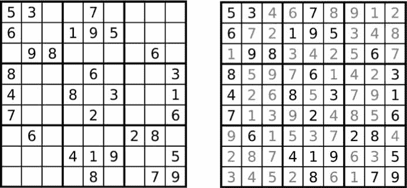
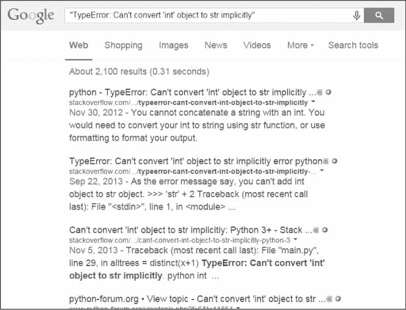

# 介绍

> 原文：<https://automatetheboringstuff.com/2e/chapter0/>

# 用 PYTHON 把枯燥的东西自动化

第二版

完全初学者实用编程

阿尔·斯威加特


旧金山

**用 PYTHON 自动化枯燥的东西，第二版。**版权所有 2020。

保留所有权利。未经版权所有者和出版商的事先书面许可，不得以任何形式或通过任何方式(电子或机械，包括影印、录制或通过任何信息存储或检索系统)复制或传播本作品的任何部分。

ISBN-10: 1-59327-992-2

出版商:威廉·波洛克
制作编辑:劳雷尔·春
封面插图:乔希·艾林森
室内设计:章鱼工作室
开发编辑:弗朗西丝·索克斯和简·卡什
技术审核:阿里·拉森斯基和菲利普·詹姆斯
文案编辑:金·温普塞特、布里特·博根和宝拉·l·弗莱明
排版:苏珊·格林纳特·史蒂文斯和丹妮尔·福斯特
校对:丽莎·德沃托·法雷尔和埃米莉·伯内特
索引员:BIM 索引和校对服务

关于发行、翻译或大批量销售的信息，请直接联系 No Starch Press，Inc .:

No Starch Press，Inc.
加利福尼亚州旧金山第八街 245 号，邮编 94103
电话:1 . 415 . 863 . 9900；【info@nostarch.com】T3
T5[www.nostarch.com](mailto:info@nostarch.com)

美国国会图书馆第一版的控制号是:2014953114

No Starch Press 和 No Starch Press 徽标是 No Starch Press，Inc .的注册商标。此处提及的其他产品和公司名称可能是其各自所有者的商标。我们不会在商标名称的每一处都使用商标符号，我们只是以编辑的方式使用名称，并且是为了商标所有人的利益，无意侵犯商标。

本书中的信息是在“原样”的基础上发布的，没有担保。尽管在本作品的准备过程中已采取了所有预防措施，但作者和 No Starch Press，Inc .均不对任何个人或实体因本作品中包含的信息直接或间接造成或据称造成的任何损失或损害承担任何责任。

本作品根据知识共享署名-非商业性使用-类似共享 3.0 美国许可证进行许可。要查看本许可证的副本，请访问*[http://creativecommons.org/licenses/by-nc-sa/3.0/us/](http://creativecommons.org/licenses/by-nc-sa/3.0/us/)*或致函美国加利福尼亚州山景城 1866 号邮政信箱 Creative Commons，邮编:94042。

## **关于作者**

Al Sweigart 是一名软件开发人员和技术书籍作者。Python 是他最喜欢的编程语言，他是该语言的几个开源模块的开发者。他的其他书籍可以在他的网站上根据知识共享许可免费获得。他的猫现在重 11 磅。

## **关于技术评审**

Philip James 从事 Python 工作已经超过十年，是 Python 社区的常客。他的演讲主题从 Unix 基础到开源社交网络。Philip 是 BeeWare 项目的核心贡献者，与他的伴侣 Nic 和她的猫 River 住在旧金山湾区。


“你刚刚在两个小时内完成了我们三个人需要两天才能完成的事情。”21 世纪初，我的大学室友在一家零售电子商店工作。偶尔，商店会收到来自其他商店的数千种产品价格的电子表格。一个由三名员工组成的团队会将电子表格打印在厚厚的一叠纸上，并在他们之间进行分配。对于每种产品的价格，他们会查找他们商店的价格，并注意到他们的竞争对手卖得更低的所有产品。通常需要几天时间。

“你知道，如果你有打印输出的原始文件，我可以写一个程序来做，”我的室友告诉他们，当他看到他们坐在地板上，文件散落一地。

几个小时后，他编写了一个短程序，从文件中读取竞争对手的价格，在商店的数据库中找到产品，并记录竞争对手是否更便宜。他还是编程新手，所以他花了大部分时间在一本编程书上查找文档。实际的程序运行只需要几秒钟。我的室友和他的同事那天吃了一顿超长的午餐。

这就是计算机编程的力量。电脑就像一把瑞士军刀，你可以为它配置无数的任务。许多人花几个小时点击和打字来完成重复的任务，没有意识到如果给他们正确的指令，他们正在使用的机器可以在几秒钟内完成工作。

### 这本书是给谁的？

软件是我们今天使用的许多工具的核心:几乎每个人都使用社交网络进行交流，许多人的手机中都有联网的计算机，大多数办公室工作都需要与计算机交互才能完成工作。因此，对会编码的人的需求激增。无数的书籍、交互式网络教程和开发人员训练营承诺将雄心勃勃的初学者变成年薪六位数的软件工程师。

这本书不适合那些人。是给其他人的。

就其本身而言，这本书不会把你变成一个专业的软件开发人员，就像几堂吉他课不会把你变成一个摇滚明星一样。但是，如果你是一名办公室职员、行政人员、学者或其他任何使用计算机工作或娱乐的人，你将学习编程的基础知识，这样你就可以自动完成如下简单的任务:

*   移动和重命名数以千计的文件，并将它们分类到文件夹中
*   填写在线表格—无需打字
*   每当网站更新时，从网站下载文件或复制文本
*   让您的电脑向您发送自定义通知
*   更新或格式化 Excel 电子表格
*   查看你的电子邮件，发送预先写好的回复

这些任务对人类来说很简单，但很耗时，而且它们通常如此琐碎或具体，以至于没有现成的软件来执行它们。然而，只要掌握一点编程知识，你就可以让你的计算机替你完成这些任务。

### **惯例**

这本书不是作为参考手册设计的；这是给初学者的指南。编码风格有时违背最佳实践(例如，一些程序使用全局变量)，但这是一种折衷，使代码更容易学习。这本书是为写一次性代码的人而写的，所以没有太多时间花在风格和优雅上。复杂的编程概念——如面向对象编程、列表理解和生成器——没有被涵盖，因为它们增加了复杂性。经验丰富的程序员可能会指出本书中的代码可以改变以提高效率的方法，但本书主要关注的是让程序以最少的努力工作。

### **什么是编程？**

电视节目和电影经常显示程序员在发光的屏幕上疯狂地输入 1 和 0 的神秘数据流，但现代编程并没有那么神秘。编程就是输入指令让计算机执行的行为。这些指令可能会处理一些数字，修改文本，在文件中查找信息，或通过互联网与其他计算机通信。

所有程序都使用基本指令作为构建模块。以下是一些最常见的英语单词:

*   “这样做；那就这么办。”
*   “如果此条件为真，则执行此操作；否则，请执行该操作。”
*   "这个动作做 27 次。"
*   "继续这样做，直到这个条件成立."

您也可以组合这些构件来实现更复杂的决策。例如，下面是用 Python 编程语言编写的简单程序的编程指令，称为*源代码*。从顶部开始，Python 软件运行每一行代码(一些行只在某个条件为真时运行*，或者*否则* Python 运行一些其他行)，直到它到达底部。*

```py
   passwordFile = open('SecretPasswordFile.txt') # ➊

   secretPassword = passwordFile.read() # ➋

   print('Enter your password.') # ➌

   typedPassword = input()

   if typedPassword == secretPassword: # ➍

      print('Access granted') # ➎

      if typedPassword == '12345': # ➏

          print('That password is one that an idiot puts on their luggage.') # ➐

  else:

      print('Access denied') # ➑
```

您可能对编程一无所知，但是您可能仅仅通过阅读就能对前面的代码做些什么做出合理的猜测。首先打开文件*secretpasswordfile . txt*➊，读取里面的秘密密码 ➋ 。然后，提示用户输入密码(从键盘) ➌ 。这两个密码被比较 ➍ ，如果它们相同，程序将*访问授权*打印到屏幕 ➎ 。接下来，程序检查密码是否是*12345*t16】➏，并提示这个选择可能不是密码 ➐ 的最佳选择。如果密码不相同，程序将*拒绝访问*打印到屏幕 ➑ 上。

#### ***什么是 Python？***

*Python* 是一种编程语言(具有用于编写被认为是有效的 Python 代码的语法规则)和读取源代码(用 Python 语言编写)并执行其指令的 Python 解释器软件。你可以在 https://python.org/免费下载 Python 解释器，有 Linux、macOS、Windows 版本。

Python 这个名字来自超现实主义的英国喜剧组合 Monty Python，而不是来自蛇。Python 程序员被亲切地称为 Pythonistas，Monty Python 和 serpentine 参考资料通常都是 pepper Python 教程和文档。

#### ***程序员不需要懂多少数学***

我听到的关于学习编程最常见的焦虑是认为它需要大量的数学知识。实际上，除了基本的算术，大多数编程不需要数学。事实上，擅长编程和擅长解数独谜题并没有什么不同。

要解决数独难题，必须在 9×9 棋盘的每一行、每一列和每个 3×3 的内部方块中填入数字 1 到 9。提供一些数字是为了给你一个开始，你可以通过根据这些数字进行推断来找到解决方案。在[图 0-1](#calibre_link-1611) 所示的拼图中，由于 5 出现在第一排和第二排，所以它不能再次出现在这几排。因此，在右上角的网格中，它必须位于第三行。由于最后一列中也有一个 5，所以 5 不能放在 6 的右边，所以它必须放在 6 的左边。解决一行、一列或一个正方形将为剩下的谜题提供更多的线索，当你填写一组数字 1 到 9，然后填写另一组数字时，你将很快解决整个网格。



*图 0-1:一个新的数独谜题(左)及其解答(右)。尽管使用数字，数独并不涉及太多数学。(图片维基共享资源)*

数独涉及数字并不意味着你必须擅长数学才能算出答案。编程也是如此。就像解决数独难题一样，编写程序包括将问题分解成单独的、详细的步骤。同样，当*调试*程序(也就是发现并修复错误)时，你会耐心地观察程序在做什么，并找到 bug 的原因。像所有技能一样，你编程越多，你就会变得越好。

#### ***活到老学到老编程***

我听到的关于学习编程的第二个最常见的焦虑是，人们认为他们太老了，学不了了。我在网上看到许多人的评论，他们认为对他们来说已经太晚了，因为他们已经(喘息！)23 岁。显然，学习编程还不算“太老”:许多人在晚年才开始学习。

要成为一名有能力的程序员，你不需要从小就开始。但是程序员作为神童的形象是持久不变的。不幸的是，当我告诉别人我开始编程时是在小学，我助长了这个神话。

然而，与 20 世纪 90 年代相比，现在学习编程要容易得多。今天，有更多的书，更好的搜索引擎，和更多的在线问答网站。最重要的是，编程语言本身更加用户友好。由于这些原因，**我在小学到高中毕业期间学到的所有编程知识，在今天大约十几个周末就能学会**。我的领先并不算领先。

对编程有一个“成长心态”是很重要的——换句话说，要明白人们通过实践来发展编程技能。他们不仅仅是天生的程序员，现在编程不熟练并不意味着你永远不能成为专家。

#### ***编程是一种创造性活动***

编程是一项创造性的任务，就像绘画、写作、编织或建造乐高城堡一样。就像画一张空白的画布，制作软件有很多约束，但有无限的可能性。

编程和其他创造性活动的区别在于，编程的时候，你的电脑里有你需要的所有原材料；你不需要购买任何额外的画布、颜料、胶片、纱线、乐高积木或电子元件。一台十年前的电脑功能强大，足以编写程序。一旦你的程序写好了，它可以被完美地复制无数次。一件毛衣一次只能由一个人穿，但是一个有用的程序可以很容易地在网上与全世界分享。

### **关于这本书**

这本书的第一部分涵盖了基本的 Python 编程概念，第二部分涵盖了可以让计算机自动完成的各种任务。第二部分的每一章都有专题项目供你研究。以下是你在每章中会发现的内容的简要概述。

**[第一部分:Python 编程基础知识](#calibre_link-88)**

**[第一章:Python 基础知识](#calibre_link-89)** 涵盖了表达式，Python 指令最基本的类型，以及如何使用 Python 交互式 shell 软件进行代码实验。

**[第二章:流量控制](#calibre_link-106)** 解释了如何让程序决定执行哪些指令，这样你的代码就可以智能地响应不同的条件。

**[第三章:函数](#calibre_link-132)** 指导你如何定义自己的函数，这样你就可以把代码组织成更易管理的块。

**[第四章:列表](#calibre_link-152)** 介绍列表数据类型，说明如何组织数据。

**[第 5 章:字典和结构化数据](#calibre_link-190)** 介绍了字典数据类型，并向您展示了更强大的数据组织方式。

**[第 6 章:操纵字符串](#calibre_link-207)** 涵盖了处理文本数据(在 Python 中称为*字符串*)。

**[第二部分:自动化任务](#calibre_link-237)**

**[第七章:正则表达式的模式匹配](#calibre_link-238)** 讲述了 Python 如何操作字符串和用正则表达式搜索文本模式。

**[第八章:输入验证](#calibre_link-47)** 解释了你的程序如何验证用户给它的信息，确保用户的数据以一种不会在程序的其余部分引起错误的格式到达。

**[第九章:读写文件](#calibre_link-32)** 解释了你的程序如何读取文本文件的内容并将信息保存到你硬盘上的文件中。

**[第十章:组织文件](#calibre_link-30)** 展示了 Python 如何比人类用户更快地复制、移动、重命名和删除大量文件。还解释了压缩和解压缩文件。

**[第十一章:调试](#calibre_link-349)** 展示了如何使用 Python 的各种 bug 查找和 bug 修复工具。

**[第十二章:网页抓取](#calibre_link-372)** 展示了如何编写能够自动下载网页并解析网页信息的程序。这就是所谓的*网页抓取*。

**[第 13 章:使用 Excel 电子表格](#calibre_link-418)** 涵盖了以编程方式操作 Excel 电子表格，这样你就不必阅读它们了。当您需要分析数百或数千个文档时，这很有帮助。

**[第 14 章:使用 Google Sheets](#calibre_link-457)** 讲述了如何使用 Python 读取和更新 Google Sheets，一个流行的基于 web 的电子表格应用程序。

**[第 15 章:使用 PDF 和 Word 文档](#calibre_link-477)** 涵盖了以编程方式读取 Word 和 PDF 文档。

**[第十六章:使用 CSV 文件和 JSON 数据](#calibre_link-505)** 继续解释如何以编程方式操作文档，现在讨论 CSV 和 JSON 文件。

**[第十七章:守时、调度任务、启动程序](#calibre_link-530)** 解释了 Python 程序如何处理时间和日期，以及如何调度你的计算机在特定时间执行任务。还展示了 Python 程序如何启动非 Python 程序。

**[第十八章:发送电子邮件和短信](#calibre_link-567)** 解释了如何编写可以代表你发送电子邮件和短信的程序。

**[第 19 章:操作图像](#calibre_link-608)** 解释了如何以编程方式操作图像，如 JPEG 或 PNG 文件。

**[第二十章:用 GUI 自动化控制键盘和鼠标](#calibre_link-634)** 解释了如何通过编程控制鼠标和键盘来自动化点击和按键。

**[附录 A:安装第三方模块](#calibre_link-2)** 向您展示了如何用有用的附加模块扩展 Python。

**[附录 B:运行程序](#calibre_link-35)** 向您展示了如何从代码编辑器之外在 Windows、macOS 和 Linux 上运行您的 Python 程序。

**[附录 C:练习题答案](#calibre_link-685)** 在每章末尾提供练习题的答案和一些附加的上下文。

### **下载安装 Python**

你可以在免费下载 Python for Windows，macOS，Ubuntu。如果你从网站的下载页面下载最新版本，这本书里的所有程序都可以运行。

**警告**

*一定要下载 Python 3 的某个版本(比如 3.8.0)。本书中的程序是为在 Python 3 上运行而编写的，在 Python 2 上可能无法正确运行。*

在下载页面上，您可以找到适用于每种操作系统的 64 位和 32 位计算机的 Python 安装程序，所以首先要弄清楚您需要哪个安装程序。如果你的电脑是在 2007 年或之后购买的，它很可能是 64 位系统。否则，您有一个 32 位版本，但以下是如何确定的方法:

*   在 Windows 上，选择**开始****控制面板****系统**，检查系统类型是 64 位还是 32 位。
*   在 macOS 上，进入苹果菜单，选择**关于这台 Mac****更多信息****系统报告****硬件**，然后查看处理器名称字段。如果它显示英特尔酷睿单核或英特尔酷睿双核，则您拥有的是 32 位机器。如果它说别的(包括 Intel Core 2 Duo)，你是 64 位机。
*   在 Ubuntu Linux 上，打开终端，运行命令 uname -m 。一个响应`i686`表示 32 位，`x86_64`表示 64 位。

在 Windows 上，下载 Python 安装程序(文件名将以*结尾)。msi* )并双击它。按照安装程序在屏幕上显示的说明安装 Python，如下所示:

1.  选择**为所有用户安装**，点击**下一步**。
2.  点击**下一步**，接受接下来几个窗口的默认选项。

在 macOS 上，下载*。适合您的 macOS 版本的 dmg* 文件并双击它。按照安装程序在屏幕上显示的说明安装 Python，如下所示:

1.  当 DMG 包在新窗口中打开时，双击 *Python.mpkg* 文件。您可能需要输入管理员密码。
2.  点击**继续**接受接下来几个窗口的默认选项，点击**同意**接受许可。
3.  在最后一个窗口，点击**安装**。

如果您运行的是 Ubuntu，您可以按照以下步骤从终端安装 Python:

1.  打开终端窗口。
2.  输入 sudo apt-get 安装 python3 。
3.  输入 sudo apt-get install idle3 。
4.  输入 sudo apt-get 安装 python3-pip 。

### **下载安装管理单元**

当 *Python 解释器*是运行你的 Python 程序的软件时， *Mu 编辑器软件*是你进入你的程序的地方，就像你在文字处理器中打字一样。可以从*T5【https://codewith.mu/】T6*下载穆。

在 Windows 和 macOS 上，下载适用于您的操作系统的安装程序，然后双击安装程序文件来运行它。如果您使用的是 macOS，运行安装程序会打开一个窗口，您必须将 Mu 图标拖到应用程序文件夹图标上才能继续安装。如果你用的是 Ubuntu，你需要把 Mu 作为 Python 包安装。在这种情况下，单击下载页面的 Python 包部分中的说明按钮。

### **起始管理部门**

安装完成后，让我们启动 Mu。

*   在 Windows 7 或更高版本上，单击屏幕左下角的开始图标，在搜索框中输入 Mu ，然后选择它。
*   在 macOS 上，打开 Finder 窗口，点击**应用**，然后点击 **mu-editor** 。
*   在 Ubuntu 上选择**应用****配件****终端**然后进入python 3–m mu。

Mu 第一次运行时，将出现一个选择模式窗口，其中包含 Adafruit CircuitPython、BBC micro:bit、Pygame Zero 和 Python 3 选项。选择 **Python 3** 。您可以随时通过单击编辑器窗口顶部的模式按钮来更改模式。

**注**

您需要下载 Mu 版本 1.10.0 或更高版本，以便安装本书中介绍的第三方模块。在撰写本文时，1.10.0 是一个 alpha 版本，在下载页面上作为一个独立于主要下载链接的链接列出。

### **起动怠速**

本书使用 Mu 作为编辑器和交互外壳。然而，您可以使用任意数量的编辑器来编写 Python 代码。集成开发和学习环境(IDLE) 软件随 Python 一起安装，如果出于某种原因你不能安装或运行 Mu，它可以作为第二个编辑器。我们现在开始闲着吧。

*   在 Windows 7 或更高版本上，点击屏幕左下角的开始图标，在搜索框中输入 IDLE ，选择 **IDLE (Python GUI)** 。
*   在 macOS 上，打开 Finder 窗口，点击**应用**，点击 **Python 3.8** ，然后点击空闲图标。
*   在 Ubuntu 上，选择**应用****配件****终端**，然后进入 idle3 。(您也可以点击屏幕顶部的**应用**，选择**编程**，然后点击**空闲 3** 。)

### **交互外壳**

当您运行 Mu 时，出现的窗口称为*文件编辑器*窗口。点击 REPL 按钮可以打开*交互外壳*。shell 是一种程序，可以让你在计算机中输入指令，就像 macOS 和 Windows 上的终端或命令提示符一样。Python 的交互式 shell 允许您输入运行 Python 解释器软件的指令。计算机读取你输入的指令并立即运行。

在 Mu 中，交互式外壳是窗口下半部分的一个窗格，包含以下文本:

```py
Jupyter QtConsole 4.3.1

Python 3.6.3 (v3.6.3:2c5fed8, Oct 3 2017, 18:11:49) [MSC v.1900 64 bit

(AMD64)]

Type 'copyright', 'credits' or 'license' for more information

IPython 6.2.1 -- An enhanced Interactive Python. Type '?' for help.

In [1]:
```

如果空闲运行，交互式 shell 是首先出现的窗口。它应该大部分是空白的，除了如下所示的文本:

```py
Python 3.8.0b1 (tags/v3.8.0b1:3b5deb0116, Jun 4 2019, 19:52:55) [MSC v.1916

64 bit (AMD64)] on win32

Type "help", "copyright", "credits" or "license" for more information.

>>>
```

`In [1]:`和`>>>`称为*提示*。本书中的例子将使用交互式 shell 的`>>>`提示符，因为它更常见。如果您从终端或命令提示符运行 Python，他们也会使用`>>>`提示符。`In [1]:`提示符是由另一个流行的 Python 编辑器 Jupyter Notebook 发明的。

例如，在提示符旁边的交互式 shell 中输入以下内容:

```py
>>> print('Hello, world!')
```

在您键入该行并按下 <small class="calibre11">ENTER</small> 之后，交互式 shell 应该显示以下响应:

```py
>>> print('Hello, world!')

Hello, world!
```

你只是给了计算机一个指令，它就做了你告诉它做的事情！

### **安装第三方模块**

一些 Python 代码要求您的程序导入模块。其中一些模块是 Python 自带的，但其他模块是由 Python 核心开发团队之外的开发人员创建的第三方模块。[附录 A](#calibre_link-2) 详细说明了如何使用`pip`程序(Windows 上)或`pip3`程序(macOS 和 Linux 上)安装第三方模块。当这本书指导你安装特定的第三方模块时，请查阅[附录 A](#calibre_link-2) 。

### **如何寻求帮助**

程序员倾向于通过在互联网上搜索问题的答案来学习。这与许多人习惯的学习方式大相径庭——通过亲自授课并能回答问题的老师。把互联网作为教室的好处在于，有整个社区的人可以回答你的问题。的确，你的问题很可能已经有人回答了，答案就在网上等着你去寻找。如果您遇到一个错误消息或在使您的代码工作时遇到困难，您不会是第一个遇到问题的人，并且找到解决方案比您想象的要容易。

比如我们故意造成一个错误:在交互 shell 中输入‘42’+3。您现在不需要知道这条指令是什么意思，但是结果应该是这样的:

```py
   >>> '42' + 3

   Traceback (most recent call last): # ➊

     File "<pyshell#0>", line 1, in <module>

       '42' + 3

   TypeError: Can't convert 'int' object to str implicitly # ➋

   >>>
```

出现错误消息 ➋ 是因为 Python 无法理解你的指令。错误消息的回溯部分 ➊ 显示了 Python 遇到问题的具体指令和行号。如果您不确定如何理解某个特定的错误信息，请在线搜索。输入**“类型错误:无法将‘int’对象隐式转换为 str”**(包括引号)到你最喜欢的搜索引擎中，你应该会看到大量的链接解释错误信息的含义以及导致错误的原因，如图[图 0-2](#calibre_link-1612) 所示。



图 0-2:错误信息的谷歌搜索结果非常有用。

你会经常发现其他人和你有同样的问题，而且其他一些乐于助人的人已经回答了这个问题。没有人能了解编程的所有知识，所以寻找技术问题的答案是任何软件开发人员日常工作的一部分。

### **询问智能编程问题**

如果你在网上搜索不到答案，可以试着在 Stack Overflow(*[【https://stackoverflow.com/】](https://stackoverflow.com/)*)或*[【https://reddit.com/r/learnprogramming/】](https://reddit.com/r/learnprogramming/)*的“学习编程”子栏目中找人问问。但是请记住，有一些聪明的方法可以询问编程问题，帮助别人帮助你。首先，请务必阅读这些网站上的常见问题部分，了解张贴问题的正确方式。

询问编程问题时，请记住执行以下操作:

*   解释你正在努力做什么，而不仅仅是你做了什么。这让你的助手知道你是否在错误的轨道上。
*   指定错误发生的点。它是在程序开始时发生，还是在你做了某个动作后才发生？
*   Copy and paste the *entire* error message and your code to *[https://pastebin.com/](https://pastebin.com/)* or *[https://gist.github.com/](https://gist.github.com/)*.

    这些网站使得在线与人分享大量代码变得容易，而不会丢失任何文本格式。然后，您可以将发布代码的 URL 放在您的电子邮件或论坛帖子中。举个例子，这里有一些我上传的代码:*[【https://pastebin.com/SzP2DbFx/】](https://pastebin.com/SzP2DbFx/)*和*[【https://gist.github.com/asweigart/6912168/】](https://gist.github.com/asweigart/6912168/)*。

*   解释你已经尝试做了什么来解决你的问题。这告诉人们你已经做了一些工作来自己解决问题。
*   列出你正在使用的 Python 版本。(第 2 版 Python 解释器和第 3 版 Python 解释器之间有一些关键区别。)另外，说出你运行的是哪个操作系统和版本。
*   如果错误是在您更改代码后出现的，请准确解释您更改了什么。
*   说你是否能在每次运行程序时重现错误，或者它是否只在你执行某些操作后才发生。如果是后者，请解释这些行为是什么。

也要始终遵循良好的在线礼仪。例如，不要把你的问题全部大写，或者对试图帮助你的人提出不合理的要求。

你可以在位于*[【https://autbor.com/help/】](https://autbor.com/help/)*的博客中找到更多关于如何寻求编程帮助的信息。你可以在 https://www.reddit.com/r/learnprogramming/wiki/faq/的找到一个关于编程的常见问题列表，以及在 https://www.reddit.com/r/cscareerquestions/wiki/index/的找到一份软件开发工作的类似列表。

我喜欢帮助人们发现 Python。我在 https://inventwithpython.com/blog/*[的博客上写编程教程，有问题可以在 al@inventwithpython.com联系我。尽管如此，如果你把你的问题发到https://reddit.com/r/inventwithpython/，你可能会得到更快的回复。](https://inventwithpython.com/blog/)*

### **总结**

对于大多数人来说，他们的电脑只是一个电器而不是一个工具。但是通过学习如何编程，你将获得现代世界中最强大的工具之一，并且你将在这个过程中获得乐趣。编程不是脑外科手术——业余爱好者尝试和犯错误是可以的。

这本书假设你没有编程知识，会教你很多，但你可能会有超出范围的问题。请记住，提出有效的问题并知道如何找到答案是您编程之旅中的无价工具。

我们开始吧！