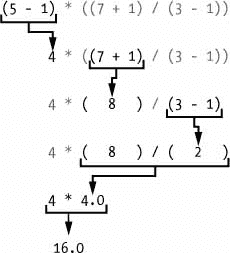
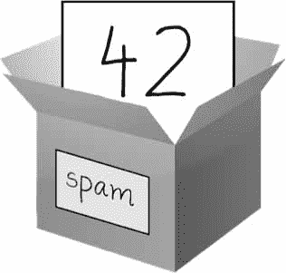
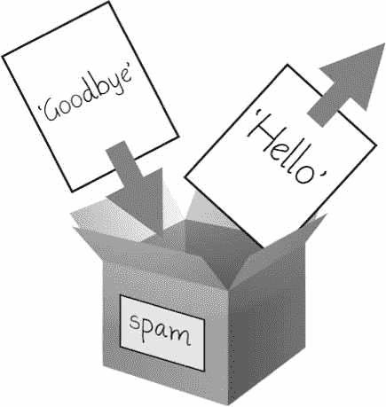
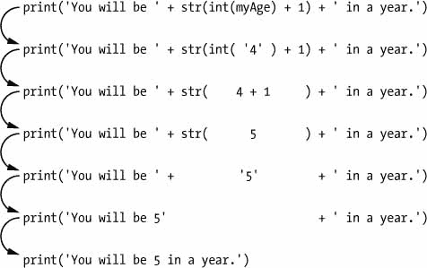

# 1 PYTHON 基础知识

> 原文：<https://automatetheboringstuff.com/2e/chapter1/>


Python 编程语言具有广泛的语法结构、标准库函数和交互式开发环境特性。幸运的是，你可以忽略其中的大部分；你只需要学会足够多的东西来编写一些方便的小程序。

但是，在做任何事情之前，您必须学习一些基本的编程概念。就像一个训练中的巫师，你可能认为这些概念看起来神秘而乏味，但是通过一些知识和实践，你将能够像一根魔杖一样指挥你的计算机并完成令人难以置信的壮举。

本章有几个例子，鼓励你输入到*交互Shell*，也称为`REPL` (读取-评估-打印循环)，它让你一次运行(或*执行*)一条 Python 指令，并立即向你显示结果。使用交互式 shell 对于学习基本的 Python 指令是非常有用的，所以在学习过程中可以尝试一下。你所做的事情会比你只读的东西更容易记住。

### 将表达式输入交互Shell

您可以通过启动 Mu 编辑器来运行交互式 shell，在阅读前言中的安装说明时，您应该已经下载了 Mu 编辑器。在 Windows 上，打开“开始”菜单，键入“Mu”，然后打开 Mu 应用程序。在 macOS 上，打开应用程序文件夹，双击 *`Mu`* 。点击**新建**按钮，保存一个空文件为`blank.py`。当您通过单击**运行**按钮或按下`F5`来运行这个空白文件时，它将打开交互式 shell，该 shell 将作为一个新窗格在 Mu 编辑器窗口的底部打开。您应该会在交互式 shell 中看到一个`>>>`提示。

在提示符下输入 2 + 2 ，让 Python 做一些简单的数学运算。管理部门窗口现在应该如下所示:

```py
>>> 2 + 2

4

>>>
```

在 Python 中，`2 + 2`被称为*表达式*，这是该语言中最基本的一种编程指令。表达式由*值*(如`2`)和*运算符*(如`+`)组成，它们总能*将*(即 reduce)计算下来为单个值。这意味着您可以在 Python 代码中任何可以使用值的地方使用表达式。

在前面的示例中，`2 + 2`被向下计算为单个值`4`。没有运算符的单个值也被视为表达式，尽管它只计算自身，如下所示:

```py
>>> 2

2
```

错误是可以接受的！

如果程序包含计算机无法理解的代码，程序将会崩溃，这将导致 Python 显示一条错误消息。不过，错误信息不会让你的电脑崩溃，所以不要害怕犯错。*崩溃*仅仅意味着程序意外停止运行。

如果您想了解有关错误的更多信息，可以在线搜索准确的错误消息文本以获取更多信息。您也可以查看位于[`nostarch.com/automatestuff2`](https://nostarch.com/automatestuff2/)的参考资料，查看常见 Python 错误消息及其含义的列表。

在 Python 表达式中，你也可以使用大量的其他操作符。例如，表 1-1 列出了 Python 中所有的数学运算符。

**表 1-1**： 从最高到最低优先级的数学运算符


| **运算符** | **操作** | **例子** | **求值为...** |
| --- | --- | --- | --- |
| `**` | 指数 | `2 ** 3` | `8` |
| `%` | 模数/余数 | `22 % 8` | `6` |
| `//` | 整数/地板除法 | `22 // 8` | `2` |
| `/` | 除法 | `22 / 8` | `2.75` |
| `*` | 乘法 | `3 * 5` | `15` |
| `-` | 减法 | `5 - 2` | `3` |
| `+` | 加法 | `2 + 2` | `4` |

Python 数学运算符的*运算顺序*(也称为*优先级*)类似于数学。首先计算`**`运算符；接下来从左到右计算`*`、`/`、`//`和`%`操作符；最后评估`+`和`-`运算符(也是从左到右)。如果需要，可以使用括号来覆盖通常的优先级。运算符和值之间的空格对 Python 来说无关紧要(除了行首的缩进)，但是单个空格是惯例。在交互式 shell 中输入以下表达式:

```py
>>> 2 + 3 * 6

20

>>> (2 + 3) * 6

30

>>> 48565878 * 578453

28093077826734

>>> 2 ** 8

256

>>> 23 / 7

3.2857142857142856

>>> 23 // 7

3

>>> 23 % 7

2

>>> 2      +           2

4

>>> (5 - 1) * ((7 + 1) / (3 - 1))

16.0
```

在每种情况下，作为程序员的你必须输入表达式，但是 Python 做了最困难的部分，将它计算成单个值。Python 会一直计算表达式的各个部分，直到它变成单个值，如下所示:



这些将操作符和值放在一起形成表达式的规则是 Python 作为编程语言的基础部分，就像帮助我们交流的语法规则一样。这里有一个例子:

这是一个语法正确的英语句子。

这是一个语法错误的句子

第二行很难解析，因为它不符合英语的规则。同样，如果您输入了错误的 Python 指令，Python 将无法理解它，并将显示一条`SyntaxError`错误消息，如下所示:

```py
>>> 5 +

  File "<stdin>", line 1

    5 +

      ^

SyntaxError: invalid syntax

>>> 42 + 5 + * 2

  File "<stdin>", line 1

    42 + 5 + * 2

             ^

SyntaxError: invalid syntax
```

您可以通过在交互式 shell 中输入指令来测试指令是否有效。不要担心损坏计算机:最坏的情况是 Python 会响应一条错误消息。专业软件开发人员在编写代码时总是会收到错误消息。

### 整数、浮点和字符串数据类型

请记住，表达式只是由运算符组合而成的值，它们总是向下计算为单个值。*数据类型*是值的类别，每个值都属于一种数据类型。Python 中最常见的数据类型在表 1-2 中列出。例如，值`-2`和`30`据说是*整数*值。integer(或`int` )数据类型表示整数值。带小数点的数字，如`3.14`，称为*浮点*(或*浮点数*)。注意，即使值`42`是一个整数，值`42.0`也是一个浮点数。

**表 1-2**： 常用数据类型


| **数据类型** | **示例** |
| --- | --- |
| 整数 | `-2`、`-1`、`0`、`1`、`2`、`3`、`4`、`5` |
| 浮点数 | `-1.25`、`-1.0`、`-0.5`、`0.0`、`0.5`、`1.0`、`1.25` |
| 字符串 | `'a'`、`'aa'`、`'aaa'`、`'Hello!'`、`'11 cats'` |

Python 程序也可以有称为*字符串*或`strs`的文本值。始终用单引号(`'`)字符将字符串括起来(如`'Hello'`或`'Goodbye cruel world!'`)，这样 Python 就知道字符串的开始和结束位置。你甚至可以有一个没有字符的字符串，`''`，称为*空字符串*或*空串*。字符串在第 4 章的中有更详细的解释。

如果您看到错误消息`SyntaxError: EOL while scanning string literal`，您可能忘记了字符串末尾的最后一个单引号字符，如下例所示:

```py
>>> 'Hello, world!

SyntaxError: EOL while scanning string literal
```

### 字符串串联和复制

运算符的含义可能会根据它旁边的值的数据类型而变化。例如，当对两个整数或浮点值进行运算时，`+`是加法运算符。然而，当`+`用于两个字符串值时，它作为*字符串连接*操作符连接字符串。在交互式 shell 中输入以下内容:

```py
>>> 'Alice' + 'Bob'

'AliceBob'
```

该表达式计算出一个新的字符串值，该值组合了两个字符串的文本。但是，如果您试图对一个字符串和一个整数值使用`+`操作符，Python 将不知道如何处理这种情况，它将显示一条错误消息。

```py
>>> 'Alice' + 42

Traceback (most recent call last):

  File "<pyshell#0>", line 1, in <module>

    'Alice' + 42

TypeError: can only concatenate str (not "int") to str
```

错误消息`can only concatenate str (not "int") to str`意味着 Python 认为您试图将一个整数连接到字符串`'Alice'`上。您的代码必须显式地将整数转换为字符串，因为 Python 不能自动完成这项工作。(当我们讨论`str()`、`int()`和`float()`函数时，转换数据类型将在第 13 页的剖析您的程序中解释。)

`*`运算符将两个整数值或浮点数值相乘。但是当`*`操作符用于一个字符串值和一个整数值时，它就变成了*字符串复制*操作符。在交互式 shell 中输入一个乘以一个数字的字符串，以查看实际效果。

```py
>>> 'Alice' * 5

'AliceAliceAliceAliceAlice'
```

该表达式计算出单个字符串值，该字符串值重复原始字符串的次数等于整数值。字符串复制是一个有用的技巧，但是它不像字符串连接那样常用。

`*`运算符只能用于两个数值(用于乘法)，或者一个字符串值和一个整数值(用于字符串复制)。否则，Python 只会显示一条错误消息，如下所示:

```py
>>> 'Alice' * 'Bob'

Traceback (most recent call last):

  File "<pyshell#32>", line 1, in <module>

    'Alice' * 'Bob'

TypeError: can't multiply sequence by non-int of type 'str'

>>> 'Alice' * 5.0

Traceback (most recent call last):

  File "<pyshell#33>", line 1, in <module>

    'Alice' * 5.0

TypeError: can't multiply sequence by non-int of type 'float'
```

Python 不理解这些表达式是有道理的:你不能将两个单词相乘，并且很难将任意字符串复制分数次。

### 在变量中存储值

*变量*就像计算机内存中的一个盒子，你可以在里面存储一个单一的值。如果您想在程序中稍后使用计算表达式的结果，可以将它保存在变量中。

#### 赋值语句

您将使用*赋值语句*将值存储在变量中。赋值语句由变量名、等号(称为*赋值操作符*)和要存储的值组成。如果你输入赋值语句`spam = 42`，那么一个名为`spam`的变量将存储整数值`42`。

把一个变量想象成一个有标签的盒子，一个值被放在里面，如图图 1-1 。



图 1-1: spam = 42 就像告诉程序，“变量 spam 现在里面有了整数值 42 ”

例如，在交互式 shell 中输入以下内容:

```py
   >>> spam = 40 # ➊

   >>> spam

   40

   >>> eggs = 2

   >>> spam + eggs # ➋

   42

   >>> spam + eggs + spam

   82

   >>> spam = spam + 2 # ➌

   >>> spam

   42
```

变量在第一次存储值 ➊ 时被*初始化*(或创建)。之后，你可以在带有其他变量和值的表达式中使用它 ➋ 。当一个变量被赋予一个新值 ➌ 时，旧值就被遗忘了，这就是为什么在例子的最后`spam`被求值为`42`而不是`40`。这叫做*覆盖*变量。在交互式 shell 中输入以下代码，尝试覆盖一个字符串:

```py
>>> spam = 'Hello'

>>> spam

'Hello'

>>> spam = 'Goodbye'

>>> spam

'Goodbye'
```

就像图 1-2 中的框一样，本例中的`spam`变量存储`'Hello'`，直到你用`'Goodbye'`替换字符串。



图 1-2:当一个新值赋给一个变量时，旧值被遗忘。

#### 变量名

一个好的变量名描述了它包含的数据。想象一下，你搬到了一所新房子，并把你所有的搬家箱子都贴上了*物品*的标签。你永远找不到任何东西！本书的大多数例子(以及 Python 的文档)都使用了通用的变量名，如`spam`、`eggs`和`bacon`，这些名字来自于 Monty Python 的“垃圾邮件”草图。但是在你的程序中，一个描述性的名字将有助于你的代码更加易读。

虽然你几乎可以给你的变量起任何名字，但是 Python 确实有一些命名限制。表 1-3 给出了合法变量名的例子。只要符合以下三条规则，您可以将变量命名为任何名称:

*   它只能是一个没有空格的单词。
*   它只能使用字母、数字和下划线(`_`)字符。
*   它不能以数字开头。

**表 1-3**： 有效和无效的变量名


| **有效的变量名** | **无效的变量名** |
| --- | --- |
| `current_balance` | `current-balance`(不允许使用连字符) |
| `currentBalance` | `current balance`(不允许有空格) |
| `account4` | `4account`(不能以数字开头) |
| `_42` | `42`(不能以数字开头) |
| `TOTAL_SUM` | `TOTAL_$UM`(不允许使用`$`等特殊字符) |
| `hello` | `'hello'`(不允许使用`'`等特殊字符) |

变量名区分大小写，这意味着`spam`、`SPAM`、`Spam`和`sPaM`是四个不同的变量。虽然`Spam`是一个可以在程序中使用的有效变量，但是 Python 的惯例是以小写字母开始变量。

这本书使用*驼峰*作为变量名，而不是下划线；也就是变量`lookLikeThis`而不是`looking_like_this`。一些有经验的程序员可能会指出，官方的 Python 代码风格 PEP 8 说应该使用下划线。我更喜欢《骆驼祥子》,并指出 PEP 8 中的“愚蠢的一致性是小心灵的恶魔”部分:

与风格指南保持一致很重要。但最重要的是:知道什么时候不一致——有时风格指南并不适用。当有疑问时，使用你最好的判断。

### 你的第一个节目

虽然交互式 shell 适合一次运行一条 Python 指令，但是要编写整个 Python 程序，您需要将指令输入到文件编辑器中。*文件编辑器*类似于记事本或 TextMate 等文本编辑器，但它有一些专门用于输入源代码的特性。要在 Mu 中打开一个新文件，点击最上面一行的**新建**按钮。

出现的窗口应该包含一个等待您输入的光标，但它不同于交互式 shell，后者在您按下`ENTER`后立即运行 Python 指令。文件编辑器让你输入许多指令，保存文件，并运行程序。以下是如何区分这两者的方法:

*   交互式 shell 窗口将总是带有`>>>`提示符的窗口。
*   文件编辑器窗口不会有`>>>`提示。

现在是时候创建你的第一个程序了！当文件编辑器窗口打开时，在其中输入以下内容:

```py
   # This program says hello and asks for my name. # ➊

   print('Hello, world!') # ➋

   print('What is your name?')    # ask for their name

   myName = input() # ➌

   print('It is good to meet you, ' + myName) # ➍

   print('The length of your name is:') # ➎

   print(len(myName))

   print('What is your age?')    # ask for their age # ➏

   myAge = input()

   print('You will be ' + str(int(myAge) + 1) + ' in a year.')
```

一旦你输入了你的源代码，保存它，这样你就不必在每次启动 Mu 的时候重新输入。点击**保存**按钮，在文件名字段输入`hello.py`，然后点击**保存**。

当你打字时，你应该每隔一段时间保存你的程序。这样，如果计算机崩溃或您意外退出 Mu，您不会丢失代码。作为一种快捷方式，你可以在 Windows 和 Linux 上按下`CTRL` -S 或者在 macOS 上按下 -S 来保存你的文件。

一旦你保存，让我们运行我们的程序。按下`F5`键。您的程序应该在交互式 shell 窗口中运行。记住，你必须在文件编辑器窗口中按`F5`，而不是在交互式 shell 窗口中。当你的程序要求时，输入你的名字。交互式 shell 中的程序输出应该如下所示:

```py
Python 3.7.0b4 (v3.7.0b4:eb96c37699, May  2 2018, 19:02:22) [MSC v.1913 64 bit

(AMD64)] on win32

Type "copyright", "credits" or "license()" for more information.

>>> ================================ RESTART ================================

>>>

Hello, world!

What is your name?

Al

It is good to meet you, Al

The length of your name is:

2

What is your age?

4

You will be 5 in a year.

>>>
```

当没有更多的代码行要执行时，Python 程序*终止*；也就是停止运行。(你也可以说 Python 程序*退出*。)

您可以通过单击窗口顶部的 X 关闭文件编辑器。要重新加载已保存的程序，选择**文件 -> 打开...**从菜单中。现在这样做，在出现的窗口中，选择 **`hello.py`** 并点击**打开**按钮。您之前保存的`hello.py`程序应该会在文件编辑器窗口中打开。

您可以在使用 Python Tutor 可视化工具查看程序的执行情况。你可以在[`autbor.com/hellopy`](https://autbor.com/hellopy/)看到这个特定程序的执行。单击前进按钮浏览程序执行的每个步骤。您将能够看到变量值和输出是如何变化的。

### 剖析你的程序

在文件编辑器中打开新程序后，让我们通过查看每行代码的作用来快速浏览一下它使用的 Python 指令。

#### 评论

下面这一行叫做*注释*。

```py
   # This program says hello and asks for my name. # ➊
```

Python 会忽略注释，你可以用它们来写笔记或者提醒自己代码试图做什么。散列标记(`#`)后面的其余行的任何文本都是注释的一部分。

有时候，程序员会在一行代码前加一个`#`，在测试一个程序的时候临时去掉。这被称为*注释*代码，当你试图找出一个程序不工作的原因时，这很有用。当您准备好将线放回原位时，可以移除`#`。

Python 也会忽略注释后的空行。您可以在程序中添加任意数量的空行。这可以让你的代码更容易阅读，就像书中的段落一样。

#### 打印()功能

`print()`函数在屏幕上显示括号内的字符串值。

```py
   print('Hello, world!') # ➋

   print('What is your name?') # ask for their name
```

行`print('Hello, world!')`表示“打印出字符串`'Hello, world!'`中的文本。”当 Python 执行这一行时，你说 Python *调用*`print()`函数，字符串值*传递*给函数。传递给函数调用的值是*参数*。注意报价没有打印到屏幕上。它们只是标记字符串的开始和结束位置；它们不是字符串值的一部分。

> 注
>
> 你也可以用这个功能在屏幕上放一个空行；只需调用`print()`,括号之间不加任何内容。

当您编写函数名时，末尾的左括号和右括号将其标识为函数名。这就是为什么在这本书里，你会看到`print()`而不是`print`。第 3 章更详细地描述了功能。

#### 输入()函数

`input()`功能等待用户在键盘上键入一些文本并按下`Enter`。

```py
   myName = input() # ➌
```

这个函数调用计算出一个等于用户文本的字符串，该行代码将`myName`变量赋给这个字符串值。

您可以将`input()`函数调用视为一个表达式，它计算用户输入的任何字符串。如果用户输入了`'Al'`，那么表达式的结果将是`myName = 'Al'`。

如果您调用`input()`并看到一条类似于`NameError: name 'Al' is not defined`的错误消息，问题是您正在用 Python 2 而不是 Python 3 运行代码。

#### 打印用户姓名

下面对`print()`的调用实际上包含括号中的表达式`'It is good to meet you, ' + myName`。

```py
   print('It is good to meet you, ' + myName) # ➍
```

请记住，表达式总是可以计算出单个值。如果`'Al'`是存储在线 ➌ 的`myName`中的值，则该表达式的计算结果为`'It is good to meet you, Al'`。然后，这个字符串值被传递给`print()`，它在屏幕上打印出来。

#### len()函数

您可以向`len()`函数传递一个字符串值(或包含一个字符串的变量)，该函数将计算该字符串中字符数的整数值。

```py
   print('The length of your name is:') # ➎

   print(len(myName))
```

在交互式 shell 中输入以下内容进行尝试:

```py
>>> len('hello')

5

>>> len('My very energetic monster just scarfed nachos.')

46

>>> len('')

0
```

就像那些例子一样，`len(myName)`的值是一个整数。然后，它被传递到`print()`以显示在屏幕上。`print()`函数允许您传递整数值或字符串值，但是请注意当您在交互式 shell 中键入以下内容时出现的错误:

```py
 >>> print('I am ' + 29 + ' years old.')

Traceback (most recent call last):

  File "<pyshell#6>", line 1, in <module>

    print('I am ' + 29 + ' years old.')

TypeError: can only concatenate str (not "int") to str
```

这个错误不是由`print()`函数引起的，而是您试图传递给`print()`的表达式引起的。如果您在交互式 shell 中单独键入表达式，也会得到同样的错误消息。

```py
>>> 'I am ' + 29 + ' years old.'

Traceback (most recent call last):

  File "<pyshell#7>", line 1, in <module>

    'I am ' + 29 + ' years old.'

TypeError: can only concatenate str (not "int") to str
```

Python 给出了一个错误，因为`+`操作符只能用于将两个整数相加或连接两个字符串。你不能把一个整数加到一个字符串上，因为这在 Python 中是不合语法的。您可以通过使用整数的字符串版本来解决这个问题，这将在下一节中解释。

#### str()、int()和 float()函数

如果您想将一个整数(如`29`)与一个字符串连接起来传递给`print()`，您需要获取值`'29'`，它是`29`的字符串形式。可以向`str()`函数传递一个整数值，该函数将计算该整数的字符串值版本，如下所示:

```py
>>> str(29)

'29'

>>> print('I am ' + str(29) + ' years old.')

I am 29 years old.
```

因为`str(29)`求值为`'29'`，所以表达式`'I am ' + str(29) + ' years old.'`求值为`'I am ' + '29' + ' years old.'`，T3 又求值为`'I am 29 years old.'`。这是传递给`print()`函数的值。

`str()`、`int()`和`float()`函数将分别计算您传递的值的字符串、整数和浮点形式。尝试用这些函数在交互式 shell 中转换一些值，看看会发生什么。

```py
>>> str(0)

'0'

>>> str(-3.14)

'-3.14'

>>> int('42')

42

>>> int('-99')

-99

>>> int(1.25)

1

>>> int(1.99)

1

>>> float('3.14')

3.14

>>> float(10)

10.0
```

前面的例子调用了`str()`、`int()`和`float()`函数，并将其他数据类型的值传递给它们，以获得这些值的字符串、整数或浮点形式。

当您想要将一个整数或浮点数连接成一个字符串时，`str()`函数非常方便。如果您有一个数字作为字符串值，并希望在某些数学中使用，那么`int()`函数也很有帮助。例如，`input()`函数总是返回一个字符串，即使用户输入一个数字。在交互 shell 中输入 spam = input() 并在它等待您的文本时输入 101 。

```py
>>> spam = input()

101

>>> spam

'101'
```

存储在`spam`中的值不是整数`101`，而是字符串`'101'`。如果您想使用`spam`中的值进行数学运算，请使用`int()`函数获得`spam`的整数形式，然后将其作为新值存储在`spam`中。

```py
>>> spam = int(spam)

>>> spam

101
```

现在，您应该能够将`spam`变量视为一个整数而不是一个字符串。

```py
>>> spam * 10 / 5

202.0
```

请注意，如果您向`int()`传递一个它不能作为整数计算的值，Python 将显示一条错误消息。

```py
>>> int('99.99')

Traceback (most recent call last):

  File "<pyshell#18>", line 1, in <module>

    int('99.99')

ValueError: invalid literal for int() with base 10: '99.99'

>>> int('twelve')

Traceback (most recent call last):

  File "<pyshell#19>", line 1, in <module>

    int('twelve')

ValueError: invalid literal for int() with base 10: 'twelve'
```

如果您需要向下舍入浮点数，那么`int()`函数也很有用。

```py
>>> int(7.7)

7

>>> int(7.7) + 1

8
```

您在程序的最后三行中使用了`int()`和`str()`函数来获取代码的适当数据类型的值。

```py
   print('What is your age?') # ask for their age # ➏

   myAge = input()

   print('You will be ' + str(int(myAge) + 1) + ' in a year.')
```

**文本和数字等价**

虽然数字的字符串值被认为是与整数或浮点版本完全不同的值，但整数可以等于浮点。

```py
>>> 42 == '42'

False

>>> 42 == 42.0

True

>>> 42.0 == 0042.000

True
```

Python 做出这种区分是因为字符串是文本，而整数和浮点数都是数字。

`myAge`变量包含从`input()`返回的值。因为`input()`函数总是返回一个字符串(即使用户键入一个数字)，所以可以使用`int(myAge)`代码在`myAge`中返回该字符串的一个整数值。该整数值然后被加到表达式`int(myAge) + 1`中的`1`。

这个加法的结果被传递给`str()`函数:`str(int(myAge) + 1)`。然后，返回的字符串值与字符串`'You will be '`和`' in a year.'`连接在一起，计算出一个大的字符串值。这一大串最终传递给`print()`在屏幕上显示。

假设用户为`myAge`输入字符串`'4'`。字符串`'4'`被转换成一个整数，所以你可以给它加一。结果是`5`。`str()`函数将结果转换回字符串，因此您可以将它与第二个字符串`'in a year.'`连接起来，创建最终的消息。这些评估步骤如下所示:



### 总结

您可以使用计算器计算表达式，或者使用文字处理器输入字符串连接。您甚至可以通过复制和粘贴文本来轻松地进行字符串复制。但是表达式及其组成值——操作符、变量和函数调用——是构成程序的基本构件。一旦您知道如何处理这些元素，您就能够指示 Python 为您处理大量数据。

记住不同类型的运算符(`+`、`-`、`*`、`/`、`//`、`%`和`**`用于数学运算，以及`+`和`*`用于字符串运算)和本章介绍的三种数据类型(整数、浮点数和字符串)是很有好处的。

我还介绍了一些不同的函数。`print()`和`input()`函数处理简单的文本输出(到屏幕)和输入(从键盘)。`len()`函数接受一个字符串，并计算该字符串中字符数的整数倍。`str()`、`int()`和`float()`函数将计算传递给它们的值的字符串、整数或浮点数形式。

在下一章中，你将学习如何告诉 Python 做出明智的决定，根据它的值决定运行什么代码，跳过什么代码，重复什么代码。这就是所谓的*流量控制*，它允许你编写做出明智决定的程序。

### 练习题

1 。下列哪些是运算符，哪些是值？

*
‘你好’
-88.8
-
/
+
5

2 。下面哪个是变量，哪个是字符串？

垃圾邮件
【垃圾邮件】

3 。说出三种数据类型。

4 。表达式是由什么组成的？所有的表达式都是做什么的？

5 。本章介绍了赋值语句，如`spam = 10`。表达式和语句的区别是什么？

6 。以下代码运行后，变量`bacon`包含什么？

培根= 20
培根+ 1

7 。下面两个表达式应该求值为什么？

“垃圾邮件”+“垃圾邮件” 【垃圾邮件】* 3

8 。为什么`eggs`是有效变量名而`100`无效？

9 。哪三个函数可用于获取值的整数、浮点数或字符串版本？

10 。为什么这个表达会导致错误？你能如何修理它？

我吃过“+ 99 +”的卷饼。”

**额外奖励**：在线搜索关于`len()`函数的 Python 文档。它将出现在一个名为“内置函数”的网页上浏览 Python 拥有的其他函数列表，查找`round()`函数的功能，并在交互式 shell 中试验它。