# 2 流程控制

> 原文：<https://automatetheboringstuff.com/2e/chapter2/>


所以，你知道单个指令的基本原理，程序就是一系列指令。但是编程的真正优势不仅仅是像周末跑腿一样一个接一个地运行指令。根据表达式的求值方式，程序可以决定跳过指令，重复指令，或者从几条指令中选择一条来运行。事实上，你几乎从来不希望你的程序从第一行代码开始，简单地执行每一行，一直到最后。*流程控制语句*可以决定在什么条件下执行哪些 Python 指令。

这些流程控制语句直接对应于流程图中的符号，所以我将提供本章中讨论的代码的流程图版本。图 2-1 显示了下雨时该做什么的流程图。沿着箭头所指的路线从头到尾走。

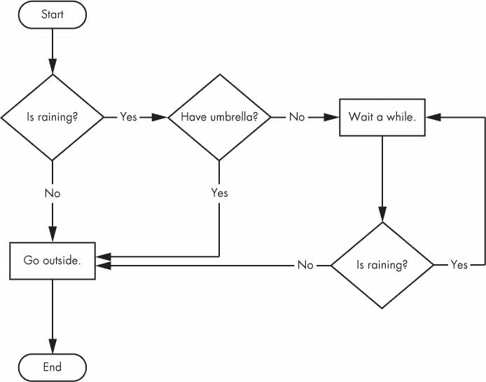

图 2-1：告诉你如果下雨该怎么做的流程图

在一个流程图中，从起点到终点通常有不止一条路线。计算机程序中的代码行也是如此。流程图用菱形表示这些分支点，而其他步骤用矩形表示。开始和结束步骤用圆角矩形表示。

但是在学习流程控制语句之前，你首先需要学习如何表示那些*是*和*否*选项，并且你需要理解如何将那些分支点写成 Python 代码。为此，让我们研究一下布尔值、比较运算符和布尔运算符。

### 布尔值

整数、浮点和字符串数据类型有无限多的可能值，而*布尔*数据类型只有两个值：`True`和`False`。（`Boolean`是大写的，因为数据类型是以数学家乔治·布尔的名字命名的。）当作为 Python 代码输入时，布尔值`True`和`False`缺少放在字符串两边的引号，它们总是以大写字母`T`或`F`开头，单词的其余部分是小写的。在交互式 Shell 中输入以下内容。（其中一些指令是故意不正确的，它们会导致错误消息出现。）

```py
   >>> spam = True # ➊
   >>> spam
   True
   >>> true # ➋
   Traceback (most recent call last):
     File "<pyshell#2>", line 1, in <module>
       true
   NameError: name 'true' is not defined
   >>> True = 2 + 2 # ➌
   SyntaxError: can't assign to keyword
```

像任何其他值一样，布尔值在表达式中使用，并且可以存储在变量 ➊ 中。如果你没有使用合适的大小写 ➋ 或者你试图使用`True`和`False`作为变量名 ➌ ，Python 会给你一个错误信息。

### 比较运算符

*比较运算符*，也称为*关系运算符*，比较两个值并向下求值为一个布尔值。表 2-1 列出了比较运算符。

**表 2-1**： 比较运算符


| **运算符** | **含义** |
| --- | --- |
| `==` | 等于 |
| `!=` | 不等于 |
| `<` | 小于 |
| `>` | 大于 |
| `<=` | 小于或等于 |
| `>=` | 大于或等于 |

这些运算符根据您给它们的值计算为`True`或`False`。现在让我们尝试一些操作符，从`==`和`!=`开始。

```py
>>> 42 == 42
True
>>> 42 == 99
False
>>> 2 != 3
True
>>> 2 != 2
False
```

如您所料，当两边的值相同时，`==`（等于）计算为`True`，当两个值不同时，`!=`（不等于）计算为`True`。`==`和`!=`操作符实际上可以处理任何数据类型的值。

```py
   >>> 'hello' == 'hello'
   True
   >>> 'hello' == 'Hello'
   False
   >>> 'dog' != 'cat'
   True
   >>> True == True
   True
   >>> True != False
   True
   >>> 42 == 42.0
   True
   >>> 42 == '42' # ➊
   False
```

请注意，整数或浮点值总是不等于字符串值。表达式`42 == '42'` ➊ 的计算结果为`False`，因为 Python 认为整数`42`不同于字符串`'42'`。

另一方面，`<`、`>`、`<=`和`>=`操作符只能处理整数和浮点值。

```py
   >>> 42 < 100
   True
   >>> 42 > 100
   False
   >>> 42 < 42
   False
   >>> eggCount = 42
   >>> eggCount <= 42 # ➊
   True
   >>> myAge = 29
   >>> myAge >= 10 # ➋
   True
```

**`==`和`=`运算符的区别**

您可能已经注意到， == 操作符（等于）有两个等号，而 = 操作符（赋值）只有一个等号。这两个运算符很容易混淆。请记住以下几点：

*   `==`运算符（等于）询问两个值是否相同。
*   `=`操作符（赋值）将右边的值放入左边的变量。

为了帮助记住哪个是哪个，请注意 == 运算符（等于）由两个字符组成，就像！= 运算符（不等于）由两个字符组成。

你会经常使用比较运算符来比较一个变量的值和其他值，就像在`eggCount <= 42`➊和`myAge >= 10` ➋ 的例子中一样。（毕竟，您可以直接输入`True`，而不是在代码中输入`'dog' != 'cat'`。）在学习流程控制语句时，您将会看到更多这样的例子。

### 布尔运算符

三个布尔运算符（`and`、`or`和`not`）用于比较布尔值。像比较运算符一样，它们将这些表达式计算为一个布尔值。让我们详细研究一下这些操作符，从`and`操作符开始。

#### 二元布尔运算符

`and`和`or`运算符总是采用两个布尔值（或表达式），所以它们被认为是*二元*运算符。如果*两个*布尔值都是`True`，则`and`运算符将表达式求值为`True`；否则，求值为`False`。使用`and`在交互式 Shell 中输入一些表达式，查看它的运行情况。

```py
>>> True and True
True
>>> True and False
False
```

*真值表*显示了布尔运算符的每一个可能的结果。表 2-2 是`and`运算符的真值表。

**表 2-2**：和运算符真值表


| **表达式** | **求值为...** |
| --- | --- |
| `True and True` | `True` |
| `True and False` | `False` |
| `False and True` | `False` |
| `False and False` | `False` |

另一方面，如果两个布尔值之一为`True`，则`or`运算符将表达式求值为`True`。如果两者都是`False`，则求值为`False`。

```py
>>> False or True
True
>>> False or False
False
```

你可以在`or`运算符的真值表中看到它的每一个可能的结果，如表 2-3 所示。

**表 2-3**：或运算符真值表


| **表达式** | **求值为...** |
| --- | --- |
| `True or True` | `True` |
| `True or False` | `True` |
| `False or True` | `True` |
| `False or False` | `False` |

#### 非符

与`and`和`or`不同，`not`运算符只对一个布尔值（或表达式）进行运算。这使得它成为*一元*运算符。`not`操作符只计算相反的布尔值。

```py
   >>> not True
   False
   >>> not not not not True # ➊
   True
```

就像在演讲和写作中使用双重否定一样，你可以嵌套`not`操作符 ➊ ，尽管在真实的程序中没有理由这样做。表 2-4 显示了`not`的真值表。

**表 2-4**：非运算符真值表


| **表达式** | **求值为...** |
| --- | --- |
| `not True` | `False` |
| `not False` | `True` |

### 混合布尔和比较运算符

由于比较运算符的计算结果为布尔值，因此您可以在带有布尔运算符的表达式中使用它们。

回想一下，`and`、`or`和`not`操作符被称为布尔操作符，因为它们总是对布尔值`True`和`False`进行操作。虽然像`4 < 5`这样的表达式不是布尔值，但它们是计算结果为布尔值的表达式。尝试在交互式 Shell 中输入一些使用比较运算符的布尔表达式。

```py
>>> (4 < 5) and (5 < 6)
True
>>> (4 < 5) and (9 < 6)
False
>>> (1 == 2) or (2 == 2)
True
```

计算机会先计算左边的表达式，然后再计算右边的表达式。当它知道了每一个的布尔值后，它将计算整个表达式的布尔值。你可以把计算机对`(4 < 5) and (5 < 6)`的评估过程想象成如下：

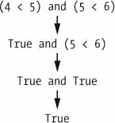

您也可以在表达式中使用多个布尔运算符以及比较运算符：

```py
>>> 2 + 2 == 4 and not 2 + 2 == 5 and 2 * 2 == 2 + 2
True
```

布尔运算符的运算顺序与数学运算符一样。在任何数学和比较操作符求值之后，Python 首先求值`not`操作符，然后是`and`操作符，然后是`or`操作符。

### 流程控制要素

流程控制语句通常以称为*条件*的部分开始，后面总是跟着称为*子句*的代码块。在您了解 Python 的特定流程控制语句之前，我将介绍什么是条件和块。

#### 条件

到目前为止，你看到的布尔表达式都可以被认为是条件，和表达式是一回事；*条件*只是流程控制语句上下文中一个更具体的名称。条件总是向下求值为布尔值，`True`或`False`。一个流程控制语句根据它的条件是`True`还是`False`来决定做什么，几乎每个流程控制语句都使用一个条件。

#### 代码块

Python 代码行可以在*块*中组合在一起。您可以从代码行的缩进来判断一个块何时开始和结束。块有三个规则。

*   当缩进增加时，块开始。
*   块可以包含其他块。
*   当缩进量减少到零或包含块的缩进量时，块结束。

通过查看一些缩进的代码，块更容易理解，所以让我们在一个小游戏程序的一部分中找到块，如下所示：

```py
  name = 'Mary'
  password = 'swordfish'
  if name == 'Mary':
       print('Hello, Mary') # ➊
       if password == 'swordfish':
           print('Access granted.') # ➋
       else:
           print('Wrong password.') # ➌
```

您可以在[`autbor.com/blocks`](https://autbor.com/blocks/)查看该程序的执行情况。第一块代码 ➊ 从第`print('Hello, Mary')`行开始，包含其后的所有行。在这个块里面是另一个块 ➋ ，其中只有一行代码：`print('Access Granted.')`。第三块 ➌ 也是一行长：`print('Wrong password.')`。

### 程序执行

在前一章的`hello.py`程序中，Python 开始执行程序顶端往下的指令，一个接一个。*程序执行*（或简称*执行*）是当前正在执行的指令的术语。如果你把源代码打印在纸上，并在执行的时候把手指放在每一行上，你可以把手指想象成程序的执行。

然而，并不是所有的程序都是直接向下执行的。如果您用手指跟踪一个带有流程控制语句的程序，您可能会发现自己根据条件跳过源代码，并且可能会跳过整个子句。

### 流程控制语句

现在，让我们探索流程控制中最重要的部分：语句本身。这些语句代表你在图 2-1 的流程图中看到的菱形，它们是你的程序将要做出的实际决定。

#### if 语句

最常见的流程控制语句是`if`语句。如果语句的条件是`True`，那么`if`语句的子句（即`if`语句后面的块）将会执行。如果条件为`False`，则跳过该子句。

简单地说，`if`语句可以理解为，“如果这个条件为真，则执行子句中的代码”。在 Python 中，`if`语句由以下内容组成：

*   `if`关键字
*   条件（即计算结果为`True`或`False`的表达式）
*   冒号
*   从下一行开始，一个缩进的代码块（称为`if`子句）

例如，假设你有一些代码来检查某人的名字是否是爱丽丝。（假设`name`之前被赋予了某个值。）

```py
if name == 'Alice':
    print('Hi, Alice.')
```

所有流程控制语句都以冒号结尾，后跟一个新的代码块（子句）。这个`if`语句的子句是带有`print('Hi, Alice.')`的块。图 2-2 显示了这段代码的流程图。

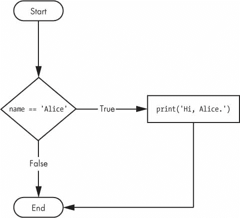

图 2-2:`if`语句的流程图

#### 目不斜视语句

一个`if`子句可以选择跟一个`else`语句。只有当`if`语句的条件为`False`时，才会执行`else`子句。用简单的英语来说，`else`语句可以理解为，“如果这个条件为真，执行这个代码。否则，执行该代码”。`else`语句没有条件，在代码中，`else`语句总是由以下内容组成：

*   `else`关键字
*   一个冒号
*   从下一行开始，一个缩进的代码块（称为`else`子句）

回到`Alice`的例子，让我们看一些代码，如果这个人的名字不是`Alice`，这些代码使用一个`else`语句来提供不同的问候。

```py
if name == 'Alice':
    print('Hi, Alice.')
else:
    print('Hello, stranger.')
```

图 2-3 显示了这段代码的流程图。

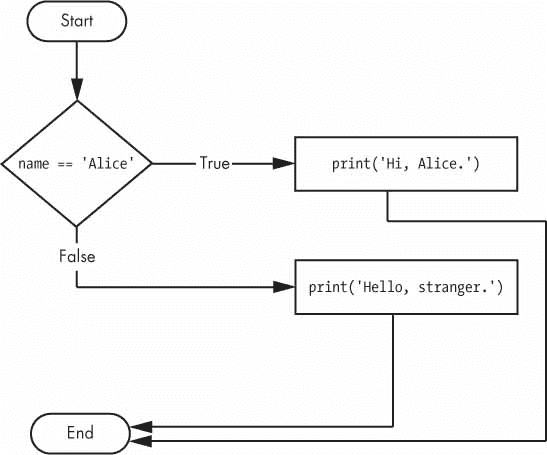

图 2-3：一个`else`语句的流程图

#### elif 报表

虽然只有`if`或`else`子句中的一个会执行，但您可能希望执行*多个*可能子句中的一个。`elif`语句是一个`else if`语句，总是跟在一个`if`或另一个`elif`语句之后。它提供了另一个条件，仅当所有之前的条件都为`False`时才检查该条件。在代码中，`elif`语句总是由以下内容组成：

*   `elif`关键字
*   条件（即计算结果为`True`或`False`的表达式）
*   一个冒号
*   从下一行开始，一个缩进的代码块（称为`elif`子句）

让我们给名称检查器添加一个`elif`来看看这个语句的运行情况。

```py
if name == 'Alice':
    print('Hi, Alice.')
elif age < 12:
    print('You are not Alice, kiddo.')
```

这一次，你检查这个人的年龄，如果他们小于 12 岁，程序会告诉他们一些不同的东西。你可以在图 2-4 中看到流程图。

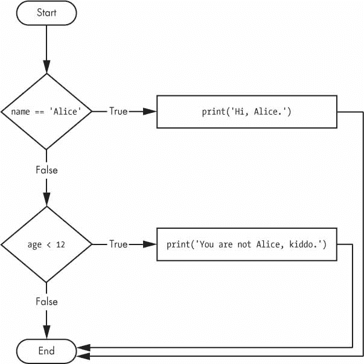

图 2-4：一条`elif`语句的流程图

如果`age < 12`是`True`并且`name == 'Alice'`是`False`，则`elif`子句执行。然而，如果两个条件都是`False`，则两个子句都被跳过。不能保证至少有一个条款会被执行。当有一串`elif`语句时，只有一个或没有一个子句会被执行。一旦发现其中一个语句的条件是`True`，其余的`elif`子句将被自动跳过。例如，打开一个新的文件编辑器窗口，输入以下代码，保存为`vampire.py` :

```py
name = 'Carol'
age = 3000
if name == 'Alice':
    print('Hi, Alice.')
elif age < 12:
    print('You are not Alice, kiddo.')
elif age > 2000:
    print('Unlike you, Alice is not an undead, immortal vampire.')
elif age > 100:
    print('You are not Alice, grannie.')
```

您可以在`autbor.com/vampire`查看该程序的执行情况。这里，我又添加了两个`elif`语句，让姓名检查器根据`age`用不同的答案问候一个人。图 2-5 显示了此操作的流程图。

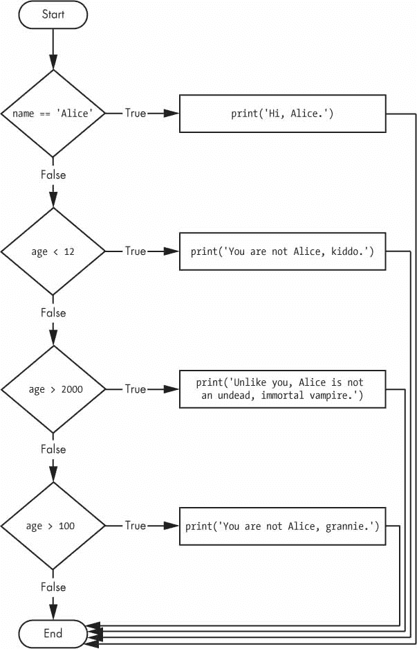

图 2-5:`vampire.py`程序中多个`elif`语句的流程图

然而,`elif`语句的顺序很重要。让我们重新排列它们来引入一个 bug。请记住，一旦发现一个`True`条件，其余的`elif`子句就会被自动跳过，所以如果你调换了`vampire.py`中的一些子句，就会遇到问题。将代码更改为如下所示，并保存为`vampire2.py` :

```py
   name = 'Carol'
   age = 3000
   if name == 'Alice':
       print('Hi, Alice.')
   elif age < 12:
       print('You are not Alice, kiddo.')
   elif age > 100: # ➊
       print('You are not Alice, grannie.')
   elif age > 2000:
       print('Unlike you, Alice is not an undead, immortal vampire.')
```

您可以在[`autbor.com/vampire2`](https://autbor.com/vampire2/)查看该程序的执行情况。假设在执行这段代码之前，`age`变量包含值`3000`。您可能希望代码打印出字符串`'Unlike you, Alice is not an undead, immortal vampire.'`。但是因为`age > 100`条件是`True`（毕竟 3000 大于 100）➊，所以打印出字符串`'You are not Alice, grannie.'`，其余的`elif`语句自动跳过。记住，最多只会执行一个子句，对于`elif`语句，顺序很重要！

图 2-6 显示了先前代码的流程图。请注意`age > 100`和`age > 2000`的钻石是如何交换的。

可选地，您可以在最后一个`elif`语句之后有一个`else`语句。在这种情况下，保证至少有一个（且只有一个）子句会被执行。如果每个`if`和`elif`语句中的条件都是`False`，则执行`else`子句。例如，让我们重新创建`Alice`程序来使用`if`、`elif`和`else`子句。

```py
name = 'Carol'
age = 3000
if name == 'Alice':
    print('Hi, Alice.')
elif age < 12:
    print('You are not Alice, kiddo.')
else:
    print('You are neither Alice nor a little kid.')
```

您可以在`autbor.com/littlekid`](https://autbor.com/littlekid/)查看该程序的执行情况。[图 2-7 显示了这个新代码的流程图，我们将它保存为`littleKid.py`。

简单地说，这种类型的流程控制结构应该是“如果第一个条件为真，就这样做。否则，如果第二个条件为真，就这样做。否则，做点别的”。当你一起使用`if`、`elif`和`else`语句时，记住这些关于如何排序的规则，以避免类似图 2-6 中的错误。首先，总是恰好有一个`if`语句。您需要的任何`elif`语句都应该遵循`if`语句。第二，如果您想确保至少有一个子句被执行，那么用一个`else`语句来关闭这个结构。

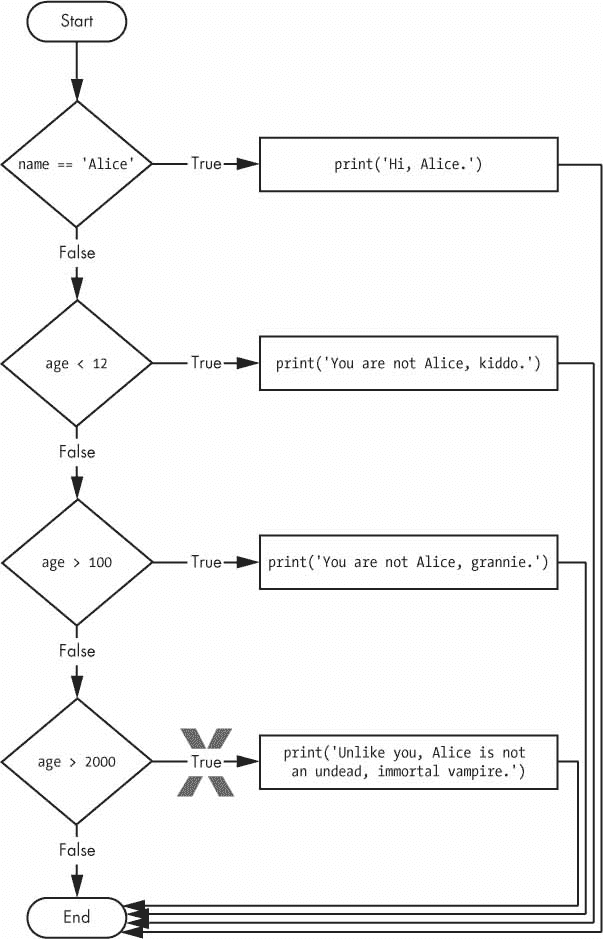

图 2-6：`vampire2.py`程序的流程图。`X`路径在逻辑上永远不会发生，因为如果年龄大于 2000 ，它就已经大于 100 。

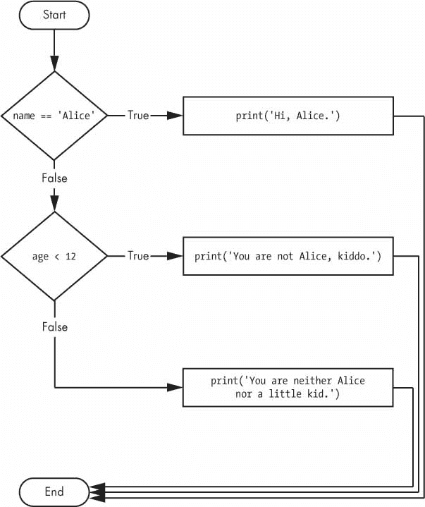

图 2-7：之前`littleKid.py`程序的流程图

####`while`循环语句

您可以使用`while`语句让一段代码反复执行。只要`while`语句的条件为`True`，就会执行`while`子句中的代码。在代码中，`while`语句总是由以下内容组成：

*   `while`关键字
*   条件（即计算结果为`True`或`False`的表达式）
*   一个冒号
*   从下一行开始，一个缩进的代码块（称为`while`子句）

你可以看到一个`while`语句看起来类似于一个`if`语句。区别在于他们的行为方式。在一个`if`子句的末尾，程序在`if`语句之后继续执行。但是在一个`while`子句的末尾，程序执行会跳回到`while`语句的开头。`while`子句通常被称为*`while`循环*或简称为*循环*。

让我们看一下使用相同条件并基于该条件采取相同动作的`if`语句和`while`循环。下面是带有`if`语句的代码：

```py
spam = 0
if spam < 5:
    print('Hello, world.')
    spam = spam + 1
```

下面是带有`while`语句的代码：

```py
spam = 0
while spam < 5:
    print('Hello, world.')
    spam = spam + 1
```

这些语句是相似的——`if`和`while`都检查`spam`的值，如果小于 5，它们就打印一条消息。但是当您运行这两个代码片段时，每一个都会发生非常不同的事情。对于`if`语句，输出只是`"Hello, world."`。但是对于`while`语句，是`"Hello, world."`重复了五次！看看这两段代码的流程图，图 2-8 和 2-9 ，看看为什么会这样。

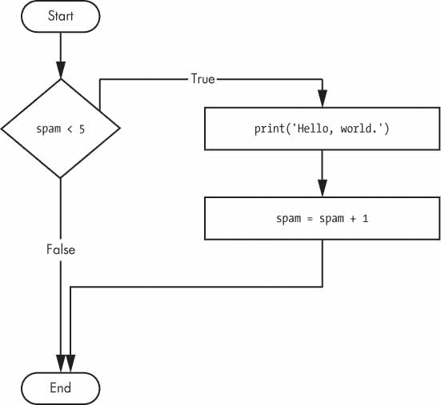

图 2-8:if语句代码的流程图

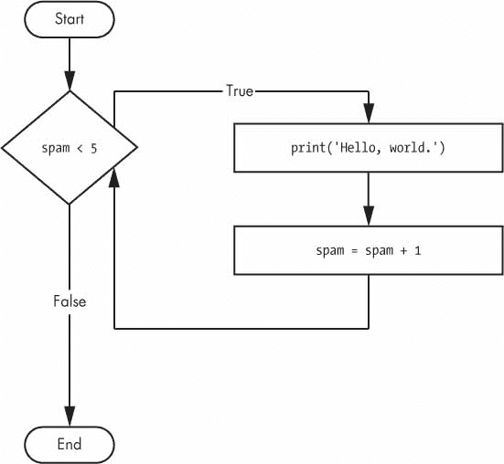

图 2-9：当语句代码时的流程图

带有`if`语句的代码检查条件，如果条件为真，它只打印一次`Hello, world.`。另一方面，带有`while`循环的代码将打印五次。五次打印后循环停止，因为`spam`中的整数在每次循环迭代结束时增加 1，这意味着在`spam < 5`为`False`之前循环将执行五次。

在`while`循环中，总是在每次*迭代*开始时检查条件（即每次循环执行时）。如果条件为`True`，则执行该子句，然后再次检查条件。第一次发现条件为`False`，跳过`while`子句。

##### 烦人的`while`循环

这里有一个小的示例程序，它会一直要求你键入，字面意思是，`your name`。选择**文件 -> 新建**打开一个新的文件编辑器窗口，输入以下代码，将文件保存为`yourName.py` :

```py
   name = '' # ➊
   while name != 'your name': # ➋
       print('Please type your name.')
       name = input() # ➌
   print('Thank you!') # ➍
```

您可以在[`autbor.com/yourname`](https://autbor.com/yourname/)查看该程序的执行情况。首先，程序将变量`name`➊设置为一个空字符串。这是如此的以至于`name != 'your name'`条件将求值为`True`并且程序执行将进入`while`循环的子句 ➋ 。

这个子句中的代码要求用户键入他们的名字，这个名字被分配给`name`变量 ➌ 。因为这是块的最后一行，所以执行返回到`while`循环的开始，并重新评估条件。如果`name`中的值*不等于*字符串`'your name'`，则条件为`True`，执行再次进入`while`子句。

但是一旦用户输入`your name`，`while`循环的条件将是`'your name' != 'your name'`，其值为`False`。现在条件是`False`，而不是程序执行重新进入`while`循环的子句，Python 跳过它并继续运行程序的剩余部分 ➍ 。图 2-10 显示了`yourName.py`程序的流程图。

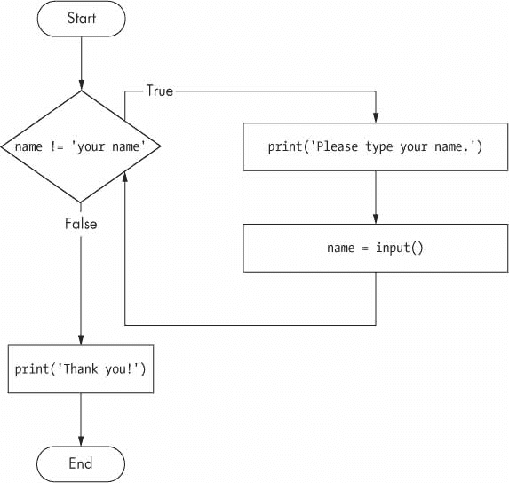

图 2-10:`yourname.py`程序的流程图

现在，让我们来看看`yourName.py`的运行情况。按下`F5`来运行它，在你给程序它想要的东西之前，输入几次`your name`以外的东西。

```py
Please type your name.
Al
Please type your name.
Albert
Please type your name.
%#@#%*(^&!!!
Please type your name.
your name
Thank you!
```

如果你从来不输入`your name`，那么`while`循环的条件将永远不会是`False`，程序将会一直询问下去。这里，`input()`调用让用户输入正确的字符串，让程序继续运行。在其他程序中，条件可能永远不会真正改变，这可能是一个问题。让我们看看如何打破`while`循环。

#### 打破报表

让程序执行尽早脱离`while`循环的子句有一个捷径。如果执行到了一个`break`语句，它会立即退出`while`循环的子句。在代码中，`break`语句只包含`break`关键字。

很简单，对吧？这里有一个程序，它和前面的程序做同样的事情，但是它使用了一个`break`语句来避免循环。输入以下代码，并将文件保存为`yourName2.py` :

```py
   while True: # ➊
       print('Please type your name.')
       name = input() # ➋
       if name == 'your name': # ➌
           break # ➍
   print('Thank you!') # ➎
```

您可以在[`autbor.com/yourname2`](https://autbor.com/yourname2/)查看该程序的执行情况。第一行 ➊ 创建*无限循环*；这是一个条件始终为`True`的`while`循环。（毕竟，表达式`True`的值总是小于值`True`。）程序执行进入这个循环后，只有执行了一条`break`语句才会退出循环。（*永远不会*退出的无限循环是常见的编程错误。）

就像之前一样，这个程序要求用户输入`your name` ➋ 。然而，现在当执行仍在`while`循环中时，一个`if`语句检查 ➌ 是否等于`'your name'`。如果该条件为`True`，则`break`语句运行 ➍ ，执行移出循环至`print('Thank you!')` ➎ 。否则，包含`break`语句的`if`语句的子句被跳过，这将执行放在`while`循环的末尾。此时，程序执行跳回到`while`语句的开始处 ➊ 以重新检查条件。由于这个条件仅仅是布尔值`True`，执行进入循环，要求用户再次输入`your name`。该程序的流程图见图 2-11 。

运行`yourName2.py`，输入您为`yourName.py`输入的相同文本。重写的程序应该以与原始程序相同的方式响应。

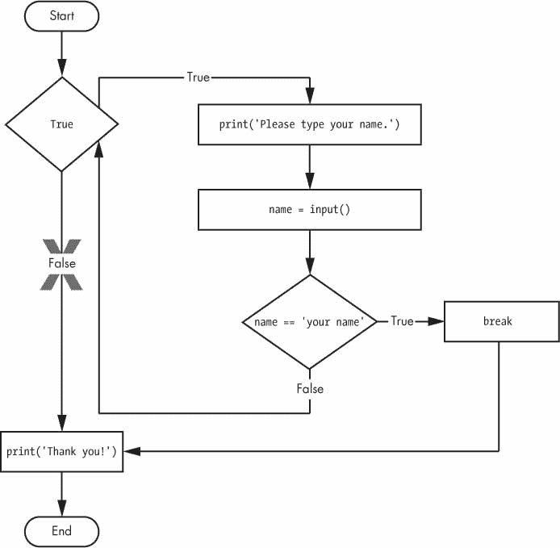

图 2-11：无限循环的`yourName2.py`程序的流程图。注意，X 路径在逻辑上永远不会发生，因为循环条件总是真。

#### 继续陈述

像`break`语句一样，`continue`语句也在循环中使用。当程序执行到一个`continue`语句时，程序执行立即跳回到循环的开始，并重新评估循环的条件。（这也是执行到循环末尾时发生的情况。）

让我们用`continue`写一个要求输入名字和密码的程序。在新的文件编辑器窗口中输入以下代码，并将程序保存为`swordfish.py`。

**陷入无限循环？**

如果你曾经运行过一个程序，它有一个错误导致它陷入无限循环，按下`CTRL+C`或者从 IDLE 的菜单中选择**Shell -> 重启 Shell** 。这将向你的程序发送一个键盘中断错误，并导致它立即停止。尝试通过在文件编辑器中创建一个简单的无限循环来停止程序，并将程序保存为`infiniteLoop.py`。

```py
while True:
    print('Hello, world!')
```

当你运行这个程序时，它会打印出`'Hello, world!'`，永远显示在屏幕上，因为而语句的条件总是为真。如果你想简单地立即终止你的程序，`CTRL+C`也很方便，即使它没有陷入无限循环。

```py
  while True:
      print('Who are you?')
      name = input()
       if name != 'Joe': # ➊
           continue # ➋
       print('Hello, Joe. What is the password? (It is a fish.)')
       password = input() # ➌
       if password == 'swordfish':
           break # ➍
   print('Access granted.')     # ➎
```

如果用户输入除了`Joe` ➊ 之外的任何名字，则`continue`语句 ➋ 使程序执行跳回到循环的开始。当程序重新评估条件时，执行将总是进入循环，因为条件仅仅是值`True`。一旦用户通过了那个`if`语句，他们就会被要求输入密码 ➌ 。如果输入的密码是`swordfish`，则运行`break`语句 ➍ ，执行跳出`while`循环打印`Access granted` ➎ 。否则，执行继续到`while`循环的结尾，然后跳回到循环的开始。该程序的流程图见图 2-12 。

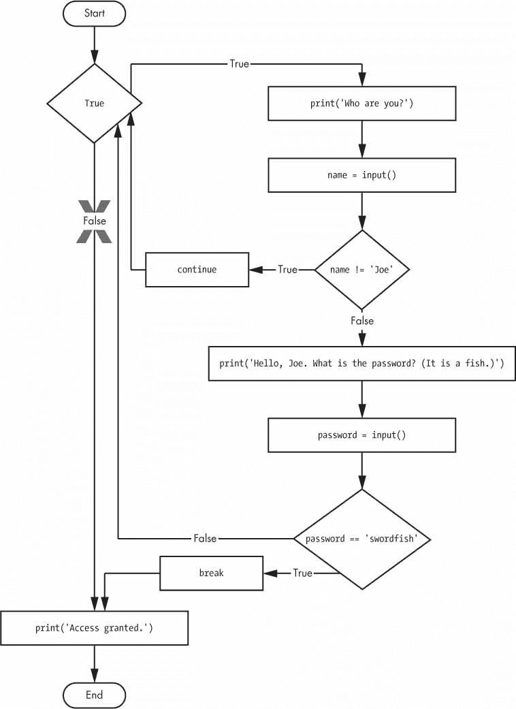

图 2-12:`swordFish.py`。`X`路径逻辑上永远不会发生，因为循环条件总是真。

**“真”和“假”值**

条件将考虑其他数据类型中的一些值，相当于真和假。在条件中使用时，0，0.0，`''`（空字符串）被认为是假，而所有其他值被认为是真。例如，看看下面的程序：

```py
name = ''
   while not name: # ➊
    print('Enter your name:')
    name = input()
print('How many guests will you have?')
numOfGuests = int(input())
   if numOfGuests: # ➋
       print('Be sure to have enough room for all your guests.') # ➌
print('Done')
```

您可以在[`autbor.com/howmanyguests`](https://autbor.com/howmanyguests/)查看该程序的执行情况。如果用户为名称输入一个空字符串，那么`while`语句的条件将为`True` ➊ ，程序继续询问名称。如果`numOfGuests`的值不是 0 ➋ ，则认为该条件为真，程序将为用户 ➌ 打印一个提醒。

你可以输入`not name != ''`代替`not name`，输入`numOfGuests != 0`代替`numOfGuests`，但是使用真值和假值可以使您的代码更容易阅读。

运行这个程序，给它一些输入。在你自称是乔之前，这个程序不应该要求输入密码，一旦你输入了正确的密码，它就应该退出。

```py
Who are you?
I'm fine, thanks. Who are you?
Who are you?
Joe
Hello, Joe. What is the password? (It is a fish.)
Mary
Who are you?
Joe
Hello, Joe. What is the password? (It is a fish.)
swordfish
Access granted.
```

您可以在[`autbor.com/hellojoe`](https://autbor.com/hellojoe/)查看该程序的执行情况。

#### 为循环和量程（）函数

`while`循环在它的条件为`True`时保持循环（这就是它的名字的原因），但是如果你只想执行一段代码一定的次数呢？你可以用一个`for`循环语句和`range()`函数来实现。

在代码中，`for`语句类似于`for i in range(5):`,包括以下内容：

*   `for`关键字
*   变量名
*   `in`关键字
*   调用`range()`方法，最多传递三个整数
*   一个冒号
*   从下一行开始，一个缩进的代码块（称为`for`子句）

让我们创建一个名为`fiveTimes.py`的新程序来帮助您查看运行中的`for`循环。

```py
print('My name is')
for i in range(5):
    print('Jimmy Five Times (' + str(i) + ')')
```

您可以在`autbor.com/fivetimesfor`](https://autbor.com/fivetimesfor/)查看该程序的执行情况。循环的子句中的代码运行了五次。第一次运行时，变量`i`被设置为`0`。子句中的`print()`调用将打印`Jimmy Five Times (0)`。在 Python 完成了对`for`循环的子句中所有代码的迭代之后，执行返回到循环的顶部，并且`for`语句将`i`加 1。这就是为什么`range(5)`在子句中导致五次迭代，其中`i`被设置为`0`，然后是`1`，然后是`2`，然后是`3`，然后是`4`。变量`i`将上升到传递给`range()`的整数，但不包括该整数。图 2-13 显示了`fiveTimes.py`程序的流程图。

当你运行这个程序时，在离开`for`循环之前，它应该打印五次`Jimmy Five Times`，然后是`i`的值。

```py
My name is
Jimmy Five Times (0)
Jimmy Five Times (1)
Jimmy Five Times (2)
Jimmy Five Times (3)
Jimmy Five Times (4)
```

> 注
>
> 对于循环，也可以使用中的`break`和`continue`语句。`continue`语句将继续到循环的计数器的的下一个值，就好像程序执行已经到达循环的结尾并返回到开始。事实上，您只能在中使用继续和中断语句，而和用于循环。如果你试图在其他地方使用这些语句，Python 会给你一个错误。

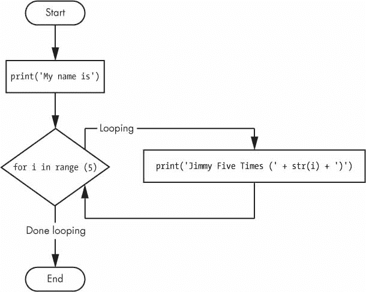

图 2-13:`fiveTimes.py`的流程图

作为另一个循环例子，考虑这个关于数学家卡尔·弗里德里希·高斯的故事。高斯小的时候，一位老师想给全班同学一些作业。老师告诉他们把从 0 到 100 的所有数字加起来。年轻的高斯想出了一个聪明的办法，在几秒钟内算出答案，但是你可以写一个带有`for`循环的 Python 程序来替你做这个计算。

```py
   total = 0 # ➊
   for num in range(101): # ➋
       total = total + num # ➌
   print(total)   # ➍
```

结果应该是 5050。当程序首次启动时，`total`变量被设置为`0` ➊ 。`for`循环 ➋ 然后执行`total = total + num` ➌ 100 次。到循环完成所有 100 次迭代时，从`0`到`100`的每个整数都将被加到`total`。此时，`total`被打印到屏幕 ➍ 上。即使在最慢的计算机上，这个程序也不到一秒钟就能完成。

（年轻的高斯想出了一个秒解的方法。有 50 对数字加起来是 101：`1 + 100`，`2 + 99`，`3 + 98`，以此类推，直到`50 + 51`。由于`50 × 101`是 5050，所以从 0 到 100 的所有数之和是 5050。聪明的孩子！）

##### 一个等价的`while`循环

您实际上可以使用一个`while`循环来做与一个`for`循环相同的事情；`for`循环只是更简洁。让我们重写`fiveTimes.py`来使用一个与`for`循环等价的`while`循环。

```py
print('My name is')
i = 0
while i < 5:
    print('Jimmy Five Times (' + str(i) + ')')
    i = i + 1
```

您可以在[`autbor.com/fivetimeswhile`](https://autbor.com/fivetimeswhile/)查看该程序的执行情况。如果运行这个程序，输出应该与使用了一个`for`循环的`fiveTimes.py`程序看起来一样。

##### `range()`的开始、停止和步进参数

有些函数可以用逗号分隔的多个参数来调用，`range()`就是其中之一。这允许您更改传递给`range()`的整数，使其遵循任何整数序列，包括从非零数字开始。

```py
for i in range(12, 16):
    print(i)
```

第一个参数是循环变量开始的地方，第二个参数是停止的数字，但不包括这个数字。

```py
12
13
14
15
```

也可以用三个参数调用`range()`函数。前两个参数将是开始和停止值，第三个参数将是*步长参数*。步长是每次迭代后变量增加的量。

```py
for i in range(0, 10, 2):
    print(i)
```

所以调用`range(0, 10, 2)`会以 2 为间隔从 0 数到 8。

```py
0
2
4
6
8
```

`range()`函数为`for`循环产生的数字序列是灵活的。举个栗子（我从不为我的双关语道歉），你甚至可以为步长参数使用负数来使`for`循环递减计数而不是递增计数。

```py
for i in range(5, -1, -1):
    print(i)
```

这个`for`循环会有以下输出：

```py
5
4
3
2
1
0
```

运行一个`for`循环来用`range(5, -1, -1)`打印`i`应该从 5 到 0 打印。

### 导入模块

所有的 Python 程序都可以调用一组叫做*内置函数*的基本函数，包括你之前见过的`print()`、`input()`和`len()`函数。Python 还附带了一组称为*标准库*的模块。每个模块都是一个 Python 程序，包含一组相关的函数，可以嵌入到您的程序中。例如，`math`模块有数学相关的函数，`random`模块有随机数相关的函数，等等。

在使用模块中的函数之前，必须用一个`import`语句导入模块。在代码中，`import`语句由以下内容组成：

*   `import`关键字
*   模块的名称
*   可选地，更多的模块名称，只要它们由逗号分隔

一旦你导入了一个模块，你就可以使用该模块所有的酷功能。让我们试一试`random`模块，它将让我们访问`random.randint()`函数。

将该代码输入文件编辑器，并保存为`printRandom.py` :

```py
import random
for i in range(5):
    print(random.randint(1, 10))
```

**不要覆盖模块名**

当你保存你的 Python 脚本时，注意不要给它们起一个 Python 模块使用的名字，比如`random.py`、`sys.py`、`os.py`或者`math.py`。如果您不小心命名了一个程序，比如说，`random.py`，并在另一个程序中使用了一个`import random`语句，那么您的程序将会导入您的`random.py`文件，而不是 Python 的`random`模块。这会导致诸如“`AttributeError`：模块`random`没有属性`randint`”的错误，因为你的`random.py`没有真正的`random`模块所具有的功能。也不要使用任何内置 Python 函数的名字，比如`print()`或者`input()`。

像这样的问题并不常见，但解决起来却很棘手。随着您获得更多的编程经验，您将会更加了解 Python 的模块和函数所使用的标准名称，并减少遇到这些问题的频率。

当你运行这个程序时，输出会是这样的：

```py
4
1
8
4
1
```

您可以在[`autbor.com/printrandom`](https://autbor.com/printrandom/)查看该程序的执行情况。`random.randint()`函数调用的计算结果是您传递给它的两个整数之间的随机整数值。由于`randint()`在`random`模块中，你必须首先键入`random.`放在函数名前面，告诉 Python 在`random`模块中寻找这个函数。

下面是一个`import`语句的例子，它导入了四个不同的模块：

```py
import random, sys, os, math
```

现在我们可以使用这四个模块中的任何功能。我们将在本书的后面了解更多。

#### 从*导入报表

`import`语句的另一种形式是由`from`关键字、模块名、`import`关键字和一个星号组成；比如`from random import *`。

使用这种形式的`import`语句，对`random`中函数的调用将不需要`random.`前缀。然而，使用全名有助于提高代码的可读性，所以最好使用语句的`import random`形式。

### 用`sys.exit()`函数提前结束程序

最后一个要介绍的流程控制概念是如何终止程序。如果程序执行到指令的底部，程序总是终止。然而，您可以通过调用`sys.exit()`函数使程序在最后一条指令之前终止或退出。因为这个函数在`sys`模块中，你必须在你的程序使用它之前导入`sys`。

打开文件编辑器窗口，输入以下代码，保存为`exitExample.py` :

```py
import sys
while True:
    print('Type exit to exit.')
    response = input()
    if response == 'exit':
        sys.exit()
    print('You typed ' + response + '.')
```

空闲时运行该程序。这个程序有一个内部没有`break`语句的无限循环。这个程序结束的唯一方式是执行到了`sys.exit()`调用。当`response`等于`exit`时，包含`sys.exit()`调用的行被执行。由于`response`变量由`input()`功能设置，用户必须输入`exit`才能停止程序。

### 一个小程序：猜数字

到目前为止，我向您展示的示例对于介绍基本概念是有用的，但是现在让我们看看您所学的一切是如何在一个更完整的程序中组合在一起的。在这一部分，我将向您展示一个简单的“猜数字”游戏。当您运行该程序时，输出将类似于以下内容：

```py
I am thinking of a number between 1 and 20.
Take a guess.
10
Your guess is too low.
Take a guess.
15
Your guess is too low.
Take a guess.
17
Your guess is too high.
Take a guess.
16
Good job! You guessed my number in 4 guesses!
```

在文件编辑器中输入下面的源代码，将文件保存为`guessTheNumber.py` :

```py
# This is a guess the number game.
import random
secretNumber = random.randint(1, 20)
print('I am thinking of a number between 1 and 20.')
# Ask the player to guess 6 times.
for guessesTaken in range(1, 7):
    print('Take a guess.')
    guess = int(input())
    if guess < secretNumber:
        print('Your guess is too low.')
    elif guess > secretNumber:
        print('Your guess is too high.')
    else:
        break    # This condition is the correct guess!
if guess == secretNumber:
    print('Good job! You guessed my number in ' + str(guessesTaken) + '
guesses!')
else:
    print('Nope. The number I was thinking of was ' + str(secretNumber))
```

您可以在[`/autbor.com/guessthenumber`](https://autbor.com/guessthenumber/)查看该程序的执行情况。让我们从顶部开始，逐行查看这段代码。

```py
# This is a guess the number game.
import random
secretNumber = random.randint(1, 20)
```

首先，代码顶部的注释解释了程序的功能。然后，程序导入`random`模块，以便使用`random.randint()`函数生成一个数字供用户猜测。返回值是 1 到 20 之间的随机整数，存储在变量`secretNumber`中。

```py
print('I am thinking of a number between 1 and 20.')
# Ask the player to guess 6 times.
for guessesTaken in range(1, 7):
    print('Take a guess.')
    guess = int(input())
```

该程序告诉玩家，它已经想出了一个秘密数字，并会给玩家六次机会来猜测它。让玩家输入猜测并检查猜测是否在最多循环六次的`for`循环中的代码。循环中发生的第一件事是玩家输入一个猜测。由于`input()`返回一个字符串，它的返回值被直接传递给`int()`，后者将该字符串翻译成一个整数值。这存储在一个名为`guess`的变量中。

```py
    if guess < secretNumber:
        print('Your guess is too low.')
    elif guess > secretNumber:
        print('Your guess is too high.')
```

这几行代码检查猜测值是小于还是大于秘密数字。在这两种情况下，都会将提示打印到屏幕上。

```py
    else:
        break    # This condition is the correct guess!
```

如果猜测既不高于也不低于秘密数字，那么它必须等于秘密数字——在这种情况下，您希望程序执行脱离`for`循环。

```py
if guess == secretNumber:
    print('Good job! You guessed my number in ' + str(guessesTaken) + ' guesses!')
else:
    print('Nope. The number I was thinking of was ' + str(secretNumber))
```

在`for`循环之后，前面的`if...else`语句检查玩家是否猜对了数字，然后将适当的消息打印到屏幕上。在这两种情况下，程序都显示一个包含整数值的变量（`guessesTaken`和`secretNumber`）。因为它必须将这些整数值连接成字符串，所以它将这些变量传递给`str()`函数，该函数返回这些整数的字符串值形式。现在，在最终传递给`print()`函数调用之前，这些字符串可以用`+`操作符连接起来。

### 一个小节目：石头、剪子、布

让我们使用目前为止所学的编程概念来创建一个简单的石头、布、剪刀游戏。输出将如下所示：

```py
ROCK, PAPER, SCISSORS
0 Wins, 0 Losses, 0 Ties
Enter your move: (r)ock (p)aper (s)cissors or (q)uit
p
PAPER versus...
PAPER
It is a tie!
0 Wins, 1 Losses, 1 Ties
Enter your move: (r)ock (p)aper (s)cissors or (q)uit
s
SCISSORS versus...
PAPER
You win!
1 Wins, 1 Losses, 1 Ties
Enter your move: (r)ock (p)aper (s)cissors or (q)uit
q
```

在文件编辑器中键入以下源代码，并将文件保存为`rpsGame.py` :

```py
import random, sys
print('ROCK, PAPER, SCISSORS')
# These variables keep track of the number of wins, losses, and ties.
wins = 0
losses = 0
ties = 0
while True: # The main game loop.
    print('%s Wins, %s Losses, %s Ties' % (wins, losses, ties))
    while True: # The player input loop.
        print('Enter your move: (r)ock (p)aper (s)cissors or (q)uit')
        playerMove = input()
        if playerMove == 'q':
            sys.exit() # Quit the program.
        if playerMove == 'r' or playerMove == 'p' or playerMove == 's':
            break # Break out of the player input loop.
        print('Type one of r, p, s, or q.')
    # Display what the player chose:
    if playerMove == 'r':
        print('ROCK versus...')
    elif playerMove == 'p':
        print('PAPER versus...')
    elif playerMove == 's':
        print('SCISSORS versus...')
    # Display what the computer chose:
    randomNumber = random.randint(1, 3)
    if randomNumber == 1:
        computerMove = 'r'
        print('ROCK')
    elif randomNumber == 2:
        computerMove = 'p'
        print('PAPER')
    elif randomNumber == 3:
        computerMove = 's'
        print('SCISSORS')
    # Display and record the win/loss/tie:
    if playerMove == computerMove:
        print('It is a tie!')
        ties = ties + 1
    elif playerMove == 'r' and computerMove == 's':
        print('You win!')
        wins = wins + 1
    elif playerMove == 'p' and computerMove == 'r':
        print('You win!')
        wins = wins + 1
    elif playerMove == 's' and computerMove == 'p':
        print('You win!')
        wins = wins + 1
    elif playerMove == 'r' and computerMove == 'p':
        print('You lose!')
        losses = losses + 1
    elif playerMove == 'p' and computerMove == 's':
        print('You lose!')
        losses = losses + 1
    elif playerMove == 's' and computerMove == 'r':
        print('You lose!')
        losses = losses + 1
```

让我们从顶部开始，逐行查看这段代码。

```py
import random, sys
print('ROCK, PAPER, SCISSORS')
# These variables keep track of the number of wins, losses, and ties.
wins = 0
losses = 0
ties = 0
```

首先，我们导入`random`和`sys`模块，这样我们的程序就可以调用`random.randint()`和`sys.exit()`函数。我们还设置了三个变量来记录玩家赢了多少，输了多少，打了多少平手。

```py
while True: # The main game loop.
    print('%s Wins, %s Losses, %s Ties' % (wins, losses, ties))
    while True: # The player input loop.
        print('Enter your move: (r)ock (p)aper (s)cissors or (q)uit')
        playerMove = input()
        if playerMove == 'q':
            sys.exit() # Quit the program.
        if playerMove == 'r' or playerMove == 'p' or playerMove == 's':
            break # Break out of the player input loop.
        print('Type one of r, p, s, or q.')
```

该程序在另一个`while`循环中使用了一个`while`循环。第一个循环是主游戏循环，通过这个循环在每次迭代中玩石头、布、剪刀的单个游戏。第二个循环要求玩家输入，并保持循环，直到玩家为他们的移动输入了`r`、`p`、`s`或`q`。`r`、`p`和`s`分别对应石头、布、剪刀，而`q`表示玩家打算退出。在这种情况下，调用`sys.exit()`，程序退出。如果玩家输入了`r`、`p`或`s`，执行将退出循环。否则，程序会提醒玩家输入`r`、`p`、`s`或`q`，并返回循环的起点。

```py
    # Display what the player chose:
    if playerMove == 'r':
        print('ROCK versus...')
    elif playerMove == 'p':
        print('PAPER versus...')
    elif playerMove == 's':
        print('SCISSORS versus...')
```

玩家的移动显示在屏幕上。

```py
    # Display what the computer chose:
    randomNumber = random.randint(1, 3)
    if randomNumber == 1:
        computerMove = 'r'
        print('ROCK')
    elif randomNumber == 2:
        computerMove = 'p'
        print('PAPER')
    elif randomNumber == 3:
        computerMove = 's'
        print('SCISSORS')
```

接下来，随机选择计算机的移动。由于`random.randint()`只能返回一个随机数，所以它返回的`1`、`2`或`3`整数值存储在一个名为`randomNumber`的变量中。程序根据`randomNumber`中的整数在`computerMove`中存储一个`'r'`、`'p'`或`'s'`字符串，并显示计算机的移动。

```py
    # Display and record the win/loss/tie:
    if playerMove == computerMove:
        print('It is a tie!')
        ties = ties + 1
    elif playerMove == 'r' and computerMove == 's':
        print('You win!')
        wins = wins + 1
    elif playerMove == 'p' and computerMove == 'r':
        print('You win!')
        wins = wins + 1
    elif playerMove == 's' and computerMove == 'p':
        print('You win!')
        wins = wins + 1
    elif playerMove == 'r' and computerMove == 'p':
        print('You lose!')
        losses = losses + 1
    elif playerMove == 'p' and computerMove == 's':
        print('You lose!')
        losses = losses + 1
    elif playerMove == 's' and computerMove == 'r':
        print('You lose!')
        losses = losses + 1
```

最后，程序比较`playerMove`和`computerMove`中的字符串，并将结果显示在屏幕上。它还适当增加`wins`、`losses`或`ties`变量。一旦执行到达末尾，它就跳回到主程序循环的开始，开始另一个游戏。

### 总结

通过使用求值为`True`或`False`（也称为条件）的表达式，您可以编写决定执行什么代码和跳过什么代码的程序。当某个条件求值为`True`时，你也可以在一个循环中反复执行代码。如果你需要退出一个循环或者跳回到循环的开始，那么`break`和`continue`语句是很有用的。

这些流程控制语句将让您编写更智能的程序。您也可以通过编写自己的函数来使用另一种类型的流程控制，这是下一章的主题。

### 练习题

1.  布尔数据类型的两个值是什么？你是怎么写的？

2.  三种布尔运算符是什么？

3.  写出每个布尔运算符的真值表（即运算符的布尔值及其计算结果的每种可能组合）。

4.  下面的表达式表示什么？

     ```py
     (5 > 4) and (3 == 5)
     not (5 > 4)
     (5 > 4) or (3 == 5)
     not ((5 > 4) or (3 == 5))
     (True and True) and (True == False)
     (not False) or (not True)
     ```

5.  六个比较运算符是什么？

6.  等于运算符和赋值运算符有什么区别？

7.  解释什么是条件，以及在什么情况下使用条件。

8.  识别代码中的三个块：

    ```py
    spam = 0
    if spam == 10:
       print('eggs')
       if spam > 5:
          print('bacon')
       else:
          print('ham')
       print('spam')
    print('spam')
    ```

9.  编写代码，如果`1`存储在`spam`中，则打印`Hello`，如果`2`存储在`spam`中，则打印`Howdy`，如果其他内容存储在`spam`中，则打印`Greetings!`。

0.  如果你的程序陷入无限循环，你可以按什么键？

1.  `break`和`continue`有什么区别？

2.  一个`for`循环中的`range(10)`、`range(0, 10)`、`range(0, 10, 1)`有什么区别？

3.  写一个简短的程序，使用一个`for`循环打印数字`1`到`10`。然后编写一个等价的程序，使用一个`while`循环打印数字`1`到`10`。

4.  如果你在一个名为`spam`的模块中有一个名为`bacon()`的函数，你在导入`spam`后会如何调用它？

**附加题**：在网上查一下`round()`和`abs()`函数，看看它们是做什么的。在交互式 Shell 中试验它们。