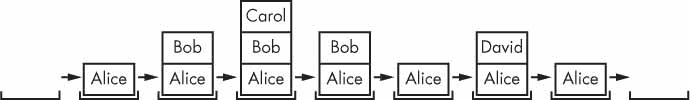
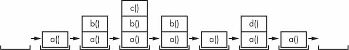

# 3 个功能

> 原文：<https://automatetheboringstuff.com/2e/chapter3/>


您已经熟悉了前几章中的`print()`、`input()`和`len()`函数。Python 提供了几个这样的内置函数，但是您也可以编写自己的函数。一个*函数*就像一个程序中的一个小程序。

为了更好地理解函数是如何工作的，让我们创建一个函数。将该程序输入文件编辑器，并保存为 *helloFunc.py* :

```py
   def hello(): # ➊

       print('Howdy!') # ➋

       print('Howdy!!!')

       print('Hello there.')

   hello() # ➌

   hello()

   hello()
```

您可以在[`autbor.com/hellofunc`](https://autbor.com/hellofunc)查看该程序的执行情况。第一行是一个`def`语句 ➊ ，它定义了一个名为`hello()`的函数。跟在`def`语句 ➋ 后面的代码是函数体。这段代码在函数被调用时执行，而不是在函数第一次被定义时执行。*

函数 ➌ 后面的`hello()`行是函数调用。在代码中，函数调用就是函数名后跟括号，括号之间可能有一些参数。当程序执行到这些调用时，它将跳转到函数的第一行，并开始执行那里的代码。当它到达函数的末尾时，执行返回到调用该函数的行，并像以前一样继续遍历代码。

由于这个程序调用了`hello()`三次，所以`hello()`函数中的代码执行了三次。当您运行该程序时，输出如下所示:

```py
Howdy!

Howdy!!!

Hello there.

Howdy!

Howdy!!!

Hello there.

Howdy!

Howdy!!!

Hello there.
```

函数的一个主要目的是对多次执行的代码进行分组。如果没有定义函数，您每次都必须复制并粘贴这些代码，程序看起来会像这样:

```py
print('Howdy!')

print('Howdy!!!')

print('Hello there.')

print('Howdy!')

print('Howdy!!!')

print('Hello there.')

print('Howdy!')

print('Howdy!!!')

print('Hello there.')
```

一般来说，您总是希望避免重复代码，因为如果您决定更新代码——例如，如果您发现了一个需要修复的 bug 您将不得不记住在您复制代码的任何地方更改代码。

随着你获得更多的编程经验，你会经常发现自己*重复删除*代码，这意味着去掉重复的或复制粘贴的代码。重复数据删除使您的程序更短、更易读、更易于更新。

### **带参数的 def 语句**

当您调用`print()`或`len()`函数时，您通过在括号之间键入值来传递它们，称为*参数*。您也可以定义自己的接受参数的函数。将此示例输入文件编辑器，并保存为 *helloFunc2.py* :

```py
   def hello(name): # ➊

       print('Hello, ' + name) # ➋

   hello('Alice') # ➌

   hello('Bob')
```

当您运行该程序时，输出如下所示:

```py
Hello, Alice

Hello, Bob
```

您可以在[`autbor.com/hellofunc2`](https://autbor.com/hellofunc2/)查看该程序的执行情况。本程序中`hello()`函数的定义有一个参数叫做`name` ➊ 。*参数*是包含自变量的变量。当用实参调用函数时，实参存储在形参中。第一次调用`hello()`函数时，它被传递给参数`'Alice'` ➌ 。程序执行进入函数，参数`name`自动设置为`'Alice'`，这是由`print()`语句 ➋ 打印出来的。

关于参数需要特别注意的一点是，当函数返回时，存储在参数中的值会被遗忘。例如，如果你在前面的程序中在`hello('Bob')`后面添加了`print(name)`，程序会给你一个`NameError`，因为没有名为`name`的变量。这个变量在函数调用`hello('Bob')`返回后被销毁，所以`print(name)`会引用一个不存在的`name`变量。

这类似于当程序终止时程序的变量被遗忘。在本章后面，当我讨论什么是函数的局部作用域时，我会更多地讨论为什么会发生这种情况。

#### ***定义、调用、传递、自变量、参数***

术语*定义*、*调用*、*通过*、*论证*、*参数*可能会混淆。让我们看一个代码示例来回顾这些术语:

```py
   def sayHello(name): # ➊

       print('Hello, ' + name)

   sayHello('Al') # ➋
```

定义函数就是创建函数，就像赋值语句创建变量一样。`def`语句定义了`sayHello()`函数 ➊ 。`sayHello('Al')`行 ➋ *调用*现在创建的函数，将执行发送到函数代码的顶部。这个函数调用也被称为*将字符串值`'Al'`传递给函数*。在函数调用中传递给函数的值是一个*参数*。参数`'Al'`被分配给一个名为`name`的局部变量。被赋予自变量的变量是*参数*。

很容易混淆这些术语，但保持它们的一致性将确保你准确地知道本章文本的意思。

### **返回值和返回语句**

当您调用`len()`函数并给它传递一个参数，比如`'Hello'`时，函数调用会计算出整数值`5`，这是您传递给它的字符串的长度。一般来说，函数调用评估的值被称为函数的*返回值*。

当使用`def`语句创建函数时，可以用`return`语句指定返回值应该是什么。一份`return`声明由以下内容组成:

*   `return`关键字
*   函数应该返回的值或表达式

当一个表达式与一个`return`语句一起使用时，返回值就是这个表达式计算的值。例如，下面的程序定义了一个函数，该函数根据作为参数传递的数字返回不同的字符串。将此代码输入文件编辑器并保存为 *magic8Ball.py* :

```py
   import random # ➊

   def getAnswer(answerNumber): # ➋

       if answerNumber == 1: # ➌

           return 'It is certain'

       elif answerNumber == 2:

           return 'It is decidedly so'

       elif answerNumber == 3:

           return 'Yes'

       elif answerNumber == 4:

           return 'Reply hazy try again'

       elif answerNumber == 5:

           return 'Ask again later'

       elif answerNumber == 6:

           return 'Concentrate and ask again'

       elif answerNumber == 7:

           return 'My reply is no'

       elif answerNumber == 8:

           return 'Outlook not so good'

       elif answerNumber == 9:

           return 'Very doubtful'

   r = random.randint(1, 9) # ➍

   fortune = getAnswer(r) # ➎

   print(fortune) # ➏
```

您可以在*[https://autbor.com/magic8ball/](https://autbor.com/magic8ball/)*查看该程序的执行情况。当这个程序启动时，Python 首先导入`random`模块 ➊ 。然后定义`getAnswer()`函数 ➋ 。因为函数正在被定义(而不是被调用)，所以执行会跳过其中的代码。接下来，用两个参数调用`random.randint()`函数:`1`和`9`t19】➍。它求值为一个在`1`和`9`之间的随机整数(包括`1`和`9`本身)，这个值存储在一个名为`r`的变量中。

使用`r`作为参数 ➎ 调用`getAnswer()`函数。程序执行移动到`getAnswer()`函数 ➌ 的顶部，值`r`存储在名为`answerNumber`的参数中。然后，根据`answerNumber`中的值，该函数返回许多可能的字符串值之一。程序执行返回到程序底部原来调用`getAnswer()` ➎ 的那一行。返回的字符串被赋给一个名为`fortune`的变量，然后该变量被传递给一个`print()`调用 ➏ 并被打印到屏幕上。

请注意，由于可以将返回值作为参数传递给另一个函数调用，因此可以缩短这三行代码:

```py
r = random.randint(1, 9)

fortune = getAnswer(r)

print(fortune)
```

到这条等价的线:

```py
print(getAnswer(random.randint(1, 9)))
```

记住，表达式是由值和运算符组成的。函数调用可以在表达式中使用，因为调用计算其返回值。

### **无值**

在 Python 中，有一个值叫做`None`，代表没有值。`None`值是`NoneType`数据类型的唯一值。(其他编程语言可能会将这个值称为`null`、`nil`或`undefined`。)就像布尔值`True`和`False`一样，`None`必须用大写的 *N* 来键入。

当您需要在变量中存储不会与实值混淆的内容时，这种不带值的值会很有帮助。使用`None`的一个地方是作为`print()`的返回值。`print()`函数在屏幕上显示文本，但它不需要像`len()`或`input()`那样返回任何内容。但是由于所有的函数调用都需要计算返回值，`print()`返回`None`。要查看这一过程，请在交互式 shell 中输入以下内容:

```py
>>> spam = print('Hello!')

Hello!

>>> None == spam

True
```

在幕后，Python 将`return None`添加到任何没有`return`语句的函数定义的末尾。这类似于`while`或`for`循环如何以`continue`语句隐式结束。此外，如果使用不带值的`return`语句(也就是说，只有`return`关键字本身)，那么将返回`None`。

### **关键字参数和 print()函数**

大多数参数由它们在函数调用中的位置来标识。比如`random.randint(1, 10)`和`random.randint(10, 1)`不一样。函数调用`random.randint(1, 10)`将返回一个在`1`和`10`之间的随机整数，因为第一个参数是范围的低端，第二个参数是高端(而`random.randint(10, 1)`会导致错误)。

然而，*关键字参数*不是通过它们的位置，而是通过在函数调用中放在它们前面的关键字来识别的。关键字自变量常用于*可选参数*。例如，`print()`函数有可选参数`end`和`sep`来分别指定应该在它的参数末尾和参数之间打印什么(分隔它们)。

如果您用以下代码运行了一个程序:

```py
print('Hello')

print('World')
```

输出如下所示:

```py
Hello

World
```

两个输出的字符串出现在不同的行上，因为`print()`函数会自动在传递的字符串末尾添加一个换行符。但是，您可以设置`end`关键字参数，将换行符更改为不同的字符串。例如，如果代码是这样的:

```py
print('Hello', end='')

print('World')
```

输出如下所示:

```py
HelloWorld
```

输出被打印在一行上，因为在`'Hello'`之后不再打印换行符。相反，打印空白字符串。如果您需要禁用添加到每个`print()`函数调用末尾的换行符，这很有用。

同样，当你传递多个字符串值给`print()`时，函数会自动用一个空格把它们分开。在交互式 shell 中输入以下内容:

```py
>>> print('cats', 'dogs', 'mice')

cats dogs mice
```

但是您可以通过向`sep`关键字参数传递一个不同的字符串来替换默认的分隔字符串。在交互式 shell 中输入以下内容:

```py
>>> print('cats', 'dogs', 'mice', sep=',')

cats,dogs,mice
```

您也可以在自己编写的函数中添加关键字参数，但是首先您必须在接下来的两章中了解 list 和 dictionary 数据类型。现在，只需要知道一些函数有可选的关键字参数，可以在调用函数时指定。

### **调用栈**

想象你和某人进行了一次曲折的对话。你谈到了你的朋友爱丽丝，这让你想起了一个关于你同事鲍勃的故事，但首先你必须解释一下你的表妹卡罗尔。你写完关于卡罗尔的故事后，继续谈论鲍勃，当你写完关于鲍勃的故事后，继续谈论爱丽丝。但这时你想起了你的哥哥大卫，所以你讲了一个关于他的故事，然后继续完成你原来关于爱丽丝的故事。你的对话遵循一个类似于的*堆栈结构，就像[图 3-1](#calibre_link-1213) 中那样。对话是堆栈式的，因为当前主题总是在堆栈的顶部。*



*图 3-1:你曲折的对话堆栈*

类似于我们曲折的对话，调用一个函数不会将执行单向发送到函数的顶部。Python 会记住哪一行代码调用了这个函数，这样当执行遇到一个`return`语句时就可以返回那里。如果那个原始函数调用了其他函数，在从原始函数调用返回之前，执行将首先返回到那些函数调用的*。*

打开文件编辑器窗口，输入以下代码，保存为 *abcdCallStack.py* :

```py
   def a():

       print('a() starts')

       b() # ➊

       d() # ➋

       print('a() returns')

   def b():

       print('b() starts')

       c() # ➌

       print('b() returns')

   def c():

       print('c() starts') # ➍

       print('c() returns')

   def d():

       print('d() starts')

       print('d() returns')

   a() # ➎
```

如果运行这个程序，输出将如下所示:

```py
a() starts

b() starts

c() starts

c() returns

b() returns

d() starts

d() returns

a() returns
```

您可以在*[https://autbor.com/abcdcallstack/](https://autbor.com/abcdcallstack/)*查看该程序的执行情况。当`a()`被调用 ➎ 时，它调用`b()` ➊ ，后者又调用`c()` ➌ 。`c()`函数不调用任何东西；它只显示`c() starts` 、➍ 和`c() returns`，然后返回到`b()`中称其为 ➌ 的行。一旦执行返回到`b()`中调用`c()`的代码，它就返回到`a()`中调用`b()` ➊ 的行。执行继续到`b()`函数 ➋ 中的下一行，这是对`d()`的调用。和`c()`函数一样，`d()`函数也不调用任何东西。在返回到调用它的`b()`中的行之前，它只显示`d() starts`和`d() returns`。由于`b()`不包含其他代码，执行返回到`a()`中调用`b()` ➋ 的行。在程序 ➎ 结束返回到原来的`a()`调用之前，`a()`中的最后一行显示`a() returns`。

*调用栈*是 Python 在每次函数调用后记住返回执行结果的方式。调用堆栈不存储在程序的变量中；相反，Python 在幕后处理它。当你的程序调用一个函数时，Python 会在调用栈顶创建一个*框架对象*。Frame 对象存储原始函数调用的行号，以便 Python 可以记住返回到哪里。如果进行了另一个函数调用，Python 会将另一个 frame 对象放在调用堆栈中的另一个之上。

当函数调用返回时，Python 从栈顶移除一个帧对象，并将执行移动到存储在其中的行号。请注意，帧对象总是从堆栈顶部添加和移除，而不是从任何其他位置。[图 3-2](#calibre_link-1214) 展示了 *abcdCallStack.py* 中调用栈在每个函数被调用并返回时的状态。



*图 3-2:调用栈的框架对象为* abcdCallStack.py *调用并从函数*返回

调用堆栈的顶部是执行当前所在的函数。当调用堆栈为空时，在所有函数之外的行上执行。

调用栈是一个技术细节，在编写程序时，你并不一定需要知道它。理解函数调用返回到它们被调用的行号就足够了。然而，理解调用栈会使理解局部和全局作用域变得更容易，这将在下一节中描述。

### **局部和全局范围**

在被调用函数中赋值的参数和变量被认为存在于该函数的*局部作用域*中。在所有函数之外赋值的变量被认为存在于*全局范围*中。存在于局部范围内的变量称为*局部变量*，而存在于全局范围内的变量称为*全局变量*。变量必须是其中之一；它不可能既是局部的又是全球性的。

将*范围*视为变量的容器。当作用域被销毁时，作用域变量中存储的所有值都会被遗忘。只有一个全局作用域，它是在程序开始时创建的。当你的程序终止时，全局作用域被破坏，它的所有变量都被遗忘。否则，下次运行程序时，变量会记住上次运行时的值。

每当调用一个函数时，就会创建一个局部作用域。函数中分配的任何变量都存在于函数的局部范围内。当函数返回时，局部作用域被破坏，这些变量被遗忘。下次调用该函数时，局部变量将不会记得上次调用该函数时存储在其中的值。局部变量也存储在调用堆栈上的 frame 对象中。

范围的重要性有几个原因:

*   所有函数之外的全局范围内的代码不能使用任何局部变量。
*   但是，局部范围内的代码可以访问全局变量。
*   函数局部范围内的代码不能使用任何其他局部范围内的变量。
*   如果不同的变量在不同的范围内，可以使用相同的名称。也就是说，可以有一个名为`spam`的局部变量和一个名为`spam`的全局变量。

Python 之所以有不同的作用域，而不是把所有东西都变成全局变量，是因为当代码在对函数的特定调用中修改变量时，函数只能通过它的参数和返回值与程序的其余部分进行交互。这缩小了可能导致错误的代码行数。如果你的程序除了全局变量之外什么都不包含，并且因为一个变量被设置为错误的值而出现了一个 bug，那么就很难找到这个错误的值是在哪里设置的。它可以在程序中的任何地方设置，你的程序可能有几百或几千行长！但是如果 bug 是由一个具有错误值的局部变量引起的，那么您知道只有那个函数中的代码可能设置错误。

虽然在小程序中使用全局变量是好的，但是随着程序变得越来越大，依赖全局变量是一个坏习惯。

#### ***局部变量不能在全局范围内使用***

考虑这个程序，当您运行它时，它将导致一个错误:

```py
def spam():

   eggs = 31337 # ➊

spam()

print(eggs)
```

如果运行这个程序，输出将如下所示:

```py
Traceback (most recent call last):

  File "C:/test1.py", line 4, in <module>

    print(eggs)

NameError: name 'eggs' is not defined
```

发生错误是因为`eggs`变量只存在于当`spam()`被调用 ➊ 时创建的局部作用域中。一旦程序执行从`spam`返回，这个局部作用域就被破坏了，不再有一个名为`eggs`的变量。所以当你的程序试图运行`print(eggs)`时，Python 会给你一个错误，说`eggs`没有定义。如果你仔细想想，这是有道理的；当程序在全局范围内执行时，不存在局部范围，所以不可能有任何局部变量。这就是为什么在全局范围内只能使用全局变量。

#### ***局部作用域不能使用其他局部作用域中的变量***

每当调用一个函数时，包括从另一个函数调用一个函数时，都会创建一个新的局部作用域。考虑这个程序:

```py
  def spam():

       eggs = 99 # ➊

       bacon() # ➋

       print(eggs) # ➌

   def bacon():

       ham = 101

       eggs = 0 # ➍

   spam() # ➎
```

您可以在*[https://autbor.com/otherlocalscopes/](https://autbor.com/otherlocalscopes/)*查看该程序的执行情况。当程序启动时，`spam()`函数被调用 ➎ ，一个局部作用域被创建。本地变量`eggs` ➊ 被设置为`99`。然后调用`bacon()`函数 ➋ ，并创建第二个局部作用域。多个本地作用域可以同时存在。在这个新的局部作用域中，局部变量`ham`被设置为`101`，并且一个局部变量`eggs`——不同于`spam()`的局部作用域中的那个——也被创建 ➍ 并被设置为`0`。

当`bacon()`返回时，该调用的局部范围被销毁，包括它的`eggs`变量。程序在`spam()`功能中继续执行，打印`eggs` ➌ 的值。由于调用`spam()`的局部范围仍然存在，唯一的`eggs`变量是`spam()`函数的`eggs`变量，它被设置为`99`。这是程序打印的内容。

结果是一个函数中的局部变量与另一个函数中的局部变量完全分离。

#### ***可以从局部范围读取全局变量***

考虑以下程序:

```py
def spam():

    print(eggs)

eggs = 42

spam()

print(eggs)
```

您可以在*[https://autbor.com/readglobal/](https://autbor.com/readglobal/)*查看该程序的执行情况。由于在`spam()`函数中没有名为`eggs`的参数或者任何给`eggs`赋值的代码，所以当`eggs`在`spam()`中使用时，Python 认为它是对全局变量`eggs`的引用。这就是为什么运行前一个程序时会打印出`42`。

#### ***局部和全局变量同名***

从技术上讲，在 Python 中不同范围的全局变量和局部变量使用相同的变量名是完全可以接受的。但是，为了简化你的生活，避免这样做。要查看发生了什么，请在文件编辑器中输入以下代码，并将其保存为 *localGlobalSameName.py* :

```py
   def spam():

       eggs = 'spam local' # ➊

       print(eggs)    # prints 'spam local'

   def bacon():

       eggs = 'bacon local' # ➋

       print(eggs)    # prints 'bacon local'

       spam()

       print(eggs)    # prints 'bacon local'

   eggs = 'global' # ➌

   bacon()

   print(eggs)        # prints 'global'
```

当您运行该程序时，它会输出以下内容:

```py
bacon local

spam local

bacon local

global
```

您可以在[`autbor.com/localglobalsamename`](https://autbor.com/localglobalsamename/)查看该程序的执行情况。这个程序中实际上有三个不同的变量，但令人困惑的是它们都被命名为`eggs`。这些变量如下:

   一个名为`eggs`的变量，当`spam()`被调用时，它存在于一个局部范围内。 # ➊

   一个名为`eggs`的变量，当`bacon()`被调用时，它存在于一个局部范围内。 # ➋

   全局范围内存在的一个名为`eggs`的变量。 # ➌

因为这三个独立的变量都有相同的名称，所以在任何给定的时间跟踪哪个变量被使用可能会很混乱。这就是为什么您应该避免在不同的作用域中使用相同的变量名。

### **全局声明**

如果你需要在一个函数中修改一个全局变量，使用`global`语句。如果你在一个函数的顶部有一行比如`global eggs`，它告诉 Python，“在这个函数中，`eggs`指的是全局变量，所以不要用这个名字创建一个局部变量。”例如，在文件编辑器中输入以下代码，并将其保存为 *globalStatement.py* :

```py
def spam():

     global eggs # ➊

     eggs = 'spam' # ➋

 eggs = 'global'

spam()

print(eggs)
```

当您运行这个程序时，最后一个`print()`调用将输出如下内容:

```py
spam
```

您可以在*[https://autbor.com/globalstatement/](https://autbor.com/globalstatement/)*查看该程序的执行情况。因为`eggs`在`spam()` ➊ 的顶部被声明为`global`，所以当`eggs`被设置为`'spam'` ➋ 时，这个赋值是对全局作用域`eggs`完成的。没有创建本地`eggs`变量。

有四个规则来区分变量是在局部范围内还是在全局范围内:

*   如果一个变量在全局范围内使用(即在所有函数之外)，那么它总是一个全局变量。
*   如果在一个函数中有一个针对该变量的`global`语句，那么它就是一个全局变量。
*   否则，如果变量在函数的赋值语句中使用，它就是局部变量。
*   但是如果变量没有在赋值语句中使用，它就是一个全局变量。

为了更好地理解这些规则，这里有一个示例程序。在文件编辑器中输入以下代码，并将其保存为 *sameNameLocalGlobal.py* :

```py
def spam():

     global eggs # ➊

     eggs = 'spam' # this is the global

def bacon():

     eggs = 'bacon' # this is a local # ➋

def ham():

     print(eggs) # this is the global # ➌

eggs = 42 # this is the global

spam()

print(eggs)
```

在`spam()`函数中，`eggs`是全局`eggs`变量，因为在函数 ➊ 的开头有一个`eggs`的`global`语句。在`bacon()`中，`eggs`是一个局部变量，因为在函数 ➋ 中有一个赋值语句。在`ham()` ➌ 中，`eggs`是全局变量，因为在该函数中没有赋值语句或`global`语句。如果您运行 *sameNameLocalGlobal.py* ，输出将如下所示:

```py
spam
```

在 https://autbor.com/sameNameLocalGlobal/[可以查看该程序的执行情况。在函数中，变量要么总是全局的，要么总是局部的。函数中的代码不能使用名为`eggs`的局部变量，然后在同一个函数中使用全局变量`eggs`。](https://autbor.com/sameNameLocalGlobal/)

**注**

*如果你想从一个函数中修改存储在一个全局变量中的值，你必须在那个变量上使用一个全局语句。*

如果在给一个函数赋值之前试图在函数中使用一个局部变量，就像下面的程序一样，Python 会给出一个错误。要查看这一点，请在文件编辑器中输入以下内容，并将其保存为 *sameNameError.py* :

```py
   def spam():

       print(eggs) # ERROR!

       eggs = 'spam local' # ➊

   eggs = 'global' # ➋

   spam()
```

如果运行前面的程序，它会产生一条错误消息。

```py
Traceback (most recent call last):

  File "C:/sameNameError.py", line 6, in <module>

    spam()

  File "C:/sameNameError.py", line 2, in spam

    print(eggs) # ERROR!

UnboundLocalError: local variable 'eggs' referenced before assignment
```

您可以在[`autbor.com/sameNameError`](https://autbor.com/sameNameError/)查看该程序的执行情况。发生这个错误是因为 Python 看到在`spam()`函数 ➊ 中有一个针对`eggs`的赋值语句，因此认为`eggs`是局部的。但是因为`print(eggs)`是在`eggs`被赋值之前执行的，所以局部变量`eggs`并不存在。Python 将*而不是*退回到使用全局`eggs`变量 ➋ 。

**起到“黑匣子”的作用**

通常，关于一个函数，你需要知道的只是它的输入(参数)和输出值；您不必总是为函数代码的实际工作方式而烦恼。当您以这种高级方式考虑函数时，通常会说您正在将函数视为“黑盒”

这个想法是现代编程的基础。本书后面的章节将向你展示几个模块，这些模块的功能是由其他人编写的。如果您好奇的话，可以看一眼源代码，但是您不需要知道这些函数是如何工作的才能使用它们。因为鼓励编写没有全局变量的函数，所以通常不必担心函数的代码与程序的其他部分相互影响。

### **异常处理**

现在，在你的 Python 程序中得到一个错误，或者说*异常*，意味着整个程序将会崩溃。您不希望这种情况发生在真实世界的程序中。相反，您希望程序检测错误，处理它们，然后继续运行。

例如，考虑下面的程序，它有一个被零除的错误。打开文件编辑器窗口，输入以下代码，保存为 *zeroDivide.py* :

```py
def spam(divideBy):

    return 42 / divideBy

print(spam(2))

print(spam(12))

print(spam(0))

print(spam(1))
```

我们已经定义了一个名为`spam`的函数，给它一个参数，然后打印带有各种参数的函数值，看看会发生什么。这是您运行前面的代码时得到的输出:

```py
21.0

3.5

Traceback (most recent call last):

  File "C:/zeroDivide.py", line 6, in <module>

    print(spam(0))

  File "C:/zeroDivide.py", line 2, in spam

    return 42 / divideBy

ZeroDivisionError: division by zero
```

您可以在[`autbor.com/zerodivide`](https://autbor.com/zerodivide/)查看该程序的执行情况。每当你试图将一个数除以零时，就会发生一个`ZeroDivisionError`。根据错误消息中给出的行号，您知道`spam()`中的`return`语句导致了一个错误。

可以用`try`和`except`语句处理错误。可能有错误的代码放在一个`try`子句中。如果发生错误，程序执行移动到下一个`except`子句的开始。

您可以将之前被零除的代码放在一个`try`子句中，并让一个`except`子句包含代码来处理这个错误发生时会发生什么。

```py
def spam(divideBy):

    try:

        return 42 / divideBy

    except ZeroDivisionError:

        print('Error: Invalid argument.')

print(spam(2))

print(spam(12))

print(spam(0))

print(spam(1))
```

当`try`子句中的代码导致错误时，程序立即执行到`except`子句中的代码。运行该代码后，执行照常继续。前面程序的输出如下:

```py
21.0

3.5

Error: Invalid argument.

None

42.0
```

您可以在 https://autbor.com/tryexceptzerodivide/[查看该程序的执行情况。注意，在`try`块中的函数调用中出现的任何错误也会被捕获。考虑下面的程序，它在`try`块中有`spam()`个调用:](https://autbor.com/tryexceptzerodivide/)

```py
def spam(divideBy):

    return 42 / divideBy

try:

    print(spam(2))

    print(spam(12))

    print(spam(0))

    print(spam(1))

except ZeroDivisionError:

    print('Error: Invalid argument.')
```

运行该程序时，输出如下所示:

```py
21.0

3.5

Error: Invalid argument.
```

您可以在 https://autbor.com/spamintry/[查看该程序的执行情况。永远不执行`print(spam(1))`的原因是，一旦执行跳转到`except`子句中的代码，就不会返回到`try`子句。相反，它只是像平常一样继续向下移动程序。](https://autbor.com/spamintry/)

### **一个短节目:之字形**

让我们用你到目前为止学到的编程概念来创建一个小的动画程序。该程序将创建一个来回的锯齿形图案，直到用户通过按下 Mu 编辑器的停止按钮或按下 <small class="calibre11">CTRL-C</small> 来停止它。当您运行该程序时，输出将类似于以下内容:

```py
    ********

   ********

  ********

 ********

********

 ********

  ********

   ********

    ********
```

在文件编辑器中键入以下源代码，并将文件保存为 *zigzag.py* :

```py
import time, sys

indent = 0 # How many spaces to indent.

indentIncreasing = True # Whether the indentation is increasing or not.

try:

    while True: # The main program loop.

        print(' ' * indent, end='')

        print('********')

        time.sleep(0.1) # Pause for 1/10 of a second.

        if indentIncreasing:

            # Increase the number of spaces:

            indent = indent + 1

            if indent == 20:

                # Change direction:

                indentIncreasing = False

        else:

            # Decrease the number of spaces:

            indent = indent - 1

            if indent == 0:

                # Change direction:

                indentIncreasing = True

except KeyboardInterrupt:

    sys.exit()
```

让我们从顶部开始，逐行查看这段代码。

```py
import time, sys

indent = 0 # How many spaces to indent.

indentIncreasing = True # Whether the indentation is increasing or not.
```

首先，我们将导入`time`和`sys`模块。我们的程序使用两个变量:`indent`变量记录八个星号之前缩进了多少个空格，而`indentIncreasing`包含一个布尔值来确定缩进量是增加还是减少。

```py
try:

    while True: # The main program loop.

        print(' ' * indent, end='')

        print('********')

        time.sleep(0.1) # Pause for 1/10 of a second.
```

接下来，我们将程序的其余部分放在一个 try 语句中。当用户在 Python 程序运行时按下 <small class="calibre11">CTRL-C</small> 时，Python 会引发`KeyboardInterrupt`异常。如果没有`try` - `except`语句来捕捉这个异常，程序就会崩溃，并显示一条难看的错误消息。然而，对于我们的程序，我们希望它通过调用`sys.exit()`来干净地处理`KeyboardInterrupt`异常。(代码在程序末尾的`except`语句中。)

无限循环将永远重复我们程序中的指令。这包括使用`' ' * indent`打印正确的缩进空间量。我们不想在这些空格后自动打印一个换行符，所以我们也将`end=''`传递给第一个`print()`调用。第二个`print()`调用打印星号带。`time.sleep()`函数还没有被介绍，但是可以说它在我们的程序中引入了十分之一秒的暂停。

```py
        if indentIncreasing:

            # Increase the number of spaces:

            indent = indent + 1

            if indent == 20:

                indentIncreasing = False # Change direction.
```

接下来，我们要调整下次打印星号时的缩进量。如果`indentIncreasing`是`True`，那么我们要给`indent`加一。但是一旦缩进量达到`20`，我们希望缩进量减少。

```py
        else:

            # Decrease the number of spaces:

            indent = indent - 1

            if indent == 0:

                indentIncreasing = True # Change direction.
```

同时，如果`indentIncreasing`是`False`，我们要从`indent`中减去一。一旦缩进量达到`0`，我们希望缩进量再次增加。无论哪种方式，程序执行都将跳回到主程序循环的开始，再次打印星号。

```py
except KeyboardInterrupt:

    sys.exit()
```

如果用户在`try`程序块中的任何一点按下 <small class="calibre11">CTRL-C</small> ，则`KeyboardInterrrupt`异常被引发，并由该`except`语句处理。程序执行在`except`块内移动，运行`sys.exit()`并退出程序。这样，即使主程序循环是一个无限循环，用户也有办法关闭程序。

### **总结**

函数是将代码划分成逻辑组的主要方式。由于函数中的变量存在于它们自己的局部范围内，所以一个函数中的代码不能直接影响其他函数中变量的值。这限制了哪些代码可能会更改变量的值，这对调试代码很有帮助。

函数是帮助你组织代码的一个很好的工具。你可以把它们想象成黑盒:它们有参数形式的输入和返回值形式的输出，其中的代码不会影响其他函数中的变量。

在前几章中，一个错误就可能导致你的程序崩溃。在本章中，你学习了`try`和`except`语句，它们可以在检测到错误时运行代码。这可以使你的程序对常见的错误更有弹性。

### **练习题**

[1](#calibre_link-1215) 。为什么函数在你的程序中有优势？

[2](#calibre_link-1216) 。函数中的代码什么时候执行:定义函数的时候还是调用函数的时候？

[3](#calibre_link-1217) 。哪个语句创建了一个函数？

[4](#calibre_link-1218) 。函数和函数调用的区别是什么？

[5](#calibre_link-1219) 。一个 Python 程序中有多少个全局作用域？多少个本地示波器？

[6](#calibre_link-1220) 。当函数调用返回时，局部范围内的变量会发生什么？

[7](#calibre_link-1221) 。什么是返回值？返回值可以是表达式的一部分吗？

[8](#calibre_link-1222) 。如果一个函数没有返回语句，那么调用这个函数的返回值是什么？

[9](#calibre_link-1223) 。你怎么能强迫一个函数中的变量引用全局变量呢？

[10](#calibre_link-1224) 。`None`的数据类型是什么？

[11](#calibre_link-1225) 。`import areallyourpetsnamederic`语句是做什么的？

[12](#calibre_link-1226) 。如果你在一个名为`spam`的模块中有一个名为`bacon()`的函数，导入`spam`后你会如何调用它？

13 。当程序出错时，如何防止它崩溃？

[14](#calibre_link-1228) 。`try`子句中包含什么？`except`子句中包含什么？

### **实践项目**

为了练习，编写程序来完成以下任务。

 *编写一个名为`collatz()`的函数，它有一个名为`number`的参数。如果`number`是偶数，那么`collatz()`应该打印`number // 2`并返回这个值。如果`number`是奇数，那么`collatz()`应该打印并返回`3 * number + 1`。

然后编写一个程序，让用户输入一个整数，并一直调用这个数字的`collatz()`，直到函数返回值`1`。(令人惊讶的是，这个序列实际上适用于任何整数——迟早，使用这个序列，你会得到 1！甚至数学家也不确定为什么。你的程序正在探索所谓的*排序序列*，有时被称为“最简单的不可能的数学问题”)

记得用`int()`函数把`input()`的返回值转换成整数；否则，它将是字符串值。

提示:整数`number`如果`number % 2 == 0`是偶数，如果`number % 2 == 1`是奇数。

该程序的输出可能如下所示:

```py
Enter number:

3

10

5

16

8

4

2

1
```

#### ***输入验证***

将`try`和`except`语句添加到前面的项目中，以检测用户是否键入了非整数字符串。通常情况下，`int()`函数如果被传递了一个非整数字符串，就会引发一个`ValueError`错误，就像在`int('puppy')`中一样。在`except`子句中，打印一条消息给用户，告诉他们必须输入一个整数。*