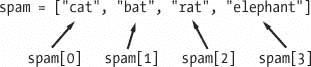
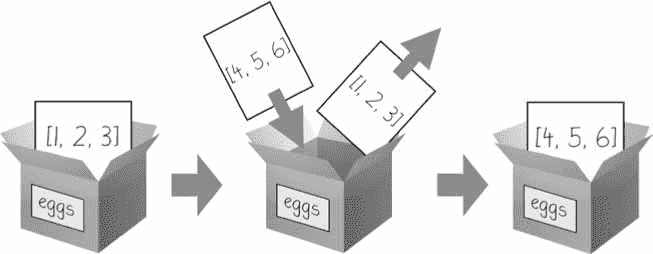
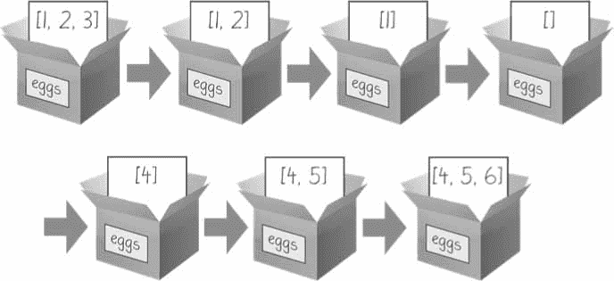
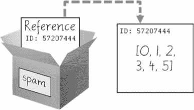
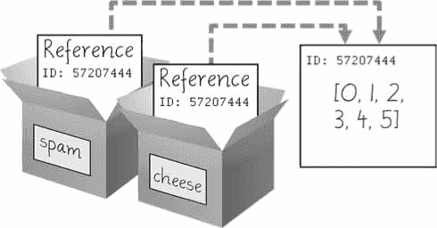
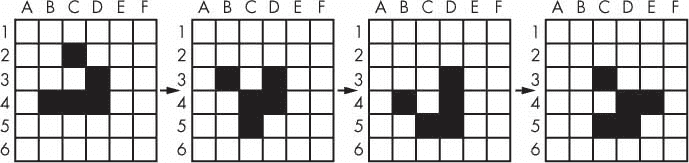

# 4 个列表

> 原文：<https://automatetheboringstuff.com/2e/chapter4/>


在开始认真编写程序之前，您需要理解的另一个主题是 list 数据类型及其表亲 tuple。列表和元组可以包含多个值，这使得编写处理大量数据的程序更加容易。由于列表本身可以包含其他列表，您可以使用它们将数据组织成层次结构。

在这一章，我将讨论列表的基础。我还将向您介绍方法，这些方法是与特定数据类型的值相关联的函数。然后，我将简要介绍序列数据类型(列表、元组和字符串),并展示它们之间的比较。在下一章，我将向你介绍字典数据类型。

### **列表数据类型**

一个*列表*是一个包含有序序列中多个值的值。术语*列表值*指的是列表本身(它是一个可以存储在变量中或像任何其他值一样传递给函数的值)，而不是列表值内部的值。列表值如下所示:`['cat', 'bat', 'rat', 'elephant']`。就像用引号字符键入字符串值来标记字符串的开始和结束位置一样，列表以左方括号开始，以右方括号`[]`结束。列表中的值也称为*项*。项目用逗号分隔(也就是说，它们是用逗号分隔的*。例如，在交互式 shell 中输入以下内容:*

```py
   >>> [1, 2, 3]

   [1, 2, 3]

   >>> ['cat', 'bat', 'rat', 'elephant']

   ['cat', 'bat', 'rat', 'elephant']

   >>> ['hello', 3.1415, True, None, 42]

   ['hello', 3.1415, True, None, 42]

   >>> spam = ['cat', 'bat', 'rat', 'elephant'] # ➊

   >>> spam

   ['cat', 'bat', 'rat', 'elephant']
```

`spam`变量 ➊ 仍然只被赋予一个值:列表值。但是列表值本身包含其他值。值`[]`是一个不包含任何值的空列表，类似于空字符串`''`。

#### ***获取带索引列表中的单个值***

假设您将列表`['cat', 'bat', 'rat', 'elephant']`存储在一个名为`spam`的变量中。Python 代码`spam[0]`将计算为`'cat'`，`spam[1]`将计算为`'bat'`，以此类推。列表后面方括号内的整数称为索引*。列表中的第一个值位于索引`0`，第二个值位于索引`1`，第三个值位于索引`2`，依此类推。[图 4-1](#calibre_link-708) 显示了分配给`spam`的列表值，以及索引表达式将评估的值。注意，因为第一个索引是`0`，所以最后一个索引比列表的大小小一；四个项目的列表将`3`作为它的最后一个索引。*

*

*图 4-1:存储在变量 spam 中的列表值，显示每个索引引用的是哪个值*

例如，在交互式 shell 中输入以下表达式。首先给变量`spam`分配一个列表。

```py
   >>> spam = ['cat', 'bat', 'rat', 'elephant']

   >>> spam[0]

   'cat'

   >>> spam[1]

   'bat'

   >>> spam[2]

   'rat'

   >>> spam[3]

   'elephant'

   >>> ['cat', 'bat', 'rat', 'elephant'][3]

   'elephant'

   >>> 'Hello, ' + spam[0] # ➊

   'Hello, cat' # ➋

   >>> 'The ' + spam[1] + ' ate the ' + spam[0] + '.'

   'The bat ate the cat.'
```

请注意，表达式`'Hello, ' + spam[0]` 、➊ 计算结果为`'Hello, ' + 'cat'`，因为`spam[0]`计算结果为字符串`'cat'`。这个表达式依次计算出字符串值`'Hello, cat'` ➋ 。

如果使用的索引超过了列表值中的值的数量，Python 会给出一个`IndexError`错误消息。

```py
>>> spam = ['cat', 'bat', 'rat', 'elephant']

>>> spam[10000]

Traceback (most recent call last):

  File "<pyshell#9>", line 1, in <module>

    spam[10000]

IndexError: list index out of range
```

索引只能是整数值，不能是浮点数。以下示例将导致一个`TypeError`错误:

```py
>>> spam = ['cat', 'bat', 'rat', 'elephant']

>>> spam[1]

'bat'

>>> spam[1.0]

Traceback (most recent call last):

  File "<pyshell#13>", line 1, in <module>

    spam[1.0]

TypeError: list indices must be integers or slices, not float

>>> spam[int(1.0)]

'bat'
```

列表还可以包含其他列表值。可以使用多个索引来访问这些列表中的值，如下所示:

```py
>>> spam = [['cat', 'bat'], [10, 20, 30, 40, 50]]

>>> spam[0]

['cat', 'bat']

>>> spam[0][1]

'bat'

>>> spam[1][4]

50
```

第一个索引指示使用哪个列表值，第二个索引指示列表值中的值。例如，`spam[0][1]`打印第一个列表中的第二个值`'bat'`。如果只使用一个索引，程序将在该索引处打印完整的列表值。

#### ***负指标***

虽然索引从`0`开始上升，但是也可以使用负整数作为索引。整数值`-1`指的是列表中的最后一个索引，数值`-2`指的是列表中的倒数第二个索引，依此类推。在交互式 shell 中输入以下内容:

```py
>>> spam = ['cat', 'bat', 'rat', 'elephant']

>>> spam[-1]

'elephant'

>>> spam[-3]

'bat'

>>> 'The ' + spam[-1] + ' is afraid of the ' + spam[-3] + '.'

'The elephant is afraid of the bat.'
```

#### ***用切片从另一个列表中获取一个列表***

就像索引可以从列表中获取单个值一样，一个*片*可以以新列表的形式从列表中获取多个值。像索引一样，切片在方括号之间键入，但它有两个由冒号分隔的整数。请注意索引和切片之间的区别。

*   `spam[2]`是带索引的列表(一个整数)。
*   `spam[1:4]`是一个带切片的列表(两个整数)。

在切片中，第一个整数是切片开始的索引。第二个整数是切片结束的索引。一个切片向上移动，但不包括第二个索引处的值。切片计算出新的列表值。在交互式 shell 中输入以下内容:

```py
>>> spam = ['cat', 'bat', 'rat', 'elephant']

>>> spam[0:4]

['cat', 'bat', 'rat', 'elephant']

>>> spam[1:3]

['bat', 'rat']

>>> spam[0:-1]

['cat', 'bat', 'rat']
```

作为一种快捷方式，您可以省略切片中冒号两边的一个或两个索引。省略第一个索引等同于使用`0`，或者列表的开头。省略第二个索引等同于使用列表的长度，这将切片到列表的末尾。在交互式 shell 中输入以下内容:

```py
>>> spam = ['cat', 'bat', 'rat', 'elephant']

>>> spam[:2]

['cat', 'bat']

>>> spam[1:]

['bat', 'rat', 'elephant']

>>> spam[:]

['cat', 'bat', 'rat', 'elephant']
```

#### ***用 len()函数得到列表的长度***

`len()`函数将返回传递给它的列表值中的值的数量，就像它可以计算字符串值中的字符数一样。在交互式 shell 中输入以下内容:

```py
>>> spam = ['cat', 'dog', 'moose']

>>> len(spam)

3
```

#### ***用索引改变列表中的值***

通常，变量名在赋值语句的左边，像`spam = 42`。但是，您也可以使用列表的索引来更改该索引处的值。例如，`spam[1] = 'aardvark'`表示“将列表`spam`中索引`1`处的值分配给字符串`'aardvark'`在交互式 shell 中输入以下内容:

```py
>>> spam = ['cat', 'bat', 'rat', 'elephant']

>>> spam[1] = 'aardvark'

>>> spam

['cat', 'aardvark', 'rat', 'elephant']

>>> spam[2] = spam[1]

>>> spam

['cat', 'aardvark', 'aardvark', 'elephant']

>>> spam[-1] = 12345

>>> spam

['cat', 'aardvark', 'aardvark', 12345]
```

#### ***列表拼接和列表复制***

列表可以像字符串一样连接和复制。`+`操作符合并两个列表来创建一个新的列表值，而`*`操作符可以与一个列表和一个整数值一起使用来复制列表。在交互式 shell 中输入以下内容:

```py
>>> [1, 2, 3] + ['A', 'B', 'C']

[1, 2, 3, 'A', 'B', 'C']

>>> ['X', 'Y', 'Z'] * 3

['X', 'Y', 'Z', 'X', 'Y', 'Z', 'X', 'Y', 'Z']

>>> spam = [1, 2, 3]

>>> spam = spam + ['A', 'B', 'C']

>>> spam

[1, 2, 3, 'A', 'B', 'C']
```

#### ***用 del 语句从列表中删除值***

`del`语句将删除列表中某个索引处的值。列表中删除值之后的所有值都将上移一个索引。例如，在交互式 shell 中输入以下内容:

```py
>>> spam = ['cat', 'bat', 'rat', 'elephant']

>>> del spam[2]

>>> spam

['cat', 'bat', 'elephant']

>>> del spam[2]

>>> spam

['cat', 'bat']
```

也可以在简单变量上使用`del`语句来删除它，就像它是一个“未赋值”语句一样。如果您在删除变量后试图使用它，您将得到一个`NameError`错误，因为该变量不再存在。实际上，你几乎不需要删除简单的变量。`del`语句主要用于从列表中删除值。

### **使用列表**

当您第一次开始编写程序时，很容易创建许多单独的变量来存储一组相似的值。例如，如果我想存储我的猫的名字，我可能会编写这样的代码:

```py
catName1 = 'Zophie'

catName2 = 'Pooka'

catName3 = 'Simon'

catName4 = 'Lady Macbeth'

catName5 = 'Fat-tail'

catName6 = 'Miss Cleo'
```

事实证明，这是一种糟糕的代码编写方式。(还有，我其实没养这么多猫，我发誓。)首先，如果猫的数量发生变化，你的程序将永远无法存储比变量更多的猫。这些类型的程序中也有许多重复或几乎相同的代码。考虑以下程序中有多少重复代码，您应该将这些代码输入到文件编辑器中，并另存为 *allMyCats1.py* :

```py
print('Enter the name of cat 1:')

catName1 = input()

print('Enter the name of cat 2:')

catName2 = input()

print('Enter the name of cat 3:')

catName3 = input()

print('Enter the name of cat 4:')

catName4 = input()

print('Enter the name of cat 5:')

catName5 = input()

print('Enter the name of cat 6:')

catName6 = input()

print('The cat names are:')

print(catName1 + ' ' + catName2 + ' ' + catName3 + ' ' + catName4 + ' ' +

catName5 + ' ' + catName6)
```

您可以使用包含列表值的单个变量，而不是使用多个重复的变量。例如，这里有一个新的改进版本的 *allMyCats1.py* 程序。这个新版本使用单一列表，可以存储用户输入的任意数量的猫。在一个新的文件编辑器窗口中，输入以下源代码并保存为 *allMyCats2.py* :

```py
catNames = []

while True:

    print('Enter the name of cat ' + str(len(catNames) + 1) + 

      ' (Or enter nothing to stop.):')

    name = input()

    if name == '':

        break

    catNames = catNames + [name]  # list concatenation

print('The cat names are:')

for name in catNames:

    print('  ' + name)
```

当您运行该程序时，输出将类似于以下内容:

```py
Enter the name of cat 1 (Or enter nothing to stop.):

Zophie

Enter the name of cat 2 (Or enter nothing to stop.):

Pooka

Enter the name of cat 3 (Or enter nothing to stop.):

Simon

Enter the name of cat 4 (Or enter nothing to stop.):

Lady Macbeth

Enter the name of cat 5 (Or enter nothing to stop.):

Fat-tail

Enter the name of cat 6 (Or enter nothing to stop.):

Miss Cleo

Enter the name of cat 7 (Or enter nothing to stop.):

The cat names are:

  Zophie

  Pooka

  Simon

  Lady Macbeth

  Fat-tail

  Miss Cleo
```

可以在 *[、https://autbor.com/allmycats1/](https://autbor.com/allmycats1/)*、https://autbor.com/allmycats2/*[查看这些程序的执行情况。使用列表的好处是你的数据现在是在一个结构中，所以你的程序在处理数据时比使用几个重复变量要灵活得多。](https://autbor.com/allmycats2/)*

#### ***使用 for 循环带列表***

在《T2》第 2 章中，你学习了如何使用`for`循环来执行一段代码一定的次数。从技术上讲，`for`循环对列表值中的每一项重复一次代码块。例如，如果您运行以下代码:

```py
for i in range(4):

    print(i)
```

该程序的输出如下:

```py
0

1

2

3
```

这是因为来自`range(4)`的返回值是一个 Python 认为类似于`[0, 1, 2, 3]`的序列值。(序列在第 93 页[的](#calibre_link-709)[序列数据类型](#calibre_link-175)中描述。)以下程序的输出与上一个程序相同:

```py
for i in [0, 1, 2, 3]:

    print(i)
```

前面的`for`循环实际上遍历了它的子句，变量`i`在每次迭代中被设置为`[0, 1, 2, 3]`列表中的一个连续值。

一种常见的 Python 技术是使用`range(len(` someList `))`和`for`循环来迭代列表的索引。例如，在交互式 shell 中输入以下内容:

```py
>>> supplies = ['pens', 'staplers', 'flamethrowers', 'binders']

>>> for i in range(len(supplies)):

...     print('Index ' + str(i) + ' in supplies is: ' + supplies[i])

Index 0 in supplies is: pens

Index 1 in supplies is: staplers

Index 2 in supplies is: flamethrowers

Index 3 in supplies is: binders
```

在前面显示的`for`循环中使用`range(len(supplies))`非常方便，因为循环中的代码可以访问索引(作为变量`i`)和该索引处的值(作为`supplies[i]`)。最棒的是，`range(len(supplies))`将遍历`supplies`的所有索引，不管它包含多少项。

#### ***【中与不中】运算符***

您可以使用`in`和`not in`操作符来确定一个值是否在列表中。像其他操作符一样，`in`和`not in`用在表达式中，连接两个值:在列表中查找的值和可能找到的列表。这些表达式将计算出一个布尔值。在交互式 shell 中输入以下内容:

```py
>>> 'howdy' in ['hello', 'hi', 'howdy', 'heyas']

True

>>> spam = ['hello', 'hi', 'howdy', 'heyas']

>>> 'cat' in spam

False

>>> 'howdy' not in spam

False

>>> 'cat' not in spam

True
```

例如，下面的程序让用户键入一个宠物名称，然后检查该名称是否在宠物列表中。打开一个新的文件编辑器窗口，输入以下代码，保存为 *myPets.py* :

```py
myPets = ['Zophie', 'Pooka', 'Fat-tail']

print('Enter a pet name:')

name = input()

if name not in myPets:

    print('I do not have a pet named ' + name)

else:

    print(name + ' is my pet.')
```

输出可能如下所示:

```py
Enter a pet name:

Footfoot

I do not have a pet named Footfoot
```

您可以在*[【https://autbor.com/mypets/】](https://autbor.com/mypets/)*查看该程序的执行情况。

#### ***多重赋值诡计***

*多重赋值技巧*(技术上称为*元组解包*)是一种快捷方式，让你在一行代码中用一个列表中的值给多个变量赋值。所以与其这样做:

```py
>>> cat = ['fat', 'gray', 'loud']

>>> size = cat[0]

>>> color = cat[1]

>>> disposition = cat[2]
```

您可以键入这行代码:

```py
>>> cat = ['fat', 'gray', 'loud']

>>> size, color, disposition = cat
```

变量的个数和列表的长度必须正好相等，否则 Python 会给你一个`ValueError`:

```py
>>> cat = ['fat', 'gray', 'loud']

>>> size, color, disposition, name = cat

Traceback (most recent call last):

  File "<pyshell#84>", line 1, in <module>

    size, color, disposition, name = cat

ValueError: not enough values to unpack (expected 4, got 3)
```

#### ***使用带有列表的枚举()函数***

不使用带有`for`循环的`range(len(` someList `))`技术来获取列表中条目的整数索引，而是调用`enumerate()`函数。在循环的每一次迭代中，`enumerate()`将返回两个值:列表中项的索引和列表中的项本身。例如，该代码相当于第 84 页的[中的“](#calibre_link-710)[使用带列表](#calibre_link-162)的循环”中的代码:

```py
>>> supplies = ['pens', 'staplers', 'flamethrowers', 'binders']

>>> for index, item in enumerate(supplies):

...     print('Index ' + str(index) + ' in supplies is: ' + item)

Index 0 in supplies is: pens

Index 1 in supplies is: staplers

Index 2 in supplies is: flamethrowers

Index 3 in supplies is: binders
```

如果您需要循环块中的项目和项目索引，那么`enumerate()`函数非常有用。

#### ***用列表使用 random.choice()和 random.shuffle()函数***

`random`模块有几个接受参数列表的函数。`random.choice()`函数将从列表中返回一个随机选择的项目。在交互式 shell 中输入以下内容:

```py
>>> import random

>>> pets = ['Dog', 'Cat', 'Moose']

>>> random.choice(pets)

'Dog'

>>> random.choice(pets)

'Cat'

>>> random.choice(pets)

'Cat'
```

你可以把`random.choice(someList)`看成是`someList[random.randint(0, len(someList) – 1]`的一个简称。

`random.shuffle()`函数将对列表中的项目进行重新排序。这个函数就地修改列表，而不是返回一个新的列表。在交互式 shell 中输入以下内容:

```py
>>> import random

>>> people = ['Alice', 'Bob', 'Carol', 'David']

>>> random.shuffle(people)

>>> people

['Carol', 'David', 'Alice', 'Bob']

>>> random.shuffle(people)

>>> people

['Alice', 'David', 'Bob', 'Carol']
```

### **扩充赋值运算符**

当给一个变量赋值时，你会经常用到变量本身。例如，在将`42`赋给变量`spam`之后，您可以用下面的代码将`spam`中的值增加`1`:

```py
>>> spam = 42

>>> spam = spam + 1

>>> spam

43
```

作为一种快捷方式，您可以使用增强的赋值操作符`+=`来做同样的事情:

```py
>>> spam = 42

>>> spam += 1

>>> spam

43
```

对于`+`、`-`、`*`、`/`和`%`运算符有增强赋值运算符，如[表 4-1](#calibre_link-711) 所述。

**表 4-1:** 增广赋值运算符

<colgroup><col class="calibre18"></colgroup><colgroup><col class="calibre18"></colgroup>
| **扩充赋值语句** | **等价赋值语句** |
| --- | --- |
| `spam += 1` | `spam = spam + 1` |
| `spam -= 1` | `spam = spam - 1` |
| `spam *= 1` | `spam = spam * 1` |
| `spam /= 1` | `spam = spam / 1` |
| `spam %= 1` | `spam = spam % 1` |

`+=`操作符也可以连接字符串和列表，而`*=`操作符可以复制字符串和列表。在交互式 shell 中输入以下内容:

```py
>>> spam = 'Hello,'

>>> spam += ' world!'

>>> spam

'Hello world!'

>>> bacon = ['Zophie']

>>> bacon *= 3

>>> bacon

['Zophie', 'Zophie', 'Zophie']
```

### **方法**

一个*方法*和一个函数是一样的，除了它被“调用”一个值。例如，如果一个列表值存储在`spam`中，您可以像下面这样调用该列表的`index()`列表方法(稍后我会解释这个方法):`spam.index('hello')`。方法部分跟在值后面，用句点分隔。

每种数据类型都有自己的一套方法。例如，列表数据类型有几个有用的方法来查找、添加、移除和操作列表中的值。

#### ***用 index()方法在列表中查找值***

列表值有一个可以传递值的`index()`方法，如果列表中存在该值，则返回该值的索引。如果值不在列表中，那么 Python 会产生一个`ValueError`错误。在交互式 shell 中输入以下内容:

```py
>>> spam = ['hello', 'hi', 'howdy', 'heyas']

>>> spam.index('hello')

0

>>> spam.index('heyas')

3

>>> spam.index('howdy howdy howdy')

Traceback (most recent call last):

  File "<pyshell#31>", line 1, in <module>

    spam.index('howdy howdy howdy')

ValueError: 'howdy howdy howdy' is not in list
```

当列表中有重复的值时，返回它第一次出现的索引。在交互式 shell 中输入以下内容，注意`index()`返回的是`1`，而不是`3`:

```py
>>> spam = ['Zophie', 'Pooka', 'Fat-tail', 'Pooka']

>>> spam.index('Pooka')

1
```

#### ***用 append()和 insert()方法向列表添加值***

要向列表中添加新值，请使用`append()`和`insert()`方法。在交互式 shell 中输入以下内容，对存储在变量`spam`中的列表值调用`append()`方法:

```py
>>> spam = ['cat', 'dog', 'bat']

>>> spam.append('moose')

>>> spam

['cat', 'dog', 'bat', 'moose']
```

前面的`append()`方法调用将参数添加到列表的末尾。`insert()`方法可以在列表中的任何索引处插入一个值。`insert()`的第一个参数是新值的索引，第二个参数是要插入的新值。在交互式 shell 中输入以下内容:

```py
>>> spam = ['cat', 'dog', 'bat']

>>> spam.insert(1, 'chicken')

>>> spam

['cat', 'chicken', 'dog', 'bat']
```

注意代码是`spam.append('moose')`和`spam.insert(1, 'chicken')`，而不是`spam = spam.append('moose')`和`spam = spam.insert(1, 'chicken')`。`append()`和`insert()`都不会给出`spam`的新值作为其返回值。(事实上，`append()`和`insert()`的返回值是`None`，所以您肯定不想将它存储为新的变量值。)相反，该列表在处被修改*。在第 94 页的[上的](#calibre_link-712)[可变和不可变数据类型](#calibre_link-176)中会更详细地介绍就地修改列表。*

方法属于单一数据类型。`append()`和`insert()`方法是列表方法，只能在列表值上调用，不能在字符串或整数等其他值上调用。在交互式 shell 中输入以下内容，注意显示的`AttributeError`错误消息:

```py
>>> eggs = 'hello'

>>> eggs.append('world')

Traceback (most recent call last):

  File "<pyshell#19>", line 1, in <module>

    eggs.append('world')

AttributeError: 'str' object has no attribute 'append'

>>> bacon = 42

>>> bacon.insert(1, 'world')

Traceback (most recent call last):

  File "<pyshell#22>", line 1, in <module>

    bacon.insert(1, 'world')

AttributeError: 'int' object has no attribute 'insert'
```

#### ***用 remove()方法从列表中删除值***

向`remove()`方法传递要从调用它的列表中删除的值。在交互式 shell 中输入以下内容:

```py
>>> spam = ['cat', 'bat', 'rat', 'elephant']

>>> spam.remove('bat')

>>> spam

['cat', 'rat', 'elephant']
```

试图删除列表中不存在的值将导致`ValueError`错误。例如，在交互式 shell 中输入以下内容，并注意显示的错误:

```py
>>> spam = ['cat', 'bat', 'rat', 'elephant']

>>> spam.remove('chicken')

Traceback (most recent call last):

  File "<pyshell#11>", line 1, in <module>

    spam.remove('chicken')

ValueError: list.remove(x): x not in list
```

如果该值在列表中出现多次，则只会删除该值的第一个实例。在交互式 shell 中输入以下内容:

```py
>>> spam = ['cat', 'bat', 'rat', 'cat', 'hat', 'cat']

>>> spam.remove('cat')

>>> spam

['bat', 'rat', 'cat', 'hat', 'cat']
```

当您知道想要从列表中删除的值的索引时，可以使用`del`语句。当您知道要从列表中删除的值时,`remove()`方法非常有用。

#### ***用 sort()方法对列表中的值进行排序***

可以用`sort()`方法对数值列表或字符串列表进行排序。例如，在交互式 shell 中输入以下内容:

```py
>>> spam = [2, 5, 3.14, 1, -7]

>>> spam.sort()

>>> spam

[-7, 1, 2, 3.14, 5]

>>> spam = ['ants', 'cats', 'dogs', 'badgers', 'elephants']

>>> spam.sort()

>>> spam

['ants', 'badgers', 'cats', 'dogs', 'elephants']
```

您还可以为`reverse`关键字参数传递`True`,让`sort()`对值进行逆序排序。在交互式 shell 中输入以下内容:

```py
>>> spam.sort(reverse=True)

>>> spam

['elephants', 'dogs', 'cats', 'badgers', 'ants']
```

关于`sort()`方法，您应该注意三件事。首先，`sort()`方法对列表进行就地排序；不要试图通过编写像`spam = spam.sort()`这样的代码来获取返回值。

第二，不能对同时包含数字值*和*字符串值的列表进行排序，因为 Python 不知道如何比较这些值。在交互式 shell 中输入以下内容，注意`TypeError`错误:

```py
>>> spam = [1, 3, 2, 4, 'Alice', 'Bob']

>>> spam.sort()

Traceback (most recent call last):

  File "<pyshell#70>", line 1, in <module>

    spam.sort()

TypeError: '<' not supported between instances of 'str' and 'int'
```

第三，`sort()`使用“按字母顺序”而不是实际的字母顺序对字符串进行排序。这意味着大写字母在小写字母之前。因此，小写的 *a* 被排序，使得它出现在大写的 *Z* 之后*。例如，在交互式 shell 中输入以下内容:*

```py
>>> spam = ['Alice', 'ants', 'Bob', 'badgers', 'Carol', 'cats']

>>> spam.sort()

>>> spam

['Alice', 'Bob', 'Carol', 'ants', 'badgers', 'cats']
```

如果您需要按照常规的字母顺序对值进行排序，请在`sort()`方法调用中为`key`关键字参数传递`str.lower`。

```py
>>> spam = ['a', 'z', 'A', 'Z']

>>> spam.sort(key=str.lower)

>>> spam

['a', 'A', 'z', 'Z']
```

这导致`sort()`函数将列表中的所有项目视为小写，而不会实际改变列表中的值。

#### ***用 reverse()方法反转列表中的值***

如果需要快速反转列表中项目的顺序，可以调用`reverse()` list 方法。在交互式 shell 中输入以下内容:

```py
>>> spam = ['cat', 'dog', 'moose']

>>> spam.reverse()

>>> spam

['moose', 'dog', 'cat']
```

**PYTHON 中缩进规则的例外**

在大多数情况下，一行代码的缩进量告诉 Python 它在哪个块中。然而，这条规则也有一些例外。例如，列表实际上可以跨越源代码文件中的几行。这些行的缩进没有关系；Python 知道，直到看到结束的方括号，列表才结束。例如，您可以编写如下所示的代码:

```py
spam = ['apples',

    'oranges',

                    'bananas',

'cats']

print(spam)
```

当然，实际上来说，大多数人使用 Python 的行为来使他们的列表看起来漂亮易读，就像 Magic 8 Ball 程序中的 messages 列表一样。

您也可以在末尾使用 \ *行继续符*将一条指令拆分成多行。想想 \ 说的，“这个指令在下一行继续。” \ 行延续后的行上的缩进不明显。例如，以下是有效的 Python 代码:

```py
print('Four score and seven ' + \

      'years ago...')
```

当您想要重新排列 Python 代码的长行以便更具可读性时，这些技巧非常有用。

像`sort()`列表方法一样，`reverse()`不返回列表。这就是为什么你写`spam.reverse()`，而不是`spam = spam.reverse()`。

### **示例程序:带列表的魔法 8 球**

使用列表，你可以编写前一章的魔术 8 球程序的一个更加优雅的版本。您可以创建代码使用的单个列表，而不是几行几乎相同的`elif`语句。打开一个新的文件编辑器窗口，并输入以下代码。保存为 *magic8Ball2.py* 。

```py
import random

messages = ['It is certain',

    'It is decidedly so',

    'Yes definitely',

    'Reply hazy try again',

    'Ask again later',

    'Concentrate and ask again',

    'My reply is no',

    'Outlook not so good',

    'Very doubtful']

print(messages[random.randint(0, len(messages) - 1)])
```

您可以在*[【https://autbor.com/magic8ball2/】](https://autbor.com/magic8ball2/)*查看该程序的执行情况。

当你运行这个程序时，你会发现它的工作方式与之前的 *magic8Ball.py* 程序相同。

注意您用作`messages` : `random.randint (0, len(messages) - 1)`索引的表达式。这将产生一个随机数用于索引，而不管`messages`的大小。也就是说，你会得到一个介于`0`和`len(messages) - 1`之间的随机数。这种方法的好处是，您可以轻松地在`messages`列表中添加和删除字符串，而无需更改其他代码行。如果您稍后更新代码，您需要更改的代码行将会更少，您引入 bug 的机会也会更少。

### **序列数据类型**

列表不是表示有序值序列的唯一数据类型。例如，如果您将字符串视为单个文本字符的“列表”，那么字符串和列表实际上是相似的。Python 序列数据类型包括列表、字符串、`range()`返回的范围对象和元组(在[第 96 页](#calibre_link-713)的“[元组数据类型](#calibre_link-177)”中解释)。您可以用列表做的许多事情也可以用字符串和其他序列类型的值来做:索引；切片；通过`for`循环、`len()`以及`in`和`not in`操作符来使用它们。要查看这一点，请在交互式 shell 中输入以下内容:

```py
>>> name = 'Zophie'

>>> name[0]

'Z'

>>> name[-2]

'i'

>>> name[0:4]

'Zoph'

>>> 'Zo' in name

True

>>> 'z' in name

False

>>> 'p' not in name

False

>>> for i in name:

...     print('* * * ' + i + ' * * *')

* * * Z * * *

* * * o * * *

* * * p * * *

* * * h * * *

* * * i * * *

* * * e * * *
```

#### ***可变和不可变数据类型***

但是列表和字符串在一个重要的方面是不同的。列表值是一种*可变的*数据类型:它可以添加、删除或更改值。然而，一个字符串是*不可变的*:它不能被改变。尝试重新分配字符串中的单个字符会导致一个`TypeError`错误，您可以通过在交互式 shell 中输入以下内容看到这一点:

```py
>>> name = 'Zophie a cat'

>>> name[7] = 'the'

Traceback (most recent call last):

  File "<pyshell#50>", line 1, in <module>

    name[7] = 'the'

TypeError: 'str' object does not support item assignment
```

“变异”一个字符串的正确方法是使用切片和连接，通过复制旧字符串的一部分来构建一个新的*字符串。在交互式 shell 中输入以下内容:*

```py
>>> name = 'Zophie a cat'

>>> newName = name[0:7] + 'the' + name[8:12]

>>> name

'Zophie a cat'

>>> newName

'Zophie the cat'
```

我们使用了`[0:7]`和`[8:12]`来指代我们不希望替换的字符。注意，原始的`'Zophie a cat'`字符串没有被修改，因为字符串是不可变的。

尽管列表值*是*可变的，但是下面代码中的第二行并没有修改列表`eggs`:

```py
>>> eggs = [1, 2, 3]

>>> eggs = [4, 5, 6]

>>> eggs

[4, 5, 6]
```

这里没有更改`eggs`中的列表值；相反，一个全新的不同的列表值(`[4, 5, 6]`)正在覆盖旧的列表值(`[1, 2, 3]`)。这在[图 4-2](#calibre_link-714) 中进行了描述。

如果你真的想修改`eggs`中的原始列表来包含`[4, 5, 6]`，你必须这样做:

```py
>>> eggs = [1, 2, 3]

>>> del eggs[2]

>>> del eggs[1]

>>> del eggs[0]

>>> eggs.append(4)

>>> eggs.append(5)

>>> eggs.append(6)

>>> eggs

[4, 5, 6]
```



*图 4-2:当执行eggs =【4，5，6】时， eggs 的内容被替换为一个新的列表值。*

在第一个例子中，`eggs`结束时的列表值与开始时的列表值相同。只是这个列表被修改了，而不是被覆盖了。[图 4-3](#calibre_link-715) 描绘了前一个交互式 shell 示例中的前七行所做的七个更改。



*图 4-3:del语句和 append() 方法就地修改同一个列表值。*

改变一个可变数据类型的值(就像前面例子中的`del`语句和`append()`方法所做的那样)会就地改变值，因为变量值不会被新的列表值替换。

可变类型和不可变类型看起来似乎没有意义，但是第 100 页[上的“](#calibre_link-716)[传递引用](#calibre_link-181)将解释使用可变参数和不可变参数调用函数时的不同行为。但是首先，让我们了解一下 tuple 数据类型，它是 list 数据类型的一种不可变形式。

#### ***元组数据类型***

除了两个方面之外，*元组*数据类型几乎与列表数据类型相同。首先，用圆括号、`(`和`)`键入元组，而不是方括号、`[`和`]`。例如，在交互式 shell 中输入以下内容:

```py
>>> eggs = ('hello', 42, 0.5)

>>> eggs[0]

'hello'

>>> eggs[1:3]

(42, 0.5)

>>> len(eggs)

3
```

但是元组不同于列表的主要方式是元组像字符串一样是不可变的。不能修改、追加或删除元组的值。在交互式 shell 中输入以下内容，并查看`TypeError`错误消息:

```py
>>> eggs = ('hello', 42, 0.5)

>>> eggs[1] = 99

Traceback (most recent call last):

  File "<pyshell#5>", line 1, in <module>

    eggs[1] = 99

TypeError: 'tuple' object does not support item assignment
```

如果您的元组中只有一个值，您可以通过在括号内的值后放置一个尾随逗号来表明这一点。否则，Python 会认为你只是在普通括号内输入了一个值。逗号让 Python 知道这是一个元组值。(与其他一些编程语言不同，在 Python 中，在列表或元组的最后一项后面有一个尾随逗号是没有问题的。)在交互式 shell 中输入下面的`type()`函数调用，以查看区别:

```py
>>> type(('hello',))

<class 'tuple'>

>>> type(('hello'))

<class 'str'>
```

您可以使用元组向任何阅读您的代码的人传达您不打算改变值的序列。如果您需要从不改变的有序值序列，请使用元组。使用元组而不是列表的第二个好处是，因为它们是不可变的，它们的内容不会改变，所以 Python 可以实现一些优化，使使用元组的代码比使用列表的代码略快。

#### ***用 list()和 tuple()函数转换类型***

就像`str(42)`将如何返回`'42'`，整数的字符串表示`42`，函数`list()`和`tuple()`将返回传递给它们的值的列表和元组版本。在交互式 shell 中输入以下内容，注意返回值的数据类型与传递的值不同:

```py
>>> tuple(['cat', 'dog', 5])

('cat', 'dog', 5)

>>> list(('cat', 'dog', 5))

['cat', 'dog', 5]

>>> list('hello')

['h', 'e', 'l', 'l', 'o']
```

如果您需要一个可变版本的元组值，那么将元组转换为列表是很方便的。

### **参考文献**

如您所见，变量“存储”字符串和整数值。然而，这种解释是对 Python 实际工作的简化。从技术上来说，变量存储的是对存储值的计算机内存位置的引用。在交互式 shell 中输入以下内容:

```py
>>> spam = 42

>>> cheese = spam

>>> spam = 100

>>> spam

100

>>> cheese

42
```

当您将`42`赋给`spam`变量时，您实际上是在计算机内存中创建了`42`值，并在 spam 变量中存储了一个对它的*引用*。当你复制`spam`中的值并将其赋给变量`cheese`时，你实际上是在复制引用。`spam`和`cheese`变量都是指计算机内存中的`42`值。当您稍后将`spam`中的值更改为`100`时，您正在创建一个新的`100`值，并将对它的引用存储在`spam`中。这不影响`cheese`中的值。整数是不变的值；更改 *spam* 变量实际上是让它引用内存中一个完全不同的值。

但是列表不是这样工作的，因为列表值可以改变；也就是说，列表是*可变的*。下面是一些代码，可以使这种区别更容易理解。在交互式 shell 中输入以下内容:

```py
   >>> spam = [0, 1, 2, 3, 4, 5] # ➊

   >>> cheese = spam # The reference is being copied, not the list. # ➋

   >>> cheese[1] = 'Hello!' # This changes the list value. # ➌

   >>> spam

   [0, 'Hello!', 2, 3, 4, 5]

   >>> cheese # The cheese variable refers to the same list.

   [0, 'Hello!', 2, 3, 4, 5]
```

这对你来说可能有点奇怪。代码只涉及到了`cheese`列表，但是似乎`cheese`和`spam`列表都发生了变化。

当您创建列表 ➊ 时，您在`spam`变量中为它分配一个引用。但是下一行 ➋ 只复制了`spam`到`cheese`中的列表引用，而不是列表值本身。这意味着存储在`spam`和`cheese`中的值现在都指向同一个列表。只有一个底层列表，因为列表本身实际上从未被复制过。所以当你修改`cheese` ➌ 的第一个元素时，你就是在修改`spam`引用的同一个列表。

请记住，变量就像包含值的盒子。本章前面的图显示了框中的列表并不精确，因为列表变量实际上并不包含列表——它们包含对列表的*引用*。(这些引用会有 Python 内部使用的 ID 号，但是你可以忽略它们。)用盒子来比喻变量，[图 4-4](#calibre_link-717) 显示了当一个列表被分配给`spam`变量时会发生什么。



*图 4-4: spam = [0，1，2，3，4，5] 存储一个列表的引用，而不是实际的列表。*

然后在[图 4-5](#calibre_link-718) 中，将`spam`中的参考复制到`cheese`。只有一个新的引用被创建并存储在`cheese`中，而不是一个新的列表。注意这两个引用是如何引用同一个列表的。



*图 4-5: spam = cheese 复制引用，不是列表。*

当你改变`cheese`引用的列表时，`spam`引用的列表也随之改变，因为`cheese`和`spam`引用的是同一个列表。你可以在[图 4-6](#calibre_link-719) 中看到这一点。


*图 4-6: 奶酪[1] = '你好！'修改两个变量引用的列表。*

虽然 Python 变量在技术上包含了对值的引用，但人们经常会随口说变量包含了值。

#### ***身份和 id()功能***

您可能想知道为什么前一节中可变列表的奇怪行为没有发生在整数或字符串这样的不可变值上。我们可以用 Python 的`id()`函数来理解这一点。Python 中的所有值都有一个惟一的标识，可以用`id()`函数获得。在交互式 shell 中输入以下内容:

```py
>>> id('Howdy') # The returned number will be different on your machine.

44491136
```

当 Python 运行`id('Howdy')`时，它会在计算机的内存中创建`'Howdy'`字符串。存储字符串的数字内存地址由`id()`函数返回。Python 根据当时计算机上哪些内存字节是空闲的来选择这个地址，所以每次运行这段代码都会有所不同。

和所有字符串一样，`'Howdy'`是不可变的，不能更改。如果你“改变”了一个变量中的字符串，一个新的字符串对象就在内存中的不同位置产生了，这个变量引用了这个新的字符串。例如，在交互式 shell 中输入以下内容，并查看由`bacon`引用的字符串的标识是如何变化的:

```py
>>> bacon = 'Hello'

>>> id(bacon)

44491136

>>> bacon += ' world!' # A new string is made from 'Hello' and ' world!'. 

>>> id(bacon) # bacon now refers to a completely different string.

44609712
```

然而，列表可以被修改，因为它们是可变的对象。`append()`方法不创建新的列表对象；它改变现有的列表对象。我们称之为“就地修改对象*”。*

```py
>>> eggs = ['cat', 'dog'] # This creates a new list.

>>> id(eggs)

35152584

>>> eggs.append('moose') # append() modifies the list "in place".

>>> id(eggs) # eggs still refers to the same list as before.

35152584

>>> eggs = ['bat', 'rat', 'cow'] # This creates a new list, which has a new

identity.

>>> id(eggs) # eggs now refers to a completely different list.

44409800
```

如果两个变量引用同一个列表(就像上一节中的`spam`和`cheese`)并且列表值本身发生了变化，那么这两个变量都会受到影响，因为它们都引用同一个列表。`append()`、`extend()`、`remove()`、`sort()`、`reverse()`等列表方法就地修改它们的列表。

Python 的*自动垃圾收集器*删除任何变量没有引用的值来释放内存。您不需要担心垃圾收集器是如何工作的，这是一件好事:在其他编程语言中，手动内存管理是常见的错误来源。

#### ***路过推荐人***

引用对于理解参数如何传递给函数尤其重要。当调用函数时，实参的值被复制到形参变量中。对于列表(和字典，我将在下一章描述)，这意味着引用的副本被用于参数。要查看结果，请打开一个新的文件编辑器窗口，输入以下代码，并将其保存为 *passingReference.py* :

```py
def eggs(someParameter):

    someParameter.append('Hello')

spam = [1, 2, 3]

eggs(spam)

print(spam)
```

注意，当调用`eggs()`时，返回值并不用于给`spam`赋值。相反，它直接就地修改列表。运行时，该程序产生以下输出:

```py
[1, 2, 3, 'Hello']
```

尽管`spam`和`someParameter`包含不同的引用，但它们都引用同一个列表。这就是为什么函数内部的`append('Hello')`方法调用即使在函数调用返回后也会影响列表。

请记住这种行为:忘记 Python 以这种方式处理列表和字典变量会导致令人困惑的错误。

#### ***复制模块的 copy()和 deepcopy()函数***

虽然传递引用通常是处理列表和字典的最便捷的方式，但是如果函数修改了传递的列表或字典，您可能不希望在原始列表或字典值中进行这些更改。为此，Python 提供了一个名为`copy`的模块，该模块同时提供了`copy()`和`deepcopy()`功能。第一个是`copy.copy()`，可以用来复制一个可变值，就像一个列表或字典，而不仅仅是一个引用的副本。在交互式 shell 中输入以下内容:

```py
>>> import copy

>>> spam = ['A', 'B', 'C', 'D']

>>> id(spam)

44684232

>>> cheese = copy.copy(spam)

>>> id(cheese) # cheese is a different list with different identity.

44685832

>>> cheese[1] = 42

>>> spam

['A', 'B', 'C', 'D']

>>> cheese

['A', 42, 'C', 'D']
```

现在`spam`和`cheese`变量引用不同的列表，这就是为什么当你在索引`1`赋值`42`时，只有`cheese`中的列表被修改。如图 4-7 中的[所示，两个变量的参考 ID 号不再相同，因为变量指的是独立列表。](#calibre_link-720)


*图 4-7:cheese = copy . copy(spam)创建第二个列表，可以独立于第一个列表进行修改。*

如果需要复制的列表包含列表，那么使用`copy.deepcopy()`函数代替`copy.copy()`。`deepcopy()`函数也将复制这些内部列表。

### **一个短节目:康威的人生游戏**

康威的《生命的游戏》是*细胞自动机*的一个例子:一套规则控制着由离散细胞组成的领域的行为。在实践中，它创建了一个漂亮的动画来看。你可以用正方形作为单元格，在绘图纸上画出每一步。一个填满的正方形将是“活的”，而一个空的正方形将是“死的”。如果一个活着的方块有两个或三个活着的邻居，它继续生活在下一个台阶上。如果一个死方块正好有三个活着的邻居，它会在下一步活过来。每隔一格死亡或在下一步保持死亡。你可以在[图 4-8](#calibre_link-721) 中看到一个步骤进展的例子。



*图 4-8:康威人生游戏模拟的四个步骤*

尽管规则很简单，但还是会出现许多令人惊讶的行为。康威生命游戏中的模式可以移动、自我复制，甚至模仿 CPU。但是在所有这些复杂行为的基础上，高级行为是一个相当简单的程序。

我们可以用一列列表来表示二维场。内部列表表示每一列方块，并为活方块存储一个`'#'`散列字符串，为死方块存储一个`' '`空格字符串。在文件编辑器中键入以下源代码，并将文件保存为 *conway.py* 。如果你不太明白所有代码是如何工作的，这没关系；只需输入它，并尽可能按照这里提供的注释和解释进行操作:

```py
# Conway's Game of Life

import random, time, copy

WIDTH = 60

HEIGHT = 20

# Create a list of list for the cells:

nextCells = []

for x in range(WIDTH):

    column = [] # Create a new column.

    for y in range(HEIGHT):

        if random.randint(0, 1) == 0:

            column.append('#') # Add a living cell.

        else:

            column.append(' ') # Add a dead cell.

    nextCells.append(column) # nextCells is a list of column lists.

while True: # Main program loop.

    print('\n\n\n\n\n') # Separate each step with newlines.

    currentCells = copy.deepcopy(nextCells)

    # Print currentCells on the screen:

    for y in range(HEIGHT):

        for x in range(WIDTH):

            print(currentCells[x][y], end='') # Print the # or space.

        print() # Print a newline at the end of the row.

    # Calculate the next step's cells based on current step's cells:

    for x in range(WIDTH):

        for y in range(HEIGHT):

            # Get neighboring coordinates:

            # `% WIDTH` ensures leftCoord is always between 0 and WIDTH - 1

            leftCoord  = (x - 1) % WIDTH

            rightCoord = (x + 1) % WIDTH

            aboveCoord = (y - 1) % HEIGHT

            belowCoord = (y + 1) % HEIGHT

            # Count number of living neighbors:

            numNeighbors = 0

            if currentCells[leftCoord][aboveCoord] == '#':

                numNeighbors += 1 # Top-left neighbor is alive.

            if currentCells[x][aboveCoord] == '#':

                numNeighbors += 1 # Top neighbor is alive.

            if currentCells[rightCoord][aboveCoord] == '#':

                numNeighbors += 1 # Top-right neighbor is alive.

            if currentCells[leftCoord][y] == '#':

                numNeighbors += 1 # Left neighbor is alive.

            if currentCells[rightCoord][y] == '#':

                numNeighbors += 1 # Right neighbor is alive.

            if currentCells[leftCoord][belowCoord] == '#':

                numNeighbors += 1 # Bottom-left neighbor is alive.

            if currentCells[x][belowCoord] == '#':

                numNeighbors += 1 # Bottom neighbor is alive.

            if currentCells[rightCoord][belowCoord] == '#':

                numNeighbors += 1 # Bottom-right neighbor is alive.

            # Set cell based on Conway's Game of Life rules:

            if currentCells[x][y] == '#' and (numNeighbors == 2 or

numNeighbors == 3):

                # Living cells with 2 or 3 neighbors stay alive:

                nextCells[x][y] = '#'

            elif currentCells[x][y] == ' ' and numNeighbors == 3:

                # Dead cells with 3 neighbors become alive:

                nextCells[x][y] = '#'

            else:

                # Everything else dies or stays dead:

                nextCells[x][y] = ' '

    time.sleep(1) # Add a 1-second pause to reduce flickering.
```

让我们从顶部开始，逐行查看这段代码。

```py
# Conway's Game of Life

import random, time, copy

WIDTH = 60

HEIGHT = 20
```

首先我们导入包含我们需要的函数的模块，即`random.randint()`、`time.sleep()`和`copy.deepcopy()`函数。

```py
# Create a list of list for the cells:

nextCells = []

for x in range(WIDTH):

    column = [] # Create a new column.

    for y in range(HEIGHT):

        if random.randint(0, 1) == 0:

            column.append('#') # Add a living cell.

        else:

            column.append(' ') # Add a dead cell.

    nextCells.append(column) # nextCells is a list of column lists.
```

我们细胞自动机的第一步将是完全随机的。我们需要创建一个列表的列表数据结构来存储代表活细胞或死细胞的`'#'`和`' '`字符串，它们在列表列表中的位置反映了它们在屏幕上的位置。每个内部列表代表一列单元格。`random.randint(0, 1)`呼叫给出了细胞开始存活或死亡的 50/50 的机会。

我们将这个列表放在一个名为`nextCells`的变量中，因为我们主程序循环的第一步是将`nextCells`复制到`currentCells`中。对于我们的列表数据结构，x 坐标从左边的 0 开始，向右增加，而 y 坐标从顶部的 0 开始，向下增加。因此，`nextCells[0][0]`将代表屏幕左上角的单元格，而`nextCells[1][0]`代表该单元格右边的单元格，`nextCells[0][1]`代表它下面的单元格。

```py
while True: # Main program loop.

    print('\n\n\n\n\n') # Separate each step with newlines.

    currentCells = copy.deepcopy(nextCells)
```

我们主程序循环的每一次迭代都将是我们细胞自动机的一个单独的步骤。在每一步中，我们将复制`nextCells`到`currentCells`，在屏幕上打印`currentCells`，然后使用`currentCells`中的单元格计算`nextCells`中的单元格。

```py
    # Print currentCells on the screen:

    for y in range(HEIGHT):

        for x in range(WIDTH):

            print(currentCells[x][y], end='') # Print the # or space.

        print() # Print a newline at the end of the row.
```

这些嵌套的`for`循环确保我们将一整行单元格打印到屏幕上，并在行尾跟随一个换行符。我们对`nextCells`中的每一行重复这一过程。

```py
    # Calculate the next step's cells based on current step's cells:

    for x in range(WIDTH):

        for y in range(HEIGHT):

            # Get neighboring coordinates:

            # `% WIDTH` ensures leftCoord is always between 0 and WIDTH - 1

            leftCoord  = (x - 1) % WIDTH

            rightCoord = (x + 1) % WIDTH

            aboveCoord = (y - 1) % HEIGHT

            belowCoord = (y + 1) % HEIGHT
```

接下来，我们需要使用两个嵌套的`for`循环来计算下一步的每个单元格。细胞的生存或死亡状态取决于邻居，所以让我们首先计算细胞在当前 x 和 y 坐标左侧、右侧、上方和下方的索引。

`%` mod 操作符执行“回绕”最左列`0`中单元的左邻居将是`0 - 1`或`-1`。为了将它绕到最右列的索引`59`，我们计算`(0 - 1) % WIDTH`。因为`WIDTH`是`60`，所以这个表达式的计算结果是`59`。这种 mod-wraparound 技术同样适用于右、上、下邻居。

```py
            # Count number of living neighbors:

            numNeighbors = 0

            if currentCells[leftCoord][aboveCoord] == '#':

                numNeighbors += 1 # Top-left neighbor is alive.

            if currentCells[x][aboveCoord] == '#':

                numNeighbors += 1 # Top neighbor is alive.

            if currentCells[rightCoord][aboveCoord] == '#':

                numNeighbors += 1 # Top-right neighbor is alive.

            if currentCells[leftCoord][y] == '#':

                numNeighbors += 1 # Left neighbor is alive.

            if currentCells[rightCoord][y] == '#':

                numNeighbors += 1 # Right neighbor is alive.

            if currentCells[leftCoord][belowCoord] == '#':

                numNeighbors += 1 # Bottom-left neighbor is alive.

            if currentCells[x][belowCoord] == '#':

                numNeighbors += 1 # Bottom neighbor is alive.

            if currentCells[rightCoord][belowCoord] == '#':

                numNeighbors += 1 # Bottom-right neighbor is alive.
```

为了决定`nextCells[x][y]`处的细胞是活的还是死的，我们需要计算`currentCells[x][y]`拥有的活邻居的数量。这一系列的`if`语句检查该单元的八个邻居中的每一个，并为每个活着的邻居将`1`加到`numNeighbors`。

```py
            # Set cell based on Conway's Game of Life rules:

            if currentCells[x][y] == '#' and (numNeighbors == 2 or

numNeighbors == 3):

                # Living cells with 2 or 3 neighbors stay alive:

                nextCells[x][y] = '#'

            elif currentCells[x][y] == ' ' and numNeighbors == 3:

                # Dead cells with 3 neighbors become alive:

                nextCells[x][y] = '#'

            else:

                # Everything else dies or stays dead:

                nextCells[x][y] = ' '

    time.sleep(1) # Add a 1-second pause to reduce flickering.
```

现在我们已经知道了在`currentCells[x][y]`时单元的活邻居的数量，我们可以将`nextCells[x][y]`设置为`'#'`或`' '`。在我们遍历完所有可能的 x 和 y 坐标后，程序通过调用`time.sleep(1)`暂停 1 秒钟。然后程序执行回到主程序循环的开始，继续下一步。

已经发现了几种模式，它们的名称是“滑翔机”、“螺旋桨”或“重量级宇宙飞船”如图 4-8 中的[所示，滑翔机模式产生了每四步对角“移动”的模式。你可以在我们的 *conway.py* 程序中替换这条线来制作一架单人滑翔机:](#calibre_link-721)

```py
        if random.randint(0, 1) == 0:
```

使用这一行:

```py
        if (x, y) in ((1, 0), (2, 1), (0, 2), (1, 2), (2, 2)):
```

你可以在网上搜索到更多关于康威的《生命游戏》制作的有趣装置的信息。你可以在找到其他简短的基于文本的 Python 程序，比如这个。

### **总结**

列表是有用的数据类型，因为它们允许您编写代码来处理单个变量中可修改数量的值。在本书的后面，你会看到程序使用列表来做一些没有列表很难或者不可能做的事情。

列表是可变的序列数据类型，这意味着它们的内容可以改变。元组和字符串虽然也是序列数据类型，但它们是不可变的，不能更改。包含元组或字符串值的变量可以被新的元组或字符串值覆盖，但这与就地修改现有值不是一回事——比如说，`append()`或`remove()`方法对列表所做的。

变量不直接存储列表值；他们将*引用*存储到列表中。当您在函数调用中复制变量或传递列表作为参数时，这是一个重要的区别。因为被复制的值是列表引用，所以请注意，对列表所做的任何更改都可能影响程序中的另一个变量。如果你想改变一个变量中的列表而不修改原始列表，你可以使用`copy()`或`deepcopy()`。

### **练习题**

[1](#calibre_link-722) 。什么是`[]`？

[2](#calibre_link-723) 。如何将值`'hello'`指定为存储在名为`spam`的变量中的列表的第三个值？(假设`spam`包含`[2, 4, 6, 8, 10]`。)

对于下面三个问题，假设`spam`包含列表`['a', 'b', 'c', 'd']`。

[3](#calibre_link-724) 。`spam[int(int('3' * 2) // 11)]`评价什么？

[4](#calibre_link-725) 。`spam[-1]`评价什么？

[5](#calibre_link-726) 。`spam[:2]`评价什么？

下面三个问题，假设`bacon`包含列表`[3.14, 'cat', 11, 'cat', True]`。

[6](#calibre_link-727) 。`bacon.index('cat')`评价什么？

[7](#calibre_link-728) 。`bacon.append(99)`让`bacon`里的列表值变成什么样子？

[8](#calibre_link-729) 。`bacon.remove('cat')`让`bacon`里的列表值变成什么样子？

[9](#calibre_link-730) 。列表串联和列表复制的操作符是什么？

[10](#calibre_link-731) 。`append()`和`insert()`列表方法有什么区别？

[11](#calibre_link-732) 从列表中删除值的两种方法是什么？

[12](#calibre_link-733) 。列举一些列表值类似于字符串值的方式。

13 。列表和元组有什么区别？

[14](#calibre_link-735) 。如何键入只有整数值`42`的元组值？

[15](#calibre_link-736) 如何获得列表值的元组形式？如何获得元组值的列表形式？

[16](#calibre_link-737) 。“包含”列表值的变量实际上并不直接包含列表。它们包含什么呢？

[17](#calibre_link-738) 。`copy.copy()`和`copy.deepcopy()`有什么区别？

### **实践项目**

为了练习，编写程序来完成以下任务。

#### ***逗号代码***

假设您有一个列表值，如下所示:

```py
spam = ['apples', 'bananas', 'tofu', 'cats']
```

编写一个函数，该函数将一个列表值作为参数，并返回一个字符串，其中所有项由逗号和空格分隔，在最后一项之前插入*和*。例如，将前面的`spam`列表传递给函数将返回`'apples, bananas, tofu, and cats'`。但是您的函数应该能够处理传递给它的任何列表值。一定要测试一个空列表`[]`被传递给你的函数的情况。

#### ***硬币翻转条纹***

在这个练习中，我们将尝试做一个实验。如果你掷一枚硬币 100 次，并写下每个正面的“H”和每个反面的“T”，你将创建一个看起来像“T T T T H H H H T T”的列表。如果你让一个人随机掷 100 次硬币，你可能会得到像“H T H T H H T H T H T H T”这样的正反交替的结果，这看起来是随机的(对人来说)，但在数学上不是随机的。一个人几乎永远不会连续写下一连串的六个正面或六个反面，尽管这极有可能发生在真正随机的掷硬币中。可以预见，人类不擅长随机。

写一个程序，找出在随机生成的正面和反面列表中出现六个正面或六个反面的频率。您的程序将实验分成两部分:第一部分生成随机选择的`'heads'`和`'tails'`值的列表，第二部分检查其中是否有条纹。将所有这些代码放入一个循环中，重复该实验 10，000 次，这样我们就可以找出在投掷的硬币中有百分之多少包含连续六次正面或反面。作为一个提示，函数调用`random.randint(0, 1)`将在 50%的时间里返回一个`0`值，在另外 50%的时间里返回一个`1`值。

您可以从以下模板开始:

```py
import random

numberOfStreaks = 0

for experimentNumber in range(10000):

    # Code that creates a list of 100 'heads' or 'tails' values.

    # Code that checks if there is a streak of 6 heads or tails in a row.

print('Chance of streak: %s%%' % (numberOfStreaks / 100))
```

当然，这只是一个估计，但 10，000 是一个体面的样本量。一些数学知识可以给你准确的答案，省去你写程序的麻烦，但是程序员的数学是出了名的差。

#### ***人物图片网格***

假设您有一个列表，其中内部列表中的每个值都是一个单字符字符串，如下所示:

```py
grid = [['.', '.', '.', '.', '.', '.'],

        ['.', 'O', 'O', '.', '.', '.'],

        ['O', 'O', 'O', 'O', '.', '.'],

        ['O', 'O', 'O', 'O', 'O', '.'],

        ['.', 'O', 'O', 'O', 'O', 'O'],

        ['O', 'O', 'O', 'O', 'O', '.'],

        ['O', 'O', 'O', 'O', '.', '.'],

        ['.', 'O', 'O', '.', '.', '.'],

        ['.', '.', '.', '.', '.', '.']]
```

把`grid[x][y]`想象成用文本字符绘制的“图片”的 x 和 y 坐标上的字符。`(0, 0)`原点在左上角，x 坐标向右增加，y 坐标向下增加。

复制先前的网格值，并编写使用它来打印图像的代码。

```py
..OO.OO..

.OOOOOOO.

.OOOOOOO.

..OOOOO..

...OOO...

....O....
```

提示:你需要在一个循环中使用一个循环来打印`grid[0][0]`，然后`grid[1][0]`，然后`grid[2][0]`，依此类推，直到`grid[8][0]`。这将完成第一行，然后打印一个换行符。然后你的程序应该打印`grid[0][1]`，然后`grid[1][1]`，然后`grid[2][1]`，依此类推。你的程序最后要打印的是`grid[8][5]`。

另外，如果您不想在每次`print()`调用后自动打印一个换行符，记得将`end`关键字参数传递给`print()`。*