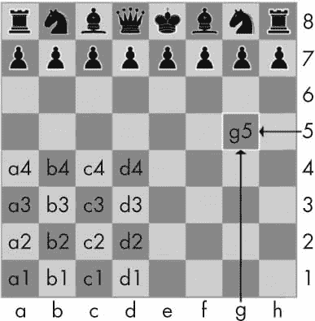
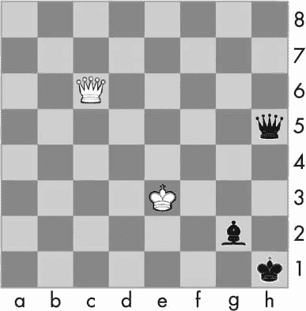
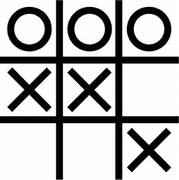

# 5 字典和结构化数据

> 原文：<https://automatetheboringstuff.com/2e/chapter5/>


在这一章中，我将介绍字典数据类型，它提供了一种灵活的方式来访问和组织数据。然后，结合字典和上一章的列表知识，您将学习如何创建一个数据结构来模拟井字游戏板。

### **字典数据类型**

像列表一样，*字典*是许多值的可变集合。但是与列表的索引不同，字典的索引可以使用许多不同的数据类型，而不仅仅是整数。字典的索引被称为*键*，一个键及其相关值被称为*键-值对*。

在代码中，字典是用大括号`{}`键入的。在交互式 shell 中输入以下内容:

```py
>>> myCat = {'size': 'fat', 'color': 'gray', 'disposition': 'loud'}
```

这为`myCat`变量分配了一个字典。这本字典的关键字是`'size'`、`'color'`和`'disposition'`。这些键的值分别是`'fat'`、`'gray'`和`'loud'`。您可以通过它们的键来访问这些值:

```py
>>> myCat['size']

'fat'

>>> 'My cat has ' + myCat['color'] + ' fur.'

'My cat has gray fur.'
```

字典仍然可以使用整数值作为键，就像列表使用整数作为索引一样，但是它们不必从`0`开始，可以是任何数字。

```py
>>> spam = {12345: 'Luggage Combination', 42: 'The Answer'}
```

#### ***字典 vs .列表***

与列表不同，字典中的条目是无序的。名为`spam`的列表中的第一项将是`spam[0]`。但是字典里没有“第一”项。虽然项目的顺序对于确定两个列表是否相同很重要，但是键-值对在字典中的键入顺序并不重要。在交互式 shell 中输入以下内容:

```py
>>> spam = ['cats', 'dogs', 'moose']

>>> bacon = ['dogs', 'moose', 'cats']

>>> spam == bacon

False

>>> eggs = {'name': 'Zophie', 'species': 'cat', 'age': '8'}

>>> ham = {'species': 'cat', 'age': '8', 'name': 'Zophie'}

>>> eggs == ham

True
```

因为字典是没有顺序的，所以不能像列表一样切片。

试图访问字典中不存在的键将导致一个`KeyError`错误消息，很像列表的“超出范围”`IndexError`错误消息。在交互式 shell 中输入以下内容，注意因为没有`'color'`键而出现的错误消息:

```py
>>> spam = {'name': 'Zophie', 'age': 7}

>>> spam['color']

Traceback (most recent call last):

  File "<pyshell#1>", line 1, in <module>

    spam['color']

KeyError: 'color'
```

虽然字典是没有顺序的，但是你可以有任意的键值，这使得你可以用强大的方式来组织你的数据。假设您希望您的程序存储朋友的生日数据。您可以使用一个字典，将姓名作为键，将生日作为值。打开一个新的文件编辑器窗口，并输入以下代码。保存为 *birthdays.py* 。

```py
➊ birthdays = {'Alice': 'Apr 1', 'Bob': 'Dec 12', 'Carol': 'Mar 4'}

   while True:

       print('Enter a name: (blank to quit)')

       name = input()

       if name == '':

           break

    ➋ if name in birthdays:

        ➌ print(birthdays[name] + ' is the birthday of ' + name)

       else:

           print('I do not have birthday information for ' + name)

           print('What is their birthday?')

           bday = input()

        ➍ birthdays[name] = bday

           print('Birthday database updated.')
```

您可以在 https://autbor.com/bdaydb 的*T3*查看该程序的执行情况。您创建了一个初始字典，并将其存储在`birthdays` ➊ 中。您可以使用关键字`in`和 ➋ 查看输入的名称是否作为关键字存在于字典中，就像您对列表所做的一样。如果名字在字典中，你可以使用方括号 ➌ 访问相关的值；如果没有，您可以使用相同的方括号语法结合赋值操作符 ➍ 来添加它。

当您运行这个程序时，它将看起来像这样:

```py
Enter a name: (blank to quit)

Alice

Apr 1 is the birthday of Alice

Enter a name: (blank to quit)

Eve

I do not have birthday information for Eve

What is their birthday?

Dec 5

Birthday database updated.

Enter a name: (blank to quit)

Eve

Dec 5 is the birthday of Eve

Enter a name: (blank to quit)
```

当然，当程序终止时，你在这个程序中输入的所有数据都会被忘记。你将在第 9 章中学习如何将数据保存到硬盘上的文件中。

**PYTHON 3.7 中的有序字典**

虽然它们仍然是无序的，没有“第一个”键值对，但是 Python 3.7 和更高版本中的字典会记住它们的键值对的插入顺序，如果您从它们创建一个序列值的话。例如，注意从鸡蛋和火腿字典中生成的列表中的条目顺序与它们被输入的顺序相匹配:

```py
>>> eggs = {'name': 'Zophie', 'species': 'cat', 'age': '8'}

>>> list(eggs)

['name', 'species', 'age']

>>> ham = {'species': 'cat', 'age': '8', 'name': 'Zophie'}

>>> list(ham)

['species', 'age', 'name']
```

这些字典仍然是无序的，因为你不能使用像eggs【0】或ham【2】这样的整数索引来访问其中的条目。您不应该依赖这种行为，因为旧版本 Python 中的字典不记得键值对的插入顺序。例如，请注意，当我在 Python 3.5 中运行以下代码时，列表与字典的键值对的插入顺序不匹配:

```py
>>> spam = {}

>>> spam['first key'] = 'value'

>>> spam['second key'] = 'value'

>>> spam['third key'] = 'value'

>>> list(spam)

['first key', 'third key', 'second key']
```

#### ***key()、values()和 items()方法***

有三种字典方法会返回字典的键、值或键和值的类似列表的值:`keys()`、`values()`和`items()`。这些方法返回的值不是真实列表:它们不能被修改并且没有`append()`方法。但是这些数据类型(`dict_keys`、`dict_values`和`dict_items`)可以在`for`循环中使用*。要了解这些方法是如何工作的，请在交互式外壳中输入以下内容:*

```py
>>> spam = {'color': 'red', 'age': 42}

>>> for v in spam.values():

...     print(v)

red

42
```

这里，`for`循环遍历`spam`字典中的每个值。一个`for`循环也可以遍历键或者键和值:

```py
>>> for k in spam.keys():

...     print(k)

color

age

>>> for i in spam.items():

...     print(i)

('color', 'red')

('age', 42)
```

当您使用`keys()`、`values()`和`items()`方法时，`for`循环可以分别遍历字典中的键、值或键值对。注意，`items()`方法返回的`dict_items`值中的值是键和值的元组。

如果您想从这些方法中得到一个真实的列表，请将其类似列表的返回值传递给`list()`函数。在交互式 shell 中输入以下内容:

```py
>>> spam = {'color': 'red', 'age': 42}

>>> spam.keys()

dict_keys(['color', 'age'])

>>> list(spam.keys())

['color', 'age']
```

`list(spam.keys())`行获取从`keys()`返回的`dict_keys`值，并将其传递给`list()`，然后返回一个列表值`['color', 'age']`。

你也可以在一个`for`循环中使用多重赋值的技巧，将键和值赋给不同的变量。在交互式 shell 中输入以下内容:

```py
>>> spam = {'color': 'red', 'age': 42}

>>> for k, v in spam.items():

...     print('Key: ' + k + ' Value: ' + str(v))

Key: age Value: 42

Key: color Value: red
```

#### ***检查字典中是否存在关键字或值***

回想一下前一章，操作符`in`和`not in`可以检查一个值是否存在于一个列表中。您还可以使用这些操作符来查看字典中是否存在某个键或值。在交互式 shell 中输入以下内容:

```py
>>> spam = {'name': 'Zophie', 'age': 7}

>>> 'name' in spam.keys()

True

>>> 'Zophie' in spam.values()

True

>>> 'color' in spam.keys()

False

>>> 'color' not in spam.keys()

True

>>> 'color' in spam

False
```

在前面的例子中，注意到`'color' in spam`实际上是编写`'color' in spam.keys()`的一个更短的版本。情况总是这样:如果您想检查一个值是否是字典中的一个键，您可以简单地使用`in`(或`not in`)关键字和字典值本身。

#### ***get()方法***

在访问某个键的值之前，检查该键是否存在于字典中是很繁琐的。幸运的是，字典有一个`get()`方法，它接受两个参数:要检索的值的键和如果该键不存在要返回的后备值。

在交互式 shell 中输入以下内容:

```py
>>> picnicItems = {'apples': 5, 'cups': 2}

>>> 'I am bringing ' + str(picnicItems.get('cups', 0)) + ' cups.'

'I am bringing 2 cups.'

>>> 'I am bringing ' + str(picnicItems.get('eggs', 0)) + ' eggs.'

'I am bringing 0 eggs.'
```

因为在`picnicItems`字典中没有`'eggs'`键，所以默认值`0`由`get()`方法返回。如果不使用`get()`，代码将会导致错误消息，如下例所示:

```py
>>> picnicItems = {'apples': 5, 'cups': 2}

>>> 'I am bringing ' + str(picnicItems['eggs']) + ' eggs.'

Traceback (most recent call last):

  File "<pyshell#34>", line 1, in <module>

    'I am bringing ' + str(picnicItems['eggs']) + ' eggs.'

KeyError: 'eggs'
```

#### ***set default()方法***

只有当某个键还没有值时，才需要在字典中为该键设置一个值。代码看起来像这样:

```py
spam = {'name': 'Pooka', 'age': 5}

if 'color' not in spam:

    spam['color'] = 'black'
```

`setdefault()`方法提供了一种在一行代码中做到这一点的方法。传递给该方法的第一个参数是要检查的键，第二个参数是在该键不存在时要在该键上设置的值。如果这个键确实存在，那么`setdefault()`方法将返回这个键的值。在交互式 shell 中输入以下内容:

```py
>>> spam = {'name': 'Pooka', 'age': 5}

>>> spam.setdefault('color', 'black')

'black'

>>> spam

{'color': 'black', 'age': 5, 'name': 'Pooka'}

>>> spam.setdefault('color', 'white')

'black'

>>> spam

{'color': 'black', 'age': 5, 'name': 'Pooka'}
```

第一次调用`setdefault()`时，`spam`中的字典变为`{'color': 'black', 'age': 5, 'name': 'Pooka'}`。该方法返回值`'black'`，因为这是现在为键`'color'`设置的值。当接下来调用`spam.setdefault('color', 'white')`时，该键的值是*而不是*变为`'white'`，因为`spam`已经有一个名为`'color'`的键。

`setdefault()`方法是确保一个键存在的一个很好的捷径。这是一个计算字符串中每个字母出现次数的短程序。打开文件编辑器窗口，输入以下代码，保存为 *characterCount.py* :

```py
message = 'It was a bright cold day in April, and the clocks were striking

thirteen.'

count = {}

for character in message:

➊ count.setdefault(character, 0)

➋ count[character] = count[character] + 1

print(count)    
```

您可以在*[https://autbor.com/setdefault](https://autbor.com/setdefault)*查看该程序的执行情况。程序循环遍历`message`变量字符串中的每个字符，计算每个字符出现的频率。`setdefault()`方法调用 ➊ 确保键在`count`字典中(默认值为`0`)，所以当`count[character] = count[character] + 1`被执行 ➋ 时程序不会抛出`KeyError`错误。当您运行该程序时，输出将如下所示:

```py
{' ': 13, ',': 1, '.': 1, 'A': 1, 'I': 1, 'a': 4, 'c': 3, 'b': 1, 'e': 5, 'd': 3, 'g': 2,

'i': 6, 'h': 3, 'k': 2, 'l': 3, 'o': 2, 'n': 4, 'p': 1, 's': 3, 'r': 5, 't': 6, 'w': 2, 'y': 1}
```

从输出中可以看到，小写字母 *c* 出现了 3 次，空格字符出现了 13 次，大写字母 *A* 出现了 1 次。无论`message`变量中的字符串是什么，这个程序都会运行，即使字符串有几百万个字符长！

### **漂亮的印刷**

如果你将`pprint`模块导入到你的程序中，你将可以使用`pprint()`和`pformat()`函数来“漂亮地打印”一个字典的值。当您希望字典中的条目显示比`print()`提供的更清晰时，这很有帮助。修改之前的 *characterCount.py* 程序，保存为 *prettyCharacterCount.py* 。

```py
import pprint

message = 'It was a bright cold day in April, and the clocks were striking

thirteen.'

count = {}

for character in message:

    count.setdefault(character, 0)

    count[character] = count[character] + 1

pprint.pprint(count)
```

您可以在*[【https://autbor.com/pprint/】](https://autbor.com/pprint/)*查看该程序的执行情况。这一次，当程序运行时，输出看起来更加清晰，键已经排序。

```py
{' ': 13,

 ',': 1,

 '.': 1,

 'A': 1,

 'I': 1,

 --snip--

 't': 6,

 'w': 2,

 'y': 1}
```

当字典本身包含嵌套列表或字典时，`pprint.pprint()`函数特别有用。

如果您想以字符串值的形式获得美化后的文本，而不是在屏幕上显示，请调用`pprint.pformat()`来代替。这两条线彼此等价:

```py
pprint.pprint(someDictionaryValue)

print(pprint.pformat(someDictionaryValue))
```

### **使用数据结构来模拟现实世界的事物**

甚至在互联网出现之前，和世界另一端的人下棋也是可能的。每个玩家都要在自己家里搭起一个棋盘，然后轮流给对方寄明信片，描述每一步棋。要做到这一点，玩家需要一种方法来明确地描述棋盘的状态和他们的移动。

在*代数国际象棋符号*中，棋盘上的空格由一个数字和字母坐标来标识，如图[图 5-1](#calibre_link-1128) 。



*图 5-1:代数象棋符号中棋盘的坐标*

棋子用字母标识: *K* 代表国王， *Q* 代表王后， *R* 代表车， *B* 代表主教， *N* 代表骑士。描述一个动作使用棋子的字母和它的目的地的坐标。一对这样的移动描述了在一个回合中发生的事情(白棋先走)；例如，符号 *2。Nf3 Nc6* 表示游戏第二回合白棋移动一个骑士到 f3，黑棋移动一个骑士到 c6。

代数符号比这多一点，但重点是你可以明确地描述一盘棋，而不需要在棋盘前。你的对手甚至可以在世界的另一端！事实上，如果你有好的记忆力，你甚至不需要一副实体的国际象棋:你可以只阅读邮寄的国际象棋走法和更新你想象中的棋盘。

电脑有很好的记忆力。现代计算机上的一个程序可以像`'2\. Nf3 Nc6'`一样轻松存储数十亿个字符串。这就是计算机如何在没有物理棋盘的情况下下棋。他们将数据建模为棋盘，您可以编写代码来使用该模型。

这就是列表和字典的用武之地。例如，字典`{'1h': 'bking', '6c': 'wqueen', '2g': 'bbishop', '5h': 'bqueen', '3e': 'wking'}`可以代表图 5-2 中[的棋盘。](#calibre_link-1129)



*图 5-2:字典* '1h': 'bking '，' 6c': 'wqueen '，' 2g': 'bbishop '，' 5h': 'bqueen '，' 3e': 'wking'}

但是另一个例子，你将使用一个比国际象棋简单一点的游戏:井字游戏。

#### ***一个井字牌***

井字游戏棋盘看起来像一个大散列符号(#)，有九个槽，每个槽可以包含一个 *X* 、一个 *O* 或一个空格。为了用字典表示电路板，你可以给每个插槽分配一个串值键，如图[图 5-3](#calibre_link-1130) 所示。


*图 5-3:井字游戏棋盘的插槽及其对应的按键*

您可以使用字符串值来表示棋盘上每个插槽中的内容:`'X'`、`'O'`或`' '`(一个空格)。因此，您需要存储九个字符串。为此，您可以使用一个值字典。带`'top-R'`键的字符串值可以表示右上角，带`'low-L'`键的字符串值可以表示左下角，带`'mid-M'`键的字符串值可以表示中间，以此类推。

这个字典是一个表示井字游戏棋盘的数据结构。将这个 board-as-a-dictionary 存储在一个名为`theBoard`的变量中。打开一个新的文件编辑器窗口，输入以下源代码，保存为 *ticTacToe.py* :

```py
theBoard = {'top-L': ' ', 'top-M': ' ', 'top-R': ' ',

            'mid-L': ' ', 'mid-M': ' ', 'mid-R': ' ',

            'low-L': ' ', 'low-M': ' ', 'low-R': ' '}
```

存储在`theBoard`变量中的数据结构代表了[图 5-4](#calibre_link-1131) 中的井字牌。


*图 5-4:一个空的井字棋盘*

因为`theBoard`中每个键的值都是一个单空格字符串，所以这个字典代表了一个完全清晰的棋盘。如果玩家 X 先走，选择了中间的空格，你可以用这个字典来代表那个棋盘:

```py
theBoard = {'top-L': ' ', 'top-M': ' ', 'top-R': ' ',

            'mid-L': ' ', 'mid-M': 'X', 'mid-R': ' ',

            'low-L': ' ', 'low-M': ' ', 'low-R': ' '}
```

`theBoard`中的数据结构现在代表了[图 5-5](#calibre_link-1132) 中的井字牌。


*图 5-5:第一招*

玩家 O 通过在顶部放置 *O* s 而获胜的棋盘可能看起来像这样:

```py
theBoard = {'top-L': 'O', 'top-M': 'O', 'top-R': 'O',

            'mid-L': 'X', 'mid-M': 'X', 'mid-R': ' ',

            'low-L': ' ', 'low-M': ' ', 'low-R': 'X'}
```

`theBoard`中的数据结构现在代表了[图 5-6](#calibre_link-1133) 中的井字牌。



图 5-6:玩家 O 赢了。

当然，玩家看到的只是打印到屏幕上的内容，而不是变量的内容。让我们创建一个函数，将纸板词典打印到屏幕上。向 *ticTacToe.py* 添加以下内容(新代码以粗体显示):

```py
theBoard = {'top-L': ' ', 'top-M': ' ', 'top-R': ' ',

            'mid-L': ' ', 'mid-M': ' ', 'mid-R': ' ',

            'low-L': ' ', 'low-M': ' ', 'low-R': ' '}

def printBoard(board):

    print(board['top-L'] + '|' + board['top-M'] + '|' + board['top-R'])

    print('-+-+-')

    print(board['mid-L'] + '|' + board['mid-M'] + '|' + board['mid-R'])

    print('-+-+-')

    print(board['low-L'] + '|' + board['low-M'] + '|' + board['low-R'])

printBoard(theBoard)
```

您可以在 https://autbor.com/tictactoe1/的 *[查看该程序的执行情况。当你运行这个程序时，`printBoard()`会打印出一张空白的井字牌。](https://autbor.com/tictactoe1/)*

```py
 | |

-+-+-

 | |

-+-+-

 | |
```

`printBoard()`函数可以处理你传递给它的任何井字游戏数据结构。尝试将代码更改为以下内容:

```py
theBoard = {'top-L': 'O', 'top-M': 'O', 'top-R': 'O', 'mid-L': 'X', 'mid-M':

'X', 'mid-R': ' ', 'low-L': ' ', 'low-M': ' ', 'low-R': 'X'}

def printBoard(board):

    print(board['top-L'] + '|' + board['top-M'] + '|' + board['top-R'])

    print('-+-+-')

    print(board['mid-L'] + '|' + board['mid-M'] + '|' + board['mid-R'])

    print('-+-+-')

    print(board['low-L'] + '|' + board['low-M'] + '|' + board['low-R'])

printBoard(theBoard)
```

您可以在*[【https://autbor.com/tictactoe2/】](https://autbor.com/tictactoe2/)*查看该程序的执行情况。现在，当你运行这个程序，新的董事会将被打印到屏幕上。

```py
O|O|O

-+-+-

X|X|  

-+-+-

 | |X
```

因为您创建了一个数据结构来表示井字游戏棋盘，并在`printBoard()`中编写了代码来解释该数据结构，所以您现在有了一个“模拟”井字游戏棋盘的程序。你可以用不同的方式组织你的数据结构(例如，使用像`'TOP-LEFT'`这样的键而不是`'top-L'`，但是只要代码和你的数据结构一起工作，你就会有一个正确工作的程序。

例如，`printBoard()`函数期望井字游戏数据结构是一个包含所有九个槽的键的字典。如果您传递的字典丢失了，比如说,`'mid-L'`键，您的程序将不再工作。

```py
O|O|O

-+-+-

Traceback (most recent call last):

  File "ticTacToe.py", line 10, in <module>

    printBoard(theBoard)

  File "ticTacToe.py", line 6, in printBoard

    print(board['mid-L'] + '|' + board['mid-M'] + '|' + board['mid-R'])

KeyError: 'mid-L'
```

现在让我们添加允许玩家输入他们的移动的代码。修改 *ticTacToe.py* 程序，如下所示:

```py
theBoard = {'top-L': ' ', 'top-M': ' ', 'top-R': ' ', 'mid-L': ' ', 'mid-M':

' ', 'mid-R': ' ', 'low-L': ' ', 'low-M': ' ', 'low-R': ' '}

def printBoard(board):

    print(board['top-L'] + '|' + board['top-M'] + '|' + board['top-R'])

    print('-+-+-')

    print(board['mid-L'] + '|' + board['mid-M'] + '|' + board['mid-R'])

    print('-+-+-')

    print(board['low-L'] + '|' + board['low-M'] + '|' + board['low-R'])

turn = 'X'

for i in range(9):

  ➊ printBoard(theBoard)

     print('Turn for ' + turn + '. Move on which space?')

  ➋ move = input()

  ➌ theBoard[move] = turn

  ➍ if turn == 'X':

         turn = 'O'

     else:

         turn = 'X'

 printBoard(theBoard)
```

您可以在*[【https://autbor.com/tictactoe3/】](https://autbor.com/tictactoe3/)*查看该程序的执行情况。新代码在每个新回合开始时打印出棋盘 ➊ ，获取活动玩家的移动 ➋ ，相应地更新游戏棋盘 ➌ ，然后在进入下一回合之前交换活动玩家 ➍ 。

当您运行这个程序时，它看起来会像这样:

```py
 | |

-+-+-

 | |

-+-+-

 | |

Turn for X. Move on which space?

mid-M

 | |

-+-+-

 |X|  

-+-+-

 | |

--snip--

O|O|X

-+-+-

X|X|O

-+-+-

O| |X

Turn for X. Move on which space?

low-M

O|O|X

-+-+-

X|X|O

-+-+-

O|X|X
```

这不是一个完整的井字游戏——例如，它从不检查玩家是否赢了——但这足以说明数据结构如何在程序中使用。

**注**

如果你好奇，完整的井字游戏程序的源代码在 https://nostarch.com/automatestuff2/的参考资料中有描述。

#### ***嵌套字典和列表***

对井字游戏棋盘建模相当简单:棋盘只需要一个字典值和九个键值对。当您对更复杂的事物建模时，您可能会发现您需要包含其他字典和列表的字典和列表。列表对于包含一系列有序的值非常有用，而字典对于将键与值相关联非常有用。例如，这里有一个程序使用了一个字典，这个字典包含了其他关于客人带什么东西去野餐的字典。`totalBrought()`函数可以读取该数据结构，并计算所有客人携带的物品总数。

```py
allGuests = {'Alice': {'apples': 5, 'pretzels': 12},

             'Bob': {'ham sandwiches': 3, 'apples': 2},

             'Carol': {'cups': 3, 'apple pies': 1}}

def totalBrought(guests, item):

    numBrought = 0

  ➊ for k, v in guests.items():

      ➋ numBrought = numBrought + v.get(item, 0)

     return numBrought

print('Number of things being brought:')

print(' - Apples         ' + str(totalBrought(allGuests, 'apples')))

print(' - Cups           ' + str(totalBrought(allGuests, 'cups')))

print(' - Cakes          ' + str(totalBrought(allGuests, 'cakes')))

print(' - Ham Sandwiches ' + str(totalBrought(allGuests, 'ham sandwiches')))

print(' - Apple Pies     ' + str(totalBrought(allGuests, 'apple pies')))
```

您可以在*[https://autbor.com/guestpicnic/](https://autbor.com/guestpicnic/)*查看该程序的执行情况。在`totalBrought()`函数内部，`for`循环遍历`guests` ➊ 中的键值对。在这个循环中，客人姓名的字符串被分配给`k`，他们带的野餐项目的字典被分配给`v`。如果项目参数作为关键字存在于该字典中，其值(数量)将被添加到`numBrought` ➋ 。如果它不作为键存在，`get()`方法返回要添加到`numBrought`的`0`。

该程序的输出如下所示:

```py
 Number of things being brought:

 - Apples 7

 - Cups 3

 - Cakes 0

 - Ham Sandwiches 3

 - Apple Pies 1
```

这似乎是一件很简单的建模事情，你不需要写一个程序来完成它。但是要意识到，同样的`totalBrought()`函数可以轻松处理包含成千上万游客的字典，每个游客都带来*成千上万*不同的野餐项目。那么将这些信息和`totalBrought()`函数一起放在一个数据结构中会节省您很多时间！

你可以用你喜欢的任何方式用数据结构建模，只要你程序中的其他代码可以正确地使用数据模型。当您第一次开始编程时，不要太担心建模数据的“正确”方式。随着您获得更多的经验，您可能会提出更有效的模型，但是重要的是数据模型为您的程序的需要而工作。

### **总结**

在这一章中，你学习了所有关于字典的知识。列表和词典是可以包含多个值的值，包括其他列表和词典。字典很有用，因为您可以将一个项目(键)映射到另一个项目(值)，这与列表相反，列表只是按顺序包含一系列值。就像列表一样，使用方括号来访问字典中的值。代替整数索引，字典可以有各种数据类型的键:整数、浮点数、字符串或元组。通过将程序的值组织成数据结构，可以创建现实世界对象的表示。你看到了一个井字游戏板的例子。

### **练习题**

[1](#calibre_link-1134) 。空字典的代码是什么样的？

[2](#calibre_link-1135) 。带有键`'foo'`和值`42`的字典值是什么样子的？

[3](#calibre_link-1136) 。字典和列表的主要区别是什么？

[4](#calibre_link-1137) 。如果`spam`是`{'bar': 100}`，你试图访问`spam['foo']`会发生什么？

[5](#calibre_link-1138) 。如果一个字典存储在`spam`中，那么`'cat' in spam`和`'cat' in spam.keys()`的表达式有什么区别？

[6](#calibre_link-1139) 。如果一个字典存储在`spam`中，那么`'cat' in spam`和`'cat' in spam.values()`的表达式有什么区别？

[7](#calibre_link-1140) 。以下代码的快捷方式是什么？

如果'颜色'不在垃圾邮件中:
垃圾邮件['颜色'] = '黑色'

[8](#calibre_link-1141) 。什么模块和函数可以用来“漂亮地打印”字典值？

### **实践项目**

为了练习，编写程序来完成以下任务。

#### ***象棋字典验证器***

在这一章中，我们使用字典值`{'1h': 'bking', '6c': 'wqueen', '2g': 'bbishop', '5h': 'bqueen', '3e': 'wking'}`来表示一个棋盘。编写一个名为`isValidChessBoard()`的函数，它接受一个字典参数，并根据板子是否有效返回`True`或`False`。

有效的牌只有一张黑王和一张白王。每个玩家最多只能有 16 个棋子，最多 8 个棋子，并且所有的棋子必须在从`'1a'`到`'8h';`的一个有效空间上也就是说，一个棋子不能在空间`'9z'`上。作品名称以`'w'`或`'b'`开头，代表白色或黑色，后面是`'pawn'`、`'knight'`、`'bishop'`、`'rook'`、`'queen'`或`'king'`。当一个错误导致了一个不正确的棋盘时，这个函数应该能够检测到。

#### ***幻想游戏盘点***

你正在创建一个幻想的视频游戏。模拟玩家库存的数据结构将是一个字典，其中的关键字是描述库存中物品的字符串值，值是一个整数值，详细说明玩家拥有多少物品。比如字典值`{'rope': 1, 'torch': 6, 'gold coin': 42, 'dagger': 1, 'arrow': 12}`表示玩家有 1 根绳子，6 个火把，42 个金币，以此类推。

编写一个名为`displayInventory()`的函数，它将获取任何可能的“库存”,并显示如下:

```py
Inventory:

12 arrow

42 gold coin

1 rope

6 torch

1 dagger

Total number of items: 62
```

提示:您可以使用一个`for`循环来遍历字典中的所有键。

```py
# inventory.py

stuff = {'rope': 1, 'torch': 6, 'gold coin': 42, 'dagger': 1, 'arrow': 12}

def displayInventory(inventory):

    print("Inventory:")

    item_total = 0

    for k, v in inventory.items():

        # FILL THIS PART IN

    print("Total number of items: " + str(item_total))

displayInventory(stuff)
```

#### ***列表以字典功能为幻想游戏盘点***

想象一下，被击败的龙的战利品被表示为如下字符串列表:

```py
dragonLoot = ['gold coin', 'dagger', 'gold coin', 'gold coin', 'ruby']
```

写一个名为`addToInventory(inventory, addedItems)`的函数，其中`inventory`参数是一个表示玩家库存的字典(就像之前的项目一样)`addedItems`参数是一个类似`dragonLoot`的列表。`addToInventory()`函数应该返回一个字典，表示更新后的库存。请注意，`addedItems`列表可以包含多个相同的项目。您的代码可能如下所示:

```py
def addToInventory(inventory, addedItems):

    # your code goes here

inv = {'gold coin': 42, 'rope': 1}

dragonLoot = ['gold coin', 'dagger', 'gold coin', 'gold coin', 'ruby']

inv = addToInventory(inv, dragonLoot)

displayInventory(inv)
```

前面的程序(使用前面项目中的`displayInventory()`函数)将输出以下内容:

```py
Inventory:

45 gold coin

1 rope

1 ruby

1 dagger

Total number of items: 48
```