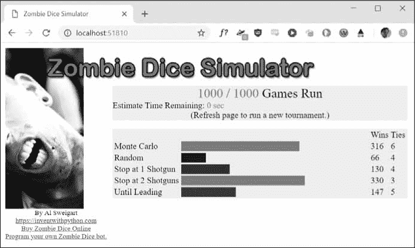

# 6 操纵字符串

> 原文：<https://automatetheboringstuff.com/2e/chapter6/>


文本是程序将处理的最常见的数据形式之一。您已经知道如何用`+`操作符将两个字符串值连接在一起，但是您可以做得更多。您可以从字符串值中提取部分字符串，添加或删除空格，将字母转换为小写或大写，并检查字符串的格式是否正确。您甚至可以编写 Python 代码来访问剪贴板，以复制和粘贴文本。

在本章中，你将了解所有这些以及更多。然后，您将完成两个不同的编程项目:一个存储多个文本字符串的简单剪贴板和一个自动完成格式化文本片段的枯燥工作的程序。

### 使用字符串

让我们看看 Python 允许你在代码中编写、打印和访问字符串的一些方法。

#### 字符串文字

用 Python 代码键入字符串值相当简单:它们以单引号开始和结束。但是你怎么能在字符串中使用引号呢？键入‘那是爱丽丝的猫。’不会起作用，因为 Python 认为字符串在`Alice`之后结束，剩下的(`s cat.'`)是无效的 Python 代码。幸运的是，有多种方法可以输入字符串。

##### 双引号

字符串可以用双引号开始和结束，就像用单引号一样。使用双引号的一个好处是字符串中可以有一个单引号字符。在交互式 shell 中输入以下内容:

```py
>>> spam = "That is Alice's cat."
```

由于字符串以双引号开始，Python 知道单引号是字符串的一部分，而不是标记字符串的结尾。但是，如果需要在字符串中使用单引号和双引号，就需要使用转义字符。

##### 转义字符

一个*转义符*让你可以使用原本不可能放入字符串的字符。转义字符由反斜杠(`\`)后跟要添加到字符串中的字符组成。(尽管由两个字符组成，但它通常被称为单个转义字符。)例如，单引号的转义字符是`\'`。您可以在以单引号开始和结束的字符串中使用它。要查看转义字符如何工作，请在交互式 shell 中输入以下内容:

```py
>>> spam = 'Say hi to Bob\'s mother.'
```

Python 知道，因为`Bob\'s`中的单引号有一个反斜杠，所以它不是用来结束字符串值的单引号。转义符`\'`和`\"`让你分别在字符串中使用单引号和双引号。

表 6-1 列出了您可以使用的转义字符。

**表 6-1:** 转义字符


| **转义字符** | **打印为** |
| --- | --- |
| `\'` | 单引号 |
| `\"` | 双引号 |
| `\t` | 制表符 |
| `\n` | 换行(换行符) |
| `\\` | 反斜线符号 |

在交互式 shell 中输入以下内容:

```py
>>> print("Hello there!\nHow are you?\nI\'m doing fine.")

Hello there!

How are you?

I'm doing fine.
```

##### 原始字符串

您可以在字符串的开始引号前放置一个`r`,使其成为原始字符串。一个*原始字符串*完全忽略所有转义字符并打印字符串中出现的任何反斜杠。例如，在交互式 shell 中输入以下内容:

```py
>>> print(r'That is Carol\'s cat.')

That is Carol\'s cat.
```

因为这是一个原始字符串，Python 将反斜杠视为字符串的一部分，而不是转义字符的开始。如果您键入包含许多反斜杠的字符串值，例如用于 Windows 文件路径的字符串，如`r'C:\Users\Al\Desktop'`或下一章中描述的正则表达式，原始字符串会很有帮助。

##### 带三重引号的多行字符串

虽然您可以使用`\n`转义字符将换行符放入字符串中，但使用多行字符串通常更容易。Python 中的多行字符串以三个单引号或三个双引号开始和结束。“三重引号”之间的任何引号、制表符或换行符都被视为字符串的一部分。Python 的块缩进规则不适用于多行字符串中的行。

打开文件编辑器，编写以下内容:

```py
print('''Dear Alice,

Eve's cat has been arrested for catnapping, cat burglary, and extortion.

Sincerely,

Bob''')
```

将该程序保存为 `catnapping.py` 并运行。输出将如下所示:

```py
Dear Alice,

Eve's cat has been arrested for catnapping, cat burglary, and extortion.

Sincerely,

Bob
```

注意`Eve's`中的单引号字符不需要转义。在多行字符串中，转义单引号和双引号是可选的。下面的`print()`调用将打印相同的文本，但不使用多行字符串:

```py
print('Dear Alice,\n\nEve\'s cat has been arrested for catnapping, cat

burglary, and extortion.\n\nSincerely,\nBob')
```

##### 多行注释

虽然散列字符(`#`)标记了该行剩余部分的注释的开始，但是多行字符串通常用于跨多行的注释。以下是完全有效的 Python 代码:

```py
"""This is a test Python program.

Written by Al Sweigart al@inventwithpython.com

This program was designed for Python 3, not Python 2.

"""

def spam():

    """This is a multiline comment to help

    explain what the spam() function does."""

    print('Hello!')
```

#### 索引和切片字符串

字符串和列表一样使用索引和切片。您可以将字符串`'Hello, world!'`视为一个列表，并将字符串中的每个字符视为一个具有相应索引的项。

“你好，我好，我好！”
T1 0 1 2 3 4 5 6 7 8 9 10 11 12

空格和感叹号包含在字符数中，所以`'Hello, world!'`是 13 个字符长，从索引 0 处的`H`到索引 12 处的`!`。

在交互式 shell 中输入以下内容:

```py
>>> spam = 'Hello, world!'

>>> spam[0]

'H'

>>> spam[4]

'o'

>>> spam[-1]

'!'

>>> spam[0:5]

'Hello'

>>> spam[:5]

'Hello'

>>> spam[7:]

'world!'
```

如果你指定了一个索引，你将得到字符串中该位置的字符。如果指定从一个索引到另一个索引的范围，则包括起始索引，不包括结束索引。这就是为什么，如果`spam`是`'Hello, world!'`，`spam[0:5]`是`'Hello'`。从`spam[0:5]`得到的子串将包括从`spam[0]`到`spam[4]`的所有内容，去掉索引 5 处的逗号和索引 6 处的空格。这类似于`range(5)`如何导致`for`循环迭代到`5`，但不包括`5`。

请注意，对字符串进行切片不会修改原始字符串。您可以在单独的变量中捕获一个变量的切片。尝试在交互式 shell 中输入以下内容:

```py
>>> spam = 'Hello, world!'

>>> fizz = spam[0:5]

>>> fizz

'Hello'
```

通过将得到的子串切片并存储在另一个变量中，您可以方便地快速、轻松地访问整个字符串和子串。

#### 带字符串的 in 和 not 运算符

与列表值一样，`in`和`not in`操作符也可以用于字符串。使用`in`或`not in`连接两个字符串的表达式将求值为布尔型`True`或`False`。在交互式 shell 中输入以下内容:

```py
>>> 'Hello' in 'Hello, World'

True

>>> 'Hello' in 'Hello'

True

>>> 'HELLO' in 'Hello, World'

False

>>> '' in 'spam'

True

>>> 'cats' not in 'cats and dogs'

False
```

这些表达式测试是否可以在第二个字符串中找到第一个字符串(精确字符串，区分大小写)。

### 将字符串放入其他字符串中

将字符串放入其他字符串中是编程中的常见操作。到目前为止，我们已经使用了`+`操作符和字符串连接来完成这项工作:

```py
>>> name = 'Al'

>>> age = 4000

>>> 'Hello, my name is ' + name + '. I am ' + str(age) + ' years old.'

'Hello, my name is Al. I am 4000 years old.'
```

然而，这需要大量繁琐的打字工作。一种更简单的方法是使用*字符串插值*，其中字符串中的`%s`操作符作为一个标记，将被字符串后面的值替换。字符串插值的一个好处是不需要调用`str()`来将值转换成字符串。在交互式 shell 中输入以下内容:

```py
>>> name = 'Al'

>>> age = 4000

>>> 'My name is %s. I am %s years old.' % (name, age)

'My name is Al. I am 4000 years old.'
```

Python 3.6 引入了 `f-strings` ，除了用大括号代替了`%s`，表达式直接放在大括号里面，与字符串插值类似。像原始字符串一样，f 字符串在起始引号前有一个`f`前缀。在交互式 shell 中输入以下内容:

```py
>>> name = 'Al'

>>> age = 4000

>>> f'My name is {name}. Next year I will be {age + 1}.'

'My name is Al. Next year I will be 4001.'
```

记得包括`f`前缀；否则，大括号及其内容将成为字符串值的一部分:

```py
>>> 'My name is {name}. Next year I will be {age + 1}.'

'My name is {name}. Next year I will be {age + 1}.'
```

### 有用的字符串方法

一些字符串方法分析字符串或创建转换后的字符串值。本节描述了您最常使用的方法。

#### upper()、lower()、isupper()和 islower()方法

`upper()`和`lower()`字符串方法返回一个新的字符串，其中原始字符串中的所有字母已经分别转换为大写或小写。字符串中的非字母字符保持不变。在交互式 shell 中输入以下内容:

```py
>>> spam = 'Hello, world!'

>>> spam = spam.upper()

>>> spam

'HELLO, WORLD!'

>>> spam = spam.lower()

>>> spam

'hello, world!'
```

请注意，这些方法不会更改字符串本身，而是返回新的字符串值。如果你想改变原来的字符串，你必须调用字符串上的`upper()`或`lower()`，然后把新的字符串赋给原来存储的变量。这就是为什么你必须使用`spam = spam.upper()`来改变`spam`中的字符串，而不是简单地使用`spam.upper()`。(这就像变量`eggs`包含值`10`。写`eggs + 3`不会改变`eggs`的值，但`eggs = eggs + 3`会。)

如果您需要进行不区分大小写的比较，那么`upper()`和`lower()`方法会很有帮助。例如，字符串`'great'`和`'GREat'`彼此不相等。但是在下面的小程序中，用户键入`Great`、`GREAT`还是`grEAT`都无关紧要，因为字符串首先被转换成小写。

```py
print('How are you?')

feeling = input()

if feeling.lower() == 'great':

    print('I feel great too.')

else:

    print('I hope the rest of your day is good.')
```

当你运行这个程序时，问题被显示出来，在`great`上输入一个变量，比如`GREat`，仍然会给出输出`I feel great too`。向程序中添加代码来处理用户输入中的变化或错误，例如大小写不一致，将使程序更容易使用，并且不太可能失败。

```py
How are you?

GREat

I feel great too.
```

您可以在[`autbor.com/convertlowercase`](https://autbor.com/convertlowercase/)查看该程序的执行情况。如果字符串至少有一个字母并且所有字母都是大写或小写，那么`isupper()`和`islower()`方法将返回一个布尔值`True`。否则，该方法返回`False`。在交互式 shell 中输入以下内容，并注意每个方法调用返回的内容:

```py
>>> spam = 'Hello, world!'

>>> spam.islower()

False

>>> spam.isupper()

False

>>> 'HELLO'.isupper()

True

>>> 'abc12345'.islower()

True

>>> '12345'.islower()

False

>>> '12345'.isupper()

False
```

因为`upper()`和`lower()`字符串方法本身返回字符串，所以您也可以在*上调用那些*返回字符串值的字符串方法。这样做的表达式看起来像一个方法调用链。在交互式 shell 中输入以下内容:

```py
>>> 'Hello'.upper()

'HELLO'

>>> 'Hello'.upper().lower()

'hello'

>>> 'Hello'.upper().lower().upper()

'HELLO'

>>> 'HELLO'.lower()

'hello'

>>> 'HELLO'.lower().islower()

True
```

#### 【isX】方法

除了`islower()`和`isupper()`之外，还有其他几个以单词 `is` 开头的字符串方法。这些方法返回一个描述字符串性质的布尔值。下面是一些常见的`is` X 串音方法:

如果字符串仅由字母组成且不为空，则 isalpha() 返回`True`

如果字符串仅由字母和数字组成并且不为空，则 isalnum() 返回`True`

isdecimal() 如果字符串仅由数字字符组成且不为空，则返回`True`

如果字符串仅由空格、制表符和换行符组成并且不为空，则 isspace() 返回`True`

istitle() 如果字符串只包含以大写字母开头、后跟小写字母的单词，则返回`True`

在交互式 shell 中输入以下内容:

```py
>>> 'hello'.isalpha()

True

>>> 'hello123'.isalpha()

False

>>> 'hello123'.isalnum()

True

>>> 'hello'.isalnum()

True

>>> '123'.isdecimal()

True

>>> '    '.isspace()

True

>>> 'This Is Title Case'.istitle()

True

>>> 'This Is Title Case 123'.istitle()

True

>>> 'This Is not Title Case'.istitle()

False

>>> 'This Is NOT Title Case Either'.istitle()

False
```

当您需要验证用户输入时，`is` X() 字符串方法非常有用。例如，下面的程序反复询问用户的年龄和密码，直到他们提供有效的输入。打开一个新的文件编辑器窗口，进入这个程序，保存为 `validateInput.py` :

```py
while True:

    print('Enter your age:')

    age = input()

    if age.isdecimal():

        break

    print('Please enter a number for your age.')

while True:

    print('Select a new password (letters and numbers only):')

    password = input()

    if password.isalnum():

        break

    print('Passwords can only have letters and numbers.')
```

在第一个`while`循环中，我们询问用户的年龄，并将他们的输入存储在`age`中。如果`age`是一个有效的(十进制)值，我们就跳出第一个`while`循环，进入第二个循环，要求输入密码。否则，我们会通知用户需要输入一个数字，并再次要求他们输入年龄。在第二个`while`循环中，我们要求输入密码，将用户的输入存储在`password`中，如果输入是字母数字，就退出循环。如果不是，我们不满意，所以我们告诉用户密码需要是字母数字，并再次要求他们输入密码。

运行时，程序的输出看起来像这样:

```py
Enter your age:

forty two

Please enter a number for your age.

Enter your age:

42

Select a new password (letters and numbers only):

secr3t!

Passwords can only have letters and numbers.

Select a new password (letters and numbers only):

secr3t
```

您可以在[`autbor.com/validateinput`](https://autbor.com/validateinput/)查看该程序的执行情况。在变量上调用`isdecimal()`和`isalnum()`，我们能够测试存储在这些变量中的值是否是十进制的，字母数字的。这里，这些测试帮助我们拒绝输入`forty two`但接受`42`，拒绝`secr3t!`但接受`secr3t`。

#### 起讫()方法

如果被调用的字符串值以传递给方法的字符串开始或结束，则`startswith()`和`endswith()`方法返回`True`；否则，它们返回`False`。在交互式 shell 中输入以下内容:

```py
>>> 'Hello, world!'.startswith('Hello')

True

>>> 'Hello, world!'.endswith('world!')

True

>>> 'abc123'.startswith('abcdef')

False

>>> 'abc123'.endswith('12')

False

>>> 'Hello, world!'.startswith('Hello, world!')

True

>>> 'Hello, world!'.endswith('Hello, world!')

True
```

如果您只需要检查字符串的第一部分或最后一部分是否等于另一个字符串，而不是整个字符串，这些方法是`==` equals 运算符的有用替代方法。

#### 采用 join()和 split()方法

当您有一个需要连接成一个字符串值的字符串列表时,`join()`方法很有用。在一个字符串上调用`join()`方法，传递一个字符串列表，然后返回一个字符串。返回的字符串是传入列表中每个字符串的串联。例如，在交互式 shell 中输入以下内容:

```py
>>> ', '.join(['cats', 'rats', 'bats'])

'cats, rats, bats'

>>> ' '.join(['My', 'name', 'is', 'Simon'])

'My name is Simon'

>>> 'ABC'.join(['My', 'name', 'is', 'Simon'])

'MyABCnameABCisABCSimon'
```

请注意，调用的字符串`join()`被插入到列表参数的每个字符串之间。例如，当在`', '`字符串上调用`join(['cats', 'rats', 'bats'])`时，返回的字符串是`'cats, rats, bats'`。

记住`join()`是在一个字符串值上被调用的，并被传递一个列表值。(很容易不小心叫反了。)方法`split()`的作用正好相反:它对一个字符串值进行调用，并返回一个字符串列表。在交互式 shell 中输入以下内容:

```py
>>> 'My name is Simon'.split()

['My', 'name', 'is', 'Simon']
```

默认情况下，字符串`'My name is Simon'`会在发现空格、制表符或换行符等空白字符的地方被拆分。这些空白字符不包括在返回列表的字符串中。您可以向`split()`方法传递一个分隔符字符串来指定一个不同的分割字符串。例如，在交互式 shell 中输入以下内容:

```py
>>> 'MyABCnameABCisABCSimon'.split('ABC')

['My', 'name', 'is', 'Simon']

>>> 'My name is Simon'.split('m')

['My na', 'e is Si', 'on']
```

`split()`的一个常见用法是沿着换行符拆分多行字符串。在交互式 shell 中输入以下内容:

```py
>>> spam = '''Dear Alice,

How have you been? I am fine.

There is a container in the fridge

that is labeled "Milk Experiment."

Please do not drink it.

Sincerely,

Bob'''

>>> spam.split('\n')

['Dear Alice,', 'How have you been? I am fine.', 'There is a container in the 

fridge', 'that is labeled "Milk Experiment."', '', 'Please do not drink it.', 

'Sincerely,', 'Bob']
```

传递参数`'\n'`给`split()`让我们沿着新行分割存储在`spam`中的多行字符串，并返回一个列表，其中每一项对应于字符串的一行。

#### 用分区()法拆分字符串

`partition()` string 方法可以将一个字符串拆分成分隔符字符串前后的文本。此方法在调用它的字符串中搜索它所传递的分隔符字符串，并为“before”、“separator”和“after”子字符串返回一个由三个子字符串组成的元组。在交互式 shell 中输入以下内容:

```py
>>> 'Hello, world!'.partition('w')

('Hello, ', 'w', 'orld!')

>>> 'Hello, world!'.partition('world')

('Hello, ', 'world', '!')
```

如果您传递给`partition()`的分隔符字符串在`partition()`调用的字符串中出现多次，该方法只在第一次出现时拆分字符串:

```py
>>> 'Hello, world!'.partition('o')

('Hell', 'o', ', world!')
```

如果找不到分隔符字符串，则元组中返回的第一个字符串将是整个字符串，其他两个字符串将为空:

```py
>>> 'Hello, world!'.partition('XYZ')

('Hello, world!', '', '')
```

您可以使用多重赋值技巧将三个返回的字符串赋给三个变量:

```py
>>> before, sep, after = 'Hello, world!'.partition(' ')

>>> before

'Hello,'

>>> after

'world!'
```

无论何时，当您需要某个特定分隔符字符串之前、之后的部分时，`partition()`方法对于拆分字符串非常有用。

#### 用 rjust()、ljust()和 center()方法调整文本

`rjust()`和`ljust()`字符串方法返回它们被调用的字符串的填充版本，其中插入空格以对齐文本。这两种方法的第一个参数是两端对齐的字符串的整数长度。在交互式 shell 中输入以下内容:

```py
>>> 'Hello'.rjust(10)

'     Hello'

>>> 'Hello'.rjust(20)

'              Hello'

>>> 'Hello, World'.rjust(20)

'         Hello, World'

>>> 'Hello'.ljust(10)

'Hello     '
```

`'Hello'.rjust(10)`表示我们想要右对齐总长度为`10`的字符串中的`'Hello'`。`'Hello'`是五个字符，所以它的左边会增加五个空格，这样我们得到一个由 10 个字符组成的字符串，其中`'Hello'`右对齐。

可选的第二个参数`rjust()`和`ljust()`将指定一个填充字符而不是一个空格字符。在交互式 shell 中输入以下内容:

```py
>>> 'Hello'.rjust(20, '*')

'***************Hello'

>>> 'Hello'.ljust(20, '-')

'Hello---------------'
```

`center()`字符串方法的工作方式类似于`ljust()`和`rjust()`，但是它将文本居中，而不是将其向左或向右对齐。在交互式 shell 中输入以下内容:

```py
>>> 'Hello'.center(20)

'       Hello        '

>>> 'Hello'.center(20, '=')

'=======Hello========'
```

当您需要打印具有正确间距的表格数据时，这些方法特别有用。打开一个新的文件编辑器窗口，输入以下代码，保存为*pick table . py*:

```py
def printPicnic(itemsDict, leftWidth, rightWidth):

    print('PICNIC ITEMS'.center(leftWidth + rightWidth, '-'))

    for k, v in itemsDict.items():

        print(k.ljust(leftWidth, '.') + str(v).rjust(rightWidth))

picnicItems = {'sandwiches': 4, 'apples': 12, 'cups': 4, 'cookies': 8000}

printPicnic(picnicItems, 12, 5)

printPicnic(picnicItems, 20, 6)
```

您可以在[`autbor.com/picnictable`](https://autbor.com/picnictable/)查看该程序的执行情况。在这个程序中，我们定义了一个`printPicnic()`方法，它将接收一个信息字典，并使用`center()`、`ljust()`和`rjust()`以整齐排列的表格格式显示信息。

我们将传递给`printPicnic()`的字典是`picnicItems`。在`picnicItems`，我们有 4 个三明治、12 个苹果、4 个杯子和 8000 块饼干。我们希望将这些信息组织成两列，左边是商品名称，右边是数量。

要做到这一点，我们需要决定左右栏的宽度。连同我们的字典，我们将把这些值传递给`printPicnic()`。

`printPicnic()`函数接收一个字典，一个`leftWidth`用于表格的左列，一个`rightWidth`用于右列。它在表的中央打印一个标题`PICNIC ITEMS`。然后，它遍历字典，在一行上打印每个键-值对，键靠左对齐并用句点填充，值靠右对齐并用空格填充。

在定义了`printPicnic()`之后，我们定义了字典`picnicItems`并调用了`printPicnic()`两次，为左右表列传递了不同的宽度。

当您运行这个程序时，野餐项目会显示两次。第一次左栏宽 12 个字符，右栏宽 5 个字符。第二次分别是 20 和 6 个字符宽。

```py
---PICNIC ITEMS--

sandwiches..    4

apples......   12

cups........    4

cookies..... 8000

-------PICNIC ITEMS-------

sandwiches..........     4

apples..............    12

cups................     4

cookies.............  8000
```

使用`rjust()`、`ljust()`和`center()`可以确保字符串整齐对齐，即使您不确定字符串有多少个字符长。

#### 用 strip()、rstrip()和 lstrip()方法去除空白

有时，您可能希望去除字符串左侧、右侧或两侧的空白字符(空格、制表符和换行符)。string 方法将返回一个开头或结尾没有任何空白字符的新字符串。`lstrip()`和`rstrip()`方法将分别删除左端和右端的空白字符。在交互式 shell 中输入以下内容:

```py
>>> spam = '    Hello, World    '

>>> spam.strip()

'Hello, World'

>>> spam.lstrip()

'Hello, World    '

>>> spam.rstrip()

'    Hello, World'
```

或者，字符串参数将指定应该去除末尾的哪些字符。在交互式 shell 中输入以下内容:

```py
>>> spam = 'SpamSpamBaconSpamEggsSpamSpam'

>>> spam.strip('ampS')

'BaconSpamEggs'
```

传递`strip()`参数`'ampS'`将告诉它从存储在`spam`中的字符串末尾删除出现的`a`、`m`、`p`和大写`S`。传递给`strip()`的字符串中字符的顺序无关紧要:`strip('ampS')`将做与`strip('mapS')`或`strip('Spam')`相同的事情。

### 具有 ord()和 chr()函数的字符的数值

计算机将信息存储为字节——二进制数的字符串，这意味着我们需要能够将文本转换为数字。因此，每个文本字符都有一个对应的数值，称为 *Unicode 码位*。例如，`'A'`的数字码位为`65`，`'4'`的数字码位为`52`，`'!'`的数字码位为`33`。您可以使用`ord()`函数获取单字符字符串的码位，使用`chr()`函数获取整数码位的单字符字符串。在交互式 shell 中输入以下内容:

```py
>>> ord('A')

65

>>> ord('4')

52

>>> ord('!')

33

>>> chr(65)

'A'
```

当您需要对字符进行排序或数学运算时，这些函数非常有用:

```py
>>> ord('B')

66

>>> ord('A') < ord('B')

True

>>> chr(ord('A'))

'A'

>>> chr(ord('A') + 1)

'B'
```

关于 Unicode 和代码点还有更多内容，但是这些细节已经超出了本书的范围。如果你想了解更多，我推荐你观看内德·巴彻尔德 2012 年的 PyCon 演讲，“实用 Unicode，或者，我如何停止痛苦？”在[`youtu.be/sgHbC6udIqc`](https://youtu.be/sgHbC6udIqc)上。

### 使用 pyperclip 模块复制和粘贴字符串

`pyperclip`模块有`copy()`和`paste()`功能，可以向你的电脑剪贴板发送文本，也可以从剪贴板接收文本。将程序的输出发送到剪贴板会使它更容易粘贴到电子邮件、文字处理器或其他软件中。

**在管理部门之外运行 PYTHON 脚本**

到目前为止，您已经使用 Mu 中的交互式 shell 和文件编辑器运行了 Python 脚本。然而，你不会想每次运行脚本时都要经历打开 Mu 和 Python 脚本的不便。幸运的是，您可以设置一些快捷方式来简化 Python 脚本的运行。对于 Windows、macOS 和 Linux，这些步骤略有不同，但是每个步骤都在附录 B 中进行了描述。转到附录 B 来学习如何方便地运行你的 Python 脚本，并能够向它们传递命令行参数。(您将无法使用 Mu 向您的程序传递命令行参数。)

Python 中没有`pyperclip`模块。要安装它，请遵循附录 A 中安装第三方模块的说明。安装`pyperclip`后，在交互 shell 中输入以下内容:

```py
>>> import pyperclip

>>> pyperclip.copy('Hello, world!')

>>> pyperclip.paste()

'Hello, world!'
```

当然，如果程序之外的东西改变了剪贴板的内容，`paste()`函数将返回它。例如，如果我将这句话复制到剪贴板，然后调用`paste()`，它会是这样的:

```py
>>> pyperclip.paste()

'For example, if I copied this sentence to the clipboard and then called

paste(), it would look like this:'
```

### 项目:多剪贴板自动消息

如果你回复了大量措辞相似的邮件，你可能不得不做大量的重复输入。也许你用这些短语保存了一个文本文档，这样你就可以用剪贴板方便地复制和粘贴它们。但是你的剪贴板一次只能存储一条消息，这不是很方便。让我们用一个存储多个短语的程序来简化这个过程。

#### 第一步:程序设计和数据结构

您希望能够用一个简短的关键短语作为命令行参数来运行这个程序，例如，*同意*或*忙碌*。与该关键短语相关联的消息将被复制到剪贴板，以便用户可以将其粘贴到电子邮件中。这样，用户不必重新输入就可以获得长而详细的消息。

**章节项目**

这是本书的第一个“章节项目”。从现在开始，每章都将有展示本章所涵盖概念的项目。这些项目以一种风格编写，将您从一个空白的文件编辑器窗口带到一个完整的工作程序。就像交互式 shell 示例一样，不要只阅读项目部分——在您的计算机上跟着做！

打开一个新的文件编辑器窗口，将程序保存为 `mclip.py` 。你需要用一行`#!` ( `shebang` )来开始这个程序(见附录 B )，还应该写一个简短描述这个程序的注释。因为您希望将每段文本与其关键短语相关联，所以可以将它们作为字符串存储在字典中。字典将是组织你的关键短语和文本的数据结构。让您的程序看起来像下面这样:

```py
#! python3

# mclip.py - A multi-clipboard program.

TEXT = {'agree': """Yes, I agree. That sounds fine to me.""",

        'busy': """Sorry, can we do this later this week or next week?""",

        'upsell': """Would you consider making this a monthly donation?"""}
```

#### 第二步:处理命令行参数

命令行参数将存储在变量`sys.argv`中。(关于如何在你的程序中使用命令行参数的更多信息，请参见附录 B 。)列表中的第一项应该总是包含程序文件名(`'mclip.py'`)的字符串，第二项应该是第一个命令行参数。对于这个程序，这个参数是你想要的信息的关键短语。因为命令行参数是强制的，所以如果用户忘记添加它(也就是说，如果`sys.argv`列表中的值少于两个)，您会向用户显示一条用法消息。让您的程序看起来像下面这样:

```py
#! python3

# mclip.py - A multi-clipboard program.

TEXT = {'agree': """Yes, I agree. That sounds fine to me.""",

        'busy': """Sorry, can we do this later this week or next week?""",

        'upsell': """Would you consider making this a monthly donation?"""}

import sys

if len(sys.argv) < 2:

    print('Usage: python mclip.py [keyphrase] - copy phrase text')

    sys.exit()

keyphrase = sys.argv[1]    # first command line arg is the keyphrase
```

#### 第三步:抄对词组

现在关键短语作为字符串存储在变量`keyphrase`中，您需要查看它是否作为一个键存在于`TEXT`字典中。如果是这样，您需要使用`pyperclip.copy()`将键值复制到剪贴板。(因为您正在使用`pyperclip`模块，所以您需要导入它。)注意，实际上*并不需要*这个`keyphrase`变量；你可以在这个程序中使用`keyphrase`的任何地方使用`sys.argv[1]`。但是一个名为`keyphrase`的变量比类似于`sys.argv[1]`的神秘事物更具可读性。

让您的程序看起来像下面这样:

```py
#! python3

# mclip.py - A multi-clipboard program.

TEXT = {'agree': """Yes, I agree. That sounds fine to me.""",

        'busy': """Sorry, can we do this later this week or next week?""",

        'upsell': """Would you consider making this a monthly donation?"""}

import sys, pyperclip

if len(sys.argv) < 2:

    print('Usage: py mclip.py [keyphrase] - copy phrase text')

    sys.exit()

keyphrase = sys.argv[1]    # first command line arg is the keyphrase

if keyphrase in TEXT:

    pyperclip.copy(TEXT[keyphrase])

    print('Text for ' + keyphrase + ' copied to clipboard.')

else:

    print('There is no text for ' + keyphrase)
```

这个新代码在`TEXT`字典中查找关键短语。如果关键短语是字典中的一个键，我们获得对应于该键的值，将其复制到剪贴板，并打印一条消息，说明我们复制了该值。否则，我们会打印一条消息，说明没有该名称的关键短语。

这是完整的剧本。使用附录 B 中的指令轻松启动命令行程序，你现在有了一个快速复制信息到剪贴板的方法。每当您想用新消息更新程序时，您必须修改源代码中的`TEXT`字典值。

在 Windows 上，您可以创建一个批处理文件，用 `WIN-R` Run 窗口运行这个程序。(关于批处理文件的更多信息，参见附录 B 。)在文件编辑器中输入以下内容，并将该文件作为 `mclip.bat` 保存在 `C:\Windows` 文件夹中:

```py
@py.exe C:\path_to_file\mclip.py %*

@pause
```

创建了这个批处理文件后，在 Windows 上运行多剪贴板程序只需按下 `WIN-R` 并键入`mclip` 关键词即可。

### 项目:向维基标记添加项目符号

编辑维基百科文章时，你可以创建一个项目符号列表，将每个列表项放在自己的行上，并在前面加一个星号。但是假设你有一个很大的列表，你想添加要点。你可以在每一行的开头一个接一个地输入这些星星。或者您可以使用一个简短的 Python 脚本来自动完成这项任务。

`bulletPointAdder.py` 脚本将从剪贴板获取文本，在每一行的开头添加一个星号和空格，然后将这个新文本粘贴到剪贴板。例如，如果我将以下文本(针对维基百科文章“列表列表列表”)复制到剪贴板:

```py
Lists of animals

Lists of aquarium life

Lists of biologists by author abbreviation

Lists of cultivars
```

然后运行 `bulletPointAdder.py` 程序，剪贴板将包含以下内容:

```py
* Lists of animals

* Lists of aquarium life

* Lists of biologists by author abbreviation

* Lists of cultivars
```

这个带星号前缀的文本可以作为项目符号列表粘贴到维基百科的文章中。

#### 第一步:从剪贴板复制粘贴

您希望 `bulletPointAdder.py` 程序执行以下操作:

1.  从剪贴板粘贴文本。
2.  做点什么。
3.  将新文本复制到剪贴板。

第二步有点复杂，但是第一步和第三步非常简单:它们只涉及到`pyperclip.copy()`和`pyperclip.paste()`函数。现在，让我们只编写程序的第 1 步和第 3 步。输入以下内容，将程序保存为 `bulletPointAdder.py` :

```py
#! python3

# bulletPointAdder.py - Adds Wikipedia bullet points to the start

# of each line of text on the clipboard.

import pyperclip

text = pyperclip.paste()

# TODO: Separate lines and add stars.

pyperclip.copy(text)
```

`TODO`注释提醒您最终应该完成程序的这一部分。下一步是实际实现程序的这一部分。

#### 第二步:把文字的行分开，加上星星

对`pyperclip.paste()`的调用将剪贴板上的所有文本作为一个大字符串返回。如果我们使用“列表的列表的列表”示例，存储在`text`中的字符串将如下所示:

```py
'Lists of animals\nLists of aquarium life\nLists of biologists by author

abbreviation\nLists of cultivars'
```

该字符串中的`\n`换行符导致它在从剪贴板打印或粘贴时显示为多行。在这个字符串值中有许多“行”。您需要在每一行的开头添加一个星号。

您可以编写代码来搜索字符串中的每个`\n`换行符，然后在其后添加星号。但是使用`split()`方法返回一个字符串列表会更容易，原始字符串中的每一行都有一个字符串，然后在列表中的每个字符串前面加上星号。

让您的程序看起来像下面这样:

```py
#! python3

# bulletPointAdder.py - Adds Wikipedia bullet points to the start

# of each line of text on the clipboard.

import pyperclip

text = pyperclip.paste()

# Separate lines and add stars.

lines = text.split('\n')

for i in range(len(lines)):    # loop through all indexes in the "lines" list

    lines[i] = '* ' + lines[i] # add star to each string in "lines" list

pyperclip.copy(text)
```

我们沿着文本的新行分割文本，得到一个列表，列表中的每一项都是文本的一行。我们将列表存储在`lines`中，然后遍历`lines`中的项目。对于每一行，我们在行首添加一个星号和一个空格。现在`lines`中的每个字符串都以一个星号开始。

#### 第三步:加入修改后的线条

`lines`列表现在包含以星号开始的修改行。但是`pyperclip.copy()`期望的是单个字符串值，而不是字符串值的列表。要生成这个单个字符串值，将`lines`传递到`join()`方法中，从列表的字符串中获取一个单个连接的字符串。让您的程序看起来像下面这样:

```py
#! python3

# bulletPointAdder.py - Adds Wikipedia bullet points to the start

# of each line of text on the clipboard.

import pyperclip

text = pyperclip.paste()

# Separate lines and add stars.

lines = text.split('\n')

for i in range(len(lines)):    # loop through all indexes for "lines" list

    lines[i] = '* ' + lines[i] # add star to each string in "lines" list

text = '\n'.join(lines)

pyperclip.copy(text)
```

当这个程序运行时，它将剪贴板上的文本替换为每行开头都有星号的文本。现在程序完成了，您可以尝试用复制到剪贴板的文本运行它。

即使您不需要自动化这个特定的任务，您也可能希望自动化一些其他类型的文本操作，比如删除行尾的尾随空格或者将文本转换为大写或小写。无论您需要什么，您都可以使用剪贴板进行输入和输出。

### 一个简短的节目:猪拉丁语

猪拉丁语是一种改变英语单词的愚蠢的虚构语言。如果一个单词以元音开头，单词 `yay` 会加到它的末尾。如果一个单词以一个辅音或辅音群开头(比如 `ch` 或 `gr` ，那么这个辅音或辅音群会被移到单词的末尾，后面跟着 `ay` 。

让我们编写一个 Pig Latin 程序，它将输出如下内容:

```py
Enter the English message to translate into Pig Latin:

My name is AL SWEIGART and I am 4,000 years old.

Ymay amenay isyay ALYAY EIGARTSWAY andyay Iyay amyay 4,000 yearsyay oldyay.
```

这个程序的工作原理是使用本章介绍的方法改变字符串。在文件编辑器中键入以下源代码，并将文件保存为 `pigLat.py` :

```py
# English to Pig Latin

print('Enter the English message to translate into Pig Latin:')

message = input()

VOWELS = ('a', 'e', 'i', 'o', 'u', 'y')

pigLatin = [] # A list of the words in Pig Latin.

for word in message.split():

    # Separate the non-letters at the start of this word:

    prefixNonLetters = ''

    while len(word) > 0 and not word[0].isalpha():

        prefixNonLetters += word[0]

        word = word[1:]

    if len(word) == 0:

        pigLatin.append(prefixNonLetters)

        continue

    # Separate the non-letters at the end of this word:

    suffixNonLetters = ''

    while not word[-1].isalpha():

        suffixNonLetters += word[-1]

        word = word[:-1]

    # Remember if the word was in uppercase or title case.

    wasUpper = word.isupper()

    wasTitle = word.istitle()

    word = word.lower() # Make the word lowercase for translation.

    # Separate the consonants at the start of this word:

    prefixConsonants = ''

    while len(word) > 0 and not word[0] in VOWELS:

        prefixConsonants += word[0]

        word = word[1:]

    # Add the Pig Latin ending to the word:

    if prefixConsonants != '':

        word += prefixConsonants + 'ay'

    else:

        word += 'yay'

    # Set the word back to uppercase or title case:

    if wasUpper:

        word = word.upper()

    if wasTitle:

        word = word.title()

    # Add the non-letters back to the start or end of the word.

    pigLatin.append(prefixNonLetters + word + suffixNonLetters)

# Join all the words back together into a single string:

print(' '.join(pigLatin))
```

让我们从顶部开始，逐行查看这段代码:

```py
# English to Pig Latin

print('Enter the English message to translate into Pig Latin:')

message = input()

VOWELS = ('a', 'e', 'i', 'o', 'u', 'y')
```

首先，我们要求用户输入要翻译成猪拉丁语的英语文本。此外，我们创建一个常量，将每个小写元音字母(和 `y` )保存为一个字符串元组。这将在我们的程序中用到。

接下来，我们将创建`pigLatin`变量来存储我们翻译成 Pig Latin 的单词:

```py
pigLatin = [] # A list of the words in Pig Latin.

for word in message.split():

    # Separate the non-letters at the start of this word:

    prefixNonLetters = ''

    while len(word) > 0 and not word[0].isalpha():

        prefixNonLetters += word[0]

        word = word[1:]

    if len(word) == 0:

        pigLatin.append(prefixNonLetters)

        continue
```

我们需要每个单词都是它自己的字符串，所以我们调用`message.split()`来获得作为单独字符串的单词列表。字符串`'My name is AL SWEIGART and I am 4,000 years old.'`将导致`split()`Return`['My', 'name', 'is', 'AL', 'SWEIGART', 'and', 'I', 'am', '4,000', 'years', 'old.']`。

我们需要删除每个单词开头和结尾的任何非字母，这样像`'old.'`这样的字符串就可以翻译成`'oldyay.'`而不是`'old.yay'`。我们将这些非字母保存到一个名为`prefixNonLetters`的变量中。

```py
    # Separate the non-letters at the end of this word:

    suffixNonLetters = ''

    while not word[-1].isalpha():

        suffixNonLetters += word[-1]

        word = word[:-1]
```

对单词中的第一个字符调用`isalpha()`的循环将决定我们是否应该从单词中删除一个字符，并将其连接到`prefixNonLetters`的末尾。如果整个单词是由非字母字符组成的，比如`'4,000'`，我们可以简单地将它添加到`pigLatin`列表中，然后继续翻译下一个单词。我们还需要保存`word`字符串末尾的非字母。这段代码类似于前面的循环。

接下来，我们将确保程序记住单词是大写还是大写，这样我们就可以在将单词翻译成 Pig Latin 后恢复它:

```py
    # Remember if the word was in uppercase or title case.

    wasUpper = word.isupper()

    wasTitle = word.istitle()

    word = word.lower() # Make the word lowercase for translation.
```

对于`for`循环中的其余代码，我们将使用小写版本的`word`。

要将像 `sweigart` 这样的单词转换成 `eigart-sway` ，我们需要删除`word`开头的所有辅音:

```py
    # Separate the consonants at the start of this word:

    prefixConsonants = ''

    while len(word) > 0 and not word[0] in VOWELS:

        prefixConsonants += word[0]

        word = word[1:]
```

我们使用了一个类似于从`word`的开头删除非字母的循环，除了现在我们正在删除辅音并将它们存储到一个名为`prefixConsonants`的变量中。

如果在单词的开头有任何辅音，它们现在在`prefixConsonants`中，我们应该将那个变量和字符串`'ay'`连接到`word`的结尾。否则，我们可以假设`word`以元音开始，我们只需要连接`'yay'`:

```py
    # Add the Pig Latin ending to the word:

    if prefixConsonants != '':

        word += prefixConsonants + 'ay'

    else:

        word += 'yay'
```

回想一下，我们用`word = word.lower()`将 word 设置为小写版本。如果`word`最初是大写或标题大写，这段代码将把`word`转换回它原来的大小写:

```py
    # Set the word back to uppercase or title case:

    if wasUpper:

        word = word.upper()

    if wasTitle:

        word = word.title()
```

在`for`循环结束时，我们将这个单词，连同它原来的任何非字母前缀或后缀，添加到`pigLatin`列表中:

```py
    # Add the non-letters back to the start or end of the word.

    pigLatin.append(prefixNonLetters + word + suffixNonLetters)

# Join all the words back together into a single string:

print(' '.join(pigLatin))
```

这个循环结束后，我们通过调用`join()`方法将字符串列表合并成一个字符串。这个字符串被传递给`print()`以在屏幕上显示我们的猪拉丁。

你可以在找到其他简短的基于文本的 Python 程序，比如这个。

### 总结

文本是一种常见的数据形式，Python 附带了许多有用的字符串方法来处理存储在字符串值中的文本。您将在您编写的几乎每个 Python 程序中使用索引、切片和字符串方法。

你现在写的程序看起来不太复杂——它们没有带有图像和彩色文本的图形用户界面。到目前为止，您使用`print()`显示文本，并让用户使用`input()`输入文本。然而，用户可以通过剪贴板快速输入大量文本。这种能力为编写处理大量文本的程序提供了一个有用的途径。这些基于文本的程序可能没有华丽的窗口或图形，但它们可以快速完成大量有用的工作。

另一种处理大量文本的方法是直接从硬盘上读写文件。你将在第 9 章中学习如何用 Python 做这件事。

这几乎涵盖了 Python 编程的所有基本概念！在本书的其余部分，您将继续学习新概念，但是您现在已经知道了足够多的知识，可以开始编写一些有用的程序来自动化任务。如果你想看一组简短的 Python 程序，这些程序是根据你到目前为止所学的基本概念构建的，请查看[`asweigart/pythonstdiogames`](https://github.com/asweigart/pythonstdiogames/)。尝试手动复制每个程序的源代码，然后进行修改，看看它们如何影响程序的行为。一旦你理解了程序是如何工作的，试着从头开始重新创建程序。你不需要完全重新创建源代码；只需关注程序做什么，而不是如何做。

您可能认为自己没有足够的 Python 知识来做诸如下载网页、更新电子表格或发送文本消息之类的事情，但这正是 Python 模块的用武之地！这些由其他程序员编写的模块提供了一些功能，使您可以轻松完成所有这些事情。因此，让我们学习如何编写真正的程序来完成有用的自动化任务。

### 练习题

1 。什么是转义字符？

2 。`\n`和`\t`转义符分别代表什么？

3 。如何在字符串中放一个`\`反斜杠字符？

4 。字符串值`"Howl's Moving Castle"`是有效的字符串。为什么单词`Howl's`中的单引号字符不转义就不是问题了？

5 。如果你不想把`\n`放在你的字符串里，你怎么能写一个有换行符的字符串呢？

6 。下面的表达式表示什么？

*   `'Hello, world!'[1]`
*   `'Hello, world!'[0:5]`
*   `'Hello, world!'[:5]`
*   `'Hello, world!'[3:]`

7 。下面的表达式表示什么？

*   `'Hello'.upper()`
*   `'Hello'.upper().isupper()`
*   `'Hello'.upper().lower()`

8 。下面的表达式表示什么？

*   `'Remember, remember, the fifth of November.'.split()`
*   `'-'.join('There can be only one.'.split())`

9 。有哪些字符串方法可以用来右对齐、左对齐和居中字符串？

10 。如何从字符串的开头或结尾修剪空白字符？

### 实践项目

为了练习，编写执行以下操作的程序。

#### 台式打印机

编写一个名为`printTable()`的函数，它获取一个字符串列表列表，并将其显示在一个组织良好的表格中，每列右对齐。假设所有内部列表将包含相同数量的字符串。例如，该值可能如下所示:

```py
tableData = [['apples', 'oranges', 'cherries', 'banana'],

             ['Alice', 'Bob', 'Carol', 'David'],

             ['dogs', 'cats', 'moose', 'goose']]
```

您的`printTable()`函数将打印以下内容:

```py
   apples Alice  dogs

  oranges   Bob  cats

 cherries Carol moose

   banana David goose
```

提示:您的代码首先必须在每个内部列表中找到最长的字符串，以便整列足够宽以容纳所有的字符串。您可以将每列的最大宽度存储为一个整数列表。`printTable()`函数可以从`colWidths = [0] * len(tableData)`开始，这将创建一个包含与`tableData`中内部列表数量相同的`0`值的列表。这样，`colWidths[0]`可以在`tableData[0]`中存储最长字符串的宽度，`colWidths[1]`可以在`tableData[1]`中存储最长字符串的宽度，以此类推。然后，您可以在`colWidths`列表中找到最大值，以找出要传递给`rjust()`字符串方法的整数宽度。

#### 僵尸说 bot

*编程游戏*是一种游戏类型，玩家不是直接玩游戏，而是编写机器人程序来自主玩游戏。我已经创建了一个僵尸骰子模拟器，它允许程序员在制作玩游戏的人工智能时练习他们的技能。僵尸骰子机器人可以很简单，也可以非常复杂，非常适合课堂练习或个人编程挑战。

僵尸骰子是一个快速，有趣的史蒂夫杰克逊游戏骰子游戏。玩家是僵尸，试图在不被击中三次的情况下吃掉尽可能多的人脑。有一个 13 个骰子的杯子，上面有大脑、脚步声和猎枪图标。骰子图标是有颜色的，每种颜色表示每个事件发生的可能性不同。每个骰子都有两面有足迹，但绿色图标的骰子有更多面有大脑，红色图标的骰子有更多散弹枪，黄色图标的骰子有平均分配的大脑和散弹枪。在每个玩家的回合中执行以下操作:

1.  将所有 13 个骰子放入杯中。玩家从杯中随机抽取三个骰子，然后掷出。玩家总是掷出正好三个骰子。
2.  他们把任何大脑(大脑被吃掉的人类)和猎枪(反击的人类)放在一边，清点起来。累积三支猎枪自动以零分结束玩家的回合(不管他们有多少大脑)。如果他们有零到两支猎枪，他们可以继续滚动，如果他们想要的。他们也可以选择结束他们的回合，每个大脑收集一点。
3.  如果玩家决定继续掷骰子，他们必须用脚步重掷所有骰子。记住玩家必须总是掷出三个骰子；如果他们滚动的脚步少于三步，他们必须从杯子里抽出更多的骰子。一个玩家可能会继续掷骰子，直到他们得到三把散弹枪——失去一切——或者所有 13 个骰子都被掷出。玩家不能只重掷一个或两个骰子，也不能中途停止重掷。
4.  当有人达到 13 个大脑时，其余的玩家完成这一轮。最聪明的人赢了。如果出现平局，平局的玩家进行最后一轮决胜局。

僵尸骰子有一个碰运气的游戏机制:你重新掷骰子越多，你能得到的大脑就越多，但你最终积累三把猎枪并输掉一切的可能性就越大。一旦一名玩家达到 13 分，其余的玩家再获得一次机会(可能会赶上)，游戏结束。得分最高的玩家获胜。你可以在[`asweigart/zombiedice`](https://github.com/asweigart/zombiedice/)找到完整的规则。

按照附录 A 中的说明安装带 pip 的`zombiedice`模块。通过在交互式 shell 中运行以下内容，您可以使用一些预制的机器人来运行模拟器的演示:

```py
>>> import zombiedice

>>> zombiedice.demo()

Zombie Dice Visualization is running. Open your browser to http://

localhost:51810 to view it.

Press Ctrl-C to quit.
```

该程序启动你的网络浏览器，看起来像图 6-1 。



图 6-1:僵尸骰子模拟器的网络图形用户界面

您将通过编写一个带有`turn()`方法的类来创建机器人，当轮到您的机器人掷骰子时，模拟器将调用该方法。类已经超出了本书的范围，所以类代码已经在 `myzombie.py` 程序中为你设置好了，它在本书的可下载 ZIP 文件中[`nostarch.com/automatestuff2`](https://nostarch.com/automatestuff2/)。写方法本质上和写函数是一样的，可以使用 `myZombie.py` 程序中的`turn()`代码作为模板。在这个`turn()`方法中，只要你想让你的机器人掷骰子，你就可以调用`zombiedice.roll()`函数。

```py
import zombiedice

class MyZombie:

    def __init__(self, name):

        # All zombies must have a name:

        self.name = name

    def turn(self, gameState):

        # gameState is a dict with info about the current state of the game.

        # You can choose to ignore it in your code.

        diceRollResults = zombiedice.roll() # first roll

        # roll() returns a dictionary with keys 'brains', 'shotgun', and

        # 'footsteps' with how many rolls of each type there were.

        # The 'rolls' key is a list of (color, icon) tuples with the

        # exact roll result information.

        # Example of a roll() return value:

        # {'brains': 1, 'footsteps': 1, 'shotgun': 1,

        #  'rolls': [('yellow', 'brains'), ('red', 'footsteps'),

        #            ('green', 'shotgun')]}

        # REPLACE THIS ZOMBIE CODE WITH YOUR OWN:

        brains = 0

        while diceRollResults is not None:

            brains += diceRollResults['brains']

            if brains < 2:

                diceRollResults = zombiedice.roll() # roll again

            else:

                break

zombies = (

    zombiedice.examples.RandomCoinFlipZombie(name='Random'),

    zombiedice.examples.RollsUntilInTheLeadZombie(name='Until Leading'),

    zombiedice.examples.MinNumShotgunsThenStopsZombie(name='Stop at 2

Shotguns', minShotguns=2),

    zombiedice.examples.MinNumShotgunsThenStopsZombie(name='Stop at 1

Shotgun', minShotguns=1),

    MyZombie(name='My Zombie Bot'),

    # Add any other zombie players here.

)

# Uncomment one of the following lines to run in CLI or Web GUI mode:

#zombiedice.runTournament(zombies=zombies, numGames=1000)

zombiedice.runWebGui(zombies=zombies, numGames=1000)
```

`turn()`方法有两个参数:`self`和`gameState`。在最初的几个僵尸机器人中，你可以忽略这些，如果你想了解更多，可以稍后查阅在线文档了解详细信息。对于初始掷骰子，`turn()`方法应该至少调用`zombiedice.roll()`一次。然后，根据机器人使用的策略，它可以再次调用`zombiedice.roll()`任意多次。在 `myZombie.py` 中，`turn()`方法调用`zombiedice.roll()`两次，这意味着僵尸机器人将总是每回合掷骰子两次，而不管掷骰子的结果如何。

`zombiedice.roll()`的返回值告诉你的代码掷骰子的结果。这是一本有四个键的字典。其中三个键，`'shotgun'`、`'brains'`和`'footsteps'`，有整数值，表示有多少骰子出现了这些图标。第四个`'rolls'`键的值是每个骰子点数的元组列表。元组包含两个字符串:索引`0`处骰子的颜色和索引`1`处滚动的图标。请看`turn()` 方法定义中的代码注释作为例子。如果机器人已经滚了三把猎枪，那么`zombiedice.roll()`就会返回`None`。

试着写一些你自己的机器人来玩僵尸骰子，看看它们与其他机器人相比如何。具体来说，尝试创建以下机器人:

*   一个机器人，在第一次投掷后，随机决定是继续还是停止
*   一个机器人在滚过两个大脑后停止滚动
*   一个机器人滚了两把猎枪后就停止了滚动
*   最初决定掷骰子一到四次的机器人，但如果掷出两把猎枪，就会提前停止
*   一个机器人在滚过比大脑还多的猎枪后停止滚动

通过模拟器运行这些机器人，看看它们之间的比较如何。你也可以在检查一些预制的机器人的代码。如果你发现自己在现实世界中玩这个游戏，你会受益于数以千计的模拟游戏，告诉你最好的策略之一是一旦你滚了两把猎枪就停下来。但是你可以试试碰运气...