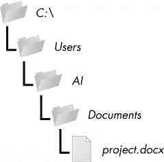
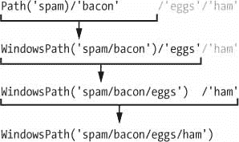
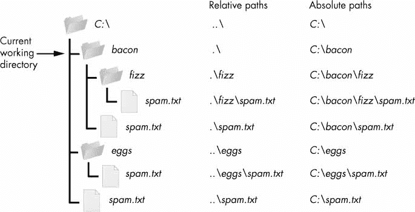
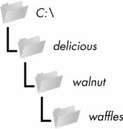
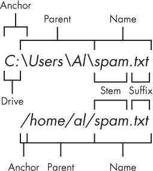
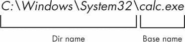
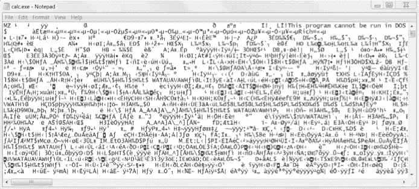

# 9 读取和写入文件

> 原文：<https://automatetheboringstuff.com/2e/chapter9/>


变量是在程序运行时存储数据的好方法，但是如果您希望数据在程序完成后仍然存在，您需要将其保存到一个文件中。你可以把一个文件的内容想象成一个单独的字符串值，大小可能是千兆字节。在本章中，您将学习如何使用 Python 来创建、读取和保存硬盘上的文件。

### 文件和文件路径

一个文件有两个关键属性：*文件名*(通常写成一个单词)和*路径*。路径指定文件在计算机上的位置。例如，我的 Windows 笔记本电脑上有一个文件名为`project.docx`的文件，路径为`C:\Users\Al\Documents`。最后一个句点之后的文件名部分称为文件的*扩展名*，它告诉您文件的类型。文件名`project.docx`为 Word 文档，*用户*、`Al`、*文档*均引用*文件夹*(也称*目录*)。文件夹可以包含文件和其他文件夹。例如，`project.docx`在`Documents`文件夹中，该文件夹在`Al`文件夹中，该文件夹在`Users`文件夹中。图 9-1 显示了该文件夹的组织结构。



图 9-1：文件夹层次结构中的一个文件

路径的`C:\`部分是*根文件夹*，它包含所有其他文件夹。在 Windows 上，根文件夹被命名为`C:\`，也称为`C:`驱动器。在 macOS 和 Linux 上，根文件夹是`/`。在本书中，我将使用 Windows 风格的根文件夹，`C:\`。如果您在 macOS 或 Linux 上输入交互式 Shell 示例，请输入`/`。

其他*卷*，如 DVD 驱动器或 USB 闪存驱动器，在不同的操作系统上会有不同的显示。在 Windows 上，它们显示为新的带字母的根驱动器，如`D:\`或`E:\`。在 macOS 上，它们作为新文件夹出现在`/Volumes`文件夹下。在 Linux 上，它们作为新文件夹出现在`/mnt`(“挂载”)文件夹下。还要注意，虽然在 Windows 和 macOS 上文件夹名和文件名不区分大小写，但在 Linux 上是区分大小写的。

> 注
>
> 由于你的系统上的文件和文件夹可能与我的不同，你不可能完全按照本章中的每个例子去做。尽管如此，还是试着使用你电脑上的文件夹。

#### Windows 上反斜杠，macOS 和 Linux 上正斜杠*T3】

在 Windows 上，路径使用反斜杠(`\`)作为文件夹名称之间的分隔符。然而，macOS 和 Linux 操作系统使用正斜杠( `/` )作为路径分隔符。如果您想让您的程序在所有操作系统上工作，您将不得不编写 Python 脚本来处理这两种情况。

幸运的是，使用`pathlib`模块中的`Path()`函数很容易做到这一点。如果你把路径中的单个文件和文件夹名的字符串值传递给它，`Path()`将使用正确的路径分隔符返回一个带有文件路径的字符串。在交互式 Shell 中输入以下内容：

```py
>>> from pathlib import Path

>>> Path('spam', 'bacon', 'eggs')

WindowsPath('spam/bacon/eggs')

>>> str(Path('spam', 'bacon', 'eggs'))

'spam\\bacon\\eggs'
```

注意，导入`pathlib`的约定是运行`from pathlib import Path`，因为否则我们必须在代码中出现`Path`的地方输入`pathlib.Path`。这种额外的输入不仅是多余的，而且也是多余的。

我正在 Windows 上运行这一章的交互式 Shell 示例，所以`Path('spam', 'bacon', 'eggs')`为连接的路径返回了一个`WindowsPath`对象，表示为`WindowsPath('spam/bacon/eggs')`。尽管 Windows 使用反斜杠，但交互式 Shell 中的`WindowsPath`表示使用正斜杠显示它们，因为开源软件开发人员历来偏爱 Linux 操作系统。

如果您想获得这个路径的一个简单的文本字符串，您可以将它传递给`str()`函数，在我们的例子中它返回`'spam\\bacon\\eggs'`。(请注意，反斜杠是双反斜杠，因为每个反斜杠需要由另一个反斜杠字符转义。)如果我在比如说 Linux 上调用这个函数，`Path()`会返回一个`PosixPath`对象，当传递给`str()`时，会返回`'spam/bacon/eggs'`。( `POSIX`是 Linux 等类 Unix 操作系统的一套标准。)

这些`Path`对象(实际上，`WindowsPath`或`PosixPath`对象，取决于你的操作系统)将被传递给本章介绍的几个与文件相关的函数。例如，以下代码将文件名列表中的名称连接到文件夹名称的末尾：

```py
>>> from pathlib import Path

>>> myFiles = ['accounts.txt', 'details.csv', 'invite.docx']

>>> for filename in myFiles:

        print(Path(r'C:\Users\Al', filename))

C:\Users\Al\accounts.txt

C:\Users\Al\details.csv

C:\Users\Al\invite.docx
```

在 Windows 上，反斜杠分隔目录，所以不能在文件名中使用它。但是，在 macOS 和 Linux 上，可以在文件名中使用反斜杠。因此，虽然在 Windows 上`Path(r'spam\eggs')`引用两个独立的文件夹(或文件夹`spam`中的一个文件`eggs`，但是在 macOS 和 Linux 上，相同的命令会引用一个名为`spam\eggs`的文件夹(或文件)。出于这个原因，在 Python 代码中总是使用正斜杠通常是个好主意(我将在本章的剩余部分这样做)。`pathlib`模块将确保它总是在所有操作系统上工作。

请注意，`pathlib`是在 Python 3.4 中引入的，用来替换旧的`os.path`函数。Python 标准库模块从 Python 3.6 开始支持它，但是如果您正在使用遗留的 Python 2 版本，我推荐使用`pathlib2`，它为您提供了 Python 2.7 上的`pathlib`特性。附录 A 有使用 PIP 安装`pathlib2`的说明。每当我用`pathlib`替换旧的`os.path`函数时，我都会做一个简短的笔记。你可以在[`docs.python.org/3/library/os.path.html`](https://docs.python.org/3/library/os.path.html)查找老的函数。

#### 使用/运算符连接路径

我们通常使用`+`操作符将两个整数或浮点数相加，比如在表达式`2 + 2`中，其计算结果为整数值`4`。但是我们也可以使用`+`操作符来连接两个字符串值，比如表达式`'Hello' + 'World'`，其计算结果为字符串值`'HelloWorld'`。同样，我们通常用于除法的`/`运算符也可以组合`Path`对象和字符串。这有助于在已经用`Path()`函数创建了一个`Path`对象后对其进行修改。

例如，在交互式 Shell 中输入以下内容：

```py
>>> from pathlib import Path

>>> Path('spam') / 'bacon' / 'eggs'

WindowsPath('spam/bacon/eggs')

>>> Path('spam') / Path('bacon/eggs')

WindowsPath('spam/bacon/eggs')

>>> Path('spam') / Path('bacon', 'eggs')

WindowsPath('spam/bacon/eggs')
```

对`Path`对象使用`/`操作符使得连接路径就像字符串连接一样简单。它也比使用字符串连接或`join()`方法更安全，就像我们在这个例子中所做的：

```py
>>> homeFolder = r'C:\Users\Al'

>>> subFolder = 'spam'

>>> homeFolder + '\\' + subFolder

'C:\\Users\\Al\\spam'

>>> '\\'.join([homeFolder, subFolder])

'C:\\Users\\Al\\spam'
```

使用这段代码的脚本是不安全的，因为它的反斜杠只适用于 Windows。您可以添加一个`if`语句来检查`sys.platform`(包含一个描述计算机操作系统的字符串)以决定使用哪种斜杠，但是在任何需要的地方应用这个定制代码可能会不一致并且容易出错。

无论您的代码运行在什么操作系统上，`pathlib`模块通过重用`/`数学除法运算符来正确连接路径，从而解决了这些问题。以下示例使用此策略来连接与上一示例相同的路径：

```py
>>> homeFolder = Path('C:/Users/Al')

>>> subFolder = Path('spam')

>>> homeFolder / subFolder

WindowsPath('C:/Users/Al/spam')

>>> str(homeFolder / subFolder)

'C:\\Users\\Al\\spam'
```

当使用`/`操作符连接路径时，你需要记住的唯一事情是前两个值中的一个必须是一个`Path`对象。如果你尝试在交互式 Shell 中输入以下内容，Python 会给出一个错误：

```py
>>> 'spam' / 'bacon' / 'eggs'

Traceback (most recent call last):

  File "<stdin>", line 1, in <module>

TypeError: unsupported operand type(s) for /: 'str' and 'str'
```

Python 从左到右计算`/`操作符，并计算出一个`Path`对象，因此最左边的第一个或第二个值必须是一个`Path`对象，整个表达式才能计算出一个`Path`对象。下面是`/`操作符和一个`Path`对象如何计算出最终的`Path`对象。



如果您看到前面显示的`TypeError: unsupported operand type(s) for /: 'str' and 'str'`错误消息，您需要在表达式的左侧放置一个`Path`对象。

`/`运算符取代了旧的`os.path.join()`函数，你可以从[`docs.python.org/3/library/os.path.html#os.path.join`](https://docs.python.org/3/library/os.path.html#os.path.join)中了解更多。

#### 当前工作目录

你电脑上运行的每个程序都有*当前工作目录*，或`cwd`。任何不以根文件夹开头的文件名或路径都被认为位于当前工作目录下。

> 注
>
> 虽然*文件夹*是更现代的目录名称，但是请注意*当前工作目录*(或者仅仅是*工作目录*)是标准术语，而不是“当前工作文件夹”

您可以使用`Path.cwd()`函数以字符串值的形式获取当前工作目录，并使用`os.chdir()`对其进行更改。在交互式 Shell 中输入以下内容：

```py
>>> from pathlib import Path

>>> import os

>>> Path.cwd()

WindowsPath('C:/Users/Al/AppData/Local/Programs/Python/Python37')'

>>> os.chdir('C:\\Windows\\System32')

>>> Path.cwd()

WindowsPath('C:/Windows/System32')
```

这里当前工作目录设置为`C:\Users\Al\AppData\Local\Programs\Python\Python37`，所以文件名`project.docx`指的是`C:\Users\Al\AppData\Local\Programs\Python\Python37\project.docx`。当我们将当前工作目录改为`C:\Windows\System32`时，文件名`project.docx`解释为`C:\Windows\System32\project.docx`。

如果您尝试更改到一个不存在的目录，Python 将显示一个错误。

```py
>>> os.chdir('C:/ThisFolderDoesNotExist')

Traceback (most recent call last):

  File "<stdin>", line 1, in <module>

FileNotFoundError: [WinError 2] The system cannot find the file specified:

'C:/ThisFolderDoesNotExist'
```

没有改变工作目录的`pathlib`函数，因为在程序运行时改变当前工作目录往往会导致细微的 bug。

`os.getcwd()`函数是以字符串形式获取当前工作目录的老方法。

#### 首页目录

所有用户在电脑上都有一个存放自己文件的文件夹，叫做*主目录*或*主文件夹*。您可以通过调用`Path.home()`来获得 home 文件夹的一个`Path`对象：

```py
>>> Path.home()

WindowsPath('C:/Users/Al')
```

主目录位于一个固定的位置，具体取决于您的操作系统：

*   在 Windows 上，主目录位于`C:\Users`下。
*   在 Mac 上，主目录位于`/Users`下。
*   在 Linux 上，主目录通常位于`/home`下。

您的脚本几乎肯定有权限读写您的主目录下的文件，因此这是存放 Python 程序将使用的文件的理想位置。

#### 绝对与相对路径

有两种方法可以指定文件路径：

*   *绝对路径*，它总是从根文件夹开始
*   *相对路径*，相对于程序当前的工作目录

还有*圆点* ( `.`)和*圆点* ( `..`)文件夹。这些不是真正的文件夹，而是可以在路径中使用的特殊名称。文件夹名称的单个句点(“点”)是“此目录”的简写。两个句点(“点-点”)表示“父文件夹”

图 9-2 是一些文件夹和文件的例子。当当前工作目录设置为`C:\bacon`时，其他文件夹和文件的相对路径如图所示。



图 9-2：工作目录中文件夹和文件的相对路径 C:\bacon

`.\`相对路径的开头是可选的。例如，`.\spam.txt`和`spam.txt`引用同一个文件。

#### 使用 os.makedirs()函数创建新文件夹

您的程序可以使用`os.makedirs()`功能创建新的文件夹(目录)。在交互式 Shell 中输入以下内容：

```py
>>> import os

>>> os.makedirs('C:\\delicious\\walnut\\waffles')
```

这不仅会创建`C:\delicious`文件夹，还会创建`C:\delicious`中的`walnut`文件夹和`C:\delicious\walnut`中的`waffles`文件夹。也就是说，`os.makedirs()`将创建任何必要的中间文件夹，以确保完整路径存在。图 9-3 显示了文件夹的层次结构。



图 9-3:`os.makedirs('C:\\delicious\\walnut\\waffles')`的结果

从一个`Path`对象创建一个目录，调用`mkdir()`方法。例如，这段代码将在我电脑的主文件夹下创建`spam`文件夹：

```py
>>> from pathlib import Path

>>> Path(r'C:\Users\Al\spam').mkdir()
```

注意`mkdir()`一次只能做一个目录；不会像`os.makedirs()`一样一次做好几个子目录。

#### 处理绝对和相对路径

`pathlib`模块提供了检查给定路径是否是绝对路径并返回相对路径的绝对路径的方法。

在`Path`对象上调用`is_absolute()`方法将返回`True`(如果它代表绝对路径)或`False`(如果它代表相对路径)。例如，在交互式 Shell 中输入以下内容，使用您自己的文件和文件夹，而不是这里列出的文件和文件夹：

```py
>>> Path.cwd()

WindowsPath('C:/Users/Al/AppData/Local/Programs/Python/Python37')

>>> Path.cwd().is_absolute()

True

>>> Path('spam/bacon/eggs').is_absolute()

False
```

要从相对路径获得绝对路径，可以将`Path.cwd() /`放在相对`Path`对象的前面。毕竟，当我们说“相对路径”时，我们几乎总是指相对于当前工作目录的路径。在交互式 Shell 中输入以下内容：

```py
>>> Path('my/relative/path')

WindowsPath('my/relative/path')

>>> Path.cwd() / Path('my/relative/path')

WindowsPath('C:/Users/Al/AppData/Local/Programs/Python/Python37/my/relative/

path')
```

如果您的相对路径是相对于当前工作目录之外的另一个路径，那么只需用那个路径替换`Path.cwd()`即可。以下示例使用主目录而不是当前工作目录获取绝对路径：

```py
>>> Path('my/relative/path')

WindowsPath('my/relative/path')

>>> Path.home() / Path('my/relative/path')

WindowsPath('C:/Users/Al/my/relative/path')
```

`os.path`模块也有一些与绝对和相对路径相关的有用功能：

*   调用`os.path.abspath(`路径`)`将返回一串自变量的绝对路径。这是一种将相对路径转换成绝对路径的简单方法。
*   如果参数是绝对路径，调用`os.path.isabs(`路径`)`将返回`True`，如果是相对路径，将返回`False`。
*   调用`os.path.relpath(`路径`,`开始`)`会返回一串从开始路径到路径的相对路径。如果没有提供 start ，则使用当前工作目录作为开始路径。

在交互式 Shell 中尝试这些功能：

```py
>>> os.path.abspath('.')

'C:\\Users\\Al\\AppData\\Local\\Programs\\Python\\Python37'

>>> os.path.abspath('.\\Scripts')

'C:\\Users\\Al\\AppData\\Local\\Programs\\Python\\Python37\\Scripts'

>>> os.path.isabs('.')

False

>>> os.path.isabs(os.path.abspath('.'))

True
```

由于`C:\\Users\\Al\\AppData\\Local\\Programs\\Python\\Python37`是调用`os.path.abspath()`时的工作目录，“单点”文件夹代表绝对路径`'C:\\Users\\Al\\AppData\\Local\\Programs\\Python\\Python37'`。

在交互式 Shell 中输入以下对`os.path.relpath()`的调用：

```py
>>> os.path.relpath('C:\\Windows', 'C:\\')

'Windows'

>>> os.path.relpath('C:\\Windows', 'C:\\spam\\eggs')

'..\\..\\Windows'
```

当相对路径与路径在同一父文件夹中，但在不同路径的子文件夹中，如`'C:\\Windows'`和`'C:\\spam\\eggs'`，您可以使用“点-点”符号返回到父文件夹。

#### 获取文件路径的各个部分

给定一个`Path`对象，您可以使用几个`Path`对象属性将文件路径的不同部分提取为字符串。这对于基于现有文件路径构建新的文件路径非常有用。属性如图图 9-4 所示。



图 9-4:Windows(上)和 macOS/Linux(下)文件路径的组成部分

文件路径的组成部分包括：

*   `anchor`，它是文件系统的根文件夹
*   在 Windows 上，`drive`，这是一个字母，通常表示物理硬盘或其他存储设备
*   `parent`，即包含该文件的文件夹
*   文件的`name`，由`stem`(或`basename`)和`suffix`(或`extend`组成

注意 Windows `Path`对象有一个`drive`属性，但是 macOS 和 Linux `Path`对象没有。`drive`属性不包括第一个反斜杠。

要从文件路径中提取每个属性，请在交互式 Shell 中输入以下内容：

```py
>>> p = Path('C:/Users/Al/spam.txt')

>>> p.anchor

'C:\\'

>>> p.parent # This is a Path object, not a string.

WindowsPath('C:/Users/Al')

>>> p.name

'spam.txt'

>>> p.stem

'spam'

>>> p.suffix

'.txt'

>>> p.drive

'C:'
```

这些属性求值为简单的字符串值，除了`parent`，它求值为另一个`Path`对象。

`parents`属性(不同于`parent`属性)评估具有整数索引的`Path`对象的祖先文件夹：

```py
>>> Path.cwd()

WindowsPath('C:/Users/Al/AppData/Local/Programs/Python/Python37')

>>> Path.cwd().parents[0]

WindowsPath('C:/Users/Al/AppData/Local/Programs/Python')

>>> Path.cwd().parents[1]

WindowsPath('C:/Users/Al/AppData/Local/Programs')

>>> Path.cwd().parents[2]

WindowsPath('C:/Users/Al/AppData/Local')

>>> Path.cwd().parents[3]

WindowsPath('C:/Users/Al/AppData')

>>> Path.cwd().parents[4]

WindowsPath('C:/Users/Al')

>>> Path.cwd().parents[5]

WindowsPath('C:/Users')

>>> Path.cwd().parents[6]

WindowsPath('C:/')
```

较老的`os.path`模块也有类似的函数，用于将路径的不同部分写入字符串值。调用`os.path.dirname(`路径`)`将返回一串在`path`参数中最后一个斜杠之前的所有内容。调用`os.path.basename(`路径`)`将返回一个字符串，该字符串包含`path`参数中最后一个斜杠之后的所有内容。路径的目录(或 dir)名和基本名在图 9-5 中列出。



图 9-5：基本名称跟在路径的最后一个斜杠后面，与文件名相同。目录名是最后一个斜杠之前的所有内容。

例如，在交互式 Shell 中输入以下内容：

```py
>>> calcFilePath = 'C:\\Windows\\System32\\calc.exe'

>>> os.path.basename(calcFilePath)

'calc.exe'

>>> os.path.dirname(calcFilePath)

'C:\\Windows\\System32'
```

如果你需要一个路径的目录名和基本名，你可以调用`os.path.split()`来获得这两个字符串的元组值，就像这样：

```py
>>> calcFilePath = 'C:\\Windows\\System32\\calc.exe'

>>> os.path.split(calcFilePath)

('C:\\Windows\\System32', 'calc.exe')
```

注意，您可以通过调用`os.path.dirname()`和`os.path.basename()`并将它们的返回值放在一个元组中来创建相同的元组：

```py
>>> (os.path.dirname(calcFilePath), os.path.basename(calcFilePath))

('C:\\Windows\\System32', 'calc.exe')
```

但是如果你需要这两个值的话,`os.path.split()`是一个很好的捷径。

另外，注意`os.path.split()`没有*而不是*获取文件路径并返回每个文件夹的字符串列表。为此，使用`split()`字符串方法并在`os.sep`中拆分字符串。(注意`sep`是在`os`，不是`os.path`。)变量`os.sep`被设置为运行该程序的计算机的正确的文件夹分隔斜杠，在 Windows 上为`'\\'`，在 macOS 和 Linux 上为`'/'`，对其进行分割将返回各个文件夹的列表。

例如，在交互式 Shell 中输入以下内容：

```py
>>> calcFilePath.split(os.sep)

['C:', 'Windows', 'System32', 'calc.exe']
```

这会将路径的所有部分作为字符串返回。

在 macOS 和 Linux 系统上，返回的文件夹列表将以空白字符串开头，如下所示：

```py
>>> '/usr/bin'.split(os. sep)

['', 'usr', 'bin']
```

字符串方法将返回路径每个部分的列表。

#### 查找文件大小和文件夹内容

一旦有了处理文件路径的方法，就可以开始收集关于特定文件和文件夹的信息。`os.path`模块提供了查找文件大小(以字节为单位)以及给定文件夹中的文件和文件夹的功能。

*   调用`os.path.getsize(`路径`)`将返回路径参数中文件的字节大小。
*   调用`os.listdir(`路径`)`将在路径参数中返回每个文件的文件名字符串列表。(注意该功能在`os`模块中，而不是`os.path`。)

下面是我在交互式 Shell 中尝试这些功能时得到的结果：

```py
>>> os.path.getsize('C:\\Windows\\System32\\calc.exe')

27648

>>> os.listdir('C:\\Windows\\System32')

['0409', '12520437.cpx', '12520850.cpx', '5U877.ax', 'aaclient.dll',

--snip--

'xwtpdui.dll', 'xwtpw32.dll', 'zh-CN', 'zh-HK', 'zh-TW', 'zipfldr.dll']
```

如你所见，我电脑上的`calc.exe`程序大小为 27648 字节，我有很多文件在`C:\Windows\system32`中。如果我想找到这个目录中所有文件的总大小，我可以一起使用`os.path.getsize()`和`os.listdir()`。

```py
>>> totalSize = 0

>>> for filename in os.listdir('C:\\Windows\\System32'):

      totalSize = totalSize + os.path.getsize(os.path.join('C:\\Windows\\System32', filename))

>>> print(totalSize)

2559970473
```

当我遍历`C:\Windows\System32`文件夹中的每个文件名时，`totalSize`变量会根据每个文件的大小递增。注意当我调用`os.path.getsize()`时，我是如何使用`os.path.join()`将文件夹名和当前文件名连接起来的。`os.path.getsize()`返回的整数加到`totalSize`的值上。在遍历完所有文件后，我打印`totalSize`来查看`C:\Windows\System32`文件夹的总大小。

#### 使用全局模式修改文件列表

如果您想处理特定的文件，`glob()`方法比`listdir()`更容易使用。Path 对象有一个根据 *Glob 模式*列出文件夹内容的`glob()`方法。Glob 模式类似于命令行命令中常用的正则表达式的简化形式。`glob()`方法返回一个生成器对象(这超出了本书的范围),您需要将它传递给`list()`,以便在交互式 Shell 中轻松查看：

```py
>>> p = Path('C:/Users/Al/Desktop')

>>> p.glob('*') 

<generator object Path.glob at 0x000002A6E389DED0>

>>> list(p.glob('*')) # Make a list from the generator.

[WindowsPath('C:/Users/Al/Desktop/1.png'), WindowsPath('C:/Users/Al/

Desktop/22-ap.pdf'), WindowsPath('C:/Users/Al/Desktop/cat.jpg'),

  --snip--

WindowsPath('C:/Users/Al/Desktop/zzz.txt')]
```

星号(`*`)代表“任意字符的倍数”，因此`p.glob('*')`返回存储在`p`中的路径中的所有文件的生成器。

与正则表达式一样，您可以创建复杂的表达式：

```py
>>> list(p.glob('*.txt') # Lists all text files.

[WindowsPath('C:/Users/Al/Desktop/foo.txt'),

  --snip--

WindowsPath('C:/Users/Al/Desktop/zzz.txt')]
```

glob 模式`'*.txt'`将返回以任意字符组合开头的文件，只要它以字符串`'.txt'`结尾，这是文本文件扩展名。

与星号相反，问号(`?`)代表任何单个字符：

```py
>>> list(p.glob('project?.docx')

[WindowsPath('C:/Users/Al/Desktop/project1.docx'), WindowsPath('C:/Users/Al/

Desktop/project2.docx'),

  --snip--

WindowsPath('C:/Users/Al/Desktop/project9.docx')]
```

glob 表达式`'project?.docx'`将返回`'project1.docx'`或`'project5.docx'`，但不会返回`'project10.docx'`，因为`?`只匹配一个字符——所以不会匹配到双字符字符串`'10'`。

最后，您还可以组合星号和问号来创建更复杂的 glob 表达式，如下所示：

```py
>>> list(p.glob('*.?x?')

[WindowsPath('C:/Users/Al/Desktop/calc.exe'), WindowsPath('C:/Users/Al/

Desktop/foo.txt'),

  --snip--

WindowsPath('C:/Users/Al/Desktop/zzz.txt')]
```

glob 表达式`'*.?x?'`将返回具有任意名称和任意三个字符扩展名的文件，其中中间字符是一个`'x'`。

通过挑选出具有特定属性的文件，`glob()`方法可以让您轻松地指定目录中想要执行某些操作的文件。您可以使用一个`for`循环来迭代`glob()`返回的生成器：

```py
>>> p = Path('C:/Users/Al/Desktop')

>>> for textFilePathObj in p.glob('*.txt'):

...     print(textFilePathObj) # Prints the Path object as a string.

...     # Do something with the text file.

...

C:\Users\Al\Desktop\foo.txt

C:\Users\Al\Desktop\spam.txt

C:\Users\Al\Desktop\zzz.txt
```

如果你想对一个目录中的每个文件执行一些操作，你可以使用`os.listdir(p)`或者`p.glob('*')`。

#### 检查路径有效性

如果您为许多 Python 函数提供一个不存在的路径，它们将会崩溃并出现错误。幸运的是，`Path`对象拥有检查给定路径是否存在以及它是文件还是文件夹的方法。假设一个变量`p`持有一个`Path`对象，您可以预期如下：

*   如果路径存在，调用`p.exists()`将返回`True`，如果路径不存在，将返回`False`。
*   如果路径存在并且是文件，调用`p.is_file()`Return`True`，否则返回`False`。
*   如果路径存在并且是目录，调用`p.is_dir()`Return`True`，否则返回`False`。

在我的计算机上，以下是我在交互式 Shell 中尝试这些方法时得到的结果：

```py
>>> winDir = Path('C:/Windows')

>>> notExistsDir = Path('C:/This/Folder/Does/Not/Exist')

>>> calcFile = Path('C:/Windows

/System32/calc.exe')

>>> winDir.exists()

True

>>> winDir.is_dir()

True

>>> notExistsDir.exists()

False

>>> calcFile.is_file()

True

>>> calcFile.is_dir()

False
```

您可以通过使用`exists()`方法检查来确定当前是否有 DVD 或闪存驱动器连接到计算机。例如，如果我想在我的 Windows 计算机上检查一个卷名为`D:\`的闪存驱动器，我可以用下面的代码来完成：

```py
>>> dDrive = Path('D:/')

>>> dDrive.exists()

False
```

哎呀！好像我忘了插上我的优盘。

旧的`os.path`模块可以用`os.path.exists(`路径`)`、`os.path.isfile(`路径`)`和`os.path.isdir(`路径`)`函数完成相同的任务，这些函数的作用就像它们的`Path`函数的对应物一样。从 Python 3.6 开始，这些函数可以接受`Path`对象以及文件路径的字符串。

### 文件读/写过程

一旦你熟悉了文件夹和相对路径，你就可以指定文件的读写位置。接下来几节中涉及的函数将适用于纯文本文件。*纯文本文件*只包含基本的文本字符，不包含字体、大小或颜色信息。带着`txt`扩展名文本文件，或带`py`扩展名的 Python 脚本文件，是纯文本文件的例子。这些可以用 Windows 的记事本或 macOS 的 TextEdit 应用程序打开。您的程序可以很容易地读取纯文本文件的内容，并将它们视为普通的字符串值。

*二进制文件*是所有其他文件类型，如文字处理文档、pdf、图像、电子表格和可执行程序。如果你在记事本或文本编辑中打开一个二进制的文件，它会看起来像杂乱无章，就像图 9-6 中的一样。



图 9-6：记事本中打开的 Windowscalc.exe程序

因为每一种不同类型的二进制文件都必须以自己的方式处理，所以本书不会直接讨论如何读写原始的二进制文件。幸运的是，许多模块使得处理二进制文件变得更加容易——在本章的后面，您将探索其中的一个模块—`shelve`模块。模块的`read_text()`方法返回一个文本文件的完整内容的字符串。它的`write_text()`方法用传递给它的字符串创建一个新的文本文件(或者覆盖一个现有的文件)。在交互式 Shell 中输入以下内容：

```py
>>> from pathlib import Path

>>> p = Path('spam.txt')

>>> p.write_text('Hello, world!')

13

>>> p.read_text()

'Hello, world!'
```

这些方法调用创建了一个内容为`'Hello, world!'`的`spam.txt`文件。`write_text()`返回的`13`表示有 13 个字符被写入文件。(您通常可以忽略这些信息。)调用`read_text()`读取并以字符串形式返回新文件的内容：`'Hello, world!'`。

请记住，这些`Path`对象方法只提供与文件的基本交互。更常见的写入文件的方式是使用`open()`函数和文件对象。在 Python 中读写文件有三个步骤：

1.  调用`open()`函数返回一个`File`对象。
2.  在`File`对象上调用`read()`或`write()`方法。
3.  通过调用`File`对象上的`close()`方法来关闭文件。

我们将在接下来的章节中回顾这些步骤。

#### 用`open()`函数打开文件

要用`open()`函数打开一个文件，你要给它传递一个字符串路径，指明你要打开的文件；它可以是绝对路径，也可以是相对路径。`open()`函数返回一个`File`对象。

尝试使用记事本或文本编辑创建一个名为`hello.txt`的文本文件。打`hello, world!`作为该文本文件的内容，并将其保存在您的用户个人文件夹中。然后在交互式 Shell 中输入以下内容：

```py
>>> helloFile = open(Path.home() / 'hello.txt')
```

`open()`函数也可以接受字符串。如果您使用的是 Windows，请在交互式 Shell 中输入以下内容：

```py
>>> helloFile = open('C:\\Users\\your_home_folder\\hello.txt')
```

如果您使用的是 macOS，请在交互式 Shell 中输入以下内容：

```py
>>> helloFile = open('/Users/your_home_folder/hello.txt')
```

确保用你的电脑用户名替换你的个人文件夹。例如，我的用户名是`Al`，所以我会在 Windows 上输入`'C:\\Users\\Al\\hello.txt'`。注意，从 Python 3.6 开始，`open()`函数只接受`Path`对象。在以前的版本中，你总是需要传递一个字符串给`open()`。

这两个命令都将以“阅读纯文本”模式打开文件，或简称为*阅读模式*。当以读取模式打开文件时，Python 只允许从文件中读取数据；你不能以任何方式写或修改它。读取模式是在 Python 中打开文件的默认模式。但是如果不想依赖 Python 的默认值，可以通过将字符串值`'r'`作为第二个参数传递给`open()`来显式指定模式。所以`open('/Users/Al/hello.txt', 'r')`和`open('/Users/Al/hello.txt')`做同样的事情。

对`open()`的调用返回一个`File`对象。一个`File`对象代表你计算机上的一个文件；它只是 Python 中另一种类型的值，很像您已经熟悉的列表和字典。在前面的例子中，您将`File`对象存储在变量`helloFile`中。现在，无论何时您想要读取或写入文件，您都可以通过调用`helloFile`中的`File`对象上的方法来实现。

#### 读取文件内容

现在已经有了一个`File`对象，可以开始从中读取数据了。如果您想以字符串值的形式读取文件的全部内容，请使用`File`对象的`read()`方法。让我们继续使用您存储在`helloFile`中的`hello.txt`对象。在交互式 Shell 中输入以下内容：

```py
>>> helloContent = helloFile.read()

>>> helloContent

'Hello, world!'
```

如果你认为一个文件的内容是一个大的字符串值，那么`read()`方法返回存储在文件中的字符串。

或者，您可以使用`readlines()`方法从文件中获取字符串值的*列表*，每行文本一个字符串。例如，在与`hello.txt`相同的目录下创建一个名为`sonnet29.txt`的文件，并在其中写入以下文本：

```py
When, in disgrace with fortune and men's eyes,

I all alone beweep my outcast state,

And trouble deaf heaven with my bootless cries,

And look upon myself and curse my fate,
```

确保用换行符将这四行分开。然后在交互式 Shell 中输入以下内容：

```py
>>> sonnetFile = open(Path.home() / 'sonnet29.txt')

>>> sonnetFile.readlines()

[When, in disgrace with fortune and men's eyes,\n', ' I all alone beweep my

outcast state,\n', And trouble deaf heaven with my bootless cries,\n', And

look upon myself and curse my fate,']
```

注意，除了文件的最后一行，每个字符串值都以换行符`\n`结束。字符串列表通常比单个大型字符串值更容易处理。

#### 写入文件

Python 允许你以类似于`print()`函数将字符串“写入”屏幕的方式将内容写入文件。但是，您不能写入以读取模式打开的文件。而是需要在“写纯文本”模式或者“附加纯文本”模式下打开，或者简称为*写模式*和*附加模式*。

写模式将覆盖现有文件并从头开始，就像用新值覆盖变量值一样。将`'w'`作为第二个参数传递给`open()`，以写模式打开文件。另一方面，附加模式会将文本附加到现有文件的末尾。你可以认为这是在一个变量中附加一个列表，而不是完全覆盖这个变量。将`'a'`作为第二个参数传递给`open()`，以附加模式打开文件。

如果传递给`open()`的文件名不存在，写入和附加模式都将创建一个新的空白文件。在读取或写入文件之后，在再次打开文件之前调用`close()`方法。

让我们把这些概念放在一起。在交互式 Shell 中输入以下内容：

```py
>>> baconFile = open('bacon.txt', 'w')   

>>> baconFile.write('Hello, world!\n')

13

>>> baconFile.close()

>>> baconFile = open('bacon.txt', 'a')

>>> baconFile.write('Bacon is not a vegetable.')

25

>>> baconFile.close()

>>> baconFile = open('bacon.txt')

>>> content = baconFile.read()

>>> baconFile.close()

>>> print(content)

Hello, world!

Bacon is not a vegetable.
```

首先，我们以写模式打开`bacon.txt`。由于还没有一个`bacon.txt`，Python 创建了一个。在打开的文件上调用`write()`并向`write()`传递字符串参数`'Hello, world! /n'`将字符串写入文件并返回写入的字符数，包括换行符。然后我们关闭文件。

为了将文本添加到文件的现有内容中，而不是替换我们刚刚编写的字符串，我们以 append 模式打开文件。我们将`'Bacon is not a vegetable.'`写入文件并关闭它。最后，为了将文件内容打印到屏幕上，我们以默认的读取模式打开文件，调用`read()`，将生成的`File`对象存储到`content`，关闭文件，并打印`content`。

注意，`write()`方法不会像`print()`函数那样自动在字符串末尾添加一个换行符。你必须自己添加这个字符。

从 Python 3.6 开始，您还可以向`open()`函数传递一个`Path`对象，而不是文件名的字符串。

### 用搁置模块保存变量

您可以使用`shelve`模块将 Python 程序中的变量保存到二进制文件中。这样，您的程序可以将数据从硬盘恢复到变量中。`shelve`模块将允许你添加保存和打开特性到你的程序中。例如，如果您运行一个程序并输入一些配置设置，您可以将这些设置保存到一个工具架文件中，然后让程序在下次运行时加载它们。

在交互式 Shell 中输入以下内容：

```py
>>> import shelve

>>> shelfFile = shelve.open('mydata')

>>> cats = ['Zophie', 'Pooka', 'Simon']

>>> shelfFile['cats'] = cats

>>> shelfFile.close()
```

要使用`shelve`模块读写数据，首先要导入`shelve`。调用`shelve.open()`并给它传递一个文件名，然后将返回的货架值存储在一个变量中。您可以像修改字典一样修改货架价值。完成后，调用货架价值上的`close()`。在这里，我们的货架价值存储在`shelfFile`。我们创建一个列表`cats`并编写`shelfFile['cats'] = cats`将列表存储在`shelfFile`中，作为与键`'cats'`相关联的值(就像在字典中一样)。然后我们在`shelfFile`上调用`close()`。注意，从 Python 3.7 开始，必须将`open()` shelf 方法文件名作为字符串传递。你不能传递它`Path`对象。

在 Windows 上运行前面的代码后，你会在当前工作目录中看到三个新文件： `mydata.bak`、`mydata.dat`和`mydata.dir`。在 macOS 上，只会创建一个`mydata.db`文件。

这些二进制文件包含您存储在货架上的数据。这些二进制文件的格式并不重要；你只需要知道`shelve`模块做什么，而不需要知道它是怎么做的。该模块使您不必担心如何将程序数据存储到文件中。

您的程序可以使用`shelve`模块在以后重新打开并从这些 shelf 文件中检索数据。架值不一定要以读或写模式打开，一旦打开就可以两种模式都打开。在交互式 Shell 中输入以下内容：

```py
>>> shelfFile = shelve.open('mydata')

>>> type(shelfFile)

<class 'shelve.DbfilenameShelf'>

>>> shelfFile['cats']

['Zophie', 'Pooka', 'Simon']

>>> shelfFile.close()
```

在这里，我们打开货架文件来检查我们的数据是否被正确存储。输入`shelfFile['cats']`返回我们之前存储的相同列表，因此我们知道列表被正确存储，我们调用`close()`。

就像字典一样，shelf values 有`keys()`和`values()`方法，它们将返回 shelf 中键和值的类似列表的值。由于这些方法返回类似列表的值，而不是真正的列表，您应该将它们传递给`list()`函数，以列表的形式获取它们。在交互式 Shell 中输入以下内容：

```py
>>> shelfFile = shelve.open('mydata')

>>> list(shelfFile.keys())

['cats']

>>> list(shelfFile.values())

[['Zophie', 'Pooka', 'Simon']]

>>> shelfFile.close()
```

纯文本对于创建您将在文本编辑器(如记事本或文本编辑)中阅读的文件很有用，但如果您想保存 Python 程序中的数据，请使用`shelve`模块。

### 用 pprint.pformat()函数保存变量

回想一下第 118 页上的漂亮打印中的内容，`pprint.pprint()`函数会将列表或字典的内容“漂亮打印”到屏幕上，而`pprint.pformat()`函数会将相同的文本作为字符串返回，而不是打印出来。这个字符串不仅被格式化为易于阅读，而且还是语法正确的 Python 代码。假设您有一个存储在变量中的字典，您想保存这个变量及其内容以供将来使用。使用`pprint.pformat()`会给你一个字符串，你可以把它写到`py`文件。这个文件将是您自己的模块，您可以在需要使用存储在其中的变量时导入它。

例如，在交互式 Shell 中输入以下内容：

```py
>>> import pprint

>>> cats = [{'name': 'Zophie', 'desc': 'chubby'}, {'name': 'Pooka', 'desc': 'fluffy'}]

>>> pprint.pformat(cats)

"[{'desc': 'chubby', 'name': 'Zophie'}, {'desc': 'fluffy', 'name': 'Pooka'}]"

>>> fileObj = open('myCats.py', 'w')

>>> fileObj.write('cats = ' + pprint.pformat(cats) + '\n')

83

>>> fileObj.close()
```

这里，我们导入`pprint`让我们使用`pprint.pformat()`。我们有一个字典列表，存储在变量`cats`中。为了保持`cats`中的列表在我们关闭 Shell 后仍然可用，我们使用`pprint.pformat()`将其作为字符串返回。一旦我们将`cats`中的数据作为一个字符串，就很容易将该字符串写入一个文件，我们称之为`myCats.py`。

一个`import`语句导入的模块本身就是 Python 脚本。当来自`pprint.pformat()`的字符串被保存到`py`文件时，该文件是一个可以像其他模块一样导入的模块。

因为 Python 脚本本身只是带有`py`文件扩展名的文本文件。你的 Python 程序甚至可以生成其他 Python 程序。然后，您可以将这些文件导入脚本。

```py
>>> import myCats

>>> myCats.cats

[{'name': 'Zophie', 'desc': 'chubby'}, {'name': 'Pooka', 'desc': 'fluffy'}]

>>> myCats.cats[0]

{'name': 'Zophie', 'desc': 'chubby'}

>>> myCats.cats[0]['name']

'Zophie'
```

创造`.py`文件的好处(相对于用`shelve`模块保存变量)是因为它是一个文本文件，文件的内容可以被任何人用一个简单的文本编辑器读取和修改。然而，对于大多数应用程序，使用`shelve`模块保存数据是将变量保存到文件的首选方式。只有整数、浮点、字符串、列表和字典等基本数据类型可以作为简单文本写入文件。`File`例如，对象不能被编码为文本。

### 项目：生成随机测验文件

假设你是一名地理老师，班上有 35 名学生，你想对美国各州首府进行一次突击测验。唉，你们班有几个坏蛋在里面，你不能相信学生不作弊。你想随机化问题的顺序，这样每个测验都是独一无二的，任何人都不可能抄袭别人的答案。当然，手工操作将会是一件冗长而无聊的事情。幸运的是，你知道一些 Python。

该程序的功能如下：

1.  创建 35 个不同的测验
2.  以随机顺序为每个测验创建 50 个多项选择题
3.  按照随机顺序，为每个问题提供正确答案和三个随机错误答案
4.  将测验写到 35 个文本文件中
5.  将答案写入 35 个文本文件

这意味着代码需要执行以下操作：

1.  将各州及其首府储存在字典中
2.  调用`open()`、`write()`和`close()`进行测验并回答关键文本文件
3.  使用`random.shuffle()`随机排列问题和多项选择的顺序

#### 第一步：将测验数据存储在字典中

第一步是创建一个框架脚本，并用您的测验数据填充它。创建一个名为`randomQuizGenerator.py`的文件，如下所示：

```py
   #! python3

   # randomQuizGenerator.py - Creates quizzes with questions and answers in

   # random order, along with the answer key.

   import random # ➊

   # The quiz data. Keys are states and values are their capitals.

   capitals = {'Alabama': 'Montgomery', 'Alaska': 'Juneau', 'Arizona': 'Phoenix',  # ➋

   'Arkansas': 'Little Rock', 'California': 'Sacramento', 'Colorado': 'Denver',

   'Connecticut': 'Hartford', 'Delaware': 'Dover', 'Florida': 'Tallahassee',

   'Georgia': 'Atlanta', 'Hawaii': 'Honolulu', 'Idaho': 'Boise', 'Illinois':

   'Springfield', 'Indiana': 'Indianapolis', 'Iowa': 'Des Moines', 'Kansas':

   'Topeka', 'Kentucky': 'Frankfort', 'Louisiana': 'Baton Rouge', 'Maine':

   'Augusta', 'Maryland': 'Annapolis', 'Massachusetts': 'Boston', 'Michigan':

   'Lansing', 'Minnesota': 'Saint Paul', 'Mississippi': 'Jackson', 'Missouri':

   'Jefferson City', 'Montana': 'Helena', 'Nebraska': 'Lincoln', 'Nevada':

   'Carson City', 'New Hampshire': 'Concord', 'New Jersey': 'Trenton', 'New

   Mexico': 'Santa Fe', 'New York': 'Albany',

   'North Carolina': 'Raleigh', 'North Dakota': 'Bismarck', 'Ohio': 'Columbus', 'Oklahoma': 'Oklahoma City',

   'Oregon': 'Salem', 'Pennsylvania': 'Harrisburg', 'Rhode Island': 'Providence',

   'South Carolina': 'Columbia', 'South Dakota': 'Pierre', 'Tennessee':

   'Nashville', 'Texas': 'Austin', 'Utah': 'Salt Lake City', 'Vermont':

   'Montpelier', 'Virginia': 'Richmond', 'Washington': 'Olympia', 'West

   Virginia': 'Charleston', 'Wisconsin': 'Madison', 'Wyoming': 'Cheyenne'}

   # Generate 35 quiz files.

   for quizNum in range(35):  # ➌

       # TODO: Create the quiz and answer key files.

       # TODO: Write out the header for the quiz.

       # TODO: Shuffle the order of the states.

       # TODO: Loop through all 50 states, making a question for each.
```

因为这个程序会随机排序问题和答案，你需要导入`random`模块 ➊ 来使用它的功能。`capitals`变量 ➋ 包含一个字典，以美国各州为键，以它们的首都为值。由于您想要创建 35 个测验，实际生成测验和答案密钥文件的代码(现在用`TODO`注释标记)将进入一个`for`循环，该循环循环 35 次 ➌ 。(可以更改该数字以生成任意数量的测验文件。)

#### 第二步：创建小考文件，打乱问题顺序

现在是时候开始填写那些`TODO`了。

循环中的代码将重复 35 次——每个测验一次——所以在循环中一次只需担心一个测验。首先，您将创建实际的测验文件。它需要有一个唯一的文件名，还应该有某种标准的标题，学生可以填写姓名、日期和上课时间。然后，您需要获得一个随机排列的州列表，稍后可以使用它来创建测验的问题和答案。

将以下代码行添加到`randomQuizGenerator.py`中：

```py
#! python3

# randomQuizGenerator.py - Creates quizzes with questions and answers in

# random order, along with the answer key.

--snip--

# Generate 35 quiz files.

for quizNum in range(35):

    # Create the quiz and answer key files.

     quizFile = open(f'capitalsquiz{quizNum + 1}.txt', 'w') # ➊

     answerKeyFile = open(f'capitalsquiz_answers{quizNum + 1}.txt', 'w') # ➋

     # Write out the header for the quiz.

     quizFile.write('Name:\n\nDate:\n\nPeriod:\n\n') # ➌

     quizFile.write((' ' * 20) + f'State Capitals Quiz (Form{quizNum + 1})')

     quizFile.write('\n\n')

     # Shuffle the order of the states.

     states = list(capitals.keys())

     random.shuffle(states) # ➍

     # TODO: Loop through all 50 states, making a question for each.
```

测验的文件名将是`capitalsquiz<N>.txt`，其中`<N>`是来自`quizNum``for`循环计数器的测验的唯一数字。`capitalsquiz<N>.txt`的答案将被保存在一个名为`capitalsquiz_answers<N>.txt`的文本文件中。每次通过循环，`f'capitalsquiz{quizNum + 1}.txt'`和`f'capitalsquiz_answers{quizNum + 1}.txt'`中的`{quizNum + 1}`占位符将被唯一数字替换，因此创建的第一个测验和答案密钥将是`capitalsquiz1.txt`和`capitalsquiz_answers1.txt`。这些文件将通过调用 ➊ 和 ➋ 的`open()`函数来创建，使用`'w'`作为第二个参数以写模式打开它们。

在 ➌ 的`write()`语句创建一个测验标题供学生填写。最后，在`random.shuffle()`函数 ➍ 的帮助下，创建了一个美国各州的随机列表，它对传递给它的任何列表中的值进行随机重新排序。

#### 第三步：创建答案选项

现在，您需要为每个问题生成答案选项，这些选项将是从 A 到 d 的多项选择。您需要创建另一个`for`循环——这个循环将为测验中的 50 个问题中的每一个生成内容。然后会有第三个`for`循环嵌套在里面，为每个问题生成多项选择。使您的代码看起来像下面这样：

```py
#! python3

# randomQuizGenerator.py - Creates quizzes with questions and answers in

# random order, along with the answer key.

--snip--

    # Loop through all 50 states, making a question for each.

    for questionNum in range(50):

         # Get right and wrong answers.

         correctAnswer = capitals[states[questionNum]] # ➊

         wrongAnswers = list(capitals.values()) # ➋

         del wrongAnswers[wrongAnswers.index(correctAnswer)] # ➌

         wrongAnswers = random.sample(wrongAnswers, 3) # ➍

         answerOptions = wrongAnswers + [correctAnswer] # ➎

         random.shuffle(answerOptions) # ➏

         # TODO: Write the question and answer options to the quiz file.

         # TODO: Write the answer key to a file.
```

正确答案很容易得到——它作为一个值存储在`capitals`字典 ➊ 中。这个循环将遍历混洗后的`states`列表中的州，从`states[0]`到`states[49]`，在`capitals`中找到每个州，并将该州对应的首都存储在`correctAnswer`中。

可能的错误答案列表更加棘手。复制`capitals`字典 ➋ 中的*所有*值，删除正确答案 ➌ ，从这个列表中选择三个随机值 ➍ 即可得到。`random.sample()`功能使选择变得容易。它的第一个参数是您希望从中选择的列表；第二个参数是要选择的值的数量。答案选项的完整列表是这三个错误答案与正确答案的组合 ➎ 。最后，答案需要被随机化 ➏ 以便正确的答案不总是选项 d

#### 第四步：将内容写入小考和答案关键文件

剩下的工作就是将问题写入测验文件，并将答案写入答案密钥文件。使您的代码看起来像下面这样：

```py
#! python3

# randomQuizGenerator.py - Creates quizzes with questions and answers in

# random order, along with the answer key.

--snip--

    # Loop through all 50 states, making a question for each.

    for questionNum in range(50):

        --snip--

        # Write the question and the answer options to the quiz file.

        quizFile.write(f'{questionNum + 1}. What is the capital of

{states[questionNum]}?\n')

         for i in range(4): # ➊

             quizFile.write(f"    {'ABCD'[i]}. { answerOptions[i]}\n") # ➋

         quizFile.write('\n')

         # Write the answer key to a file.

         answerKeyFile.write(f"{questionNum + 1}. # ➌

{'ABCD'[answerOptions.index(correctAnswer)]}")

     quizFile.close()

     answerKeyFile.close()
```

一个经过整数`0`到`3`的`for`循环将答案选项写入`answerOptions`列表 ➊ 。在 ➋ 处的表达式`'ABCD'[i]`将字符串`'ABCD'`视为一个数组，并将在循环的每次迭代中分别计算`'A'`、`'B'`、`'C'`，然后是`'D'`。

在最后一行 ➌ 中，表达式`answerOptions.index(correctAnswer)`会在随机排序的答案选项中找到正确答案的整数索引，`'ABCD'[answerOptions.index(correctAnswer)]`会对正确答案的字母求值并写入答案密钥文件。

运行该程序后，这就是您的`capitalsquiz1.txt`文件的外观，当然，您的问题和答案选项可能与这里显示的不同，这取决于您的`random.shuffle()`呼叫的结果：

```py
Name:

Date:

Period:

                    State Capitals Quiz (Form 1)

1\. What is the capital of West Virginia?

    A. Hartford

    B. Santa Fe

    C. Harrisburg

    D. Charleston

2\. What is the capital of Colorado?

    A. Raleigh

    B. Harrisburg

    C. Denver

    D. Lincoln

--snip--
```

相应的`capitalsquiz_answers1.txt`文本文件将如下所示：

```py
1\. D

2\. C

3\. A

4\. C

--snip--
```

### 项目：可更新的多剪贴板

让我们重写第 6 章中的“多剪贴板”程序，这样它就可以使用`shelve`模块。用户现在将能够保存新字符串以加载到剪贴板，而不必修改源代码。我们将这个新程序命名为`mcb.pyw` (因为“mcb”比“多剪贴板”更容易输入)。`pyw`扩展意味着 Python 在运行这个程序时不会显示终端窗口。(详见附录 B 。)

该计划将保存在一个关键字下的剪贴板文本的每一部分。例如，当你运行`py mcb.pyw save spam`时，剪贴板的当前内容将与关键字`spam`一起保存。稍后可以通过运行`py mcb.pyw spam`将该文本再次加载到剪贴板。如果用户忘记了他们有什么关键词，他们可以运行`py mcb.pyw list`将所有关键词的列表复制到剪贴板。

这个程序是这样做的：

1.  检查关键字的命令行参数。
2.  如果参数是`save`，那么剪贴板内容被保存到关键字中。
3.  如果参数是`list`，那么所有的关键字都被复制到剪贴板。
4.  否则，关键字的文本将被复制到剪贴板。

这意味着代码需要执行以下操作：

1.  从`sys.argv`中读取命令行参数。
2.  读写剪贴板。
3.  保存并加载到工具架文件。

如果你使用 Windows，你可以很容易地从 run 运行这个脚本...窗口，创建一个名为`mcb.bat`的批处理文件，内容如下：

```py
@pyw.exe C:\Python34\mcb.pyw %*
```

#### 第一步：注释和货架设置

让我们首先制作一个带有一些注释和基本设置的框架脚本。使您的代码看起来像下面这样：

```py
   #! python3

   # mcb.pyw - Saves and loads pieces of text to the clipboard.

   # Usage: py.exe mcb.pyw save <keyword> - Saves clipboard to keyword. # ➊

   #        py.exe mcb.pyw <keyword> - Loads keyword to clipboard.

   #        py.exe mcb.pyw list - Loads all keywords to clipboard.

   import shelve, pyperclip, sys # ➋

   mcbShelf = shelve.open('mcb') # ➌

   # TODO: Save clipboard content.

   # TODO: List keywords and load content.

   mcbShelf.close()
```

通常的做法是将一般的用法信息放在文件顶部的注释中 ➊ 。如果您忘记了如何运行您的脚本，您可以随时查看这些评论作为提醒。然后你导入你的模块 ➋ 。复制和粘贴需要`pyperclip`模块，读取命令行参数需要`sys`模块。`shelve`模块也将派上用场：每当用户想要保存一段新的剪贴板文本，你将把它保存到一个 shelf 文件。然后，当用户想要将文本粘贴回剪贴板时，您将打开 shelf 文件并将其加载回您的程序。架子文件将以前缀`MCB`T9】➌命名。

#### 第二步：用关键字保存剪贴板内容

该程序根据用户是否希望将文本保存到关键字、将文本加载到剪贴板或列出所有现有的关键字来做不同的事情。让我们处理第一种情况。使您的代码看起来像下面这样：

```py
   #! python3

   # mcb.pyw - Saves and loads pieces of text to the clipboard.

   --snip--

   # Save clipboard content.

   if len(sys.argv) == 3 and sys.argv[1].lower() == 'save': # ➊

            mcbShelf[sys.argv[2]] = pyperclip.paste() # ➋

   elif len(sys.argv) == 2:

      # TODO: List keywords and load content. # ➌

mcbShelf.close()
```

如果第一个命令行参数(总是在`sys.argv`列表的索引`1`处)是`'save'` ➊ ，则第二个命令行参数是剪贴板当前内容的关键字。该关键字将被用作`mcbShelf`的键，其值将是当前剪贴板 ➋ 上的文本。

如果只有一个命令行参数，您将假设它是`'list'`或一个关键字来将内容加载到剪贴板上。稍后您将实现该代码。现在，就在这里放一个`TODO`评论 ➌ 。

#### 第三步：列出关键词，加载关键词的内容

最后，让我们实现剩下的两种情况：用户想要从一个关键字加载剪贴板文本，或者他们想要所有可用关键字的列表。使您的代码看起来像下面这样：

```py
#! python3

# mcb.pyw - Saves and loads pieces of text to the clipboard.

--snip--

# Save clipboard content.

if len(sys.argv) == 3 and sys.argv[1].lower() == 'save':

        mcbShelf[sys.argv[2]] = pyperclip.paste()

elif len(sys.argv) == 2:

     # List keywords and load content.

     if sys.argv[1].lower() == 'list': # ➊

         pyperclip.copy(str(list(mcbShelf.keys()))) # ➋

     elif sys.argv[1] in mcbShelf:

         pyperclip.copy(mcbShelf[sys.argv[1]]) # ➌

mcbShelf.close()
```

如果只有一个命令行参数，首先让我们检查它是否是`'list'` ➊ 。如果是这样，架子钥匙列表的字符串表示将被复制到剪贴板 ➋ 。用户可以将该列表粘贴到打开的文本编辑器中进行阅读。

否则，您可以假设命令行参数是一个关键字。如果这个关键字作为一个键存在于`mcbShelf` shelf 中，你可以将这个值加载到剪贴板 ➌ 中。

就是这样！根据您的计算机使用的操作系统，启动该程序有不同的步骤。详见附录 B 。

回想一下你在第 6 章中创建的将密码存储在字典中的密码锁程序。更新密码需要改变程序的源代码。这并不理想，因为普通用户不喜欢改变源代码来更新他们的软件。此外，每次你修改程序的源代码时，你都冒着意外引入新错误的风险。通过将程序的数据存储在中与代码不同的地方，你可以使你的程序更容易被其他人使用，并且更能抵抗错误。

### 总结

文件被组织到文件夹(也称为目录)中，路径描述文件的位置。计算机上运行的每个程序都有一个当前工作目录，这允许您指定相对于当前位置的文件路径，而不是总是键入完整(或绝对)路径。`pathlib`和`os.path`模块有许多操作文件路径的功能。

您的程序也可以直接与文本文件的内容进行交互。`open()`函数可以打开这些文件，将它们的内容作为一个大字符串(用`read()`方法)或字符串列表(用`readlines()`方法)读入。`open()`功能可以以写入或附加模式打开文件，分别创建新的文本文件或添加到现有的文本文件中。

在前面的章节中，你使用剪贴板作为将大量文本输入程序的一种方式，而不是全部输入。现在你可以让你的程序直接从硬盘上读取文件，这是一个很大的进步，因为文件比剪贴板上的文件更稳定。

在下一章，你将学习如何处理文件本身，通过复制、删除、重命名、移动等等。

### 练习题

1 。什么是相对于的相对路径？

2 。绝对路径从哪里开始？

3 。在 Windows 上`Path('C:/Users') / 'Al'`评估什么？

4 。在 Windows 上`'C:/Users' / 'Al'`评估什么？

5 。`os.getcwd()`和`os.chdir()`函数是做什么的？

6 。什么是`.`和`..`文件夹？

7 。在`C:\bacon\eggs\spam.txt`中，哪部分是 dir 名，哪部分是基名？

8 。可以传递给`open()`函数的三个“模式”参数是什么？

9 。如果以写模式打开现有文件，会发生什么情况？

10 。`read()`和`readlines()`方法有什么区别？

11 货架价值类似于什么数据结构？

### 实践项目

为了练习，设计并编写以下程序。

#### 扩展多剪贴板

扩展本章中的多剪贴板程序，使它有一个`delete <keyword>`命令行参数，可以从书架上删除一个关键字。然后添加一个`delete`命令行参数，该参数将删除*所有*关键字。

#### 狂 Libs

创建一个 Mad Libs 程序，读入文本文件，并让用户在文本文件中出现单词*形容词*、*名词*、*副词*或*动词*的任何地方添加他们自己的文本。例如，文本文件可能如下所示：

```py
The ADJECTIVE panda walked to the NOUN and then VERB. A nearby NOUN was

unaffected by these events.
```

程序会找到这些事件，并提示用户替换它们。

```py
Enter an adjective:

silly

Enter a noun:

chandelier

Enter a verb:

screamed

Enter a noun:

pickup truck
```

然后将创建以下文本文件：

```py
The silly panda walked to the chandelier and then screamed. A nearby pickup
truck was unaffected by these events.
```

结果应该打印到屏幕上，并保存到一个新的文本文件中。

#### 正则搜索

写一个打开所有。txt 文件，并搜索与用户提供的正则表达式匹配的任何一行。结果应该打印到屏幕上。