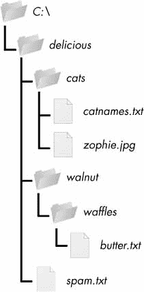
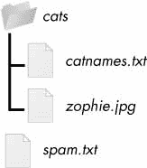

# 10 组织文件

> 原文：<https://automatetheboringstuff.com/2e/chapter10/>


在前一章中，你学习了如何在 Python 中创建和写入新文件。您的程序也可以组织硬盘上预先存在的文件。也许你有过这样的经历:浏览一个装满几十个、几百个、甚至几千个文件的文件夹，然后手动复制、重命名、移动或压缩它们。或者考虑这样的任务:

*   在文件夹的每个子文件夹中复制所有 PDF 文件(仅*复制*PDF 文件)
*   删除包含数百个名为 *spam001.txt* 、 *spam002.txt* 、 *spam003.txt* 等文件的文件夹中每个文件的文件名中的前导零
*   将几个文件夹的内容压缩到一个 ZIP 文件中(这可以是一个简单的备份系统)

所有这些无聊的东西都在乞求用 Python 实现自动化。通过给你的计算机编程来完成这些任务，你可以把它变成一个从不出错的快速工作的档案管理员。

当您开始处理文件时，您可能会发现能够快速查看扩展名(. *txt* ，。 *pdf* ，。 *jpg* 等等)的一个文件。在 macOS 和 Linux 上，你的文件浏览器很可能会自动显示扩展名。在 Windows 中，文件扩展名可能会默认隐藏。要显示扩展，请转到**开始****控制面板****外观和个性化****文件夹选项**。在查看选项卡的高级设置下，取消选中**隐藏已知文件类型的扩展名**复选框。

### **shut il 模块**

`shutil`(或 shell 实用程序)模块具有让您在 Python 程序中复制、移动、重命名和删除文件的功能。要使用`shutil`功能，首先需要使用`import shutil`。

#### ***复制文件和文件夹***

`shutil`模块提供复制文件和整个文件夹的功能。

调用`shutil.copy(` 源 `,` 目的 `)`会将路径源的文件复制到路径目的的文件夹中。源和目的都可以是字符串或`Path`对象。)如果目的地是一个文件名，它将被用作复制文件的新名称。这个函数返回被复制文件的一个字符串或`Path`对象。

在交互式 shell 中输入以下内容，看看`shutil.copy()`是如何工作的:

```py
   >>> import shutil, os

   >>> from pathlib import Path

   >>> p = Path.home()

   >>> shutil.copy(p / 'spam.txt', p / 'some_folder') # ➊

   'C:\\Users\\Al\\some_folder\\spam.txt'

   >>> shutil.copy(p / 'eggs.txt', p / 'some_folder/eggs2.txt') # ➋

   WindowsPath('C:/Users/Al/some_folder/eggs2.txt')
```

第一个`shutil.copy()`调用将位于 *C:\Users\Al\spam.txt* 的文件复制到文件夹 *C:\Users\Al\some_folder* 中。返回值是新复制的文件的路径。注意，由于文件夹被指定为目的地 ➊ ，原始的 *spam.txt* 文件名被用作新的复制文件的文件名。第二个`shutil.copy()`调用 ➋ 也将位于 *C:\Users\Al\eggs.txt* 的文件复制到文件夹*c:\ users \ al \ some _ folder*中，但将复制的文件命名为 *eggs2.txt* 。

`shutil.copy()`将复制单个文件，`shutil.copytree()`将复制整个文件夹以及其中包含的每个文件夹和文件。调用`shutil.copytree(` 源 `,` 目的 `)`会将路径源下的文件夹，连同其所有文件和子文件夹，复制到路径目的下的文件夹。源和目的参数都是字符串。该函数返回被复制文件夹的路径字符串。

在交互式 shell 中输入以下内容:

```py
>>> import shutil, os

>>> from pathlib import Path

>>> p = Path.home()

>>> shutil.copytree(p / 'spam', p / 'spam_backup')

WindowsPath('C:/Users/Al/spam_backup')
```

`shutil.copytree()`调用创建一个名为 *spam_backup* 的新文件夹，其内容与原来的 *spam* 文件夹相同。您现在已经安全地备份了您珍贵的垃圾邮件。

#### ***移动和重命名文件和文件夹***

调用`shutil.move(` 源 `,` 目的地 `)`会将路径源的文件或文件夹移动到路径目的地并将返回一串新位置的绝对路径。

如果目的地指向一个文件夹，则源文件被移动到目的地并保持其当前文件名。例如，在交互式 shell 中输入以下内容:

```py
>>> import shutil

>>> shutil.move('C:\\bacon.txt', 'C:\\eggs')

'C:\\eggs\\bacon.txt'
```

假设一个名为 *eggs* 的文件夹已经存在于 *C:\* 目录中，这个`shutil.move()`调用表示“将 *C:\bacon.txt* 移动到文件夹 *C:\eggs* ”

如果在 *C:\eggs* 中已经有了一个 *bacon.txt* 文件，它就会被覆盖。由于很容易以这种方式意外覆盖文件，所以在使用`move()`时应该小心。

目的地路径也可以指定文件名。在下面的例子中，源文件被移动到*并且*被重命名。

```py
>>> shutil.move('C:\\bacon.txt', 'C:\\eggs\\new_bacon.txt')

'C:\\eggs\\new_bacon.txt'
```

这一行写道，“将 *C:\bacon.txt* 移动到文件夹 *C:\eggs* 中，并且在你这样做的时候，将那个 *bacon.txt* 文件重命名为 *new_bacon.txt*

前面的两个例子都是在假设在 *C:\* 目录中有一个文件夹 *eggs* 的情况下工作的。但如果没有 *eggs* 文件夹，那么`move()`会将 *bacon.txt* 重命名为一个名为 *eggs* 的文件。

```py
>>> shutil.move('C:\\bacon.txt', 'C:\\eggs')

'C:\\eggs'
```

这里，`move()`在 *C:\* 目录中找不到名为 *eggs* 的文件夹，因此假设目的地必须指定文件名，而不是文件夹。所以 *bacon.txt* 文本文件被重命名为 *eggs* (一个没有*的文本文件)。txt* 文件扩展名)—可能不是您想要的！这可能是你程序中一个很难发现的错误，因为`move()`调用可以愉快地做一些可能与你期望的完全不同的事情。这也是使用`move()`时要小心的另一个原因。

最后，组成目的地的文件夹必须已经存在，否则 Python 会抛出异常。在交互式 shell 中输入以下内容:

```py
>>> shutil.move('spam.txt', 'c:\\does_not_exist\\eggs\\ham')

Traceback (most recent call last):

  --snip--

FileNotFoundError: [Errno 2] No such file or directory: 'c:\\does_not_exist\\

eggs\\ham'
```

Python 在*不存在*的目录下寻找*鸡蛋*和*火腿*。它没有找到不存在的目录，所以它不能将 *spam.txt* 移动到您指定的路径。

#### ***永久删除文件和文件夹***

您可以使用`os`模块中的功能删除单个文件或单个空文件夹，而要删除文件夹及其所有内容，您可以使用`shutil`模块。

*   调用`os.unlink(` 路径 `)`会删除路径的文件。
*   调用`os.rmdir(` 路径 `)`会删除路径的文件夹。该文件夹必须没有任何文件或文件夹。
*   调用`shutil.rmtree(` 路径 `)`会删除路径的文件夹，其中包含的所有文件和文件夹也会被删除。

在程序中使用这些函数时要小心！首先运行程序，注释掉这些调用，并添加`print()`调用来显示将要删除的文件，这通常是一个好主意。下面是一个 Python 程序，它旨在删除带有*的文件。txt* 文件扩展名，但有一个错别字(粗体突出显示)，导致它删除*。rxt* 文件改为:

```py
import os

from pathlib import Path

for filename in Path.home().glob('*.rxt'):

    os.unlink(filename)
```

如果你有任何以*结尾的重要文件。rxt* ，它们会被意外地永久删除。相反，您应该首先像这样运行程序:

```py
import os

from pathlib import Path

for filename in Path.home().glob('*.rxt'):

    #os.unlink(filename)

    print(filename)
```

现在`os.unlink()`调用被注释了，所以 Python 忽略了它。相反，您将打印已被删除的文件的文件名。首先运行这个版本的程序会显示你不小心让程序删除了*。rxt* 文件而不是*。txt* 文件。

一旦您确定程序按预期工作，删除`print(filename)`行并取消对`os.unlink(filename)`行的注释。然后再次运行该程序来实际删除文件。

#### ***安全删除用 send2trash 模块***

由于 Python 内置的`shutil.rmtree()`函数会不可逆地删除文件和文件夹，使用起来可能会很危险。删除文件和文件夹的一个更好的方法是使用第三方`send2trash`模块。你可以从终端窗口运行`pip install --user send2trash`来安装这个模块。(关于如何安装第三方模块的更深入的解释，请参见[附录 A](#calibre_link-2) 。)

使用`send2trash`比 Python 的常规删除功能安全得多，因为它会将文件夹和文件发送到你电脑的垃圾桶或回收站，而不是永久删除它们。如果您程序中的一个 bug 删除了您不想删除的带有`send2trash`的东西，您可以稍后从回收站恢复它。

安装完`send2trash`后，在交互式 shell 中输入以下内容:

```py
>>> import send2trash

>>> baconFile = open('bacon.txt', 'a')   # creates the file

>>> baconFile.write('Bacon is not a vegetable.')

25

>>> baconFile.close()

>>> send2trash.send2trash('bacon.txt')
```

一般来说，你应该总是使用`send2trash.send2trash()`功能来删除文件和文件夹。但是，虽然将文件发送到回收站可以让您稍后恢复它们，但它不会像永久删除它们那样释放磁盘空间。如果你想让你的程序释放磁盘空间，使用`os`和`shutil`功能删除文件和文件夹。注意`send2trash()`功能只能将文件发送到回收站；它不能从中提取文件。

### **遍历目录树**

假设您想要重命名某个文件夹中的每个文件以及该文件夹的每个子文件夹中的每个文件。也就是说，您想要遍历目录树，在遍历的过程中接触每个文件。为此编写一个程序可能会变得很棘手；幸运的是，Python 提供了一个函数来为您处理这个过程。

我们来看看 *C:\delicious* 文件夹及其内容，如图[图 10-1](#calibre_link-1195) 所示。



*图 10-1:包含三个文件夹和四个文件的示例文件夹*

下面是一个使用[图 10-1](#calibre_link-1195) 中目录树上的`os.walk()`函数的示例程序:

```py
import os

for folderName, subfolders, filenames in os.walk('C:\\delicious'):

    print('The current folder is ' + folderName)

    for subfolder in subfolders:

        print('SUBFOLDER OF ' + folderName + ': ' + subfolder)

    for filename in filenames:

        print('FILE INSIDE ' + folderName + ': '+ filename)

    print('')
```

向`os.walk()`函数传递一个字符串值:文件夹的路径。您可以在`for`循环语句中使用`os.walk()`来遍历目录树，就像您如何使用`range()`函数来遍历一系列数字一样。与`range()`不同，`os.walk()`函数将在循环的每次迭代中返回三个值:

*   当前文件夹名称的字符串
*   当前文件夹中文件夹的字符串列表
*   当前文件夹中文件的字符串列表

(我说的当前文件夹是指当前`for`循环迭代的文件夹。程序当前的工作目录是由`os.walk()`改变的*而不是*。)

就像你可以在代码`for i in range(10):`中选择变量名`i`一样，你也可以为前面列出的三个值选择变量名。我通常用`foldername`、`subfolders`和`filenames`这些名字。

当您运行该程序时，它将输出以下内容:

```py
The current folder is C:\delicious

SUBFOLDER OF C:\delicious: cats 

SUBFOLDER OF C:\delicious: walnut

FILE INSIDE C:\delicious: spam.txt

The current folder is C:\delicious\cats

FILE INSIDE C:\delicious\cats: catnames.txt

FILE INSIDE C:\delicious\cats: zophie.jpg

The current folder is C:\delicious\walnut

SUBFOLDER OF C:\delicious\walnut: waffles

The current folder is C:\delicious\walnut\waffles

FILE INSIDE C:\delicious\walnut\waffles: butter.txt.
```

由于`os.walk()`返回了`subfolder`和`filename`变量的字符串列表，您可以在它们自己的`for`循环中使用这些列表。用您自己的定制代码替换`print()`函数调用。(或者，如果您不需要其中一个或两个，请移除`for`环。)

### **用 zipfile 模块压缩文件**

你可能熟悉 ZIP 文件(带有*)。zip* 文件扩展名)，可以保存很多其他文件的压缩内容。压缩文件会减小其大小，这在通过互联网传输文件时非常有用。由于一个 ZIP 文件也可以包含多个文件和子文件夹，这是将几个文件打包成一个文件的简便方法。这个被称为*存档文件*的文件可以被附加到电子邮件中。

您的 Python 程序可以使用`zipfile`模块中的函数创建和打开(或*提取* ) ZIP 文件。假设你有一个名为 *example.zip* 的 ZIP 文件，其内容如图[图 10-2](#calibre_link-1514) 所示。



*图 10-2:*example . zip 的内容

你可以从*[【https://nostarch.com/automatestuff2/】](https://nostarch.com/automatestuff2/)*下载这个 ZIP 文件，或者使用你电脑上已经有的 ZIP 文件。

#### ***阅读 ZIP 文件***

要读取 ZIP 文件的内容，首先必须创建一个`ZipFile`对象(注意大写字母 *Z* 和 *F* )。`ZipFile`对象在概念上类似于你在前一章看到的由`open()`函数返回的`File`对象:它们是程序与文件交互的值。要创建一个`ZipFile`对象，调用`zipfile.ZipFile()`函数，传递给它一个*的字符串。ZIP 文件的文件名。注意`zipfile`是 Python 模块的名字，`ZipFile()`是函数的名字。*

例如，在交互式 shell 中输入以下内容:

```py
   >>> import zipfile, os

   >>> from pathlib import Path

   >>> p = Path.home()

   >>> exampleZip = zipfile.ZipFile(p / 'example.zip')

   >>> exampleZip.namelist()

   ['spam.txt', 'cats/', 'cats/catnames.txt', 'cats/zophie.jpg']

   >>> spamInfo = exampleZip.getinfo('spam.txt')

   >>> spamInfo.file_size

   13908

   >>> spamInfo.compress_size

   3828

   >>> f'Compressed file is {round(spamInfo.file_size / spamInfo # ➊

   .compress_size, 2)}x smaller!'

   )

   'Compressed file is 3.63x smaller!'

   >>> exampleZip.close()
```

一个`ZipFile`对象有一个`namelist()`方法，该方法返回 ZIP 文件中包含的所有文件和文件夹的字符串列表。这些字符串可以传递给`getinfo()` `ZipFile`方法，以返回一个关于该特定文件的`ZipInfo`对象。`ZipInfo`对象有自己的属性，比如以字节为单位的`file_size`和`compress_size`，分别保存原始文件大小和压缩文件大小的整数。一个`ZipFile`对象代表一个完整的归档文件，而一个`ZipInfo`对象保存着关于归档文件中一个*文件*的有用信息。

   中的命令通过将原始文件大小除以压缩文件大小来计算 *example.zip* 的压缩效率，并打印该信息。 # ➊

#### ***从 ZIP 文件中提取***

`ZipFile`对象的`extractall()`方法将所有文件和文件夹从一个 ZIP 文件提取到当前工作目录。

```py
   >>> import zipfile, os

   >>> from pathlib import Path

   >>> p = Path.home()

   >>> exampleZip = zipfile.ZipFile(p / 'example.zip')

   >>> exampleZip.extractall() # ➊

   >>> exampleZip.close()
```

运行完这段代码后， *example.zip* 的内容会被提取到 *C:\* 。或者，您可以向`extractall()`传递一个文件夹名，让它将文件提取到当前工作目录之外的文件夹中。如果传递给`extractall()`方法的文件夹不存在，它将被创建。例如，如果您将在 ➊ 的调用替换为`exampleZip.extractall('C:\\delicious')`，代码会将文件从 *example.zip* 提取到一个新创建的 *C:\delicious* 文件夹中。

用于`ZipFile`对象的`extract()`方法将从 ZIP 文件中提取一个文件。继续交互式 shell 示例:

```py
>>> exampleZip.extract('spam.txt')

'C:\\spam.txt'

>>> exampleZip.extract('spam.txt', 'C:\\some\\new\\folders')

'C:\\some\\new\\folders\\spam.txt'

>>> exampleZip.close()
```

传递给`extract()`的字符串必须与`namelist()`返回的列表中的一个字符串匹配。或者，您可以向`extract()`传递第二个参数，将文件提取到当前工作目录之外的文件夹中。如果第二个参数是一个尚不存在的文件夹，Python 将创建该文件夹。`extract()`返回的值是文件被提取到的绝对路径。

#### ***创建并添加到 ZIP 文件***

要创建你自己的压缩 ZIP 文件，你必须通过传递第二个参数`'w'`在*写模式*下打开`ZipFile`对象。(这类似于通过将`'w'`传递给`open()`函数以写模式打开一个文本文件。)

当您传递一个路径到一个`ZipFile`对象的`write()`方法时，Python 将压缩该路径下的文件并将其添加到 ZIP 文件中。`write()`方法的第一个参数是要添加的文件名的字符串。第二个参数是*压缩类型*参数，它告诉计算机应该使用什么算法来压缩文件；您总是可以将该值设置为`zipfile.ZIP_DEFLATED`。(这指定了 *deflate* 压缩算法，该算法适用于所有类型的数据。)在交互式 shell 中输入以下内容:

```py
>>> import zipfile

>>> newZip = zipfile.ZipFile('new.zip', 'w')

>>> newZip.write('spam.txt', compress_type=zipfile.ZIP_DEFLATED)

>>> newZip.close()
```

这段代码将创建一个名为 *new.zip* 的新 ZIP 文件，其中包含了 *spam.txt* 的压缩内容。

请记住，就像写入文件一样，写入模式将擦除 ZIP 文件的所有现有内容。如果您想简单地将文件添加到现有的 ZIP 文件中，将`'a'`作为第二个参数传递给`zipfile.ZipFile()`以在*追加模式*下打开 ZIP 文件。

### **项目:将美式日期的文件重命名为欧式日期**

假设你的老板给你发了几千封电子邮件，文件名称中带有美式日期(MM-DD-YYYY)，并需要将它们重命名为欧式日期(DD-MM-YYYY)。手工完成这项无聊的任务可能要花一整天的时间！让我们写一个程序来代替它。

这个程序是这样做的:

1.  它在当前工作目录的所有文件名中搜索美式日期。
2.  当找到一个文件时，它会重命名该文件，并交换月份和日期，使其具有欧洲风格。

这意味着代码需要执行以下操作:

1.  创建一个可以识别美式日期文本模式的正则表达式。
2.  调用`os.listdir()`找到工作目录中的所有文件。
3.  循环遍历每个文件名，使用正则表达式检查它是否有日期。
4.  如果它有日期，用`shutil.move()`重命名文件。

对于这个项目，打开一个新的文件编辑器窗口，将您的代码保存为 *renameDates.py* 。

#### ***第一步:为美式日期*** 创建一个正则表达式

该计划的第一部分将需要导入必要的模块，并创建一个正则表达式，可以识别 MM-DD-YYYY 日期。待办事项会提醒你在这个程序中还剩下什么要写。将它们输入为`TODO`使得使用 Mu 编辑器的 <small class="calibre11">CTRL-F</small> 查找功能很容易找到它们。使您的代码看起来像下面这样:

```py
   #! python3

   # renameDates.py - Renames filenames with American MM-DD-YYYY date format

   # to European DD-MM-YYYY.

   import shutil, os, re # ➊

   # Create a regex that matches files with the American date format.

   datePattern = re.compile(r"""^(.*?) # all text before the date # ➋

       ((0|1)?\d)-                     # one or two digits for the month

       ((0|1|2|3)?\d)-                 # one or two digits for the day

       ((19|20)\d\d)                   # four digits for the year

       (.*?)$                          # all text after the date

       """, re.VERBOSE➌)

   # TODO: Loop over the files in the working directory.

   # TODO: Skip files without a date.

   # TODO: Get the different parts of the filename.

   # TODO: Form the European-style filename.

   # TODO: Get the full, absolute file paths.

   # TODO: Rename the files.
```

从这一章，你知道了`shutil.move()`函数可以用来重命名文件:它的参数是要重命名的文件名和新文件名。因为这个函数存在于`shutil`模块中，你必须导入那个模块 ➊ 。

但是在重命名文件之前，您需要确定要重命名哪些文件。带日期的文件名如 *spam4-4-1984.txt* 和 *01-03-2014eggs.zip* 要改名，不带日期的文件名如 *littlebrother.epub* 可以忽略。

您可以使用正则表达式来识别这种模式。在顶部导入`re`模块后，调用`re.compile()`创建一个`Regex`对象 ➋ 。为第二个参数 ➌ 传递`re.VERBOSE`将允许正则表达式字符串中的空白和注释，使其更具可读性。

正则表达式字符串以`^(.*?)`开头，匹配文件名开头的任何可能在日期之前的文本。`((0|1)?\d)`组匹配月份。第一个数字可以是`0`或`1`，所以正则表达式匹配十二月的`12`和二月的`02`。这个数字也是可选的，因此月份可以是四月的`04`或`4`。当天的组是`((0|1|2|3)?\d)`并且遵循类似的逻辑；`3`、`03`、`31`都是有效的天数。(是的，这个正则表达式将接受一些无效日期，如`4-31-2014`、`2-29-2013`和`0-15-2014`。约会有很多棘手的特例，很容易被忽略。但是为了简单起见，这个程序中的正则表达式已经足够好了。)

虽然 1885 年是一个有效的年份，但你可以只查找 20 世纪或 21 世纪的年份。这将防止您的程序意外地将非日期文件名与类似日期的格式匹配，例如 *10-10-1000.txt* 。

正则表达式的`(.*?)$`部分将匹配日期之后的任何文本。

#### ***第二步:从文件名中识别日期部分***

接下来，程序必须遍历从`os.listdir()`返回的文件名字符串列表，并根据正则表达式匹配它们。应该跳过任何没有日期的文件。对于有日期的文件名，匹配的文本将存储在几个变量中。用以下代码填充程序中的前三个`TODO`:

```py
#! python3

# renameDates.py - Renames filenames with American MM-DD-YYYY date format

# to European DD-MM-YYYY.

--snip--

# Loop over the files in the working directory.

for amerFilename in os.listdir('.'):

    mo = datePattern.search(amerFilename)

    # Skip files without a date.

     if mo == None: # ➊

         continue # ➋

     # Get the different parts of the filename. # ➌

    beforePart = mo.group(1)

    monthPart  = mo.group(2)

    dayPart    = mo.group(4)

    yearPart   = mo.group(6)

    afterPart  = mo.group(8)

--snip--
```

如果从`search()`方法返回的`Match`对象是`None` ➊ ，那么`amerFilename`中的文件名与正则表达式不匹配。`continue`语句 ➋ 将跳过循环的剩余部分，继续下一个文件名。

否则，正则表达式组中匹配的各种字符串将存储在名为`beforePart`、`monthPart`、`dayPart`、`yearPart`和`afterPart`、、的变量中。这些变量中的字符串将在下一步中用于形成欧式文件名。

为了保持组号不变，尝试从头开始阅读正则表达式，并在每次遇到左括号时向上计数。不用考虑代码，只要写出正则表达式的大纲就可以了。这可以帮助你将这些群体形象化。这里有一个例子:

```py
datePattern = re.compile(r"""^(1) # all text before the date

    (2 (3) )-                     # one or two digits for the month

    (4 (5) )-                     # one or two digits for the day

    (6 (7) )                      # four digits for the year

    (8)$                          # all text after the date

    """, re.VERBOSE)
```

这里，数字 **1** 到 **8** 代表你写的正则表达式中的组。只使用括号和组号来概述正则表达式，可以让您在继续程序的其余部分之前对正则表达式有一个更清晰的理解。

#### ***第三步:形成新的文件名，并将文件重命名为***

最后一步，用欧式日期连接上一步中变量的字符串:日期在月份之前。用以下代码填充程序中剩余的三个`TODO`:

```py
#! python3

# renameDates.py - Renames filenames with American MM-DD-YYYY date format # to European DD-MM-YYYY.

--snip--

     # Form the European-style filename.

     euroFilename = beforePart + dayPart + '-' + monthPart + '-' + yearPart + # ➊

                    afterPart

     # Get the full, absolute file paths.

     absWorkingDir = os.path.abspath('.')

     amerFilename = os.path.join(absWorkingDir, amerFilename)

     euroFilename = os.path.join(absWorkingDir, euroFilename)

     # Rename the files.

     print(f'Renaming "{amerFilename}" to "{euroFilename}"...') # ➋

     #shutil.move(amerFilename, euroFilename)   # uncomment after testing # ➌
```

将串接的字符串存储在名为`euroFilename` ➊ 的变量中。然后，将`amerFilename`中的原始文件名和新的`euroFilename`变量传递给`shutil.move()`函数，以重命名文件 ➌ 。

这个程序注释掉了`shutil.move()`调用，而是打印将被重命名为 ➋ 的文件名。首先像这样运行程序可以让您仔细检查文件是否被正确地重命名。然后，您可以取消对`shutil.move()`调用的注释，并再次运行程序来实际重命名文件。

#### ***类似节目的创意***

还有许多其他原因可能会导致您想要重命名大量文件。

*   在文件名的开头添加前缀，如添加 *spam_* 将 *eggs.txt* 重命名为 *spam_eggs.txt*
*   将带有欧式日期的文件名更改为美式日期
*   删除文件中的零，如 *spam0042.txt*

### **项目:将文件夹备份成 ZIP 文件**

假设您正在处理一个项目，该项目的文件保存在一个名为 *C:\AlsPythonBook* 的文件夹中。您担心丢失您的工作，所以您想要创建整个文件夹的 ZIP 文件“快照”。您希望保留不同的版本，所以您希望 ZIP 文件的文件名在每次创建时递增；比如 *AlsPythonBook_1.zip* 、 *AlsPythonBook_2.zip* 、 *AlsPythonBook_3.zip* 等等。您可以手动完成这项工作，但是这很烦人，而且您可能会不小心弄错 ZIP 文件的名称。运行一个程序来替你完成这个无聊的任务会简单得多。

对于这个项目，打开一个新的文件编辑器窗口，保存为*backup zip . py*。

#### ***第一步:算出 ZIP 文件的名字***

这个程序的代码将被放入一个名为`backupToZip()`的函数中。这将使得将函数复制并粘贴到其他需要该功能的 Python 程序中变得容易。程序结束时，将调用该函数来执行备份。让你的程序看起来像这样:

```py
   #! python3

   # backupToZip.py - Copies an entire folder and its contents into

   # a ZIP file whose filename increments.

   import zipfile, os # ➊

   def backupToZip(folder):

       # Back up the entire contents of "folder" into a ZIP file.

       folder = os.path.abspath(folder)   # make sure folder is absolute

       # Figure out the filename this code should use based on

       # what files already exist.

       number = 1 # ➋

       while True: # ➌

           zipFilename = os.path.basename(folder) + '_' + str(number) + '.zip'

           if not os.path.exists(zipFilename):

               break

           number = number + 1

       # TODO: Create the ZIP file. # ➍

       # TODO: Walk the entire folder tree and compress the files in each folder.

       print('Done.')

backupToZip('C:\\delicious')
```

先做基本的:添加 shebang ( `#!`)行，描述程序做什么，导入`zipfile`和`os`模块 ➊ 。

定义一个只接受一个参数`folder`的`backupToZip()`函数。此参数是应备份其内容的文件夹的字符串路径。该函数将确定它将创建的 ZIP 文件的文件名；然后该函数将创建文件，遍历`folder`文件夹，并将每个子文件夹和文件添加到 ZIP 文件中。在源代码中为这些步骤写下`TODO`注释，提醒自己以后再做 ➍ 。

第一部分，命名 ZIP 文件，使用绝对路径的基本名`folder`。如果正在备份的文件夹是 *C:\delicious* ，ZIP 文件的名称应该是 *delicious_N.zip* ，其中 *N* = 1 是第一次运行程序， *N* = 2 是第二次，以此类推。

你可以通过检查 *delicious_1.zip* 是否已经存在，再检查 *delicious_2.zip* 是否已经存在来确定 *N* 应该是什么，以此类推。对*【➋】使用一个名为`number`的变量，并在调用`os.path.exists()`的循环中保持递增，以检查文件是否存在 ➌ 。找到的第一个不存在的文件名将导致循环`break`，因为它将找到新 zip 的文件名。*

 *#### ***第二步:新建 ZIP 文件***

接下来，让我们创建 ZIP 文件。让您的程序看起来像下面这样:

```py
#! python3

# backupToZip.py - Copies an entire folder and its contents into

# a ZIP file whose filename increments.

--snip--

    while True:

        zipFilename = os.path.basename(folder) + '_' + str(number) + '.zip'

        if not os.path.exists(zipFilename):

            break

        number = number + 1

    # Create the ZIP file.

    print(f'Creating {zipFilename}...')

     backupZip = zipfile.ZipFile(zipFilename, 'w') # ➊

     # TODO: Walk the entire folder tree and compress the files in each folder.

     print('Done.')

backupToZip('C:\\delicious')
```

既然新的 ZIP 文件的名称存储在`zipFilename`变量中，您可以调用`zipfile.ZipFile()`来实际创建 ZIP 文件 ➊ 。确保将`'w'`作为第二个参数传递，以便以写模式打开 ZIP 文件。

#### ***第三步:遍历目录树，添加到 ZIP 文件***

现在您需要使用`os.walk()`函数列出文件夹及其子文件夹中的每个文件。让您的程序看起来像下面这样:

```py
#! python3

# backupToZip.py - Copies an entire folder and its contents into

# a ZIP file whose filename increments.

--snip--

     # Walk the entire folder tree and compress the files in each folder.

     for foldername, subfolders, filenames in os.walk(folder): # ➊

         print(f'Adding files in {foldername}...')

         # Add the current folder to the ZIP file.

         backupZip.write(foldername) # ➋

         # Add all the files in this folder to the ZIP file.

         for filename in filenames: # ➌

            newBase = os.path.basename(folder) + '_'

            if filename.startswith(newBase) and filename.endswith('.zip'):

                continue   # don't back up the backup ZIP files

             backupZip.write(os.path.join(foldername, filename))

     backupZip.close()

     print('Done.')

backupToZip('C:\\delicious')
```

您可以在一个`for`循环 ➊ 中使用`os.walk()`，在每次迭代中，它将返回迭代的当前文件夹名称、该文件夹中的子文件夹以及该文件夹中的文件名。

在`for`循环中，文件夹被添加到 ZIP 文件 ➋ 中。嵌套的`for`循环可以遍历`filenames`列表 ➌ 中的每个文件名。除了以前制作的备份 ZIP 文件之外，这些文件都被添加到 ZIP 文件中。

当您运行这个程序时，它将产生类似如下的输出:

```py
Creating delicious_1.zip...

Adding files in C:\delicious...

Adding files in C:\delicious\cats...

Adding files in C:\delicious\waffles...

Adding files in C:\delicious\walnut...

Adding files in C:\delicious\walnut\waffles...

Done.
```

第二次运行时，它会将 *C:\delicious* 中的所有文件放入一个名为 *delicious_2.zip* 的 ZIP 文件中，以此类推。

#### ***类似节目的创意***

您可以遍历目录树，并在其他几个程序中将文件添加到压缩的 ZIP 存档中。例如，您可以编写执行以下操作的程序:

*   遍历目录树，只归档带有某些扩展名的文件，比如*。txt* 或*。py* ，别的什么都没有。
*   遍历目录树，归档除了*之外的每个文件。txt* 和*。py* 个。
*   在目录树中查找文件数量最多的文件夹或使用磁盘空间最多的文件夹。

### **总结**

即使你是一个有经验的计算机用户，你也可能用鼠标和键盘手工处理文件。现代文件资源管理器使得处理几个文件变得很容易。但有时你需要使用电脑的文件管理器来执行一项需要几个小时的任务。

`os`和`shutil`模块提供复制、移动、重命名和删除文件的功能。删除文件时，您可能希望使用`send2trash`模块将文件移动到回收站或回收站，而不是永久删除它们。当编写处理文件的程序时，最好注释掉执行实际复制/移动/重命名/删除的代码，并添加一个`print()`调用，这样你就可以运行程序并验证它到底会做什么。

通常，您不仅需要对一个文件夹中的文件执行这些操作，还需要对该文件夹中的每个文件夹执行这些操作，依此类推。`os.walk()`函数为您处理文件夹间的跋涉，这样您就可以专注于程序需要对其中的文件做什么。

`zipfile`模块给你一种在*中压缩和解压文件的方法。ZIP* 通过 Python 存档。结合`os`和`shutil`的文件处理功能，`zipfile`可以轻松打包硬盘上任意位置的多个文件。这些*。ZIP 文件比许多单独的文件更容易上传到网站或作为电子邮件附件发送。*

本书的前几章已经提供了源代码供你复制。但是当你写你自己的程序时，它们第一次可能不会完美地出来。下一章关注一些 Python 模块，它们将帮助你分析和调试你的程序，这样你就可以快速地让它们正常工作。

### **练习题**

[1](#calibre_link-1515) 。`shutil.copy()`和`shutil.copytree()`有什么区别？

[2](#calibre_link-1516) 。什么功能是用来重命名文件的？

[3](#calibre_link-1517) 。`send2trash`和`shutil`模块中的删除功能有什么区别？

[4](#calibre_link-1518) 。`ZipFile`对象有一个`close()`方法，就像`File`对象的`close()`方法一样。什么`ZipFile`方法等同于`File`对象的`open()`方法？

### **实践项目**

为了练习，编写程序来完成以下任务。

#### ***选择性复制***

写一个程序，遍历一个文件夹树，搜索某个文件扩展名的文件(比如*)。pdf* 或*。jpg* 。将这些文件从它们所在的任何位置复制到一个新文件夹中。

#### ***删除不需要的文件***

一些不需要但数量庞大的文件或文件夹占据了硬盘的大部分空间，这种情况并不少见。如果你想在你的电脑上释放空间，你可以通过删除大量不需要的文件来获得最大的回报。但首先你必须找到他们。

编写一个程序，遍历文件夹树，搜索特别大的文件或文件夹——比如文件大小超过 100MB 的。(记住，要获得文件的大小，可以使用`os`模块中的`os.path.getsize()`。)打印这些文件及其到屏幕的绝对路径。

#### ***填补空白***

编写一个程序，在单个文件夹中查找带有给定前缀的所有文件，如 *spam001.txt* 、 *spam002.txt* 等，并定位编号中的任何空白(如是否有 *spam001.txt* 和 *spam003.txt* ，但没有 *spam002.txt* )。让程序重命名所有后面的文件，以缩小这个差距。

作为一个额外的挑战，编写另一个程序，可以将间隙插入到编号文件中，以便可以添加新文件。*