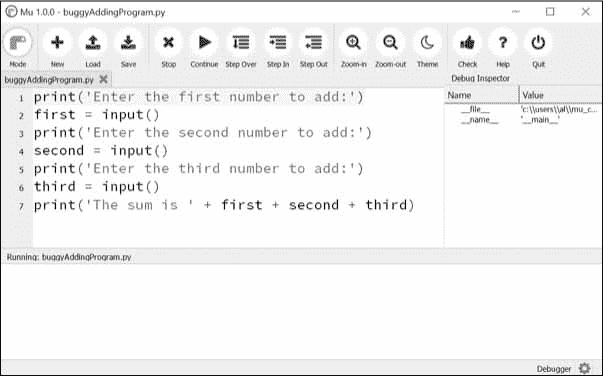
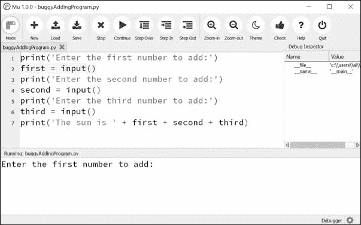
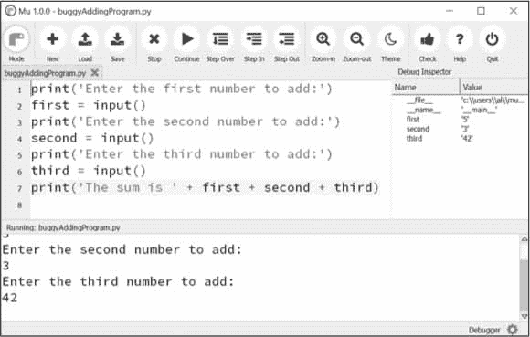
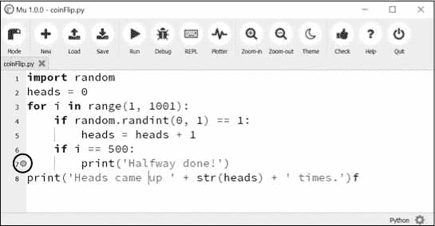

# 11 调试

> 原文：<https://automatetheboringstuff.com/2e/chapter11/>


既然你已经知道了足够多的知识来编写更复杂的程序，你可能会开始发现其中不那么简单的错误。这一章介绍了一些工具和技术，用于查找程序中错误的根本原因，帮助您更快、更省力地修复错误。

套用程序员之间的一个老笑话，写代码占编程的 90%。调试代码占其余的 90%。

你的电脑只会做你让它做的事情；它不会读取你的想法，做你想让它做的事情。即使是专业的程序员也会一直制造 bug，所以如果你的程序有问题也不要气馁。

幸运的是，有一些工具和技术可以确定您的代码到底在做什么以及哪里出错了。首先，您将看到日志记录和断言，这两个特性可以帮助您尽早发现 bug。一般来说，越早发现错误，就越容易修复。

其次，您将了解如何使用调试器。调试器是 Mu 的一个特性，它一次执行一条程序指令，让您有机会在代码运行时检查变量的值，并跟踪这些值在程序过程中是如何变化的。这比全速运行程序要慢得多，但它有助于在程序运行时看到程序中的实际值，而不是从源代码中推断出可能的值。

### 引发异常

每当 Python 试图执行无效代码时，都会引发异常。在第 3 章的中，你读到了如何用`try`和`except`语句处理 Python 的异常，这样你的程序就可以从你预期的异常中恢复。但是您也可以在代码中引发自己的异常。引发异常是一种说法，“停止运行这个函数中的代码，将程序执行移到`except`语句中”。

异常由一个`raise`语句引发。在代码中，`raise`语句由以下内容组成：

*   `raise`关键字
*   对`Exception()`函数的调用
*   传递给`Exception()`函数的带有有用错误消息的字符串

例如，在交互式 Shell 中输入以下内容：

```py
>>> raise Exception('This is the error message.')

Traceback (most recent call last):

  File "<pyshell#191>", line 1, in <module>

    raise Exception('This is the error message.')

Exception: This is the error message.
```

如果没有包含引发异常的`raise`语句的`try`和`except`语句，程序就会崩溃并显示异常的错误信息。

通常，知道如何处理异常的是调用函数的代码，而不是函数本身。这意味着你通常会在函数中看到一个`raise`语句，在调用函数的代码中看到`try`和`except`语句。例如，打开一个新的文件编辑器选项卡，输入以下代码，并将程序保存为`boxPrint.py` :

```py
def boxPrint(symbol, width, height):

    if len(symbol) != 1:

         raise Exception('Symbol must be a single character string.') # ➊

    if width <= 2:

         raise Exception('Width must be greater than 2.') # ➋

    if height <= 2:

         raise Exception('Height must be greater than 2.') # ➌

    print(symbol * width)

    for i in range(height - 2):

        print(symbol + (' ' * (width - 2)) + symbol)

    print(symbol * width)

for sym, w, h in (('*', 4, 4), ('O', 20, 5), ('x', 1, 3), ('ZZ', 3, 3)):

    try:

        boxPrint(sym, w, h)

     except Exception as err: # ➍

         print('An exception happened: ' + str(err)) # ➎
```

您可以在[`autbor.com/boxprint`](https://autbor.com/boxprint)查看该程序的执行情况。这里我们定义了一个`boxPrint()`函数，它接受一个字符、一个宽度和一个高度，并使用该字符制作一个具有该宽度和高度的小盒子的图片。这个盒子形状被打印到屏幕上。

假设我们希望字符是单个字符，宽度和高度大于 2。如果这些需求没有得到满足，我们添加`if`语句来引发异常。后来，当我们用各种参数调用`boxPrint()`时，我们的`try` / `except`会处理无效的参数。

这个程序使用了`except`语句 ➍ 的`except Exception as err`形式。如果从`boxPrint()`➊➋➌返回一个`Exception`对象，这个`except`语句会将它存储在一个名为`err`的变量中。然后，我们可以通过将`Exception`对象传递给`str()`来将其转换为一个字符串，从而产生一个用户友好的错误消息 ➎ 。当您运行这个`boxPrint.py`时，输出将如下所示：

```py
****

*  *

*  *

****

OOOOOOOOOOOOOOOOOOOO

O                  O

O                  O

O                  O

OOOOOOOOOOOOOOOOOOOO

An exception happened: Width must be greater than 2.

An exception happened: Symbol must be a single character string.
```

使用`try`和`except`语句，您可以更优雅地处理错误，而不是让整个程序崩溃。

### 获取字符串形式的回溯

当 Python 遇到错误时，它会产生一个称为*回溯*的错误信息宝库。回溯包括错误消息、导致错误的行的行号以及导致错误的函数调用序列。这个调用序列被称为*调用栈*。

在 Mu 中打开一个新的文件编辑器页签，进入如下程序，保存为`errorExample.py` :

```py
def spam():

    bacon()

def bacon():

    raise Exception('This is the error message.')

spam()
```

当您运行`errorExample.py`时，输出将如下所示：

```py
Traceback (most recent call last):

  File "errorExample.py", line 7, in <module>

    spam()

  File "errorExample.py", line 2, in spam

    bacon()

  File "errorExample.py", line 5, in bacon

    raise Exception('This is the error message.')

Exception: This is the error message.
```

从回溯中，您可以看到错误发生在第 5 行的`bacon()`函数中。这个对`bacon()`的调用来自第 2 行的`spam()`函数，该函数在第 7 行被调用。在可以从多个地方调用函数的程序中，调用栈可以帮助您确定哪个调用导致了错误。

每当出现未处理的异常时，Python 都会显示回溯。但是您也可以通过调用`traceback.format_exc()`以字符串的形式获取它。如果您想从异常的回溯中获得信息，但又想让一个`except`语句优雅地处理异常，那么这个函数非常有用。在调用这个函数之前，你需要导入 Python 的`traceback`模块。

例如，您可以将回溯信息写入一个文本文件并保持程序运行，而不是在发生异常时立即使程序崩溃。当您准备调试程序时，可以稍后查看该文本文件。在交互式 Shell 中输入以下内容：

```py
>>> import traceback

>>> try:

...          raise Exception('This is the error message.')

except:

...          errorFile = open('errorInfo.txt', 'w')

...          errorFile.write(traceback.format_exc())

...          errorFile.close()

...          print('The traceback info was written to errorInfo.txt.')

111

The traceback info was written to errorInfo.txt.
```

`111`是来自`write()`方法的返回值，因为有 111 个字符被写入文件。追溯文本被写入`errorInfo.txt`。

```py
Traceback (most recent call last):

  File "<pyshell#28>", line 2, in <module>

Exception: This is the error message.
```

在第 255 页的的日志中，您将学习如何使用`logging`模块，这比简单地将错误信息写入文本文件更有效。

### 断言

*断言*是一个健全检查，以确保你的代码没有做一些明显错误的事情。这些健全性检查是由`assert`语句执行的。如果健全性检查失败，则引发一个`AssertionError`异常。在代码中，`assert`语句由以下内容组成：

*   `assert`关键字
*   条件(即计算结果为`True`或`False`的表达式)
*   逗号
*   条件为`False`时显示的字符串

用简单的英语来说，一个`assert`语句说，“我断言条件成立，如果不成立，那么某个地方有一个 bug，所以立即停止程序”。例如，在交互式 Shell 中输入以下内容：

```py
>>> ages = [26, 57, 92, 54, 22, 15, 17, 80, 47, 73]

>>> ages.sort()

>>> ages

[15, 17, 22, 26, 47, 54, 57, 73, 80, 92]

>>> assert

ages[0] <= ages[-1] # Assert that the first age is <= the last age.
```

这里的`assert`语句断言`ages`中的第一项应该小于或等于最后一项。这是一个健全性检查；如果`sort()`中的代码没有 bug，并且完成了它的工作，那么这个断言就是真的。

因为`ages[0] <= ages[-1]`表达式的计算结果是`True`，所以`assert`语句什么也不做。

然而，让我们假设我们的代码中有一个 bug。假设我们不小心调用了`reverse()` list 方法，而不是`sort()` list 方法。当我们在交互式 Shell 中输入以下内容时，`assert`语句会引发一个`AssertionError`:

```py
>>> ages = [26, 57, 92, 54, 22, 15, 17, 80, 47, 73]

>>> ages.reverse()

>>> ages

[73, 47, 80, 17, 15, 22, 54, 92, 57, 26]

>>> assert ages[0] <= ages[-1] # Assert that the first age is <= the last age.

Traceback (most recent call last):

  File "<stdin>", line 1, in <module>

AssertionError
```

与异常不同，你的代码*不应该*用`try`和`except`处理`assert`语句；如果一个`assert`失败，你的程序*应该*崩溃。通过像这样的“快速失败”,您缩短了从错误的最初原因到您第一次注意到错误之间的时间。这将减少您在找到错误原因之前必须检查的代码量。

断言是针对程序员的错误，而不是用户的错误。只有当程序正在开发时，断言才应该失败；用户永远不会在完成的程序中看到断言错误。对于程序在正常操作中可能遇到的错误(比如找不到文件或者用户输入了无效数据)，抛出一个异常，而不是用`assert`语句检测它。您不应该使用`assert`语句来代替引发异常，因为用户可以选择关闭断言。如果用`python -O myscript.py`而不是`python myscript.py`运行 Python 脚本，Python 会跳过`assert`语句。当用户开发一个程序并需要在一个要求最高性能的生产环境中运行它时，他们可能会禁用断言。(尽管，在许多情况下，他们会让断言保持启用状态。)

断言也不能代替全面的测试。例如，如果前面的`ages`例子被设置为`[10, 3, 2, 1, 20]`，那么`assert ages[0] <= ages[-1]`断言不会注意到列表是未排序的，因为它的第一个年龄恰好小于或等于最后一个年龄，这是断言检查的唯一内容。

#### 在交通灯模拟中使用断言

假设您正在构建一个交通灯模拟程序。表示十字路口停车灯的数据结构是一个字典，带有关键字`'ns'`和`'ew'`，分别表示面向南北和东西的停车灯。这些键的值将是字符串`'green'`、`'yellow'`或`'red'`中的一个。代码看起来会像这样：

```py
market_2nd = {'ns': 'green', 'ew': 'red'}

mission_16th = {'ns': 'red', 'ew': 'green'}
```

这两个变量将用于市场街和第二街以及教会街和第十六街的交叉口。要启动该项目，您需要编写一个`switchLights()`函数，该函数将以一个交集字典作为参数，并切换灯光。

起初，你可能认为`switchLights()`应该简单地将每种光切换到序列中的下一种颜色：任何`'green'`值都应该更改为`'yellow'` , `'yellow'`值应该更改为`'red'`,`'red'`值应该更改为`'green'`。实现这一想法的代码可能如下所示：

```py
def switchLights(stoplight):

    for key in stoplight.keys():

        if stoplight[key] == 'green':

            stoplight[key] = 'yellow'

        elif stoplight[key] == 'yellow':

            stoplight[key] = 'red'

        elif stoplight[key] == 'red':

            stoplight[key] = 'green'

switchLights(market_2nd)
```

您可能已经看到了这段代码的问题，但是让我们假设您编写了模拟代码的其余部分，长达数千行，而没有注意到它。当你最终运行模拟时，程序不会崩溃，但你的虚拟汽车会崩溃！

因为您已经编写了程序的其余部分，所以您不知道 bug 可能在哪里。也许是在模拟汽车的代码中，或者是在模拟虚拟司机的代码中。追踪这个错误到`switchLights()`函数可能需要几个小时。

但是，如果在编写`switchLights()`时，您添加了一个断言来检查*至少有一个灯始终是红色的*，您可能会在函数的底部包含以下内容：

```py
assert 'red' in stoplight.values(), 'Neither light is red! ' + str(stoplight)
```

有了这个断言，您的程序将崩溃，并显示以下错误消息：

```py
   Traceback (most recent call last):

     File "carSim.py", line 14, in <module>

       switchLights(market_2nd)

     File "carSim.py", line 13, in switchLights

       assert 'red' in stoplight.values(), 'Neither light is red! ' +

   str(stoplight)

   AssertionError: Neither light is red! {'ns': 'yellow', 'ew': 'green'} # ➊
```

这里重要的一行是`AssertionError` ➊ 。虽然您的程序崩溃并不理想，但它会立即指出健全性检查失败：两个方向的流量都没有红灯，这意味着流量可能是双向的。通过在程序执行的早期快速失败，您可以为自己节省很多未来的调试工作。

### 测井

如果您曾经在程序运行时在代码中放入一个`print()`语句来输出某个变量的值，那么您已经使用了一种形式的*日志*来调试您的代码。日志记录是了解程序中发生了什么以及发生的顺序的好方法。Python 的`logging`模块使得创建您编写的定制消息的记录变得容易。这些日志消息将描述程序执行到达日志函数调用的时间，并列出您在该时间点指定的任何变量。另一方面，缺失的日志消息表明部分代码被跳过并且从未执行过。

#### 使用日志模块

要使`logging`模块在程序运行时在屏幕上显示日志消息，请将以下内容复制到程序顶部(但在`#! python` shebang 行下):

```py
import logging

logging.basicConfig(level=logging.DEBUG, format=' %(asctime)s -  %(levelname)

s -  %(message)s')
```

您不需要太担心这是如何工作的，但基本上，当 Python 记录一个事件时，它会创建一个保存该事件信息的`LogRecord`对象。`logging`模块的`basicConfig()`功能让您指定想要查看的`LogRecord`对象的详细信息以及如何显示这些详细信息。

假设你写了一个函数来计算一个数的阶乘。在数学中，阶乘 4 是 1 × 2 × 3 × 4，即 24。阶乘 7 是 1 × 2 × 3 × 4 × 5 × 6 × 7，即 5040。打开一个新的文件编辑器选项卡，并输入以下代码。它有一个错误，但是您也将输入几个日志消息来帮助您自己找出哪里出错了。将程序另存为`factorialLog.py`。

```py
import logging

logging.basicConfig(level=logging.DEBUG, format='%(asctime)s -  %(levelname)s

-  %(message)s')

logging.debug('Start of program')

def factorial(n):

    logging.debug('Start of factorial(%s%%)'  % (n))

    total = 1

    for i in range(n + 1):

        total *= i

        logging.debug('i is ' + str(i) + ', total is ' + str(total))

    logging.debug('End of factorial(%s%%)'  % (n))

    return total

print(factorial(5))

logging.debug('End of program')
```

这里，当我们想要打印日志信息时，我们使用`logging.debug()`函数。这个`debug()`函数会调用`basicConfig()`，打印一行信息。该信息将采用我们在`basicConfig()`中指定的格式，并将包括我们传递给`debug()`的消息。`print(factorial(5))`调用是原始程序的一部分，因此即使日志消息被禁用，结果也会显示。

这个程序的输出如下所示：

```py
2019-05-23 16:20:12,664 - DEBUG - Start of program

2019-05-23 16:20:12,664 - DEBUG - Start of factorial(5)

2019-05-23 16:20:12,665 - DEBUG - i is 0, total is 0

2019-05-23 16:20:12,668 - DEBUG - i is 1, total is 0

2019-05-23 16:20:12,670 - DEBUG - i is 2, total is 0

2019-05-23 16:20:12,673 - DEBUG - i is 3, total is 0

2019-05-23 16:20:12,675 - DEBUG - i is 4, total is 0

2019-05-23 16:20:12,678 - DEBUG - i is 5, total is 0

2019-05-23 16:20:12,680 - DEBUG - End of factorial(5)

0

2019-05-23 16:20:12,684 - DEBUG - End of program
```

`factorial()`函数返回`0`作为`5`的阶乘，这是不对的。`for`循环应该将`total`中的值乘以从`1`到`5`的数字。但是`logging.debug()`显示的日志信息显示`i`变量开始于`0`而不是`1`。因为零乘以任何东西都是零，所以剩余的迭代对于`total`也具有错误的值。日志消息提供了一系列线索，可以帮助您找出事情开始出错的时间。

将`for i in range(n + 1):`行改为`for i in range(` 1、`n + 1):`，再次运行程序。输出将如下所示：

```py
2019-05-23 17:13:40,650 - DEBUG - Start of program

2019-05-23 17:13:40,651 - DEBUG - Start of factorial(5)

2019-05-23 17:13:40,651 - DEBUG - i is 1, total is 1

2019-05-23 17:13:40,654 - DEBUG - i is 2, total is 2

2019-05-23 17:13:40,656 - DEBUG - i is 3, total is 6

2019-05-23 17:13:40,659 - DEBUG - i is 4, total is 24

2019-05-23 17:13:40,661 - DEBUG - i is 5, total is 120

2019-05-23 17:13:40,661 - DEBUG - End of factorial(5)

120

2019-05-23 17:13:40,666 - DEBUG - End of program
```

`factorial(5)`调用正确返回`120`。日志消息显示了循环内部发生了什么，这直接导致了 bug。

您可以看到，`logging.debug()`调用不仅打印出传递给它们的字符串，还打印出时间戳和单词`DEBUG`。

#### 不用 print()函数进行调试

键入`import logging`和`logging.basicConfig(level=logging.DEBUG, format='%(asctime)s - %(levelname)s - %(message)s')`有些笨拙。你可能想用`print()`通话来代替，但是不要屈服于这种诱惑！一旦你完成了调试，你将花费大量的时间从你的代码中为每个日志消息删除`print()`调用。你甚至可能不小心移除了一些用于非日志信息的`print()`呼叫。日志消息的好处在于，你可以随意在你的程序中填入你喜欢的数量，并且你可以随时通过添加一个`logging.disable(logging.CRITICAL)`调用来禁用它们。与`print()`不同，`logging`模块使得在显示和隐藏日志消息之间切换变得容易。

日志消息是给程序员看的，不是给用户看的。用户不会关心你需要看到的帮助调试的一些字典值的内容；使用日志消息来做类似的事情。对于用户希望看到的消息，如*文件未找到*或*输入无效，请输入一个号码*，您应该使用`print()`呼叫。禁用日志消息后，您不希望剥夺用户的有用信息。

#### 记录等级

*日志级别*提供了一种根据重要性对日志消息进行分类的方法。共有五个测井级别，在表 11-1 中从最不重要到最重要进行了描述。可以使用不同的日志记录功能在每个级别记录消息。

**表 11-1**：Python 中的日志记录级别


| **级别** | **记录功能** | **描述** |
| --- | --- | --- |
| 调试 | `logging.debug()` | 最低级别。用于小细节。通常您只在诊断问题时才关心这些消息。 |
| 信息 | `logging.info()` | 用于记录程序中一般事件的信息，或者确认程序中的事情正在正常进行。 |
| 警告 | `logging.warning()` | 用于表示一个潜在的问题，该问题不会阻止程序运行，但将来可能会阻止程序运行。 |
| 错误 | `logging.error()` | 用于记录导致程序无法执行某项操作的错误。 |
| 危急 | `logging.critical()` | 最高级别。用于指示已经导致或即将导致程序完全停止运行的致命错误。 |

您的日志消息作为字符串传递给这些函数。日志记录级别只是建议。最终，由您来决定您的日志消息属于哪一类。在交互式 Shell 中输入以下内容：

```py
>>> import logging

>>> logging.basicConfig(level=logging.DEBUG, format=' %(asctime)s -

%(levelname)s -  %(message)s')

>>> logging.debug('Some debugging details.')

2019-05-18 19:04:26,901 - DEBUG - Some debugging details.

>>> logging.info('The logging module is working.')

2019-05-18 19:04:35,569 - INFO - The logging module is working.

>>> logging.warning('An error message is about to be logged.')

2019-05-18 19:04:56,843 - WARNING - An error message is about to be logged.

>>> logging.error('An error has occurred.')

2019-05-18 19:05:07,737 - ERROR - An error has occurred.

>>> logging.critical('The program is unable to recover!')

2019-05-18 19:05:45,794 - CRITICAL - The program is unable to recover!
```

日志级别的好处是，您可以更改希望看到的日志消息的优先级。将`logging.DEBUG`传递给`basicConfig()`函数的`level`关键字参数将显示所有日志级别的消息(调试是最低级别)。但是在进一步开发你的程序之后，你可能只对错误感兴趣。在这种情况下，您可以将`basicConfig()`的`level`参数设置为`logging.ERROR`。这将仅显示错误和关键消息，并跳过调试、信息和警告消息。

#### 禁用日志记录

调试完程序后，您可能不希望所有这些日志消息塞满屏幕。`logging.disable()`函数禁用这些，这样你就不必进入你的程序，手动删除所有的日志调用。您只需向`logging.disable()`传递一个日志级别，它将抑制该级别或更低级别的所有日志消息。因此，如果你想完全禁用日志，只需在你的程序中添加`logging.disable(logging.CRITICAL)`。例如，在交互式 Shell 中输入以下内容：

```py
>>> import logging

>>> logging.basicConfig(level=logging.INFO, format=' %(asctime)s -

%(levelname)s -  %(message)s')

>>> logging.critical('Critical error! Critical error!')

2019-05-22 11:10:48,054 - CRITICAL - Critical error! Critical error!

>>> logging.disable(logging.CRITICAL)

>>> logging.critical('Critical error! Critical error!')

>>> logging.error('Error! Error!')
```

因为`logging.disable()`将禁用它之后的所有消息，所以您可能希望将它添加到程序中代码的`import logging`行附近。这样，您可以很容易地找到它来注释掉或取消注释调用，以根据需要启用或禁用日志消息。

#### 记录到一个文件

您可以将日志消息写入文本文件，而不是显示在屏幕上。`logging.basicConfig()`函数接受一个`filename`关键字参数，如下所示：

```py
import logging

logging.basicConfig(filename='myProgramLog.txt', level=logging.DEBUG, format='

%(asctime)s -  %(levelname)s -  %(message)s')
```

日志信息将被保存到`myProgramLog.txt`中。虽然记录消息很有帮助，但是它们会使你的屏幕变得杂乱，并且很难阅读程序的输出。将日志信息写到一个文件中会保持你的屏幕清晰，并存储这些信息，这样你可以在运行程序后阅读它们。您可以在任何文本编辑器中打开此文本文件，如记事本或“文本编辑”。

### 穆的调试器

*调试器*是 Mu 编辑器、IDLE 和其他编辑器软件的一个特性，它允许你一次执行一行程序。调试器将运行一行代码，然后等待您告诉它继续。通过像这样“在调试器下”运行您的程序，您可以在程序的生命周期中的任何给定点花尽可能多的时间来检查变量中的值。这是追踪 bug 的一个有价值的工具。

要在 Mu 的调试器下运行程序，请单击运行按钮旁边第一行按钮中的**调试**按钮。除了底部通常的输出窗格，调试检查器窗格将在窗口右侧打开。此窗格列出了程序中变量的当前值。在图 11-1 中，调试器在运行第一行代码之前暂停了程序的执行。您可以在文件编辑器中看到突出显示的这一行。



图 11-1: Mu 在调试器下运行程序

调试模式还在编辑器顶部添加了以下新按钮：继续、单步执行、单步执行和单步执行。通常的停止按钮也可用。

#### 继续

点击继续按钮将使程序正常执行，直到程序终止或到达*断点*。(我将在本章后面描述断点。)如果您完成了调试并希望程序继续正常运行，请单击“继续”按钮。

#### 踏入

单击“单步执行”按钮将使调试器执行下一行代码，然后再次暂停。如果下一行代码是一个函数调用，调试器将“步入”该函数，并跳转到该函数的第一行代码。

#### 踏过

单击“单步执行”按钮将执行下一行代码，类似于“单步执行”按钮。但是，如果下一行代码是函数调用，则“单步执行”按钮将“单步执行”函数中的代码。函数的代码将以全速执行，函数调用一返回，调试器就会暂停。例如，如果下一行代码调用了一个`spam()`函数，但您并不真正关心这个函数内部的代码，您可以单击 Step Over 以正常速度执行函数中的代码，然后在函数返回时暂停。因此，使用“结束”按钮比使用“步入”按钮更常见。

#### 步出

单击“跳出”按钮将使调试器全速执行代码行，直到它从当前函数返回。如果您已经使用“单步执行”按钮单步执行了一个函数调用，现在只想继续执行指令，直到退出，请单击“退出”按钮“退出”当前的函数调用。

#### 停止

如果您想完全停止调试，不想继续执行程序的其余部分，请单击“停止”按钮。停止按钮将立即终止程序。

#### 调试一个加数程序

打开一个新的文件编辑器选项卡，并输入以下代码：

```py
print('Enter the first number to add:')

first = input()

print('Enter the second number to add:')

second = input()

print('Enter the third number to add:')

third = input()

print('The sum is ' + first + second + third)
```

保存为`buggyAddingProgram.py`，不启用调试器先运行。该程序将输出如下内容：

```py
Enter the first number to add:

5

Enter the second number to add:

3

Enter the third number to add:

42

The sum is 5342
```

程序没有崩溃，但是求和明显是错的。再次运行程序，这次是在调试器下。

当您单击 Debug 按钮时，程序暂停在第 1 行，这是它将要执行的代码行。Mu 应该看起来像图 10-1 。

点击上方的**步骤**一次，执行第一次`print()`调用。您应该使用 Step Over 而不是 Step In，因为您不想单步执行`print()`函数的代码。(虽然 Mu 要阻止调试器进入 Python 的内置函数。)调试器移动到第 2 行，并在文件编辑器中高亮显示第 2 行，如图图 11-2 所示。这显示了程序当前执行的位置。



图 11-2：点击后的管理部门编辑器窗口

再次点击上方的**步骤**，执行`input()`函数调用。当 Mu 等待您在输出窗格中为`input()`调用键入一些内容时，高亮显示将会消失。输入`5`并按`键输入`。突出显示将会恢复。

持续点击上方的**步骤**，输入 3 和 42 作为后面两个数字。当调试器到达第 7 行，程序中的最后一个`print()`调用时，Mu 编辑器窗口应该看起来像图 11-3 。



图 11-3：右边的调试检查器窗格显示变量被设置为字符串而不是整数，导致了错误。

在调试检查器窗格中，您应该看到`first`、`second`和`third`变量被设置为字符串值`'5'`、`'3'`和`'42'`，而不是整数值`5`、`3`和`42`。当执行最后一行时，Python 将这些字符串连接起来，而不是将数字加在一起，从而导致了 bug。

用调试器单步调试程序是有帮助的，但也可能很慢。通常，您会希望程序正常运行，直到运行到某一行代码。您可以将调试器配置为使用断点来完成此任务。

#### 断点

可以在特定的代码行上设置*断点*,每当程序执行到该行时，它会强制调试器暂停。打开一个新的文件编辑器标签，进入下面的程序，模拟抛硬币 1000 次。保存为`coinFlip.py`。

```py
import random

heads = 0

for i in range(1, 1001):

     if random.randint(0, 1) == 1: # ➊

         heads = heads + 1

     if i == 500:

         print('Halfway done!') # ➋

print('Heads came up ' + str(heads) + ' times.')
```

调用的`random.randint(0, 1)`➊将在一半时间返回`0`，在另一半时间返回`1`。这可以用来模拟 50/50 的硬币投掷，其中`1`代表正面。当您在没有调试器的情况下运行该程序时，它会快速输出如下内容：

```py
Halfway done!

Heads came up 490 times.
```

如果你在调试器下运行这个程序，你将不得不在程序终止前点击成千上万次“跳过”按钮。如果你对程序执行到一半时`heads`的值感兴趣，当 1000 次抛硬币中的 500 次完成时，你可以在`print('Halfway done!')` ➋ 行设置一个断点。要设置断点，点击文件编辑器中的行号，出现一个红点，如图 11-4 中所示标记断点。



图 11-4：设置断点会导致行号旁边出现一个红点(圆圈)。

您不希望在`if`语句行上设置断点，因为`if`语句是在循环的每次迭代中执行的。当您在`if`语句中的代码上设置断点时，调试器只有在执行进入`if`子句时才会中断。

带有断点的那一行旁边会有一个红点。当您在调试器下运行程序时，它将像往常一样在第一行以暂停状态启动。但是如果单击 Continue，程序将全速运行，直到到达设置了断点的那一行。然后，您可以单击“继续”、“跳过”、“进入”或“退出”继续正常操作。

如果要删除断点，请再次单击行号。红点会消失，调试器以后不会在那一行中断。

### 总结

断言、异常、日志和调试器都是发现和防止程序中错误的有价值的工具。使用 Python `assert`语句的断言是实现“健全检查”的好方法，当必要条件不成立时，它会给你一个早期警告。断言只针对程序不应该试图恢复并且应该快速失败的错误。否则，您应该引发异常。

异常可以被`try`和`except`语句捕获和处理。`logging`模块是在代码运行时查看代码的好方法，并且比`print()`函数使用起来更方便，因为它有不同的日志记录级别和记录到文本文件的能力。

调试器让你一次一行地通过你的程序。或者，您可以以正常速度运行程序，并让调试器在到达设置了断点的行时暂停执行。使用调试器，您可以在程序生命周期中的任何时间点看到任何变量值的状态。

这些调试工具和技术将帮助您编写出有效的程序。不管你有多少年的编码经验，意外地将 bug 引入你的代码是生活中的事实。

### 练习题

1.  写一个`assert`语句，如果变量`spam`是一个小于`10`的整数，则触发一个`AssertionError`。

2.  编写一个`assert`语句，如果变量`eggs`和`bacon`包含彼此相同的字符串，即使它们的大小写不同(即`'hello'`和`'hello'`被认为是相同的，`'goodbye'`和`'GOODbye'`也被认为是相同的)，该语句将触发一个`AssertionError`。

3.  写一个`assert`声明*总是*触发一个`AssertionError`。

4.  你的程序必须有哪两行代码才能调用`logging.debug()`？

5.  为了让`logging.debug()`向名为`programLog.txt`的文件发送日志消息，你的程序必须有哪两行代码？

6.  五个日志记录级别是什么？

7.  您可以添加哪一行代码来禁用程序中的所有日志消息？

8.  为什么使用日志消息比使用`print()`显示相同的消息更好？

9.  调试器中的“单步执行”、“单步执行”和“单步退出”按钮有什么区别？

0.  单击“继续”后，调试器将于何时停止？

1.  什么是断点？

2.  在 Mu 中如何在一行代码上设置断点？

### 实践项目

为了练习，编写一个程序来完成以下任务。

#### 调试抛硬币

下面的程序是一个简单的抛硬币猜谜游戏。玩家有两次猜测的机会(这是个简单的游戏)。然而，这个程序有几个缺陷。将程序运行几次，找出妨碍程序正常运行的错误。

```py
import random

guess = ''

while guess not in ('heads', 'tails'):

    print('Guess the coin toss! Enter heads or tails:')

    guess = input()

toss = random.randint(0, 1) # 0 is tails, 1 is heads

if toss == guess:

    print('You got it!')

else:

    print('Nope! Guess again!')

    guesss = input()

    if toss == guess:

        print('You got it!')

    else:

        print('Nope. You are really bad at this game.')
```