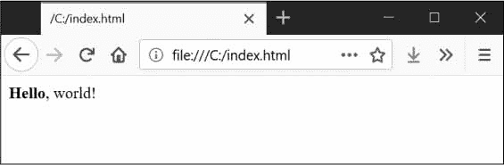
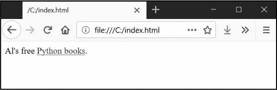
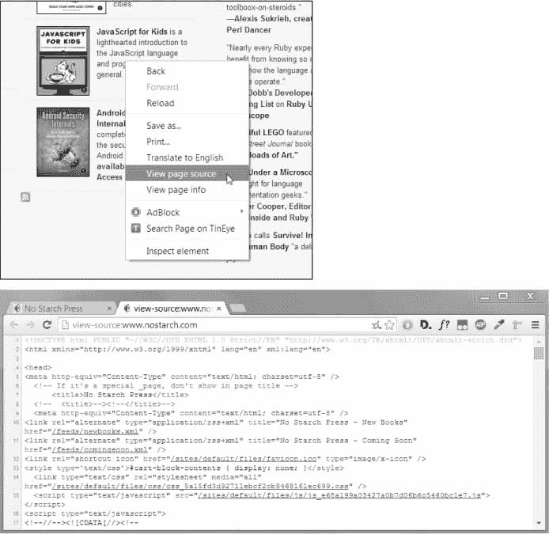
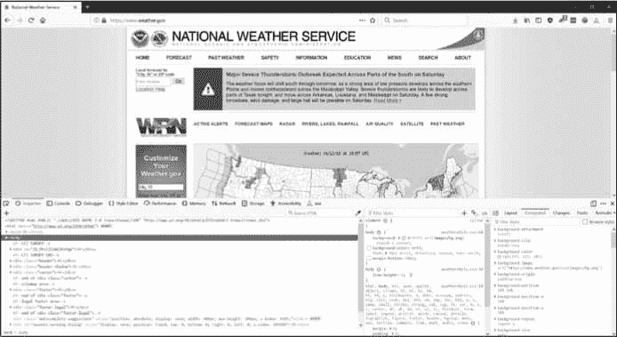
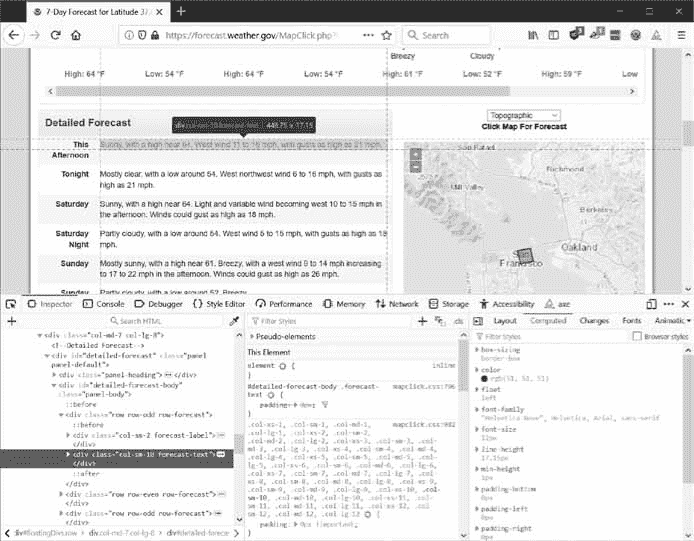

# 12 网刮

> 原文：<https://automatetheboringstuff.com/2e/chapter12/>


在那些没有 Wi-Fi 的罕见、可怕的时刻，我意识到我在电脑上做的事情有多少是我在互联网上做的。出于纯粹的习惯，我会发现自己试图查看电子邮件，阅读朋友的 Twitter 信息，或者回答这样一个问题:“柯特伍德·史密斯在出演 1987 年的原版《机械战警》之前有过什么重要角色吗？” <sup class="calibre20">[1](#calibre_link-34)</sup>

由于计算机上的许多工作都涉及到上网，如果你的程序能上网就太好了。*网络抓取*是使用程序从网络上下载和处理内容的术语。例如，谷歌运行许多网络抓取程序，为其搜索引擎索引网页。在这一章中，你将学习几个模块，这些模块使得用 Python 抓取网页变得很容易。

webbrowserPython 自带，打开浏览器进入特定页面。

请求从互联网下载文件和网页。

bs4 解析 HTML，网页编写的格式。

selenium 启动并控制一个网络浏览器。`selenium`模块能够在这个浏览器中填写表格和模拟鼠标点击。

### **项目:带有 webbrowser 模块的 mapIt.py】**

`webbrowser`模块的`open()`功能可以启动一个新的浏览器到指定的 URL。在交互式 shell 中输入以下内容:

```py
>>> import webbrowser

>>> webbrowser.open('https://inventwithpython.com/')
```

一个网页浏览器标签会打开到网址[`inventwithpython.com`](https://inventwithpython.com/)。这大概是`webbrowser`模块唯一能做的事情。即便如此，`open()`函数确实让一些有趣的事情成为可能。例如，将一个街道地址复制到剪贴板，然后在谷歌地图上显示它的地图，这是一件很乏味的事情。您可以通过编写一个简单的脚本来使用剪贴板的内容在浏览器中自动启动地图，从而完成此任务。这样，您只需将地址复制到剪贴板并运行脚本，地图就会为您加载。

 *这就是你的程序要做的:

1.  从命令行参数或剪贴板获取街道地址
2.  打开网络浏览器，进入该地址的谷歌地图页面

这意味着您的代码需要执行以下操作:

1.  从`sys.argv`中读取命令行参数。
2.  读取剪贴板内容。
3.  调用`webbrowser.open()`函数打开网络浏览器。

打开一个新的文件编辑器选项卡，并将其保存为 `mapIt.py` 。

#### ***第一步:弄清楚网址***

根据[附录 B](#calibre_link-35) 中的说明，设置 `mapIt.py` ，这样当你从命令行运行它时，就像这样。。。

```py
C:\> mapit 870 Valencia St, San Francisco, CA 94110
```

。。。该脚本将使用命令行参数，而不是剪贴板。如果没有命令行参数，那么程序将知道使用剪贴板的内容。

首先你需要弄清楚给定的街道地址使用什么 URL。当你在浏览器中加载[`maps.google.com`](https://maps.google.com/)并搜索一个地址时，地址栏中的网址是这样的:[`www.google.com/maps/place/870+Valencia+St/@37.7590311,-122.4215096,17z/data=!3m1!4b1!4m2!3m1!1s0x808f7e3dadc07a37:0xc86b0b2bb93b73d8`](https://www.google.com/maps/place/870+Valencia+St/@37.7590311,-122.4215096,17z/data=!3m1!4b1!4m2!3m1!1s0x808f7e3dadc07a37:0xc86b0b2bb93b73d8)。

地址在 URL 中，但是也有很多额外的文本。网站通常会在 URL 中添加额外的数据，以帮助跟踪访问者或定制网站。但如果你尝试只去[`www.google.com/maps/place/870+Valencia+St+San+Francisco+CA`](https://www.google.com/maps/place/870+Valencia+St+San+Francisco+CA/)，你会发现它仍然会调出正确的页面。所以你的程序可以设置打开一个 web 浏览器到`'https://www.google.com/maps/place/your_address_string'`(其中`your_address_string`是你要映射的地址)。

#### ***步骤二:处理命令行参数***

让您的代码看起来像这样:

```py
#! python3

# mapIt.py - Launches a map in the browser using an address from the

# command line or clipboard.

import webbrowser, sys

if len(sys.argv) > 1:

    # Get address from command line.

    address = ' '.join(sys.argv[1:])

# TODO: Get address from clipboard.
```

在程序的`#!` shebang 行之后，您需要导入用于启动浏览器的`webbrowser`模块和用于读取潜在命令行参数的`sys`模块。`sys.argv`变量存储了程序文件名和命令行参数的列表。如果这个列表不仅仅包含文件名，那么`len(sys.argv)`会计算出一个大于`1`的整数，这意味着命令行参数确实已经被提供了。

命令行参数通常由空格分隔，但在这种情况下，您希望将所有参数解释为单个字符串。由于`sys.argv`是一个字符串列表，您可以将它传递给`join()`方法，后者返回一个字符串值。您不希望程序名出现在这个字符串中，所以您应该传递`sys.argv[1:]`来砍掉数组的第一个元素，而不是`sys.argv`。该表达式计算的最终字符串存储在`address`变量中。

如果您在命令行中输入以下命令来运行程序。。。

```py
mapit 870 Valencia St, San Francisco, CA 94110
```

。。。`sys.argv`变量将包含这个列表值:

```py
['mapIt.py', '870', 'Valencia', 'St, ', 'San', 'Francisco, ', 'CA', '94110']
```

`address`变量将包含字符串`'870 Valencia St, San Francisco, CA 94110'`。

#### ***第三步:处理剪贴板内容，启动浏览器***

使您的代码看起来像下面这样:

```py
#! python3

# mapIt.py - Launches a map in the browser using an address from the

# command line or clipboard.

import webbrowser, sys, pyperclip

if len(sys.argv) > 1:

    # Get address from command line.

    address = ' '.join(sys.argv[1:])

else:

    # Get address from clipboard.

    address = pyperclip.paste()

webbrowser.open('https://www.google.com/maps/place/' + address)
```

如果没有命令行参数，程序将假定地址存储在剪贴板上。可以用`pyperclip.paste()`获取剪贴板内容，并存储在一个名为`address`的变量中。最后，要启动带有谷歌地图 URL 的网络浏览器，请调用`webbrowser.open()`。

虽然您编写的一些程序会执行大量的任务来节省您的时间，但使用一个每次执行一个普通任务(如获取一个地址的地图)时都可以方便地节省您几秒钟的程序同样令人满意。[表 12-1](#calibre_link-36) 比较了使用和不使用 `mapIt.py` 显示地图所需的步骤。

**表 12-1:** 获取有无*的地图 mapIt.py*

1  $3 # $2
| **手动获取地图** | **使用 mapIt.py** |
| --- | --- |
| 

1.  Highlight the address.
2.  Copy the address.
3.  Open a web browser.
4.  转到。
5.  Click the address text field.
6.  Paste the address.
7.  Enter.

 | 

1.  Highlight the address.
2.  Copy the address.

 `mapIt.py` 

 |

看看 `mapIt.py` 如何让这项任务变得不那么乏味？

#### ***类似节目的创意***

只要你有一个网址，`webbrowser`模块就能让用户省去打开浏览器的步骤，直接进入一个网站。其他程序可以使用此功能来完成以下任务:

*   在单独的浏览器选项卡中打开页面上的所有链接。
*   打开浏览器，找到当地天气的网址。
*   打开几个你经常查看的社交网站。

### **用请求模块从网上下载文件**

`requests`模块让你轻松地从网上下载文件，而不必担心网络错误、连接问题和数据压缩等复杂问题。Python 没有提供`requests`模块，所以您必须先安装它。从命令行，运行 pip 安装-用户请求。([附录 A](#calibre_link-2) 有关于如何安装第三方模块的更多细节。)

写`requests`模块是因为 Python 的`urllib2`模块太复杂，不好用。事实上，用记号笔把这一整段涂掉。忘记我曾经提到过`urllib2`。如果你需要从网上下载东西，只需使用`requests`模块。

接下来，做一个简单的测试来确保`requests`模块正确安装。在交互式 shell 中输入以下内容:

```py
>>> import requests
```

如果没有显示错误信息，则`requests`模块已成功安装。

#### ***用 requests.get()函数下载网页***

`requests.get()`函数接受一个 URL 字符串进行下载。通过对`requests.get()`的返回值调用`type()`，您可以看到它返回了一个`Response`对象，其中包含 web 服务器对您的请求给出的响应。稍后我会更详细地解释`Response`对象，但是现在，当你的计算机连接到互联网时，在交互式 shell 中输入以下内容:

```py
   >>> import requests

   >>> res = requests.get('https://automatetheboringstuff.com/files/rj.txt') # ➊

   >>> type(res)

   <class 'requests.models.Response'>

   >>> res.status_code == requests.codes.ok # ➋

   True

   >>> len(res.text)

   178981

   >>> print(res.text[:250])

   The Project Gutenberg EBook of Romeo and Juliet, by William Shakespeare

   This eBook is for the use of anyone anywhere at no cost and with

   almost no restrictions whatsoever.  You may copy it, give it away or

   re-use it under the terms of the Proje
```

这本书的网站 ➊ 提供了《罗密欧与朱丽叶》整部剧的文本网页。通过检查`Response`对象的`status_code`属性，可以看出对这个 web 页面的请求成功了。如果它等于`requests.codes.ok`的值，那么一切顺利 ➋ 。(顺便说一下，HTTP 协议中“OK”的状态代码是 200。您可能已经熟悉“未找到”的 404 状态代码。)你可以在[`en.wikipedia.org/wiki/List_of_HTTP_status_codes`](https://en.wikipedia.org/wiki/List_of_HTTP_status_codes)找到 HTTP 状态码及其含义的完整列表。

如果请求成功，下载的网页将作为字符串存储在`Response`对象的`text`变量中。这个变量保存了整部剧的一大串；对`len(res.text)`的调用显示它超过了 178，000 个字符。最后，调用`print(res.text[:250])`只显示前 250 个字符。

如果请求失败并显示错误信息，如“未能建立新连接”或“超过最大重试次数”，请检查您的互联网连接。连接到服务器可能相当复杂，我不能在这里给出所有可能的问题。通过在 web 上搜索带引号的错误消息，您可以找到错误的常见原因。

#### ***检查错误***

如您所见，`Response`对象有一个`status_code`属性，可以对照`requests.codes.ok`(一个具有整数值`200`的变量)来检查下载是否成功。检查成功的一个更简单的方法是在`Response`对象上调用`raise_for_status()`方法。如果下载文件时出现错误，这将引发一个异常，如果下载成功，将不会执行任何操作。在交互式 shell 中输入以下内容:

```py
>>> res = requests.get('https://inventwithpython.com/page_that_does_not_exist')

>>> res.raise_for_status()

Traceback (most recent call last):

  File "<stdin>", line 1, in <module>

  File "C:\Users\Al\AppData\Local\Programs\Python\Python37\lib\site-packages\requests\models

.py", line 940, in raise_for_status

    raise HTTPError(http_error_msg, response=self)

requests.exceptions.HTTPError: 404 Client Error: Not Found for url: https://inventwithpython

.com/page_that_does_not_exist.html
```

方法`raise_for_status()`是一个很好的方法，可以确保当一个坏的下载发生时程序停止。这是一件好事:您希望程序在发生意外错误时立即停止。如果一个失败的下载*不是*对你的程序的一个交易破坏者，你可以用`try`和`except`语句包装`raise_for_status()`行来处理这个错误情况而不会崩溃。

```py
import requests

res = requests.get('https://inventwithpython.com/page_that_does_not_exist')

try:

    res.raise_for_status()

except Exception as exc:

    print('There was a problem: %s' % (exc))
```

此`raise_for_status()`方法调用导致程序输出以下内容:

```py
There was a problem: 404 Client Error: Not Found for url: https://

inventwithpython.com/page_that_does_not_exist.html
```

总是在叫完`requests.get()`后再叫`raise_for_status()`。在您的程序继续运行之前，您需要确保下载确实有效。

### **将下载的文件保存到硬盘**

在这里，您可以使用标准的`open()`功能和`write()`方法将网页保存到硬盘上的文件中。不过，还是有一些细微的差别。首先，您必须通过将字符串`'wb'`作为第二个参数传递给`open()`，在*写二进制文件*模式下打开文件。即使页面是明文(比如你之前下载的*罗密欧与朱丽叶*文本)，为了维护文本的 *Unicode 编码*，你也需要写二进制数据而不是文本数据。

要将网页写到文件中，可以使用一个带有`Response`对象的`iter_content()`方法的`for`循环。

```py
>>> import requests

>>> res = requests.get('https://automatetheboringstuff.com/files/rj.txt')

>>> res.raise_for_status()

>>> playFile = open('RomeoAndJuliet.txt', 'wb')

>>> for chunk in res.iter_content(100000):

        playFile.write(chunk)

100000

78981

>>> playFile.close()
```

`iter_content()`方法通过循环在每次迭代中返回内容的“块”。每个块都是*字节*的数据类型，您可以指定每个块将包含多少字节。十万字节通常是一个合适的大小，所以将`100000`作为参数传递给`iter_content()`。

文件 `RomeoAndJuliet.txt` 现在将存在于当前工作目录中。请注意，虽然网站上的文件名是 `rj.txt` ，但你硬盘上的文件有不同的文件名。`requests`模块只是处理下载网页内容。一旦页面被下载，它就是你程序中的数据。即使你在下载完网页后失去了互联网连接，所有的网页数据仍然会在你的电脑上。

**UNICODE 编码**

Unicode 编码超出了本书的范围，但是您可以从以下网页了解更多信息:

*   [Joel on Software:绝对最低要求每个软件开发人员绝对、肯定必须了解 Unicode 和字符集(没有借口！)](https://www.joelonsoftware.com/articles/Unicode.html)
*   [实用 Unicode](https://nedbatchelder.com/text/unipain.html)

`write()`方法返回写入文件的字节数。在前面的示例中，第一个块中有 100，000 个字节，文件的其余部分只需要 78，981 个字节。

回顾一下，下面是下载和保存文件的完整过程:

1.  调用`requests.get()`下载文件。
2.  用`'wb'`调用`open()`以写二进制模式创建一个新文件。
3.  循环遍历`Response`对象的`iter_content()`方法。
4.  在每次迭代中调用`write()`将内容写入文件。
5.  调用`close()`关闭文件。

这就是`requests`模块的全部内容！与你一直用来编写文本文件的`open()` / `write()` / `close()`工作流相比，`for`循环和`iter_content()`的东西可能看起来复杂，但这是为了确保`requests`模块不会占用太多内存，即使你下载了大量文件。你可以从[`requests.readthedocs.org`](https://requests.readthedocs.org/)中了解`requests`模块的其他特性。

### *`HTML`*

在你挑选网页之前，你将学习一些 HTML 的基础知识。您还将看到如何访问 web 浏览器的强大开发工具，这将使从 web 上抓取信息变得更加容易。

#### ***学习 HTML 的资源***

*超文本标记语言(HTML)* 是网页编写的格式。本章假设你对 HTML 有一些基本的经验，但是如果你需要一个初学者教程，我建议你去下面的网站:

*   <https://developer.mozilla.org/en-US/learn/html/>
*   <https://htmldog.com/guides/html/beginner/>
*   <https://www.codecademy.com/learn/learn-html>

#### ***快速复习***

如果你已经有一段时间没有看 HTML 了，这里有一个基础知识的快速概述。HTML 文件是带有*的纯文本文件。html* 文件扩展名。这些文件中的文本由*标签*包围，这些标签是用尖括号括起来的单词。标签告诉浏览器如何格式化网页。开始标签和结束标签可以包含一些文本，形成一个*元素*。*文本*(或*内部 HTML* )是开始和结束标签之间的内容。比如下面的 HTML 会显示 *Hello，world！*在浏览器中，用*你好*加粗:

```py
<strong>Hello</strong>, world!
```

在浏览器中，这个 HTML 将看起来像图 12-1 。



*图 12-1:* 你好，世界！*在浏览器中渲染*

开始的`<strong>`标签表示包含的文本将以粗体显示。结束标签告诉浏览器粗体文本的结束位置。

HTML 中有许多不同的标签。其中一些标签在尖括号内有额外的属性，形式为*属性*。例如，`<a>`标签包含了应该是链接的文本。文本链接到的 URL 由`href`属性决定。这里有一个例子:

```py
Al's free <a href="https://inventwithpython.com">Python books</a>.
```

在浏览器中，这个 HTML 看起来像图 12-2 。



*图 12-2:浏览器中呈现的链接*

有些元素有一个`id`属性，用来惟一地标识页面中的元素。您经常会指示您的程序通过元素的`id`属性来寻找元素，因此使用浏览器的开发工具来计算元素的`id`属性是编写 web 抓取程序的常见任务。

#### ***查看网页的源 HTML***

你需要查看你的程序将要使用的网页的 HTML 源代码。为此，在您的网络浏览器中右键单击(或<small class="calibre11">CTRL</small>-单击 macOS)任何网页，并选择**查看源**或**查看页面源**以查看页面的 HTML 文本(参见[图 12-3](#calibre_link-39) )。这是您的浏览器实际收到的文本。浏览器知道如何显示，或*呈现*，来自这个 HTML 的网页。



*图 12-3:查看网页来源*

我强烈推荐你查看一些你喜欢的网站的 HTML 源码。如果你在看源的时候没有完全理解你所看到的东西，那也没什么。你不需要精通 HTML 来编写简单的网页抓取程序——毕竟，你不会写自己的网站。你只需要足够的知识来从现有的网站中挑选数据。

#### ***打开浏览器的开发者工具***

除了查看网页的源代码，您还可以使用浏览器的开发工具浏览网页的 HTML。在 Chrome 和 Internet Explorer for Windows 中，已经安装了开发者工具，你可以按 F12 让它们出现(见[图 12-4](#calibre_link-40) )。再次按 F12 将使开发者工具消失。在 Chrome 中，你也可以通过选择**视图****开发者****开发者工具**来调出开发者工具。在 macOS 中，按下 - <small class="calibre11">选项</small>-我会打开 Chrome 的开发者工具。



*图 12-4:Chrome 浏览器中的开发者工具窗口*

在 Firefox 中，你可以通过在 Windows 和 Linux 上按下 <small class="calibre11">CTRL-SHIFT-C</small> 或者在 macOS 上按下 <small class="calibre11">-OPTION-C</small> 来打开 Web Developer Tools Inspector。布局与 Chrome 的开发者工具几乎相同。

在 Safari 中，打开偏好设置窗口，并在高级窗格中选中菜单栏中的**显示开发菜单**选项。启用后，你可以通过按 <small class="calibre11">-OPTION-I</small> 调出开发者工具。

在浏览器中启用或安装开发工具后，您可以右键单击网页的任何部分，并从上下文菜单中选择 **Inspect Element** 以调出负责该部分页面的 HTML。当你开始为你的网页抓取程序解析 HTML 时，这将会很有帮助。

**不要用正则表达式解析 HTML**

在字符串中定位特定的 HTML 片段似乎是正则表达式的完美例子。然而，我建议你不要这样做。有许多不同的方法可以格式化 HTML，并且仍然被认为是有效的 HTML，但是试图在一个正则表达式中捕获所有这些可能的变化可能是乏味的并且容易出错。专门为解析 HTML 开发的模块，比如 bs4 ，出现 bug 的可能性会小一些。

你可以找到一个扩展的论点来解释为什么不应该在用正则表达式解析 HTML。

#### ***使用开发者工具寻找 HTML 元素***

一旦你的程序使用`requests`模块下载了一个网页，你将拥有这个网页的 HTML 内容作为一个单独的字符串值。现在你需要弄清楚 HTML 的哪一部分对应于你感兴趣的网页上的信息。

这就是浏览器的开发者工具可以提供帮助的地方。比方说你要写一个程序从拉天气预报数据。在写任何代码之前，做一点研究。如果您访问该网站并搜索 94105 邮政编码，该网站会将您带到显示该地区天气预报的页面。

如果您对收集该邮政编码的天气信息感兴趣呢？右击页面上的位置(或在 macOS 上点击<small class="calibre11">控制</small>，并从出现的上下文菜单中选择**检查元素**。这将打开开发者工具窗口，向您显示生成 web 页面这一特定部分的 HTML。[图 12-5](#calibre_link-41) 显示了开发者工具对最近预测的 HTML 开放。注意，如果[`weather.gov`](https://weather.gov/)网站改变了它的网页设计，你需要重复这个过程来检查新的元素。



*图 12-5:用开发工具检查保存预测文本的元素*

从开发者工具中可以看到，负责网页预测部分的 HTML 是`<div class="col-sm-10 forecast-text">Sunny, with a high near 64\. West wind 11 to 16 mph, with gusts as high as 21 mph.</div>`。这正是你要找的！看起来预测信息包含在带有`forecast-text` CSS 类的`<div>`元素中。在浏览器的开发人员控制台中右键单击这个元素，并从出现的上下文菜单中选择*`Copy`***CSS 选择器**。这将把一个字符串如`'div.row-odd:nth-child(1) > div:nth-child(2)'`复制到剪贴板。你可以将这个字符串用于 Beautiful Soup 的`select()`或 Selenium 的`find_element_by_css_selector()`方法，这将在本章后面解释。现在你知道你在找什么了，漂亮的 Soup 模块会帮助你在字符串中找到它。

### **使用 bs4 模块解析 HTML】**

Beautiful Soup 是一个从 HTML 页面中提取信息的模块(在这方面比正则表达式好得多)。美汤模块的名字叫`bs4`(美汤，第 4 版)。要安装它，您需要从命令行运行`pip install --user beautifulsoup4`。(查看[附录 A](#calibre_link-2) 了解安装第三方模块的说明。)而`beautifulsoup4`是用于安装的名字，为了导入美汤你运行`import bs4`。

对于这一章，漂亮的 Soup 示例将会解析硬盘上的 HTML 文件。在 Mu 中打开一个新的文件编辑器页签，输入以下内容，保存为`example.html`。或者，从`nostarch.com/automatestuff2`下载。

```py
<!-- This is the example.html example file. -->

<html><head><title>The Website Title</title></head>

<body>

<p>Download my <strong>Python</strong> book from <a href="https://

inventwithpython.com">my website</a>.</p>

<p class="slogan">Learn Python the easy way!</p>

<p>By <span id="author">Al Sweigart</span></p>

</body></html>
```

正如你所看到的，即使是一个简单的 HTML 文件也涉及到许多不同的标签和属性，并且很快会与复杂的网站混淆。令人欣慰的是，漂亮的汤让使用 HTML 变得容易多了。

#### ***从 HTML 创建一个 BeautifulSoup 对象***

需要用包含它将解析的 HTML 的字符串来调用`bs4.BeautifulSoup()`函数。`bs4.BeautifulSoup()`函数返回一个`BeautifulSoup`对象。当您的计算机连接到互联网时，在交互式 shell 中输入以下内容:

```py
>>> import requests, bs4

>>> res = requests.get('https://nostarch.com')

>>> res.raise_for_status()

>>> noStarchSoup = bs4.BeautifulSoup(res.text, 'html.parser')

>>> type(noStarchSoup)

<class 'bs4.BeautifulSoup'>
```

这段代码使用`requests.get()`从无淀粉出版社网站下载主页面，然后将响应的`text`属性传递给`bs4.BeautifulSoup()`。它返回的`BeautifulSoup`对象存储在一个名为`noStarchSoup`的变量中。

您还可以从硬盘上加载一个 HTML 文件，方法是将一个`File`对象传递给`bs4.BeautifulSoup()`，同时传递第二个参数，告诉 Beautiful Soup 使用哪个解析器来分析 HTML。

在交互 shell 中输入以下内容(确保`example.html`文件在工作目录中之后):

```py
>>> exampleFile = open('example.html')

>>> exampleSoup = bs4.BeautifulSoup(exampleFile, 'html.parser')

>>> type(exampleSoup)

<class 'bs4.BeautifulSoup'>
```

这里使用的`'html.parser'`解析器是 Python 自带的。然而，如果你安装了第三方的`lxml`模块，你可以使用更快的`'lxml'`解析器。按照[附录 A](#calibre_link-2) 中的说明，通过运行`pip install --user lxml`安装该模块。忘记包含第二个参数将导致一个`UserWarning: No parser was explicitly specified`警告。

一旦有了一个`BeautifulSoup`对象，就可以使用它的方法来定位 HTML 文档的特定部分。

#### ***用 select()方法找到一个元素***

您可以通过调用`select()`方法并为您正在寻找的元素传递 CSS *选择器*的字符串来从`BeautifulSoup`对象中检索 web 页面元素。选择器就像正则表达式:它们指定了要查找的模式——在本例中，是在 HTML 页面中，而不是在一般的文本字符串中。

对 CSS 选择器语法的全面讨论超出了本书的范围(在参考资料中有一个很好的选择器教程，在)，但是这里有一个关于选择器的简短介绍。[表 12-2](#calibre_link-42) 显示了最常见的 CSS 选择器模式的例子。

**表 12-2:**CSS 选择器示例

1  $3 # $2
| **选择器传递给 select() 方法** | **会匹配。。。** |
| --- | --- |
| `soup.select('div')` | 所有命名为`<div>`的元素 |
| `soup.select('#author')` | 具有`author`的`id`属性的元素 |
| `soup.select('.notice')` | 使用名为`notice`的 CSS `class`属性的所有元素 |
| `soup.select('div span')` | 名为`<div>`的元素内名为`<span>`的所有元素 |
| `soup.select('div > span')` | 在名为`<div>`的元素中直接*为*的所有名为`<span>`的元素，中间没有其他元素 |
| `soup.select('input[name]')` | 所有名为`<input>`且具有任意值的`name`属性的元素 |
| `soup.select('input[type="button"]')` | 所有名为`<input>`的元素，其属性名为`type`，值为`button` |

各种选择器模式可以组合起来进行复杂的匹配。例如，`soup.select('p #author')`将匹配任何具有`author`的`id`属性的元素，只要它也在`<p>`元素内。您也可以在浏览器中右键单击元素并选择 **Inspect Element** ，而不是自己编写选择器。当浏览器的开发人员控制台打开时，右键单击元素的 HTML 并选择*`Copy`*CSS 选择器**将选择器字符串复制到剪贴板并粘贴到源代码中。**

`select()`方法将返回一个`Tag`对象的列表，这就是漂亮的 Soup 如何表示一个 HTML 元素。对于`BeautifulSoup`对象的 HTML 中的每个匹配，该列表将包含一个`Tag`对象。标签值可以传递给`str()`函数来显示它们所代表的 HTML 标签。标签值还有一个`attrs`属性，它将标签的所有 HTML 属性显示为一个字典。使用前面的`example.html`文件，在交互式 shell 中输入以下内容:

```py
>>> import bs4

>>> exampleFile = open('example.html')

>>> exampleSoup = bs4.BeautifulSoup(exampleFile.read(), 'html.parser')

>>> elems = exampleSoup.select('#author')

>>> type(elems) # elems is a list of Tag objects.

<class 'list'>

>>> len(elems)

1

>>> type(elems[0])

<class 'bs4.element.Tag'>

>>> str(elems[0]) # The Tag object as a string.

'<span id="author">Al Sweigart</span>'

>>> elems[0].getText()

'Al Sweigart'

>>> elems[0].attrs

{'id': 'author'}
```

这段代码将从我们的示例 HTML 中提取带有`id="author"`的元素。我们使用`select('#author')`返回一个包含所有`id="author"`元素的列表。我们将这个标签对象的列表存储在变量`elems`中，`len(elems)`告诉我们列表中有一个标签对象；有一个匹配。在元素上调用`getText()`会返回元素的文本，或者内部 HTML。元素的文本是开始和结束标记之间的内容:在本例中是`'Al Sweigart'`。

将元素传递给`str()`会返回一个带有开始和结束标签以及元素文本的字符串。最后，`attrs`给出了一个字典，其中包含元素的属性`'id'`和属性`id`的值`'author'`。

您还可以从`BeautifulSoup`对象中拉出所有的`<p>`元素。在交互式 shell 中输入以下内容:

```py
>>> pElems = exampleSoup.select('p')

>>> str(pElems[0])

'<p>Download my <strong>Python</strong> book from <a href="https://

inventwithpython.com">my website</a>.</p>'

>>> pElems[0].getText()

'Download my Python book from my website.'

>>> str(pElems[1])

'<p class="slogan">Learn Python the easy way!</p>'

>>> pElems[1].getText()

'Learn Python the easy way!'

>>> str(pElems[2])

'<p>By <span id="author">Al Sweigart</span></p>'

>>> pElems[2].getText()

'By Al Sweigart'
```

这一次，`select()`给出了三个匹配的列表，我们将它存储在`pElems`中。在`pElems[0]`、`pElems[1]`和`pElems[2]`上使用`str()`将每个元素显示为一个字符串，在每个元素上使用`getText()`将显示其文本。

#### ***从元素的属性中获取数据***

`Tag`对象的`get()`方法使得从元素中访问属性值变得简单。向该方法传递一个属性名称字符串，并返回该属性的值。使用 example.html 中的*，在交互 shell 中输入以下内容:*

```py
>>> import bs4

>>> soup = bs4.BeautifulSoup(open('example.html'), 'html.parser')

>>> spanElem = soup.select('span')[0]

>>> str(spanElem)

'<span id="author">Al Sweigart</span>'

>>> spanElem.get('id')

'author'

>>> spanElem.get('some_nonexistent_addr') == None

True

>>> spanElem.attrs

{'id': 'author'}
```

这里我们使用`select()`来查找任何`<span>`元素，然后将第一个匹配的元素存储在`spanElem`中。将属性名`'id'`传递给`get()`会返回属性的值`'author'`。

### **项目:打开所有搜索结果**

每当我在谷歌上搜索一个话题，我不会一次只看一个搜索结果。通过中击一个搜索结果链接(或者在按住 <small class="calibre11">CTRL</small> 的同时点击)，我会在一堆新标签中打开前几个链接，以便稍后阅读。我经常搜索谷歌，这种工作流程——打开我的浏览器，搜索一个主题，然后一个接一个地点击几个链接——非常乏味。如果我能简单地在命令行中输入一个搜索词，让我的电脑自动打开一个浏览器，在新的标签页中显示所有热门搜索结果，那就太好了。让我们编写一个脚本，在`pypi.org`用 Python 包索引的搜索结果页面来做这件事。像这样的程序可以适用于许多其他网站，尽管谷歌和 DuckDuckGo 经常采取措施，使抓取他们的搜索结果页面变得困难。

这就是你的程序要做的:

1.  从命令行参数中获取搜索关键字
2.  检索搜索结果页面
3.  为每个结果打开一个浏览器选项卡

这意味着您的代码需要执行以下操作:

1.  从`sys.argv`中读取命令行参数。
2.  用`requests`模块获取搜索结果页面。
3.  找到每个搜索结果的链接。
4.  调用`webbrowser.open()`函数打开网络浏览器。

打开一个新的文件编辑器选项卡，将其另存为 `searchpypi.py` 。

#### ***第一步:获取命令行参数，请求搜索页面***

在编写任何代码之前，您首先需要知道搜索结果页面的 URL。通过搜索后查看浏览器的地址栏，可以看到结果页面有一个类似于`pypi.org/search/?q=<SEARCH_TERM_HERE>`的网址。模块可以下载这个页面，然后你可以使用 Beautiful Soup 在 HTML 中找到搜索结果链接。最后，您将使用`webbrowser`模块在浏览器标签中打开这些链接。

使您的代码看起来像下面这样:

```py
#! python3

# searchpypi.py  - Opens several search results.

import requests, sys, webbrowser, bs4

print('Searching...')    # display text while downloading the search result page

res = requests.get('https://google.com/search?q=' 'https://pypi.org/search/?q='

+ ' '.join(sys.argv[1:]))

res.raise_for_status()

# TODO: Retrieve top search result links.

# TODO: Open a browser tab for each result.
```

用户将在启动程序时使用命令行参数指定搜索词。这些参数将作为字符串存储在`sys.argv`的列表中。

#### ***第二步:找到所有结果***

现在你需要使用美汤从你下载的 HTML 中提取排名靠前的搜索结果链接。但是你如何为这项工作找到合适的人选呢？例如，你不能只搜索所有的`<a>`标签，因为在 HTML 中有很多你不关心的链接。相反，你必须用浏览器的开发工具检查搜索结果页面，试图找到一个选择器，只挑选出你想要的链接。

搜索完*美汤*后，你可以打开浏览器的开发者工具，查看页面上的一些链接元素。它们看起来很复杂，就像这样的页面。

元素看起来非常复杂也没关系。你只需要找到所有搜索结果链接的模式。

使您的代码看起来像下面这样:

```py
#! python3

# searchpypi.py - Opens several google results.

import requests, sys, webbrowser, bs4

--snip--

# Retrieve top search result links.

soup = bs4.BeautifulSoup(res.text, 'html.parser')

# Open a browser tab for each result.

linkElems = soup.select('.package-snippet')
```

但是，如果您查看`<a>`元素，搜索结果链接都有`class="package-snippet"`。浏览 HTML 源代码的其余部分，看起来`package-snippet`类只用于搜索结果链接。你不必知道 CSS 类`package-snippet`是什么或者它做什么。您只是将它用作您正在寻找的`<a>`元素的标记。您可以从下载页面的 HTML 文本中创建一个`BeautifulSoup`对象，然后使用选择器`'.package-snippet'`来查找具有`package-snippet` CSS 类的元素中的所有`<a>`元素。注意，如果 PyPI 网站改变了它的布局，您可能需要用一个新的 CSS 选择器字符串来更新这个程序，以传递给`soup.select()`。程序的其余部分仍将是最新的。

#### ***第三步:打开网页浏览器查看每个结果***

最后，我们将告诉程序为我们的结果打开 web 浏览器选项卡。将以下内容添加到程序的末尾:

```py
#! python3

# searchpypi.py - Opens several search results.

import requests, sys, webbrowser, bs4

--snip--

# Open a browser tab for each result.

linkElems = soup.select('.package-snippet')

numOpen = min(5, len(linkElems))

for i in range(numOpen):

    urlToOpen = 'https://pypi.org' + linkElems[i].get('href')

    print('Opening', urlToOpen)

    webbrowser.open(urlToOpen)
```

默认情况下，使用`webbrowser`模块在新标签中打开前五个搜索结果。然而，用户可能已经搜索了出现少于五个结果的东西。`soup.select()`调用返回与您的`'.package-snippet'`选择器匹配的所有元素的列表，因此您想要打开的标签数量要么是`5`要么是这个列表的长度(以较小者为准)。

内置 Python 函数`min()`返回传递给它的最小整数或浮点参数。(还有一个内置的`max()`函数，它返回传递给它的最大参数。)您可以使用`min()`来查找列表中的链接是否少于五个，并将要打开的链接数量存储在一个名为`numOpen`的变量中。然后你可以通过调用`range(numOpen)`来运行一个`for`循环。

在循环的每次迭代中，使用`webbrowser.open()`在 web 浏览器中打开一个新标签。注意，返回的`<a>`元素中的`href`属性的值没有初始的`https://pypi.org`部分，所以您必须将其连接到`href`属性的字符串值。

现在你可以通过在命令行上运行`searchpypi boring stuff`来立即打开前五个 PyPI 搜索结果，比如说*无聊的东西*！(参见[附录 B](#calibre_link-35) 了解如何在您的操作系统上轻松运行程序。)

#### ***类似节目的创意***

标签式浏览的好处是你可以很容易地在新标签中打开链接，以便以后阅读。一个同时自动打开几个链接的程序可能是执行以下操作的一个很好的快捷方式:

*   在亚马逊等购物网站搜索后，打开所有产品页面。
*   打开单个产品评论的所有链接。
*   在 Flickr 或 Imgur 等照片网站上执行搜索后，打开照片的结果链接。

### **项目:下载所有 XKCD 漫画**

博客和其他定期更新的网站通常有一个首页，上面有最近的文章，还有一个上一页按钮，可以带你去上一篇文章。然后这个帖子还会有一个“上一页”按钮，以此类推，创建一个从最近的页面到站点上第一个帖子的轨迹。如果你想要一份网站内容的拷贝，以便在不在线时阅读，你可以手动浏览每一页并保存每一页。但是这是相当无聊的工作，所以让我们写一个程序来代替它。

XKCD 是一个流行的极客网络漫画，其网站符合这种结构(见[图 12-6](#calibre_link-43) )。`xkcd.com`的首页有一个“上一页”按钮，引导用户回到之前的漫画。手动下载每部漫画可能要花很长时间，但是你可以写一个脚本在几分钟内完成。


*图 12-6: XKCD，“浪漫、讽刺、数学和语言的网络漫画”*

你的程序是这样做的:

1.  加载 XKCD 主页
2.  保存该页面上的漫画图像
3.  跟随前面的漫画链接
4.  重复，直到它到达第一个漫画

这意味着您的代码需要执行以下操作:

1.  使用`requests`模块下载页面。
2.  使用 Beautiful Soup 查找页面漫画图像的 URL。
3.  用`iter_content()`将漫画图像下载并保存到硬盘。
4.  找到之前漫画链接的网址，重复。

打开一个新的文件编辑器标签，保存为 `downloadXkcd.py` 。

#### ***步骤一:设计程序***

如果您打开浏览器的开发人员工具并检查页面上的元素，您会发现以下内容:

*   漫画图像文件的 URL 由一个``元素的`href`属性给出。
*   ``元素位于`<div id="comic">`元素内部。
*   Prev 按钮有一个值为`prev`的`rel` HTML 属性。
*   第一个漫画的“上一页”按钮链接到[`xkcd.com`](https://xkcd.com/#)网址，表示没有更多的上一页。

使您的代码看起来像下面这样:

```py
#! python3

# downloadXkcd.py - Downloads every single XKCD comic.

import requests, os, bs4

url = 'https://xkcd.com'               # starting url

os.makedirs('xkcd', exist_ok=True)    # store comics in ./xkcd

while not url.endswith('#'):

    # TODO: Download the page.

    # TODO: Find the URL of the comic image.

    # TODO: Download the image.

    # TODO: Save the image to ./xkcd.

    # TODO: Get the Prev button's url.

print('Done.')
```

您将拥有一个以值`'https://xkcd.com'`开始的`url`变量，并用当前页面的 Prev 链接的 URL 重复更新它(在一个`for`循环中)。在循环的每一步，你将在`url`下载漫画。当`url`以`'#'`结束时，你就知道结束循环了。

你将把图像文件下载到当前工作目录下名为 `xkcd` 的文件夹中。调用`os.makedirs()`确保这个文件夹存在，`exist_ok=True`关键字参数防止函数在这个文件夹已经存在的情况下抛出异常。剩下的代码只是概述程序其余部分的注释。

#### ***第二步:下载网页***

让我们实现下载页面的代码。使您的代码看起来像下面这样:

```py
#! python3

# downloadXkcd.py - Downloads every single XKCD comic.

import requests, os, bs4

url = 'https://xkcd.com'               # starting url

os.makedirs('xkcd', exist_ok=True)    # store comics in ./xkcd

while not url.endswith('#'):

    # Download the page.

    print('Downloading page %s...' % url)

    res = requests.get(url)

    res.raise_for_status()

    soup = bs4.BeautifulSoup(res.text, 'html.parser')

    # TODO: Find the URL of the comic image.

    # TODO: Download the image.

    # TODO: Save the image to ./xkcd.

    # TODO: Get the Prev button's url.

print('Done.')
```

首先打印`url`，让用户知道程序要下载哪个 URL 然后使用`requests`模块的`request.get()`功能下载。和往常一样，如果下载出错，您会立即调用`Response`对象的`raise_for_status()`方法抛出异常并结束程序。否则，从下载页面的文本创建一个`BeautifulSoup`对象。

#### ***第三步:找到并下载漫画形象***

使您的代码看起来像下面这样:

```py
#! python3

# downloadXkcd.py - Downloads every single XKCD comic.

import requests, os, bs4

--snip--

    # Find the URL of the comic image.

    comicElem = soup.select('#comic img')

    if comicElem == []:

        print('Could not find comic image.')

    else:

        comicUrl = 'https:' + comicElem[0].get('src')

        # Download the image.

        print('Downloading image %s...' % (comicUrl))

        res = requests.get(comicUrl)

        res.raise_for_status()

    # TODO: Save the image to ./xkcd.

    # TODO: Get the Prev button's url.

print('Done.')
```

通过使用您的开发工具检查 XKCD 主页，您知道漫画图像的``元素在一个`<div>`元素内，其`id`属性设置为`comic`，因此选择器`'#comic img'`将从`BeautifulSoup`对象中获取正确的``元素。

一些 XKCD 页面有特殊的内容，不是简单的图像文件。那也行；你可以跳过这些。如果您的选择器没有找到任何元素，那么`soup.select('#comic img')`将返回一个空白列表。当发生这种情况时，程序可以打印一条错误信息，然后继续运行，而不下载图像。

否则，选择器将返回一个包含一个``元素的列表。您可以从这个``元素中获取`src`属性，并将其传递给`requests.get()`以下载漫画的图像文件。

#### ***第四步:保存图像，找到之前的漫画***

使您的代码看起来像下面这样:

```py
#! python3

# downloadXkcd.py - Downloads every single XKCD comic.

import requests, os, bs4

--snip--

        # Save the image to ./xkcd.

        imageFile = open(os.path.join('xkcd', os.path.basename(comicUrl)),

'wb')

        for chunk in res.iter_content(100000):

            imageFile.write(chunk)

        imageFile.close()

    # Get the Prev button's url.

    prevLink = soup.select('a[rel="prev"]')[0]

    url = 'https://xkcd.com' + prevLink.get('href')

print('Done.')
```

此时，漫画的图像文件存储在`res`变量中。您需要将这些图像数据写入硬盘上的文件中。

您需要一个本地图像文件的文件名来传递给`open()`。`comicUrl`将有一个类似于`'https://imgs.xkcd.com/comics/heartbleed_explanation.png'`的值——你可能已经注意到它看起来很像一个文件路径。事实上，你可以用`comicUrl`调用`os.path.basename()`，它将返回 URL 的最后一部分`'heartbleed_explanation.png'`。将图像保存到硬盘时，您可以使用此文件名。您使用`os.path.join()`将这个名称与您的`xkcd`文件夹的名称连接起来，这样您的程序在 Windows 上使用反斜杠(`\`)，在 macOS 和 Linux 上使用正斜杠(`/`)。现在你终于有了文件名，你可以调用`open()`在`'wb'`“写二进制”模式下打开一个新文件。

记住本章前面的内容，要保存你用`requests`下载的文件，你需要循环`iter_content()`方法的返回值。`for`循环中的代码将图像数据块(每个最多 100，000 字节)写到文件中，然后关闭文件。图像现在保存到您的硬盘上。

之后，选择器`'a[rel="prev"]'`识别出`<a>`元素，其`rel`属性被设置为`prev`，您可以使用这个`<a>`元素的`href`属性来获取前一个漫画的 URL，该 URL 被存储在`url`中。然后`while`循环再次开始这个漫画的整个下载过程。

该程序的输出将如下所示:

```py
Downloading page https://xkcd.com...

Downloading image https://imgs.xkcd.com/comics/phone_alarm.png...

Downloading page https://xkcd.com/1358/...

Downloading image https://imgs.xkcd.com/comics/nro.png...

Downloading page https://xkcd.com/1357/...

Downloading image https://imgs.xkcd.com/comics/free_speech.png...

Downloading page https://xkcd.com/1356/...

Downloading image https://imgs.xkcd.com/comics/orbital_mechanics.png...

Downloading page https://xkcd.com/1355/...

Downloading image https://imgs.xkcd.com/comics/airplane_message.png...

Downloading page https://xkcd.com/1354/...

Downloading image https://imgs.xkcd.com/comics/heartbleed_explanation.png...

--snip--
```

这个项目是一个很好的例子，它可以自动跟踪链接，从网上抓取大量数据。你可以在[`www.crummy.com/software/BeautifulSoup/bs4/doc`](https://www.crummy.com/software/BeautifulSoup/bs4/doc/)从BeautifulSoup的文档中了解它的其他特色。

#### ***类似节目的创意***

下载页面和跟随链接是许多网络爬行程序的基础。类似的程序还可以完成以下任务:

*   通过跟踪网站的所有链接来备份整个网站。
*   复制网络论坛上的所有信息。
*   复制网上商店的待售商品目录。

`requests`和`bs4`模块很棒，只要你能找出你需要传递给`requests.get()`的 URL。然而，有时这并不容易找到。或者您希望程序导航的网站要求您首先登录。`selenium`模块将赋予你的程序执行如此复杂任务的能力。

### **用 selenium 模块控制浏览器**

`selenium`模块让 Python 通过有计划地点击链接和填写登录信息来直接控制浏览器，就好像有一个人类用户在与页面交互一样。使用`selenium`，你可以用比`requests`和`bs4`高级得多的方式与网页互动；但是因为它启动了一个网络浏览器，如果你只是需要从网上下载一些文件，它就有点慢，很难在后台运行。

不过，如果你需要以某种方式与网页交互，比如说，依赖于更新页面的 JavaScript 代码，你将需要使用`selenium`而不是`requests`。这是因为亚马逊等主要电子商务网站几乎肯定有软件系统来识别他们怀疑是收集他们信息或注册多个免费账户的脚本的流量。过一段时间后，这些网站可能会拒绝为你提供页面，破坏你制作的任何脚本。`selenium`模块比`requests`更有可能在这些网站上长期运行。

向网站“告知”您正在使用脚本的一个主要信息是*用户代理*字符串，它标识 web 浏览器并包含在所有 HTTP 请求中。例如，`requests`模块的用户代理字符串类似于`'python-requests/2.21.0'`。你可以访问一个网站如[`www.whatsmyua.info`](https://www.whatsmyua.info/)来查看你的用户代理字符串。使用`selenium`，你更有可能“冒充人类”，因为不仅 Selenium 的用户代理与普通浏览器(例如`'Mozilla/5.0 (Windows NT 10.0; Win64; x64; rv:65.0) Gecko/20100101 Firefox/65.0'`)相同，而且它具有相同的流量模式:由`selenium`控制的浏览器会像普通浏览器一样下载图像、广告、cookies 和侵犯隐私的跟踪器。然而，`selenium`仍然可以被网站检测到，各大票务和电子商务网站经常会屏蔽`selenium`控制的浏览器，以防止网页抓取其页面。

#### ***启动硒控浏览器***

下面的例子将向你展示如何控制 Firefox 的网络浏览器。如果你还没有火狐，你可以从`getfirefox.com`免费下载。您可以通过从命令行终端运行`pip install --user selenium`来安装`selenium`。更多信息见[附录 A](#calibre_link-2) 。

为`selenium`导入模块有点棘手。你需要运行`from selenium import webdriver`，而不是`import selenium`。(如此设置`selenium`模块的确切原因超出了本书的范围。)之后，你可以用`selenium`启动火狐浏览器。在交互式 shell 中输入以下内容:

```py
>>> from selenium import webdriver

>>> browser = webdriver.Firefox()

>>> type(browser)

<class 'selenium.webdriver.firefox.webdriver.WebDriver'>

>>> browser.get('https://inventwithpython.com')
```

你会注意到当`webdriver.Firefox()`被调用时，Firefox 网络浏览器启动。对值`webdriver.Firefox()`调用`type()`表明它属于`WebDriver`数据类型。并且调用`browser.get('https://inventwithpython.com')`将浏览器定向到[`inventwithpython.com`](https://inventwithpython.com/)。你的浏览器应该看起来像图 12-7 。


*图 12-7:在我们调用 webdriver 之后。火狐()和 get() 在 Mu 中，出现了火狐浏览器。*

如果您遇到错误消息“‘geckodriver’可执行文件需要在`PATH`中。”，那么你需要手动下载 Firefox 的 webdriver，然后才能用`selenium`来控制。如果你安装了浏览器驱动程序，你也可以控制 Firefox 以外的浏览器。

对于火狐，去[`mozilla/geckodriver/releases`](https://github.com/mozilla/geckodriver/releases)为你的操作系统下载壁虎驱动。(“Gecko”是 Firefox 中使用的浏览器引擎的名称。)例如，在 Windows 上，你会想要下载*geckodriver-v 0 . 24 . 0-win 64 . zip*链接，而在 macOS 上，你会想要`geckodriver-v0.24.0-macos.tar.gz`链接。新版本的链接会略有不同。下载的 ZIP 文件将包含一个`geckodriver.exe`(在 Windows 上)或 `geckodriver` (在 macOS 和 Linux 上)文件，您可以将它放在您的系统`PATH`上。[附录 B](#calibre_link-35) 有关于系统`PATH`的信息，或者你可以在[`stackoverflow.com/q/40208051/1893164`](https://stackoverflow.com/q/40208051/1893164)了解更多。

对于 Chrome，进入[`sites.google.com/a/chromium.org`](https://sites.google.com/a/chromium.org/chromedriver/downloads)并下载你的操作系统的 ZIP 文件。这个 ZIP 文件将包含一个`chromedriver.exe`(在 Windows 上)或 `chromedriver` (在 macOS 或 Linux 上)文件，你可以把它放到你的系统`PATH`上。

其他主要的网络浏览器也有可用的网络驱动程序，你可以在网上搜索“<browser name="">网络驱动程序”来找到它们。</browser>

如果在`selenium`的控制下打开新浏览器仍有问题，可能是因为当前版本的浏览器与`selenium`模块不兼容。一个解决方法是安装一个旧版本的网络浏览器——或者更简单地说，安装一个旧版本的`selenium`模块。你可以在`pypi.org/project/selenium/#history`找到`selenium`版本号列表。不幸的是，不同版本的`selenium`和浏览器之间的兼容性有时会中断，你可能需要在网上搜索可能的解决方案。[附录 A](#calibre_link-2) 有更多关于运行 pip 安装特定版本`selenium`的信息。(例如，您可能会运行`pip install --user -U selenium==3.14.1`。)

#### ***在页面上查找元素***

对象有很多方法来寻找页面上的元素。它们分为`find_element_*`和`find_elements_*`两种方法。`find_element_*`方法返回单个`WebElement`对象，表示页面上匹配查询的第一个元素。`find_elements_*`方法为页面上每个匹配元素的*返回一个`WebElement_*`对象列表。*

[表 12-3](#calibre_link-45) 显示了几个调用存储在变量`browser`中的`WebDriver`对象的`find_element_*`和`find_elements_*`方法的例子。

**表 12-3:** Selenium 的 WebDriver 查找元素的方法

1  $3 # $2
| **方法名** | 返回的 WebElement 对象/列表 |
| --- | --- |
| `browser.find_element_by_class_name(` 姓名 `)``browser.find_elements_by_class_name(` 姓名 `)` | 使用 CSS
类名称的元素 |
| `browser.find_element_by_css_selector(` 选择器`)`
`browser.find_elements_by_css_selector(`T7】选择器 `)` | 匹配 CSS
选择器的元素 |
| `browser.find_element_by_id(` id `)``browser.find_elements_by_id(` id `)` | 具有匹配的 id
属性值的元素 |
| `browser.find_element_by_link_text(` 正文 `)``browser.find_elements_by_link_text(` 正文 `)` | 与提供的文本完全匹配的`<a>`元素 |
| `browser.find_element_by_partial_link_text(` 正文 `)``browser.find_elements_by_partial_link_text(` 正文 `)` | `<a>`提供包含
文本的元素 |
| `browser.find_element_by_name(` 姓名 `)``browser.find_elements_by_name(` 姓名 `)` | 具有匹配的名称
属性值的元素 |
| `browser.find_element_by_tag_name(` 姓名 `)`
`browser.find_elements_by_tag_name(`姓名`)` | 带有匹配标签的元素名称
(不区分大小写；一个`<a>`元素是由`'a'`和`'A'`匹配的
 |

除了`*_by_tag_name()`方法，所有方法的参数都区分大小写。如果页面上不存在与该方法所寻找的相匹配的元素，`selenium`模块会引发一个`NoSuchElement`异常。如果你不希望这个异常使你的程序崩溃，在你的代码中添加`try`和`except`语句。

一旦你有了`WebElement`对象，你可以通过读取属性或调用[表 12-4](#calibre_link-46) 中的方法找到更多关于它的信息。

**表 12-4:** WebElement 属性和方法

1  $3 # $2
| **属性或方法** | **描述** |
| --- | --- |
| `tag_name` | 标签名，比如一个`<a>`元素的`'a'` |
| `get_attribute(` 姓名 `)` | 元素的`name`属性的值 |
| `text` | 元素内的文本，如`<span>hello </span>`中的`'hello'` |
| `clear()` | 对于文本字段或文本区域元素，清除在其中键入的文本 |
| `is_displayed()` | 如果元素可见，则返回`True`；否则返回`False` |
| `is_enabled()` | 对于输入元素，如果该元素被启用，则返回`True`；否则返回`False` |
| `is_selected()` | 对于复选框或单选按钮元素，如果元素被选中，则返回`True`；否则返回`False` |
| `location` | 一个字典，带有键`'x'`和`'y'`来表示元素在页面中的位置 |

例如，打开一个新的文件编辑器选项卡并输入以下程序:

```py
from selenium import webdriver

browser = webdriver.Firefox()

browser.get('https://inventwithpython.com')

try:

    elem = browser.find_element_by_class_name(' cover-thumb')

    print('Found <%s> element with that class name!' % (elem.tag_name))

except:

    print('Was not able to find an element with that name.')
```

在这里，我们打开 Firefox 并将其定向到一个 URL。在这个页面上，我们试图找到类名为`'bookcover'`的元素，如果找到这样的元素，我们使用`tag_name`属性打印它的标签名。如果没有找到这样的元素，我们打印一条不同的消息。

该程序将输出以下内容:

```py
Found  element with that class name!
```

我们找到了一个类名为`'bookcover'`标签名为`'img'`的元素。

#### ***点击页面***

从`find_element_*`和`find_elements_*`方法返回的对象有一个`click()`方法，模拟鼠标点击该元素。这个方法可以用来跟踪一个链接，在一个单选按钮上进行选择，单击一个提交按钮，或者触发鼠标单击元素时可能发生的任何事情。例如，在交互式 shell 中输入以下内容:

```py
>>> from selenium import webdriver

>>> browser = webdriver.Firefox()

>>> browser.get('https://inventwithpython.com')

>>> linkElem = browser.find_element_by_link_text('Read Online for Free')

>>> type(linkElem)

<class 'selenium.webdriver.remote.webelement.FirefoxWebElement'>

>>> linkElem.click() # follows the "Read Online for Free" link
```

这将打开 Firefox 到`inventwithpython.com`，获取带有文本*的`<a>`元素的`WebElement`对象在线阅读*，然后模拟单击那个`<a>`元素。就像你自己点击了链接一样；然后，浏览器会跟随该链接。

#### ***填表提交***

向网页上的文本字段发送击键就是找到该文本字段的`<input>`或`<textarea>`元素，然后调用`send_keys()`方法。例如，在交互式 shell 中输入以下内容:

```py
>>> from selenium import webdriver

>>> browser = webdriver.Firefox()

>>> browser.get('https://login.metafilter.com')

>>> userElem = browser.find_element_by_id('user_name)

>>> userElem.send_keys('your_real_username_here')

>>> passwordElem = browser.find_element_by_id('user_pass')

>>> passwordElem.send_keys('your_real_password_here')

>>> passwordElem.submit()
```

只要 MetaFilter 的登录页面在本书出版后没有更改用户名和密码文本字段的`id`，前面的代码就会用提供的文本填充这些文本字段。(您可以随时使用浏览器的检查器来验证`id`。)在任何元素上调用`submit()`方法都会产生与单击该元素所在表单的提交按钮相同的结果。(您可以简单地调用`emailElem.submit()`，代码也会做同样的事情。)

**警告**

*尽可能避免将密码放在源代码中。当您的密码未加密保存在硬盘上时，很容易意外泄露给其他人。如果可能的话，让你的程序提示用户使用[第 8 章](#calibre_link-47)中描述的* `pyinputplus.inputPassword()` *功能从键盘输入他们的密码。*

#### ***发送特殊按键***

`selenium`模块有一个用于键盘按键的模块，这些按键不能输入字符串值，其功能很像转义字符。这些值存储在`selenium.webdriver.common.keys`模块的属性中。既然这是一个很长的模块名，那么在程序的顶部运行`from selenium.webdriver.common.keys import Keys`就容易多了；如果你这样做了，那么你可以简单地在任何你通常需要写`selenium.webdriver.common.keys`的地方写`Keys`。[表 12-5](#calibre_link-48) 列出了常用的`Keys`变量。

**表 12-5:selenium . web driver . common . keys模块中的**常用变量

1  $3 # $2
| **属性** | **含义** |
| --- | --- |
| `Keys.DOWN`、`Keys.UP`、`Keys.LEFT`、`Keys.RIGHT` | 键盘箭头键 |
| `Keys.ENTER`，`Keys.RETURN` | <small class="calibre11">输入</small>和<small class="calibre11">返回</small>键 |
| `Keys.HOME`、`Keys.END`、`Keys.PAGE_DOWN`、`Keys.PAGE_UP` | <small class="calibre11">HOME</small> 、 <small class="calibre11">END</small> 、 <small class="calibre11">PAGEDOWN</small> 和 <small class="calibre11">PAGEUP</small> 键 |
| `Keys.ESCAPE`、`Keys.BACK_SPACE`、`Keys.DELETE` | <small class="calibre11">ESC</small> 、<small class="calibre11">退格</small>、<small class="calibre11">删除</small>键 |
| `Keys.F1`，`Keys.F2`，。。。，`Keys.F12` | 键盘顶部的 F1 到 F12 键 |
| `Keys.TAB` | <small class="calibre11">选项卡</small>键 |

例如，如果光标当前不在文本字段中，按下 <small class="calibre11">HOME</small> 和 <small class="calibre11">END</small> 键将分别将浏览器滚动到页面的顶部和底部。在交互式 shell 中输入以下内容，注意`send_keys()`调用是如何滚动页面的:

```py
>>> from selenium import webdriver

>>> from selenium.webdriver.common.keys import Keys

>>> browser = webdriver.Firefox()

>>> browser.get('https://nostarch.com')

>>> htmlElem = browser.find_element_by_tag_name('html')

>>> htmlElem.send_keys(Keys.END)     # scrolls to bottom

>>> htmlElem.send_keys(Keys.HOME)    # scrolls to top
```

标签`<html` >是 HTML 文件中的基本标签:HTML 文件的全部内容都包含在标签`<html>`和`</html>`中。调用`browser.find_element_by_tag_name('html')`是向通用网页发送密钥的好地方。例如，如果当你滚动到页面底部时加载了新的内容，这将非常有用。

#### ***点击浏览器按钮***

`selenium`模块也可以通过以下方法模拟点击各种浏览器按钮:

browser.back() 点击返回按钮。

browser.forward() 点击前进按钮。

browser.refresh() 点击刷新/重新加载按钮。

browser.quit() 点击关闭窗口按钮。

#### ***硒的更多信息***

除了这里描述的功能之外，硒还可以做更多的事情。它可以修改你浏览器的 cookies，抓取网页截图，运行自定义 JavaScript。要了解这些特性的更多信息，您可以访问位于[`selenium-python.readthedocs.org`](https://selenium-python.readthedocs.org/)的文档。

### **总结**

大多数无聊的任务并不局限于你电脑上的文件。能够以编程方式下载网页会将您的程序扩展到互联网。`requests`模块使下载变得简单，有了 HTML 概念和选择器的一些基本知识，您就可以利用`BeautifulSoup`模块来解析您下载的页面。

但是要完全自动化任何基于网络的任务，你需要通过`selenium`模块直接控制你的网络浏览器。`selenium`模块将允许您登录网站并自动填写表格。因为 web 浏览器是通过互联网发送和接收信息的最常见方式，所以这是您的程序员工具箱中的一项重要功能。

### **练习题**

[1](#calibre_link-49) 。简要描述`webbrowser`、`requests`、`bs4`和`selenium`模块之间的区别。

[2](#calibre_link-50) 。`requests.get()`返回什么类型的对象？如何以字符串值的形式访问下载的内容？

[3](#calibre_link-51) 。什么`requests`方法检查下载工作？

[4](#calibre_link-52) 。如何获得一个`requests`响应的 HTTP 状态代码？

[5](#calibre_link-53) 。如何将`requests`响应保存到文件中？

[6](#calibre_link-54) 。打开浏览器开发者工具的键盘快捷键是什么？

[7](#calibre_link-55) 。如何查看(在开发者工具中)网页上特定元素的 HTML？

[8](#calibre_link-56) 。什么样的 CSS 选择器字符串可以找到属性为`main`的元素？

[9](#calibre_link-57) 。查找 CSS 类为`highlight`的元素的 CSS 选择器字符串是什么？

[10](#calibre_link-58) 。在另一个`<div>`元素中找到所有`<div>`元素的 CSS 选择器字符串是什么？

[11](#calibre_link-59) 。查找属性设置为`favorite`的`<button>`元素的 CSS 选择器字符串是什么？

[12](#calibre_link-60) 。假设您有一个漂亮的汤`Tag`对象存储在元素`<div>Hello, world!</div>`的变量`spam`中。你如何从`Tag`对象中获取一个字符串`'Hello, world!'`？

[13](#calibre_link-61) 。如何将一个漂亮的 Soup `Tag`对象的所有属性存储在一个名为`linkElem`的变量中？

[14](#calibre_link-62) 。跑`import selenium`不行。如何正确导入`selenium`模块？

[15](#calibre_link-63) 。`find_element_*`和`find_elements_*`方法有什么区别？

[16](#calibre_link-64) 。Selenium 的`WebElement`对象有哪些模拟鼠标点击和键盘按键的方法？

[17](#calibre_link-65) 。您可以在提交按钮的`WebElement`对象上调用`send_keys(Keys.ENTER)`，但是用`selenium`提交表单有什么更简单的方法呢？

[18](#calibre_link-66) 。如何用`selenium`模拟点击浏览器的前进、后退、刷新按钮？

### **实践项目**

为了练习，编写程序来完成以下任务。

#### ***命令行邮箱***

编写一个程序，在命令行上获取一个电子邮件地址和文本字符串，然后使用`selenium`登录到您的电子邮件帐户，并向提供的地址发送一封字符串电子邮件。(您可能需要为此程序设置一个单独的电子邮件帐户。)

这是给你的程序添加通知功能的好方法。你也可以写一个类似的程序，从脸书或 Twitter 账户发送信息。

#### ***图片网站下载器***

编写一个程序，它访问像 Flickr 或 Imgur 这样的照片共享网站，搜索一类照片，然后下载所有结果图像。你可以编写一个程序，可以在任何有搜索功能的图片网站上运行。

#### **`2048`**

这是一个简单的游戏，你可以用箭头键向上、向下、向左或向右滑动来组合方块。通过一次又一次地以向上、向右、向下和向左的方式滑动，你实际上可以获得相当高的分数。编写一个程序，将在`gabrielecirulli.github.io/2048`打开游戏，并不断发送向上、向右、向下和向左击键，以自动玩游戏。

#### ***链接验证***

写一个程序，给定一个网页的 URL，将试图下载该网页上的每一个链接页面。该程序应该标记任何有 404“未找到”状态代码的页面，并将其作为断开的链接打印出来。**