# 13 使用 EXCEL 电子表格

> 原文：<https://automatetheboringstuff.com/2e/chapter13/>


虽然我们不经常将电子表格视为编程工具，但几乎每个人都使用它们将信息组织成二维数据结构，用公式执行计算，并以图表的形式产生输出。在接下来的两章中，我们将把 Python 集成到两个流行的电子表格应用程序中:Microsoft Excel 和 Google Sheets。

Excel 是一个流行且功能强大的 Windows 电子表格应用程序。`openpyxl`模块允许您的 Python 程序读取和修改 Excel 电子表格文件。例如，您可能有从一个电子表格中复制某些数据并粘贴到另一个电子表格中的枯燥任务。或者，您可能必须遍历数千行，然后只挑选出其中的一小部分，根据某些标准进行小的编辑。或者你可能不得不查看数百份部门预算的电子表格，寻找任何赤字。这些正是 Python 可以为您完成的那种枯燥、无需动脑的电子表格任务。

尽管 Excel 是微软的专有软件，但也有可以在 Windows、macOS 和 Linux 上运行的免费软件。LibreOffice Calc 和 OpenOffice Calc 都可以使用 Excel 的*。xlsx* 电子表格文件格式，这意味着`openpyxl`模块也可以处理来自这些应用程序的电子表格。你可以分别从`www.libreoffice.org`和`www.openoffice.org`下载该软件。即使您的计算机上已经安装了 Excel，您也会发现这些程序更容易使用。不过这一章的截图都是来自 Windows 10 上的 Excel 2010。

### Excel 文档

首先，让我们回顾一些基本定义:一个 Excel 电子表格文档被称为*工作簿*。使用*将单个工作簿保存在一个文件中。xlsx* 分机。每个工作簿可以包含多个*工作表*(也称为*工作表*)。用户当前正在查看的(或关闭 Excel 前最后查看的)工作表称为*活动工作表*。

每张纸都有*列*(由从 `A` 开始的字母寻址)和*行*(由从 1 开始的数字寻址)。特定列和行上的方框称为*单元格*。每个单元格可以包含一个数字或文本值。包含数据的单元格网格构成了一个工作表。

### 安装 openpyxl 模块

Python 没有 OpenPyXL，所以您必须安装它。遵循附录 A 中安装第三方模块的说明；模块的名字是`openpyxl`。

本书使用的是 OpenPyXL 的 2.6.2 版本。通过运行`pip install --user -U openpyxl==2.6.2`来安装这个版本很重要，因为新版本的 OpenPyXL 与本书中的信息不兼容。要测试安装是否正确，请在交互式 shell 中输入以下内容:

```py
>>> import openpyxl
```

如果模块安装正确，应该不会产生错误消息。记得在运行本章中的交互式 shell 示例之前导入`openpyxl`模块，否则会得到一个`NameError: name 'openpyxl' is not defined`错误。

你可以在`openpyxl.readthedocs.org`找到 OpenPyXL 的完整文档。

### 读取 Excel 文档

本章中的示例将使用存储在根文件夹中的名为 `example.xlsx` 的电子表格。您可以自己创建电子表格，也可以从`nostarch.com/automatestuff2`下载。图 13-1 显示了 Excel 自动为新工作簿提供的三个默认工作表 `Sheet1` 、 `Sheet2` 和 `Sheet3` 的选项卡。(创建的默认工作表的数量可能因操作系统和电子表格程序而异。)

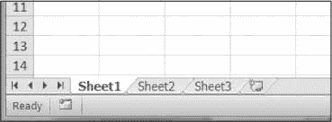

图 13-1:工作簿的工作表标签在 Excel 的左下角。

示例文件中的表 1 应该类似于表 13-1 。(如果您没有从网站上下载 `example.xlsx` ，您应该自己将这些数据输入到表格中。)

**表 13-1:***example . xlsx*电子表格


|  | **答** | *`B`* | *`C`* |
| *`1`* | 2015 年 4 月 5 日下午 1 时 34 分 02 秒 | 苹果 | Seventy-three |
| *`2`* | 2015 年 5 月 4 日凌晨 3 时 41 分 23 秒 | 樱桃 | eighty-five |
| *`3`* | 2015 年 4 月 6 日下午 12 时 46 分 5 1 秒 | 皮尔斯 | Fourteen |
| *`4`* | 2015 年 8 月 4 日上午 8 时 59 分 43 秒 | 橙 | fifty-two |
| *`5`* | 2015 年 10 月 4 日凌晨 2 时 07 分 | 苹果 | One hundred and fifty-two |
| *`6`* | 2015 年 10 月 4 日下午 6 时 10 分 37 秒 | 香蕉 | Twenty-three |
| *`7`* | 2015 年 10 月 4 日凌晨 2 时 40 分 46 秒 | 草莓 | Ninety-eight |

现在我们有了示例电子表格，让我们看看如何用`openpyxl`模块来操作它。

#### 用 OpenPyXL* 打开 Excel 文档

一旦导入了`openpyxl`模块，就可以使用`openpyxl.load_workbook()`函数了。在交互式 shell 中输入以下内容:

```py
>>> import openpyxl

>>> wb = openpyxl.load_workbook('example.xlsx')

>>> type(wb)

<class 'openpyxl.workbook.workbook.Workbook'>
```

`openpyxl.load_workbook()`函数接受文件名并返回一个数据类型为`workbook`的值。这个`Workbook`对象代表 Excel 文件，有点像一个`File`对象代表一个打开的文本文件。

记住 `example.xlsx` 需要在当前的工作目录中，这样你才能使用它。你可以通过导入`os`和使用`os.getcwd()`来找出当前的工作目录是什么，并且你可以使用`os.chdir()`来改变当前的工作目录。

#### 从工作簿中获取工作表

通过访问`sheetnames`属性，可以获得工作簿中所有工作表名称的列表。在交互式 shell 中输入以下内容:

```py
>>> import openpyxl

>>> wb = openpyxl.load_workbook('example.xlsx')

>>> wb.sheetnames # The workbook's sheets' names.

['Sheet1', 'Sheet2', 'Sheet3']

>>> sheet = wb['Sheet3'] # Get a sheet from the workbook.

>>> sheet

<Worksheet "Sheet3">

>>> type(sheet)

<class 'openpyxl.worksheet.worksheet.Worksheet'>

>>> sheet.title # Get the sheet's title as a string.

'Sheet3'

>>> anotherSheet = wb.active # Get the active sheet.

>>> anotherSheet

<Worksheet "Sheet1">
```

每个工作表都由一个`Worksheet`对象表示，您可以像使用字典键一样使用方括号和工作表名称字符串来获得这个对象。最后，您可以使用一个`Workbook`对象的`active`属性来获取工作簿的活动工作表。活动工作表是在 Excel 中打开工作簿时位于顶层的工作表。一旦有了`Worksheet`对象，就可以从`title`属性中得到它的名字。

#### 从工作表中获取单元格

一旦有了一个`Worksheet`对象，就可以通过它的名字来访问一个`Cell`对象。在交互式 shell 中输入以下内容:

```py
>>> import openpyxl

>>> wb = openpyxl.load_workbook('example.xlsx')

>>> sheet = wb['Sheet1'] # Get a sheet from the workbook.

>>> sheet['A1'] # Get a cell from the sheet.

<Cell 'Sheet1'.A1>

>>> sheet['A1'].value # Get the value from the cell.

datetime.datetime(2015, 4, 5, 13, 34, 2)

>>> c = sheet['B1'] # Get another cell from the sheet.

>>> c.value

'Apples'

>>> # Get the row, column, and value from the cell.

>>> 'Row %s, Column %s is %s' % (c.row, c.column, c.value)

'Row 1, Column B is Apples'

>>> 'Cell %s is %s' % (c.coordinate, c.value)

'Cell B1 is Apples'

>>> sheet['C1'].value

73
```

`Cell`对象有一个`value`属性，不出所料，该属性包含存储在该单元格中的值。`Cell`对象还有`row`、`column`和`coordinate`属性，为单元格提供位置信息。

在这里，访问单元格 B1 的`Cell`对象的`value`属性得到了字符串`'Apples'`。`row`属性给我们整数`1`,`column`属性给我们`'B'`,`coordinate`属性给我们`'B1'`。

OpenPyXL 将自动解释 A 列中的日期，并将它们作为`datetime`值而不是字符串返回。在第 17 章中进一步解释了`datetime`数据类型。

用字母指定列可能很难编程，特别是因为在 Z 列之后，这些列以两个字母开始:AA、AB、AC 等等。或者，您也可以使用工作表的`cell()`方法并为其`row`和`column`关键字参数传递整数来获取单元格。第一行或第一列的整数是`1`，不是`0`。通过输入以下内容继续交互式 shell 示例:

```py
>>> sheet.cell(row=1, column=2)

<Cell 'Sheet1'.B1>

>>> sheet.cell(row=1, column=2).value

'Apples'

>>> for i in range(1, 8, 2): # Go through every other row:

...     print(i, sheet.cell(row=i, column=2).value)

...

1 Apples

3 Pears

5 Apples

7 Strawberries
```

正如你所看到的，使用工作表的`cell()`方法并传递它`row=1`和`column=2`会得到单元格`B1`的`Cell`对象，就像指定`sheet['B1']`一样。然后，使用`cell()`方法及其关键字参数，您可以编写一个`for`循环来打印一系列单元格的值。

假设您想从 B 列开始，打印每个奇数行的单元格中的值。通过为`range()`函数的“step”参数传递`2`,可以从每隔一行(在本例中，所有奇数行)获取单元格。`for`循环的`i`变量作为`row`关键字参数传递给`cell()`方法，而`2`总是作为`column`关键字参数传递。注意，传递的是整数`2`，而不是字符串`'B'`。

您可以使用`Worksheet`对象的`max_row`和`max_column`属性来确定工作表的大小。在交互式 shell 中输入以下内容:

```py
>>> import openpyxl

>>> wb = openpyxl.load_workbook('example.xlsx')

>>> sheet = wb['Sheet1']

>>> sheet.max_row # Get the highest row number.

7

>>> sheet.max_column # Get the highest column number.

3
```

注意，`max_column`属性是一个整数，而不是出现在 Excel 中的字母。

#### 列字母与数字之间的转换

要将字母转换成数字，调用`openpyxl.utils.column_index_from_string()`函数。要从数字转换成字母，调用`openpyxl.utils.get_column_letter()`函数。在交互式 shell 中输入以下内容:

```py
>>> import openpyxl

>>> from openpyxl.utils import get_column_letter, column_index_from_string

>>> get_column_letter(1) # Translate column 1 to a letter.

'A'

>>> get_column_letter(2)

'B'

>>> get_column_letter(27)

'AA'

>>> get_column_letter(900)

'AHP'

>>> wb = openpyxl.load_workbook('example.xlsx')

>>> sheet = wb['Sheet1']

>>> get_column_letter(sheet.max_column)

'C'

>>> column_index_from_string('A') # Get A's number.

1

>>> column_index_from_string('AA')

27
```

从`openpyxl.utils`模块导入这两个函数后，可以调用`get_column_letter()`并给它传递一个像 27 这样的整数，算出第 27 列的字母名称是什么。函数`column_index_string()`做相反的事情:你给它传递一个列的字母名称，它告诉你那个列是什么数字。使用这些功能不需要加载工作簿。如果您愿意，您可以加载一个工作簿，获得一个`Worksheet`对象，并使用一个类似`max_column`的`Worksheet`属性来获得一个整数。然后，您可以将该整数传递给`get_column_letter()`。

#### 从工作表中获取行和列

您可以分割`Worksheet`对象以获得电子表格的行、列或矩形区域中的所有`Cell`对象。然后，您可以对切片中的所有单元格进行循环。在交互式 shell 中输入以下内容:

```py
   >>> import openpyxl

   >>> wb = openpyxl.load_workbook('example.xlsx')

   >>> sheet = wb['Sheet1']

   >>> tuple(sheet['A1':'C3']) # Get all cells from A1 to C3.

   ((<Cell 'Sheet1'.A1>, <Cell 'Sheet1'.B1>, <Cell 'Sheet1'.C1>), (<Cell

   'Sheet1'.A2>, <Cell 'Sheet1'.B2>, <Cell 'Sheet1'.C2>), (<Cell 'Sheet1'.A3>,

   <Cell 'Sheet1'.B3>, <Cell 'Sheet1'.C3>))

   >>> for rowOfCellObjects in sheet['A1':'C3']: # ➊

   ...     for cellObj in rowOfCellObjects: # ➋

   ...         print(cellObj.coordinate, cellObj.value)

   ...     print('--- END OF ROW ---')

   A1 2015-04-05 13:34:02

   B1 Apples

   C1 73

   --- END OF ROW ---

   A2 2015-04-05 03:41:23

   B2 Cherries

   C2 85

   --- END OF ROW ---

   A3 2015-04-06 12:46:51

   B3 Pears

   C3 14

   --- END OF ROW ---
```

在这里，我们指定我们想要从 A1 到 C3 的矩形区域中的`Cell`对象，我们得到一个包含该区域中的`Cell`对象的`Generator`对象。为了帮助我们可视化这个`Generator`对象，我们可以在它上面使用`tuple()`来在一个元组中显示它的`Cell`对象。

这个元组包含三个元组:每行一个，从所需区域的顶部到底部。这三个内部元组中的每一个都包含我们所需区域的一行中的`Cell`对象，从最左边的单元格到右边的单元格。所以总的来说，我们的工作表切片包含了从 A1 到 C3 区域中的所有`Cell`对象，从左上角的单元格开始，到右下角的单元格结束。

为了打印该区域中每个单元格的值，我们使用了两个`for`循环。外部`for`循环遍历切片 ➊ 中的每一行。然后，对于每一行，嵌套的`for`循环遍历该行的每个单元格 ➋ 。

要访问特定行或列中单元格的值，还可以使用一个`Worksheet`对象的`rows`和`columns`属性。在使用方括号和索引之前，必须用`list()`函数将这些属性转换成列表。在交互式 shell 中输入以下内容:

```py
>>> import openpyxl

>>> wb = openpyxl.load_workbook('example.xlsx')

>>> sheet = wb.active

>>> list(sheet.columns)[1] # Get second column's cells.

(<Cell 'Sheet1'.B1>, <Cell 'Sheet1'.B2>, <Cell 'Sheet1'.B3>, <Cell 'Sheet1'.

B4>, <Cell 'Sheet1'.B5>, <Cell 'Sheet1'.B6>, <Cell 'Sheet1'.B7>)

>>> for cellObj in list(sheet.columns)[1]:

        print(cellObj.value)

Apples

Cherries

Pears

Oranges

Apples

Bananas

Strawberries
```

在一个`Worksheet`对象上使用`rows`属性会给你一个元组。每个内部元组代表一行，并包含该行中的`Cell`对象。`columns`属性还给出了一个元组，每个内部元组包含特定列中的`Cell`对象。对于 `example.xlsx` ，由于有 7 行 3 列，`rows`给我们一个 7 元组的元组(每个包含 3 个`Cell`对象)，`columns`给我们一个 3 元组的元组(每个包含 7 个`Cell`对象)。

要访问一个特定的元组，可以通过它在更大的元组中的索引来引用它。例如，要获得表示列 B 的元组，可以使用`list(sheet.columns)[1]`。要获得包含 A 列中的`Cell`对象的元组，可以使用`list(sheet.columns)[0]`。一旦有了表示一行或一列的元组，就可以遍历它的`Cell`对象并打印它们的值。

#### 工作簿、工作表、单元格

作为快速回顾，这里列出了从电子表格文件中读取单元格所涉及的所有函数、方法和数据类型:

1.  导入`openpyxl`模块。
2.  调用`openpyxl.load_workbook()`函数。
3.  获取一个`Workbook`对象。
4.  使用`active`或`sheetnames`属性。
5.  获取一个`Worksheet`对象。
6.  使用索引或带有关键字参数`row`和`column`的`cell()`工作表方法。
7.  获取一个`Cell`对象。
8.  读取`Cell`对象的`value`属性。

### 项目:从电子表格中读取数据

假设您有一个 2010 年美国人口普查数据的电子表格，并且您有一个枯燥的任务，要遍历它的数千行，以计算每个县的总人口和普查区域的数量。(人口普查区域只是为了人口普查而定义的地理区域。)每行代表一个普查区域。我们将电子表格文件命名为*census pdata . xlsx*，你可以从`nostarch.com/automatestuff2`下载。其内容看起来像图 13-2 。

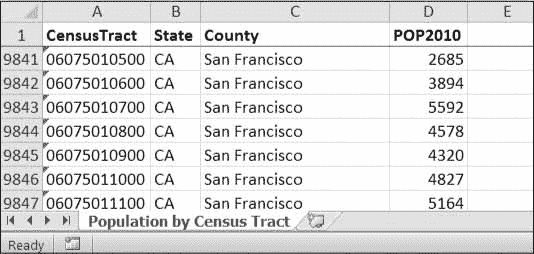

*图 13-2:*census pdata . xlsx*电子表格*

尽管 Excel 可以计算多个选定单元格的总和，但您仍然需要为 3000 多个县中的每一个县选择单元格。即使手工计算一个县的人口只需要几秒钟，整个电子表格也需要几个小时。

在本项目中，您将编写一个脚本，该脚本可以读取人口普查电子表格文件，并在几秒钟内计算每个县的统计数据。

这就是你的程序要做的:

1.  从 Excel 电子表格中读取数据
2.  统计每个县的人口普查区域的数量
3.  统计每个县的总人口
4.  打印结果

这意味着您的代码需要执行以下操作:

1.  用`openpyxl`模块打开并读取 Excel 文档的单元格。
2.  计算所有地域和人口数据，并将其存储在数据结构中。
3.  用*将数据结构写入文本文件。使用`pprint`模块的 py* 扩展。

#### 步骤 1:读取电子表格数据

在*census pdata . xlsx*电子表格中只有一个工作表，名为`'Population by Census Tract'`，每行保存一个人口普查区域的数据。这些列是区域编号(A)、州缩写(B)、县名(C)和区域人口(D)。

打开一个新的文件编辑器选项卡，并输入以下代码。将文件另存为 `readCensusExcel.py` 。

```py
   #! python3

   # readCensusExcel.py - Tabulates population and number of census tracts for

   # each county.

   import openpyxl, pprint # ➊

   print('Opening workbook...')

   wb = openpyxl.load_workbook('censuspopdata.xlsx') # ➋

   sheet = wb['Population by Census Tract'] # ➌

   countyData = {}

   # TODO: Fill in countyData with each county's population and tracts.

   print('Reading rows...')

   for row in range(2, sheet.max_row + 1): # ➍

       # Each row in the spreadsheet has data for one census tract.

       state  = sheet['B' + str(row)].value

       county = sheet['C' + str(row)].value

       pop    = sheet['D' + str(row)].value

# TODO: Open a new text file and write the contents of countyData to it.
```

这段代码导入了`openpyxl`模块，以及用于打印最终的县数据 ➊ 的`pprint`模块。然后，它打开*census pdata . xlsx*文件 ➋ ，获取带有人口普查数据 ➌ 的工作表，并开始迭代其行 ➍ 。

请注意，您还创建了一个名为`countyData`的变量，它将包含您为每个县计算的人口和土地数量。但是，在您可以在其中存储任何东西之前，您应该确切地确定如何在其中组织数据。

#### 步骤二:填充数据结构

存储在`countyData`中的数据结构将是一个以州缩写为关键字的字典。每个州的缩写将映射到另一个字典，其关键字是该州的县名字符串。每个县的名字将依次映射到一个只有两个关键字的字典中，`'tracts'`和`'pop'`。这些键映射到该县的人口普查区域和人口的数量。例如，字典看起来会像这样:

```py
{'AK': {'Aleutians East': {'pop': 3141, 'tracts': 1},

        'Aleutians West': {'pop': 5561, 'tracts': 2},

        'Anchorage': {'pop': 291826, 'tracts': 55},

        'Bethel': {'pop': 17013, 'tracts': 3},

        'Bristol Bay': {'pop': 997, 'tracts': 1},

        --snip--
```

如果之前的字典存储在`countyData`中，下面的表达式会这样计算:

```py
>>> countyData['AK']['Anchorage']['pop']

291826

>>> countyData['AK']['Anchorage']['tracts']

55
```

更普遍的情况是，`countyData`字典的键看起来像这样:

```py
countyData[state abbrev][county]['tracts']

countyData[state abbrev][county]['pop']
```

现在您已经知道了`countyData`将如何构造，您可以编写用县数据填充它的代码。将以下代码添加到程序的底部:

```py
#! python 3

# readCensusExcel.py - Tabulates population and number of census tracts for

# each county.

--snip--

for row in range(2, sheet.max_row + 1):

     # Each row in the spreadsheet has data for one census tract.

     state  = sheet['B' + str(row)].value

     county = sheet['C' + str(row)].value

     pop    = sheet['D' + str(row)].value

     # Make sure the key for this state exists.

     countyData.setdefault(state, {}) # ➊

     # Make sure the key for this county in this state exists.

     countyData[state].setdefault(county, {'tracts': 0, 'pop': 0}) # ➋

     # Each row represents one census tract, so increment by one.

     countyData[state][county]['tracts'] += 1 # ➌

     # Increase the county pop by the pop in this census tract.

     countyData[state][county]['pop'] += int(pop) # ➍

# TODO: Open a new text file and write the contents of countyData to it.
```

最后两行代码执行实际的计算工作，在`for`循环的每次迭代中，递增当前县的`tracts`【➌】的值，并递增当前县的`pop`【➍】的值。

这里有另一个代码，因为在州缩写关键字本身存在于`countyData`中之前，您不能添加一个县字典作为该关键字的值。(也就是说，如果'`AK'`'键还不存在，`countyData['AK']['Anchorage']['tracts'] += 1`将导致错误。)为了确保州缩写键存在于您的数据结构中，您需要调用`setdefault()`方法来为`state` ➊ 设置一个值(如果还不存在的话)。

正如`countyData`字典需要一个字典作为每个州缩写关键字的值一样，每个*那些*字典都需要自己的字典作为每个县关键字 ➋ 的值。这些字典中的每一个*依次需要以整数值`0`开始的键`'tracts'`和`'pop'`。(如果您忘记了字典的结构，请回头看看本节开头的示例字典。)*

因为如果键已经存在，`setdefault()`什么也不做，所以您可以在`for`循环的每次迭代中调用它，不会有任何问题。

#### 第三步:将结果写入文件

在`for`循环完成后，`countyData`字典将包含所有以县和州为关键字的人口和区域信息。此时，您可以编写更多的代码，将其写入文本文件或另一个 Excel 电子表格。现在，让我们使用`pprint.pformat()`函数将`countyData`字典值作为一个大字符串写入一个名为 `census2010.py` 的文件。将下面的代码添加到程序的底部(确保它不被缩进，这样它就不会出现在`for`循环之外):

```py
#! python 3

# readCensusExcel.py - Tabulates population and number of census tracts for

# each county.

--snip--

for row in range(2, sheet.max_row + 1):

--snip--

# Open a new text file and write the contents of countyData to it.

print('Writing results...')

resultFile = open('census2010.py', 'w')

resultFile.write('allData = ' + pprint.pformat(countyData))

resultFile.close()

print('Done.')
```

`pprint.pformat()`函数产生一个字符串，该字符串本身被格式化为有效的 Python 代码。通过将它输出到一个名为 `census2010.py` 的文本文件，您已经从您的 Python 程序生成了一个 Python 程序！这看起来可能很复杂，但好处是您现在可以像导入任何其他 Python 模块一样导入 `census2010.py` 。在交互式 shell 中，将当前工作目录更改为包含新创建的 `census2010.py` 文件的文件夹，然后导入该文件:

```py
>>> import os

>>> import census2010

>>> census2010.allData['AK']['Anchorage']

{'pop': 291826, 'tracts': 55}

>>> anchoragePop = census2010.allData['AK']['Anchorage']['pop']

>>> print('The 2010 population of Anchorage was ' + str(anchoragePop))

The 2010 population of Anchorage was 291826
```

`readCensusExcel.py` 程序是一次性代码:一旦你将其结果保存到 `census2010.py` ，你就不需要再次运行该程序。每当您需要县数据时，只需运行`import census2010`。

手工计算这些数据需要几个小时；这个程序几秒钟就完成了。使用 OpenPyXL，您可以毫不费力地提取保存到 Excel 电子表格中的信息，并在其上执行计算。你可以从下载完整的程序。

#### 类似节目的创意

许多企业和办公室使用 Excel 来存储各种类型的数据，电子表格变得庞大而笨拙并不罕见。任何解析 Excel 电子表格的程序都有类似的结构:它加载电子表格文件，准备一些变量或数据结构，然后遍历电子表格中的每一行。这样的程序可以做到以下几点:

*   比较电子表格中多行的数据。
*   打开多个 Excel 文件并比较电子表格之间的数据。
*   检查电子表格中是否有空白行或无效数据，如果有，提醒用户。
*   从电子表格中读取数据，并将其用作 Python 程序的输入。

### 编写 Excel 文档

OpenPyXL 还提供了写数据的方法，这意味着您的程序可以创建和编辑电子表格文件。使用 Python，创建包含数千行数据的电子表格非常简单。

#### 创建并保存 Excel 文档

调用`openpyxl.Workbook()`函数创建一个新的空白`Workbook`对象。在交互式 shell 中输入以下内容:

```py
>>> import openpyxl

>>> wb = openpyxl.Workbook() # Create a blank workbook.

>>> wb.sheetnames # It starts with one sheet.

['Sheet']

>>> sheet = wb.active

>>> sheet.title

'Sheet'

>>> sheet.title = 'Spam Bacon Eggs Sheet' # Change title.

>>> wb.sheetnames

['Spam Bacon Eggs Sheet']
```

该工作簿将以一个名为*工作表*的工作表开始。您可以通过在工作表的`title`属性中存储一个新字符串来更改工作表的名称。

每当您修改`Workbook`对象或其工作表和单元格时，电子表格文件将不会被保存，直到您调用`save()`工作簿方法。在交互 shell 中输入以下内容(当前工作目录下有 `example.xlsx` ):

```py
>>> import openpyxl

>>> wb = openpyxl.load_workbook('example.xlsx')

>>> sheet = wb.active

>>> sheet.title = 'Spam Spam Spam'

>>> wb.save('example_copy.xlsx') # Save the workbook.
```

在这里，我们更改工作表的名称。为了保存我们的更改，我们将文件名作为字符串传递给`save()`方法。传递不同于原始文件名的文件名，例如`'example_copy.xlsx'`，将更改保存到电子表格的副本中。

每当您编辑从文件载入的电子表格时，您都应该将新的、编辑过的电子表格存储为不同于原始文件的文件名。这样，您仍然可以使用原始的电子表格文件，以防代码中的错误导致新保存的文件包含不正确或损坏的数据。

#### 创建和删除工作表

可以使用`create_sheet()`方法和`del`操作符在工作簿中添加和删除工作表。在交互式 shell 中输入以下内容:

```py
>>> import openpyxl

>>> wb = openpyxl.Workbook()

>>> wb.sheetnames

['Sheet']

>>> wb.create_sheet() # Add a new sheet.

<Worksheet "Sheet1">

>>> wb.sheetnames

['Sheet', 'Sheet1']

>>> # Create a new sheet at index 0.

>>> wb.create_sheet(index=0, title='First Sheet')

<Worksheet "First Sheet">

>>> wb.sheetnames

['First Sheet', 'Sheet', 'Sheet1']

>>> wb.create_sheet(index=2, title='Middle Sheet')

<Worksheet "Middle Sheet">

>>> wb.sheetnames

['First Sheet', 'Sheet', 'Middle Sheet', 'Sheet1']
```

`create_sheet()`方法返回一个名为`Sheet` X 的新的`Worksheet`对象，默认情况下，该对象被设置为工作簿中的最后一张工作表。可选地，可以用关键字参数`index`和`title`指定新工作表的索引和名称。

通过输入以下内容，继续前面的示例:

```py
>>> wb.sheetnames

['First Sheet', 'Sheet', 'Middle Sheet', 'Sheet1']

>>> del wb['Middle Sheet']

>>> del wb['Sheet1']

>>> wb.sheetnames

['First Sheet', 'Sheet']
```

您可以使用`del`操作符从工作簿中删除工作表，就像您可以使用它从字典中删除键值对一样。

在工作簿中添加或删除工作表后，记得调用`save()`方法保存更改。

#### 将数值写入单元格

将值写入单元格非常类似于将值写入字典中的键。在交互式 shell 中输入以下内容:

```py
>>> import openpyxl

>>> wb = openpyxl.Workbook()

>>> sheet = wb['Sheet']

>>> sheet['A1'] = 'Hello, world!' # Edit the cell's value.

>>> sheet['A1'].value

'Hello, world!'
```

如果你有一个字符串形式的单元格坐标，你可以像在`Worksheet`对象上的字典键一样使用它来指定要写入哪个单元格。

### 项目:更新电子表格

在本项目中，您将编写一个程序来更新农产品销售电子表格中的单元格。您的程序将浏览电子表格，找到特定种类的产品，并更新它们的价格。从`nostarch.com/automatestuff2`](https://nostarch.com/automatestuff2/)下载该电子表格。[图 13-3 显示了电子表格的样子。

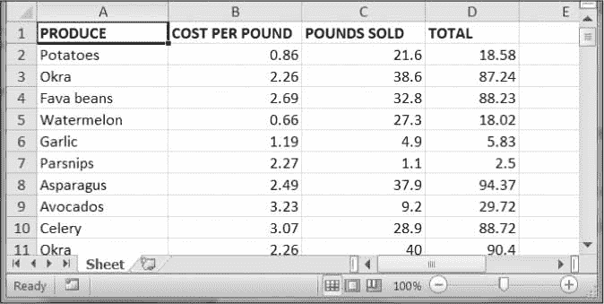

*图 13-3:农产品销售的电子表格*

每行代表一笔单独的销售。这几列分别是售出产品的类型(A)，每磅产品的成本(B)，售出的磅数(C)和销售总收入(D)。“总计”列被设置为 Excel 公式 *=ROUND(B3*C3，2)* ，它将每磅的成本乘以售出的磅数，并将结果四舍五入到最接近的美分。使用此公式，如果 B 列或 c 列发生变化,“总计”列中的单元格将自动更新。

现在想象一下，大蒜、芹菜和柠檬的价格输入不正确，让您在这个电子表格的数千行中更新每磅大蒜、芹菜和柠檬的成本。您不能对价格进行简单的查找和替换，因为可能有其他价格相同的项目，您不想错误地“更正”对于成千上万的行，手工操作需要几个小时。但是你可以写一个程序在几秒钟内完成。

您的程序执行以下操作:

1.  在所有行上循环
2.  如果该行是大蒜、芹菜或柠檬，则改变价格

这意味着你的代码需要做以下事情:

1.  打开电子表格文件。
2.  对于每一行，检查 A 列中的值是`Celery`、`Garlic`还是`Lemon`。
3.  如果是，更新 b 列中的价格。
4.  将电子表格保存到一个新文件中(以防万一，这样你就不会丢失旧的电子表格)。

#### ***第一步:用更新信息*** 建立数据结构

您需要更新的价格如下:

芹菜 1.19

大蒜 3.07

柠檬 1.27

您可以编写这样的代码:

```py
if produceName == 'Celery':

    cellObj = 1.19

if produceName == 'Garlic':

    cellObj = 3.07

if produceName == 'Lemon':

    cellObj = 1.27
```

像这样硬编码农产品和更新的价格数据有点不雅观。如果您需要用不同的价格或不同的产品再次更新电子表格，您将不得不修改大量代码。每次你修改代码，你都有引入错误的风险。

更灵活的解决方案是将正确的价格信息存储在字典中，并编写代码来使用这种数据结构。在新的文件编辑器选项卡中，输入以下代码:

```py
#! python3

# updateProduce.py - Corrects costs in produce sales spreadsheet.

import openpyxl

wb = openpyxl.load_workbook('produceSales.xlsx')

sheet = wb['Sheet']

# The produce types and their updated prices

PRICE_UPDATES = {'Garlic': 3.07,

                 'Celery': 1.19,

                 'Lemon': 1.27}

# TODO: Loop through the rows and update the prices.
```

将此另存为 `updateProduce.py` 。如果您需要再次更新电子表格，您只需要更新`PRICE_UPDATES`字典，而不需要更新任何其他代码。

#### 第二步:检查所有行并更新不正确的价格

程序的下一部分将遍历电子表格中的所有行。将以下代码添加到 `updateProduce.py` 的底部:

```py
   #! python3

   # updateProduce.py - Corrects costs in produce sales spreadsheet.

   --snip--

   # Loop through the rows and update the prices.

   for rowNum in range(2, sheet.max_row):    # skip the first row # ➊

       produceName = sheet.cell(row=rowNum, column=1).value # ➋

       if produceName in PRICE_UPDATES: # ➌

          sheet.cell(row=rowNum, column=2).value = PRICE_UPDATES[produceName]

   wb.save('updatedProduceSales.xlsx') # ➍
```

我们循环遍历从第 2 行开始的行，因为第 1 行只是标题 ➊ 。第 1 列(即 a 列)的单元格将存储在变量`produceName` ➋ 中。如果`produceName`作为一个键存在于`PRICE_UPDATES`字典 ➌ 中，那么您知道这是一个必须纠正其价格的行。正确的价格会在`PRICE_UPDATES[produceName]`里。

注意使用`PRICE_UPDATES`使代码变得多么干净。每种类型的产品更新只需要一个`if`语句，而不是像`if produceName == 'Garlic':`这样的代码。由于代码使用了`PRICE_UPDATES`字典，而不是将产品名称和更新的成本硬编码到`for`循环中，所以如果产品销售电子表格需要额外的更改，只需修改`PRICE_UPDATES`字典，而不用修改代码。

在浏览整个电子表格并进行更改后，代码将`Workbook`对象保存到*updatedproducesales . xlsx*T3】➍中。它不会覆盖旧的电子表格，以防你的程序有错误，更新的电子表格是错误的。检查更新的电子表格看起来正确后，您可以删除旧的电子表格。

你可以从`nostarch.com/automatestuff2`下载这个程序的完整源代码。

#### 类似节目的创意

由于许多办公室工作人员一直在使用 Excel 电子表格，一个可以自动编辑和编写 Excel 文件的程序可能会非常有用。这样的程序可以做到以下几点:

*   从一个电子表格中读取数据，并将其写入其他电子表格的某些部分。
*   从网站、文本文件或剪贴板读取数据，并将其写入电子表格。
*   自动“清理”电子表格中的数据。例如，它可以使用正则表达式读取多种格式的电话号码，并将它们编辑成单一的标准格式。

### 设置单元格的字体样式

设置某些单元格、行或列的样式可以帮助您强调电子表格中的重要区域。例如，在生产电子表格中，您的程序可以将粗体文本应用于马铃薯、大蒜和欧防风草行。或者，您可能希望将每磅成本大于 5 美元的每一行都设为斜体。手工设计大型电子表格的某些部分会很繁琐，但是您的程序可以立即完成。

要自定义单元格中的字体样式，重要的是，从`openpyxl.styles`模块导入`Font()`函数。

```py
from openpyxl.styles import Font
```

这允许您键入`Font()`而不是`openpyxl.styles.Font()`。(参见第 47 页的导入模块来回顾这种风格的`import`语句。)

下面的示例创建了一个新工作簿，并将单元格 A1 设置为 24 磅斜体字体。在交互式 shell 中输入以下内容:

```py
  >>> import openpyxl

  >>> from openpyxl.styles import Font

  >>> wb = openpyxl.Workbook()

  >>> sheet = wb['Sheet']

   >>> italic24Font = Font(size=24, italic=True) # Create a font. # ➊

   >>> sheet['A1'].font = italic24Font # Apply the font to A1. # ➋

  >>> sheet['A1'] = 'Hello, world!'

  >>> wb.save('styles.xlsx')
```

在本例中，`Font(size=24, italic=True)`返回一个`Font`对象，该对象存储在`italic24Font` ➊ 中。关键字参数`Font()`、`size`和`italic`，配置`Font`对象的样式信息。当`sheet['A1'].font`被赋予`italic24Font`对象 ➋ 时，所有的字体样式信息都被应用到单元格 A1。

### 字体对象

要设置`font`属性，需要将关键字参数传递给`Font()`。表 13-2 显示了`Font()`函数可能的关键字参数。

**表 13-2:字体对象的**关键字参数


| **关键字参数** | **数据类型** | **描述** |
| --- | --- | --- |
| `name` | 字符串 | 字体名称，如`'Calibri'`或`'Times New Roman'` |
| `size` | 整数 | 字体大小 |
| `bold` | 布尔值 | `True`为粗体 |
| `italic` | 布尔值 | `True`为斜体 |

你可以调用`Font()`来创建一个`Font`对象，并将这个`Font`对象存储在一个变量中。然后将该变量分配给一个`Cell`对象的`font`属性。例如，这段代码创建了各种字体样式:

```py
>>> import openpyxl

>>> from openpyxl.styles import Font

>>> wb = openpyxl.Workbook()

>>> sheet = wb['Sheet']

>>> fontObj1 = Font(name='Times New Roman', bold=True)

>>> sheet['A1'].font = fontObj1

>>> sheet['A1'] = 'Bold Times New Roman'

>>> fontObj2 = Font(size=24, italic=True)

>>> sheet['B3'].font = fontObj2

>>> sheet['B3'] = '24 pt Italic'

>>> wb.save('styles.xlsx')
```

这里，我们将一个`Font`对象存储在`fontObj1`中，然后将 A1 `Cell`对象的`font`属性设置为`fontObj1`。我们用另一个`Font`对象重复这个过程来设置第二个单元格的字体。运行这段代码后，电子表格中 A1 和 B3 单元格的样式将被设置为自定义字体样式，如图 13-4 所示。

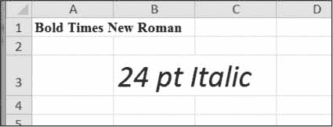

*图 13-4:带有自定义字体样式的电子表格*

对于单元格 A1，我们将字体名称设置为`'Times New Roman'`并将`bold`设置为`true`，因此我们的文本以粗体 Times New Roman 显示。我们没有指定大小，所以使用默认的`openpyxl`11。在单元格 B3，我们的文本是斜体，大小为 24；我们没有指定字体名称，所以使用默认的`openpyxl`, Calibri。

### 公式

以等号开头的 Excel 公式可以将单元格配置为包含从其他单元格计算出的值。在本节中，您将使用`openpyxl`模块以编程方式向单元格添加公式，就像任何普通值一样。例如:

```py
>>> sheet['B9'] = '=SUM(B1:B8)'
```

这会将 *=SUM(B1:B8)* 存储为单元格 B9 中的值。这会将 B9 单元格设置为计算 B1 到 B8 单元格中的值之和的公式。你可以在图 13-5 的中看到这一点。

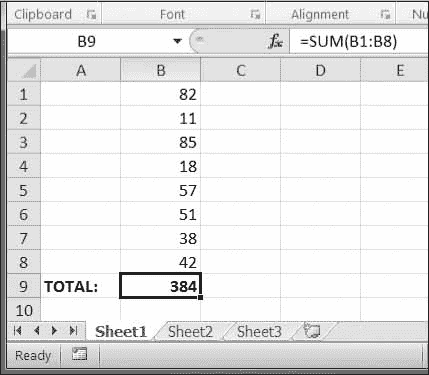

*图 13-5:单元格 B9 包含公式* =SUM(B1:B8)，*，将单元格 B1 和 B8 相加。*

Excel 公式的设置就像单元格中的任何其他文本值一样。在交互式 shell 中输入以下内容:

```py
>>> import openpyxl

>>> wb = openpyxl.Workbook()

>>> sheet = wb.active

>>> sheet['A1'] = 200

>>> sheet['A2'] = 300

>>> sheet['A3'] = '=SUM(A1:A2)' # Set the formula.

>>> wb.save('writeFormula.xlsx')
```

A1 和 A2 中的单元格分别设置为 200 和 300。单元格 A3 中的值被设置为对 A1 和 A2 中的值求和的公式。当在 Excel 中打开电子表格时，A3 会将其值显示为 500。

Excel 公式为电子表格提供了一定程度的可编程性，但对于复杂的任务来说，可能会很快变得难以管理。例如，即使你对 Excel 公式非常熟悉，试图解释什么是*= IF error(TRIM(IF(LEN(VLOOKUP(F7，Sheet2！$A$1:$B$10000，2，FALSE)>0，替换(VLOOKUP(F7，Sheet2！$A$1:$B$10000，2，FALSE)，" "，"")，"")，" ")*实际上确实如此。Python 代码可读性更好。

### 调整行和列

在 Excel 中，调整行和列的大小就像单击并拖动行或列标题的边缘一样简单。但是如果您需要根据单元格的内容设置行或列的大小，或者如果您想要在大量电子表格文件中设置大小，那么编写 Python 程序来完成它会快得多。

行和列也可以完全隐藏起来。或者它们可以被“冻结”在适当的位置，这样它们在屏幕上总是可见的，并且在打印电子表格时出现在每一页上(这对标题来说很方便)。

#### 设置行高和列宽

`Worksheet`对象有控制行高和列宽的`row_dimensions`和`column_dimensions`属性。在交互式 shell 中输入以下内容:

```py
>>> import openpyxl

>>> wb = openpyxl.Workbook()

>>> sheet = wb.active

>>> sheet['A1'] = 'Tall row'

>>> sheet['B2'] = 'Wide column'

>>> # Set the height and width:

>>> sheet.row_dimensions[1].height = 70

>>> sheet.column_dimensions['B'].width = 20

>>> wb.save('dimensions.xlsx')
```

工作表的`row_dimensions`和`column_dimensions`是类似字典的值；`row_dimensions`包含`RowDimension`对象，`column_dimensions`包含`ColumnDimension`对象。在`row_dimensions`中，您可以使用行号(在本例中为 1 或 2)访问其中一个对象。在`column_dimensions`中，您可以使用列的字母(在本例中是 A 或 B)来访问其中一个对象。

`dimensions.xlsx` 电子表格看起来像图 13-6 。

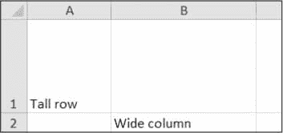

*图 13-6:第 1 行和 B 列被设置为更大的高度和宽度*

一旦你有了`RowDimension`对象，你就可以设置它的高度。一旦有了`ColumnDimension`对象，就可以设置它的宽度。行高可以设置为`0`和`409`之间的整数或浮点值。该值代表以*点*测量的高度，其中一点等于 1/72 英寸。默认行高为 12.75。列宽可以设置为介于`0`和`255`之间的整数或浮点值。该值表示单元格中可以显示的默认字体大小(11 磅)的字符数。默认列宽为 8.43 个字符。用户看不到宽度为`0`的列或高度为`0`的行。

#### 合并和取消合并单元格

使用`merge_cells()` sheet 方法可以将矩形区域的单元格合并成一个单元格。在交互式 shell 中输入以下内容:

```py
>>> import openpyxl

>>> wb = openpyxl.Workbook()

>>> sheet = wb.active

>>> sheet.merge_cells('A1:D3') # Merge all these cells.

>>> sheet['A1'] = 'Twelve cells merged together.'

>>> sheet.merge_cells('C5:D5') # Merge these two cells.

>>> sheet['C5'] = 'Two merged cells.'

>>> wb.save('merged.xlsx')
```

`merge_cells()`的参数是要合并的矩形区域的左上和右下单元格的单个字符串:`'A1:D3'`将 12 个单元格合并成一个单元格。要设置这些合并单元格的值，只需设置合并组左上角单元格的值。

当您运行这段代码时， `merged.xlsx` 将看起来像图 13-7 。

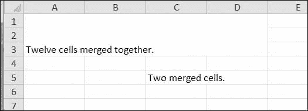

*图 13-7:电子表格中的合并单元格*

要取消合并单元格，请调用`unmerge_cells()` sheet 方法。在交互式 shell 中输入以下内容:

```py
>>> import openpyxl

>>> wb = openpyxl.load_workbook('merged.xlsx')

>>> sheet = wb.active

>>> sheet.unmerge_cells('A1:D3') # Split these cells up.

>>> sheet.unmerge_cells('C5:D5')

>>> wb.save('merged.xlsx')
```

如果您保存您的更改，然后查看电子表格，您会看到合并的单元格已经恢复为单独的单元格。

#### 冻结窗格

对于太大而不能一次全部显示的电子表格，在屏幕上“冻结”几个最上面的行或最左边的列是有帮助的。例如，即使用户在电子表格中滚动，冻结的列或行标题也总是可见的。这些被称为*冻结窗格*。在 OpenPyXL 中，每个`Worksheet`对象都有一个`freeze_panes`属性，可以设置为一个`Cell`对象或一个单元格坐标字符串。请注意，该单元格上方的所有行和左侧的所有列都将被冻结，但单元格本身的行和列不会被冻结。

要解冻所有窗格，请将`freeze_panes`设置为`None`或`'A1'`。表 13-3 显示了`freeze_panes`的一些示例设置将冻结哪些行和列。

**表 13-3:** 冻结窗格示例


| `freeze_panes`的**设置** | **被冻结的行和列** |
| --- | --- |
| `sheet.freeze_panes = 'A2'` | 第一行 |
| `sheet.freeze_panes = 'B1'` | A 列 |
| `sheet.freeze_panes = 'C1'` | A 列和 B 列 |
| `sheet.freeze_panes = 'C2'` | 第一行以及 A 列和 B 列 |
| `sheet.freeze_panes = 'A1'`或`sheet.freeze_panes = None` | 没有冻结的窗格 |

确保你有的农产品销售电子表格。然后在交互式 shell 中输入以下内容:

```py
>>> import openpyxl

>>> wb = openpyxl.load_workbook('produceSales.xlsx')

>>> sheet = wb.active

>>> sheet.freeze_panes = 'A2' # Freeze the rows above A2.

>>> wb.save('freezeExample.xlsx')
```

如果将`freeze_panes`属性设置为`'A2'`，那么无论用户在电子表格中滚动到哪里，第 1 行总是可见的。你可以在图 13-8 中看到这一点。

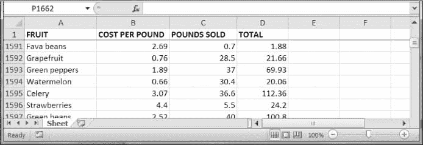

*图 13-8:当 freeze_panes 设置为‘A2’时，第一行总是可见的，即使用户向下滚动。*

### 图表

OpenPyXL 支持使用工作表单元格中的数据创建条形图、折线图、散点图和饼图。要制作图表，您需要执行以下操作:

1.  从矩形单元格中创建一个`Reference`对象。
2.  通过传入`Reference`对象来创建一个`Series`对象。
3.  创建一个`Chart`对象。
4.  将`Series`对象附加到`Chart`对象上。
5.  将`Chart`对象添加到`Worksheet`对象，可以选择指定哪个单元格应该位于图表的左上角。

对象需要一些解释。通过调用`openpyxl.chart.Reference()`函数并传递三个参数来创建`Reference`对象:

1.  包含图表数据的`Worksheet`对象。
2.  由两个整数组成的元组，表示包含图表数据的矩形单元格选择的左上角单元格:元组中的第一个整数是行，第二个是列。注意`1`是第一行，不是`0`。
3.  由两个整数组成的元组，表示包含图表数据的矩形单元格选择的右下角单元格:元组中的第一个整数是行，第二个是列。

图 13-9 显示了一些样本坐标参数。

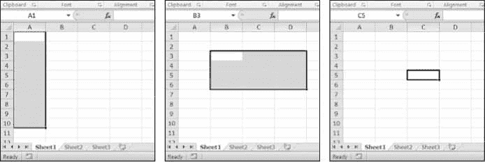

*图 13-9:从左到右: (1，1)，(10，1)； (3，2)，(6，4)； (5，3)，(5，3)*

输入这个交互式 shell 示例来创建一个条形图，并将其添加到电子表格中:

```py
>>> import openpyxl

>>> wb = openpyxl.Workbook()

>>> sheet = wb.active

>>> for i in range(1, 11): # create some data in column A

...     sheet['A' + str(i)] = i

...

>>> refObj = openpyxl.chart.Reference(sheet, min_col=1, min_row=1, max_col=1,

max_row=10)

>>> seriesObj = openpyxl.chart.Series(refObj, title='First series')

>>> chartObj = openpyxl.chart.BarChart()

>>> chartObj.title = 'My Chart'

>>> chartObj.append(seriesObj)

>>> sheet.add_chart(chartObj, 'C5')

>>> wb.save('sampleChart.xlsx')
```

这将产生一个类似于图 13-10 的电子表格。

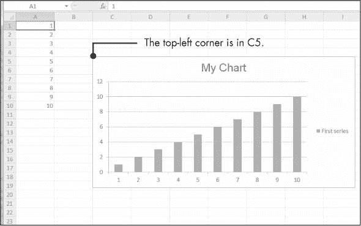

*图 13-10:添加了图表的电子表格*

我们通过调用`openpyxl.chart.BarChart()`创建了一个条形图。您还可以通过调用`openpyxl.charts.LineChart()`、`openpyxl.chart.ScatterChart()`和`openpyxl.chart.PieChart()`来创建折线图、散点图和饼图。

### 总结

通常，处理信息的困难部分不是处理本身，而是简单地将数据转换成适合程序的格式。但是一旦将电子表格加载到 Python 中，提取和操作数据的速度就比手工操作要快得多。

您还可以生成电子表格作为程序的输出。因此，如果同事需要将您的文本文件或成千上万销售联系人的 PDF 文件转换成电子表格文件，您就不必繁琐地将它们全部复制并粘贴到 Excel 中。

配备了`openpyxl`模块和一些编程知识，你会发现处理即使是最大的电子表格也是小菜一碟。

在下一章，我们将看看如何使用 Python 与另一个电子表格程序交互:流行的在线 Google Sheets 应用程序。

### 练习题

对于下面的问题，假设你在变量`wb`中有一个`Workbook`对象，`sheet`中有一个`Worksheet`对象，`cell`中有一个`Cell`对象，`comm`中有一个`Comment`对象，`img`中有一个`Image`对象。

1 。`openpyxl.load_workbook()`函数返回什么？

2 。`wb.sheetnames`工作簿属性包含什么？

3 。如何检索名为`'Sheet1'`的工作表的`Worksheet`对象？

4 。如何检索工作簿活动工作表的`Worksheet`对象？

5 。如何检索单元格 C5 中的值？

6 。如何将单元格 C5 中的值设置为`"Hello"`？

7 。如何将单元格的行和列检索为整数？

8 。`sheet.max_column`和`sheet.max_row`工作表属性包含什么，这些属性的数据类型是什么？

9 。如果您需要获取列`'M'`的整数索引，您需要调用什么函数？

10 。如果您需要获得列`14`的字符串名称，您需要调用什么函数？

11 。如何检索从 A1 到 F1 的所有`Cell`对象的元组？

12 。如何将工作簿保存为文件名 `example.xlsx` ？

13 。如何在单元格中设置公式？

14 。如果您想要检索单元格公式的结果，而不是单元格公式本身，您必须首先做什么？

15 如何将第 5 行的高度设置为 100？

16 。你如何隐藏 C 列？

17 。什么是冻结窗格？

18 。创建条形图需要调用哪五个函数和方法？

### 实践项目

为了练习，编写执行下列任务的程序。

#### 乘法表制作者

创建一个程序 `multiplicationTable.py` ，它从命令行获取一个数字 `N` ，并在 Excel 电子表格中创建一个 `N` × `N` 乘法表。例如，当程序像这样运行时:

```py
py multiplicationTable.py 6
```

...它应该创建一个类似于图 13-11 的电子表格。

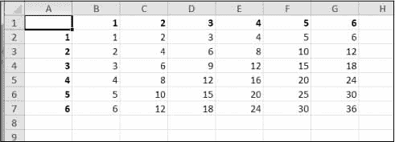

*图 13-11:在电子表格中生成的乘法表*

第 1 行和第 A 列应用于标签，并以粗体显示。

#### 空白行插入器

创建一个程序 `blankRowInserter.py` ，它接受两个整数和一个文件名字符串作为命令行参数。我们称第一个整数为 `N` ，第二个整数为 `M` 。从第*行 N* 开始，程序应该将第 `M` 个空白行插入到电子表格中。例如，当程序像这样运行时:

```py
python blankRowInserter.py 3 2 myProduce.xlsx
```

...“之前”和“之后”电子表格应该看起来像图 13-12 。

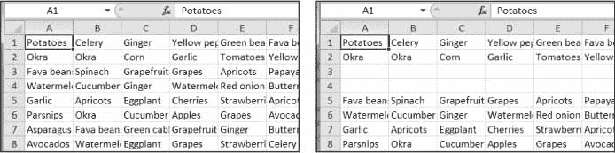

*图 13-12:在第 3 行*插入前(左)后(右)两个空白行

你可以通过读入电子表格的内容来编写这个程序。然后，当写出新的电子表格时，使用一个`for`循环来复制前 `N` 行。对于剩余的行，将 `M` 添加到输出电子表格中的行号。

#### 电子表格单元格反相器

编写一个程序来反转电子表格中单元格的行和列。例如，第 5 行第 3 列的值将位于第 3 行第 5 列(反之亦然)。应该对电子表格中的所有单元格都这样做。例如，“之前”和“之后”的电子表格看起来类似于图 13-13 。

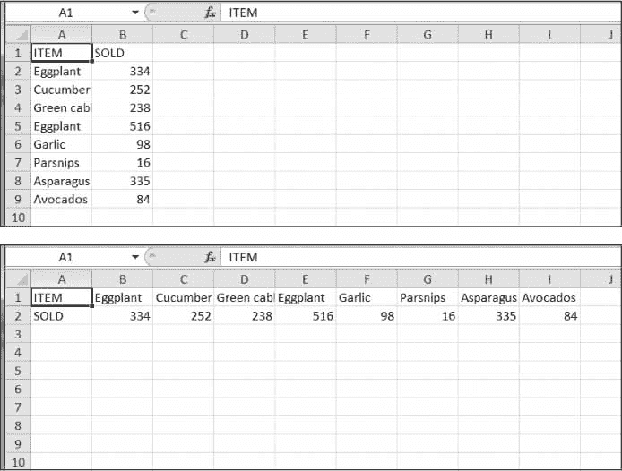

*图 13-13:反转前(上)和反转后(下)的电子表格*

您可以通过使用嵌套的`for`循环将电子表格的数据读入列表数据结构的列表中来编写这个程序。对于列`x`和行`y`的单元，该数据结构可以具有`sheetData[x][y]`。然后，当写出新的电子表格时，对列`x`和行`y`的单元格使用`sheetData[y][x]`。

#### 文本文件到电子表格

编写一个程序，读入几个文本文件的内容(您可以自己创建文本文件)，并将这些内容插入到电子表格中，每行一行文本。第一个文本文件的行将位于 A 列的单元格中，第二个文本文件的行将位于 B 列的单元格中，依此类推。

使用`readlines()` `File`对象方法返回字符串列表，文件中每行一个字符串。对于第一个文件，将第一行输出到第 1 列第 1 行。第二行应写入第 1 列第 2 行，依此类推。用`readlines()`读取的下一个文件将被写入第 2 列，下一个文件将被写入第 3 列，依此类推。

#### 电子表格到文本文件

编写一个程序，以相反的顺序执行前面程序的任务:该程序应该打开一个电子表格，将 A 列的单元格写入一个文本文件，将 B 列的单元格写入另一个文本文件，依此类推。