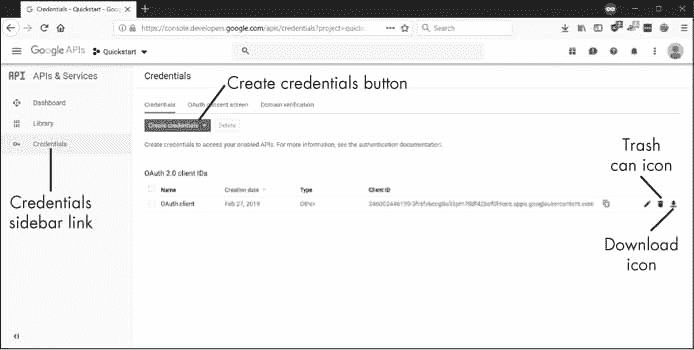
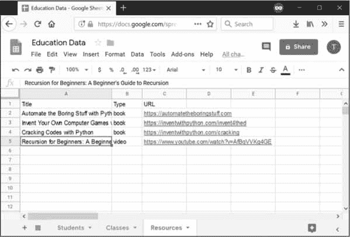
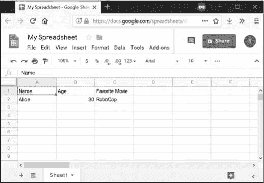
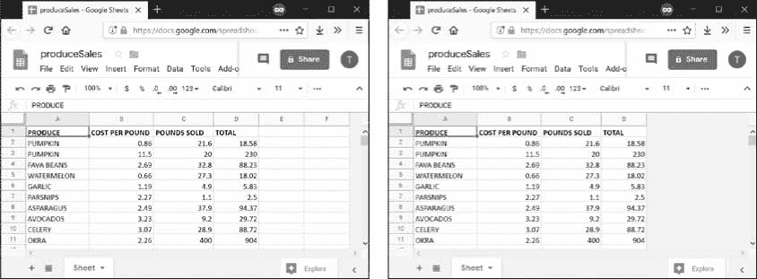
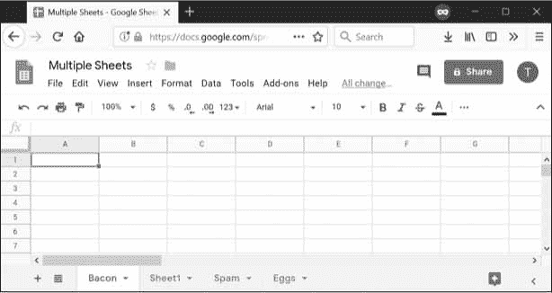

# 14 使用 GOOGLE SHEETS

> 原文：<https://automatetheboringstuff.com/2e/chapter14/>


Google Sheets 是一个免费的基于网络的电子表格应用程序，任何拥有 Google 账户或 Gmail 地址的人都可以使用，它已经成为 Excel 的一个有用的、功能丰富的竞争对手。Google Sheets 有自己的 API，但是这个 API 学习和使用起来会很混乱。本章涵盖 EZSheets 第三方模块，记录在。虽然不如官方的 Google Sheets API 功能全面，但 EZSheets 使常见的电子表格任务易于执行。

### 安装和设置 EZSheets

您可以通过打开一个新的终端窗口并运行`pip install --user ezsheets`来安装 EZSheets。作为安装的一部分，EZSheets 还将安装`google-api-python-client`、`google-auth-httplib2`和模块。这些模块允许你的程序登录到 Google 的服务器并发出 API 请求。EZSheets 处理与这些模块的交互，所以您不需要关心它们如何工作。

#### 获取凭证和令牌文件

在使用 EZSheets 之前，您需要为您的 Google 帐户启用 Google Sheets 和 Google Drive APIs。访问以下网页，点击每个网页顶部的**启用 API** 按钮：

*   [`console.developers.google.com/apis/library/sheets.googleapis.com`](https://console.developers.google.com/apis/library/sheets.googleapis.com/)
*   [`console.developers.google.com/apis/library/drive.googleapis.com`](https://console.developers.google.com/apis/library/drive.googleapis.com/)

您还需要获得三个文件，它们应该保存在与您的使用 EZSheets 的 Python 脚本相同的文件夹中。:

*   名为`credentials-sheets.json`的凭证文件
*   一个名为`token-sheets.pickle`的 Google Sheets 令牌
*   一个名为`token-drive.pickle`的 Google Drive 令牌

凭据文件将生成令牌文件。获取凭证文件最简单的方法是在`developers.google.com/sheets/api/quickstart/python`](https://developers.google.com/sheets/api/quickstart/python/)进入 Google Sheets Python 快速入门页面，点击蓝色的**启用 Google Sheets API** 按钮，如图[图 14-1 所示。您需要登录您的 Google 帐户才能查看此页面。


图 14-1：获取一个`credentials.json`文件。

点击该按钮将弹出一个窗口，带有**下载客户端配置**链接，让您下载一个`credentials.json`文件。将该文件重命名为`credentials-sheets.json`，并将其放在与 Python 脚本相同的文件夹中。

一旦您有了一个`credentials-sheets.json`文件，运行`import ezsheets`模块。首次导入 EZSheets 模块时，它会打开一个新的浏览器窗口，供您登录 Google 帐户。点击**允许**，如图图 14-2 所示。


图 14-2：允许快速入门访问你的谷歌账户

关于 Quickstart 的消息来自于您从 Google Sheets Python Quickstart 页面下载了凭证文件。请注意，该窗口将打开两次：第一次用于 Google Sheets 访问，第二次用于 Google Drive 访问。EZSheets 使用 Google Drive 访问来上传、下载和删除电子表格。

登录后浏览器窗口会提示关闭，`token-sheets.pickle`和`token-drive.pickle`文件会和`credentials-sheets.json`出现在同一个文件夹中。您只需要在第一次运行`import ezsheets`时经历这个过程。

如果您在单击 Allow 后遇到错误，并且页面似乎挂起，请确保您首先启用了本节开头的链接中的 Google Sheets 和 Drive APIs。谷歌的服务器可能需要几分钟来注册这一更改，因此您可能需要等待才能使用 EZSheets。

不要与任何人共享凭据或令牌文件，要像对待密码一样对待它们。

#### 撤销国书文件

如果您不小心与他人共享了凭据或令牌文件，他们将无法更改您的 Google 帐户密码，但可以访问您的电子表格。你可以在前往谷歌云平台开发者控制台页面撤销这些文件。您需要登录您的 Google 帐户才能查看此页面。点击侧边栏上的**证书**链接。然后点击你不小心共享的凭证文件旁边的垃圾桶图标，如图图 14-3 所示。



图 14-3：谷歌云平台开发者控制台中的凭证页面

要在该页面生成新的凭证文件，点击**创建凭证**按钮，选择 **OAuth 客户端 ID** ，也如图 14-3 所示。接下来，对于应用类型，选择**其他**并给文件起一个你喜欢的名字。这个新的凭证文件将在页面上列出，您可以单击下载图标来下载它。下载的文件将会有一个长而复杂的文件名，所以您应该将其重命名为 EZSheets 试图加载的默认文件名： `credentials-sheets.json`。您还可以通过单击前面提到的 Enable Google Sheets API 按钮来生成一个新的凭证文件。

### 电子表格对象

在 Google Sheets 中，*电子表格*可以包含多个*表格*(也称为*工作表*)，每个表格包含列和行的值。图 14-4 显示了一个标题为“教育数据”的电子表格，包含三个标题为“学生”、“班级”和“资源”的表格每张工作表的第一列标记为 A，第一行标记为 1。



图 14-4：标题为“教育数据”的电子表格，有三张表格

虽然您的大部分工作将涉及修改`Sheet`对象，但是您也可以修改`Spreadsheet`对象，您将在下一节中看到。

#### 创建、上传和列出电子表格

您可以从现有电子表格、空白电子表格或上传的电子表格创建新的`Spreadsheet`对象。要从现有的 Google Sheets 电子表格创建一个`Spreadsheet`对象，您需要电子表格的 ID 字符串。Google Sheets 电子表格的唯一 ID 可以在 URL 中找到，在`spreadsheets/d/`部分之后，在`/edit`部分之前。例如图 14-4 中的电子表格位于 URL `docs.Google.com/spreadsheets/d/1J-Jx6Ne2K_vqI9J2SO-TAXOFbxx_9tUjwnkPC22LjeU`，因此其 ID 为`1J-Jx6Ne2K_vqI9J2SO-TAXOFbxx_9tUjwnkPC22LjeU`。

> 注
>
> 本章中使用的特定电子表格 id 用于我的 Google 帐户的电子表格。如果您将它们输入到您的交互式 Shell 中，它们将无法工作。前往[`sheets.google.com`](https://sheets.google.com/)在你的账户下创建电子表格，然后从地址栏获取 id。

将电子表格的 ID 作为字符串传递给`ezsheets.Spreadsheet()`函数，为其电子表格获取一个`Spreadsheet`对象：

```py
>>> import ezsheets

>>> ss = ezsheets.Spreadsheet('1J-Jx6Ne2K_vqI9J2SO-TAXOFbxx_9tUjwnkPC22LjeU')

>>> ss

Spreadsheet(spreadsheetId='1J-Jx6Ne2K_vqI9J2SO-TAXOFbxx_9tUjwnkPC22LjeU')

>>> ss.title

'Education Data'
```

为了方便起见，您还可以通过将电子表格的完整 URL 传递给函数来获取现有电子表格的`Spreadsheet`对象。或者，如果您的 Google 帐户中只有一个带有该标题的电子表格，您可以将电子表格的标题作为字符串传递。

要创建一个新的空白电子表格，调用`ezsheets.createSpreadsheet()`函数并传递一个字符串作为新电子表格的标题。例如，在交互式 Shell 中输入以下内容：

```py
>>> import ezsheets

>>> ss = ezsheets.createSpreadsheet('Title of My New Spreadsheet')

>>> ss.title

'Title of My New Spreadsheet'
```

要将现有的 Excel、OpenOffice、CSV 或 TSV 电子表格上传到 Google Sheets，请将电子表格的文件名传递给`ezsheets.upload()`。在交互式 Shell 中输入以下内容，用您自己的电子表格文件替换 my_spreadsheet.xlsx :

```py
>>> import ezsheets

>>> ss = ezsheets.upload('my_spreadsheet.xlsx')

>>> ss.title

'my_spreadsheet'
```

你可以通过调用`listSpreadsheets()`函数来列出你的谷歌账户中的电子表格。上传电子表格后，在交互式 Shell 中输入以下内容：

```py
>>> ezsheets.listSpreadsheets()

{'1J-Jx6Ne2K_vqI9J2SO-TAXOFbxx_9tUjwnkPC22LjeU': 'Education Data'}
```

`listSpreadsheets()`函数返回一个字典，其中键是电子表格 id，值是每个电子表格的标题。

一旦获得了一个`Spreadsheet`对象，就可以使用它的属性和方法来操作 Google Sheets 上的在线电子表格。

#### 电子表格属性

虽然实际的数据存在于电子表格的各个工作表中，但是`Spreadsheet`对象有以下属性用于操作电子表格本身：`title`、`spreadsheetId`、`url`、`sheetTitles`和`sheets`。在交互式 Shell 中输入以下内容：

```py
>>> import ezsheets

>>> ss = ezsheets.Spreadsheet('1J-Jx6Ne2K_vqI9J2SO-TAXOFbxx_9tUjwnkPC22LjeU')

>>> ss.title         # The title of the spreadsheet.

'Education Data'

>>> ss.title = 'Class Data' # Change the title.

>>> ss.spreadsheetId # The unique ID (this is a read-only attribute).

'1J-Jx6Ne2K_vqI9J2SO-TAXOFbxx_9tUjwnkPC22LjeU'

>>> ss.url           # The original URL (this is a read-only attribute).

'https://docs.google.com/spreadsheets/d/1J-Jx6Ne2K_vqI9J2SO-

TAXOFbxx_9tUjwnkPC22LjeU/'

>>> ss.sheetTitles     # The titles of all the Sheet objects

('Students', 'Classes', 'Resources')

>>> ss.sheets          # The Sheet objects in this Spreadsheet, in order.

(<Sheet sheetId=0, title='Students', rowCount=1000, columnCount=26>, <Sheet

sheetId=1669384683, title='Classes', rowCount=1000, columnCount=26>, <Sheet

sheetId=151537240, title='Resources', rowCount=1000, columnCount=26>)

>>> ss[0]              # The first Sheet object in this Spreadsheet.

<Sheet sheetId=0, title='Students', rowCount=1000, columnCount=26>

>>> ss['Students']     # Sheets can also be accessed by title.

<Sheet sheetId=0, title='Students', rowCount=1000, columnCount=26>

>>> del ss[0]          # Delete the first Sheet object in this Spreadsheet.

>>> ss.sheetTitles     # The "Students" Sheet object has been deleted:

('Classes', 'Resources')
```

如果有人通过 Google Sheets 网站更改电子表格，您的脚本可以通过调用`refresh()`方法更新`Spreadsheet`对象以匹配在线数据：

```py
>>> ss.refresh()
```

这不仅会刷新`Spreadsheet`对象的属性，还会刷新其包含的`Sheet`对象中的数据。您对`Spreadsheet`对象所做的更改将实时反映在在线电子表格中。

#### 下载和上传电子表格

你可以下载多种格式的 Google Sheets 电子表格：Excel、OpenOffice、CSV、TSV 和 PDF。您还可以下载包含电子表格数据的 HTML 文件的 ZIP 文件。EZSheets 包含以下每个选项的函数：

```py
>>> import ezsheets

>>> ss = ezsheets.Spreadsheet('1J-Jx6Ne2K_vqI9J2SO-TAXOFbxx_9tUjwnkPC22LjeU')

>>> ss.title

'Class Data'

>>> ss.downloadAsExcel() # Downloads the spreadsheet as an Excel file.

'Class_Data.xlsx'

>>> ss.downloadAsODS() # Downloads the spreadsheet as an OpenOffice file.

'Class_Data.ods'

>>> ss.downloadAsCSV() # Only downloads the first sheet as a CSV file.

'Class_Data.csv'

>>> ss.downloadAsTSV() # Only downloads the first sheet as a TSV file.

'Class_Data.tsv'

>>> ss.downloadAsPDF() # Downloads the spreadsheet as a PDF.

'Class_Data.pdf'

>>> ss.downloadAsHTML() # Downloads the spreadsheet as a ZIP of HTML files.

'Class_Data.zip'
```

请注意，CSV 和 TSV 格式的文件只能包含一张图纸；因此，如果您下载这种格式的 Google Sheets 电子表格，您将只获得第一张表格。要下载其他工作表，您需要将`Sheet`对象的`index`属性更改为`0`。有关如何操作的信息，请参见第 341 页的创建和删除纸张。

下载函数都返回下载文件的文件名字符串。您也可以为电子表格指定自己的文件名，方法是将新文件名传递给下载函数：

```py
>>> ss.downloadAsExcel('a_different_filename.xlsx')

'a_different_filename.xlsx'
```

该函数应该返回更新后的文件名。

#### 删除电子表格

要删除一个电子表格，调用`delete()`方法：

```py
>>> import ezsheets

>>> ss = ezsheets.createSpreadsheet('Delete me') # Create the spreadsheet.

>>> ezsheets.listSpreadsheets() # Confirm that we've created a spreadsheet.

{'1aCw2NNJSZblDbhygVv77kPsL3djmgV5zJZllSOZ_mRk': 'Delete me'}

>>> ss.delete() # Delete the spreadsheet.

>>> ezsheets.listSpreadsheets()

{}
```

`delete()`方法会将你的电子表格移动到谷歌硬盘的垃圾文件夹中。你可以在[`drive.google.com/drive/trash`](https://drive.google.com/drive/trash)查看你的回收站的内容。要永久删除您的电子表格，请为`permanent`关键字参数传递`True`:

```py
>>> ss.delete(permanent=True)
```

一般来说，永久删除您的电子表格不是一个好主意，因为它不可能恢复一个被脚本中的错误意外删除的电子表格。即使是免费的 Google Drive 帐户也有数十亿字节的可用存储空间，所以你很可能不需要担心释放空间的问题。

### 片状物体

一个`Spreadsheet`对象将有一个或多个`Sheet`对象。`Sheet`对象代表每个工作表中的数据行和列。您可以使用方括号运算符和整数索引来访问这些工作表。`Spreadsheet`对象的`sheets`属性按照它们在电子表格中出现的顺序保存一组`Sheet`对象。要访问电子表格中的`Sheet`对象，请在交互式 Shell 中输入以下内容：

```py
>>> import ezsheets

>>> ss = ezsheets.Spreadsheet('1J-Jx6Ne2K_vqI9J2SO-TAXOFbxx_9tUjwnkPC22LjeU')

>>> ss.sheets    # The Sheet objects in this Spreadsheet, in order.

(<Sheet sheetId=1669384683, title='Classes', rowCount=1000, columnCount=26>,

<Sheet sheetId=151537240, title='Resources', rowCount=1000, columnCount=26>)

>>> ss.sheets[0] # Gets the first Sheet object in this Spreadsheet.

<Sheet sheetId=1669384683, title='Classes', rowCount=1000, columnCount=26>

>>> ss[0]        # Also gets the first Sheet object in this Spreadsheet.

<Sheet sheetId=1669384683, title='Classes', rowCount=1000, columnCount=26>
```

还可以用方括号操作符和工作表名称的字符串获得一个`Sheet`对象。`Spreadsheet`对象的`sheetTitles`属性包含所有工作表标题的元组。例如，在交互式 Shell 中输入以下内容：

```py
>>> ss.sheetTitles # The titles of all the Sheet objects in this Spreadsheet.

('Classes', 'Resources')

>>> ss['Classes'] # Sheets can also be accessed by title.

<Sheet sheetId=1669384683, title='Classes', rowCount=1000, columnCount=26>
```

一旦有了一个`Sheet`对象，就可以使用`Sheet`对象的方法读取和写入数据，这将在下一节中解释。

#### 读写数据

就像在 Excel 中一样，Google Sheets 工作表有包含数据的列和行单元格。您可以使用方括号运算符在这些单元格中读取和写入数据。例如，要创建新的电子表格并向其中添加数据，请在交互式 Shell 中输入以下内容：

```py
>>> import ezsheets

>>> ss = ezsheets.createSpreadsheet('My Spreadsheet')

>>> sheet = ss[0] # Get the first sheet in this spreadsheet.

>>> sheet.title

'Sheet1'

>>> sheet = ss[0]

>>> sheet['A1'] = 'Name' # Set the value in cell A1.

>>> sheet['B1'] = 'Age'

>>> sheet['C1'] = 'Favorite Movie'

>>> sheet['A1'] # Read the value in cell A1.

'Name'

>>> sheet['A2'] # Empty cells return a blank string.

''

>>> sheet[2, 1] # Column 2, Row 1 is the same address as B1.

'Age'

>>> sheet['A2'] = 'Alice'

>>> sheet['B2'] = 30

>>> sheet['C2'] = 'RoboCop'
```

这些指令应该会产生一个类似于图 14-5 的 Google Sheets 电子表格。



图 14-5：用示例指令创建的电子表格

多个用户可以同时更新一个工作表。要刷新`Sheet`对象中的本地数据，调用它的`refresh()`方法：

```py
>>> sheet.refresh()
```

当第一次加载`Spreadsheet`对象时，`Sheet`对象中的所有数据都被加载，因此数据被立即读取。但是，将值写入在线电子表格需要网络连接，可能需要一秒钟的时间。如果有数千个单元格需要更新，一次更新一个可能会非常慢。

##### 列和行寻址

单元格寻址在 Google Sheets 中就像在 Excel 中一样有效。唯一的区别是，与 Python 的基于 0 的列表索引不同，Google Sheets 有基于 1 的列和行：第一列或第一行位于索引 1，而不是 0。您可以使用`convertAddress()`函数将`'A2'`字符串样式的地址转换为`(column, row)`元组样式的地址(反之亦然)。`getColumnLetterOf()`和`getColumnNumberOf()`函数也将在字母和数字之间转换列地址。在交互式 Shell 中输入以下内容：

```py
>>> import ezsheets

>>> ezsheets.convertAddress('A2') # Converts addresses...

(1, 2)

>>> ezsheets.convertAddress(1, 2) # ...and converts them back, too.

'A2'

>>> ezsheets.getColumnLetterOf(2)

'B'

>>> ezsheets.getColumnNumberOf('B')

2

>>> ezsheets.getColumnLetterOf(999)

'ALK'

>>> ezsheets.getColumnNumberOf('ZZZ')

18278
```

如果你在你的源代码中输入地址，字符串样式的地址是很方便的。但是如果您在一个地址范围内循环，并且需要一个数字形式的列，那么`(column, row)`元组样式的地址非常方便。当您需要在两种格式之间转换时，`convertAddress()`、`getColumnLetterOf()`和`getColumnNumberOf()`功能会很有帮助。

##### 读写整个列和行

如上所述，一次写入一个单元的数据通常会花费很长时间。幸运的是，EZSheets 拥有同时读写整列和整行的`Sheet`方法。`getColumn()`、`getRow()`、`updateColumn()`和`updateRow()`方法将分别读写列和行。这些方法向 Google Sheets 服务器请求更新电子表格，因此它们要求您连接到互联网。在本节的例子中，我们将把上一章的`producesSales.xlsx`上传到 Google Sheets。前八行看起来像表 14-1 。

**表 14-1**：`producesSales.xlsx`电子表格的前八行

|  | **A** | **B** | **C** | **D** |
| --- | --- | --- | --- | --- |
| 1 | PRODUCE | COST PER POUND | POUNDS SOLD | TOTAL |
| 2 | Potatoes | 0.86 | 21.6 | 18.58 |
| 3 | Okra | 2.26 | 38.6 | 87.24 |
| 4 | Fava beans | 2.69 | 32.8 | 88.23 |
| 5 | Watermelon | 0.66 | 27.3 | 18.02 |
| 6 | Garlic | 1.19 | 4.9 | 5.83 |
| 7 | Parsnips | 2.27 | 1.1 | 2.5 |
| 8 | Asparagus | 2.49 | 37.9 | 94.37 |

要上传该电子表格，请在交互式 Shell 中输入以下内容：

```py
>>> import ezsheets

>>> ss = ezsheets.upload('produceSales.xlsx')

>>> sheet = ss[0]

>>> sheet.getRow(1) # The first row is row 1, not row 0.

['PRODUCE', 'COST PER POUND', 'POUNDS SOLD', 'TOTAL', '', '']

>>> sheet.getRow(2)

['Potatoes', '0.86', '21.6', '18.58', '', '']

>>> columnOne = sheet.getColumn(1)

>>> sheet.getColumn(1)

['PRODUCE', 'Potatoes', 'Okra', 'Fava beans', 'Watermelon', 'Garlic',

--snip-- 

>>> sheet.getColumn('A') # Same result as getColumn(1)

['PRODUCE', 'Potatoes', 'Okra', 'Fava beans', 'Watermelon', 'Garlic', 

--snip--

>>> sheet.getRow(3)

['Okra', '2.26', '38.6', '87.24', '', '']

>>> sheet.updateRow(3, ['Pumpkin', '11.50', '20', '230'])

>>> sheet.getRow(3)

['Pumpkin', '11.50', '20', '230', '', '']

>>> columnOne = sheet.getColumn(1)

>>> for i, value in enumerate(columnOne):

...     # Make the Python list contain uppercase strings:

...     columnOne[i] = value.upper()

...

>>> sheet.updateColumn(1, columnOne) # Update the entire column in one

request.
```

`getRow()`和`getColumn()`函数以值列表的形式从特定行或列的每个单元格中检索数据。请注意，空单元格在列表中变成空白字符串值。您可以向`getColumn()`传递一个列号或字母，告诉它检索特定列的数据。前面的例子表明`getColumn(1)`和`getColumn('A')`返回相同的列表。

`updateRow()`和`updateColumn()`函数将用传递给该函数的值列表分别覆盖行或列中的所有数据。在这个例子中，第三行最初包含关于秋葵的信息，但是`updateRow()`调用用关于南瓜的数据替换了它。再次调用`sheet.getRow(3)`查看第三行的新值。

接下来，让我们更新`produceSales`电子表格。如果有许多单元格要更新，一次更新一个单元格会很慢。以列表形式获取一列或一行，更新列表，然后用列表更新整个列或行要快得多，因为所有的更改都可以在一个请求中完成。

要一次获得所有的行，调用`getRows()`方法返回一个列表列表。外部列表中的内部列表分别代表工作表中的一行。您可以修改该数据结构中的值，以更改某些行的产品名称、售出磅数和总成本。然后，通过在交互式 Shell 中输入以下内容，将它传递给`updateRows()`方法：

```py
>>> rows = sheet.getRows() # Get every row in the spreadsheet.

>>> rows[0] # Examine the values in the first row.

['PRODUCE', 'COST PER POUND', 'POUNDS SOLD', 'TOTAL', '', '']

>>> rows[1]

['POTATOES', '0.86', '21.6', '18.58', '', '']

>>> rows[1][0] = 'PUMPKIN' # Change the produce name.

>>> rows[1]

['PUMPKIN', '0.86', '21.6', '18.58', '', '']

>>> rows[10]

['OKRA', '2.26', '40', '90.4', '', '']

>>> rows[10][2] = '400' # Change the pounds sold.

>>> rows[10][3] = '904' # Change the total.

>>> rows[10]

['OKRA', '2.26', '400', '904', '', '']

>>> sheet.updateRows(rows) # Update the online spreadsheet with the changes.
```

您可以通过将从`getRows()`返回的列表列表传递给`updateRows()`，用对第 1 行和第 10 行所做的更改来修改，从而在单个请求中更新整个工作表。

注意，Google 工作表中的行末尾有空字符串。这是因为上传的工作表有一个列数`6`，但是我们只有 4 列数据。您可以使用`rowCount`和`columnCount`属性读取工作表中的行数和列数。然后，通过设置这些值，您可以更改工作表的大小。

```py
>>> sheet.rowCount        # The number of rows in the sheet.

23758

>>> sheet.columnCount     # The number of columns in the sheet.

6

>>> sheet.columnCount = 4 # Change the number of columns to 4.

>>> sheet.columnCount     # Now the number of columns in the sheet is 4.

4
```

这些指令应删除“生产销售”电子表格的第五和第六列，如图 14-6 所示。



图 14-6：将列数改为 4 之前(左)和之后(右)的纸张

根据的说法，Google Sheets 电子表格中可以有多达 500 万个单元格。但是，最好只制作所需大小的工作表，以最大限度地减少更新和刷新数据所需的时间。

#### 创建和删除表单

所有 Google Sheets 电子表格都以一个名为`Sheet1`的工作表开始。您可以使用`createSheet()`方法将额外的工作表添加到工作表列表的末尾，向该方法传递一个字符串作为新工作表的标题。可选的第二个参数可以指定新工作表的整数索引。要创建一个电子表格，然后向其中添加新的工作表，请在交互式 Shell 中输入以下内容：

```py
>>> import ezsheets

>>> ss = ezsheets.createSpreadsheet('Multiple Sheets')

>>> ss.sheetTitles

('Sheet1',)

>>> ss.createSheet('Spam') # Create a new sheet at the end of the list of

sheets.

<Sheet sheetId=2032744541, title='Spam', rowCount=1000, columnCount=26>

>>> ss.createSheet('Eggs') # Create another new sheet.

<Sheet sheetId=417452987, title='Eggs', rowCount=1000, columnCount=26>

>>> ss.sheetTitles

('Sheet1', 'Spam', 'Eggs')

>>> ss.createSheet('Bacon', 0) code># Create a sheet at index 0 in the list of

sheets.

<Sheet sheetId=814694991, title='Bacon', rowCount=1000, columnCount=26>

>>> ss.sheetTitles

('Bacon', 'Sheet1', 'Spam', 'Eggs')
```

这些指令向电子表格添加了三个新的工作表：`Bacon`、`Spam`和`Eggs`(除了默认的`Sheet1`)。电子表格中的工作表是有序的，新的工作表位于列表的末尾，除非您向`createSheet()`传递第二个参数来指定工作表的索引。这里，您在索引`0`处创建标题为`Bacon`的工作表，使`Bacon`成为电子表格中的第一个工作表，并将其他三个工作表替换一个位置。这类似于`insert()`列表方法的行为。

您可以在屏幕底部的选项卡上看到新的工作表，如图图 14-7 所示。



图 14-7：添加了表格“垃圾邮件”、“鸡蛋”和“熏肉”后的“多张”电子表格

`Sheet`对象的`delete()`方法将从电子表格中删除工作表。如果想保留工作表但删除其中包含的数据，调用`clear()`方法清除所有单元格，使其成为一张空白工作表。在交互式 Shell 中输入以下内容：

```py
>>> ss.sheetTitles

('Bacon', 'Sheet1', 'Spam', 'Eggs')

>>> ss[0].delete()      # Delete the sheet at index 0: the "Bacon" sheet.

>>> ss.sheetTitles

('Sheet1', 'Spam', 'Eggs')

>>> ss['Spam'].delete() # Delete the "Spam" sheet.

>>> ss.sheetTitles

('Sheet1', 'Eggs')

>>> sheet = ss['Eggs']  # Assign a variable to the "Eggs" sheet.

>>> sheet.delete()      # Delete the "Eggs" sheet.

>>> ss.sheetTitles

('Sheet1',)

>>> ss[0].clear()       # Clear all the cells on the "Sheet1" sheet.

>>> ss.sheetTitles      # The "Sheet1" sheet is empty but still exists.

('Sheet1',)
```

删除工作表是永久性的；没有办法恢复数据。但是，您可以通过使用`copyTo()`方法将工作表复制到另一个电子表格来备份工作表，这将在下一节中解释。

#### 复印纸张

每个`Spreadsheet`对象都有一个它所包含的`Sheet`对象的有序列表，您可以使用这个列表来重新排序工作表(如前一节所示)或将它们复制到其他电子表格中。要将一个`Sheet`对象复制到另一个`Spreadsheet`对象，调用`copyTo()`方法。将目标`Spreadsheet`对象作为参数传递给它。要创建两个电子表格并将第一个电子表格的数据复制到另一个表格，请在交互式 Shell 中输入以下内容：

```py
>>> import ezsheets

>>> ss1 = ezsheets.createSpreadsheet('First Spreadsheet')

>>> ss2 = ezsheets.createSpreadsheet('Second Spreadsheet')

>>> ss1[0]

<Sheet sheetId=0, title='Sheet1', rowCount=1000, columnCount=26>

>>> ss1[0].updateRow(1, ['Some', 'data', 'in', 'the', 'first', 'row'])

>>> ss1[0].copyTo(ss2) # Copy the ss1's Sheet1 to the ss2 spreadsheet.

>>> ss2.sheetTitles    # ss2 now contains a copy of ss1's Sheet1.

('Sheet1', 'Copy of Sheet1')
```

注意，由于目标电子表格(上例中的`ss2`)已经有了一个名为`Sheet1`的工作表，复制的工作表将被命名为`Copy of Sheet1`。拷贝的表单出现在目标电子表格表单列表的末尾。如果您愿意，您可以更改它们的`index`属性，以便在新的电子表格中对它们重新排序。

### 使用谷歌工作表配额

因为 Google Sheets 是在线的，所以可以很容易地在多个用户之间共享工作表，这些用户可以同时访问工作表。但是，这也意味着读取和更新工作表比读取和更新本地存储在硬盘上的 Excel 文件要慢。此外，Google Sheets 对可以执行的读写操作数量有限制。

根据谷歌的开发者指南，用户被限制每天创建 250 个新的电子表格，免费的谷歌账户可以每 100 秒执行 100 次读取和 100 次写入请求。试图超过此配额将引发`googleapiclient.errors.HttpError`“超过配额组的配额”异常。EZSheets 将自动捕捉这个异常并重试请求。发生这种情况时，读取或写入数据的函数调用需要几秒钟(甚至一两分钟)才能返回。如果请求继续失败(如果另一个使用相同凭证的脚本也在发出请求，这是可能的)，EZSheets 将再次引发这个异常。

这意味着，有时候，EZSheets 方法调用可能需要几秒钟才能返回。如果您想查看您的 API 使用情况或增加您的配额，请前往位于`console.developers.google.com/quotas`的 IAM & Admin Quotas 页面，了解如何为增加的使用付费。如果您想自己处理`HttpError`异常，您可以将`ezsheets.IGNORE_QUOTA`设置为`True`，EZSheet 的方法会在遇到这些异常时引发它们。

### 总结

Google Sheets 是一个流行的在线电子表格应用程序，可以在浏览器中运行。使用 EZSheets 第三方模块，您可以下载、创建、读取和修改电子表格。EZSheets 将电子表格表示为`Spreadsheet`对象，每个对象包含一个有序的`Sheet`对象列表。每个工作表都有数据的列和行，您可以通过多种方式读取和更新这些数据。

虽然 Google Sheets 使共享数据和合作编辑变得容易，但它的主要缺点是速度：你必须用 web 请求更新电子表格，这可能需要几秒钟才能执行。但是在大多数情况下，这个速度限制不会影响使用 EZSheets 的 Python 脚本。Google Sheets 也限制了你修改的频率。

有关 EZSheet 特性的完整文档，请访问[`ezsheets.readthedocs.io`](https://ezsheets.readthedocs.io/)。

### 练习题

1.  EZSheets 访问 Google Sheets 需要哪三个文件？

2.  EZSheets 有哪两种类型的对象？

3.  如何从 Google Sheet 电子表格创建 Excel 文件？

4.  如何从 Excel 文件创建 Google Sheet 电子表格？

5.  ss变量包含一个`Spreadsheet`对象。什么代码将从标题为“学生”的工作表中的单元格 B2 中读取数据？

6.  如何找到 999 列的列字母？

7.  如何找出一个工作表有多少行和列？

8.  如何删除电子表格？这种删除是永久的吗？

9.  什么函数会分别创建一个新的`Spreadsheet`对象和一个新的`Sheet`对象？

0.  如果通过频繁地使用 EZSheets 进行读写请求，超出了 Google 帐户的限额，会发生什么情况？

### 实践项目

为了练习，编写程序来完成以下任务。

#### 下载谷歌表单数据

Google Forms 允许您创建简单的在线表单，以便于从人们那里收集信息。他们在表单中输入的信息存储在一个谷歌表单中。对于这个项目，编写一个程序，可以自动下载用户提交的表单信息。转到[`docs.google.com/forms`](https://docs.google.com/forms/)开始新的形态；它将是空白的。向表单中添加要求用户输入姓名和电子邮件地址的字段。然后点击右上角的**发送**按钮，获得一个到你的新表单的链接，比如[`goo.gl/forms/QZsq5sC2Qe4fYO592`](https://goo.gl/forms/QZsq5sC2Qe4fYO592/)。尝试在此表格中输入一些示例回答。

在表单的“响应”选项卡上，单击绿色的**创建电子表格**按钮来创建一个 Google Sheets 电子表格，它将保存用户提交的响应。您应该会在该电子表格的第一行看到您的示例回答。然后使用 EZSheets 编写一个 Python 脚本来收集这个电子表格上的电子邮件地址列表。

#### 将电子表格转换成其他格式

您可以使用 Google Sheets 将电子表格文件转换为其他格式。编写一个脚本，将提交的文件传递给`upload()`。一旦电子表格上传到 Google Sheets，使用`downloadAsExcel()`、`downloadAsODS()`和其他类似的功能下载，以创建其他格式的电子表格副本。

#### 在电子表格中寻找错误

在数豆办公室呆了一整天后，我完成了一份包含所有豆类总数的电子表格，并将它们上传到了 Google Sheets。电子表格是公开可见的(但不可编辑)。您可以用下面的代码得到这个电子表格：

```py
>>> import ezsheets

>>> ss = ezsheets.Spreadsheet('1jDZEdvSIh4TmZxccyy0ZXrH-ELlrwq8_YYiZrEOB4jg')
```

你可以通过进入[`docs.google.com/spreadsheets/d/1jDZEdvSIh4TmZxccyy0ZXrH-ELlrwq8_YYiZrEOB4jg/edit?usp=sharing`](https://docs.google.com/spreadsheets/d/1jDZEdvSIh4TmZxccyy0ZXrH-ELlrwq8_YYiZrEOB4jg/edit?usp=sharing/)。该电子表格中第一个表的列是“每个罐子的豆子”、“罐子”和“总豆子”“总豆子”栏是“每罐豆子”和“罐子”栏中数字的乘积。但是，在该表的 15，000 行中有一行有错误。手动检查的行数太多。幸运的是，您可以编写一个脚本来检查总数。

作为提示，您可以使用`ss[0].getRow(rowNum)`访问一行中的单个单元格，其中 ss 是`Spreadsheet`对象，`rowNum`是行号。请记住，Google 工作表中的行号从 1 开始，而不是从 0 开始。单元格的值将是字符串，所以您需要将它们转换成整数，以便您的程序可以使用它们。如果该行的合计正确，则表达式`int(ss[0].getRow(2)[0]) * int(ss[0].getRow(2)[1]) == int(ss[0].getRow(2)[2])`的计算结果为`True`。将此代码放入一个循环中，以识别工作表中哪一行的合计不正确。*