# 十五、处理 PDF 和 WORD 文档

> 原文：<https://automatetheboringstuff.com/2e/chapter15/>


PDF 和 Word 文档是二进制文件，这使得它们比纯文本文件复杂得多。除了文本，它们还存储大量的字体、颜色和布局信息。如果您想让您的程序读写 PDF 或 Word 文档，您需要做的不仅仅是简单地将它们的文件名传递给`open()`。

幸运的是，有 Python 模块可以让您轻松地与 PDF 和 Word 文档进行交互。本章将介绍两个这样的模块：PyPDF2 和 Python-Docx。

### PDF 文档

`PDF`代表*可移植文档格式*，使用`pdf`文件扩展名。虽然 PDF 支持许多功能，但本章将集中讨论您最常使用它们做的两件事：从 PDF 读取文本内容和从现有文档制作新的 PDF。

您将用来处理 PDF 的模块是 PyPDF2 版本 1.26.0。安装这个版本很重要，因为 PyPDF2 的未来版本可能与代码不兼容。要安装它，从命令行运行`pip install --user PyPDF2==1.26.0`。这个模块名是区分大小写的，所以要确保`y`是小写的，其他的都是大写的。（查看附录 A 了解安装第三方模块的全部细节。）如果模块安装正确，在交互式 Shell 中运行`import PyPDF2`应该不会显示任何错误。

**有问题的 PDF 格式**

虽然 PDF 文件很适合以一种人们容易打印和阅读的方式来布局文本，但对于软件来说，它们不容易解析成纯文本。因此，PyPDF2 在从 PDF 中提取文本时可能会出错，甚至可能根本无法打开某些 PDF。不幸的是，你对此无能为力。PyPDF2 可能无法处理某些特定的 PDF 文件。也就是说，到目前为止我还没有发现任何不能用 PyPDF2 打开的 PDF 文件。

#### 从 PDF 中提取文本

PyPDF2 无法从 PDF 文档中提取图像、图表或其他媒体，但它可以提取文本并将其作为 Python 字符串返回。为了开始学习 PyPDF2 如何工作，我们将在图 15-1 所示的示例 PDF 中使用它。

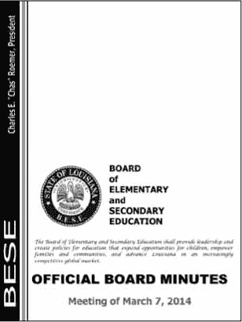

图 15-1：我们将从中提取文本的 PDF 页面

从[`nostarch.com/automatestuff2`](https://nostarch.com/automatestuff2/)下载此 PDF，并在交互 Shell 中输入以下内容：

```py
   >>> import PyPDF2
   >>> pdfFileObj = open('meetingminutes.pdf', 'rb')
   >>> pdfReader = PyPDF2.PdfFileReader(pdfFileObj)
   >>> pdfReader.numPages # ➊
   19
   >>> pageObj = pdfReader.getPage(0) # ➋
   >>> pageObj.extractText() # ➌
   'OOFFFFIICCIIAALL  BBOOAARRDD  MMIINNUUTTEESS   Meeting of March 7,
   2015        \n     The Board of Elementary and Secondary Education shall
   provide leadership and create policies for education that expand opportunities
   for children, empower families and communities, and advance Louisiana in an
   increasingly competitive global market. BOARD  of ELEMENTARY and  SECONDARY
   EDUCATION  '
   >>> pdfFileObj.close()
```

首先，导入`PyPDF2`模块。然后在读取二进制模式下打开`meetingminutes.pdf`并存储在`pdfFileObj`中。要获得代表这个 PDF 的`PdfFileReader`对象，调用`PyPDF2.PdfFileReader()`并传递它`pdfFileObj`。将这个`PdfFileReader`对象存储在`pdfReader`中。

文档的总页数存储在`PdfFileReader`对象 ➊ 的`numPages`属性中。示例 PDF 有 19 页，但是让我们只从第一页提取文本。

要从页面中提取文本，您需要从一个`PdfFileReader`对象中获取一个`Page`对象，它代表 PDF 的一个页面。您可以通过调用`PdfFileReader`对象上的`getPage()`方法 ➋ 并向其传递您感兴趣的页面的页码（在我们的示例中为 0）来获得`Page`对象。

PyPDF2 使用*从零开始的索引*来获取页面：第一页是第 0 页，第二页是第 1 页，以此类推。即使文档中的页码不同，情况也总是如此。例如，假设您的 PDF 是一份较长报告的三页摘录，其页码为 42、43 和 44。要获得这个文档的第一页，您可能希望调用`pdfReader.getPage(0)`，而不是`getPage(42)`或`getPage(1)`。

一旦你有了你的`Page`对象，调用它的`extractText()`方法来返回页面文本的字符串 ➌。文本提取并不完美：来自 PDF 的文本`Charles E. "Chas" Roemer，President`没有出现在`extractText()`返回的字符串中，并且有时会出现空格。尽管如此，这种近似的 PDF 文本内容对您的程序来说可能已经足够好了。

#### 解密 PDF

一些 PDF 文档有一个加密功能，在打开文档的人提供密码之前，这些文档不会被阅读。将以下内容与您下载的 PDF 一起输入交互式 shell，该文件已使用密码`rosebud`加密：

```py
   >>> import PyPDF2
   >>> pdfReader = PyPDF2.PdfFileReader(open('encrypted.pdf', 'rb'))
   >>> pdfReader.isEncrypted # ➊
   True
   >>> pdfReader.getPage(0)
   Traceback (most recent call last): # ➋
     File "<pyshell#173>", line 1, in <module>
       pdfReader.getPage()
     --snip--
     File "C:\Python34\lib\site-packages\PyPDF2\pdf.py", line 1173, in getObject
       raise utils.PdfReadError("file has not been decrypted")
   PyPDF2.utils.PdfReadError: file has not been decrypted
>>> pdfReader = PyPDF2.PdfFileReader(open('encrypted.pdf', 'rb'))
   >>> pdfReader.decrypt('rosebud') # ➌
   1
   >>> pageObj = pdfReader.getPage(0)
```

所有的`PdfFileReader`对象都有一个`isEncrypted`属性，如果 PDF 被加密则为`True`，如果没有被加密则为`False`➊。在用正确的密码解密文件之前，任何试图调用读取文件的函数都将导致错误 ➋。

> 注
>
> 由于 PyPDF2 版本 1.26.0 中的一个错误，在对加密的 PDF 调用`decrypt()`之前对其调用`getPage()`会导致将来的`getPage()`调用失败，并出现以下错误：“`IndexError`：列表索引超出范围”。这就是为什么我们的例子用一个新的`PdfFileReader`对象重新打开文件。

要读取加密的 PDF，调用`decrypt()`函数并以字符串 ➌ 的形式传递密码。当你用正确的密码调用`decrypt()`后，你会发现调用`getPage()`不再导致错误。如果给出了错误的密码，`decrypt()`函数将返回`0`并且`getPage()`将继续失败。注意，`decrypt()`方法只解密`PdfFileReader`对象，而不是实际的 PDF 文件。程序终止后，硬盘上的文件仍保持加密状态。下次运行时，你的程序将不得不再次调用`decrypt()`。

#### 创建 PDF

PyPDF2 对应`PdfFileReader`的是`PdfFileWriter`，可以新建 PDF 文件。但是 PyPDF2 不能像 Python 对纯文本文件那样将任意文本写入 PDF。相反，PyPDF2 的 PDF 编写功能仅限于从其他 PDF 复制页面、旋转页面、叠加页面和加密文件。

PyPDF2 不允许您直接编辑 PDF。相反，您必须创建一个新的 PDF，然后从现有文档中复制内容。本节中的示例将遵循这一通用方法：

1.  将一个或多个现有 PDF（源 PDF）打开到`PdfFileReader`对象中。
2.  创建一个新的`PdfFileWriter`对象。
3.  将页面从`PdfFileReader`对象复制到`PdfFileWriter`对象中。
4.  最后，使用`PdfFileWriter`对象编写输出 PDF。

创建一个`PdfFileWriter`对象只会创建一个用 Python 表示 PDF 文档的值。它不会创建实际的 PDF 文件。为此，您必须调用`PdfFileWriter`的`write()`方法。

`write()`方法采用一个在*写二进制*模式下打开的常规`File`对象。您可以通过使用两个参数调用 Python 的`open()`函数来获得这样一个`File`对象：您希望 PDF 的文件名是什么字符串，以及`'wb'`表示文件应该以写二进制模式打开。

如果这听起来有点混乱，不要担心，您将在下面的代码示例中看到这是如何工作的。

##### 复制页面

您可以使用 PyPDF2 将页面从一个 PDF 文档复制到另一个 PDF 文档。这允许您合并多个 PDF 文件、剪切不需要的页面或重新排序页面。

从下载`meetingminutes.pdf`和`meetingminutes2.pdf`，并将 PDF 文件放在当前工作目录下。在交互式 Shell 中输入以下内容：

```py
   >>> import PyPDF2
   >>> pdf1File = open('meetingminutes.pdf', 'rb')
   >>> pdf2File = open('meetingminutes2.pdf', 'rb')
   >>> pdf1Reader = PyPDF2.PdfFileReader(pdf1File) # ➊
   >>> pdf2Reader = PyPDF2.PdfFileReader(pdf2File) # ➋
   >>> pdfWriter = PyPDF2.PdfFileWriter() # ➌
   >>> for pageNum in range(pdf1Reader.numPages):
            pageObj = pdf1Reader.getPage(pageNum) # ➍
            pdfWriter.addPage(pageObj) # ➎
   >>> for pageNum in range(pdf2Reader.numPages):
            pageObj = pdf2Reader.getPage(pageNum) # ➍
            pdfWriter.addPage(pageObj) # ➎
   >>> pdfOutputFile = open('combinedminutes.pdf', 'wb') # ➏
   >>> pdfWriter.write(pdfOutputFile)
   >>> pdfOutputFile.close()
   >>> pdf1File.close()
   >>> pdf2File.close()
```

以读取二进制模式打开两个 PDF 文件，并将两个结果`File`对象存储在`pdf1File`和`pdf2File`中。调用`PyPDF2.PdfFileReader()`并传递`pdf1File`为`meetingminutes.pdf`➊ 获取一个`PdfFileReader`对象。再次调用它并传递它`pdf2File`来为`meetingminutes2.pdf`➋ 获得一个`PdfFileReader`对象。然后创建一个新的`PdfFileWriter`对象，它代表一个空白的 PDF 文档 ➌。

接下来，复制两个源 PDF 中的所有页面，并将它们添加到`PdfFileWriter`对象中。通过在一个`PdfFileReader`对象 ➍ 上调用`getPage()`来获得`Page`对象。然后将那个`Page`对象传递给你的`PdfFileWriter`的`addPage()`方法 ➎。首先对`pdf1Reader`执行这些步骤，然后对`pdf2Reader`再次执行这些步骤。当你复制完页面后，通过将一个`File`对象传递给`PdfFileWriter`的`write()`方法 ➏，编写一个名为`combinedminutes.pdf`的新 PDF。

> 注
>
> PyPDF2 不能在`PdfFileWriter`对象中间插入页面；`addPage()`方法只会将页面添加到末尾。

您现在已经创建了一个新的 PDF 文件，它将来自`meetingminutes.pdf`和`meetingminutes2.pdf`的页面合并成一个文档。记住，传递给`PyPDF2.PdfFileReader()`的`File`对象需要通过将`'rb'`作为第二个参数传递给`open()`以二进制读取模式打开。同样，传递给`PyPDF2.PdfFileWriter()`的`File`对象需要用`'wb'`以写二进制模式打开。

##### 旋转页面

PDF 的页面也可以用`rotateClockwise()`和`rotateCounterClockwise()`方法旋转 90 度。将整数`90`、`180`或`270`中的一个传递给这些方法。在交互 Shell 中输入以下内容，当前工作目录中有`meetingminutes.pdf`文件：

```py
   >>> import PyPDF2
   >>> minutesFile = open('meetingminutes.pdf', 'rb')
   >>> pdfReader = PyPDF2.PdfFileReader(minutesFile)
   >>> page = pdfReader.getPage(0) # ➊
   >>> page.rotateClockwise(90) # ➋
   {'/Contents': [IndirectObject(961, 0), IndirectObject(962, 0),
   --snip--
   }
   >>> pdfWriter = PyPDF2.PdfFileWriter()
   >>> pdfWriter.addPage(page)
   >>> resultPdfFile = open('rotatedPage.pdf', 'wb') # ➌
   >>> pdfWriter.write(resultPdfFile)
   >>> resultPdfFile.close()
   >>> minutesFile.close()
```

这里我们使用`getPage(0)`来选择 PDF 的第一页 ➊，然后我们在那个页面上调用`rotateClockwise(90)`➋。我们用旋转后的页面写一个新的 PDF，并保存为`rotatedPage.pdf`➌。

生成的 PDF 将有一页，顺时针旋转 90 度，如图图 15-2 所示。来自`rotateClockwise()`和`rotateCounterClockwise()`的返回值包含了很多你可以忽略的信息。

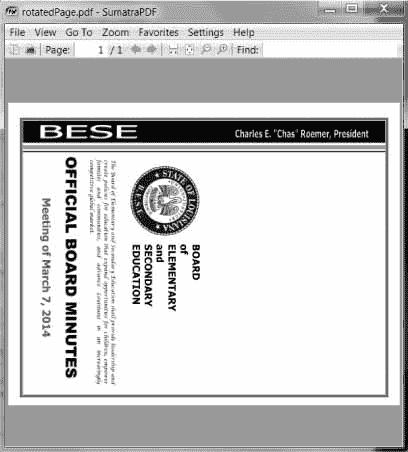

图 15-2：页面顺时针旋转 90 度的`rotatedPage.pdf`文件

##### 叠加页面

PyPDF2 还可以将一个页面的内容覆盖在另一个页面上，这对于向页面添加Logo、时间戳或水印非常有用。使用 Python，很容易将水印添加到多个文件中，并且只添加到程序指定的页面中。

从下载`watermark.pdf`，将 PDF 和`meetingminutes.pdf`放在当前工作目录下。然后在交互式 Shell 中输入以下内容：

```py
   >>> import PyPDF2
   >>> minutesFile = open('meetingminutes.pdf', 'rb')
   >>> pdfReader = PyPDF2.PdfFileReader(minutesFile) # ➊
   >>> minutesFirstPage = pdfReader.getPage(0) # ➋
   >>> pdfWatermarkReader = PyPDF2.PdfFileReader(open('watermark.pdf', 'rb')) # ➌
   >>> minutesFirstPage.mergePage(pdfWatermarkReader.getPage(0)) # ➍
   >>> pdfWriter = PyPDF2.PdfFileWriter() # ➎
   >>> pdfWriter.addPage(minutesFirstPage) # ➏
   >>> for pageNum in range(1, pdfReader.numPages): # ➐
           pageObj = pdfReader.getPage(pageNum)
           pdfWriter.addPage(pageObj)
   >>> resultPdfFile = open('watermarkedCover.pdf', 'wb')
   >>> pdfWriter.write(resultPdfFile)
   >>> minutesFile.close()
   >>> resultPdfFile.close()
```

这里我们给`meetingminutes.pdf`➊ 做一个`PdfFileReader`对象。我们调用`getPage(0)`来获取第一页的`Page`对象，并将该对象存储在`minutesFirstPage`➋ 中。然后我们为`watermark.pdf`➌ 制作一个`PdfFileReader`对象，并在`minutesFirstPage`上调用`mergePage()`➍。我们传递给`mergePage()`的参数是`watermark.pdf`第一页的`Page`对象。

现在我们已经在`minutesFirstPage`上调用了`mergePage()`，`minutesFirstPage`代表了带水印的第一页。我们制作一个`PdfFileWriter`对象 ➎ 并添加水印首页 ➏。然后我们遍历`meetingminutes.pdf`中的剩余页面，并将它们添加到对象 ➐ 中。最后，我们打开一个名为`watermarkedCover.pdf`的新 PDF，并将`PdfFileWriter`的内容写入新 PDF。

图 15-3 显示了结果。我们新的 PDF，`watermarkedCover.pdf`，包含所有内容，第一页是水印。

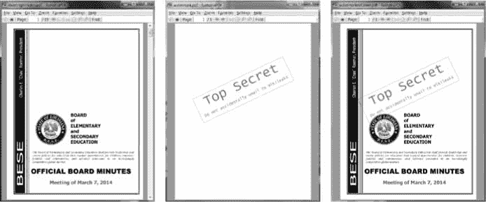

图 15-3：原始 PDF（左）、水印 PDF（中）和合并 PDF（右）

##### 加密 PDF 文件

一个`PdfFileWriter`对象也可以给 PDF 文档添加加密。在交互式 Shell 中输入以下内容：

```py
   >>> import PyPDF2
   >>> pdfFile = open('meetingminutes.pdf', 'rb')
   >>> pdfReader = PyPDF2.PdfFileReader(pdfFile)
   >>> pdfWriter = PyPDF2.PdfFileWriter()
   >>> for pageNum in range(pdfReader.numPages):
           pdfWriter.addPage(pdfReader.getPage(pageNum))
   >>> pdfWriter.encrypt('swordfish') # ➊
   >>> resultPdf = open('encryptedminutes.pdf', 'wb')
   >>> pdfWriter.write(resultPdf)
   >>> resultPdf.close()
```

在调用`write()`方法保存到文件之前，调用`encrypt()`方法，并向其传递一个密码字符串 ➊。PDF 可以有*用户密码*（允许您查看 PDF）和*所有者密码*（允许您设置打印、注释、提取文本和其他功能的权限）。用户密码和所有者密码分别是第一个和第二个参数到`encrypt()`。如果只有一个字符串参数传递给`encrypt()`，它将用于两个密码。

在这个例子中，我们将`meetingminutes.pdf`的页面复制到一个`PdfFileWriter`对象中。我们用密码`swordfish`加密了`PdfFileWriter`，打开一个名为`encryptedminutes.pdf`的新 PDF，将`PdfFileWriter`的内容写入新 PDF。在任何人可以查看`encryptedminutes.pdf`之前，他们必须输入这个密码。在确保副本被正确加密后，您可能想要删除原始的未加密的`meetingminutes.pdf`文件。

### 项目：合并从多个 PDF 中选择的页面

假设您有一项枯燥的工作，要将几十个 PDF 文档合并成一个 PDF 文件。他们每个人都有一个封面页作为首页，但你不希望封面页在最终结果中重复。尽管有很多免费的程序可以合并 PDF 文件，但是很多程序只是将整个文件合并在一起。让我们编写一个 Python 程序来定制在合并的 PDF 中需要哪些页面。

概括地说，下面是该程序将要做的事情：

1.  在当前工作目录中查找所有 PDF 文件。
2.  排序文件名，以便按顺序添加 PDF。
3.  将每个 PDF 的每一页（不包括第一页）写入输出文件。

就实现而言，您的代码需要完成以下工作：

1.  调用`os.listdir()`找到工作目录中的所有文件，并删除任何非 PDF 文件。
2.  调用 Python 的`sort()`列表方法来按字母顺序排列文件名。
3.  为输出 PDF 创建一个`PdfFileWriter`对象。
4.  循环每个 PDF 文件，为其创建一个`PdfFileReader`对象。
5.  循环每个 PDF 文件中的每一页（除了第一页）。
6.  将页面添加到输出 PDF。
7.  将输出的 PDF 文件写入名为`allminutes.pdf`的文件。

对于这个项目，打开一个新的文件编辑器选项卡，并将其保存为`combinePdfs.py`。

#### 第一步：找到所有 PDF 文件

首先，您的程序需要获得当前工作目录中所有带有`pdf`扩展名的文件列表，并排序它们。使您的代码看起来像下面这样：

```py
   #! python3
   # combinePdfs.py - Combines all the PDFs in the current working directory into
   # into a single PDF.
   import PyPDF2, os # ➊
   # Get all the PDF filenames.
   pdfFiles = []
   for filename in os.listdir('.'):
       if filename.endswith('.pdf'):
            pdfFiles.append(filename) # ➋
   pdfFiles.sort(key = str.lower) # ➌
   pdfWriter = PyPDF2.PdfFileWriter() # ➍
   # TODO: Loop through all the PDF files.
   # TODO: Loop through all the pages (except the first) and add them.
   # TODO: Save the resulting PDF to a file.
```

在 Shebang 行和关于程序功能的描述性注释之后，这段代码导入了`os`和`PyPDF2`模块 ➊。这个`os.listdir('.')`调用将返回当前工作目录中所有文件的列表。代码遍历这个列表，只添加那些带有`pdf`扩展名的文件到`pdfFiles`➋。之后，这个列表按照字母顺序排序，关键字参数从`key = str.lower`到`sort()`➌。

创建一个`PdfFileWriter`对象来保存组合的 PDF 页面 ➍。最后，一些注释概述了程序的其余部分。

#### 第二步：打开每个 PDF

现在程序必须读取`pdfFiles`中的每个 PDF 文件。将以下内容添加到您的程序中：

```py
#! python3
# combinePdfs.py - Combines all the PDFs in the current working directory into 
# a single PDF.
import PyPDF2, os
# Get all the PDF filenames.
pdfFiles = []
--snip--
# Loop through all the PDF files.
for filename in pdfFiles:
    pdfFileObj = open(filename, 'rb')
    pdfReader = PyPDF2.PdfFileReader(pdfFileObj)
    # TODO: Loop through all the pages (except the first) and add them.
# TODO: Save the resulting PDF to a file.
```

对于每个 PDF，循环通过调用`open()`并使用`'rb'`作为第二个参数，以读取二进制模式打开一个文件名。`open()`调用返回一个`File`对象，该对象被传递给`PyPDF2.PdfFileReader()`为该 PDF 文件创建一个`PdfFileReader`对象。

#### 第三步：添加各页面

对于每一个 PDF 文件，除了第一页之外，你需要循环浏览每一页。将此代码添加到您的程序中：

```py
#! python3
# combinePdfs.py - Combines all the PDFs in the current working directory into 
# a single PDF.
import PyPDF2, os
--snip--
# Loop through all the PDF files.
for filename in pdfFiles:
--snip--
     # Loop through all the pages (except the first) and add them.
     for pageNum in range(1, pdfReader.numPages): # ➊
         pageObj = pdfReader.getPage(pageNum)
         pdfWriter.addPage(pageObj)
# TODO: Save the resulting PDF to a file.
```

循环`for`中的代码将每个`Page`对象单独复制到`PdfFileWriter`对象中。记住，你要跳过第一页。因为 PyPDF2 认为`0`是第一页，所以您的循环应该从`1`➊ 开始，然后向上到`pdfReader.numPages`中的整数，但不包括该整数。

#### 第四步：保存结果

在这些嵌套的`for`循环结束后，`pdfWriter`变量将包含一个`PdfFileWriter`对象，其中包含所有 PDF 的页面。最后一步是将这些内容写入硬盘上的一个文件。将此代码添加到您的程序中：

```py
#! python3
# combinePdfs.py - Combines all the PDFs in the current working directory into 
# a single PDF.
import PyPDF2, os
--snip--
# Loop through all the PDF files.
for filename in pdfFiles:
--snip--
    # Loop through all the pages (except the first) and add them.
    for pageNum in range(1, pdfReader.numPages):
    --snip--
# Save the resulting PDF to a file.
pdfOutput = open('allminutes.pdf', 'wb')
pdfWriter.write(pdfOutput)
pdfOutput.close()
```

将`'wb'`传递到`open()`会以写入二进制模式打开输出 PDF 文件`allminutes.pdf`。然后，将产生的`File`对象传递给`write()`方法创建实际的 PDF 文件。对`close()`方法的调用结束了程序。

#### 类似程序的创意

能够从其他 PDF 的页面创建 PDF 将使您的程序能够执行以下操作：

*   从 PDF 中剪切特定页面。
*   重新排列 PDF 中的页面。
*   仅从由`extractText()`标识的具有特定文本的页面创建 PDF。

### Word 文档

Python 可以创建和修改 Word 文档，其中有`docx`文件扩展名，带有`docx`模块。可以通过运行`pip install --user -U python-docx==0.8.10`来安装模块。（附录 A 有安装第三方模块的全部细节。）

> 注
>
> 使用 PIP 首次安装 Python-Docx 时，一定要安装 Python-Docx ，而不是`docx`。包名`docx`是本书没有涉及的另一个模块。然而，当您打算从 Python-Docx 包中导入模块时，您需要运行`import docx`，而不是`import python-docx`。

如果你没有 Word，LibreOffice Writer 和 OpenOffice Writer 是 Windows、MacOS 和 Linux 的免费替代应用，可以用来打开`.docx`文件。可以分别从`www.libreoffice.org`和`openoffice.org`下载。Python-Docx 的完整文档可在`python-docx.readthedocs.io`获得。虽然有 Word 的 MacOS 版本，但本章将重点介绍 Windows 上的 Word。

相比纯文本，`docx`文件有很多结构。在 Python-Docx 中，这种结构由三种不同的数据类型表示。在最高层，`Document`对象代表整个文档。`Document`对象包含文档中段落的`Paragraph`对象列表。（每当用户在 Word 文档中键入时按下`ENTER`或`RETURN`就会开始一个新段落。）这些`Paragraph`对象中的每一个都包含一个或多个`Run`对象的列表。图 15-4 中的单句段落有四段。

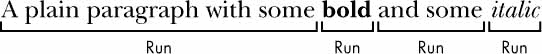

图 15-4：在段中确定的对象和对象

Word 文档中的文本不仅仅是一个字符串。它有与之相关的字体、大小、颜色和其他样式信息。Word 中的*样式*就是这些属性的集合。`Run`对象是具有相同样式的连续文本串。每当文本样式改变时，就需要一个新的`Run`对象。

#### 读取 Word 文档

让我们试验一下`docx`模块。从`nostarch.com/automatestuff2`下载`demo.docx`，并将文件保存到工作目录。然后在交互式 Shell 中输入以下内容：

```py
   >>> import docx
   >>> doc = docx.Document('demo.docx') # ➊
   >>> len(doc.paragraphs) # ➋
   7
   >>> doc.paragraphs[0].text # ➌
   'Document Title'
   >>> doc.paragraphs[1].text # ➍
   'A plain paragraph with some bold and some italic'
   >>> len(doc.paragraphs[1].runs) # ➎
   4
   >>> doc.paragraphs[1].runs[0].text # ➏
   'A plain paragraph with some '
   >>> doc.paragraphs[1].runs[1].text # ➐
   'bold'
   >>> doc.paragraphs[1].runs[2].text # ➑
   ' and some '
   >>> doc.paragraphs[1].runs[3].text # ➒
   'italic'
```

在 ➊，我们在 Python 中打开一个`.docx`文件，调用`docx.Document()`，传递文件名`demo.docx`。这将返回一个`Document`对象，它有一个`paragraphs`属性，这是一个`Paragraph`对象的列表。当我们在`doc.paragraphs`上调用`len()`时，它返回`7`，告诉我们这个文档 ➋ 中有七个`Paragraph`对象。这些`Paragraph`对象中的每一个都有一个`text`属性，该属性包含该段落中的文本字符串（没有样式信息）。这里，第一个`text`属性包含`'DocumentTitle'`➌，第二个包含`'A plain paragraph with some bold and some italic'`➍。

每个`Paragraph`对象还有一个`runs`属性，它是一个`Run`对象的列表。`Run`对象也有一个`text`属性，只包含特定运行中的文本。让我们看看第二个`Paragraph`对象`'A plain paragraph with some bold and some italic'`中的`text`属性。在这个`Paragraph`对象上调用`len()`告诉我们有四个`Run`对象 ➎。第一个运行对象包含`'A plain paragraph with some '`➏。然后，文本变成粗体，所以`'bold'`开始一个新的`Run`对象 ➐。此后，文本返回到未加框的样式，这产生了第三个`Run`对象，`' and some '`➑。最后，第四个也是最后一个`Run`对象包含斜体的`'italic'`➒。

使用 Python-Docx，您的 Python 程序现在将能够从`docx`文件中读取文本，并像使用任何其他字符串值一样使用它。

#### 从`docx`文件中获取全文

如果您只关心 Word 文档中的文本，而不是样式信息，您可以使用`getText()`函数。它接受`.docx`的文件名并返回其文本的单个字符串值。打开一个新的文件编辑器选项卡，输入以下代码，保存为`readDocx.py` :

```py
#! python3
import docx
def getText(filename):
    doc = docx.Document(filename)
    fullText = []
    for para in doc.paragraphs:
        fullText.append(para.text)
    return '\n'.join(fullText)
```

`getText()`函数打开 Word 文档，遍历`paragraphs`列表中的所有`Paragraph`对象，然后将它们的文本添加到`fullText`列表中。在循环之后，`fullText`中的字符串用换行符连接在一起。

`readDocx.py`程序可以像其他模块一样导入。现在，如果您只需要 Word 文档中的文本，您可以输入以下内容：

```py
>>> import readDocx
>>> print(readDocx.getText('demo.docx'))
Document Title
A plain paragraph with some bold and some italic
Heading, level 1
Intense quote
first item in unordered list
first item in ordered list
```

您也可以在返回字符串之前调整`getText()`来修改字符串。例如，要缩进每个段落，用下面的代码替换`readDocx.py`中的`append()`调用：

```py
fullText.append('  ' + para.text)
```

要在段落之间添加双倍空格，请将`join()`调用代码改为：

```py
return '\n\n'.join(fullText)
```

如您所见，只需要几行代码就可以编写读取`docx`文件的函数，并根据您的喜好返回其内容的字符串。

#### 排版段落和运行对象

在 Windows 上的 Word 中，可以通过按下`CTRL+ALT+SHIFT+S`显示样式窗格来查看样式，看起来就像图 15-5 。在 MacOS 上，你可以通过点击**查看 -> 样式**菜单项来查看样式面板。

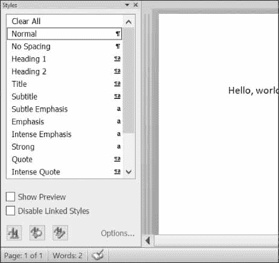

图 15-5：在 Windows 上按下`CTRL+ALT+SHIFT+S`显示样式窗格。

Word 和其他文字处理器使用样式来保持相似类型文本的视觉渲染一致并易于更改。例如，您可能希望将正文段落设置为 11 磅、Times New Roman、左对齐、右不齐的文本。您可以使用这些设置创建样式，并将其分配给所有正文段落。然后，如果您以后想要更改文档中所有正文段落的显示，您只需更改样式，所有这些段落都会自动更新。

对于 Word 文档，有三种样式：*段落样式*可应用于`Paragraph`对象，*字符样式*可应用于`Run`对象，*链接样式*可应用于两种对象。您可以通过将`Paragraph`和`Run`对象的`style`属性设置为一个字符串来赋予它们样式。这个字符串应该是一个样式的名称。如果`style`被设置为`None`，则没有样式与`Paragraph`或`Run`对象相关联。

默认单词样式的字符串值如下：

| | | | |
| --- | --- | --- | --- |
| `'Normal'`，`'Body Text'`，`'Body Text 2'`，`'Body Text 3'`，`'Caption'`，`'Heading 1'`，`'Heading 2'`，`'Heading 3'`，`'Heading 4'` | `'Heading 5'`，`'Heading 6'`，`'Heading 7'`，`'Heading 8'`，`'Heading 9'`，`'Intense Quote'`，`'List'`，`'List 2'`，`'List 3'` | `'List Bullet'`，`'List Bullet 2'`，`'List Bullet 3'`，`'List Continue'`，`'List Continue 2'`，`'List Continue 3'`，`'List Number '`，`'List Number 2'`，`'List Number 3'` | `'List Paragraph'`，`'MacroText'`，`'No Spacing'`，`'Quote'`，`'Subtitle'`，`'TOC Heading'`，`'Title'` |

当对`Run`对象使用链接样式时，您需要在其名称的末尾添加`' Char'`。例如，要为一个`Paragraph`对象设置引用链接样式，您可以使用`paragraphObj.style = 'Quote'`，但是对于一个`Run`对象，您可以使用`runObj.style = 'Quote Char'`。

在当前版本的 Python-Docx（0.8.10）中，唯一可以使用的样式是默认的 Word 样式和打开的`docx`中的样式。不能创建新的样式——尽管这在 Python-Docx 的未来版本中可能会有所改变。

#### 创建无默认样式的 Word 文档

如果您想创建使用默认样式之外的样式的 Word 文档，您需要打开 Word 到一个空白的 Word 文档，并通过单击样式窗格底部的**新样式**按钮自己创建样式（图 15-6 在 Windows 上显示了这一点）。

这将打开“从格式创建新样式”对话框，您可以在其中输入新样式。然后，返回交互式 shell，用`docx.Document()`打开这个空白的 Word 文档，将其作为 Word 文档的基础。您为这种样式指定的名称现在可以用于 Python-Docx。

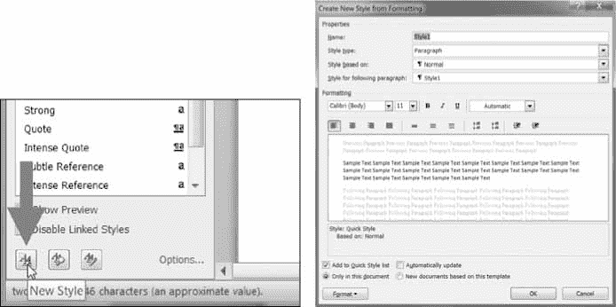

图 15-6：新建样式按钮（左）和从格式对话框创建新样式（右）

#### 运行属性

可以使用`text`属性进一步设计运行。每个属性都可以设置为以下三个值之一：`True`（无论将什么其他样式应用于该梯段，该属性始终处于启用状态）、`False`（该属性始终处于禁用状态）或`None`（默认为该梯段的样式设置）。

表 15-1 列出了可以在`Run`对象上设置的`text`属性。

**表 15-1**： 运行对象文本属性


| **属性** | **描述** |
| --- | --- |
| `bold` | 文本以粗体显示。 |
| `italic` | 文本以斜体显示。 |
| `underline` | 文本带有下划线。 |
| `strike` | 文本带有删除线。 |
| `double_strike` | 文本带有双删除线。 |
| `all_caps` | 文本以大写字母出现。 |
| `small_caps` | 文本以大写字母显示，小写字母比它小两号。 |
| `shadow` | 文本带有阴影。 |
| `outline` | 文本显示为轮廓而非实线。 |
| `rtl` | 文本从右向左书写。 |
| `imprint` | 文本看起来被压入页面。 |
| `emboss` | 文本以浮雕形式从页面上凸起。 |

例如，要更改`demo.docx`的样式，请在交互式 Shell 中输入以下内容：

```py
>>> import docx
>>> doc = docx.Document('demo.docx')
>>> doc.paragraphs[0].text
'Document Title'
>>> doc.paragraphs[0].style # The exact id may be different:
_ParagraphStyle('Title') id: 3095631007984
>>> doc.paragraphs[0].style = 'Normal'
>>> doc.paragraphs[1].text
'A plain paragraph with some bold and some italic'
>>> (doc.paragraphs[1].runs[0].text, doc.paragraphs[1].runs[1].text, doc.
paragraphs[1].runs[2].text, doc.paragraphs[1].runs[3].text)
('A plain paragraph with some ', 'bold', ' and some ', 'italic')
>>> doc.paragraphs[1].runs[0].style = 'QuoteChar'
>>> doc.paragraphs[1].runs[1].underline = True
>>> doc.paragraphs[1].runs[3].underline = True
>>> doc.save('restyled.docx')
```

这里，我们使用`text`和`style`属性来轻松地查看文档段落中的内容。我们可以看到，将一个段落划分为多个游程并单独访问每个游程是很简单的。所以我们在第二段得到了第一、第二和第四次运行；每次跑步的风格；并将结果保存到新文档中。

在`restyled.docx`顶部的单词*文档标题*将具有普通样式而不是标题样式，用于文本的`Run`对象（带有一些普通段落）将具有`QuoteChar`样式，用于单词`bold`和`italic`的两个`Run`对象的`underline`属性将被设置为`True`。图 15-7 显示了`restyled.docx`中段落和段落的样式。

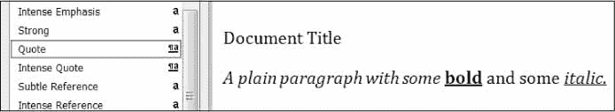

图 15-7：`restyled.docx`文件

你可以在`python-docx.readthe docs.io/en/latest/user/styles.html`找到关于 Python-Docx 使用样式的更完整的文档。

#### 编写 Word 文档

在交互式 Shell 中输入以下内容：

```py
>>> import docx
>>> doc = docx.Document()
>>> doc.add_paragraph('Hello, world!')
<docx.text.Paragraph object at 0x0000000003B56F60>
>>> doc.save('helloworld.docx')
```

打造自己的`docx`文件，调用`docx.Document()`返回一个新的空白 Word `Document`对象。`add_paragraph()`文档方法向文档中添加一段新的文本，并返回对添加的`Paragraph`对象的引用。添加完文本后，将文件名字符串传递给`save()`文档方法，将`Document`对象保存到文件中。

这将在当前工作目录下创建一个名为`helloworld.docx`的文件，打开后，看起来像图 15-8 。

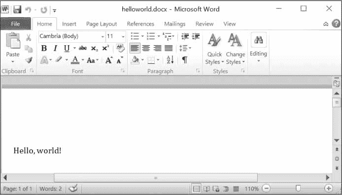

图 15-8：使用`add_paragraph('Hello, world!')`创建的 Word 文档

你可以用新段落的文本再次调用`add_paragraph()`方法来添加段落。或者将文本添加到现有段落的末尾，您可以调用该段落的`add_run()`方法并向其传递一个字符串。在交互式 Shell 中输入以下内容：

```py
>>> import docx
>>> doc = docx.Document()
>>> doc.add_paragraph('Hello world!')
<docx.text.Paragraph object at 0x000000000366AD30>
>>> paraObj1 = doc.add_paragraph('This is a second paragraph.')
>>> paraObj2 = doc.add_paragraph('This is a yet another paragraph.')
>>> paraObj1.add_run(' This text is being added to the second paragraph.')
<docx.text.Run object at 0x0000000003A2C860>
>>> doc.save('multipleParagraphs.docx')
```

生成的文档将看起来如图 15-9 所示。注意文本`' This text is being added to the second paragraph.'`，添加到了`paraObj1`中的`Paragraph`对象。是添加到的`doc`的第二段。`add_paragraph()`和`add_run()`函数分别返回段落和`Run`对象，省去了单独提取它们的麻烦。

请记住，从 Python-Docx 版本 0.8.10 开始，新的`Paragraph`对象只能添加到文档的末尾，新的`Run`对象只能添加到`Paragraph`对象的末尾。

可以再次调用`save()`方法`called`来保存您所做的额外更改。

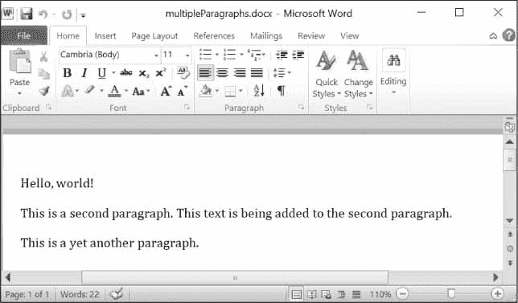

图 15-9：添加了多个段落和运行对象的文档

`add_paragraph()`和`add_run()`都接受可选的第二个参数，它是`Paragraph`或`Run`对象样式的字符串。这里有一个例子：

```py
>>> doc.add_paragraph('Hello, world!', 'Title')
```

这一行使用标题风格添加了一段文字`'Hello, world!'`。

#### 添加标题

调用`add_heading()`添加一个带有其中一种标题样式的段落。在交互式 Shell 中输入以下内容：

```py
>>> doc = docx.Document()
>>> doc.add_heading('Header 0', 0)
<docx.text.Paragraph object at 0x00000000036CB3C8>
>>> doc.add_heading('Header 1', 1)
<docx.text.Paragraph object at 0x00000000036CB630>
>>> doc.add_heading('Header 2', 2)
<docx.text.Paragraph object at 0x00000000036CB828>
>>> doc.add_heading('Header 3', 3)
<docx.text.Paragraph object at 0x00000000036CB2E8>
>>> doc.add_heading('Header 4', 4)
<docx.text.Paragraph object at 0x00000000036CB3C8>
>>> doc.save('headings.docx')
```

`add_heading()`的参数是标题文本的字符串和从`0`到`4`的整数。整数`0`使标题成为标题样式，用于文档的顶部。整数`1`到`4`代表不同的标题级别，`1`为主标题，`4`为最低子标题。`add_heading()`函数返回一个`Paragraph`对象，为您省去从`Document`对象中单独提取的步骤。

产生的`headings.docx`文件将看起来像图 15-10 。

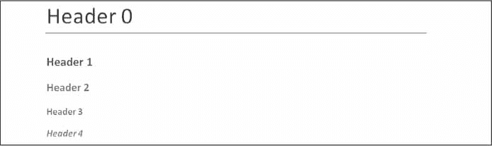

图 15-10：标题为 0 到 4 的`headings.docx`文档

#### 添加换行和分页符

要添加一个换行符（而不是开始一个全新的段落），您可以在您希望换行符出现在其后的`Run`对象上调用`add_break()`方法。如果您想添加一个分页符，您需要将值`docx.enum.text.WD_BREAK.PAGE`作为一个单独的参数传递给`add_break()`，就像下面的例子中间所做的那样：

```py
   >>> doc = docx.Document()
   >>> doc.add_paragraph('This is on the first page!')
   <docx.text.Paragraph object at 0x0000000003785518>
   >>> doc.paragraphs[0].runs[0].add_break(docx.enum.text.WD_BREAK.PAGE) # ➊
   >>> doc.add_paragraph('This is on the second page!')
   <docx.text.Paragraph object at 0x00000000037855F8>
   >>> doc.save('twoPage.docx')
```

这将创建一个两页的 Word 文档，其中`This is on the first page!`在第一页`This is on the second page!`在第二个。尽管在第一页的正文之后还有很多空间，我们通过在第一段的第一次运行后插入分页符 ➊，强制下一段在新的一页开始。

#### 添加图片

`Document`对象有一个`add_picture()`方法，可以让你在文档的末尾添加一个图像。假设您在当前工作目录中有一个文件`zophie.png`。通过输入以下内容，您可以在文档末尾添加宽度为 1 英寸、高度为 4 厘米（Word 可以使用英制和公制单位）的`zophie.png`:

```py
>>> doc.add_picture('zophie.png', width=docx.shared.Inches(1),
height=docx.shared.Cm(4))
<docx.shape.InlineShape object at 0x00000000036C7D30>
```

第一个参数是图像文件名的字符串。可选的`width`和`height`关键字参数将设置文档中图像的宽度和高度。如果忽略，宽度和高度将默认为图像的正常大小。

您可能更喜欢用熟悉的单位指定图像的高度和宽度，比如英寸和厘米，所以在指定`width`和`height`关键字参数时，您可以使用`docx.shared.Inches()`和`docx.shared.Cm()`函数。

### 从 Word 文档创建 PDF

PyPDF2 模块不允许您直接创建 PDF 文档，但是如果您使用的是 Windows 并且安装了 Microsoft Word，则有一种方法可以使用 Python 生成 PDF 文件。您需要通过运行`pip install --user -U pywin32==224`来安装 Pywin32 包。使用这个模块和`docx`模块，您可以创建 Word 文档，然后使用下面的脚本将它们转换成 PDF。

打开一个新的文件编辑器标签，输入以下代码，保存为`convertworttopdf.py`:

```py
# This script runs on Windows only, and you must have Word installed.
import win32com.client # install with "pip install pywin32==224"
import docx
wordFilename = 'your_word_document.docx'
pdfFilename = 'your_pdf_filename.pdf'
doc = docx.Document()
# Code to create Word document goes here.
doc.save(wordFilename)
wdFormatPDF = 17 # Word's numeric code for PDFs.
wordObj = win32com.client.Dispatch('Word.Application')
docObj = wordObj.Documents.Open(wordFilename)
docObj.SaveAs(pdfFilename, FileFormat=wdFormatPDF)
docObj.Close()
wordObj.Quit()
```

要编写一个用您自己的内容生成 PDF 的程序，您必须使用`docx`模块创建一个 Word 文档，然后使用 Pywin32 包的`win32com.client`模块将其转换为 PDF。用`docx`函数调用替换`# Code to create Word document goes here.`注释，在 Word 文档中为 PDF 创建您自己的内容。

这似乎是一种复杂的生成 PDF 的方式，但事实证明，专业软件解决方案通常同样复杂。

### 总结

文本信息不仅仅适用于纯文本文件；事实上，您很可能会更频繁地处理 PDF 和 Word 文档。可以使用`PyPDF2`模块读写 PDF 文档。不幸的是，由于复杂的 PDF 文件格式，从 PDF 文档中读取文本可能并不总是能够完美地转换为字符串，有些 PDF 可能根本不可读。在这种情况下，除非 PyPDF2 的未来更新支持额外的 PDF 功能，否则您就不走运了。

Word 文档比较靠谱，可以用`python-docx`包的`docx`模块来读。您可以通过`Paragraph`和`Run`对象操作 Word 文档中的文本。这些对象也可以被赋予样式，尽管它们必须来自默认的样式集或文档中已经存在的样式。您可以在文稿中添加新的段落、标题、分页符和图片，但只能添加到结尾。

使用 PDF 和 Word 文档的许多限制是因为这些格式是为了更好地显示给读者，而不是让软件容易解析。下一章将介绍另外两种常见的信息存储格式：JSON 和 CSV 文件。这些格式是为计算机设计的，您将看到 Python 可以更轻松地处理这些格式。

### 练习题

1.  PDF 文件名的字符串值是传递给`PyPDF2.PdfFileReader()`函数吗。你传递给函数的是什么呢？

2.  `PdfFileReader()`和`PdfFileWriter()`的`File`对象需要在什么模式下打开？

3.  你如何从一个`PdfFileReader`对象中为第 5 页获取一个`Page`对象？

4.  哪个`PdfFileReader`变量存储 PDF 文档的页数？

5.  如果一个`PdfFileReader`对象的 PDF 是用密码`swordfish`加密的，你必须做什么才能从中获得`Page`对象？

6.  你用什么方法旋转页面？

7.  什么方法为名为`demo.docx`的文件返回一个`Document`对象？

8.  `Paragraph`对象和`Run`对象有什么区别？

9.  如何获得一个存储在名为`doc`的变量中的`Document`对象的`Paragraph`对象列表？

0.  什么类型的对象有`bold`、`underline`、`italic`、`strike`和`outline`变量？

1.  将`bold`变量设置为`True`、`False`或`None`有什么区别？

2.  如何为一个新的 Word 文档创建一个`Document`对象？

3.  如何将文本为`'Hello, there!'`的段落添加到存储在名为`doc`的变量中的`Document`对象中？

4.  哪些整数代表 Word 文档中可用的标题级别？

### 实践项目

为了练习，编写执行以下操作的程序。

#### PDF 偏执狂

使用第 10 章的中的`os.walk()`函数，编写一个脚本，该脚本将检查文件夹（及其子文件夹）中的每个 PDF，并使用命令行中提供的密码加密 PDF。保存每个加密的 PDF，在原始文件名后添加一个`_encrypted.pdf`后缀。在删除原始文件之前，让程序尝试读取并解密该文件，以确保它被正确加密。

然后，编写一个程序，查找文件夹（及其子文件夹）中的所有加密 PDF，并使用提供的密码创建 PDF 的解密副本。如果密码不正确，程序应该向用户打印一条消息，并继续下一个 PDF。

#### 自定义请柬为 Word 文档

假设您有一个客人姓名的文本文件。这个`guests.txt`文件每行有一个名称，如下所示：

```py
Prof. Plum
Miss Scarlet
Col. Mustard
Al Sweigart
RoboCop
```

编写一个程序，生成一个带有自定义邀请的 Word 文档，看起来像图 15-11 。

因为 Python-Docx 只能使用 Word 文档中已经存在的样式，所以您必须先将这些样式添加到一个空白的 Word 文件中，然后用 Python-Docx 打开该文件。在生成的 Word 文档中，每页应该有一个邀请，所以调用`add_break()`在每个邀请的最后一段后添加一个分页符。这样，您只需要打开一个 Word 文档就可以一次打印所有的邀请。

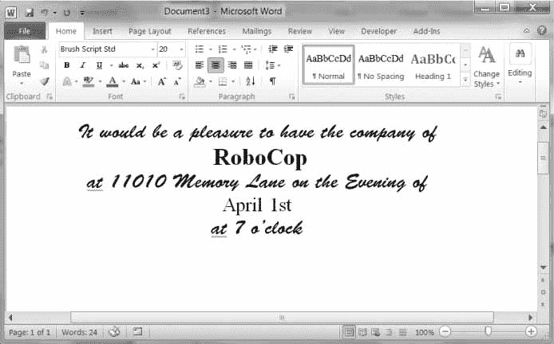

图 15-11：您的自定义邀请脚本生成的 Word 文档

你可以从[`nostarch.com/automatestuff2`](https://nostarch.com/automatestuff2/)下载一个样本`guests.txt`文件。

#### 暴力破解 PDF 密码

假设您有一个加密的 PDF 文件，但您忘记了它的密码，但您记得它是一个英语单词。试图猜出你忘记的密码是一件很无聊的事情。相反，你可以编写一个程序，通过尝试每一个可能的英语单词来解密 PDF，直到找到一个有效的单词。这被称为*暴力破解密码攻击*。从`nostarch.com/automatestuff2`下载文本文件`dictionary.txt`。这个*字典文件*包含超过 44,000 个英语单词，每行一个单词。

使用你在第 9 章中学到的文件读取技巧，通过阅读这个文件创建一个单词串列表。然后遍历列表中的每个单词，将其传递给`decrypt()`方法。如果这个方法返回整数`0`，密码是错误的，你的程序应该继续下一个密码。如果`decrypt()`返回`1`，那么你的程序应该会跳出循环，打印出被黑的密码。你应该尝试每个单词的大写和小写形式。（在我的笔记本电脑上，浏览字典文件中的所有 88,000 个大写和小写单词需要几分钟时间。这就是为什么你不应该使用一个简单的英语单词作为你的密码。）