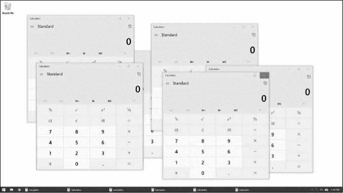

# 17 保持时间、安排任务和启动程序

> 原文：<https://automatetheboringstuff.com/2e/chapter17/>


坐在电脑前运行程序是没问题的，但让程序在没有你直接监督的情况下运行也很有用。您计算机的时钟可以安排程序在某个指定的时间和日期或定期运行代码。例如，你的程序可以每小时抓取一个网站来检查变化，或者在你睡觉的时候在凌晨 4 点`做一个 CPU 密集型的任务。Python 的`time`和`datetime`模块提供了这些功能。`

通过使用`subprocess`和`threading`模块，您还可以编写按计划启动其他程序的程序。通常，最快的编程方式是利用他人已经编写的应用程序。

### 时间模块

您计算机的系统时钟被设置为特定的日期、时间和时区。内置的`time`模块允许您的 Python 程序读取当前时间的系统时钟。`time.time()`和`time.sleep()`功能在`time`模块中最有用。

#### time . time()函数

*Unix epoch* 是编程中常用的时间基准:协调世界时(UTC)1970 年 1 月 1 日上午 12`。`time.time()`函数以浮点值的形式返回从那时起的秒数。(回想一下，float 只是一个带小数点的数字。)这个数字被称为*纪元时间戳*。例如，在交互式 shell 中输入以下内容:`

```py
>>> import time

>>> time.time()

1543813875.3518236
```

这里我打电话`time.time()`2018 年 12 月 2 日，太平洋标准时间`晚上`9:11。返回值是从 Unix epoch 到调用`time.time()`之间经过了多少秒。

纪元时间戳可以用来*分析*代码，也就是说，测量一段代码运行需要多长时间。如果您在想要测量的代码块的开头调用`time.time()`，并在结尾再次调用，那么您可以从第二个时间戳中减去第一个时间戳，以得到这两次调用之间所用的时间。例如，打开一个新的文件编辑器选项卡并输入以下程序:

```py
    import time

   def calcProd(): # ➊

       # Calculate the product of the first 100,000 numbers.

       product = 1

       for i in range(1, 100000):

           product = product * i

       return product

   startTime = time.time() # ➋

   prod = calcProd()

   endTime = time.time() # ➌

   print('The result is %s digits long.' % (len(str(prod)))) # ➍

   print('Took %s seconds to calculate.' % (endTime - startTime)) # ➎
```

在 ➊ ，我们定义了一个函数`calcProd()`来遍历从 1 到 99999 的整数，并返回它们的乘积。在 ➋ ，我们调用`time.time()`并存储在`startTime`中。就在调用`calcProd()`之后，我们再次调用`time.time()`并将其存储在`endTime` ➌ 中。我们通过打印由`calcProd()` ➍ 返回的产品的长度和运行`calcProd()` ➎ 花费的时间来结束。

将该程序另存为 `calcProd.py` 并运行。输出将如下所示:

```py
The result is 456569 digits long.

Took 2.844162940979004 seconds to calculate.
```

**注**

*另一种分析代码的方法是使用 cProfile.run() 函数，它比简单的 time.time() 技术提供了更多的细节信息。 cProfile.run() 函数在[`docs.python.org/3/library/profile.html`](https://docs.python.org/3/library/profile.html)中解释。

来自`time.time()`的返回值是有用的，但是不可读。`time.ctime()`函数返回当前时间的字符串描述。您也可以选择传递从 Unix 纪元以来的秒数，如由`time.time()`返回的，以获得那个时间的字符串值。在交互式 shell 中输入以下内容:

```py
>>> import time

>>> time.ctime()

'Mon Jun 15 14:00:38 2020'

>>> thisMoment = time.time()

>>> time.ctime(thisMoment)

'Mon Jun 15 14:00:45 2020'
```

#### time . sleep()函数

如果你需要暂停你的程序一段时间，调用`time.sleep()`函数并传递你希望程序暂停的秒数。在交互式 shell 中输入以下内容:

```py
   >>> import time

   >>> for i in range(3):

           print('Tick') # ➊

           time.sleep(1) # ➋

           print('Tock') # ➌

           time.sleep(1) # ➍

   Tick

   Tock

   Tick

   Tock

   Tick

   Tock

   >>> time.sleep(5) # ➎
```

`for`循环将打印`Tick` ➊ ，暂停 1 秒 ➋ ，打印`Tock` ➌ ，暂停 1 秒 ➍ ，打印`Tick`，暂停，以此类推，直到`Tick`和`Tock`各打印三次。

`time.sleep()`函数将*阻塞*——也就是说，它不会返回并释放你的程序来执行其他代码——直到你传递给`time.sleep()`的秒数过去之后。例如，如果您输入`time.sleep(5)` ➎ ，您会看到下一个提示(`>>>`)直到 5 秒后才会出现。

### 舍入数字

处理时间时，您经常会遇到小数点后有很多位数的浮点值。为了使这些值更容易处理，您可以使用 Python 的内置`round()`函数来缩短它们，该函数将浮点数舍入到您指定的精度。只需传入您想要舍入的数字，加上可选的第二个参数，表示您想要舍入到小数点后多少位。如果省略第二个参数，`round()`会将数字舍入到最接近的整数。在交互式 shell 中输入以下内容:

```py
>>> import time

>>> now = time.time()

>>> now

1543814036.6147408

>>> round(now, 2)

1543814036.61

>>> round(now, 4)

1543814036.6147

>>> round(now)

1543814037
```

在导入`time`并将`time.time()`存储到`now`后，我们调用`round(now, 2)`将`now`四舍五入到小数点后两位，`round(now, 4)`四舍五入到小数点后四位，`round(now)`四舍五入到最接近的整数。

### 项目:超级秒表

假设你想记录你在那些你还没有自动化的无聊任务上花了多少时间。你没有实体秒表，而且为你的笔记本电脑或智能手机找到一个免费的秒表应用程序是令人惊讶的困难，它没有广告，也不会向营销人员发送你的浏览器历史记录的副本。(你同意的许可协议里说可以这么做。你确实读了许可协议，不是吗？)你可以自己用 Python 写一个简单的秒表程序。

概括地说，下面是您的程序要做的事情:

1.  跟踪按下 `ENTER` 键之间经过的时间，每次按键都会在计时器上开始一个新的“圈”。
2.  打印圈数、总时间和圈数。

这意味着你的代码需要做以下事情:

1.  通过调用`time.time()`找到当前时间，并在程序开始时以及每圈开始时将其存储为时间戳。
2.  保持一个计圈器，并且每当用户按下 `ENTER` 时递增计圈器。
3.  通过减去时间戳计算经过的时间。
4.  处理`KeyboardInterrupt`异常，这样用户可以按下 `CTRL` -C 退出。

打开一个新的文件编辑器标签，并将其保存为 `stopwatch.py` 。

#### 第一步:设置程序跟踪时间

秒表程序需要使用当前时间，所以您需要导入`time`模块。你的程序还应该在调用`input()`之前给用户打印一些简短的指令，这样用户按下`回车`后定时器就可以开始计时了。然后代码将开始跟踪圈速。

在文件编辑器中输入以下代码，编写一个`TODO`注释作为其余代码的占位符:

```py
#! python3

# stopwatch.py - A simple stopwatch program.

import time

# Display the program's instructions.

print('Press ENTER to begin. Afterward, press ENTER to "click" the stopwatch.

Press Ctrl-C to quit.')

input()                    # press Enter to begin

print('Started.')

startTime = time.time()    # get the first lap's start time

lastTime = startTime

lapNum = 1

# TODO: Start tracking the lap times.
```

现在我们已经编写了显示指令的代码，开始第一圈，记下时间，并将圈数设置为 1。

#### 第二步:跟踪并打印圈速

现在让我们编写代码来开始每一个新的圈，计算前一个圈用了多长时间，并计算从启动秒表以来经过的总时间。我们将显示每圈时间和总时间，并增加每圈的圈数。将以下代码添加到您的程序中:

```py
   #! python3

   # stopwatch.py - A simple stopwatch program.

   import time

   --snip--

   # Start tracking the lap times.

   try: # ➊

       while True: # ➋

        input()

           lapTime = round(time.time() - lastTime, 2) # ➌

           totalTime = round(time.time() - startTime, 2) # ➍

           print('Lap #%s: %s (%s)' % (lapNum, totalTime, lapTime), end='') # ➎

           lapNum += 1

           lastTime = time.time() # reset the last lap time

   except KeyboardInterrupt: # ➏

       # Handle the Ctrl-C exception to keep its error message from displaying.

       print('\nDone.')
```

如果用户按下 `CTRL` -C 停止秒表，则会引发`KeyboardInterrupt`异常，如果执行的不是`try`语句，程序就会崩溃。为了防止崩溃，我们将程序的这一部分包装在一个`try`语句 ➊ 中。我们将在`except`子句 ➏ 中处理异常，因此当 `CTRL` -C 被按下并且异常被引发时，程序执行移动到 except 子句以打印`Done`，而不是`KeyboardInterrupt`错误消息。直到这种情况发生，执行是在一个无限循环 ➋ 内，调用`input()`并等待直到用户按下`回车`结束一圈。当一圈结束时，我们通过从当前时间`time.time()` ➌ 中减去该圈的开始时间`lastTime`来计算该圈花费的时间。我们通过从当前时间 ➍ 中减去秒表的总开始时间`startTime`来计算总时间。

由于这些时间计算的结果在小数点后会有很多位(如`4.766272783279419`)，我们使用`round()`函数在 ➌ 和 ➍ 将浮点值四舍五入到两位数。

在 ➎ ，我们打印出圈数、总时间和圈速。因为用户按下`回车键`调用`input()`会在屏幕上打印一个新行，所以将`end=''`传递给`print()`函数以避免双倍输出。打印完圈数信息后，我们将计数`lapNum`加 1，并将`lastTime`设置为当前时间，即下一圈的开始时间，为下一圈做准备。

#### 类似节目的创意

时间跟踪为你的程序打开了几种可能性。虽然你可以下载应用程序来做这些事情，但自己编写程序的好处是它们将是免费的，不会充斥着广告和无用的功能。您可以编写类似的程序来完成以下任务:

*   创建一个简单的时间表应用程序，记录您何时键入某人的姓名，并使用当前时间来记录他们的上下班时间。
*   向您的程序添加一个特性来显示自一个进程开始以来所经过的时间，例如使用`requests`模块的下载。(参见第十二章。)
*   间歇地检查一个程序已经运行了多长时间，并给用户一个机会取消耗时太长的任务。

### 日期时间模块

`time`模块对于获取 Unix epoch 时间戳非常有用。但是如果您想以更方便的格式显示日期，或者用日期进行算术运算(例如，计算出 205 天前的日期或者 123 天后的日期)，您应该使用`datetime`模块。

`datetime`模块有自己的`datetime`数据类型。`datetime`数值代表特定的时刻。在交互式 shell 中输入以下内容:

```py
   >>> import datetime

   >>> datetime.datetime.now() # ➊

   datetime.datetime(2019, 2, 27, 11, 10, 49, 55, 53) # ➋

   >>> dt = datetime.datetime(2019, 10, 21, 16, 29, 0) # ➌

   >>> dt.year, dt.month, dt.day # ➍

   (2019, 10, 21)

   >>> dt.hour, dt.minute, dt.second # ➎

   (16, 29, 0)
```

调用`datetime.datetime.now()` ➊ 返回一个`datetime`对象 ➋ 根据你计算机的时钟返回当前的日期和时间。该对象包括当前时刻的年、月、日、小时、分钟、秒和微秒。您还可以通过使用`datetime.datetime()`函数 ➌ 来检索某个特定时刻的`datetime`对象，向其传递表示年、月、日、时和您想要的时刻的整数。这些整数将存储在`datetime`对象的`year`、`month`、`day`、【➍】、`hour`、`minute`、、属性中。

可以用`datetime.datetime.fromtimestamp()`函数将 Unix epoch 时间戳转换成一个`datetime`对象。`datetime`对象的日期和时间将被转换为当地时区。在交互式 shell 中输入以下内容:

```py
>>> import datetime, time

>>> datetime.datetime.fromtimestamp(1000000)

datetime.datetime(1970, 1, 12, 5, 46, 40)

>>> datetime.datetime.fromtimestamp(time.time())

datetime.datetime(2019, 10, 21, 16, 30, 0, 604980)
```

调用`datetime.datetime.fromtimestamp()`并传递它`1000000`返回 Unix 纪元后 1，000，000 秒的一个`datetime`对象。传递当前时刻的 Unix 纪元时间戳`time.time()`，返回当前时刻的`datetime`对象。所以表达式`datetime.datetime.now()`和`datetime.datetime.fromtimestamp(time.time())`做同样的事情；他们都给你一个当前的对象。

您可以使用比较运算符将`datetime`对象相互比较，以找出哪一个在另一个之前。后面的`datetime`对象是“更大”的值。在交互式 shell 中输入以下内容:

```py
   >>> halloween2019 = datetime.datetime(2019, 10, 31, 0, 0, 0) # ➊

   >>> newyears2020 = datetime.datetime(2020, 1, 1, 0, 0, 0) # ➋

   >>> oct31_2019 = datetime.datetime(2019, 10, 31, 0, 0, 0)

   >>> halloween2019 == oct31_2019 # ➌

   True

   >>> halloween2019 > newyears2020 # ➍

   False

   >>> newyears2020 > halloween2019 # ➎

   True

   >>> newyears2020 != oct31_2019

   True
```

为 2019 年 10 月 31 日的第一时刻(午夜)制作一个`datetime`对象，存储在`halloween2019` ➊ 中。制作一个 2020 年 1 月 1 日第一时刻的`datetime`对象，存储在`newyears2020` ➋ 中。然后为 2019 年 10 月 31 日午夜再做一个对象，存放在`oct31_2019`。比较`halloween2019`和`oct31_2019`显示它们相等 ➌ 。比较`newyears2020`和`halloween2019`可知`newyears2020`大于`halloween2019`➎。

#### time delta 数据类型

`datetime`模块还提供了一个`timedelta`数据类型，它表示时间的*持续时间*，而不是时间上的*时刻*。在交互式 shell 中输入以下内容:

```py
   >>> delta = datetime.timedelta(days=11, hours=10, minutes=9, seconds=8) # ➊

   >>> delta.days, delta.seconds, delta.microseconds # ➋

   (11, 36548, 0)

   >>> delta.total_seconds()

   986948.0

   >>> str(delta)

   '11 days, 10:09:08'
```

要创建一个`timedelta`对象，使用`datetime.timedelta()`函数。`datetime.timedelta()`函数接受关键字参数`weeks`、`days`、`hours`、`minutes`、`seconds`、`milliseconds`和`microseconds`。没有`month`或`year`关键字参数，因为“一个月”或“一年”是可变的时间量，取决于特定的月份或年份。一个`timedelta`对象具有以天、秒和微秒表示的总持续时间。这些数字分别存储在`days`、`seconds`和`microseconds`属性中。`total_seconds()`方法将以秒数返回持续时间。将一个`timedelta`对象传递给`str()`将返回该对象的一个格式良好、人类可读的字符串表示。

在本例中，我们将关键字参数传递给`datetime.delta()`以指定 11 天 10 小时 9 分 8 秒的持续时间，并将返回的`timedelta`对象存储在`delta` ➊ 中。这个`timedelta`对象的`days`属性存储`11`，它的`seconds`属性存储`36548` (10 小时 9 分 8 秒，以秒表示) ➋ 。调用`total_seconds()`告诉我们 11 天 10 小时 9 分 8 秒是 986948 秒。最后，将`timedelta`对象传递给`str()`会返回一个简单描述持续时间的字符串。

算术运算符可用于对`datetime`值执行*日期运算*。例如，要计算 1000 天后的日期，请在交互式 shell 中输入以下内容:

```py
>>> dt = datetime.datetime.now()

>>> dt

datetime.datetime(2018, 12, 2, 18, 38, 50, 636181)

>>> thousandDays = datetime.timedelta(days=1000)

>>> dt + thousandDays

datetime.datetime(2021, 8, 28, 18, 38, 50, 636181)
```

首先，为当前时刻制作一个`datetime`对象，并存储在`dt`中。然后制作一个持续时间为 1000 天的`timedelta`对象，存储在`thousandDays`中。将`dt`和`thousandDays`相加得到一个从现在起 1000 天的`datetime`对象。Python 将进行日期运算，计算出 2018 年 12 月 2 日之后的 1000 天将是 2021 年 8 月 18 日。这很有用，因为当你从一个给定的日期开始计算 1000 天时，你必须记住每个月有多少天，并考虑闰年和其他棘手的细节。模块为你处理所有这些。

使用`+`和`-`操作符，可以将`timedelta`对象与`datetime`对象或其他`timedelta`对象相加或相减。使用`*`和`/`操作符可以将`timedelta`对象乘以或除以整数值或浮点值。在交互式 shell 中输入以下内容:

```py
   >>> oct21st = datetime.datetime(2019, 10, 21, 16, 29, 0) # ➊

   >>> aboutThirtyYears = datetime.timedelta(days=365 * 30) # ➋

   >>> oct21st

   datetime.datetime(2019, 10, 21, 16, 29)

   >>> oct21st - aboutThirtyYears

   datetime.datetime(1989, 10, 28, 16, 29)

   >>> oct21st - (2 * aboutThirtyYears)

   datetime.datetime(1959, 11, 5, 16, 29)
```

在这里，我们为 2019 年 10 月 21 日制作了一个`datetime`对象， ➊ 和一个`timedelta`对象，持续时间大约为 30 年(我们假设这些年中的每一年都是 365 天) ➋ 。从`oct21st`中减去`aboutThirtyYears`得到 2019 年 10 月 21 日之前 30 年的`datetime`对象。从`oct21st`减去`2 * aboutThirtyYears`返回 2019 年 10 月 21 日之前 60 年的日期的`datetime`对象。

#### 暂停到特定日期

`time.sleep()`方法让你暂停一个程序几秒钟。通过使用一个`while`循环，你可以暂停你的程序直到一个特定的日期。例如，下面的代码将继续循环，直到 2016 年万圣节:

```py
import datetime

import time

halloween2016 = datetime.datetime(2016, 10, 31, 0, 0, 0)

while datetime.datetime.now() < halloween2016:

    time.sleep(1)
```

`time.sleep(1)`调用将暂停你的 Python 程序，这样计算机就不会浪费 CPU 处理周期，只是一遍又一遍地检查时间。相反，`while`循环将每秒钟检查一次条件，并在 2016 年万圣节之后继续执行程序的其余部分(或者在您编程停止的任何时候)。

#### 将日期时间对象转换成字符串

纪元时间戳和`datetime`对象对人眼来说不是很友好。使用`strftime()`方法将`datetime`对象显示为一个字符串。(`strftime()`函数名称中的 `f` 代表*格式*。)

`strftime()`方法使用类似于 Python 的字符串格式的指令。表 17-1 有一个完整的`strftime()`指令列表。

**表 17-1:** strftime() 指令


| strftime() **指令** | **意为** |
| --- | --- |
| `%Y` | 带有世纪的年份，如`'2014'` |
| `%y` | 无世纪年份，`'00'`至`'99'` (1970 年至 2069 年) |
| `%m` | 月份为十进制数，`'01'`到`'12'` |
| `%B` | 完整的月份名称，如`'November'` |
| `%b` | 缩写的月份名称，如`'Nov'` |
| `%d` | 一个月中的第几天，`'01'`到`'31'` |
| `%j` | 一年中的第几天，`'001'`到`'366'` |
| `%w` | 星期几，`'0'`(星期日)到`'6'`(星期六) |
| `%A` | 完整的工作日名称，如`'Monday'` |
| `%a` | 缩写的工作日名称，如`'Mon'` |
| `%H` | 小时(24 小时制)，`'00'`到`'23'` |
| `%I` | 小时(12 小时制)，`'01'`到`'12'` |
| `%M` | 分钟，`'00'`到`'59'` |
| `%S` | 二、`'00'`到`'59'` |
| `%p` | `'AM'`或`'PM'` |
| `%%` | 文字`'%'`字符 |

传递给`strftime()`一个包含格式化指令的定制格式字符串(以及任何需要的斜杠、冒号等等)，然后`strftime()`将把`datetime`对象的信息作为格式化字符串返回。在交互式 shell 中输入以下内容:

```py
>>> oct21st = datetime.datetime(2019, 10, 21, 16, 29, 0)

>>> oct21st.strftime('%Y/%m/%d %H:%M:%S')

'2019/10/21 16:29:00'

>>> oct21st.strftime('%I:%M %p')

'04:29 PM'

>>> oct21st.strftime("%B of '%y")

"October of '19"
```

这里我们有一个 2019 年 10 月 21 日下午`4:29`的`datetime`对象，存储在`oct21st`中。传递自定义格式字符串`'%Y/%m/%d %H:%M:%S'`的`strftime()`会返回一个字符串，其中包含由斜杠分隔的 2019、10 和 21 以及由冒号分隔的 16、29 和 00。通过`'%I:%M% p'`返回`'04:29 PM'`，通过`"%B of '%y"`返回`"October of '19"`。注意`strftime()`不是以`datetime.datetime`开头的。

#### 将字符串转换成日期时间对象

如果您有一串日期信息，比如`'2019/10/21 16:29:00'`或`'October 21, 2019'`，并且需要将它转换成一个`datetime`对象，请使用`datetime.datetime.strptime()`函数。`strptime()`功能与`strftime()`方法相反。必须传递与`strftime()`使用相同指令的自定义格式字符串，以便`strptime()`知道如何解析和理解该字符串。(`strptime()`函数名称中的 `p` 代表*解析*。)

在交互式 shell 中输入以下内容:

```py
   >>> datetime.datetime.strptime('October 21, 2019', '%B %d, %Y') # ➊

   datetime.datetime(2019, 10, 21, 0, 0)

   >>> datetime.datetime.strptime('2019/10/21 16:29:00', '%Y/%m/%d %H:%M:%S')

   datetime.datetime(2019, 10, 21, 16, 29)

   >>> datetime.datetime.strptime("October of '19", "%B of '%y")

   datetime.datetime(2019, 10, 1, 0, 0)

   >>> datetime.datetime.strptime("November of '63", "%B of '%y")

   datetime.datetime(2063, 11, 1, 0, 0)
```

要从字符串`'October 21, 2019'`中获取一个`datetime`对象，将该字符串作为第一个参数传递给`strptime()`，并将对应于`'October 21, 2019'`的自定义格式字符串作为第二个参数 ➊ 。带有日期信息的字符串必须与定制格式的字符串完全匹配，否则 Python 将引发一个`ValueError`异常。

### Python 的时间函数回顾

Python 中的日期和时间可能涉及许多不同的数据类型和函数。下面回顾一下用于表示时间的三种不同类型的值:

*   Unix epoch 时间戳(由`time`模块使用)是一个浮点或整数值，表示自 UTC 时间 1970 年 1 月 1 日上午 12 点`开始的秒数。`
*   一个`datetime`对象(属于`datetime`模块)的整数存储在属性`year`、`month`、`day`、`hour`、`minute`和`second`中。
*   一个`timedelta`对象(属于`datetime`模块)代表一个持续时间，而不是一个特定的时刻。

下面是时间函数及其参数和返回值的回顾:

time.time() 此函数返回当前时刻的 epoch 时间戳浮点值。

time.sleep( 秒 ) 该函数在秒参数指定的秒数内停止程序。

datetime.datetime( 年 ， 月 ， 日 ， 小时 ， 分钟 ， 秒 ) 该函数返回参数所指定时刻的`datetime`对象。如果没有提供小时、分钟或秒参数，则默认为`0`。

datetime.datetime.now() 该函数返回当前时刻的一个`datetime`对象。

datetime . datetime . from timestamp(epoch)此函数返回由 epoch timestamp 参数表示的时刻的`datetime`对象。

datetime.timedelta( 周 ， 天 ， 小时 ， 分钟 ， 秒 ， 毫秒 ， 微秒 ) 该函数返回一个`timedelta`对象表示该函数的关键字参数都是可选的，不包括月或年。

total_seconds() 这个针对`timedelta`对象的方法返回`timedelta`对象代表的秒数。

strftime(format)该方法以基于格式字符串的自定义格式返回由`datetime`对象表示的时间字符串。格式详见表 17-1 。

datetime . datetime . strptime(time _ string， format ) 此函数返回 time_string 指定时刻的`datetime`对象，使用 format string 参数解析。格式详见表 17-1 。

### 多线程

为了介绍多线程的概念，我们来看一个例子。假设您想要安排一些代码在延迟后或特定时间运行。您可以在程序开始时添加如下代码:

```py
import time, datetime

startTime = datetime.datetime(2029, 10, 31, 0, 0, 0)

while datetime.datetime.now() < startTime:

    time.sleep(1)

print('Program now starting on Halloween 2029')

--snip--
```

该代码指定 2029 年 10 月 31 日的开始时间，并一直调用`time.sleep(1)`直到开始时间到来。在等待`time.sleep()`调用循环结束时，您的程序不能做任何事情；直到 2029 年万圣节之前，它一直呆在附近。这是因为 Python 程序默认只有一个执行的*线程*。

为了理解什么是执行线程，请记住第 2 章中关于流程控制的讨论，当您将程序的执行想象成将手指放在程序中的一行代码上，然后移动到下一行或流程控制语句发送的任何地方。一个*单线程*程序只有一根手指。但是一个*多线程*程序有多个手指。每个指针仍然移动到由流控制语句定义的下一行代码，但是指针可以在程序中的不同位置，同时执行不同的代码行。(到目前为止，本书中的所有程序都是单线程的。)

您可以使用 Python 的`threading`模块在一个单独的线程中执行延迟或预定的代码，而不是让您的所有代码一直等到`time.sleep()`函数完成。这个单独的线程将暂停执行`time.sleep`调用。同时，你的程序可以在原来的线程中做其他的工作。

要创建一个单独的线程，首先需要通过调用`threading.Thread()`函数创建一个`Thread`对象。在一个新文件中输入以下代码，并保存为 `threadDemo.py` :

```py
   import threading, time

   print('Start of program.')

   def takeANap(): # ➊

       time.sleep(5)

       print('Wake up!')

   threadObj = threading.Thread(target=takeANap) # ➋

   threadObj.start() # ➌

   print('End of program.')
```

在 ➊ ，我们定义了一个我们想要在新线程中使用的函数。为了创建一个`Thread`对象，我们调用`threading.Thread()`并给它传递关键字参数`target=takeANap` ➋ 。这意味着我们想要在新线程中调用的函数是`takeANap()`。注意，关键字参数是`target=takeANap`，而不是`target=takeANap()`。这是因为您希望将`takeANap()`函数本身作为参数传递，而不是调用`takeANap()`并传递其返回值。

在我们将`threading.Thread()`创建的`Thread`对象存储在`threadObj`中之后，我们调用`threadObj.start()` ➌ 来创建新线程，并开始在新线程中执行目标函数。当该程序运行时，输出将如下所示:

```py
Start of program.

End of program.

Wake up!
```

这可能有点令人困惑。如果`print('End of program.')`是程序的最后一行，你可能会认为它应该是最后打印出来的东西。之所以将`Wake up!`放在后面，是因为当`threadObj.start()`被调用时，`threadObj`的目标函数在一个新的执行线程中运行。把它想象成出现在`takeANap()`功能开始时的第二个手指。主线程继续到`print('End of program.')`。同时，一直在执行`time.sleep(5)`调用的新线程暂停了 5 秒钟。它从 5 秒小睡中醒来后，打印`'Wake up!'`，然后从`takeANap()`函数返回。按时间顺序，`'Wake up!'`是程序最后打印的东西。

通常情况下，当文件中的最后一行代码运行完毕(或者调用了`sys.exit()`函数)时，程序就会终止。但是 `threadDemo.py` 有两个线程。第一个是在程序开始时开始，在`print('End of program.')`之后结束的原始线程。第二个线程是在调用`threadObj.start()`时创建的，在`takeANap()`函数开始时开始，在`takeANap()`返回后结束。

Python 程序在其所有线程都终止之前不会终止。当您运行 `threadDemo.py` 时，即使原始线程已经终止，第二个线程仍在执行`time.sleep(5)`调用。

#### 向线程的目标函数传递参数

如果您希望在新线程中运行的目标函数带有参数，您可以将目标函数的参数传递给`threading.Thread()`。例如，假设您想在自己的线程中运行这个`print()`调用:

```py
>>> print('Cats', 'Dogs', 'Frogs', sep=' & ')

Cats & Dogs & Frogs
```

这个`print()`调用有三个常规参数，`'Cats'`、`'Dogs'`和`'Frogs'`，以及一个关键字参数，`sep=' & '`。常规参数可以作为列表传递给`threading.Thread()`中的`args`关键字参数。关键字参数可以作为字典指定给`threading.Thread()`中的`kwargs`关键字参数。

在交互式 shell 中输入以下内容:

```py
>>> import threading

>>> threadObj = threading.Thread(target=print, args=['Cats', 'Dogs', 'Frogs'],

kwargs={'sep': ' & '})

>>> threadObj.start()

Cats & Dogs & Frogs
```

为了确保参数`'Cats'`、`'Dogs'`和`'Frogs'`在新线程中被传递给`print()`，我们将`args=['Cats', 'Dogs', 'Frogs']`传递给`threading.Thread()`。为了确保关键字参数`sep=' & '`被传递给新线程中的`print()`，我们将`kwargs={'sep': '& '}`传递给`threading.Thread()`。

`threadObj.start()`调用将创建一个新线程来调用`print()`函数，它将传递`'Cats'`、`'Dogs'`和`'Frogs'`作为参数，传递`' & '`作为`sep`关键字参数。

这是创建调用`print()`的新线程的错误方式:

```py
threadObj = threading.Thread(target=print('Cats', 'Dogs', 'Frogs', sep=' & '))
```

这最终做的是调用`print()`函数并传递它的返回值(`print()`的返回值总是`None`)作为`target`关键字参数。它*不会*传递`print()`函数本身。当传递参数给一个新线程中的函数时，使用`threading.Thread()`函数的`args`和`kwargs`关键字参数。

#### 并发问题

您可以轻松地创建几个新线程，并让它们同时运行。但是多线程也会导致被称为*并发问题*的问题。当线程同时读取和写入变量时，会发生这些问题，导致线程相互绊倒。并发问题很难一致地重现，这使得它们很难调试。

多线程编程本身是一个广泛的主题，超出了本书的范围。你必须记住的是:为了避免并发问题，永远不要让多个线程读取或写入相同的变量。当你创建一个新的`Thread`对象时，确保它的目标函数只使用该函数中的局部变量。这将避免程序中难以调试的并发问题。

**注**

在`nostarch.com/automatestuff2`可以找到多线程编程的初学者教程。

### 项目:多线程 XKCD 下载器

在第 12 章中，你写了一个程序，从 XKCD 网站下载了所有的 XKCD 连环漫画。这是一个单线程程序:它一次下载一部漫画。该程序的大部分运行时间都花在了建立网络连接以开始下载和将下载的图像写入硬盘上。如果你有一个宽带互联网连接，你的单线程程序没有充分利用可用的带宽。

一个多线程程序，其中一些线程下载漫画，而其他线程建立连接并将漫画图像文件写入磁盘，这样可以更有效地使用您的互联网连接，并更快地下载漫画集。打开一个新的文件编辑器标签，保存为 `threadedDownloadXkcd.py` 。您将修改这个程序以添加多线程。完全修改过的源代码可以从`nostarch.com/automatestuff2`下载。

#### 第一步:修改程序使用功能

这个程序将大部分与第 12 章的下载代码相同，所以我将跳过对`requests`和美丽的汤代码的解释。您需要做的主要更改是导入`threading`模块并创建一个`downloadXkcd()`函数，该函数将开始和结束漫画编号作为参数。

例如，调用`downloadXkcd(140, 280)`会循环下载代码，下载漫画`xkcd.com/140`、`xkcd.com/141`、`xkcd.com/142`等等，直到`xkcd.com/279`。你创建的每个线程将调用`downloadXkcd()`并传递不同范围的漫画来下载。

将以下代码添加到您的 `threadedDownloadXkcd.py` 程序中:

```py
   #! python3

   # threadedDownloadXkcd.py - Downloads XKCD comics using multiple threads.

   import requests, os, bs4, threading

   os.makedirs('xkcd', exist_ok=True)    # store comics in ./xkcd # ➊

   def downloadXkcd(startComic, endComic): # ➋

        for urlNumber in range(startComic, endComic): # ➌

           # Download the page.

           print('Downloading page https://xkcd.com/%s...' % (urlNumber))

           res = requests.get('https://xkcd.com/%s' % (urlNumber)) # ➍

           res.raise_for_status()

           soup = bs4.BeautifulSoup(res.text, 'html.parser') # ➎

           # Find the URL of the comic image.

           comicElem = soup.select('#comic img') # ➏

           if comicElem == []:

               print('Could not find comic image.')

           else:

               comicUrl = comicElem[0].get('src') # ➐

               # Download the image.

               print('Downloading image %s...' % (comicUrl))

               res = requests.get('https:' + comicUrl) # ➑

               res.raise_for_status()

               # Save the image to ./xkcd.

               imageFile = open(os.path.join('xkcd', os.path.basename(comicUrl)),

'wb')

               for chunk in res.iter_content(100000):

                   imageFile.write(chunk)

               imageFile.close()

# TODO: Create and start the Thread objects.

# TODO: Wait for all threads to end.
```

导入我们需要的模块后，我们在 ➊ 做一个目录存放漫画，开始定义`downloadxkcd()` ➋ 。我们遍历指定范围内的所有数字 ➌ 并下载每个页面 ➍ 。我们用美汤浏览每一页的 html➎找到漫画形象 ➏ 。如果在页面上找不到漫画图像，我们就打印一条消息。否则，我们获取图片 ➐ 的 URL 并下载图片 ➑ 。最后，我们将图像保存到我们创建的目录中。

#### 第二步:创建并启动线程

现在我们已经定义了`downloadXkcd()`，我们将创建多个线程，每个线程调用`downloadXkcd()`从 XKCD 网站下载不同范围的漫画。在`downloadXkcd()`函数定义后的 `threadedDownloadXkcd.py` 中添加以下代码:

```py
#! python3

# threadedDownloadXkcd.py - Downloads XKCD comics using multiple threads.

--snip--

# Create and start the Thread objects.

downloadThreads = []             # a list of all the Thread objects

for i in range(0, 140, 10):    # loops 14 times, creates 14 threads

    start = i

    end = i + 9

    if start == 0:

        start = 1 # There is no comic 0, so set it to 1.

    downloadThread = threading.Thread(target=downloadXkcd, args=(start, end))

    downloadThreads.append(downloadThread)

    downloadThread.start()
```

首先我们做一个空列表`downloadThreads`；该列表将帮助我们跟踪我们将要创建的许多`Thread`对象。然后我们开始我们的`for`循环。每次通过循环，我们用`threading.Thread()`创建一个`Thread`对象，将`Thread`对象添加到列表中，并调用`start()`开始在新线程中运行`downloadXkcd()`。由于`for`循环在`10`步骤将`i`变量从`0`设置为`140`，因此`i`将在第一次迭代时设置为`0`，在第二次迭代时设置为`10`，在第三次迭代时设置为`20`，依此类推。由于我们将`args=(start, end)`传递给`threading.Thread()`，传递给`downloadXkcd()`的两个参数将是第一次迭代的`1`和`9`，第二次迭代的`10`和`19`，第三次迭代的`20`和`29`，依此类推。

随着`Thread`对象的`start()`方法被调用，新线程开始运行`downloadXkcd()`中的代码，主线程将继续进行`for`循环的下一次迭代，并创建下一个线程。

#### 第三步:等待所有线程结束

当我们创建的其他线程下载漫画时，主线程照常运行。但是假设有一些代码在所有线程都完成之前不想在主线程中运行。调用一个`Thread`对象的`join()`方法将会阻塞，直到那个线程完成。通过使用一个`for`循环来遍历`downloadThreads`列表中的所有`Thread`对象，主线程可以调用每个其他线程上的`join()`方法。将以下内容添加到程序的底部:

```py
#! python3

# threadedDownloadXkcd.py - Downloads XKCD comics using multiple threads.

--snip--

# Wait for all threads to end.

for downloadThread in downloadThreads:

    downloadThread.join()

print('Done.')
```

在所有的`join()`调用返回之前，不会打印出`'Done.'`字符串。如果一个`Thread`对象在它的`join()`方法被调用时已经完成，那么该方法将简单地立即返回。如果你想用只在所有漫画下载后运行的代码来扩展这个程序，你可以用你的新代码替换`print('Done.')`行。

### 从 Python 启动其他程序

你的 Python 程序可以用内置`subprocess`模块中的`Popen()`函数启动你电脑上的其他程序。(`Popen()`函数名称中的 `P` 代表*进程*。)如果您打开了一个应用程序的多个实例，那么这些实例中的每一个都是同一个程序的独立进程。例如，如果您同时打开 web 浏览器的多个窗口，这些窗口中的每一个都是 web 浏览器程序的不同进程。参见图 17-1 中一次打开多个计算器进程的例子。



*图 17-1:同一个计算器程序的六个运行过程*

每个进程都可以有多个线程。与线程不同，一个进程不能直接读写另一个进程的变量。如果您认为多线程程序有多个手指跟随源代码，那么打开同一个程序的多个进程就像有一个朋友拥有该程序源代码的单独副本。你们都在独立执行同一个程序。

如果你想从你的 Python 脚本中启动一个外部程序，将程序的文件名传递给`subprocess.Popen()`。(在 Windows 上，右击应用程序的**开始**菜单项，选择**属性**查看应用程序的文件名。在 macOS 上，`CTRL`-点击应用程序并选择**显示包内容**找到可执行文件的路径。)然后`Popen()`函数将立即返回。请记住，启动的程序与 Python 程序不是在同一个线程中运行的。

在 Windows 计算机上，在交互式 shell 中输入以下内容:

```py
>>> import subprocess

>>> subprocess.Popen('C:\\Windows\\System32\\calc.exe')

<subprocess.Popen object at 0x0000000003055A58>
```

在 Ubuntu Linux 上，您可以输入以下内容:

```py
>>> import subprocess

>>> subprocess.Popen('/snap/bin/gnome-calculator')

<subprocess.Popen object at 0x7f2bcf93b20>
```

在 macOS 上，这个过程略有不同。参见第 409 页中的用默认应用程序打开文件。

返回值是一个`Popen`对象，它有两个有用的方法:`poll()`和`wait()`。

你可以把`poll()`方法想象成问你的司机“我们到了吗？”一遍又一遍，直到你到达。如果在调用`poll()`时流程仍在运行，那么`poll()`方法将返回`None`。如果程序已经终止，它将返回进程的整数*退出代码*。退出代码用于指示进程是否无错误终止(退出代码`0`)或是否有错误导致进程终止(非零退出代码—通常为`1`，但可能因程序而异)。

`wait()`法就像是一直等到司机到达你的目的地。`wait()`方法将阻塞，直到启动的进程终止。如果您希望您的程序暂停，直到用户完成另一个程序，这很有帮助。`wait()`的返回值是进程的整数退出代码。

在 Windows 上，在交互式 shell 中输入以下内容。请注意，`wait()`调用将会阻塞，直到您退出已启动的 MS Paint 程序。

```py
   >>> import subprocess

   >>> paintProc = subprocess.Popen('c:\\Windows\\System32\\mspaint.exe') # ➊

   >>> paintProc.poll() == None # ➋

   True

   >>> paintProc.wait() # Doesn't return until MS Paint closes. # ➌

   0

   >>> paintProc.poll()

   0
```

这里我们开启一个 MS 喷漆流程 ➊ 。当它还在运行时，我们检查`poll()`是否返回`None` ➋ 。应该是，因为该进程仍在运行。然后我们关闭 MS Paint 程序，并在终止的进程 ➌ 上调用`wait()`。现在`wait()`和`poll()`返回`0`，表示过程结束，没有错误。

**注**

*与*mspaint.exe 不同，*如果在 Windows 10 上使用* 子进程运行 calc.exe*。Popen()* ，*你会注意到* wait() *即时返回，即使计算器应用程序仍在运行。这是因为`calc.exe`启动计算器应用程序，然后立即自行关闭。Windows 的计算器程序是一个“可信的微软商店应用”，它的细节超出了本书的范围。可以说，程序可以以许多特定于应用程序和操作系统的方式运行。*

#### 向 Popen()函数传递命令行参数

您可以将命令行参数传递给使用`Popen()`创建的进程。为此，您将一个列表作为唯一参数传递给`Popen()`。此列表中的第一个字符串将是您要启动的程序的可执行文件名；所有随后的字符串都将是程序启动时传递给它的命令行参数。实际上，这个列表将是已启动程序的`sys.argv`的值。

大多数具有图形用户界面(GUI)的应用程序不像基于命令行或基于终端的程序那样广泛使用命令行参数。但是大多数 GUI 应用程序会接受一个文件的单个参数，应用程序在启动时会立即打开这个文件。例如，如果您使用的是 Windows，创建一个名为 `C:\Users\Al\hello.txt` 的简单文本文件，然后在交互式 shell 中输入以下内容:

```py
>>> subprocess.Popen(['C:\\Windows\\notepad.exe', 'C:\\Users\Al\\hello.txt'])

<subprocess.Popen object at 0x00000000032DCEB8>
```

这不仅会启动记事本应用程序，还会让它立即打开 `C:\Users\Al\hello.txt` 文件。

#### 任务调度器、launchd 和 cron

如果你精通计算机，你可能知道 Windows 上的任务调度器，macOS 上的 launchd，或者 Linux 上的 cron 调度器。这些记录良好且可靠的工具都允许您安排应用程序在特定时间启动。如果你想了解更多，你可以在找到教程链接。

使用操作系统的内置调度程序可以省去您编写自己的时钟检查代码来调度程序的麻烦。然而，如果你只是需要程序暂停一下，就使用`time.sleep()`功能。或者不使用操作系统的调度程序，您的代码可以循环直到某个日期和时间，每次通过循环调用`time.sleep(1)`。

#### 用 Python 打开网站

`webbrowser.open()`功能可以从您的程序启动一个 web 浏览器到一个特定的网站，而不是用`subprocess.Popen()`打开浏览器应用程序。详见第 268 页的项目: `mapIt.py` 带`webbrowser`模块。

#### 运行其他 Python 脚本

您可以像任何其他应用程序一样从 Python 启动 Python 脚本。简单地将`python.exe`可执行文件传递给`Popen()`和*的文件名。您希望作为其参数运行的 py* 脚本。例如，下面将运行来自第 1 章的 `hello.py` 脚本:

```py
>>> subprocess.Popen(['C:\\Users\\<YOUR USERNAME>\\AppData\\Local\\Programs\\

Python\\Python38\\python.exe', 'hello.py'])

<subprocess.Popen object at 0x000000000331CF28>
```

传递一个包含 Python 可执行文件路径字符串和脚本文件名字符串的列表。如果您正在启动的脚本需要命令行参数，请将它们添加到列表中脚本文件名的后面。Python 可执行文件在 Windows 上的位置是 *C:\Users\ <你的用户名>\ AppData \ Local \ Programs \ Python \ Python 38 \ Python . exe*。在 macOS 上是*/库/框架/python . framework/版本/3.8/bin/python3* 。在 Linux 上是 `/usr/bin/python3.8` 。

与将 Python 程序作为模块导入不同，当您的 Python 程序启动另一个 Python 程序时，这两个程序在不同的进程中运行，并且不能共享彼此的变量。

#### 用默认应用程序打开文件

双击一个*。txt* 文件会自动启动与*相关的应用程序。txt* 文件扩展名。您的计算机已经设置了几个这样的文件扩展名关联。Python 也可以用`Popen()`这样打开文件。

每个操作系统都有一个相当于双击打开文档文件的程序。在 Windows 上，这是`start`程序。在 macOS 上，这是`open`程序。在 Ubuntu Linux 上，这是`see`程序。根据您的系统，通过`'start'`、`'open'`或`'see'`到`Popen()`，在交互式 shell 中输入以下内容:

```py
>>> fileObj = open('hello.txt', 'w')

>>> fileObj.write('Hello, world!')

12

>>> fileObj.close()

>>> import subprocess

>>> subprocess.Popen(['start', 'hello.txt'], shell=True)
```

这里我们把`Hello, world!`写到一个新的 `hello.txt` 文件中。然后我们调用`Popen()`，给它传递一个包含程序名(在这个例子中，Windows 是`'start'`)和文件名的列表。我们还传递了`shell=True`关键字参数，它只在 Windows 上需要。操作系统知道所有的文件关联，并且可以计算出它应该启动，比如说，`Notepad.exe`来处理 `hello.txt` 文件。

在 macOS 上，`open`程序用于打开文档文件和程序。如果您有 Mac，请在交互式 shell 中输入以下内容:

```py
>>> subprocess.Popen(['open', '/Applications/Calculator.app/'])

<subprocess.Popen object at 0x10202ff98>
```

计算器应用程序应该会打开。

### 项目:简单的倒计时程序

就像很难找到一个简单的秒表应用程序一样，很难找到一个简单的倒计时应用程序。让我们写一个倒计时程序，在倒计时结束时发出警报。

概括地说，下面是您的程序要做的事情:

1.  从 60 开始倒数。
2.  倒计时到零时播放一个声音文件( `alarm.wav` )。

这意味着您的代码需要执行以下操作:

1.  通过调用`time.sleep()`，在显示倒计时中的每个数字之间暂停 1 秒钟。
2.  调用`subprocess.Popen()`用默认应用程序打开声音文件。

打开一个新的文件编辑器标签，保存为 `countdown.py` 。

#### 第一步:倒计时

该程序需要`time.sleep()`功能的`time`模块和`subprocess.Popen()`功能的`subprocess`模块。输入以下代码，将文件保存为 `countdown.py` :

```py
   #! python3

   # countdown.py - A simple countdown script.

   import time, subprocess

   timeLeft = 60 # ➊

   while timeLeft > 0:

       print(timeLeft, end='') # ➋

       time.sleep(1) # ➌

       timeLeft = timeLeft - 1 # ➍

  # TODO: At the end of the countdown, play a sound file.
```

导入`time`和`subprocess`后，制作一个名为`timeLeft`的变量来保存倒计时 ➊ 剩余的秒数。它可以从 60 开始，或者您可以将这里的值更改为您需要的任何值，甚至可以从命令行参数设置它。

在`while`循环中，显示剩余计数 ➋ ，暂停 1 秒 ➌ ，然后在循环再次开始前递减`timeLeft`变量 ➍ 。只要`timeLeft`大于`0`，循环就会一直循环下去。之后，倒计时就结束了。

#### 第二步:播放声音文件

虽然有第三方模块来播放各种格式的声音文件，但快速简单的方法是启动用户已经用来播放声音文件的任何应用程序。操作系统会从*开始计算。应该启动哪个应用程序来播放文件。这个*。wav* 文件也可以是其他的声音文件格式，比如 `.mp3` 或者*。ogg* 。*

你可以使用电脑上的任何声音文件在倒计时结束时播放，也可以从`nostarch.com/automatestuff2`下载 `alarm.wav` 。*

将以下内容添加到您的代码中:

```py
#! python3

# countdown.py - A simple countdown script.

import time, subprocess

--snip--

# At the end of the countdown, play a sound file.

subprocess.Popen(['start', 'alarm.wav'], shell=True)
```

`while`循环结束后，会播放 `alarm.wav` (或您选择的声音文件)通知用户倒计时结束。在 Windows 上，确保将`'start'`包含在传递给`Popen()`的列表中，并传递关键字参数`shell=True`。在 macOS 上，通过`'open'`而不是`'start'`并移除`shell=True`。

除了播放声音文件，你还可以在某个地方保存一个文本文件，上面写着*休息时间结束了！*并在倒计时结束时使用`Popen()`打开。这将有效地创建一个带有消息的弹出窗口。或者您可以使用`webbrowser.open()`功能在倒计时结束时打开特定网站。不像你在网上找到的一些免费倒计时应用程序，你自己的倒计时程序的闹钟可以是你想要的任何东西！

#### 对类似计划的想法

倒计时是在程序继续执行之前的一个简单的延迟。这也可用于其他应用和功能，例如:

*   使用`time.sleep()`给用户一个机会按 `CTRL` -C 来取消一个动作，例如删除文件。您的程序可以打印“按 `CTRL` -C 取消”信息，然后用`try`和`except`语句处理任何`KeyboardInterrupt`异常。
*   对于长期倒计时，您可以使用`timedelta`对象来测量直到某个时间点(生日)的天数、小时数、分钟数和秒数？一周年纪念？)以后。

### 总结

Unix 纪元(1970 年 1 月 1 日午夜，UTC)是许多编程语言的标准参考时间，包括 Python。虽然`time.time()`函数模块返回一个 epoch 时间戳(即从 Unix epoch 开始的秒数的浮点值)，但是`datetime`模块更适合执行日期运算以及格式化或解析带有日期信息的字符串。

`time.sleep()`函数将阻塞(即不返回)一定的秒数。它可以用来给你的程序添加暂停。但是如果你想安排你的程序在某个时间启动，`nostarch.com/automatestuff2`的指令可以告诉你如何使用你的操作系统已经提供的调度程序。

`threading`模块是用来创建多线程的，当你需要同时下载多个文件或者做其他任务的时候很有用。但是要确保线程只读写局部变量，否则可能会遇到并发问题。

最后，您的 Python 程序可以使用`subprocess.Popen()`函数启动其他应用程序。命令行参数可以传递给`Popen()`调用，以便用应用程序打开特定的文档。或者，你可以使用带有`Popen()`的`start`、`open`或`see`程序，使用你计算机的文件关联来自动判断使用哪个应用程序打开一个文件。通过使用计算机上的其他应用程序，您的 Python 程序可以利用它们的功能来满足您的自动化需求。

### 练习题

1 。什么是 Unix 纪元？

2 。哪个函数返回自 Unix 纪元以来的秒数？

3 。你怎么能让你的程序暂停 5 秒钟呢？

4 。函数`round()`返回什么？

5 。`datetime`对象和`timedelta`对象有什么区别？

6 。使用`datetime`模块，2019 年 1 月 7 日是星期几？

7 。假设您有一个名为`spam()`的函数。如何调用这个函数并在单独的线程中运行其中的代码呢？

8 。您应该如何避免多线程并发问题？

### 实践项目

为了练习，编写执行以下操作的程序。

#### 美化了的秒表

扩展本章中的秒表项目，以便它使用`rjust()`和`ljust()`字符串方法来“美化”输出。(这些方法在第 6 章中有所涉及。)而不是这样的输出:

```py
Lap #1: 3.56 (3.56)

Lap #2: 8.63 (5.07)

Lap #3: 17.68 (9.05)

Lap #4: 19.11 (1.43)
```

。。。输出将如下所示:

```py
Lap # 1:   3.56 (  3.56)

Lap # 2:   8.63 (  5.07)

Lap # 3:  17.68 (  9.05)

Lap # 4:  19.11 (  1.43)
```

注意，您将需要字符串版本的`lapNum`、`lapTime`和`totalTime`整数和浮点变量，以便调用它们的字符串方法。

接下来，使用第 6 章的中介绍的`pyperclip`模块将文本输出复制到剪贴板，这样用户可以快速地将输出粘贴到文本文件或电子邮件中。

#### 预定网页漫画下载器

编写一个程序，检查几个网络漫画的网站，并自动下载图片，如果漫画是更新后，该程序的最后一次访问。操作系统的调度程序(Windows 上的调度任务、macOS 上的 launchd 和 Linux 上的 cron)可以每天运行一次 Python 程序。Python 程序本身可以下载漫画，然后复制到你的桌面上，这样很容易找到。这将使你不必亲自查看网站是否更新。(网页漫画列表可在[`nostarch.com/automatestuff2`](https://nostarch.com/automatestuff2/)获得)。