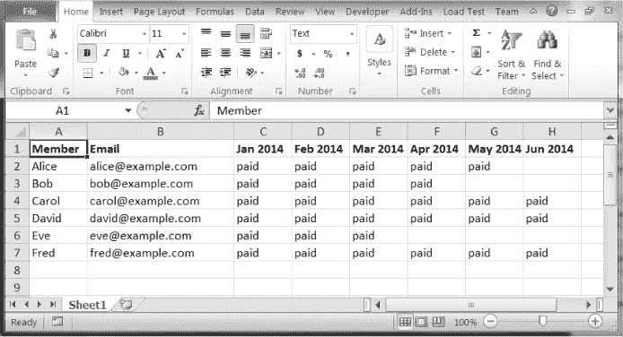

# 18 发送电子邮件和短信

> 原文：<https://automatetheboringstuff.com/2e/chapter18/>


检查和回复电子邮件是一项巨大的时间消耗。当然，你不能只写一个程序来帮你处理所有的邮件，因为每封邮件都需要它自己的回应。但是，一旦你知道如何编写可以发送和接收电子邮件的程序，你仍然可以自动完成大量与电子邮件相关的任务。

例如，您可能有一个充满客户记录的电子表格，并希望根据每个客户的年龄和位置信息向他们发送不同的套用信函。商业软件可能无法为你做到这一点；幸运的是，您可以编写自己的程序来发送这些电子邮件，从而节省大量复制和粘贴表单电子邮件的时间。

你也可以编写程序，发送电子邮件和短信通知你，即使你不在电脑旁。如果你正在自动化一个需要几个小时才能完成的任务，你不会想每隔几分钟就回到你的电脑前检查程序的状态。相反，该程序可以在完成后给你的手机发短信——让你在离开电脑时专注于更重要的事情。

本章介绍了 EZGmail 模块，这是一种从 Gmail 帐户发送和阅读电子邮件的简单方法，以及一个使用标准 SMTP 和 IMAP 电子邮件协议的 Python 模块。

> 警告
>
> 我强烈建议你为任何发送或接收电子邮件的脚本设置一个单独的电子邮件帐户。这将防止程序中的错误影响您的个人电子邮件帐户(例如，通过删除电子邮件或意外发送垃圾邮件给您的联系人)。最好先做一次预演，注释掉实际发送或删除电子邮件的代码，并用一个临时的 print() 调用来替换它。这样你可以在真正运行程序之前测试它。

### 使用 Gmail API 发送和接收电子邮件

Gmail 拥有将近三分之一的电子邮件客户端市场份额，你很可能至少有一个 Gmail 电子邮件地址。由于额外的安全和反垃圾邮件措施，通过 *EZGmail 模块*比通过`smtplib`和`imapclient`更容易控制 Gmail 帐户，这将在本章稍后讨论。EZGmail 是我编写的一个模块，它工作在官方 Gmail API 之上，并提供了一些功能，使从 Python 使用 Gmail 变得很容易。你可以在[`asweigart/ezgmail`](https://github.com/asweigart/ezgmail/)找到 EZGmail 的全部细节。EZGmail 不是由谷歌制作的，也不隶属于谷歌；在[`developers.google.com/gmail/api/v1/reference`](https://developers.google.com/gmail/api/v1/reference/)找到 Gmail API 官方文档。

要安装 EZGmail，在 Windows 上运行`pip install --user --upgrade ezgmail`(或者在 macOS 和 Linux 上使用`pip3`)。`--upgrade`选项将确保您安装最新版本的软件包，这是与不断变化的在线服务(如 Gmail API)交互所必需的。

#### 启用 Gmail API

在你写代码之前，你必须先在 [Gmail](https://gmail.com/) 注册一个 Gmail 邮箱账户。然后，转到[`developers.google.com/gmail/api/quickstart/python`](https://developers.google.com/gmail/api/quickstart/python/)，点击页面上的**启用 Gmail API** 按钮，并填写出现的表单。

填写完表单后，页面会显示一个指向`credentials.json`文件的链接，您需要下载该文件并将其放在与您的`py`文件相同的文件夹中。`credentials.json`文件包含客户端 ID 和客户端机密信息，您应该将其视为您的 Gmail 密码，不要与任何人共享。

然后，在交互式 Shell 中，输入以下代码：

```py
>>> import ezgmail, os

>>> os.chdir(r'C:\path\to\credentials_json_file')

>>> ezgmail.init()
```

确保你将当前的工作目录设置在与`credentials.json`相同的文件夹中，并且你已经连接到互联网。`ezgmail.init()`功能将打开您的浏览器，进入谷歌登录页面。输入您的 Gmail 地址和密码。该页面可能会警告你“此应用程序未经验证”，但这没关系；点击**高级**，然后**进入快速启动** ( **不安全**)。(如果你为其他人编写 Python 脚本，并且不希望这个警告对他们出现，你需要了解 Google 的应用验证过程，这超出了本书的范围。)当下一页提示您“Quickstart 想要访问您的 Google 帐户”时，单击**允许**，然后关闭浏览器。

将生成一个`token.json`文件，让您的 Python 脚本可以访问您输入的 Gmail 帐户。浏览器只有在找不到现有的`token.json`文件时才会打开登录页面。有了`credentials.json`和`token.json`，你的 Python 脚本可以从你的 Gmail 账户发送和阅读电子邮件，而不需要你在源代码中包含 Gmail 密码。

#### 从 g Mail 账户发送邮件

一旦有了一个`token.json`文件，EZGmail 模块应该能够通过一个函数调用发送电子邮件：

```py
>>> import ezgmail

>>> ezgmail.send('recipient@example.com', 'Subject line', 'Body of the email')
```

如果您想将文件附加到您的电子邮件中，您可以为`send()`函数提供一个额外的列表参数：

```py
>>> ezgmail.send('recipient@example.com', 'Subject line', 'Body of the email',

['attachment1.jpg', 'attachment2.mp3'])
```

请注意，作为其安全和反垃圾邮件功能的一部分，Gmail 可能不会重复发送文本完全相同的电子邮件(因为这些很可能是垃圾邮件)，或包含`exe`的电子邮件，或者`zip`文件附件(因为它们可能是病毒)。

您还可以提供可选的关键字参数`cc`和`bcc`来发送副本和密件副本：

```py
>>> import ezgmail

>>> ezgmail.send('recipient@example.com', 'Subject line', 'Body of the email',

cc='friend@example.com', bcc='otherfriend@example.com,someoneelse@example.com')
```

如果你需要记住`token.json`文件是为哪个 Gmail 地址配置的，可以查看`ezgmail.EMAIL_ADDRESS`。请注意，只有在调用了`ezgmail.init()`或任何其他 EZGmail 函数之后，才会填充该变量：

```py
>>> import ezgmail

>>> ezgmail.init()

>>> ezgmail.EMAIL_ADDRESS

'example@gmail.com'
```

确保将`token.json`文件视为与您的密码相同。如果其他人获得了此文件，他们可以访问您的 Gmail 帐户(尽管他们无法更改您的 Gmail 密码)。要撤销之前发布的`token.json`文件，请前往[`security.google.com/settings/security/permissions?pli=1`](https://security.google.com/settings/security/permissions?pli=1/)和撤销对快速入门应用的访问。您需要运行`ezgmail.init()`并再次通过登录过程来获得一个新的`token.json`文件。

#### 从 g Mail 账户中读取邮件

Gmail 将相互回复的电子邮件组织成对话线索。当你通过网络浏览器或应用程序登录 Gmail 时，你看到的是邮件群，而不是单封邮件(即使邮件群中只有一封邮件)。

EZGmail 有`GmailThread`和`GmailMessage`对象分别代表对话线程和个人邮件。一个`GmailThread`对象有一个`messages`属性，它保存了一个`GmailMessage`对象的列表。`unread()`函数返回所有未读邮件的`GmailThread`对象列表，然后可以将该列表传递给`ezgmail.summary()`以打印该列表中对话线程的摘要：

```py
>>> import ezgmail

>>> unreadThreads = ezgmail.unread() # List of GmailThread objects.

>>> ezgmail.summary(unreadThreads)

Al, Jon - Do you want to watch RoboCop this weekend? - Dec 09

Jon - Thanks for stopping me from buying Bitcoin. - Dec 09
```

`summary()`函数可以方便地显示电子邮件线程的快速摘要，但是要访问特定的消息(和部分消息)，您需要检查`GmailThread`对象的`messages`属性。`messages`属性包含组成线程的`GmailMessage`对象的列表，这些对象具有描述电子邮件的`subject`、`body`、`timestamp`、`sender`和`recipient`属性：

```py
>>> len(unreadThreads)

2

>>> str(unreadThreads[0])

"<GmailThread len=2 snippet= Do you want to watch RoboCop this weekend?'>"

>>> len(unreadThreads[0].messages)

2

>>> str(unreadThreads[0].messages[0])

"<GmailMessage from='Al Sweigart <al@inventwithpython.com>' to='Jon Doe

<example@gmail.com>' timestamp=datetime.datetime(2018, 12, 9, 13, 28, 48)

subject='RoboCop' snippet='Do you want to watch RoboCop this weekend?'>"

>>> unreadThreads[0].messages[0].subject

'RoboCop'

>>> unreadThreads[0].messages[0].body

'Do you want to watch RoboCop this weekend?\r\n'

>>> unreadThreads[0].messages[0].timestamp

datetime.datetime(2018, 12, 9, 13, 28, 48)

>>> unreadThreads[0].messages[0].sender

'Al Sweigart <al@inventwithpython.com>'

>>> unreadThreads[0].messages[0].recipient

'Jon Doe <example@gmail.com>'
```

与`ezgmail.unread()`功能类似，`ezgmail.recent()`功能将返回您 Gmail 帐户中最近的 25 个主题。你可以通过一个可选的`maxResults`关键字参数来改变这个限制：

```py
>>> recentThreads = ezgmail.recent()

>>> len(recentThreads)

25

>>> recentThreads = ezgmail.recent(maxResults=100)

>>> len(recentThreads)

46
```

#### 从 g Mail 账户中搜索邮件

除了使用`ezgmail.unread()`和`ezgmail.recent()`之外，你还可以搜索特定的电子邮件，就像你在搜索框中输入查询一样，通过调用`ezgmail.search()`:

```py
>>> resultThreads = ezgmail.search('RoboCop')

>>> len(resultThreads)

1

>>> ezgmail.summary(resultThreads)

Al, Jon - Do you want to watch RoboCop this weekend? - Dec 09
```

前面的`search()`调用应该产生相同的结果，就好像你在搜索框中输入“机械战警”，如图 18-1 中的所示。


图 18-1：在 Gmail 网站搜索“机械战警”邮件

像`unread()`和`recent()`一样，`search()`函数返回一个`GmailThread`对象的列表。您还可以将您可以在搜索框中输入的任何特殊搜索操作符传递给`search()`函数，如下所示：

`'label:UNREAD'`表示未读邮件

`'from:al@inventwithpython.com'`表示来自`al@inventwithpython.com`的邮件

`'subject:hello'`表示主题中带有“你好”的电子邮件

`'has:attachment'`表示带文件附件的邮件

您可以在[`support.google.com/mail/answer/7190?hl=en`](https://support.google.com/mail/answer/7190?hl=en/)查看搜索运营商的完整列表。

#### 从 Gmail 帐户下载附件

`GmailMessage`对象有一个 attachments 属性，它是消息附件的文件名列表。你可以将这些名字中的任何一个传递给对象的`downloadAttachment()`方法来下载文件。也可以用`downloadAllAttachments()`一次性下载全部。默认情况下，EZGmail 会将附件保存到当前工作目录，但是您也可以将一个额外的`downloadFolder`关键字参数传递给`downloadAttachment()`和`downloadAllAttachments()`。例如：

```py
>>> import ezgmail

>>> threads = ezgmail.search('vacation photos')

>>> threads[0].messages[0].attachments

['tulips.jpg', 'canal.jpg', 'bicycles.jpg']

>>> threads[0].messages[0].downloadAttachment('tulips.jpg')

>>> threads[0].messages[0].downloadAllAttachments(downloadFolder='vacat

ion2019')

['tulips.jpg', 'canal.jpg', 'bicycles.jpg']
```

如果以附件的文件名命名的文件已经存在，下载的附件将自动覆盖它。

EZGmail 包含额外的功能，你可以在[`asweigart/ezgmail`](https://github.com/asweigart/ezgmail/)的找到完整的文档。

### SMTP

就像 HTTP 是计算机通过互联网发送网页的协议一样，*简单邮件传输协议(SMTP)* 是用于发送电子邮件的协议。SMTP 规定了在您点按“发送”后，电子邮件应该如何格式化、加密以及在邮件服务器之间中继，以及您的电脑处理的所有其他详细信息。不过，你不需要知道这些技术细节，因为 Python 的`smtplib`模块将它们简化成了几个函数。

SMTP 只是处理发送电子邮件给他人。另一种不同的协议叫做 IMAP，处理检索发送给你的电子邮件，在第 424 页的 IMAP 中有描述。

除了 SMTP 和 IMAP 之外，当今大多数基于 web 的电子邮件运营商还采取了其他安全措施来防止垃圾邮件、网络钓鱼和其他恶意电子邮件的使用。这些措施防止 Python 脚本使用`smtplib`和`imapclient`模块登录电子邮件帐户。然而，其中许多服务都有 API 和特定的 Python 模块，允许脚本访问它们。本章介绍了 Gmail 的模块。对于其他人，您需要查阅他们的在线文档。

### 发送电子邮件

您可能熟悉从 Outlook 或 Thunderbird 或通过 Gmail 或 Yahoo Mail 等网站发送电子邮件。不幸的是，Python 并没有像那些服务一样提供给你一个漂亮的图形用户界面。相反，您可以调用函数来执行 SMTP 的每个主要步骤，如下面的交互式 Shell 示例所示。

> 注
>
> 不要在交互 Shell 中输入这个例子；这是行不通的，因为`smtp.example.com`、`bob@example.com`、`MY_SECRET_PASSWORD`、`alice@example.com`都只是占位符。这段代码只是用 Python 发送电子邮件过程的概述。

```py
>>> import smtplib

>>> smtpObj = smtplib.SMTP('smtp.example.com', 587)

>>> smtpObj.ehlo()

(250, b'mx.example.com at your service, [216.172.148.131]\nSIZE 35882577\

n8BITMIME\nSTARTTLS\nENHANCEDSTATUSCODES\nCHUNKING')

>>> smtpObj.starttls()

(220, b'2.0.0 Ready to start TLS')

>>> smtpObj.login('bob@example.com', 'MY_SECRET_PASSWORD')

(235, b'2.7.0 Accepted')

>>> smtpObj.sendmail('bob@example.com', 'alice@example.com', 'Subject: So

long.\nDear Alice, so long and thanks for all the fish. Sincerely, Bob')

{}

>>> smtpObj.quit()

(221, b'2.0.0 closing connection ko10sm23097611pbd.52 - gsmtp')
```

在接下来的几节中，我们将介绍每个步骤，用您的信息替换占位符，以连接并登录到 SMTP 服务器，发送电子邮件，以及断开与服务器的连接。

#### 连接 SMTP 服务器

如果您曾经设置过 Thunderbird、Outlook 或其他程序来连接到您的电子邮件帐户，您可能会熟悉 SMTP 服务器和端口的配置。这些设置因电子邮件运营商而异，但是在网上搜索*你的运营商的 SMTP 设置*应该会找到要使用的服务器和端口。

SMTP 服务器的域名通常是您的电子邮件运营商的域名，前面带有`smtp.`。例如，威瑞森的 SMTP 服务器在 smtp.verizon.net 的*。表 18-1 列出了一些常见的电子邮件运营商及其 SMTP 服务器。(端口是一个整数值，几乎总是 587。它由命令加密标准 TLS 使用。)

 ***表 18-1**： 电子邮件运营商及其 SMTP 服务器


| **运营商** | **SMTP 服务器域名** |
| --- | --- |
| Gmail⭐ | `smtp.gmail.com` |
| Outlook/Hotmail | `smtp-mail.outlook.com` |
| YahooMail⭐ | `smtp.mail.yahoo.com` |
| ATT | `http://smpt.mail.att.net` (端口 465) |
| Comcast | `smtp.comcast.net` |
| Verizon | `incoming.verizon.net` (465 端口) |
| ⭐额外的安全措施阻止 Python 使用`smtplib`模块登录这些服务器。EZGmail 模块可以为 Gmail 帐户绕过这个困难。 |

一旦您有了电子邮件运营商的域名和端口信息，通过调用`smptlib.SMTP()`创建一个`SMTP`对象，将域名作为字符串参数传递，将端口作为整数参数传递。`SMTP`对象表示一个到 SMTP 邮件服务器的连接，并有发送电子邮件的方法。例如，下面的调用创建了一个`SMTP`对象，用于连接到一个假想的电子邮件服务器：

```py
>>> smtpObj = smtplib.SMTP('smtp.example.com', 587)

>>> type(smtpObj)

<class 'smtplib.SMTP'>
```

输入`type(smtpObj)`会显示在`smtpObj`中存储了一个`SMTP`对象。您将需要这个`SMTP`对象来调用让您登录和发送电子邮件的方法。如果`smptlib.SMTP()`调用不成功，您的 SMTP 服务器可能不支持端口 587 上的 TLS。在这种情况下，您需要使用`smtplib.SMTP_SSL()`和端口 465 创建一个`SMTP`对象。

```py
>>> smtpObj = smtplib.SMTP_SSL('smtp.example.com', 465)
```

> 注
>
> 如果你没有连接到互联网，Python 会抛出一个socket . Gai error:[Errno 11004]getaddrinfo failed或者类似的异常。

对于您的程序来说，TLS 和 SSL 之间的区别并不重要。您只需要知道您的 SMTP 服务器使用哪种加密标准，这样您就知道如何连接到它。在接下来的所有交互式 Shell 示例中，`smtpObj`变量将包含一个由`smtplib.SMTP()`或`smtplib.SMTP_SSL()`函数返回的`SMTP`对象。

#### 发送 SMTP“你好”消息

一旦有了`SMTP`对象，调用其奇怪命名的`ehlo()`方法向 SMTP 电子邮件服务器“问好”。这个问候语是 SMTP 中的第一步，对于建立与服务器的连接非常重要。你不需要知道这些协议的细节。只要确保在得到`SMTP`对象后首先调用`ehlo()`方法，否则后面的方法调用将导致错误。下面是一个`ehlo()`调用及其返回值的例子：

```py
>>> smtpObj.ehlo()

(250, b'mx.example.com at your service, [216.172.148.131]\nSIZE 35882577\

n8BITMIME\nSTARTTLS\nENHANCEDSTATUSCODES\nCHUNKING')
```

如果返回的元组中的第一项是整数`250`(SMTP 中“成功”的代码)，那么问候成功。

#### 开始 TLS 加密

如果您正在连接到 SMTP 服务器上的端口 587(也就是说，您正在使用 TLS 加密)，那么接下来您需要调用`starttls()`方法。这个必需的步骤为您的连接启用加密。如果您连接到端口 465(使用 SSL)，那么加密已经设置好了，您应该跳过这一步。

下面是一个`starttls()`方法调用的例子：

```py
>>> smtpObj.starttls()

(220, b'2.0.0 Ready to start TLS')
```

`starttls()`方法将您的 SMTP 连接置于 TLS 模式。返回值中的`220`告诉你服务器已经准备好了。

#### 登录 SMTP 服务器

一旦建立了到 SMTP 服务器的加密连接，您就可以通过调用`login()`方法使用您的用户名(通常是您的电子邮件地址)和电子邮件密码登录。

```py
>>> smtpObj.login('my_email_address@example.com', 'MY_SECRET_PASSWORD')

(235, b'2.7.0 Accepted')
```

将您的电子邮件地址字符串作为第一个参数，将您的密码字符串作为第二个参数。返回值中的`235`表示认证成功。Python 针对不正确的密码引发了一个`smtplib.SMTPAuthenticationError`异常。

> 警告
>
> 在源代码中输入密码时要小心。如果任何人复制了你的程序，他们将可以访问你的电子邮件帐户！调用 input() 并让用户输入密码是个好主意。每次运行程序时都必须输入密码可能不太方便，但这种方法可以防止您将密码保存在计算机上的未加密文件中，这样黑客或笔记本电脑窃贼就可以很容易地获得密码。

#### 发送邮件

一旦登录到您的电子邮件运营商的 SMTP 服务器，您就可以调用`sendmail()`方法来实际发送电子邮件。`sendmail()`方法调用如下所示：

```py
>>> smtpObj.sendmail('my_email_address@example.com

', 'recipient@example.com', 'Subject: So long.\nDear Alice, so long and thanks for all the fish.

Sincerely, Bob')

{}
```

`sendmail()`方法需要三个参数：

*   字符串形式的电子邮件地址(代表电子邮件的“发件人”地址)
*   字符串形式的收件人电子邮件地址，或者多个收件人的字符串列表(对于“收件人”地址)
*   字符串形式的电子邮件正文

电子邮件正文字符串的开头必须是以`'Subject: \n'`开头的电子邮件主题行。`'\n'`换行符将电子邮件的主题行与正文分开。

从`sendmail()`返回的值是一个字典。对于电子邮件传递*失败*的每个收件人，字典中都会有一个键值对。一个空字典意味着所有的收件人都*成功*发送了邮件。

#### 断开与 SMTP 服务器的连接

发送完电子邮件后，一定要调用`quit()`方法。这将断开您的程序与 SMTP 服务器的连接。

```py
>>> smtpObj.quit()

(221, b'2.0.0 closing connection ko10sm23097611pbd.52 - gsmtp')
```

返回值中的`221`表示会话结束。

要查看连接和登录服务器、发送电子邮件和断开连接的所有步骤，请参见第 420 页的发送电子邮件。

### IMAP

正如 SMTP 是发送电子邮件的协议一样，*互联网消息访问协议(IMAP)* 规定了如何与电子邮件运营商的服务器通信，以检索发送到您的电子邮件地址的电子邮件。Python 自带了一个`imaplib`模块，但实际上第三方的`imapclient`模块更容易使用。本章介绍如何使用 IMAPClient 完整文档在[`imapclient.readthedocs.io`](https://imapclient.readthedocs.io/)。

模块从 IMAP 服务器下载格式相当复杂的电子邮件。最有可能的是，您希望将它们从这种格式转换成简单的字符串值。`pyzmail`模块为您完成解析这些电子邮件消息的艰巨工作。你可以在[`www.magiksys.net/pyzmail`](https://www.magiksys.net/pyzmail/)找到 PyzMail 的完整文档。

在 Windows 上使用`pip install --user -U imapclient==2.1.0`和`pip install --user -U pyzmail36==` `1.0.4`从终端窗口安装`imapclient`和`pyzmail`(或者在 macOS 和 Linux 上使用`pip3`)。附录 A 有如何安装第三方模块的步骤。

### 使用 IMAP 检索和删除电子邮件

在 Python 中查找和检索电子邮件是一个多步骤的过程，既需要`imapclient`又需要`pyzmail`第三方模块。为了给你一个概述，这里有一个完整的例子，登录到 IMAP 服务器，搜索电子邮件，获取它们，然后从中提取电子邮件的文本。

```py
>>> import imapclient

>>> imapObj = imapclient.IMAPClient('imap.example.com', ssl=True)

>>> imapObj.login('my_email_address@example.com', 'MY_SECRET_PASSWORD')

'my_email_address@example.com Jane Doe authenticated (Success)'

>>> imapObj.select_folder('INBOX', readonly=True)

>>> UIDs = imapObj.search(['SINCE 05-Jul-2019'])

>>> UIDs

[40032, 40033, 40034, 40035, 40036, 40037, 40038, 40039, 40040, 40041]

>>> rawMessages = imapObj.fetch([40041], ['BODY[]', 'FLAGS'])

>>> import pyzmail

>>> message = pyzmail.PyzMessage.factory(rawMessages[40041][b'BODY[]'])

>>> message.get_subject()

'Hello!'

>>> message.get_addresses('from')

[('Edward Snowden', 'esnowden@nsa.gov')]

>>> message.get_addresses('to')

[('Jane Doe', 'jdoe@example.com')]

>>> message.get_addresses('cc')

[]

>>> message.get_addresses('bcc')

[]

>>> message.text_part != None

True

>>> message.text_part.get_payload().decode(message.text_part.charset)

'Follow the money.\r\n\r\n-Ed\r\n'

>>> message.html_part != None

True

>>> message.html_part.get_payload().decode(message.html_part.charset)

'<div dir="ltr"><div>So long, and thanks for all the fish!<br><br></div>-

Al<br></div>\r\n'

>>> imapObj.logout()
```

你不必记住这些步骤。在我们详细介绍了每个步骤之后，您可以回到这个概述来刷新您的记忆。

#### 连接到 IMAP 服务器

就像您需要一个`SMTP`对象来连接到 SMTP 服务器并发送电子邮件一样，您需要一个`IMAPClient`对象来连接到 IMAP 服务器并接收电子邮件。首先，你需要你的电子邮件运营商的 IMAP 服务器的域名。这将不同于 SMTP 服务器的域名。表 18-2 列出了几家流行的电子邮件运营商的 IMAP 服务器。

**表 18-2**： 电子邮件运营商及其 IMAP 服务器


| **运营商** | **IMAP 服务器域名** |
| --- | --- |
| Gmail⭐ | `http://imap.gmail.com` |
| Outlook/Hotmail⭐ | `imap-mail.outlook.com` |
| YahooMail⭐ | `imap.mail.yahoo.com` |
| ATT | `imap.mail.att.net` |
| Comcast | `imap.comcast.net` |
| Verizon | `incoming.verizon.net` |
| ⭐额外的安全措施阻止 Python 使用`imapclient`模块登录这些服务器。 |

一旦有了 IMAP 服务器的域名，调用`imapclient.IMAPClient()`函数创建一个`IMAPClient`对象。大多数电子邮件运营商要求 SSL 加密，所以传递`ssl=True`关键字参数。在交互式 Shell 中输入以下内容(使用您的运营商的域名):

```py
>>> import imapclient

>>> imapObj = imapclient.IMAPClient('imap.example.com', ssl=True)
```

在接下来的所有交互式 Shell 示例中，`imapObj`变量包含一个从`imapclient.IMAPClient()`函数返回的`IMAPClient`对象。在这个上下文中，*客户端*是连接到服务器的对象。

#### 登录 IMAP 服务器

一旦有了一个`IMAPClient`对象，调用它的`login()`方法，以字符串的形式传入用户名(这通常是你的电子邮件地址)和密码。

```py
>>> imapObj.login('my_email_address@example.com', 'MY_SECRET_PASSWORD')

'my_email_address@example.com Jane Doe authenticated (Success)'
```

> 警告
>
> 切记不要将密码直接写入您的代码中！相反，设计您的程序来接受从 input() 返回的密码。

如果 IMAP 服务器拒绝这个用户名/密码组合，Python 就会引发一个`imaplib.error`异常。

#### 搜索邮件

一旦你登录，实际上检索你感兴趣的电子邮件是一个两步的过程。首先，您必须选择一个要搜索的文件夹。然后，您必须调用`IMAPClient`对象的`search()`方法，传入一串 IMAP 搜索关键字。

##### 选择文件夹

几乎每个账户默认都有一个`INBOX`文件夹，但是你也可以通过调用`IMAPClient`对象的`list_folders()`方法来获得文件夹列表。这将返回一个元组列表。每个元组包含关于单个文件夹的信息。通过输入以下内容继续交互式 Shell 示例：

```py
>>> import pprint

>>> pprint.pprint(imapObj.list_folders())

[(('\\HasNoChildren',), '/', 'Drafts'),

 (('\\HasNoChildren',), '/', 'Filler'),

 (('\\HasNoChildren',), '/', 'INBOX'),

 (('\\HasNoChildren',), '/', 'Sent'),

--snip--

 (('\\HasNoChildren', '\\Flagged'), '/', 'Starred'),

 (('\\HasNoChildren', '\\Trash'), '/', 'Trash')]
```

每个元组中的三个值(例如，`(('\\HasNoChildren',), '/', 'INBOX')`)如下所示：

*   文件夹标志的元组。(这些标志具体代表什么超出了本书的范围，您可以放心地忽略这个字段。)
*   名称字符串中用于分隔父文件夹和子文件夹的分隔符。
*   文件夹的全名。

要选择要搜索的文件夹，将文件夹的名称作为字符串传递给`IMAPClient`对象的`select_folder()`方法。

```py
>>> imapObj.select_folder('INBOX', readonly=True)
```

你可以忽略`select_folder()`的返回值。如果选择的文件夹不存在，Python 会抛出一个`imaplib.error`异常。

`readonly=True`关键字参数防止您在随后的方法调用中意外更改或删除该文件夹中的任何电子邮件。除非你*想*删除邮件，否则总是把`readonly`设为`True`是个好主意。

##### 执行搜索

选中一个文件夹后，您现在可以使用`IMAPClient`对象的`search()`方法搜索电子邮件。`search()`的参数是一个字符串列表，每个字符串都被格式化为 IMAP 的搜索关键字。表 18-3 描述了各种搜索键。

请注意，一些 IMAP 服务器在处理它们的标志和搜索关键字时可能会有稍微不同的实现。可能需要在交互式 Shell 中进行一些实验，以确切了解它们的行为。

您可以将 list 参数中的多个 IMAP 搜索关键字字符串传递给`search()`方法。返回的消息是匹配所有搜索关键字的消息。如果您想要匹配*任何*搜索关键字，请使用`OR`搜索关键字。对于`NOT`和`OR`搜索关键字，一个和两个完整搜索关键字分别跟在`NOT`和`OR`后面。

**表 18-3**： IMAP 搜索键


| **搜索键** | **含义** |
| --- | --- |
| `'ALL'` | 返回文件夹中的所有邮件。如果您请求一个大文件夹中的所有邮件，您可能会遇到`imaplib`大小限制。参见第 429 页上的尺寸限制。 |
| `'BEFORE`日期`'`，`'ON`日期`'`，`'SINCE`日期`'` | 这三个搜索关键字分别返回 IMAP 服务器在给定的日期之前、之时或之后收到的消息。日期的格式必须像`05-Jul-2019`一样。此外，虽然`'SINCE 05-Jul-2019'`将匹配 7 月 5 日及之后的消息，但`'BEFORE 05-Jul-2019'`将只匹配 7 月 5 日之前的消息，而不是 7 月 5 日当天的消息。 |
| `'SUBJECT`弦`'`，`'BODY`弦`'`，`'TEXT`弦`'` | 返回在主题、正文或两者中分别找到了字符串的消息。如果字符串中有空格，那么用双引号括起来：`'TEXT "search with spaces"'`。 |
| `'FROM`弦`'`，`'TO`弦`'`，`'CC`弦`'`，`'BCC`弦`'` | 分别返回在“发件人”电子邮件地址、“收件人”地址、“抄送”(抄送)地址或“密件抄送”(密件抄送)地址中找到“T2”字符串的所有邮件。如果字符串中有多个邮箱地址，那么用空格隔开，并用双引号括起来：`'CC "`firstcc@example.comsecondcc@example.com`"'`。 |
| `'SEEN'`，`'UNSEEN'` | 分别返回带有和不带有`\Seen`标志的所有消息。如果通过`fetch()`方法调用(稍后描述)访问了一封电子邮件，或者当你在电子邮件程序或网络浏览器中查看电子邮件时点击了它，则该电子邮件会获得`\Seen`标志。更常见的说法是电子邮件已经被“阅读”而不是“看到”，但它们的意思是一样的。 |
| `'ANSWERED'`，`'UNANSWERED'` | 分别返回带有和不带有`\Answered`标志的所有消息。消息在被回复时会获得`replied`标志。 |
| `'DELETED'`，`'UNDELETED'` | 分别返回带有和不带有`\deleted`标志的所有消息。使用`delete_messages()`方法删除的电子邮件信息被赋予`\deleted`标志，但在调用`expunge()`方法之前不会被永久删除(参见第 432 页上的删除电子邮件)。请注意，一些电子邮件运营商会自动删除电子邮件。 |
| `'DRAFT'`，`'UNDRAFT'` | 分别返回带有和不带有`\Draft`标志的所有消息。草稿邮件通常保存在单独的`Drafts`文件夹中，而不是`INBOX`文件夹中。 |
| `'FLAGGED'`，`'UNFLAGGED'` | 分别返回带有和不带有`\flaged`标志的所有消息。此标志通常用于将电子邮件标记为“重要”或“紧急” |
| `'LARGER`N`'``'SMALLER`T6】NT3】 | 分别返回大于或小于 N 字节的所有消息。 |
| `'NOT`搜索键`'` | 返回*不包含*搜索关键字的消息。 |
| `'OR`搜索键 1 搜索键 2 `'` | 返回与第一个或第二个搜索关键字匹配的消息。 |

以下是一些示例`search()`方法调用及其含义：

imapObj.search(['ALL']) 返回当前选定文件夹中的每一封邮件。

imapobj . search([' ON 05-Jul-2019 ')返回 2019 年 7 月 5 日发送的每条消息。

imapobj . search([' SINCE 01-Jan-2019 '，' BEFORE 01-Feb-2019 '，' UNSEEN']) 返回 2019 年 1 月发送的每条未读消息。(注意，这指的是 1 月 1 日及之后和 2 月 1 日之前，但不包括 2 月 1 日。)

imapobj . search([' SINCE 01-Jan-2019 '，' FROM alice@example.com']) 返回自 2019 年初以来从`alice@example.com`发送的每一条消息。

imapobj . search([' SINCE 01-Jan-2019 '，' NOT FROM alice@example.com']) 返回自 2019 年初以来除了`alice@example.com`之外的所有人发送的每一条消息。

imapobj . search([' OR FROM alice@example.com FROM bob @ example . com '])返回曾经从【alice@example.com】T2 或`bob@example.com`发送的每一条消息。

imapobj . search([' FROM Alice @ example . com '，' FROM bob @ example . com ')绝招举例！这个搜索永远不会返回任何消息，因为消息必须匹配*所有*搜索关键字。因为只能有一个“发件人”地址，所以一条消息不可能同时来自`alice@example.com`和`bob@example.com`。

`search()`方法不返回电子邮件本身，而是返回电子邮件的唯一 id(uid ),作为整数值。然后，您可以将这些 uid 传递给`fetch()`方法来获取电子邮件内容。

通过输入以下内容继续交互式 Shell 示例：

```py
>>> UIDs = imapObj.search(['SINCE 05-Jul-2019'])

>>> UIDs

[40032, 40033, 40034, 40035, 40036, 40037, 40038, 40039, 40040, 40041]
```

这里，`search()`返回的消息 id 列表(7 月 5 日以后收到的消息)存储在`UIDs`中。您的计算机上返回的 uid 列表将与此处显示的不同；它们对于特定的电子邮件帐户是唯一的。当您稍后将 UID 传递给其他函数调用时，请使用您收到的 UID 值，而不是本书示例中打印的值。

##### 尺寸限制

如果您的搜索匹配大量的电子邮件消息，Python 可能会抛出一个表示`imaplib.error: got more than 10000 bytes`的异常。发生这种情况时，您必须断开并重新连接到 IMAP 服务器，然后重试。

这个限制是为了防止你的 Python 程序消耗太多内存。不幸的是，默认的大小限制通常太小。您可以通过运行以下代码将此限制从 10，000 字节更改为 10，000，000 字节：

```py
>>> import imaplib

>>> imaplib._MAXLINE = 10000000
```

这应该可以防止此错误消息再次出现。您可能想让这两行成为您编写的每个 IMAP 程序的一部分。

#### 获取邮件并标记为已读

一旦有了 uid 列表，就可以调用`IMAPClient`对象的`fetch()`方法来获取实际的电子邮件内容。

uid 列表将是`fetch()`的第一个参数。第二个参数应该是列表`['BODY[]']`，它告诉`fetch()`下载你的 UID 列表中指定的电子邮件的所有正文内容。

让我们继续我们的交互式 Shell 示例。

```py
>>> rawMessages = imapObj.fetch(UIDs, ['BODY[]'])

>>> import pprint

>>> pprint.pprint(rawMessages)

{40040: {'BODY[]': 'Delivered-To: my_email_address@example.com\r\n'

                   'Received: by 10.76.71.167 with SMTP id '

--snip--

                   '\r\n'

                   '------=_Part_6000970_707736290.1404819487066--\r\n',

         'SEQ': 5430}}
```

导入`pprint`并将来自`fetch()`的返回值(存储在变量`rawMessages`中)传递给`pprint.pprint()`以“漂亮地打印”它，您会看到这个返回值是一个以 uid 为关键字的嵌套消息字典。每条消息都存储为一个字典，有两个键：`'BODY[]'`和`'SEQ'`。`'BODY[]'`键映射到电子邮件的实际正文。`'SEQ'`键用于*序列号*，其作用类似于 UID。你可以放心地忽略它。

如你所见，`'BODY[]'`键中的信息内容非常难以理解。它是一种叫做 RFC 822 的格式，是为 IMAP 服务器设计的。但是你不需要理解 RFC 822 格式；在本章的后面,`pyzmail`模块将为您解释它。

当您选择要搜索的文件夹时，您用关键字参数`readonly=True`调用了`select_folder()`。这样做可以防止你意外删除邮件——但这也意味着如果你用`fetch()`方法获取邮件，邮件不会被标记为已读。如果你*真的*想在取邮件时将邮件标记为已读，你需要将`readonly=False`传给`select_folder()`。如果所选文件夹已经处于只读模式，您可以通过再次调用`select_folder()`来重新选择当前文件夹，这次使用`readonly=False`关键字参数：

```py
>>> imapObj.select_folder('INBOX', readonly=False)
```

#### 从原始消息中获取电子邮件地址

从`fetch()`方法返回的原始消息对于那些只想阅读电子邮件的人来说仍然不是很有用。`pyzmail`模块解析这些原始消息，并将它们作为`PyzMessage`对象返回，这使得主题、正文、“收件人”字段、“发件人”字段以及电子邮件的其他部分可以很容易地被您的 Python 代码访问。

继续下面的交互式 Shell 示例(使用您自己的电子邮件帐户中的 uid，而不是这里显示的那些):

```py
>>> import pyzmail

>>> message = pyzmail.PyzMessage.factory(rawMessages[40041][b'BODY[]'])
```

首先，导入`pyzmail`。然后，要创建一个电子邮件的`PyzMessage`对象，调用`pyzmail.PyzMessage.factory()`函数并把原始消息的`'BODY[]'`部分传递给它。(注意，`b`前缀意味着这是一个字节值，而不是一个字符串值。区别并不太重要；只要记得在代码中包含`b`前缀就行了。)将结果存储在`message`中。现在`message`包含了一个`PyzMessage`对象，它有几个方法可以轻松获取电子邮件的主题行，以及所有的发件人和收件人地址。方法将主题作为一个简单的字符串值返回。`get_addresses()`方法返回您传递给它的字段的地址列表。例如，方法调用可能如下所示：

```py
>>> message.get_subject()

'Hello!'

>>> message.get_addresses('from')

[('Edward Snowden', 'esnowden@nsa.gov')]

>>> message.get_addresses('to')

[('Jane Doe', 'my_email_address@example.com')]

>>> message.get_addresses('cc')

[]

>>> message.get_addresses('bcc')

[]
```

注意，`get_addresses()`的参数是`'from'`、`'to'`、`'cc'`或`'bcc'`。`get_addresses()`的返回值是元组列表。每个元组包含两个字符串：第一个是与电子邮件地址相关联的名称，第二个是电子邮件地址本身。如果请求字段中没有地址，`get_addresses()`返回一个空白列表。这里，`'cc'`抄送和`'bcc'`密件抄送字段都不包含地址，因此返回空列表。

#### 从原始消息中获取身体

电子邮件可以以纯文本、HTML 或两者兼有的形式发送。纯文本电子邮件只包含文本，而 HTML 电子邮件可以有颜色、字体、图像和其他功能，使电子邮件看起来像一个小网页。如果一封电子邮件只是纯文本，那么它的`PyzMessage`对象将把它的`html_part`属性设置为`None`。同样，如果一封电子邮件只是 HTML，那么它的`PyzMessage`对象的`text_part`属性将被设置为`None`。

否则，`text_part`或`html_part`值将有一个`get_payload()`方法，该方法将电子邮件的正文作为*字节*数据类型的值返回。(字节数据类型超出了本书的范围。)但是这个*仍然*不是我们可以使用的字符串值。啊！最后一步是对由`get_payload()`返回的字节值调用`decode()`方法。`decode()`方法有一个参数：消息的字符编码，存储在`text_part.charset`或`html_part.charset`属性中。最后，这将返回电子邮件正文的字符串。

通过输入以下内容继续交互式 Shell 示例：

```py
   >>> message.text_part != None # ➊

   True

   >>> message.text_part.get_payload().decode(message.text_part.charset)

   'So long, and thanks for all the fish!\r\n\r\n-Al\r\n' # ➋

   >>> message.html_part != None # ➌

   True

   >>> message.html_part.get_payload().decode(message.html_part.charset) # ➍

   '<div dir="ltr"><div>So long, and thanks for all the fish!<br><br></div>-Al

   <br></div>\r\n'
```

我们正在处理的电子邮件既有纯文本又有 HTML 内容，因此存储在`message`中的`PyzMessage`对象具有不等于`None` ➊ ➌ 的`text_part`和`html_part`属性。对消息的`text_part`调用`get_payload()`，然后对字节值调用`decode()`，返回电子邮件 ➋ 的文本版本的字符串。将`get_payload()`和`decode()`与消息的`html_part`一起使用会返回电子邮件 ➍ 的 HTML 版本的字符串。

#### 删除邮件

要删除电子邮件，将消息 uid 列表传递给`IMAPClient`对象的`delete_messages()`方法。这将邮件标记为`\deleted`标志。调用`expunge()`方法将永久删除当前选中文件夹中所有带有`/Deleted`标志的邮件。考虑以下交互式 Shell 示例：

```py
   >>> imapObj.select_folder('INBOX', readonly=False) # ➊

   >>> UIDs = imapObj.search(['ON 09-Jul-2019']) # ➋

   >>> UIDs

   [40066]

   >>> imapObj.delete_messages(UIDs)

   {40066: ('\\Seen', '\\Deleted')} # ➌

   >>> imapObj.expunge()

   ('Success', [(5452, 'EXISTS')])
```

这里我们通过调用`IMAPClient`对象上的`select_folder()`并传递`'INBOX'`作为第一个参数来选择收件箱；我们还传递关键字参数`readonly=False`，这样我们就可以删除电子邮件 ➊ 。我们在收件箱中搜索在特定日期收到的消息，并将返回的消息 id 存储在`UIDs` ➋ 中。调用`delete_message()`并传递`UIDs`返回一个字典；每个键-值对都是一个消息 ID 和一组消息的标志，现在应该包括`\deleted` ➌ 。调用`expunge()`然后永久删除带有`\Deleted`标志的消息，如果删除电子邮件没有问题，则返回一条成功消息。请注意，一些电子邮件运营商会自动删除使用`delete_messages()`删除的电子邮件，而不是等待来自 IMAP 客户端的 expunge 命令。

#### 从 IMAP 服务器断开

当您的程序完成检索或删除电子邮件时，只需调用 IMAPClient 的`logout()`方法来断开与 IMAP 服务器的连接。

```py
>>> imapObj.logout()
```

如果你的程序运行了几分钟或更长时间，IMAP 服务器可能会*超时*，或者自动断开连接。在这种情况下，程序对`IMAPClient`对象的下一次方法调用应该会引发如下异常：

```py
imaplib.abort: socket error: [WinError 10054] An existing connection was

forcibly closed by the remote host
```

在这种情况下，您的程序将不得不调用`imapclient.IMAPClient()`来再次连接。

咻！就是这样。有许多困难要克服，但是现在你有办法让你的 Python 程序登录到一个电子邮件帐户并获取电子邮件。当你需要记住所有的步骤时，你可以随时查阅第 424 页的“用 IMAP 检索和删除电子邮件”中的概述。

### 项目：发送会员会费提醒邮件

假设您被“自愿”跟踪强制性志愿服务俱乐部的会员会费。这是一份非常无聊的工作，包括维护一份每个月已经付款的人的电子表格，并通过电子邮件提醒那些没有付款的人。不要自己查看电子表格，复制并粘贴相同的电子邮件给每个拖欠会费的人，让我们——你猜对了——写一个脚本来帮你做这件事。

概括地说，下面是您的程序要做的事情：

1.  从 Excel 电子表格中读取数据。
2.  找出所有最近一个月没有支付会费的会员。
3.  找到他们的电子邮件地址，并向他们发送个性化的提醒。

这意味着您的代码需要执行以下操作：

1.  用`openpyxl`模块打开并读取 Excel 文档的单元格。(参见第 13 章的关于 Excel 文件的操作。)
2.  创建一个拖欠会费成员的字典。
3.  通过调用`smtplib.SMTP()`、`ehlo()`、`starttls()`和`login()`登录 SMTP 服务器。
4.  对于所有拖欠会费的会员，通过调用`sendmail()`方法发送个性化提醒电子邮件。

打开一个新的文件编辑器选项卡，并将其另存为`sendDuesReminders.py`。

#### 步骤一：打开 Excel 文件

假设你用来追踪会费支付的 Excel 电子表格看起来像图 18-2 并且在一个名为`duesRecords.xlsx`的文件中。你可以从`nostarch.com/automatestuff2`下载这个文件。



图 18-2：追踪会员会费支付的电子表格

这个电子表格有每个成员的名字和电子邮件地址。每个月都有一个跟踪会员付款状态的栏目。每个成员的单元格都标有文字`payed`一旦他们支付了会费。

该程序必须打开`duesRecords.xlsx`，并通过读取`sheet.max_column`属性计算出最近一个月的列。(关于使用`openpyxl`模块访问 Excel 电子表格文件中的单元格的更多信息，您可以查阅第 13 章。)在文件编辑器选项卡中输入以下代码：

```py
   #! python3

   # sendDuesReminders.py - Sends emails based on payment status in spreadsheet.

   import openpyxl, smtplib, sys

   # Open the spreadsheet and get the latest dues status.

   wb = openpyxl.load_workbook('duesRecords.xlsx') # ➊

   sheet = wb.get_sheet_by_name('Sheet1') # ➋

   lastCol = sheet.max_column # ➌

   latestMonth = sheet.cell(row=1, column=lastCol).value # ➍

   # TODO: Check each member's payment status.

   # TODO: Log in to email account.

   # TODO: Send out reminder emails.
```

在导入`openpyxl`、`smtplib`和`sys`模块后，我们打开我们的`duesRecords.xlsx`文件，并将生成的`Workbook`对象存储在`wb` ➊ 中。然后我们得到工作表 1，并将得到的`Worksheet`对象存储在`sheet` ➋ 中。现在我们有了一个`Worksheet`对象，我们可以访问行、列和单元格。我们将最高的列存储在`lastCol` ➌ 中，然后使用行号 1 和`lastCol`来访问应该保存最近月份的单元格。我们获取该单元格中的值，并将其存储在`latestMonth` ➍ 中。

#### 第二步：查找所有未付费会员

一旦确定了最近一个月的列号(存储在`lastCol`中)，就可以遍历第一行(有列标题)之后的所有行，查看哪些成员在单元格中有*支付了该月的会费*的文本。如果会员没有付款，您可以分别从第 1 列和第 2 列获取会员的姓名和电子邮件地址。这些信息将进入`unpaidMembers`字典，该字典将跟踪最近一个月没有付款的所有成员。将以下代码添加到`sendDuesReminder.py`中。

```py
   #! python3

   # sendDuesReminders.py - Sends emails based on payment status in spreadsheet.

   --snip--

   # Check each member's payment status.

   unpaidMembers = {}

   for r in range(2, sheet.max_row + 1): # ➊

       payment = sheet.cell(row=r, column=lastCol).value # ➋

       if payment != 'paid':

           name = sheet.cell(row=r, column=1).value # ➌

           email = sheet.cell(row=r, column=2).value # ➍

           unpaidMembers[name] = email # ➎
```

这段代码建立一个空字典`unpaidMembers`，然后遍历第一个 ➊ 之后的所有行。对于每一行，最近一列中的值存储在`payment` ➋ 中。如果`payment`不等于`'paid'`，那么第一列的值存储在`name` ➌ 中，第二列的值存储在`email` ➍ 中，`name`和`email`加到`unpaidMembers` ➎ 中。

#### 第三步：发送定制邮件提醒

一旦你有了所有未付费会员的名单，就该给他们发邮件提醒了。将以下代码添加到您的程序中，但不包括您的真实电子邮件地址和运营商信息：

```py
#! python3

# sendDuesReminders.py - Sends emails based on payment status in spreadsheet.

--snip--

# Log in to email account.

smtpObj = smtplib.SMTP('smtp.example.com', 587)

smtpObj.ehlo()

smtpObj.starttls()

smtpObj.login('my_email_address@example.com', sys.argv[1])
```

通过调用`smtplib.SMTP()`并向其传递您的运营商的域名和端口来创建一个`SMTP`对象。调用`ehlo()`和`starttls()`，然后调用`login()`，把你的邮箱地址和`sys.argv[1]`传给它，里面会存储你的密码串。每次运行程序时，您将输入密码作为命令行参数，以避免将密码保存在源代码中。

一旦你的程序登录到你的电子邮件帐户，它应该通过`unpaidMembers`字典，并发送一封个性化的电子邮件到每个成员的电子邮件地址。将以下内容添加到`senduesReminders.py`:

```py
   #! python3

   # sendDuesReminders.py - Sends emails based on payment status in spreadsheet.

   --snip--

   # Send out reminder emails.

   for name, email in unpaidMembers.items():

       body = "Subject: %s dues unpaid.\nDear %s,\nRecords show that you have not # ➊

   paid dues for %s. Please make this payment as soon as possible. Thank you!'" %

   (latestMonth, name, latestMonth)

       print('Sending email to %s...' % email) # ➋

       sendmailStatus = smtpObj.sendmail('my_email_address@example.com', email, # ➌

body)

       if sendmailStatus != {}: # ➍

           print('There was a problem sending email to %s: %s' % (email,

           sendmailStatus))

   smtpObj.quit()
```

这段代码遍历了`unpaidMembers`中的姓名和电子邮件。对于每一个没有付费的会员，我们定制一条包含最近一个月和会员姓名的消息，并将该消息存储在`body` ➊ 中。我们打印输出，说明我们正在向这个成员的电子邮件地址 ➋ 发送一封电子邮件。然后我们调用`sendmail()`，给它传递发件人地址和定制消息 ➌ 。我们将返回值存储在`sendmailStatus`中。

记住，如果 SMTP 服务器报告发送特定电子邮件时出错，那么`sendmail()`方法将返回一个非空的字典值。在 ➍ 处`for`循环的最后一部分检查返回的字典是否为非空，如果是，则打印收件人的电子邮件地址和返回的字典。

在程序发送完所有邮件后，调用`quit()`方法来断开与 SMTP 服务器的连接。

当您运行该程序时，输出如下所示：

```py
Sending email to alice@example.com...

Sending email to bob@example.com...

Sending email to eve@example.com...
```

收件人将收到一封关于他们未付款的电子邮件，看起来就像是您手动发送的电子邮件。

### 使用短信电子邮件网关发送短信

比起电脑，人们更有可能靠近智能手机，因此短信通常是比电子邮件更直接、更可靠的通知方式。此外，短信通常更短，使人们更有可能抽出时间阅读它们。

最简单但不是最可靠的发送文本消息的方式是使用 SMS(短消息服务)电子邮件网关，这是一种电子邮件服务器，由手机运营商设置，通过电子邮件接收文本，然后作为文本消息转发给收件人。

您可以编写一个程序，使用`ezgmail`或`smtplib`模块发送这些电子邮件。电话号码和电话公司的电子邮件服务器构成了收件人的电子邮件地址。电子邮件的主题和正文将是文本消息的正文。例如，要向一个威瑞森客户的电话号码 415-555-1234 发送文本，您可以向`4155551234@vtext.com`发送电子邮件。

你可以通过在网上搜索“短信电子邮件网关运营商名称”来找到手机运营商的短信电子邮件网关，但是表 18-4 列出了几个流行的运营商的网关。许多运营商有单独的电子邮件服务器，用于 SMS(限制消息长度为 160 个字符)和 MMS(多媒体消息服务)，后者没有字符限制。如果你想发送一张照片，你必须使用彩信网关，并将文件附加到电子邮件中。

如果你不知道收件人的手机运营商，你可以尝试使用*运营商查询*网站，它应该提供一个电话号码的运营商。找到这些网站的最好方法是在网上搜索“查找手机号码运营商”许多这样的网站会让你免费查找电话号码(尽管如果你需要通过他们的 API 查找成百上千的电话号码会收费)。

**表 18-4**： 手机运营商的短信邮件网关


| **手机运营商** | **短信网关** | **彩信网关** |
| --- | --- | --- |
| ATT | `number@txt.att.net` | [`number@mms.att.net` |
| MyBoostMobile | `number@sms.myboostmobile.com` | 与短信相同 |
| CricketWireless | `number@sms.cricketwireless.net` | `number@mms.cricketwireless.net` |
| GoogleFi | `number@msg.fi.google.com` | 与短信相同 |
| MyMetroPcs | `number@mymetropcs.com` | 与短信相同 |
| RepublicWireless | `number@text.republicwireless.com` | 与短信相同 |
| SprintPcs | `number@messaging.sprintpcs.com` | `number@pm.sprint.com` |
| TmoMail | `number@tmomail.net` | 与短信相同 |
| USCC | `number@email.uscc.net` | `number@mms.uscc.net` |
| Verizon | `number@vtext.com` | `number@vzwpix.com` |
| VirginMobile | `number@vmobl.com` | `number@vmpix.com` |
| XFinity Mobile | `number@vtext.com` | `number@mypixmessages.com` |

虽然 SMS 电子邮件网关免费且易于使用，但它们有几个主要缺点：

*   您无法保证文本会及时到达，或者根本无法保证。
*   你无法知道文本是否没有到达。
*   短信收件人无法回复。
*   如果你发送太多电子邮件，短信网关可能会阻止你，而且没有办法知道多少是“太多”
*   短信网关今天发一条短信，不代表明天就能用。

当你需要偶尔发送非紧急信息时，通过短信网关发送文本是理想的。如果你需要更可靠的服务，使用非电子邮件短信网关服务，如下所述。

### 用 Twilio 发送短信

在本节中，您将了解如何注册免费的 Twilio 服务，并使用其 Python 模块发送文本消息。Twilio 是*短信网关服务*，这意味着它允许你通过互联网从你的程序发送短信。虽然免费试用帐户有一定的信用额度，并且文本前面会有*从 Twilio 试用帐户发送*的字样，但这种试用服务可能足以满足您的个人程序。

但是 Twilio 并不是唯一的短信网关服务。如果你不喜欢使用 twilio，你可以通过在线搜索“免费短信”“网关”“python 短信 api”，甚至“Twilio 替代品”来找到替代服务。

在注册 Twilio 账号之前，在 Windows 上用`pip install --user --upgrade twilio`安装`twilio`模块(或者在 macOS 和 Linux 上使用`pip3`)。附录 A 有更多关于安装第三方模块的细节。

> 注
>
> 本节专门针对美国。Twilio 确实为美国以外的国家提供短信服务；更多信息参见[`twilio.com/`](https://twilio.com/)。在美国以外的地区， twilio 模块及其功能将保持不变。

#### 注册 Twilio 账户

前往[`twilio.com`](https://twilio.com/)，填写报名表。注册新帐户后，你需要验证要向其发送短信的手机号码。请转到“已验证的来电显示”页面，添加您有权访问的电话号码。Twilio 将向该号码发送一个代码，您必须输入该代码来验证该号码。(这种验证是必要的，以防止人们使用该服务向随机电话号码发送短信。)您现在可以使用`twilio`模块向该电话号码发送短信。

Twilio 为您的试用帐户提供了一个电话号码，用于发送短信。您还需要两条信息：您的帐户 SID 和 auth(身份验证)令牌。登录 Twilio 帐户后，您可以在仪表板页面上找到这些信息。从 Python 程序登录时，这些值充当您的 Twilio 用户名和密码。

#### 发送短信

一旦你安装了`twilio`模块，注册了一个 Twilio 账户，验证了你的电话号码，注册了一个 Twilio 电话号码，并获得了你的账户 SID 和认证令牌，你就可以用你的 Python 脚本给自己发送文本消息了。

与所有注册步骤相比，实际的 Python 代码相当简单。将您的计算机连接到互联网，在交互式 Shell 中输入以下内容，用您的真实信息替换`accountSID`、`authToken`、`myTwilioNumber`和`myCellPhone`变量值：

```py
   >>> from twilio.rest import Client # ➊

   >>> accountSID = 'ACxxxxxxxxxxxxxxxxxxxxxxxxxxxxxxxx'

   >>> authToken  = 'xxxxxxxxxxxxxxxxxxxxxxxxxxxxxxxx'

   >>> twilioCli = Client(accountSID, authToken) # ➋

   >>> myTwilioNumber = '+14955551234'

   >>> myCellPhone = '+14955558888'

   >>> message = twilioCli.messages.create(body='Mr. Watson - Come here - I want # ➌

   to see you.', from_=myTwilioNumber, to=myCellPhone)
```

在输入最后一行之后，您应该会收到一条短信，内容是：“从您的 Twilio 试用帐户发送 Watson 先生——过来——我想见您”。

由于`twilio`模块的设置方式，你需要使用`from twilio.rest import Client`来导入它，而不仅仅是`import twilio` ➊ 。在`accountSID`中存储你的账户 SID，在`authToken`中存储你的认证令牌，然后调用`Client()`并传递给`accountSID`和`authToken`。对`Client()`的调用返回一个`Client`对象 ➋ 。这个对象有一个`messages`属性，该属性又有一个`create()`方法，您可以用它来发送文本消息。这是指示 Twilio 的服务器发送您的文本消息的方法。分别在`myTwilioNumber`和`myCellPhone`中存储您的 Twilio 号码和手机号码后，调用`create()`并向其传递指定文本消息正文、发送者号码(`myTwilioNumber`)和接收者号码(`myCellPhone` ) ➌ 的关键字参数。

从`create()`方法返回的`Message`对象将包含关于发送的文本消息的信息。通过输入以下内容继续交互式 Shell 示例：

```py
>>> message.to

'+14955558888'

>>> message.from_

'+14955551234'

>>> message.body

'Mr. Watson - Come here - I want to see you.'
```

`to`、`from_`和`body`属性应该分别保存您的手机号码、Twilio 号码和消息。注意发送电话号码在`from_`属性中——末尾有下划线——而不是`from`。这是因为`from`是 Python 中的一个关键字(例如，你已经在`import`语句的`from` modulename `import *`形式中看到过它的使用)，所以它不能用作属性名。继续交互式 Shell 示例，如下所示：

```py
>>> message.status

'queued'

>>> message.date_created

datetime.datetime(2019, 7, 8, 1, 36, 18)

>>> message.date_sent == None

True
```

属性应该给你一个字符串。如果消息已经被创建和发送，那么`date_created`和`date_sent`属性应该会给你一个`datetime`对象。当你已经收到文本消息时，`status`属性被设置为`'queued'`而`date_sent`属性被设置为`None`，这似乎有点奇怪。这是因为在文本被实际发送之前，您捕获了`message`变量中的`Message`对象。您需要重新提取`Message`对象，以查看其最新的`status`和`date_sent`。每个 Twilio 消息都有一个唯一的字符串 ID (SID ),可用于获取`Message`对象的最新更新。继续交互 Shell 示例，输入以下内容：*

```py
   >>> message.sid

   'SM09520de7639ba3af137c6fcb7c5f4b51'

   >>> updatedMessage = twilioCli.messages.get(message.sid) # ➊

   >>> updatedMessage.status

   'delivered'

   >>> updatedMessage.date_sent

   datetime.datetime(2019, 7, 8, 1, 36, 18)
```

输入`message.sid`显示此消息的长 SID。通过将这个 SID 传递给 Twilio 客户端的`get()`方法 ➊ ，您可以用最新的信息检索一个新的`Message`对象。在这个新的`Message`对象中，`status`和`date_sent`属性是正确的。

`status`属性将被设置为下列字符串值之一：`'queued'`、`'sending'`、`'sent'`、`'delivered'`、`'undelivered'`或`'failed'`。这些状态是不言自明的，但是要了解更精确的细节，请看一下`nostarch.com/automatestuff2`的参考资料。

**用 PYTHON 接收短信**

不幸的是，用 Twilio 接收短信比发送短信要复杂一些。Twilio 要求你有一个运行自己的 web 应用程序的网站。那超出了这些页面的范围，[但是你可以在本书的在线资源中找到更多的细节](https://nostarch.com/automatestuff2/)。

### 项目：“给我发短信”模块

你程序中最常发短信的人可能就是你自己。当你离开电脑时，发短信是给自己发送通知的好方法。如果你用一个需要运行几个小时的程序自动完成了一项无聊的任务，你可以让它在完成后用文本通知你。或者，您可能有一个定期运行的程序，有时需要与您联系，例如天气预报程序，它会发短信提醒您带伞。

举个简单的例子，这里有一个带有`textmyself()`函数的小 Python 程序，它发送一条作为字符串参数传递给它的消息。打开一个新的文件编辑器选项卡，输入以下代码，用您自己的信息替换帐户 SID、身份验证令牌和电话号码。保存为`textMyself.py`。

```py
   #! python3

   # textMyself.py - Defines the textmyself() function that texts a message 

   # passed to it as a string.

   # Preset values:

   accountSID = 'ACxxxxxxxxxxxxxxxxxxxxxxxxxxxxxxxx'

   authToken  = 'xxxxxxxxxxxxxxxxxxxxxxxxxxxxxxxx'

   myNumber = '+15559998888'

   twilioNumber = '+15552225678'

   from twilio.rest import Client

   def textmyself(message): # ➊

       twilioCli = Client(accountSID, authToken) # ➋

       twilioCli.messages.create(body=message, from_=twilioNumber, to=myNumber) # ➌
```

这个程序存储一个账户 SID、认证令牌、发送号码和接收号码。然后，它定义`textmyself()`接受参数 ➊ ，生成一个`Client`对象 ➋ ，并用您传递的消息 ➌ 调用`create()`。

如果想让其他程序也能使用`textmyself()`函数，只需将`textmy.py`文件放在与 Python 脚本相同的文件夹中。每当你想让你的程序给你发短信时，只需添加以下内容：

```py
import textmyself

textmyself.textmyself('The boring task is finished.')
```

你只需要注册 Twilio 并编写一次短信代码。之后，只需两行代码就可以从任何其他程序发送文本。

### 总结

我们通过互联网和手机网络以数十种不同的方式相互交流，但电子邮件和短信占主导地位。您的程序可以通过这些通道进行通信，这为它们提供了强大的新通知功能。你甚至可以编写在不同计算机上运行的程序，这些程序通过电子邮件直接相互通信，一个程序用 SMTP 发送电子邮件，另一个程序用 IMAP 检索电子邮件。

Python 的`smtplib`提供了使用 SMTP 通过您的电子邮件运营商的 SMTP 服务器发送电子邮件的功能。同样，第三方的`imapclient`和`pyzmail`模块可以让你访问 IMAP 服务器，检索发送给你的电子邮件。尽管 IMAP 比 SMTP 复杂一些，但它也非常强大，允许您搜索特定的电子邮件，下载它们，并解析它们以提取字符串值形式的主题和正文。

作为一种安全和垃圾邮件预防措施，一些流行的电子邮件服务，如 Gmail，不允许您使用标准的 SMTP 和 IMAP 协议来访问他们的服务。EZGmail 模块充当 Gmail API 的方便包装器，让您的 Python 脚本访问您的 Gmail 帐户。我强烈建议您为您的脚本设置一个单独的 Gmail 帐户，这样您程序中的潜在错误就不会对您的个人 Gmail 帐户造成问题。

短信和电子邮件有点不同，因为和电子邮件不同，发送短信不仅仅需要互联网连接。幸运的是，像 Twilio 这样的服务提供了允许你从程序中发送文本消息的模块。一旦你完成了初始设置过程，你就可以用几行代码发送短信了。

在你的技能集中有了这些模块，你将能够编程你的程序应该发送通知或提醒的特定条件。现在，您的程序将远远超出运行它们的计算机的范围！

### 练习题

1.  发送电子邮件的协议是什么？用于检查和接收电子邮件？

2.  登录 SMTP 服务器必须调用哪四个`smtplib`函数/方法？

3.  登录 IMAP 服务器必须调用哪两个`imapclient`函数/方法？

4.  你传递给`imapObj.search()`什么样的论点？

5.  如果你的代码得到一个错误消息说`got more than 10000 bytes`，你会怎么做？

6.  `imapclient`模块处理连接到 IMAP 服务器和查找电子邮件。哪个模块负责读取`imapclient`收集的电子邮件？

7.  在使用 Gmail API 时，有哪些`credentials.json`和`token.json`文件？

8.  在 Gmail API 中，“线程”和“邮件”对象有什么区别？

9.  使用`ezgmail.search()`，如何找到有文件附件的邮件？

0.  你需要 Twilio 提供哪三条信息才能发送短信？

### 实践项目

为了练习，编写执行以下操作的程序。

#### 随机家务分配邮件人

编写一个程序，它接受人们的电子邮件地址列表和需要做的家务列表，并随机给人们分配家务。给每个人发电子邮件，告知他们分配的家务。如果你有雄心壮志，记录下每个人之前被分配的家务，这样你就可以确保程序避免给任何人分配他们上次做的家务。对于另一个可能的功能，计划程序每周自动运行一次。

这里有一个提示：如果你将一个列表传递给`random.choice()`函数，它将从列表中返回一个随机选择的项目。您的部分代码可能如下所示：

```py
chores = ['dishes', 'bathroom', 'vacuum', 'walk dog']

randomChore = random.choice(chores)

chores.remove(randomChore)    # this chore is now taken, so remove it
```

#### 雨伞提醒

第十二章向你展示了如何使用`requests`模块从[`weather.gov`](https://weather.gov/)中抓取数据。写一个程序，在你早上醒来之前运行，检查当天是否下雨。如果是这样，让程序发短信提醒你出门前带把伞。

#### 自动退订

编写一个程序，扫描你的电子邮件帐户，找到所有电子邮件中的所有退订链接，并自动在浏览器中打开它们。这个程序必须登录到你的电子邮件运营商的 IMAP 服务器，并下载你所有的电子邮件。你可以使用 Beautiful Soup(包含在第 12 章中)来检查任何在 HTML 链接标签中出现*取消订阅*的情况。

一旦您有了这些 URL 的列表，您就可以使用`webbrowser.open()`在浏览器中自动打开所有这些链接。

您仍然需要手动浏览并完成任何额外的步骤来取消订阅这些列表。在大多数情况下，这需要点击一个链接来确认。

但是这个脚本可以让你不必在所有的邮件中寻找退订链接。然后你可以把这个脚本传给你的朋友，这样他们就可以在他们的电子邮件帐户上运行它。(只要确保您的电子邮件密码没有硬编码在源代码中！)

#### 通过电子邮件控制电脑

编写一个程序，每 15 分钟检查一次电子邮件帐户，查看你发送的任何指令，并自动执行这些指令。比如 BitTorrent 就是一个点对点的下载系统。使用免费的 BitTorrent 软件，如 qBittorrent，您可以在您的家庭计算机上下载大型媒体文件。如果你通过电子邮件向该程序发送一个(完全合法，根本不是盗版的)BitTorrent 链接，该程序最终会检查其电子邮件，找到这条消息，提取链接，然后启动 qBittorrent 开始下载文件。这样，当你离开的时候，你可以让你的家用电脑开始下载，并且(完全合法，完全不是盗版的)下载可以在你回家的时候完成。

第 17 章讲述了如何使用`subprocess.Popen()`功能在电脑上启动程序。例如，以下调用将启动 qBittorrent 程序，以及 torrent 文件：

```py
qbProcess = subprocess.Popen(['C:\\Program Files (x86)\\qBittorrent\\

qbittorrent.exe', 'shakespeare_complete_works.torrent'])
```

当然，你会希望程序确保邮件来自你。特别是，您可能希望要求电子邮件包含密码，因为黑客在电子邮件中伪造“发件人”地址相当容易。该程序应该删除它发现的电子邮件，这样它就不会在每次检查电子邮件帐户时重复指令。作为一个额外的功能，让程序在每次执行命令时给你发电子邮件或短信确认。因为你不会坐在运行程序的计算机前，所以使用记录功能(见第十一章)写一个文本文件日志是一个好主意，如果出现错误，你可以检查。

qBittorrent(以及其他 Bittorrent 应用程序)有一个功能，它可以在下载完成后自动退出。第 17 章解释了如何用`Popen`对象的`wait()`方法确定一个已启动的应用程序何时退出。在 qBittorrent 停止之前,`wait()`方法调用会一直阻塞，然后你的程序会发邮件或短信通知你下载已经完成。

有很多可能的功能，你可以添加到这个项目。如果你卡住了，你可以从[`nostarch.com/automatestuff2`](https://nostarch.com/automatestuff2/)下载这个程序的一个实例实现。