# 19 处理图像

> 原文：<https://automatetheboringstuff.com/2e/chapter19/>


如果你有一台数码相机，或者即使你只是从手机上传照片到脸书，你可能会一直碰到数码图像文件。你可能知道如何使用基本的图形软件，如微软的画图或 Paintbrush，甚至更高级的应用程序，如 Adobe Photoshop。但是如果你需要编辑大量的图片，手工编辑会是一项冗长而又无聊的工作。

输入 Python。Pillow 是一个用于与图像文件交互的第三方 Python 模块。该模块有几个功能，可以轻松地裁剪、调整和编辑图像的内容。Python 能够像处理 Microsoft Paint 或 Adobe Photoshop 等软件一样处理图像，因此可以轻松地自动编辑成百上千的图像。运行`pip install --user -U pillow==6.0.0`就可以安装 Pillow 了。附录 A 有更多关于安装模块的细节。

### 计算机图像基础

为了操作图像，您需要了解计算机如何处理图像中的颜色和坐标的基础知识，以及如何在 Pillow 中处理颜色和坐标。但是在继续之前，请安装`pillow`模块。参见附录 A 获取安装第三方模块的帮助。

#### 颜色和 RGBA 值

计算机程序通常将图像中的颜色表示为 *RGBA 值*。RGBA 值是一组数字，用于指定颜色中红色、绿色、蓝色和`alpha` （或透明度）的数量。这些组件值中的每一个都是从 0（完全没有）到 255（最大值）的整数。这些 RGBA 值被分配给各个*像素*；像素是计算机屏幕能够显示的单一颜色的最小点（可以想象，一个屏幕上有数百万个像素）。像素的 RGB 设置精确地告诉它应该显示什么样的颜色。图像也有一个 alpha 值来创建 RGBA 值。如果图像显示在屏幕上的背景图像或桌面壁纸上，alpha 值决定了您可以“看穿”图像像素的背景程度。

在 Pillow 中，RGBA 值由四个整数值的元组表示。例如，红色由`(255, 0, 0, 255)`表示。这种颜色具有最大量的红色，没有绿色或蓝色，并且具有最大的 alpha 值，这意味着它是完全不透明的。绿色代表`(0, 255, 0, 255)`，蓝色代表`(0, 0, 255, 255)`。白色，所有颜色的组合，是`(255, 255, 255, 255)`，而黑色，没有任何颜色，是`(0, 0, 0, 255)`。

如果一种颜色的 alpha 值为 0，那么它就是不可见的，RGB 值是多少并不重要。毕竟看不见的红色和看不见的黑色是一样的。

Pillow 使用 HTML 使用的标准颜色名称。表 19-1 列出了一系列标准颜色名称及其数值。

**表 19-1**： 标准颜色名称及其 RGBA 值


| **名称** | **RGBA 值** | **名称** | **RGBA 值** |
| --- | --- | --- | --- |
| `white` | `(255, 255, 255, 255)` | `red` | `(255, 0, 0, 255)` |
| `green` | `(0, 128, 0, 255)` | `blue` | `(0, 0, 255, 255)` |
| `gray` | `(128, 128, 128, 255)` | `yellow` | `(255, 255, 0, 255)` |
| `black` | `(0, 0, 0, 255)` | `purple` | `(128, 0, 128, 255)` |

Pillow 提供了`ImageColor.getcolor()`函数，这样你就不必为你想要使用的颜色记忆 RGBA 值了。这个函数将颜色名称字符串作为第一个参数，将字符串`'RGBA'`作为第二个参数，并返回一个 RGBA 元组。

要查看这个函数是如何工作的，请在交互式 Shell 中输入以下内容：

```py
   >>> from PIL import ImageColor # ➊
   >>> ImageColor.getcolor('red', 'RGBA') # ➋
   (255, 0, 0, 255)
   >>> ImageColor.getcolor('RED', 'RGBA') # ➌
   (255, 0, 0, 255)
   >>> ImageColor.getcolor('Black', 'RGBA')
   (0, 0, 0, 255)
   >>> ImageColor.getcolor('chocolate', 'RGBA')
   (210, 105, 30, 255)
   >>> ImageColor.getcolor('CornflowerBlue', 'RGBA')
   (100, 149, 237, 255)
```

首先你需要从 PIL ➊ 导入`ImageColor`模块（不是从 pillow 一会儿你就知道为什么了）。你传递给`ImageColor.getcolor()`的颜色名称字符串是不区分大小写的，所以传递`'red'`➋ 和传递`'RED'`➌ 给你的是相同的 RGBA 元组。你也可以传递更多不常见的颜色名称，比如`'chocolate'`和`'Cornflower Blue'`。

Pillow 支持大量的颜色名称，从`'aliceblue'`到`'whitesmoke'`。你可以在`nostarch.com/automatestuff2`的资源中找到 100 多种标准颜色名称的完整列表。

#### 坐标和方框元组

图像像素用 x 和 y 坐标寻址，它们分别指定像素在图像中的水平和垂直位置。*原点*是图像左上角的像素，用符号`(0, 0)`指定。第一个零表示 x 坐标，从原点零开始，从左到右递增。第二个零表示 y 坐标，从原点零开始，沿图像向下递增。这值得重复：y 坐标向下增加，这与你可能记得的数学课中使用的 y 坐标相反。图 19-1 展示了这个坐标系是如何工作的。

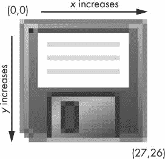

图 19-1：某种古代数据存储设备的`28×27`图像的 x 和 y 坐标

Pillow 的许多函数和方法都带有*框元组*参数。这意味着 Pillow 需要一个表示图像中矩形区域的四个整数坐标的元组。这四个整数按顺序如下：

`Left`：框最左边的 x 坐标。

`Top`：框上边缘的 y 坐标。

`Right`：框最右边右边一个像素的 x 坐标。该整数必须大于左整数。

`Bottom`：比框下边缘低一个像素的 y 坐标。该整数必须大于最大整数。

请注意，该框包括左坐标和上坐标，并向上延伸，但不包括右坐标和下坐标。例如，方框元组`(3, 1, 9, 6)`表示图 19-2 中黑色方框中的所有像素。

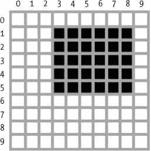

图 19-2：框元组`(3, 1, 9, 6)`表示的区域

### 用 Pillow 操纵图像

现在你知道了颜色和坐标在 Pillow 中是如何工作的，让我们使用 Pillow 来操作一个图像。图 19-3 是本章中所有交互式 Shell 示例将使用的图像。可以从`nostarch.com/automatestuff2`下载。

一旦在当前工作目录中有了图像文件`zophie.png`，就可以将 Zophie 的图像加载到 Python 中了，就像这样：

```py
>>> from PIL import Image
>>> catIm = Image.open('zophie.png')
```

要加载图像，从 Pillow 导入`Image`模块并调用`Image.open()`，给它传递图像的文件名。然后，您可以将加载的图像存储在一个类似`CatIm`的变量中。Pillow 的模块名为`PIL`，以使其向后兼容一个名为 Python 图像库的旧模块；这就是为什么你必须运行`from PIL import Image`而不是`from Pillow import Image`。由于 Pillow 的创建者设置`pillow`模块的方式，你必须使用`import`语句`from PIL import Image`，而不是简单的`import PIL`。

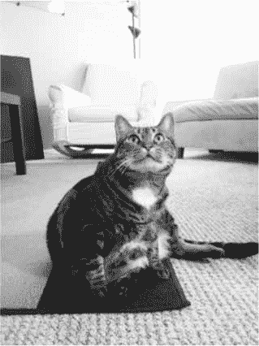

图 19-3：我的猫，佐菲。相机增加了 10 磅（这对一只猫来说太多了）。

如果图像文件不在当前工作目录中，通过调用`os.chdir()`函数将工作目录更改为包含图像文件的文件夹。

```py
>>> import os
>>> os.chdir('C:\\folder_with_image_file')
```

`Image.open()`函数返回`Image`对象数据类型的值，这就是 Pillow 如何将图像表示为 Python 值。通过向`Image.open()`函数传递一个文件名字符串，可以从图像文件（任何格式）中加载一个`Image`对象。您对`Image`对象所做的任何更改都可以用`save()`方法保存到一个图像文件中（也可以是任何格式）。所有的旋转、调整大小、裁剪、绘图和其他图像操作都将通过对这个`Image`对象的方法调用来完成。

为了简化本章中的例子，我假设您已经导入了 Pillow 的`Image`模块，并且您已经将 Zophie 图像存储在一个名为`catIm`的变量中。确保`zophie.png`文件在当前的工作目录中，以便`Image.open()`函数可以找到它。否则，您还必须在`Image.open()`的字符串参数中指定完整的绝对路径。

#### 处理图像数据类型

一个`Image`对象有几个有用的属性，给你关于它被加载的图像文件的基本信息：它的宽度和高度、文件名和图形格式（比如 JPEG、GIF 或 PNG）。

例如，在交互式 Shell 中输入以下内容：

```py
   >>> from PIL import Image
   >>> catIm = Image.open('zophie.png')
   >>> catIm.size
   (816, 1088) # ➊
   >>> width, height = catIm.size # ➋
   >>> width # ➌
   816
   >>> height # ➍
   1088
   >>> catIm.filename
   'zophie.png'
   >>> catIm.format
   'PNG'
   >>> catIm.format_description
   'Portable network graphics'
   >>> catIm.save('zophie.jpg') # ➎
```

在从`zophie.png`制作了一个`Image`对象并将`Image`对象存储在`catIm`中之后，我们可以看到该对象的`size`属性包含了一个以像素为单位的图像宽度和高度的元组 ➊。我们可以将元组中的值赋给`width`和`height`变量 ➋，以便分别访问宽度 ➌ 和高度 ➍。`filename`属性描述原始文件的名称。`format`和`format_description`属性是描述原始文件图像格式的字符串（其中`format_description`更详细一点）。

最后，调用`save()`方法并传递它`'zophie.jpg'`将文件名为`zophie.jpg`的新图像保存到你的硬盘 ➎。Pillow 看到文件扩展名是`.jpg`并使用 JPEG 图像格式自动保存图像。现在你的硬盘上应该有两个图像，`zophie.png`和`zophie.jpg`。虽然这些文件基于相同的图像，但由于格式不同，它们并不完全相同。**

Pillow 还提供了`Image.new()`函数，它返回一个`Image`对象——很像`Image.open()`,除了由`Image.new()`的对象表示的图像将是空白的。`Image.new()`的论据如下：

*   字符串`'RGBA'`，将颜色模式设置为 RGBA。（还有本书没有涉及的其他模式。）
*   新图像的宽度和高度的双整数元组形式的大小。
*   图像开始时的背景色，作为 RGBA 值的四整数元组。对于这个参数，可以使用`ImageColor.getcolor()`函数的返回值。或者，`Image.new()`也支持只传递标准颜色名称的字符串。

例如，在交互式 Shell 中输入以下内容：

```py
   >>> from PIL import Image
   >>> im = Image.new('RGBA', (100, 200), 'purple') # ➊
   >>> im.save('purpleImage.png')
   >>> im2 = Image.new('RGBA', (20, 20)) # ➋
   >>> im2.save('transparentImage.png')
```

这里我们为一幅 100 像素宽、200 像素高的图像创建一个`Image`对象，背景为紫色 ➊。这个图像然后被保存到文件`purpleImage.png`中。我们再次调用`Image.new()`来创建另一个`Image`对象，这一次为尺寸传递`(20, 20)`而不为背景颜色 ➋ 传递任何东西。不可见的黑色，`(0, 0, 0, 0)`，是在没有指定颜色参数的情况下使用的默认颜色，因此第二个图像具有透明背景；我们把这个 20×20 的透明正方形保存在`transparentImage.png`。

#### 裁剪图像

裁剪图像是指选择图像内的一个矩形区域，并删除矩形外的所有内容。对`Image`对象的`crop()`方法接受一个框元组，并返回一个表示裁剪图像的`Image`对象。裁剪不会原地发生——也就是说，原始的`Image`对象保持不变，而`crop()`方法返回一个新的`Image`对象。请记住，装箱的元组（在这种情况下，裁剪部分）包括左列和顶行像素，但仅向上和不包括右列和底行像素。

在交互式 Shell 中输入以下内容：

```py
>>> from PIL import Image
>>> catIm = Image.open('zophie.png')
>>> croppedIm = catIm.crop((335, 345, 565, 560))
>>> croppedIm.save('cropped.png')
```

这为裁剪后的图像创建了一个新的`Image`对象，将该对象存储在`croppedIm`中，然后在`croppedIm`上调用`save()`将裁剪后的图像保存在`cropped.png`中。新文件`cropped.png`将从原始图像中创建，如图 19-4 中的所示。

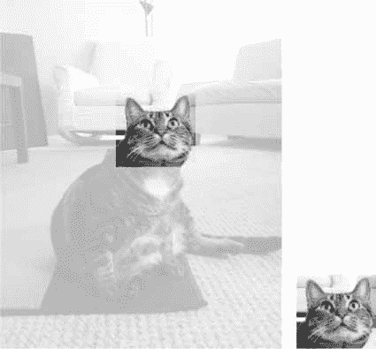

图 19-4：新图像将只是原始图像的裁剪部分。

#### 将图像复制粘贴到其他图像上

`copy()`方法将返回一个新的`Image`对象，其图像与被调用的`Image`对象相同。如果您需要对图像进行更改，但又想保留原始图像的未更改版本，这将非常有用。例如，在交互式 Shell 中输入以下内容：

```py
>>> from PIL import Image
>>> catIm = Image.open('zophie.png')
>>> catCopyIm = catIm.copy()
```

`catIm`和`catCopyIm`变量包含两个独立的`Image`对象，它们都有相同的图像。现在你已经在`catCopyIm`中存储了一个`Image`对象，你可以随意修改`catCopyIm`并将其保存为一个新的文件名，而不影响`zophie.png`。例如，让我们尝试用`paste()`方法修改`catCopyIm`。

在一个`Image`对象上调用`paste()`方法，并在其上粘贴另一个图像。让我们通过粘贴一个更小的图片到`catCopyIm`来继续 Shell 的例子。

```py
>>> faceIm = catIm.crop((335, 345, 565, 560))
>>> faceIm.size
(230, 215)
>>> catCopyIm.paste(faceIm, (0, 0))
>>> catCopyIm.paste(faceIm, (400, 500))
>>> catCopyIm.save('pasted.png')
```

首先，我们传递给`crop()`一个框元组，用于包含 Zophie 的脸的`zophie.png`的矩形区域。这创建了一个代表`230×215`裁剪的`Image`对象，我们将它存储在`faceIm`中。现在我们可以将`faceIm`粘贴到`catCopyIm`上。`paste()`方法有两个参数：一个“来源”`Image`对象和一个 x 和 y 坐标的元组，您要将源`Image`对象的左上角粘贴到主`Image`对象上。这里我们在`catCopyIm`上调用`paste()`两次，第一次传递`(0, 0)`，第二次传递`(400, 500)`。这将`faceIm`粘贴到`catCopyIm`上两次：一次是`faceIm`的左上角在`catCopyIm`的`(0, 0)`处，一次是`faceIm`的左上角在`(400, 500)`处。最后，我们将修改后的`catCopyIm`保存到`pasted.png`。`pasted.png`的图像看起来像图 19-5 。

> 注
>
> 尽管名字不同，Pillow 中的`copy()`和`paste()`方法并不使用你电脑的剪贴板。

注意，`paste()`方法在处修改了它的`Image`对象；它不会返回一个带有粘贴图像的`Image`对象。如果你想调用`paste()`,但又想保留原始图像的一个未动版本，你需要首先复制图像，然后在那个副本上调用`paste()`。


图 19-5：猫佐菲，脸上贴了两次

假设你想把佐菲的头平铺在整个图像上，如图 19-6 所示。你只需要几个`for`循环就可以达到这个效果。通过输入以下内容继续交互式 Shell 示例：

```py
   >>> catImWidth, catImHeight = catIm.size
   >>> faceImWidth, faceImHeight = faceIm.size
   >>> catCopyTwo = catIm.copy() # ➊
   >>> for left in range(0, catImWidth, faceImWidth): # ➋
           for top in range(0, catImHeight, faceImHeight): # ➌
               print(left, top)
               catCopyTwo.paste(faceIm, (left, top))
   0 0
   0 215
   0 430
   0 645
   0 860
   0 1075
   230 0
   230 215
   --snip--
   690 860
   690 1075
   >>> catCopyTwo.save('tiled.png')
```

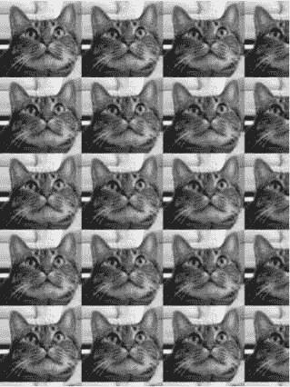

图 19-6：循环的嵌套与粘贴（）一起使用来复制猫的脸（如果你愿意，可以称之为复制猫）

这里我们将`catIm`的高度宽度存储在`catImWidth`和`catImHeight`中。在 ➊ 我们复制了`catIm`并将其存储在`catCopyTwo`中。现在我们有了可以粘贴的副本，我们开始循环将`faceIm`粘贴到`catCopyTwo`上。外`for`循环的`left`变量从 0 开始，增加`faceImWidth(230)`➋。内部`for`循环的`top`变量从 0 开始，增加`faceImHeight(215)`➌和。这些嵌套的`for`循环为`left`和`top`生成值，以将`faceIm`图像的网格粘贴到`catCopyTwo` `Image`对象上，如图 19-6 中的所示。为了查看嵌套循环的工作情况，我们打印了`left`和`top`。粘贴完成后，我们保存修改后的`tiled.png`。

#### 调整图像大小

在一个`Image`对象上调用`resize()`方法，并返回一个指定宽度和高度的新的`Image`对象。它接受两个整数的元组参数，表示返回图像的新宽度和高度。在交互式 Shell 中输入以下内容：

```py
   >>> from PIL import Image
   >>> catIm = Image.open('zophie.png')
   >>> width, height = catIm.size # ➊
   >>> quartersizedIm = catIm.resize((int(width / 2), int(height / 2))) # ➋
   >>> quartersizedIm.save('quartersized.png')
   >>> svelteIm = catIm.resize((width, height + 300)) # ➌
   >>> svelteIm.save('svelte.png')
```

这里我们将`catIm.size`元组中的两个值赋给变量`width`和`height`➊。使用`width`和`height`而不是`catIm.size[0]`和`catIm.size[1]`使得代码的其余部分可读性更好。

第一个`resize()`调用传递了新宽度的`int(width / 2)`和新高度的`int(height / 2)`➋，所以从`resize()`返回的`Image`对象将是原始图像长度和宽度的一半，或者说是原始图像大小的四分之一。`resize()`方法在其元组参数中只接受整数，这就是为什么您需要在一个`int()`调用中用`2`将两个除法都包装起来。

这种调整大小保持宽度和高度的比例不变。但是传递给`resize()`的新宽度和高度不必与原始图像成比例。`svelteIm`变量包含一个`Image`对象，它有原来的宽度，但是高度增加了 300 像素 ➌，让 Zophie 看起来更苗条。

注意，`resize()`方法并不原地编辑`Image`对象，而是返回一个新的`Image`对象。

#### 旋转和翻转图像

可以使用`rotate()`方法旋转图像，该方法返回旋转图像的新的`Image`对象，并保持原始的`Image`对象不变。`rotate()`的参数是一个整数或浮点数，表示逆时针旋转图像的度数。在交互式 Shell 中输入以下内容：

```py
>>> from PIL import Image
>>> catIm = Image.open('zophie.png')
>>> catIm.rotate(90).save('rotated90.png')
>>> catIm.rotate(180).save('rotated180.png')
>>> catIm.rotate(270).save('rotated270.png')
```

注意如何通过直接调用从`rotate()`返回的`Image`对象上的`save()`来*链接*方法调用。第一个`rotate()`和`save()`调用生成一个新的`Image`对象，表示逆时针旋转 90 度的图像，并将旋转后的图像保存到`rotated90.png`。第二个和第三个调用做同样的事情，但是是 180 度和 270 度。结果如图 19-7 所示。

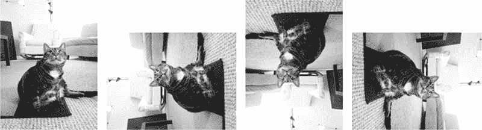

图 19-7：原始图像（左）和逆时针旋转 90 度、180 度和 270 度的图像

请注意，当图像旋转 90 度或 270 度时，图像的宽度和高度会发生变化。如果将图像旋转其他角度，图像的原始尺寸将保持不变。在 Windows 上，黑色背景用于填充旋转产生的任何空隙，如图 19-8 中的所示。在 MacOS 上，透明像素被用于间隙。

`rotate()`方法有一个可选的`expand`关键字参数，可以设置为`True`来放大图像的尺寸，以适应整个旋转后的新图像。例如，在交互式 Shell 中输入以下内容：

```py
>>> catIm.rotate(6).save('rotated6.png')
>>> catIm.rotate(6, expand=True).save('rotated6_expanded.png')
```

第一个调用将图像旋转 6 度并保存到`rotate6.png`（见图 19-8 左图）。第二个调用在`expand`设置为`True`的情况下将图像旋转 6 度，并保存到`rotate6_expanded.png` （见图 19-8 右图）。

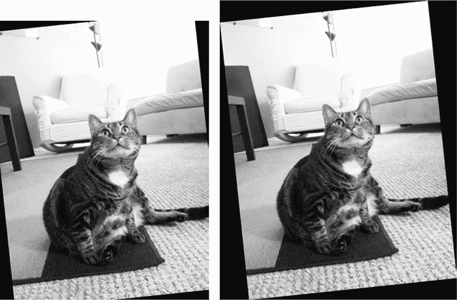

图 19-8：图像正常旋转 6 度（左图）且`expand=True`（右图）

你也可以用`transpose()`方法得到一个图像的“镜像翻转”。您必须将`Image.FLIP_LEFT_RIGHT`或`Image.FLIP_TOP_BOTTOM`传递给`transpose()`方法。在交互式 Shell 中输入以下内容：

```py
>>> catIm.transpose(Image.FLIP_LEFT_RIGHT).save('horizontal_flip.png')
>>> catIm.transpose(Image.FLIP_TOP_BOTTOM).save('vertical_flip.png')
```

像`rotate()`，`transpose()`创建一个新的`Image`对象。这里我们通过`Image.FLIP_LEFT_RIGHT`来水平翻转图像，然后将结果保存到`horizontal_flip.png`。为了垂直翻转图像，我们传递`Image.FLIP_TOP_BOTTOM`并保存到`vertical_flip.png`。结果看起来像图 19-9 。

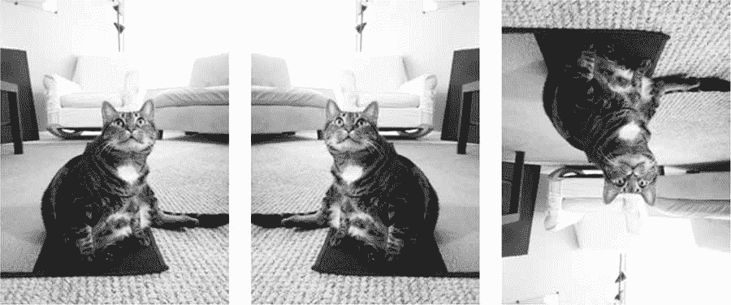

图 19-9：原始图像（左）、水平翻转（中）和垂直翻转（右）

#### 改变单个像素

可以使用`getpixel()`和`putpixel()`方法检索或设置单个像素的颜色。这两种方法都采用表示像素的 x 和 y 坐标的元组。`putpixel()`方法还为像素的颜色提供了一个额外的元组参数。这个颜色参数是一个四整数的 RGBA 元组或一个三整数的 RGB 元组。在交互式 Shell 中输入以下内容：

```py
   >>> from PIL import Image
   >>> im = Image.new('RGBA', (100, 100)) # ➊
   >>> im.getpixel((0, 0)) # ➋
   (0, 0, 0, 0)
   >>> for x in range(100): # ➌
           for y in range(50):
               im.putpixel((x, y), (210, 210, 210)) # ➍
   >>> from PIL import ImageColor
   >>> for x in range(100): # ➎
           for y in range(50, 100):
               im.putpixel((x, y), ImageColor.getcolor('darkgray', 'RGBA')) # ➏
   >>> im.getpixel((0, 0))
   (210, 210, 210, 255)
   >>> im.getpixel((0, 50))
   (169, 169, 169, 255)
   >>> im.save('putPixel.png')
```

在➊，我们制作了一个`100×100`的透明正方形。在这个图像的一些坐标上调用`getpixel()`会返回`(0, 0, 0, 0)`，因为图像是透明的 ➋。为了给这个图像中的像素着色，我们可以使用嵌套的`for`循环遍历图像上半部分的所有像素 ➌，并使用`putpixel()`➍ 给每个像素着色。这里我们传递给`putpixel()`一个浅灰色的 RGB 元组`(210, 210, 210)`。

假设我们想将图像的下半部分涂成深灰色，但不知道深灰色的 RGB 元组。`putpixel()`方法不接受像`'darkgray'`这样的标准颜色名称，所以你必须使用`ImageColor.getcolor()`从`'darkgray'`中获得一个颜色元组。循环遍历图像下半部分的像素 ➎ 并将`ImageColor.getcolor()`➏ 的返回值传递给`putpixel()`，你现在应该有一个上半部分为浅灰色，下半部分为深灰色的图像，如图图 19-10 所示。你可以在一些坐标上调用`getpixel()`来确认任何给定像素的颜色是你所期望的。最后，将图像保存到`putPixel.png`。


图 19-10：`putPixel.png`图片

当然，在图像上一次画一个像素并不方便。如果你需要画形状，使用本章后面解释的`ImageDraw`函数。

### 项目：添加标识

假设你有一份枯燥的工作，要调整成千上万张图片的大小，并在每张图片的角上添加一个小的徽标水印。用一个基本的图形程序，比如 Paintbrush 或画图来做这件事会花费很长时间。Photoshop 等更高级的图形应用程序可以进行批处理，但这种软件要花费数百美元。让我们写一个脚本来代替它。

假设图 19-11 是你想要添加到每个图像右下角的标志：一个带有白色边框的黑猫图标，图像的其余部分是透明的。


图 19-11：添加到图像中的标志

从高层次来看，程序应该做的事情如下：

1.  加载徽标图像。
2.  循环工作目录中的所有`png`和`jpg`文件。
3.  检查图像是否宽于或高于 300 像素。
4.  如果是这样，将宽度或高度（以较大者为准）减少到 300 像素，并按比例缩小其他尺寸。
5.  将徽标图像粘贴到角落。
6.  将修改后的图像保存到另一个文件夹。

这意味着代码需要执行以下操作：

1.  打开`catlogo.png`文件作为`Image`对象。
2.  循环从`os.listdir('.')`返回的字符串。
3.  从`size`属性中获取图像的宽度和高度。
4.  计算调整后的图像的新宽度和高度。
5.  调用`resize()`方法来调整图像的大小。
6.  调用`paste()`方法粘贴 logo。
7.  调用`save()`方法保存更改，使用原来的文件名。

#### 第一步：打开 Logo 图片

对于这个项目，打开一个新的文件编辑器选项卡，输入以下代码，并将其保存为`resizeAndAddLogo.py` :

```py
   #! python3
   # resizeAndAddLogo.py - Resizes all images in current working directory to fit 
   # in a 300x300 square, and adds catlogo.png to the lower-right corner.
   import os
   from PIL import Image
   SQUARE_FIT_SIZE = 300 # ➊
   LOGO_FILENAME = 'catlogo.png' # ➋
   logoIm = Image.open(LOGO_FILENAME) # ➌
   logoWidth, logoHeight = logoIm.size # ➍
   # TODO: Loop over all files in the working directory.
   # TODO: Check if image needs to be resized.
   # TODO: Calculate the new width and height to resize to.
   # TODO: Resize the image.
   # TODO: Add the logo.
   # TODO: Save changes.
```

通过在程序开始时设置`SQUARE_FIT_SIZE`➊ 和`LOGO_FILENAME`➋ 常量，我们使得以后更改程序变得很容易。假设您添加的徽标不是猫图标，或者假设您正在将输出图像的最大尺寸缩小到 300 像素之外。在程序开始时有了这些常量，你就可以打开代码，修改一次这些值，就大功告成了。（或者您也可以这样做，使这些常量的值取自命令行参数。）如果没有这些常量，您将不得不在代码中搜索`300`和`'catlogo.png'`的所有实例，并用新项目的值替换它们。简而言之，使用常量使你的程序更加通用。

logo `Image`对象从`Image.open()`➌ 返回。为了可读性，`logoWidth`和`logoHeight`被赋予来自`logoIm.size`➍ 的值。

程序的其余部分现在是一个注释的框架。

#### 第二步：循环所有文件，打开图像

现在你需要找到当前工作目录下的每一个`.png`文件和`.jpg`文件。你不想把徽标图像添加到徽标图像本身，所以程序应该跳过任何文件名与`LOGO_FILENAME`相同的图像。将以下内容添加到您的代码中：

```py
   #! python3
   # resizeAndAddLogo.py - Resizes all images in current working directory to fit 
   # in a 300x300 square, and adds catlogo.png to the lower-right corner.
   import os
   from PIL import Image
   --snip--
   os.makedirs('withLogo', exist_ok=True)
   # Loop over all files in the working directory.
   for filename in os.listdir('.'): # ➊
       if not (filename.endswith('.png') or filename.endswith('.jpg')) \ # ➋
          or filename == LOGO_FILENAME:
           continue    # skip non-image files and the logo file itself # ➌
       im = Image.open(filename) # ➍
       width, height = im.size
   --snip--
```

首先，`os.makedirs()`调用创建一个`withLogo`文件夹来存储完成的带有 Logo 的图像，而不是覆盖原来的图像文件。如果`withLogo`已经存在，`exist_ok=True`关键字参数将防止`os.makedirs()`引发异常。用`os.listdir('.')`➊ 遍历工作目录下的所有文件时，长`if`语句 ➋ 检查每个文件名是否不以`png`结尾。如果是这样——或者如果该文件是徽标图像本身——那么循环应该跳过它，并使用`continue`➌ 转到下一个文件。如果`filename`以`'.png'`或`'.jpg'`结尾（并且不是 logo 文件），可以将其作为`Image`对象 ➍ 打开，并设置`width`和`height`。

#### 第三步：调整图片大小

只有当宽度或高度大于`SQUARE_FIT_SIZE`（本例中为 300 像素）时，程序才应该调整图像的大小，所以将所有调整大小的代码放在一个检查`width`和`height`变量的`if`语句中。将以下代码添加到您的程序中：

```py
#! python3
# resizeAndAddLogo.py - Resizes all images in current working directory to fit 
# in a 300x300 square, and adds catlogo.png to the lower-right corner.
import os
from PIL import Image
--snip--
     # Check if image needs to be resized.
     if width > SQUARE_FIT_SIZE and height > SQUARE_FIT_SIZE:
         # Calculate the new width and height to resize to.
         if width > height:
               height = int((SQUARE_FIT_SIZE / width) * height) # ➊
               width = SQUARE_FIT_SIZE
         else:
               width = int((SQUARE_FIT_SIZE / height) * width) # ➋
               height = SQUARE_FIT_SIZE
           # Resize the image.
           print('Resizing %s...' % (filename))
           im = im.resize((width, height)) # ➌
--snip--
```

如果图像确实需要调整大小，您需要确定它是宽图像还是高图像。如果`width`大于`height`，那么高度应减少与宽度减少 ➊ 相同的比例。这个比例就是`SQUARE_FIT_SIZE`值除以当前宽度。新的`height`值是这个比例乘以当前的`height`值。因为除法运算符返回一个浮点值，而`resize()`要求维度是整数，记住用`int()`函数将结果转换成整数。最后，新的`width`值将被简单地设置为`SQUARE_FIT_SIZE`。

如果`height`大于或等于`width`（两种情况都在`else`子句中处理），则进行相同的计算，除了将`height`和`width`变量交换为 ➋。

一旦`width`和`height`包含了新的图像尺寸，将它们传递给`resize()`方法，并将返回的`Image`对象存储在`im`➌ 中。

#### 第四步：添加 Logo 并保存修改

无论图像大小是否调整，徽标仍应粘贴在右下角。徽标应该粘贴在哪里取决于图像的大小和徽标的大小。图 19-12 显示了如何计算粘贴位置。粘贴徽标位置的左坐标将是图像宽度减去徽标宽度；粘贴徽标位置的顶部坐标将是图像高度减去徽标高度。

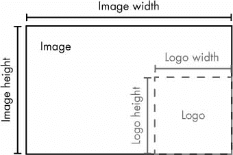

图 19-12：将徽标放置在右下角的左坐标和上坐标应该是图像宽度/高度减去徽标宽度/高度。

在您的代码将徽标粘贴到图像中之后，它应该会保存修改后的`Image`对象。将以下内容添加到您的程序中：

```py
#! python3
# resizeAndAddLogo.py - Resizes all images in current working directory to fit 
# in a 300x300 square, and adds catlogo.png to the lower-right corner.
import os
from PIL import Image
--snip--
     # Check if image needs to be resized.
     --snip--
     # Add the logo.
     print('Adding logo to %s...' % (filename)) # ➊
     im.paste(logoIm, (width - logoWidth, height - logoHeight), logoIm) # ➋
     # Save changes.
     im.save(os.path.join('withLogo', filename)) # ➌
```

新代码打印出一条消息，告诉用户徽标正在添加 ➊，将`logoIm`粘贴到`im`上计算出的坐标 ➋，并将更改保存到`withLogo`目录 ➌ 中的一个文件名中。当您在工作目录中使用`zophie.png`文件作为唯一的图像运行这个程序时，输出将如下所示：

```py
Resizing zophie.png...
Adding logo to zophie.png...
```

图像`zophie.png`将变成`225×300`像素的图像，看起来像图 19-13 。请记住，如果您没有为第三个参数传递`logoIm`，那么`paste()`方法将不会粘贴透明像素。这个程序可以在几分钟内自动调整数百张图片的大小和“标识”。

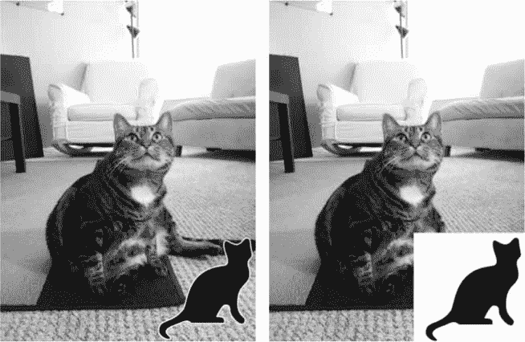

图 19-13：图片`zophie.png`调整大小并添加标识（左图）。如果您忘记了第三个参数，徽标中的透明像素将被复制为纯白像素（右）。

#### 类似节目的创意

能够成批合成图像或修改图像大小在许多应用中是有用的。您可以编写类似的程序来完成以下任务：

*   给图像添加文本或网站 URL。
*   给图像添加时间戳。
*   根据图像的大小将图像复制或移动到不同的文件夹中。
*   将几乎透明的水印添加到图像中，以防止他人复制它。

### 在图像上绘图

如果您需要在图像上绘制线条、矩形、圆形或其他简单形状，请使用 Pillow 的`ImageDraw`模块。在交互式 Shell 中输入以下内容：

```py
>>> from PIL import Image, ImageDraw
>>> im = Image.new('RGBA', (200, 200), 'white')
>>> draw = ImageDraw.Draw(im)
```

首先我们导入`Image`和`ImageDraw`。然后我们创建一个新的图像，在这个例子中，是一个`200×200`的白色图像，并将`Image`对象存储在`im`中。我们将`Image`对象传递给`ImageDraw.Draw()`函数来接收一个`ImageDraw`对象。这个对象有几个在`Image`对象上绘制形状和文本的方法。将`ImageDraw`对象存储在一个类似`draw`的变量中，以便在下面的例子中轻松使用。

#### 绘制形状

下列`ImageDraw`方法在图像上绘制各种形状。这些方法的`fill`和`outline`参数是可选的，如果不指定，将默认为白色。

##### 分

`point(xy, fill)`方法绘制单个像素。 `xy`参数表示您想要绘制的点的列表。该列表可以是 x 和 y 坐标元组的列表，例如`[(x, y), (x, y), ...]`，或者是没有元组的 x 和 y 坐标的列表，例如`[x1, y1, x2, y2, ...]`。 `fill`参数是点的颜色，或者是 RGBA 元组，或者是颜色名称的字符串，比如`'red'`。填充参数是可选的。

##### 行

用`line(xy, fill, width)`的方法绘制一条线或一系列线。 `xy`要么是元组列表，比如`[(x, y), (x, y), ...]`，要么是整数列表，比如`[x1, y1, x2, y2, ...]`。每个点都是你正在画的线上的连接点之一。可选的填充参数是线条的颜色，作为 RGBA 元组或颜色名称。可选的宽度参数是线条的宽度，如果未指定，默认为 1。

##### 矩形

用`rectangle(xy,fill,`勾勒`)`的方法绘制矩形。 `xy`参数是一个框形元组，形式为（左、上、右、下）。左和上值指定矩形左上角的 x 和 y 坐标，而右和下指定右下角。可选的填充参数是填充矩形内部的颜色。可选的轮廓参数是矩形轮廓的颜色。

##### 省略号

用`ellipse(xy, fill, outline)`的方法绘制椭圆。如果椭圆的宽度和高度相同，此方法将绘制一个圆。 `xy`参数是一个框元组（左、上、右、下），表示一个精确包含椭圆的框。可选的填充参数是椭圆内部的颜色，可选的轮廓参数是椭圆轮廓的颜色。

##### 多边形

`polygon(xy,fill, outline)`方法绘制任意多边形。 `xy`参数是元组列表，如`[(x, y), (x, y), ...]`或整数列表，如`[x1, y1, x2, y2, ...]`，代表多边形边的连接点。最后一对坐标将自动连接到第一对坐标。可选的填充参数是多边形内部的颜色，可选的轮廓参数是多边形轮廓的颜色。

##### 绘图示例

在交互式 Shell 中输入以下内容：

```py
   >>> from PIL import Image, ImageDraw
   >>> im = Image.new('RGBA', (200, 200), 'white')
   >>> draw = ImageDraw.Draw(im)
   >>> draw.line([(0, 0), (199, 0), (199, 199), (0, 199), (0, 0)], fill='black') # ➊
   >>> draw.rectangle((20, 30, 60, 60), fill='blue') # ➋
   >>> draw.ellipse((120, 30, 160, 60), fill='red') # ➌
   >>> draw.polygon(((57, 87), (79, 62), (94, 85), (120, 90), (103, 113)), # ➍
   fill='brown')
   >>> for i in range(100, 200, 10): # ➎
           draw.line([(i, 0), (200, i - 100)], fill='green')
   >>> im.save('drawing.png')
```

为 200×200 的白色图像制作一个`Image`对象，传递给`ImageDraw.Draw()`得到一个`ImageDraw`对象，将`ImageDraw`对象存储在`draw`后，就可以在`draw`上调用绘制方法了。在这里，我们在图像的边缘制作一个细的黑色轮廓 ➊，一个左上角在`(20, 30)`和右下角在`(60, 60)`➋ 的蓝色矩形，一个由从`(120, 30)`到`(160, 60)`➌ 的方框定义的红色椭圆，一个有五个点的棕色多边形 ➍，以及一个用`for`绘制的绿色线条图案产生的`drawing.png`文件将看起来像图 19-14 。

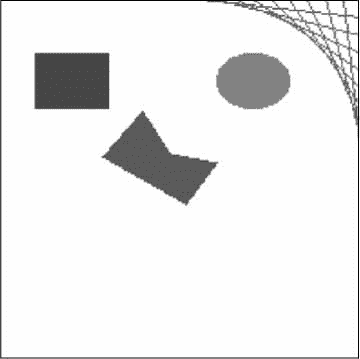

图 19-14：生成的`drawing.png`图像

对于`ImageDraw`对象，还有其他几种形状绘制方法。完整文档可在[`pillow.readthedocs.io`](https://pillow.readthedocs.io/en/latest/reference/ImageDraw.html)获取。

#### 绘图文字

`ImageDraw`对象也有一个用于在图像上绘制文本的`text()`方法。`text()`方法有四个参数： `xy` 、`text`、`fill`和`font`。

*   `xy`参数是一个双整数元组，指定文本框的左上角。
*   `text`参数是您要编写的文本字符串。
*   可选的`fill`参数是文本的颜色。
*   可选的`font`参数是一个`ImageFont`对象，用于设置文本的字体和大小。下一节将对此进行更详细的描述。

由于通常很难预先知道给定字体的文本块的大小，`ImageDraw`模块还提供了一个`textsize()`方法。它的第一个参数是要测量的文本字符串，第二个参数是可选的`ImageFont`对象。然后，`textsize()`方法将返回一个宽度和高度的两整数元组，如果给定字体的文本被写到图像上，它将是这样的。您可以使用这个宽度和高度来帮助您准确计算您想要在图像上放置文本的位置。

`text()`的前三个参数很简单。在我们使用`text()`将文本绘制到图像上之前，让我们看看可选的第四个参数，`ImageFont`对象。

`text()`和`textsize()`都将一个可选的`ImageFont`对象作为它们的最终参数。要创建这些对象之一，首先运行以下命令：

```py
>>> from PIL import ImageFont
```

现在您已经导入了 Pillow 的`ImageFont`模块，您可以调用`ImageFont.truetype()`函数，它有两个参数。第一个参数是字体的 *TrueType 文件*的字符串——这是位于硬盘上的实际字体文件。TrueType 文件有`ttf`文件扩展名，通常可以在以下文件夹中找到：

*   在 Windows 上： `C:\Windows\Fonts`
*   在 MacOS 上：`/lib/font`和`/sys/lib/font`
*   在 Linux 上：`/usr/share/fonts/truetype`

您实际上不需要输入这些路径作为 TrueType 文件字符串的一部分，因为 Python 知道自动在这些目录中搜索字体。但是如果 Python 找不到您指定的字体，它会显示一个错误。

`ImageFont.truetype()`的第二个参数是以*点*表示的字体大小的整数（而不是像素）。请记住，Pillow 创建的 PNG 图像默认为每英寸 72 像素，一个点是 1/72 英寸。

在交互式 Shell 中输入以下内容，用操作系统使用的实际文件夹名称替换`FONT_FOLDER`:

```py
   >>> from PIL import Image, ImageDraw, ImageFont
   >>> import os
   >>> im = Image.new('RGBA', (200, 200), 'white') # ➊
   >>> draw = ImageDraw.Draw(im) # ➋
   >>> draw.text((20, 150), 'Hello', fill='purple') # ➌
   >>> fontsFolder = 'FONT_FOLDER' # e.g. ‘/Library/Fonts'
   >>> arialFont = ImageFont.truetype(os.path.join(fontsFolder, 'arial.ttf'), 32) # ➍
   >>> draw.text((100, 150), 'Howdy', fill='gray', font=arialFont) # ➎
   >>> im.save('text.png')
```

导入`Image`、`ImageDraw`、`ImageFont`、`os`后，我们为新的`200×200`白色图像 ➊ 制作一个`Image`对象，并从`Image`对象 ➋ 制作一个`ImageDraw`对象。我们用`text()`在紫色 ➌ 的`(20, 150)`处绘制`Hello`。在这个`text()`调用中，我们没有传递可选的第四个参数，所以这个文本的字体和大小不是定制的。

为了设置字体和大小，我们首先将文件夹名（如`/Library/Fonts` ）存储在`fontsFolder`中。然后我们调用`ImageFont.truetype()`，将它传递给`.ttf`文件为我们想要的字体，后跟一个整数字号 ➍。将你从`ImageFont.truetype()`得到的`Font`对象存储在一个类似`arialFont`的变量中，然后在最后一个关键字参数中将变量传递给`text()`。在 ➎ 的`text()`调用在`(100, 150)`以 32 磅的 Arial 以灰色绘制`Howdy`。

产生的`text.png`文件将看起来像图 19-15 。

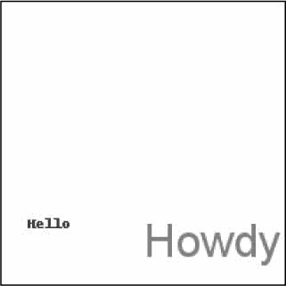

图 19-15：生成的`text.png`图像

### 总结

图像由像素的集合组成，每个像素都有其颜色的 RGBA 值，并可通过 x 和 y 坐标寻址。两种常见的图像格式是 JPEG 和 PNG。`pillow`模块可以处理这些图像格式和其他格式。

当一个图像被加载到一个`Image`对象中时，它的宽度和高度尺寸作为一个双整数元组存储在`size`属性中。`Image`数据类型的对象也有常用的图像操作方法：`crop()`、`copy()`、`paste()`、`resize()`、`rotate()`和`transpose()`。要将`Image`对象保存到图像文件，调用`save()`方法。

如果你想让你的程序在图像上绘制形状，使用`ImageDraw`方法来绘制点、线、矩形、椭圆和多边形。该模块还提供了以您选择的字样和字体大小绘制文本的方法。

尽管 Photoshop 等高级（昂贵）应用程序提供了自动批处理功能，但您可以使用 Python 脚本免费进行许多相同的修改。在前面的章节中，您编写了 Python 程序来处理纯文本文件、电子表格、PDF 和其他格式。使用`pillow`模块，您还可以将编程能力扩展到处理图像！

### 练习题

1.  什么是 RGBA 值？

2.  如何从`Pillow`模块中获得`'CornflowerBlue'`的 RGBA 值？

3.  什么是盒元组？

4.  哪个函数返回一个`Image`对象，比如一个名为`zophie.png`的图像文件？

5.  如何找出一个`Image`物体图像的宽度和高度？

6.  你会调用什么方法来获取 100×100 图像的`Image`对象，不包括它的左下四分之一？

7.  对`Image`对象进行更改后，如何将其保存为图像文件？

8.  什么模块包含 Pillow 的形状绘制代码？

9.  `Image`对象没有绘制方法。什么样的物体会？怎么得到这种对象？

### 实践项目

为了练习，编写执行以下操作的程序。

#### 扩展和固定章节项目程序

本章中的`resizeAndAddLogo.py`程序适用于 PNG 和 JPEG 文件，但是 Pillow 支持的格式远不止这两种。扩展`resizeAndAddLogo.py`来处理 GIF 和 BMP 图像。

另一个小问题是，该程序只修改 PNG 和 JPEG 文件，如果他们的文件扩展名设置为小写。例如，它会处理`zophie.png`，但不会处理`zophie.PNG`。更改代码，使文件扩展名检查不区分大小写。

最后，添加到右下角的徽标本来只是一个小标记，但如果图像与徽标本身的大小差不多，结果看起来就会像图 19-16 。修改`resizeAndAddLogo.py`以便在粘贴徽标之前，图像的宽度和高度必须至少是徽标图像的两倍。否则，它应该跳过添加徽标。

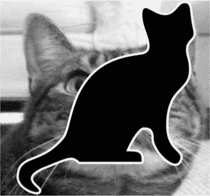

图 19-16：当图像比徽标大不了多少时，结果看起来很难看。

#### 识别硬盘上的照片文件夹

我有一个坏习惯，就是把数码相机里的文件转移到硬盘上的临时文件夹里，然后忘记这些文件夹。如果能写一个程序来扫描整个硬盘并找到这些剩余的“照片文件夹”就好了

编写一个程序，遍历硬盘上的每个文件夹，找到潜在的照片文件夹。当然，首先你必须定义你认为的“照片文件夹”是什么；假设它是任何一个一半以上的文件都是照片的文件夹。你如何定义哪些文件是照片？首先，照片文件必须有文件扩展名`.png`或`.jpg`。还有，照片是大图；照片文件的宽度和高度都必须大于 500 像素。这是一个安全的赌注，因为大多数数码相机照片的宽度和高度都是几千像素。

作为提示，下面是这个程序的大概框架：

```py
#! python3
# Import modules and write comments to describe this program.
for foldername, subfolders, filenames in os.walk('C:\\'):
    numPhotoFiles = 0
    numNonPhotoFiles = 0
    for filename in filenames:
        # Check if file extension isn't .png or .jpg.
        if TODO:
            numNonPhotoFiles += 1
            continue    # skip to next filename
        # Open image file using Pillow.
        # Check if width & height are larger than 500.
        if TODO:
            # Image is large enough to be considered a photo.
            numPhotoFiles += 1
        else:
            # Image is too small to be a photo.
            numNonPhotoFiles += 1
    # If more than half of files were photos,
    # print the absolute path of the folder.
    if TODO:
        print(TODO)
```

当程序运行时，它应该将任何照片文件夹的绝对路径打印到屏幕上。

#### 定制座次卡

第 15 章包含了一个练习项目，从一个纯文本文件中的客人列表创建自定义邀请。作为一个附加项目，使用`pillow`模块为您的客人创建定制座位卡的图像。从的资源中为`guests.txt`文件中列出的每个客人，生成一个带有客人姓名和一些华丽装饰的图像文件。在本书的参考资料中还提供了一个公共域花卉图像。

为了确保每张座位卡的大小相同，请在邀请函图像的边缘添加一个黑色矩形，这样当图像打印出来时，就有了剪切指南。Pillow 生成的 PNG 文件被设置为每英寸 72 像素，因此`4×5`英寸的卡需要`288×360`像素的图像。