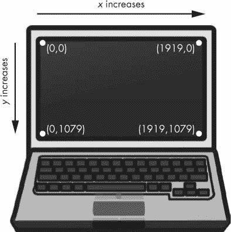
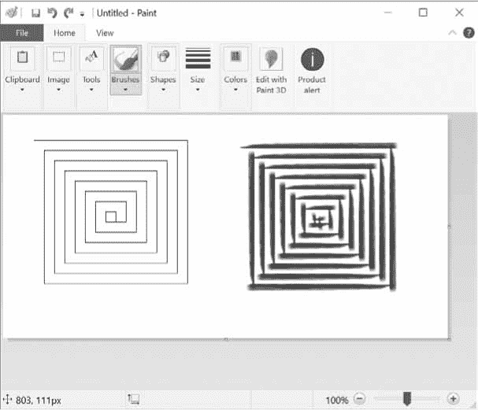
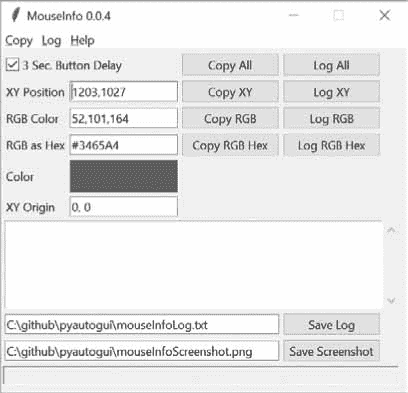
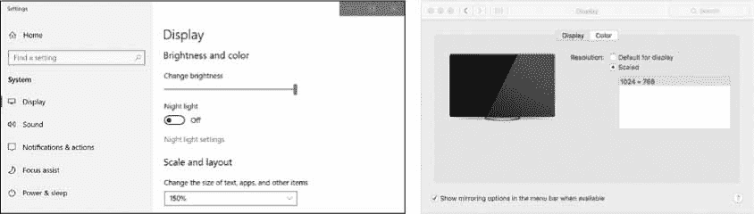
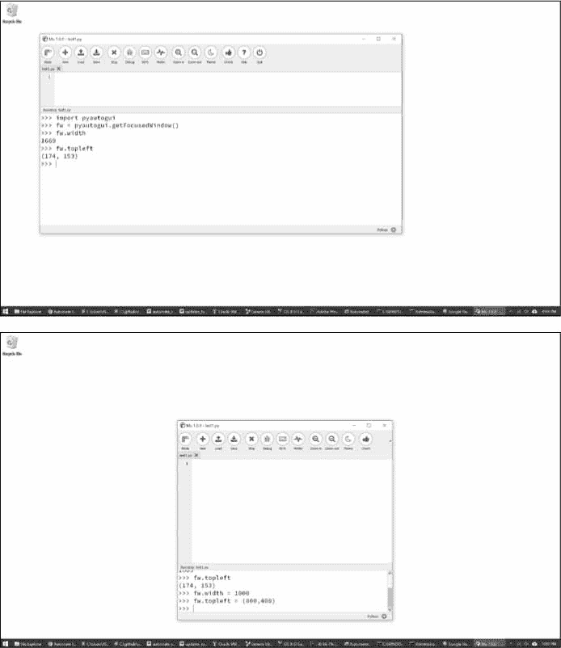
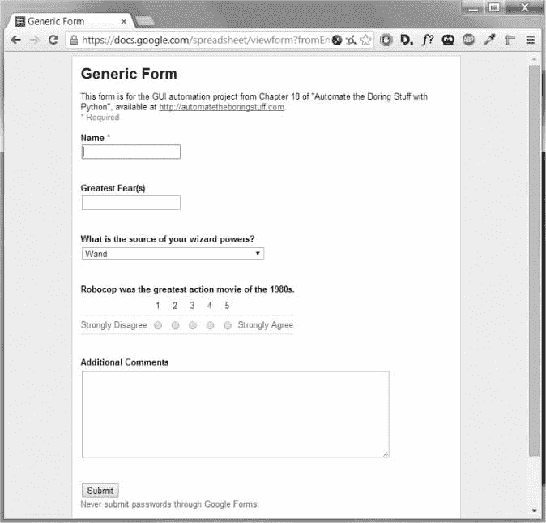
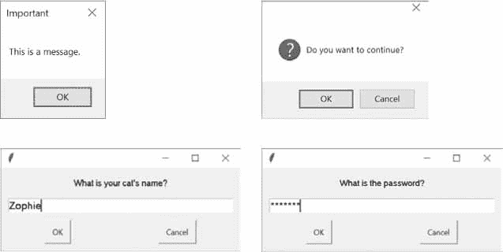

# 20 使用 GUI 自动化控制键盘和鼠标

> 原文：<https://automatetheboringstuff.com/2e/chapter20/>


了解用于编辑电子表格、下载文件和启动程序的各种 Python 模块是很有用的，但有时您需要使用的应用程序没有任何模块。在计算机上实现任务自动化的终极工具是你编写的直接控制键盘和鼠标的程序。这些程序可以通过发送虚拟击键和鼠标点击来控制其他应用程序，就像你坐在电脑前亲自与应用程序进行交互一样。

这种技术被称为*图形用户界面自动化*，或者简称为 *GUI 自动化*。有了 GUI 自动化，你的程序可以做坐在电脑前的人类用户能做的任何事情，除了把咖啡洒在键盘上。把 GUI 自动化想象成给一个机器人手臂编程。你可以给机械臂编程，让它在你的键盘上打字，并为你移动鼠标。这种技术对于涉及大量无意识点击或填写表格的任务特别有用。

一些公司出售创新的(且昂贵的)“自动化解决方案”，通常以**【RPA】*的名义销售。这些产品实际上与您可以用`pyautogui`模块自己制作的 Python 脚本没有什么不同，该模块具有模拟鼠标移动、按钮点击和鼠标滚轮滚动的功能。本章仅涵盖 PyAutoGUI 特性的一个子集；你可以在 https://pyautogui.readthedocs.io/找到完整的文档。*

 *### **安装 pyautogui 模块**

`pyautogui`模块可以向 Windows、macOS 和 Linux 发送虚拟按键和鼠标点击。Windows 和 macOS 用户可以简单地使用 pip 来安装 PyAutoGUI。然而，Linux 用户首先必须安装一些 PyAutoGUI 所依赖的软件。打开终端窗口，输入以下命令:

*   `sudo apt-get install scrot`
*   `sudo apt-get install python3-tk`
*   `sudo apt-get install python3-dev`

要安装 PyAutoGUI，运行`pip install --user pyautogui`。不要用`sudo`搭配`pip`；您可能会将模块安装到操作系统使用的 Python 安装中，从而导致与依赖于其原始配置的任何脚本发生冲突。然而，当使用`apt-get`安装应用程序时，您应该使用`sudo`命令。

[附录 A](#calibre_link-2) 有关于安装第三方模块的完整信息。要测试 PyAutoGUI 是否已正确安装，请从交互式 shell 中运行 import pyautogui 并检查任何错误消息。

**警告**

不要将你的程序保存为 pyautogui.py *。当你运行 import pyautogui 时，Python 会导入你的程序而不是 pyautogui，你会得到类似attribute error:module ' PyAutoGUI '没有属性' click' 。*

### **在 macOS 上设置辅助功能应用**

作为一种安全措施，macOS 通常不让程序控制鼠标或键盘。要让 PyAutoGUI 在 macOS 上工作，您必须将运行 Python 脚本的程序设置为可访问性应用程序。如果没有这一步，您的 PyAutoGUI 函数调用将没有任何效果。

无论您是从 Mu、IDLE 还是终端运行 Python 程序，都要打开该应用程序。然后打开“系统偏好设置”并转到“辅助功能”标签。当前打开的应用程序将出现在“允许下面的应用程序控制您的电脑”标签下。检查 Mu、IDLE、Terminal 或您用来运行 Python 脚本的任何应用程序。系统会提示您输入密码以确认这些更改。

### **保持在轨道上**

在您进入 GUI 自动化之前，您应该知道如何避免可能出现的问题。Python 可以以令人难以置信的速度移动鼠标和击键。事实上，它可能太快了，其他程序跟不上。此外，如果出了问题，但你的程序不停地移动鼠标，这将很难告诉确切的程序在做什么或如何从问题中恢复。就像迪士尼电影《魔法师的学徒》中的魔法扫帚一样，它不停地往米奇的浴缸里注水，然后又注满，即使你的程序完全按照你的指令运行，它也可能会失去控制。如果鼠标自己四处移动，停止程序可能会很困难，使您无法单击 Mu 编辑器窗口来关闭它。幸运的是，有几种方法可以防止 GUI 自动化问题或从中恢复。

#### ***暂停和自动防故障***

如果你的程序有一个 bug，而你不能使用键盘和鼠标来关闭它，你可以使用 PyAutoGUI 的自动防故障功能。将鼠标快速滑动到屏幕的四个角之一。每个 PyAutoGUI 函数调用在执行其动作后都有十分之一秒的延迟，以便有足够的时间将鼠标移到角落。如果 PyAutoGUI 随后发现鼠标光标在一个角落，它会引发`pyautogui.FailSafeException`异常。非 PyAutoGUI 指令没有这种十分之一秒的延迟。

如果您发现自己处于需要停止 PyAutoGUI 程序的情况，只需朝某个角落猛按鼠标即可停止。

#### ***注销关闭一切***

也许停止失控的 GUI 自动化程序的最简单方法是注销，这将关闭所有正在运行的程序。在 Windows 和 Linux 上，注销热键是<small class="calibre11">CTRL</small>-<small class="calibre11">ALT</small>-<small class="calibre11">DEL</small>。在 macOS 上，是-<small class="calibre11">SHIFT</small>-<small class="calibre11">OPTION</small>-q .通过注销，你会丢失任何未保存的工作，但至少你不用等待电脑完全重启。

### **控制鼠标移动**

在本节中，您将学习如何使用 PyAutoGUI 移动鼠标并跟踪其在屏幕上的位置，但首先您需要理解 PyAutoGUI 如何处理坐标。

PyAutoGUI 的鼠标功能使用 x 和 y 坐标。[图 20-1](#calibre_link-1628) 显示了计算机屏幕的坐标系；这类似于用于图像的坐标系统，在[第 19 章](#calibre_link-608)中讨论过。*原点*，其中*x*T8*y*均为零，位于屏幕左上角。x 坐标向右增加，y 坐标向下增加。所有坐标都是正整数；没有负坐标。



*图 20-1:分辨率为 1920×1080 的电脑屏幕坐标*

你的*分辨率*是你的屏幕有多少像素宽和高。如果您的屏幕分辨率设置为 1920×1080，那么左上角的坐标将是(0，0)，右下角的坐标将是(1919，1079)。

函数返回屏幕宽度和高度的两个整数元组，以像素为单位。在交互式 shell 中输入以下内容:

```py
>>> import pyautogui

>>> wh = pyautogui.size() # Obtain the screen resolution.

>>> wh

Size(width=1920, height=1080)

>>> wh[0]

1920

>>> wh.width

1920
```

在分辨率为 1920×1080 的计算机上，`pyautogui.size()`函数返回`(1920, 1080)`；根据屏幕分辨率的不同，返回值可能会有所不同。`size()`返回的`Size`对象是一个命名元组。*命名元组*有数字索引，像常规元组，还有属性名，像对象:`wh[0]`和`wh.width`都计算屏幕的宽度。(命名元组不在本书讨论范围之内。请记住，您可以像使用元组一样使用它们。)

#### ***移动鼠标***

现在你明白了屏幕坐标，让我们移动鼠标。`pyautogui.moveTo()`功能会立即将鼠标光标移动到屏幕上的指定位置。x 坐标和 y 坐标的整数值分别构成函数的第一个和第二个参数。可选的`duration` integer 或 float 关键字参数指定将鼠标移动到目的地所需的秒数。如果你不考虑它，默认是`0`用于瞬时移动。(PyAutoGUI 函数中所有的`duration`关键字参数都是可选的。)在交互式 shell 中输入以下内容:

```py
>>> import pyautogui

>>> for i in range(10): # Move mouse in a square.

...       pyautogui.moveTo(100, 100, duration=0.25)

...       pyautogui.moveTo(200, 100, duration=0.25)

...       pyautogui.moveTo(200, 200, duration=0.25)

...       pyautogui.moveTo(100, 200, duration=0.25)
```

本示例在提供的四个坐标中以正方形模式顺时针移动鼠标光标共 10 次。每个动作需要四分之一秒，由关键字参数指定。如果您没有向任何一个`pyautogui.moveTo()`调用传递第三个参数，鼠标光标会立即从一个点传送到另一个点。

`pyautogui.move()`功能将鼠标光标*相对于其当前位置*移动。下面的示例以相同的方块模式移动鼠标，只是它从代码开始运行时鼠标恰好出现在屏幕上的位置开始方块:

```py
>>> import pyautogui

>>> for i in range(10):

...       pyautogui.move(100, 0, duration=0.25)   # right

...       pyautogui.move(0, 100, duration=0.25)   # down

...       pyautogui.move(-100, 0, duration=0.25)  # left

...       pyautogui.move(0, -100, duration=0.25)  # up
```

`pyautogui.move()`函数也有三个参数:向右水平移动多少像素，向下垂直移动多少像素，以及(可选)完成移动需要多长时间。第一个或第二个参数的负整数将分别导致鼠标向左或向上移动。

#### ***获取鼠标位置***

您可以通过调用`pyautogui.position()`函数来确定鼠标的当前位置，该函数将在函数调用时返回鼠标光标的 *x* 和 *y* 位置的一个名为`Point`的元组。在交互式 shell 中输入以下内容，每次调用后移动鼠标:

```py
>>> pyautogui.position() # Get current mouse position.

Point(x=311, y=622)

>>> pyautogui.position() # Get current mouse position again.

Point(x=377, y=481)

>>> p = pyautogui.position() # And again.

>>> p

Point(x=1536, y=637)

>>> p[0] # The x-coordinate is at index 0.

1536

>>> p.x # The x-coordinate is also in the x attribute.

1536
```

当然，您的返回值将根据鼠标光标的位置而变化。

### **控制鼠标交互**

现在你知道了如何移动鼠标，并且知道了它在屏幕上的位置，你就可以开始点击、拖动和滚动了。

#### ***点击鼠标***

要向您的计算机发送虚拟鼠标点击，请调用`pyautogui.click()`方法。默认情况下，这种单击使用鼠标左键，并且发生在鼠标光标当前所在的任何位置。如果您希望单击发生在鼠标当前位置之外的某个位置，可以将单击的 x 和 y 坐标作为可选的第一个和第二个参数传递。

如果您想要指定使用哪个鼠标按钮，请包含关键字参数`button`，其值为`'left'`、`'middle'`或`'right'`。例如，`pyautogui.click(100, 150, button='left')`将在坐标(100，150)处单击鼠标左键，而`pyautogui.click(200, 250, button='right')`将在坐标(200，250)处执行右键单击。

在交互式 shell 中输入以下内容:

```py
>>> import pyautogui

>>> pyautogui.click(10, 5) # Move mouse to (10, 5) and click.
```

您应该看到鼠标指针移动到屏幕左上角附近，并单击一次。完整的“点击”定义为按下鼠标按钮，然后在不移动光标的情况下释放鼠标按钮。也可以通过调用只按下鼠标按钮的`pyautogui.mouseDown()`和只释放按钮的`pyautogui.mouseUp()`来执行点击。这些函数与`click()`有相同的参数，事实上，`click()`函数只是这两个函数调用的方便包装器。

为了进一步方便起见，`pyautogui.doubleClick()`功能将用鼠标左键执行两次点击，而`pyautogui.rightClick()`和`pyautogui.middleClick()`功能将分别用鼠标右键和鼠标中键执行一次点击。

#### ***拖动鼠标***

*拖动*是指按住一个鼠标键的同时移动鼠标。例如，您可以通过拖移文件夹图标在文件夹之间移动文件，或者您可以在日历应用程序中四处移动约会。

PyAutoGUI 提供了`pyautogui.dragTo()`和`pyautogui.drag()`函数来将鼠标光标拖动到一个新位置或相对于当前位置的位置。`dragTo()`和`drag()`的参数与`moveTo()`和`move()`相同:x 坐标/水平移动，y 坐标/垂直移动，以及可选的持续时间。(鼠标移动过快时 macOS 无法正确拖动，建议传递一个`duration`关键字参数。)

要尝试这些功能，请打开一个图形绘制应用程序，例如 Windows 上的 MS Paint、macOS 上的 Paintbrush 或 Linux 上的 GNU Paint。(如果您没有绘图应用程序，可以在使用在线应用程序。)我将使用 PyAutoGUI 在这些应用程序中绘图。

将鼠标光标放在绘图应用程序的画布上，选择铅笔或画笔工具，在新的文件编辑器窗口中输入以下内容，并将其另存为 *spiralDraw.py* :

```py
   import pyautogui, time

? time.sleep(5)

? pyautogui.click()    # Click to make the window active.

   distance = 300

   change = 20

   while distance > 0:

    ? pyautogui.drag(distance, 0, duration=0.2)   # Move right.

    ? distance = distance – change

    ? pyautogui.drag(0, distance, duration=0.2)   # Move down.

    ? pyautogui.drag(-distance, 0, duration=0.2)  # Move left.

       distance = distance – change

       pyautogui.drag(0, -distance, duration=0.2)  # Move up.
```

运行这个程序的时候会有五秒钟的延迟？用于在选择铅笔或画笔工具的情况下，将鼠标光标移动到绘图程序的窗口上。然后 *spiralDraw.py* 会控制鼠标点击使绘图程序的窗口活跃？。*活动窗口*是当前接受键盘输入的窗口，你所采取的行动——比如打字，或者在这种情况下，拖动鼠标——将影响那个窗口。活动窗口也称为*聚焦窗口*或*前台窗口*。一旦绘图程序激活， *spiralDraw.py* 绘制一个类似于[图 20-2](#calibre_link-1629) 左侧的方形螺旋图案。虽然你也可以使用第 19 章中的[模块创建一个方形螺旋图像，但是通过控制鼠标在 MS Paint 中绘制来创建图像可以让你利用这个程序的各种笔刷风格，就像右边的](#calibre_link-608)[图 20-2](#calibre_link-1629) 一样，以及其他高级功能，比如渐变或填充桶。你可以自己预先选择笔刷设置(或者让你的 Python 代码选择这些设置)，然后运行螺旋绘制程序。



*图 20-2:来自 pyautogui.drag() 示例的结果，用 MS Paint 的不同笔刷绘制*

`distance`变量从`200`开始，所以在`while`循环的第一次迭代中，第一个`drag()`调用将光标向右拖动 200 个像素，耗时 0.2 秒？。`distance`然后减少到 195 ？，第二个`drag()`调用将光标向下拖动 195 像素？。第三个`drag()`调用水平拖动光标–195(向左 195)？，`distance`减小到 190，最后一个`drag()`调用将光标向上拖动 190 像素。在每一次迭代中，鼠标被向右、向下、向左和向上拖动，并且`distance`比前一次迭代中的略小。通过循环这段代码，您可以移动鼠标光标来绘制一个方形螺旋。

你可以用手(或者更确切地说，用鼠标)画出这个螺旋，但是你必须慢慢地工作才能如此精确。PyAutoGUI 几秒钟就能搞定！

**注**

在撰写本文时，PyAutoGUI 无法向某些程序发送鼠标点击或按键，如防病毒软件(防止病毒禁用该软件)或 Windows 上的视频游戏(使用不同的方法接收鼠标和键盘输入)。您可以在 https://pyautogui.readthedocs.io/*的* [查看在线文档，看看这些功能是否已经添加。](https://pyautogui.readthedocs.io/)

#### ***滚动鼠标***

最后一个 PyAutoGUI 鼠标函数是`scroll()`，它传递了一个整数参数，表示您希望鼠标上下滚动多少个单位。一个单元的大小因操作系统和应用程序的不同而不同，所以您必须进行实验，看看在您的特定情况下它到底能滚动多远。滚动发生在鼠标光标的当前位置。传递正整数向上滚动，传递负整数向下滚动。当鼠标光标位于管理部门编辑器窗口上时，在管理部门编辑器的交互式 shell 中运行以下内容:

```py
>>> pyautogui.scroll(200)
```

如果鼠标光标在可以向上滚动的文本字段上，您将看到 Mu 向上滚动。

### **计划您的鼠标移动**

编写自动点击屏幕的程序的困难之一是找到你想要点击的东西的 x 和 y 坐标。`pyautogui.mouseInfo()`功能可以帮你做到这一点。

`pyautogui.mouseInfo()`函数应该从交互式 shell 中调用，而不是作为程序的一部分。它启动 PyAutoGUI 中包含的一个名为 MouseInfo 的小应用程序。应用程序的窗口看起来像[图 20-3](#calibre_link-1630) 。



*图 20-3:mouse info 应用程序的窗口*

在交互式 shell 中输入以下内容:

```py
>>> import pyautogui

>>> pyautogui.mouseInfo()
```

这将显示 MouseInfo 窗口。此窗口以三个整数的 RGB 元组和十六进制值的形式提供鼠标光标当前位置的信息，以及鼠标光标下像素的颜色。颜色本身出现在窗口的颜色框中。

为了帮助您记录坐标或像素信息，您可以点击八个复制或记录按钮中的一个。复制全部、复制 XY、复制 RGB 和复制 RGB 十六进制按钮会将它们各自的信息复制到剪贴板。“全部记录”、“XY 记录”、“RGB 记录”和“RGB 十六进制记录”按钮会将各自的信息写入窗口中的大文本字段。您可以通过单击保存日志按钮来保存日志文本字段中的文本。

默认情况下，3 秒。“按钮延迟”复选框被选中，导致在点按“拷贝”或“记录”按钮和拷贝或记录发生之间有三秒钟的延迟。这给了你很短的时间点击按钮，然后移动鼠标到你想要的位置。取消选中此框，将鼠标移动到位，并按 F1 到 F8 键来复制或记录鼠标位置可能更容易。您可以查看 MouseInfo 窗口顶部的“复制”和“日志”菜单，找出哪个键映射到哪个按钮。

例如，取消选中 3 秒。按钮延迟，然后在按下 F6 按钮的同时在屏幕上移动鼠标，注意鼠标的 x 和 y 坐标是如何记录在窗口中间的大文本字段中的。您可以稍后在 PyAutoGUI 脚本中使用这些坐标。

有关 MouseInfo 的更多信息，请查看位于*[https://mouseinfo.readthedocs.io/](https://mouseinfo.readthedocs.io/)*的完整文档。

### **使用屏幕**

你的 GUI 自动化程序不必盲目地点击和输入。PyAutoGUI 具有屏幕截图功能，可以根据屏幕的当前内容创建一个图像文件。这些函数还可以返回当前屏幕外观的枕头`Image`对象。如果你已经跳过了这本书，你会想在继续本节之前阅读[第 17 章](#calibre_link-530)并安装`pillow`模块。

在 Linux 电脑上，需要安装`scrot`程序才能使用 PyAutoGUI 中的截图功能。在终端窗口中，运行 **sudo apt-get install scrot** 来安装这个程序。如果您使用的是 Windows 或 macOS，请跳过这一步，继续本节。

#### ***获取截图***

用 Python 截图，调用`pyautogui.screenshot()`函数。在交互式 shell 中输入以下内容:

```py
>>> import pyautogui

>>> im = pyautogui.screenshot()
```

`im`变量将包含截图的`Image`对象。您现在可以调用`im`变量中的`Image`对象的方法，就像任何其他的`Image`对象一样。第 19 章有更多关于`Image`物体的信息。

#### ***解析截图***

假设您的 GUI 自动化程序中的一个步骤是单击一个灰色按钮。在调用`click()`方法之前，您可以截取一个屏幕截图，查看脚本将要点击的像素。如果它和灰色按钮的灰色不一样，那么你的程序就知道有问题。可能窗口意外移动，或者可能弹出的对话框阻止了按钮。在这一点上，你的程序可以“看到”它没有点击正确的东西并自行停止，而不是继续——并且可能因为点击错误的东西而造成混乱。

您可以使用`pixel()`功能获得屏幕上特定像素的 RGB 颜色值。在交互式 shell 中输入以下内容:

```py
>>> import pyautogui

>>> pyautogui.pixel((0, 0))

(176, 176, 175)

>>> pyautogui.pixel((50, 200))

(130, 135, 144)
```

传递一组坐标，比如(0，0)或(50，200)，它会告诉你图像中这些坐标处像素的颜色。从`pixel()`返回的值是一个 RGB 元组，包含像素中红色、绿色和蓝色的数量。(alpha 没有第四个值，因为截图图像是完全不透明的。)

如果屏幕上给定的 x 和 y 坐标处的像素与给定的颜色匹配，PyAutoGUI 的`pixelMatchesColor()`函数将返回`True`。第一个和第二个参数是 x 和 y 坐标的整数，第三个参数是屏幕像素必须匹配的 RGB 颜色的三个整数的元组。在交互式 shell 中输入以下内容:

```py
   >>> import pyautogui

? >>> pyautogui.pixel((50, 200))

   (130, 135, 144)

? >>> pyautogui.pixelMatchesColor(50, 200, (130, 135, 144))

   True

? >>> pyautogui.pixelMatchesColor(50, 200, (255, 135, 144))

   False
```

在使用`pixel()`获得特定坐标处像素颜色的 RGB 元组后？，将相同的坐标和 RGB 元组传递给`pixelMatchesColor()` ？，该返回`True`。然后改变 RGB 元组中的一个值，对同一个坐标再次调用`pixelMatchesColor()`？。这应该归`false`。每当您的 GUI 自动化程序将要调用`click()`时，调用这个方法会很有用。注意，给定坐标处的颜色必须*与*完全匹配。如果稍有不同，例如，`(255, 255, 254)`而不是`(255, 255, 255)`，那么`pixelMatchesColor()`将返回`False`。

### **图像识别**

但是如果您事先不知道 PyAutoGUI 应该点击哪里呢？您可以改用图像识别。给 PyAutoGUI 一个你想点击的图像，让它算出坐标。

例如，如果您之前已经截屏捕获了*submit.png*中提交按钮的图像，`locateOnScreen()`函数将返回找到该图像的坐标。要了解`locateOnScreen()`的工作原理，可以试着在你的屏幕上截取一个小区域的截图；然后保存图像，在交互式 shell 中输入以下内容，用截图的文件名替换`'submit.png'`:

```py
>>> import pyautogui

>>> b = pyautogui.locateOnScreen('submit.png')

>>> b

Box(left=643, top=745, width=70, height=29)

>>> b[0]

643

>>> b.left

643
```

`Box`对象是一个命名的元组，它由`locateOnScreen()`返回，具有左边的 x 坐标、上边的 y 坐标、图像在屏幕上第一次出现时的宽度和高度。如果你用你自己的屏幕截图在你的计算机上尝试这个，你的返回值将与这里显示的不同。

如果在屏幕上找不到图像，`locateOnScreen()`返回`None`。请注意，为了被识别，屏幕上的图像必须与提供的图像完全匹配。如果图像有一个像素的偏差，`locateOnScreen()`会引发一个`ImageNotFoundException`异常。如果您更改了屏幕分辨率，以前屏幕截图中的图像可能与当前屏幕上的图像不匹配。您可以在操作系统的显示设置中更改缩放比例，如图[图 20-4](#calibre_link-1631) 所示。



*图 20-4:Windows 10(左)和 macOS(右)中的标尺显示设置*

如果可以在屏幕的几个地方找到图像，`locateAllOnScreen()`将返回一个`Generator`对象。生成器超出了本书的范围，但是你可以把它们传递给`list()`来返回一个四整数元组的列表。对于在屏幕上找到图像的每个位置，将有一个四整数元组。继续交互式 shell 示例，输入以下内容(并用您自己的图像文件名替换`'submit.png'`):

```py
>>> list(pyautogui.locateAllOnScreen('submit.png'))

[(643, 745, 70, 29), (1007, 801, 70, 29)]
```

每个四整数元组代表屏幕上的一个区域。在上面的例子中，图像出现在两个位置。如果您的图像只在一个区域中找到，那么使用`list()`和`locateAllOnScreen()`返回一个只包含一个元组的列表。

一旦有了想要选择的特定图像的四整数元组，就可以通过将元组传递给`click()`来单击该区域的中心。在交互式 shell 中输入以下内容:

```py
>>> pyautogui.click((643, 745, 70, 29))
```

作为一种快捷方式，您也可以将图像文件名直接传递给`click()`函数:

```py
>>> pyautogui.click('submit.png')
```

`moveTo()`和`dragTo()`函数也接受图像文件名参数。记住`locateOnScreen()`在屏幕上找不到图像时会抛出异常，所以你应该在`try`语句中调用它:

```py
try:

    location = pyautogui.locateOnScreen('submit.png')

except:

    print('Image could not be found.')
```

如果没有`try`和`except`语句，这个未被捕获的异常会使你的程序崩溃。既然你不能保证你的程序总能找到图像，那么在调用`locateOnScreen()`时使用`try`和`except`语句是个好主意。

### **获取窗口信息**

图像识别是一种在屏幕上寻找东西的脆弱方式；如果单个像素是不同的颜色，那么`pyautogui.locateOnScreen()`就找不到图像。如果您需要找到特定窗口在屏幕上的位置，使用 PyAutoGUI 的窗口功能会更快、更可靠。

**注**

从 0.9.46 版本开始，PyAutoGUI 的窗口功能只能在 Windows 上运行，不能在 macOS 或 Linux 上运行。这些特性来自 PyAutoGUI 包含的 PyGetWindow 模块。

#### ***获取活动窗口***

屏幕上的活动窗口是当前处于前台并接受键盘输入的窗口。如果您当前正在管理部门编辑器中编写代码，则管理部门编辑器的窗口是活动窗口。在屏幕上的所有窗口中，一次只有一个是活动的。

在交互式 shell 中，调用`pyautogui.getActiveWindow()`函数来获得一个`Window`对象(在 Windows 上运行时，严格来说是一个`Win32Window`对象)。

一旦有了那个`Window`对象，就可以检索该对象的任何属性，这些属性描述了它的大小、位置和标题:

左、右、上、下窗口边的 x 或 y 坐标的单个整数

topleft，topright，bottomleft，bottomright 一个由两个整数组成的命名元组，表示窗口角的(x，y)坐标

midleft，midright，midleft，midright 一个由两个整数组成的命名元组，表示窗口边中间的(x，y)坐标

width，height 一个整数，表示窗口的一个尺寸，以像素为单位

窗口的(宽度，高度)的两个整数的命名元组

area 表示窗口面积的单个整数，以像素为单位

center 窗口中心的(x，y)坐标的两个整数的命名元组

centerx，centery 窗口中心的 x 或 y 坐标的单个整数

一个命名的四个整数的元组，用于窗口的(左、上、宽、高)度量

标题窗口顶部标题栏中的一串文本

例如，要从`window`对象获取窗口的位置、大小和标题信息，请在交互式 shell 中输入以下内容:

```py
>>> import pyautogui

>>> fw = pyautogui.getActiveWindow()

>>> fw

Win32Window(hWnd=2034368)

>>> str(fw)

'<Win32Window left="500", top="300", width="2070", height="1208", title="Mu 1.0.1 – test1.py">'

>>> fw.title

'Mu 1.0.1 – test1.py'

>>> fw.size

(2070, 1208)

>>> fw.left, fw.top, fw.right, fw.bottom

(500, 300, 2070, 1208)

>>> fw.topleft

(256, 144)

>>> fw.area

2500560

>>> pyautogui.click(fw.left + 10, fw.top + 20)
```

现在，您可以使用这些属性来计算窗口内的精确坐标。如果你知道你想要点击的按钮总是在窗口左上角的右边 10 个像素和左边 20 个像素，并且窗口的左上角在屏幕坐标(300，500)，那么调用`pyautogui.click(310, 520)`(或者`pyautogui.click(fw.left + 10, fw.top + 20)`，如果`fw`包含窗口的`Window`对象，将会点击按钮。这样，你就不必依赖速度较慢、不太可靠的`locateOnScreen()`功能来为你找到按钮。

#### ***其他获取 Windows 的方式***

虽然`getActiveWindow()`对于获取函数调用时的活动窗口很有用，但是您需要使用一些其他函数来获取屏幕上其他窗口的`Window`对象。

以下四个函数返回一个`Window`对象列表。如果他们找不到任何窗口，他们会返回一个空列表:

pyautogui . getall windows()返回屏幕上每个可见窗口的`Window`对象列表。

pyautogui.getWindowsAt(x，y) 返回包含点(x，y)的每个可见窗口的`Window`对象列表。

pyautogui . getwindowswithtitle(title)返回标题栏中包含字符串`title`的每个可见窗口的`Window`对象列表。

pyautogui . getactivewindow()返回当前接收键盘焦点的窗口的`Window`对象。

PyAutoGUI 还有一个`pyautogui.getAllTitles()`函数，它返回每个可见窗口的字符串列表。

#### ***操纵窗口***

窗口属性能做的不仅仅是告诉你窗口的大小和位置。您还可以设置它们的值，以便调整窗口大小或移动窗口。例如，在交互式 shell 中输入以下内容:

```py
   >>> import pyautogui

   >>> fw = pyautogui.getActiveWindow()

? >>> fw.width # Gets the current width of the window.

   1669

? >>> fw.topleft # Gets the current position of the window.

   (174, 153)

? >>> fw.width = 1000 # Resizes the width.

? >>> fw.topleft = (800, 400) # Moves the window.
```

首先，我们使用`Window`对象的属性找出关于窗口大小的信息？和位置？。在 Mu 编辑器中调用这些函数后，窗口应该会移动？而变窄？，如[图 20-5](#calibre_link-1632) 所示。



*图 20-5:Mu 编辑器窗口前(上)和后(下)使用窗口对象属性移动和调整其大小*

您还可以找出并更改窗口的最小化、最大化和激活状态。尝试在交互式 shell 中输入以下内容:

```py
   >>> import pyautogui

   >>> fw = pyautogui.getActiveWindow()

? >>> fw.isMaximized # Returns True if window is maximized.

   False

? >>> fw.isMinimized # Returns True if window is minimized.

   False

? >>> fw.isActive # Returns True if window is the active window.

   True

? >>> fw.maximize() # Maximizes the window.

   >>> fw.isMaximized

   True

? >>> fw.restore() # Undoes a minimize/maximize action.

? >>> fw.minimize() # Minimizes the window.

   >>> import time

   >>> # Wait 5 seconds while you activate a different window:

? >>> time.sleep(5); fw.activate()

? >>> fw.close() # This will close the window you're typing in.
```

`isMaximized` ？、`isMinimized`、？和`isActive` ？属性包含指示窗口当前是否处于该状态的布尔值。`maximize()` ？、`minimize()`、？、`activate()`、？，还有`restore()` ？方法改变窗口的状态。用`maximize()`或`minimize()`最大化或最小化窗口后，`restore()`方法会将窗口恢复到原来的大小和位置。

`close()`法？将窗户关上。请小心使用这种方法，因为它可能会绕过任何要求您在退出应用程序之前保存工作的消息对话框。

PyAutoGUI 窗口控制特性的完整文档可以在找到。您还可以通过 PyGetWindow 模块单独使用 PyAutoGUI 的这些功能，该模块在 https://pygetwindow.readthedocs.io/*T5T7】进行了说明。*

### **控制键盘**

PyAutoGUI 还具有向您的计算机发送虚拟按键的功能，这使您能够填写表单或向应用程序中输入文本。

#### ***从键盘上发送一串***

`pyautogui.write()`功能向计算机发送虚拟按键。这些按键的作用取决于哪个窗口是活动的，哪个文本字段具有焦点。您可能希望首先向所需的文本字段发送鼠标单击，以确保它获得焦点。

举个简单的例子，让我们用 Python 自动键入单词 *Hello，world！*进入文件编辑窗口。首先，打开一个新的文件编辑器窗口，并把它放在屏幕的左上角，这样 PyAutoGUI 就可以在正确的地方点击，使它成为焦点。接下来，在交互式 shell 中输入以下内容:

```py
>>> pyautogui.click(100, 200); pyautogui.write('Hello, world!')
```

请注意，将两个命令放在同一行上，用分号隔开，可以防止交互式 shell 在运行这两个指令之间提示您输入。这可以防止在`click()`和`write()`调用之间意外地将一个新窗口带入焦点，这会破坏示例。

Python 将首先向坐标(100，200)发送一个虚拟鼠标点击，这将点击文件编辑器窗口并使其成为焦点。这个`write()`呼叫将发送文本*你好，世界！*到窗口，使它看起来像[图 20-6](#calibre_link-1633) 。你现在有代码可以为你打字了！


*图 20-6:使用 PyAutogGUI 点击文件编辑器窗口并输入* Hello，world！*进入其中*

默认情况下，`write()`函数会立即输入完整的字符串。但是，您可以传递一个可选的第二个参数，在每个字符之间添加一个短暂的停顿。第二个参数是暂停秒数的整数或浮点值。例如，`pyautogui.write('Hello, world!', 0.25)`会在键入 *H* 后等待四分之一秒，在 *e* 后等待四分之一秒，以此类推。这种渐进的打字机效果对于那些处理击键速度跟不上 PyAutoGUI 的较慢的应用程序可能很有用。

对于 *A* 或者*这样的角色！*，PyAutoGUI 也会自动模拟按住 <small class="calibre11">SHIFT</small> 键。

#### ***键名***

不是所有的键都容易用单个文本字符来表示。例如，如何将 <small class="calibre11">SHIFT</small> 或左箭头键表示为单个字符？在 PyAutoGUI 中，这些键盘键由短字符串值来表示:`'esc'`表示 <small class="calibre11">ESC</small> 键，或者`'enter'`表示 <small class="calibre11">ENTER</small> 键。

代替单个字符串参数，可以将这些键盘按键字符串的列表传递给`write()`。例如，下面的调用按下 A 键，然后按下 B 键，然后按下左箭头键两次，最后按下 X 和 Y 键:

```py
>>> pyautogui.write(['a', 'b', 'left', 'left', 'X', 'Y'])
```

因为按左箭头键会移动键盘光标，所以会输出 *XYab* 。[表 20-1](#calibre_link-1634) 列出了 PyAutoGUI 键盘的按键串，你可以将这些按键串传递给`write()`来模拟按下任意按键组合。

您还可以检查`pyautogui.KEYBOARD_KEYS`列表，查看 PyAutoGUI 将接受的所有可能的键盘按键字符串。`'shift'`弦是指左<small class="calibre11">换挡</small>键，相当于`'shiftleft'`。同样适用于`'ctrl'`、`'alt'`和`'win'`琴弦；都是指左方向键。

**表 20-1:** PyKeyboard 属性

<colgroup><col class="calibre18"></colgroup><colgroup><col class="calibre18"></colgroup>
| **键盘按键串** | **意为** |
| --- | --- |
| `'a'`、`'b'`、`'c'`、`'A'`、`'B'`、`'C'`、`'1'`、`'2'`、`'3'`、`'!'`、`'@'`、`'#'`等等 | 单个字符的按键 |
| `'enter'`(或`'return'`或`'\n'`) | <small class="calibre11">回车</small>键 |
| `'esc'` | <small class="calibre11">ESC</small> 键 |
| `'shiftleft'`，`'shiftright'` | 左右<small class="calibre11">换档</small>键 |
| `'altleft'`，`'altright'` | 左右 <small class="calibre11">ALT</small> 键 |
| `'ctrlleft'`，`'ctrlright'` | 左右 <small class="calibre11">CTRL</small> 键 |
| `'tab'`(或`'\t'`) | <small class="calibre11">选项卡</small>键 |
| `'backspace'`，`'delete'` | <small class="calibre11">退格键</small>和<small class="calibre11">删除键</small> |
| `'pageup'`，`'pagedown'` | <small class="calibre11">向上翻页</small>和<small class="calibre11">向下翻页</small>键 |
| `'home'`，`'end'` | <small class="calibre11">起始</small>和<small class="calibre11">结束</small>键 |
| `'up'`、`'down'`、`'left'`、`'right'` | 向上、向下、向左和向右箭头键 |
| `'f1'`、`'f2'`、`'f3'`等等 | F1 到 F12 键 |
| `'volumemute'`、`'volumedown'`、`'volumeup'` | 静音、调低音量和调高音量键(有些键盘没有这些键，但是您的操作系统仍然能够理解这些模拟按键) |
| `'pause'` | <small class="calibre11">暂停</small>键 |
| `'capslock'`、`'numlock'`、`'scrolllock'` | <small class="calibre11">大写锁定</small>、<small class="calibre11">数字锁定</small>和<small class="calibre11">滚动锁定</small>键 |
| `'insert'` | <small class="calibre11">INS</small> 或 <small class="calibre11">INSERT</small> 键 |
| `'printscreen'` | <small class="calibre11">PRTSC</small> 或<small class="calibre11">打印屏幕</small>键 |
| `'winleft'`，`'winright'` | 左右<small class="calibre11">键赢得</small>键(在 Windows 上) |
| `'command'` | 命令()键(在 macOS 上) |
| `'option'` | <small class="calibre11">选项</small>键(在 macOS 上) |

#### ***按下并松开键盘***

与`mouseDown()`和`mouseUp()`功能非常相似，`pyautogui.keyDown()`和`pyautogui.keyUp()`会向计算机发送虚拟按键和释放信号。他们被传递一个键盘按键串(见[表 20-1](#calibre_link-1634) )作为他们的参数。为了方便起见，PyAutoGUI 提供了`pyautogui.press()`函数，它调用这两个函数来模拟一次完整的按键。

运行下面的代码，它将输入一个美元符号字符(通过按住 <small class="calibre11">SHIFT</small> 键并按 4 获得):

```py
>>> pyautogui.keyDown('shift'); pyautogui.press('4'); pyautogui.keyUp('shift')
```

这条线按下<small class="calibre11">档位</small>，按下(并松开)4，然后松开<small class="calibre11">档位</small>。如果需要在文本字段中键入字符串，那么`write()`函数更合适。但是对于采用单键命令的应用程序来说，`press()`函数是更简单的方法。

#### ***热键组合***

一个*热键*或*快捷方式*是调用一些应用功能的按键组合。复制选择的常用热键是 <small class="calibre11">CTRL</small> -C(在 Windows 和 Linux 上)或 -C(在 macOS 上)。用户按住 <small class="calibre11">CTRL</small> 键，再按 C 键，然后松开 C 和 <small class="calibre11">CTRL</small> 键。要使用 PyAutoGUI 的`keyDown()`和`keyUp()`函数实现这一点，您必须输入以下内容:

```py
pyautogui.keyDown('ctrl')

pyautogui.keyDown('c')

pyautogui.keyUp('c')

pyautogui.keyUp('ctrl')
```

这相当复杂。相反，使用`pyautogui.hotkey()`函数，该函数接受多个键盘按键字符串参数，按顺序按下它们，然后按相反的顺序释放它们。对于 <small class="calibre11">CTRL</small> -C 的例子，代码简单如下:

```py
pyautogui.hotkey('ctrl', 'c')
```

这个函数对于较大的热键组合特别有用。在 Word 中，<small class="calibre11">CTRL</small>-<small class="calibre11">ALT</small>-<small class="calibre11">SHIFT</small>-S 热键组合显示样式窗格。不用进行八个不同的函数调用(四个`keyDown()`调用和四个`keyUp()`调用)，你可以只调用`hotkey('ctrl', 'alt', 'shift', 's')`。

### **设置您的 GUI 自动化脚本**

GUI 自动化脚本是自动化枯燥东西的好方法，但是你的脚本也可能很挑剔。如果一个窗口在桌面上的错误位置或者一些弹出窗口意外出现，你的脚本可能在屏幕上点击了错误的东西。以下是设置 GUI 自动化脚本的一些技巧:

*   每次运行脚本时使用相同的屏幕分辨率，这样窗口的位置就不会改变。
*   脚本单击的应用程序窗口应该最大化，这样每次运行脚本时，它的按钮和菜单都在同一个位置。
*   在等待内容加载时添加大量暂停；你不希望你的脚本在应用程序准备好之前就开始点击。
*   使用`locateOnScreen()`找到按钮和菜单点击，而不是依赖 XY 坐标。如果你的脚本找不到它需要点击的东西，停止程序而不是让它继续盲目点击。
*   使用`getWindowsWithTitle()`确保你认为你的脚本点击的应用程序窗口存在，并使用`activate()`方法将该窗口放在前台。
*   使用第十一章的[中的`logging`模块来保存你的脚本所做的日志文件。这样，如果你不得不中途停止你的脚本，你可以修改它，从它停止的地方继续。](#calibre_link-349)
*   向脚本中添加尽可能多的校验。想象一下，如果出现一个意外的弹出窗口或者您的计算机失去互联网连接，它会如何失败。
*   您可能希望在脚本开始运行时对其进行监控，以确保其正常运行。

您可能还想在脚本的开头放置一个暂停，这样用户就可以设置脚本将要点击的窗口。PyAutoGUI 有一个`sleep()`函数，它的作用与`time.sleep()`相同(它只是让你不必在脚本中添加`import time`)。还有一个`countdown()`功能，打印倒计时的数字，给用户一个直观的指示，脚本将很快继续。在交互式 shell 中输入以下内容:

```py
>>> import pyautogui

>>> pyautogui.sleep(3) # Pauses the program for 3 seconds.

>>> pyautogui.countdown(10) # Counts down over 10 seconds.

10 9 8 7 6 5 4 3 2 1

>>> print('Starting in ', end=''); pyautogui.countdown(3)

Starting in 3 2 1
```

这些技巧有助于使您的 GUI 自动化脚本更易于使用，并且更能从不可预见的情况中恢复。

### **PyAutoGUI 函数回顾**

因为本章涵盖了许多不同的功能，所以这里有一个快速的参考摘要:

moveTo( x ， y ) 将鼠标光标移动到给定的 x 和 y 坐标。

move( xOffset ， yOffset ) 将鼠标光标相对于其当前位置移动。

dragTo( x ， y ) 按住左键的同时移动鼠标光标。

拖动( xOffset ， yOffset ) 按住左键，相对于鼠标光标当前位置移动鼠标光标。

点击( x ， y ， 按钮 ) 模拟一次点击(默认为左键)。

rightClick() 模拟右键点击。

模拟中键点击。

模拟双击左键。

mouseDown( x ， y ， 按钮 ) 模拟在 x ， y 位置按下给定按钮。

mouseUp( x ， y ， 按钮 ) 模拟在 x ， y 位置释放给定按钮。

滚动条( 单位 ) 模拟滚轮。积极的论点向上滚动；负参数向下滚动。

write(message)在给定的消息字符串中键入字符。

write([ key1 ， key2 ，key 3)键入给定的键盘按键字符串。

按( 键 ) 按下给定的键盘按键串。

keyDown( 键 ) 模拟按下给定的键盘键。

keyUp( 键 ) 模拟释放给定的键盘键。

热键([ key1 ， key2 ，key 3)模拟按顺序按下给定的键盘按键串，然后按相反的顺序释放。

截图()将截图作为`Image`对象返回。(关于`Image`物体的信息，参见[第 19 章](#calibre_link-608)。)

getActiveWindow()，getAllWindows()，getWindowsAt() ，**和**getWindowsWithTitle()这些函数返回窗口对象，可以调整应用程序窗口在桌面上的大小和位置。

getAllTitles() 返回桌面上每个窗口的标题栏文本的字符串列表。

**验证码和计算机伦理**

“区分计算机和人类的全自动公共图灵测试”或“验证码”是那些要求你在扭曲的图片上键入字母或点击消防栓照片的小测试。这些测试对人类来说很容易通过，尽管很烦人，但对软件来说几乎不可能解决。读完这一章，你会发现写一个脚本是多么容易，比方说，可以注册数十亿个免费电子邮件帐户或向用户发送大量骚扰消息。验证码通过要求一个只有人类才能通过的步骤来缓解这种情况。

然而，并不是所有的网站都有验证码，这些验证码很容易被不道德的程序员滥用。学习编码是一项强大而令人兴奋的技能，你可能会为了个人利益甚至只是为了炫耀而滥用这种能力。但是正如一扇没有上锁的门不能成为非法侵入的理由一样，你的程序的责任落在了你，程序员的身上。绕过系统造成伤害、侵犯隐私或获得不公平的优势并不聪明。我希望我写这本书的努力能让你成为最有生产力的自己，而不是唯利是图的自己。

### **项目:自动填表**

在所有无聊的任务中，填表是最令人害怕的杂务。现在，在项目的最后一章，你将会杀死它。假设你在一个电子表格中有大量的数据，你必须繁琐地在其他应用程序的表单界面中重新输入数据——没有实习生为你做这些。虽然有些应用程序会有导入功能，允许你上传带有信息的电子表格，但有时似乎没有其他方法，只能连续几个小时无意识地点击和键入。你在这本书里已经走了这么远；你知道*当然*一定是自动完成这个无聊任务的一种方式。

这个项目的表单是一个谷歌文档表单，你可以在找到。看起来像[图 20-7](#calibre_link-1635) 。



*图 20-7:本项目使用的表格*

概括地说，下面是您的程序应该做的事情:

1.  点击表单的第一个文本字段。
2.  在表单中移动，在每个字段中键入信息。
3.  单击提交按钮。
4.  对下一组数据重复这个过程。

这意味着您的代码需要执行以下操作:

1.  调用`pyautogui.click()`点击表单和提交按钮。
2.  调用`pyautogui.write()`在字段中输入文本。
3.  处理`KeyboardInterrupt`异常，这样用户可以按下 <small class="calibre11">CTRL</small> -C 退出。

打开一个新的文件编辑器窗口，保存为 *formFiller.py* 。

#### ***第一步:算出步骤***

在编写代码之前，您需要计算出将填写表单一次的准确击键和鼠标点击。调用`pyautogui.mouseInfo()`启动的应用可以帮你算出具体的鼠标坐标。您只需要知道第一个文本字段的坐标。点击第一个字段后，只需按下<small class="calibre11">键</small>即可将焦点移动到下一个字段。这将使您不必为每个字段计算要单击的 x 和 y 坐标。

以下是在表单中输入数据的步骤:

1.  将键盘焦点放在 Name 字段上，这样按键就可以在该字段中键入文本。
2.  键入一个名称，然后按下<small class="calibre11">键</small>。
3.  键入最大的恐惧，然后按下<small class="calibre11">键</small>。
4.  按下向下箭头键正确的次数来选择向导电源:一次为*魔杖*，两次为*护身符*，三次为*水晶球*，四次为*金钱*。然后按下<small class="calibre11">键</small>。(请注意，在 macOS 上，您必须为每个选项再按一次向下箭头键。对于某些浏览器，您可能还需要按下<small class="calibre11">回车</small>。)
5.  按右箭头键选择机器战警问题的答案。按一次 *2* ，两次 *3* ，三次 *4* ，四次 *5* 或者直接按空格键选择 *1* (默认高亮显示)。然后按下<small class="calibre11">标签</small>。
6.  键入附加注释，然后按下<small class="calibre11">键</small>。
7.  按<small class="calibre11">回车</small>来“点击”提交按钮。
8.  提交表单后，浏览器会将您带到一个页面，您需要通过该页面上的链接返回到表单页面。

不同操作系统上的不同浏览器的工作方式可能与这里给出的步骤略有不同，所以在运行程序之前，请检查这些按键组合是否适用于您的计算机。

#### ***第二步:设置坐标***

进入【https://autbor.com/form】，在浏览器中加载您下载的示例表格([图 20-7](#calibre_link-1635) )。

使您的源代码看起来像下面这样:

```py
#! python3

# formFiller.py - Automatically fills in the form.

import pyautogui, time

# TODO: Give the user a chance to kill the script.

# TODO: Wait until the form page has loaded.

# TODO: Fill out the Name Field.

# TODO: Fill out the Greatest Fear(s) field.

# TODO: Fill out the Source of Wizard Powers field.

# TODO: Fill out the RoboCop field.

# TODO: Fill out the Additional Comments field.

# TODO: Click Submit.

# TODO: Wait until form page has loaded.

# TODO: Click the Submit another response link.
```

现在，您需要实际想要输入到该表单中的数据。在现实世界中，这些数据可能来自电子表格、纯文本文件或网站，并且需要额外的代码来加载到程序中。但是对于这个项目，您只需将所有这些数据硬编码到一个变量中。将以下内容添加到您的程序中:

```py
#! python3

# formFiller.py - Automatically fills in the form.

--snip--

formData = [{'name': 'Alice', 'fear': 'eavesdroppers', 'source': 'wand',

            'robocop': 4, 'comments': 'Tell Bob I said hi.'},

            {'name': 'Bob', 'fear': 'bees', 'source': 'amulet', 'robocop': 4,

            'comments': 'n/a'},

            {'name': 'Carol', 'fear': 'puppets', 'source': 'crystal ball',

            'robocop': 1, 'comments': 'Please take the puppets out of the

            break room.'},

            {'name': 'Alex Murphy', 'fear': 'ED-209', 'source': 'money',

            'robocop': 5, 'comments': 'Protect the innocent. Serve the public

            trust. Uphold the law.'},

           ]

--snip--
```

`formData`列表包含四个不同名字的四个字典。每个字典都将文本字段的名称作为键，将响应作为值。设置的最后一点是将 PyAutoGUI 的`PAUSE`变量设置为在每次函数调用后等待半秒钟。此外，提醒用户点击浏览器，使其成为活动窗口。在您的程序中，在`formData`赋值语句之后添加以下内容:

```py
pyautogui.PAUSE = 0.5

print('Ensure that the browser window is active and the form is loaded!')
```

#### ***第三步:开始输入数据***

一个`for`循环将遍历`formData`列表中的每个字典，将字典中的值传递给 PyAutoGUI 函数，该函数将虚拟地在文本字段中键入内容。

将以下代码添加到您的程序中:

```py
#! python3

# formFiller.py - Automatically fills in the form.

--snip--

for person in formData:

    # Give the user a chance to kill the script.

    print('>>> 5-SECOND PAUSE TO LET USER PRESS CTRL-C <<<')

  ? time.sleep(5)

--snip--
```

作为一个小小的安全功能，脚本有一个五秒钟的暂停？这给了用户一个机会来点击 <small class="calibre11">CTRL</small> -C(或者移动鼠标光标到屏幕的左上角来引发`FailSafeException`异常)来关闭程序，以防它正在做一些意想不到的事情。在等待页面加载时间的代码之后，添加以下内容:

```py
#! python3

# formFiller.py - Automatically fills in the form.

--snip--

  ? print('Entering %s info...' % (person['name']))

  ? pyautogui.write(['\t', '\t'])

     # Fill out the Name field.

  ? pyautogui.write(person['name'] + '\t')

     # Fill out the Greatest Fear(s) field.

  ? pyautogui.write(person['fear'] + '\t')

--snip--
```

我们添加了一个偶然的`print()`调用，在终端窗口显示程序的状态，让用户知道正在发生什么？。

由于表单已经有时间加载，调用`pyautogui.write(['\t', '\t'])`按两次 <small class="calibre11">TAB</small> 并将 Name 字段置于焦点？。然后再次调用`write()`在`person['name']`中输入字符串？。将`'\t'`字符添加到传递给`write()`的字符串的末尾，以模拟按下 <small class="calibre11">TAB 键</small>，这将键盘焦点移动到下一个字段，最大的恐惧。对`write()`的另一个调用将把`person['fear']`中的字符串输入到这个字段中，然后跳转到表单中的下一个字段。。

#### ***第四步:处理选择列表和单选按钮***

“巫师能力”问题的下拉菜单和 RoboCop 字段的单选按钮比文本字段更难处理。要用鼠标点击这些选项，您必须计算出每个可能选项的 x 和 y 坐标。使用键盘箭头键进行选择会更容易。

将以下内容添加到您的程序中:

```py
#! python3

# formFiller.py - Automatically fills in the form.

--snip--

     # Fill out the Source of Wizard Powers field.

  ? if person['source'] == 'wand':

      ? pyautogui.write(['down', '\t'] , 0.5)

     elif person['source'] == 'amulet':

         pyautogui.write(['down', 'down', '\t'] , 0.5)

     elif person['source'] == 'crystal ball':

         pyautogui.write(['down', 'down', 'down', '\t'] , 0.5)

     elif person['source'] == 'money':

         pyautogui.write(['down', 'down', 'down', 'down', '\t'] , 0.5)

     # Fill out the RoboCop field.

  ? if person['robocop'] == 1:

      ? pyautogui.write([' ', '\t'] , 0.5)

     elif person['robocop'] == 2:

         pyautogui.write(['right', '\t'] , 0.5)

     elif person['robocop'] == 3:

         pyautogui.write(['right', 'right', '\t'] , 0.5)

     elif person['robocop'] == 4:

         pyautogui.write(['right', 'right', 'right', '\t'] , 0.5)

     elif person['robocop'] == 5:

         pyautogui.write(['right', 'right', 'right', 'right', '\t'] , 0.5)

--snip--
```

一旦下拉菜单获得焦点(请记住，您编写了代码来模拟在填写完最大的恐惧字段后按下 <small class="calibre11">TAB</small> ，按下向下箭头键将移动到选择列表中的下一项。根据`person['source']`中的值，你的程序应该在跳转到下一个字段之前发送一个数量的向下箭头键。如果这个用户字典中的`'source'`键的值是`'wand'` ？我们模拟按下一次向下箭头键(选择*和*)并按下 <small class="calibre11">TAB</small> ？。如果`'source'`键的值是`'amulet'`，我们模拟按下向下箭头键两次并按下<small class="calibre11">标签</small>，以此类推，得到其他可能的答案。这些`write()`调用中的`0.5`参数在每一个键之间添加了半秒钟的停顿，这样我们的程序就不会为表单移动得太快。

可以用右箭头键选择机器战警问题的单选按钮，或者，如果您想选择第一个选项？，按空格键？。

#### ***第五步:提交表单，等待***

您可以通过将`person['comments']`作为一个参数传递来使用`write()`函数填充附加注释字段。您可以键入一个附加的`'\t'`来将键盘焦点移动到下一个字段或提交按钮。一旦提交按钮成为焦点，调用`pyautogui.press('enter')`将模拟按下 <small class="calibre11">ENTER</small> 键并提交表单。提交表单后，您的程序将等待五秒钟来加载下一页。

一旦加载了新页面，它将有一个*提交另一个响应*链接，该链接将浏览器导向一个新的空表单页面。在步骤 2 中，您将该链接的坐标作为一个元组存储在`submitAnotherLink`中，因此将这些坐标传递给`pyautogui.click()`以单击该链接。

新表单准备就绪后，脚本的外层`for`循环可以继续进行下一次迭代，并将下一个人的信息输入表单。

通过添加以下代码完成您的程序:

```py
#! python3

# formFiller.py - Automatically fills in the form.

--snip--

    # Fill out the Additional Comments field.

    pyautogui.write(person['comments'] + '\t')

    # "Click" Submit button by pressing Enter.

    time.sleep(0.5) # Wait for the button to activate.

    pyautogui.press('enter')

    # Wait until form page has loaded.

    print('Submitted form.')

    time.sleep(5)

    # Click the Submit another response link.

    pyautogui.click(submitAnotherLink[0], submitAnotherLink[1])
```

一旦主`for`循环完成，程序将插入每个人的信息。在这个例子中，只有四个人要进入。但是如果你有*4000*人，那么写一个程序来做这件事会节省你很多时间和打字！

### **显示消息框**

到目前为止，您编写的程序都倾向于使用明文输出(使用`print()`函数)和输入(使用`input()`函数)。然而，PyAutoGUI 程序将使用你的整个桌面作为它的游乐场。你的程序运行在基于文本的窗口中，无论是 Mu 还是终端窗口，当你的 PyAutoGUI 程序点击并与其他窗口交互时，可能会丢失。如果管理部门或终端窗口隐藏在其他窗口之下，这会使用户很难获得输入和输出。

为了解决这个问题，PyAutoGUI 提供了弹出消息框来通知用户并接收他们的输入。有四种消息框功能:

pyautogui.alert(text) 显示`text`并有一个确定按钮。

`pyautogui.confirm(text)`显示`text`，有确定和取消按钮，根据点击的按钮返回`'OK'`或`'Cancel'`。

pyautogui.prompt(text) 显示`text`并有一个文本字段供用户键入，它以字符串形式返回。

pyautogui.password(text) 与`prompt()`相同，但显示星号，以便用户可以输入敏感信息，如密码。

这些函数还有一个可选的第二个参数，它接受一个字符串值作为消息框标题栏中的标题。这些函数不会返回，直到用户点击了它们上面的一个按钮，所以它们也可以用来在你的 PyAutoGUI 程序中引入暂停。在交互式 shell 中输入以下内容:

```py
>>> import pyautogui

>>> pyautogui.alert('This is a message.', 'Important')

'OK'

>>> pyautogui.confirm('Do you want to continue?') # Click Cancel

'Cancel'

>>> pyautogui.prompt("What is your cat's name?")

'Zophie'

>>> pyautogui.password('What is the password?')

'hunter2'
```

这些行产生的弹出消息框看起来像[图 20-8](#calibre_link-1636) 。



*图 20-8:从左上至右下， alert() 、 confirm() 、 prompt() 、 password()* 创建的窗口

这些功能可用于提供通知或向用户提问，同时程序的其余部分通过鼠标和键盘与计算机进行交互。完整的在线文档可以在*[https://pymsgbox . readthedocs . io](https://pymsgbox.readthedocs.io)*找到。

### **总结**

使用`pyautogui`模块的 GUI 自动化允许您通过控制鼠标和键盘与计算机上的应用程序进行交互。虽然这种方法足够灵活，可以做人类用户可以做的任何事情，但缺点是这些程序对他们点击或键入的内容相当盲目。当编写 GUI 自动化程序时，尽量确保如果给它们错误的指令，它们会很快崩溃。崩溃很烦人，但比程序继续出错好多了。

您可以在屏幕上移动鼠标光标，并使用 PyAutoGUI 模拟鼠标点击、击键和键盘快捷键。`pyautogui`模块还可以检查屏幕上的颜色，这可以为您的 GUI 自动化程序提供足够的屏幕内容的概念，以知道它是否偏离了轨道。你甚至可以给 PyAutoGUI 一个截图，让它算出你想要点击的区域的坐标。

您可以将所有这些 PyAutoGUI 特性结合起来，在您的计算机上自动执行任何无意识的重复任务。事实上，看着鼠标光标自己移动，看着文本自动出现在屏幕上，简直是一种催眠。为什么不把你省下来的时间花在坐着看你的程序为你做所有的工作上呢？看到你的聪明把你从无聊的事情中拯救出来，你会有一种满足感。

### **练习题**

[1](#calibre_link-1637) 。如何触发 PyAutoGUI 的故障安全来停止一个程序？

[2](#calibre_link-1638) 。什么函数返回当前的`resolution()`？

[3](#calibre_link-1639) 。哪个函数返回鼠标光标当前位置的坐标？

[4](#calibre_link-1640) 。`pyautogui.moveTo()`和`pyautogui.move()`有什么区别？

[5](#calibre_link-1641) 。有哪些功能可以用来拖动鼠标？

[6](#calibre_link-1642) 。什么函数调用会打出`"Hello, world!"`的字符？

[7](#calibre_link-1643) 。你如何为特殊的键按键，比如键盘的左箭头键？

[8](#calibre_link-1644) 。如何将当前屏幕内容保存到一个名为【screenshot.png*的图像文件中？*

[9](#calibre_link-1645) 。什么代码会在每次调用 PyAutoGUI 函数后设置两秒钟的暂停？

[10](#calibre_link-1646) 。如果您想在 web 浏览器中自动化点击和击键，您应该使用 PyAutoGUI 还是 Selenium？

[11](#calibre_link-1647) PyAutoGUI 容易出错的原因是什么？

[12](#calibre_link-1648) 。如何找到标题中包含文本`Notepad`的每个窗口的大小？

13 。比如说，你如何让 Firefox 浏览器活跃起来，并出现在屏幕上其他窗口的前面？

### **实践项目**

为了练习，编写执行以下操作的程序。

#### ***望热闹***

许多即时消息程序通过检测鼠标在一段时间内(比如 10 分钟)没有移动来确定您是空闲还是离开了计算机。也许您不在计算机旁，但不想让其他人看到您的即时消息状态，因此进入了空闲模式。编写一个脚本，每隔 10 秒稍微挪动一下鼠标光标。轻推应该足够小和不频繁，以便它不会妨碍您在脚本运行时使用电脑。

#### ***使用剪贴板读取文本字段***

虽然您可以使用`pyautogui.write()`向应用程序的文本字段发送击键，但是您不能单独使用 PyAutoGUI 来读取文本字段中已经存在的文本。这就是 Pyperclip 模块可以提供帮助的地方。您可以使用 PyAutoGUI 获得文本编辑器(如 Mu 或 Notepad)的窗口，通过单击它将其带到屏幕的前面，在文本字段内单击，然后发送 <small class="calibre11">CTRL</small> -A 或-热键“全选”和 <small class="calibre11">CTRL</small> -C 或 -C 热键“复制到剪贴板”然后，您的 Python 脚本可以通过运行`import pyperclip`和`pyperclip.paste()`来读取剪贴板文本。

按照这个过程写一个程序，从窗口的文本字段中复制文本。使用`pyautogui.getWindowsWithTitle('Notepad')`(或任何你选择的文本编辑器)获得一个窗口对象。这个窗口对象的`top`和`left`属性可以告诉你这个窗口在哪里，而`activate()`方法将确保它在屏幕的前面。然后，您可以单击文本编辑器的主文本字段，例如，通过使用`pyautogui.click()`将`100`或`200`像素添加到`top`和`left`属性值，将键盘焦点放在那里。调用`pyautogui.hotkey('ctrl', 'a')`和`pyautogui.hotkey('ctrl', 'c')`选择所有文本并复制到剪贴板。最后，调用`pyperclip.paste()`从剪贴板中检索文本，并将其粘贴到 Python 程序中。从那里，您可以随意使用这个字符串，但现在只需将它传递给`print()`。

请注意，PyAutoGUI 的窗口功能只能在 PyAutoGUI 1 . 0 . 0 版的 Windows 上运行，不能在 macOS 或 Linux 上运行。

#### ***即时信使 Bot***

Google Talk、Skype、Yahoo Messenger、AIM 和其他即时消息应用程序通常使用专有协议，这使得其他人很难编写可以与这些程序交互的 Python 模块。但是，即使这些专有协议也不能阻止你编写 GUI 自动化工具。

Google Talk 应用程序有一个搜索栏，可以让你在好友列表中输入用户名，并在你按下 <small class="calibre11">ENTER</small> 时打开一个消息窗口。键盘焦点自动移动到新窗口。其他即时消息应用程序也有类似的打开新消息窗口的方式。编写一个程序，自动向你朋友列表中的一组人发送通知消息。你的程序可能需要处理一些异常情况，比如朋友离线，聊天窗口出现在屏幕的不同坐标上，或者确认框打断了你的消息。你的程序将不得不截屏来指导它的 GUI 交互，并采用检测虚拟击键何时没有被发送的方法。

**注**

你可能想要建立一些假的测试帐号，这样你就不会在编写这个程序的时候不小心给你真正的朋友发垃圾邮件。

#### ***游戏机器人教程***

你可以在*[https://nostarch.com/automatestuff2/](https://nostarch.com/automatestuff2/)*找到一个链接，里面有一个很棒的教程，名为“如何构建一个可以玩网页游戏的 Python 机器人”。本教程解释了如何用 Python 创建一个 GUI 自动化程序来玩一个叫做寿司游戏的 Flash 游戏。游戏包括点击正确的配料按钮来满足顾客的寿司订单。你越快无误地完成订单，你得到的分数就越多。这是一个非常适合 GUI 自动化程序的任务——也是一个作弊获得高分的方法！本教程涵盖了许多与本章相同的主题，但也包括 PyAutoGUI 的基本图像识别功能的描述。这个机器人的源代码在 https://github.com/asweigart/sushigoroundbot/的，机器人玩游戏的视频在 https://youtu.be/lfk_T6VKhTE 的。*