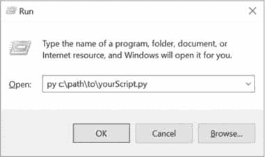

# 运行程序

> 原文：<https://automateboringuff.com/2e/appendixb/>


如果您在 Mu 中打开了一个程序，运行它只需按 F5 或单击窗口顶部的运行按钮。这是一种在编写程序的同时运行程序的简单方法，但是打开 Mu 来运行你完成的程序可能是一种负担。根据您使用的操作系统，有更方便的方法来执行 Python 脚本。

### 从终端窗口运行程序

当您打开终端窗口（如 Windows 上的命令提示符或 macOS 和 Linux 上的终端)时，您会看到一个几乎空白的窗口，您可以在其中输入文本命令。你可以从终端运行你的程序，但是如果你不习惯，通过终端（也称为*命令行*)使用你的计算机可能会令人生畏：不像图形用户界面，它不提供你应该做什么的提示。

在 Windows 上打开一个终端窗口，点击开始按钮，进入命令提示符，按`进入`。在 macOS 上，点击右上角的 Spotlight 图标，键入 Terminal，按`Enter`。在 Ubuntu Linux 上，可以按`WIN`键调出 Dash，键入 Terminal，按`Enter`。键盘快捷键`CTRL` - `ALT` -T 也会在 Ubuntu 上打开一个终端窗口。

就像交互 Shell 有`>>>`提示一样，终端会显示提示让你输入命令。在 Windows 上，它将是您当前所在文件夹的完整路径：

```py
C:\Users\Al>your commands go here
```

在 macOS 上，提示符显示您的电脑名称、冒号、当前工作目录（您的个人文件夹简称为`~`)和您的用户名，后面是美元符号（`$`):

```py
Als-MacBook-Pro:~ al$ your commands go here
```

在 Ubuntu Linux 上，提示符类似于 macOS，只是它以用户名和一个`@`符号开始：

```py
al@al-VirtualBox:~$ your commands go here
```

可以定制这些提示，但这超出了本书的范围。

当你输入一个命令时，比如 Windows 上的`python`或者 macOS 和 Linux 上的`python3`，终端会在你当前所在的文件夹中查找一个同名的程序。如果没有找到，它将检查列在`PATH`环境变量中的文件夹。你可以将*环境变量*视为整个操作系统的变量。它们将包含一些系统设置。要查看存储在`PATH`环境变量中的值，在 Windows 上运行`echo %PATH%`，在 macOS 和 Linux 上运行`echo $PATH`。这里有一个 macOS 上的例子：

```py
Als-MacBook-Pro:~ al$ echo $PATH

/Library/Frameworks/Python.framework/Versions/3.7/bin:/usr/local/bin:/usr/

bin:/bin:/usr/sbin:/sbin
```

在 macOS 上，`python3`程序文件位于`/Library/Frameworks/python . framework/Versions/3.7/bin`文件夹中，不用进入`/Library/Frameworks/Python.framework/Versions/3.7/bin/python3`或者先切换到那个文件夹运行；你可以从任何文件夹输入`python3`，终端会在`PATH`环境变量的文件夹中找到它。将一个程序的文件夹添加到`PATH`环境变量是一个方便的快捷方式。

如果你想运行`.py`程序，必须输入`python`（或`python3`)，后跟`py`文件名。这将运行 Python，然后 Python 将运行它在那个`py`文件中找到的代码。Python 程序完成后，您将返回到终端提示符。例如，在 Windows 上，一个简单的“你好，世界！”程序应该是这样的：

```py
Microsoft Windows [Version 10.0.17134.648]

(c) 2018 Microsoft Corporation. All rights reserved.

C:\Users\Al>python hello.py

Hello, world!

C:\Users\Al>
```

不带任何文件名运行`python`（或`python3`)将导致 Python 启动交互式 shell。

### 在 Windows 上运行 Python 程序

还有其他一些方法可以在 Windows 上运行 Python 程序。不用打开终端窗口运行你的 Python 脚本，你可以按`WIN` -R 打开运行对话框，输入`py C:\`path \ to \ your \ Python script . py，如图B-1所示。`py.exe`程序安装在`C:\Windows\py.exe`，已经在`PATH`环境变量中，键入`.exe`文件扩展名是运行程序时可选的。



图 B-1:Windows 上的运行对话框

这种方法的缺点是您必须输入脚本的完整路径。此外，虽然从对话框中运行 Python 脚本会打开一个新的终端窗口来显示其输出，但该窗口会在程序结束时自动关闭，您可能会错过一些输出。

您可以通过创建*批处理脚本*来解决这些问题，它是一个带有`bat`文件扩展名的小文本文件，可以运行多个终端命令，很像 macOS 和 Linux 中的 Shell 脚本。您可以使用文本编辑器（如记事本)来创建这些文件。

要创建批处理文件，请创建一个包含单行的新文本文件，如下所示：

```py
@py.exe C:\path\to\your\pythonScript.py %*

@pause
```

用你自己程序的绝对路径替换这个路径，并用`bat`文件扩展名保存这个文件 （例如`pythonScript.bat` )。每个命令开头的`@`符号防止它显示在终端窗口中，并且`%*`将在批处理文件名后输入的任何命令行参数转发给 Python 脚本。Python 脚本依次读取`sys.argv`列表中的命令行参数。这个批处理文件将使您不必在每次想要运行 Python 程序时都键入完整的绝对路径。另外，`@pause`会在 Python 脚本的结尾加上`"Press any key to continue..."`，防止程序的窗口消失过快。我建议您放置所有批处理和`py`文件放在一个已经存在于`PATH`环境变量中的文件夹中，比如`C:\Users\<USERNAME>`。

通过设置批处理文件来运行 Python 脚本，您无需打开终端窗口并输入 Python 脚本的完整文件路径和名称。相反，只需按下`WIN` -R，输入`pythonScript`（不需要完整的`pythonScript.bat`名称)，然后按下`ENTER`来运行您的脚本。

### 在 macOS 上运行 Python 程序

在 macOS 上，可以创建一个 Shell 脚本来运行 Python 脚本，方法是使用`.command`件扩展名。在文本编辑器（如“文本编辑”)中创建新文件，并添加以下内容：

```py
#!/usr/bin/env bash

python3 /path/to/your/pythonScript.py
```

在你个人文件夹（比如我的电脑上是`/Users/al`)中使用`.command`文件扩展名保存文件。在终端窗口中，通过运行`chmod u+x yourScript.command`使这个 Shell 脚本可执行。现在，您将能够单击 Spotlight 图标（或按下`Cmd+Space`)并输入`yourScript.command`来运行 Shell 脚本，这将依次运行您的 Python 脚本。

### 在 Ubuntu Linux 上运行 Python 程序

在 Ubuntu Linux 中从 Dash 菜单运行 Python 脚本需要大量的设置。假设我们有一个`/home/al/example.py`脚本（您的 Python 脚本可能在不同的文件夹中，有不同的文件名)，我们想从 Dash 运行它。首先，使用文本编辑器如`gedit`创建一个包含以下内容的新文件：

```py
[Desktop Entry]

Name=example.py

Exec=gnome-terminal -- /home/al/example.sh

Type=Application

Categories=GTK;GNOME;Utility;
```

将该文件保存到`/home/al/local/share/application`文件夹中（如果你的文本编辑器没有显示`example.desktop`，用自己的用户名替换`al`）。本地文件夹（因为以句点开头的文件夹被认为是隐藏的)，您可能需要将其保存到您的个人文件夹（如`/home/al` )中，并打开一个终端窗口以使用`mv /home/al/example.desktop /home/al/.local/share/applications`命令移动该文件。

当`example.desktop`文件在`/home/al/local/share/applications`文件夹，你可以按下键盘上的 Windows 键调出 Dash 并输入`example.py` （或者你为`Name`字段输入的任何内容)。这将打开一个新的终端窗口（具体来说，是运行`/home/al/example.sh` Shell 脚本的`gnome-terminal`程序)，我们接下来将创建这个脚本。

在文本编辑器中，创建一个包含以下内容的新文件：

```py
#!/usr/bin/env bash

python3 /home/al/example.py

bash
```

将这个文件保存到`/home/al/example.sh`。这是一个 Shell 脚本：运行一系列终端命令的脚本。这个 Shell 脚本将运行我们的Python 脚本`/home/al/example.py`，然后运行 bash Shell 程序。如果最后一行没有 bash 命令，Python 脚本一完成，终端窗口就会关闭，您将错过`print()`函数调用在屏幕上显示的任何文本。

您需要向这个 Shell 脚本添加执行权限，因此从终端窗口运行以下命令：

```py
al@ubuntu:~$ chmod u+x /home/al/example.sh
```

设置好`example.desktop`和`example.sh`文件后，您现在可以通过按 Windows 键并输入`example.py` （或者您在`example.desktop`文件的`Name`字段中输入的任何名称)来运行`example.py`脚本。

### 运行禁用断言的 Python 程序

您可以在 Python 程序中禁用`assert`语句，以获得轻微的性能提升。当从终端运行 Python 时，在`python`或`python3`之后和`py`文件名称之前包含`-O`开关。这将运行您的程序的优化版本，跳过断言检查。