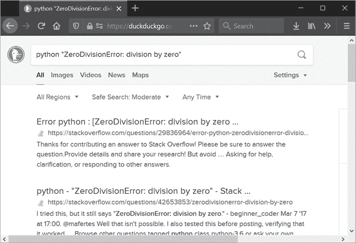
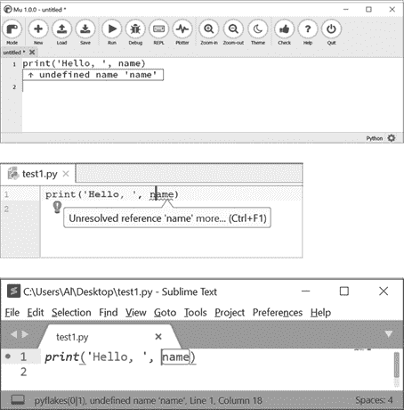

# 1 处理错误和寻求帮助

> 原文：<http://inventwithpython.com/beyond/chapter1.html>


请您不要将计算机当成佣人，因为这样会让您常常感觉很烦躁。比如说当计算机向您显示错误消息时，并不是因为您冒犯了它。计算机是我们大多数人都会接触到的最复杂的工具，但归根到底它们也只是一个工具而已。

即便如此，我们常常也已经习惯了让这些工具来背锅。因为我们大多数人都是自学编程的，所以即使你已经学习 Python几个月了，你在使用Python的时候也需要多次查阅互联网时，这时你的挫败感会很强（一看就会，一用就废：译者注）。但是，我想告诉你的是：即使是科班出身的的软件开发人员在编程时遇到到问题，也要搜索互联网或查阅文档。

除非你有财力或社会资源来聘请一位可以回答你编程问题的私人教师，否则你的毅力将被你的电脑、互联网搜索引擎所消耗。幸运的是，你的问题几乎肯定有人问过。作为一名程序员，能够自己找到答案远比任何算法或数据结构知识重要。本章将指导你如何在编程技能上点上这一天赋。

## 如何理解 Python 错误消息

当他们面对错误消息抛出来一长串专业术语文本时，许多程序员的第一反应是完全忽略它。但是错误消息的提示说明了你的程序存在问题，而问题的答案就在这个错误消息中。找到这个答案需要两个步骤:检查回溯并在互联网上搜索错误消息。

### 检查回溯

当代码引发一个`except`语句无法处理的异常时，Python 程序就会崩溃。当这种情况发生时，Python 会显示异常的消息和一个*回溯*。也被称为*堆栈跟踪*，回溯显示程序中发生异常的位置以及导致异常的函数调用的踪迹。

为了练习阅读回溯，进入下面的错误程序，并将其保存为 *abcTraceback.py* 脚本。行号仅供参考，并不是程序的一部分。

```py
 1. def a():
 2.     print('Start of a()')
 3.     b()  # Call b().
 4.
 5. def b():
 6.     print('Start of b()')
 7.     c()  # Call c().
 8.
 9. def c():
10.     print('Start of c()')
11.     42 / 0  # This will cause a zero divide error.
12.
13. a()  # Call a().
```

在这个程序中，`a()`函数调用`b()`，后者调用`c()`。在`c()`内部，`42 / 0`表达式导致零除错误。运行该程序时，输出应该如下所示:

```py
Start of a()
Start of b()
Start of c()
Traceback (most recent call last):
  File "abcTraceback.py", line 13, in <module>
    a()  # Call a().
  File "abcTraceback.py", line 3, in a
    b()  # Call b().
  File "abcTraceback.py", line 7, in b
    c()  # Call c().
 File "abcTraceback.py", line 11, in c
    42 / 0  # This will cause a zero divide error.
ZeroDivisionError: division by zero
```

让我们一行一行地检查这个回溯，从这一行开始:

```py
Traceback (most recent call last):
```

此消息让您知道接下来是回溯。`most recent call last`文本表示每个函数调用都按顺序列出，从第一个函数调用开始，到最近一个函数调用结束。

下一行显示了回溯的第一个函数调用:

```py
 File "abcTraceback.py", line 13, in <module>
    a()  # Call a().
```

这两行是*帧摘要*，它们显示了一个帧对象内部的信息。当一个函数被调用时，局部变量数据以及函数调用结束后返回到代码中的什么地方？都存储在一个*框架对象*中。框架对象保存局部变量和其他与函数调用相关的数据。框架对象在函数被调用时被创建，在函数返回时被销毁。回溯显示了导致崩溃的每一帧的帧摘要。我们可以看到这个函数调用在 *abcTraceback.py* 的第 13 行，`<module>`文本告诉我们这一行在全局范围内。第 13 行显示后有两个空格的缩进。

接下来的四行是下面的两个帧摘要，内容如下:

```py
 File "abcTraceback.py", line 3, in a
    b()  # Call b().
  File "abcTraceback.py", line 7, in b
    c()  # Call c().
```

我们可以从`line 3, in a`文本中得知，`b()`在`a()`函数内部的第 3 行被调用，导致`c()`在`b()`函数内部的第 7 行被调用。注意，第 2、6 和 10 行上的`print()`调用没有显示在回溯中，即使它们在函数调用发生之前运行。只有包含导致异常的函数调用的行才会显示在回溯中。

最后一帧摘要显示了导致未处理异常的行，后面是异常的名称和异常的消息:

```py
 File "abcTraceback.py", line 11, in c
    42 / 0  # This will cause a zero divide error.
ZeroDivisionError: division by zero
```

注意回溯给出的行号是 Python 最后检测到错误的地方。错误的真正来源可能在这条线之前的某个地方。

错误信息相当简单晦涩，只有三个词:`division by zero`对你来说没有任何意义，除非你知道用零除一个数在数学上是不可能的，并且是一个常见的软件错误。在这个程序中，bug 并不难发现。查看帧摘要中的代码行，可以清楚地看到`42 / 0`代码中发生除数为零错误的位置。

但是我们来看一个更难的案例。在文本编辑器中输入以下代码，并将其保存为 *zeroDivideTraceback.py* 脚本:

```py
def spam(number1, number2):
    return number1 / (number2 - 42)

spam(101, 42)
```

运行该程序时，输出应该如下所示:

```py
Traceback (most recent call last):
  File "zeroDivideTraceback.py", line 4, in <module>
    spam(101, 42)
  File "zeroDivideTraceback.py", line 2, in spam
    return number1 / (number2 - 42)
ZeroDivisionError: division by zero
```

错误消息是相同的，但是`return number1 / (number2 - 42)`中的除数为零的错误点不那么明显。您可以从`/`运算符推断出除法运算，并且表达式`(number2 - 42)`的计算结果必然是`0`。这将使您得出结论，无论何时`number2`参数设置为`42`时，`spam()`功能都会失败。

有时回溯可能表明在 bug 的真正原因之后的行中有一个错误。例如，在下面的程序中，第一行缺少右括号:

```py
print('Hello.'
print('How are you?')
```

但是这个程序的错误消息指出问题出在第二行:

```py
 File "example.py", line 2
    print('How are you?')
        ^
SyntaxError: invalid syntax
```

原因是 Python 解释器直到读到第二行才注意到语法错误。追溯可以指出哪里出了问题，但这并不总是与错误的实际原因相同。如果帧摘要没有给你足够的信息来找出错误，或者如果错误的真正原因在回溯没有显示的前一行，你将不得不用调试器逐步通过程序或者检查一些日志消息来找到原因。这可能需要很长时间。在互联网上搜索错误信息可能会更快地为您提供解决方案的关键线索。

### 搜索错误消息

通常，错误消息非常短，甚至不是完整的句子。因为程序员经常遇到它们，所以它们只是提醒，而不是完整的解释。如果你第一次遇到错误信息，将它复制并粘贴到互联网搜索中通常会返回一个详细的解释，说明错误的含义及其可能的原因。图 1-1 显示了搜索`python“ZeroDivisionError:division by zero”`的结果。在错误消息两边加上引号有助于找到准确的短语，添加单词 `python` 也可以缩小搜索范围。



图 1-1: 将一条错误信息复制粘贴到互联网搜索工具中，可以快速提供解释和解决方案。

搜索错误信息不是作弊。没有人能够记住一门编程语言的每一个可能的错误信息。专业软件开发人员每天都在互联网上搜索编程答案。

您可能希望排除您的代码中所有可能产生的错误信息的代码块。例如，考虑以下错误消息:

```py
>>> print(employeRecord)
Traceback (most recent call last):
  File "<stdin>", line 1, in <module>
NameError: name 'employeRecord' is not defined # 1
>>> 42 - 'hello'
Traceback (most recent call last):
  File "<stdin>", line 1, in <module>
TypeError: unsupported operand type(s) for -: 'int' and 'str' # 2
```

这个例子在变量`employeRecord`中有一个错别字，导致错误 1 。因为`NameError: name 'employeRecord' is not defined`中的标识符`employeRecord`是在您的代码中声明的，所以您可能想要搜索`python " name error:name " " is not defined "`。在最后一行中，错误消息 2 的`'int' and 'str'`部分似乎指的是`42`和`'hello'`值，因此将搜索截断到`python“type error:unsupported operand type for“`”将避免包含特定于代码的部分。如果这些搜索没有产生有用的结果，请尝试包含完整的错误信息。

## 使用Linters防止错误

纠正错误的最好方法是从一开始就不犯错误。Lint这款软件(也叫*linters*)，是分析你的源代码以警告你任何潜在错误的应用程序。这个名字指的是由干衣机的棉绒收集器收集的小纤维和碎屑。虽然 linter 不会捕捉所有的错误，但是*静态分析*(检查源代码而不运行它)可以识别由错别字引起的常见错误。(第 11 章探索了如何使用类型提示进行静态分析。)很多文本编辑器和集成开发环境(ide)都集成了一个在后台运行的 linter，可以实时指出问题，比如图 1-2 。



图 1-2: 一个 linter 在 Mu(上)、PyCharm(中)、Sublime Text(下)中指出一个未定义的变量。

linter这款软件在你刚写完错误代码后，就给你消息提示，从而使得您的编程效率大大提高。如果没有这个小软件，你就只能被动的运行你的错误程序，阅读错误回溯，然后在你的源代码中找到一行来修复一个打字错误。如果您犯了多个错别字，这个运行-修复周期一次只能找到一个。linter可以一次指出多个错误，而且是直接在编辑器中指出，所以您可以看到错误出现在哪一行。

您的编辑器或IDE可能没有lint特性，但是一般都会有支持它的扩展插件。通常，这些插件使用名为 Pyflakes 的linter模块或其他模块来进行分析。你可以从[`pypi.org/project/pyflakes`](https://pypi.org/project/pyflakes/)或者运行`pip install --user pyflakes`来安装 Pyflakes。


## 注意

在 Windows 上，您可以运行`python`和`pip`命令。但是在 macOS 和 Linux 上，这些命令名只适用于 Python2这个版本，所以你需要运行`python3`和`pip3`。每当你在本书中看到`python`或`pip`时，请记住这一点。

IDLE是Python自带的IDE，它没有linter，也不支持安装插件来支持linter的功能。

## 如何寻求编程帮助

当搜索引擎和linters不能解决你的问题时，你可以在互联网上寻求编程帮助。但是您应该有程序员的礼节。如果有经验的软件开发人员愿意免费回答你的问题，你要学会利用好这些资源。

向陌生人寻求编程帮助是迫不得已的最后办法。如果你想得到回复，可能至少要等几个小时或几天。在网上搜索已经问过你这个问题的人并阅读他们的回答会快得多。在线文档和搜索引擎的出现是为了减轻原本必须由人类完成的问答工作。

但是，当你已经用尽了所有的选择，必须向人类观众询问你的编程问题时，请避免以下常见错误:

*   客气一点。比如这样问：方不方便帮我看一个问题？不要语气僵硬的这样问：给我看一个问题！
*   暗示你的问题，而不是直接问
*   在错误的论坛或网站上提问
*   写一个模棱两可的帖子标题或电子邮件主题，如“我有一个问题”或“请帮助”
*   说“我的程序不工作”，但不解释你希望它如何工作
*   不包括完整的错误信息
*   不共享您的代码
*   共享格式不良的代码
*   不解释你已经尝试过的
*   没有给出操作系统或版本信息
*   请人给你写一个程序

这份“禁忌”清单不仅仅是为了礼貌；这些习惯阻碍了你的帮手帮助你。您的帮手的第一步将是运行您的代码，并尝试重现您的问题。为此，他们需要大量关于你的代码、计算机和意图的信息。提供太少信息比提供太多信息更常见。接下来的几节将探讨如何避免这些常见错误。我假设你在一个在线论坛上询问你的问题，但是这些指导方针也同样适用于你通过电子邮件向一个人请教问题。

### 通过预先提供信息来限制来回

如果你亲自接近某人，问“我能问你一个问题吗？”将是一个简短、愉快的方式来看看你的帮手是否有空。但是在在线论坛上，你的帮手可以推迟回复，直到他们有时间这样做。因为回复之间可能有几个小时，所以最好在你的第一篇帖子中提供你的帮助者可能需要的所有信息，而不是简单描述你的问题。如果他们不回复，你可以将这些信息复制粘贴到不同的论坛。

### 以实际问题的形式陈述你的问题

当你解释你的问题时，很容易假设你的帮助者知道你在说什么。但是编程是一个广阔的领域，他们可能没有你遇到困难的特定领域的经验。所以用实际问题的形式陈述你的问题很重要。尽管以“我想”开头的句子。或者“代码不起作用”可以暗示你的问题是什么，一定要描述明确的问题:从字面上看，以问号结尾的句子。否则很可能不清楚你在问什么。(通常正确的描述一个问题，远远比解决这个问题困难的多：译者注)

### 在适当的网站上提出你的问题

在 JavaScript 论坛上问一个 Python 问题或者在网络安全邮件列表上问一个算法问题很可能是徒劳的。通常，邮件列表和在线论坛都有常见问题(FAQ)文档或描述页面，解释哪些主题适合讨论。例如， *python-dev* 邮件列表是关于 python 语言的设计特性的，所以它不是一般的 Python 帮助邮件列表。https://www.python.org/about/help/[的网页可以指引你到一个合适的地方去问任何关于 Python 的问题。](https://www.python.org/about/help/)

### 在标题中总结你的问题

将您的问题发布到在线论坛的好处是，未来有相同问题的程序员可以使用互联网搜索找到它及其答案。一定要使用总结问题的标题，以便搜索引擎能检索到。一个普通的标题，如“请帮忙”或“为什么这个不起作用？”太模糊了。如果你在电子邮件中提出问题，当你的帮手浏览收件箱时，一个有意义的主题行会告诉他们你的问题是什么。

### 解释您希望代码做什么

问题“为什么我的程序不工作？”忽略了你希望你的程序做什么的关键细节。这对你的帮手来说并不总是显而易见的，因为他们不知道你的意图是什么。即使你的问题只是“为什么我会遇到这个错误？”它也有助于说明你的项目的最终目标是什么。在某些情况下，你的助手可以告诉你是否需要一个完全不同的方法，你可以放弃你的问题，而不是浪费时间去解决它。

### 包括完整的错误消息

确保复制并粘贴整个错误信息，包括回溯。仅仅描述你的错误，比如“我得到了一个超出范围的错误”，并不能为你的帮手提供足够的细节来找出问题所在。此外，指定您是否总是遇到此错误，或者它是否是一个间歇性的问题。如果你已经确定了错误发生的具体环境，也包括那些细节。

### 分享你的完整代码

除了完整的错误消息和回溯之外，还要提供整个程序的源代码。这样，您的助手可以在调试器下在他们的机器上运行您的程序来检查发生了什么。总是产生一个*最小的、完整的、可重复的* ( *MCR* )例子，可靠地重现你得到的错误。MCR 术语来自堆栈溢出，在[`stackoverflow.com/help/mcve`](https://stackoverflow.com/help/mcve/)会上有详细讨论。 *Minimal* 意味着您的代码示例尽可能简短，同时仍然再现您遇到的问题。 *Complete* 意味着您的代码示例包含重现问题所需的所有内容。*可再现*意味着你的代码实例可靠地再现了你所描述的问题。

但是如果你的程序包含在一个文件中，把它发送给你的助手是一件简单的事情。正如下一节所讨论的，只需确保它的格式正确。

* * *

## Stack Overflow网站归档您的问题

Stack Overflow 是一个回答编程问题的流行网站，初次接触这个网站的新程序员往往会被吓的无从所适。Stack Overflow版主以毫不留情地关闭不懂规矩的问题而闻名。但是有一个很好的理由来解释Stack Overflow为何如此如此的严格。

Stack Overflow并不是为了回答问题，而是为了建立一个与答案相匹配的编程问题的档案。因此，他们希望问题是具体的、独特的，而不是基于观点的。问题需要详细和清楚地陈述，这样搜索引擎用户可以很容易地找到它们。(Stack Overflow之前的互联网对于程序员来说是《考验人的智慧》XKCD 漫画中的笑话的基础[`xkcd.com/979`](https://xkcd.com/979/)。)同一个问题出现 30 个条目不仅会让回答问题的人重复工作，还会让搜索引擎用户对多个结果感到困惑。问题需要有具体、客观的答案:“最好的编程语言是什么？”这是一个见仁见智的问题，会引起不必要的争论。(另外，我们已经知道 Python 是最好的编程语言。)

但是，处于需要和请求帮助的位置，却发现你的问题很快就被解决了，这可能是一种伤害和尴尬。我的建议是首先仔细阅读本章的建议和 Stack Overflow 的“我如何问一个好问题？”在[`stackoverflow.com/help/how-to-ask`](https://stackoverflow.com/help/how-to-ask/)入门教程。第二，如果你害怕问“愚蠢”的问题，可以随意使用假名。Stack Overflow 并不要求账户实名。如果你喜欢在一个更随意的地方提问，可以考虑将问题张贴到 https://reddit.com/r/learnpython/的，那里对他们接受哪些问题更宽松。不过，在提交问题之前，请务必阅读他们的发布指南。

* * *

### 用适当的格式使你的代码可读

共享您的代码的目的是让您的帮手可以运行您的程序并重现您得到的错误。他们不仅需要代码，还需要正确的格式。确保他们可以很容易地复制你的源代码并照原样运行。如果您在电子邮件中复制并粘贴您的源代码，请注意许多电子邮件客户端可能会删除缩进，从而生成如下所示的代码:

```py
def knuts(self, value):
if not isinstance(value, int) or value < 0:
raise WizCoinException('knuts attr must be a positive int')
self._knuts = value
```

你的帮手不仅要花很长时间来为你程序中的每一行重新插入缩进，而且每行从多少缩进开始也不明确。为了确保你的代码格式正确，将你的代码复制并粘贴到一个 *pastebin* 网站，比如[`pastebin.com`](https://pastebin.com/)或[`gist.github.com`](https://gist.github.com/)，它将你的代码存储在一个简短的公共 URL，比如[`pastebin.com/XeU3yusC`](https://pastebin.com/XeU3yusC)。共享此 URL 比使用文件附件更容易。

如果你在一个网站上发布代码，比如[`stackoverflow.com`](https://stackoverflow.com/)或[`reddit.com/r/learnpython`](https://reddit.com/r/learnpython/)，确保你使用了其文本框提供的格式工具。通常，将一行缩进四个空格可以确保该行使用等宽的“代码字体”，这样更容易阅读。您也可以用反斜杠(`  ``)字符将文本括起来，使其成为等宽代码字体。这些网站通常有指向格式信息的链接。不使用这些提示可能会损坏您的源代码，使它们都出现在一行中，如下所示:

```py
def knuts(self, value):if not isinstance(value, int) or value < 0:raise WizCoinException('knuts attr must be a positive int') self._knuts = value
```

此外，不要通过截图或屏幕照片并发送图像来共享您的代码。从图像中复制和粘贴代码是不可能的，而且通常也是不可读的。

### 告诉你的帮手你已经试过了

当张贴您的问题时，告诉您的帮助者您已经尝试了什么以及这些尝试的结果。这些信息可以让你的帮助者省去重新尝试这些错误线索的麻烦，并且表明你已经尽力去解决自己的问题了。

此外，这些信息确保你是在寻求帮助，而不仅仅是请求别人为你写软件。不幸的是，计算机科学专业的学生让网上的陌生人帮他们做作业，或者企业家请人免费为他们创建一个“快速应用”是很常见的。编程帮助论坛不是为此目的而创建的。

### 描述您的设置

计算机的特定设置可能会影响程序的运行方式和产生的错误。为了确保您的帮助者能够在他们的计算机上重现您的问题，请向他们提供以下有关您的计算机的信息:

*   操作系统和版本，如“Windows 10 专业版”或“macOS Catalina”
*   运行程序的 Python 版本，如“Python 3.7”或“Python 3.6.6”
*   您的程序使用的任何第三方模块及其版本，如“Django 2.1.1”

你可以通过运行`pip list`找到你安装的第三方模块的版本。在`__version__`属性中包含模块的版本也是一种约定，如下面的交互式 shell 示例所示:

```
>>> import django
>>> django.__version__
'2.1.1'
```

最有可能的是，这些信息是不必要的。但是为了减少来回折腾，无论如何在你的第一篇文章中提供这些信息。

## 提问的例子

根据上一节的注意事项，这里有一个恰当的问题:

> Selenium webdriver:如何找到一个元素的所有属性？
> 
> 在 Python Selenium 模块中，一旦我有了一个`WebElement`对象，我就可以用`get_attribute()`获得它的任何属性值:
> 
> `foo = elem.get_attribute('href')`
> 
> 如果名为`'href'`的属性不存在，则返回`None`。
> 
> 我的问题是，我怎样才能得到一个元素所有属性的列表？好像没有`get_attributes()`或者`get_attribute_names()`的方法。
> 
> 我使用的是 Python 的 Selenium 模块的 2.44.0 版本。

这个问题来自[`stackoverflow.com/q/27307131/1893164`](https://stackoverflow.com/q/27307131/1893164/)。标题用一句话概括了这个问题。问题以询问的形式陈述，以问号结尾。将来，如果有人在互联网搜索结果中读到这个标题，他们会立即知道它是否与自己的问题相关。

该问题使用等宽代码字体对代码进行格式化，并在多个段落中分解文本。这篇文章的问题很明显:它甚至以“我的问题是”开头。这表明`get_attributes()`或`get_attribute_names()`可能是答案，但不是，这表明提问者试图找到一个解决方案，同时暗示他们认为这个问题的真实答案应该是什么样的。asker 还包括 Selenium 模块的版本信息，以防万一。包含太多信息总比不够好。

## 摘要

独立回答自己的编程问题是程序员必须学会的最重要的技能。由程序员建立起来的互联网拥有丰富的资源，可以提供你需要的答案。

但是首先，您必须解析 Python 引发的经常是模糊的错误消息。如果您无法理解错误消息的文本，这没什么。您仍然可以将此文本提交给搜索引擎，以找到错误消息的简单英语解释和可能的原因。错误的回溯将指出错误发生在程序中的什么地方。

当你写代码的时候，一个实时的 linter 可以指出打字错误和潜在的错误。Linters 非常有用，以至于现代软件开发都离不开它。如果您的文本编辑器或 IDE 没有 linter 或者没有添加 linter 插件的能力，可以考虑换一个IDE。

如果你在网上找不到解决问题的方法，试着把你的问题发布到网上论坛或者发邮件给某人。为了提高这个过程的效率，本章提供了询问一个好的编程问题的指南。这包括提出一个明确的问题，提供完整的源代码和错误信息细节，解释您已经尝试过的内容，并告诉您的助手您正在使用哪个操作系统和 Python 版本。发布的答案不仅能解决你的问题，还能帮助未来有同样问题的程序员找到你的帖子。

如果你似乎一直在寻找答案和寻求帮助，不要感到气馁。编程是一个广阔的领域，没有人能一下子记住所有的细节。即使是有经验的软件开发人员也每天在线查看文档和解决方案。相反，专注于变得善于寻找解决方案，你就成功了一半了。（授人以鱼不如授人以渔）