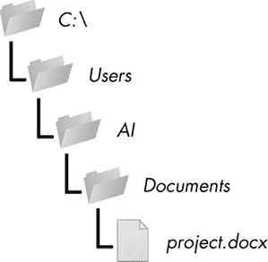
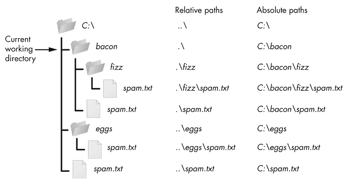
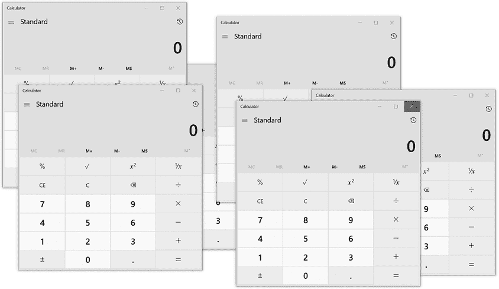
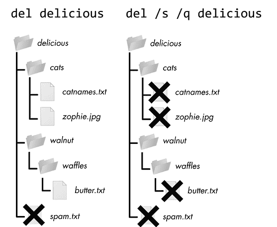
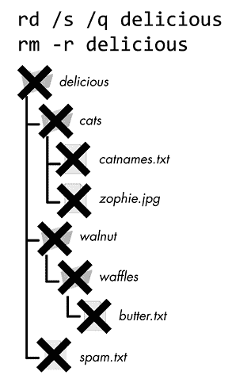
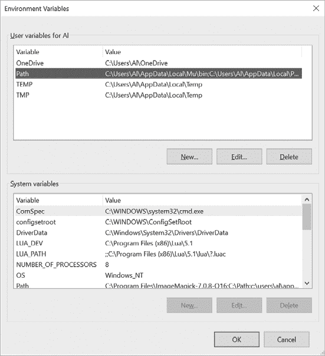

# 2 环境设置和命令行

> 原文：<http://inventwithpython.com/beyond/chapter2.html>

*环境设置*是组织你的计算机以便你写代码的过程。这包括安装任何必要的工具，配置它们，以及处理安装过程中的任何问题。没有单一的设置过程，因为每个人都有一台不同的计算机，使用不同的操作系统、操作系统版本和 Python 解释器版本。尽管如此，本章描述了一些基本概念，帮助您使用命令行、环境变量和文件系统管理自己的计算机。

学习这些概念和工具可能看起来很头疼。您希望编写代码，而不是四处摸索配置设置或理解难以理解的控制台命令。但是从长远来看，这些技巧会节省你的时间。忽略错误消息或随机更改配置设置以使系统足够好地工作可能会隐藏问题，但不会修复它们。现在花点时间了解这些问题，可以防止它们再次发生。

## 文件系统

*文件系统*是你的操作系统组织数据存储和检索的方式。一个文件有两个关键属性:一个*文件名*(通常写成一个单词)和一个*路径*。路径指定文件在计算机上的位置。例如，我的 Windows 10 笔记本电脑上的一个文件在路径 *C:\Users\Al\Documents* 中的文件名为 *project.docx* 。最后一个句点之后的文件名部分是文件的扩展名*和告诉你一个文件的类型。文件名 *project.docx* 为 Word 文档，*用户*、 *Al* 、*文档*均引用*文件夹*(也称*目录*)。文件夹可以包含文件和其他文件夹。比如 *project.docx* 在 *Documents* 文件夹中，后者在 *Al* 文件夹中，后者在 *Users* 文件夹中。[图 2-1](#calibre_link-318) 显示了该文件夹的组织结构。*



[图 2-1:](#calibre_link-683) 文件夹层次结构中的一个文件

路径的 *C:\* 部分是*根文件夹*，包含所有其他文件夹。在 Windows 上，根文件夹被命名为 *C:\* ，也称为 *C:* 驱动器。在 macOS 和 Linux 上，根文件夹是 */* 。在本书中，我将使用 Windows 风格的根文件夹， *C:\* 。如果您在 macOS 或 Linux 上输入交互式 shell 示例，请改为输入 */* 。

其他卷，如 DVD 驱动器或 USB 闪存驱动器，在不同的操作系统上会有不同的显示。在 Windows 上，它们显示为新的带字母的根驱动器，如 *D:\* 或 *E:\* 。在 macOS 上，它们作为新文件夹出现在 */Volumes* 文件夹中。在 Linux 上，它们作为新文件夹出现在*/mnt*(“mount”)文件夹中。请注意，在 Windows 和 macOS 上，文件夹名称和文件名不区分大小写，但在 Linux 上是区分大小写的。

### Python 中的路径

在 Windows 上，反斜杠(\)分隔文件夹和文件名，但在 macOS 和 Linux 上，正斜杠(/)分隔它们。您可以使用`pathlib`模块和`/`操作符，而不是用两种方式编写代码来使您的 Python 脚本跨平台兼容。

导入`pathlib`的典型方式是使用语句`from pathlib import Path`。因为`Path`类是`pathlib, this form lets you type `Path`中使用最频繁的类，而不是`pathlib.Path`。您可以将文件夹或文件名的字符串传递给`Path()`来创建该文件夹或文件名的`Path`对象。只要表达式中最左边的对象是一个`Path`对象，就可以使用`/`操作符将`Path`对象或字符串连接在一起。在交互式 shell 中输入以下内容:`

 ```py`
>>> **from pathlib import Path**
>>> **Path('spam') / 'bacon' / 'eggs'**
WindowsPath('spam/bacon/eggs')
>>> **Path('spam') / Path('bacon/eggs')**
WindowsPath('spam/bacon/eggs')
>>> **Path('spam') / Path('bacon', 'eggs')**
WindowsPath('spam/bacon/eggs')
```

注意，因为我在 Windows 机器上运行了这段代码，`Path()`返回了`WindowsPath`对象。在 macOS 和 Linux 上，返回一个`PosixPath`对象。(POSIX 是一组用于类 Unix 操作系统的标准，超出了本书的范围。)就我们的目的而言，这两种类型没有区别。

您可以将一个`Path`对象传递给 Python 标准库中任何需要文件名的函数。例如，函数调用`open(Path('C:\\') / 'Users' / 'Al' / 'Desktop' / 'spam.py')`相当于`open(r'C:\Users\Al\Desktop\spam.py')`。

### 主目录

所有用户在电脑上都有一个名为*主文件夹*或*主目录*的文件夹来存放他们自己的文件。您可以通过调用`Path.home()`来获得 home 文件夹的一个`Path`对象:

```py
>>> **Path.home()**
WindowsPath('C:/Users/Al')
```

主目录位于一个固定的位置，具体取决于您的操作系统:

*   在 Windows 上，主目录在 *C:\Users* 中。
*   在 Mac 上，主目录在 */Users* 中。
*   在 Linux 上，主目录通常在 */home* 中。

您的脚本几乎肯定有权限读取和写入您的主目录中的文件，因此这是存储您的 Python 程序将使用的文件的理想位置。

### 当前工作目录

你电脑上运行的每个程序都有一个*当前工作目录* ( *cwd* )。任何不以根文件夹开头的文件名或路径都在 cwd 中。虽然“文件夹”是一个目录的更现代的名字，但是注意 cwd(或者仅仅是工作目录)是标准术语，而不是“当前工作文件夹”

您可以使用`Path.cwd()`函数将 cwd 作为一个`Path`对象，并使用`os.chdir()`对其进行更改。在交互式 shell 中输入以下内容:

```py
>>> **from pathlib import Path**
>>> **import os**
1 >>> **Path.cwd()**
WindowsPath('C:/Users/Al/AppData/Local/Programs/Python/Python38')
2 >>> **os.chdir('C:\\Windows\\System32')**
>>> **Path.cwd()**
WindowsPath('C:/Windows/System32')
```

这里 cwd 设置为*C:\ Users \ Al \ AppData \ Local \ Programs \ Python \ Python 38*1，所以文件名 *project.docx* 会引用*C:\ Users \ Al \ AppData \ Local \ Programs \ Python \ Python 38 \ project . docx*。当我们将 cwd 改为*C:\ Windows \ System32*2时，文件名 *project.docx* 将引用*C:\ Windows \ System32 \ project . docx*。

如果您尝试更改到不存在的目录，Python 会显示错误:

```py
>>> **os.chdir('C:/ThisFolderDoesNotExist')**
Traceback (most recent call last):
  File "<stdin>", line 1, in <module>
FileNotFoundError: [WinError 2] The system cannot find the file specified:
'C:/ThisFolderDoesNotExist'
```

`os`模块中的`os.getcwd()`函数是以前获取字符串形式的 cwd 的方法。

### 绝对路径与相对路径

有两种方法可以指定文件路径:

*   绝对路径，总是从根文件夹开始
*   相对路径，相对于程序的 cwd

还有*点*(。)和*点点*(..)文件夹。这些不是真正的文件夹，而是可以在路径中使用的特殊名称。单个句点(。)是“此目录”的简写两个时期(..)表示“父文件夹”

[图 2-2](#calibre_link-319) 显示了一些文件夹和文件的例子。当 cwd 被设置为 *C:\bacon* 时，其他文件夹和文件的相对路径被设置为如图所示。

*。\* 相对路径的开头是可选的。例如，*。\spam.txt* 和 *spam.txt* 引用同一个文件。

 

[图 2-2:](#calibre_link-684) 工作目录下文件夹和文件的相对路径 *C:\bacon*

## 程序和流程

一个*程序*是你可以运行的任何软件应用程序，比如网络浏览器、电子表格应用程序或文字处理器。一个*进程*是一个程序的运行实例。例如，[图 2-3](#calibre_link-320) 显示了同一个计算器程序的五个运行过程。



[图 2-3:](#calibre_link-685) 一个计算器程序作为多个独立的进程运行多次

即使运行同一个程序，进程也保持相互独立。例如，如果您同时运行一个 Python 程序的几个实例，每个进程可能会有单独的变量值。每个进程，甚至运行相同程序的进程，都有自己的 cwd 和环境变量设置。一般来说，一个命令行一次只能运行一个进程(尽管您可以同时打开多个命令行)。

每个操作系统都有查看正在运行的进程列表的方式。在 Windows 上，你可以按Ctrl-Shift-Esc调出任务管理器应用。在 macOS 上，您可以运行应用程序实用程序活动监视器。在 Ubuntu Linux 上，你可以按Ctrl-Alt-Del打开一个应用，也叫任务管理器。如果没有响应，这些任务管理器可以强制终止正在运行的进程。

## 命令行

*命令行*是一个基于文本的程序，让你输入命令与操作系统交互并运行程序。你也可能听说过命令行界面(CLI，与“fly”押韵)、命令提示符、终端、shell 或控制台。它为*图形用户界面* ( *GUI* ，发音为“gooey”)提供了一种替代方式，允许用户通过不仅仅是基于文本的界面与计算机进行交互。与命令行相比，GUI 向用户提供可视信息，引导他们更轻松地完成任务。大部分电脑用户都把命令行当做高级功能，从来不碰。恐吓因素的一部分是由于完全缺乏如何使用它的提示；尽管 GUI 可能会显示一个按钮，告诉您点击哪里，但是空白的终端窗口不会提醒您键入什么。

但是有很好的理由来熟练使用命令行。首先，设置您的环境通常需要您使用命令行，而不是图形窗口。另一方面，输入命令比用鼠标点击图形窗口要快得多。基于文本的命令也比将一个图标拖到另一个图标上更明确。这有助于更好地实现自动化，因为您可以将多个特定的命令组合成脚本来执行复杂的操作。

命令行程序存在于计算机的可执行文件中。在这种情况下，我们通常称之为外壳或外壳程序。运行 shell 程序会出现终端窗口:

*   在 Windows 上，shell 程序位于*C:\ Windows \ System32 \ cmd . exe*。
*   在 macOS 上，shell 程序在 */bin/bash* 。
*   在 Ubuntu Linux 上，shell 程序在 */bin/bash* 。

多年来，程序员为 Unix 操作系统创建了许多 shell 程序，例如 Bourne Shell(在一个名为 *sh* 的可执行文件中)以及后来的 Bourne-Again Shell(在一个名为 *Bash* 的可执行文件中)。Linux 默认使用 Bash，而 macOS 在 Catalina 和更高版本中使用类似的 Zsh 或 Z shell。由于不同的开发历史，Windows 使用一个名为命令提示符的 shell。所有这些程序都做同样的事情:它们提供一个带有基于文本的 CLI 的终端窗口，用户可以在其中输入命令并运行程序。

在本节中，您将学习一些命令行的一般概念和常用命令。你可以掌握大量的神秘命令来成为一名真正的魔法师，但是你只需要知道十几个就可以解决大多数问题。在不同的操作系统上，确切的命令名称可能略有不同，但基本概念是相同的。

### 打开终端窗口

要打开终端窗口，请执行以下操作:

*   在 Windows 上，点击开始按钮，键入`Command Prompt`，然后按进入。
*   在 macOS 上，点击右上角的`Spotlight`图标，输入`Terminal`，然后按回车。
*   在 Ubuntu Linux 上，按 Win 键调出 Dash，键入`Terminal`，按回车。或者，使用键盘快捷键 Ctrl - Alt -T

与显示`>>>`提示符的交互式 shell 一样，终端显示一个 *shell 提示符*，在这里您可以输入命令。在 Windows 上，提示将是您所在的当前文件夹的完整路径:

```py
C:\Users\Al>**your commands go here**
```

在 macOS 上，提示符显示您的电脑名称、冒号和 cwd，您的个人文件夹用波浪号(`~`)表示。这是您的用户名，后面是美元符号(`$`):

```py
Als-MacBook-Pro:~ al$ **your commands go here**
```

在 Ubuntu Linux 上，提示符类似于 macOS 提示符，只是它以用户名和 at ( `@`)符号开头:

```py
[[email protected]](/cdn-cgi/l/email-protection):~$ **your commands go here**
```

许多书籍和教程将命令行提示符表示为`$`来简化它们的例子。可以定制这些提示，但是这样做超出了本书的范围。

### 从命令行运行程序

要运行程序或命令，请在命令行中输入其名称。让我们运行操作系统自带的默认计算器程序。在命令行中输入以下内容:

*   在 Windows 上，输入`calc.exe`。
*   在 macOS 上，输入`open -a Calculator`。(从技术上讲，这运行了`open`程序，然后该程序运行计算器程序。)
*   在 Linux 上，输入`gnome-calculator`。

程序名和命令在 Linux 上区分大小写，但在 Windows 和 macOS 上不区分大小写。这意味着即使你必须在 Linux 上输入`gnome-calculator`，你也可以在 Windows 上输入`Calc.exe` ，在 macOS 上输入`OPEN –a Calculator` 。

在命令行中输入这些计算器程序名相当于从开始菜单、Finder 或 Dash 中运行计算器程序。这些计算器程序名作为命令工作，因为【calc.exe】、*打开*和 *gnome-calculator* 程序存在于包含在`PATH`环境变量中的文件夹中。第 35 页的“环境变量和路径”对此有进一步的解释。但是可以说，当您在命令行上输入一个程序名时，shell 会检查在`PATH`中列出的某个文件夹中是否存在具有该名称的程序。在 Windows 上，shell 在检查`PATH`中的文件夹之前，会在 cwd(你可以在提示中看到)中查找程序。要告诉 macOS 和 Linux 上的命令行首先检查 cwd，必须在文件名前输入`./`。

如果程序不在`PATH`中列出的文件夹中，您有两种选择:

*   使用`cd`命令将 cwd 更改为包含程序的文件夹，然后输入程序名。例如，您可以输入以下两个命令:

    ```py
    `cd C:\Windows\System32`
    `calc.exe`
    ```

*   输入可执行程序文件的完整文件路径。例如，您可以输入`C:\Windows\System32\calc.exe`，而不是输入`calc.exe`。

在 Windows 上，如果一个程序以文件扩展名*结尾。exe* 或者*。bat* ，包括扩展名是可选的:输入`calc`与输入`calc.exe`的作用相同。macOS 和 Linux 中的可执行程序通常没有将它们标记为可执行的文件扩展名；相反，他们拥有可执行权限集。第 39 页的“不使用命令行运行 Python 程序”有更多信息。

### 使用命令行参数

*命令行参数*是您在命令名后输入的文本。像传递给 Python 函数调用的参数一样，它们为命令提供了特定的选项或附加的指示。例如，当您运行命令`cd C:\Users`时，`C:\Users`部分是`cd`命令的一个参数，它告诉`cd`将 cwd 更改到哪个文件夹。或者，当您使用`python yourScript.py` 命令从终端窗口运行 Python 脚本时，`yourScript.py`部分是一个参数，它告诉`python`程序在哪个文件中查找它应该执行的指令。

*命令行选项*(也称为标志、开关或简单的选项)是一个单字母或短单词的命令行参数。在 Windows 上，命令行选项往往以正斜杠(`/`)开头；在 macOS 和 Linux 上，它们以单破折号(`–`)或双破折号(`--`)开始。在运行 macOS 命令`open –a Calculator`时，您已经使用了`–a`选项。命令行选项在 macOS 和 Linux 上通常区分大小写，但在 Windows 上不区分大小写，我们用空格分隔多个命令行选项。

文件夹和文件名是常见的命令行参数。如果文件夹或文件名的名称中包含空格，请用双引号将名称括起来，以避免混淆命令行。例如，如果您想将目录更改为名为*假期照片*的文件夹，输入`cd Vacation Photos`会让命令行认为您在传递两个参数，`Vacation`和`Photos`。相反，您输入`cd "Vacation Photos"`:

```py
C:\Users\Al>**cd "Vacation Photos"**

C:\Users\Al\Vacation Photos>
```

许多命令的另一个常见参数是 macOS 和 Linux 上的`--help`和 Windows 上的`/?`。这些将显示与命令相关的信息。例如，如果您在 Windows 上运行`cd /?`，shell 会告诉您`cd`命令是做什么的，并列出它的其他命令行参数:

```py
C:\Users\Al>**cd /?**
Displays the name of or changes the current directory.

CHDIR [/D] [drive:][path]
CHDIR [..]
CD [/D] [drive:][path]
CD [..]

  ..   Specifies that you want to change to the parent directory.

Type CD drive: to display the current directory in the specified drive.
Type CD without parameters to display the current drive and directory.

Use the /D switch to change current drive in addition to changing current
directory for a drive.
`--snip—`
```

该帮助信息告诉我们，Windows `cd`命令也叫做`chdir`。(当更短的`cd`命令做同样的事情时，大多数人不会键入`chdir`。)方括号包含可选参数。例如，`CD [/D] [drive:][path]`告诉你可以使用`/D`选项指定一个驱动器或路径。

不幸的是，尽管命令的`/?`和`--help`信息为有经验的用户提供了提醒，但解释通常是含糊的。对于初学者来说，它们不是很好的资源。你最好使用书籍或网络教程，如威廉·肖特的*Linux 命令行、*第二版(2019 年)、OccupyTheWeb 的*黑客 Linux 基础知识* (2018 年)或亚当·伯特伦的*系统管理员 PowerShell*(2020 年)，所有这些都来自 No Starch 出版社。

### 用-c 从命令行运行 Python 代码

如果您需要运行少量一次性的 Python 代码，运行一次后就丢弃，那么在 Windows 上把`–c`开关传递给`python.exe`或者在 macOS 和 Linux 上传递给`python3`。要运行的代码应该在`–c`开关之后，用双引号括起来。例如，在终端窗口中输入以下内容:

```py
C:\Users\Al>**python -c "print('Hello, world')"**
Hello, world
```

当您想要查看单个 Python 指令的结果，并且不想浪费时间进入交互式 shell 时，`–c`开关非常方便。例如，您可以快速显示`help()`函数的输出，然后返回到命令行:

```py
C:\Users\Al>**python -c "help(len)"**
Help on built-in function len in module builtins:

len(obj, /)
    Return the number of items in a container.

C:\Users\Al>
```

### 从命令行运行 Python 程序

Python 程序是带有*的文本文件。py* 文件扩展名。它们不是可执行文件；相反，Python 解释器读取这些文件并执行其中的 Python 指令。在 Windows 上，解释器的可执行文件是 python.exe 的*。在 macOS 和 Linux 上，是 *python3* (原始 *python* 文件包含 python 版本 2 解释器)。运行命令`python yourScript.py`或`python3 yourScript.py`将运行保存在名为 *yourScript.py* 的文件中的 Python 指令。*

 *### 运行 py.exe 程序

在 Windows 上，Python 会在 *C:\Windows* 文件夹中安装一个*py.exe*程序。这个程序与*python.exe*相同，但是接受一个额外的命令行参数，让你运行你的计算机上安装的任何 Python 版本。您可以从任何文件夹运行`py`命令，因为 *C:\Windows* 文件夹包含在`PATH`环境变量中。如果您安装了多个 Python 版本，运行`py`会自动运行您计算机上安装的最新版本。您还可以传递一个`-3`或`-2`命令行参数来分别运行最新安装的 Python 版本 3 或版本 2。或者您可以输入一个更具体的版本号，比如`-3.6`或`-2.7`，来运行那个特定的 Python 安装。在版本切换之后，您可以将所有相同的命令行参数传递给*py.exe*，就像您传递给*python.exe*一样。从 Windows 命令行运行以下命令:

```py
C:\Users\Al>**py -3.6 -c "import sys;print(sys.version)"**
3.6.6 (v3.6.6:4cf1f54eb7, Jun 27 2018, 03:37:03) [MSC v.1900 64 bit (AMD64)]

C:\Users\Al>**py -2.7**
Python 2.7.14 (v2.7.14:84471935ed, Sep 16 2017, 20:25:58) [MSC v.1500 64 bit (AMD64)] on win32
Type "help", "copyright", "credits" or "license" for more information.
>>>
```

当您在 Windows 机器上安装了多个 Python 版本，并且需要运行一个特定的版本时，*py.exe*程序非常有用。

### 从 Python 程序运行命令

Python 的`subprocess.run()`函数可以在`subprocess`模块中找到，它可以在 Python 程序中运行 shell 命令，然后将命令输出显示为字符串。例如，下面的代码运行`ls –al`命令:

```py
>>> **import subprocess, locale**
1 >>> **procObj = subprocess.run(['ls', '-al'], stdout=subprocess.PIPE)**
2 >>> **outputStr = procObj.stdout.decode(locale.getdefaultlocale()[1])**
>>> **print(outputStr)**
total 8
drwxr-xr-x  2 al al 4096 Aug  6 21:37 .
drwxr-xr-x 17 al al 4096 Aug  6 21:37 ..
-rw-r--r--  1 al al    0 Aug  5 15:59 spam.py
```

我们将`['ls', '-al']`列表传递给`subprocess.run()` 1 。这个列表包含命令名`ls`，后面是它的参数，作为单独的字符串。注意，通过`['ls –al']` 是不行的。我们将命令的输出作为字符串存储在`outputStr` 2 中。`subprocess.run()`和`locale.getdefaultlocale()`的在线文档会让你更好地了解这些函数是如何工作的，但是它们让代码可以在任何运行 Python 的操作系统上工作。

### 使用制表符结束最大限度地减少键入

因为高级用户一天要花几个小时向计算机输入命令，所以现代命令行提供的功能可以最大限度地减少必要的打字量。 *tab 补全*功能(也称为命令行补全或自动补全)允许用户键入文件夹或文件名的前几个字符，然后按下 Tab 键，让 shell 填充名称的其余部分。

例如，当您在 Windows 上键入`cd c:\u`并按下 Tab 时，当前命令会检查 *C:\* 中的哪些文件夹或文件以 *u* 开始，Tab 完成到`c:\Users`。它还将小写的 *u* 更正为 *U* 。(在 macOS 和 Linux 上，制表符补全不会纠正大小写。)如果在 *C:\* 文件夹中有多个文件夹或文件名以 *U* 开头，您可以继续按 Tab 在它们之间循环。为了缩小匹配的数量，你也可以输入`cd c:\us`，过滤以 *us* 开头的文件夹和文件名。

多次按下键键在 macOS 和 Linux 上同样有效。在下面的例子中，用户输入了`cd D`，然后输入了两次标签:

```py
[[email protected]](/cdn-cgi/l/email-protection):~$ **cd D**
Desktop/   Documents/ Downloads/
[[email protected]](/cdn-cgi/l/email-protection):~$ cd D
```

键入`D`后按两次键会导致外壳显示所有可能的匹配。到目前为止，shell 为您提供了一个新的命令提示符。此时，您可以键入`e`，然后按下 Tab 键让 shell 完成`cd Desktop/`命令。

制表符补全是如此有用，以至于许多 GUI IDEs 和文本编辑器也包括这个特性。与命令行不同，这些 GUI 程序通常在您键入单词时在您的单词下显示一个小菜单，让您选择一个来自动完成命令的其余部分。

### 查看命令历史记录

在它们的*命令历史*中，现代 shells 还会记住你输入的命令。在终端中按下向上箭头键，用您输入的最后一个命令填充命令行。您可以继续按向上箭头键查找以前的命令，或者按向下箭头键返回到最近的命令。如果想取消当前提示符下的命令，从一个新的提示符开始，按下 Ctrl -C

在 Windows 上，您可以通过运行`doskey /history`来查看命令历史。(这个奇怪命名的 *doskey* 程序可以追溯到微软 Windows 操作系统之前的 MS-DOS。)在 macOS 和 Linux 上，可以通过运行`history`命令来查看命令历史。

### 使用常用命令

本节包含您将在命令行中使用的常用命令的简短列表。这里列出的命令和参数要多得多，但是您可以将它们视为导航命令行所需的最基本的东西。

本节中命令的命令行参数出现在方括号中。例如，`cd` `[destination folder]`表示您应该输入`cd`，后跟新文件夹的名称。

#### 用通配符匹配文件夹和文件名

许多命令接受文件夹和文件名作为命令行参数。通常，这些命令也接受带有通配符`*`和`?`的名称，允许您指定多个匹配的文件。`*`字符匹配任意数量的字符，而`?`字符匹配任意单个字符。我们将使用`*`和`?`通配符的表达式称为*全局模式*(“全局模式”的简称)。

Glob 模式允许您指定文件名的模式。例如，您可以运行`dir`或`ls`命令来显示 cwd 中的所有文件和文件夹。但是如果你只想查看 Python 文件，`dir *.py`或`ls *.py`将只显示以*结尾的文件。py* 。glob 模式`*.py`表示“任何一组字符，后跟`.py`”:

```py
C:\Users\Al>**dir *.py**
 Volume in drive C is Windows
 Volume Serial Number is DFF3-8658

 Directory of C:\Users\Al

03/24/2019  10:45 PM             8,399 conwaygameoflife.py
03/24/2019  11:00 PM             7,896 test1.py
10/29/2019  08:18 PM            21,254 wizcoin.py
               3 File(s)         37,549 bytes
               0 Dir(s)  506,300,776,448 bytes free
```

glob 模式`records201?.txt`的意思是`records201`，后面跟任意单个字符，再后面跟`.txt`这将匹配年份为 *records2010.txt* 到 *records2019.txt* 的记录文件(以及文件名，如 *records201X.txt* )。glob 模式`records20??.txt`将匹配任意两个字符，例如 *records2021.txt* 或 *records20AB.txt* 。

#### 用 cd 更改目录

运行`cd` `[destination folder]`将 shell 的 cwd 更改到目标文件夹:

```py
C:\Users\Al>**cd Desktop**

C:\Users\Al\Desktop>
```

shell 将 cwd 显示为其提示的一部分，命令中使用的任何文件夹或文件都将被解释为与该目录相关。

如果文件夹名称中有空格，请用双引号将名称括起来。要将 cwd 更改为用户的主文件夹，在 macOS 和 Linux 上输入`cd ~`，在 Windows 上输入`cd %USERPROFILE%`。

在 Windows 上，如果您还想更改当前驱动器，首先需要以单独命令的形式输入驱动器名:

```py
C:\Users\Al>**d:**

D:\>**cd BackupFiles**

D:\BackupFiles>
```

要切换到 cwd 的父目录，请使用`..`文件夹名称:

```py
C:\Users\Al>**cd ..**

C:\Users>
```

#### 用 dir 和 ls 列出文件夹内容

在 Windows 上，`dir`命令显示 cwd 中的文件夹和文件。在 macOS 和 Linux 上,`ls`命令做同样的事情。运行`dir` `[another folder]`或`ls` `[another folder]`可以显示另一个文件夹的内容。

`-l` 和`-a`开关是`ls`命令的有用参数。默认情况下，`ls`仅显示文件和文件夹的名称。要显示包含文件大小、权限、最后修改时间戳和其他信息的长列表格式，请使用`–l`。按照惯例，macOS 和 Linux 操作系统将以句点开头的文件视为配置文件，并在普通命令中隐藏它们。您可以使用`-a`让`ls`显示所有文件，包括隐藏的文件。要显示长列表格式和所有文件，将开关组合成`ls -al`。以下是 macOS 或 Linux 终端窗口中的一个示例:

```py
[[email protected]](/cdn-cgi/l/email-protection):~$ **ls**
Desktop    Downloads         mu_code  Pictures  snap       Videos
Documents  examples.desktop  Music    Public    Templates
[[email protected]](/cdn-cgi/l/email-protection):~$ **ls -al**
total 112
drwxr-xr-x 18 al   al   4096 Aug  4 18:47 .
drwxr-xr-x  3 root root 4096 Jun 17 18:11 ..
-rw-------  1 al   al   5157 Aug  2 20:43 .bash_history
-rw-r--r--  1 al   al    220 Jun 17 18:11 .bash_logout
-rw-r--r--  1 al   al   3771 Jun 17 18:11 .bashrc
drwx------ 17 al   al   4096 Jul 30 10:16 .cache
drwx------ 14 al   al   4096 Jun 19 15:04 .config
drwxr-xr-x  2 al   al   4096 Aug  4 17:33 Desktop
`--snip--`
```

与`ls –al`类似的窗口是`dir`命令。以下是 Windows 终端窗口中的一个示例:

```py
C:\Users\Al>**dir**
 Volume in drive C is Windows
 Volume Serial Number is DFF3-8658

 Directory of C:\Users\Al

06/12/2019  05:18 PM    <DIR>          .
06/12/2019  05:18 PM    <DIR>          ..
12/04/2018  07:16 PM    <DIR>          .android
`--snip--`
08/31/2018  12:47 AM            14,618 projectz.ipynb
10/29/2014  04:34 PM           121,474 foo.jpg
```

#### 用目录列出子文件夹内容并查找

在 Windows 上，运行`dir /s`会显示 cwd 的文件夹及其子文件夹。例如，以下命令显示每个*。我的 *C:\github\ezgmail* 文件夹及其所有子文件夹中的 py* 文件:

```py
C:\github\ezgmail>**dir /s *.py**
 Volume in drive C is Windows
 Volume Serial Number is DEE0-8982

 Directory of C:\github\ezgmail

06/17/2019  06:58 AM             1,396 setup.py
               1 File(s)          1,396 bytes

 Directory of C:\github\ezgmail\docs

12/07/2018  09:43 PM             5,504 conf.py
               1 File(s)          5,504 bytes

 Directory of C:\github\ezgmail\src\ezgmail

06/23/2019  07:45 PM            23,565 __init__.py
12/07/2018  09:43 PM                56 __main__.py
               2 File(s)         23,621 bytes

     Total Files Listed:
               4 File(s)         30,521 bytes
               0 Dir(s)  505,407,283,200 bytes free
```

在 macOS 和 Linux 上,`find . –name`命令做同样的事情:

```py
[[email protected]](/cdn-cgi/l/email-protection):~/Desktop$ **find . -name "*.py"**
./someSubFolder/eggs.py
./someSubFolder/bacon.py
./spam.py
```

`.` 告诉`find`开始在 cwd 中搜索。`–name`选项告诉`find`按名称查找文件夹和文件名。`"*.py"`告诉`find`显示名称与`*.py`模式匹配的文件夹和文件。注意`find`命令要求`–name`后面的参数用双引号括起来。

#### 用副本和 cp 复制文件和文件夹

要在不同的目录中创建文件或文件夹的副本，请运行`copy` `[source file or folder]` ``[destination folder]` or `cp` `[source file or folder] [destination folder]`。以下是 Linux 终端窗口中的一个示例:`

 ```py`
[[email protected]](/cdn-cgi/l/email-protection):~/someFolder$ **ls**
hello.py  someSubFolder
[[email protected]](/cdn-cgi/l/email-protection):~/someFolder$ **cp hello.py someSubFolder**
[[email protected]](/cdn-cgi/l/email-protection):~/someFolder$ **cd someSubFolder**
[[email protected]](/cdn-cgi/l/email-protection):~/someFolder/someSubFolder$ **ls**
hello.py
```

* * *

## 短命令名

当我开始学习 Linux 操作系统时，我惊讶地发现，我所熟知的 Windows `copy`命令在 Linux 上被命名为`cp`。“副本”这个名字比“cp”更易读一个简洁、隐晦的名字真的值得节省两个字符的输入吗？

随着我在命令行方面的经验越来越丰富，我意识到答案是肯定的。我们读源代码的次数比写源代码的次数多，所以对变量和函数使用冗长的名字会有所帮助。但是我们在命令行中输入命令的次数比阅读命令的次数多，所以在这种情况下，情况正好相反:简短的命令名称使命令行更容易使用，并减少手腕的压力。

* * *

#### 使用 Move 和 mv 移动文件和文件夹

在 Windows 上，您可以通过运行`move` `[source file or folder] [destination folder]`将源文件或文件夹移动到目标文件夹。在 macOS 和 Linux 上，`mv` `[source file or folder]` ``[destination folder]`命令做同样的事情。`

 `以下是 Linux 终端窗口中的一个示例:

```py
[[email protected]](/cdn-cgi/l/email-protection):~/someFolder$ **ls**
hello.py  someSubFolder
[[email protected]](/cdn-cgi/l/email-protection):~/someFolder$ **mv hello.py someSubFolder**
[[email protected]](/cdn-cgi/l/email-protection):~/someFolder$ **ls**
someSubFolder
[[email protected]](/cdn-cgi/l/email-protection):~/someFolder$ **cd someSubFolder/**
[[email protected]](/cdn-cgi/l/email-protection):~/someFolder/someSubFolder$ **ls**
hello.py
```

*hello.py* 文件已经从 *~/someFolder* 移动到*~/some folder/some subfolder*中，不再出现在原来的位置。

#### 用 ren 和 mv 重命名文件和文件夹

运行`ren` `[file or folder] [new name]`在 Windows 上重命名文件或文件夹，`mv` `[file or folder] [new name]`在 macOS 和 Linux 上也这么做。请注意，您可以在 macOS 和 Linux 上使用`mv`命令来移动*和*重命名文件。如果您为第二个参数提供一个现有文件夹的名称，`mv`命令会将文件或文件夹移动到那里。如果您提供的名称与现有文件或文件夹不匹配，`mv`命令会重命名该文件或文件夹。以下是 Linux 终端窗口中的一个示例:

```py
[[email protected]](/cdn-cgi/l/email-protection):~/someFolder$ **ls**
hello.py  someSubFolder
[[email protected]](/cdn-cgi/l/email-protection):~/someFolder$ **mv hello.py goodbye.py**
[[email protected]](/cdn-cgi/l/email-protection):~/someFolder$ **ls**
goodbye.py  someSubFolder
```

这个 *hello.py* 文件现在的名字是 *goodbye.py* 。

#### 用 del 和 rm 删除文件和文件夹

要删除 Windows 上的文件或文件夹，请运行`del` `[file or folder]`。要在 macOS 和 Linux 上这样做，运行`rm` `[file]` ( `rm`是 remove 的简称)。

这两个删除命令略有不同。在 Windows 上，对文件夹运行`del`会删除其所有文件，但不会删除其子文件夹。`del`命令也不会删除源文件夹；你必须使用`rd`或`rmdir`命令，我将在第 34 页的“删除带有 rd 和 rmdir 的文件夹”中解释。此外，运行`del` T5 不会删除源文件夹的子文件夹中的任何文件。运行`del /s /q` `[folder]`可以删除文件。`/s`在子文件夹上运行`del` 命令，`/q`本质上意味着“安静，不要让我确认。”[图 2-4](#calibre_link-321) 说明了这种差异。



[图 2-4:](#calibre_link-686) 运行`del delicious`(左)或`del /s /q` delicious(右)时，这些示例文件夹中的文件被删除。

在 macOS 和 Linux 上，不能使用`rm`命令删除文件夹。但是你可以运行`rm –r` `[folder]`来删除一个文件夹及其所有内容。在 Windows 上，`rd /s /q `[folder]``也会做同样的事情。[图 2-5](#calibre_link-322) 说明了这项任务。

 

[图 2-5:](#calibre_link-687) 当您运行`rd /s /q delicious`或`rm –r delicious`时，这些示例文件夹中的文件被删除。

#### 用 md 和 mkdir 制作文件夹

在 Windows 上运行`md` `[new folder]`会创建一个新的空文件夹，在 macOS 和 Linux 上运行`mkdir` `[new folder]`也会这样做。`mkdir`命令也适用于 Windows，但是`md`更容易输入。

以下是 Linux 终端窗口中的一个示例:

```py
[[email protected]](/cdn-cgi/l/email-protection):~/Desktop$ **mkdir yourScripts**
[[email protected]](/cdn-cgi/l/email-protection):~/Desktop$ **cd yourScripts**
1 [[email protected]](/cdn-cgi/l/email-protection):~/Desktop/yourScripts$ ls
[[email protected]](/cdn-cgi/l/email-protection):~/Desktop/yourScripts$
```

注意，新创建的 *yourScripts* 文件夹是空的；当我们运行`ls`命令来列出文件夹的内容 1 时，什么也没有出现。

#### 删除带有 rd 和 rmdir 的文件夹

运行`rd` `[source folder]`删除 Windows 上的源文件夹，`rmdir` `[source folder]`删除 macOS 和 Linux 上的源文件夹。像`mkdir`一样，`rmdir`命令也适用于 Windows，但是`rd`更容易输入。文件夹必须是空的，才能删除它。

以下是 Linux 终端窗口中的一个示例:

```py
[[email protected]](/cdn-cgi/l/email-protection):~/Desktop$ **mkdir yourScripts**
[[email protected]](/cdn-cgi/l/email-protection):~/Desktop$ **ls**
yourScripts
[[email protected]](/cdn-cgi/l/email-protection):~/Desktop$ **rmdir yourScripts**
[[email protected]](/cdn-cgi/l/email-protection):~/Desktop$ **ls**
[[email protected]](/cdn-cgi/l/email-protection):~/Desktop$
```

在本例中，我们创建了一个名为 *yourScripts* 的空文件夹，然后删除了它。

要删除非空文件夹(以及其中包含的所有文件夹和文件)，请在 Windows 上运行`rd /s/q `[source folder]``，或者在 macOS 和 Linux 上运行`rm –rf` `[source folder]`。

#### 查找包含“在哪里”和“哪个”的程序

在 Windows 上运行`where` `[program]`或者在 macOS 和 Linux 上运行`which` `[program]`会告诉你程序的确切位置。当你在命令行输入一个命令时，你的计算机会在`PATH`环境变量中列出的文件夹中检查这个程序(尽管 Windows 会先检查 cwd)。

这些命令可以告诉你在 shell 中输入`python`时运行的是哪个可执行的 Python 程序。如果您安装了多个 Python 版本，您的计算机可能会有多个同名的可执行程序。运行哪一个取决于您的`PATH`环境变量中文件夹的顺序，并且`where`和`which` 命令将输出它:

```py
C:\Users\Al>**where python**
C:\Users\Al\AppData\Local\Programs\Python\Python38\python.exe
```

在本例中，文件夹名称表明从 shell 运行的 Python 版本位于*C:\ Users \ Al \ AppData \ Local \ Programs \ Python \ Python 38 \*。

#### 用 cls 和 Clear 清除终端

在 Windows 上运行`cls`或在 macOS 和 Linux 上运行`clear`将清除终端窗口中的所有文本。如果你只是想从一个新的终端窗口开始，这是很有用的。

## 环境变量和路径

一个程序的所有正在运行的进程，不管它是用什么语言编写的，都有一组叫做*环境变量*的变量，可以存储一个字符串。环境变量通常包含系统范围的设置，每个程序都会发现这些设置很有用。例如，`TEMP`环境变量保存任何程序可以存储临时文件的文件路径。当操作系统运行一个程序(如命令行)时，新创建的进程接收它自己的操作系统环境变量和值的副本。您可以独立于操作系统的环境变量集来更改进程的环境变量。但是这些变化只适用于进程，而不适用于操作系统或任何其他进程。

我在这一章中讨论环境变量是因为这样一个变量，T0，可以帮助你从命令行运行你的程序。

### 查看环境变量

您可以通过从命令行运行`set`(在 Windows 上)或`env`(在 macOS 和 Linux 上)来查看终端窗口的环境变量列表:

```py
C:\Users\Al>**set**
ALLUSERSPROFILE=C:\ProgramData
APPDATA=C:\Users\Al\AppData\Roaming
CommonProgramFiles=C:\Program Files\Common Files
`--snip--`
USERPROFILE=C:\Users\Al
VBOX_MSI_INSTALL_PATH=C:\Program Files\Oracle\VirtualBox\
windir=C:\WINDOWS
```

等号(`=`)左边的文字是环境变量名，右边的文字是字符串值。每个进程都有自己的一组环境变量，因此不同的命令行可以有不同的环境变量值。

您也可以使用`echo`命令查看单个环境变量的值。在 Windows 上运行``echo %HOMEPATH` %` ，在 macOS 和 Linux 上运行`echo $HOME`，分别查看`HOMEPATH`或`HOME`环境变量的值，这些变量包含当前用户的 home 文件夹。在 Windows 上，它看起来像这样:

```py
C:\Users\Al>**echo %HOMEPATH%**
\Users\Al
```

在 macOS 或 Linux 上，它看起来像这样:

```py
[[email protected]](/cdn-cgi/l/email-protection):~$ **echo $HOME**
/home/al
```

如果该进程创建了另一个进程(例如当命令行运行 Python 解释器时)，则该子进程会收到其自己的父进程环境变量的副本。子进程可以更改其环境变量的值，而不会影响父进程的环境变量，反之亦然。

您可以将操作系统的环境变量集视为“主副本”,进程从该副本复制其环境变量。操作系统的环境变量的变化没有 Python 程序频繁。事实上，大多数用户从不直接接触他们的环境变量设置。

### 使用 PATH 环境变量

当你输入一个命令，比如 Windows 上的`python`或者 macOS 和 Linux 上的`python3`，终端会在你当前所在的文件夹中查找一个具有该名称的程序。如果没有找到，它将检查列在`PATH`环境变量中的文件夹。

比如在我的 Windows 电脑上，*python.exe*程序文件位于*C:\ Users \ Al \ AppData \ Local \ Programs \ Python \ Python 38*文件夹中。要运行它，我必须输入`C:\Users\Al\AppData\Local\Programs\Python\Python38\python.exe`，或者先切换到那个文件夹，然后输入`python.exe`。

这个冗长的路径名需要大量的输入，所以我将这个文件夹添加到环境变量`PATH`中。然后，当我输入`python.exe`时，命令行会在`PATH`中列出的文件夹中搜索具有该名称的程序，使我不必键入完整的文件路径。

因为环境变量只能包含一个字符串值，所以向`PATH`环境变量添加多个文件夹名需要使用特殊的格式。在 Windows 上，分号分隔文件夹名称。您可以使用`path`命令查看当前的`PATH`值:

```py
C:\Users\Al>**path**
C:\Path;C:\WINDOWS\system32;C:\WINDOWS;C:\WINDOWS\System32\Wbem;
`--snip--`
C:\Users\Al\AppData\Local\Microsoft\WindowsApps
```

在 macOS 和 Linux 上，冒号分隔文件夹名称:

```py
[[email protected]](/cdn-cgi/l/email-protection):~$ **echo $PATH**
/home/al/.local/bin:/usr/local/sbin:/usr/local/bin:/usr/sbin:/usr/bin:/sbin:/bin:/usr/games:/usr/local/games:/snap/bin
```

文件夹名称的顺序很重要。如果我在 *C:\WINDOWS\system32* 和 *C:\WINDOWS* 中有两个名为*someProgram.exe*的文件，输入`someProgram.exe`将运行 *C:\WINDOWS\system32* 中的程序，因为该文件夹首先出现在`PATH`环境变量中。

如果你输入的程序或命令不在 cwd 或`PATH`中列出的任何目录中，命令行会给你一个错误，比如`command not found`或`not recognized as an internal or external command`。如果你没有打错字，检查哪个文件夹包含该程序，看看它是否出现在`PATH`环境变量中。

### 更改命令行的 PATH 环境变量

您可以更改当前终端窗口的`PATH`环境变量，以包含其他文件夹。向`PATH`添加文件夹的过程在 Windows 和 macOS/Linux 之间略有不同。在 Windows 上，你可以运行`path`命令来添加一个新的文件夹到当前的`PATH`值:

```py
1 C:\Users\Al>path C:\newFolder;%PATH%

2 C:\Users\Al>path
C:\newFolder;C:\Path;C:\WINDOWS\system32;C:\WINDOWS;C:\WINDOWS\System32\Wbem;
`--snip--`
C:\Users\Al\AppData\Local\Microsoft\WindowsApps
```

`%PATH%`部分 1 扩展为`PATH`环境变量的当前值，所以您要在现有的`PATH`值的开头添加新的文件夹和分号。您可以再次运行`path`命令来查看`PATH` 2 的新值。

在 macOS 和 Linux 上，您可以使用类似于 Python 中赋值语句的语法来设置`PATH`环境变量:

```py
1 [[email protected]](/cdn-cgi/l/email-protection):~$ PATH=/newFolder:$PATH
2 [[email protected]](/cdn-cgi/l/email-protection):~$ echo $PATH
/newFolder:/home/al/.local/bin:/usr/local/sbin:/usr/local/bin:/usr/sbin:/usr/bin:/sbin:/bin:/usr/games:/usr/local/games:/snap/bin
```

`$PATH`部分 1 扩展为`PATH`环境变量的当前值，因此您要向现有的`PATH`值添加新文件夹和冒号。您可以再次运行`echo $PATH`命令来查看`PATH`的新值 2 。

但是前两种添加文件夹到`PATH`的方法只适用于当前的终端窗口，以及添加后从该窗口运行的任何程序。如果您打开一个新的终端窗口，它不会有您的更改。永久添加文件夹需要更改操作系统的环境变量集。

### 将文件夹永久添加到 Windows 上的路径

Windows 有两组环境变量:*系统环境变量*(适用于所有用户)和*用户环境变量*(覆盖系统环境变量，但仅适用于当前用户)。要编辑它们，点击开始菜单，然后输入`Edit environment variables for your account`，这将打开环境变量窗口，如图 2-6 所示[。](#calibre_link-323)

从用户变量列表(不是系统变量列表)中选择**路径**，点击**编辑**，在出现的文本字段中添加新文件夹名称(不要忘记分号分隔符)，点击**确定**。

这个界面不是最容易使用的，所以如果你经常在 Windows 上编辑环境变量，我推荐你安装 https://www.rapidee.com/ T2 的免费快速环境编辑器软件。请注意，安装后，您必须以管理员身份运行该软件来编辑系统环境变量。点击开始菜单，输入`Rapid Environment Editor`，右击软件图标，点击**以管理员身份运行**。

在命令提示符下，您可以使用`setx`命令永久修改系统变量`PATH`:

```py
C:\Users\Al>**setx /M PATH "C:\newFolder;%PATH%"**
```

您需要以管理员身份运行命令提示符来运行`setx`命令。

 

[图 2-6:](#calibre_link-688)Windows 上的环境变量窗口

### 在 macOS 和 Linux 上向路径永久添加文件夹

要将文件夹添加到 macOS 和 Linux 上所有终端窗口的`PATH`环境变量中，您需要修改*。bashrc* 文本文件，并添加下面一行:

```py
export PATH=/newFolder:$PATH
```

这一行修改所有未来终端窗口的`PATH`。在 macOS Catalina 和更高版本上，默认的 shell 程序已经从 Bash 变成了 Z Shell，所以您需要修改*。zshrc* 放在主文件夹里。

## 不使用命令行运行 Python 程序

您可能已经知道如何从操作系统提供的任何启动器运行程序。Windows 有开始菜单，macOS 有 Finder 和 Dock，Ubuntu Linux 有 Dash。当你安装它们时，程序会把它们自己添加到这些启动器中。您也可以在文件资源管理器应用程序(如 Windows 上的文件资源管理器、macOS 上的 Finder 和 Ubuntu Linux 上的文件)中双击程序图标来运行它们。

但是这些方法并不适用于你的 Python 程序。经常，双击一个*。py* 文件将在编辑器或 IDE 中打开 Python 程序，而不是运行它。如果你尝试直接运行 Python，你只需打开 Python 交互式外壳。运行 Python 程序最常见的方式是在 IDE 中打开它，然后单击“运行”菜单选项或在命令行中执行它。如果您只是想启动一个 Python 程序，这两种方法都很乏味。

相反，您可以设置您的 Python 程序，以便从操作系统的启动程序中轻松运行它们，就像您安装的其他应用程序一样。以下部分详细介绍了如何针对您的特定操作系统执行此操作。

### 在 Windows 上运行 Python 程序

在 Windows 上，您可以通过其他几种方式运行 Python 程序。不用打开终端窗口，可以按 win -R 打开运行对话框，输入`py` `C:\path\to\yourScript.py`，如图[图 2-7](#calibre_link-324) 所示。*py.exe*程序安装在 *C:\Windows\py.exe* ，它已经在`PATH`环境变量和*中。exe* 文件扩展名是可选的。


[图 2-7:](#calibre_link-689)Windows 上的运行对话框

不过，这种方法要求您输入脚本的完整路径。此外，当程序结束时，显示程序输出的终端窗口将自动关闭，您可能会错过一些输出。

您可以通过创建一个*批处理脚本*来解决这些问题，它是一个带有*的小文本文件。bat* 文件扩展名，可以一次运行多个终端命令，很像 macOS 和 Linux 中的 shell 脚本。您可以使用文本编辑器(如记事本)来创建这些文件。创建一个包含以下两行的新文本文件:

```py
@py.exe `C:\path\to\yourScript.py` %*
@pause
```

用程序的绝对路径替换这个路径，用*保存这个文件。bat* 文件扩展名(例如 *yourScript.bat* )。每个命令开头的`@`符号防止它显示在终端窗口中，并且`%*`将在批处理文件名后输入的任何命令行参数转发给 Python 脚本。Python 脚本依次读取`sys.argv`列表中的命令行参数。这个批处理文件将使您不必在每次运行 Python 程序时都键入它的完整绝对路径。`@pause`命令将`Press any key to continue...`添加到 Python 脚本的末尾，以防止程序的窗口消失得太快。

我建议您放置您的所有批次和*。py* 文件放在一个已经存在于`PATH`环境变量中的文件夹中，比如您在*C:\ Users \<USERNAME>*的主文件夹。设置好批处理文件后，只需按下 win -R，输入批处理文件的名称(输入*，就可以运行 Python 脚本。bat* 文件扩展名可选)，按进入。

### 在 macOS 上运行 Python 程序

在 macOS 上，您可以通过使用*创建一个文本文件来创建一个 shell 脚本来运行 Python 脚本。命令*文件扩展名。在文本编辑器(如“文本编辑”)中创建一个，并添加以下内容:

```py
#!/usr/bin/env bash
python3 `/path/to/yourScript.py`
```

将此文件存储在您的个人文件夹中。在终端窗口中，通过运行`chmod u+x` `yourScript.command`使这个 shell 脚本可执行。现在，您应该能够点击 Spotlight 图标(或按下命令 - 空格)并输入您的 shell 脚本的名称来运行它。shell 脚本将依次运行您的 Python 脚本。

### 在 Ubuntu Linux 上运行 Python 程序

在 Ubuntu Linux 上没有像在 Windows 和 macOS 上那样快速运行 Python 脚本的方法，尽管你可以缩短一些相关步骤。首先，确定你的*。py* 文件位于您的个人文件夹中。第二，把这一行加为你的*的第一行。py* 文件:

```py
#!/usr/bin/env python3
```

这被称为一个 *shebang 行*，它告诉 Ubuntu 当你运行这个文件时，你想使用`python3`来运行它。第三，通过从终端运行`chmod`命令向该文件添加执行权限:

```py
[[email protected]](/cdn-cgi/l/email-protection):~$ **chmod u+x yourScript.py**
```

现在，无论何时你想快速运行你的 Python 脚本，你都可以按下 Ctrl-Alt- T 来打开一个新的终端窗口。这个终端将被设置到主文件夹，所以你可以简单地输入`./yourScript.py`来运行这个脚本。`./`是必需的，因为它告诉 Ubuntu*your script . py*存在于 cwd(本例中是主文件夹)中。

## 摘要

环境设置包括让您的计算机进入可以轻松运行程序的状态所需的所有步骤。它要求您了解一些关于您的计算机如何工作的底层概念，例如文件系统、文件路径、进程、命令行和环境变量。

文件系统是您的计算机组织计算机上所有文件的方式。文件是完整的绝对文件路径或相对于 cwd 的文件路径。您将通过命令行导航文件系统。命令行还有其他几个名称，如终端、shell 和控制台，但它们都指的是同一个东西:允许您输入命令的基于文本的程序。尽管 Windows 和 macOS/Linux 的命令行和常用命令的名称略有不同，但它们实际上执行的是相同的任务。

当您输入命令或程序名时，命令行会检查在`PATH`环境变量中列出的文件夹的名称。理解这一点对于找出您可能遇到的任何`command not found`错误非常重要。向`PATH`环境变量添加新文件夹的步骤在 Windows 和 macOS/Linux 之间也略有不同。

熟悉命令行需要时间，因为有太多的命令和命令行参数需要学习。如果你花了很多时间在网上搜索帮助，不要担心；这是有经验的软件开发人员每天都在做的事情。

# 第二部分
最佳实践、工具和技术

``*`