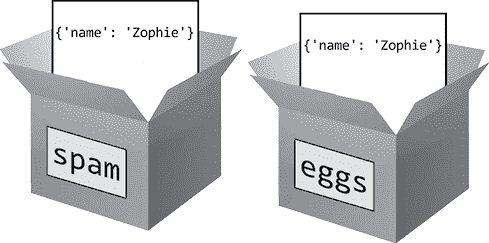
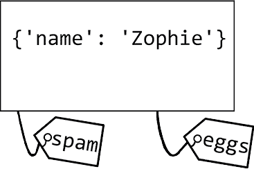
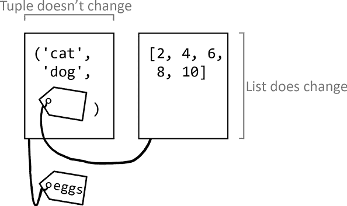

# 7 编程术语

> 原文：<http://inventwithpython.com/beyond/chapter7.html>


在 XKCD 漫画《飞人五号》(Up Goer Five)([https://xkcd.com/1133/](https://xkcd.com/1133/))中，网络漫画的艺术家兰道尔·门罗只用了 1000 个最常见的英语单词，就创作出了土星五号火箭的技术示意图。这部漫画把所有的技术术语分解成小孩子能理解的句子。但这也说明了为什么我们不能用简单的术语解释一切:对于外行观众来说，书中是这样解释的"如果系统出现故障，发生了火灾，致使他们无法去太空"。比我们说帮助人们快速逃生的“发射逃生系统”更容易理解。但是对于美国宇航局的工程师来说，这种说法还是太啰嗦了。即便如此，他们可能更愿意使用首字母缩写词LES。

虽然计算机术语可能会让新程序员感到困惑和恐惧，但它是基本功。Python和软件开发中的几个术语在含义上有细微的差别，即使是有经验的开发人员有时也会不小心混淆概念。这些术语的技术定义在不同的编程语言中可能有所不同，但本章涵盖了与 Python 相关的术语。您将对它们背后的编程语言概念有一个泛泛的理解。

本章假设你还不熟悉类和面向对象编程(OOP)。我在这里限制了对类和其他 OOP 术语的解释，但是这些术语在第 15 章到第 17 章中有更详细的解释。

## 定义

即使只有两个程序员，他们关于语义的争论也会喋喋不休。语言在不停的变化，人类是语言的主人，不要本末倒置了。一些开发人员使用术语的方式可能略有不同，但是熟悉这些术语仍然是有用的。本章探讨了这些术语以及它们之间的比较。如果你需要一个按字母顺序排列的术语表，你可以根据[https://docs.python.org/3/glossary.html](https://docs.python.org/3/glossary.html)官方的 Python 词汇表来提供规范的定义。

毫无疑问，一些程序员会阅读本章中的定义，并提出一些特例或例外。这一章并不是一个权威的指南，而是给你一个通俗易懂的定义，即使它们并不全面。正如编程工作一样，总有更多的东西需要学习。

### Python 是语言，Python 是解释器

单词 *python* 可以有多种解释。Python 编程语言的名字来自英国喜剧团体 Monty Python，而不是 snake(尽管 Python 教程和文档同时引用了 Monty Python 和 snake)。类似地， *Python* 对于计算机编程可以有两种含义。

当我们说“Python 运行一个程序”或“Python 将引发一个异常”时，我们指的是 *Python 解释器*——读取 *.py*  脚本并执行其指令。当我们说“Python 解释器”时，我们几乎总是在谈论由 Python 软件基金会维护的 *CPython、Python 解释器* ，可在[https://www.python.org](https://www.python.org)获得。CPython 是 Python 语言的一个*实现*——也就是说，是按照规范创建的软件——但是还有其他的。虽然 CPython 是用 C 编程语言编写的，但是为了运行与 Java 程序互操作的 Python 脚本， *Jython* 是用 Java 编写的。 *PyPy* ，一个*针对 Python 的即时编译器*，在程序执行时编译，是用 Python 编写的。

所有这些实现都运行用 *Python 编程语言*编写的源代码，这就是我们所说的“这是一个 Python 程序”或“我正在学习 Python”，在理想情况下，任何 Python 解释器都可以运行用 Python 语言编写的任何源代码；然而，在现实世界中，解释器之间会有一些轻微的不兼容和差异。CPython 被称为 Python 语言的*参考实现*，因为如果 CPython 和另一个解释器解释 Python 代码的方式有差异，CPython 的行为被认为是规范和正确的。

### 垃圾收集

在许多早期的编程语言中，程序员必须手动的为数据结构分配然后释放内存。手动内存分配是许多错误的来源，例如*内存泄漏*(程序员忘记释放内存)或*双重释放错误*(程序员两次释放相同的内存，导致数据损坏)。

为了避免这些错误，Python 使用了*垃圾收集*，这是一种自动内存管理的方式，可以让计算机自动分配和释放内存，这样程序员就省事多了。您可以将垃圾收集视为内存回收，因为它使内存可用于新数据。例如，在交互式 shell 中输入以下内容:

```py
>>> **def someFunction():**
...     **print('someFunction() called.')**
...     **spam = ['cat', 'dog', 'moose']**
...
>>> **someFunction()**
someFunction() called.
```

当调用`someFunction()`时，Python 为列表`['cat', 'dog', 'moose']`分配内存。程序员不需要计算需要多少字节的内存，因为 Python 会自动管理。当函数调用返回时，Python 的垃圾收集器将释放局部变量，使内存可用于其他数据。垃圾收集使编程变得更加容易，也更不容易出错。

### 字面量

一个*字面量*是源代码中一个固定的、打印出来的值的文本。在下面的代码示例中

```py
>>> **age = 42 + len('Zophie')**
```

`42`和`'Zophie'`文本是整数和字符串文字。可以把字面量想象成一个出现在源代码文本中的值。在 Python 源代码中，只有内置数据类型可以有字面量值，所以变量`age`不是字面量值。表 7-1 列出了一些 Python 文字的例子。

[表 7-1:](#calibre_link-693)Python 中文字的例子

| **字面量** | **数据类型** |
| --- | --- |
| `42` | 整数 |
| `3.14` | 浮点数 |
| `1.4886191506362924e+36` | 浮点数 |
| `"""Howdy!"""` | 字符串 |
| `r'Green\Blue'` | 字符串 |
| `[]` | 列表 |
| `{'name': 'Zophie'}` | 词典 |
| `b'\x41'` | 字节 |
| `True` | 布尔值 |
| `None` | 空类型 |

吹毛求疵的人会说我的一些说法不是基于官方 Python 语言文档。从技术上讲，`-5`不是 Python 中的字面量，因为该语言将负号(`-`)定义为对`5`文字进行操作的运算符。此外，`True`、`False`和`None`被认为是 Python 关键字而不是字面量，而`[]`和`{}`被称为*显示*或*原子*，这取决于您正在查看的是官方文档的哪一部分。无论如何，字面量是软件专业人员在所有这些例子中使用的一个常用术语。

### 关键词

每种编程语言都有自己的*关键词*。Python 关键字作为编程语言的一部分被预先保留下来的，不能用作变量名(即标识符)。例如，你不能有一个名为`while`的变量，因为`while`是一个保留用于`while`循环的关键字。以下是 Python 3.9 的一些 Python 关键字。

| `and` | `continue` | `finally` | `is` | `raise` |
| `as` | `def` | `for` | `lambda` | `return` |
| `assert` | `del` | `from` | `None` | `True` |
| `async` | `elif` | `global` | `nonlocal` | `try` |
| `await` | `else` | `if` | `not` | `while` |
| `break` | `except` | `import` | `or` | `with` |
| `class` | `False` | `in` | `pass` | `yield` |

请注意，Python 关键字始终是英语，在其他语言中不可用。例如，下面的函数具有用西班牙语编写的标识符，但是`def`和`return`关键字仍然是英语。

 ```py
def agregarDosNúmeros(primerNúmero, segundoNúmero):
    return primerNúmero + segundoNúmero
```

不幸的是，对于 65 亿不说英语的人来说，英语主宰了编程领域。

### 对象、值、实例和标识

一个*对象*是一段数据的表示，比如一个数字、一些文本或者一个更复杂的数据结构，比如一个列表或者字典。所有对象都可以存储在变量中，作为参数传递给函数调用，并从函数调用中返回。

所有对象都有值、标识和数据类型。*值*是对象表示的数据，比如整数`42`或者字符串`hello`。尽管有些令人困惑，但一些程序员将术语 value 用作 *object*的同义词，尤其是对于像整数或字符串这样的简单数据类型。例如，包含`42`的变量是包含整数值的变量，但我们也可以说它是包含值为`42`的整数对象的变量。

创建了一个带有*标识*的对象，它是一个唯一的整数，可以通过调用`id()`函数来查看。例如，在交互式 shell 中输入以下代码:

```py
>>> **spam = ['cat', 'dog', 'moose']**
>>> **id(spam)**
33805656
```

变量`spam`存储列表数据类型的对象。它的值是`['cat', 'dog', 'moose']`。它的id是`33805656`，尽管整数 ID 在每次程序运行时都会变化，所以你可能会在你的计算机上得到一个不同的 ID。一旦创建，只要程序运行，对象的标识就不会改变。尽管数据类型和对象的标识永远不会改变，但对象的值可以改变，正如我们将在本例中看到的:

```py
>>> **spam.append('snake')**
>>> **spam**
['cat', 'dog', 'moose', 'snake']
>>> **id(spam)**
33805656
```

现在列表中添加了`'snake'`。但是从`id(spam)`返回结果可以看出，它的id没有改变，还是同一个列表。但是，让我们看看当您输入以下代码时会发生什么:

```py
>>> **spam = [1, 2, 3]**
>>> **id(spam)**
33838544
```

`spam`中的值已被具有新标识的新列表对象覆盖:`33838544`而不是`33805656`。像`spam`这样的*标识符*与*标识*不同，因为多个标识符可以引用同一个对象，就像这个例子中两个变量被分配给同一个字典一样:

```py
>>> **spam = {'name': 'Zophie'}**
>>> **id(spam)**
33861824
>>> **eggs = spam**
>>> **id(eggs)**
33861824
```

`spam`和`eggs`标识符的id都是`33861824`，因为它们引用同一个字典对象。现在在交互 shell 中更改`spam`的值:

```py
>>> **spam = {'name': 'Zophie'}**
>>> **eggs = spam**
1 >>> **spam['name'] = 'Al'** 
>>> **spam**
{'name': 'Al'}
>>> **eggs** 
2 {'name': 'Al'}
```

你会看到对`spam` 1 的改动也出现在`eggs` 2 中。原因是它们都指同一个对象。

* * *

## 变量隐喻:盒子与标签

很多入门书籍用盒子来比喻变量，这是一种过于简单化的做法。很容易把变量想象成一个存储值的盒子，就像[图 7-1](#calibre_link-325) 中那样，但是当提到引用时，这个比喻就站不住脚了。前面的`spam`和`eggs`变量没有存储单独的字典；相反，它们将同一本词典的*引用*存储在计算机内存中。



[图 7-1:](#calibre_link-694) 很多书上说你可以把一个变量想象成一个包含一个值的盒子。

在 Python 中，所有变量在技术上都是引用，而不是值的容器，不管它们的数据类型如何。盒子的比喻很简单，但也有缺陷。不要把变量想象成盒子，你可以把变量想象成内存中对象的标签。[图 7-2](#calibre_link-326) 显示了先前`spam`和`eggs`示例上的标签。



[图 7-2:](#calibre_link-695) 变量也可以认为是值上的标签。

因为多个变量可以引用同一个对象，所以该对象可以“存储”在多个变量中。多个盒子不能存储同一个对象，所以使用标签隐喻可能更容易。Ned Batchelder 的 PyCon 2015 演讲“关于 Python 名称和值的事实和神话”在[https://youtu.be/_AEJHKGk9ns](https://youtu.be/_AEJHKGk9ns)有关于这个主题的更多信息。

* * *

如果不理解`=`赋值操作符总是复制引用，而不是对象，你可能会认为你在复制一个对象的副本，而实际上你是在复制对原始对象的引用。幸运的是，对于整数、字符串和元组这样的不可变值来说，这不是问题，原因我将在 114 页的“可变和不可变”中解释。

您可以使用`is`操作符来比较两个对象是否具有相同的id。相反，`==`操作符只检查对象值是否相同。你可以认为`x is y`是`id(x) == id(y)`的简写。在交互式 shell 中输入以下内容，以查看不同之处:

```py
>>> **spam = {'name': 'Zophie'}** 
1 >>> **eggs = spam**
>>> **spam is eggs** 
True
>>> **spam == eggs** 
True
2 >>> **bacon = {'name': 'Zophie'}** 
>>> **spam == bacon** 
True
>>> **spam is bacon** 
False
```

变量`spam`和`eggs`引用同一个字典对象 1 ，所以它们的id和值是相同的。但是`bacon`引用了另一个的字典对象 2 ，即使它包含与`spam`和`eggs`相同的数据。相同的数据意味着`bacon`与`spam`和`eggs`具有相同的值，但它们是具有两种不同id的两个不同对象。

### 元素

在 Python 中，容器对象内部的对象，如列表或字典，也被称为*项*或*元素*。例如，列表`['dog', 'cat', 'moose']`中的字符串是对象，但也被称为元素。

### 可变和不可变

如前所述，Python 中的所有对象都有值、数据类型和标识，其中只有值可以更改。如果你可以改变对象的值，那么它就是一个*可变的*对象。如果你不能改变它的值，它就是一个*不可变的*对象。[表 7-2](#calibre_link-315) 列出了 Python 中一些可变和不可变的数据类型。

[表 7-2:](#calibre_link-696)Python 的一些可变和不可变数据类型

| **可变数据类型** | **不可变数据类型** |
| --- | --- |
| 列表 | 整数 |
| 字典 | 浮点数 |
| 集合 | 布尔值 |
| 字节阵列 | 字符串 |
| 数组 | 固定集合  |
|  | 字节 |
|  | 元组 |

当您修改一个变量时，可能看起来像是在更改对象的值，如这个交互式 shell 示例所示:

```py
>>> **spam = 'hello'**
>>> **spam**
'hello'
>>> **spam = 'goodbye'**
>>> **spam**
'goodbye'
```

但是在这段代码中，您没有将`'hello'`对象的值从`'hello'`更改为`'goodbye'`。它们是两个独立的物体。您只是将`spam`从引用`'hello'`对象切换到了`'goodbye'`对象。您可以通过使用`id()`函数显示两个对象的id来验证:

```py
>>> **spam = 'hello'**
>>> **id(spam)**
40718944
>>> **spam = 'goodbye'**
>>> **id(spam)**
40719224
```

这两个字符串对象有不同的标识(40718944 和 40719224 ),因为它们是不同的对象。但是引用可变对象的变量可以就地修改其值。例如，在交互式 shell 中输入以下内容:

```py
>>> **spam = ['cat', 'dog']**
>>> **id(spam)**
33805576
1 >>> **spam.append('moose')**
2 >>> **spam[0] = 'snake'**
>>> **spam**
['snake', 'dog', 'moose']
>>> **id(spam)**
33805576
```

`append()`方法 1 通过索引的项目分配 2 都就地修改列表的值。即使列表的*值*已经改变，它的*标识*保持不变(33805576)。但是当您使用`+`操作符连接一个列表时，您会创建一个新的对象(具有新的标识)来覆盖旧的列表:

```py
>>> **spam = spam + ['rat']**
>>> **spam**
['snake', 'dog', 'moose', 'rat']
>>> **id(spam)**
33840064
```

列表串联创建一个具有新标识的新列表。当这种情况发生时，旧的列表最终会被垃圾收集器从内存中释放出来。您必须查阅 Python 文档来了解哪些方法和操作就地修改对象，哪些覆盖对象。要记住的一条好规则是，如果您在源代码中看到一个字面量，比如前面例子中的`['rat']`，Python 很可能会创建一个新对象。对对象调用的方法，比如`append()`，通常会就地修改对象。

对于不可变数据类型的对象，如整数、字符串或元组，赋值更简单。例如，在交互式 shell 中输入以下内容:

```py
>>> **bacon = 'Goodbye'**
>>> **id(bacon)**
33827584
1 >>> **bacon = 'Hello'**
>>> **id(bacon)**
33863820
2 >>> **bacon = bacon + ', world!'**
>>> **bacon**
'Hello, world!'
>>> **id(bacon)**
33870056
3 >>> **bacon[0] = 'J'**
Traceback (most recent call last):
  File "<stdin>", line 1, in <module>
TypeError: 'str' object does not support item assignment
```

字符串是不可变的，所以你不能改变它们的值。虽然看起来字符串在`bacon`中的值从`'Goodbye'`变成了`'Hello'` 1 ，但实际上它被一个具有新id的新字符串对象覆盖了。类似地，使用字符串连接的表达式创建一个具有新标识的新字符串对象 2 。在 Python 3 中，不允许使用项目赋值就地修改字符串。

元组的值被定义为它包含的对象以及这些对象的顺序。*元组*是不可变的序列对象，将值括在括号中。这意味着元组中的项目不能被覆盖:

```py
>>> **eggs = ('cat', 'dog', [2, 4, 6])**
>>> **id(eggs)** 
39560896
>>> **id(eggs[2])** 
40654152
>>> **eggs[2] = eggs[2] + [8, 10]**
Traceback (most recent call last):
  File "<stdin>", line 1, in <module>
TypeError: 'tuple' object does not support item assignment
```

但是不可变元组中的可变列表元素仍然可以被就地修改:

```py
>>> **eggs[2].append(8)**
>>> **eggs[2].append(10)**
>>> **eggs**
('cat', 'dog', [2, 4, 6, 8, 10])
>>> **id(eggs)** 
39560896
>>> **id(eggs[2])** 
40654152
```

尽管这是一个模糊的特例，但记住这一点很重要。元组仍然引用相同的对象，如图[图 7-3](#calibre_link-327) 所示。但是，如果一个元组包含一个可变对象，并且该对象改变了它的值，也就是说，如果该对象发生了变化，元组的值也会改变。

我，以及几乎每一个 Python 老鸟，都称元组是不可变的。但是有些元组能不能叫可变取决于你的定义。我在我的 PyCascades 2019 演讲中探讨了这个话题，在[https://invpy.com/amazingtuple/](https://invpy.com/amazingtuple/)的“惊人的可变，不变元组”。你也可以阅读卢西亚诺·拉马尔霍在*流畅 Python* 第二章的解释。(奥莱利媒体公司，2015 年)

 

[图 7-3:](#calibre_link-697) 虽然一个元组中的对象集合是不可变的，但是对象可以是可变的。

### 索引、键和散列

Python 列表和字典是可以包含多个其他值的值。要访问这些值，您需要使用一个*索引操作符*，它由一对方括号(`[` `]`)和一个称为*索引*的整数组成，以指定您想要访问的值。在交互式 shell 中输入以下内容，查看索引如何处理列表:

```py
>>> **spam = ['cat', 'dog', 'moose']**
>>> **spam[0]**
'cat'
>>> **spam[-2]**
'dog'
```

在本例中，`0`是一个索引。第一个索引是`0`，不是`1`，因为 Python(和大多数语言一样)使用的是*从零开始的索引*。使用从一开始的索引的语言很少:以Lua和R为代表 。Python 还支持负索引，其中`-1`指的是列表中的最后一项，`-2`指的是倒数第二项，依此类推。你可以认为负指数`spam[–n]`和`spam[len(spam) – n]`一样。

* * *

## 注

计算机科学家兼创作歌手 Stan Kelly-Bootle 曾经开玩笑说，“数组索引应该从 0 还是 1 开始？反正我提出的应该从0.5开始被大家否定了，这种事情还是仁者见仁吧"

* * *

您还可以在列表字面量上使用 index 运算符，尽管所有这些方括号在实际代码中可能看起来令人困惑且没有必要:

```py
>>> **['cat', 'dog', 'moose'][2]**
'moose'
```

索引也可用于列表以外的值，例如在字符串上获取单个字符:

```py
>>> **'Hello, world'[0]**
'H'
```

Python 字典被组织成*键值对*:

```py
>>> **spam = {'name': 'Zophie'}**
>>> **spam['name']**
'Zophie'
```

尽管列表索引仅限于整数，Python 字典的索引操作符是一个*键*，可以是任何可散列对象。一个*散列*是一个整数，作为一个值的一种标记。对象的哈希值在对象的生命周期内不会改变，具有相同值的对象必须具有相同的哈希值。这个实例中的字符串`'name'`是值`'Zophie'`的键。如果对象是可散列的，那么`hash()`函数将返回对象的散列。不可变的对象，比如字符串、整数、浮点和元组，可以是可散列的。列表(以及其他可变对象)是不可哈希的。在交互式 shell 中输入以下内容:

```py
>>> **hash('hello')**
-1734230105925061914
>>> **hash(42)**
42
>>> **hash(3.14)**
322818021289917443
>>> **hash((1, 2, 3))**
2528502973977326415
>>> **hash([1, 2, 3])**
Traceback (most recent call last):
  File "<stdin>", line 1, in <module>
TypeError: unhashable type: 'list'
```

虽然哈希的细节超出了本书的范围，但是键的散列被用来查找存储在字典中的条目和设置数据结构。这就是为什么不能使用可变列表作为字典的键:

```py
>>> **d = {}**
>>> **d[[1, 2, 3]] = 'some value'**
Traceback (most recent call last):
  File "<stdin>", line 1, in <module>
TypeError: unhashable type: 'list'
```

哈希不同于标识。具有相同值的两个不同对象将具有不同的标识，但具有相同的哈希。例如，在交互式 shell 中输入以下内容:

```py
>>> **a = ('cat', 'dog', 'moose')**
>>> **b = ('cat', 'dog', 'moose')**
>>> **id(a), id(b)**
(37111992, 37112136)
1 >>> **id(a) == id(b)**
False
>>> **hash(a), hash(b)**
(-3478972040190420094, -3478972040190420094)
2 >>> **hash(a) == hash(b)**
True
```

`a`和`b`引用的元组具有不同的id 1 ，但是它们相同的值意味着它们将具有相同的散列值 2 。注意，如果一个元组只包含可散列的项，那么它就是可散列的。因为在字典中只能使用可散列项作为键，所以不能使用包含不可散列列表的元组作为键。在交互式 shell 中输入以下内容:

```py
>>> **tuple1 = ('cat', 'dog')**
>>> **tuple2 = ('cat', ['apple', 'orange'])** 
>>> **spam = {}**
1 >>> **spam[tuple1] = 'a value'**
2 >>> **spam[tuple2] = 'another value'**
Traceback (most recent call last):
  File "<stdin>", line 1, in <module>
TypeError: unhashable type: 'list'
```

注意`tuple1`是可散列的 1 ，但是`tuple2`包含一个不可散列的列表 2 ，因此也是不可散列的。

### 容器、序列、映射和集合类型

单词*容器、序列、和映射*在 Python 中的含义不一定适用于其他编程语言。在 Python 中，*容器*是可以包含多个其他对象的任何数据类型的对象。列表和字典是 Python 中常用的容器类型。

*序列*是任何容器数据类型的对象，其有序值可通过整数索引访问。字符串、元组、列表和字节对象是序列数据类型。这些类型的对象可以使用索引操作符中的整数索引来访问值(括号`[`和`]`),也可以传递给`len()`函数。“有序”是指序列中有第一个值、第二个值等等。例如，以下两个列表值被认为不相等，因为它们的值排序不同:

```py
>>> **[1, 2, 3] == [3, 2, 1]**
False
```

映射是任何容器数据类型的对象，它使用键而不是索引。映射可以是有序的，也可以是无序的。Python 3.4 和更早版本中的字典是无序的，因为字典中没有第一个或最后一个键值对:

```py
>>> **spam = {'a': 1, 'b': 2, 'c': 3, 'd': 4}  # This is run from CPython 3.5.**
>>> **list(spam.keys())**
['a', 'c', 'd', 'b']
>>> **spam['e'] = 5**
>>> **list(spam.keys())**
['e', 'a', 'c', 'd', 'b']
```

在 Python 的早期版本中，不能保证从字典中以一致的顺序获得条目。由于字典的无序性质，对于它们的键-值对，以不同顺序编写的两个字典文字仍然被认为是相等的:

```py
>>> **{'a': 1, 'b': 2, 'c': 3} == {'c': 3, 'a': 1, 'b': 2}**
True
```

但是从 CPython 3.6 开始，字典保留了它们的键值对的插入顺序:

```py
>>> **spam = {'a': 1, 'b': 2, 'c': 3, 'd': 4}  # This is run from CPython 3.6.**
>>> **list(spam)**
['a', 'b', 'c', 'd']
>>> **spam['e'] = 5**
>>> **list(spam)**
['a', 'b', 'c', 'd', 'e']
```

这是 CPython 3.6 解释器中的一个特性，但在 Python 3.6 的其他解释器中没有。所有 Python 3.7 解释器都支持有序字典，这在 Python 语言 3.7 中成为标准。但是，仅仅因为一个字典是有序的，并不意味着它的条目可以通过整数索引来访问:`spam[0]`不会计算有序字典中的第一个条目(除非碰巧第一个条目有一个键`0`)。如果有序字典包含相同的键值对，则它们也被认为是相同的，即使键值对在每个字典中的顺序不同。

`collections`模块包含许多其他映射类型，包括`OrderedDict`、`ChainMap`、`Counter`和`UserDict`，这些在[https://docs.python.org/3/library/collections.html](https://docs.python.org/3/library/collections.html)的在线文档中有描述。

### 双下划线方法和魔术方法

*双下划线方法*，也称为*魔法方法*，是 Python 中的特殊方法，其名称以两个下划线开始和结束。这些方法用于运算符重载。Dunder 是双下划线的简称。最熟悉的 dunder 方法是`__init__()`(读作“dunder init dunder”，或简称为“init”)，它初始化对象。Python 有几十个 dunder 方法，第 17 章详细解释了它们。

### 模块和包

一个*模块*是一个 Python 程序，其他 Python 程序可以导入它，这样它们就可以使用该模块的代码。Python 自带的模块统称为 *Python 标准库*，但是你也可以创建自己的模块。例如，如果将 Python 程序保存为 *spam.py* ，其他程序可以运行`import spam`来访问 *spam.py* 程序的函数、类和全局变量。

一个*包*是你通过放置一个名为 *__init__ .py* 的文件形成的模块集合在一个文件夹里面。您使用文件夹的名称作为包的名称。包可以包含多个模块(即 *.py* 文件)或其他包(其他文件夹包含 *__init__.py* 文件)。

有关模块和包的更多解释和细节，请查看位于[https://docs.python.org/3/tutorial/modules.html](https://docs.python.org/3/tutorial/modules.html)的官方 Python 文档。

### 可调用对象和一级对象

函数和方法不是 Python 中唯一可以调用的东西。任何实现了*可调用操作符*——两个括号`()`的对象都是*可调用*对象。例如，如果你有一个`def hello():`语句，你可以把代码想象成一个名为`hello`的变量，它包含一个函数对象。在这个变量上使用 callable 操作符调用变量中的函数:`hello()`。

类是一个面向对象的概念，类是一个可调用对象的例子，它不是函数或方法。例如，`datetime`模块中的`date`类是使用可调用操作符调用的，如代码`datetime.date(2020, 1, 1)`所示。当类对象被调用时，运行该类的`__init__()`方法中的代码。第 15 章有更多关于职业的细节。

在 Python 中，函数是*一级对象*，这意味着您可以将它们存储在变量中，在函数调用中将它们作为参数传递，从函数调用中返回它们，以及对对象执行任何其他操作。把一个`def`语句想象成把一个函数对象赋给一个变量。例如，您可以创建一个`spam()`函数，然后您可以调用它:

```py
>>> **def spam():**
...     **print('Spam! Spam! Spam!')**
...
>>> **spam()**
Spam! Spam! Spam!
```

也可以将`spam()`函数对象赋给其他变量。当您调用已经为其分配了函数对象的变量时，Python 会执行该函数:

```py
>>> **eggs = spam**
>>> **eggs()**
Spam! Spam! Spam!
```

这些被称为*别名*，是现有函数的另一个名称。如果您需要重命名一个函数，通常会用到它们。但是如果大量的现有代码使用旧的名称，要改变它会很麻烦。

一级函数最常见的用途是将函数传递给其他函数。例如，我们可以定义一个`callTwice()`函数，可以向它传递一个需要调用两次的函数:

```py
>>> def callTwice(func):
...     func()
...     func()
...
>>> callTwice(spam)
Spam! Spam! Spam!
Spam! Spam! Spam!
```

虽然你可以在你的源代码中写两次`spam()`。但是您可以在运行时将`callTwice()`函数传递给任何函数，而不必事先在源代码中输入两次函数调用。

## 常见混淆术语

技术行话已经够令人困惑的了，尤其是那些有着相关但不同定义的术语。更糟糕的是，语言、操作系统和计算领域可能使用不同的术语来表示相同的事物，或者使用相同的术语来表示不同的事物。为了与其他程序员清楚地交流，您需要了解以下术语之间的区别。

### 语句与表达式

*表达式*是由运算符和值组成的指令，计算结果为单个值。值可以是变量(包含值)或函数运行结果(返回值)。因此，`2 + 2`是一个计算结果为单个值`4`的表达式。而且`len(myName) > 4`和`myName.isupper() or myName == 'Zophie'`也是表达方式。值本身也是一个对自身求值的表达式。

*语句*实际上是 Python 中的所有其他指令。这些语句包括`if`语句、`for`语句、`def`语句、`return`语句等等。语句 do *not* 计算出一个值。有些语句可以包含表达式，比如像`spam = 2 + 2`这样的赋值语句或者像`if myName == 'Zophie':`这样的`if`语句。

虽然 Python 3 使用了一个`print()`函数，但是 Python 2 使用了一个`print`语句。区别可能看起来只是引入了括号，但重要的是要注意 Python 3 `print()`函数有一个返回值(总是为`None`)，可以作为参数传递给其他函数，也可以赋给一个变量。这些操作都不能用语句实现。但是，您仍然可以在 Python 2 中使用括号，如下面的交互式 shell 示例所示:

```py
>>> **print 'Hello, world!' # run in Python 2**
Hello, world!
1 >>> **print('Hello, world!') # run in Python 2**
Hello, world!
```

虽然这看起来像一个函数调用 1 ，但它实际上是一个带括号的字符串值的`print`语句，同样的方式分配`spam = (2 + 2)`相当于`spam = 2 + 2`。在 Python 2 和 3 中，可以分别向`print`语句或`print()`函数传递多个值。在 Python 3 中，这将如下所示:

```py
>>> **print('Hello', 'world') # run in Python 3**
Hello world
```

但是在 Python 2 中使用相同的代码会被解释为在一个`print`语句中传递一个由两个字符串值组成的元组，产生以下输出:

```py
>>> **print('Hello', 'world') # run in Python 2**
('Hello', 'world')
```

一个语句和一个由函数调用组成的表达式有细微而且明确的区别。

### 块对子句对正文

术语*块、子句、体*经常互换使用，指代一组 Python 指令。一个*块*从缩进开始，当缩进与前一个缩进对齐时结束。例如，跟随在`if`或`for`语句之后的代码被称为语句块。以冒号结尾的语句后面需要一个新的块，如`if`、`else`、`for`、`while`、`def`、`class`等等。

但是 Python 确实允许单行代码块。尽管不推荐，但这是有效的 Python 语法:

```py
if name == 'Zophie': print('Hello, kitty!')
```

通过使用分号，您还可以在`if`语句块中拥有多条指令:

```py
if name == 'Zophie': print('Hello, kitty!'); print('Do you want a treat?')
```

但是你不能将其他需要新块的语句放在同一行程序。以下是无效的 Python 代码:

```py
if name == 'Zophie': if age < 2: print('Hello, kitten!')
```

这是错误代码的，因为如果一个`else`语句在下一行，那么`else`语句将引用哪个`if`语句将是不明确的。

官方 Python 文档更喜欢使用术语*子句*而不是块(【https://docs.python.org/3/reference/compound_stmts.html】T2)。以下代码是一个子句:

```py
if name == 'Zophie':
    print('Hello, kitty!')
    print('Do you want a treat?')
```

`if`语句是*子句头*，嵌套在`if`中的两个`print()`调用是*子句集*或*正文*。Python 官方文档使用*块*来指代作为一个单元执行的一段 Python 代码，比如模块、函数或类定义([https://docs.python.org/3/reference/executionmodel.html](https://docs.python.org/3/reference/executionmodel.html))。

### 变量与属性

*变量*仅仅是引用对象的名字。*属性*用官方文档的话来说就是“句号后的任何名称”([https://docs.python.org/3/tutorial/classes.html#python-scopes-and-namespaces](https://docs.python.org/3/tutorial/classes.html#python-scopes-and-namespaces))。属性与对象(点/句号前的名称)相关联。例如，在交互式 shell 中输入以下内容:

```py
>>> **import datetime**
>>> **spam = datetime.datetime.now()**
>>> **spam.year**
2018
>>> **spam.month**
1
```

在这个代码示例中，`spam`是包含一个`datetime`对象(从`datetime.datetime.now()`返回)的变量，`year`和`month`是该对象的属性。即使在`sys.exit()`的情况下，`exit()`函数也被认为是`sys`模块对象的属性。

其他语言称属性*字段*、*属性*，或者*成员变量*。

### 函数与方法

*函数*是被调用时运行的代码集合。一个*方法*是一个与类相关联的函数(或者一个*可调用*，在下一节中描述)，就像属性是一个与对象相关联的变量一样。函数包括内置函数或与模块相关联的函数。例如，在交互式 shell 中输入以下内容:

```py
>>> **len('Hello')**
5
>>> **'Hello'.upper()**
'HELLO'
>>> **import math**
>>> **math.sqrt(25)**
5.0
```

在这个例子中，`len()`是一个函数，`upper()`是一个字符串方法。方法也被认为是与它们相关的对象的属性。注意，句号并不一定意味着你在处理一个方法而不是一个函数。`sqrt()`函数与`math`相关联，这是一个模块，而不是一个类。

### 可迭代与迭代器

Python 的`for`循环是通用的。语句`for i in range(3):`将运行一个代码块三次。`range(3)`的调用不仅仅是 Python 告诉`for`循环的方式，“重复一些代码三次”调用`range(3)`返回一个范围对象，就像调用`list('cat')`返回一个列表对象一样。这两个对象都是*可迭代对象*(或者简称为*可迭代*)的例子。

在`for`循环中使用 iterables。在交互式 shell 中输入以下内容，可以看到一个`for`循环遍历一个范围对象和一个列表对象:

```py
>>> **for i in range(3):**
...   **print(i)** # body of the for loop
...
0
1
2
>>> **for i in ['c', 'a', 't']:**
...   **print(i)** # body of the for loop
...
c
a
t
```

Iterables 还包括所有序列类型，如范围、列表、元组和字符串对象，以及一些容器对象，如字典、集合和文件对象。

然而，在这些`for`循环示例中，仔细探讨一下，背后还有很多有意思的事情。在幕后，Python 正在为`for`循环调用内置的`iter()`和`next()`函数。当在`for`循环中使用时，iter *able* 对象被传递给内置的`iter()`函数，该函数返回 *iterator* 对象。尽管 iterable 对象包含这些项，iterator 对象仍然跟踪循环中下一个要使用的项。在循环的每次迭代中，iterator 对象被传递给内置的`next()`函数，以返回 iterable 中的下一项。我们可以手动调用`iter()`和`next()`函数，直接查看`for`循环是如何工作的。在交互式 shell 中输入以下内容，执行与上一个循环示例相同的指令:

```py
>>> **iterableObj = range(3)**
>>> **iterableObj**
range(0, 3)
>>> **iteratorObj = iter(iterableObj)**
>>> **i = next(iteratorObj)**
>>> **print(i)** # body of the for loop
0
>>> **i = next(iteratorObj)**
>>> **print(i)** # body of the for loop
1
>>> **i = next(iteratorObj)**
>>> **print(i)** # body of the for loop
2
>>> **i = next(iteratorObj)**
Traceback (most recent call last):
  File "<stdin>", line 1, in <module>
1 StopIteration
```

注意，如果在 iterable 中的最后一项返回后调用`next()`，Python 会引发一个`StopIteration`异常 1 。Python 的`for`循环捕捉到这个异常，知道何时应该停止循环，而不是用这个错误消息让程序崩溃。

迭代器只能对 iterable 中的项迭代一次。这类似于您只能使用`open()`和`readlines()`来读取文件内容一次，然后必须重新打开文件来再次读取其内容。如果想再次迭代 iterable，必须再次调用`iter()`来创建另一个 iterator 对象。您可以创建任意数量的迭代器对象；每个都将独立地跟踪它，保证返回的下一个元素。在交互式 shell 中输入以下内容，查看其工作原理:

```py
>>> **iterableObj = list('cat')**
>>> **iterableObj**
['c', 'a', 't']
>>> **iteratorObj1 = iter(iterableObj)**
>>> **iteratorObj2 = iter(iterableObj)**
>>> **next(iteratorObj1)**
'c'
>>> **next(iteratorObj1)**
'a'
>>> **next(iteratorObj2)**
'c'
```

记住，iterable 对象作为参数传递给`iter()`函数，而从`iter()`调用返回的对象是迭代器对象。迭代器对象被传递给`next()`函数。当您使用`class`语句创建自己的数据类型时，您可以实现`__iter__()`和`__next__()`内置方法，以便在`for`循环中使用您的对象。

### 语法错误、编译错误和语义错误

有很多方法可以对 bug 进行分类。但是在高层次上，您可以将编程错误分为三种类型:语法错误、编译错误和语义错误。

*语法*是给定编程语言中有效指令的规则集。一个*语法错误*，比如丢失了括号，用句号代替了逗号，或者其他一些打字错误都会立即生成一个`SyntaxError`。语法错误也被称为*解析错误*，当 Python 解释器无法将源代码的文本解析成有效指令时，就会出现这种错误。在英语中，这个错误相当于不正确的语法或一串无意义的单词，如“by uncontaminated cheese certainly it’s。”计算机需要特定的指令，无法读取程序员的思想来确定程序应该做什么，因此一个语法错误的程序甚至不会运行。

一个*编译错误*是当一个正在运行的程序无法执行某些任务时，比如试图打开一个不存在的文件或者将一个数除以零。在英语中，编译错误相当于给出一个无法运行的指令，比如“画一个有三条边的正方形”如果编译错误没有得到解决，程序将崩溃并显示回溯。但是您可以使用运行错误处理代码的`try` - `except`语句来捕获编译错误。例如，在交互式 shell 中输入以下内容:

```py
>>> **slices = 8**
>>> **eaters = 0**
>>> **print('Each person eats', slices / eaters, 'slices.')**
```

当您运行该代码时，它将显示以下回溯信息:

```py
Traceback (most recent call last):
  File "<pyshell#4>", line 1, in <module>
    print('Each person eats', slices / eaters, 'slices.')
ZeroDivisionError: division by zero
```

记住回溯提到的行号只是 Python 解释器检测到错误的地方，这很有帮助。错误的真正原因可能是在前一行代码中，甚至是在程序的更靠前部分。

源代码中的语法错误在程序运行前被解释器捕获，但是语法错误也可能在运行时发生。`eval()`函数可以获取一串 Python 代码并运行它，这可能会在运行时产生一个`SyntaxError`。例如，`eval('print("Hello, world)')`缺少一个右双引号，在代码调用`eval()`之前程序不会解析到。

一个*语义错误*(也称为*逻辑错误*)是一个更微妙的错误。语义错误不会导致错误信息或崩溃，但计算机会以程序员不希望的方式执行指令。在英语中，语义错误的等价形式是告诉计算机，“从商店买一盒牛奶，如果他们有鸡蛋，就买一打。”因为商店有鸡蛋，所以计算机会买 13 盒牛奶。不管是好是坏，计算机完全按照你的要求去做。例如，在交互式 shell 中输入以下内容:

```py
>>> **print('The sum of 4 and 2 is', '4' + '2')**
```

您将获得以下输出:

```py
The sum of 4 and 2 is 42
```

显然，42 不是我们预期的结果。但是请注意，程序没有崩溃。因为 Python 的`+`操作符可以将整数值相加，也可以将字符串值串联起来，所以错误地使用字符串值`'4'`和`'2'`代替整数导致了非预期的行为。

### 参数与自变量

*参数*是`def`语句中括号之间的变量名。*参数*是在函数调用中传递的值，然后这些值被分配给参数。例如，在交互式 shell 中输入以下内容:

```py
1 >>> **def greeting(name, species):**
...     **print(name + ' is a ' + species)**
...
2 >>> **greeting('Zophie', 'cat')**
Zophie is a cat
```

在`def`语句中，`name`和`species`是参数 1 。在函数调用中，`'Zophie'`和`'cat'`是自变量 2 。这两个术语经常被混淆。请记住，当参数和实参在此上下文中使用时，它们分别只是变量和值的其他名称。

### 显式转换与隐式转换

您可以将一种类型的对象转换为另一种类型的对象。例如，`int('42')`将字符串`'42'`转换为整数`42`。实际上，字符串对象`'42'`并没有被转换，因为`int()`函数基于原始对象创建了一个新的整数对象。当转换像这样*显式地*完成时，我们就*转换*了对象，尽管程序员仍然经常称这个过程为转换对象。

Python 通常会隐式地进行类型转换，比如在计算表达式`2 + 3.0`到`5.0`时。像`2`和`3.0`这样的值被强制转换成操作符可以处理的通用数据类型。这种转换是通过*隐式*完成的，被称为类型*强制*。

强制有时会导致令人惊讶的结果。Python 中的布尔值`True`和`False`可以分别强制为整数值`1`和`0`。尽管在真实世界的代码中，你永远不会将布尔值写成这些值，但这意味着表达式`True + False + True`相当于`1 + 0 + 1`，并且计算结果为`2`。了解了这些之后，您可能会认为将一个布尔值列表传递给`sum()`是计算列表中`True`值数量的好方法。但事实证明调用`count()` list 方法更快。

### 属性与特性

在许多语言中，术语*属性*和*特性*被用作同义词，但是在 Python 中这些词有不同的含义。第 124 页“变量与属性”中解释的属性是与对象相关的名称。属性包括对象的成员变量和方法。

其他语言，比如 Java，有针对类的`getter`和`setter`方法。程序必须调用属性的`setter` 方法，而不是直接给属性赋值(可能是无效的)。`setter`方法中的代码可以确保成员变量只被赋予一个有效值。`getter`方法读取属性的值。如果一个属性被命名为`accountBalance`，那么`setter`和`getter`方法通常分别被命名为`setAccountBalance()`和`getAccountBalance()`。

在 Python 中，*属性*允许程序员使用加简洁的语法实现 getters 和 setters功能。第 17 章更详细地探讨了 Python 的属性。

### 字节码与机器码

源代码被编译后，称为*机器码*的指令形式，由 CPU 直接执行。机器代码由来自 CPU 的*指令集*的指令组成，这是计算机的内置命令集。由机器码组成的编译程序被称为*二进制*文件。一种古老的语言，如 C，有编译器软件，可以将 C 源代码编译成二进制文件，用于几乎所有可用的 CPU。但是，如果像 Python 这样的语言想要在同一套 CPU 上运行，就必须为每个 CPU 编写大量的 Python 编译器。


还有另一种方法可以将源代码转换成机器可用的代码。你可以创建*字节码*，而不是创建由 CPU 硬件直接执行的机器码。也被称为*可移植代码*或 *p代码*，字节码由软件解释程序执行，而不是直接由 CPU 执行。Python 字节码由指令集的指令组成，尽管现实世界中没有硬件 CPU 执行这些指令。相反，软件解释器执行字节码。Python 字节码存储在*.pyc* 文件中，*.py* 是它的源文件。用 C 编写的 CPython 解释器可以将 Python 源代码编译成 Python 字节码，然后执行指令。(Java 虚拟机[JVM]软件也是如此，它执行 Java 字节码。)因为是用 C 写的，CPython 有一个 Python 解释器，可以为任何 C 已经有编译器的 CPU 编译。

斯科特·桑德森(Scott Sanderson)和乔·杰夫尼克(Joe Jevnik)在 PyCon 2016 上发表的演讲“玩转 Python 字节码”是了解这个主题的绝佳资源([https://youtu.be/mxjv9KqzwjI](https://youtu.be/mxjv9KqzwjI))。

### 脚本与程序，脚本语言与编程语言

脚本和程序之间的区别，以及脚本语言和编程语言之间的区别，都是模棱两可的。简单地说，所有的脚本都是程序，所有的脚本语言都是编程语言。但是脚本语言有时被认为是更简单或“不真实”的编程语言。

区分脚本和程序的一种方法是根据代码的执行方式。用*脚本语言*编写的*脚本*直接从源代码中解释，而用*编程语言*编写的*程序*被编译成二进制。但是 Python 通常被认为是一种脚本语言，尽管在 Python 程序运行时有一个编译字节码的步骤。同时，Java 通常不被认为是脚本语言，尽管它产生字节码而不是机器代码二进制，就像 Python 一样。从技术上讲，*语言*没有被编译或解释；更确切地说，一种语言有编译器或解释器的实现，为任何语言创建编译器或解释器都是可能的。

这些差异可以争论，但不必较真。脚本语言不一定功能更弱，编译编程语言也不一定更难使用。

### 库/框架/SDK/引擎/API

使用其他人的代码可以节省大量时间。您经常可以找到打包成库、框架、SDK、引擎或 API 的代码。这些实体之间的差异是微妙但重要的。

一个*库*是一个由第三方制作的代码集合的通称。库可以包含供开发人员使用的函数、类或其他代码。Python 库可能采用包、一组包甚至单个模块的形式。库通常是用特定语言编写的。开发者不需要知道库代码是如何工作的；他们只需要知道如何调用库中的代码或与库中的代码交互。一个*标准库*，比如 Python 标准库，是假定可用于编程语言的所有实现的代码库。

一个*框架*是用*反转控制*操作的代码集合；开发人员创建框架将根据需要调用的函数，而不是开发人员的代码调用框架中的函数。控制反转通常被描述为“不要打电话给我们，我们会打电话给你。”例如，为 web 应用程序框架编写代码涉及到为 web 页面创建函数，当 web 请求进来时，框架将调用这些函数。

一个*软件开发工具包* ( *SDK* )包括代码库、文档和软件工具，以帮助为特定的操作系统或平台创建应用程序。例如，Android SDK 和 iOS SDK 分别用于创建 Android 和 iOS 的移动应用程序。Java 开发工具包(JDK)是一个为 JVM 创建应用程序的 SDK。

一个*引擎*是一个大型的独立系统，可以由开发者的软件进行外部控制。开发人员通常调用引擎中的函数来执行大型复杂的任务。引擎的例子包括游戏引擎、物理引擎、推荐引擎、数据库引擎、象棋引擎和搜索引擎。

一个*应用编程接口* ( *API* )是库、SDK、框架或引擎的面向公众的接口。API 指定如何调用函数或向库发出访问资源的请求。库的创建者会提供 API 的文档。许多流行的社交网络和网站为程序提供 HTTP API 来访问它们的服务，而不是由人使用 web 浏览器。使用这些 API，你可以编写程序，例如，可以自动在脸书上发布消息或阅读 Twitter 时间表。

## 总结

尽快侵淫编程多年，有可能仍不熟悉某些编程术语。但是大多数主要的软件应用程序都是由软件开发团队创建的，而不是个人。因此，当你和团队一起工作时，能够清晰地交流是非常重要的。

本章解释了 Python 程序由标识符、变量、字面量、关键字和对象组成，所有 Python 对象都有值、数据类型和身份。虽然每个对象都有一个数据类型，但也有几个大的类型类别，如容器、序列、映射、集合、内置和用户自定义类型。

某些术语（如值、变量和函数）在特定上下文中（如元素、参数、参数和方法）具有不同的名称。有几个术语也很容易相互混淆。在日常编程中混淆这些术语并不是什么大不了的事情：例如，属性与特性，块与正文，异常与错误，或者库，框架，SDK，引擎和API之间的细微差异。例如，语句和表达式，函数和方法以及参数和参数通常被初学者互换使用。

但是其他术语，比如 iterable 与 iterator、语法错误与语义错误、字节码与机器码，都有不同的含义，除非你想搞晕你的同事，否则千万不要混淆这些基本概念。

您仍然会发现术语的使用因语言而异，甚至因程序员而异。随着时间的推移，你会随着经验(和频繁的网络搜索)变得更加熟悉行话。

## 延伸读物

https://docs.python.org/3/glossary.html 的官方 Python 词汇表列出了 Python 生态系统使用的简短但有用的定义。

https://docs.python.org/3/reference/datamodel.html 的官方 Python 文档更详细地描述了 Python 对象。

妮娜·扎哈伦科在 https://youtu.be/F6u5rhUQ6dU 举办的 PyCon 2016 演讲“Python 中的内存管理——基础知识”，解释了 Python 的垃圾收集器如何工作的许多细节。

https://docs.python.org/3/library/gc.html 的官方 Python 文档有更多关于垃圾收集器的信息。

Python 邮件列表中关于在 Python 3.6 中制作词典的讨论也很好阅读，详情可查看<https://mail.python.org/pipermail/python-dev/2016-September/146327.html>