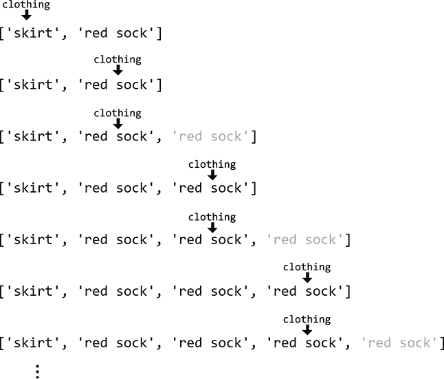
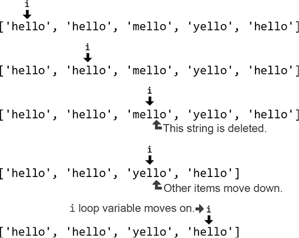
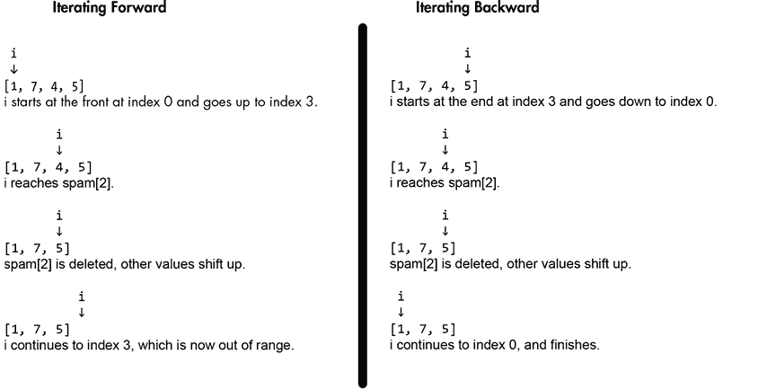

# 8 个常见的 Python 陷阱

> 原文：<http://inventwithpython.com/beyond/chapter8.html>

虽然 Python 是我最喜欢的编程语言，但它也不是没有缺陷。每种语言都有缺点(有些比其他的多)，Python 也不例外。新的 Python 程序员必须学会避免一些常见的“陷阱”程序员学习这类知识是随机的，来自经验，但本章把它收集在一个地方。了解这些陷阱背后的编程知识可以帮助您理解为什么 Python 有时行为怪异。

这一章解释了当你修改列表和字典等可变对象的内容时，它们的行为会如何异常。您将了解到`sort()`方法是如何不按照字母顺序对项目进行排序的，以及浮点数是如何产生舍入误差的。当你将不等式操作符`!=`链接在一起时，它们会有不寻常的行为。并且在编写包含单个项目的元组时，必须使用尾随逗号。本章告诉你如何避免这些常见的陷阱。

## 不要在列表上循环时添加或删除项目

在用`for`或`while`循环遍历(即*迭代*)列表时，从列表中添加或删除项目很可能会导致 bug。考虑这样一个场景:您想要遍历一个描述衣服的字符串列表，并通过每次在列表中找到一只袜子时插入一只匹配的袜子来确保有偶数只袜子。这个任务看起来很简单:遍历列表中的字符串，当在一个字符串中找到`'sock'`，比如`'red sock'`，将另一个`'red sock'`字符串追加到列表中。

但是这个代码不行。它陷入了一个无限循环，你必须按下`Ctrl+C`来中断它:

```py
>>> clothes = ['skirt', 'red sock']
>>> for clothing in clothes:  # Iterate over the list.
...    if 'sock' in clothing:  # Find strings with 'sock'.
...        clothes.append(clothing)  # Add the sock's pair.
...        print('Added a sock:', clothing)  # Inform the user.
...
Added a sock: red sock
Added a sock: red sock
Added a sock: red sock
`--snip--`
Added a sock: red sock
Traceback (most recent call last):
  File "<stdin>", line 3, in <module>
KeyboardInterrupt
```

你会在[`autbor.com/addingloop`](https://autbor.com/addingloop/)看到这段代码的可视化执行。

问题是，当您将`'red sock'`追加到`clothes`列表中时，列表现在有了一个新的第三项，它必须迭代:`['skirt', 'red sock', 'red sock']`。`for`循环在下一次迭代中到达第二个`'red sock'`，因此它追加*另一个*`'red sock'`字符串。这使得列表`['skirt', 'red sock', 'red sock', 'red sock']`成为 Python 迭代的另一个字符串。这将继续发生，如图 8-1 中的所示，这就是为什么我们会看到永不停止的`'Added a sock.'`消息流。只有当计算机耗尽内存并使 Python 程序崩溃时，或者直到您通过按下`Ctrl+C`来中断它，循环才会停止。

 

图 8-1：在`for`循环的每一次迭代中，一个新的`'red sock'`被添加到列表中，`clothing`在下一次迭代中引用它。这个循环永远重复。

要点是不要在遍历列表时向列表中添加条目。取而代之的是，为新的、修改过的列表的内容使用一个单独的列表，比如本例中的`newClothes`:

```py
>>> clothes = ['skirt', 'red sock', 'blue sock']
>>> newClothes = []
>>> for clothing in clothes:
...    if 'sock' in clothing:
...        print('Appending:', clothing)
...        newClothes.append(clothing) # We change the newClothes list, not clothes.
...
Appending: red sock
Appending: blue sock
>>> print(newClothes)
['red sock', 'blue sock']
>>> clothes.extend(newClothes)  # Appends the items in newClothes to clothes.
>>> print(clothes)
['skirt', 'red sock', 'blue sock', 'red sock', 'blue sock']
```

这段代码的可视化执行在[`autbor.com/addingloopfixed`](https://autbor.com/addingloopfixed/)进行。

我们的`for`循环遍历了`clothes`列表中的条目，但是没有修改循环内部的`clothes`。而是改了一个单独的列表，`newClothes`。然后，在循环之后，我们通过用`newClothes`的内容扩展来修改`clothes`。你现在有了一个匹配袜子的`clothes`列表。

同样，你不应该在遍历列表时删除列表中的条目。考虑这样一段代码，在这段代码中，我们想要从列表中移除任何不是`'hello'`的字符串。最简单的方法是遍历列表，删除不匹配的条目:

```py
>>> greetings = ['hello', 'hello', 'mello', 'yello', 'hello']
>>> for i, word in enumerate(greetings):
...    if word != 'hello':  # Remove everything that isn't 'hello'.
...        del greetings[i]
...
>>> print(greetings)
['hello', 'hello', 'yello', 'hello']
```

这段代码的可视化执行在[`autbor.com/deletingloop`](https://autbor.com/deletingloop/)进行。

名单里好像还剩下`'yello'`。原因是当`for`循环检查索引`2`时，它从列表中删除了`'mello'`。但是这将列表中所有剩余的条目下移一个索引，将`'yello'`从索引`3`移到索引`2`。循环的下一次迭代检查索引`3`，它现在是最后一个`'hello'`，如图 8-2 中的所示。那根`'yello'`字符串浑浑噩噩的溜走了！*不要*在遍历列表的时候从列表中删除项目。



图 8-2：当循环删除`'mello'`时，列表中的项目下移一个索引，导致`i`跳过`'yello'`。

相反，创建一个新列表，复制除要删除的项目之外的所有项目，然后替换原始列表。对于前一个示例的无错误等效物，请在交互式 Shell 中输入以下代码。

 ```py
>>> greetings = ['hello', 'hello', 'mello', 'yello', 'hello']
>>> newGreetings = []
>>> for word in greetings:
...    if word == 'hello':  # Copy everything that is 'hello'.
...        newGreetings.append(word)
...
>>> greetings = newGreetings  # Replace the original list.
>>> print(greetings)
['hello', 'hello', 'hello']
```

这段代码的可视化执行在[`autbor.com/deletingloopfixed`](https://autbor.com/deletingloopfixed/)进行。

请记住，因为这段代码只是一个创建列表的简单循环，所以您可以用列表理解来替换它。列表理解不会运行得更快或使用更少的内存，但它更短，但不会失去太多的可读性。在交互式 Shell 中输入以下内容，这相当于前面示例中的代码:

```py
>>> greetings = ['hello', 'hello', 'mello', 'yello', 'hello']
>>> greetings = [word for word in greetings if word == 'hello']
>>> print(greetings)
['hello', 'hello', 'hello']
```

不仅对列表的理解更加简洁，还避免了在迭代列表时改变列表时出现的问题。

* * *

## 引用、内存使用和`sys.getsizeof()`

这看起来像是创建一个新的列表而不是修改原来的列表浪费内存。但是请记住，就像变量在技术上包含对值的引用而不是实际值一样，列表也包含对值的引用。前面显示的`newGreetings.append(word)`行没有复制`word`变量中的字符串，只是复制了对字符串的引用，这要小得多。

您可以通过使用`sys.getsizeof ()`函数看到这一点，该函数返回传递给它的对象在内存中占用的字节数。在这个交互式 Shell 示例中，我们可以看到短字符串`'cat'`占用了 52 个字节，而长字符串占用了 85 个字节:

```py
>>> import sys
>>> sys.getsizeof('cat')
52
>>> sys.getsizeof('a much longer string than just "cat"')
85
```

(在我使用的 Python 版本中，string 对象的开销占用 49 个字节，而字符串中的每个实际字符占用 1 个字节。)但是包含这些字符串中任何一个的列表都要占用 72 个字节，不管字符串有多长:

```py
>>> sys.getsizeof(['cat'])
72
>>> sys.getsizeof(['a much longer string than just "cat"'])
72
```

原因是，从技术上讲，列表不包含字符串，而只是对字符串的引用，无论引用的数据大小如何，引用的大小都是一样的。类似于`newGreetings.append(word)`的代码并没有复制`word`中的字符串，而是复制了对该字符串的引用。如果你想知道一个对象及其引用的所有对象占用了多少内存，Python 核心开发者 Raymond Hettinger 为此编写了一个函数，你可以在[`code.activestate.com/recipes/577504-compute-memory-footprint-of-an-object-and-its-cont`](https://code.activestate.com/recipes/577504-compute-memory-footprint-of-an-object-and-its-cont/)访问这个函数。

所以你不应该觉得创建一个新的列表而不是在迭代时修改原来的列表是在浪费内存。即使您的列表修改代码看似有效，它也可能是需要很长时间才能发现和修复的细微错误的来源。浪费一个程序员的时间远比浪费一台计算机的内存更昂贵。

* * *

尽管在遍历列表(或任何可迭代对象)时不应该添加或删除列表中的项目，但是修改列表的内容是很好的。例如，我们有一个字符串形式的数字列表:`['1', '2', '3', '4', '5']`。我们可以在遍历列表时将这个字符串列表转换成整数列表`[1, 2, 3, 4, 5]`:

```py
>>> numbers = ['1', '2', '3', '4', '5'] 
>>> for i, number in enumerate(numbers):
...    numbers[i] = int(number)
...
>>> numbers 
[1, 2, 3, 4, 5]
```

这段代码的可视化执行在[`autbor.com/covertstringnumbers`](https://autbor.com/covertstringnumbers)进行。修改列表中的项目就可以了；它改变了列表中容易出错的条目的数量。

在列表中安全地添加或删除条目的另一种可能的方法是从列表的末尾向后迭代到开头。这样，您可以在遍历列表时从列表中删除项，或者向列表中添加项，只要将它们添加到列表的末尾。例如，输入下面的代码，它从`someInts`列表中删除偶数整数。

 ```py
>>> someInts = [1, 7, 4, 5]
>>> for i in range(len(someInts)):
...
...    if someInts[i] % 2 == 0:
...        del someInts[i]
...
Traceback (most recent call last):
  File "<stdin>", line 2, in <module>
IndexError: list index out of range
>>> someInts = [1, 7, 4, 5]
>>> for i in range(len(someInts) - 1, -1, -1):
...    if someInts[i] % 2 == 0:
...        del someInts[i]
...
>>> someInts
[1, 7, 5]
```

这段代码之所以有效，是因为循环将来迭代的所有项的索引都没有改变。但是在删除的值之后，值的重复上移使得这种技术对于长列表来说效率很低。这段代码的可视化执行在[`autbor.com/iteratebackwards1`](https://autbor.com/iteratebackwards1)进行。你可以在图 8-3 中看到向前迭代和向后迭代的区别。



图 8-3：向前(左)和向后(右)迭代时从列表中删除偶数

类似地，当您向后遍历列表时，您可以将项目添加到列表的末尾。在交互式 Shell 中输入以下内容，它会将`someInts`列表中任何偶数的副本附加到列表的末尾:

```py
>>> someInts = [1, 7, 4, 5]
>>> for i in range(len(someInts) - 1, -1, -1):
...    if someInts[i] % 2 == 0:
...        someInts.append(someInts[i])
...
>>> someInts
[1, 7, 4, 5, 4]
```

这段代码的可视化执行在[`autbor.com/iteratebackwards2`](https://autbor.com/iteratebackwards2)进行。通过向后迭代，我们可以在列表中添加或删除条目。但是这可能很难做到正确，因为对这一基本技术的微小改变最终可能会引入错误。创建新列表比修改原始列表简单得多。正如 Python 核心开发者 Raymond Hettinger 所说:

1.  Q. 循环遍历列表时修改列表的最佳实践是什么？
2.  A. 不要。

## 不要在不使用`copy.copy()`和`copy.deepcopy()`的情况下复制可变值

最好将变量视为引用对象的标签或名称标记，而不是包含对象的盒子。这个心智模型在修改*可变*对象时特别有用:列表、字典和集合等对象，它们的值可以发生变化(即改变)。当将引用可变对象的一个变量复制到另一个变量，并认为正在复制实际的对象时，会出现一个常见的问题。在 Python 中，赋值语句从不复制对象；它们只复制对一个对象的引用。（Python 开发者 Ned Batchelder 在 PyCon 2015 上有一个关于这个想法的精彩演讲，题目是“关于 Python 名称和价值的事实和神话”在`youtu.be/_AEJHKGk9ns`观看。）

例如，在交互式 Shell 中输入以下代码，注意，即使我们只更改了`spam`变量，`cheese`变量也会更改:

```py
>>> spam = ['cat', 'dog', 'eel']
>>> cheese = spam
>>> spam 
['cat', 'dog', 'eel']
>>> cheese 
['cat', 'dog', 'eel']
>>> spam[2] = 'MOOSE'
>>> spam 
['cat', 'dog', 'MOOSE']
>>> cheese
['cat', 'dog', 'MOOSE']
>>> id(cheese), id(spam)
2356896337288, 2356896337288
```

这段代码的可视化执行在[`autbor.com/listcopygotcha1`](https://autbor.com/listcopygotcha1)进行。如果你认为`cheese = spam`复制了列表对象，你可能会惊讶于`cheese`似乎已经改变了，尽管我们仅仅是修改了`spam`。但是赋值语句*从不复制对象*，只复制*对象的引用*。赋值语句`cheese = spam`使`cheese` *引用*与`spam`在计算机内存中相同的列表对象。它不会复制列表对象。这就是为什么改变`spam`也会改变`cheese`:两个变量引用同一个列表对象。

同样的原则也适用于传递给函数调用的可变对象。在交互式 Shell 中输入以下内容，注意全局变量`spam`和局部参数(记住，参数是在函数的`def`语句中定义的变量)`theList`都指向同一个对象:

```py
>>> def printIdOfParam(theList):
...    print(id(theList))
...
>>> eggs = ['cat', 'dog', 'eel']
>>> print(id(eggs))
2356893256136
>>> printIdOfParam(eggs)
2356893256136
```

这段代码的可视化执行在[`autbor.com/listcopygotcha2`](https://autbor.com/listcopygotcha2)进行。注意，`id()`为`eggs`和`theList`返回的标识是相同的，这意味着这些变量引用同一个列表对象。`eggs`变量的列表对象没有复制到`theList`；相反，引用是复制的，这就是为什么两个变量引用同一个列表。一个引用的大小只有几个字节，但是想象一下如果 Python 复制了整个列表而不仅仅是引用。如果`eggs`包含十亿个条目而不是三个，那么将它传递给`printIdOfParam()`函数将需要复制这个巨大的列表。仅仅是做一个简单的函数调用，就要消耗掉千兆字节的内存！这就是为什么 Python 赋值只复制引用，从不复制对象。

防止这种情况的一种方法是用`copy.copy()`函数复制列表对象(不仅仅是引用)。在交互式 Shell 中输入以下内容:

```py
>>> import copy
>>> bacon = [2, 4, 8, 16]
>>> ham = copy.copy(bacon)
>>> id(bacon), id(ham)
(2356896337352, 2356896337480)
>>> bacon[0] = 'CHANGED'
>>> bacon
['CHANGED', 4, 8, 16]
>>> ham
[2, 4, 8, 16]
>>> id(bacon), id(ham)
(2356896337352, 2356896337480)
```

这段代码的可视化执行在`autbor.com/copycopy1`上。`ham`变量引用一个复制的列表对象，而不是由`bacon`引用的原始列表对象，所以它不会受到这个问题的影响。

但是就像变量像标签或名字标签而不是包含对象的盒子一样，列表也包含引用对象而不是实际对象的标签或名字标签。如果您的列表包含其他列表，`copy.copy()`仅复制对这些内部列表的引用。在交互式 Shell 中输入以下内容来查看该问题:

```py
>>> import copy
>>> bacon = [[1, 2], [3, 4]]
>>> ham = copy.copy(bacon)
>>> id(bacon), id(ham)
(2356896466248, 2356896375368)
>>> bacon.append('APPENDED')
>>> bacon
[[1, 2], [3, 4], 'APPENDED']
>>> ham
[[1, 2], [3, 4]]
>>> bacon[0][0] = 'CHANGED'
>>> bacon
[['CHANGED', 2], [3, 4], 'APPENDED']
>>> ham
[['CHANGED', 2], [3, 4]]
>>> id(bacon[0]), id(ham[0])
(2356896337480, 2356896337480)
```

这段代码的可视化执行在[`autbor.com/copycopy2`](https://autbor.com/copycopy2)进行。虽然`bacon`和`ham`是两个不同的列表对象，但是它们引用相同的`[1, 2]`和`[3, 4]`内部列表，所以对这些内部列表的更改会在两个变量中得到反映，即使我们使用了`copy.copy()`。解决方案是使用`copy.deepcopy()`，它将复制被复制的列表对象中的任何列表对象(以及那些列表对象中的任何列表对象，等等)。在交互式 Shell 中输入以下内容:

```py
>>> import copy
>>> bacon = [[1, 2], [3, 4]]
>>> ham = copy.deepcopy(bacon)
>>> id(bacon[0]), id(ham[0])
(2356896337352, 2356896466184)
>>> bacon[0][0] = 'CHANGED'
>>> bacon
[['CHANGED', 2], [3, 4]]
>>> ham
[[1, 2], [3, 4]]
```

这段代码的可视化执行在[`autbor.com/copydeepcopy`](https://autbor.com/copydeepcopy)进行。虽然`copy.deepcopy()`比`copy.copy()`稍微慢一点，但是如果你不知道被复制的列表是否包含其他列表(或者其他可变对象，比如字典或者集合)，那么使用它会更安全。我的一般建议是总是使用`copy.deepcopy()`:它可能会防止细微的错误，并且你的代码可能不会被察觉。

## 不要使用可变值作为默认参数

Python 允许您为您定义的函数中的参数设置默认参数。如果用户没有显式设置参数，函数将使用默认参数执行。当对函数的大多数调用使用相同的参数时，这很有用，因为默认的参数使参数成为可选的。例如，为`split()`方法传递`None`会使其在空白字符上分割，但`None`也是默认参数:调用`'cat dog'.split()`与调用`'cat dog'.split(None)`做同样的事情。该函数使用默认参数作为参数的参数，除非调用方传入一个参数。*

但是你不应该设置一个*可变*对象，比如一个列表或者字典，作为默认参数。要了解这是如何导致错误的，请看下面的例子，它定义了一个`addIngredient()`函数，将一个配料字符串添加到一个代表三明治的列表中。因为这个列表的第一项和最后一项通常是`'bread'`，所以可变列表`['bread', 'bread']`被用作默认参数:

```py
>>> def addIngredient(ingredient, sandwich=['bread', 'bread']):
...    sandwich.insert(1, ingredient)
...    return sandwich
...
>>> mySandwich = addIngredient('avocado')
>>> mySandwich
['bread', 'avocado', 'bread']
```

但是使用一个可变的对象，比如像`['bread', 'bread']`这样的列表作为默认参数有一个微妙的问题:列表是在函数的`def`语句执行时创建的，而不是在每次调用函数时创建的。这意味着只创建了一个`['bread', 'bread']`列表对象，因为我们只定义了一次*函数*。但是每个函数*调用*到`addIngredient()`都会重用这个列表。这会导致意外的行为，如下所示:

```py
>>> mySandwich = addIngredient('avocado')
>>> mySandwich
['bread', 'avocado', 'bread']
>>> anotherSandwich = addIngredient('lettuce')
>>> anotherSandwich
['bread', 'lettuce', 'avocado', 'bread']
```

因为`addIngredient('lettuce')`最终使用了与之前调用相同的默认参数列表，其中已经添加了`'avocado'`，而不是`['bread', 'lettuce', 'bread']`，所以函数返回`['bread', 'lettuce', 'avocado', 'bread']`。因为`sandwich`参数列表与最后一次函数调用相同，所以`'avocado'`字符串再次出现。只创建了一个`['bread', 'bread']`列表，因为函数的`def`语句只执行一次，而不是每次调用函数时都执行。这段代码的可视化执行在[`autbor.com/sandwich`](https://autbor.com/sandwich)进行。

如果需要使用列表或字典作为默认参数，Python 风格的解决方案是将默认参数设置为`None`。然后编写代码来检查这一点，并在调用该函数时提供新的列表或字典。这确保了每次调用函数时，函数都会创建一个新的可变对象，而不是在定义函数时只调用一次*函数*，如下例所示:

```py
>>> def addIngredient(ingredient, sandwich=None):
...    if sandwich is None:
...        sandwich = ['bread', 'bread']
...    sandwich.insert(1, ingredient)
...    return sandwich
...
>>> firstSandwich = addIngredient('cranberries')
>>> firstSandwich
['bread', 'cranberries', 'bread']
>>> secondSandwich = addIngredient('lettuce')
>>> secondSandwich
['bread', 'lettuce', 'bread']
>>> id(firstSandwich) == id(secondSandwich)
False # 1
```

请注意，`firstSandwich`和`secondSandwich`并不共享同一个列表引用 1 ，因为`sandwich = ['bread', 'bread']`在每次调用`addIngredient()`时都会创建一个新的列表对象，而不仅仅是在定义`addIngredient()`时创建一次。

可变数据类型包括列表、字典、集合和由`class`语句构成的对象。*不要*将这些类型的对象作为默认参数放在`def`语句中。

## 不要用字符串连接来构建字符串

在 Python 中，字符串是不可变对象。这意味着字符串值不能改变，任何看似修改字符串的代码实际上都是在创建一个新的字符串对象。例如，以下每个操作都改变了`spam`变量的内容，不是通过改变字符串值，而是通过用具有新标识的新字符串值替换它:

```py
>>> spam = 'Hello'
>>> id(spam), spam
(38330864, 'Hello')
>>> spam = spam + ' world!'
>>> id(spam), spam
(38329712, 'Hello world!')
>>> spam = spam.upper()
>>> id(spam), spam
(38329648, 'HELLO WORLD!')
>>> spam = 'Hi'
>>> id(spam), spam
(38395568, 'Hi')
>>> spam = f'{spam} world!'
>>> id(spam), spam
(38330864, 'Hi world!')
```

注意，对`id(spam)`的每次调用都返回不同的标识，因为`spam`中的字符串对象没有被改变:它被一个具有不同标识的全新字符串对象所替代。通过使用 F 字符串、`format()`字符串方法或者`%s`格式说明符来创建新的字符串也会创建新的字符串对象，就像字符串连接一样。通常情况下，这个技术细节无关紧要。Python 是一种高级语言，可以为您处理许多这些细节，因此您可以专注于创建您的程序。

但是通过大量的字符串连接来构建字符串会降低程序的速度。循环的每次迭代都会创建一个新的字符串对象并丢弃旧的字符串对象:在代码中，这看起来像是在一个`for`或`while`循环中的串联，如下所示:

```py
>>> finalString = ''
>>> for i in range(100000):
...    finalString += 'spam '
...
>>> finalString
spam spam spam spam spam spam spam spam spam spam spam spam `--snip--`
```

因为`finalString += 'spam '`在循环中出现了 100,000 次，所以 Python 执行了 100,000 次字符串连接。CPU 必须通过连接当前的`finalString`和`'spam '`来创建这些中间字符串值，将它们放入内存，然后在下一次迭代中几乎立即丢弃它们。这是一种浪费，因为我们只关心最后一个字符串。

构建字符串的 Python 风格方式是将较小的字符串追加到一个列表中，然后将列表连接成一个字符串。这个方法仍然创建 100,000 个字符串对象，但是它只执行一次字符串连接，当它调用`join()`时。例如，下面的代码产生了等效的`finalString`，但是没有中间字符串连接:

```py
>>> finalString = []
>>> for i in range(100000):
...    finalString.append('spam ')
...
>>> finalString = ''.join(finalString)
>>> finalString
spam spam spam spam spam spam spam spam spam spam spam spam --snip--
```

当我在我的机器上测量这两段代码的运行时，列表追加方法比字符串连接方法快 10 倍。(第 13 章描述了如何测量你的程序运行的速度。)循环进行的迭代次数越多，这种差异就越大。但是当您将`range(100000)`改为`range(100)`时，尽管连接仍然比列表追加慢，但是速度差异可以忽略不计。你不需要在任何情况下都过分避免字符串连接、F 字符串、`format()`字符串方法或`%s`格式说明符。只有在执行大量字符串连接时，速度才会显著提高。

Python 让你不必考虑许多底层细节。这使得程序员可以快速编写软件，正如前面提到的，程序员的时间比 CPU 的时间更宝贵。但是在有些情况下，理解细节是有好处的，比如不可变字符串和可变列表之间的区别，这样可以避免陷入困境，比如通过连接构建字符串。

## 不要期望`sort()`按字母顺序排序

理解排序算法是计算机科学教育的一个重要基础，排序算法是按照某种既定顺序系统地排列值的算法。但这不是一本计算机科学的书；我们不需要知道这些算法，因为我们可以直接调用 Python 的`sort()`方法。然而，您会注意到`sort()`有一些奇怪的排序行为，将大写的`Z`放在小写的`a`之前:

```py
>>> letters = ['z', 'A', 'a', 'Z']
>>> letters.sort()
>>> letters
['A', 'Z', 'a', 'z']
```

美国信息交换标准码(ASCII，读作“ask-ee”)是数字码(称为*码点*或*普通码*)和文本字符之间的映射。`sort()`方法使用 *ASCII 码位*排序(一个通用术语，意思是按序数排序)而不是字母排序。在 ASCII 系统中，`A`用码位 65 表示，`B`用 66 表示，依此类推，直到`Z`用 90 表示。小写的`a`用码位 97 表示，`b`用 98 表示，依此类推，直到`z`用 122 表示。按 ASCII 排序时，大写的`Z` (码位 90)排在小写的`a` (码位 97)之前。

尽管在 20 世纪 90 年代之前和整个 20 世纪 90 年代，ASCII 在西方计算中几乎是通用的，但它只是一个美国标准:美元符号有一个码位，`$`(码位 36)，但英镑符号没有码位。ASCII 在很大程度上已被 Unicode 取代，因为 Unicode 包含了 ASCII 的所有代码点和 100,000 多个其他代码点。

通过将字符传递给`ord()`函数，可以获得字符的码位或序号。您可以反过来将一个序数整数传递给`chr()`函数，该函数返回一个字符串。例如，在交互式 Shell 中输入以下内容:

```py
>>> ord('a')
97
>>> chr(97)
'a'
```

如果你想进行字母排序，将`str.lower`方法传递给`key`参数。这将对列表进行排序，就好像对这些值调用了`lower()`字符串方法一样:

```py
>>> letters = ['z', 'A', 'a', 'Z']
>>> letters.sort(key=str.lower)
>>> letters
['A', 'a', 'z', 'Z']
```

注意，列表中的实际字符串没有转换成小写；它们只是按原样排序。Ned Batchelder 在他的演讲“实用 Unicode，或者，我如何停止痛苦？”中提供了更多关于 Unicode 和码位的信息在[`nedbatchelder.com/text/unipain.html`](https://nedbatchelder.com/text/unipain.html)。

顺带一提，Python 的`sort()`方法使用的排序算法是 Timsort，由 Python 核心开发者、《Python 之禅》作者 Tim Peters 设计。它是合并排序和插入排序算法的混合，在[`en.wikipedia.org/wiki/Timsort`](https://en.wikipedia.org/wiki/Timsort)有描述。

## 不要假设浮点数是完全准确的

计算机只能存储二进制数字系统的数字，即 1 和 0。为了表示我们熟悉的十进制数，我们需要将像`3.14`这样的数字翻译成一系列二进制的 1 和 0。计算机根据电气和电子工程师协会(IEEE，发音为“eye-triple-ee”)发布的 IEEE 754 标准来实现这一点。为简单起见，这些细节对程序员是隐藏的，允许您键入带小数点的数字，并忽略十进制到二进制的转换过程:

```py
>>> 0.3
0.3
```

尽管具体情况的细节超出了本书的范围，但是浮点数的 IEEE 754 表示并不总是与十进制数完全匹配。一个众所周知的例子是`0.1`:

```py
>>> 0.1 + 0.1 + 0.1
0.30000000000000004
>>> 0.3 == (0.1 + 0.1 + 0.1)
False
```

这个奇怪的、略微不准确的总和是由计算机表示和处理浮点数的方式引起的舍入误差的结果。这不是 Python 陷阱；IEEE 754 标准是一种直接在 CPU 浮点电路中实现的硬件标准。在使用 IEEE 754 的 CPU(实际上是世界上的每一个 CPU)上运行的 C++、JavaScript 和其他任何语言都会得到相同的结果。

IEEE 754 标准也因为超出本书范围的技术原因，不能代表所有大于`2 ** 53`的整数值。例如，`2 ** 53`和`2 ** 53 + 1`作为浮点值，都四舍五入到`9007199254740992.0`:

```py
>>> float(2**53) == float(2**53) + 1
True
```

只要您使用浮点数据类型，就没有办法解决这些舍入误差。但是不用担心。除非你是在为一个银行、一个核反应堆或者一个银行的核反应堆编写软件，否则舍入误差很小，对你的程序来说可能不是一个重要的问题。通常，您可以使用较小面值的整数来解决它们:例如，用`133`美分代替`1.33`美元，或者用`200`毫秒代替`0.2`秒。这样，`10 + 10 + 10`加起来就是`30`分或毫秒，而不是`0.1 + 0.1 + 0.1`加起来就是`0.30000000000000004`美元或秒。

但是如果你需要精确的精度，比如说科学或金融计算，使用 Python 的内置`decimal`模块，该模块在`docs.python.org/3/library/decimal.html`有记载。虽然它们比较慢，但是`Decimal`对象是浮点值的精确替代。例如，`decimal.Decimal('0.1')`创建一个对象，它表示精确的数字 0.1，而不像`0.1`浮点值那样不精确。

将浮点值`0.1`传递给`decimal.Decimal()`会创建一个与浮点值具有相同不精确性的`Decimal`对象，这就是为什么最终的`Decimal`对象并不完全是`Decimal('0.1')`。相反，将浮点值的字符串传递给`decimal.Decimal()`。为了说明这一点，请在交互式 Shell 中输入以下内容:

```py
>>> import decimal
>>> d = decimal.Decimal(0.1)
>>> d
Decimal('0.1000000000000000055511151231257827021181583404541015625')
>>> d = decimal.Decimal('0.1')
>>> d
Decimal('0.1')
>>> d + d + d
Decimal('0.3')
```

整数没有舍入误差，所以传递给`decimal.Decimal()`总是安全的。在交互式 Shell 中输入以下内容:

```py
>>> 10 + d
Decimal('10.1')
>>> d * 3
Decimal('0.3')
>>> 1 - d
Decimal('0.9')
>>> d + 0.1
Traceback (most recent call last):
  File "<stdin>", line 1, in <module>
TypeError: unsupported operand type(s) for +: 'decimal.Decimal' and 'float'
```

但是`Decimal`对象没有无限精度；它们只是有一个可预测的、已建立的精确水平。例如，考虑以下操作:

```py
>>> import decimal
>>> d = decimal.Decimal(1) / 3
>>> d
Decimal('0.3333333333333333333333333333')
>>> d * 3
Decimal('0.9999999999999999999999999999')
>>> (d * 3) == 1 # d is not exactly 1/3
False
```

表达式`decimal.Decimal(1) / 3`的计算结果不是三分之一。但默认情况下，它会精确到 28 位有效数字。您可以通过访问`decimal.getcontext().prec`属性来找出`decimal`模块使用了多少有效数字。(技术上来说，`prec`是`getcontext()`返回的`Context`对象的一个属性，不过放在一行比较方便。)您可以更改该属性，以便之后创建的所有`Decimal`对象都使用这个新的精度级别。以下交互式 Shell 示例将精度从最初的 28 位有效数字降低到 2 位:

```py
>>> import decimal
>>> decimal.getcontext().prec
28
>>> decimal.getcontext().prec = 2
>>> decimal.Decimal(1) / 3
Decimal('0.33')
```

`decimal`模块为您提供了对数字如何相互作用的精细控制。`decimal`模块在 https://docs.python.org/3/library/decimal.html 的[有完整的文档。](https://docs.python.org/3/library/decimal.html)

## 不要链不平等！=运算符

像`18 < age < 35`这样的链接比较操作符或者像`six = halfDozen = 6`这样的链接赋值操作符分别是`(18 < age) and (age < 35)`和`six = 6; halfDozen = 6`的便捷快捷方式。

但是不要链接`!=`比较操作符。您可能认为下面的代码检查了所有三个变量是否具有彼此不同的值，因为下面的表达式计算结果为`True`:

```py
>>> a = 'cat'
>>> b = 'dog'
>>> c = 'moose'
>>> a != b != c
True
```

但这个链条其实相当于`(a != b) and (b != c)`。这意味着`a`仍然可以与`c`相同，并且`a != b != c`表达式仍然是`True`:

```py
>>> a = 'cat'
>>> b = 'dog'
>>> c = 'cat'
>>> a != b != c
True
```

这个 bug 很微妙，代码也有误导性，所以最好避免使用链式`!=`操作符。

## 不要忘记单项目元组中的逗号

在代码中编写元组值时，请记住，即使元组只包含一项，也仍然需要一个尾随逗号。虽然值`(42, )`是一个包含整数`42`的元组，但是值`(42)`仅仅是整数`42`。`(42)`中的圆括号类似于表达式`(20 + 1) * 2`中使用的圆括号，其计算结果为整数值`42`。忘记逗号会导致这样的结果:

```py
>>> spam = ('cat', 'dog', 'moose')
>>> spam[0]
'cat'
>>> spam = ('cat')
>>> spam[0] # 1
'c'
>>> spam = ('cat', ) # 2
>>> spam[0]
'cat'
```

如果没有逗号，`('cat')`计算为字符串值，这就是为什么`spam[0]`计算为字符串的第一个字符，`'c'` 1 。要将括号识别为一个元组值 2 ，需要使用尾随逗号。在 Python 中，逗号构成的元组比括号多。

## 摘要

每种语言都会出现沟通错误，甚至在编程语言中也是如此。Python 有几个陷阱会让粗心的人上当。即使它们很少出现，也最好了解它们，这样您就可以快速识别和调试它们可能导致的问题。

尽管在遍历列表时可以添加或删除列表中的条目，但这是潜在的错误来源。更安全的做法是迭代列表的副本，然后对原始列表进行修改。当你复制一个列表(或任何其他可变对象)时，记住赋值语句只复制对对象的引用，而不是实际的对象。您可以使用`copy.deepcopy()`功能复制对象(以及它引用的任何对象的副本)。

您不应该在`def`语句中使用可变对象作为默认参数，因为它们是在运行`def`语句时创建的，而不是在每次调用函数时创建的。一个更好的主意是设置默认参数`None`，然后添加代码来检查`None`，并在调用函数时创建一个可变对象。

一个微妙的问题是在一个循环中用`+`操作符将几个较小的字符串串联起来。对于少量迭代，这种语法很好。但是在幕后，Python 在每次迭代中不断地创建和销毁字符串对象。更好的方法是将较小的字符串追加到一个列表中，然后调用`join()`操作符来创建最终的字符串。

`sort()`方法按数字代码点排序，这与字母顺序不同:大写的`Z`排在小写的`a`之前。

浮点数有轻微的舍入误差，这是它们表示数字的方式的副作用。对于大多数程序来说，这并不重要。但是如果这对你的程序有影响，你可以使用 Python 的`decimal`模块。

永远不要把`!=`操作符串在一起，因为像`'cat' != 'dog' != 'cat'`这样的表达式会令人困惑地计算为`True`。

尽管本章描述了您最有可能遇到的 Python 陷阱，但它们在大多数真实代码中并不经常出现。Python 在减少程序中可能出现的意外方面做得很好。在下一章，我们将涵盖一些更加罕见和完全怪异的陷阱。如果不去寻找，你几乎不可能遇到这些奇怪的 Python 语言，但是探索它们存在的原因会很有趣。