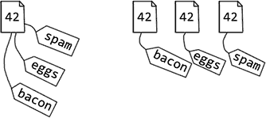
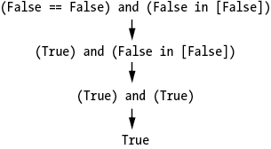

# 9 个深奥的 Python 怪事

> 原文：<http://inventwithpython.com/beyond/chapter9.html>

定义编程语言的规则系统是复杂的，并且可能导致代码，尽管没有错，但是非常奇怪和不可预料。这一章深入探讨了更难理解的 Python 语言的奇特之处。您不太可能在现实世界的编码中遇到这些情况，但是它们是 Python 语法的有趣用法(或者是滥用，取决于您的观点)。

通过学习本章中的例子，您将对 Python 如何工作有一个更好的了解。让我们找点乐子，探索一些深奥的问题。

## 为什么 256 是 256 而 257 不是 257

`==`操作符比较两个对象是否相等，而`is`操作符比较它们是否相等。尽管整数值`42`和浮点值`42.0`具有相同的值，但它们是保存在计算机内存中不同位置的两个不同的对象。您可以通过使用`id()`功能检查他们不同的 id 来确认这一点:

```py
>>> a = 42
>>> b = 42.0
>>> a == b
True
>>> a is b
False
>>> id(a), id(b)
(140718571382896, 2526629638888)
```

当 Python 创建一个新的整数对象并将其存储在内存中时，该对象的创建只需要很少的时间。作为一个微小的优化，CPython(Python 解释器可从 https://python.org[下载】在每个程序开始时为`-5`到`256`创建整数对象。这些整数被称为*预分配整数*，CPython 自动为它们创建对象，因为它们相当常见:程序更可能使用整数`0`或`2`，而不是`1729`。当在内存中创建一个新的整数对象时，CPython 首先检查它是否在`-5`和`256`之间。如果是这样，CPython 通过简单地返回现有的 integer 对象而不是创建一个新的来节省时间。这种行为也通过不存储重复的小整数来节省内存，如图 9-1](https://python.org) 所示。



图 9-1: Python 通过对单个整数对象(左)使用多个引用来节省内存，而不是对每个引用使用单独的、重复的整数对象(右)。

由于这种优化，某些人为的情况会产生奇怪的结果。要查看示例，请在交互式 shell 中输入以下内容:

```py
>>> a = 256
>>> b = 256
>>> a is b # 1
True
>>> c = 257
>>> d = 257
>>> c is d # 2
False
```

所有 256 个对象实际上都是同一个对象，所以`a`和`b`的`is`运算符返回`True` 1 。但是 Python 为`c`和`d`分别创建了 257 个对象，这就是为什么`is`操作符返回`False` 2 。

表达式`257 is 257`的计算结果为`True`，但是 CPython 在同一个语句中重用为相同文字创建的 integer 对象:

```py
>>> 257 is 257
True
```

当然，现实世界的程序通常只使用一个整数的值，而不是它的单位。他们永远不会使用`is`操作符来比较整数、浮点数、字符串、布尔值或其他简单数据类型的值。一个例外是当你使用`is None`而不是`== None`时，正如第 96 页“使用`is None`而不是`==`进行比较”中所解释的。否则，你很少会碰到这个问题。

## 字符串实习

类似地，Python 重用对象在代码中表示相同的字符串文字，而不是制作相同字符串的单独副本。要在实践中看到这一点，请在交互式 shell 中输入以下内容:

```py
>>> spam = 'cat'
>>> eggs = 'cat'
>>> spam is eggs
True
>>> id(spam), id(eggs)
(1285806577904, 1285806577904)
```

Python 注意到分配给`eggs`的`'cat'`字符串和分配给`spam`的`'cat'`字符串相同；因此，它没有创建第二个冗余的字符串对象，而是给`eggs`分配了一个引用，指向`spam`使用的同一个字符串对象。这解释了为什么它们的字符串的 id 是相同的。

这种优化被称为*字符串预留*，和预分配整数一样，它只不过是 CPython 实现的一个细节。你不应该写依赖它的代码。此外，这种优化不会捕获所有可能的相同字符串。试图识别可以使用优化的每个实例通常会花费比优化节省的时间更多的时间。例如，尝试在交互 shell 中从`'c'`和`'at'`创建`'cat'`字符串；您会注意到 CPython 创建最终的`'cat'`字符串作为新的字符串对象，而不是重用为`spam`创建的字符串对象:

```py
>>> bacon = 'c'
>>> bacon += 'at'
>>> spam is bacon
False
>>> id(spam), id(bacon)
(1285806577904, 1285808207384)
```

字符串实习是解释器和编译器用于许多不同语言的一种优化技术。你可以在 https://en.wikipedia.org/wiki/String_interning 找到更多的细节。

## Python 的伪增量和减量操作符

在 Python 中，您可以使用增加的赋值操作符将变量的值增加`1`或减少`1`。代码`spam += 1`和`spam -= 1`分别将`spam`中的数值增加和减少`1`。

其他语言，比如 C++和 JavaScript，有用于递增和递减的`++`和`--`操作符。(“C++”这个名字本身就体现了这一点；这是一个半开玩笑的玩笑，表明它是 C 语言的增强形式。)C++和 JavaScript 中的代码可以有类似于`++spam`或`spam++`的操作。Python 明智地没有包括这些操作符，因为它们容易受到细微错误的影响(正如在 https://softwareengineering.stackexchange.com/q/59880[的](https://softwareengineering.stackexchange.com/q/59880)会议上所讨论的)。

但是拥有以下 Python 代码是完全合法的:

```py
>>> spam = --spam
>>> spam
42
```

您应该注意的第一个细节是，Python 中的`++`和`--`“操作符”实际上并不递增或递减`spam`中的值。相反，主要的`-`是 Python 的一元否定操作符。它允许您编写这样的代码:

```py
>>> spam = 42
>>> -spam
-42
```

在一个值前面有多个一元负运算符是合法的。使用它们中的两个会得到值的负值，对于整数值，它只计算原始值:

```py
>>> spam = 42
>>> -(-spam)
42
```

这是一个非常愚蠢的操作，您可能永远不会看到一元求反操作符在真实世界的代码中使用两次。(但如果你这样做了，那很可能是因为程序员学会了用另一种语言编程，并且刚刚编写了错误的 Python 代码！)

还有一个`+`一元运算符。它将整数值计算为与原始值相同的符号，也就是说，它完全不做任何事情:

```py
>>> spam = 42
>>> +spam
42
>>> spam = -42
>>> +spam
-42
```

写`+42`(或者`++42`)看起来和`--42`一样傻，那为什么 Python 还要有这个一元运算符呢？如果您需要为自己的类重载这些操作符，它的存在只是为了补充`-`操作符。(这是很多你可能不熟悉的术语！你会在第 17 章的里学到更多关于操作符重载的知识。)

`+`和`-`一元运算符只在 Python 值的前面有效，在它后面无效。尽管`spam++`和`spam--`可能是 C++或 JavaScript 中的合法代码，但它们会在 Python 中产生语法错误:

```py
>>> spam++
  File "<stdin>", line 1
    spam++
         ^
SyntaxError: invalid syntax
```

Python 没有递增和递减运算符。语言语法的一个怪癖只是让它看起来是这样。

## 全部或者没有

`all()`内置函数接受一个序列值，比如一个列表，如果该序列中的所有值都是“真”，则返回`True`如果一个或多个值为“假”，它将返回`False`你可以认为函数调用`all([False, True, True])`等同于表达式`False and True and True`。

您可以将`all()`与 list comprehensions 结合使用，首先基于另一个列表创建一个布尔值列表，然后评估它们的集合值。例如，在交互式 shell 中输入以下内容:

```py
>>> spam = [67, 39, 20, 55, 13, 45, 44]
>>> [i > 42 for i in spam]
[True, False, False, True, False, True, True]
>>> all([i > 42 for i in spam])
False
>>> eggs = [43, 44, 45, 46]
>>> all([i > 42 for i in eggs])
True
```

如果`spam`或`eggs`中的所有数字都大于 42，则`all()`实用程序返回`True`。

但是如果你传递一个空序列给`all()`，它总是返回`True`。在交互式 shell 中输入以下内容:

```py
>>> all([])
True
```

最好将`all([])`理解为评估“列表中的所有项目都是真实的”而不是“列表中的所有项目都是真实的”否则，您可能会得到一些奇怪的结果。例如，在交互式 shell 中输入以下内容:

```py
>>> spam = []
>>> all([i > 42 for i in spam])
True
>>> all([i < 42 for i in spam])
True
>>> all([i == 42 for i in spam])
True
```

这段代码似乎表明，不仅`spam`(一个空列表)中的所有值都大于`42`，而且它们也小于`42`，正好等于`42`！这在逻辑上似乎是不可能的。但是请记住，这三个列表理解中的每一个都计算为空列表，这就是为什么它们中的项目都不为假，并且`all()`函数返回`True`。

## 布尔值是整数值

就像 Python 认为浮点值`42.0`等于整数值`42`一样，它认为布尔值`True`和`False`分别等价于`1`和`0`。在 Python 中，`bool`数据类型是`int`数据类型的子类。(我们将在第 16 章中讨论类和子类。)您可以使用`int()`将布尔值转换为整数:

```py
>>> int(False) 
0
>>> int(True) 
1
>>> True == 1 
True
>>> False == 0
True
```

您也可以使用`isinstance()`来确认一个布尔值被认为是一种整数:

```py
>>> isinstance(True, bool) 
True
>>> isinstance(True, int) 
True
```

值`True`属于`bool`数据类型。但是因为`bool`是`int`的子类，`True`也是`int`。这意味着你可以在任何可以使用整数的地方使用`True`和`False`。这可能会导致一些奇怪的代码:

```py
>>> True + False + True + True  # Same as 1 + 0 + 1 + 1
3
>>> -True            # Same as -1.
-1
>>> 42 * True        # Same as 42 * 1 mathematical multiplication.
42
>>> 'hello' * False  # Same as 'hello' * 0 string replication.
' '
>>> 'hello'[False]   # Same as 'hello'[0]
'h'
>>> 'hello'[True]    # Same as 'hello'[1]
'e'
>>> 'hello'[-True]   # Same as 'hello'[-1]
'o'
```

当然，你可以使用`bool`值作为数字并不意味着你应该这样做。前面的例子都是不可读的，不应该在现实世界的代码中使用。本来 Python 没有`bool`数据类型。直到 Python 2.3 才添加了布尔值，此时它将`bool`变成了`int`的子类以简化实现。你可以在[`www.python.org/dev/peps/pep-0285`](https://www.python.org/dev/peps/pep-0285/)读取 PEP 285 中`bool`数据类型的历史。

顺便说一下，`True`和`False`在 Python 3 中只是关键字。这意味着在 Python 2 中，有可能使用`True`和`False`作为变量名，导致看似矛盾的代码如下:

```py
Python 2.7.14 (v2.7.14:84471935ed, Sep 16 2017, 20:25:58) [MSC v.1500 64 bit (AMD64)] on win32
Type "help", "copyright", "credits" or "license" for more information.
>>> True is False
False
>>> True = False
>>> True is False 
True
```

幸运的是，这种令人困惑的代码在 Python 3 中是不可能的，如果您试图使用关键字`True`或`False`作为变量名，这将引发语法错误。

## 链接多种运算符

在同一个表达式中链接不同种类的运算符可能会产生意想不到的错误。例如，这个例子在一个表达式中使用了`==`和`in`操作符:

```py
>>> False == False in [False]
True
```

这个`True`结果令人惊讶，因为你可能会认为它是:

*   `(False == False) in [False]`，也就是`False`。
*   `False == (False in [False])`，也就是`False`。

但是`False == False in [False]`并不等同于这两个表达式。确切地说，它相当于`(False == False) and (False in [False])`，只是作为`42 < spam < 99`相当于`(42 < spam) and (spam < 99)`。该表达式根据下图进行计算:

`False == False in [False]`表达式是一个有趣的 Python 谜语，但它不太可能出现在任何真实世界的代码中。

## Python 的反重力特性

要启用 Python 的反重力特性，请在交互式 shell 中输入以下内容:

```py
>>> import antigravity
```

这条线是一个有趣的复活节彩蛋，它打开了网页浏览器，进入了一个经典的 XKCD 漫画，讲述了在[`xkcd.com/353`](https://xkcd.com/353/)的 Python 故事。Python 可以打开您的 web 浏览器，这可能会让您感到惊讶，但这是`webbrowser`模块提供的内置特性。Python 的`webbrowser`模块有一个`open()`功能，可以找到你的操作系统的默认网络浏览器，并打开一个特定 URL 的浏览器窗口。在交互式 shell 中输入以下内容:

```py
>>> import webbrowser
>>> webbrowser.open('https://xkcd.com/353/')
```

`webbrowser`模块是有限的，但是它可以帮助用户在互联网上找到更多的信息。

## 摘要

人们很容易忘记，计算机和编程语言是由人类设计的，它们有自己的局限性。如此多的软件建立在语言设计师和硬件工程师的创造之上，并依赖于他们的创造。他们非常努力地工作，以确保如果你的程序有问题，那是因为你的程序有问题，而不是运行它的解释软件或 CPU 硬件有问题。我们最终会认为这些工具是理所当然的。

但这就是为什么学习计算机和软件的奇怪角落和缝隙是有价值的。当您的代码出现错误或崩溃时(或者甚至只是行为怪异，让您觉得“这很奇怪”)，您需要理解调试这些问题的常见陷阱。

你几乎肯定不会碰到本章提到的任何问题，但是意识到这些小细节会让你成为一个有经验的 Python 程序员。