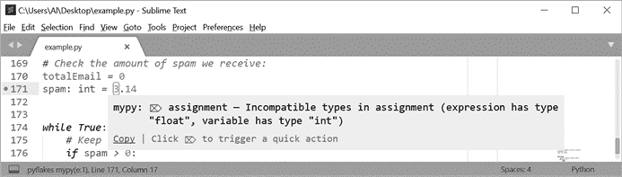

# 十一、注释、文档字符串和类型提示

> 原文：<http://inventwithpython.com/beyond/chapter11.html>


源代码中的注释和文档可能和代码一样重要。原因是软件是永远不会完成的；无论是添加新功能还是修复错误，您总是需要做出改变。但是你不能改变代码，除非你理解它，所以保持它可读是很重要的。正如计算机科学家哈罗德·艾贝尔森、杰拉德·让伊·萨斯曼和朱莉·苏斯曼曾经写道的，“程序必须写给人们阅读，偶尔也要写给机器执行。”

*注释*、*文档字符串*和*类型提示*帮助你保持代码的可读性。注释是简单明了的简短解释，你直接写在源代码中，计算机会忽略它们。注释为那些没有编写代码的人提供了有用的注释、警告和提醒，或者有时甚至为将来代码的程序员提供了帮助。几乎每个程序员都问过自己，“谁写了这些不可读的东西？”却发现答案是，“我做的。”

*文档字符串*是针对函数、方法和模块的特定于 Python 的文档形式。当您以文档字符串格式指定注释时，自动化工具，如文档生成器或 Python 的内置`help()`模块，可以让开发人员轻松找到关于您代码的信息。

*类型提示*是可以添加到 Python 源代码中的指令，用于指定变量、参数和返回值的数据类型。这允许静态代码分析工具验证您的代码不会由于错误键入的值而生成任何异常。类型提示最早出现在 Python 3.5 中，但是因为它们是基于注释的，所以可以在任何 Python 版本中使用它们。

这一章主要关注前面提到的三种在代码中嵌入文档以提高可读性的技术。外部文档，如用户手册、在线教程和参考资料都很重要，但不在本书中介绍。如果您想了解更多关于外部文档的信息，请查看位于[`www.sphinx-doc.org`](https://www.sphinx-doc.org/)的 Sphinx 文档生成器。

## 注释

像大多数编程语言一样，Python 支持单行注释和多行注释。出现在数字符号`#`和行尾之间的任何文本都是单行注释。虽然 Python 没有多行注释的专用语法，但是一个三重引号多行字符串可以作为多行注释的语法。毕竟，字符串值本身不会导致 Python 解释器做任何事情。看看这个例子:

```py
# This is a single-line comment.

"""This is a
multiline string that
also works as a multiline comment. """
```

如果您的注释跨越多行，最好使用单个多行注释，而不是几个连续的单行注释，这样更难阅读，如下所示:

```py
"""This is a good way
to write a comment
that spans multiple lines. """
# This is not a good way
# to write a comment
# that spans multiple lines.
```

注释和文档通常是编程过程中的事后想法，甚至被一些人认为弊大于利。但是正如 83 页的“误解:注释是不必要的”所解释的，如果你想写专业的、可读的代码，注释不是可选的。在这一节中，我们将编写一些有用的注释，在不影响程序可读性的情况下告知读者。

### 注释风格

让我们来看一些遵循良好风格实践的注释:

```py
# Here is a comment about this code: # 1
someCode()

# Here is a lengthier block comment that spans multiple lines using # 2
# several single-line comments in a row.
# # 3
# These are known as block comments.

if someCondition:
# Here is a comment about some other code: # 4
someOtherCode()  # Here is an inline comment. # 5
```

注释通常应该存在于它们自己的行中，而不是在一行代码的末尾。大多数时候，它们应该是具有适当大小写和标点符号的完整句子，而不是短语或单个单词。例外是注释应该遵守与源代码相同的行长度限制。跨多行的注释 2 可以连续使用多个单行注释，称为*块注释*。我们使用空白的单行注释 3 来分隔块注释中的段落。注释应该和它们所注释的代码有相同的缩进层次。一行代码后面的注释称为*行内注释* 5 ，代码和注释之间至少要有两个空格。

单行注释应该在`#`符号后有一个空格:

```py
#Don't write comments immediately after the # sign.
```

注释可以包含指向包含相关信息的 URL 的链接，但链接永远不应该取代注释，因为链接的内容可能随时从互联网上消失:

```py
# Here is a detailed explanation about some aspect of the code
# that is supplemented by a URL. More info at https://example.com
```

上述约定是风格而非内容的问题，但是它们有助于注释的可读性。你的注释可读性越强，程序员就越有可能关注它们，而注释只有在程序员阅读时才有用。

### 行内注释

行内注释出现在一行代码的末尾，如下所示:

```py
 while True:  # Keep asking player until they enter a valid move.
```

行内注释是简短的，所以它们符合程序风格指南设定的行长度限制。这意味着他们很容易因为太短而无法提供足够的信息。如果您决定使用行内注释，请确保该注释只描述它紧接着的代码行。如果你的行内注释需要更多的空间或者描述额外的代码行，把它放在它自己的一行。

行内注释的一个常见且恰当的用法是解释变量的用途或给出它的其他上下文。这些行内注释写在创建变量的赋值语句上:

```py
TOTAL_DISKS = 5  # More disks means a more difficult puzzle.
```

内联注释的另一个常见用途是在创建变量值时添加关于变量值的上下文:

```py
month = 2  # Months range from 0 (Jan) to 11 (Dec).
catWeight = 4.9  # Weight is in kilograms.
website = 'inventwithpython.com'  # Don't include "https://" at front.
```

行内注释不应该指定变量的数据类型，因为从赋值语句中可以明显看出这一点，除非是在类型提示的注释形式中指定，如本章后面的“用注释反向传输类型提示”中所述。

### 解释性注释

一般来说，注释应该解释为什么代码是这样写的，而不是代码做什么或者它是如何做的。即使有第 3 章和第 4 章中提到的适当的代码风格和有用的命名约定，实际的代码也不能解释最初的程序员的意图。如果你写了代码，几个星期后你甚至会忘记它的细节。现在，你应该编写信息丰富的代码注释，以防止未来的你诅咒过去的你。

例如，这里有一个无用的注释，解释了代码在做什么。它没有暗示这一代码的动机，而是陈述了显而易见的事实:

```py
>>> currentWeekWages *= 1.5  # Multiply the current week's wages by 1.5
```

这个注释比没用还不如。从代码中可以明显看出,`currentWeekWages`变量正在乘以`1.5`,因此完全省略注释会简化您的代码。以下是一个更好的注释:

```py
>>> currentWeekWages *= 1.5  # Account for time-and-a-half wage rate.
```

此注释解释了这行代码背后的意图，而不是重复代码是如何工作的。它提供了即使编写良好的代码也无法提供的上下文。

### 总结意图

解释程序员的意图并不是注释有用的唯一方式。总结几行代码的简短注释允许读者浏览源代码并对其功能有一个大致的了解。程序员经常使用空格来分隔代码的“段落”,总结注释通常在这些段落的开头占据一行。与解释单行代码的单行注释不同，汇总注释在更高的抽象层次上描述了代码的作用。

例如，从阅读这四行代码中可以看出，他们将`playerTurn`变量设置为代表对手玩家的值。但是简短的单行注释使读者不必阅读和推理代码来理解这样做的目的:

```py
# Switch turns to other player:
if playerTurn == PLAYER_X:
    playerTurn = PLAYER_O
elif playerTurn == PLAYER_O:
    playerTurn = PLAYER_X
```

在你的程序中散布这些摘要注释会使浏览变得更加容易。然后，程序员可以仔细查看任何感兴趣的特定点。摘要注释还可以防止程序员对代码的功能产生误导。简短、概括的注释可以确认开发人员正确理解了代码是如何工作的。

### “经验教训”注释

当我在一家软件公司工作时，我曾经被要求修改一个图形库，以便它可以处理图表中数百万个数据点的实时更新。我们使用的库可以实时更新图表*或*支持有数百万个数据点的图表，但不能两者都用。我以为我能在几天内完成这项任务。到了第三周，我还是坚信自己可以在几天内完成。每天，解决方案似乎就在眼前，在第五周，我有了一个工作原型。

在整个过程中，我了解了很多关于图形库如何工作的细节，以及它的能力和局限性。然后，我花了几个小时将这些细节写成一页长的注释，放在源代码中。我知道，以后任何需要修改我的代码的人都会遇到和我一样的看似简单的问题，而我写的文档会帮他们节省几周的时间。

这些*经验教训*注释，我称之为注释，可能会跨越几个段落，使得它们在源代码文件中显得格格不入。但是它们包含的信息对于任何需要维护这些代码的人来说都是黄金。不要害怕在源代码文件中写冗长、详细的注释来解释某些东西是如何工作的。对于其他程序员来说，这些细节中的许多都是未知的、被误解的或容易被忽略的。不需要它们的软件开发人员可以很容易地跳过它们，但是需要它们的开发人员会很感激它们。请记住，与其他注释一样，经验教训注释不同于模块或函数文档(由文档字符串处理)。它也不是针对软件用户的教程或操作指南。相反，经验教训注释是为阅读源代码的开发人员准备的。

因为我的经验教训注释涉及到一个开源图形库，可能对其他人有用，所以我花了一点时间把它作为一个答案发布到公共问答网站[`stackoverflow.org`](https://stackoverflow.org)上，在那里其他处于类似情况的人可以找到它。

### 法律意图

出于法律原因，一些软件公司或开源项目有一个策略，即在每个源代码文件顶部的注释中包含版权、软件许可证和作者信息。这些注释应该最多包含几行，如下所示:

```py
"""Cat Herder 3.0 Copyright (C) 2021 Al Sweigart. All rights reserved.
See license.txt for the full text."""
```

如果可能，请参考包含许可证全文的外部文档或网站，而不是在每个源代码文件的顶部包含整个冗长的许可证。每当你打开一个源代码文件时，不得不滚动几个屏幕长度的文本是很累的，包括完整的许可证并不能提供额外的法律保护。

### 专业注释

在我的第一份软件工作中，一位我非常尊敬的资深同事把我拉到一边，解释说因为我们有时会向客户发布产品的源代码，所以注释保持专业的语气是很重要的。显然，我在其中一个注释中写了“WTF”，这是代码中特别令人沮丧的部分。我觉得很尴尬，马上道歉，编辑了注释。从那时起，我就一直保持我的代码，即使是个人项目，在一定程度上也是专业的。

你可能想在你的程序的注释中加入轻浮或者发泄你的沮丧，但是要养成避免这样做的习惯。你不知道以后谁会看你的代码，很容易曲解一段文字的语气。正如第 64 页“避免笑话、双关语和文化参考”中所解释的，最好的策略是用礼貌、直接和不幽默的语气写注释。

### 代码标签和待办事项注释

程序员有时会留下简短的注释来提醒自己还有工作要做。这通常采用*代码标签*的形式:一个全大写标签的注释，比如`TODO`，后面跟着一个简短的描述。理想情况下，您应该使用项目管理工具来跟踪这类问题，而不是将它们深埋在源代码中。但是对于不使用这些工具的小型个人项目，偶尔的`TODO`注释可以作为一个有用的提醒。这里有一个例子:

```py
_chargeIonFluxStream()  # TODO: Investigate why this fails every Tuesday.
```

您可以为这些提醒使用几种不同的代码标签:

1.  介绍需要完成的工作的一般提示
2.  `FIXME`提醒这部分代码并不完全有效
3.  介绍了一个提醒，这部分代码可以工作，也许很勉强，但是代码应该被改进
4.  引入一般警告，通常非常严重

你应该在这些总是大写的标签后面加上手头任务或问题的更具体的描述。稍后，您可以在源代码中搜索标签，以找到需要修复的代码。缺点是你很容易忘记这些提醒，除非你碰巧正在阅读它们所在的代码部分。代码标签不应该取代正式的问题追踪器或错误报告工具。如果你在你的代码中使用代码标签，我建议保持简单:只使用`TODO`，放弃其他的。

### 魔术注释和源文件编码

你可能看过`.py` 源文件，顶部有如下几行:

```py
#!/usr/bin/env python3 # 1
# -*- coding: utf-8 -*- # 2
```

这些*魔术注释*，总是出现在文件的顶部，提供解释器或编码信息。Shebang 行 1 (在第 2 章中介绍)告诉你的操作系统使用哪个解释器来运行文件中的指令。

第二个魔术注释是一个*编码定义*行 2 。在这种情况下，这一行将 UTF-8 定义为用于源文件的 Unicode 编码方案。您几乎不需要包含这一行，因为大多数编辑器和 ide 已经以 UTF-8 编码保存了源代码文件，并且从 Python 3.0 开始的 Python 版本默认将 UTF-8 作为定义的编码。UTF 8 编码的文件可以包含任何字符，所以你的`.py` 源文件无论包含英文、中文还是阿拉伯字母都可以。关于 Unicode 和字符串编码的介绍，我强烈推荐 Ned Batchelder 在`nedbatchelder.com/text/unipain.html`的博客文章“实用 Unicode”。

## 文档字符串

文档字符串是多行注释，出现在模块的`py`源代码文件顶部，或直接跟随`class`或`def`语句。它们提供了关于正在定义的模块、类、函数或方法的文档。自动化文档生成器工具使用这些文档字符串来生成外部文档文件，例如帮助文件或网页。

文档字符串必须使用三重引号的多行注释，而不是以哈希符号`#`开头的单行注释。文档字符串应该总是使用三个双引号而不是三个单引号。例如，下面是常见的`requests`模块中的`sessions.py`文件的摘录:

```py
# -*- coding: utf-8 -*- # 1

""" # 2
requests.session
~~~~~~~~~~~~~~~~

This module provides a Session object to manage and persist settings across
requests (cookies, auth, proxies).
"""
import os
import sys
*--snip—*
class Session(SessionRedirectMixin):
   3 """A Requests session.

    Provides cookie persistence, connection-pooling, and configuration.

    Basic Usage::

      >>> import requests
      >>> s = requests.Session()
      >>> s.get('https://httpbin.org/get')
      <Response [200]>
--snip--

    def get(self, url, **kwargs):
       4 r"""Sends a GET request. Returns :class:`Response` object.

        :param url: URL for the new :class:`Request` object.
        :param \*\*kwargs: Optional arguments that ``request`` takes.
        :rtype: requests.Response
 """
`--snip--`
```

`sessions.py`文件的`request`包含模块 2 、`Session`类 3 和`Session`类的`get()`方法 4 的文档字符串。请注意，尽管模块的文档字符串必须是模块中出现的第一个字符串，但它应该出现在任何魔术注释之后，例如 Shebang 行或编码定义 1 。

稍后，您可以通过检查相应对象的`__doc__`属性来检索模块、类、函数或方法的文档字符串。例如，在这里我们检查文档字符串，以找到更多关于`sessions`模块、`Session`类和`get()`方法的信息:

```py
>>> from requests import sessions
>>> sessions.__doc__
'\nrequests.session\n~~~~~~~~~~~~~~~~\n\nThis module provides a Session object to manage and persist settings across\nrequests (cookies, auth, proxies).\n'
>>> sessions.Session.__doc__
"A Requests session.\n\n    Provides cookie persistence, connection-pooling, and configuration.\n\n    Basic Usage::\n\n      >>> import requests\n
`--snip--`
>>> sessions.Session.get.__doc__
'Sends a GET request. Returns :class:`Response` object.\n\n        :param url: URL for the new :class:`Request` object.\n        :param \\*\\*kwargs:
`--snip--`
```

自动化文档工具可以利用文档字符串来提供上下文相关的信息。其中一个工具是 Python 的内置`help()`函数，它以比直接传递原始`__doc__`字符串更易读的格式显示您传递的对象的文档字符串。当您在交互式 Shell 中进行试验时，这是非常有用的，因为您可以立即获取您正在尝试使用的任何模块、类或函数的信息:

```py
>>> from requests import sessions
>>> help(sessions)
Help on module requests.sessions in requests:

NAME
    requests.sessions

DESCRIPTION
    requests.session
    ~~~~~~~~~~~~~~~~

    This module provides a Session object to manage and persist settings
-- More  -- 
```

如果文档字符串太大而无法在屏幕上显示，Python 会在窗口底部显示`-- More --`。可以按回车滚动到下一行，按空格键滚动到下一页，或者按`Q`退出查看文档字符串。

一般来说，文档字符串应该包含一行概述模块、类或函数的内容，后面是一个空行和更详细的信息。对于函数和方法，这可以包括关于它们的参数、返回值和副作用的信息。我们为其他程序员而不是软件用户编写文档字符串，所以它们应该包含技术信息，而不是教程。

文档字符串提供了第二个关键好处，因为它们将文档集成到了源代码中。当你编写独立于代码的文档时，你可能会完全忘记它。相反，当您将文档字符串放在模块、类和函数的顶部时，信息仍然易于查看和更新。

如果您仍然在编写它要描述的代码，您可能并不总是能够立即编写文档字符串。在这种情况下，在文档字符串中包含一个`TODO`注释，作为填写其余细节的提示。例如，下面这个虚构的`reverseCatPolarity()`函数有一个糟糕的文档字符串，它陈述了显而易见的事实:

```py
def reverseCatPolarity(catId, catQuantumPhase, catVoltage):
    """Reverses the polarity of a cat.

    TODO Finish this docstring."""
`--snip--`
```

因为每个类、函数和方法都应该有一个文档字符串，所以您可能想只写最少量的文档，然后继续前进。如果没有`TODO`注释，很容易忘记这个文档字符串最终需要重写。

PEP 257 包含关于文档串的更多文档，请见在`www.python.org/dev/peps/pep-0257`。

## 类型提示

许多编程语言都有*静态类型*，这意味着程序员必须在源代码中声明所有变量、参数和返回值的数据类型。这允许解释器或编译器在程序运行前检查代码是否正确使用了所有对象。Python 有*动态类型*:变量、参数、返回值可以是任何数据类型，甚至可以在程序运行时改变数据类型。动态语言通常更容易编程，因为它们需要更少的正式规范，但是它们缺乏静态语言所具有的防止错误的优势。如果你写了一行 Python 代码，比如`round('forty two')`，你可能没有意识到你正在把一个字符串传递给一个只接受`int`或`float`参数的函数，直到你运行代码并导致一个错误。当您赋值或传递错误类型的参数时，静态类型语言会发出早期警告。

Python 的*类型提示*提供可选的静态类型。在下面的示例中，类型提示以粗体显示:

```py
def describeNumber(number: int) -> str:
    if number % 2 == 1:
        return 'An odd number. '
 elif number == 42:
        return 'The answer. '
    else:
        return 'Yes, that is a number. '

myLuckyNumber: int = 42
print(describeNumber(myLuckyNumber))
```

如您所见，对于参数或变量，类型提示使用冒号将名称与类型分开，而对于返回值，类型提示使用箭头(`->`)将`def`语句的右括号与类型分开。`describeNumber()`函数的类型提示显示，它接受一个整数值作为其`number`参数，并返回一个字符串值。

如果你使用类型提示，你不必把它们应用到程序中的每一个数据。相反，您可以使用*渐进类型化*方法，这是动态类型化的灵活性和静态类型化的安全性之间的一种折衷，在静态类型化中，您只为某些变量、参数和返回值包含类型提示。但是你程序的类型提示越多，静态代码分析工具就有越多的信息来发现你程序中潜在的错误。

注意，在前面的例子中，指定类型的名称与`int()`和`str()`构造函数的名称相匹配。在 Python 中，*类*、*类型*、*数据类型*含义相同。对于从类创建的任何实例，您应该使用类名作为类型:

```py
import datetime
noon: datetime.time = datetime.time(12, 0, 0) # 1

class CatTail:
    def __init__(self, length: int, color: str) -> None:
        self.length = length
        self.color = color

zophieTail: CatTail = CatTail(29, 'grey') # 2
```

`noon`变量有类型提示`datetime.time` 1 ，因为它是一个`time`对象(在`datetime`模块中定义)。同样，`zophieTail`对象有`CatTail`类型提示 2 ，因为它是我们用`class`语句创建的`CatTail`类的对象。类型提示自动应用于指定类型的所有子类。例如，带有类型提示`dict`的变量可以设置为任何字典值，也可以设置为任何`collections.OrderedDict`和`collections.defaultdict`值，因为这些类是`dict`的子类。第 16 章更详细地介绍了子类。

静态类型检查工具不一定需要变量的类型提示。原因是静态类型检查工具做*类型推断*，从变量的第一个赋值语句推断类型。例如，从行`spam = 42`中，类型检查器可以推断垃圾邮件应该具有类型提示`int`。但是我还是建议设置一个类型提示。将来对一个`float`的改变，如在`spam = 42.0`中，也会改变推断的类型，这可能不是你的意图。在改变值时，最好强迫程序员改变类型提示，以确认他们是有意而不是无意地改变了值。

### 使用静态分析器

尽管 Python 支持类型提示的语法，但 Python 解释器完全忽略了它们。如果你运行一个 Python 程序，将一个无效类型的变量传递给一个函数，Python 会表现得好像类型提示不存在一样。换句话说，类型提示不会导致 Python 解释器进行任何运行时类型检查。它们的存在只是为了静态类型检查工具的好处，静态类型检查工具在程序运行前分析代码，而不是在程序运行时分析代码。

我们称这些工具为*静态分析*工具，因为它们在程序运行前分析源代码，而运行时分析或动态分析工具分析运行中的程序。(令人困惑的是，*静态*和*动态*在这里指的是程序是否运行，而*静态类型化*和*动态类型化*指的是我们如何声明变量和函数的数据类型。Python 是一种动态类型的语言，有静态分析工具，比如为它编写的 Mypy。)

#### 安装和运行 Mypy

虽然 Python 没有官方的类型检查工具，但 Mypy 是目前最流行的第三方类型检查工具。您可以通过运行以下命令用`pip`安装 Mypy:

```py
`python –m pip install –user mypy` 
```

在 MacOS 和 Linux 上运行`python3`而不是`python`。其他著名的类型检查器包括微软的 Pyright、脸书的 Pyre 和谷歌的 Pytype。

要运行类型检查器，打开一个命令提示符或终端窗口，运行`python –m mypy`命令(将模块作为应用运行)，向其传递要检查的 Python 代码的文件名。在这个例子中，我正在检查我在名为`example.py`的文件中创建的示例程序的代码:

```py
C:\Users\Al\Desktop>python –m mypy example.py
Incompatible types in assignment (expression has type "float", variable has type "int")
Found 1 error in 1 file (checked 1 source file)
```

如果没有问题，类型检查器不输出任何内容，如果有问题，则输出错误消息。在这个`example.py`文件中，第 171 行有一个问题，因为一个名为`spam`的变量有一个类型提示`int`，但是却被赋予了一个`float`值。这可能会导致失败，应该进行调查。第一次阅读时，有些错误信息可能很难理解。Mypy 可以报告大量可能的错误，这里无法一一列举。找出错误含义的最简单方法是在网上搜索。在这种情况下，您可以搜索类似“赋值中的 Mypy 不兼容类型”的内容

每次修改代码时从命令行运行 Mypy 是相当低效的。为了更好地使用类型检查器，您需要配置您的 IDE 或文本编辑器在后台运行它。这样，编辑器将在您键入代码时不断运行 Mypy，然后在编辑器中显示任何错误。图 11-1 显示了 Sublime Text 文本编辑器中前一个例子的错误。



图 11-1：崇高文本文本编辑器显示来自 Mypy 的错误

根据您使用的 IDE 或文本编辑器，配置 IDE 或文本编辑器以使用 Mypy 的步骤会有所不同。你可以通过搜索“`<your_ide> Mypy configure`”、“`<your_ide> type hints setup`”或者类似的东西在网上找到说明。如果所有这些都失败了，您总是可以从命令提示符或终端窗口运行 Mypy。

#### 让 Mypy 忽略代码

出于某种原因，您可能会编写不希望收到类型提示警告的代码。对于静态分析工具来说，这一行可能看起来使用了不正确的类型，但实际上在程序运行时是没问题的。您可以通过在行尾添加一个`# type: ignore`注释来取消任何类型提示警告。这里有一个例子:

```py
def removeThreesAndFives(number: int) -> int:
    number = str(number)  # type: ignore
    number = number.replace('3', '').replace('5', '')  # type: ignore
    return int(number)
```

为了从传递给`removeThreesAndFives()`的整数中删除所有的`3`和`5`位，我们临时将整数变量设置为一个字符串。这导致类型检查器警告我们函数中的前两行，所以我们在这些行中添加了`# type: ignore`类型提示来抑制类型检查器的警告。

谨慎使用`# type: ignore`。忽略来自类型检查器的警告为 bug 潜入您的代码提供了机会。几乎可以肯定的是，您可以重写代码，这样就不会出现警告。例如，如果我们用`numberAsStr = str(number)`创建一个新变量，或者用代码的单个`return int(str(number.replace('3', '').replace('5', '')))`行替换所有三行，我们可以避免在多个类型中重用`number`变量。我们不想通过将参数的类型提示改为`Union[int, str]`来隐藏警告，因为该参数只允许整数。

### 为多种类型设置类型提示

Python 的变量、参数和返回值可以有多种数据类型。为了适应这种情况，您可以通过从内置的`typing`模块导入`Union`来指定多种类型的类型提示。在`Union`类名后面的方括号中指定一系列类型:

```py
from typing import Union
spam: Union[int, str, float] = 42
spam = 'hello'
spam = 3.14
```

在这个例子中，`Union[int, str, float]`类型提示指定您可以将`spam`设置为整数、字符串或浮点数。注意，最好使用`import`语句的`from typing import `X``形式，而不是`import typing`形式，然后在整个程序中始终使用冗长的`typing.`X``作为类型提示。

在变量或返回值除了具有另一种类型之外还具有`None`值的情况下，您可能会指定多种数据类型。要在类型提示中包含`NoneType`，即`None`值的类型，请将`None`放在方括号内，而不是`NoneType`。(从技术上讲，`NoneType`不是像`int`或`str`那样的内置标识符。)

更好的方法是，不使用`Union[str, None]`，而是从`typing`模块导入`Optional`并使用`Optional[str]`。这种类型提示意味着函数或方法可能返回`None`，而不是预期类型的值。这里有一个例子:

```py
from typing import Optional
lastName: Optional[str] = None
lastName = 'Sweigart'
```

在这个例子中，您可以将`lastName`变量设置为`None`或一个`str`值。但是最好节约使用`Union`和`Optional`。变量和函数允许的类型越少，代码就越简单，简单的代码比复杂的代码更不容易出错。记住 Python 格言中之禅，简单比复杂好。对于返回`None`来指示错误的函数，考虑引发一个异常。参见第 178 页的“引发异常与返回错误代码”。

您可以使用`Any`类型提示(也来自`typing`模块)来指定变量、参数或返回值可以是任何数据类型:

```py
from typing import Any
import datetime
spam: Any = 42
spam = datetime.date.today()
spam = True
```

在本例中，`Any`类型提示允许您将`spam`变量设置为任何数据类型的值，例如`int`、`datetime.date`或`bool`。还可以使用`object`作为类型提示，因为这是 Python 中所有数据类型的基类。但是`Any`是比`object`更容易理解的类型提示。

正如你应该用`Union`和`Optional`一样，尽量少用`Any`。如果您将所有的变量、参数和返回值都设置为`Any`类型提示，您将失去静态类型检查的好处。指定`Any`类型提示和不指定类型提示的区别在于`Any`明确声明变量或函数接受任何类型的值，而缺少类型提示表明变量或函数还没有类型提示。

### 为列表、字典等设置类型提示

列表、字典、元组、集合和其他容器数据类型可以保存其他值。如果您指定`list`作为变量的类型提示，该变量必须包含一个列表，但是该列表可以包含任何类型的值。下面的代码不会引起类型检查器的任何抱怨:

```py
spam: list = [42, 'hello', 3.14, True]
```

要明确声明列表中值的数据类型，必须使用`typing`模块的`List`类型提示。请注意，`List`有一个大写的`L`，以区别于`list`数据类型:

```py
from typing import List, Union
catNames: List[str] = ['Zophie', 'Simon', 'Pooka', 'Theodore'] # 1
numbers: List[Union[int, float]] = [42, 3.14, 99.9, 86] # 2
```

在这个例子中，`catNames`变量包含一个字符串列表，所以在从`typing`模块导入`List`之后，我们将类型提示设置为`List[str]` 1 。类型检查器捕捉任何对`append()`或`insert()`方法的调用，或者任何其他将非字符串值放入列表的代码。如果列表应该包含多种类型，我们可以使用`Union`设置类型提示。例如，`numbers`列表可以包含整型和浮点型值，所以我们将其类型提示设置为`List[Union[int, float]]` 2 。

对于每种容器类型，`typing`模块有一个单独的*类型别名*。以下是 Python 中常见容器类型的类型别名列表:

1.  `List`为`list`数据类型。
2.  `Tuple`为`tuple`数据类型。
3.  `Dict`为字典(`dict`)数据类型。
4.  `Set`为`set`数据类型。
5.  `FrozenSet`为`frozenset`数据类型。
6.  `Sequence`代表`list`、`tuple`和任何其他序列数据类型。
7.  `Mapping`用于字典(`dict`)、`set`、`frozenset`以及任何其他映射数据类型。
8.  `ByteString`用于`bytes`、`bytearray`和`memoryview`类型。

你可以在[`docs.python.org/3/library/typing.html#classes-functions-and-decorators`](https://docs.python.org/3/library/typing.html#classes-functions-and-decorators)找到这些类型的完整列表。

### 用注释反向移植类型提示

*反向移植*是从新版本软件中获取特性并*移植*(也就是修改并添加)到早期版本的过程。Python 的类型提示功能是 3.5 版的新增功能。但是在可能由 3.5 之前的解释器版本运行的 Python 代码中，您仍然可以通过将类型信息放在注释中来使用类型提示。对于变量，在赋值语句后使用行内注释。对于函数和方法，在`def`语句后的一行写类型提示。以`type:`开始注释，后面是数据类型。下面是一些注释中带有类型提示的代码示例:

```py
from typing import List # 1

spam = 42  # type: int # 2
def sayHello():
   3 # type: () -> None
    """The docstring comes after the type hint comment."""
    print('Hello!')

def addTwoNumbers(listOfNumbers, doubleTheSum):
   4 # type: (List[float], bool) -> float
    total = listOfNumbers[0] + listOfNumbers[1]
    if doubleTheSum:
        total *= 2
    return total
```

注意，即使您使用的是注释类型提示样式，您仍然需要导入`typing`模块 1 ，以及您在注释中使用的任何类型别名。早于 3.5 的版本在其标准库中没有`typing`模块，因此您必须通过运行以下命令单独安装`typing`:

```py
`python –m pip install --user typing` 
```

在 MacOS 和 Linux 上运行`python3`而不是`python`。

为了将`spam`变量设置为整数，我们添加`# type: int`作为行尾注释 2 。对于函数，注释应该包括括号，括号中有逗号分隔的类型提示列表，其顺序与参数的顺序相同。没有参数的函数会有一组空括号 3 。如果有多个参数，用逗号 4 将它们分隔在括号内。

注释类型提示样式比普通样式可读性差一些，所以只对可能由 3.5 之前的版本运行的代码使用它。

## 总结

程序员经常忘记记录他们的代码。但是花一点时间在代码中添加注释、文档字符串和类型提示，可以避免以后浪费时间。文档良好的代码也更容易维护。

人们很容易接受这样的观点，即在编写软件时，注释和文档并不重要，甚至是一个缺点。(方便的是，这个视图允许程序员避免编写文档的工作。)不要上当；与编写文档相比，编写良好的文档可以为您节省更多的时间和精力。对于程序员来说，盯着屏幕上难以理解的、没有注释的代码比拥有太多有用信息更常见。

好的注释为需要在以后阅读代码并理解其功能的程序员提供了简洁、有用和准确的信息。这些注释应该解释最初的程序员的意图，总结代码的小部分，而不是陈述一行代码做了什么。注释有时会提供程序员在编写代码时学到的经验的详细描述。这些有价值的信息可能会使未来的维护者不必费力地重新学习这些经验。

文档字符串是一种 Python 特有的注释，是紧跟在`class`或`def`语句之后或模块顶部出现的多行字符串。文档工具，比如 Python 内置的`help()`函数，可以提取文档字符串来提供关于类、函数或模块用途的特定信息。

Python 3.5 中引入的类型提示为 Python 代码带来了渐进的类型化。渐进类型允许程序员在保持动态类型灵活性的同时，应用静态类型的缺陷检测优势。Python 解释器忽略类型提示，因为 Python 没有运行时类型检查。即便如此，静态类型检查工具在源代码不运行时使用类型提示来分析源代码。类型检查器，比如 Mypy，可以确保您不会将无效值赋给传递给函数的变量。通过防止一大类错误，这可以节省您的时间和精力。