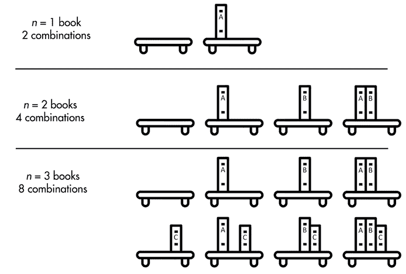
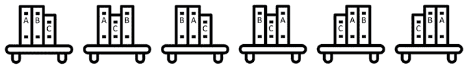
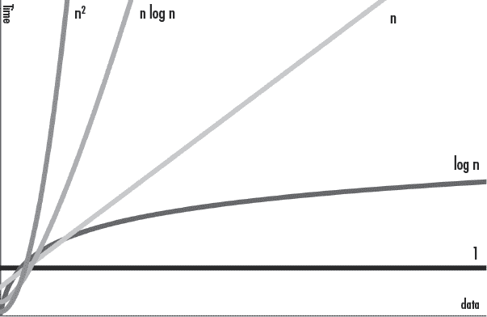

# 13 测量性能和大 O 算法分析

> 原文：<http://inventwithpython.com/beyond/chapter13.html>

对于大多数小程序来说，性能并不那么重要。我们可能会花一个小时编写一个脚本来自动执行一个只需要几秒钟就能运行的任务。即使需要更长的时间，当我们端着一杯咖啡回到办公桌时，这个项目也可能已经完成了。

有时候花时间学习如何更快地制作脚本是明智的。但是在我们知道如何测量程序速度之前，我们无法知道我们的改变是否提高了程序的速度。这就是 Python 的`timeit`和`cProfile`模块的用武之地。这些模块不仅测量代码运行的速度，还创建了一个*档案*，显示代码的哪些部分已经很快了，哪些部分我们还可以改进。

除了测量程序速度之外，在这一章中，你还将学习如何随着程序数据的增长来测量运行时的理论增长。在计算机科学中，我们称之为*大 O 符号*。没有传统计算机科学背景的软件开发人员有时可能会觉得他们的知识有差距。但是，尽管计算机科学教育令人满意，但它并不总是与软件开发直接相关。我开玩笑说(但只有一半是这样)，大 O 符号占了我学位有用性的 80%。本章介绍了这一实用主题。

## `timeit`模块

“过早优化是万恶之源”是软件开发中的一句俗语。(这通常被认为是计算机科学家唐纳德·克努特说的，他认为是计算机科学家东尼·霍尔说的。反过来，东尼·霍尔将其归功于唐纳德·克努特。)*过早优化*，或者说在不知道需要优化什么之前就进行优化，经常会在程序员试图使用巧妙的技巧来节省内存或者编写更快的代码时表现出来。例如，其中一个技巧是使用*异或算法*交换两个整数值，而不使用第三个临时变量:

```py
>>> a, b = 42, 101  # Set up the two variables.
>>> print(a, b)
42 101
>>> # A series of ^ XOR operations will end up swapping their values:
>>> a = a ^ b
>>> b = a ^ b
>>> a = a ^ b
>>> print(a, b)  # The values are now swapped.
101 42
```

除非你不熟悉异或算法(使用`^`位运算符)，否则这段代码看起来很神秘。使用聪明的编程技巧的问题是它们会产生复杂的、不可读的代码。回想一下，Python 信条中的一个禅是*可读性很重要*。

更糟糕的是，你聪明的把戏可能不那么聪明。你不能只是假设一个狡猾的诡计会更快，或者它所取代的旧代码一开始就很慢。找出答案的唯一方法是测量和比较*运行时间*:运行一个程序或一段代码所花费的时间。请记住，增加运行时间意味着程序变慢:程序花更多的时间做同样多的工作。(我们有时也用术语*运行时*来指程序运行的时间。*这个错误发生在运行时*意味着错误发生在程序运行时，而不是在程序被编译成字节码时。)

Python 标准库的`timeit`模块可以通过运行数千次或数百万次来测量一小段代码的运行速度，让您确定平均运行时间。`timeit`模块还会暂时禁用自动垃圾收集器，以确保运行时更加一致。如果要测试多行代码，可以传递多行代码字符串或使用分号分隔代码行:

```py
>>> import timeit
>>> timeit.timeit('a, b = 42, 101; a = a ^ b; b = a ^ b; a = a ^ b')
0.1307766629999998
>>> timeit.timeit("""a, b = 42, 101
... a = a ^ b
... b = a ^ b
... a = a ^ b""")
0.13515726800000039
```

在我的电脑上，异或算法运行这段代码大约需要十分之一秒。这快吗？让我们将其与使用第三个临时变量的整数交换代码进行比较:

```py
>>> import timeit
>>> timeit.timeit('a, b = 42, 101; temp = a; a = b; b = temp')
0.027540389999998638
```

这是一个惊喜！使用第三个临时变量不仅可读性更好，而且速度也快了一倍！聪明的 XOR 技巧可能会节省几个字节的内存，但代价是速度和代码可读性。牺牲代码可读性来减少几个字节的内存使用或几纳秒的运行时间是不值得的。

更好的是，你可以使用*多重赋值技巧*交换两个变量，也称为*可迭代解包*，它也运行在一小段时间内:

```py
>>> timeit.timeit('a, b = 42, 101; a, b = b, a')
0.024489236000007963
```

这不仅是可读性最好的代码，也是最快的。我们知道这一点不是因为我们假设了它，而是因为我们客观地测量了它。

`timeit.timeit()`函数也可以接受设置代码的第二个字符串参数。在运行第一个字符串的代码之前，设置代码只运行一次。您还可以通过为关键字参数`number`传递一个整数来更改默认的试验次数。例如，下面的测试测量了 Python 的`random`模块可以多快地生成 10,000,000 个从 1 到 100 的随机数。(在我的机器上，大概需要 10 秒。)

```py
>>> timeit.timeit('random.randint(1, 100)', 'import random', number=10000000)
10.020913950999784
```

默认情况下，传递给`timeit.timeit()`的字符串中的代码将无法访问程序其余部分中的变量和函数:

```py
>>> import timeit
>>> spam = 'hello' `# We define the spam variable.`
>>> timeit.timeit('print(spam)', number=1) ` # We measure printing spam.`
Traceback (most recent call last):
  File "<stdin>", line 1, in <module>
  File "C:\Users\Al\AppData\Local\Programs\Python\Python37\lib\timeit.py", line 232, in timeit
    return Timer(stmt, setup, timer, globals).timeit(number)
  File "C:\Users\Al\AppData\Local\Programs\Python\Python37\lib\timeit.py", line 176, in timeit
    timing = self.inner(it, self.timer)
  File "<timeit-src>", line 6, in inner
NameError: name 'spam' is not defined
```

要解决这个问题，请将关键字参数`globals`的返回值`globals()`传递给函数:

```py
>>> timeit.timeit('print(spam)', number=1, globals=globals())
hello
0.000994909999462834
```

编写代码的一个好规则是首先让它工作，然后让它更快。只有当你有了一个工作程序，你才应该专注于让它更有效率。

## 概要分析器

尽管`timeit`模块对于测量小代码片段很有用，但是`cProfile`模块对于分析整个函数或程序更有效。*性能分析*系统地分析你的程序的速度、内存使用和其他方面。`cProfile`模块是 Python 的*性能分析器*，或者可以测量程序运行时以及为程序的单个函数调用建立运行时配置文件的软件。这些信息为您的代码提供了更细粒度的度量。

要使用`cProfile`分析器，将您想要测量的代码字符串传递给`cProfile.run()`。让我们看看`cProfiler`是如何测量和报告一个短函数的执行的，这个函数将从 1 到 1,000,000 的所有数字相加:

```py
import time, cProfile
def addUpNumbers():
    total = 0
    for i in range(1, 1000001):
        total += i

cProfile.run('addUpNumbers()')
```

当您运行该程序时，输出将类似于以下内容:

```py
 4 function calls in 0.064 seconds

   Ordered by: standard name

   ncalls  tottime  percall  cumtime  percall filename:lineno(function)
        1    0.000    0.000    0.064    0.064 <string>:1(<module>)
        1    0.064    0.064    0.064    0.064 test1.py:2(addUpNumbers)
        1    0.000    0.000    0.064    0.064 {built-in method builtins.exec}
        1    0.000    0.000    0.000    0.000 {method 'disable' of '_lsprof.Profiler' objects}
```

每条线代表一个不同的功能和在该功能上花费的时间。`cProfile.run()`输出中的列有:

1.  `ncalls`该函数被调用的次数
2.  `tottime`在该功能中花费的总时间，不包括在子功能中的时间
3.  `percall`总时间除以通话次数
4.  `cumtime`该功能和所有子功能所花费的累计时间
5.  `percall`累计时间除以通话次数
6.  `filename:lineno(function)`该文件的功能是在第几行和第几行

比如从[`ostarch.com/crackingcodes`](https://nostarch.com/crackingcodes/)下载`rsaCipher.py`和`al_sweigart_pubkey.txt`文件。这个 RSA 密码程序是《用 Python 破解密码》中的特色（NoStarch 出版社，2018）。在交互式 shell 中输入以下内容来分析`encryptAndWriteToFile()`函数，因为它对由`'abc' * 100000`表达式创建的 300,000 字符的消息进行加密:

```py
>>> import cProfile, rsaCipher
>>> cProfile.run("rsaCipher.encryptAndWriteToFile('encrypted_file.txt', 'al_sweigart_pubkey.txt', 'abc'*100000)")
         11749 function calls in 28.900 seconds

   Ordered by: standard name

   ncalls  tottime  percall  cumtime  percall filename:lineno(function)
        1    0.001    0.001   28.900   28.900 <string>:1(<module>)
        2    0.000    0.000    0.000    0.000 _bootlocale.py:11(getpreferredencoding)
`--snip--`
        1    0.017    0.017   28.900   28.900 rsaCipher.py:104(encryptAndWriteToFile)
        1    0.248    0.248    0.249    0.249 rsaCipher.py:36(getBlocksFromText)
        1    0.006    0.006   28.873   28.873 rsaCipher.py:70(encryptMessage)
        1    0.000    0.000    0.000    0.000 rsaCipher.py:94(readKeyFile)
`--snip--`
     2347    0.000    0.000    0.000    0.000 {built-in method builtins.len}
     2344    0.000    0.000    0.000    0.000 {built-in method builtins.min}
     2344   28.617    0.012   28.617    0.012 {built-in method builtins.pow}
        2    0.001    0.000    0.001    0.000 {built-in method io.open}
     4688    0.001    0.000    0.001    0.000 {method 'append' of 'list' objects}
`--snip--`
```

可以看到传递给`cProfile.run()`的代码用了 28.9 秒才完成。关注总次数最高的函数；在这种情况下，Python 内置的`pow()`函数占用了 28.617 秒。这几乎是整个代码的运行时间！我们不能改变这段代码(它是 Python 的一部分)，但是也许我们可以改变我们的代码来减少对它的依赖。

在这种情况下这是不可能的，因为`rsaCipher.py`已经相当优化了。即便如此，对这段代码的剖析让我们认识到`pow()`是主要的瓶颈。所以尝试改进，比如说，`readKeyFile()`函数是没有意义的(它运行的时间如此之短，以至于`cProfile`报告它的运行时间为 0)。

这个想法被阿姆达尔定律所捕捉，这是一个计算程序整体速度提升多少的公式。公式是整个任务的加速等于`1/((1–p)+(p/s))`，其中`s`是对一个组件的加速，`p`是该组件在整个程序中所占的部分。因此，如果您将占程序总运行时间 90%的组件的速度提高一倍，您将得到`1/((1–0.9)+(0.9/2))= 1.818`，或者说整个程序的速度提高了 82%。比方说，这比将只占总运行时间 25%的组件的速度提高三倍要好，后者的速度只有`1/((1–0.25)+(0.25/2))= 1.143`，即整体速度提高了 14%。不需要背公式。请记住，将代码的慢速或冗长部分的速度加倍，比将已经快速或简短的部分的速度加倍更有成效。这是一个常识:一栋昂贵的房子的 10%的价格折扣比一双便宜的鞋子的 10%的折扣要好。

## 大 O 算法分析

*大 O* 是算法分析的一种形式，描述代码将如何伸缩。它将代码分类为几个顺序中的一个，一般来说，这些顺序描述了随着必须做的工作量的增加，代码的运行时间会延长多长。Python 开发者 Ned Batchelder 将大 O 描述为对“代码如何随着数据增长而变慢”的分析，[这也是他在 2018 年举行 PyCon 演讲的标题](https://youtu.be/duvZ-2UK0fc/)。

让我们考虑下面的场景。假设你有一定量的工作需要一个小时来完成。如果工作量翻倍，那么需要多长时间？你可能会认为这需要两倍的时间，但实际上，答案取决于所做的工作类型。

如果读一本短书需要一个小时，那么读两本短书就需要或多或少两个小时。但是，如果你能在一小时内按字母顺序排列 500 本书，那么按字母顺序排列 1000 本书很可能要花两个多小时，因为你必须在一大堆书里为每本书找到正确的位置。另一方面，如果你只是检查一个书架是否是空的，那么书架上有 0 本、10 本或 1000 本书都无关紧要。只要看一眼，你马上就会知道答案。无论有多少本书，运行时间大致保持不变。尽管有些人阅读或按字母顺序排列书籍的速度可能会快一些或慢一些，但这些总的趋势是相同的。

算法的大 O 描述了这些趋势。一个算法可以在快速或慢速的计算机上运行，但我们仍然可以使用大 O 来描述一个算法在一般情况下的表现，而不考虑执行该算法的实际硬件。大 O 不使用特定的单位，如秒或 CPU 周期来描述算法的运行时间，因为这些在不同的计算机或编程语言之间会有所不同。

## 大 O 阶数

大 O 符号通常定义以下顺序。从描述随着数据量的增长，变慢最少的代码的*低*阶到描述变慢最多的代码的*高*阶:

1.  `O(1)`，常量时间(最低阶)
2.  `O(log n)`，对数时间
3.  `O(n)`，线性时间
4.  `O(n log n)`，线程对数时间
5.  `O(n²)`，多项式时间
6.  `O(2^n)`，指数时间
7.  `O(n!)`，阶乘时间(最高阶)

请注意，大 O 使用了以下符号:一个大写的 O，后跟一对包含顺序描述的括号。大写 O 代表阶或阶上的。`n`表示代码将处理的输入数据的大小。我们把`O(n)`发音为“n 的大 O”或“大 O n”

使用大 O 符号，你不需要理解像对数或多项式这样的词的精确数学含义。我将在下一节详细描述每一个阶，但这里有一个过于简单的解释:

*   `O(1)`和`O(log n)`算法速度很快。
*   `O(n)`和`O(n log n)`算法还不错。
*   `O(n²)`、`O(2^n)`和`O(n!)`算法慢。

当然，你可以找到反例，但是这些描述通常是好的规则。还有比这里列出的更多的大 O 阶数，但这些是最常见的。让我们看看每个阶描述的任务种类。

### 大 O 阶数的书架隐喻

在下面的大 O 阶数例子中，我将继续使用书架的比喻。`n`指的是书架上的书籍数量，大 O 排序描述了随着书籍数量的增加，各种任务如何花费更长的时间。

#### `O(1)`，常量时间

发现“书架是空的吗？”是一个常量时间操作。书架上有多少本书并不重要；一眼就能看出书架是不是空的。书籍的数量可以变化，但运行时间保持不变，因为只要我们看到书架上的一本书，我们就可以停止寻找。`n`的值与任务的速度无关，这就是为什么`O(1)`中没有`n`的原因。你也可能看到常量时间写成`O(c)`。

#### `O(log n)`，对数时间

*对数*是指数运算的逆:指数`2⁴`或`2 × 2 × 2 × 2`等于 16，而对数`log₂(16)`(读作“以 2 为底的 16 的对数”)等于 4。在编程中，我们经常假设底数 2 是对数底数，这就是为什么我们写`O(log n)`而不是`O(log₂n)`。

> 译者注：其实不同底的对数只差一个常量（`log₂n = log₃n/log₂3`），常量在复杂度中可以省略，这才是真正原因。

在按字母顺序排列的书架上搜索一本书是一个对数时间操作。要找一本书，你可以在书架中间找。如果这是你要找的书，那你就完了。否则，您可以确定您要搜索的书是在中间这本书之前还是之后。通过这样做，你已经有效地将需要搜索的书籍范围缩小了一半。你可以再次重复这个过程，检查你期望找到的那一半中间的书。我们称之为*二分搜索算法*，在本章后面的“大 O 分析示例”中有一个例子。

你可以把一套`n`本书分成两半的次数是`log₂n`。在一个有 16 本书的书架上，最多需要四个步骤才能找到合适的。因为每走一步，你需要搜索的书的数量就会减少一半，所以一个书的数量翻倍的书架只需要多走一步就可以完成搜索。如果按字母顺序排列的书架上有 42 亿本书，仍然只需要 32 步就能找到一本特定的书。

`log n`算法通常包含一个*分治*步骤，它选择一半的`n`输入进行处理，然后从这一半中选择另一半，以此类推。`log n`操作可以很好地伸缩:工作负载`n`可以加倍，但是运行时间只增加一步。

#### O(n)，线性时间

阅读一个书架上所有的书是一个线性的时间操作。如果书的长度大致相同，而你把书架上的书的数量增加一倍，那么读完所有的书大概需要两倍的时间。运行时间与书籍数量`n`成比例增加。

#### `O(n log n)`，线性对数时间

将一组书按字母顺序排序是一个`n log n`次操作。这个顺序是`O(n)`和`O(log n)`相乘的运行时间。你可以把一个`O(n log n)`任务想象成一个必须执行`n`次的`O(log n)`任务。以下是对原因的简单描述。

从一堆要按字母顺序排列的书和一个空书架开始。按照第 232 页“`O(log n)`，对数”中详述的二分搜索算法的步骤，找出书架上某本书的位置。这是一个`O(log n)`运算。用`n`本书按字母顺序排列，每本书用`n`步按字母顺序排列，则用`n × log n`或`n log n`步按字母顺序排列整套书。给定两倍多的书，按字母顺序排列它们需要两倍多一点的时间，所以`n log n`算法的伸缩性相当好。

其实所有高效的通用排序算法都是`O(n log n)`：归并排序、快速排序、堆排序、Tim 排序。(Tim 排序是 Tim Peters 发明的，是 Python 的`sort()`方法使用的算法。)

> 译者注：排序算法理论下界就是`nlogn`，排序`n`个东西至少要比较`nlogn`次。

#### `O(n²)`，多项式时间

检查未分类书架上的重复书籍是一项多项式时间的操作。如果有 100 本书，你可以从第一本书开始，将它与其他 99 本书进行比较，看看它们是否相同。然后你拿起第二本书，检查它是否和其他 99 本书一样。检查一本书的副本是 99 个步骤(我们将把它向上舍入到 100，在这个例子中是我们的`n` )。我们必须这样做 100 次，每本书一次。因此，检查书架上是否有重复书籍的步骤大致为`n × n`，或`n²`。(即使我们足够聪明，不会重复比较，这种对`n²`的近似仍然成立。)

运行时间随着书籍平方的增加而增加。查 100 本书有没有重复，就是`100 × 100`，也就是 10000 步。但是检查两倍的数量，200 本书，就是`200 × 200`，或者 40,000 步:四倍的工作量。

根据我在现实世界中编写代码的经验，我发现大 O 分析最常见的用途是避免在`O(n log n)`或`O(n)`算法存在时意外编写`O(n²)`算法。`O(n²)`阶是指算法速度明显变慢的时候，所以如果你认为你的代码是`O(n²)`或更高的，你应该暂停一下。也许有一种不同的算法可以更快地解决这个问题。在这些情况下，参加数据结构和算法(DSA)课程，无论是在大学还是在网上，都会有所帮助。

我们也叫`O(n²)`*二次时间*。算法可以有`O(n³)`或者*三次时间*，比`O(n²)`慢；`O(n⁴)`，或*四次时间*，比`O(n³)`慢；还有其他多项式时间复杂度。

#### `O(2^n)`，指数时间

给书架上所有可能的书籍组合拍照是一项指数时间运算。可以这样想:书架上的每本书都可以包含在照片中，也可以不包含。图 13-1 显示了`n`为 1、2 或 3 的每种组合。如果`n`为 1，则有两种可能的照片:带书的和不带书的。如果`n`为 2，则有四种可能的照片:两本书都在书架上，两本书都关了，第一本打开第二本关闭，第二本打开第一本关闭。当您添加第三本书时，您必须做的工作量再次增加了一倍:您需要完成包含第三本书的两本书的每个子集(四张照片)以及不包含第三本书的两本书的每个子集(另外四张照片，共`2³`张或八张照片)。每增加一本书，工作量就增加一倍。对于`n`本书，你需要拍的照片数量(也就是你需要做的工作量)是`2³`。

 

图 13-1: 书架上书籍的每种组合，可以放一本、两本或三本书

指数级任务的运行时间增长非常快。六本书需要`2⁵`张或者 32 张照片，但是 32 本书将包括`2³²`张或者超过 42 亿张照片。`O(2^n)`、`O(3^n)`、`O(4^n)`等是不同的阶数但都具有指数级的时间复杂度。

#### `O(n!)`，阶乘时间

按照所有可能的顺序给书架上的书拍照是一种阶乘时间运算。我们称每一种可能的顺序为`n`本书的*排列*。这就产生了`n!`或*`n`的阶乘*，排序。一个数的*阶乘*是该数之前所有正整数的乘积。比如`3!`就是`3 × 2 × 1`，也就是 6。图 13-2 显示了三本书的每一种可能的排列。



图 13-2: 全部`3!`也就是说，书架上三本书的排列

要自己计算，想想你会如何想出`n`本书的每一种排列。第一本书你有`n`种可能的选择；然后第二本书有`n–1`个可能选择(即除了你为第一本书挑选的那本以外的每一本书)；然后第三本有`n-2`个可能选择；诸如此类。用 6 本书，`6!`结果是`6 × 5 × 4 × 3 × 2 × 1`，或 720 张照片。再加一本就是 7 本了！，或者需要 5040 张照片。即使对于小的`n`值，阶乘时间算法也很快变得不可能在合理的时间内完成。如果你有 20 本书，并且可以把它们排列起来，每秒钟拍一张照片，那么完成每一个可能的排列仍然需要比宇宙存在的时间还要长的时间。

一个众所周知的`O(n!)`问题是旅行商人的难题。一名商人必须访问`n`个城市，并想计算他们可能访问它们的所有`n!`个可能顺序。通过这些计算，他们可以确定最短行程的顺序。在一个有许多城市的地区，这项任务证明不可能及时完成。幸运的是，优化的算法可以比`O(n!)`快。

### 大 O 衡量最坏的情况

大 O 专门衡量任何任务的*最坏情况*。例如，在一个杂乱的书架上找到一本特定的书，需要你从一端开始扫描这些书，直到找到为止。你可能会很幸运，你要找的书可能是你第一次检查的书。但你可能会不走运；它可能是你最后一本书，或者根本不在书架上。因此，在最好的情况下，即使你必须搜索数十亿本书也没关系，因为你会立即找到你要找的那本。但是这种乐观对算法分析没有用。大 O 描述了在这种不幸的情况下会发生什么:如果你书架上有`n`本书，你将不得不检查所有`n`本书。在这个例子中，运行时间以与书籍数量相同的速度增长。

一些程序员也使用*大 Omega 符号*，它描述了算法的最佳情况。例如，`ω(n)`算法以最佳线性效率运行。在最坏的情况下，它可能会运行得更慢。一些算法遇到了特别幸运的情况，在这种情况下，不需要做任何工作，例如，当你已经到达目的地时，找到到达目的地的驾驶方向。

*大 Theta 符号*描述了具有相同的最佳和最坏情况顺序的算法。例如，`θ(n)`描述了一种算法，它在最好的情况下具有线性效率，在最坏的情况下具有线性效率，也就是说，它是一种`O(n)`和`ω(n)`的算法。这些符号在软件工程中不像大 O 那样经常使用，但是您仍然应该意识到它们的存在。

当人们指大θ时，谈论“一般情况下的大 O ”,或者当他们指大ω时，谈论“最佳情况下的大 O ”,这并不罕见。这是一种矛盾修饰法；大 O 特指一个算法最坏情况下的运行时间。但是即使他们的措辞在技术上是不正确的，你也能理解他们的意思。

* * *

## 足够多的数学去做大 O

如果你的代数生疏了，这里有足够的数学来做大 O 分析:

1.  **乘法**重复执行加法。`2 × 4 = 8`，就像`2 + 2 + 2 + 2 = 8`一样。有了变量，`n + n + n`就是`3 × n`。
2.  **乘法记数法**经常省略`×`号，所以`2 × n`写成`2n`。有了数字，`2 × 3`就写成`2(3)`或者干脆写成 6。
3.  根据**乘法恒等性**，一个数乘以 1 得到那个数:`5 × 1 = 5`，`42 × 1 = 42`。更一般来说，`n × 1 = n`。
4.  根据**乘法分配性**， `2 × (3 + 4) = (2 × 3) + (2 × 4)`。等式两边都等于 14。更一般来说，`a (b + c ) = ab + AC`。
5.  **幂运算**重复执行乘法。`2⁴ = 16`(读作“2 的 4 次方为 16”)，就像`2 × 2 × 2 × 2 = 16`一样。这里 2 是*底数*，4 是*指数*。有了变量，`n × n × n × n`就是`n⁴`。在 Python 中，我们使用`**`操作符:`2 ** 4`计算为`16`。
6.  **1 次方计算它的底数**，`2¹ = 2`，`9999¹= 9999`。更一般来说，`n¹ = n`。
7.  **0 次方始终计算为 1**，`2⁰ = 1`，`9999⁰ = 1`。更一般的是，`n⁰ = 1`。
8.  **系数**是乘法因子。`3n² + 4n + 5`中，系数为 3、4、5。你可以看到 5 是一个系数，因为 5 可以重写为`5(1)`，然后重写为`5n⁰`。
9.  **对数**是幂的逆。因为`2⁴ = 16`，所以我们知道`log₂(16) = 4`。我们把这个读作“底数为 2 的 16 的对数是 4”在 Python 中，我们使用`math.log()`函数:`math.log(16, 2)`计算为`4.0`。

计算大 O 通常涉及通过组合相似项来简化方程。一个*项*是一些数字和变量相乘在一起的组合:在`3n² + 4n+ 5`中，项是`3n²`，`4n`，和`5`。*相似的项*具有相同的指数的相同变量。在表达式`3n² + 4n + 6n + 5`中，项`4n`和项`6n`是相似项。我们可以简化并重写为`3n² + 10n + 5`。

请记住，因为`n × 1 = n`，所以像`3n² + 5n + 4`这样的表达式可以认为是`3n² + 5n + 4(1)`。该表达式中的术语与大 O 阶数`O(n²)`、`O(n)`和`O(1)`相匹配。这将在我们为大 O 计算降低系数时出现。

当你第一次学习如何计算一段代码的大 O 时，这些数学规则提醒可能会派上用场。但是当你完成本章后面的“分析大 O 一览”时，你可能不再需要它们了。大 O 是一个简单的概念，即使你不严格遵循数学规则，它也会很有用。

* * *

## 确定你的代码的顺序

要确定一段代码的大 O 阶数，我们必须做四项工作:确定`n`是什么，计算代码中的步数，去掉低阶，去掉系数。

举个例子，我们来找下面这个`readingList()`函数的大 O:

```py
def readingList(books):
    print('Here are the books I will read:')
    numberOfBooks = 0
    for book in books:
        print(book)
        numberOfBooks += 1
    print(numberOfBooks, 'books total.')
```

回想一下，`n`代表代码处理的输入数据的大小。在函数中，`n`几乎总是基于一个参数。`readingList()`函数的唯一参数是`books`，所以`books`的大小似乎是`n`的一个很好的候选，因为`books`越大，函数运行的时间就越长。

接下来，我们来数一下这段代码中的步骤。什么算做步骤有些模糊，但是一行代码是一个很好的遵循规则。循环的步骤数等于迭代次数乘以循环中的代码行数。为了理解我的意思，下面是`readingList()`函数中代码的计数:

```py
def readingList(books):
    print('Here are the books I will read:')  # 1 step
    numberOfBooks = 0                         # 1 step
    for book in books:                        # n * steps in the loop
        print(book)                           # 1 step
        numberOfBooks += 1                    # 1 step
    print(numberOfBooks, 'books total.')      # 1 step
```

除了`for`循环，我们将每一行代码视为一个步骤。这一行对`books`中的每一项执行一次，因为`books`的大小是我们的`n`，所以我们说这执行了`n`步。不仅如此，它还将循环中的所有步骤执行了`n`次。因为循环内部有两步，所以总共是`2 × n`步。我们可以这样描述我们的步骤:

```py
def readingList(books):
    print('Here are the books I will read:')  # 1 step
    numberOfBooks = 0                         # 1 step
    for book in books:                        # n * 2 steps
        print(book)                           # (already counted)
        numberOfBooks += 1                    # (already counted)
    print(numberOfBooks, 'books total.')      # 1 step
```

现在我们计算总步数，得到`1 + 1 + (n × 2) + 1`。我们可以更简单地将这个表达式改写为`2n + 3`。

大 O 不打算描述具体细节；这是一个通用指标。因此，我们从计数中删除低位。`2n + 3`中的顺序是线性的(`2n`)和常量(`3`)。如果我们只保留其中最大的阶，我们就剩下`2n`。

接下来，我们从阶中删除系数。在`2n`中，系数为 2。扔掉它后，我们只剩下`n`。这给了我们`readingList()`函数的最后一个大 O：`O(n)`，或者线性时间复杂度。

这个顺序想想应该是有道理的。我们的函数有几个步骤，但是一般来说，如果`books`列表的大小增加十倍，运行时间也会增加十倍。将`books`从 10 本书增加到 100 本书会将算法从`1 + 1 + (2 × 10) + 1 = 23`步移动到`1 + 1 + (2 × 100) + 1 = 203`步。数字 203 大约是 23 的 10 倍，所以运行时间随着`n`的增加而成比例增加。

### 为什么低阶和系数不重要

我们从步数中去掉较低的阶，因为随着`n`的增长，它们变得不那么重要了。如果我们将前面的`readingList()`函数中的`books`列表从 10 增加到 1,000,000,000(100 亿)，步骤数将从 23 增加到 20,000,000，003。有了足够大的`n`，额外的三个步骤就没什么关系了。

当数据量增加时，与较高阶相比，较小阶的大系数不会产生影响。在一定的大小`n`下，较高的阶总是比较低的阶慢。比如说我们有`quadraticExample()`，它是`O(n²)` ，有 3 个`n²`步。我们还有`linearExample()`，它是`O(n)`，有 1000 个`n`步。1000 系数大于 3 系数没关系；随着`n`增加，最终`O(n²)`二次运算将变得比`O(n)`线性运算慢。实际的代码并不重要，但是我们可以把它想成这样:

```py
def quadraticExample(someData):  # n is the size of someData
    for i in someData:           # n steps
        for j in someData:       # n steps
            print('Something')   # 1 step
            print('Something')   # 1 step
            print('Something')   # 1 step

def linearExample(someData):     # n is the size of someData
    for i in someData:           # n steps
        for k in range(1000):    # 1 * 1000 steps
            print('Something')   # (Already counted)
```

与`quadraticExample()`的系数`3`相比，`linearExample()`函数的系数`1000`较大。如果输入`n`的大小为 10，那么`O(n²)`函数只需 300 步就比`O(n)`函数的 10,000 步要快。

但是大 O 符号主要关注的是随着工作负载的增加算法的性能。当`n`达到 334 或更大时，`quadraticExample()`函数将总是比`linearExample()`函数慢，即使`linearExample()`慢 1000000 步，一旦`n`达到 333334，`quadraticExample()`函数仍会变慢。在某些时候，`O(n²)`操作总是比`O(n)`或更低的操作慢。要了解如何操作，请看图 13-3 中的大 O 图。这张图展示了所有主要的大 O 符号顺序。x 轴是`n`，数据的大小，y 轴是执行操作所需的运行时间。`

 `

图 13-3: 大 O 阶数的图形

如您所见，高阶的运行时间比低阶的运行时间增长得更快。尽管较低阶可能具有较大的系数，使它们暂时大于较高阶，但较高阶最终会超过它们。

### 大 O 分析示例

让我们确定一些示例函数的大 O 阶数。在这些例子中，我们将使用一个名为`books`的参数，它是书名字符串的列表。

`countBookPoints()`函数根据图书列表中`books`的数量计算分数。大多数书值一分，某个作者的书值两分:

```py
def countBookPoints(books):
    points = 0          # 1 step
    for book in books:  # n * steps in the loop
        points += 1     # 1 step

    for book in books:                # n * steps in the loop
        if 'by Al Sweigart' in book:  # 1 step
            points += 1               # 1 step
    return points                     # 1 step
```

步数为`1 + (n × 1) + (n × 2) + 1`，相似项组合后为`3n + 2`。一旦我们丢弃了较低的阶数和系数，这就变成了`O(n)`，或者线性复杂度，不管我们是否循环通过`books`一次、两次或者十亿次。

到目前为止，所有使用单个循环的例子都具有线性复杂度，但是请注意这些循环迭代了`n`次。正如您将在下一个示例中看到的，代码中的循环本身并不意味着线性复杂度，尽管迭代数据的循环意味着线性复杂度。

这个`iLoveBooks()`函数打印出`'I LOVE BOOKS!!!'`和`'BOOKS ARE GREAT!!!'`10 次:

```py
def iLoveBooks(books):
    for i in range(10):              # 10 * steps in the loop
        print('I LOVE BOOKS!!!')     # 1 step
        print('BOOKS ARE GREAT!!!')  # 1 step
```

这个函数有一个`for`循环，但是它不在`books`列表上循环，不管`books`的大小是多少，它都执行 20 步。我们可以把它改写成`20(1)`。在去掉系数 20 之后，我们剩下`O(1)`，即恒定时间复杂度。这有道理；无论`books`列表的大小`n`是多少，该函数运行的时间都是一样的。

接下来，我们有一个`cheerForFavoriteBook()`函数，它在`books`列表中搜索最喜欢的书:

```py
def cheerForFavoriteBook(books, favorite):
    for book in books:                            # n * steps in the loop
        print(book)                               # 1 step
        if book == favorite:                      # 1 step
            for i in range(100):                  # 100 * steps in the loop
                print('THIS IS A GREAT BOOK!!!')  # 1 step
```

`for book`循环遍历`books`列表，这需要将`n`步乘以循环内的步数。这个循环包括一个嵌套的`for i`循环，它迭代 100 次。这意味着`for book`循环运行`102 × n`或 102 `n`步。去掉系数后，我们发现`cheerForFavoriteBook()`仍然只是一个`O(n)`线性运算。这个 102 系数看起来很大，可以忽略，但是考虑一下:如果`favorite`从未出现在`books`列表中，这个函数将只运行`n`步。系数的影响可能变化很大，以至于它们没有太大的意义。

接下来，`findDuplicateBooks()`函数对每本书在`books`列表中搜索一次(一个线性操作)(另一个线性操作):

```py
def findDuplicateBooks(books):
    for i in range(books):  # n steps
        for j in range(i + 1, books):          # n steps
            if books[i] == books[j]:           # 1 step
                print('Duplicate:', books[i])  # 1 step
```

`for i`循环遍历整个`books`列表，执行循环中的步骤`n`次。`for j`循环还迭代`books`列表，虽然我们放弃了效率，这也算作线性时间操作。这意味着`for i`循环的一部分执行`n × n`操作——即`n²`。这使得`findDuplicateBooks()`成为`O(n²)`的多项式时间运算。

单独的嵌套循环并不意味着多项式/运算，但是两个循环都迭代`n`次的嵌套循环却意味着多项式运算。这些导致了`n²`个步骤，意味着`O(n²)`个操作。

让我们看一个具有挑战性的例子。前面提到的二分搜索算法通过在一个排序列表(我们称之为`haystack`)的中间搜索一个条目(我们称之为`needle`)来工作。如果我们在那里没有找到`needle`，我们将继续搜索`haystack`的前半部分或后半部分，这取决于我们期望在哪半部分找到`needle`。我们将重复这个过程，搜索越来越小的一半，直到我们找到`needle`或者我们断定它不在`haystack`中。请注意，只有当`haystack`中的项目已排序时，二分搜索才有效。

```py
def binarySearch(needle, haystack):
    if not len(haystack):                        # 1 step
        return None                              # 1 step
    startIndex = 0                               # 1 step
    endIndex = len(haystack) - 1                 # 1 step

    haystack.sort()                              # ??? steps

    while start <= end:  # ??? steps
        midIndex = (startIndex + endIndex) // 2  # 1 step
        if haystack[midIndex] == needle:         # 1 step
            # Found the needle.
            return midIndex                      # 1 step
        elif needle < haystack[midIndex]:        # 1 step
            # Search the previous half.
            endIndex = midIndex - 1              # 1 step
        elif needle > haystack[mid]:             # 1 step
            # Search the latter half.
            startIndex = midIndex + 1            # 1 step
```

`binarySearch()`中有两行不容易数。`haystack.sort()`方法调用的大 O 阶数取决于 Python 的`sort()`方法内部的代码。这段代码不太好找，但是你可以在网上查一下它的大 O 阶数，了解到它是`O(n log n)`。(所有一般的排序函数，充其量都是`O(n log n)`。)我们将在本章后面的“常见函数调用的大 O 阶数”中讨论几种常见 Python 函数和方法的大 O 阶数。

`while`循环不像我们看到的`for`循环那样容易分析。我们必须了解二分搜索算法，以确定这个循环有多少次迭代。在循环之前，`startIndex`和`endIndex`覆盖了`haystack`的整个范围，`midIndex`被设置为该范围的中点。在`while`循环的每次迭代中，会发生两件事情中的一件。如果`haystack[midIndex] == needle`，我们知道已经找到了`needle`，函数返回`haystack`中`needle`的索引。如果`needle < haystack[midIndex]`或`needle > haystack[midIndex]`，通过调整`startIndex`或调整`endIndex`将`startIndex`和`endIndex`覆盖的范围减半。我们可以将任何大小为`n`的列表分成两半的次数是 log <sub class="calibre54">2</sub> ( `n` )。(不幸的是，这只是一个你应该知道的数学事实。)因此，`while`循环的大 O 阶数为 O(log n)。

但是因为`haystack.sort()`行的 O(n log n)阶高于 O(log n)，我们把较低的 O(log n)阶去掉，*整个*`binarySearch()`函数的大 O 阶数就变成了 O(n log n)。如果我们能保证`binarySearch()`永远只会被调用到`haystack`的排序列表，我们可以移除`haystack.sort()`行，使`binarySearch()`成为一个 O(log n)函数。这在技术上提高了函数的效率，但并没有使整个程序更加高效，因为它只是将所需的排序工作转移到了程序的其他部分。大多数二分搜索实现省略了排序步骤，因此二分搜索算法据说具有 O(log n)对数复杂度。

### 常见函数调用的大 O 阶数

你的代码的大 O 分析必须考虑它调用的任何函数的大 O 阶数。如果你写了函数，你可以分析你自己的代码。但是要找到 Python 内置函数和方法的大 O 阶数，您必须查阅如下列表。

此列表包含一些常见的序列类型 Python 操作的大 O 阶数，如字符串、元组和列表:

1.  `s[i] reading and s[i] = value assignment`O①作战。
2.  `s.append(value)  `一种 O(1)运算。
3.  `s.insert(i, value)  `一个 O(n)运算。向序列中插入值(尤其是在前面)需要将索引高于`i`的所有项目在序列中上移一个位置。
4.  `s.remove(value)  `一个 O(n)运算。从序列中移除值(尤其是前面的值)需要将索引高于`I`的所有项目在序列中下移一位。
5.  `s.reverse()  `一种 O(n)运算，因为序列中的每一项都必须重新排列。
6.  `s.sort()  `一个 O(n log n)的运算，因为 Python 的排序算法是 O(n log n)。
7.  `value in s  `一种 O(n)运算，因为每一项都必须检查。
8.  `for value in s:  `一种 O(n)运算。
9.  `len(s)  `一个 O(1)运算，因为 Python 会跟踪一个序列中有多少项，所以在传递给`len()`时不需要重新计数。

此列表包含一些常见 Python 操作的大 O 阶数，用于映射类型，如字典、集合和冷冻集:

1.  `m[key] reading and m[key] = value assignment  `O①作战。
2.  `m.add(value)  `一种 O(1)运算。
3.  `value in m   `对字典的一个 O(1)运算，比对序列使用`in`快得多。
4.  `for key in m:  `一种 O(n)运算。
5.  `len(m)  `一个 O(1)运算，因为 Python 会跟踪一个映射中有多少项，所以传递给`len()`时不需要重新计数。

虽然一个列表通常必须从头到尾搜索它的条目，但是字典使用关键字来计算地址，并且查找关键字值所需的时间保持不变。这种计算叫做哈希算法，地址叫做哈希。哈希超出了本书的范围，但是这也是为什么很多映射操作都是 O(1)常量时间的原因。集合也使用哈希，因为集合本质上是只有关键字而不是关键字-值对的字典。

但是请记住，将列表转换为集合是一个 O(n)操作，因此将列表转换为集合然后访问集合中的项目不会带来任何好处。

### 分析大 O 一目了然

一旦你熟悉了执行大 O 分析，你通常不需要运行每个步骤。过一会儿，你就可以在代码中寻找一些蛛丝马迹来快速确定大 O 阶数。

记住`n`是代码操作的数据大小，这里有一些你可以使用的通用规则:

*   如果代码不访问任何数据，它就是 O(1)。
*   如果代码在数据上循环，它就是 O(n)。
*   如果代码有两个嵌套循环，每个循环都迭代数据，那么它就是 O(n² )。
*   函数调用不能算作一个步骤，而是函数内部代码的所有步骤。参见第 242 页的“常用函数调用的大 O 阶数”。
*   如果代码有一个分而治之的步骤，重复将数据对半分，那么它就是 O(log n)。
*   如果代码有一个分而治之步骤，对数据中的每一项执行一次，那么它就是 O(n log n)。
*   如果代码遍历了`n`数据中每一个可能的值组合，那么它就是 O(2 <sup class="calibre53">n</sup> )，或者其他的指数顺序。
*   如果代码遍历了数据中值的每一种可能的排列(即排序)，它就是 O(n！).
*   如果代码涉及到数据的排序，那么它至少是 O(n log n)。

这些规则是很好的起点。但是它们不能代替真正的大 O 分析。请记住，大 O 阶数并不是对代码是慢、快还是高效的最终判断。考虑下面的`waitAnHour()`函数:

```py
import time
def waitAnHour():
    time.sleep(3600)
```

从技术上讲，`waitAnHour()`函数是 O(1)常量时间。我们认为常量时间代码很快，但是它的运行时间是一个小时！这会使代码效率低下吗？不:很难想象你怎么能编写出一个运行速度超过一小时的`waitAnHour()`函数。

大 O 不能替代对代码的剖析。大 O 符号的意义在于让您了解在输入数据量不断增加的情况下，代码将如何执行。

### n 小的时候大 O 无所谓，n 一般都很小

有了大 O 符号的知识，您可能会渴望分析您编写的每一段代码。在您开始使用这个工具敲打每一个可见的钉子之前，请记住，当有大量数据要处理时，大 O 符号是最有用的。在现实世界中，数据量通常很小。

在这种情况下，想出具有较低大 O 阶数的精细复杂算法可能不值得努力。Go 编程语言设计师 Rob Pike 有五条关于编程的规则，其中一条是:“当‘n’很小时，花哨的算法很慢，而‘n’通常很小。”大多数软件开发人员将不会处理大规模的数据中心或复杂的计算，而是更平凡的程序。在这些情况下，在分析器下运行您的代码将比大 O 分析产生更多关于代码性能的具体信息。

## 摘要

Python 标准库附带了两个用于概要分析的模块:`timeit`和`cProfile`。`timeit.timeit()`函数对于运行小段代码来比较它们之间的速度差异很有用。`cProfile.run()`函数编译关于较大函数的详细报告，并指出任何瓶颈。

重要的是衡量代码的性能，而不是对其进行假设。提高程序速度的巧妙方法实际上可能会减慢程序的速度。或者你可能会花很多时间优化程序中一个无关紧要的方面。阿姆达尔定律从数学上抓住了这一点。该公式描述了一个组件的加速如何影响整个程序的加速。

大 O 是程序员在计算机科学中使用最广泛的实用概念。这需要一点数学知识来理解，但计算代码如何随着数据增长而变慢的基本概念可以描述算法，而不需要大量的数字运算。

大 O 符号有七种常见的顺序:O(1)，或常量时间，描述的代码不会随着数据大小的增加而改变`n`；O(log n)，即对数时间，描述了当`n`数据的大小加倍时，代码增加一个步长；O(n)，或线性时间，描述了与数据增长成比例地变慢的代码；O(n log n)，或 n-log-n time，描述的是比 O(n)慢一点的代码，很多排序算法都是这个顺序。

高阶较慢，因为它们的运行时间比它们输入数据的大小增长得快得多:O(n² )或多项式时间，描述了运行时间以`n`输入的平方增长的代码；O(2 <sup class="calibre53">n</sup> )，即指数时间，而 O(n！)，或阶乘时间，顺序是不常见的，但出现时，组合或排列，分别涉及。

请记住，尽管大 O 是一个有用的分析工具，但它不能代替在分析器下运行代码来找出瓶颈所在。但是了解大 O 符号以及代码如何随着数据的增长而变慢，可以帮助您避免编写比实际需要慢几个数量级的代码。``