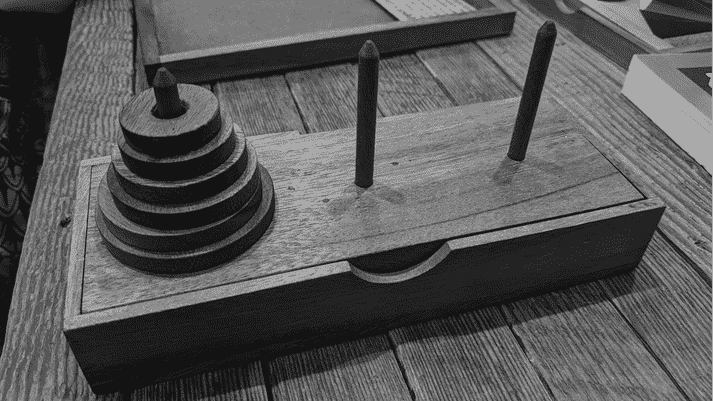

# 14 个实践项目

> 原文：<http://inventwithpython.com/beyond/chapter14.html>


到目前为止，这本书已经教会了你编写可读的 Python 风格 代码的技巧。让我们通过查看两个命令行游戏的源代码来实践这些技术:汉诺塔和四人一排。

这些项目很短，并且基于文本，以保持它们的范围较小，但是它们展示了本书到目前为止概述的原则。我使用第 53 页“黑色:不妥协的代码格式化程序”中描述的黑色工具格式化代码。我根据第 4 章的指导方针选择了变量名。我用 Python 风格 风格写了代码，如第 6 章所述。此外，我写了注释和文档字符串，如第 11 章所述。因为程序很小，我们还没有涉及面向对象编程(OOP ),所以我写这两个项目时没有用到你将在第 15 到 17 章学到的类。

本章介绍了这两个项目的完整源代码以及代码的详细分解。这些解释不是关于*代码如何*工作的(对 Python 语法的基本理解就是所需要的)，而是*为什么*代码是这样写的。尽管如此，不同的软件开发人员对如何编写代码以及他们认为什么是*python 式的*有不同的看法。当然，欢迎您对这些项目中的源代码提出质疑和批评。

在通读了本书中的一个项目后，我建议您自己键入代码并运行几次程序，以了解它们是如何工作的。然后尝试从头开始重新实现程序。您的代码不必与本章中的代码一致，但是重写代码会让您了解编程所需的决策和设计权衡。

## 河内之塔

汉诺塔拼图使用一叠不同大小的圆盘。圆盘的中心有孔，所以你可以把它们放在三个杆子中的一个上面(图 14-1 )。要解决这个难题，玩家必须将一叠圆盘移到另一个柱子上。有三个限制:

1.  播放器一次只能移动一个磁盘。
2.  玩家只能在塔顶来回移动光盘。
3.  播放器不能将较大的盘放在较小的盘上。



图 14-1：一套汉诺塔的实物拼图

解决这个难题是一个常见的计算机科学问题，用于讲授递归算法。我们的程序解决不了这个难题；相反，它会将谜题呈现给人类玩家来解决。你可以在`en.wikipedia.org/wiki/Tower_of_Hanoi`找到更多关于汉诺塔的信息。

### 输出

汉诺塔程序通过使用文本字符来表示圆盘，将塔显示为 ASCII 艺术画。与现代应用相比，这看起来很原始，但是这种方法保持了实现的简单性，因为我们只需要`print()`和`input()`调用来与用户交互。当您运行该程序时，输出将如下所示。玩家输入的文本以粗体显示。

```py
THE TOWER OF HANOI, by Al Sweigart email@protected

Move the tower of disks, one disk at a time, to another tower. Larger
disks cannot rest on top of a smaller disk.

More info at https://en.wikipedia.org/wiki/Tower_of_Hanoi

     ||          ||          ||
    @email@protected         ||          ||
   @@email@protected@        ||          ||
  @@@email@protected@@       ||          ||
 @@@@email@protected@@@      ||          ||
@@@@@email@protected@@@@     ||          ||
      A           B           C

Enter the letters of "from" and "to" towers, or QUIT.
(e.g., AB to move a disk from tower A to tower B.)

> AC
     ||          ||          ||
     ||          ||          ||
   @@email@protected@        ||          ||
  @@@email@protected@@       ||          ||
 @@@@email@protected@@@      ||          ||
@@@@@email@protected@@@@     ||         @email@protected
      A           B           C

Enter the letters of "from" and "to" towers, or QUIT.
(e.g., AB to move a disk from tower A to tower B.)

`--snip--`

     ||          ||          ||
     ||          ||         @email@protected
     ||          ||        @@email@protected@
     ||          ||       @@@email@protected@@
     ||          ||      @@@@email@protected@@@
     ||          ||     @@@@@email@protected@@@@
      A           B           C

You have solved the puzzle! Well done!
```

对于`n`圆盘，至少需要`2 ** n - 1`步才能解出汉诺塔。所以这个五盘塔需要 31 个步骤:AC，AB，CB，AC，BA，BC，AC，AB，CB，CA，BA，CB，AC，AB，CB，AC，AC，BA，BC，AC，BA，CB，CA，BA， BC，AC，AB，CB，AC，BA，BC，最后是 AC。如果你想自己解决更大的挑战，你可以把程序中的`TOTAL_DISKS`变量从`5`增加到`6`。

### 源代码

在编辑器或 IDE 中打开一个新文件，并输入以下代码。保存为`towerofhanoi.py`。

```py
"""THE TOWER OF HANOI, by Al Sweigart email@protected
A stack-moving puzzle game."""

import copy
import sys

TOTAL_DISKS = 5  # More disks means a more difficult puzzle.

# Start with all disks on tower A:
SOLVED_TOWER = list(range(TOTAL_DISKS, 0, -1))

def main():
    """Runs a single game of The Tower of Hanoi."""
    print(
        """THE TOWER OF HANOI, by Al Sweigart email@protected

Move the tower of disks, one disk at a time, to another tower. Larger
disks cannot rest on top of a smaller disk.

More info at https://en.wikipedia.org/wiki/Tower_of_Hanoi
"""
    )

    """The towers dictionary has keys `"`A`"`, `"`B`"`, and `"`C`"` and values
    that are lists representing a tower of disks. The list contains
    integers representing disks of different sizes, and the start of
    the list is the bottom of the tower. For a game with 5 disks,
    the list [5, 4, 3, 2, 1] represents a completed tower. The blank
    list [] represents a tower of no disks. The list [1, 3] has a
    larger disk on top of a smaller disk and is an invalid
    configuration. The list [3, 1] is allowed since smaller disks
    can go on top of larger ones."""
    towers = {"A": copy.copy(SOLVED_TOWER), "B": [], "C": []}

    while True:  # Run a single turn on each iteration of this loop.
        # Display the towers and disks:
        displayTowers(towers)

        # Ask the user for a move:
        fromTower, toTower = getPlayerMove(towers)

        # Move the top disk from fromTower to toTower:
        disk = towers[fromTower].pop()
        towers[toTower].append(disk)

 # Check if the user has solved the puzzle:
        if SOLVED_TOWER in (towers["B"], towers["C"]):
            displayTowers(towers)  # Display the towers one last time.
            print("You have solved the puzzle! Well done!")
            sys.exit()

def getPlayerMove(towers):
    """Asks the player for a move. Returns (fromTower, toTower)."""

    while True:  # Keep asking player until they enter a valid move.
        print('Enter the letters of "from" and "to" towers, or QUIT.')
        print("(e.g., AB to move a disk from tower A to tower B.)")
        print()
        response = input("> ").upper().strip()

        if response == "QUIT":
            print("Thanks for playing!")
            sys.exit()

        # Make sure the user entered valid tower letters:
        if response not in ("AB", "AC", "BA", "BC", "CA", "CB"):
            print("Enter one of AB, AC, BA, BC, CA, or CB.")
            continue  # Ask player again for their move.

        # Use more descriptive variable names:
        fromTower, toTower = response[0], response[1]

        if len(towers[fromTower]) == 0:
            # The "from" tower cannot be an empty tower:
            print("You selected a tower with no disks.")
            continue  # Ask player again for their move.
        elif len(towers[toTower]) == 0:
            # Any disk can be moved onto an empty "to" tower:
            return fromTower, toTower
        elif towers[toTower][-1] < towers[fromTower][-1]:
            print("Can't put larger disks on top of smaller ones.")
            continue  # Ask player again for their move.
        else:
            # This is a valid move, so return the selected towers:
            return fromTower, toTower

def displayTowers(towers):
    """Display the three towers with their disks."""

    # Display the three towers:
    for level in range(TOTAL_DISKS, -1, -1):
        for tower in (towers["A"], towers["B"], towers["C"]):
            if level >= len(tower):
                displayDisk(0)  # Display the bare pole with no disk.
            else:
                displayDisk(tower[level])  # Display the disk.
        print()

 # Display the tower labels A, B, and C:
    emptySpace = " " * (TOTAL_DISKS)
    print("{0} A{0}{0} B{0}{0} C\n".format(emptySpace))

def displayDisk(width):
    """Display a disk of the given width. A width of 0 means no disk."""
    emptySpace = " " * (TOTAL_DISKS - width)

    if width == 0:
        # Display a pole segment without a disk:
        print(f"{emptySpace}||{emptySpace}", end="")
    else:
        # Display the disk:
        disk = "@" * width
        numLabel = str(width).rjust(2, "_")
        print(f"{emptySpace}{disk}{numLabel}{disk}{emptySpace}", end="")

# If this program was run (instead of imported), run the game:
if __name__ == "__main__":
    main()
```

在阅读源代码的解释之前，运行这个程序，玩几个游戏，了解一下这个程序是做什么的。要检查错别字，将其复制并粘贴到位于[`inventwithpython.com/beyond/diff`](https://inventwithpython.com/beyond/diff/)的在线比较工具上。

### 编写代码

让我们仔细看看源代码，看看它是如何遵循本书中描述的最佳实践和模式的。

我们将从程序的顶部开始:

```py
"""THE TOWER OF HANOI, by Al Sweigart email@protected
A stack-moving puzzle game."""
```

程序以多行注释开始，作为`towerofhanoi`模块的文档字符串。内置的`help()`函数将使用这些信息来描述模块:

```py
>>> import towerofhanoi
>>> help(towerofhanoi)
Help on module towerofhanoi:

NAME
    towerofhanoi

DESCRIPTION
    THE TOWER OF HANOI, by Al Sweigart email@protected
    A stack-moving puzzle game.

FUNCTIONS
    displayDisk(width)
        Display a single disk of the given width.
`--snip--`
```

如果需要，可以向模块的文档字符串中添加更多的单词，甚至是信息段落。我在这里只写了一小部分，因为这个程序太简单了。

模块文档字符串之后是`import`语句:

```py
import copy
import sys
```

布莱克将这些语句格式化为单独的语句，而不是单一的语句，比如`import copy, sys`。这使得在版本控制系统(如 Git)中更容易看到导入模块的添加或删除，Git 跟踪程序员所做的更改。

接下来，我们定义这个程序需要的常量:

```py
TOTAL_DISKS = 5  # More disks means a more difficult puzzle.

# Start with all disks on tower A:
SOLVED_TOWER = list(range(TOTAL_DISKS, 0, -1))
```

我们在文件顶部附近定义这些变量，将它们组合在一起，使它们成为全局变量。我们用大写的`snake_case`写下了它们的名字，将它们标记为常量。

`TOTAL_DISKS`常量表示拼图有多少个圆盘。`SOLVED_TOWER`变量是一个包含已求解的塔的列表的例子:它包含每个盘，最大的在底部，最小的在顶部。我们从`TOTAL_DISKS`值生成这个值，对于五个磁盘，它是`[5, 4, 3, 2, 1]`。

注意，这个文件中没有类型提示。原因是我们可以从代码中推断出所有变量、参数和返回值的类型。例如，我们已经给常量`TOTAL_DISKS`赋予了整数值`5`。由此，类型检查器，比如 Mypy，会推断出`TOTAL_DISKS`应该只包含整数。

我们定义了一个`main()`函数，程序在文件底部附近调用它:

```py
def main():
    """Runs a single game of The Tower of Hanoi."""
    print(
        """THE TOWER OF HANOI, by Al Sweigart email@protected

Move the tower of disks, one disk at a time, to another tower. Larger
disks cannot rest on top of a smaller disk.

More info at https://en.wikipedia.org/wiki/Tower_of_Hanoi
"""
    )
```

函数也可以有文档字符串。注意在`def`语句下面的`main()`的文档字符串。您可以通过在交互式 shell 中运行`import towerofhanoi`和`help(towerofhanoi.main)`来查看这个文档字符串。

接下来，我们编写一个注释，详细描述我们用来表示塔的数据结构，因为它构成了这个程序如何工作的核心:

```py
 """The towers dictionary has keys `"`A`"`, `"`B`"`, and `"`C`"` and values
    that are lists representing a tower of disks. The list contains
    integers representing disks of different sizes, and the start of
    the list is the bottom of the tower. For a game with 5 disks,
    the list [5, 4, 3, 2, 1] represents a completed tower. The blank
    list [] represents a tower of no disks. The list [1, 3] has a
    larger disk on top of a smaller disk and is an invalid
    configuration. The list [3, 1] is allowed since smaller disks
    can go on top of larger ones."""
    towers = {"A": copy.copy(SOLVED_TOWER), "B": [], "C": []}
```

我们使用`SOLVED_TOWER`列表作为*栈*，这是软件开发中最简单的数据结构之一。栈是一个有序的值列表，只能通过从栈顶*的*添加(也称为*推入*)或移除(也称为*弹出*)值来改变。这个数据结构完美地代表了我们程序中的塔。如果我们使用`append()`方法进行推送，使用`pop()`方法进行弹出，并且避免以任何其他方式改变列表，我们可以将 Python 列表转换成栈。我们将列表的末尾视为栈的顶部。

`towers`列表中的每个整数代表一个特定大小的单个磁盘。例如，在一个有五个磁盘的游戏中，列表`[5, 4, 3, 2, 1]`将代表从底部最大的(`5`)到顶部最小的(`1`)的一整堆磁盘。

请注意，我们的注释还提供了有效和无效塔栈的示例。

在`main()`函数中，我们编写了一个无限循环来运行我们的益智游戏的一个回合:

```py
 while True:  # Run a single turn on each iteration of this loop.
        # Display the towers and disks:
        displayTowers(towers)

        # Ask the user for a move:
        fromTower, toTower = getPlayerMove(towers)

        # Move the top disk from fromTower to toTower:
        disk = towers[fromTower].pop()
        towers[toTower].append(disk)
```

在一个回合中，玩家可以看到塔的当前状态并进入一步棋。然后程序更新`towers`数据结构。我们在`displayTowers()`和`getPlayerMove()`函数中隐藏了这些任务的细节。这些描述性的函数名允许`main()`函数提供程序功能的概述。

接下来的几行通过比较`SOLVED_TOWER`中的完整塔与`towers["B"]`和`towers["C"]`来检查玩家是否已经解决了谜题:

```py
 # Check if the user has solved the puzzle:
        if SOLVED_TOWER in (towers["B"], towers["C"]):
            displayTowers(towers)  # Display the towers one last time.
            print("You have solved the puzzle! Well done!")
            sys.exit()
```

我们不把它与`towers["A"]`相比，因为那根柱子是从一个已经完成的塔开始的；玩家需要在 B 或 C 杆上形成塔来解决这个难题。请注意，我们重用了`SOLVED_TOWER`来制作出发塔，并检查玩家是否解决了难题。因为`SOLVED_TOWER`是一个常量，所以我们可以相信它总是拥有我们在源代码开始时赋予它的值。

我们使用的条件相当于但短于`SOLVED_TOWER == towers["B"] or SOLVED_TOWER == towers["C"]`，这是我们在第 6 章中提到的 Python 习惯用法。如果这个条件是`True`，玩家已经解出谜题，我们结束程序。否则，我们返回另一个回合。

`getPlayerMove()`函数要求玩家移动磁盘，并根据游戏规则验证移动:

```py
def getPlayerMove(towers):
    """Asks the player for a move. Returns (fromTower, toTower)."""
    while True:  # Keep asking player until they enter a valid move.
        print('Enter the letters of "from" and "to" towers, or QUIT.')
        print(`"`(e.g., AB to move a disk from tower A to tower B.)`"`)
        print()
        response = input(`"`> `"`).upper().strip()
```

我们开始一个无限循环，继续循环，直到一个`return`语句导致执行离开循环和函数，或者一个`sys.exit()`调用终止程序。循环的第一部分要求玩家通过指定从和*到*塔的*来进行移动。*

注意从玩家那里接收键盘输入的`input("> ").upper().strip()`指令。通过给出一个`>`提示，`input("> ")`调用接受玩家的文本输入。这个符号表示玩家应该输入一些东西。如果程序没有提示，玩家可能会暂时认为程序冻结了。

我们对从`input()`返回的字符串调用`upper()`方法，因此它返回字符串的大写形式。这允许玩家输入大写或小写的塔标签，例如塔 A 的`'a'`或`'A'`，然后，大写字符串的`strip()`方法被调用，返回一个两边没有任何空格的字符串，以防用户在输入他们的移动时意外添加了一个空格。这种用户友好性使得我们的程序对玩家来说更容易使用。

仍然在`getPlayerMove()`函数中，我们检查用户输入的内容:

```py
 if response == "QUIT":
            print("Thanks for playing!")
 sys.exit()

        # Make sure the user entered valid tower letters:
        if response not in ("AB", "AC", "BA", "BC", "CA", "CB"):
            print("Enter one of AB, AC, BA, BC, CA, or CB.")
            continue  # Ask player again for their move.
```

如果用户输入`'QUIT'`(在任何情况下，或者甚至在字符串的开头或结尾有空格，由于对`upper()`和`strip()`的调用)，程序终止。我们可以让`getPlayerMove()`返回`'QUIT'`来指示调用者应该调用`sys.exit()`，而不是让`getPlayerMove()`调用`sys.exit()`。但是这将使`getPlayerMove()`的返回值变得复杂:它将返回两个字符串的元组(用于玩家的移动)或者单个`'QUIT'`字符串。返回单一数据类型值的函数比返回多种可能类型值的函数更容易理解。我在 177 页的“返回值应该总是有相同的数据类型”中讨论过这个问题。

在这三个塔之间，只有六个往返塔组合是可能的。尽管我们在检查移动的条件中硬编码了所有六个值，但是代码比类似于`len(response) != 2 or response[0] not in 'ABC' or response[1] not in 'ABC' or response[0] == response[1]`的东西更容易阅读。考虑到这些情况，硬编码方法是最简单的。

一般来说，将诸如`"AB"`、`"AC"`等值硬编码为幻值被认为是不好的做法，这些值只有在程序有三个极点时才有效。但是，尽管我们可能想通过改变`TOTAL_DISKS`常量来调整磁盘的数量，但我们不太可能在游戏中添加更多的极点。在这条线上写出每一个可能的极点移动是没问题的。

我们创建两个新变量，`fromTower`和`toTower`，作为数据的描述性名称。它们没有功能性目的，但是它们比`response[0]`和`response[1]`更容易阅读代码:

```py
 # Use more descriptive variable names:
        fromTower, toTower = response[0], response[1]
```

接下来，我们检查选择的塔是否构成合法移动:

```py
 if len(towers[fromTower]) == 0:
            # The "from" tower cannot be an empty tower:
            print("You selected a tower with no disks.")
            continue  # Ask player again for their move.
        elif len(towers[toTower]) == 0:
            # Any disk can be moved onto an empty "to" tower:
            return fromTower, toTower
        elif towers[toTower][-1] < towers[fromTower][-1]:
            print("Can't put larger disks on top of smaller ones.")
            continue  # Ask player again for their move.
```

如果没有，一个`continue`语句使执行返回到循环的开始，要求玩家再次输入他们的移动。注意，我们检查`toTower`是否为空；如果是，我们返回`fromTower, toTower`来强调移动是有效的，因为你总是可以把一个磁盘放在一个空的杆子上。前两个条件确保在检查第三个条件时，`towers[toTower]`和`towers[fromTower]`不会为空或导致`IndexError`。我们对这些条件进行排序，以防止`IndexError`或额外检查。

您的程序处理来自用户的任何无效输入或潜在的错误情况是很重要的。用户可能不知道输入什么，或者他们可能会打错字。同样，文件可能会意外丢失，或者数据库可能会崩溃。你的程序需要对异常情况有弹性；否则，它们会意外崩溃，或者在以后引起微妙的错误。

如果前面的条件都不为`True`，`getPlayerMove()`返回`fromTower, toTower`:

```py
 else:
            # This is a valid move, so return the selected towers:
            return fromTower, toTower
```

在 Python 中，`return`语句总是返回单个值。虽然这个`return`语句看起来像是返回两个值，但是 Python 实际上返回的是一个两个值的元组，相当于`return (fromTower, toTower)`。Python 程序员经常在这种情况下省略括号。括号不像逗号那样定义元组。

注意，程序只从`main()`函数调用了一次`getPlayerMove()`函数。这个函数并没有把我们从重复的代码中拯救出来，这是使用它的最常见的目的。我们没有理由不把`getPlayerMove()`中的所有代码放在`main()`函数中。但是我们也可以使用函数来将代码组织成独立的单元，这就是我们使用`getPlayerMove()`的方式。这样做可以防止`main()`功能变得太长太笨重。

`displayTowers()`函数在`towers`参数中显示塔 A、B 和 C 上的磁盘:

```py
def displayTowers(towers):
    """Display the three towers with their disks."""

    # Display the three towers:
    for level in range(TOTAL_DISKS, -1, -1):
        for tower in (towers["A"], towers["B"], towers["C"]):
            if level >= len(tower):
                displayDisk(0)  # Display the bare pole with no disk.
            else:
                displayDisk(tower[level])  # Display the disk.
        print()
```

它依赖于`displayDisk()`函数来显示塔中的每个磁盘，我们将在接下来介绍这个函数。`for level`循环检查塔的每个可能的磁盘，`for tower`循环检查塔 A、B 和 c

`displayTowers()`函数调用`displayDisk()`显示每个圆盘的特定宽度，如果通过`0`，则显示没有圆盘的极点:

```py
 # Display the tower labels A, B, and C:
    emptySpace = ' ' * (TOTAL_DISKS)
    print('{0} A{0}{0} B{0}{0} C\n'.format(emptySpace))
```

我们在屏幕上显示 A、B 和 C 标签。玩家需要这些信息来区分塔，并强调塔被标记为 A、B 和 C，而不是 1、2 和 3 或左、中、右。我选择不使用 1、2 和 3 作为塔标签，以防止玩家将这些数字与用于表示磁盘大小的数字混淆。

我们将`emptySpace`变量设置为每个标签之间放置的空格数，这又是基于`TOTAL_DISKS`的，因为游戏中的磁盘越多，两极之间的距离就越大。我们不像在`print(f'{emptySpace} A{emptySpace}{emptySpace} B{emptySpace}{emptySpace} C\n')`中那样使用 F 字符串，而是使用`format()`字符串方法。这允许我们在相关字符串中的任何地方使用相同的`emptySpace`参数，产生比 F 字符串版本更短更可读的代码。

`displayDisk()`功能显示单个磁盘及其宽度。如果没有磁盘，则仅显示磁极:

```py
def displayDisk(width):
    """Display a disk of the given width. A width of 0 means no disk."""
    emptySpace = ' ' * (TOTAL_DISKS - width)
    if width == 0:
        # Display a pole segment without a disk:
        print(f'{emptySpace}||{emptySpace}', end='')
    else:
        # Display the disk:
        disk = '@' * width
        numLabel = str(width).rjust(2, '_')
        print(f"{emptySpace}{disk}{numLabel}{disk}{emptySpace}", end='')
```

我们使用前导空格、与磁盘宽度相等的多个`@`字符、两个代表宽度的字符(如果宽度是一位数，则包括下划线)、另一系列`@`字符以及尾随空格来表示磁盘。为了只显示空的极点，我们只需要前导空格、两个管道字符和尾随空格。因此，我们需要用六个不同的参数对`displayDisk()`进行六次调用，让`width`显示下面的塔:

```py
 ||
    @email@protected
   @@email@protected@
  @@@email@protected@@
 @@@@email@protected@@@
@@@@@email@protected@@@@
```

注意`displayTowers()`和`displayDisk()`函数是如何分担显示塔的责任的。虽然`displayTowers()`决定如何解释代表每个塔的数据结构，但它依赖`displayDisk()`来实际显示塔的每个磁盘。像这样把你的程序分成更小的功能，使得每个部分更容易测试。如果程序显示磁盘不正确，问题可能出在`displayDisk()`。如果磁盘顺序错误，问题可能出在`displayTowers()`。无论哪种方式，您必须调试的代码部分都会小得多。

为了调用`main()`函数，我们使用一个常见的 Python 习惯用法:

```py
# If this program was run (instead of imported), run the game:
if __name__ == '__main__':
    main()
```

如果玩家直接运行`towerofhanoi.py`程序，Python 会自动将`__name__`变量设置为`'__main__'`。但是如果有人使用`import towerofhanoi`将程序作为模块导入，那么`__name__`将被设置为`'towerofhanoi'`。如果有人运行我们的程序，那么`if __name__ == '__main__':`行将调用`main()`函数，开始一个汉诺塔游戏。但是如果我们只是想将程序作为一个模块导入，这样我们就可以调用其中的单个函数进行单元测试，这个条件将是`False`而`main()`将不会被调用。

## 一排四个

四人一排是一种两人玩的丢瓦片游戏。每个玩家试图创建一排四个他们的瓷砖，无论是水平的，垂直的，还是对角的。这类似于棋盘游戏*连接四个*和*四个向上*。该游戏使用一个`7×6`的直立棋盘，瓷砖掉落到一列中最低的未被占据的空间。在我们的四人一排游戏中，两个人类玩家 X 和 O 将相互对战，而不是一个人类玩家与计算机对战。

### 输出

当您运行本章中的四行程序时，输出将如下所示:

```py
Four-in-a-Row, by Al Sweigart email@protected

Two players take turns dropping tiles into one of seven columns, trying
to make four in a row horizontally, vertically, or diagonally.

     1234567
    +-------+
    |.......|
    |.......|
    |.......|
    |.......|
    |.......|
    |.......|
    +-------+
Player X, enter 1 to 7 or QUIT:
> 1

     1234567
    +-------+
    |.......|
    |.......|
    |.......|
    |.......|
    |.......|
    |X......|
    +-------+
Player O, enter 1 to 7 or QUIT:
`--snip--`
Player O, enter 1 to 7 or QUIT:
> 4

     1234567
    +-------+
    |.......|
    |.......|
    |...O...|
    |X.OO...|
    |X.XO...|
    |XOXO..X|
    +-------+
Player O has won!
```

尝试找出许多微妙的策略，你可以用它来获得四个瓷砖在一排，同时阻止你的对手做同样的事情。

### 源代码

在编辑器或 IDE 中打开一个新文件，输入以下代码，并将其保存为`fourinarow.py` :

```py
"""Four-in-a-Row, by Al Sweigart email@protected
A tile-dropping game to get four-in-a-row, similar to Connect Four."""

import sys

# Constants used for displaying the board:
EMPTY_SPACE = "."  # A period is easier to count than a space.
PLAYER_X = "X"
PLAYER_O = "O"

# Note: Update BOARD_TEMPLATE & COLUMN_LABELS if BOARD_WIDTH is changed.
BOARD_WIDTH = 7
BOARD_HEIGHT = 6
COLUMN_LABELS = ("1", "2", "3", "4", "5", "6", "7")
assert len(COLUMN_LABELS) == BOARD_WIDTH

# The template string for displaying the board:
BOARD_TEMPLATE = """
 1234567
    +-------+
    |{}{}{}{}{}{}{}|
    |{}{}{}{}{}{}{}|
    |{}{}{}{}{}{}{}|
    |{}{}{}{}{}{}{}|
    |{}{}{}{}{}{}{}|
    |{}{}{}{}{}{}{}|
    +-------+"""

def main():
    """Runs a single game of Four-in-a-Row."""
    print(
        """Four-in-a-Row, by Al Sweigart email@protected

Two players take turns dropping tiles into one of seven columns, trying
to make Four-in-a-Row horizontally, vertically, or diagonally.
"""
    )

    # Set up a new game:
    gameBoard = getNewBoard()
    playerTurn = PLAYER_X

    while True:  # Run a player's turn.
        # Display the board and get player's move:
        displayBoard(gameBoard)
        playerMove = getPlayerMove(playerTurn, gameBoard)
        gameBoard[playerMove] = playerTurn

        # Check for a win or tie:
        if isWinner(playerTurn, gameBoard):
            displayBoard(gameBoard)  # Display the board one last time.
            print("Player {} has won!".format(playerTurn))
            sys.exit()
        elif isFull(gameBoard):
            displayBoard(gameBoard)  # Display the board one last time.
            print("There is a tie!")
            sys.exit()

        # Switch turns to other player:
        if playerTurn == PLAYER_X:
            playerTurn = PLAYER_O
        elif playerTurn == PLAYER_O:
            playerTurn = PLAYER_X

def getNewBoard():
    """Returns a dictionary that represents a Four-in-a-Row board.

    The keys are (columnIndex, rowIndex) tuples of two integers, and the
    values are one of the "X", "O" or "." (empty space) strings."""
    board = {}
 for rowIndex in range(BOARD_HEIGHT):
        for columnIndex in range(BOARD_WIDTH):
            board[(columnIndex, rowIndex)] = EMPTY_SPACE
    return board

def displayBoard(board):
    """Display the board and its tiles on the screen."""

    # Prepare a list to pass to the format() string method for the board
    # template. The list holds all of the board's tiles (and empty
    # spaces) going left to right, top to bottom:
    tileChars = []
    for rowIndex in range(BOARD_HEIGHT):
        for columnIndex in range(BOARD_WIDTH):
            tileChars.append(board[(columnIndex, rowIndex)])

    # Display the board:
    print(BOARD_TEMPLATE.format(*tileChars))

def getPlayerMove(playerTile, board):
    """Let a player select a column on the board to drop a tile into.

    Returns a tuple of the (column, row) that the tile falls into."""
    while True:  # Keep asking player until they enter a valid move.
        print(f"Player {playerTile}, enter 1 to {BOARD_WIDTH} or QUIT:")
        response = input("> ").upper().strip()

        if response == "QUIT":
            print("Thanks for playing!")
            sys.exit()

        if response not in COLUMN_LABELS:
            print(f"Enter a number from 1 to {BOARD_WIDTH}.")
            continue  # Ask player again for their move.

        columnIndex = int(response) - 1  # -1 for 0-based column indexes.

        # If the column is full, ask for a move again:
        if board[(columnIndex, 0)] != EMPTY_SPACE:
            print("That column is full, select another one.")
            continue  # Ask player again for their move.

        # Starting from the bottom, find the first empty space.
        for rowIndex in range(BOARD_HEIGHT - 1, -1, -1):
            if board[(columnIndex, rowIndex)] == EMPTY_SPACE:
                return (columnIndex, rowIndex)

def isFull(board):
    """Returns True if the `board` has no empty spaces, otherwise
    returns False."""
    for rowIndex in range(BOARD_HEIGHT):
        for columnIndex in range(BOARD_WIDTH):
 if board[(columnIndex, rowIndex)] == EMPTY_SPACE:
                return False  # Found an empty space, so return False.
    return True  # All spaces are full.

def isWinner(playerTile, board):
    """Returns True if `playerTile` has four tiles in a row on `board`,
    otherwise returns False."""

    # Go through the entire board, checking for four-in-a-row:
    for columnIndex in range(BOARD_WIDTH - 3):
        for rowIndex in range(BOARD_HEIGHT):
            # Check for four-in-a-row going across to the right:
            tile1 = board[(columnIndex, rowIndex)]
            tile2 = board[(columnIndex + 1, rowIndex)]
            tile3 = board[(columnIndex + 2, rowIndex)]
            tile4 = board[(columnIndex + 3, rowIndex)]
            if tile1 == tile2 == tile3 == tile4 == playerTile:
                return True

    for columnIndex in range(BOARD_WIDTH):
        for rowIndex in range(BOARD_HEIGHT - 3):
            # Check for four-in-a-row going down:
            tile1 = board[(columnIndex, rowIndex)]
            tile2 = board[(columnIndex, rowIndex + 1)]
            tile3 = board[(columnIndex, rowIndex + 2)]
            tile4 = board[(columnIndex, rowIndex + 3)]
            if tile1 == tile2 == tile3 == tile4 == playerTile:
                return True

    for columnIndex in range(BOARD_WIDTH - 3):
        for rowIndex in range(BOARD_HEIGHT - 3):
            # Check for four-in-a-row going right-down diagonal:
            tile1 = board[(columnIndex, rowIndex)]
            tile2 = board[(columnIndex + 1, rowIndex + 1)]
            tile3 = board[(columnIndex + 2, rowIndex + 2)]
            tile4 = board[(columnIndex + 3, rowIndex + 3)]
            if tile1 == tile2 == tile3 == tile4 == playerTile:
                return True

            # Check for four-in-a-row going left-down diagonal:
            tile1 = board[(columnIndex + 3, rowIndex)]
            tile2 = board[(columnIndex + 2, rowIndex + 1)]
            tile3 = board[(columnIndex + 1, rowIndex + 2)]
            tile4 = board[(columnIndex, rowIndex + 3)]
            if tile1 == tile2 == tile3 == tile4 == playerTile:
                return True
    return False

# If this program was run (instead of imported), run the game:
if __name__ == "__main__":
    main()
```

在阅读源代码的解释之前，运行这个程序，玩几个游戏，了解一下这个程序是做什么的。要检查拼写错误，将其复制并粘贴到位于[`inventwithpython.com/beyond/diff`](https://inventwithpython.com/beyond/diff/)的在线差异工具上。

### 编写代码

让我们看看程序的源代码，就像我们对汉诺塔程序所做的那样。我再一次用黑色格式化了这段代码，每行限制为 75 个字符。

我们将从程序的顶部开始:

```py
"""Four-in-a-Row, by Al Sweigart email@protected
A tile-dropping game to get four-in-a-row, similar to Connect Four."""

import sys

# Constants used for displaying the board:
EMPTY_SPACE = "."  # A period is easier to count than a space.
PLAYER_X = "X"
PLAYER_O = "O"
```

我们用一个文档字符串、模块导入和常量赋值开始程序，就像我们在汉诺塔程序中所做的那样。我们定义了`PLAYER_X`和`PLAYER_O`常量，这样我们就不必在整个程序中使用字符串`"X"`和`"O"`，使得错误更容易被捕获。如果我们在使用常量时输入了一个错别字，比如`PLAYER_XX`，Python 会抛出`NameError`，立即指出问题所在。但是如果我们用`"X"`字符打了个错别字，比如`"XX"`或`"Z"`，产生的 bug 可能不会立即显现出来。正如在第 71 页的“幻数”中所解释的，直接使用常量而不是字符串值不仅提供了描述，还为源代码中的任何拼写错误提供了预警。

当程序运行时，常量不应该改变。但是程序员可以在程序的未来版本中更新它们的值。出于这个原因，我们提醒程序员，如果他们改变了`BOARD_WIDTH`的值，他们应该更新`BOARD_TEMPLATE`和`COLUMN_LABELS`常量，这将在后面描述:

```py
# Note: Update BOARD_TEMPLATE & COLUMN_LABELS if BOARD_WIDTH is changed.
BOARD_WIDTH = 7
BOARD_HEIGHT = 6
```

接下来，我们创建`COLUMN_LABELS`常量:

```py
COLUMN_LABELS = ("1", "2", "3", "4", "5", "6", "7")
assert len(COLUMN_LABELS) == BOARD_WIDTH
```

我们稍后将使用这个常量来确保玩家选择一个有效的列。请注意，如果我们将`BOARD_WIDTH`设置为除了`7`之外的值，我们将不得不在`COLUMN_LABELS`元组中添加或删除标签。我可以通过基于代码为的`BOARD_WIDTH`生成`COLUMN_LABELS`的值来避免这种情况，如下所示:`COLUMN_LABELS = tuple([str(n) for n in range(1, BOARD_WIDTH + 1)])`。但是`COLUMN_LABELS`未来不太可能改变，因为标准的四人一排游戏是在 7 乘 6 的棋盘上玩的，所以我决定写出一个显式的元组值。

当然，这种硬编码是一种代码味道，正如第 71 页“神奇的数字”中所描述的，但它比其他选择更具可读性。另外，`assert`语句警告我们在不更新`COLUMN_LABELS`的情况下改变`BOARD_WIDTH`。

和汉诺塔一样，四行程序使用 ASCII 艺术画来绘制游戏棋盘。以下几行是带有多行字符串的单个赋值语句:

```py
# The template string for displaying the board:
BOARD_TEMPLATE = """
     1234567
    +-------+
    |{}{}{}{}{}{}{}|
    |{}{}{}{}{}{}{}|
    |{}{}{}{}{}{}{}|
    |{}{}{}{}{}{}{}|
    |{}{}{}{}{}{}{}|
    |{}{}{}{}{}{}{}|
    +-------+"""
```

这个字符串包含大括号(`{}`),`format()`字符串方法将用棋盘的内容替换它。(`displayBoard()`函数，稍后解释，将处理这一点。)因为棋盘由 7 列和 6 行组成，所以我们在 6 行的每一行中使用 7 个括号对`{}`来代表每个插槽。注意，就像`COLUMN_LABELS`一样，我们在技术上对棋盘进行了硬编码，以创建一定数量的列和行。如果我们将`BOARD_WIDTH`或`BOARD_HEIGHT`改为新的整数，我们也必须更新`BOARD_TEMPLATE`中的多行字符串。

我们可以编写代码来基于`BOARD_WIDTH`和`BOARD_HEIGHT`常量生成`BOARD_TEMPLATE`，就像这样:

```py
BOARD_EDGE = "    +" + ("-" * BOARD_WIDTH) + "+"
BOARD_ROW = "    |" + ("{}" * BOARD_WIDTH) + "|\n"
BOARD_TEMPLATE = "\n     " + "".join(COLUMN_LABELS) + "\n" + BOARD_EDGE + "\n" + (BOARD_ROW * BOARD_HEIGHT) + BOARD_EDGE
```

但是这段代码不像简单的多行字符串那样易读，而且我们也不太可能改变游戏板的大小，所以我们将使用简单的多行字符串。

我们开始编写`main()`函数，它将调用我们为这个游戏制作的所有其他函数:

```py
def main():
    """Runs a single game of Four-in-a-Row."""
    print(
        """Four-in-a-Row, by Al Sweigart email@protected

Two players take turns dropping tiles into one of seven columns, trying
to make four-in-a-row horizontally, vertically, or diagonally.
"""
    )

    # Set up a new game:
    gameBoard = getNewBoard()
    playerTurn = PLAYER_X
```

我们给`main()`函数一个文档字符串，可以通过内置的`help()`函数查看。`main()`功能还为新游戏准备游戏板并选择第一个玩家。

在`main()`函数内部是一个无限循环:

```py
 while True:  # Run a player's turn.
        # Display the board and get player's move:
        displayBoard(gameBoard)
        playerMove = getPlayerMove(playerTurn, gameBoard)
        gameBoard[playerMove] = playerTurn
```

这个循环的每一次迭代都包括一次转弯。首先，我们向玩家展示游戏板。第二，玩家选择一列来放一个方块，第三，我们更新游戏板数据结构。

接下来，我们评估玩家移动的结果:

```py
 # Check for a win or tie:
        if isWinner(playerTurn, gameBoard):
            displayBoard(gameBoard)  # Display the board one last time.
            print("Player {} has won!".format(playerTurn))
            sys.exit()
        elif isFull(gameBoard):
            displayBoard(gameBoard)  # Display the board one last time.
            print("There is a tie!")
            sys.exit()
```

如果玩家走了一步赢棋，`isWinner()`返回`True`，游戏结束。如果玩家填满了棋盘并且没有赢家，`isFull()`返回`True`，游戏结束。注意，我们可以使用一个简单的`break`语句来代替调用`sys.exit()`。这将导致执行从`while`循环中中断，并且因为在这个循环之后`main()`函数中没有代码，该函数将返回到程序底部的`main()`调用，导致程序结束。但是我选择使用`sys.exit()`向阅读代码的程序员表明程序将立即终止。

如果游戏还没有结束，下面几行将`playerTurn`设置为另一个玩家:

```py
 # Switch turns to other player:
        if playerTurn == PLAYER_X:
            playerTurn = PLAYER_O
        elif playerTurn == PLAYER_O:
            playerTurn = PLAYER_X
```

注意，我本可以将`elif`语句变成一个简单的没有条件的`else`语句。但是回想一下 Python 信条之禅，即*显式优于隐式*。这个代码*明确地*说如果现在轮到玩家 O，那么接下来就轮到玩家 X 了。另一种说法是，如果现在还没轮到参与人 X，下一个就轮到参与人 X 了。尽管`if`和`else`语句自然符合布尔条件，但是`PLAYER_X`和`PLAYER_O`值与`True`不同，`False` : `not PLAYER_X`与`PLAYER_O`不同。因此，在检查`playerTurn`的值时，直接一点很有帮助。

或者，我可以在一行程序中执行相同的操作:

```py
playerTurn = {PLAYER_X: PLAYER_O, PLAYER_O: PLAYER_X}[ playerTurn]
```

这一行使用了第 101 页“使用字典代替`switch`语句”中提到的字典技巧。但是像许多一行程序一样，它不像直接的`if`和`elif`语句那样易读。

接下来，我们定义`getNewBoard()`函数:

```py
def getNewBoard():
    """Returns a dictionary that represents a Four-in-a-Row board.

    The keys are (columnIndex, rowIndex) tuples of two integers, and the
    values are one of the "X", "O" or "." (empty space) strings."""
    board = {}
    for rowIndex in range(BOARD_HEIGHT):
        for columnIndex in range(BOARD_WIDTH):
            board[(columnIndex, rowIndex)] = EMPTY_SPACE
    return board
```

这个函数返回一个字典，它代表一个四行棋盘。它有用于键的`(columnIndex, rowIndex)`元组(其中`columnIndex`和`rowIndex`是整数)，以及用于棋盘上每个位置的图块的`'X'`、`'O'`或`'.'`字符。我们将这些字符串分别存储在`PLAYER_X`、`PLAYER_O`和`EMPTY_SPACE`中。

我们的四行游戏相当简单，因此使用字典来表示游戏板是一种合适的技术。尽管如此，我们还是可以使用面向对象的方法来代替。我们将在第 15 到 17 章探索 OOP。

`displayBoard()`函数采用游戏棋盘数据结构作为`board`参数，并使用`BOARD_TEMPLATE`常量在屏幕上显示棋盘:

```py
def displayBoard(board):
    """Display the board and its tiles on the screen."""

    # Prepare a list to pass to the format() string method for the board
    # template. The list holds all of the board's tiles (and empty
    # spaces) going left to right, top to bottom:
    tileChars = []
```

回想一下，`BOARD_TEMPLATE`是一个多行字符串，有几个括号对。当我们在`BOARD_TEMPLATE`上调用`format()`方法时，这些括号将被传递给`format()`的参数替换。

`tileChars`变量将包含这些参数的列表。我们首先给它分配一个空白列表。`tileChars`中的第一个值将替换`BOARD_TEMPLATE`中的第一对括号，第二个值将替换第二对括号，依此类推。实际上，我们正在创建一个来自`board`字典的值列表:

```py
 for rowIndex in range(BOARD_HEIGHT):
        for columnIndex in range(BOARD_WIDTH):
            tileChars.append(board[(columnIndex, rowIndex)])

    # Display the board:
    print(BOARD_TEMPLATE.format(*tileChars))
```

这些嵌套的`for`循环遍历棋盘上所有可能的行和列，将它们添加到`tileChars`中的列表中。一旦这些循环结束，我们就使用星号`*`前缀将`tileChars`列表中的值作为单独的参数传递给`format()`方法。“使用`*`创建变量函数”一节解释了如何使用该语法将列表中的值作为独立的函数参数:代码`print(*['cat', 'dog', 'rat'])`相当于`print('cat', 'dog', 'rat')`。我们需要星号，因为`format()`方法要求每个大括号对有一个参数，而不是一个列表参数。

接下来，我们编写`getPlayerMove()`函数:

```py
def getPlayerMove(playerTile, board):
    """Let a player select a column on the board to drop a tile into.

    Returns a tuple of the (column, row) that the tile falls into."""
    while True:  # Keep asking player until they enter a valid move.
        print(f"Player {playerTile}, enter 1 to {BOARD_WIDTH} or QUIT:")
        response = input("> ").upper().strip()

        if response == "QUIT":
            print("Thanks for playing!")
            sys.exit()
```

该函数以等待玩家输入有效走法的无限循环开始。这段代码类似于汉诺塔程序中的`getPlayerMove()`函数。请注意，`while`循环开始时的`print()`调用使用了 F 字符串，因此如果我们更新`BOARD_WIDTH`，就不必更改消息。

我们检查玩家的回应是一列；如果不是，则`continue`语句将执行移回到循环的开始，要求玩家进行有效的移动:

```py
 if response not in COLUMN_LABELS:
            print(f"Enter a number from 1 to {BOARD_WIDTH}.")
            continue  # Ask player again for their move.
```

我们可以把这个输入验证条件写成`not response.isdecimal() or spam < 1 or spam > BOARD_WIDTH`，但是直接用`response not in COLUMN_LABELS`更简单。

接下来，我们需要找出玩家所选列中的方块会落在哪一行:

```py
 columnIndex = int(response) - 1  # -1 for 0-based column indexes.

        # If the column is full, ask for a move again:
        if board[(columnIndex, 0)] != EMPTY_SPACE:
            print("That column is full, select another one.")
            continue  # Ask player again for their move.
```

棋盘在屏幕上显示列标签`1`到`7`。但是板上的`(columnIndex, rowIndex)`索引使用基于 0 的索引，所以它们的范围是从 0 到 6。为了解决这个差异，我们将字符串值`'1'`到`'7'`转换为整数值`0`到`6`。

行索引从板顶部的`0`开始，增加到板底部的`6`。我们检查所选列中的第一行，看它是否被占用。如果是这样的话，这一列就完全填满了，并且`continue`语句将执行移回到循环的开始，要求玩家进行另一次移动。

如果该列未满，我们需要找到最低的未被占用的空间来放置瓷砖:

```py
 # Starting from the bottom, find the first empty space.
        for rowIndex in range(BOARD_HEIGHT - 1, -1, -1):
            if board[(columnIndex, rowIndex)] == EMPTY_SPACE:
                return (columnIndex, rowIndex)
```

这个`for`循环从底部行索引、`BOARD_HEIGHT - 1`或`6`开始，并向上移动，直到找到第一个空白空间。然后，该函数返回最低空白空间的索引。

每当棋盘满了，游戏就以平局结束:

```py
def isFull(board):
    """Returns True if the `board` has no empty spaces, otherwise
    returns False."""
    for rowIndex in range(BOARD_HEIGHT):
        for columnIndex in range(BOARD_WIDTH):
            if board[(columnIndex, rowIndex)] == EMPTY_SPACE:
                return False  # Found an empty space, so return False.
    return True  # All spaces are full.
```

`isFull()`函数使用一对嵌套的`for`循环来迭代棋盘上的每一个位置。如果它找到一个空的位置，那么棋盘还没满，函数返回`False`。如果执行通过了两个循环，那么`isFull()`函数没有发现空的空间，所以它返回`True`。

`isWinner()`功能检查玩家是否赢得游戏:

```py
def isWinner(playerTile, board):
    """Returns True if `playerTile` has four tiles in a row on `board`,
    otherwise returns False."""

    # Go through the entire board, checking for four-in-a-row:
    for columnIndex in range(BOARD_WIDTH - 3):
        for rowIndex in range(BOARD_HEIGHT):
            # Check for four-in-a-row going across to the right:
            tile1 = board[(columnIndex, rowIndex)]
            tile2 = board[(columnIndex + 1, rowIndex)]
            tile3 = board[(columnIndex + 2, rowIndex)]
            tile4 = board[(columnIndex + 3, rowIndex)]
            if tile1 == tile2 == tile3 == tile4 == playerTile:
                return True
```

如果`playerTile`在一行中水平、垂直或对角出现四次，该函数返回`True`。为了判断条件是否满足，我们必须检查棋盘上每组四个相邻的空格。我们将使用一系列嵌套的`for`循环来做到这一点。

`(columnIndex, rowIndex)`元组代表一个起点。我们检查起点和它右边的三个空格来寻找`playerTile`字符串。如果起始空格是`(columnIndex, rowIndex)`，它右边的空格将是`(columnIndex + 1, rowIndex)`，以此类推。我们将把这四个空间中的图块保存到变量`tile1`、`tile2`、`tile3`和`tile4`中。如果所有这些变量的值都与`playerTile`相同，我们就找到了一行四个变量，并且`isWinner()`函数返回`True`。

在第 76 页的“带有数字后缀的变量”中，我提到带有连续数字后缀的变量名(就像这个游戏中的`tile1`到`tile4` )通常是一种代码味道，表明你应该使用单个列表来代替。但是在这种情况下，这些变量名是没问题的。我们不需要用列表来替换它们，因为四行程序总是需要正好四个这样的`tile`变量。请记住，代码异味不一定表明有问题；这只意味着我们应该再看一眼，确认我们已经用最易读的方式编写了代码。在这种情况下，使用列表会使我们的代码更加复杂，并且不会增加任何好处，所以我们将坚持使用`tile1`、`tile2`、`tile3`和`tile4`。

我们使用类似的过程来检查垂直的四行平铺:

```py
 for columnIndex in range(BOARD_WIDTH):
        for rowIndex in range(BOARD_HEIGHT - 3):
            # Check for four-in-a-row going down:
            tile1 = board[(columnIndex, rowIndex)]
            tile2 = board[(columnIndex, rowIndex + 1)]
            tile3 = board[(columnIndex, rowIndex + 2)]
            tile4 = board[(columnIndex, rowIndex + 3)]
            if tile1 == tile2 == tile3 == tile4 == playerTile:
                return True
```

接下来，我们检查对角线模式中的四个一行的瓦片，向下并向右；然后，我们检查对角线模式中从左到下的四个一行的图块:

```py
 for columnIndex in range(BOARD_WIDTH - 3):
        for rowIndex in range(BOARD_HEIGHT - 3):
            # Check for four-in-a-row going right-down diagonal:
            tile1 = board[(columnIndex, rowIndex)]
            tile2 = board[(columnIndex + 1, rowIndex + 1)]
            tile3 = board[(columnIndex + 2, rowIndex + 2)]
            tile4 = board[(columnIndex + 3, rowIndex + 3)]
            if tile1 == tile2 == tile3 == tile4 == playerTile:
                return True

            # Check for four-in-a-row going left-down diagonal:
            tile1 = board[(columnIndex + 3, rowIndex)]
            tile2 = board[(columnIndex + 2, rowIndex + 1)]
            tile3 = board[(columnIndex + 1, rowIndex + 2)]
            tile4 = board[(columnIndex, rowIndex + 3)]
            if tile1 == tile2 == tile3 == tile4 == playerTile:
                return True
```

这段代码类似于水平的四行检查，所以我不会在这里重复解释。如果对四个一排的牌的所有检查都没有发现任何牌，则该函数返回`False`以指示`playerTile`不是该棋盘上的赢家:

```py
 return False
```

剩下的唯一任务是调用`main()`函数:

```py
# If this program was run (instead of imported), run the game:
if __name__ == '__main__':
    main()
```

同样，我们使用一个常见的 Python 习惯用法，如果直接运行`fourinarow.py`，则调用`main()`,但如果将`fourinarow.py`作为模块导入，则不调用。

## 摘要

汉诺塔益智游戏和四人一排游戏是简短的程序，但是通过遵循本书中的实践，您可以确保它们的代码可读并且易于调试。这些程序遵循几个好的实践:它们被自动格式化为黑色，使用文档字符串描述模块和函数，并将常量放在文件顶部附近。它们将变量、函数参数和函数返回值限制为单一数据类型，因此类型提示虽然是一种有益的附加文档形式，但却是不必要的。

在汉诺塔中，我们将这三座塔表示为一个字典，包含关键字`'A'`、`'B'`和`'C'`，它们的值是整数列表。这是可行的，但是如果我们的程序更大或者更复杂，用一个类来表示这些数据是一个好主意。本章没有用到类和 OOP 技术，因为我在第 15 章到第 17 章才涉及 OOP。但是请记住，为这个数据结构使用一个类是完全有效的。塔在屏幕上呈现为 ASCII 艺术画，使用文本字符来显示塔的每个圆盘。

四排游戏使用 ASCII 艺术画来显示游戏板的表示。我们使用存储在`BOARD_TEMPLATE`常量中的多行字符串来显示它。该字符串有 42 对括号`{}`来显示`7×6`板上的每个空格。我们使用大括号，所以`format()`字符串方法可以在那个空间用瓷砖替换它们。这样，屏幕上显示的`BOARD_TEMPLATE`字符串如何产生游戏板就更明显了。

尽管它们的数据结构不同，但这两个程序有许多相似之处。它们都在屏幕上显示它们的数据结构，请求玩家输入，验证输入，然后在循环回到开始之前用它来更新它们的数据结构。但是我们可以用许多不同的方式编写代码来执行这些操作。使代码可读的因素最终是一种主观意见，而不是对它遵守规则的程度的客观衡量。本章中的源代码表明，尽管我们应该总是对任何代码异味进行第二次检查，但并不是所有的代码异味都表明我们需要解决某个问题。代码可读性比盲目地遵循“零代码异味”策略更重要。

# 第三部分
面向对象的 Python

