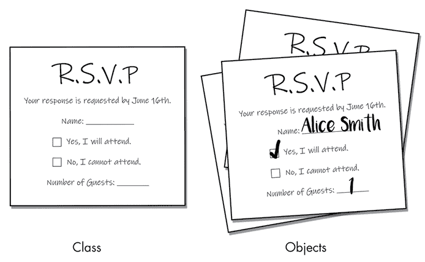
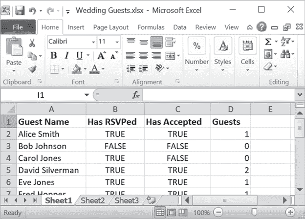
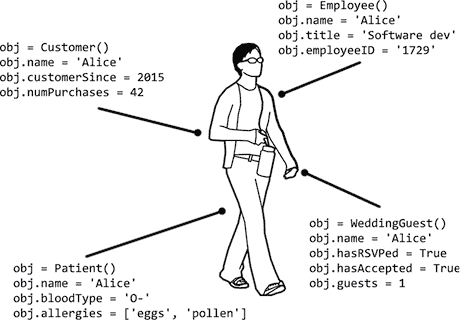

# 15 面向对象编程和类

> 原文：<http://inventwithpython.com/beyond/chapter15.html>

*OOP* 是一种编程语言特性，允许你将变量和函数组合成新的数据类型，称为*类*，你可以从中创建对象。通过将代码组织成类，可以将一个整体程序分解成更容易理解和调试的小部分。

对于小程序来说，OOP 与其说是增加了组织，不如说是增加了官僚主义。虽然有些语言，比如 Java，要求你将所有代码组织成类，但是 Python 的 OOP 特性是可选的。程序员可以在需要时利用类，或者在不需要时忽略它们。Python 核心开发人员 Jack Diederich 在 PyCon 2012 的演讲“停止编写类”([`youtu.be/o9pEzgHorH0`](https://youtu.be/o9pEzgHorH0/))中指出，在许多情况下，程序员编写类时，更简单的函数或模块会工作得更好。

也就是说，作为一名程序员，你应该熟悉什么是类以及它们如何工作的基础知识。在这一章中，你将学习什么是类，为什么在程序中使用它们，以及它们背后的语法和编程概念。OOP 是一个广泛的话题，本章只是作为一个介绍。

## 真实世界的类比:填写表单

在您的生活中，您很可能已经无数次地填写纸质或电子表单:为了看医生、为了网上购物或为了婚礼回复。表单是另一个人或组织收集他们需要的关于您的信息的统一方式。不同的表格要求不同种类的信息。你会在医生的表格上报告一个敏感的医疗状况，你会在婚礼回复上报告你带来的任何客人，但不是相反。

在 Python 中，*类*、*类型*、*数据类型*含义相同。与纸质或电子表单一样，*类*是 Python *对象*(也称为*实例*)的蓝图，其中包含表示名词的数据。这个名词可以是医生的病人、电子商务购物或婚礼宾客。类就像一个空白的表单模板，从该类创建的对象就像一个填写好的表单，其中包含了表单所代表的事物的实际数据。例如，在图 15-1 中，RSVP 响应表单就像一个类，而填写好的 RSVP 就像一个对象。



图 15-1: 婚礼 RSVP 表单模板就像类，填写好的表单就像对象。

你也可以把类和对象想象成电子表格，如图 15-2 所示。

 

图 15-2: 所有 RSVP 数据的电子表格

列标题组成了类，而每一行组成了一个对象。

在现实世界中，类和对象经常被当作项目的数据模型来谈论，但是不要把地图和领域混淆了。什么进入类取决于程序需要做什么。图 15-3 显示了一些不同类的对象，它们代表了同一个现实世界的人，除了这个人的名字，它们存储了完全不同的信息。



图 15-3: 四个对象由不同的类组成，代表同一个真实世界的人，这取决于软件应用程序需要了解这个人的什么

另外，你的类中包含的信息应该取决于你的程序的需求。许多 OOP 教程使用一个`Car`类作为它们的基本例子，却没有注意到什么进入一个类完全取决于你正在编写的软件的种类。没有一个通用的`Car`类会*明显地*有一个`honkHorn()`方法或者`numberOfCupholders`属性，仅仅因为那些是真实世界的汽车所具有的特征。你的程序可能是一个汽车经销商网络应用程序，一个赛车视频游戏，或者一个道路交通模拟。汽车经销商 web 应用程序的`Car`类可能有`milesPerGallon`或`manufacturersSuggestedRetailPrice`属性(就像汽车经销商的电子表格可能使用这些作为列)。但是视频游戏和道路交通模拟没有这些属性，因为这些信息与它们无关。视频游戏的`Car`类可能有一个`explodeWithLargeFireball()`方法，但是汽车经销商和交通模拟，但愿不会有。

## 从类创建对象

您已经在 Python 中使用过类和对象，即使您自己没有创建过类。考虑一下`datetime`模块，它包含一个名为`date`的类。`datetime.date`类的对象(也简称为`datetime.date`对象或`date`对象)代表一个特定的日期。在交互式 shell 中输入以下内容，创建一个`datetime.date`类的对象:

```py
>>> import datetime
>>> birthday = datetime.date(1999, 10, 31) # Pass the year, month, and day.
>>> birthday.year
1999
>>> birthday.month
10
>>> birthday.day
31
>>> birthday.weekday() # weekday() is a method; note the parentheses.
6
```

*属性*是与对象相关联的变量。对`datetime.date()`的调用创建了一个新的`date`对象，用参数`1999`、`10`、`31`初始化，因此该对象表示日期 1999 年 10 月 31 日。我们将这些参数指定为`date`类的`year`、`month`和`day`属性，所有`date`对象都有这些属性。

有了这些信息，类的`weekday()`方法就可以计算出星期几。在这个例子中，它返回周日的`6`，因为根据 Python 的在线文档，`weekday()`的返回值是一个整数，从周一的`0`开始，到周日的`6`。文档列出了`date`类的对象拥有的其他几个方法。尽管`date`对象包含多个属性和方法，但它仍然是一个可以存储在变量中的对象，比如本例中的`birthday`。

## 创建一个简单的类:WizCoin

让我们创建一个`WizCoin`类，它代表一个虚构的巫师货币中的一些硬币。在这种货币中，面额为克努特、西克尔(价值 29 克努特)和加隆(价值 17 西克尔或 493 克努特)。请记住，`WizCoin`类中的对象代表一定数量的硬币，而不是一定数量的钱。例如，它会告诉你你拿的是 5 个 25 美分和 1 个 10 美分，而不是 1.35 美元。

在名为`wizcoin.py`的新文件中，输入以下代码创建`WizCoin`类。注意，`__init__`方法名在`init`前后有两个下划线(我们将在本章后面的“方法、__init__()和 self”中讨论`__init__`):

```py
class WizCoin: # 1
    def __init__(self, galleons, sickles, knuts): # 2
        """Create a new WizCoin object with galleons, sickles, and knuts."""
        self.galleons = galleons
        self.sickles  = sickles
        self.knuts    = knuts
        # NOTE: __init__() methods NEVER have a return statement.

    def value(self): # 3
        """The value (in knuts) of all the coins in this WizCoin object."""
        return (self.galleons * 17 * 29) + (self.sickles * 29) + (self.knuts)

    def weightInGrams(self): # 4
        """Returns the weight of the coins in grams."""
        return (self.galleons * 31.103) + (self.sickles * 11.34) + (self.knuts * 5.0)
```

这个程序使用一个`class`语句 1 定义了一个名为`WizCoin`的新类。创建一个类会创建一个新类型的对象。使用`class`语句定义一个类类似于使用`def`语句定义新函数。在`class`语句后面的代码块中有三个方法的定义:`__init__()`(初始化器的缩写) 2 、`value()` 3 和`weightInGrams()` 4 。请注意，所有方法都有一个名为`self`的第一个参数，我们将在下一节探讨这个参数。

按照惯例，模块名(比如我们的`wizcoin.py`文件中的`wizcoin`)是小写的，而类名(比如`WizCoin`)以大写字母开头。不幸的是，Python 标准库中的一些类，比如`date`，并没有遵循这个约定。

为了练习创建`WizCoin`类的新对象，在一个单独的文件编辑器窗口中输入下面的源代码，并将文件保存为`wcexample1.py`，与`wizcoin.py`放在同一个文件夹中:

```py
import wizcoin

purse = wizcoin.WizCoin(2, 5, 99) # The ints are passed to __init__(). # 1
print(purse)
print('G:', purse.galleons, 'S:', purse.sickles, 'K:', purse.knuts)
print('Total value:', purse.value())
print('Weight:', purse.weightInGrams(), 'grams')
 print()

coinJar = wizcoin.WizCoin(13, 0, 0) # The ints are passed to __init__(). # 2
print(coinJar)
print('G:', coinJar.galleons, 'S:', coinJar.sickles, 'K:', coinJar.knuts)
print('Total value:', coinJar.value())
print('Weight:', coinJar.weightInGrams(), 'grams')
```

对`WizCoin()` 1 2 的调用创建一个`WizCoin`对象，并为它们运行`__init__()`方法中的代码。我们将三个整数作为参数传递给`WizCoin()`，它们被转发给`__init__()`的参数。这些参数被分配给对象的`self.galleons`、`self.sickles`和`self.knuts`属性。注意，正如`time.sleep()`函数要求您首先导入`time`模块并将`time.`放在函数名之前，我们也必须导入`wizcoin`并将`wizcoin.`放在`WizCoin()`函数名之前。

当您运行该程序时，输出将类似于以下内容:

```py
<wizcoin.WizCoin object at 0x000002136F138080>
G: 2 S: 5 K: 99
Total value: 1230
Weight: 613.906 grams

<wizcoin.WizCoin object at 0x000002136F138128>
G: 13 S: 0 K: 0
Total value: 6409
Weight: 404.339 grams
```

如果你得到一个错误信息，比如`ModuleNotFoundError: No module named 'wizcoin'`，检查以确保你的文件被命名为`wizcoin.py`，并且它和`wcexample1.py`在同一个文件夹中。

`WizCoin`对象没有有用的字符串表示，所以打印`purse`和`coinJar`会在尖括号中显示一个内存地址。(你将在第 17 章学习如何改变这一点。)

正如我们可以在一个字符串对象上调用`lower()`字符串方法一样，我们也可以在已经分配给`purse`和`coinJar`变量的`WizCoin`对象上调用`value()`和`weightInGrams()`方法。这些方法根据对象的`galleons`、`sickles`和`knuts`属性计算值。

类和 OOP 可以产生更多的*可维护的*代码——也就是说，将来更容易阅读、修改和扩展的代码。让我们更详细地探索这个类的方法和属性。

### 方法、__init__()和 self

*方法*是与特定类的对象相关联的函数。回想一下`lower()`是一个字符串方法，这意味着它是在字符串对象上调用的。你可以在一个字符串上调用`lower()`，就像在`'Hello'.lower()`中一样，但是你不能在一个列表上调用它，比如`['dog', 'cat'].lower()`。另外，注意方法跟在对象后面:正确的代码是`'Hello'.lower()`，而不是`lower('Hello')`。不像像`lower()`这样的方法，像`len()`这样的函数不与单一数据类型相关联；您可以将字符串、列表、字典和许多其他类型的对象传递给`len()`。

正如您在上一节中看到的，我们通过调用类名作为函数来创建对象。这个函数被称为*构造函数*(或者*构造函数*，或者缩写为`ctor`，发音为“see-tore”)，因为它构造了一个新的对象。我们还说构造函数*实例化了*一个新的类实例。

调用构造函数会导致 Python 创建新对象，然后运行`__init__()`方法。不要求类有一个`__init__()`方法，但是它们几乎总是有。`__init__()`方法是您通常设置属性初始值的地方。例如，回想一下`WizCoin`的`__init__()`方法如下所示:

```py
 def __init__(self, galleons, sickles, knuts):
        """Create a new WizCoin object with galleons, sickles, and knuts."""
        self.galleons = galleons
        self.sickles  = sickles
        self.knuts    = knuts
        # NOTE: __init__() methods NEVER have a return statement.
```

当`wcexample1.py`程序调用`WizCoin(2, 5, 99)`时，Python 创建一个新的`WizCoin`对象，然后将三个参数(`2`、`5`和`99`)传递给一个`__init__()`调用。但是`__init__()`方法有四个参数:`self`、`galleons`、`sickles`和`knuts`。原因是所有方法都有一个名为`self`的第一个参数。当对一个对象调用一个方法时，该对象被自动传入用于`self`参数。其余的参数通常被赋给形参。如果您看到一条错误消息，比如`TypeError: __init__() takes 3 positional arguments but 4 were given`，您可能忘记了将`self`参数添加到方法的`def`语句中。

你不必命名一个方法的第一个参数`self`；你可以给它起任何名字。但是使用`self`是惯例，选择一个不同的名称会使您的代码对其他 Python 程序员来说可读性更差。当你阅读代码时，将`self`作为第一个参数是区分方法和函数的最快方法。类似地，如果你的方法的代码从来不需要使用`self`参数，这表明你的方法可能只是一个函数。

`WizCoin(2, 5, 99)`的`2`、`5`和`99`参数不会自动分配给新对象的属性；为此，我们需要`__init__()`中的三个赋值语句。通常情况下，`__init__()`参数的名称与属性相同，但是`self.galleons`中出现的`self`表示它是对象的属性，而`galleons`是参数。将构造函数的参数存储在对象的属性中是一个类的`__init__()`方法的常见任务。上一节中的`datetime.date()`调用执行了类似的任务，除了我们传递的三个参数是针对新创建的`date`对象的`year`、`month`和`day`属性。

您之前已经调用了`int()`、`str()`、`float()`和`bool()`函数在数据类型之间进行转换，例如`str(3.1415)`基于浮点值`3.1415`返回字符串值`'3.1415'`。之前，我们将这些描述为函数，但是`int`、`str`、`float`和`bool`实际上是类，而`int()`、`str()`、`float()`和`bool()`函数是返回新的整数、字符串、浮点和布尔对象的构造函数。Python 的风格指南推荐使用大写的 camelcase 作为类名(如`WizCoin`)，尽管 Python 的许多内置类并不遵循这一约定。

注意，调用`WizCoin()`构造函数会返回新的`WizCoin`对象，但是`__init__()`方法从来没有一个带有返回值的`return`语句。添加返回值会导致此错误:`TypeError: __init__() should return None`。

### 属性

*属性*是与对象相关的变量。Python 文档将属性描述为“点后的任何名称”例如，考虑上一节中的`birthday.year`表达式。`year`属性是一个跟在点后面的名称。

每个对象都有自己的属性集。当`wcexample1.py`程序创建两个`WizCoin`对象并将它们存储在`purse`和`coinJar`变量中时，它们的属性值不同。您可以像访问任何变量一样访问和设置这些属性。为了练习设置属性，打开一个新的文件编辑器窗口并输入以下代码，将其作为`wcexample2.py`保存在与`wizcoin.py`文件相同的文件夹中:

```py
import wizcoin

change = wizcoin.WizCoin(9, 7, 20)
print(change.sickles) # Prints 7.
change.sickles += 10
print(change.sickles) # Prints 17.

pile = wizcoin.WizCoin(2, 3, 31)
print(pile.sickles) # Prints 3.
pile.someNewAttribute = 'a new attr' # A new attribute is created.
print(pile.someNewAttribute)
```

当您运行该程序时，输出如下所示:

```py
7
17
3
a new attr
```

您可以将对象的属性视为类似于字典的键。您可以读取和修改它们的相关值，并为对象分配新属性。从技术上讲，方法也被认为是类的属性。

### 私有属性和私有方法

在 C++或 Java 之类的语言中，属性可以被标记为具有*私有访问*，这意味着编译器或解释器只允许类的方法内部的代码访问或修改该类的对象的属性。但是在 Python 中，这种强制是不存在的。所有的属性和方法都是有效的*公共访问*:类之外的代码可以访问和修改该类中任何对象的任何属性。

但是私人访问是有用的。例如，`BankAccount`类的对象可以有一个`balance`属性，只有`BankAccount`类的方法可以访问这个属性。出于这些原因，Python 的惯例是以单下划线开始*私有*属性或方法名。从技术上讲，没有什么可以阻止类外的代码访问私有属性和方法，但是最好的做法是只让类的方法访问它们。

打开一个新的文件编辑器窗口，输入以下代码，保存为`privateExample.py`。其中，`BankAccount`类的对象有私有的`_name`和`_balance`属性，只有`deposit()`和`withdraw()`方法可以直接访问:

```py
class BankAccount:
    def __init__(self, accountHolder):
        # BankAccount methods can access self._balance, but code outside of
        # this class should not:
        self._balance = 0 # 1
        self._name = accountHolder # 2
        with open(self._name + 'Ledger.txt', 'w') as ledgerFile:
            ledgerFile.write('Balance is 0\n')

    def deposit(self, amount):
        if amount <= 0: # 3
            return # Don't allow negative "deposits".
        self._balance += amount
        with open(self._name + 'Ledger.txt', 'a') as ledgerFile: # 4
            ledgerFile.write('Deposit ' + str(amount) + '\n')
            ledgerFile.write('Balance is ' + str(self._balance) + '\n')

    def withdraw(self, amount):
        if self._balance < amount or amount < 0: # 5
            return # Not enough in account, or withdraw is negative.
        self._balance -= amount
        with open(self._name + 'Ledger.txt', 'a') as ledgerFile: # 6
            ledgerFile.write('Withdraw ' + str(amount) + '\n')
            ledgerFile.write('Balance is ' + str(self._balance) + '\n')

acct = BankAccount('Alice') # We create an account for Alice.
acct.deposit(120) # _balance can be affected through deposit()
acct.withdraw(40) # _balance can be affected through withdraw()

# Changing _name or _balance outside of BankAccount is impolite, but allowed:
acct._balance = 1000000000 # 7
acct.withdraw(1000)

acct._name = 'Bob' # Now we're modifying Bob's account ledger! # 8
acct.withdraw(1000) # This withdrawal is recorded in BobLedger.txt!
```

当你运行`privateExample.py`时，它创建的账本文件不准确，因为我们在类外修改了`_balance`和`_name`，导致状态无效。`AliceLedger.txt`莫名其妙有一大笔钱在里面:

```py
Balance is 0
Deposit 120
Balance is 120
Withdraw 40
Balance is 80
Withdraw 1000
Balance is 999999000
```

现在有一个`BobLedger.txt`文件有一个令人费解的帐户余额，尽管我们从未为 Bob 创建过一个`BankAccount`对象:

```py
Withdraw 1000
Balance is 999998000
```

设计良好的类大多是自包含的，提供了将属性调整为有效值的方法。`_balance`和`_name`属性被标记为私有的12，调整`BankAccount`类的值的唯一有效方式是通过`deposit()`和`withdraw()`方法。这两个方法都有检查35 来确保`_balance`没有进入无效状态(比如负整数值)。这些方法还记录每笔交易的账户当前余额4*6。*

 *修改这些属性的类之外的代码，如`acct._balance = 1000000000` 7 或`acct._name = 'Bob'` 8 指令，会将对象置于无效状态并引入 bug(以及来自银行审查员的审计)。通过遵循私有访问的下划线前缀约定，可以使调试更加容易。原因是你知道错误的原因会在类的代码中，而不是在整个程序的任何地方。

注意，与 Java 和其他语言不同，Python 不需要私有属性的公共`getter`和`setter`方法。相反，Python 使用属性，正如在第 17 章中所解释的。

## type()函数和 __qualname__ 属性

将一个对象传递给内置的`type()`函数通过它的返回值告诉我们对象的数据类型。从`type()`函数返回的对象是类型对象，也称为*类*对象。回想一下，术语*类型*、*数据类型*和*类*在 Python 中都有相同的含义。要查看`type()`函数针对不同的值返回什么，请在交互式 shell 中输入以下内容:

```py
>>> type(42)  # The object 42 has a type of int.
<class 'int'>
>>> int # int is a type object for the integer data type.
<class 'int'>
>>> type(42) == int  # Type check 42 to see if it is an integer.
True
>>> type('Hello') == int  # Type check 'Hello' against int.
False
>>> import wizcoin
>>> type(42) == wizcoin.WizCoin  # Type check 42 against WizCoin.
False
>>> purse = wizcoin.WizCoin(2, 5, 10)
>>> type(purse) == wizcoin.WizCoin # Type check purse against WizCoin.
True
```

注意，`int`是一个类型对象，与`type(42)`返回的是同一类对象，但也可以作为`int()`构造函数调用:`int('42')`函数不转换`'42'`字符串参数；相反，它根据参数返回一个整数对象。

假设您需要记录一些关于程序中变量的信息，以帮助您稍后调试它们。您只能将字符串写入日志文件，但是将类型对象传递给`str()`将会返回一个看起来相当混乱的字符串。相反，使用所有类型对象都有的`__qualname__`属性来编写一个更简单、人类可读的字符串:

```py
>>> str(type(42))  # Passing the type object to str() returns a messy string.
"<class 'int'>"
>>> type(42).__qualname__ # The __qualname__ attribute is nicer looking.
'int'
```

`__qualname__`属性最常用于覆盖`__repr__()`方法，这将在第 17 章详细解释。

## 非面向对象与面向对象的例子:井字游戏

起初，很难理解如何在程序中使用类。让我们看一个不使用类的简短井字游戏程序的例子，然后重写它，使它使用类。

打开一个新的文件编辑器窗口，进入以下程序；然后保存为`tictactoe.py` :

```py
# tictactoe.py, A non-OOP tic-tac-toe game.

ALL_SPACES = list('123456789')  # The keys for a TTT board dictionary.
X, O, BLANK = 'X', 'O', ' '  # Constants for string values.

def main():
    """Runs a game of tic-tac-toe."""
    print('Welcome to tic-tac-toe!')
    gameBoard = getBlankBoard()  # Create a TTT board dictionary.
    currentPlayer, nextPlayer = X, O  # X goes first, O goes next.

    while True:
        print(getBoardStr(gameBoard))  # Display the board on the screen.

        # Keep asking the player until they enter a number 1-9:
 move = None
        while not isValidSpace(gameBoard, move):
            print(f'What is {currentPlayer}\'s move? (1-9)')
            move = input()
        updateBoard(gameBoard, move, currentPlayer)  # Make the move.

        # Check if the game is over:
        if isWinner(gameBoard, currentPlayer):  # First check for victory.
            print(getBoardStr(gameBoard))
            print(currentPlayer + ' has won the game!')
            break
        elif isBoardFull(gameBoard):  # Next check for a tie.
            print(getBoardStr(gameBoard))
            print('The game is a tie!')
            break
        currentPlayer, nextPlayer = nextPlayer, currentPlayer  # Swap turns.
    print('Thanks for playing!')

def getBlankBoard():
    """Create a new, blank tic-tac-toe board."""
    board = {} # The board is represented as a Python dictionary.
    for space in ALL_SPACES:
        board[space] = BLANK  # All spaces start as blank.
    return board

def getBoardStr(board):
    """Return a text-representation of the board."""
    return f'''
      {board['1']}|{board['2']}|{board['3']}  1 2 3
      -+-+-
      {board['4']}|{board['5']}|{board['6']}  4 5 6
      -+-+-
      {board['7']}|{board['8']}|{board['9']}  7 8 9'''

def isValidSpace(board, space):
    """Returns True if the space on the board is a valid space number
    and the space is blank."""
    return space in ALL_SPACES or board[space] == BLANK

def isWinner(board, player):
    """Return True if player is a winner on this TTTBoard."""
    b, p = board, player # Shorter names as "syntactic sugar".
    # Check for 3 marks across the 3 rows, 3 columns, and 2 diagonals.
    return ((b['1'] == b['2'] == b['3'] == p) or # Across the top
            (b['4'] == b['5'] == b['6'] == p) or # Across the middle
            (b['7'] == b['8'] == b['9'] == p) or # Across the bottom
            (b['1'] == b['4'] == b['7'] == p) or # Down the left
            (b['2'] == b['5'] == b['8'] == p) or # Down the middle
            (b['3'] == b['6'] == b['9'] == p) or # Down the right
            (b['3'] == b['5'] == b['7'] == p) or # Diagonal
            (b['1'] == b['5'] == b['9'] == p))   # Diagonal

def isBoardFull(board):
    """Return True if every space on the board has been taken."""
 for space in ALL_SPACES:
        if board[space] == BLANK:
            return False  # If a single space is blank, return False.
    return True  # No spaces are blank, so return True.

def updateBoard(board, space, mark):
    """Sets the space on the board to mark."""
    board[space] = mark

if __name__ == '__main__':
    main() # Call main() if this module is run, but not when imported.
```

当您运行该程序时，输出将类似于以下内容:

```py
Welcome to tic-tac-toe!

       | |   1 2 3
      -+-+-
       | |   4 5 6
      -+-+-
       | |   7 8 9
What is X's move? (1-9)
1

      X| |   1 2 3
      -+-+-
       | |   4 5 6
      -+-+-
       | |   7 8 9
What is O's move? (1-9)
`--snip--`
      X| |O  1 2 3
      -+-+-
       |O|   4 5 6
      -+-+-
      X|O|X  7 8 9
What is X's move? (1-9)
4

      X| |O  1 2 3
      -+-+-
      X|O|   4 5 6
      -+-+-
      X|O|X  7 8 9
X has won the game!
Thanks for playing!
```

简而言之，这个程序使用 dictionary 对象来表示井字游戏棋盘上的九个空格。字典的键是字符串`'1'`到`'9'`，它的值是字符串`'X'`、`'O'`或`' '`。数字空间的排列方式与手机键盘相同。

*tictactoe . py*中的函数执行以下操作:

*   `main()`函数包含创建新电路板数据结构的代码(存储在`gameBoard`变量中)并调用程序中的其他函数。
*   `getBlankBoard()`函数返回一个字典，其中九个空格设置为空白板的`' '`。
*   `getBoardStr()`函数接受表示电路板的字典，并返回电路板的多行字符串表示，可以打印到屏幕上。这就是游戏显示的井字游戏棋盘文本。
*   如果传递了一个有效的空格数，并且该空格为空，则`isValidSpace()`函数返回`True`。
*   `isWinner()`函数的参数接受一个棋盘字典和`'X'`或`'O'`来确定该玩家是否在棋盘上有连续三个标记。
*   `isBoardFull()`函数决定棋盘上是否没有空格，意味着游戏已经结束。`updateBoard()`函数的参数接受棋盘字典、空格和玩家的 X 或 O 标记，并更新字典。

注意，许多函数接受变量`board`作为它们的第一个参数。这意味着这些函数是相互关联的，因为它们都在一个公共的数据结构上操作。

当代码中的几个函数都在同一个数据结构上操作时，通常最好将它们作为一个类的方法和属性组合在一起。让我们在`tictactoe.py`程序中对此进行重新设计，使用一个`TTTBoard`类将`board`字典存储在一个名为`spaces`的属性中。将`board`作为参数的函数将成为我们的`TTTBoard`类的方法，并使用`self`参数而不是`board`参数。

打开一个新的文件编辑器窗口，输入以下代码，保存为`tictactoe_oop.py` :

```py
# tictactoe_oop.py, an object-oriented tic-tac-toe game.

ALL_SPACES = list('123456789')  # The keys for a TTT board.
X, O, BLANK = 'X', 'O', ' '  # Constants for string values.

def main():
    """Runs a game of tic-tac-toe."""
    print('Welcome to tic-tac-toe!')
    gameBoard = TTTBoard()  # Create a TTT board object.
    currentPlayer, nextPlayer = X, O # X goes first, O goes next.

    while True:
        print(gameBoard.getBoardStr())  # Display the board on the screen.

        # Keep asking the player until they enter a number 1-9:
        move = None
 while not gameBoard.isValidSpace(move):
            print(f'What is {currentPlayer}\'s move? (1-9)')
            move = input()
        gameBoard.updateBoard(move, currentPlayer)  # Make the move.

        # Check if the game is over:
        if gameBoard.isWinner(currentPlayer):  # First check for victory.
            print(gameBoard.getBoardStr())
            print(currentPlayer + ' has won the game!')
            break
        elif gameBoard.isBoardFull():  # Next check for a tie.
            print(gameBoard.getBoardStr())
            print('The game is a tie!')
            break
        currentPlayer, nextPlayer = nextPlayer, currentPlayer  # Swap turns.
    print('Thanks for playing!')

class TTTBoard:
    def __init__(self, usePrettyBoard=False, useLogging=False):
        """Create a new, blank tic tac toe board."""
        self._spaces = {}  # The board is represented as a Python dictionary.
        for space in ALL_SPACES:
            self._spaces[space] = BLANK  # All spaces start as blank.

    def getBoardStr(self):
        """Return a text-representation of the board."""
        return f'''
      {self._spaces['1']}|{self._spaces['2']}|{self._spaces['3']}  1 2 3
      -+-+-
      {self._spaces['4']}|{self._spaces['5']}|{self._spaces['6']}  4 5 6
      -+-+-
      {self._spaces['7']}|{self._spaces['8']}|{self._spaces['9']}  7 8 9'''

    def isValidSpace(self, space):
        """Returns True if the space on the board is a valid space number
        and the space is blank."""
        return space in ALL_SPACES and self._spaces[space] == BLANK

    def isWinner(self, player):
        """Return True if player is a winner on this TTTBoard."""
        s, p = self._spaces, player # Shorter names as "syntactic sugar".
        # Check for 3 marks across the 3 rows, 3 columns, and 2 diagonals.
        return ((s['1'] == s['2'] == s['3'] == p) or # Across the top
                (s['4'] == s['5'] == s['6'] == p) or # Across the middle
                (s['7'] == s['8'] == s['9'] == p) or # Across the bottom
                (s['1'] == s['4'] == s['7'] == p) or # Down the left
                (s['2'] == s['5'] == s['8'] == p) or # Down the middle
                (s['3'] == s['6'] == s['9'] == p) or # Down the right
                (s['3'] == s['5'] == s['7'] == p) or # Diagonal
                (s['1'] == s['5'] == s['9'] == p))   # Diagonal

    def isBoardFull(self):
        """Return True if every space on the board has been taken."""
 for space in ALL_SPACES:
            if self._spaces[space] == BLANK:
                return False  # If a single space is blank, return False.
        return True  # No spaces are blank, so return True.

    def updateBoard(self, space, player):
        """Sets the space on the board to player."""
        self._spaces[space] = player

if __name__ == '__main__':
    main() # Call main() if this module is run, but not when imported.
```

在功能上，这个程序和非 OOP 的井字游戏程序是一样的。输出看起来完全相同。我们已经将原来在`getBlankBoard()`中的代码移到了`TTTBoard`类的`__init__()`方法中，因为它们执行相同的任务，准备电路板数据结构。我们将其他函数转换成方法，用`self`参数代替旧的`board`参数，因为它们也有相似的用途:它们都是在井字游戏棋盘数据结构上操作的代码块。

当这些方法中的代码需要改变存储在`_spaces`属性中的字典时，代码使用`self._spaces`。当这些方法中的代码需要调用其他方法时，这些调用的前面也会加上`self`和一个句号。这类似于《创建一个简单的类:WizCoin》中的`coinJars.values()`在`coinJars`变量中有一个对象。在这个例子中，要调用方法的对象在一个`self`变量中。

另外，请注意,`_spaces`属性以下划线开头，这意味着只有`TTTBoard`方法内部的代码才能访问或修改它。类外的代码应该只能通过调用修改`_spaces`的方法来间接修改它。

比较两个井字游戏程序的源代码会有所帮助。你可以比较这本书里的代码，或者在[`autbor.com/compareoop`](https://autbor.com/compareoop/)查看并列比较。

井字游戏是一个小程序，不需要太多的努力就能理解。但是，如果这个程序有数万行代码，包含数百个不同的函数，会怎么样呢？一个有几十个类的程序比一个有几百个不同功能的程序更容易理解。OOP 将一个复杂的程序分解成更容易理解的程序块。

## 为现实世界设计类是困难的

设计一个类，就像设计一个纸质表单一样，看似简单。形式和类本质上是它们所代表的现实世界对象的简化。问题是，我们应该如何简化这些对象？例如，如果我们正在创建一个`Customer`类，客户应该有一个`firstName`和`lastName`属性，对吗？但是实际上创建类来模拟现实世界的对象可能会很棘手。在大多数西方国家，一个人的姓是他们的姓，但在中国，姓是第一位的。如果我们不想排除十几亿的潜在客户，我们应该如何改变我们的`Customer`阶层？是不是应该把`firstName`和`lastName`改成`givenName`和`familyName`？但是有些文化不用姓。例如，前联合国秘书长吴丹是缅甸人，他没有姓:Thant 是他的名，U 是他父亲名的首字母。我们可能想要记录客户的年龄，但是一个`age`属性很快就会过时；相反，最好在每次需要时使用`birthdate`属性计算年龄。

现实世界是复杂的，设计表单和类来在我们的程序可以运行的统一结构中捕捉这种复杂性是困难的。电话号码格式因国家而异。邮政编码不适用于美国以外的地址。对于德国小村庄 Schmedeswurtherwesterdeich 来说，设定城市名称的最大字符数可能是个问题。在澳大利亚和新西兰，你的法定性别可以是 x。鸭嘴兽是一种产卵的哺乳动物。花生不是坚果。热狗可能是三明治，也可能不是，取决于你问谁。作为一名编写用于现实世界的程序的程序员，你必须驾驭这种复杂性。

要了解更多关于这个主题的信息，我推荐 Carina C. Zona 在[`youtu.be/PYYfVqtcWQY`](https://youtu.be/PYYfVqtcWQY/)举办的 PyCon 2015 演讲“真实世界的模式”和 North Bay Python 2018 演讲“嗨！我的名字是。。."https://youtu.be/NIebelIpdYk/T2【詹姆斯·贝内特】。也有流行的“程序员相信的错误”博客帖子，比如“程序员相信的关于名字的错误”和“程序员相信的关于时区的错误”这些博客文章还涵盖了地图、电子邮件地址等主题，以及许多程序员经常表现不佳的数据。你可以在[`github/kdeldycke/awesome-falsehood`](https://github.com/kdeldycke/awesome-falsehood/)找到这些文章的链接。此外，你会在 [CGP Grey 的视频](https://youtu.be/Erp8IAUouus/)中找到一个捕捉现实世界复杂性的糟糕执行方法的好例子，“社会保障卡解释”。

## 摘要

OOP 对于组织你的代码是一个有用的特性。类允许您将数据和代码组合成新的数据类型。您还可以通过调用这些类的构造函数(作为函数调用的类名)从这些类中创建对象，然后调用类的`__init__()`方法。方法是与对象相关联的函数，属性是与对象相关联的变量。所有方法都有一个`self`参数作为它们的第一个参数，这个参数在方法被调用时被分配给对象。这允许方法读取或设置对象的属性并调用其方法。

尽管 Python 不允许为属性指定私有或公共访问，但它确实有一个惯例，即对任何方法或属性使用下划线前缀，这些方法或属性只能从类自己的方法中调用或访问。通过遵循这个约定，您可以避免误用类并将其设置为可能导致 bug 的无效状态。调用`type(obj)`将返回`obj`类型的类对象。类对象有一个`__qualname___`属性，该属性包含一个字符串，该字符串具有人类可读形式的类名。

此时，您可能会想，当我们可以用函数完成同样的任务时，为什么还要麻烦地使用类、属性和方法呢？OOP 是一种将代码组织成不仅仅是一个*的有用方法。py* 文件，里面有 100 个函数。通过将你的程序分成几个设计良好的类，你可以分别关注每个类。

OOP 是一种关注数据结构和处理这些数据结构的方法的方法。这种方法并不是每个程序都必须使用的，当然也有可能过度使用 OOP。但是 OOP 提供了使用许多高级特性的机会，我们将在接下来的两章中探讨这些特性。第一个特征是继承，我们将在下一章深入探讨。*