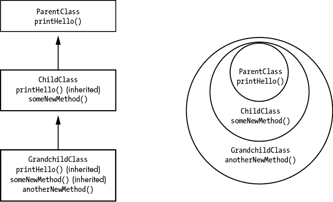
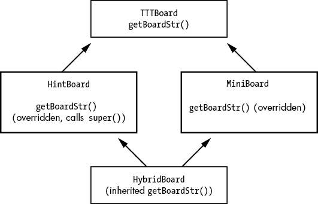

# 十六、面向对象编程和继承

> 原文：<http://inventwithpython.com/beyond/chapter16.html>

定义一个函数，并从几个地方调用它，可以省去复制和粘贴源代码的麻烦。不复制代码是一个很好的实践，因为如果你需要修改它(无论是为了修复一个错误还是添加新特性)，你只需要在一个地方修改它。没有重复的代码，程序也更短，更容易阅读。

类似于函数，*继承*是一种代码重用技术，您可以将其应用于类。这是将类置于父子关系中的行为，在这种关系中，子类继承父类方法的副本，使您不必在多个类中复制一个方法。

许多程序员认为继承被高估了，甚至是危险的，因为大量的继承类增加了程序的复杂性。以“继承是邪恶的”为标题的博客文章并非完全不着边际；继承当然容易被过度使用。但是在组织代码时，有限地使用这种技术可以节省大量时间。

## 继承是如何工作的

要创建一个新的子类，可以将现有父类的名称放在`class`语句的括号中。要练习创建子类，请打开一个新的文件编辑器窗口，并输入以下代码；保存为`inheritanceExample.py` :

```py
class ParentClass: # 1
    def printHello(self): # 2
        print('Hello, world!')

class ChildClass(ParentClass): # 3
    def someNewMethod(self):
        print('ParentClass objects don't have this method.')

class GrandchildClass(ChildClass): # 4
    def anotherNewMethod(self):
        print('Only GrandchildClass objects have this method.')

print('Create a ParentClass object and call its methods:')
parent = ParentClass()
parent.printHello()

print('Create a ChildClass object and call its methods:')
child = ChildClass()
child.printHello()
child.someNewMethod()

print('Create a GrandchildClass object and call its methods:')
grandchild = GrandchildClass()
grandchild.printHello()
grandchild.someNewMethod()
grandchild.anotherNewMethod()

print('An error:')
parent.someNewMethod()
```

运行该程序时，输出应该如下所示:

```py
Create a ParentClass object and call its methods:
Hello, world!
Create a ChildClass object and call its methods:
Hello, world!
ParentClass objects don't have this method.
Create a GrandchildClass object and call its methods:
Hello, world!
ParentClass objects don't have this method.
Only GrandchildClass objects have this method.
An error:
Traceback (most recent call last):
  File "inheritanceExample.py", line 35, in <module>
    parent.someNewMethod() # ParentClass objects don't have this method.
AttributeError: 'ParentClass' object has no attribute 'someNewMethod'
```

我们创建了三个名为`ParentClass` 1 、`ChildClass` 3 和`GrandchildClass` 4 的类。`ChildClass` *子类* `ParentClass`，意味着`ChildClass`将拥有与`ParentClass`相同的所有方法。我们说`ChildClass` *继承了`ParentClass`的*方法。另外，`GrandchildClass`继承了`ChildClass`的子类，因此它拥有与`ChildClass`及其父类`ParentClass`相同的所有方法。

使用这种技术，我们已经有效地将`printHello()`方法 2 的代码复制并粘贴到了`ChildClass`和`GrandchildClass`类中。我们对`printHello()`中代码的任何更改不仅会更新`ParentClass`，还会更新`ChildClass`和`GrandchildClass`。这与更改函数中的代码会更新其所有函数调用是一样的。你可以在图 16-1 中看到这个关系。注意，在类图中，箭头是从子类指向基类的。这反映了一个事实，即一个类总是知道它的基类，但不知道它的子类。



图 16-1：一个层次图(左)和文氏图(右)显示了三个类和它们拥有的方法之间的关系

人们常说父子类代表“是一种”关系。一个`ChildClass`对象是一个`ParentClass`对象，因为它拥有与一个`ParentClass`对象相同的所有方法，包括一些它定义的额外方法。这种关系是单向的:`ParentClass`对象不是`ChildClass`对象。如果一个`ParentClass`对象试图调用`someNewMethod()`，它只存在于`ChildClass`对象(以及`ChildClass`的子类)，Python 会抛出一个`AttributeError`。

程序员通常认为相关的类必须适应现实世界中的“是”层次结构。OOP 教程一般有`Vehicle``FourWheelVehicle▶``Car``Animal``Bird``Sparrow`，或者`Shape``Rectangle``Square`的父类、子类、孙类。但是请记住，继承的主要目的是代码重用。如果您的程序需要一个具有一组方法的类，这些方法是其他类的方法的完全超集，继承允许您避免复制和粘贴代码。

我们有时也称子类为*子类*或*派生类*，称父类为*超类*或*基类*。

### 覆盖方法

子类继承其父类的所有方法。但是子类可以通过用自己的代码提供自己的方法来覆盖继承的方法。子类的覆盖方法将与父类的方法同名。

为了说明这个概念，让我们回到上一章创建的井字棋。这一次，我们将创建一个新类`MiniBoard`，它继承了`TTTBoard`并覆盖了`getBoardStr()`，以提供一个更小的井字棋棋盘。程序会询问玩家使用哪种风格的棋盘。我们不需要复制和粘贴其余的`TTTBoard`方法，因为`MiniBoard`将继承它们。

将以下内容添加到您的`tictactoe_oop.py`文件的末尾，以创建原始`TTTBoard`类的子类，然后覆盖`getBoardStr()`方法:

```py
class MiniBoard(TTTBoard):
    def getBoardStr(self):
        """Return a tiny text-representation of the board."""
        # Change blank spaces to a '.'
        for space in ALL_SPACES:
            if self._spaces[space] == BLANK:
                self._spaces[space] = '.'

        boardStr = f'''
          {self._spaces['1']}{self._spaces['2']}{self._spaces['3']} 123
          {self._spaces['4']}{self._spaces['5']}{self._spaces['6']} 456
          {self._spaces['7']}{self._spaces['8']}{self._spaces['9']} 789'''

        # Change '.' back to blank spaces.
        for space in ALL_SPACES:
            if self._spaces[space] == '.':
                self._spaces[space] = BLANK
        return boardStr
```

与`TTTBoard`类的`getBoardStr()`方法一样，`MiniBoard`的`getBoardStr()`方法创建了一个井字棋棋盘的多行字符串，在传递给`print()`函数时显示。但是这个字符串要小得多，放弃了 X 和 O 标记之间的线，使用点号来表示空格。

更改`main()`中的行，使其实例化一个`MiniBoard`对象，而不是一个`TTTBoard`对象:

```py
 if input('Use mini board? Y/N: ').lower().startswith('y'):
        gameBoard = MiniBoard() # Create a MiniBoard object.
    else:
        gameBoard = TTTBoard() # Create a TTTBoard object.
```

除了对`main()`的这一行修改，程序的其余部分和以前一样。当您现在运行该程序时，输出将如下所示:

```py
Welcome to Tic-Tac-Toe!
Use mini board? Y/N: y

          ... 123
          ... 456
          ... 789
What is X's move? (1-9)
1

          X.. 123
          ... 456
          ... 789
What is O's move? (1-9)
`--snip--`
          XXX 123
          .OO 456
          O.X 789
X has won the game!
Thanks for playing!
```

您的程序现在可以轻松地拥有这两个井字棋棋盘类的实现。当然，如果你*只*想要迷你版的板，你可以简单地替换`TTTBoard`的`getBoardStr()`方法中的代码。但是如果你需要*和*，继承可以让你通过重用它们的公共代码轻松地创建两个类。

如果我们不使用继承，我们可以给`TTTBoard`添加一个名为`useMiniBoard`的新属性，并在`getBoardStr()`中放置一个`if-else`语句来决定何时显示常规面板或迷你面板。对于这样一个简单的改变，这将很好地工作。但是如果`MiniBoard`子类需要覆盖 2、3 甚至 100 个方法呢？如果我们想创建几个不同的`TTTBoard`子类会怎么样？不使用继承会导致我们的方法中的`if-else`语句爆炸，并大大增加代码的复杂性。通过使用子类和覆盖方法，我们可以更好地将代码组织成单独的类，以处理这些不同的用例。

### `super()`函数

子类的覆盖方法通常类似于父类的方法。尽管继承是一种代码重用技术，但覆盖方法可能会导致您覆盖父类方法中的相同代码，作为子类方法的一部分。为了防止这种重复代码，内置的`super()`函数允许一个覆盖方法调用父类中的原始方法。

例如，让我们创建一个名为`HintBoard`的新类，它是`TTTBoard`的子类。新的类覆盖了`getBoardStr()`，所以在画了井字棋棋盘之后，它还添加了一个提示，如果 X 或 O 能在他们的下一步棋中获胜。这意味着`HintBoard`类的`getBoardStr()`方法必须做所有与`TTTBoard`类的`getBoardStr()`方法绘制井字棋棋盘相同的任务。我们可以使用`super()`从`HintBoard`类的`getBoardStr()`方法中调用`TTTBoard`类的`getBoardStr()`方法，而不是重复代码来完成这项工作。将以下内容添加到您的`tictactoe_oop.py`文件的末尾:

```py
class HintBoard(TTTBoard):
    def getBoardStr(self):
        """Return a text-representation of the board with hints."""
        boardStr = super().getBoardStr() # Call getBoardStr() in TTTBoard. # 1

        xCanWin = False
        oCanWin = False
        originalSpaces = self._spaces # Backup _spaces. # 2
        for space in ALL_SPACES: # Check each space:
            # Simulate X moving on this space:
            self._spaces = copy.copy(originalSpaces)
            if self._spaces[space] == BLANK:
                self._spaces[space] = X
            if self.isWinner(X):
                xCanWin = True
            # Simulate O moving on this space:
            self._spaces = copy.copy(originalSpaces) # 3
            if self._spaces[space] == BLANK:
                self._spaces[space] = O
            if self.isWinner(O):
                oCanWin = True
        if xCanWin:
            boardStr += '\nX can win in one more move.'
        if oCanWin:
            boardStr += '\nO can win in one more move.'
        self._spaces = originalSpaces
        return boardStr
```

首先，`super().getBoardStr()` 1 运行父`TTTBoard`类的`getBoardStr()`内部的代码，返回井字棋盘的字符串。我们暂时将这个字符串保存在一个名为`boardStr`的变量中。使用通过重用`TTTBoard`类的`getBoardStr()`创建的棋盘字符串，该方法中的其余代码处理提示的生成。然后，`getBoardStr()`方法将`xCanWin`和`oCanWin`变量设置为`False`，并将`self._spaces`字典备份为`originalSpaces`变量 2 。然后一个`for`循环在从`'1'`到`'9'`的所有棋盘空间上循环。在循环内部，`self._spaces`属性被设置为一个`originalSpaces`字典的副本，如果正在循环的当前空格为空，则在那里放置一个 X。这模拟了 X 在这个空白空间上的下一步移动。对`self.isWinner()`的调用将确定这是否是一个赢棋，如果是，则将`xCanWin`设置为`True`。然后对 O 重复这些步骤，看看 O 是否能在这个空间上移动 3 获胜。这个方法使用`copy`模块来复制`self._spaces`中的字典，所以在`tictactoe.py`的顶部添加下面一行:

```py
import copy
```

接下来，更改`main()`中的行，使其实例化一个`HintBoard`对象，而不是一个`TTTBoard`对象:

```py
 gameBoard = HintBoard() # Create a TTT board object.
```

除了对`main()`的这一行修改之外，程序的其余部分和以前完全一样。当您现在运行该程序时，输出将如下所示:

```py
Welcome to Tic-Tac-Toe!
`--snip--`
      X| |   1 2 3
      -+-+-
       | |O  4 5 6
      -+-+-
       | |X  7 8 9
X can win in one more move.
What is O's move? (1-9)
5

      X| |   1 2 3
      -+-+-
       |O|O  4 5 6
      -+-+-
       | |X  7 8 9
O can win in one more move.
`--snip--`
The game is a tie!
Thanks for playing!
```

在该方法结束时，如果`xCanWin`或`oCanWin`是`True`，一个附加的声明消息被添加到`boardStr`字符串中。最后，`boardStr`又回来了。

不是每个被覆盖的方法都需要使用`super()`！如果一个类的覆盖方法做的事情与父类中被覆盖的方法完全不同，就没有必要使用`super()`调用被覆盖的方法。当一个类有不止一个父方法时,`super()`函数特别有用，这将在本章后面的“多重继承”中解释。

### 首选组合而非继承

继承对于代码重用来说是一项伟大的技术，您可能希望在所有的类中立即开始使用它。但是您可能不总是希望基类和子类如此紧密地耦合。创建多层次的继承不会给你的代码增加组织性，反而会增加官僚主义。

虽然您可以对具有“是”关系的类使用继承(换句话说，当子类是一种父类时)，但是对具有“有”关系的类使用一种称为*组合*的技术通常是有利的。组合是一种类设计技术，它将对象包含在类中，而不是继承那些对象的类。这就是我们在给类添加属性时所做的事情。当使用继承设计你的类时，支持组合而不是继承。这就是我们在本章和上一章的所有例子中所做的，如下表所述:

*   一个对象“有”一定数量的大帆船、镰刀和克努特硬币。
*   一个对象“有”一组九个空格。
*   一个`MiniBoard`对象是一个`TTTBoard`对象，所以它也“有”一组九个空格。
*   一个`HintBoard`对象是一个`TTTBoard`对象，所以它也“有”一组九个空格。

让我们回到上一章的`WizCoin`课。如果我们创建一个新的`WizardCustomer`类来代表巫师世界中的顾客，这些顾客将携带一定数量的钱，我们可以通过`WizCoin`类来表示这些钱。但是这两个阶级之间没有“是一”的关系；一个`WizardCustomer`对象不是一种`WizCoin`对象。如果我们使用继承，可能会产生一些笨拙的代码:

```py
import wizcoin

class WizardCustomer(wizcoin.WizCoin): # 1
    def __init__(self, name):
        self.name = name
        super().__init__(0, 0, 0)

wizard = WizardCustomer('Alice')
print(f'{wizard.name} has {wizard.value()} knuts worth of money.')
print(f'{wizard.name}\'s coins weigh {wizard.weightInGrams()} grams.')
```

在这个例子中，`WizardCustomer`继承了一个`WizCoin` 1 对象的方法，比如`value()`和`weightInGrams()`。从技术上来说，继承自`WizCoin`的`WizardCustomer`可以完成与包含`WizCoin`对象作为属性的`WizardCustomer`相同的任务。但是`wizard.value()`和`wizard.weightInGrams()`方法的名字有误导性:它们似乎会返回巫师的价值和重量，而不是巫师硬币的价值和重量。此外，如果我们后来想为向导的权重添加一个`weightInGrams()`方法，那么这个方法名已经被占用了。

最好有一个`WizCoin`对象作为属性，因为一个巫师顾客“有”一定数量的巫师硬币:

```py
import wizcoin

class WizardCustomer:
    def __init__(self, name):
        self.name = name
        self.purse = wizcoin.WizCoin(0, 0, 0) # 1

wizard = WizardCustomer('Alice')
print(f'{wizard.name} has {wizard.purse.value()} knuts worth of money.')
print(f'{wizard.name}\'s coins weigh {wizard.purse.weightInGrams()} grams.')
```

我们没有让`WizardCustomer`类从`WizCoin`继承方法，而是给了`WizardCustomer`类一个`purse`属性 1 ，其中包含一个`WizCoin`对象。当使用组合时，对`WizCoin`类方法的任何改变都不会改变`WizardCustomer`类的方法。这种技术为两个类的未来设计变更提供了更大的灵活性，并使代码更易于维护。

### 继承的缺点

继承的主要缺点是，将来您对父类所做的任何更改必然会被它的所有子类继承。在大多数情况下，这种紧密耦合正是您想要的。但是在某些情况下，您的代码需求不太适合您的继承模型。

例如，假设我们在一个车辆模拟程序中有`Car`、`Motorcycle`和`LunarRover`类。他们都需要类似的方法，比如`startIgnition()`和`changeTire()`。我们可以创建一个父类`Vehicle`，并让`Car`、`Motorcycle`和`LunarRover`继承它，而不是将这些代码复制并粘贴到每个类中。现在，如果我们需要修复一个 bug，比如说,`changeTire()`方法，我们只需要在一个地方进行修改。如果我们有几十个继承自`Vehicle`的不同的车辆相关类，这尤其有用。这些类的代码如下所示:

```py
class Vehicle:
    def __init__(self):
        print('Vehicle created.')
    def startIgnition(self):
        pass  # Ignition starting code goes here.
    def changeTire(self):
        pass  # Tire changing code goes here.

class Car(Vehicle):
    def __init__(self):
        print('Car created.')

class Motorcycle(Vehicle):
    def __init__(self):
        print('Motorcycle created.')

class LunarRover(Vehicle):
    def __init__(self):
        print('LunarRover created.')
```

但是将来对`Vehicle`的所有更改也会影响这些子类。如果我们需要一个`changeSparkPlug()`方法会怎么样？汽车和摩托车有带火花塞的内燃机，但月球车没有。通过支持组合胜过继承，我们可以创建单独的`CombustionEngine`和`ElectricEngine`类。然后我们设计了`Vehicle`类，这样它就“有一个”`engine attribute, either a `CombustionEngine`或`ElectricEngine`对象，使用适当的方法:`

 ```py
class CombustionEngine:
    def __init__(self):
        print('Combustion engine created.')
    def changeSparkPlug(self):
        pass  # Spark plug changing code goes here.

class ElectricEngine:
    def __init__(self):
        print('Electric engine created.')

class Vehicle:
    def __init__(self):
        print('Vehicle created.')
        self.engine = CombustionEngine()  # Use this engine by default.
`--snip--`

class LunarRover(Vehicle):
    def __init__(self):
        print('LunarRover created.')
        self.engine = ElectricEngine()
```

这可能需要重写大量的代码，特别是如果你有几个继承自先前存在的`Vehicle`类的类:对于`Vehicle`类或其子类的每个对象，所有的`vehicleObj.changeSparkPlug()`调用都需要变成`vehicleObj.engine.changeSparkPlug()`。因为如此大的变化可能会引入错误，所以您可能希望简单地让`LunarVehicle`的`changeSparkPlug()`方法什么都不做。在这种情况下，Python 风格的方法是在`LunarVehicle`类内将`changeSparkPlug`设置为`None`:

```py
class LunarRover(Vehicle):
    changeSparkPlug = None
    def __init__(self):
        print('LunarRover created.')
```

`changeSparkPlug = None`行遵循本章后面的“类属性”中描述的语法。这覆盖了从`Vehicle`继承的`changeSparkPlug()`方法，所以用`LunarRover`对象调用它会导致错误:

```py
>>> myVehicle = LunarRover()
LunarRover created.
>>> myVehicle.changeSparkPlug()
Traceback (most recent call last):
  File "<stdin>", line 1, in <module>
TypeError: 'NoneType' object is not callable
```

如果我们试图用一个`LunarRover`对象调用这个不合适的方法，这个错误允许我们快速失败并立即发现问题。任何`LunarRover`的子类也为`changeSparkPlug()`继承这个`None`值。`TypeError: 'NoneType' object is not callable`错误信息告诉我们`LunarRover`类的程序员有意将`changeSparkPlug()`方法设置为`None`。如果一开始就没有这样的方法，我们就会收到一条`NameError: name 'changeSparkPlug' is not defined`错误消息。

继承可以创造出复杂矛盾的阶级。用作文来代替通常是有利的。

## `isinstance()`和`issubclass()`函数

当我们需要知道一个对象的类型时，我们可以将该对象传递给内置的`type()`函数，如前一章所述。但是如果我们正在做一个对象的类型检查，使用更灵活的内置函数`isinstance()`是一个更好的主意。如果对象属于给定类*或给定类*的子类，则`isinstance()`函数将返回`True`。在交互式 Shell 中输入以下内容:

```py
>>> class ParentClass:
...    pass
...
>>> class ChildClass(ParentClass):
...    pass
...
>>> parent = ParentClass() # Create a ParentClass object.
>>> child = ChildClass() # Create a ChildClass object.
>>> isinstance(parent, ParentClass)
True
>>> isinstance(parent, ChildClass)
False
>>> isinstance(child, ChildClass) # 1
True
>>> isinstance(child, ParentClass) # 2
True
```

注意，`isinstance()`表示`child`中的`ChildClass`对象是`ChildClass` 1 的实例，也是`ParentClass` 2 的实例。这是有意义的，因为一个`ChildClass`对象是一种`ParentClass`对象。

您还可以传递一个类对象元组作为第二个参数，以查看第一个参数是否是元组中的任何一个类:

```py
>>> isinstance(42, (int, str, bool)) # True if 42 is an int, str, or bool.
True
```

不太常用的`issubclass()`内置函数可以识别为第一个参数传递的类对象是否是为第二个参数传递的类对象的子类(或同一个类):

```py
>>> issubclass(ChildClass, ParentClass) # ChildClass subclasses ParentClass.
True
>>> issubclass(ChildClass, str) # ChildClass doesn't subclass str.
False
>>> issubclass(ChildClass, ChildClass) # ChildClass is ChildClass.
True
```

就像使用`isinstance()`一样，您可以将一个类对象元组作为第二个参数传递给`issubclass()`，以查看第一个参数是否是元组中任何类的子类。`isinstance()`和`issubclass()`的关键区别在于`issubclass()`被传递了两个类对象，而`isinstance()`被传递了一个对象和一个类对象。

## 类方法

*类方法*与类相关联，而不是像常规方法那样与单个对象相关联。当您看到两个标记时，您可以在代码中识别出一个类方法:方法的`def`语句前的`@classmethod`装饰器和使用`cls`作为第一个参数，如下例所示。

```py
class ExampleClass:
    def exampleRegularMethod(self):
        print('This is a regular method.')

    @classmethod
    def exampleClassMethod(cls):
        print('This is a class method.')

# Call the class method without instantiating an object:
ExampleClass.exampleClassMethod()

obj = ExampleClass()
# Given the above line, these two lines are equivalent:
obj.exampleClassMethod()
obj.__class__.exampleClassMethod()
```

除了`self`引用一个对象，而`cls`引用一个对象的类之外，`cls`参数的行为类似于`self`。这意味着类方法中的代码不能访问单个对象的属性或调用对象的常规方法。类方法只能调用其他类方法或访问类属性。我们使用名称`cls`是因为`class`是一个 Python 关键字，就像其他关键字一样，比如`if`、`while`或`import`，我们不能将其用于参数名称。我们经常通过类对象调用类属性，如在`ExampleClass.exampleClassMethod()`中。但是我们也可以通过类的任何对象调用它们，就像在`obj.exampleClassMethod()`中一样。

类方法并不常用。最常见的用例是提供除了`__init__()`之外的可选构造方法。例如，如果构造函数既可以接受新对象需要的数据字符串，也可以接受包含新对象需要的数据的文件名字符串，会怎么样呢？我们不希望`__init__()`方法的参数列表冗长而混乱。相反，让我们使用类方法来返回一个新的对象。

例如，让我们创建一个`AsciiArt`类。正如你在第 14 章看到的，ASCII 艺术画使用文本字符来形成图像。

 ```py
class AsciiArt:
    def __init__(self, characters):
        self._characters = characters

    @classmethod
    def fromFile(cls, filename):
        with open(filename) as fileObj:
            characters = fileObj.read()
            return cls(characters)

    def display(self):
        print(self._characters)

    # Other AsciiArt methods would go here...

face1 = AsciiArt(' _______\n' +
                 '|  . .  |\n' +
                 '| \\___/ |\n' +
                 '|_______|')
face1.display()

face2 = AsciiArt.fromFile('face.txt')
face2.display()
```

`AsciiArt`类有一个`__init__()`方法，可以将图像的文本字符作为字符串传递给它。它还有一个`fromFile()`类方法，可以传递包含 ASCII 艺术画的文本文件的文件名字符串。这两个方法都创建了`AsciiArt`对象。

当您运行这个程序，并且有一个包含 ASCII 艺术画图面的`face.txt`文件时，输出将看起来像这样:

```py
 _______
|  . .  |
| \___/ |
|_______|
 _______
|  . .  |
| \___/ |
|_______|
```

与让`__init__()`做所有事情相比，`fromFile()`类方法让你的代码更容易阅读。

类方法的另一个好处是，`AsciiArt`的子类可以继承它的`fromFile()`方法(并在必要时覆盖它)。这就是为什么我们在`AsciiArt`类的`fromFile()`方法中称`cls`为`(characters)`而不是`AsciiArt(characters)`。`cls()`调用也可以在`AsciiArt`的子类中工作，无需修改，因为`AsciiArt`类没有被硬编码到方法中。但是一个`AsciiArt()`调用总是调用`AsciiArt`类的`__init__()`而不是子类的`__init__()`。您可以将`cls`理解为“表示这个类的对象”

请记住，正如常规方法应该总是在代码中的某个地方使用它们的`self`参数一样，类方法应该总是使用它的`cls`参数。如果你的类方法的代码*从不*使用`cls`参数，这表明你的类方法可能只是一个函数。

## 类属性

类属性是属于类而不是对象的变量。我们在类内部但在所有方法外部创建类属性，就像我们在`.py`文件中而在所有函数之外创建全局变量一样。下面是一个名为`count`的类属性的例子，它跟踪已经创建了多少个`CreateCounter`对象:

```py
class CreateCounter:
    count = 0 # This is a class attribute.

    def __init__(self):
        CreateCounter.count += 1

print('Objects created:', CreateCounter.count)  # Prints 0.
a = CreateCounter()
b = CreateCounter()
c = CreateCounter()
print('Objects created:', CreateCounter.count)  # Prints 3.
```

`CreateCounter`类有一个名为`count`的类属性。所有的`CreateCounter`对象共享这个属性，而不是有它们自己单独的`count`属性。这就是为什么构造函数中的`CreateCounter.count += 1`行可以记录每个被创建的`CreateCounter`对象。当您运行该程序时，输出将如下所示:

```py
Objects created: 0
Objects created: 3
```

我们很少使用类属性。甚至这个“计算已经创建了多少个`CreateCounter`对象”的例子也可以通过使用一个全局变量而不是一个类属性来更简单地完成。

## 静态方法

一个*静态方法*没有一个`self`或`cls`参数。静态方法实际上只是函数，因为它们不能访问类或其对象的属性或方法。在 Python 中，很少需要使用静态方法。如果您决定使用一个函数，那么您应该考虑创建一个常规函数。

我们通过在静态方法的`def`语句之前放置`@staticmethod`装饰器来定义静态方法。下面是一个静态方法的例子。

 ```py
class ExampleClassWithStaticMethod:
    @staticmethod
    def sayHello():
        print('Hello!')

# Note that no object is created, the class name precedes sayHello():
ExampleClassWithStaticMethod.sayHello()
```

在`ExampleClassWithStaticMethod`类中的`sayHello()`静态方法和`sayHello()`函数之间几乎没有区别。事实上，您可能更喜欢使用函数，因为您可以调用它而不必事先输入类名。

静态方法在没有 Python 灵活语言特性的其他语言中更常见。Python 包含的静态方法模仿了其他语言的特性，但没有提供多少实用价值。

## 何时使用面向对象的类和静态特性

你很少需要类方法、类属性和静态方法。它们也容易被过度使用。如果你在想，“为什么我不能用一个函数或者全局变量来代替？”这暗示您可能不需要使用类方法、类属性或静态方法。这本中级水平的书介绍它们的唯一原因是，当你在代码中遇到它们时，你可以认出它们，但是我不鼓励你使用它们。如果您正在创建自己的框架，其中包含一系列精心设计的类，而这些类又会被使用该框架的程序员子类化，那么它们会非常有用。但是当您编写简单的 Python 应用时，您很可能不需要它们。

关于这些特性以及为什么你需要或不需要它们的更多讨论，请阅读 Phillip J. Eby 在[`dirtsimple.org/2004/12/python-is-not-java.html`](https://dirtsimple.org/2004/12/python-is-not-java.html)发表的文章“Python 不是 Java”以及 Ryan Tomayko 在[`tomayko.com/blog/2004/the-static-method-thing`](https://tomayko.com/blog/2004/the-static-method-thing)发表的文章“静态方法”。

## 面向对象的流行语

对 OOP 的解释通常以大量术语开始，如继承、封装和多态。知道这些术语的重要性被高估了，但你至少应该对它们有一个基本的了解。我已经介绍了继承，所以我将在这里描述其他概念。

### 封装

*封装*这个词有两个常见但相关的定义。第一个定义是封装是将相关的数据和代码捆绑成一个单元。封装意味着将*装箱*。这基本上就是类所做的:它们组合相关的属性和方法。例如，我们的`WizCoin`类将三个整数`knuts`、`sickles`和`galleons`封装成一个单独的`WizCoin`对象。

第二个定义是封装是一种*信息隐藏*技术，它让对象隐藏关于对象如何工作的复杂实现细节。你可以在 282 页的“私有属性和私有方法”中看到这一点，其中`BankAccount`对象提供了`deposit()`和`withdraw()`方法来隐藏它们的`_balance`属性如何被处理的细节。函数服务于类似的*黑盒*目的:`math.sqrt()`函数如何计算一个数的平方根是隐藏的。你只需要知道函数返回你传递给它的数字的平方根。

### 多态

*多态*允许一种类型的对象被视为另一种类型的对象。例如，`len()`函数返回传递给它的参数的长度。您可以将一个字符串传递给`len()`来查看它有多少个字符，但是您也可以将一个列表或字典传递给`len()`来查看它分别有多少个条目或键值对。这种形式的多态被称为*通用函数*或*参数多态*，因为它可以处理许多不同类型的对象。

多态也指*特别多态*或*操作符重载*，其中操作符(如`+`或`*`)可以根据它们操作的对象类型有不同的行为。例如，`+`操作符在处理两个整数值或浮点值时做数学加法，但在处理两个字符串时做字符串连接。运算符重载将在第 17 章中介绍。

## 何时不使用继承

使用继承很容易过度工程化你的类。正如卢西亚诺·拉马尔霍所说，“将物品整齐有序地摆放能激发我们的秩序感；程序员这么做只是为了好玩。”当一个类或者一个模块中的几个函数可以达到同样的效果时，我们将创建类、子类和子类。但是回想一下第 6 章中的 Python 信条:简单比复杂好。

使用 OOP 允许你将你的代码组织成更小的单元(在这里是类)，比一个大的`py`文件，包含数百个没有特定顺序定义的函数更容易推理。如果有几个函数都在同一个字典或列表数据结构上操作，继承就很有用。在这种情况下，将它们组织成一个类是有益的。

但是这里有一些不需要创建类或使用继承的例子:

*   如果你的类由从不使用`self`或`cls`参数的方法组成，删除类并使用函数代替方法。
*   如果你已经创建了一个只有一个子类的父类，但从未创建父类的对象，你可以将它们合并成一个类。
*   如果你创建了三或四层以上的子类，你可能会不必要地使用继承。将这些子类合并成更少的类。

正如上一章井字棋程序的非面向对象和面向对象版本所展示的那样，当然有可能不使用类而仍然有一个工作的、无错误的程序。不要觉得你必须把你的程序设计成一些复杂的类网络。有效的简单解决方案比无效的复杂解决方案要好。乔尔·斯波尔斯基在他的博客文章“不要让宇航员建筑师吓到你”中写道。

您应该知道像继承这样的面向对象概念是如何工作的，因为它们可以帮助您组织代码，并使开发和调试更容易。由于 Python 的灵活性，这种语言不仅提供了 OOP 特性，而且当它们不适合你的程序需求时，也不要求你使用它们。

## 多重继承

许多编程语言将类限制为最多一个父类。Python 通过提供一个名为*多重继承*的特性来支持多个父类。例如，我们可以有一个带有`flyInTheAir()`方法的`Airplane`类和一个带有`floatOnWater()`方法的`Ship`类。然后我们可以创建一个继承自`Airplane`和`Ship`的`FlyingBoat`类，方法是在`class`语句中列出两者，用逗号分隔。打开一个新的文件编辑器窗口，将以下内容另存为`flyingboat.py` :

```py
class Airplane:
    def flyInTheAir(self):
        print('Flying...')

class Ship:
    def floatOnWater(self):
        print('Floating...')

class FlyingBoat(Airplane, Ship):
    pass
```

我们创建的`FlyingBoat`对象将继承`flyInTheAir()`和`floatOnWater()`方法，正如您在交互式 Shell 中看到的:

```py
>>> from flyingboat import *
>>> seaDuck = FlyingBoat()
>>> seaDuck.flyInTheAir()
Flying...
>>> seaDuck.floatOnWater()
Floating...
```

只要父类的方法名不同且不重叠，多重继承就很简单。这些种类的类被称为*混合*。(这只是对一类的统称；Python 没有`mixin`关键字。)但是当我们从多个共享方法名的复杂类继承时会发生什么呢？

例如，考虑本章前面的`MiniBoard`和`HintTTTBoard`井字棋棋盘类。如果我们想要一个显示微型井字棋棋盘并提供提示的类呢？通过多重继承，我们可以重用这些现有的类。将以下内容添加到您的`tictactoe_oop.py`文件的末尾，但在调用`main()`函数的`if`语句之前:

```py
class HybridBoard(HintBoard, MiniBoard):
    pass
```

这个班什么都没有。它通过继承`HintBoard`和`MiniBoard`来重用代码。接下来，更改`main()`函数中的代码，使其创建一个`HybridBoard`对象:

```py
gameBoard = HybridBoard() # Create a TTT board object.
```

两个父类`MiniBoard`和`HintBoard`都有一个名为`getBoardStr()`的方法，那么`HybridBoard`继承哪个呢？当您运行这个程序时，输出会显示一个微型的井字棋棋盘，但也会提供提示:

```py
`--snip--`
          X.. 123
          .O. 456
          X.. 789
X can win in one more move.
```

Python 似乎神奇地合并了`MiniBoard`类的`getBoardStr()`方法和`HintBoard`类的`getBoardStr()`方法来实现这两者！但这是因为我已经编写了它们来相互协作。事实上，如果你在`HybridBoard`类的`class`语句中改变类的顺序，看起来就像这样:

```py
`class HybridBoard(MiniBoard, HintBoard):` 
```

你完全失去了暗示:

```py
`--snip--`
          X.. 123
          .O. 456
          X.. 789
```

要理解为什么会这样，你需要理解 Python 的*方法解析顺序* ( *MRO* )以及`super()`函数实际上是如何工作的。

## 方法解析顺序

我们的井字棋程序现在有四个类来代表棋盘，三个用定义的`getBoardStr()`方法，一个用继承的`getBoardStr()`方法，如图图 16-2 所示。



图 16-2：我们井字棋程序中的四个类

当我们在一个`HybridBoard`对象上调用`getBoardStr()`时，Python 知道`HybridBoard`类没有这个名称的方法，所以它检查它的父类。但是该类有两个父类，它们都有一个`getBoardStr()`方法。哪个会被叫到？

您可以通过检查`HybridBoard`类的 MRO 来找到答案，这是 Python 在继承方法或方法调用`super()`函数时检查的类的有序列表。通过在交互式 Shell 中调用`HybridBoard`类的`mro()`方法，可以看到该类的 MRO:

```py
>>> from tictactoe_oop import *
>>> HybridBoard.mro()
[<class 'tictactoe_oop.HybridBoard'>, <class 'tictactoe_oop.HintBoard'>, <class 'tictactoe_oop.MiniBoard'>, <class 'tictactoe_oop.TTTBoard'>, <class 'object'>]
```

从这个返回值可以看出，当在`HybridBoard`上调用一个方法时，Python 首先在`HybridBoard`类中检查它。如果不存在，Python 检查`HintBoard`类，然后是`MiniBoard`类，最后是`TTTBoard`类。在每个 MRO 列表的末尾是内置的`object`类，它是 Python 中所有类的父类。

对于单一继承，确定 MRO 很容易:只需创建一个父类链。对于多重继承，就比较棘手了。Python 的 MRO 遵循 C3 算法，其细节超出了本书的范围。但是您可以通过记住两条规则来确定 MRO:

*   Python 在检查父类之前检查子类。
*   Python 检查在`class`语句中从左到右列出的继承类。

如果我们在一个`HybridBoard`对象上调用`getBoardStr()`，Python 首先检查`HybridBoard`类。然后，因为类的双亲从左到右是`HintBoard`和`MiniBoard`，Python 检查`HintBoard`。这个父类有一个`getBoardStr()`方法，所以`HybridBoard`继承并调用它。

但这并没有结束:接下来，这个方法调用`super().getBoardStr()`。`super`是 Python 的`super()`函数的一个有点误导的名字，因为它不返回父类，而是返回 MRO 中的下一个类。这意味着当我们在一个`HybridBoard`对象上调用`getBoardStr()`时，它的 MRO 中的下一个类，在`HintBoard`之后，是`MiniBoard`，而不是父类`TTTBoard`。所以对`super().getBoardStr()`的调用调用了`MiniBoard`类的`getBoardStr()`方法，该方法返回微型井字牌字符串。这个`super()`调用之后的`HintBoard`类的`getBoardStr()`中的剩余代码将提示文本附加到这个字符串中。

如果我们改变`HybridBoard`类的`class`语句，使其首先列出`MiniBoard`，其次列出`HintBoard`，其 MRO 将把`MiniBoard`放在`HintBoard`之前。这意味着`HybridBoard`从`MiniBoard`继承`getBoardStr()`，而`MiniBoard`没有对`super()`的调用。这种排序导致了微型井字棋棋盘显示无提示的错误:没有`super()`调用，`MiniBoard`类的`getBoardStr()`方法永远不会调用`HintBoard`类的`getBoardStr()`方法。

多重继承允许你用少量的代码创建大量的功能，但是容易导致过度工程化，难以理解的代码。支持单一继承、混合类或无继承。这些技术通常能够更好地完成程序的任务。

## 总结

继承是一种代码重用技术。它允许您创建继承其父类方法的子类。您可以覆盖这些方法来为它们提供新的代码，但是也可以使用`super()`函数来调用父类中的原始方法。子类与其父类具有“是”关系，因为子类的对象是父类的一种对象。

在 Python 中，使用类和继承是可选的。一些程序员认为大量使用继承带来的复杂性不值得。使用组合而不是继承通常更灵活，因为它实现了与一个类的对象和其他类的对象的“有”关系，而不是直接从那些其他类继承方法。这意味着一个类的对象可以拥有另一个类的对象。例如，`Customer`对象可能有一个被分配给`Date`对象的`birthdate`属性，而不是被分配给`Customer`类的子类`Date`。

正如`type()`可以返回传递给它的对象的类型一样，`isinstance()`和`issubclass()`函数返回传递给它们的对象的类型和继承信息。

类可以有对象方法和属性，但也可以有类方法、类属性和静态方法。虽然这些很少使用，但是它们可以支持全局变量和函数所不能提供的其他面向对象的技术。

Python 允许类从多个父类继承，尽管这可能导致代码难以理解。`super()`函数和一个类的方法决定了如何基于 MRO 继承方法。您可以通过调用类的`mro()`方法在交互式 Shell 中查看类的 MRO。

本章和上一章涵盖了一般的 OOP 概念。在下一章，我们将探索 Python 特有的 OOP 技术。`