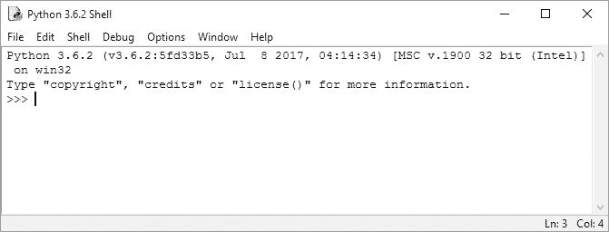

# 介绍

> 原文：<https://inventwithpython.com/cracking/chapter0.html>

*“我是无意中听到的，可能是因为我在偷听。”
—匿名*


如果你可以带着这本书回到 20 世纪 90 年代初，把第 23 章实现 RSA 密码的内容出口到美国以外是非法的。因为用 RSA 加密的信息不可能被黑客攻击，像 RSA 这样的加密软件的出口被认为是国家安全问题，需要国务院的批准。事实上，强密码术与坦克、导弹和火焰喷射器处于同一管控水平。

1990 年，加州大学伯克利分校的学生丹尼尔·j·伯恩斯坦(Daniel J. Bernstein)想发表一篇学术论文，介绍他的 Snuffle 加密系统的源代码。美国政府通知他，他需要成为一个有执照的军火商，然后才能在互联网上发布他的源代码。政府还告诉他，如果他申请出口许可证，它将拒绝他，因为他的技术非常保密。

电子前沿基金会，一个年轻的数字公民自由组织，代表伯恩斯坦起诉美国政府。法院有史以来第一次裁定，编写的软件代码受第一修正案的保护，与加密相关的出口控制法，侵犯了伯恩斯坦在第一修正案中的权利。

现在，强大的加密技术是全球经济的基础，保护着拥有每天数百万互联网购物者使用的电子商务网站和企业。情报机构关于加密软件将成为严重威胁国家安全的预测是没有根据的。

但是就在 20 世纪 90 年代，自由传播这些知识(就像这本书所做的那样)会让你因军火武器走私罪而入狱。想要更详细地了解争取加密自由的法律斗争历史，请阅读史蒂文·利维的书《Crypto: How the Code Rebels Beat the Government, Saving Privacy in the Digital Age》(Penguin出版社，2001 年)。

### 谁应该读这本书？

许多书教初学者如何用密码写秘密信息。也有一些书教初学者如何破解密码。但是没有书教初学者如何给计算机编程来破解密码。这本书填补了这一空白。

这本书是为那些对加密、黑客或密码学感兴趣的人准备的。这本书里的密码(除了[第 23 章](#calibre_link-53)和[第 24 章](#calibre_link-54)里的公钥密码)都是几个世纪前的，但是任何笔记本电脑都有破解它们的计算能力。没有现代组织或个人在继续使用这些密码，但通过学习它们，您将了解密码学的基础，以及黑客如何破解脆弱的加密。

**注**

你在本书中学到密码的过程将很有趣，但它们并不提供真正的安全性。不要使用本书中的任何加密程序来保护你的实际文件。一般来说，你不应该相信你创造的密码。真实世界的密码在投入使用之前，要经过专业密码学家多年的分析。

这本书也是给以前没有编程基础的人看的。它使用 Python 编程语言教授基本的编程概念，这是初学者最好入手的语言之一。它有一个温和的学习曲线，所有年龄的新手都可以掌握，但它也是专业软件开发人员使用的一种强大的语言。Python 可以运行在 Windows，macOS，Linux，甚至 Raspberry Pi 上，并且可以免费下载和使用。(参见[第 xxv](#calibre_link-55) 页的[下载并安装 Python](#calibre_link-55) )获取说明。)

在本书中，我将经常使用术语“黑客”。这个词有两种定义。黑客可以是这样一个人，他研究一个系统(例如一个密码的规则或一个软件)以便很好地理解它，以至于他们不受该系统原始规则的限制，并且可以以创造性的方式修改它。黑客也可以是闯入计算机系统、侵犯他人隐私并造成损害的罪犯。这本书在第一种意义上使用这个术语。黑客很酷。罪犯只是那些认为他们通过破坏东西来变聪明的人。

### 这本书里有什么？

前几章介绍了基本的 Python 和密码学概念。随后，剩下章节通常在解释密码程序和解释破解该密码的程序之间交替。每章还包括练习题，以帮助您复习所学内容。

*   **[第一章:制作纸质加密工具](#calibre_link-56)** 涵盖了一些简单的纸质工具，展示了在计算机出现之前加密是如何完成的。

*   **[第二章:交互 shell 中的编程](#calibre_link-11)** 讲解了如何使用 Python 的交互 Shell 一行一行地执行代码。

*   **[第三章:字符串和编写程序](#calibre_link-18)** 涵盖了编写完整的程序，并介绍了本书所有程序中使用的字符串数据类型。

*   **[第四章:反向密码](#calibre_link-57)** 解释了如何为你的第一个密码编写一个简单的程序。

*   **[第五章:凯撒密码](#calibre_link-2)** 涵盖了一个几千年前首次发明的基本密码。

*   **[第六章:用蛮力破解凯撒密码](#calibre_link-20)** 解释了蛮力破解技术，以及如何使用它在没有加密密钥的情况下解密消息。

*   **[第七章:用换位密码加密](#calibre_link-3)** 介绍换位密码和用它加密信息的程序。

*   **[第八章:用换位密码解密](#calibre_link-26)** 涵盖了换位密码的后半部分:能够用密钥解密消息。

*   **[第九章:编写一个程序来测试你的程序](#calibre_link-25)** 介绍了用其它程序测试自己代码的编程技巧。

*   **[第十章:加密和解密文件](#calibre_link-58)** 解释了如何编写从硬盘读取文件和向硬盘写入文件的程序。

*   **[第十一章:程序化检测英语](#calibre_link-28)** 描述了如何让计算机检测英语句子。

*   **[第十二章:破解换位密码](#calibre_link-37)** 结合前几章的概念，破解换位密码。

*   **[第十三章:仿射密码的模运算模块](#calibre_link-59)** 解释了仿射密码背后的数学概念。

*   **[第十四章:仿射密码编程](#calibre_link-60)** 涵盖了编写一个仿射密码加密程序。

*   **[第十五章:破解仿射密码](#calibre_link-61)** 讲解如何写程序破解仿射密码。

*   **[第十六章:编写简单的替代密码](#calibre_link-62)** 涵盖了编写一个简单的替代密码加密程序。

*   **[第十七章:破解简单替代密码](#calibre_link-63)** 讲解如何编写程序破解简单替代密码。

*   **[第 18 章:编程维吉尼亚密码](#calibre_link-31)** 解释了一个维吉尼亚密码的程序，一个更复杂的替代密码。

*   **[第十九章:频率分析](#calibre_link-42)** 探讨英语单词的结构，以及如何用它来破解维吉尼亚密码。

*   **[第二十章:破解维吉尼亚密码](#calibre_link-64)** 讲述了一个破解维吉尼亚密码的程序。

*   **[第 21 章:一次性密码本](#calibre_link-50)** 解释了一次性密码本以及为什么它在数学上不可能被破解。

*   **[第二十二章:寻找并生成质数](#calibre_link-65)** 讲述了如何编写一个快速判断一个数是否为质数的程序。

*   **[第 23 章:生成公钥密码的密钥](#calibre_link-53)** 描述了公钥密码以及如何编写生成公钥和私钥的程序。

*   **[第 24 章:公钥密码器编程](#calibre_link-54)** 解释了如何写一个公钥密码器程序，你不能仅仅用笔记本电脑就能破解它。

*   附录**调试 Python 代码**，向您展示如何使用 IDLE 的调试器来查找并修复程序中的 bug。

### **如何使用这本书**

*用 Python 破解代码*不同于其他编程书籍，因为它关注的是完整程序的源代码。这本书向你展示了完整的程序，并解释了它们是如何工作的，而不是教你编程概念，让你自己去弄清楚如何制作自己的程序。

一般来说，你应该按章节顺序阅读这本书。在前几章建立编程概念的基础。然而，Python 是一种可读性很强的语言，在开始前面几章之后，你可以跳到后面的章节，拼凑出代码的功能。如果你在继续往后续章节阅读过程中，感觉迷失了，可以回到前面的章节。

#### ***键入源代码***

当你通读这本书时，我鼓励你*手动将这本书的源代码输入 Python* 。这样做肯定会帮助你更好地理解代码。

键入源代码时，不要包含出现在每行开头的行号。这些数字不是实际程序的一部分，我们用它们来指代代码中的特定行。但是除了行号之外，请确保输入的代码与显示的完全一样，包括大写字母和小写字母。

你还会注意到，有些行不是从页面的最左边开始，而是缩进了四个、八个或更多的空格。你需要确保在每行开头输入正确的空格数，以避免发生错误。

但是如果你不想输入代码，你可以从本书的网站[*【https://www.nostarch.com/crackingcodes/】*](https://www.nostarch.com/crackingcodes/)下载源代码文件。

#### ***检查代码编写中的错别字***

尽管手动输入程序的源代码对学习 Python 很有帮助，但您可能偶尔会犯一些会导致错误的错别字。这些错别字可能很难发现，尤其是当您的源代码非常长的时候。

为了快速方便地检查你键入的源代码中的错误，你可以将文本复制并粘贴到该书网站上的在线比较工具中，网址为[*【https://www.nostarch.com/crackingcodes/】*](https://www.nostarch.com/crackingcodes/)。diff 工具显示了书中的源代码和你的源代码之间的任何差异。

#### ***本书编码约定***

这本书的目的不是设计成一本参考手册；而是作为给初学者的实践指南。出于这个原因，编码风格有时违背了最佳实践，但这是一个有意识的决定，使代码更容易学习。这本书也跳过了理论上的计算机科学概念。

经验丰富的程序员，可能会指出改变本书中的代码实现方法可以提高效率，但本书主要关注的是让程序以最少的努力工作。

#### ***在线资源***

这本书的网站([*【https://www.nostarch.com/crackingcodes/】*](https://www.nostarch.com/crackingcodes/))包括许多有用的资源，包括程序的可下载文件和练习题的示例解答。这本书全面地涵盖了经典密码，但是因为总是有更多的东西需要学习，所以我也包括了对这本书中介绍的许多主题的进一步阅读的建议。

### **下载安装 Python**

在开始编程之前，您需要安装 *Python 解释器*，这是一个执行您将用 Python 语言编写的指令的软件。从现在开始，我将把“Python 解释器”称为“Python”。

从[](https://www.python.org/downloads/)*免费下载适用于 Windows、macOS 和 Ubuntu 的 Python。如果你下载了最新版本，这本书里的所有程序都可以运行。*

 ***注**

*一定要下载 Python 3 的某个版本(比如 3.6)。本书中的程序是为在 Python 3 上运行而编写的，在 Python 2 上可能无法正确运行。*

#### ***Windows 安装***

在 Windows 上，下载 Python 安装程序，其文件名应该以*结尾。msi，*并双击它。按照安装程序在屏幕上显示的说明安装 Python，如下所示:

1.  选择**立即安装**开始安装。

2.  安装完成后，点击**关闭**。

#### ***macOS 安装*T3】**

在 macOS 上，从网站上下载适用于您的 macOS 版本的 dmg* 文件，然后双击它。按照安装程序在屏幕上显示的说明安装 Python，如下所示:

1.  当 DMG 包在新窗口中打开时，双击 *Python.mpkg* 文件。您可能需要输入电脑的管理员密码。

2.  点击**继续**通过欢迎部分，点击**同意**接受许可。

3.  选择 **HD Macintosh** (或者你的硬盘名称)，点击**安装**。

#### ***Ubuntu 安装***

如果您运行的是 Ubuntu，请按照以下步骤从 Ubuntu 软件中心安装 Python:

1.  打开 Ubuntu 软件中心。

2.  在窗口右上角的搜索框中输入 Python 。

3.  选择 **IDLE(使用 Python 3.6)** ，或者随便什么最新版本。

4.  点击**安装**。

您可能需要输入管理员密码才能完成安装。

### **下载 pyperclip.py**

本书中几乎每个程序都使用了我编写的一个自定义模块，名为 *pyperclip.py* 。这个模块提供了让你的程序复制和粘贴文本到剪贴板的功能。它不是Python内置程序里自带，所以你需要从 https://www.nostarch.com/crackingcodes/的[](https://www.nostarch.com/crackingcodes/)*下载。*

 *这个文件必须和你写的 Python 程序文件在同一个文件夹里(也叫*目录*)。否则，当您尝试运行程序时，会看到以下错误消息:

```py
ImportError: No module named pyperclip
```

现在您已经下载并安装了 Python 解释器和 *pyperclip.py* 模块，让我们看看您将在哪里编写程序。

### **起动IDLE**

Python 解释器是运行你的 Python 程序的软件，而*交互式开发环境* *【IDLE】*软件是你编写程序的地方，很像文字处理器。安装 Python 时会安装 IDLE。如果要开始启动IDLE，请按照下列步骤操作:

*   在 Windows 7 或更新版本上，点击屏幕左下角的开始图标，在搜索框中输入 **IDLE** ，选择 **IDLE (Python 3.6 64 位)**。

*   在 macOS 上，打开 Finder，点击**应用**，点击 **Python 3.6** ，然后点击**IDLE**图标。

*   在 Ubuntu 上选择**应用**υ**配件**υ**终端**然后进入 idle3 。(您也可以点击屏幕顶部的**应用**，选择**应用程序**，然后点击**IDLE 3** 。)

无论你运行的是哪种操作系统，IDLE窗口看起来都应该类似于图 1。根据 Python 的具体版本，标题文本可能略有不同。



*图 1:IDLE窗口*

这个窗口叫做*交互外壳*。shell 是一种程序，它可以让你在计算机中输入指令，很像 macOS 上的终端或 Windows 命令提示符。有时你会想运行一小段代码，而不是编写一个完整的程序。Python 的交互式 shell 允许您输入 Python 解释器软件的指令，计算机会立即读取并运行这些指令。

例如，在交互式 shell 中的`>>>`提示符旁边键入以下内容:

```py
>>> print('Hello, world!')
```

按下<small class="calibre14">键进入</small>，交互 shell 应该显示以下响应内容:

```py
Hello, world!
```

### 总结

在计算机的引入带来了现代密码学之前，仅仅使用铅笔和纸是不可能破解许多密码的。尽管许多古老的经典密码容易受到计算机的攻击，但学习它们仍然很有趣。编写破解这些密码的密码分析程序是学习如何编程的好方法。

在第 1 章中，我们将从一些基本的加密工具开始，在没有计算机帮助的情况下加密和解密信息。

我们开始黑吧。**
