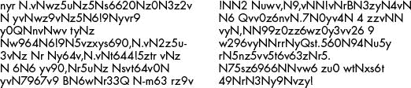
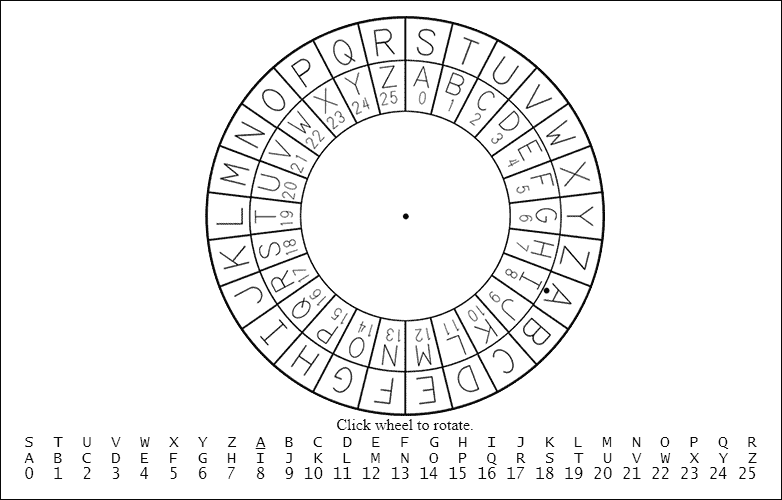
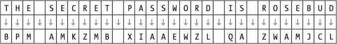
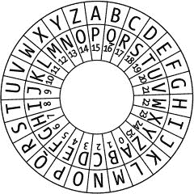
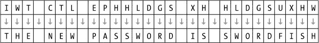
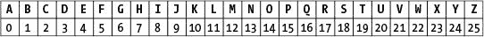

# 1 制作纸质加密工具

> 原文：<https://inventwithpython.com/cracking/chapter1.html>

“加密精灵已经从瓶子里出来了。”
—简·库姆，WhatsApp 创始人

在我们开始写密码程序之前，让我们看一下只用铅笔和纸实现加密和解密的过程。这将帮助你理解密码是如何工作的，以及产生秘密信息的数学原理。在这一章中，你将了解我们所说的密码是什么，以及代码与密码有何不同。然后，您将使用一种称为凯撒密码的简单密码，用纸和笔对消息进行加密和解密。

**本章涵盖的主题**

*   什么是密码学？

*   代码和密码

*   凯撒密码

*   密码轮

*   用算术实现密码学

*   双重加密

### **什么是密码学？**

历史上，任何需要与他人共享秘密的人，如间谍、士兵、黑客、海盗、商人、暴君和政治活动家，都依赖密码学来确保他们的秘密保密和不被公开。*密码学*是使用秘密代码的科学。要理解加密是什么样子的，请看下面两段文字:

左边的文字是一条经过*加密*的秘密信息，或者说变成了一个秘密代码。对于不知道如何*解密*它，或者把它变回原始的英文信息的人来说，它是完全不可读的。右边的消息是没有隐藏含义的随机乱码。加密使信息对其他无法解密的人保密，即使他们得到了加密后的信息。*一条加密的信息看起来完全像随机的胡说八道。*

一个*密码学家*使用并研究秘密代码。当然，这些秘密信息并不总是保密的。一个*密码分析专家*，也被称为*密码破译者*或*黑客*，可以破解密码并读取他人的加密信息。这本书教你如何使用各种技术加密和解密信息。但不幸的是或者说幸运的是，你将在本书中学到的黑客行为不会让你陷入法律问题的危险。

### **代码与密码**

与密码不同的是，*代码*可以被理解和公开获得。代码用符号代替信息，任何人都可以通过查找来翻译成信息。

在 19 世纪早期，一个众所周知的代码来自于电报的发展，它允许通过电线在各大洲之间进行近乎即时的通信。通过电报发送信息比以前派一个骑马的人携带一袋信件要快得多。然而，电报不能直接发送写在纸上的信件。相反，它只能发送两种类型的电脉冲:一种称为“点”的短脉冲和一种称为“划”的长脉冲。

要将字母表中的字母转换成这些点和破折号，你需要一个编码系统将英语转换成电脉冲。将英语转换成点和破折号来发送电报的过程称为*编码*，接收到消息时将电脉冲翻译成英语的过程称为*解码*。用于编码和解码电报(以及后来的无线电)信息的代码被称为*莫尔斯电码*，如表 1-1 所示。塞缪尔·莫尔斯和阿尔弗雷德·维尔发明了莫尔斯电码。

**表 1-1:** 国际莫尔斯电码编码

| **字母** | **编码** | **字母** | **编码** | **号** | **编码** |
| --- | --- | --- | --- | --- | --- |
| A |  | 普通 |  | one |  |
| B |  | O |  | Two |  |
| C |  | P |  | three |  |
| D |  | Q |  | four |  |
| E |  | 稀有 |  | five |  |
| F |  | S |  | six |  |
| G |  | T |  | seven |  |
| H |  | U |  | eight |  |
| 我 |  | V |  | nine |  |
| J |  | W |  | Zero |  |
| K |  | X |  |  |  |
| L |  | Y |  |  |  |
| M |  | Z |  |  |  |

通过用一键电报机点击点和破折号，报务员几乎可以立即将英语信息传达给世界另一端的人！(要了解更多关于莫尔斯电码的信息，请访问 https://www.nostarch.com/crackingcodes/*。)*

 *与代码不同的是，*密码*是一种特殊类型的代码，旨在使信息保密。你可以使用一种密码将可理解的英文文本，称为*明文*，转换成隐藏秘密信息的乱码，称为*密文*。密码是一组在明文和密文之间转换的规则。这些规则通常使用只有通信者知道的秘密密钥来加密或解密。在这本书里，你将学习几种密码，并编写程序使用这些密码来加密和解密文本。但是首先，让我们使用简单的纸质工具手工加密消息。

### **凯撒密码**

你将学习的第一个密码是凯撒密码，它是以 2000 年前使用它的朱利叶斯·凯撒命名的。好消息是它简单易学。坏消息是因为它太简单了，所以密码分析者也很容易破解。然而，这仍然是一个有用的学习练习。

凯撒密码的工作原理是，在移动字母表后，用一个新字母替换信息中的每个字母。例如，朱利叶斯·凯撒通过将字母表中的字母下移三位，然后用移位后的字母表中的字母替换每个字母，来替换他信息中的字母。

例如，消息中的每个 A 都将被替换为 D，每个 B 都将是 E，依此类推。当 Caesar 需要移动字母表末尾的字母(如 Y)时，他会绕到字母表的开头，并将三个位置移动到 b。在本节中，我们将使用 Caesar 密码手动加密消息。

#### ***密码轮***

为了使使用凯撒密码将明文转换为密文更容易，我们将使用一个*密码轮*，也称为*密码盘*。密码轮由两个字母环组成；每个环被分成 26 个槽(26 个字母的字母表)。外环代表明文字母表，内环代表密文中对应的字母。内环也是从 0 到 25 的数字。这些数字代表*加密密钥*，在这种情况下，它是从 A 移动到内环上相应字母所需的字母数。因为移位是循环的，用大于 25 的键移位会使字母绕回，所以移位 26 就等于移位 0，移位 27 就等于移位 1，依此类推。

您可以在*【https://www.nostarch.com/crackingcodes/】*](https://www.nostarch.com/crackingcodes/)在线访问虚拟密码轮。[图 1-1 显示了它的样子。要旋转滚轮，请单击它，然后四处移动鼠标光标，直到您想要的配置就位。然后再次单击鼠标以停止滚轮旋转。

*图 1-1:在线密码轮*

这本书的网站上还提供了一个可打印的纸质密码轮。剪下两个圆，将它们叠放在一起，将较小的一个放在较大的一个的中间。通过两个圆圈的中心插入一个大头针或圆头钉，这样你就可以在适当的位置旋转它们。

使用纸张或虚拟转轮，你可以手工加密秘密信息。

#### ***用密码轮加密***

要开始加密，在一张纸上用英语写下你的信息。对于这个例子，我们将加密消息，密码是 ROSEBUD。接下来，旋转密码轮的内轮，直到其插槽与外轮的插槽匹配。注意外轮字母 A 旁边的点。注意这个点旁边的内轮上的数字。这是加密密钥。

例如，在图 1-1 中，外圆的 A 在内圆的数字 8 之上。在我们的例子中，我们将使用这个加密密钥来加密消息，如图图 1-2 所示。

*图 1-2:用 8 的凯撒密钥加密信息*

对于消息中的每个字母，在外圈找到它，并用内圈的相应字母替换它。在这个例子中，消息中的第一个字母是 T(“THE SECRET…”中的第一个 T ),所以在外圆中找到字母 T，然后在内圆中找到相应的字母，也就是字母 b。因此，秘密消息总是用 b 替换 T。(如果您使用不同的加密密钥，明文中的每个 T 将被替换为不同的字母。)消息中的下一个字母是 H，变成 p，字母 E 变成 m，外轮上的每个字母总是加密到内轮上的同一个字母。为了节省时间，在您查找“THE SECRET…”中的第一个 T 并看到它加密到 B 后，您可以将消息中的每个 T 替换为 B，因此您只需要查找一个字母一次。

在您加密整个消息之后，原始消息(秘密密码是 ROSEBUD)就变成了 BPM AMKZMB XIAAEWZL QA ZWAMJCL。请注意，非字母字符(如空格)不会改变。

现在你可以把这封加密的邮件发送给别人(或者自己保存)，除非你告诉他们秘密的加密密钥，否则没有人能够阅读它。一定要对加密密钥保密；任何知道消息是用密钥 8 加密的人都可以读取密文。

#### ***用密码轮*解密**

要解密密文，从密码轮的内圈开始，然后移动到外圈。例如，假设您收到了密文 IWT CTL EPHHLDGS XH HLDGSUXHW。除非你知道密钥(或者除非你是一个聪明的黑客)，否则你无法解密这条消息。幸运的是，你的朋友已经告诉你他们用 15 键来传递信息。该钥匙的密码轮如图 1-3 所示。

*图 1-3:设置在 15 键的密码轮*

现在，您可以将外圆上的字母 A(下面有圆点的那个)排列在内圆上有数字 15 的字母(也就是字母 P)上。然后，在内圈上找到秘密消息中的第一个字母，就是 I，再看外圈上对应的字母，就是 t，密文中的第二个字母 W 解密成字母 h，将密文中的其余字母解密回明文，就得到消息，新密码是剑鱼，如图图 1-4 所示。

*图 1-4:用 15 的凯撒密钥解密一条消息*

如果你使用了一个不正确的密钥，比如 16，解密后的信息将是 SGD MDV OZRRVNQC HR RVNQCEHRG，这是不可读的。除非使用正确的密钥，否则无法理解解密的消息。

#### ***用算术加密和解密***

密码轮是使用凯撒密码加密和解密的方便工具，但是您也可以使用算术加密和解密。要做到这一点，从 A 到 Z 写字母表的字母，在每个字母下面写下从 0 到 25 的数字。从 A 下面的 0 开始，B 下面的 1，依此类推，直到 z 下面的 25。

*图 1-5:从 0 到 25 对字母表进行编号*

你可以用这个字母到数字的代码来代表字母。这是一个强大的概念，因为它允许你对字母进行数学运算。例如，如果将字母 CAT 表示为数字 2、0 和 19，则可以将 3 相加得到数字 5、3 和 22。这些新数字代表字母 FDW，如图图 1-5 所示。你刚刚给*猫*这个词“加”了 3！稍后，我们将能够编程一台计算机来为我们做这些数学运算。

要使用 Caesar 密码算法进行加密，请在您要加密的字母下找到数字，然后将密钥号添加到该数字中。得到的总和就是加密字母下的数字。比如，我们来加密 HELLO。你好吗？使用键 13。(您可以使用 1 到 25 之间的任何数字作为密钥。)首先找到 H 下面的数字，是 7。然后在这个数上加 13:7+13 = 20。因为数字 20 在字母 U 下面，字母 H 加密到 U。

同样，要加密字母 E (4)，加 4 + 13 = 17。17 以上的数是 R，所以 E 被加密成 R，以此类推。

这个过程一直进行到字母 O，O 下面的数字是 14。但是 14 加 13 是 27，数字列表最多只有 25。如果字母的数字和键的和是 26 或更多，你需要从中减去 26。在这种情况下，27–26 = 1。数字 1 上面的字母是 B，所以 O 用密钥 13 加密到 B。当您加密邮件中的每个字母时，密文将为 URYYB。UBJ·NER·LBH？

要解密密文，减去密钥而不是加上密钥。密文字母 B 的数目是 1。1 减去 13 得到–12。像我们加密的“减 26”法则，解密时结果小于 0，就需要加 26。因为–12+26 = 14，密文字母 B 解密为 o。

**注**

如果你不知道如何用负数加减，你可以在 https://www.nostarch.com/crackingcodes/的了解一下。

如你所见，使用凯撒密码不需要密码轮。你所需要的只是一支铅笔，一张纸，和一些简单的算术！

### **为什么双重加密不起作用**

您可能认为使用两个不同的密钥对一条消息加密两次会使加密的强度加倍。但凯撒密码(以及大多数其他密码)并非如此。事实上，双重加密的结果和普通加密的结果是一样的。让我们尝试对消息进行双重加密，看看为什么。

例如，如果您使用密钥 3 对单词 KITTEN 进行加密，您将在明文字母的数字上加上 3，得到的密文将是 NLWWHQ。如果您随后加密 NLWWHQ，这次使用密钥 4，得到的密文将是 RPAALU，因为您在明文字母的数字上加了 4。但这和用密钥 7 加密一次小猫这个词是一样的。

对于大多数密码，多次加密不会提供额外的强度。事实上，如果你用两个加起来是 26 的密钥对一些明文进行加密，得到的密文将和原始明文一样！

### **总结**

几个世纪以来，凯撒密码和其他类似的密码被用来加密秘密信息。但是如果你想加密一条长消息——比如说，一整本书——手工加密可能需要几天或几周的时间。这就是编程可以发挥作用的地方。计算机可以在不到一秒的时间内加密和解密大量文本！

要使用计算机进行加密，你需要学习如何*编写*程序，或者使用计算机能够理解的语言来指导计算机执行我们刚刚执行的相同步骤。幸运的是，学习像 Python 这样的编程语言并不像学习像日语或西班牙语这样的外语那样困难。除了加法、减法和乘法，你也不需要知道很多数学知识。你需要的只是一台电脑和这本书！

让我们继续第 2 章，在这里我们将学习如何使用 Python 的交互式 shell 一次一行地探索代码。

**练习题**

练习题的答案可以在本书的网站*[【https://www.nostarch.com/crackingcodes/】](https://www.nostarch.com/crackingcodes/)*找到。

1.  用给定的密钥加密比尔斯，A·的*魔鬼字典*中的以下条目:

    1.  关键 4:“双手灵巧:能够以同样的技巧挑选右手口袋或左手口袋。”

    2.  第 17 题:“断头台:让一个法国人有充分理由耸耸肩的机器。”

    3.  答案 21:“不敬:你对我的神的不敬。”

2.  用给定的密钥解密下列密文:

    1.  with key 15:" zxai:p rdhibt hdbth ldgc qn hrdirwbtc xc pbtgxrp PC pbtgxrpch xc hrdiapcs . "

    2.  带密钥 4:" mqtswx SV:e vmzep ewtmver xs tyfpmg lsrsvw . "

3.  用密钥 0 加密下面的句子:“这是一个愚蠢的例子。”

4.  以下是一些单词及其加密。每个单词用了哪个键？

    1.  罗斯巴德-利玛窦

    2.  山本 prdrdfkf

    3.  天文学–HZAYVUVTF

5.  用密钥 8 加密的这句话用密钥 9 解密成什么？" ummsmaa:Cvkwuuwv xibqmvkm qv xtivvqvo I zmdmvom bpib QA ewzbp epqtm . "*