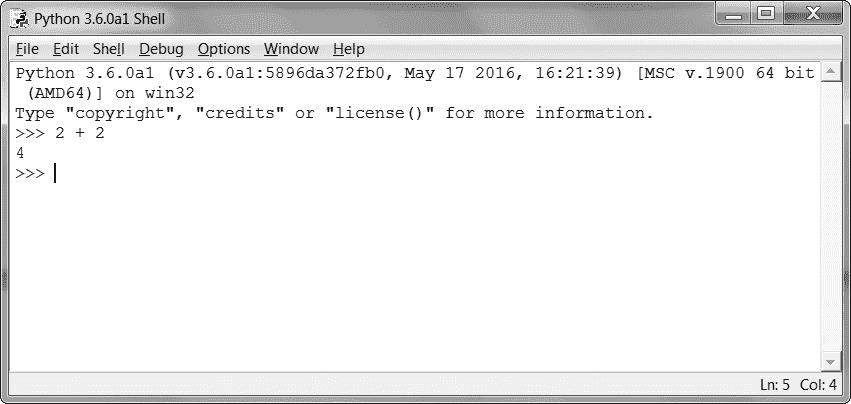
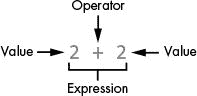
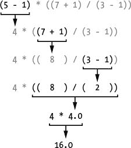
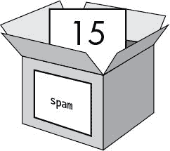
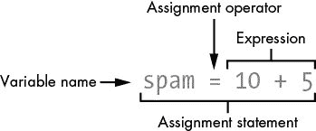
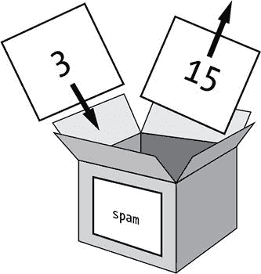

# 2 交互式 SHELL 中的编程

> 原文：<https://inventwithpython.com/cracking/chapter2.html>

“分析引擎并不能自命地创造任何东西。它可以做任何我们知道如何命令它执行的事情。”
——阿达·洛芙莱斯，1842 年 10 月


在编写加密程序之前，您需要学习一些基本的编程概念。这些概念包括值、运算符、表达式和变量。

**本章涵盖的主题**

*   运算符

*   值

*   整数和浮点数

*   表达式

*   计算表达式

*   变量值

*   覆盖变量

让我们从探索如何在 Python 的交互式 shell 中进行一些简单的数学运算开始。请务必在您的计算机旁边阅读这本书，这样您就可以输入简短的代码示例并了解它们的功能。从输入程序开发肌肉记忆将帮助你记住 Python 代码是如何构造的。

### 一些简单的数学表达式

通过打开IDLE启动(参见第二十七页上的启动IDLE)。您将看到交互式Sheel和在`>>>`提示符旁边闪烁的光标。交互式外壳可以像计算器一样工作。在 shell 中键入`2 + 2`,然后在键盘上按 `enter` 。(在某些键盘上，这是`回车键`。)计算机应显示数字`4`做出响应，如图 2-1 所示。



*图 2-1：将 2 + 2 键入shell 。*

在图 2-1 的例子中，`+`符号告诉计算机将数字`2`和`2`相加，但是 Python 也可以做其他计算，比如用减号(`–`)减去数字，用星号(`*`)乘以数字，或者用正斜杠(`/`)除以数字。当以这种方式使用时，`+`、`-`、`*`和`/`被称为*运算符*，因为它们告诉计算机对它们周围的数字执行运算。表 2-1 总结了 Python 数学运算符。这些`2` s(或其他数字)被称为*值*。

**表 2-1**：Python 中的数学运算符

| **操作员** | **操作** |
| --- | --- |
| `+` | 加法 |
| `-` | 减法 |
| `*` | 乘法 |
| `/` | 除法 |

本身，`2 + 2`不是程序；它只是一个简单的指令。程序由许多这样的指令组成。

#### 整数和浮点值

在编程中，整数如`4`、`0`、`99`称为*整数*。带小数点的数字(`3.5`、`42.1`、`5.0`)称为*浮点数*。在 Python 中，数字`5`是一个整数，但是如果你把它写成`5.0`，它将是一个浮点数。

整数和浮点是*数据类型*。值`42`是整型或 `int` 数据类型的值。值`7.5`是浮点或 `float` 数据类型的值。

每个值都有一个数据类型。你将学习一些其他的数据类型(比如第三章的中的字符串)，但是现在只要记住，任何时候我们谈论一个值，这个值是一个特定的数据类型。通常只需查看值是如何书写的，就可以很容易地识别数据类型。整数是没有小数点的数字。浮点数是带小数点的数字。所以`42`是 int，但是`42.0`是 float。

#### T1】表达式 T3】

您已经看到 Python 解决了一个数学问题，但是 Python 可以做更多的事情。尝试在 shell 中键入以下数学问题，在每个问题之后按下 `enter` 键:

```py
   >>> 2+2+2+2+2 # ➊
   10
   >>> 8*6
   48
   >>> 10-5+6 # ➋
   11
   >>> 2  +       2 # ➌
   4
```



*图 2-2：一个表达式由值(如 2 )和运算符(如 + )组成。*

这些数学题叫做*表达式*。计算机可以在几秒钟内解决数百万个这样的问题。表达式由运算符(数学符号)和连接的值(数字)组成，如图 2-2 所示。一个表达式中可以有任意多的数字 ➊，只要它们由运算符连接；你甚至可以在一个表达式中使用多种类型的操作符 ➋。您还可以在整数和这些运算符 ➌ 之间输入任意数量的空格。但是一定要确保表达式总是在行首开始，前面没有空格，因为行首的空格会改变 Python 解释指令的方式。您将在第 45 页的的块中了解更多关于行首空格的信息。

#### 运算顺序

你可能还记得数学课上的短语“运算顺序”。比如先做乘法再做加法。表达式`2 + 4 * 3`的计算结果为`14`，因为先进行乘法运算来计算`4 * 3`，然后再加上`2`。圆括号可以让不同的运算符先行。在表达式`(2 + 4) * 3`中，首先进行加法计算`(2 + 4)`，然后将总和乘以`3`。括号使得表达式的计算结果为`18`而不是`14`。Python 数学运算符的运算顺序(也称为*优先*)类似于数学。首先计算括号内的运算；接下来从左到右执行`*`和`/`运算符；然后从左到右执行`+`和`-`运算符。

#### 计算表达式

当计算机求解表达式`10 + 5`并得到值`15`时，我们说它已经*对表达式*求值。对表达式求值会将表达式简化为一个值，就像解决数学问题会将问题简化为一个数字:答案。

表达式`10 + 5`和`10 + 3 + 2`具有相同的值，因为它们的计算结果都是`15`。甚至单个值也被认为是表达式:表达式`15`的计算结果是值`15`。

Python 会继续计算表达式，直到它变成单个值，如下所示:



Python 从最里面最左边的括号开始计算表达式。即使圆括号相互嵌套，圆括号内的表达式部分的计算规则也与任何其他表达式相同。所以当 Python 遇到`((7 + 1) / (3 - 1))`时，它首先求解最左边的内括号中的表达式`(7 + 1)`，然后求解右边的表达式`(3 - 1)`。当内括号中的每个表达式都被简化为单个值时，外括号中的表达式将被求值。请注意，除法运算的结果是浮点值。最后，当括号中没有更多的表达式时，Python 按照运算符的顺序执行任何剩余的计算。

在一个表达式中，可以有两个或多个由操作符连接的值，也可以只有一个值，但是如果在交互式 shell 中输入一个值和一个操作符，就会得到一条错误消息:

```py
>>> 5 +
SyntaxError: invalid syntax
```

发生这个错误是因为`5 +`不是一个表达式。具有多个值的表达式需要操作符来连接这些值，而在 Python 语言中，`+`操作符期望连接两个值。一个*语法错误*意味着计算机不理解你给它的指令，因为你打错了。这似乎并不重要，但计算机编程不仅仅是告诉计算机做什么——它还涉及知道如何正确地给计算机发出它可以遵循的指令。

错误是可以接受的！

犯错误是完全可以的！您不会因为输入错误的代码而导致损坏您的计算机。Python 会简单地告诉你发生了一个错误，然后再次显示>>>提示符。您可以继续在交互式 shell 中输入新代码。

在您获得更多编程经验之前，错误消息可能对您没有太大意义。但是，您总是可以在 google 上搜索错误消息文本，以找到解释该特定错误的网页。你也可以去[`www.nostarch.com/crackingcodes`](https://www.nostarch.com/crackingcodes/)查看常见 Python 错误消息列表及其含义。

### 变量值

程序通常需要存储值，以便在后续程序中使用。您可以通过使用`=`符号(称为*赋值操作符*)将值存储在*变量*中。例如，要将值`15`存储在名为`spam`的变量中，在 shell 中输入`spam = 15`:

```py
>>> spam = 15
```

你可以把变量想象成一个盒子，里面有值`15`(如图 2-3 )。变量名`spam`是盒子上的标签(这样我们就可以区分一个变量和另一个变量)，存储在里面的值就像盒子里面的一张纸条。

当你按下`键进入`时，你将不会看到任何东西，除了一个空行作为回应。除非你看到错误消息，否则你可以认为指令执行成功。出现下一个`>>>`提示，以便您可以输入下一条指令。

这个带有`=`赋值操作符的指令(称为*赋值语句*)创建变量`spam`并将值`15`存储在其中。与表达式不同，*声明语句*是不计算任何值的指令；相反，他们只是执行一个动作。这就是 shell 中的下一行不显示任何值的原因。

弄清楚哪些指令是表达式，哪些是语句可能会令人困惑。请记住，如果 Python 指令的计算结果是单个值，那么它就是一个表达式。如果没有，那就是声明语句。



*图 2-3：变量就像有名字的盒子，可以装值。*

赋值声明语句写成变量，后面是`=`运算符，再后面是表达式，如图 2-4 所示。表达式计算的值存储在变量中。



*图 2-4：赋值语句的组成部分*

请记住，变量存储的是单个值，而不是分配给它们的表达式。例如，如果您输入语句`spam = 10 + 5`，表达式`10 + 5`首先被计算为`15`，然后值`15`被存储在变量`spam`中，我们可以通过在 shell 中输入变量名看到:

```py
>>> spam = 10 + 5
>>> spam
15
```

变量本身是一个由表达式计算的结果并存储在变量中的值。值本身也可以是一个对自身求值的表达式:

```py
>>> 15
15
```

这里有一个有趣的转折。如果您现在在 shell 中输入`spam + 5`，您将得到整数`20`:

```py
>>> spam = 15
>>> spam + 5
20
```

如你所见，变量可以像值一样用在表达式中。因为`spam`的值是`15`，所以表达式`spam + 5`计算为表达式`15 + 5`，然后表达式`15 + 5`计算为`20`。

#### 覆盖变量

您可以通过输入另一个赋值声明语句来更改存储在变量中的值。例如，输入以下内容:

```py
   >>> spam = 15
   >>> spam + 5 # ➊
   20 # ➋
   >>> spam = 3 # ➌
   >>> spam + 5 # ➍
➎ 8
```

第一次输入`spam + 5` ➊ 时，表达式的计算结果为`20` ➋，因为你在变量`spam`中存储了值`15`。但当你输入`spam = 3` ➌ 时，数值`15`被数值`3`覆盖(即替换)，如图 2-5 所示。现在当你输入`spam + 5` ➍ 时，表达式计算结果为`8` ➎ ，因为`spam + 5`计算结果为`3 + 5`。`spam`中的旧值被遗忘。



*图 2-5：变量spam中的值 15 被值 3 覆盖。*

您甚至可以使用`spam`变量中的值给`spam`分配一个新值:

```py
>>> spam = 15
>>> spam = spam + 5
>>> spam
20
```

赋值语句`spam = spam + 5`告诉计算机“变量`spam`的新值是当前值`spam`加五。”`=`符号左侧的变量被赋予右侧表达式的值。您可以将`spam`中的值变大通过几次`5`的加法运算:

```py
>>> spam = 15
>>> spam = spam + 5
>>> spam = spam + 5
>>> spam = spam + 5
>>> spam
30
```

每次执行`spam = spam + 5`时，`spam`中的值都会改变。存储在`spam`中的值最终是`30`。

#### 变量名

尽管计算机不关心你给变量取什么名字，但你应该这样做。给变量起一个能反映它们所包含的数据类型的名字，这样更容易理解程序是做什么的。你可以给你的变量取像`abrahamLincoln`或`monkey`这样的名字，即使你的程序与亚伯拉罕·林肯或猴子无关——计算机仍然会运行程序(只要你一直使用`abrahamLincoln`或`monkey`)。但是当你在很长一段时间没有看到一个程序时，你可能不记得每个变量是做什么的。

一个好的变量名描述了它包含的数据。想象一下，你搬到了一所新房子，并给你所有的搬家箱子贴上标签*东西*。你永远找不到任何东西！变量名`spam`、`eggs`、`bacon`等等(受*Monty Python*“Spam”草图的启发)在本书和 Python 的大部分文档中用作示例的通用名称，但是在您的程序中，描述性名称有助于使您的代码更具可读性。

变量名(以及 Python 中的其他东西)是区分大小写的。*区分大小写*意味着不同大小写的相同变量名被认为是完全不同的变量。例如，`spam`、`SPAM`、`Spam`和`sPAM`在 Python 中被认为是四个不同的变量。它们都可以包含各自独立的值，不能互换使用。

### 总结

那么我们什么时候开始制作加密程序呢？很快。但是在你破解密码之前，你需要学习一些基本的编程概念，所以你还需要读几章编程的章节。

在本章中，您学习了在交互式 shell 中编写 Python 指令的基础。Python 需要你准确地告诉它以它期望的方式做什么，因为计算机只理解非常简单的指令。您了解了 Python 可以对表达式求值(即将表达式简化为单个值)，表达式是值(如`2`或`5`)与运算符(如`+`或`-`)的组合。您还了解了可以将值存储在变量中，这样您的程序就可以记住它们以便以后使用。

交互式 shell 是学习 Python 指令的有用工具，因为它允许你一次输入一个指令并查看结果。在第 3 章中，你将创建包含许多指令的程序，这些指令是按顺序执行的，而不是一次执行一个。我们将讨论一些更基本的概念，你将编写你的第一个程序！

**练习题**

练习题的答案可以在本书的网站[`www.nostarch.com/crackingcodes`](https://www.nostarch.com/crackingcodes/)找到。

1.  哪个是除法运算符，`/`还是`\`？

2.  下面哪个是整数值，哪个是浮点数值？

    ```py
    42
    3.141592
    ```

3.  以下哪几行是*不是*的表达式？

    ```py
    4 x 10 + 2
    3 * 7 + 1
    2 +
    42
    2 + 2
    spam = 42
    ```

4.  如果你在交互式 shell 中输入下面几行代码，➊和➋会打印出什么？

    ```py
       spam = 20
    ➊ spam + 20
       SPAM = 30
    ➊ spam
    ```