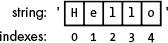
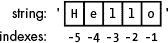
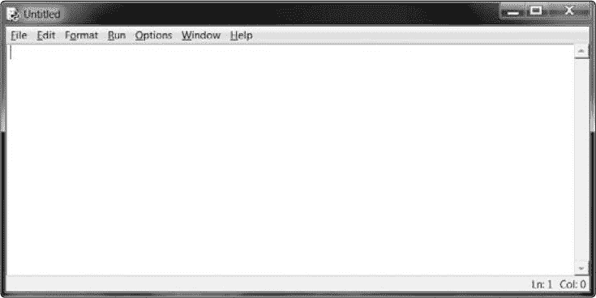
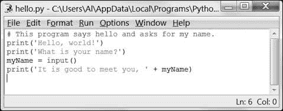
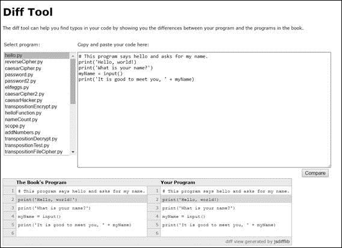
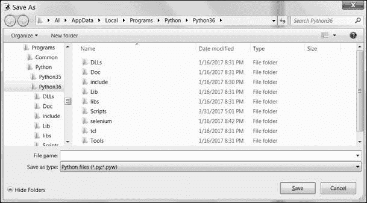
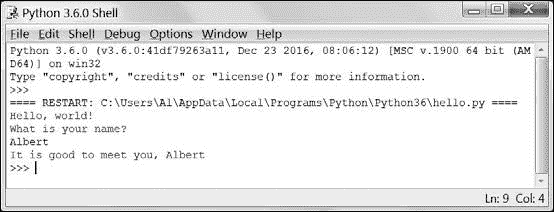

# 3 字符串和编写程序

> 原文：<https://inventwithpython.com/cracking/chapter3.html>

亲手编写程序代码是学习一门新编程语言的唯一方法
—布莱恩·克尼根和丹尼斯·里奇，
C 语言


第 2 章给了你足够的整数和数学知识，但是Python 不仅仅是一个实现计算器功能。因为加密就是通过将明文转换成密文来处理文本值，所以在本章中，您将学习如何存储、组合和在屏幕上显示文本。您还将编写第一个程序，用文本“Hello，world！”来问候用户，并让用户输入他们的名字。

**本章涵盖的主题**

*   字符串

*   字符串连接和复制

*   索引和切片

*   `print()`函数

*   用 IDLE 写源代码

*   在IDLE中保存和运行程序

*   注释

*   `input()`函数

### **使用字符串值处理文本**

在 Python 中，我们处理被称为字符串值的小段文本(或者简称为*字符串*)。我们所有的加密和黑客程序都处理字符串值，将类似于`'One if by land, two if by space'`的明文转换成类似于`'` `b1rJvsJo` `!Jyn1q,J702JvsJo!J63nprM'`的密文。在我们的程序中，明文和密文在我们的程序中都被表示为字符串值，Python 代码可以通过多种方式操作这些值。

您可以将字符串值存储在变量中，就像存储整数和浮点值一样。当您键入一个字符串时，将它放在两个单引号(`'`)之间，以显示该字符串的开始和结束位置。在交互式 shell 中输入以下内容:

```py
>>> spam = 'hello'
```

单引号不是字符串值的一部分。Python 知道`'hello'`是一个字符串，`spam`是一个变量，因为字符串用引号括起来，而变量名没有。

如果您在 shell 中输入`spam`，您将看到`spam`变量的内容(`'hello'`字符串):

```py
>>> spam = 'hello'
>>> spam
'hello'
```

这是因为 Python 的变量赋值是将值存储在变量中:在本例中，是字符串`'hello'`。字符串中几乎可以包含任何键盘字符。这些都是字符串的例子:

```py
>>> 'hello'
'hello'
>>> 'KITTENS'
'KITTENS'
>>> ''
''
>>> '7 apples, 14 oranges, 3 lemons'
'7 apples, 14 oranges, 3 lemons'
>>> 'Anything not pertaining to elephants is irrelephant.'
'Anything not pertaining to elephants is irrelephant.'
>>> 'O*&#wY%*&OcfsdYO*&gfC%YO*&%3yc8r2'
'O*&#wY%*&OcfsdYO*&gfC%YO*&%3yc8r2'
```

请注意，`''`字符串中没有字符；单引号之间没有任何内容。这被称为*空串*或*空字符串*。

#### ***用+运算符连接字符串***

您可以使用`+`操作符把两个字符串值连接起来创建一个新字符串。这样做被称为*字符串连接*。在外壳中输入`'Hello,' + 'world!'`:

```py
>>> 'Hello,' + 'world!'
'Hello,world!'
```

Python 准确地把你需要连接的字符串连接起来*，所以当你连接它们时，它不会在字符串之间加一个空格。如果希望结果字符串中有一个空格，那么必须在两个原始字符串中有一个空格。要在`'Hello,'`和`'world!'`之间加一个空格，可以在`'Hello,'`字符串的末尾和第二个单引号之前加一个空格，如下所示:*

```py
>>> 'Hello, ' + 'world!'
'Hello, world!'
```

`+`操作符可以将两个字符串值连接成一个新的字符串值(`'` `Hello, ' + 'world!'`到`'Hello, world!'`)，就像它可以将两个整数值相加得到一个新的整数值(`2 + 2`到`4`)。由于值的数据类型，Python 知道`+`操作符应该做什么。正如你在第 2 章中学到的，一个值的数据类型告诉我们(和计算机)这个值是什么类型的数据。

只要数据类型匹配，就可以在带有两个或更多字符串或整数的表达式中使用`+`运算符。如果你尝试使用一个字符串和一个整数的操作符，你会得到一个错误。在交互式 shell 中输入以下代码:

```py
>>> 'Hello' + 42
Traceback (most recent call last):
  File "<stdin>", line 1, in <module>
TypeError: must be str, not int
>>> 'Hello' + '42'
'Hello42'
```

第一行代码导致错误，因为`'Hello'`是一个字符串，而`42`是一个整数。但是在第二行代码中，`'42'`是一个字符串，所以 Python 将其连接起来。

#### ***用*运算符复制字符串***

你也可以在一个字符串和一个整数之间使用`*`操作符来做*字符串复制*。这会将字符串复制(即重复)整数值的任意倍。在交互式 shell 中输入以下内容:

```py
➊ >>> 'Hello' * 3
   'HelloHelloHello'
   >>> spam = 'Abcdef'
➋ >>> spam = spam * 3
   >>> spam
   'AbcdefAbcdefAbcdef'
```

要复制一个字符串，输入字符串，然后输入`*`操作符，然后输入您希望字符串重复的次数 ➊ 。你也可以存储一个字符串，就像我们对`spam`变量所做的那样，然后复制这个变量来代替 ➋ 。您甚至可以将复制的字符串存储回同一个变量或新变量中。

正如你在第 2 章的中看到的，`*`操作符可以处理两个整数值，将它们相乘。但是它不能处理两个字符串值，这将导致如下错误:

```py
>>> 'Hello' * 'world!'
Traceback (most recent call last):
  File "<stdin>", line 1, in <module>
TypeError: can't multiply sequence by non-int of type 'str'
```

字符串连接和字符串复制表明，Python 中的运算符可以根据它们所操作的值的数据类型执行不同的任务。`+`操作符可以做加法或字符串连接。`*`操作符可以做乘法或字符串复制。

#### ***使用索引从字符串中获取字符***

您的加密程序经常需要从字符串中获取单个字符，这可以通过索引来完成。使用*索引*，您可以在字符串值(或包含字符串的变量)的末尾添加方括号`[`和`]`，它们之间有一个数字，以访问一个字符。这个数字被称为*索引*，它告诉 Python 字符串中的哪个位置有你想要的字符。Python 索引从`0`开始，所以字符串中第一个字符的索引是`0`。索引`1`用于第二个字符，索引`2`用于第三个字符，依此类推。

在交互式 shell 中输入以下内容:

```py
>>> spam = 'Hello'
>>> spam[0]
'H'
>>> spam[1]
'e'
>>> spam[2]
'l'
```



*图 3-1:字符串【Hello】及其索引*

请注意，表达式`spam0]`的计算结果是字符串值`'H'`，因为`H`是字符串`'Hello'`的第一个字符，索引从`0`开始，而不是`1`(参见[图 3-1 )。

您可以对包含字符串值的变量使用索引，就像我们在前面的示例中所做的那样，或者对字符串值本身使用索引，如下所示:

```py
>>> 'Zophie'[2]
'p'
```

表达式`'Zophie'[2]`计算出第三个字符串值，即`'p'`。这个`'p'`字符串就像任何其他字符串值一样，可以存储在变量中。在交互式 shell 中输入以下内容:

```py
>>> eggs = 'Zophie'[2]
>>> eggs
'p'
```

如果输入的索引对于字符串来说太大，Python 会显示一条`"index out of range"`错误消息，如下面的代码所示:

```py
>>> 'Hello'[10]
Traceback (most recent call last):
  File "<stdin>", line 1, in <module>
IndexError: string index out of range
```

字符串`'Hello'`中有五个字符，所以如果您试图使用索引`10`，Python 会显示一个错误。



*图 3-2:字符串【Hello】及其负索引*

##### **负索引**

*负索引*从一个字符串的末尾开始，向后。负索引`-1`是字符串中最后一个字符*的索引。索引`-2`是倒数第二个字符的索引，以此类推，如图图 3-2 所示。*

在交互式 shell 中输入以下内容:

```py
>>> 'Hello'[-1]
'o'
>>> 'Hello'[-2]
'l'
>>> 'Hello'[-3]
'l'
>>> 'Hello'[-4]
'e'
>>> 'Hello'[-5]
'H'
>>> 'Hello'[0]
'H'
```

注意`-5`和`0`是同一字符的索引。大多数情况下，您的代码将使用正索引，但有时使用负索引更容易。

##### **使用切片从字符串中获取多个字符**

如果你想从一个字符串中得到多个字符，你可以使用切片来代替索引。一个*片*也使用`[`和`]`方括号，但是有两个整数索引而不是一个。这两个索引由冒号(`:`)分隔，并告诉 Python 切片中第一个和最后一个字符的索引。在交互式 shell 中输入以下内容:

```py
>>> 'Howdy'[0:3]
'How'
```

切片计算的字符串从第一个索引值开始，一直到第二个索引值，但不包括第二个索引值。字符串值`'Howdy'`的索引`0`为`H`，索引`3`为`d`。因为切片向上但不包括第二个索引，所以切片`'Howdy'[0:3]`的结果为字符串值`'How'`。

在交互式 shell 中输入以下内容:

```py
>>> 'Hello, world!'[0:5]
'Hello'
>>> 'Hello, world!'[7:13]
'world!'
>>> 'Hello, world!'[-6:-1]
'world'
>>> 'Hello, world!'[7:13][2]
'r'
```

请注意，表达式`'Hello, world!'[7:13][2]`首先将列表片评估为`'world!'[2]`，然后进一步评估为`'r'`。

与索引不同，如果您为字符串提供太大的索引值，切片仍然不会出错。它将尽可能返回最宽的匹配切片:

```py
>>> 'Hello'[0:999]
'Hello'
>>> 'Hello'[2:999]
'llo'
>>> 'Hello'[1000:2000]
''
```

表达式`'Hello'[1000:2000]`返回一个空字符串，因为索引`1000`在该字符串的末尾，所以这个切片不可能包含任何字符。虽然我们的例子没有显示这一点，但是您也可以对存储在变量中的字符串进行切片。

##### **空白切片索引**

如果省略一个切片中的第一个索引值，Python 将自动使用索引`0`作为第一个索引值。表达式`'Howdy'[0:3]`和`'Howdy'[:3]`计算出相同的字符串:

```py
>>> 'Howdy'[:3]
'How'
>>> 'Howdy'[0:3]
'How'
```

如果省略第二个索引值，Python 将从第一个索引值开始自动使用字符串的其余部分:

```py
>>> 'Howdy'[2:]
'wdy'
```

您可以通过许多不同的方式使用空白索引。在 shell 中输入以下内容:

```py
>>> myName = 'Zophie the Fat Cat'
>>> myName[-7:]
'Fat Cat'
>>> myName[:10]
'Zophie the'
>>> myName[7:]
'the Fat Cat'
```

正如您所看到的，您甚至可以在空白索引中使用负索引。因为在第一个例子中`-7`是起始索引，Python 从末尾向后计数 7 个字符，并将其作为起始索引。然后，由于第二个空索引，它返回从该索引到字符串末尾的所有内容。

### **用 print()函数打印数值**

让我们尝试另一种类型的 Python 指令:一个`print()`函数调用。在交互式 shell 中输入以下内容:

```py
>>> print('Hello!')
Hello!
>>> print(42)
42
```

一个*函数*(就像本例中的`print()`)内部有执行任务的代码，比如在屏幕上打印数值。Python 附带了许多不同的函数，可以为您执行有用的任务。*调用*一个函数意味着执行函数内部的代码。

本例中的指令将一个值传递给圆括号之间的`print()`，而`print()`函数将该值打印到屏幕上。调用函数时传递的值是*参数*。当你写程序时，你会用`print()`让文本出现在屏幕上。

您可以向`print()`传递一个表达式，而不是单个值。这是因为实际传递给`print()`的值是该表达式的计算值。在交互 shell 中输入以下字符串连接表达式:

```py
>>> spam = 'Al'
>>> print('Hello, ' + spam)
Hello, Al
```

`'Hello, ' + spam`表达式计算出`'Hello, ' + 'Al'`，然后再计算出字符串值`'Hello, Al'`。这个字符串值就是传递给`print()`调用的内容。

### **打印转义字符**

您可能希望在字符串值中使用一个会使 Python 混淆的字符。例如，您可能希望使用单引号字符作为字符串的一部分。但是你会得到一个错误消息，因为 Python 认为单引号是结束字符串值和文本的引号，而不是字符串的其余部分。在交互式 shell 中输入以下内容，查看操作中的错误:

```py
>>> print('Al's cat is named Zophie.')
SyntaxError: invalid syntax
```

要在字符串中使用单引号，需要使用一个*转义字符*。转义字符是反斜杠字符后跟另一个字符，例如，`\t`、`\n`或`\'`。斜杠告诉 Python 斜杠后面的字符有特殊的含义。在交互式 shell 中输入以下内容。

```py
>>> print('Al\'s cat is named Zophie.')
Al's cat is named Zophie.
```

现在 Python 知道撇号是字符串值中的一个字符，而不是标记字符串结尾的 Python 代码。

表 3-1 显示了一些你可以在 Python 中使用的转义字符。

**表 3-1:** 转义字符

| **转义字符** | **打印结果** |
| --- | --- |
| `\\` | 反斜杠(`\`) |
| `\'` | 单引号(`'`) |
| `\"` | 双引号(`"`) |
| `\n` | 新行 |
| `\t` | Tab制表符 |

反斜杠总是在转义字符之前。即使你只想在字符串中加一个反斜杠，也不能只加一个反斜杠，因为 Python 会把下一个字符解释为转义字符。例如，这行代码不能正常工作:

```py
>>> print('It is a green\teal color.')
It is a green    eal color.
```

`'teal'`中的`'t'`被识别为转义字符，因为它跟在反斜杠后面。转义字符`\t`模拟按下键盘上的<small class="calibre14">Tab</small>键。

相反，请输入以下代码:

```py
>>> print('It is a green\\teal color.')
It is a green\teal color.
```

这一次，字符串将按照您的意图打印，因为在字符串中添加第二个反斜杠会使反斜杠成为转义字符。

### **引号和双引号**

在 Python 中，字符串不必总是在两个单引号之间。你可以用双引号来代替。这两行打印了相同的内容:

```py
>>> print('Hello, world!')
Hello, world!
>>> print("Hello, world!")
Hello, world!
```

但是不能把单引号和双引号混在一起。这一行给你一个错误:

```py
>>> print('Hello, world!")
SyntaxError: EOL while scanning string literal
```

我更喜欢使用单引号，因为它们比双引号更容易输入，而且 Python 不在乎这两种方式。

但是就像你必须使用转义符`\'`在单引号包围的字符串中使用单引号一样，你需要转义符`\"`在双引号包围的字符串中使用双引号。例如，看这两行:

```py
>>> print('Al\'s cat is Zophie. She says, "Meow."')
Al's cat is Zophie. She says, "Meow."
>>> print("Zophie said, \"I can say things other than 'Meow' you know.\"")
Zophie said, "I can say things other than 'Meow' you know."
```

单引号字符串中不需要转义双引号，双引号字符串中也不需要转义单引号。Python 解释器非常聪明，它知道如果一个字符串以一种引号开始，另一种引号并不意味着该字符串结束。

### **在 IDLE 的文件编辑器中编写程序**

到目前为止，您一直在交互 shell 中一次输入一条指令。但是当你写程序的时候，你会输入几个指令并让它们运行，而不用等你下一个指令。是时候写你的第一个程序了！

提供交互shell 的软件程序的名字叫做 IDLE(*`I``integrated``D``eve``L``opment``E`*environment)。除了交互 shell，IDLE 还有一个*文件编辑器*，我们现在就打开。

在 Python shell 窗口顶部，选择**文件****新建窗口**。将出现一个新的空白窗口，即文件编辑器，供您输入程序，如图图 3-3 所示。文件编辑器窗口的右下角显示了光标当前所在的行和列。



*图 3-3:光标位于第 1 行第 0 列*的文件编辑器窗口

您可以通过寻找`>>>`提示符来区分文件编辑器窗口和交互式 shell 窗口。交互式 shell 总是显示提示，而文件编辑器不显示。

### 源代码为“Hello, World!”程序

传统上，正在学习一门新语言的程序员让他们的第一个程序在屏幕上显示文本`"Hello, world!"`。我们将创造我们自己的"Hello, world!"通过在新的文件编辑器窗口中输入文本来进行下一步编程。我们称这个文本为程序的*源代码*，因为它包含了 Python 将遵循的指令，以确定程序应该如何运行。

你可以下载“你好，世界！”源代码来自[`www.nostarch.com/crackingcodes`](https://www.nostarch.com/crackingcodes)。如果输入代码后出现错误，使用在线比较工具将它与书中的代码进行比较(参见“[使用在线比较工具检查源代码”下一节)。记住不要输入行号；它们出现在本书中只是为了帮助解释。

`hello.py`

```py
1\. # This program says hello and asks for my name.
2\. print('Hello, world!')
3\. print('What is your name?')
4\. myName = input()
5\. print('It is good to meet you, ' + myName)
```

IDLE将以不同的颜色显示不同类型的指令。当你输入完这段代码后，窗口应该看起来像图 3-4 。



*图 3-4:文件编辑器窗口在你输入代码后会是这个样子。*

### 使用在线比较工具检查源代码

即使你可以从这本书的网站上复制粘贴或下载 `hello.py` 代码，你仍然应该手动输入这个程序。这样做会让你更熟悉程序中的代码。但是，在将它输入文件编辑器时，您可能会犯一些错误。

要将您键入的代码与本书中的代码进行比较，请使用图 3-5 所示的在线比较工具。复制你的代码文本，然后在本书网站的`www.nostarch.com/crackingcodes`导航到 diff 工具。从下拉菜单中选择 `hello.py` 程序。将您的代码粘贴到该网页的文本字段中，然后单击**比较**按钮。diff 工具显示您的代码和本书中的代码之间的任何差异。这是找到程序中任何导致错误的打字错误的简单方法。*

*

*图 3-5:在线比较工具*

### 稍后使用IDLE打开您的程序

当你写程序时，你可能想保存它们，以后再来看，特别是在你输入了一个很长的程序之后。IDLE 具有保存和打开程序的功能，就像文字处理器具有保存和重新打开文档的功能一样。

#### ***保存你的程序***

输入源代码后，请保存它，这样您就不必在每次想要运行它时重新键入它。从文件编辑器窗口顶部的菜单中选择**文件****另存为**。另存为对话框应该打开，如图 3-6 中的所示。在**文件名**字段输入 hello.py ，点击**保存**。



*图 3-6:保存程序*

你应该在打字的时候经常保存你的程序，这样你就不会在电脑崩溃或者意外退出IDLE时丢失你的工作程序。作为一种快捷方式，你可以在 Windows 和 Linux 上按下 <small class="calibre14">ctrl</small> -S 或者在 macOS 上按下 -S 来保存你的文件。

#### ***运行你的程序***

现在是时候运行你的程序了。选择**运行****运行模块**或者直接按键盘上的 F5 键。你的程序应该在你第一次启动IDLE出现的 shell 窗口中运行。请记住，您必须在文件编辑器的窗口中按 F5 键，而不是在交互式 shell 的窗口中。

当程序询问你的名字时，输入你的名字，如图图 3-7 所示。



*图 3-7:运行“Hello，world！”程序。*

现在当你按下<small class="calibre14">enter,</small>的时候，程序应该会点名问候你(*用户*，也就是使用程序的那个人)。恭喜你！你写了你的第一个程序。你现在是一名初级电脑程序员。(如果您愿意，可以通过再次按 F5 再次运行该程序。)

如果您得到如下所示的错误，这意味着您正在使用 Python 2 而不是 Python 3 运行程序:

```py
Hello, world!
What is your name?
Albert
Traceback (most recent call last):
  File "C:/Python27/hello.py", line 4, in <module>
    myName = input()
  File "<string>", line 1, in <module>
NameError: name 'Albert' is not defined
```

该错误是由`input()`函数调用引起的，它在 Python 2 和 3 中的执行方式不同。在继续之前，按照第 xxv 页的下载并安装 Python 中的说明安装 Python 3。

#### ***打开你保存的程序***

单击右上角的 X 关闭文件编辑器。要重新加载已保存的程序，从菜单中选择**文件****打开**。现在就这样做，在出现的窗口中，选择 `hello.py` 。然后点击**打开**按钮。您保存的 `hello.py` 程序应该会在文件编辑器窗口中打开。

### **“Hello, World!”程序是怎样工作的**

“Hello, World!”程序中的每一行是一个指令，它确切地告诉 Python 该做什么。计算机程序很像一个食谱。先做第一步，再做第二步，以此类推，直到最后。当程序一步一步地遵循指令时，我们称之为*程序执行*，或简称为*执行*。

每条指令都是按顺序执行的，从程序的顶部开始，沿着指令列表向下。执行从第一行代码开始，然后向下移动。但是执行也可以跳过，而不只是从上到下；你将在第 4 章中找到如何做到这一点。

让我们看看“Hello, World!””从第 1 行开始，一次编执行一行程序，看看它在做什么。

#### ***注释***

任何跟在*井号* ( `#`)后面的文本都是注释:

```py
1\. # This program says hello and asks for my name.
```

注释不是给计算机的，而是给你这个程序员的。电脑会忽略它们。它们用来提醒你程序是做什么的，或者告诉其他可能看你代码的人你的代码是做什么的。

程序员通常会在代码的顶部加上注释，给程序起一个标题。IDLE程序用红色文本显示注释，以帮助它们突出出来。有时候，程序员会在一行代码前加一个`#`，在测试程序时临时跳过。这被称为*注释掉*代码，当你试图找出一个程序不工作的原因时，这很有用。当您准备好将被注释的代码行放回原处时，可以移除`#`。

#### ***给用户打印提示***

接下来的两行用`print()`功能向用户显示提示。函数就像程序中的迷你程序。使用函数的最大好处是，我们只需要知道函数做什么，而不需要知道它是如何做的。例如，您需要知道`print()`在屏幕上显示文本，但是您不需要知道函数内部的确切代码。函数调用是一段代码，它告诉程序在函数内部运行代码。

`hello.py` 的第 2 行是对`print()`的调用(括号内是要打印的字符串)。3 号线是另一个`print()`调用。这次程序显示`'What is your name?'`

```py
2\. print('Hello, world!')
3\. print('What is your name?')
```

我们在函数名的末尾添加括号，以清楚地表明我们引用的是名为`print()`的函数，而不是名为`print`的变量。函数末尾的括号告诉 Python 我们正在使用一个函数，就像数字`'42'`周围的引号告诉 Python 我们正在使用字符串`'42'`，而不是整数`42`。

#### ***获取用户的输入***

第 4 行有一个带有变量(`myName`)和新函数调用`input()`的赋值语句:

```py
4\. myName = input()
```

当`input()`被调用时，程序等待用户输入一些文本并按下<small class="calibre14">enter</small>。用户输入的文本字符串(他们的名字)成为存储在`myName`中的字符串值。

像表达式一样，函数调用赋予为单个值。调用赋予的值被称为*返回值*。(事实上，我们也可以用“returns”这个词来表示函数调用的“evaluates”。)在这种情况下，`input()`的返回值是用户输入的字符串，应该是他们的名字。如果用户输入了`Albert`，那么`input()`调用将计算(即返回)字符串`'Albert'`。

与`print()`不同，`input()`函数不需要任何参数，这就是圆括号之间没有任何内容的原因。

`hello.py` 中的最后一行代码是另一个`print()`调用:

```py
5\. print('It is good to meet you, ' + myName)
```

对于第 5 行的`print()`调用，我们使用加号运算符(`+`)连接字符串`'It is good to meet you, '`和存储在`myName`变量中的字符串，这是用户输入到程序中的名称。这就是我们如何让程序通过名字问候用户。

#### ***结束程序***

当程序执行最后一行时，它就停止了。此时它已经*终止*或者*退出*，所有的变量都被计算机遗忘，包括存储在`myName`中的字符串。如果您尝试再次运行该程序并输入不同的名称，它将打印该名称。

 ```py
Hello, world!
What is your name?
Zophie
It is good to meet you, Zophie
```

请记住，计算机只做你通过编程让它做的事情。在这个程序中，它会询问您的姓名，让您输入一个字符串，然后说 hello 并显示您输入的字符串。

但是电脑是愚蠢的。这个程序不在乎你输入你的名字，别人的名字，或者只是一些愚蠢的东西。你可以输入任何你想输入的东西，计算机会以同样的方式处理它:

```py
Hello, world!
What is your name?
poop
It is good to meet you, poop
```

### **总结**

写程序只是学习如何说计算机的语言。在第 2 章中，您已经了解了一些如何做这件事，现在您已经将几个 Python 指令组合在一起，制作了一个完整的程序，它会询问用户的名字并问候用户。

在这一章中，你学习了一些操作字符串的新技术，比如使用`+`操作符来连接字符串。您还可以使用索引和切片从不同字符串的一部分创建新字符串。

本书中的其余程序将更加复杂和精密，但它们都将被逐行解释。你总是可以在交互式 shell 中输入指令，在你把它们放进一个完整的程序之前，看看它们做了什么。

接下来，我们将开始编写我们的第一个加密程序:反向密码。

**练习题**

练习题的答案可以在本书的网站[`www.nostarch.com/crackingcodes`](https://www.nostarch.com/crackingcodes/)找到。

1.  如果赋值`spam = 'Cats'`，下面几行打印什么？

    ```py
    spam + spam + spam
    spam * 3
    ```

2.  下面几行打印的是什么？

    ```py
    print("Dear Alice,\nHow are you?\nSincerely,\nBob")
    print('Hello' + 'Hello')
    ```

3.  如果你赋值`spam = 'Four score and seven years is eighty seven years.'`，下面的每一行会打印什么？

    ```py
    print(spam[5])
    print(spam[-3])
    print(spam[0:4] + spam[5])
    print(spam[-3:-1])
    print(spam[:10])
    print(spam[-5:])
    print(spam[:])
    ```

4.  哪个窗口显示`>>>`提示符，交互式 shell 还是文件编辑器？

5.  下面一行打印了什么？

    ```py
    #print('Hello, world!')
    ```**