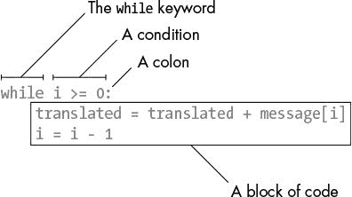
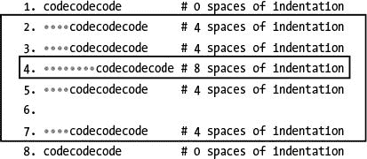

# 4 反向密码

> 原文：<https://inventwithpython.com/cracking/chapter4.html>

每个人都被周边一群志愿间谍包围着
—简·奥斯汀，诺桑觉寺


反向密码通过以相反的顺序打印消息来实现消息的加密。所以“Hello, world!”加密成"！dlrow，olleH”。要解密或获取原始消息，只需反转加密的消息即可。加密和解密步骤是相同的。

然而，这种反向密码很弱，很容易就能猜出明文。只要看一看密文，你就可以知道消息是逆序的。

*.syas ti tahw tuo erugif llits ylbaborp nac uoy ,detpyrcne si siht hguoht neve ,elpmaxe roF*

但是反向密码程序的代码很容易解释，所以我们将把它作为我们的第一个加密程序。

**本章涵盖的主题**

*   `len()`函数

*   `while`循环

*   布尔数据类型

*   比较运算符

*   条件判断

*   阻碍

### 反向密码程序的源代码

在IDLE中，点击**文件 -> 新建窗口**创建一个新的文件编辑窗口。输入下面的代码，保存为 `reverseCipher.py` ，按 F5 运行它，但是记住不要在每行之前键入数字:

`reverseCipher.py`

```py
# Reverse Cipher
# https://www.nostarch.com/crackingcodes/ (BSD Licensed)

message = 'Three can keep a secret, if two of them are dead.'
translated = ''

i = len(message) - 1
while i >= 0:
    translated = translated + message[i]
    i = i - 1

print(translated)
```

### 反向密码程序的运行示例

当您运行 `reverseCipher.py` 程序时，输出如下:

```py
.daed era meht fo owt fi ,terces a peek nac eerhT
```

要解密此消息，通过高亮显示消息并按下 Windows 和 Linux 上的 <small class="calibre14">ctrl</small> -C 或 macOS 上的 -C，将`.daed era meht fo owt fi ,terces a peek nac eerhT`文本复制到剪贴板。然后将其粘贴(在 Windows 和 Linux 上使用 <small class="calibre14">ctrl</small> -V 或者在 macOS 上使用 -V)为第 4 行`message`中存储的字符串值。确保在字符串的开头和结尾保留单引号。新的第 4 行看起来像这样(用粗体表示的变化):

```py
message = '.daed era meht fo owt fi ,terces a peek nac eerhT'
```

现在，当您运行 `reverseCipher.py` 程序时，输出解密后的原始消息:

```py
Three can keep a secret, if two of them are dead.
```

### 设置注释和变量

`reverseCipher.py` 中的前两行是注释，解释了程序是什么以及可以找到它的网站。

```py
# Reverse Cipher
# https://www.nostarch.com/crackingcodes/ (BSD Licensed)
```

`BSD Licensed`部分意味着这个程序可以被任何人自由复制和修改，只要这个程序保留了原作者的版权(在这种情况下，这本书的网站在第二行的`https://www.nostarch.com/crackingcodes/`)。我喜欢把这些信息放在文件里，这样如果它在网上被复制，下载它的人总是知道去哪里找原始资料。他们还会知道这个程序是开源软件，可以免费分发给其他人。

第 3 行只是一个空行，Python 跳过了。第 4 行将我们想要加密的字符串存储在一个名为`message`的变量中:

```py
message = 'Three can keep a secret, if two of them are dead.'
```

每当我们想要加密或解密一个新的字符串时，我们只需将该字符串直接输入到第 4 行的代码中。

第 5 行的`translated`变量是我们的程序存储反转字符串的地方:

```py
translated = ''
```

在程序开始时，`translated`变量包含这个空白字符串。(请记住，空白字符串是两个单引号字符，而不是一个双引号字符。)

### 寻找字符串的长度

第 7 行是在名为`i`的变量中存储一个值的赋值语句:

```py
i = len(message) - 1
```

变量中计算和存储的表达式是`len(message) - 1`。这个表达式的第一部分`len(message)`，是对`len()`函数的函数调用，它接受一个字符串参数，就像`print()`一样，并返回一个字符串中有多少字符的整数值(即字符串的*长度*)。在这种情况下，我们将`message`变量传递给`len()`，因此`len(message)`返回存储在`message`中的字符串值中有多少个字符。

让我们在交互式 shell 中试验一下`len()`函数。在交互式 shell 中输入以下内容:

```py
>>> len('Hello')
5
>>> len('')
0
>>> spam = 'Al'
>>> len(spam)
2
>>> len('Hello,' + ' ' + 'world!')
13
```

从`len()`的返回值中，我们知道字符串`'Hello'`中有五个字符，空白字符串中没有字符。如果我们将字符串`'Al'`存储在一个变量中，然后将该变量传递给`len()`，该函数将返回`2`。如果我们将表达式`'Hello,' + ' ' + 'world!'`传递给`len()`函数，它将返回`13`。原因是`'Hello,' + ' ' + 'world!'`的计算结果是字符串值`'Hello, world!'`，其中有 13 个字符。(空格和感叹号算作字符。)

既然你已经理解了`len()`函数是如何工作的，让我们回到 `reverseCipher.py` 程序的第 7 行。第 7 行通过从`len(message)`中减去 1 找到`message`中最后一个字符的索引。它必须减去 1，因为例如像`'Hello'`这样的 5 个字符长度的字符串的索引是从 0 到 4。这个整数然后被存储在`i`变量中。

### 介绍 while 循环

第 8 行是一种 Python 指令，称为`while`循环或`while`语句:

```py
while i >= 0:
```

一个`while`循环由四部分组成(如图 4-1 中所示)。



*图 4-1：while循环部分*

一个*条件*是一个用在`while`语句中的表达式。只要条件为真，`while`语句中的代码块就会执行。

为了理解`while`循环，你首先需要了解布尔、比较运算符和块。

#### 布尔数据类型

*布尔*数据类型只有两个值:`True`或`False`。这些布尔值，或者说 `bools` ，是区分大小写的(你总是需要大写 `T` 和 `F` ，而让其余的小写)。它们不是字符串值，所以不要用引号将`True`或`False`括起来。

通过在交互式 shell 中输入以下内容来尝试一些 bools:

```py
>>> spam = True
>>> spam
True
>>> spam = False
>>> spam
False
```

像任何其他数据类型的值一样，布尔值可以存储在变量中。

#### 比较运算符

在 `reverseCipher.py` 程序的第 8 行，看看`while`关键字后的表达式:

```py
while i >= 0:
```

跟在`while`关键字后面的表达式(`i >= 0`部分)包含由`>=`符号连接的两个值(变量`i`中的值和整数值`0`)，称为“大于或等于”运算符。`>=`运算符是一个*比较运算符*。

我们使用比较运算符来比较两个值，并计算出一个`True`或`False`布尔值。表 4-1 列出了比较运算符。

**表 4-1:** 比较运算符

| **运算符标识** | **运算符名称** |
| --- | --- |
| `<` | 小于 |
| `>` | 大于 |
| `<=` | 小于或等于 |
| `>=` | 大于或等于 |
| `==` | 等于 |
| `!=` | 不等于 |

在交互式 shell 中输入以下表达式，查看它们计算出的布尔值:

```py
>>> 0 < 6
True
>>> 6 < 0
False
>>> 50 < 10.5
False
>>> 10.5 < 11.3
True
>>> 10 < 10
False
```

表达式`0 < 6`返回布尔值`True`，因为数字`0`小于数字`6`。但是因为`6`不小于`0`，所以表达式`6 < 0`的计算结果为`False`。表达式`50 < 10.5`是`False`，因为`50`不小于`10.5`。表达式`10 < 11.3`的计算结果为`True`，因为`10.5`小于`11.3`。

再看`10 < 10`。因为数字`10`不小于数字`10`，所以是`False`。他们完全一样。(如果爱丽丝和鲍勃一样高，你就不会说爱丽丝比鲍勃矮了。这种说法是错误的。)

使用`<=`(小于或等于)和`>=`(大于或等于)运算符输入一些表达式:

```py
>>> 10 <= 20
True
>>> 10 <= 10
True
>>> 10 >= 20
False
>>> 20 >= 20
True
```

注意`10 <= 10`是`True`，因为运算符检查 10 是否小于*或等于* 10。请记住，对于“小于或等于”和“大于或等于”运算符，`<`或`>`符号总是在`=`符号之前。

现在在 shell 中输入一些使用了`==`(等于)和`!=`(不等于)运算符的表达式，看看它们是如何工作的:

```py
>>> 10 == 10
True
>>> 10 == 11
False
>>> 11 == 10
False
>>> 10 != 10
False
>>> 10 != 11
True
```

这些运算符的工作方式和你对整数的预期一样。用`==`运算符比较彼此相等的整数，结果为`True`，不相等的值为`False`。当你和`!=`运算符比较的时候，就相反了。

字符串比较的工作方式类似:

```py
>>> 'Hello' == 'Hello'
True
>>> 'Hello' == 'Goodbye'
False
>>> 'Hello' == 'HELLO'
False
>>> 'Goodbye' != 'Hello'
True
```

大小写对 Python 很重要，所以大小写不完全匹配的字符串值不是同一个字符串。例如，字符串 ' `Hello` ' 和 ' `HELLO` ' 彼此不相等，因此将它们与`==`进行比较得出`False`。

注意赋值运算符(`=`)和“等于”比较运算符(`==`)之间的区别。单等号(`=`)用于给变量赋值，双等号(`==`)用于表达式中检查两个值是否相同。如果你问 Python 两个东西是否相等，用`==`。如果你告诉 Python 给一个变量设置一个值，使用`=`。

在 Python 中，字符串和整数值总是被认为是不同的值，永远不会彼此相等。例如，在交互式 shell 中输入以下内容:

```py
>>> 42 == 'Hello'
False
>>> 42 == '42'
False
>>> 10 == 10.0
True
```

尽管它们看起来很像，但整数`42`和字符串`'42'`并不相等，因为字符串和数字不一样。整数和浮点数可以彼此相等，因为它们都是数字。

当您使用比较运算符时，请记住每个表达式总是计算出一个`True`或`False`值。

#### 代码块

一个*块*是一行或多行代码，用相同的最小*缩进量*(即该行前面的空格数)组合在一起。

当一行缩进四个空格时，一个块开始。任何后面的行也缩进至少四个空格，是块的一部分。当一行缩进另外四个空格时(该行前面总共有八个空格)，一个新的块从第一块开始。当有一行代码的缩进与块开始前的缩进相同时，块结束。

让我们看一些假想的代码(代码是什么并不重要，因为我们只关注每行的缩进)。缩进的空格在这里用灰点代替，以便于计数。



可以看到第 1 行没有缩进；也就是说，代码行前面没有空格。但是第二行有四个缩进空间。因为这比前一行缩进量大，所以我们知道一个新的块已经开始。第 3 行也有四个缩进空间，所以我们知道这个块在第 3 行继续。

第 4 行有更多的缩进(八个空格)，所以一个新的块已经开始。这个代码块在另一个代码块的里面。在 Python 中，代码块中可以有代码块。

在第 5 行，缩进量减少到了 4，所以我们知道上一行的块已经结束了。第 4 行是那个代码块唯一的一条线。因为第 5 行与第 2 行和第 3 行中的块具有相同的缩进量，所以它仍然是原始外部块的一部分，即它不是第 4 行中的块的一部分。

第 6 行是空行，我们直接跳过；它不影响代码块。

第 7 行有四个缩进空间，所以我们知道从第 2 行开始的代码块一直延续到第 7 行。

第 8 行有零个缩进空间，比前一行缩进量少。缩进的减少告诉我们前一个块，从第 2 行开始的块，已经结束了。

这段代码显示了两个块。第一个块从第 2 行到第 7 行。第二个块只包含第 4 行(在另一个块的内部)。

**注**

代码块不一定要用四个空格来描述。块可以使用任意数量的空格，但是惯例是每个缩进使用四个空格。

#### while 循环语句

让我们看看完整的`while`语句，从 `reverseCipher.py` 的第 8 行开始:

```py
while i >= 0:
    translated = translated + message[i]
    i = i - 1

print(translated)
```

一个`while`语句告诉 Python 首先检查条件的计算结果，在第 8 行是`i >= 0`。你可以把`while`语句`while i >= 0:`理解为“当变量`i`大于或等于零时，继续执行下面块中的代码。”如果条件判断结果为`True`，程序执行进入`while`语句之后的块。通过查看缩进，您可以看到这个块由第 9 行和第 10 行组成。当它到达块的底部时，程序执行跳回到第 8 行的`while`语句并再次检查条件。如果还是`True`，执行跳转到块的开始，再次运行块中的代码。

如果`while`语句的条件评估为`False`，程序执行将跳过下一个块中的代码，并跳转到该块之后的第一行(第 12 行)。

#### 不断成长的字符串

请记住，在第 7 行上，`i`变量首先被设置为`message`的长度减 1，第 8 行上的`while`循环继续执行下一个块中的行，直到条件`i >= 0`为`False`:

```py
i = len(message) - 1
while i >= 0:
    translated = translated + message[i]
    i = i – 1

print(translated)
```

第 9 行是一个赋值语句，它在`translated`变量中存储了一个值。存储的值是与`message`中索引`i`处的字符连接`translated`的当前值。结果，存储在`translated`中的字符串值一次“增长”一个字符，直到它成为完全加密的字符串。

第 10 行也是一个赋值语句。它获取当前的整数值`i`并从中减去 1(这被称为*减少变量*)。然后它将这个值存储为`i`的新值。

下一行是 12，但是因为这一行缩进较少，Python 知道`while`语句的块已经结束。因此，程序执行没有继续到第 12 行，而是跳回到第 8 行，在那里再次检查`while`循环的条件。如果条件是`True`，块内的行(第 9 行和第 10 行)被再次执行。这种情况一直持续到条件为`False`(即`i`小于`0`)，在这种情况下，程序执行到程序块后的第一行(第 12 行)。

让我们考虑一下这个循环的行为，以了解它在块中运行代码的次数。变量`i`以最后一个索引`message`的值开始，`translated`变量以空白的字符串开始。然后在循环内部，`message[i]`的值(它是`message`字符串中的最后一个字符，因为`i`将具有最后一个索引的值)被添加到`translated`字符串的末尾。

然后`i`中的值减少(即减少)了`1`，这意味着`message[i]`将是倒数第二个字符。因此，当`i`作为一个索引从`message`中的字符串的后面一直移动到前面时，字符串`message[i]`被添加到`translated`的末尾。这就是`translated`如何实现`message`的反向。当`i`最终设置为`-1`时，这发生在我们到达消息的索引`0`时，`while`循环的条件为`False`，执行跳转到第 12 行:

```py
print(translated)
```

在第 12 行程序的末尾，我们将变量`translated`的内容(即字符串`'.daed era meht fo owt fi ,terces a peek nac eerhT'`)打印到屏幕上。这向用户显示了反转后的字符串是什么样子。

如果您仍然无法理解`while`循环中的代码如何反转字符串，请尝试将新行(以粗体显示)添加到循环的块中:

```py
while i >= 0:
    translated = translated + message[i]
    print('i is', i, ', message[i] is', message[i], ', translated is',
          translated)
    i = i - 1

print(translated)
```

第 10 行打印`i`、`message[i]`和`translated`的值，以及每次执行循环时的字符串标签(即，在循环的每次*迭代*)。这一次，我们没有使用字符串连接，而是使用了一些新的东西。逗号告诉`print()`函数我们正在打印六个独立的东西，所以函数在它们之间添加了一个空格。现在当你运行程序时，你可以看到`translated`变量是如何“增长”的输出如下所示:

```py
i is 48 , message[i] is . , translated is .
i is 47 , message[i] is d , translated is .d
i is 46 , message[i] is a , translated is .da
i is 45 , message[i] is e , translated is .dae
i is 44 , message[i] is d , translated is .daed
i is 43 , message[i] is   , translated is .daed
i is 42 , message[i] is e , translated is .daed e
i is 41 , message[i] is r , translated is .daed er
i is 40 , message[i] is a , translated is .daed era
i is 39 , message[i] is   , translated is .daed era
i is 38 , message[i] is m , translated is .daed era m
i is 37 , message[i] is e , translated is .daed era me
i is 36 , message[i] is h , translated is .daed era meh
i is 35 , message[i] is t , translated is .daed era meht
i is 34 , message[i] is   , translated is .daed era meht
i is 33 , message[i] is f , translated is .daed era meht f
i is 32 , message[i] is o , translated is .daed era meht fo
i is 31 , message[i] is   , translated is .daed era meht fo
i is 30 , message[i] is o , translated is .daed era meht fo o
i is 29 , message[i] is w , translated is .daed era meht fo ow
i is 28 , message[i] is t , translated is .daed era meht fo owt
i is 27 , message[i] is   , translated is .daed era meht fo owt
i is 26 , message[i] is f , translated is .daed era meht fo owt f
i is 25 , message[i] is i , translated is .daed era meht fo owt fi
i is 24 , message[i] is   , translated is .daed era meht fo owt fi
i is 23 , message[i] is , , translated is .daed era meht fo owt fi ,
i is 22 , message[i] is t , translated is .daed era meht fo owt fi ,t
i is 21 , message[i] is e , translated is .daed era meht fo owt fi ,te
i is 20 , message[i] is r , translated is .daed era meht fo owt fi ,ter
i is 19 , message[i] is c , translated is .daed era meht fo owt fi ,terc
i is 18 , message[i] is e , translated is .daed era meht fo owt fi ,terce
i is 17 , message[i] is s , translated is .daed era meht fo owt fi ,terces
i is 16 , message[i] is   , translated is .daed era meht fo owt fi ,terces
i is 15 , message[i] is a , translated is .daed era meht fo owt fi ,terces a
i is 14 , message[i] is   , translated is .daed era meht fo owt fi ,terces a
i is 13 , message[i] is p , translated is .daed era meht fo owt fi ,terces a p
i is 12 , message[i] is e , translated is .daed era meht fo owt fi ,terces a pe
i is 11 , message[i] is e , translated is .daed era meht fo owt fi ,terces a pee
i is 10 , message[i] is k , translated is .daed era meht fo owt fi ,terces a peek
i is 9 , message[i] is   , translated is .daed era meht fo owt fi ,terces a peek
i is 8 , message[i] is n , translated is .daed era meht fo owt fi ,terces a peek n
i is 7 , message[i] is a , translated is .daed era meht fo owt fi ,terces a peek na
i is 6 , message[i] is c , translated is .daed era meht fo owt fi ,terces a peek nac
i is 5 , message[i] is   , translated is .daed era meht fo owt fi ,terces a peek nac
i is 4 , message[i] is e , translated is .daed era meht fo owt fi ,terces a peek nac e
i is 3 , message[i] is e , translated is .daed era meht fo owt fi ,terces a peek nac ee
i is 2 , message[i] is r , translated is .daed era meht fo owt fi ,terces a peek nac eer
i is 1 , message[i] is h , translated is .daed era meht fo owt fi ,terces a peek nac eerh
i is 0 , message[i] is T , translated is .daed era meht fo owt fi ,terces a peek nac eerhT
```

输出行`"i is 48 , message[i] is . , translated is ."`显示了在字符串`message[i]`被添加到`translated`的末尾之后，但在`i`被递减之前，表达式`i`、`message[i]`和`translated`的计算结果。可以看到程序执行第一次经过循环时，`i`被设置为`48`，所以`message[i]`(也就是`message[48]`)就是字符串`'.'`。`translated`变量开始是一个空字符串，但是当`message[i]`被添加到第 9 行的末尾时，它变成了字符串值`'.'`。

在循环的下一次迭代中，输出是`"i is 47 , message[i] is d , translated is .d"`。你可以看到`i`已经从`48`递减到`47`，所以现在`message[i]`就是`message[47]`，也就是`'d'`字符。(那是`dead'`中的第二个`'d'`。)这个`'d'`被加到`translated`的末尾，所以`translated`现在是值`'.d'`。

现在你可以看到`translated`变量的字符串是如何从一个空白字符串慢慢“成长”到反向的`message`。

### 用 input()提示符改进程序

本书中的程序都是这样设计的，被加密或解密的字符串作为赋值语句直接输入源代码。这在我们开发程序的时候很方便，但是你不应该期望用户自己去修改源代码。为了使程序更容易使用和共享，您可以修改赋值语句，使它们调用`input()`函数。您还可以向`input()`传递一个字符串，这样它将显示一个提示，让用户输入一个要加密的字符串。例如，将 `reverseCipher.py` 中的第 4 行改为:

```py
message = input('Enter message: ')
```

当您运行该程序时，它会将提示打印到屏幕上，并等待用户输入消息。用户输入的消息将是存储在`message`变量中的字符串值。当你现在运行程序时，你可以输入任何你想要的字符串，并得到如下输出:

```py
Enter message: Hello, world!
!dlrow ,olleH
```

### 总结

我们刚刚完成了第二个程序，它使用第三章中的技术将一个字符串转换成一个新的字符串，比如索引和连接。该程序的一个关键部分是`len()`函数，它接受一个字符串参数并返回该字符串中有多少个字符的整数。

您还了解了布尔数据类型，它只有两个值，`True`和`False`。比较运算符`==`、`!=`、`<`、`>`、`<=`和`>=`可以比较两个值并计算出一个布尔值。

条件表达式是使用比较运算符并计算为布尔数据类型的表达式。它们在`while`循环中使用，循环将执行`while`语句后的代码块中的代码，直到条件判断结果为`False`。代码块是由具有相同缩进级别的行组成，包括它们内部的任何块。

现在你已经学会了如何操作文本，你可以开始编写用户可以运行和交互的程序了。这很重要，因为文本是用户和计算机相互交流的主要方式。

**练习题**

练习题的答案可以在本书的网站[`www.nostarch.com/crackingcodes`](https://www.nostarch.com/crackingcodes/)找到。

1.  下面这段代码在屏幕上显示了什么？

    ```py
    print(len('Hello') + len('Hello'))
    ```

2.  这段代码打印了什么？

    ```py
    i = 0
    while i < 3:
        print('Hello')
        i = i + 1
    ```

3.  这个代码怎么样？

    ```py
    i = 0
    spam = 'Hello'
    while i < 5:
        spam = spam + spam[i]
        i = i + 1
    print(spam)
    ```

4.  这个呢？

    ```py
    i = 0
    while i < 4:
        while i < 6:
            i = i + 2
            print(i)
    ```