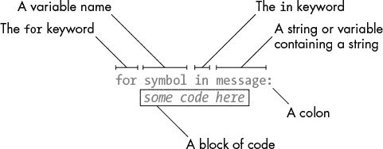

# 5 凯撒密码

> 原文：<https://inventwithpython.com/cracking/chapter5.html>

“老大哥在看着你。”乔治·奥威尔，1984 年


在第 1 章中，我们使用了一个密码轮和一个字母数字表来实现凯撒密码。在这一章中，我们将在计算机程序中实现凯撒密码。

我们在第四章中制作的反向密码总是以同样的方式加密。但是凯撒密码使用密钥，根据使用的密钥不同，加密信息的方式也不同。凯撒密码的密钥是从`0`到`25`的整数。即使密码分析人员知道使用了凯撒密码，这也不足以给他们充分的信息来破解密码，除非他们知道对应的密钥。

**本章涵盖的主题**

*   `import`语句

*   常数

*   `for`循环

*   `if, else`和`elif`语句

*   `in`和`not in`运算符

*   `find()`字符串方法

### 凯撒密码程序的源代码

在文件编辑器中输入以下代码，并保存为 `caesarCipher.py` 。然后从[`www.nostarch.com/crackingcodes`](https://www.nostarch.com/crackingcodes/)下载 `pyperclip.py` 模块，放在与文件 `caesarCipher.py` 相同的目录(即同一个文件夹)下。该模块将被 `caesarCipher.py` 导入；我们将在第 56 页的[的导入模块和设置变量中对此进行更详细的讨论。

完成文件设置后，按 F5 运行程序。如果您的代码遇到任何错误或问题，您可以在`www.nostarch.com/crackingcodes`使用在线比较工具将它与书中的代码进行比较。

 *caesarCipher.py

```py
# Caesar Cipher
# https://www.nostarch.com/crackingcodes/ (BSD Licensed)

import pyperclip

# The string to be encrypted/decrypted:
message = 'This is my secret message.'

# The encryption/decryption key:
key = 13

# Whether the program encrypts or decrypts:
mode = 'encrypt' # Set to either 'encrypt' or 'decrypt'.

# Every possible symbol that can be encrypted:
SYMBOLS = 'ABCDEFGHIJKLMNOPQRSTUVWXYZabcdefghijklmnopqrstuvwxyz12345
      67890 !?.'

# Store the encrypted/decrypted form of the message:
translated = ''

for symbol in message:
    # Note: Only symbols in the SYMBOLS string can be
          encrypted/decrypted.
    if symbol in SYMBOLS:
        symbolIndex = SYMBOLS.find(symbol)

        # Perform encryption/decryption:
        if mode == 'encrypt':
            translatedIndex = symbolIndex + key
        elif mode == 'decrypt':
            translatedIndex = symbolIndex - key

        # Handle wraparound, if needed:
        if translatedIndex >= len(SYMBOLS):
            translatedIndex = translatedIndex - len(SYMBOLS)
        elif translatedIndex < 0:
            translatedIndex = translatedIndex + len(SYMBOLS)

        translated = translated + SYMBOLS[translatedIndex]
    else:
        # Append the symbol without encrypting/decrypting:
        translated = translated + symbol

# Output the translated string:
print(translated)
pyperclip.copy(translated)
```

### 凯撒密码程序的运行示例

当您运行 `caesarCipher.py` 程序时，输出如下:

```py
guv6Jv6Jz!J6rp5r7Jzr66ntrM
```

输出是使用密钥`13`进行凯撒密码加密的字符串`'This is my secret message.'`。您刚才运行的 Caesar 密码程序会自动将这个加密字符串复制到剪贴板，以便您可以将其粘贴到电子邮件或文本文件中。因此，您可以轻松地将程序的加密输出发送给其他人。

运行该程序时，您可能会看到以下错误信息:

```py
Traceback (most recent call last):
  File "C:\caesarCipher.py", line 4, in <module>
    import pyperclip
ImportError: No module named pyperclip
```

如果是这样，你可能没有将 `pyperclip.py` 模块下载到正确的文件夹中。如果您确认 `pyperclip.py` 在带有 `caesarCipher.py` 的文件夹中，但仍然无法让模块工作，只需在 `caesarCipher.py` 程序的第 4 行和第 45 行代码(其中有文本`pyperclip`)前面加上一个`#`就可以了。这使得 Python 忽略了依赖于 `pyperclip.py` 模块的代码，允许程序成功运行。请注意，如果您注释掉该代码，加密或解密的文本不会在程序结束时复制到剪贴板。你也可以在以后的章节中注释掉程序中的`pyperclip`代码，这也将从那些程序中移除复制到剪贴板的功能。

要解密消息，只需将输出文本作为新值粘贴到第 7 行的`message`变量中。然后修改第 13 行的赋值语句，将字符串`'decrypt'`存储在变量`mode`中:

```py
# The string to be encrypted/decrypted:
message = 'guv6Jv6Jz!J6rp5r7Jzr66ntrM'

# The encryption/decryption key:
key = 13

# Whether the program encrypts or decrypts:
mode = 'decrypt' # Set to either 'encrypt' or 'decrypt'.
```

当您现在运行该程序时，输出如下所示:

```py
This is my secret message.
```

### 导入模块和设置变量

尽管 Python 包含许多内置函数，但有些函数存在于称为模块的独立程序中。*模块*是 Python 程序，包含你的程序可以使用的附加功能。我们用恰如其名的`import`语句导入模块，该语句由`import`关键字和模块名组成。

第 4 行包含一个`import`语句:

```py
# Caesar Cipher
# https://www.nostarch.com/crackingcodes/ (BSD Licensed)

import pyperclip
```

在本例中，我们导入了一个名为`pyperclip`的模块，这样我们就可以在程序的后面调用`pyperclip.copy()`函数。`pyperclip.copy()`功能会自动将字符串复制到你电脑的剪贴板，这样你就可以方便地将它们粘贴到其他程序中。

在 `caesarCipher.py` 中接下来的几行设置了三个变量:

```py
# The string to be encrypted/decrypted:
message = 'This is my secret message.'

# The encryption/decryption key:
key = 13

# Whether the program encrypts or decrypts:
mode = 'encrypt' # Set to either 'encrypt' or 'decrypt'.
```

`message`变量存储要加密或解密的字符串，`key`变量存储加密密钥的整数。`mode`变量要么存储字符串`'encrypt'`，让程序后面的代码加密`message`中的字符串，要么存储`'decrypt'`，让程序解密而不是加密。

### 常量和变量

*常量*是程序运行时其值不应改变的变量。例如，凯撒密码程序需要一个字符串，该字符串包含可以用这个凯撒密码加密的每个可能的字符。因为该字符串不应该改变，所以我们将它存储在第 16 行名为`SYMBOLS`的常量变量中:

```py
# Every possible symbol that can be encrypted:
SYMBOLS = 'ABCDEFGHIJKLMNOPQRSTUVWXYZabcdefghijklmnopqrstuvwxyz12345
      67890 !?.'
```

*符号*是密码学中的常用术语，指密码可以加密或解密的单个字符。一个*符号集*是一个密码用来加密或解密的每一个可能的符号。因为我们将在这个程序中多次使用符号集，并且因为我们不想每次在程序中出现时都键入完整的字符串值(我们可能会输入错误，这将导致错误)，所以我们使用一个常量变量来存储符号集。我们输入一次字符串值的代码，并将其放入`SYMBOLS`常量中。

注意`SYMBOLS`全是大写字母，这是常量的命名约定。虽然我们*可以*改变`SYMBOLS`就像任何其他变量一样，但是全大写的名字提醒程序员不要写这样做的代码。

就像所有的惯例一样，我们不需要必须*遵循这个惯例。但是这样做可以让其他程序员更容易理解这些变量是如何使用的。(它甚至可以帮助你以后查看自己的代码。)*

在第 19 行，程序在一个名为`translated`的变量中存储一个空字符串，这个变量稍后将存储加密或解密的消息:

```py
# Store the encrypted/decrypted form of the message:
translated = ''
```

就像在第五章的中的反向密码一样，在程序结束时，`translated`变量将包含完全加密(或解密)的消息。但是现在它以一个空字符串开始。

### for 循环语句

在第 21 行，我们使用了一种叫做`for`循环的循环:

```py
for symbol in message:
```

回想一下，只要某个条件为`True`，一个`while`循环就会循环。`for`循环的目的略有不同，它没有像`while`循环那样的条件。相反，它在一个字符串或一组值上循环。图 5-1 显示了一个`for`回路的六个部分。



*图 5-1：一个for循环语句的六个部分*

每次程序执行循环时(也就是说，在循环的每次迭代中)，`for`语句中的变量(在第 21 行中是`symbol`)取包含字符串的变量中的下一个字符的值(在本例中是`message`)。`for`语句类似于赋值语句，因为变量被创建并赋值，除了`for`语句循环不同的值来给变量赋值之外。

#### 一个for循环的例子

例如，在交互式 shell 中键入以下内容。注意，在您键入第一行之后，`>>>`提示符将会消失(在我们的代码中表示为`...`，因为 shell 期望在`for`语句的冒号之后有一段代码。在交互式 shell 中，当您输入一个空行时，该块将结束:

```py
>>> for letter in 'Howdy':
...     print('The letter is ' + letter)
...
The letter is H
The letter is o
The letter is w
The letter is d
The letter is y
```

这段代码循环遍历字符串`'Howdy'`中的每个字符。当它开始时，变量`letter`按顺序一次一个地取`'Howdy'`中每个字符的值。为了看到这一点，我们在循环中编写了代码，为每次迭代打印出`letter`的值。

#### 一个 while 循环等价于一个 for 循环

`for`循环非常类似于`while`循环，但是当你只需要迭代一个字符串中的字符时，使用`for`循环更有效。通过编写更多的代码，您可以使`while`循环像`for`循环一样:

```py
   >>> i = 0 # ➊
   >>> while i < len('Howdy'): # ➋
   ...      letter = 'Howdy'[i] # ➌
   ...      print('The letter is ' + letter) # ➍
➎ ...      i = i + 1
   ...
   The letter is H
   The letter is o
   The letter is w
   The letter is d
   The letter is y
```

注意这个`while`循环与`for`循环的工作结果相同，但是没有`for`循环那么简短。首先，我们在`while`语句 ➊ 前设置一个新变量`i`为`0`。该`while`语句有一个条件，只要变量`i`小于字符串`'Howdy'` ➋ 的长度，该条件将评估为`True`。因为`i`是一个整数，并且只跟踪字符串中的当前位置，我们需要声明一个单独的`letter`变量来保存字符串中位于`i`位置 ➌ 的字符。然后我们可以打印出`letter`的当前值，以获得与`for`循环 ➍ 相同的输出。当代码执行完毕后，我们需要通过增加`1`来增加`i`，以移动到下一个位置 ➎ 。

要理解 `caesarCipher.py` 中的第 23 行和第 24 行，您需要了解`if`、`elif`和`else`语句、`in`和`not in`操作符，以及`find()`字符串方法。我们将在接下来的章节中讨论这些。

### if 语句

凯撒密码中的第 23 行有另一种 Python 指令——`if`语句:

```py
    if symbol in SYMBOLS:
```

你可以把一个`if`语句理解为，“如果这个条件是`True`，执行下面块中的代码。否则，如果是`False`，跳过这个代码块。”一个`if`语句的格式是使用关键字`if`后跟一个条件，再跟一个冒号(`:`)。与循环一样，要执行的代码缩进在一个块中。

#### 一个if 语句的案例

让我们尝试一个`if`语句的例子。打开一个新的文件编辑器窗口，输入以下代码，保存为 `checkPw.py` :

`checkPw.py`

```py
   print('Enter your password.')
   typedPassword = input() # ➊
   if typedPassword == 'swordfish': # ➋
       print('Access Granted') # ➌
   print('Done') # ➍
```

当你运行这个程序时，它会显示文本`Enter your` `password.`并让用户输入密码。然后密码被存储在变量`typedPassword` ➊ 中。接下来，`if`语句检查密码是否等于字符串`'swordfish'` ➋ 。如果是，执行移到跟随`if`语句的块内，向用户 ➌ 显示文本`Access Granted`；否则，如果`typedPassword`不等于`'swordfish'`，执行将跳过`if`语句的块。无论哪种方式，执行都继续到`if`块之后的代码，以显示`Done` ➍ 。

#### else语句

通常，我们想要测试一个条件，如果条件是`True`就执行一段代码，如果条件是`False`就执行另一段代码。我们可以在`if`语句块后使用`else`语句，如果`if`语句的条件为`False`，则`else`语句的代码块将被执行。对于一个`else`语句，您只需编写关键字`else`和一个冒号(`:`)。它不需要条件，因为如果`if`语句的条件不为真，它就会运行。您可以将代码读作“如果这个条件是`True`，则执行这个块，否则，如果是`False`，则执行另一个块。”

修改 `checkPw.py` 程序，如下所示(新行以粗体显示):

`checkPw.py`

```py
   print('Enter your password.')
   typedPassword = input()
   if typedPassword == 'swordfish': # ➊
       print('Access Granted')
   else:
        print('Access Denied') # ➋
   print('Done') # ➌
```

这个版本的程序几乎和以前的版本一样。如果`if`语句的条件为`True` ➊ ，文本`Access Granted`仍将显示。但是现在如果用户键入除了`swordfish`之外的东西，`if`语句的条件将是`False`，导致执行进入`else`语句的块并显示`Access Denied` ➋ 。无论哪种方式，执行仍将继续，并显示`Done` ➌ 。

#### elif 语句

另一个语句叫做`elif`语句，也可以和`if`成对出现。就像一个`if`语句，它有一个条件。像一个`else`语句一样，它跟随一个`if`(或另一个`elif`)语句，如果前一个`if`(或`elif`)语句的条件为`False`，则执行该语句。您可以将`if`、`elif`和`else`语句理解为“如果这个条件是`True`，运行这个块。否则，检查该下一个条件是否为`True`。否则，就跑完这最后一个代码块。”任意数量的`elif`语句可以跟在`if`语句之后。再次修改 `checkPw.py` 程序，使其看起来如下:

`checkPw.py`

```py
   print('Enter your password.')
   typedPassword = input()
   if typedPassword == 'swordfish': # ➊
       print('Access Granted') # ➋
   elif typedPassword == 'mary': # ➌
       print('Hint: the password is a fish.')
   elif typedPassword == '12345': # ➍
       print('That is a really obvious password.')
   else:
       print('Access Denied')
   print('Done')
```

该代码包含四个模块，分别用于`if`、`elif`和`else`语句。如果用户输入`12345`，则`typedPassword == 'swordfish'`的计算结果为`False` ➊ ，因此跳过第一个带有`print('Access Granted')` ➋ 的块。接下来执行检查`typedPassword == 'mary'`条件，该条件也评估为`False` ➌ ，因此第二个块也被跳过。`typedPassword == '12345'`条件是`True` ➍ ，因此执行进入该`elif`语句之后的块以运行代码`print('That is a really obvious password.')`并跳过任何剩余的`elif`和`else`语句。注意，这些程序块中有且只有一个会被执行。

在一个`if`语句之后可以有零个或多个`elif`语句。您可以有零个或一个但不是多个`else`语句，并且`else`语句总是最后一个，因为它只在没有一个条件评估为`True`时执行。具有`True`条件的第一条语句执行其块。其余的条件(即使它们也是`True`)没有被检查。

### in 和 not in 运算符

`caesarCipher.py` 中的第 23 行也使用了`in`操作符:

```py
    if symbol in SYMBOLS:
```

一个`in`操作符可以连接两个字符串，如果第一个字符串在第二个字符串内，它将计算为`True`，否则计算为`False`。`in` 操作符也可以与`not`配对，后者的作用正好相反。在交互式 shell 中输入以下内容:

```py
   >>> 'hello' in 'hello world!'
   True
   >>> 'hello' not in 'hello world!'
   False
   >>> 'ello' in 'hello world!'
   True
   >>> 'HELLO' in 'hello world!' # ➊
   False
   >>> '' in 'Hello' # ➋
   True
```

注意`in`和`not in`操作符区分大小写 ➊ 。此外，空白字符串总是被认为是在任何其他字符串 ➋ 中。

如果一个字符串存在于另一个字符串中，使用`in`和`not` `in`操作符的表达式可以方便地用作`if`语句的条件来执行一些代码。

返回到 `caesarCipher.py` ，第 23 行检查`symbol`中的字符串(第 21 行的`for`循环将其设置为来自`message`字符串的单个字符)是否在`SYMBOLS`字符串中(该密码程序可以加密或解密的所有字符的符号集)。如果`symbol`在`SYMBOLS`中，执行进入从第 24 行开始的下一个程序块。如果不是，执行将跳过这个块，转而进入第 39 行的`else`语句后面的块。根据符号是否在符号集中，密码程序需要运行不同的代码。

### find()字符串方法

第 24 行找到了`SYMBOLS`字符串中的索引，其中`symbol`是:

```py
        symbolIndex = SYMBOLS.find(symbol)
```

这段代码包含一个方法调用。*方法*就像函数一样，只不过它们附加了一个带句点的值(或者在第 24 行，一个包含值的变量)。这个方法的名字是`find()`，它被存储在`SYMBOLS`字符串值中用于调用。

大多数数据类型(如字符串)都有方法。`find()`方法接受一个字符串参数，并返回该参数在方法字符串中出现位置的整数索引。在交互式 shell 中输入以下内容:

```py
   >>> 'hello'.find('e')
   1
   >>> 'hello'.find('o')
   4
   >>> spam = 'hello'
   >>> spam.find('h')
   0 # ➊
```

你可以在一个字符串或者一个包含字符串值的变量上使用`find()`方法。记住 Python 中的索引是从`0`开始的，所以当`find()`返回的索引是字符串中的第一个字符时，就会返回一个`0`➊。

如果找不到字符串参数，`find()`方法返回整数`-1`。在交互式 shell 中输入以下内容:

```py
   >>> 'hello'.find('x')
   -1
   >>> 'hello'.find('H') # ➊
   -1
```

注意，`find()`方法也区分大小写 ➊ 。

作为参数传递给`find()`的字符串可以超过一个字符。`find()`返回的整数将是找到参数的第一个字符的索引。在交互式 shell 中输入以下内容:

```py
>>> 'hello'.find('ello')
1
>>> 'hello'.find('lo')
3
>>> 'hello hello'.find('e')
1
```

字符串方法类似于使用in操作符的一个更具体的版本。它不仅告诉你一个字符串是否存在于另一个字符串中，还告诉你在哪里。

### 加密和解密符号

既然你已经理解了`if`、`elif`和`else`语句；`in`操作员；和`find()`字符串方法，这将更容易理解凯撒密码程序的其余部分是如何工作的。

密码程序只能加密或解密符号集中的符号:

```py
    if symbol in SYMBOLS:
        symbolIndex = SYMBOLS.find(symbol)
```

所以在运行第 24 行的代码之前，程序必须弄清楚`symbol`是否在符号集中。然后可以在`SYMBOLS`中找到`symbol`所在的索引。`find()`调用返回的索引存储在`symbolIndex`中。

现在我们已经将当前符号的索引存储在`symbolIndex`中，我们可以对它进行加密或解密运算。Caesar 密码将密钥号添加到符号的索引中进行加密，或者从符号的索引中减去密钥号进行解密。该值存储在`translatedIndex`中，因为它将是已translated 符号在`SYMBOLS`中的索引。

caesarCipher.py

```py
        # Perform encryption/decryption:
        if mode == 'encrypt':
            translatedIndex = symbolIndex + key
        elif mode == 'decrypt':
            translatedIndex = symbolIndex - key
```

`mode`变量包含一个字符串，告诉程序应该加密还是解密。如果这个字符串是`'encrypt'`，那么第 27 行的`if`语句的条件将是`True`，执行第 28 行将`key`加上`symbolIndex`(跳过`elif`语句后的块)。否则，如果`mode`是`'decrypt'`，则执行第 30 行减去`key`。

#### 处理回绕

当我们在第一章中用纸和笔实现凯撒密码时，有时增加或减少密钥会导致一个大于或等于符号集大小或小于零的数。在这些情况下，我们必须增加或减少符号集的长度，以便它能够“回绕”，或者返回到符号集的开头或结尾。我们可以使用代码`len(SYMBOLS)`来做这件事，它返回`66`，即`SYMBOLS`字符串的长度。第 33 到 36 行在密码程序中处理这种回绕。

```py
        # Handle wraparound, if needed:
        if translatedIndex >= len(SYMBOLS):
            translatedIndex = translatedIndex - len(SYMBOLS)
        elif translatedIndex < 0:
            translatedIndex = translatedIndex + len(SYMBOLS)
```

如果`translatedIndex`大于等于`66`，则第 33 行的条件为`True`，执行第 34 行(跳过第 35 行的`elif`语句)。从`translatedIndex`中减去`SYMBOLS`的长度将变量的索引指向`SYMBOLS`字符串的开头。否则 Python 会检查`translatedIndex`是否小于`0`。如果条件是`True`，则执行第 36 行，并且`translatedIndex`绕到`SYMBOLS`字符串的末尾。

你可能想知道为什么我们不直接使用整数值`66`而不是`len(SYMBOLS)`。通过使用`len(SYMBOLS)`而不是`66`，我们可以添加或删除`SYMBOLS`中的符号，代码的其余部分仍然可以工作。

现在您已经在`translatedIndex`中有了translated变量中符号集的索引，`SYMBOLS[translatedIndex]`将对translated变量中符号集求值。第 38 行使用字符串连接将这个加密/解密的符号添加到`translated`字符串的末尾:

```py
        translated = translated + SYMBOLS[translatedIndex]
```

最终，`translated`字符串将是整个编码或解码的消息。

#### 处理符号集外的符号

`message`字符串可能包含不在`SYMBOLS`字符串中的字符。这些字符在密码程序的符号集之外，无法加密或解密。相反，它们将被直接追加到`translated`字符串中，这发生在第 39 到 41 行:

```py
    else:
        # Append the symbol without encrypting/decrypting:
        translated = translated + symbol
```

第 39 行的`else`语句有四个缩进空间。如果您查看上面行的缩进，您会看到它与第 23 行的`if`语句成对出现。尽管在这个`if`和`else`语句之间有很多代码，但它们都属于同一个代码块。

如果第 23 行的`if`语句的条件是`False`，该块将被跳过，程序执行将从第 41 行开始进入`else`语句的块。这个`else`块只有一行。它将未更改的`symbol`字符串添加到`translated`的末尾。结果，符号集之外的符号，例如`'%'`或`'('`，被添加到翻译后的字符串中，而没有被加密或解密。

### 显示和复制翻译后的字符串

第 43 行没有缩进，这意味着它是从第 21 行开始的块(`for`循环的块)之后的第一行。当程序执行到第 44 行时，它已经遍历了`message`字符串中的每个字符，加密(或解密)了这些字符，并将它们添加到`translated`:

```py
# Output the translated string:
print(translated)
pyperclip.copy(translated)
```

第 44 行调用`print()`函数在屏幕上显示`translated`字符串。注意，这是整个程序中唯一的`print()`调用。计算机做了大量的工作来加密`message`中的每个字母，处理绕回，以及处理非字母字符。但是用户不需要看到这些。用户只需要在`translated`中看到最后一个字符串。

第 45 行调用`copy()`，它接受一个字符串参数并将其复制到剪贴板。因为`copy()`是`pyperclip`模块中的一个函数，我们必须通过在函数名前面加上`pyperclip.`来告诉 Python 这一点。如果我们输入`copy(translated)`而不是`pyperclip.copy(translated)`，Python 会给我们一个错误消息，因为它找不到这个函数。

如果你在试图调用`pyperclip.copy()`之前忘记了`import` `pyperclip`行(第 4 行)，Python 也会给出错误信息。

这就是整个凯撒密码程序。当您运行它时，请注意您的计算机在不到一秒的时间内如何执行整个程序并加密字符串。即使你输入一个很长的字符串存储在`message` 变量中，你的计算机也能在一两秒钟内加密或解密消息。相比之下，使用密码轮需要几分钟的时间。该程序甚至自动将加密文本复制到剪贴板，这样用户就可以简单地将其粘贴到电子邮件中发送给某人。

### 加密其他符号

我们实现的凯撒密码的一个问题是，它不能加密其符号集之外的字符。例如，如果您用密钥`20`加密字符串`'Be sure to bring the $$$.'`，消息将加密到`'VyQ?A!yQ.9Qv!381Q.2yQ$$$T'`。这个加密的消息并没有隐藏你指的是$$$。然而，我们可以修改程序来加密其他符号。

通过改变存储在`SYMBOLS`中的字符串以包含更多的字符，程序也将对它们进行加密，因为在第 23 行，条件`symbol in SYMBOLS`将是`True`。在这个新的、更大的`SYMBOLS`常量变量中，`symbolIndex`的值将是`symbol`的索引。“环绕”将需要增加或减少这个新字符串中的字符数，但这已经得到了处理，因为我们使用了`len(SYMBOLS)`而不是直接在代码中键入`66`(这就是为什么我们这样编写代码的原因)。

例如，您可以将第 16 行扩展为:

```py
SYMBOLS = 'ABCDEFGHIJKLMNOPQRSTUVWXYZabcdefghijklmnopqrstuvwxyz12345
  67890 !?.`[email protected]#$%^&*()_+-=[]{}|;:<>,/'
```

请记住，消息必须使用相同的符号集进行加密和解密。

### 总结

您已经学习了几个编程概念，并通读了相当多的章节，现在您有了一个实现秘密密码的程序。更重要的是，您了解这些代码是如何工作的。

模块是包含有用函数的 Python 程序。要使用这些函数，您必须首先使用一个`import`语句导入它们。要调用导入模块中的函数，在函数名前加一个句点，像这样:module.function().。

常量变量按照约定用大写字母书写。这些变量并不意味着它们的值被改变(尽管没有什么能阻止程序员编写这样做的代码)。常量很有帮助，因为它们为程序中的特定值提供了一个“名称”。

方法是附加到特定数据类型的值的函数。`find()`字符串方法返回传递给它的字符串参数在被调用的字符串中的位置的整数值。

您了解了几种新的方法来控制哪些代码行运行以及每行运行多少次。一个`for`循环遍历一个字符串值中的所有字符，在每次迭代中为每个字符设置一个变量。`if`、`elif`和`else`语句根据条件是`True`还是`False`来执行代码块。

`in`和`not in`运算符检查一个字符串是否在另一个字符串中，并相应地对`True`或`False`求值。

学习编程方法，让你有能力用计算机能理解的语言，写下像用凯撒密码加密或解密这样的过程。一旦计算机知道如何执行这个过程，它就能比任何人做得更快，而且不会出错(除非错误出在你的程序中)。尽管这是一项非常有用的技能，但事实证明，知道如何编程的人可以轻松破解凯撒密码。在第 6 章中，你将使用你所学的技能编写一个凯撒密码黑客，这样你就可以读取其他人加密的密文。让我们继续学习如何破解加密。

**练习题**

练习题的答案可以在本书的网站[`www.nostarch.com/crackingcodes`](https://www.nostarch.com/crackingcodes/)找到。

1.  使用 `caesarCipher.py` ，用给定的密钥加密以下句子:

    1.  `'"You can show black is white by argument," said Filby, "but you will never convince me."'`用密钥`8`

    2.  `'1234567890'`用密钥`21`

2.  使用 `caesarCipher.py` ，用给定的密钥解密以下密文:

    1.  `'Kv?uqwpfu?rncwukdng?gpqwijB'`用密钥`2`

    2.  `'XCBSw88S18A1S 2SB41SE .8zSEwAS50D5A5x81V'`用密钥`22`

3.  哪个 Python 指令会导入一个名为`watermelon.py` 的模块？

4.  下列代码在屏幕上显示了什么？

    1.  ```py
        spam = 'foo'
        for i in spam:
            spam = spam + i
        print(spam)
        ```

    2.  ```py
        if 10 < 5:
            print('Hello')
        elif False:
            print('Alice')
        elif 5 != 5:
            print('Bob')
        else:
            print('Goodbye')
        ``` 
    3.  ```py
        print('f' not in 'foo')
        ```

    4.  ```py
        print('foo' in 'f')
        ```

    5.  ```py
        print('hello'.find('oo'))
        ```