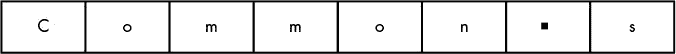
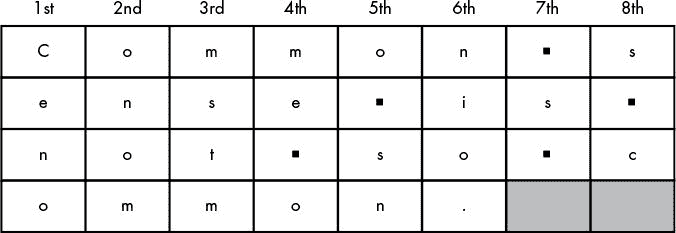
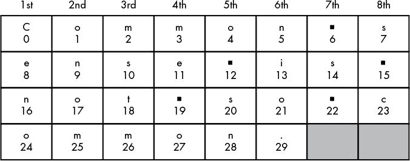
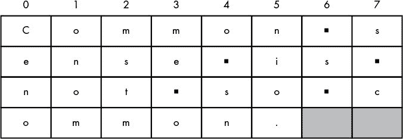
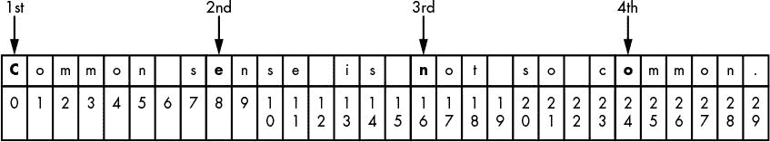
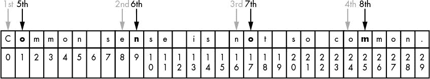

# 7 用换位密码加密

> 原文：<https://inventwithpython.com/cracking/chapter7.html>

“辩称你不在乎隐私权是因为你没什么可隐瞒的，这与说你不在乎言论自由是因为你无话可说没什么区别。”
—爱德华·斯诺登，2015


凯撒密码不安全。对一台计算机来说，暴力破解所有 66 个可能的键并不需要太多时间。另一方面，换位密码更难以暴力破解，因为可能的密钥数量取决于消息的长度。有许多不同类型的转置密码，包括围栏密码、路由密码、Myszkowski 转置密码和中断转置密码。本章涵盖了一个简单的换位密码，称为*列式换位密码*。

**本章涵盖的主题**

*   用`def`语句创建函数

*   自变量和参数

*   全局和局部范围内的变量

*   `main()`功能

*   列表数据类型

*   列表和字符串的相似性

*   列表列表

*   扩充赋值运算符`(+=, -=, *=, /=)`

*   `join()`字符串方法

*   返回值和`return`语句

*   `__name__`变量

### **换位密码的工作原理**

换位密码不是用其他字符替换字符，而是将邮件的符号重新排列成使原始邮件不可读的顺序。因为每一个密钥都创造了不同的字符顺序，或称*排列*，密码分析者不知道如何将密文重新排列成原始信息。

用换位密码加密的步骤如下:

1.  计算消息和密钥中的字符数。

2.  画一排与钥匙数量相等的盒子(例如，8 个盒子代表 8 个钥匙)。

3.  开始从左到右填写方框，每个方框输入一个字符。

4.  当你用完了所有的方块，但仍然有更多的字符，添加另一行方块。

5.  当到达最后一个字符时，在最后一行未使用的框中添加阴影。

6.  从左上角开始，沿着每一列，写出字符。当到达一列的底部时，移动到右边的下一列。跳过任何阴影框。这将是密文。

为了了解这些步骤在实践中是如何工作的，我们将手动加密一条消息，然后将这个过程转换成一个程序。

#### ***手动加密信息***

在我们开始写代码之前，让我们加密“常识并不那么普遍”这个消息。使用铅笔和纸。包括空格和标点，这条消息有 30 个字符。对于本例，您将使用数字 8 作为密钥。此密码类型的可能密钥范围是从 2 到消息大小的一半，即 15。但是消息越长，可能的密钥就越多。使用柱状置换密码加密整本书将允许数千个可能的密钥。

第一步，连续画八个方框与键号匹配，如图图 7-1 。


*图 7-1:第一行的框数要和键数匹配。*

第二步是开始将你想要加密的信息写入盒子，每个盒子放一个字符，如图 7-2 所示。记住空格也是字符(这里用/表示)。



*图 7-2:每框填写一个字符，包括空格。*

你只有八个盒子，但是消息里有 30 个字符。当你用完盒子后，在第一行下面再画一行八个盒子。继续创建新行，直到你写完整个消息，如图 7-3 所示。



*图 7-3:添加更多的行，直到填满整个消息。*

在最后一行的两个框中画阴影，以提醒忽略它们。密文由从左上方的方框中读取的字母组成。 *C* 、 *e* 、 *n* 和 *o* 来自第一列，如图所示。当到达一列的最后一行时，移动到右边下一列的顶行。接下来的字符是 *o* 、 *n* 、 *o* 、 *m* 。忽略阴影框。

密文是“Cenoonommstmme oo snnio。s . s . c,“s . s . c ”,它被充分地扰乱，以防止有人通过查看它来理解原始消息。

#### ***创建加密程序***

要制作一个加密程序，你需要将这些纸上谈兵的步骤翻译成 Python 代码。让我们再次看看如何使用密钥`8`加密字符串`'Common sense is not so common.'`。对于 Python 来说，一个字符在字符串中的位置就是它的编号索引，所以把字符串中每个字母的索引加到你原来的加密图的方框中，如图图 7-4 所示。(记住索引以`0`开始，而不是`1`。)



*图 7-4:给每个盒子加上索引号，从 0 开始。*

这些方框显示第一列具有索引`0`、`8`、`16`和`24`处的字符(它们是`'C'`、`'e'`、`'n'`和`'o'`)。下一列具有索引`1`、`9`、`17`和`25`处的字符(它们是`'o'`、`'n'`、`'o'`和`'m'`)。注意出现的模式:第 *n* 列包含字符串中索引为 0+(*n*–1)、8+(*n*–1)、16+(*n*–1)、24+(*n*–1)的所有字符，如图图 7-5 所示。


*图 7-5:每个盒子的索引遵循一个可预测的模式。*

第 7 列和第 8 列的最后一行有一个例外，因为 24+(7–1)和 24+(8–1)将大于 29，这是字符串中最大的索引。在这些情况下，你只需将 0、8 和 16 加到 *n* (并跳过 24)。

数字 0、8、16 和 24 有什么特别的？这些是从 0 开始添加密钥(在本例中是 8)时得到的数字。所以，0 + 8 是 8，8 + 8 是 16，16 + 8 是 24。24 + 8 的结果将是 32，但是因为 32 比消息的长度大，所以您将在 24 处停止。

对于第 *n* 列的字符串，从索引(*n*–1)开始，继续加 8(键)得到下一个索引。只要索引小于 30(消息长度)，就一直加 8，此时移到下一列。

如果您将每一列想象成一个字符串，那么结果将是一个包含八个字符串的列表，如下所示:`'Ceno'`、`'onom'`、`'mstm'`、`'me o'`、`'o sn'`、`'nio.'`、`' s '`、`'s c'`。如果您按顺序将字符串连接在一起，结果将是密文:`'Cenoonommstmme oo snnio. s s c'`。在这一章的后面，你会学到一个叫做*列表*的概念，它会让你做到这一点。

### 换位密码加密程序的源代码

选择**文件****新文件**，打开新文件编辑器窗口。在文件编辑器中输入以下代码，然后保存为*transpositonecrypt . py*。记得将 *pyperclip.py* 模块放在与*transpositonecrypt . py*文件相同的目录下。然后按 F5 运行程序。

*换位
Encrypt.py*

```py
 1\. # Transposition Cipher Encryption
 2\. # https://www.nostarch.com/crackingcodes/ (BSD Licensed)
 3.
 4\. import pyperclip
 5.
 6\. def main():
 7.     myMessage = 'Common sense is not so common.'
 8.     myKey = 8
 9.
10.     ciphertext = encryptMessage(myKey, myMessage)
11.
12.     # Print the encrypted string in ciphertext to the screen, with
13.     # a | ("pipe" character) after it in case there are spaces at
14.     # the end of the encrypted message:
15.     print(ciphertext + '|')
16.
17.     # Copy the encrypted string in ciphertext to the clipboard:
18.     pyperclip.copy(ciphertext)
19.
20.
21\. def encryptMessage(key, message):
22.     # Each string in ciphertext represents a column in the grid:
23.     ciphertext = [''] * key
24.
25.     # Loop through each column in ciphertext:
26.     for column in range(key):
27.         currentIndex = column
28.
29.         # Keep looping until currentIndex goes past the message length:
30.         while currentIndex < len(message):
31.             # Place the character at currentIndex in message at the
32.             # end of the current column in the ciphertext list:
33.             ciphertext[column] += message[currentIndex]
34.
35.             # Move currentIndex over:
36.             currentIndex += key
37.
38.     # Convert the ciphertext list into a single string value and return it:
39.     return ''.join(ciphertext)
40.
41.
42\. # If transpositionEncrypt.py is run (instead of imported as a module) call
43\. # the main() function:
44\. if __name__ == '__main__':
45.     main()
```

### 换位密码加密程序的运行示例

当您运行*transpositonecrypt . py*程序时，它会产生以下输出:

```py
Cenoonommstmme oo snnio. s s c|
```

竖线字符(`|`)标记密文的结尾，以防结尾有空格。这个密文(末尾没有管道字符)也被复制到剪贴板，因此您可以将它粘贴到给某人的电子邮件中。如果您想要加密不同的消息或使用不同的密钥，请更改第 7 行和第 8 行中分配给`myMessage`和`myKey`变量的值。然后再次运行该程序。

### 用 def 语句创建自己的函数

导入`pyperclip`模块后，您将在第 6 行使用一个`def`语句创建一个定制函数`main()`。

```py
 1\. # Transposition Cipher Encryption
 2\. # https://www.nostarch.com/crackingcodes/ (BSD Licensed)
 3.
 4\. import pyperclip
 6\. def main():
 7.     myMessage = 'Common sense is not so common.'
 8.     myKey = 8
```

`def`语句意味着你正在创建，或者说*定义了*，一个你可以在程序中稍后调用的新函数。`def` 语句后的代码块是调用函数时将运行的代码。当你*调用*这个函数时，执行在函数的`def`语句之后的代码块内移动。

正如你在第三章中了解到的，在某些情况下，函数会接受*参数*，这些参数是函数可以在代码中使用的值。例如，`print()`可以将一个字符串值作为其括号之间的参数。当您定义一个接受参数的函数时，您在它的`def`语句中的括号之间放置一个变量名。这些变量被称为*参数*。这里定义的`main()`函数没有参数，所以在调用时没有参数。如果您试图调用一个函数，而该函数的参数数量太多或太少，Python 将会抛出一条错误消息。

#### ***定义带参数的函数***

让我们用一个参数创建一个函数，然后用一个参数调用它。打开一个新的文件编辑器窗口，并在其中输入以下代码:

*你好
Function.py*

```py
➊ def hello(name):
➋    print('Hello, ' + name)
➌ print('Start.')
➍ hello('Alice')
➎ print('Call the function again:')
➏ hello('Bob')
➐ print('Done.')
```

将该程序另存为 *helloFunction.py* 并按 F5 运行。输出如下所示:

```py
Start.
Hello, Alice
Call the function again:
Hello, Bob
Done.
```

当 *helloFunction.py* 程序运行时，执行从顶部开始。`def`语句 ➊ 用一个参数定义了`hello()`函数，这个参数就是变量`name`。执行会跳过`def`语句 ➋ 之后的块，因为该块只在函数被调用时运行。接下来，它执行`print('Start.')` ➌ ，这就是为什么`'Start.'`是运行程序时打印的第一个字符串。

`print('Start.')`之后的下一行是对`hello()`的第一次函数调用。程序执行跳转到`hello()`功能块 ➋ 的第一行。字符串`'Alice'`作为参数传递，并被赋给参数`name`。这个函数调用将字符串`'Hello, Alice'`打印到屏幕上。

当程序执行到`def`语句块的底部时，执行跳回到函数调用 ➍ 的那一行，并从那里继续执行代码，所以`'Call the function again:'`被打印 ➎ 。

接下来是对`hello()` ➏ 的第二次调用。程序执行跳回到`hello()`函数的定义 ➋ 并再次执行那里的代码，在屏幕上显示`'Hello, Bob'`。然后函数返回，执行到下一行，即`print('Done.')`语句 ➐ ，并执行它。这是程序的最后一行，所以程序退出。

#### ***对参数的更改只存在于*** 功能内部

在交互式 shell 中输入以下代码。这段代码定义并调用一个名为`func()`的函数。请注意，交互式 shell 要求您在`param = 42`后输入一个空行来关闭`def`语句块:

```py
>>> def func(param):
        param = 42

>>> spam = 'Hello'
>>> func(spam)
>>> print(spam)
Hello
```

`func()`函数接受一个名为`param`的参数，并将其值设置为`42`。函数外的代码创建一个`spam`变量并将其设置为字符串值，然后在`spam`上调用该函数并打印出`spam`。

当你运行这个程序时，最后一行的`print()`调用将打印`'Hello'`，而不是`42`。当以`spam`作为参数调用`func()`时，只有`spam`内的值被复制并赋给`param`。在函数内部对`param`所做的任何改变将*而不是*改变`spam`变量中的值。(当您传递列表或字典值时，此规则有一个例外，但这在第 119 页的列表变量使用引用中有解释。)

每次调用函数时，都会创建一个*局部作用域*。在函数调用过程中创建的变量存在于这个局部范围内，被称为*局部变量*。参数总是存在于局部范围内(它们是在调用函数时创建并赋值的)。把一个*范围*想象成一个容器，变量存在于其中。当函数返回时，局部作用域被销毁，作用域中包含的局部变量被遗忘。

在每个函数之外创建的变量存在于*全局范围*中，被称为*全局变量*。当程序退出时，全局作用域被破坏，程序中的所有变量都被遗忘。(分别在第 5 章和第 6 章中的逆向密码和凯撒密码程序中的所有变量都是全局变量。)

变量必须是局部的或全局的；不可能两者兼得。两个不同的变量可以有相同的名字，只要它们在不同的范围内。它们仍然被认为是两个不同的变量，就像旧金山的大街和伯明翰的大街是不同的一样。

需要理解的重要思想是，被“传递”到函数调用中的参数值是被复制到参数中的。因此，即使参数被更改，提供参数值的变量也不会更改。

#### ***定义主()函数***

在*transpositonecrypt . py*中的第 6 到第 8 行，你可以看到我们已经定义了一个`main()`函数，它将在被调用时为变量`myMessage`和`myKey`设置值:

```py
 6\. def main():
 7.     myMessage = 'Common sense is not so common.'
 8.     myKey = 8
```

本书中其余的程序也有一个名为`main()`的函数，在每个程序开始时被调用。我们有一个`main()`函数的原因会在本章末尾解释，但是现在只需要知道在本书中的程序运行后不久`main()`就会被调用。

第 7 行和第 8 行是定义`main()`的代码块中的前两行。在这几行中，变量`myMessage`和`myKey`存储要加密的明文消息和用于加密的密钥。第 9 行是一个空行，但仍然是代码块的一部分，它将第 7 行和第 8 行与第 10 行分开，以使代码更具可读性。第 10 行通过调用一个带有两个参数的函数将变量`ciphertext`指定为加密的消息:

```py
10.     ciphertext = encryptMessage(myKey, myMessage)
```

进行实际加密的代码在第 21 行后面定义的`encryptMessage()`函数中。这个函数有两个参数:密钥的整数值和要加密的消息的字符串值。在这种情况下，我们传递变量`myMessage`和`myKey`，我们刚刚在第 7 行和第 8 行定义了它们。向函数调用传递多个参数时，用逗号分隔参数。

`encryptMessage()`的返回值是加密密文的字符串值。该字符串存储在`ciphertext`中。

密文信息打印到屏幕的第 15 行，并复制到剪贴板的第 18 行:

```py
12.     # Print the encrypted string in ciphertext to the screen, with
13.     # a | ("pipe" character) after it in case there are spaces at
14.     # the end of the encrypted message:
15.     print(ciphertext + '|')
16.
17.     # Copy the encrypted string in ciphertext to the clipboard:
18.     pyperclip.copy(ciphertext)
```

该程序在消息的末尾打印一个管道字符(`|`)，这样用户就可以看到密文末尾的任何空格字符。

第 18 行是`main()`功能的最后一行。在它执行之后，程序执行返回到调用它的行之后的行。

### 将密钥和消息作为参数传递

第 21 行括号之间的`key`和`message`变量是参数:

```py
21\. def encryptMessage(key, message):
```

当在第 10 行调用`encryptMessage()`函数时，传递两个参数值(在`myKey`和`myMessage`中的值)。当执行移动到函数的顶部时，这些值被分配给参数`key`和`message`。

您可能想知道为什么还要有`key`和`message`参数，因为在`main()`函数中已经有了变量`myKey`和`myMessage`。我们需要不同的变量，因为`myKey`和`myMessage`在`main()`函数的局部范围内，不能在`main()`之外使用。

### 列表数据类型

*transpositonecrypt . py*程序中的第 23 行使用了一种叫做*列表*的数据类型:

```py
22.     # Each string in ciphertext represents a column in the grid:
23.     ciphertext = [''] * key
```

在我们继续之前，你需要理解列表是如何工作的，以及你能用它们做什么。列表值可以包含其他值。类似于字符串如何以引号开始和结束，列表值以左括号`[`开始，以右括号`]`结束。列表中存储的值在括号之间。如果列表中有多个值，则这些值用逗号分隔。

要查看运行中的列表，请在交互式 shell 中输入以下内容:

```py
>>> animals = ['aardvark', 'anteater', 'antelope', 'albert']
>>> animals
['aardvark', 'anteater', 'antelope', 'albert']
```

`animals`变量存储一个列表值，在这个列表值中有四个字符串值。列表中的单个值也被称为*项*或*元素*。当您必须在一个变量中存储多个值时，列表是理想的选择。

您可以对字符串进行的许多操作也适用于列表。例如，索引和切片处理列表值的方式与处理字符串值的方式相同。索引指的是列表中的一项，而不是字符串中的单个字符。在交互式 shell 中输入以下内容:

```py
   >>> animals = ['aardvark', 'anteater', 'albert']
➊ >>> animals[0]
   'aardvark'
   >>> animals[1]
   'anteater'
   >>> animals[2]
   'albert'
➋ >>> animals[1:3]
   ['anteater', 'albert']
```

请记住，第一个指标是`0`，而不是`1` ➊ 。类似于对字符串使用切片会得到一个作为原始字符串一部分的新字符串，对列表使用切片会得到一个作为原始列表一部分的列表。请记住，如果一个切片有第二个索引，该切片只进行到*但不包括*第二个索引 ➋ 处的项目。

一个`for`循环也可以遍历列表中的值，就像它可以遍历字符串中的字符一样。存储在`for`循环变量中的值是列表中的单个值。在交互式 shell 中输入以下内容:

```py
>>> for spam in ['aardvark', 'anteater', 'albert']:
...   print('For dinner we are cooking ' + spam)
...
For dinner we are cooking aardvark
For dinner we are cooking anteater
For dinner we are cooking albert
```

每次循环迭代时，`spam`变量从列表中被赋予一个新值，从列表的`0`索引开始，直到列表的结尾。

#### ***重新分配列表中的项目***

您还可以通过使用带有普通赋值语句的列表索引来修改列表中的项目。在交互式 shell 中输入以下内容:

```py
   >>> animals = ['aardvark', 'anteater', 'albert']
➊ >>> animals[2] = 9999
   >>> animals
➋ ['aardvark', 'anteater', 9999]
```

为了修改`animals`列表的第三个成员，我们使用索引来获得第三个值`animals[2]`，然后使用赋值语句将其值从`'albert'`更改为值`9999` ➊ 。当我们再次检查列表的内容时，`'albert'`不再包含在 ➋ 列表中。

**重新分配字符串中的字符**

虽然您可以重新分配列表中的项目，但不能重新分配字符串值中的字符。在交互式 shell 中输入以下代码:

```py
>>> 'Hello world!'[6] = 'X'
```

您会看到以下错误:

```py
Traceback (most recent call last):
  File <pyshell#0>, line 1, in <module>
    'Hello world!'[6] = 'X'
TypeError: 'str' object does not support item assignment
```

您看到这个错误的原因是 Python 不允许您在字符串的索引值上使用赋值语句。相反，要更改字符串中的字符，您需要使用切片创建一个新的字符串。在交互式 shell 中输入以下内容:

```py
>>> spam = 'Hello world!'
>>> spam = spam[:6] + 'X' + spam[7:]
>>> spam
'Hello Xorld!'
```

首先，从字符串的开头开始，一直到要更改的字符，获取一个片段。然后你可以把它连接到新字符的字符串，以及从新字符后的字符到字符串末尾的一段。这导致原始字符串只有一个字符发生了变化。

#### ***列表列表***

列表值甚至可以包含其他列表。在交互 shell 中输入以下内容:

```py
>>> spam = [['dog', 'cat'], [1, 2, 3]]
>>> spam[0]
['dog', 'cat']
>>> spam[0][0]
'dog'
>>> spam[0][1]
'cat'
>>> spam[1][0]
1
>>> spam[1][1]
2
```

`spam[0]`的值评估为列表`['dog', 'cat']`，它有自己的索引。用于`spam[0][0]`的双索引括号表示我们从第一个列表中取出第一个项目:`spam[0]`计算为`['dog', 'cat']`，`['dog', 'cat'][0]`计算为`'dog'`。

#### ***使用 len()和 in 运算符使用列表***

您已经使用了`len()`来表示字符串中的字符数(即字符串的长度)。`len()`函数也作用于列表值，并返回列表中项目数的整数。

在交互式 shell 中输入以下内容:

```py
>>> animals = ['aardvark', 'anteater', 'antelope', 'albert']
>>> len(animals)
4
```

类似地，您已经使用了`in`和`not in`操作符来指示一个字符串是否存在于另一个字符串值中。`in`操作符也用于检查列表中是否有值，而`not in`操作符检查列表中是否没有值。在交互式 shell 中输入以下内容:

```py
   >>> animals = ['aardvark', 'anteater', 'antelope', 'albert']
   >>> 'anteater' in animals
   True
   >>> 'anteater' not in animals
   False
➊ >>> 'anteat' in animals
   False
➋ >>> 'anteat' in animals[1]
   True
   >>> 'delicious spam' in animals
   False
```

为什么 ➊ 的表达式返回`False`，而 ➋ 的表达式返回`True`？记住`animals`是一个列表值，而`animals[1]`计算的是字符串值`'anteater'`。因为字符串`'anteat'`不在`animals`列表中，所以 ➊ 处的表达式评估为`False`。然而， ➋ 处的表达式评估为`True`，因为`animals[1]`是字符串`'anteater'`并且`'anteat'`存在于该字符串中。

类似于一组空引号表示一个空字符串值，一组空括号表示一个空列表。在交互式 shell 中输入以下内容:

```py
>>> animals = []
>>> len(animals)
0
```

`animals`列表为空，因此其长度为`0`。

#### ***用+和*运算符列出串联和复制***

您知道`+`和`*`操作符可以连接和复制字符串；相同的操作符也可以连接和复制列表。在交互式 shell 中输入以下内容。

 ```py
>>> ['hello'] + ['world']
['hello', 'world']
>>> ['hello'] * 5
['hello', 'hello', 'hello', 'hello', 'hello']
```

关于字符串和列表的相似之处，已经说得够多了。请记住，您可以对字符串值进行的大多数操作也适用于列表值。

### 换位加密算法

我们将在加密算法中使用列表来创建密文。让我们回到 *transpositionEncrypt.py* 程序中的代码。在我们前面看到的第 23 行中，`ciphertext`变量是一个空字符串值列表:

```py
22.     # Each string in ciphertext represents a column in the grid:
23.     ciphertext = [''] * key
```

`ciphertext`变量中的每个字符串代表换位密码网格中的一列。因为列的数量等于键的数量，所以可以使用列表复制将一个包含一个空字符串值的列表乘以`key`中的值。这就是第 23 行如何计算出包含正确数量的空白字符串的列表。字符串值将被分配到网格的一列中的所有字符。结果将是代表每一列的字符串值的列表，如本章前面所讨论的。因为列表索引从 0 开始，所以还需要从 0 开始标记每一列。所以`ciphertext[0]`是最左边的一列，`ciphertext[1]`是右边的一列，以此类推。

为了了解这是如何工作的，让我们再次从“常识并不常见”的角度来看网格。本章前面的示例(列表索引对应的列号添加到顶部)，如图图 7-6 所示。



*图 7-6:带有每列列表索引的示例消息网格*

如果我们手动将字符串值分配给该网格的`ciphertext`变量，它将如下所示:

```py
>>> ciphertext = ['Ceno', 'onom', 'mstm', 'me o', 'o sn', 'nio.', ' s ', 's c']
>>> ciphertext[0]
'Ceno'
```

下一步是向`ciphertext`中的每个字符串添加文本，就像我们刚刚在手动示例中所做的那样，只是这次我们添加了一些代码，让计算机以编程方式完成:

```py
25.     # Loop through each column in ciphertext:
26.     for column in range(key):
27.         currentIndex = column
```

第 26 行的`for`循环对每一列迭代一次，变量`column`具有用于索引`ciphertext`的整数值。在通过`for`循环的第一次迭代中，`column`变量被设置为`0`；第二次迭代时，设置为`1`；然后`2`；诸如此类。我们在`ciphertext`中有字符串值的索引，我们希望稍后使用表达式`ciphertext[column]`来访问它。

同时，`currentIndex`变量保存了程序在`for`循环的每次迭代中查看的`message`字符串的索引。在循环的每次迭代中，第 27 行将`currentIndex`设置为与`column`相同的值。接下来，我们将通过一次一个字符地将加扰后的消息连接在一起来创建密文。

### 增广赋值运算符

到目前为止，当我们相互连接或添加值时，我们使用了`+`操作符将新值添加到变量中。通常，当您为变量赋值新值时，您希望它基于变量的当前值，因此您将变量作为表达式的一部分来计算并赋值给变量，如交互式 shell 中的示例所示:

```py
>>> spam = 40
>>> spam = spam + 2
>>> print(spam)
42
```

还有其他方法可以根据变量的当前值来操作变量中的值。例如，您可以通过使用*增强赋值操作符*来实现这一点。语句`spam` `+=` `2`使用了`+=`增广赋值运算符，它将*与`spam` `=` `spam` `+` `2`做同样的事情。只是打字时间短了一点。操作符使用整数做加法，使用字符串做字符串连接，使用列表做列表连接。表 7-1 显示了扩充赋值运算符及其等价赋值语句。*

**表 7-1:** 增广赋值运算符

| **扩充赋值** | **等效正态分配** |
| --- | --- |
| `spam += 42` | `spam = spam + 42` |
| `spam -= 42` | `spam = spam - 42` |
| `spam *= 42` | `spam = spam * 42` |
| `spam /= 42` | `spam = spam / 42` |

我们将使用扩充赋值操作符将字符连接到我们的密文中。

### **通过消息移动 currentIndex】**

`currentIndex`变量保存了`message`字符串中下一个字符的索引，该字符串将被连接到`ciphertext`列表中。在第 30 行的`while`循环的每次迭代中，`key`被添加到`currentIndex`中，以指向`message`中的不同字符，并且在第 26 行的`for`循环的每次迭代中，`currentIndex`被设置为`column`变量中的值。

为了对`message`变量中的字符串进行加扰，我们需要取`message`的第一个字符`'C'`，并将其放入`ciphertext`的第一个字符串中。然后，我们将跳过八个字符进入`message`(因为`key`等于`8`，并将这个字符`'e'`连接到密文的第一个字符串。我们将继续根据键跳过字符，并连接每个字符，直到我们到达消息的结尾。这样做将创建字符串`'Ceno'`，这是密文的第一列。然后我们将再次这样做，但是从`message`中的第二个字符开始创建第二列。

从第 26 行开始的`for`循环中有一个从第 30 行开始的`while`循环。这个`while`循环在`message`中找到并连接正确的字符来生成每一列。当`currentIndex`小于`message`的长度时循环；

```py
29.         # Keep looping until currentIndex goes past the message length:
30.         while currentIndex < len(message):
31.             # Place the character at currentIndex in message at the
32.             # end of the current column in the ciphertext list:
33.             ciphertext[column] += message[currentIndex]
34.
35.             # Move currentIndex over:
36.             currentIndex += key
```

对于每一列，`while`循环遍历原始的`message`变量，并通过将`key`加到`currentIndex`中来挑选出`key`间隔中的字符。在第 27 行上，对于`for`循环的第一次迭代，`currentIndex`被设置为从`0`开始的`column`的值。

如图 7-7 中的所示，`message[currentIndex]`是`message`第一次迭代的第一个字符。在`message[currentIndex]`T13 的字符被连接到`ciphertext[column]`以在第 33 行开始第一列。第 36 行每次通过循环将`key`(即`8`)中的值添加到`currentIndex`。第一次是`message[0]`，第二次`message[8]`，第三次`message[16]`，第四次`message[24]`。



*图 7-7:当列设置为 0* 时，在 for 循环的第一次迭代中，指向消息【current index】所指内容的箭头

虽然`currentIndex`中的值小于`message`字符串的长度，但是您希望继续将`message[currentIndex]`处的字符连接到`ciphertext`中`column`索引处的字符串末尾。当`currentIndex`大于`message`的长度时，执行退出`while`循环，回到`for`循环。因为在`while`循环之后的`for`块中没有代码，所以`for`循环迭代，`column`被设置为`1`，`currentIndex`从与`column`相同的值开始。

现在，当第 36 行在第 30 行的`while`循环的每次迭代中将`8`加到`currentIndex`时，索引将为`1`、`9`、`17`和`25`，如图图 7-8 所示。



*图 7-8:当列设置为 1* 时，在循环的的第二次迭代中，指向消息【current index】所指的箭头

由于`message[1]`、`message[9]`、`message[17]`和`message[25]`连接在`ciphertext[1]`的末尾，它们形成了字符串`'onom'`。这是网格的第二列。

当`for`循环完成其余列的循环后，`ciphertext`中的值为`['Ceno',` `'onom',` `'mstm',` `'me o',` `'o sn',` `'nio.',` `' s ',` `'s c']`。有了字符串列的列表后，我们需要将它们连接在一起，形成一个字符串，这就是整个密文:`'Cenoonommstmme oo snnio. s s c'`。

### **join()字符串方法**

第 39 行使用了`join()`方法将`ciphertext`的各个列字符串连接成一个字符串。对一个字符串值调用`join()`方法，并获取一个字符串列表。它返回一个字符串，列表中的所有成员都由调用`join()`的字符串连接。(如果您只想将字符串连接在一起，这是一个空白字符串。)在交互式 shell 中输入以下内容:

```py
   >>> eggs = ['dogs', 'cats', 'moose']
➊ >>> ''.join(eggs)
   'dogscatsmoose'
➋ >>> ', '.join(eggs)
   'dogs, cats, moose'
➌ >>> 'XYZ'.join(eggs)
   'dogsXYZcatsXYZmoose'
```

当你在一个空字符串上调用`join()`并加入列表`eggs` ➊ 时，你会得到列表的字符串，它们之间没有字符串。在某些情况下，你可能想要在一个列表中分离每个成员，以使其更具可读性，我们已经在 ➋ 通过在字符串`', '`上调用`join()`做到了这一点。这将在列表的每个成员之间插入字符串`', '`。你可以在列表成员之间插入任何你想要的字符串，正如你在 ➌ 看到的。

### **返回值和返回语句**

函数(或方法)调用总是计算出一个值。这是函数或方法调用返回的值*，也称为函数的*返回值*。当您使用`def`语句创建自己的函数时，`return`语句会告诉 Python 该函数的返回值是什么。第 39 行是一个`return`语句:*

```py
38.     # Convert the ciphertext list into a single string value and return it:
39.     return ''.join(ciphertext)
```

第 39 行调用空白字符串上的`join()`并将`ciphertext`作为参数传递，因此`ciphertext`列表中的字符串被连接成一个字符串。

#### ***返回语句示例***

`return`语句是`return`关键字，后跟要返回的值。您可以使用一个表达式来代替一个值，如第 39 行所示。当您这样做时，返回值是该表达式计算的任何值。打开一个新的文件编辑器窗口，进入如下程序，保存为 *addNumbers.py* ，然后按 F5 运行:

*addNumbers.py*

```py
1\. def addNumbers(a, b):
2.     return a + b
3.
4\. print(addNumbers(2, 40))
```

当您运行 *addNumbers.py* 程序时，输出如下:

```py
42
```

这是因为第 4 行的函数调用`addNumbers(2, 40)`计算结果为`42`。第 2 行`addNumbers()`中的`return`语句对表达式`a + b`求值，然后返回求值结果。

#### ***返回加密的密文***

在*transpositonecrypt . py*程序中，`encryptMessage()`函数的`return`语句返回一个字符串值，该值是通过连接`ciphertext`列表中的所有字符串而创建的。如果密文中的列表是`['Ceno',``'onom',``'mstm',``'me o',``'o sn',``'nio.',``' s ',``'s c']`，那么`join()`方法调用将返回`'Cenoonommstmme oo snnio. s s c'`。这个最后的字符串，即加密代码的结果，由我们的`encryptMessage()`函数返回。

使用函数的最大好处是程序员必须知道函数做什么，但不需要知道函数的代码是如何工作的。程序员可以理解，当他们调用`encryptMessage()`函数并传递给它一个整数以及一个用于`key`和`message`参数的字符串时，函数调用计算出一个加密的字符串。他们不需要知道`encryptMessage()`中的代码实际上是如何做到这一点的，这类似于你如何知道当你将一个字符串传递给`print()`时，它将打印该字符串，即使你从未见过`print()`函数的代码。

### **__ 名称 _ _ 变量**

你可以使用一个特殊的技巧将转置加密程序变成一个模块，这个技巧涉及到`main()`函数和一个名为`__name__`的变量。

当运行 Python 程序时，甚至在程序的第一行运行之前，`__name__`(即`name`之前的两个下划线和之后的两个下划线)就被赋予了字符串值`'__main__'`(同样，`main`之前和之后的两个下划线)。双下划线在 Python 中通常被称为 *dunder* ，而`__main__`被称为 *dunder main dunder* 。

在脚本文件的末尾(更重要的是，在所有的`def`语句之后)，您希望有一些代码来检查`__name__`变量是否被赋予了`'__main__'`字符串。如果是，你要调用`main()`函数。

第 44 行的`if`语句实际上是运行程序时执行的第一行代码之一(在第 4 行的`import`语句和第 6、21 行的`def`语句之后)。

```py
42\. # If transpositionEncrypt.py is run (instead of imported as a module) call
43\. # the main() function:
44\. if __name__ == '__main__':
45.     main()
```

以这种方式设置代码的原因是，尽管 Python 在程序运行时将`__name__`设置为`'__main__'`，但如果程序是由另一个 Python 程序导入的，它会将其设置为字符串`'transpositionEncrypt'`。类似于程序如何导入`pyperclip`模块来调用其中的函数，其他程序可能想要导入*transpositonecrypt . py*来调用其`encryptMessage()`函数，而不运行`main()`函数。当执行一个`import`语句时，Python 通过添加。 *py* 到文件名的末尾(这就是为什么`import` `pyperclip`导入 *pyperclip.py* 文件)。这就是我们的程序如何知道它是作为主程序运行还是作为模块被不同的程序导入。(您将在第 9 章的中导入*transpositonecrypt . py*作为一个模块。)

当您导入一个 Python 程序时，在程序执行之前，`__name__`变量被设置为文件名的 before 部分。 *py* 。当*transpositonecrypt . py*程序被导入时，所有的`def`语句都被运行(以定义导入程序想要使用的`encryptMessage()`函数)，但是`main()`函数没有被调用，所以`'Common` `sense` `is` `not` `so` `common.'`的带密钥`8`的加密代码没有被执行。

这就是为什么用`myKey`密钥加密`myMessage`字符串的代码在一个函数内部(这个函数按照惯例被命名为`main()`)。当*transpositonecrypt . py*被其他程序导入时`main()`里面的这段代码不会运行，但是这些其他程序仍然可以调用它的`encryptMessage()`函数。这就是函数的代码可以被其他程序重用的方式。

**注**

了解一个程序如何工作的一个有用的方法是在它运行时一步一步地跟踪它的执行。您可以使用在线程序跟踪工具在*查看 Hello 函数和换位密码加密程序的痕迹。跟踪工具将为您提供每行代码执行时程序正在做什么的可视化表示。*

### 摘要

咻！在本章中，你学习了几个新的编程概念。换位密码程序比第六章中的凯撒密码程序更复杂(但安全得多)。您在本章中学到的新概念、函数、数据类型和运算符使您能够以更复杂的方式操作数据。请记住，理解一行代码的大部分工作是按照 Python 的方式一步一步地评估它。

您可以将代码组织成称为函数的组，这些函数是用`def`语句创建的。参数值可以作为函数的参数传递给函数。参数是局部变量。所有函数之外的变量都是全局变量。局部变量不同于全局变量，即使它们与全局变量同名。一个函数中的局部变量也与另一个函数中的局部变量分开，即使它们同名。

列表值可以存储多个其他值，包括其他列表值。许多可以在字符串上使用的操作(比如索引、切片和使用`len()`函数)也可以在列表上使用。扩充赋值操作符为常规赋值操作符提供了一个很好的捷径。`join()`方法可以连接包含多个字符串的列表以返回单个字符串。

如果你对这些编程概念还不太熟悉，最好回顾一下这一章。在第八章中，你将学习如何使用换位密码解密。

**练习题**

练习题的答案可以在本书的网站*[【https://www.nostarch.com/crackingcodes/】](https://www.nostarch.com/crackingcodes/)*找到。

1.  用纸和笔，使用换位密码，用密钥 9 加密以下消息。为了您的方便，已经提供了字符数。

    *   在一棵巨大的橡树下有一大群猪，(61 个字符)

    *   它们嘎吱嘎吱地嚼着桅杆，发出咕噜咕噜的声音，因为桅杆已经熟了，很快就要掉下来了。(77 个字符)

    *   然后，他们小跑而去，因为风越来越大:他们留下了一个橡子，你可能再也看不到了。(94 个字符)

2.  在下面的程序中，每个垃圾邮件是全局变量还是局部变量？

    ```py
    spam = 42
    def foo():
        global spam
        spam = 99
        print(spam)
    ```

3.  下列每个表达式的值是多少？

    ```py
    [0, 1, 2, 3, 4][2]
    [[1, 2], [3, 4]][0]
    [[1, 2], [3, 4]][0][1]
    ['hello'][0][1]
    [2, 4, 6, 8, 10][1:3]
    list('Hello world!')
    list(range(10))[2]
    ```

4.  下列每个表达式的值是多少？

    ```py
    len([2, 4])
    len([])
    len(['', '', ''])
    [4, 5, 6] + [1, 2, 3]
    3 * [1, 2, 3] + [9]
    42 in [41, 42, 42, 42]
    ```

5.  四种增强赋值运算符是什么？