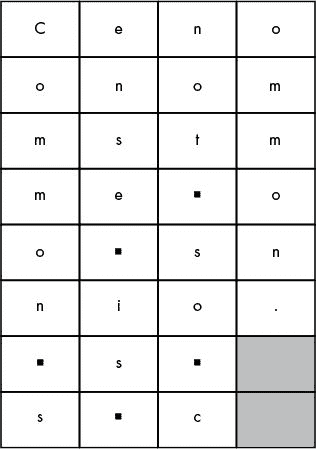
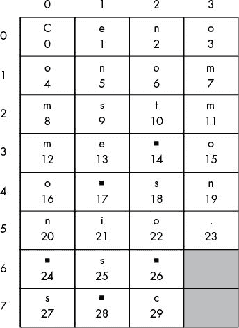

# 8 用换位密码解密

> 原文：<https://inventwithpython.com/cracking/chapter8.html>

“弱化加密或为加密设备和数据创建后门以供好人使用，实际上会产生漏洞供坏人利用。”
—蒂姆·库克，苹果公司首席执行官，2015 年


与凯撒密码不同，换位密码的解密过程不同于加密过程。在本章中，您将创建一个名为`transpositionecrypt.py`的独立程序来处理解密。

**本章涵盖的主题**

*   用换位密码解密

*   `round()`、`math.ceil()`和`math.floor()`功能

*   布尔运算符`and`和`or`

*   真值表

### 如何用纸上的换位密码解密

假装你已经发送了密文“Cenoonommstmme oo snnio。s s c”给朋友(并且他们已经知道秘密密钥是 8)。他们解密密文的第一步是计算他们需要画的盒子的数量。要确定这个数字，他们必须用密钥除密文的长度，如果结果不是整数，就四舍五入到最接近的整数。密文的长度是 30 个字符(与明文相同)，密钥是 8，所以 30 除以 8 是 3.75。



*图 8-1：通过反转网格解密消息*

将 3.75 四舍五入为 4，你的朋友将画出一个由四列(他们刚刚计算出的数字)和八行(钥匙)组成的格子。

你的朋友还需要计算需要遮蔽的箱子数量。使用盒子的总数(32)，他们减去密文的长度(30):32–30 = 2。它们在*最右边*列的*底部*的两个方框中着色。

然后他们开始填充盒子，在每个盒子里放一个密文字符。从左上角开始，它们向右填充，就像加密时一样。密文是“Cenoonommstmme oo snnio。s s c”，所以“Ceno”在第一行，“onom”在第二行，依此类推。当它们完成后，这些方框看起来将像图 8-1 中的(一个/代表一个空格)。

你收到密文的朋友注意到，当他们阅读这些列中的文本时，原始的明文被恢复:“常识并不那么普遍。”

概括地说，解密的步骤如下:

1.  通过将消息的长度除以键，然后向上舍入，计算出所需的列数。

2.  按列和行绘制方框。使用您在步骤 1 中计算的列数。行数与键相同。

3.  通过计算框的总数(行数乘以列数)并减去密文消息的长度来计算要加阴影的框的数量。

4.  在最右边一栏的底部画出你在第三步中计算出的盒子数量。

5.  从第一行开始，从左到右填写密文的字符。跳过任何阴影框。

6.  从上到下读取最左边的列，并在每一列中继续这样做，从而获得明文。

请注意，如果您使用不同的键，您将绘制错误的行数。即使您正确地遵循了解密过程中的其他步骤，明文也将是随机垃圾(类似于您在 Caesar 密码中使用了错误的密钥)。

### 换位密码解密程序的源代码

点击**文件 -> 新建文件**，打开一个新建文件编辑器窗口。在文件编辑器中输入以下代码，然后保存为*transposition encrypt . py*。记得把 `pyperclip.py` 放在同一个目录下。按`F5`运行程序。

*换位
解密. py*

```py
# Transposition Cipher Decryption
# https://www.nostarch.com/crackingcodes/ (BSD Licensed)

import math, pyperclip

def main():
    myMessage = 'Cenoonommstmme oo snnio. s s c'
    myKey = 8

    plaintext = decryptMessage(myKey, myMessage)

    # Print with a | (called "pipe" character) after it in case
    # there are spaces at the end of the decrypted message:
    print(plaintext + '|')

    pyperclip.copy(plaintext)


def decryptMessage(key, message):
    # The transposition decrypt function will simulate the "columns" and
    # "rows" of the grid that the plaintext is written on by using a list
    # of strings. First, we need to calculate a few values.

    # The number of "columns" in our transposition grid:
    numOfColumns = int(math.ceil(len(message) / float(key)))
    # The number of "rows" in our grid:
    numOfRows = key
    # The number of "shaded boxes" in the last "column" of the grid:
    numOfShadedBoxes = (numOfColumns * numOfRows) - len(message)

    # Each string in plaintext represents a column in the grid:
    plaintext = [''] * numOfColumns

    # The column and row variables point to where in the grid the next
    # character in the encrypted message will go:
    column = 0
    row = 0

    for symbol in message:
        plaintext[column] += symbol
        column += 1 # Point to the next column.

        # If there are no more columns OR we're at a shaded box, go back
        # to the first column and the next row:
        if (column == numOfColumns) or (column == numOfColumns - 1 and
              row >= numOfRows - numOfShadedBoxes):
            column = 0
            row += 1

    return ''.join(plaintext)


# If transpositionDecrypt.py is run (instead of imported as a module),
# call the main() function:
if __name__ == '__main__':
    main()
```

### 换位密码解密程序的示例运行

当您运行`transpositondecrypt.py`程序时，它会产生以下输出:

```py
Common sense is not so common.|
```

如果您想要解密不同的消息或使用不同的密钥，请更改第 7 行和第 8 行中分配给`myMessage`和`myKey`变量的值。

### 导入模块并设置 main()函数

`transpositonecrypt.py`程序的第一部分与`transpositonecrypt.py`的第一部分类似:

```py
# Transposition Cipher Decryption
# https://www.nostarch.com/crackingcodes/ (BSD Licensed)

import math, pyperclip

def main():
    myMessage = 'Cenoonommstmme oo snnio. s s c'
    myKey = 8

    plaintext = decryptMessage(myKey, myMessage)

    # Print with a | (called "pipe" character) after it in case
    # there are spaces at the end of the decrypted message:
    print(plaintext + '|')

    pyperclip.copy(plaintext)
```

第 4 行的模块`pyperclip`和另一个名为`math`的模块一起被导入。如果用逗号分隔模块名，可以用一个`import`语句导入多个模块。

我们在第 6 行开始定义的`main()`函数创建名为`myMessage`和`myKey`的变量，然后调用解密函数`decryptMessage` `()`。`decryptMessage()`的返回值是密文和密钥的解密明文。这被存储在一个名为`plaintext`的变量中，该变量被打印到屏幕上(在消息末尾有一个管道字符，以防消息末尾有空格),然后被复制到剪贴板。

### 用密钥解密消息

`decryptMessage()`函数遵循第 100 页中描述的六个解密步骤，然后以字符串形式返回解密结果。为了使解密更容易，我们将使用来自`math`模块的函数，该模块是我们在程序的前面导入的。

#### round()、math.ceil()和 math.floor()函数

Python 的`round()`函数会将浮点数(带小数点的数字)四舍五入为最接近的整数。`math.ceil()`和`math.floor()`函数(在 Python 的`math`模块中)将分别向上和向下舍入一个数字。

当使用`/`运算符对数字进行除法运算时，表达式返回一个浮点数(带小数点的数字)。即使数字被均匀地分割，也会发生这种情况。例如，在交互式 shell 中输入以下内容:

```py
>>> 21 / 7
3.0
>>> 22 / 5
4.4
```

如果你想把一个数字四舍五入到最接近的整数，你可以使用`round()`函数。要查看该函数如何工作，请输入以下内容:

```py
>>> round(4.2)
4
>>> round(4.9)
5
>>> round(5.0)
5
>>> round(22 / 5)
4
```

如果你只想取整，你需要使用`math.ceil()`函数，它代表“天花板”如果您只想向下舍入，请使用`math.floor()`。这些函数存在于`math`模块中，您需要在调用它们之前导入它们。在交互式 shell 中输入以下内容:

```py
>>> import math
>>> math.floor(4.0)
4
>>> math.floor(4.2)
4
>>> math.floor(4.9)
4
>>> math.ceil(4.0)
4
>>> math.ceil(4.2)
5
>>> math.ceil(4.9)
5
```

`math.floor()`函数将总是从浮点数中移除小数点，并将其转换为整数以向下舍入，而`math.ceil()`将递增浮点数的 1 位，并将其转换为整数以向上舍入。

#### decrypt message()函数

`decryptMessage()`函数将每个解密步骤实现为 Python 代码。它接受一个整数`key`和一个`message`字符串作为参数。`math.ceil()`函数用于`decryptMessage`T5 的换位解密，计算列数时确定需要制作的盒数:

```py
def decryptMessage(key, message):
    # The transposition decrypt function will simulate the "columns" and
    # "rows" of the grid that the plaintext is written on by using a list
    # of strings. First, we need to calculate a few values.

    # The number of "columns" in our transposition grid:
    numOfColumns = int(math.ceil(len(message) / float(key)))
    # The number of "rows" in our grid:
    numOfRows = key
    # The number of "shaded boxes" in the last "column" of the grid:
    numOfShadedBoxes = (numOfColumns * numOfRows) - len(message)
```

第 25 行通过将`len(message)`除以`key`中的整数来计算列数。这个值被传递给`math.ceil()`函数，返回值被存储在`numOfColumns`中。为了让这个程序与 Python 2 兼容，我们调用了`float()`，因此`key`变成了一个浮点值。在 Python 2 中，两个整数相除的结果会自动向下舍入。调用`float()`避免了这种行为，而不影响 Python 3 下的行为。

第 27 行计算行数，这是存储在`key`中的整数。该值存储在变量`numOfRows`中。

第 29 行计算网格中阴影框的数量，即列数乘以行数，减去消息的长度。

如果你在解密“Cenoonommstmme oo snnio。s s c”键为 8，`numOfColumns`设置为`4`，`numOfRows`设置为`8`，`numOfShadedBoxes`设置为`2`。

就像加密程序有一个名为`ciphertext`的变量，它是代表密文网格的字符串列表一样，`decryptMessage()`也有一个名为`plaintext`的字符串列表变量:

```py
    # Each string in plaintext represents a column in the grid:
    plaintext = [''] * numOfColumns
```

这些字符串最初是空白的，网格的每一列都有一个字符串。使用列表复制，您可以将一个包含一个空白字符串的列表乘以`numOfColumns`，得到一个包含几个空白字符串的列表，其数量等于所需的列数。

请记住，这个`plaintext`不同于`main()`功能中的`plaintext`。因为`decryptMessage` `()`函数和`main()`函数都有自己的局部作用域，所以函数的`plaintext`变量是不同的，只是碰巧具有相同的名称。

请记住，`'Cenoonommstmme oo snnio. s s c'`示例的网格看起来像第 100 页上的图 8-1 。

`plaintext`变量将有一个字符串列表，列表中的每个字符串将是这个网格的一个单独的列。对于这个解密，您希望`plaintext`以下面的值结束:

```py
['Common s', 'ense is ', 'not so c', 'ommon.']
```

这样，您可以将列表中的所有字符串连接在一起，以返回`'Common` `sense` `is` `not` `so` `common.'`字符串值。

为了制作列表，我们首先需要将`message`中的每个符号一次一个地放在`plaintext`列表中的正确字符串中。我们将创建两个名为`column`和`row`的变量来跟踪`message`中下一个字符应该去的列和行；这些变量应该从第一列和第一行的`0`开始。第 36 行和第 37 行是这样做的:

```py
    # The column and row variables point to where in the grid the next
    # character in the encrypted message will go:
    column = 0
    row = 0
```

第 39 行开始一个`for`循环，遍历`message`字符串中的字符。在这个循环中，代码将调整`column`和`row`变量，以便将`symbol`连接到`plaintext`列表中的正确字符串:

```py
    for symbol in message:
        plaintext[column] += symbol
        column += 1 # Point to the next column.
```

第 40 行将`symbol`连接到`plaintext`列表中索引`column`处的字符串，因为`plaintext`中的每个字符串代表一列。然后第 41 行将`1`加到`column`(也就是说，它*增加* `column`)，这样在循环的下一次迭代中，`symbol`将被连接到`plaintext`列表中的下一个字符串。

我们已经处理了递增的`column`和`row`，但是在某些情况下我们还需要将变量重置为`0`。要理解这样做的代码，您需要理解布尔运算符。

#### 布尔运算符

*布尔运算符*比较布尔值(或评估为布尔值的表达式)并评估为布尔值。布尔运算符`and`和`or`可以帮助您为`if`和`while`语句形成更复杂的条件。`and`运算符连接两个表达式，如果两个表达式的计算结果都为`True`，则计算结果为`True`。`or`运算符连接两个表达式，如果一个或两个表达式的计算结果为`True`，则计算结果为`True`；否则，这些表达式的计算结果为`False`。在交互式 shell 中输入以下内容，看看`and`操作符是如何工作的:

```py
>>> 10 > 5 and 2 < 4
True
>>> 10 > 5 and 4 != 4
False
```

第一个表达式的计算结果为`True`，因为`and`操作符两边的表达式都计算结果为`True`。换句话说，表达式`10 > 5 and 2 < 4`计算为`True and True`，后者又计算为`True`。

然而，在第二个表达式中，虽然`10 > 5`的计算结果是`True`，但是表达式`4 != 4`的计算结果是`False`。这意味着表达式计算结果为`True and False`。因为两个表达式都必须是`True`，以便`and`操作符计算出`True`，所以整个表达式计算出`False`。

如果您忘记了布尔运算符是如何工作的，您可以查看它的*真值表*，它显示了基于所使用的运算符，布尔值的不同组合的计算结果。表 8-1 是`and`操作员的真值表。

**表 8-1**：和运算符真值表

| **A 和 B** | **评估为** |
| --- | --- |
| `True and True` | `True` |
| `True and False` | `False` |
| `False and True` | `False` |
| `False and False` | `False` |

要查看`or`操作符是如何工作的，请在交互式 shell 中输入以下内容:

```py
>>> 10 > 5 or 4 != 4
True
>>> 10 < 5 or 4 != 4
False
```

当你使用`or`操作符时，只有表达式的一边必须是`True`，这样`or`操作符才能将整个表达式计算为`True`，这就是为什么`10 > 5 or 4 != 4`计算为`True`。但是，因为表达式`10 < 5`和表达式`4 != 4`都是`False`，所以第二个表达式的计算结果是`False or False`，而后者的计算结果是`False`。

`or`操作员真值表见表 8-2 。

**表 8-2**：或运算符真值表

| **A 或 B** | **评估为** |
| --- | --- |
| `True or True` | `True` |
| `True or False` | `True` |
| `False or True` | `True` |
| `False or False` | `False` |

第三个布尔运算符是`not`。`not`运算符的计算结果是它所运算的值的相反布尔值。所以`not True`是`False`，`not False`是`True`。在交互式 shell 中输入以下内容:

```py
>>> not 10 > 5
False
>>> not 10 < 5
True
>>> not False
True
>>> not not False
False
>>> not not not not not False
True
```

正如您在最后两个表达式中看到的，您甚至可以使用多个`not`操作符。`not`操作员真值表见表 8-3 。

**表 8-3**：非运算符真值表

| **不是一个** | **评估为** |
| --- | --- |
| `not True` | `False` |
| `not False` | `True` |

##### and 和 or 运算符是快捷方式

类似于`for`循环让你用更少的代码完成与`while`循环相同的任务，`and`和`or`操作符也让你缩短代码。在交互式 shell 中输入以下两段具有相同结果的代码:

```py
>>> if 10 > 5:
...   if 2 < 4:
...     print('Hello!')
...
Hello!
>>> if 10 > 5 and 2 < 4:
...   print('Hello!')
...
Hello!
```

`and`操作符可以代替两个`if`语句分别检查表达式的每个部分(其中第二个`if`语句在第一个`if`语句的块内)。

您也可以用`or`操作符替换 if 和`elif`语句。要尝试一下，请在交互式 shell 中输入以下内容:

```py
>>> if 4 != 4:
...   print('Hello!')
... elif 10 > 5:
...   print('Hello!')
...
Hello!
>>> if 4 != 4 or 10 > 5:
...   print('Hello!')
...
Hello!
```

`if`和`elif`语句将分别检查表达式的不同部分，而`or`操作符可以在一行中检查这两个语句。

##### 布尔运算符的运算顺序

你知道数学运算符是有运算顺序的，`and`、`or`、`not`运算符也是如此。首先评估`not`，然后评估`and`，然后评估`or`。在交互式 shell 中输入以下内容:

```py
>>> not False and False    # not False evaluates first
False
>>> not (False and False)  # (False and False) evaluates first
True
```

在第一行代码中，`not False`首先被求值，所以表达式变成了`True and False`，它求值为`False`。在第二行，括号先被求值，甚至在`not`运算符之前，所以`False and False`被求值为`False`，表达式变成`not (False)`，也就是`True`。

#### 调整列和行变量

现在你知道了布尔运算符是如何工作的，你可以学习如何在*transposition encrypt . py*中重置`column`和`row`变量。

在两种情况下，您会希望将`column`重置为`0`，以便在循环的下一次迭代中，`symbol`被添加到`plaintext`中列表的第一个字符串中。在第一种情况下，如果`column`增加到超过`plaintext`中的最后一个索引，您就要这样做。在这种情况下，`column`中的值将等于`numOfColumns`。(记住`plaintext`中的最后一个索引将是`numOfColumns`减一。所以当`column`等于`numOfColumns`时，已经过了最后一个索引。)

第二种情况是如果`column`在最后一个索引处，并且`row`变量指向最后一列中有阴影框的行。作为一个直观的例子，在图 8-2 中显示了列索引在顶部、行索引在底部的解密网格。



*图 8-2：列和行索引的解密网格*

您可以看到阴影框位于第 6 行和第 7 行的最后一列(其索引为`numOfColumns` `- 1`)。要计算哪些行索引可能有阴影框，请使用表达式`row >=` `numOfRows` `-` `numOfShadedBoxes`。在我们的八行示例中(索引为 0 到 7)，第 6 行和第 7 行是阴影的。无阴影框的数量是总行数(在我们的例子中是 8)减去阴影框的数量(在我们的例子中是 2)。如果电流`row`等于或大于这个数字(8–2 = 6)，我们可以知道我们有一个阴影框。如果这个表达式是`True`，`column`也等于`numOfColumns` `- 1`，那么 Python 遇到了阴影框；此时，您想要为下一次迭代将`column`重置为`0`:

```py
        # If there are no more columns OR we're at a shaded box, go back
        # to the first column and the next row:
        if (column == numOfColumns) or (column == numOfColumns - 1 and
              row >= numOfRows - numOfShadedBoxes):
            column = 0
            row += 1
```

这两种情况就是为什么第 45 行的条件是`(column ==` `numOfColumns` `) or (column == numOfColumns - 1 and row >= numOfRows -` `numOfShadedBoxes` `)`。尽管这看起来像一个很大很复杂的表达式，但是记住你可以把它分解成更小的部分。表达式`(` `column` `== numOfColumns)`检查列变量是否超出索引范围，表达式的第二部分检查我们是否在一个阴影框的`column`和`row`索引处。如果这两个表达式中的任何一个为真，执行的代码块将通过将`column`设置为`0`来将`column`重置为第一列。您还将增加变量`row`。

当第 39 行的`for`循环结束对`message`中每个字符的循环时，`plaintext`列表的字符串已经被修改，所以它们现在是解密后的顺序(如果使用了正确的键)。第 49 行的`join()`字符串方法将`plaintext`列表中的字符串连接在一起(每个字符串之间有一个空白字符串):

```py
    return ''.join(plaintext)
```

第 49 行还返回了函数`decryptMessage()`返回的字符串。

对于解密，`plaintext`将是`['Common s', 'ense is ', 'not so c',` `'ommon.']`，所以`''.join(plaintext)`将评估为`'Common sense is not so common.'`

### 调用 main()函数

我们的程序在导入模块并执行`def`语句后运行的第一行是第 54 行的`if`语句。

```py
# If transpositionDecrypt.py is run (instead of imported as a module),
# call the main() function:
if __name__ == '__main__':
    main()
```

与 transposition 加密程序一样，Python 通过检查`__name__`变量是否被设置为字符串值`'__main__'`来检查该程序是否已经运行(而不是由不同的程序导入)。如果是，代码执行`main()`函数。

### 总结

解密程序到此结束。大部分程序都在`decryptMessage()`函数中。我们编写的程序可以加密和解密“常识并不常见”这一信息用键 8；但是，您应该尝试其他几种消息和密钥，以检查加密然后解密的消息是否会产生相同的原始消息。如果你没有得到你期望的结果，你就会知道要么是加密代码要么是解密代码不起作用。在第九章中，我们将通过编写一个程序来测试我们的程序，从而自动化这个过程。

如果你想看到换位密码解密程序执行的一步一步的痕迹，请访问[*`www.nostarch.com/crackingcodes`*](https://www.nostarch.com/crackingcodes/)。

**练习题**

练习题的答案可以在本书的网站[`www.nostarch.com/crackingcodes`](https://www.nostarch.com/crackingcodes/)找到。

1.  使用纸和笔，用密钥 9 解密以下消息。/标记一个空格。总字符数已经帮你统计好了。

    *   h【CB】【irhdeuoubdi】【pre】

    *   a【b】【right thawa】【nwar】【ECI】na【e】【soon】
        【mah】【a】

    *   bmmsrldpnaua！toboo ' ktnuknrwos。【雅列戈号】【w】【nd，你】【oiady】

2.  当您在交互式 shell 中输入下面的代码时，每行会显示什么？

    ```py
    >>> math.ceil(3.0)
    >>> math.floor(3.1)
    >>> round(3.1)
    >>> round(3.5)
    >>> False and False
    >>> False or False
    >>> not not True
    ```

3.  画出 and、or 和 not 运算符的完整真值表。

4.  以下哪一项是正确的？

    ```py
    if __name__ == '__main__':
    if __main__ == '__name__':
    if _name_ == '_main_':
    if _main_ == '_name_':
    ```