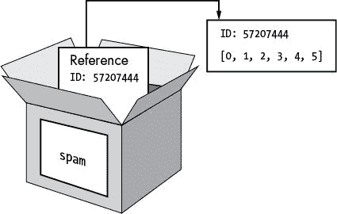
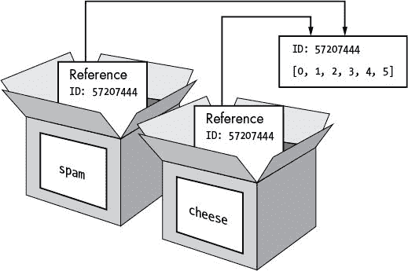
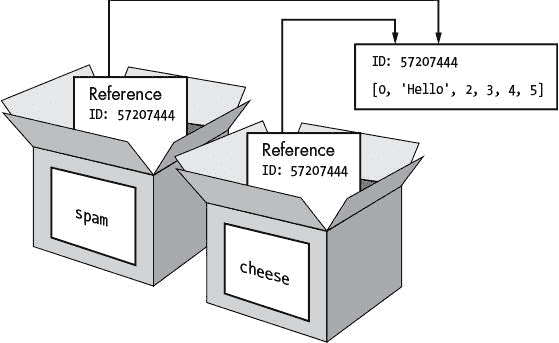

# 9 编写一个程序来测试你的程序

> 原文：<https://inventwithpython.com/cracking/chapter9.html>

安装有朝一日可能会促进警察国家的技术是糟糕的公民卫生
—布鲁斯·施奈尔，秘密与谎言


换位程序似乎在用不同的密钥加密和解密不同的信息方面工作得很好，但是你怎么知道它们总是*工作呢*？除非你用各种各样的`message`和`key`参数值测试`encryptMessage() and decryptMessage()`函数，否则你不能绝对肯定程序总是工作的。但是这要花很多时间，因为你必须在加密程序中输入信息，设置密钥，运行加密程序，将密文粘贴到解密程序中，设置密钥，然后运行解密程序。您还需要用几个不同的键和消息重复这个过程，这导致了许多令人厌烦的工作！

相反，让我们编写另一个生成随机消息和随机密钥的程序来测试密码程序。这个新程序会用来自*transpositonecrypt . py*的`encryptMessage()`对消息进行加密，然后将密文从*transpositonecrypt . py*传给`decryptMessage()`。如果`decryptMessage()`返回的明文与原始消息相同，程序就知道加密和解密程序工作了。使用另一个程序自动测试一个程序的过程叫做*自动化测试*。

需要尝试几种不同的信息和组合键，但计算机只需一分钟左右的时间就可以测试成千上万种组合。如果所有这些测试都通过了，您就可以更加确定您的代码能够正常工作。

**本章涵盖的主题**

*   `random.randint()`功能

*   `random.seed()`功能

*   列出参考

*   `copy.deepcopy()`功能

*   `random.shuffle()`功能

*   随机打乱字符串

*   `sys.exit()`功能

### **换位密码测试仪程序的源代码**

选择**文件****新文件**，打开新文件编辑器窗口。在文件编辑器中输入以下代码，保存为 `transpositionTest.py` 。然后按 F5 运行程序。

*换位
Test.py*

```py
 1\. # Transposition Cipher Test
 2\. # https://www.nostarch.com/crackingcodes/ (BSD Licensed)
 3.
 4\. import random, sys, transpositionEncrypt, transpositionDecrypt
 5.
 6\. def main():
 7.     random.seed(42) # Set the random "seed" to a static value.
 8.
 9.     for i in range(20): # Run 20 tests.
10.         # Generate random messages to test.
11.
12.         # The message will have a random length:
13.         message = 'ABCDEFGHIJKLMNOPQRSTUVWXYZ' * random.randint(4, 40)
14.
15.         # Convert the message string to a list to shuffle it:
16.         message = list(message)
17.         random.shuffle(message)
18.         message = ''.join(message) # Convert the list back to a string.
19.
20.         print('Test #%s: "%s..."' % (i + 1, message[:50]))
21.
22.         # Check all possible keys for each message:
23.         for key in range(1, int(len(message)/2)):
24.             encrypted = transpositionEncrypt.encryptMessage(key, message)
25.             decrypted = transpositionDecrypt.decryptMessage(key, encrypted)
26.
27.             # If the decryption doesn't match the original message, display
28.             # an error message and quit:
29.             if message != decrypted:
30.                 print('Mismatch with key %s and message %s.' % (key,
                      message))
31.                 print('Decrypted as: ' + decrypted)
32.                 sys.exit()
33.
34.     print('Transposition cipher test passed.')
35.
36.
37\. # If transpositionTest.py is run (instead of imported as a module) call
38\. # the main() function:
39\. if __name__ == '__main__':
40.     main()
```

### **转置密码测试程序的示例运行**

当您运行 `transpositionTest.py` 程序时，输出应该是这样的:

```py
Test #1: "JEQLDFKJZWALCOYACUPLTRRMLWHOBXQNEAWSLGWAGQQSRSIUIQ..."
Test #2: "SWRCLUCRDOMLWZKOMAGVOTXUVVEPIOJMSBEQRQOFRGCCKENINV..."
Test #3: "BIZBPZUIWDUFXAPJTHCMDWEGHYOWKWWWSJYKDQVSFWCJNCOZZA..."
Test #4: "JEWBCEXVZAILLCHDZJCUTXASSZZRKRPMYGTGHBXPQPBEBVCODM..."
--snip--
Test #17: "KPKHHLPUWPSSIOULGKVEFHZOKBFHXUKVSEOWOENOZSNIDELAWR..."
Test #18: "OYLFXXZENDFGSXTEAHGHPBNORCFEPBMITILSSJRGDVMNSOMURV..."
Test #19: "SOCLYBRVDPLNVJKAFDGHCQMXIOPEJSXEAAXNWCCYAGZGLZGZHK..."
Test #20: "JXJGRBCKZXPUIEXOJUNZEYYSEAEGVOJWIRTSSGPUWPNZUBQNDA..."
Transposition cipher test passed.
```

测试仪程序通过将*transpositonecrypt . py*和*transpositonecrypt . py*程序作为模块导入来工作。然后测试程序从加密和解密程序中调用`encryptMessage()`和`decryptMessage()`。测试程序创建一个随机消息并选择一个随机密钥。消息只是随机的字母并不重要，因为程序只需要检查加密然后解密消息的结果是原始消息。

使用一个循环，程序重复这个测试 20 次。如果从`transpositionDecrypt()`返回的字符串与原始消息不同，程序会打印一个错误并退出。

让我们更详细地探索源代码。

### **导入模块**

程序从导入模块开始，包括您已经看到的 Python 自带的两个模块，`random`和`sys`:

```py
 1\. # Transposition Cipher Test
 2\. # https://www.nostarch.com/crackingcodes/ (BSD Licensed)
 3.
 4\. import random, sys, transpositionEncrypt, transpositionDecrypt
```

我们还需要导入转置密码程序(即*transpositonecrypt . py*和*transpositonecrypt . py*)，只需输入它们的名称，而不需要输入*。py* 分机。

### **创建伪随机数**

为了创建随机数来生成消息和密钥，我们将使用`random`模块的`seed()`函数。在我们深入研究种子做什么之前，让我们通过尝试`random.randint()`函数来看看随机数在 Python 中是如何工作的。我们稍后将在程序中使用的`random.randint()`函数接受两个整数参数，并返回这两个整数之间的一个随机整数(包括整数)。在交互式 shell 中输入以下内容:

```py
>>> import random
>>> random.randint(1, 20)
20
>>> random.randint(1, 20)
18
>>> random.randint(100, 200)
107
```

当然，您得到的数字可能与这里显示的不同，因为它们是随机数。

但是 Python 的`random.randint()`函数生成的数字并不是真正随机的。它们是由伪随机数发生器算法产生的，该算法采用一个初始数字，并根据一个公式产生其他数字。

伪随机数发生器开始使用的初始数字称为*种子*。如果您知道种子，生成器生成的其余数字是可预测的，因为当您将种子设置为某个特定数字时，相同的数字将以相同的顺序生成。这些看起来随机但可预测的数字被称为*伪随机数*。没有设置种子的 Python 程序使用计算机的当前时钟时间来设置种子。你可以通过调用`random.seed()`函数来重置 Python 的随机种子。

要证明伪随机数不是完全随机的，请在交互式 shell 中输入以下内容:

```py
   >>> import random
➊ >>> random.seed(42)
➋ >>> numbers = []
   >>> for i in range(20):
   ...   numbers.append(random.randint(1, 10))
   ...
➌ [2, 1, 5, 4, 4, 3, 2, 9, 2, 10, 7, 1, 1, 2, 4, 4, 9, 10, 1, 9]
   >>> random.seed(42)
   >>> numbers = []
   >>> for i in range(20):
   ...   numbers.append(random.randint(1, 10))
   ...
➍ [2, 1, 5, 4, 4, 3, 2, 9, 2, 10, 7, 1, 1, 2, 4, 4, 9, 10, 1, 9]
```

在这段代码中，我们使用相同的种子两次生成 20 个数字。首先，我们导入`random`并将种子设置为`42` ➊ 。然后我们建立一个名为`numbers` ➋ 的列表，在那里我们将存储我们生成的数字。我们使用一个`for`循环来生成 20 个数字，并将每个数字添加到`numbers`列表中，我们打印这个列表，这样我们就可以看到生成的每个数字 ➌ 。

当 Python 的伪随机数发生器的种子设置为`42`时，`1`和`10`之间的第一个“随机”数将始终是`2`。第二个数字永远是`1`，第三个数字永远是`5`，依此类推。当您将种子重置为`42`并再次使用该种子生成数字时，从`random.randint()`返回相同的伪随机数集，您可以通过比较 ➌ 和 ➍ 的`numbers`列表看到这一点。

在后面的章节中，随机数对于密码将变得很重要，因为它们不仅用于测试密码，还用于更复杂密码的加密和解密。随机数如此重要，以至于加密软件中一个常见的安全缺陷就是使用可预测的随机数。如果你程序中的随机数是可以预测的，密码分析员就可以用这些信息来破解你的密码。

以真正随机的方式选择加密密钥对于密码的安全性是必要的，但是对于其他用途，比如这个代码测试，伪随机数就可以了。我们将使用伪随机数为我们的测试程序生成测试字符串。你可以通过使用`random.SystemRandom().randint()`函数用 Python 生成真正的随机数，你可以在 https://www.nostarch.com/crackingcodes/[*了解更多。*](https://www.nostarch.com/crackingcodes/)

### **创建随机字符串**

现在你已经学会了如何使用`random.randint()`和`random.seed()`来创建随机数，让我们回到源代码。为了完全自动化我们的加密和解密程序，我们需要自动生成随机的字符串消息。

为此，我们将在消息中使用一个字符串，随机复制几次，并将其存储为一个字符串。然后，我们将得到重复字符的字符串，并将它们打乱，使它们更加随机。我们将为每个测试生成一个新的随机字符串，这样我们就可以尝试许多不同的字母组合。

首先，让我们设置`main()`函数，它包含测试密码程序的代码。它首先为伪随机字符串设置一个种子:

```py
 6\. def main():
 7.     random.seed(42) # Set the random "seed" to a static value.
```

通过调用`random.seed()`设置随机种子对测试程序很有用，因为您想要可预测的数字，所以每次程序运行时都选择相同的伪随机消息和密钥。因此，如果您注意到一条消息未能正确加密和解密，您将能够重现这个失败的测试用例。

接下来，我们将使用一个`for`循环复制一个字符串。

#### ***将一个字符串随机复制若干次***

我们将使用一个`for`循环来运行 20 个测试，并生成我们的随机消息:

```py
 9.     for i in range(20): # Run 20 tests.
10.         # Generate random messages to test.
11.
12.         # The message will have a random length:
13.         message = 'ABCDEFGHIJKLMNOPQRSTUVWXYZ' * random.randint(4, 40)
```

每次`for`循环迭代时，程序都会创建并测试一条新消息。我们希望这个程序运行多个测试，因为我们尝试的测试越多，我们就越能确定程序是有效的。

第 13 行是测试代码的第一行，创建一条随机长度的消息。它获取一串大写字母，并使用`randint()`和字符串复制在`4`和`40`之间随机复制该字符串。然后，它将新字符串存储在`message`变量中。

如果我们让`message`字符串保持现在的样子，它将永远只是重复了随机次数的字母字符串。因为我们想测试不同的字符组合，我们需要更进一步，打乱`message`中的字符。要做到这一点，让我们先学习更多关于列表的知识。

#### ***列表变量使用引用***

变量存储列表与存储其他值不同。变量将包含对列表的引用，而不是列表本身。一个*引用*是指向某个数据位的值，一个*列表引用*是指向一个列表的值。这导致代码的行为略有不同。

你已经知道变量存储字符串和整数值。在交互式 shell 中输入以下内容:

```py
>>> spam = 42
>>> cheese = spam
>>> spam = 100
>>> spam
100
>>> cheese
42
```

我们将`42`赋给`spam`变量，然后复制`spam`中的值，赋给变量`cheese`。当我们稍后将`spam`中的值更改为`100`时，新数字不会影响`cheese`中的值，因为`spam`和`cheese`是存储不同值的不同变量。

但是列表不是这样工作的。当我们把一个列表赋给一个变量时，我们实际上是把一个列表引用赋给了这个变量。下面的代码使这种区别更容易理解。在交互式 shell 中输入以下代码:

```py
➊ >>> spam = [0, 1, 2, 3, 4, 5]
➋ >>> cheese = spam
➌ >>> cheese[1] = 'Hello!'
   >>> spam
   [0, 'Hello!', 2, 3, 4, 5]
   >>> cheese
   [0, 'Hello!', 2, 3, 4, 5]
```

您可能会觉得这段代码很奇怪。代码只改变了`cheese`列表，但是`cheese`和`spam`列表都改变了。

当我们创建列表 ➊ 时，我们在`spam`变量中为它分配一个引用。但是下一行 ➋ 只复制了`spam`到`cheese`中的列表引用，而不是列表值。这意味着存储在`spam`和`cheese`中的值现在都指向同一个列表。只有一个底层列表，因为实际的列表实际上从未被复制过。所以当我们修改`cheese` ➌ 的第一个元素时，我们修改的是`spam`引用的同一个列表。

请记住，变量就像包含值的盒子。但是列表变量实际上并不包含列表——它们包含对列表的引用。(这些引用会有 Python 内部使用的 ID 号，但是你可以忽略它们。)用盒子来比喻变量，图 9-1 显示了当一个列表被分配给`spam`变量时会发生什么。



*图 9-1: spam = [0，1，2，3，4，5] 存储一个列表的引用，而不是实际的列表。*

然后，在图 9-2 中，将`spam`中的参考复制到`cheese`。只有一个新的引用被创建并存储在`cheese`中，而不是一个新的列表。请注意，这两个引用指的是同一个列表。



*图 9-2: spam = cheese 复制引用，非列表。*

当我们改变`cheese`引用的列表时，`spam`引用的列表也会改变，因为`cheese`和`spam`引用的是同一个列表。你可以在图 9-3 中看到这一点。

虽然 Python 变量在技术上包含了对列表值的引用，但人们经常会随口说变量“包含列表”



*图 9-3: 芝[1] = '你好！'修改两个变量引用的列表。*

#### ***路过推荐人***

引用对于理解参数如何传递给函数特别重要。当一个函数被调用时，参数的值被复制到形参变量中。对于列表，这意味着引用的副本用于参数。要查看此操作的结果，请打开一个新的文件编辑器窗口，输入以下代码，并将其保存为 `passingReference.py` 。按 F5 运行代码。

*通过
Reference.py*

```py
def eggs(someParameter):
    someParameter.append('Hello')
spam = [1, 2, 3]
eggs(spam)
print(spam)
```

当您运行代码时，请注意当调用`eggs()`时，返回值并不用于为`spam`分配新值。而是直接修改列表。运行时，该程序产生以下输出:

```py
[1, 2, 3, 'Hello']
```

尽管`spam`和`someParameter`包含不同的引用，但它们都引用同一个列表。这就是为什么函数内部的`append('Hello')`方法调用即使在函数调用返回后也会影响列表。

请记住这种行为:忘记 Python 以这种方式处理列表变量会导致令人困惑的错误。

#### ***使用 copy.deepcopy()复制一个列表***

如果您想要复制一个列表值，您可以导入`copy`模块来调用`copy.deepcopy()`函数，该函数返回一个单独的列表副本:

```py
>>> spam = [0, 1, 2, 3, 4, 5]
>>> import copy
>>> cheese = copy.deepcopy(spam)
>>> cheese[1] = 'Hello!'
>>> spam
[0, 1, 2, 3, 4, 5]
>>> cheese
[0, 'Hello!', 2, 3, 4, 5]
```

因为使用了`copy.deepcopy()`函数将`spam`中的列表复制到`cheese`，所以当`cheese`中的一项发生变化时，`spam`不受影响。

当我们破解简单的替代密码时，我们将在第 17 章中使用这个函数。

#### ***random . shuffle()函数***

有了关于引用如何工作的基础，您现在可以理解我们接下来要使用的`random.shuffle()`函数是如何工作的。`random.shuffle()`函数是`random`模块的一部分，它接受一个列表参数，并随机重新排列其条目。在交互式 shell 中输入以下内容，看看`random.shuffle()`是如何工作的:

```py
>>> import random
>>> spam = [0, 1, 2, 3, 4, 5, 6, 7, 8, 9]
>>> spam
[0, 1, 2, 3, 4, 5, 6, 7, 8, 9]
>>> random.shuffle(spam)
>>> spam
[3, 0, 5, 9, 6, 8, 2, 4, 1, 7]
>>> random.shuffle(spam)
>>> spam
[1, 2, 5, 9, 4, 7, 0, 3, 6, 8]
```

需要注意的一个重要细节是`shuffle()` *不返回列表值*。相反，它改变传递给它的列表值(因为`shuffle()`直接从传递给它的列表引用值修改列表)。`shuffle()`函数在处修改列表*，这就是为什么我们执行`random.shuffle(spam)`而不是`spam = random.shuffle(spam)`。*

#### ***随机打乱一串***

让我们回到 `transpositionTest.py` 。为了打乱字符串值中的字符，我们首先需要使用`list()`将字符串转换成一个列表:

```py
15.         # Convert the message string to a list to shuffle it:
16.         message = list(message)
17.         random.shuffle(message)
18.         message = ''.join(message) # Convert the list back to a string.
```

从`list()`返回的值是一个列表值，传递给它的是字符串中每个字符的一个字符串；所以在第 16 行，我们将`message`重新赋值为它的字符列表。接下来，`shuffle()`将`message`中的项目顺序随机化。然后程序使用`join()`字符串方法将字符串列表转换回字符串值。这种对`message`字符串的混排允许我们测试许多不同的消息。

### 测试每条消息

既然已经生成了随机消息，程序就用它来测试加密和解密功能。我们将让程序打印一些反馈，这样我们可以在测试时看到它在做什么:

```py
20.         print('Test #%s: "%s..."' % (i + 1, message[:50]))
```

第 20 行有一个`print()`调用，显示程序的测试号(我们需要给`i`加 1，因为`i`从`0`开始，测试号应该从`1`开始)。因为`message`中的字符串可能很长，所以我们使用字符串切片只显示`message`的前 50 个字符。

第 20 行也使用了字符串插值。`i + 1`评估的值替换字符串中的第一个`%s`，`message[:50]`评估的值替换第二个`%s`。使用字符串插值时，请确保字符串中的`%s`的数量与它后面的括号中的值的数量相匹配。

接下来，我们将测试所有可能的键。尽管凯撒密码的密钥可以是从`0`到`65`的整数(符号集的长度)，转置密码的密钥可以在`1`和消息长度的一半之间。第 23 行上的`for`循环使用密钥`1`运行测试代码，直到(但不包括)消息的长度。

```py
22.         # Check all possible keys for each message:
23.         for key in range(1, int(len(message)/2)):
24.             encrypted = transpositionEncrypt.encryptMessage(key, message)
25.             decrypted = transpositionDecrypt.decryptMessage(key, encrypted)
```

第 24 行使用`encryptMessage()`函数加密`message`中的字符串。因为这个函数在*transpositonecrypt . py*文件里面，所以我们需要在函数名前面加上`transpositionEncrypt.`(以句号结尾)。

从`encryptMessage()`返回的加密字符串然后被传递给`decryptMessage()`。我们需要对两个函数调用使用同一个键。来自`decryptMessage()`的返回值存储在一个名为`decrypted`的变量中。如果功能正常，`message`中的字符串应该与`decrypted`中的字符串相同。接下来我们将看看程序如何检查这一点。

### **检查密码是否有效并结束程序**

在我们加密和解密消息之后，我们需要检查两个过程是否都正常工作。为此，我们只需检查原始消息是否与解密后的消息相同。

```py
27.             # If the decryption doesn't match the original message, display
28.             # an error message and quit:
29.             if message != decrypted:
30.                 print('Mismatch with key %s and message %s.' % (key,
                      message))
31.                 print('Decrypted as: ' + decrypted)
32.                 sys.exit()
33.
34.     print('Transposition cipher test passed.')
```

第 29 行测试`message`和`decrypted`是否相等。如果不是，Python 会在屏幕上显示一条错误消息。第 30 行和第 31 行打印了`key`、`message`和`decrypted`值作为反馈，帮助我们找出哪里出错了。然后程序退出。

通常情况下，程序在执行到代码末尾时退出，并且不再有代码行要执行。然而，当调用`sys.exit()`时，程序会立即结束并停止测试新消息(因为即使有一次测试失败，你也会想要修复你的密码程序！).

但是如果`message`和`decrypted`中的值相等，程序执行会跳过`if`语句的阻塞和对`sys.exit()`的调用。程序继续循环，直到完成所有的测试。循环结束后，程序运行第 34 行，您知道这在第 9 行的循环之外，因为它有不同的缩进。34 行版画`'` `Transposition cipher test passed.'`。

### **调用 main()函数**

与我们的其他程序一样，我们希望检查程序是作为模块导入还是作为主程序运行。

```py
37\. # If transpositionTest.py is run (instead of imported as a module) call
38\. # the main() function:
39\. if __name__ == '__main__':
40.     main()
```

第 39 和 40 行完成了这个任务，检查特殊变量`__name__`是否被设置为`'__main__'`，如果是，调用`main()`函数。

### **测试测试程序**

我们已经编写了一个测试换位密码程序的程序，但是我们怎么知道这个测试程序有效呢？如果测试程序有一个 bug，它只是表明换位密码程序工作，而实际上它们并不工作，怎么办？

我们可以通过故意在加密或解密函数中添加错误来测试测试程序。然后，如果测试程序没有检测到问题，我们知道它没有按预期运行。

为了给程序添加一个 bug，我们打开*transpositonecrypt . py*并将`+ 1`添加到第 36 行:

*换位
Encrypt.py*

```py
35.             # Move currentIndex over:
36.             currentIndex += key + 1
```

既然加密代码被破解了，当我们运行测试程序时，它应该会打印一个错误，就像这样:

```py
Test #1: "JEQLDFKJZWALCOYACUPLTRRMLWHOBXQNEAWSLGWAGQQSRSIUIQ..."
Mismatch with key 1 and message
JEQLDFKJZWALCOYACUPLTRRMLWHOBXQNEAWSLGWAGQQSRSIUIQTRGJHDVCZECRESZJARAVIPFOBWZ
XXTBFOFHVSIGBWIBBHGKUWHEUUDYONYTZVKNVVTYZPDDMIDKBHTYJAHBNDVJUZDCEMFMLUXEONCZX
WAWGXZSFTMJNLJOKKIJXLWAPCQNYCIQOFTEAUHRJODKLGRIZSJBXQPBMQPPFGMVUZHKFWPGNMRYXR
OMSCEEXLUSCFHNELYPYKCNYTOUQGBFSRDDMVIGXNYPHVPQISTATKVKM.
Decrypted as:
JQDKZACYCPTRLHBQEWLWGQRIITGHVZCEZAAIFBZXBOHSGWBHKWEUYNTVNVYPDIKHYABDJZCMMUENZ
WWXSTJLOKJLACNCQFEUROKGISBQBQPGVZKWGMYRMCELSFNLPKNTUGFRDVGNPVQSAKK
```

在我们故意插入一个 bug 后，测试程序在第一条消息时失败了，所以我们知道它完全按照我们的计划工作！

### 摘要

除了编写程序，你还可以使用新的编程技能。你也可以给计算机编程来测试你写的程序，以确保它们适用于不同的输入。编写代码来测试代码是一种常见的做法。

在本章中，您学习了如何使用`random.randint()`函数来产生伪随机数，以及如何使用`random.seed()`来重置种子以创建更多伪随机数。虽然伪随机数在加密程序中不够随机，但在本章的测试程序中足够好。

您还了解了列表和列表引用之间的区别，以及`copy.deepcopy()`函数将创建列表值的副本，而不是引用值。此外，您还了解了`random.shuffle()`函数如何通过使用引用来打乱列表项的位置，从而打乱列表值中各项的顺序。

到目前为止，我们开发的所有程序都只加密短消息。在第 10 章中，你将学习如何加密和解密整个文件。

**练习题**

练习题的答案可以在本书的网站[`www.nostarch.com/crackingcodes`](https://www.nostarch.com/crackingcodes/)找到。

1.  如果你运行下面的程序，它打印出数字 8，下次运行时会打印出什么？

    ```py
    import random
    random.seed(9)
    print(random.randint(1, 10))
    ```

2.  下面的程序输出什么？

    ```py
    spam = [1, 2, 3]
    eggs = spam
    ham = eggs
    ham[0] = 99
    print(ham == spam)
    ```

3.  哪个模块包含 deepcopy()函数？

4.  下面的程序输出什么？

    ```py
    import copy
    spam = [1, 2, 3]
    eggs = copy.deepcopy(spam)
    ham = copy.deepcopy(eggs)
    ham[0] = 99
    print(ham == spam)
    ```