# 13 仿射密码的模运算模块

> 原文：<https://inventwithpython.com/cracking/chapter13.html>

几个世纪以来，人们一直在用耳语、黑暗、信封、紧闭的门、秘密握手和信使来捍卫自己的隐私。过去的技术不允许强大的隐私，但电子技术可以。”
—埃里克·休斯，《一个赛弗朋克的宣言》(1993)


在这一章，你将学习乘法密码和仿射密码。乘法密码类似于凯撒密码，但是使用乘法而不是加法来加密。仿射密码结合了乘法密码和凯撒密码，产生了更强和更可靠的加密。

但是首先，您将了解模运算和最大公约数，这是理解和实现仿射密码所需的两个数学概念。使用这些概念，我们将创建一个模块来处理回绕并为仿射密码找到有效的密钥。我们将在第 14 章中为仿射密码创建程序时使用这个模块。

**本章涵盖的主题**

模运算

模运算符(`%`)

最大公约数

多重任务

求 GCD 的欧几里德算法

乘法和仿射密码

欧几里德寻找模逆的扩展算法

### **模运算**

*模运算*，或*时钟运算*，指的是当数字达到特定值时，它们会自动换行的数学运算。我们将使用模运算来处理仿射密码中的回绕。让我们看看它是如何工作的。

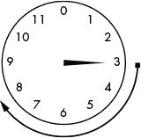

*图 13-1: 3 点钟+ 5 小时= 8 点钟*

想象一个只有时针的钟，12 被 0 代替。(如果程序员设计时钟，第一个小时将从 0 开始。)如果现在的时间是 3 点，5 小时后会是几点？这个很容易算出来:3 + 5 = 8。再过 5 个小时就是 8 点了。想象时针从 3 开始，然后顺时针移动 5 小时，如图图 13-1 所示。

如果现在是 10 点，5 小时后会是几点？加 5 + 10 = 15，但是 15 点对于只显示 12 小时的时钟没有意义。要知道现在是什么时间，你要减去 15–12 = 3，所以现在是 3 点钟。(通常，你会区分 3 个上午<small class="calibre14">和 3 个下午<small class="calibre14">和</small>，但这在模运算中无关紧要。)</small>

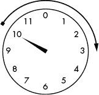

*图 13-2: 10 点钟+ 5 小时= 3 点钟*

从 10 点开始，顺时针移动时针 5 小时，仔细检查这个数学公式。它确实落在 3 上，如图图 13-2 所示。

如果现在是 10 点，200 小时后会是几点？200 + 10 相加= 210，210 当然大于 12。因为一次完整的旋转将时针带回到它的原始位置，我们可以通过减去 12(这是一次完整的旋转)直到结果是一个小于 12 的数字来解决这个问题。减去 210–12 = 198。但是 198 还是大于 12，所以我们继续减去 12，直到差小于 12；在这种情况下，最终答案将是 6。如果当前时间是 10 点，200 小时后的时间就是 6 点，如图图 13-3 所示。

如果你想仔细检查 10 点+ 200 小时的数学，你可以在钟面上反复移动时针。当你移动时针到第 200 小时时，它应该停在 6 点。

然而，用模运算符让计算机为我们做这种模运算更容易。

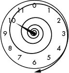

*图 13-3: 10 点+ 200 小时= 6 点*

### 模运算符

你可以使用*模运算符*，缩写为 `mod` ，来编写模表达式。在 Python 中，mod 运算符是百分号(`%`)。您可以将 mod 运算符视为一种除法余数运算符；例如，21 ÷ 5 = 4，余数为 1，21 % 5 = 1。同样，15 % 12 等于 3，就像 15 点就是 3 点一样。在交互式 shell 中输入以下内容，查看 mod 操作符的运行情况:

```py
>>> 21 % 5
1
>>> (10 + 200) % 12
6
>>> 10 % 10
0
>>> 20 % 10
0
```

就像 10 点钟加上 200 个小时会在一个有 12 个小时的时钟上绕到 6 点钟一样，`(10 + 200) % 12`会计算为`6`。注意，除尽的数字会模为`0`，比如`10 % 10`或者`20 % 10`。

稍后，我们将使用 mod 操作符来处理仿射密码中的回绕。它也用于算法中，我们将使用它来寻找两个数字的最大公约数，这将使我们能够找到仿射密码的有效密钥。

### 寻找计算最大公约数的因子

*因子*是相乘得到一个特定数的数。考虑 4 × 6 = 24。在这个等式中，4 和 6 是 24 的因数。因为一个数的因数也可以用来除以那个数而不留余数，所以因数也被称为*约数*。

24 这个数字还有其他一些因素:

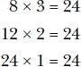

所以 24 的因数是 1，2，3，4，6，8，12 和 24。

我们来看看 30 的因素:

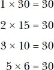

30 的因数是 1、2、3、5、6、10、15 和 30。请注意，任何数字都将 1 及其自身作为其因子，因为 1 乘以一个数字等于该数字。还要注意，24 和 30 的因子列表中有 1、2、3 和 6。这些公因数中最大的是 6，所以 6 就是 24 和 30 的*最大公因数*，更俗称*最大公约数(GCD)* 。

通过可视化它们的因子，最容易找到两个数的 GCD。我们将使用 *Cuisenaire 棒*来可视化因子和 GCD。Cuisenaire 杆由与杆代表的数量相等的正方形组成，杆帮助我们可视化数学运算。图 13-4 用 Cuisenaire 棒形象化 3 + 2 = 5 和 5 × 3 = 15。

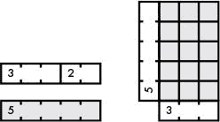

*图 13-4:用 Cuisenaire 棒演示加法和乘法*

一根 3 的杆加到一根 2 的杆上，等于一根 5 的杆的长度。你甚至可以用棒来寻找乘法问题的答案，方法是用你要相乘的数字的棒来做一个长方形。矩形中正方形的个数就是乘法问题的答案。

如果一根 20 个单位长的杆代表数字 20，如果这个数字的杆可以均匀地放入 20 平方的杆中，那么这个数字就是 20 的因数。图 13-5 显示 4 和 10 是 20 的因数，因为它们正好适合 20。

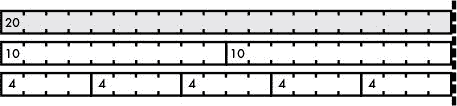

*图 13-5:演示 4 和 10 是 20 的因子*的库森奈尔棒

但是 6 和 7 不是 20 的因数，因为 6 平方和 7 平方的杆不会均匀地放入 20 平方的杆中，如图图 13-6 所示。

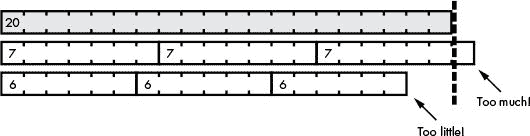

*图 13-6:证明 6 和 7 不是 20* 的因数的崔森耐尔棒

两根杆的 GCD，或这些杆所代表的两个数字，是能均匀地装入*两根*杆的最长的*杆，如图图 13-7 所示。*

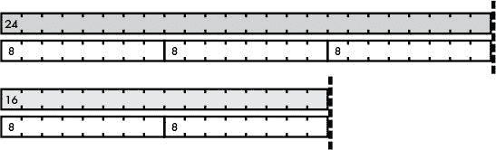

*图 13-7:展示 16 和 24* 的 GCD 的 Cuisenaire 棒

在这个例子中，8 平方杆是最长的杆，可以均匀地放入 24 和 32。因此，8 是他们的 GCD。

现在你知道了因数和 GCD 是如何工作的，让我们用 Python 写的函数来求两个数的 GCD。

### 多重赋值

我们将编写的`gcd()`函数寻找两个数的 GCD。但是在你学习如何编码之前，让我们看看 Python 中的一个技巧，叫做*多重赋值*。多重赋值技巧允许你在一个赋值语句中一次给多个变量赋值。在交互式 shell 中输入以下内容，查看其工作原理:

```py
>>> spam, eggs = 42, 'Hello'
>>> spam
42
>>> eggs
'Hello'
>>> a, b, c, d = ['Alice', 'Brienne', 'Carol', 'Danielle']
>>> a
'Alice'
>>> d
'Danielle'
```

您可以使用逗号分隔`=`操作符左侧的变量名和`=`操作符右侧的值。你也可以将列表中的每一个值赋给它自己的变量，只要列表中的项目数与`=`操作符左侧的变量数相同。如果变量的数量与值的数量不同，Python 会抛出一个错误，指出调用需要更多的变量或者值太多。

多重赋值的主要用途之一是交换两个变量的值。在交互式 shell 中输入以下内容以查看示例:

```py
>>> spam = 'hello'
>>> eggs = 'goodbye'
>>> spam, eggs = eggs, spam
>>> spam
'goodbye'
>>> eggs
'hello'
```

在将`'` `hello'`赋值给`spam`并将`'goodbye'`赋值给`eggs`之后，我们使用多重赋值来交换这些值。让我们看看如何使用这种交换技巧来实现欧几里得算法，以找到 GCD。

### 求 GCD 的欧几里德算法

寻找 GCD 似乎很简单:找出你将使用的两个数字的所有因子，然后找到它们的最大公因数。但是找到更大数字的 GCD 并不容易。

欧几里德，一位生活在 2000 年前的数学家，想出了一个用模运算求两个数的 GCD 的简短算法。这里有一个用 Python 代码实现他的算法的`gcd()`函数，返回整数`a`和`b`的 GCD:

```py
def gcd(a, b):
    while a != 0:
        a, b = b % a, a
    return b
```

`gcd()`函数接受两个数字`a`和`b`，然后使用一个循环和多重赋值来寻找 GCD。图 13-8 显示了`gcd()`函数如何找到 24 和 32 的 GCD。

欧几里德算法的具体工作原理超出了本书的范围，但是你可以依靠这个函数返回你传递给它的两个整数的 GCD。如果从交互 shell 中调用该函数，并为参数`a`和`b`传递`24`和`32`，该函数将返回`8`:

```py
>>> gcd(24, 32)
8
```

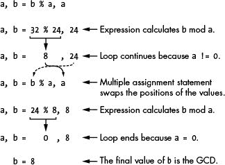

*图 13-8:gcd()函数如何工作*

不过，这个`gcd()`函数的最大好处是它可以轻松处理大量数据:

```py
>>> gcd(409119243, 87780243)
6837
```

这个`gcd()`函数在为乘法和仿射密码选择有效密钥时会派上用场，您将在下一节中了解到。

### 了解乘法和仿射密码的工作原理

在凯撒密码中，加密和解密符号包括将它们转换成数字，加上或减去密钥，然后将新数字转换回符号。

当用乘法密码加密时，你将*用密钥乘以*索引。例如，如果您用密钥 3 加密了字母 E，您将找到 E 的索引(4)并将其乘以密钥(3)以获得加密字母的索引(4 × 3 = 12)，这将是 m。

当乘积超过总字母数时，乘法密码有一个类似于凯撒密码的绕回问题，但现在我们可以使用 mod 运算符来解决这个问题。例如，凯撒密码的`SYMBOLS`变量包含字符串`'ABCDEFGHIJKLMNOPQRSTUVWXYZabcdefghijklmnopqrstuvwxyz1234567890 !?.'`。以下是`SYMBOLS`的首末几个字及其索引的表格:

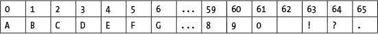

让我们计算一下当密钥为 17 时，这些符号加密到什么。为了用密钥 17 加密符号 F，将它的索引 5 乘以 17，并将结果乘以 66 来处理 66 符号集的回绕。(5 × 17) mod 66 的结果是 19，19 对应符号 T，所以 F 用密钥 17 加密到 T。以下两个字符串显示了明文中的所有字符及其对应的密文符号。第一个字符串中给定索引处的符号加密为第二个字符串中相同索引处的符号:

```py
'ABCDEFGHIJKLMNOPQRSTUVWXYZabcdefghijklmnopqrstuvwxyz1234567890 !?.'
'ARizCTk2EVm4GXo6IZq8Kbs0Mdu!Ofw.QhyBSj1DUl3FWn5HYp7Jar9Lct Nev?Pgx'
```

将此加密输出与使用 Caesar 密码加密时得到的输出进行比较，Caesar 密码只是将明文符号转换为密文符号:

```py
'ABCDEFGHIJKLMNOPQRSTUVWXYZabcdefghijklmnopqrstuvwxyz1234567890 !?.'
'RSTUVWXYZabcdefghijklmnopqrstuvwxyz1234567890 !?.ABCDEFGHIJKLMNOPQ'
```

如您所见，密钥为 17 的乘法密码产生的密文更加随机化，也更难破解。然而，在为乘法密码选择密钥时，您需要小心。接下来我会讨论为什么。

#### ***选择有效的乘性键***

乘法密码的密钥不能用任何数字。例如，如果您选择了键 11，下面是您最终得到的映射:

```py
'ABCDEFGHIJKLMNOPQRSTUVWXYZabcdefghijklmnopqrstuvwxyz1234567890 !?.'
'ALWhs4ALWhs4ALWhs4ALWhs4ALWhs4ALWhs4ALWhs4ALWhs4ALWhs4ALWhs4ALWhs4'
```

请注意，这个密钥不起作用，因为符号 A、G 和 M 都加密到同一个字母 A。当您在密文中遇到 A 时，您不知道它解密到哪个符号。使用这个密钥，在加密字母 A、N、F、S 和其他字母时，您会遇到同样的问题。

在乘法密码中，密钥和符号集的大小必须互为质数。如果两个数的 GCD 为 1，则这两个数是*互质*(或*互质*)。换句话说，除了 1，它们没有共同的因素。比如数字`num1`和`num2`是互质的如果`gcd(num1, num2) == 1`，其中`num1`是关键，`num2`是符号集的大小。在前面的示例中，因为 11(密钥)和 66(符号集大小)的 GCD 不是 1，所以它们不是互质的，这意味着密钥 11 不能用于乘法密码。请注意，数字并不一定是质数，也可以互为质数。

使用乘法密码时，知道如何使用模运算和`gcd()`函数很重要。您可以使用`gcd()`函数来判断一对数字是否互质，您需要知道这一点来为乘法密码选择有效的密钥。

乘法密码对于一组 66 个符号只有 20 个不同的密钥，甚至比凯撒密码还少！但是，您可以将乘法密码和凯撒密码结合起来，以获得更强大的仿射密码，我接下来将对此进行解释。

#### ***用仿射密码*加密**

使用乘法密码的一个缺点是字母 `A` 总是映射到字母 `A` 。原因是 `A` 的数字是 0，0 乘以任何东西都永远是 0。您可以通过在乘法密码的乘法和修改完成后添加第二个密钥来执行 Caesar 密码加密来解决此问题。这个额外的步骤将乘法密码变为*仿射密码*。

仿射密码有两个密钥:密钥 A 和密钥 b。密钥 A 是用于乘以字母数字的整数。将明文乘以密钥 A 后，将密钥 B 加到乘积中。然后，您将总数减去 66，就像您在最初的凯撒密码中所做的那样。这意味着仿射密码的可能密钥是乘法密码的 66 倍。这也确保了字母 A 不会总是加密到它自己。

仿射密码的解密过程反映了加密过程；两者如图 13-9 所示。

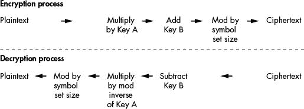

*图 13-9:仿射密码的加密和解密过程*

我们使用与加密相反的操作来解密仿射密码。让我们更详细地看看解密过程和如何计算模逆。

#### ***用仿射密码*解密**

在凯撒密码中，你用加法加密，用减法解密。在仿射密码中，您使用乘法来加密。很自然，你可能认为你可以用仿射密码来解密。但是如果你尝试一下，你会发现它不起作用。要用仿射密码解密，您需要乘以密钥的模逆。这与加密过程中的 mod 操作相反。

两个数的*模逆*用表达式`(a * i)` `% m == 1`表示，其中`i`是模逆，`a`和`m`是两个数。例如，5 mod 7 的模倒数将是某个数字`i`，其中`(5 * i) % 7`等于 1。您可以像这样强行计算:

1 不是 5 mod 7 的模逆，因为(5 * 1) % 7 = 5。

2 不是 5 mod 7 的模逆，因为(5 * 2) % 7 = 3。

3 是 5 mod 7 的模逆，因为(5 * 3) % 7 = 1。

虽然仿射密码的凯撒密码部分的加密和解密密钥是相同的，但是乘法密码的加密密钥和解密密钥是两个不同的数字。加密密钥可以是您选择的任何东西，只要它相对于符号集的大小是质数，在本例中是 66。如果选择密钥 53 用仿射密码加密，解密密钥是 53 mod 66 的模逆:

1 不是 53 mod 66 的模逆，因为(53 * 1) % 66 = 53。

2 不是 53 mod 66 的模逆，因为(53 * 2) % 66 = 40。

3 不是 53 mod 66 的模逆，因为(53 * 3) % 66 = 27。

4 不是 53 mod 66 的模逆，因为(53 * 4) % 66 = 14。

5 是 53 mod 66 的模逆，因为(53 * 5) % 66 = 1。

因为 5 是 53 和 66 的模逆，所以你知道仿射密码解密密钥也是 5。要解密一封密文信，将该信的数字乘以 5，然后取模 66。结果是原始明文的字母数。

使用 66 字符符号集，让我们使用密钥`53`加密单词 `Cat` 。 `C` 在索引`2`处，`2 * 53`是`106`，大于符号集大小，所以我们用`66`对`106`进行 mod，结果是`40`。符号集中索引`40`处的字符是`'o'`，所以符号 `C` 加密为 `o` 。

我们将对下一个字母使用相同的步骤， `a` 。字符串`'a'`在符号集中的索引`26`处，`26 * 53 % 66`是`58`，是`'7'`的索引。所以符号 `a` 加密到 `7` 。字符串`'t'`在索引`45`处，`45 * 53 % 66`是`9`，是`'J'`的索引。所以字*猫*加密到 `o7J` 。

要解密，我们乘以`53` `%` `66`的模逆，就是`5`。的符号*在索引`40`处，`40 * 5 % 66`是`2`，是`'C'`的索引。符号 `7` 在索引`58`处，`58 * 5 % 66`为`26`，为`'a'`的索引。符号 `J` 在索引`9`处，`9 * 5 % 66`是`45`，是`'t'`的索引。密文 `o7J` 解密到 `Cat` 就是原来的明文，和预想的一样。*

#### ***寻找模逆***

为了计算模逆运算来确定解密密钥，您可以采用强力方法，开始测试整数 1，然后 2，然后 3，等等。但是这对于 8，953，851 这样的大键来说是很耗时的。

幸运的是，您可以使用欧几里德的扩展算法来寻找一个数的模逆，在 Python 中是这样的:

```py
def findModInverse(a, m):
    if gcd(a, m) != 1:
        return None  # No mod inverse if a & m aren't relatively prime.
    u1, u2, u3 = 1, 0, a
    v1, v2, v3 = 0, 1, m
    while v3 != 0:
        q = u3 // v3  # Note that // is the integer division operator.
        v1, v2, v3, u1, u2, u3 = (u1 - q * v1), (u2 - q * v2), (u3 - q * v3),
          v1, v2, v3
    return u1 % m
```

使用`findModInverse()`函数不必了解欧几里德的扩展算法是如何工作的。只要传递给`findModInverse()`函数的两个参数互质，`findModInverse()`就会返回`a`参数的模逆。

你可以在[](https://www.nostarch.com/crackingcodes/)*了解更多关于欧几里德的扩展算法是如何工作的。*

 *#### ***整数除法运算符***

您可能已经注意到了前一节中的`findModInverse()`函数中使用的`//`操作符。这就是*整数除法运算符*。它将两个数相除，并向下舍入到最接近的整数。在交互式 shell 中输入以下内容，看看`//`操作符是如何工作的:

```py
>>> 41 / 7
5.857142857142857
>>> 41 // 7
5
>>> 10 // 5
2
```

鉴于`41 / 7`评估为`5.857142857142857`，使用`41 // 7`评估为`5`。对于不能均匀划分的除法表达式，`//`运算符对于获得答案的整数部分(有时称为*商*)很有用，而`%`运算符则获得余数。使用`//`整数除法运算符的表达式的计算结果总是 int，而不是 float。评估`10 // 5`时可以看到，结果是`2`而不是`2.0`。

### **密码模块的源代码**

我们将在本书后面的更多密码程序中使用`gcd()`和`findModInverse()`，所以让我们把这两个函数放在一个模块中。打开一个新的文件编辑器窗口，输入以下代码，将文件保存为 `cryptomath.py` :

*隐密性. py*

```py
 1\. # Cryptomath Module
 2\. # https://www.nostarch.com/crackingcodes/ (BSD Licensed)
 3.
 4\. def gcd(a, b):
 5.     # Return the GCD of a and b using Euclid's algorithm:
 6.     while a != 0:
 7.         a, b = b % a, a
 8.     return b
 9.
10.
11\. def findModInverse(a, m):
12.     # Return the modular inverse of a % m, which is
13.     # the number x such that a*x % m = 1.
14.
15.     if gcd(a, m) != 1:
16.         return None  # No mod inverse if a & m aren't relatively prime.
17.
18.     # Calculate using the extended Euclidean algorithm:
19.     u1, u2, u3 = 1, 0, a
20.     v1, v2, v3 = 0, 1, m
21.     while v3 != 0:
22.         q = u3 // v3  # Note that // is the integer division operator.
23.         v1, v2, v3, u1, u2, u3 = (u1 - q * v1), (u2 - q * v2),
              (u3 - q * v3), v1, v2, v3
24.     return u1 % m
```

这个程序包含本章前面描述的`gcd()`函数和实现欧几里德扩展算法的`findModInverse()`函数。

导入 `cryptomath.py` 模块后，您可以从交互式 shell 中试用这些函数。在交互式 shell 中输入以下内容:

```py
>>> import cryptomath
>>> cryptomath.gcd(24, 32)
8
>>> cryptomath.gcd(37, 41)
1
>>> cryptomath.findModInverse(7, 26)
15
>>> cryptomath.findModInverse(8953851, 26)
17
```

如您所见，您可以调用`gcd()`函数和`findModInverse()`函数来寻找两个数的 GCD 或模逆。

### **总结**

这一章讲述了一些有用的数学概念。`%`运算符计算一个数除以另一个数后的余数。`gcd()`函数返回能平分两个数的最大数。如果两个数的 GCD 是 1，你就知道这两个数互为质数。求两个数的 GCD 最有用的算法是欧几里德算法。

与凯撒密码不同，仿射密码使用乘法和加法而不仅仅是加法来加密字母。然而，并不是所有的数字都可以作为仿射密码的密钥。密钥数和符号集的大小必须互为质数。

要用仿射密码解密，需要将密文的索引乘以密钥的模逆。`a % m`的模逆是一个数`i`，使得`(a * i) % m == 1`。你可以使用欧几里德的扩展算法来计算模逆。第二十三章的公钥密码也使用模逆。

利用你在本章学到的数学概念，你将为第 14 章中的仿射密码编写一个程序。因为乘法密码和使用`0`的密钥 B 的仿射密码是一回事，所以你不会有单独的乘法密码程序。因为乘法密码只是仿射密码的一个安全性较低的版本，所以无论如何都不应该使用它。

**练习题**

练习题的答案可以在本书的网站[`www.nostarch.com/crackingcodes`](https://www.nostarch.com/crackingcodes/)找到。

1.  下面的表达式表示什么？

    ```py
    17 % 1000
    5 % 5
    ```

2.  10 和 15 的 GCD 是多少？

3.  执行`spam, eggs = 'hello', 'world'`后`spam`包含什么？

4.  17 和 31 的 GCD 是 1。17 和 31 是互质吗？

5.  为什么 6 和 8 不是相对质数？

6.  模 C 的模逆的公式是什么？*