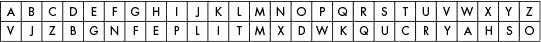
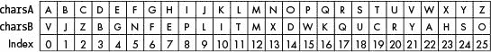
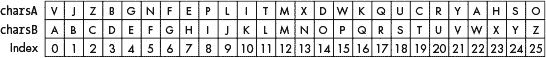

# 16 编程简单的替代密码

> 原文：<https://inventwithpython.com/cracking/chapter16.html>

互联网是人类有史以来发明的最解放的工具，也是最好的监控工具。不是非此即彼。都是。”
—电子前沿基金会联合创始人约翰·佩里·巴洛


在第 15 章中，你了解到仿射密码有大约 1000 个可能的密钥，但是计算机仍然可以轻易地破解所有的密钥。我们需要一种密码，它有如此多的可能密钥，以至于任何计算机都无法强行破解它们。

简单替换密码就是这样一种密码，它可以有效地抵御暴力攻击，因为它有大量可能的密钥。即使你的计算机每秒钟可以尝试一万亿个键，它仍然需要 1200 万年来尝试每一个键！在本章中，你将编写一个程序来实现简单的替换密码，并学习一些有用的 Python 函数和字符串方法。

**本章涵盖的主题**

*   `sort()`列表法

*   消除字符串中的重复字符

*   包装函数

*   `isupper()`和`islower()`字符串方法

### 简单替代密码的工作原理

为了实现简单的替换密码，我们选择一个随机的字母来加密字母表中的每个字母，每个字母只使用一次。简单替换密码的密钥总是一串随机排列的 26 个字母。对于简单替换密码，有 403，291，461，126，605，635，584，000，000 种不同的可能密钥排序。好多钥匙啊！更重要的是，这个数字是如此之大，以至于不可能暴力破解。(要了解这个数字是如何计算出来的，请前往[`www.nostarch.com/crackingcodes`](https://www.nostarch.com/crackingcodes/)。)

先用纸笔试试简单的代换密码。对于这个例子，我们将加密消息“拂晓时的攻击”使用密钥 VJZBGNFEPLITMXDWKQUCRYAHSO。首先，写出字母表中的字母和每个字母下面对应的键，如图 16-1 。



*图 16-1：示例密钥的加密字母表*

要加密消息，找到顶行明文中的字母，并用底行中的字母替换它。 `A` 加密到 `V` ， `T` 加密到 `C` ， `C` 加密到 `Z` ，以此类推。所以这条信息“拂晓进攻”加密为“Vccvzi vc bvax”

要解密加密的消息，请在底行的密文中找到该字母，并用顶行的相应字母替换它。 `V` 解密到 `A` ， `C` 解密到 `T` ， `Z` 解密到 `C` ，以此类推。

与底行移动但保持字母顺序的凯撒密码不同，在简单替换密码中，底行完全被打乱。这导致更多可能的密钥，这是使用简单替换密码的巨大优势。缺点是密钥有 26 个字符长，比较难记。您可能需要记下密钥，但是如果您这样做了，请确保没有其他人会读到它！

### 简单替换密码程序的源代码

选择**文件 -> 新文件**，打开新文件编辑器窗口。在文件编辑器中输入以下代码，保存为 `simpleSubCipher.py` 。确保将 `pyperclip.py` 文件放在与 `simpleSubCipher.py` 文件相同的目录中。按`F5`运行程序。

简单子
Cipher.py

```py
# Simple Substitution Cipher
# https://www.nostarch.com/crackingcodes/ (BSD Licensed)

import pyperclip, sys, random


LETTERS = 'ABCDEFGHIJKLMNOPQRSTUVWXYZ'

def main():
    myMessage = 'If a man is offered a fact which goes against his
          instincts, he will scrutinize it closely, and unless the evidence
          is overwhelming, he will refuse to believe it. If, on the other
          hand, he is offered something which affords a reason for acting
          in accordance to his instincts, he will accept it even on the
          slightest evidence. The origin of myths is explained in this way.
          -Bertrand Russell'
    myKey = 'LFWOAYUISVKMNXPBDCRJTQEGHZ'
    myMode = 'encrypt' # Set to 'encrypt' or 'decrypt'.

    if keyIsValid(myKey):
        sys.exit('There is an error in the key or symbol set.')
    if myMode == 'encrypt':
        translated = encryptMessage(myKey, myMessage)
    elif myMode == 'decrypt':
        translated = decryptMessage(myKey, myMessage)
    print('Using key %s' % (myKey))
    print('The %sed message is:' % (myMode))
    print(translated)
    pyperclip.copy(translated)
    print()
    print('This message has been copied to the clipboard.')


def keyIsValid(key):
    keyList = list(key)
    lettersList = list(LETTERS)
    keyList.sort()
    lettersList.sort()

    return keyList == lettersList


def encryptMessage(key, message):
    return translateMessage(key, message, 'encrypt')


def decryptMessage(key, message):
    return translateMessage(key, message, 'decrypt')


def translateMessage(key, message, mode):
    translated = ''
    charsA = LETTERS
    charsB = key
    if mode == 'decrypt':
        # For decrypting, we can use the same code as encrypting. We
        # just need to swap where the key and LETTERS strings are used.
        charsA, charsB = charsB, charsA

    # Loop through each symbol in the message:
    for symbol in message:
        if symbol.upper() in charsA:
            # Encrypt/decrypt the symbol:
            symIndex = charsA.find(symbol.upper())
            if symbol.isupper():
                translated += charsB[symIndex].upper()
            else:
                translated += charsB[symIndex].lower()
        else:
            # Symbol is not in LETTERS; just add it:
            translated += symbol

    return translated


def getRandomKey():
    key = list(LETTERS)
    random.shuffle(key)
    return ''.join(key)


if __name__ == '__main__':
    main()
```

### 简单替代密码程序的运行示例

当您运行 `simpleSubCipher.py` 程序时，加密的输出应该如下所示:

```py
Using key LFWOAYUISVKMNXPBDCRJTQEGHZ
The encrypted message is:
Sy l nlx sr pyyacao l ylwj eiswi upar lulsxrj isr sxrjsxwjr, ia esmm
rwctjsxsza sj wmpramh, lxo txmarr jia aqsoaxwa sr pqaceiamnsxu, ia esmm caytra
jp famsaqa sj. Sy, px jia pjiac ilxo, ia sr pyyacao rpnajisxu eiswi lyypcor
l calrpx ypc lwjsxu sx lwwpcolxwa jp isr sxrjsxwjr, ia esmm lwwabj sj aqax
px jia rmsuijarj aqsoaxwa. Jia pcsusx py nhjir sr agbmlsxao sx jisr elh.
-Facjclxo Ctrramm

This message has been copied to the clipboard.
```

注意，如果明文中的字母是小写的，那么它在密文中也是小写的。同样，如果字母在明文中是大写的，那么在密文中也是大写的。简单替换密码不加密空格或标点符号，而只是按原样返回这些字符。

要解密这个密文，将它粘贴为第 10 行的`myMessage`变量的值，并将`myMode`改为字符串`'decrypt'`。当您再次运行该程序时，解密输出应该如下所示:

```py
Using key LFWOAYUISVKMNXPBDCRJTQEGHZ
The decrypted message is:
If a man is offered a fact which goes against his instincts, he will
scrutinize it closely, and unless the evidence is overwhelming, he will refuse
to believe it. If, on the other hand, he is offered something which affords
a reason for acting in accordance to his instincts, he will accept it even
on the slightest evidence. The origin of myths is explained in this way.
-Bertrand Russell

This message has been copied to the clipboard.
```

### 设置模块、常量和 main()函数

让我们来看看简单替换密码程序的源代码的第一行。

```py
# Simple Substitution Cipher
# https://www.nostarch.com/crackingcodes/ (BSD Licensed)

import pyperclip, sys, random


LETTERS = 'ABCDEFGHIJKLMNOPQRSTUVWXYZ'
```

第 4 行导入了`pyperclip`、`sys`和`random`模块。`LETTERS`常量变量设置为全部大写字母的字符串，这是为简单替代密码程序设置的符号。

`simpleSubCipher.py` 中的`main()`函数，类似于前面章节中密码程序的`main()`函数，在程序第一次运行时被调用。它包含存储用于程序的`message`、`key`和`mode`的变量。

```py
def main():
    myMessage = 'If a man is offered a fact which goes against his
          instincts, he will scrutinize it closely, and unless the evidence
          is overwhelming, he will refuse to believe it. If, on the other
          hand, he is offered something which affords a reason for acting
          in accordance to his instincts, he will accept it even on the
          slightest evidence. The origin of myths is explained in this way.
          -Bertrand Russell'
    myKey = 'LFWOAYUISVKMNXPBDCRJTQEGHZ'
    myMode = 'encrypt' # Set to 'encrypt' or 'decrypt'.
```

简单替换密码的密钥很容易出错，因为它们相当长，需要包含字母表中的每个字母。例如，很容易输入缺少一个字母的键或两次输入相同字母的键。`keyIsValid()`函数确保密钥可被加密和解密函数使用，如果密钥无效，该函数将退出程序并显示一条错误消息:

```py
    if keyIsValid(myKey):
        sys.exit('There is an error in the key or symbol set.')
```

如果第 14 行从`keyIsValid()`返回`False`，那么`myKey`包含一个无效的密钥，第 15 行终止程序。

第 16 到 19 行检查`myMode`变量是否被设置为`'encrypt'`或`'decrypt'`，并相应地调用`encryptMessage()`或`decryptMessage()`:

```py
    if myMode == 'encrypt':
        translated = encryptMessage(myKey, myMessage)
    elif myMode == 'decrypt':
        translated = decryptMessage(myKey, myMessage)
```

`encryptMessage()`和`decryptMessage()`的返回值是存储在`translated`变量中的加密或解密消息的字符串。

第 20 行打印屏幕上使用的键。加密或解密的消息被打印到屏幕上，并被复制到剪贴板上。

```py
    print('Using key %s' % (myKey))
    print('The %sed message is:' % (myMode))
    print(translated)
    pyperclip.copy(translated)
    print()
    print('This message has been copied to the clipboard.')
```

第 25 行是`main()`函数中的最后一行代码，所以程序执行在第 25 行之后返回。当`main()`调用在程序的最后一行完成时，程序退出。

接下来，我们将看看`keyIsValid()`函数如何使用`sort()`方法来测试密钥是否有效。

### sort()列表方法

列表有一个`sort()`方法，将列表的项目重新排列成数字或字母顺序。当您必须检查两个列表是否包含相同的项目，但它们的排列顺序不同时，这种对列表中的项目进行排序的功能就很方便了。

在 `simpleSubCipher.py` 中，一个简单的替换键字符串值只有在符号集中的每个字符都没有重复或丢失字母时才有效。我们可以通过对字符串值进行排序并检查它是否等于排序后的`LETTERS`来检查它是否是有效的键。但是因为我们只能对列表进行排序，而不能对字符串进行排序(回想一下，字符串是不可变的，这意味着它们的值不能被改变)，我们将通过将它们传递给`list()`来获得字符串值的列表版本。然后，在对这些列表进行排序后，我们可以比较这两个列表，看它们是否相等。尽管`LETTERS`已经按字母顺序排列，我们还是要对它进行排序，因为我们稍后会扩展它以包含其他字符。

```py
def keyIsValid(key):
    keyList = list(key)
    lettersList = list(LETTERS)
    keyList.sort()
    lettersList.sort()
```

`key`中的字符串被传递到第 29 行的`list()`。返回的列表值存储在名为`keyList`的变量中。

在第 30 行，`LETTERS`常量变量(包含字符串`'ABCDEFGHIJKLMNOPQRSTUVWXYZ'`)被传递给`list()`，后者以如下格式返回列表:`['A', 'B', 'C', 'D', 'E', 'F', 'G', 'H', 'I', 'J', 'K', 'L', 'M', 'N', 'O', 'P', 'Q', 'R', 'S', 'T', 'U', 'V', 'W', 'X', 'Y', 'Z']`。

在第 31 和 32 行，`keyList`和`lettersList`中的列表通过调用它们的`sort()`列表方法按字母顺序排序。注意，类似于`append()`列表方法，`sort()`列表方法就地修改列表，并且没有返回值。

排序时，`keyList`和`lettersList`的值*应该是相同的*，因为`keyList`只不过是顺序被打乱的`LETTERS`中的字符。第 34 行检查值`keyList`和`lettersList`是否相等:

```py
    return keyList == lettersList
```

如果`keyList`和`lettersList`相等，你可以确定`keyList`和`key`参数没有任何重复的字符，因为`LETTERS`里面没有重复的字符。在这种情况下，第 34 行返回`True`。但是如果`keyList`和`lettersList`不匹配，密钥无效，第 34 行返回`False`。

### 包装函数

`simpleSubCipher.py` 程序中的加密代码和解密代码几乎相同。当你有两段非常相似的代码时，最好将它们放入一个函数中并调用两次，而不是输入两次代码。这不仅节省了时间，更重要的是，避免了在复制粘贴代码时引入 bug。这也是有利的，因为如果代码中有 bug，您只需要在一个地方修复 bug，而不是在多个地方。

*包装函数*通过包装另一个函数的代码并返回包装函数返回的值，帮助您避免输入重复的代码。通常，包装函数会对被包装函数的参数或返回值做一点小小的改变。否则，就没有包装的必要，因为您可以直接调用该函数。

让我们看一个在代码中使用包装函数的例子来理解它们是如何工作的。在这种情况下，第 37 行和第 41 行的`encryptMessage()`和`decryptMessage` `()`是包装函数:

```py
def encryptMessage(key, message):
    return translateMessage(key, message, 'encrypt')


def decryptMessage(key, message):
    return translateMessage(key, message, 'decrypt')
```

这些包装函数中的每一个都调用`translateMessage` `()`，这是被包装的函数，并返回`translateMessage()`返回的值。(我们将在下一节研究`translateMessage()`函数。)因为两个包装函数使用相同的`translateMessage()`函数，所以如果我们需要对密码进行任何更改，我们只需要修改这一个函数，而不是`encryptMessage()`和`decryptMessage` `()`函数。

有了这些包装函数，导入程序 `simpleSubCipher.py` 的人可以调用名为`encryptMessage()`和`decryptMessage()`的函数，就像他们可以调用本书中所有其他密码程序一样。包装函数有明确的名字，告诉使用这些函数的其他人他们做了什么，而不必看代码。因此，如果我们想要共享我们的代码，其他人可以更容易地使用它。

其他程序可以通过导入密码程序并调用它们的`encryptMessage()`函数来用各种密码加密消息，如下所示:

```py
import affineCipher, simpleSubCipher, transpositionCipher
--snip--
ciphertext1 =        affineCipher.encryptMessage(encKey1, 'Hello!')
ciphertext2 = transpositionCipher.encryptMessage(encKey2, 'Hello!')
ciphertext3 =     simpleSubCipher.encryptMessage(encKey3, 'Hello!')
```

命名一致性是有帮助的，因为它使得熟悉其中一个密码程序的人更容易使用其他密码程序。例如，您可以看到第一个参数始终是密钥，第二个参数始终是消息，这是本书中大多数密码程序使用的约定。使用`translateMessage()`功能而不是单独的`encryptMessage()`和`decryptMessage`功能会与其他程序不一致。

接下来我们来看看`translateMessage()`函数。

### translate message()函数

`translateMessage()`函数用于加密和解密。

```py
def translateMessage(key, message, mode):
    translated = ''
    charsA = LETTERS
    charsB = key
    if mode == 'decrypt':
        # For decrypting, we can use the same code as encrypting. We
        # just need to swap where the key and LETTERS strings are used.
        charsA, charsB = charsB, charsA
```

注意，`translateMessage()`有参数`key`和`message`，还有第三个参数`mode`。当我们调用`translateMessage`T5 时，`encryptMessage()`函数中的调用为`mode`参数传递`'encrypt'`，`decryptMessage()`函数中的调用传递`'decrypt'`。这就是`translateMessage()`函数如何知道它应该加密还是解密传递给它的消息。

实际的加密过程很简单:对于`message`参数中的每个字母，该函数在`LETTERS`中查找该字母的索引，并用在`key`参数中相同索引处的字母替换该字符。解密则相反:它在`key`中查找索引，并用`LETTERS`中相同索引处的字母替换该字符。

程序没有使用`LETTERS`和`key`，而是使用变量`charsA`和`charsB`，这允许它用`charsB`中相同索引处的字母替换`charsA`中的字母。能够改变分配给`charsA`和`charsB`的值使得程序很容易在加密和解密之间切换。第 47 行将`charsA`中的字符设置为`LETTERS`中的字符，第 48 行将`charsB`中的字符设置为`key`中的字符。

下图显示了如何使用相同的代码来加密或解密信件。图 16-2 说明了加密过程。该图中最上面一行显示的是`charsA`(设置为`LETTERS`)中的字符，中间一行显示的是`charsB`(设置为`key`)中的字符，最下面一行显示的是字符对应的整数索引。



*图 16-2：使用索引加密明文*

`translateMessage()`中的代码总是在`charsA`中查找消息字符的索引，并在该索引处用`charsB`中的相应字符替换它。所以为了加密，我们让`charsA`和`charsB`保持原样。使用变量`charsA`和`charsB`将`LETTERS`中的字符替换为`key`中的字符，因为`charsA`被设置为`LETTERS`而`charsB`被设置为`key`。

为了解密，使用线 52 上的`charsA, charsB = charsB, charsA`切换`charsA`和`charsB`中的值。图 16-3 显示了解密过程。



*图 16-3：使用索引解密密文*

请记住，`translateMessage()`中的代码总是用`charsB`中相同索引处的字符替换`charsA`中的字符。所以当第 52 行交换值时，`translateMessage()`中的代码执行解密过程，而不是加密过程。

接下来的几行代码显示了程序如何找到用于加密和解密的索引。

```py
    # Loop through each symbol in the message:
    for symbol in message:
        if symbol.upper() in charsA:
            # Encrypt/decrypt the symbol:
            symIndex = charsA.find(symbol.upper())
```

第 55 行的`for`循环在循环的每次迭代中将`symbol`变量设置为`message`字符串中的一个字符。如果这个符号的大写形式存在于`charsA`(回想一下`key`和`LETTERS`中只有大写字符)，第 58 行找到`symbol`大写形式在`charsA`中的索引。`symIndex`变量存储这个索引。

我们已经知道，`find()`方法永远不会返回`-1`(来自`find()`方法的`-1`意味着在字符串中找不到参数)，因为第 56 行的`if`语句保证了`symbol.upper()`存在于`charsA`中。否则，第 58 行就不会被执行。

接下来，我们将使用每个加密或解密的`symbol`来构建由`translateMessage()`函数返回的字符串。但是因为`key`和`LETTERS`都是大写的，我们需要检查`message`中最初的`symbol`是否是小写的，如果是，那么将解密或加密的`symbol`调整为小写。要做到这一点，你需要学习两个字符串方法:`isupper()`和`islower()`。

#### is upper()和 islower()字符串方法

`isupper()`和`islower()`方法检查字符串是大写还是小写。

更具体地说，如果这两个条件都满足，`isupper()`字符串方法返回`True`:

*   该字符串至少有一个大写字母。

*   该字符串中没有任何小写字母。

如果这两个条件都满足，`islower()`字符串方法返回`True`:

*   该字符串至少有一个小写字母。

*   该字符串中没有任何大写字母。

字符串中的非字母字符不影响这些方法是返回`True`还是`False`，尽管如果字符串中只存在非字母字符，这两种方法的计算结果都是`False`。在交互式 shell 中输入以下内容，查看这些方法是如何工作的:

```py
   >>> 'HELLO'.isupper()
   True
   >>> 'HELLO WORLD 123'.isupper() # ➊
   True
   >>> 'hello'.islower() # ➋
   True
   >>> '123'.isupper()
   False
   >>> ''.islower()
   False
```

在 ➊ 的例子返回`True`，因为`'HELLO WORLD 123'`中至少有一个大写字母，没有小写字母。字符串中的数字不会影响计算。在 ➋ ，`'hello'.islower()`返回`True`，因为字符串`'hello'`中至少有一个小写字母，没有大写字母。

让我们回到我们的代码，看看它是如何使用`isupper()`和`islower()`字符串方法的。

#### 用 isupper() 保存案例 T3】

`simpleSubCipher.py` 程序使用`isupper()`和`islower()`字符串方法来帮助确保明文的大小写在密文中得到反映。

```py
            if symbol.isupper():
                translated += charsB[symIndex].upper()
            else:
                translated += charsB[symIndex].lower()
```

第 59 行测试`symbol`是否有大写字母。如果是，第 60 行将字符的大写版本从`charsB[symIndex]`连接到`translated`。这导致大写版本的`key`字符对应于大写输入。如果`symbol`有一个小写字母，第 62 行将字符的小写版本从`charsB[symIndex]`连接到`translated`。

如果`symbol`不是符号集中的一个字符，比如`'5'`或`'?'`，第 59 行将返回`False`，第 62 行将代替第 60 行执行。原因是不满足`isupper()`的条件，因为那些字符串没有至少一个大写字母。在这种情况下，第 62 行的`lower()` 方法调用对字符串没有影响，因为它根本没有字母。`lower()`方法不会改变像`'5'`和`'?'`这样的非字母字符。它只是返回原始的非字母字符。

`else`块中的第 62 行说明了`symbol`字符串中的任何小写字符*和*非字母字符。

第 63 行的缩进表示第 56 行的`else`语句与`if` `symbol.upper() in charsA:`语句成对出现，所以如果`symbol`不在`LETTERS`中，第 63 行执行。

```py
        else:
            # Symbol is not in LETTERS; just add it:
            translated += symbol
```

如果`symbol`不在`LETTERS`中，则执行第 65 行。这意味着我们不能加密或解密`symbol`中的字符，所以我们简单地将它连接到`translated`的末尾。

在`translateMessage()`函数的末尾，第 67 行返回`translated`变量中的值，该值包含加密或解密的消息:

```py
    return translated
```

接下来，我们将看看如何使用`getRandomKey()`函数为简单的替代密码生成一个有效的密钥。

### 生成随机密钥

键入包含字母表中每个字母的键的字符串可能很困难。为了帮助我们做到这一点，`getRandomKey()`函数返回一个有效的键来使用。第 71 到 73 行随机打乱了`LETTERS`常量中的字符。

```py
def getRandomKey():
    key = list(LETTERS)
    random.shuffle(key)
    return ''.join(key)
```

> **注**
> 
> 阅读第 123 页上的随机打乱一个字符串，了解如何使用`list()`、`random.shuffle()`和`join()`方法打乱一个字符串。

要使用`getRandomKey()`函数，我们需要将第 11 行从`myKey = 'LFWOAYUISVKMNXPBDCRJTQEGHZ'`改为:

```py
    myKey = getRandomKey()
```

因为我们的简单替换密码程序中的第 20 行打印了正在使用的密钥，所以您将能够看到函数`getRandomKey()`返回的密钥。

### 调用 main()函数

如果 `simpleSubCipher.py` 作为一个程序运行，而不是作为一个模块被另一个程序导入，程序结尾的第 76 和 77 行调用`main()`。

```py
if __name__ == '__main__':
    main()
```

我们对简单替代密码程序的研究到此结束。

### 摘要

在这一章中，你学习了如何使用`sort()`列表方法对列表中的条目进行排序，以及如何比较两个有序列表来检查字符串中的重复字符或缺失字符。您还了解了`isupper()`和`islower()`字符串方法，它们检查字符串值是由大写字母还是小写字母组成的。您了解了包装函数，包装函数是调用其他函数的函数，通常只添加微小的变化或不同的参数。

简单的替代密码有太多可能的密钥，无法强行破解。这使得它不受你用来破解以前的密码程序的技术的影响。你必须编写更聪明的程序来破解这个密码。

在第 17 章中，你将学习如何破解简单的替代密码。您将使用更加智能和复杂的算法，而不是强行通过所有的键。

**练习题**

练习题的答案可以在本书的网站[`www.nostarch.com/crackingcodes`](https://www.nostarch.com/crackingcodes/)找到。

1.  为什么不能用蛮力攻击来对付简单的替代密码，即使是用强大的超级计算机？

2.  运行这段代码后`spam`变量包含什么？

    ```py
      spam = [4, 6, 2, 8]
      spam.sort()
    ```

3.  什么是包装函数？

4.  `'hello'.islower()`求值为什么？

5.  `'HELLO 123'.isupper()`求值为什么？

6.  `'123'.islower()`求值为什么？