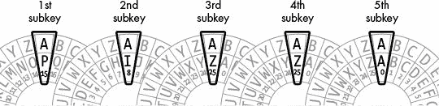
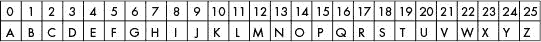

# 18 编程维吉尼亚密码

> 原文：<https://inventwithpython.com/cracking/chapter18.html>

“我当时相信，现在仍然相信，广泛普及的加密技术给我们的安全和自由带来的好处远远超过犯罪分子和恐怖分子使用它所带来的不可避免的损害。”
——马特·布雷泽，在& T 实验室，2001 年 9 月


意大利密码学家吉奥万·巴蒂斯塔·贝拉索是第一个在 1553 年描述维根涅尔密码的人，但它最终以法国外交官布莱斯·德·维根涅尔的名字命名，他是后来几年重新发明密码的许多人之一。它被称为“le chiffre indéchiffrable”，意思是“无法破译的密码”，直到 19 世纪英国学者查尔斯·巴贝奇破解了它，它才被破解。

因为维吉尼亚密码有太多可能被暴力破解的密钥，即使使用我们的英语检测模块，它也是本书迄今为止讨论的最强的密码之一。甚至对你在第十七章中学到的单词模式攻击无敌。

**本章涵盖的主题**

*   子项

*   使用列表-追加-连接过程构建字符串

### 在维吉尼亚密码中使用多个字母密钥

与凯撒密码不同，维根涅尔密码有多个密钥。因为它使用了多组替换，所以维吉尼亚密码是一种多字母替换密码。与简单的替代密码不同，仅靠频率分析无法击败维吉尼亚密码。我们没有像凯撒密码那样使用 0 到 25 之间的数字键，而是使用字母键来表示 Vigenère。

Vigenère 密钥是一系列字母，例如一个英语单词，它被分成多个单字母子密钥，这些子密钥对明文中的字母进行加密。例如，如果我们使用 PIZZA 的维吉尼亚密钥，第一个子密钥是 P，第二个子密钥是 I，第三和第四个子密钥都是 Z，第五个子密钥是 a，第一个子密钥加密明文的第一个字母，第二个子密钥加密第二个字母，依此类推。当我们到达明文的第六个字母时，我们返回到第一个子密钥。

使用维吉尼亚密码和使用多个凯撒密码是一样的，如图图 18-1 所示。我们对明文的每个字母应用不同的凯撒密码，而不是用一个凯撒密码加密整个明文。



*图 18-1：多个凯撒密码组合成维根奈尔密码*

每个子密钥被转换成一个整数，并作为 Caesar 加密密钥。例如，字母 A 对应于凯撒密码密钥 0。字母 B 对应于键 1，以此类推直到键 25 的 Z，如图图 18-2 所示。



*图 18-2：凯撒密匙及其对应字母*

让我们来看一个例子。以下是显示在维根耶尔披萨旁边的信息“常识并不常见”。明文显示有相应的子密钥，该子密钥对其下的每个字母进行加密。

```py
COMMONSENSEISNOTSOCOMMON
PIZZAPIZZAPIZZAPIZZAPIZZ
```

为了用子密钥 P 加密明文中的第一个 C，使用子密钥的相应数字键 15 用 Caesar 密码加密它，这产生密码字母 R，并通过循环子密钥对明文的每个字母重复该过程。表 18-1 显示了这一过程。明文字母的整数和子密钥(在括号中给出)相加，得到密文字母的整数。

**表 18-1:** 用维吉尼亚子密钥加密信件

| **明文字母** | **子键** | **密文字母** |
| --- | --- | --- |
| 丙(2) | 第 15 页 | R (17) |
| O (14) | 一(8) | W (22) |
| 男(12) | Z (25) | 第 11 条 |
| 男(12) | Z (25) | 第 11 条 |
| O (14) | 答(0) | O (14) |
| N (13) | 第 15 页 | 丙(2) |
| 第十八条 | 一(8) | 答(0) |
| 英(4) | Z (25) | D (3) |
| N (13) | Z (25) | 男(12) |
| 第十八条 | 答(0) | 第十八条 |
| 英(4) | 第 15 页 | T (19) |
| 一(8) | 一(8) | 问题(16) |
| 第十八条 | Z (25) | R (17) |
| N (13) | Z (25) | 男(12) |
| O (14) | 答(0) | O (14) |
| T (19) | 第 15 页 | 一(8) |
| 第十八条 | 一(8) | 答(0) |
| O (14) | Z (25) | N (13) |
| 丙(2) | Z (25) | 乙(1) |
| O (14) | 答(0) | O (14) |
| 男(12) | 第 15 页 | 乙(1) |
| 男(12) | 一(8) | (20) |
| O (14) | Z (25) | N (13) |
| N (13) | Z (25) | 男(12) |

使用带有密钥 PIZZA(由子密钥 15，8，25，25，0 组成)的维吉尼亚密码将普通意义上的明文加密为密文 RWLLOC ADMST QR MOI AN BOBUNM。

#### 密钥越长越安全

Vigenère 密钥中的字母越多，加密信息抵御暴力攻击的能力就越强。PIZZA 不是维吉尼亚关键字的好选择，因为它只有五个字母。一个五个字母的键有 11881376 种可能的组合(因为 26 个字母的 5 次方是 26<sup class="calibre21">5</sup>= 26×26×26×26×26 = 11881376)。一千一百万个密钥对于一个人来说太多了，无法用暴力破解，但是一台计算机可以在几个小时内尝试所有的密钥。它将首先尝试使用密钥 AAAAA 对消息进行解密，并检查得到的解密结果是否是英文。然后它可以尝试 AAAAB，然后 AAAAC，等等，直到它到达比萨饼。

好消息是，该键每多一个字母，可能的键数就会乘以 26。一旦有千万亿个可能的密钥，计算机需要很多年才能破解这个密码。表 18-2 显示了每种密钥长度有多少种可能的密钥。

**表 18-2:** 基于维格纳密钥长度的可能密钥数

| **密钥长度** | **方程式** | **可能的按键** |
| --- | --- | --- |
| one | Twenty-six | = 26 |
| Two | 26 × 26 | = 676 |
| three | 676 × 26 | = 17,576 |
| four | 17,576 × 26 | = 456,976 |
| five | 456,976 × 26 | = 11,881,376 |
| six | 11,881,376 × 26 | = 308,915,776 |
| seven | 308,915,776 × 26 | = 8,031,810,176 |
| eight | 8,031,810,176 × 26 | = 208,827,064,576 |
| nine | 208,827,064,576 × 26 | = 5,429,503,678,976 |
| Ten | 5,429,503,678,976 × 26 | = 141,167,095,653,376 |
| Eleven | 141,167,095,653,376 × 26 | = 3,670,344,486,987,776 |
| Twelve | 3,670,344,486,987,776 × 26 | = 95,428,956,661,682,176 |
| Thirteen | 95,428,956,661,682,176 × 26 | = 2,481,152,873,203,736,576 |
| Fourteen | 2,481,152,873,203,736,576 × 26 | = 64,509,974,703,297,150,976 |

对于 12 个或更多字母长的密钥，一台笔记本电脑不可能在合理的时间内破解它们。

#### 选择防止字典攻击的密钥

Vigenère key 不一定是像 PIZZA 这样的真实单词。它可以是任意长度的字母的任意组合，例如十二字母键 DURIWKNMFICK。其实不用一个能在字典里找到的词是最好的。尽管单词 RADIOLOGISTS 也是一个比 DURIWKNMFICK 更容易记住的 12 个字母的密钥，但是密码分析人员可能会预料到密码学家正在使用一个英语单词作为密钥。

试图使用字典中的每个英语单词进行暴力攻击被称为*字典攻击*。有 95，428，956，661，682，176 个可能的十二个字母的键，但是在我们的字典文件中只有大约 1800 个十二个字母的单词。如果我们使用字典中的 12 个字母的单词作为密钥，这将比随机的 3 个字母的密钥(有 17，576 个可能的密钥)更容易被暴力破解。

当然，密码学家的优势在于密码分析者不知道维吉尼亚密钥的长度。但是密码分析者可以尝试所有的单字母密钥，然后所有的双字母密钥，等等，这将仍然允许他们非常快速地找到字典单词密钥。

### vigenère 密码程序的源代码

选择**文件 -> 新文件**，打开新文件编辑器窗口。在文件编辑器中输入以下代码，保存为 `vigenereCipher.py` ，确保 `pyperclip.py` 在同一个目录下。按 F5 运行程序。

`vigenereCipher.py`

```py
# Vigenere Cipher (Polyalphabetic Substitution Cipher)
# https://www.nostarch.com/crackingcodes/ (BSD Licensed)

import pyperclip

LETTERS = 'ABCDEFGHIJKLMNOPQRSTUVWXYZ'

def main():
    # This text can be downloaded from https://www.nostarch.com/
          crackingcodes/:
    myMessage = """Alan Mathison Turing was a British mathematician,
          logician, cryptanalyst, and computer scientist."""
    myKey = 'ASIMOV'
    myMode = 'encrypt' # Set to either 'encrypt' or 'decrypt'.

    if myMode == 'encrypt':
        translated = encryptMessage(myKey, myMessage)
    elif myMode == 'decrypt':
        translated = decryptMessage(myKey, myMessage)

    print('%sed message:' % (myMode.title()))
    print(translated)
    pyperclip.copy(translated)
    print()
    print('The message has been copied to the clipboard.')


def encryptMessage(key, message):
    return translateMessage(key, message, 'encrypt')


def decryptMessage(key, message):
    return translateMessage(key, message, 'decrypt')


def translateMessage(key, message, mode):
    translated = [] # Stores the encrypted/decrypted message string.

    keyIndex = 0
    key = key.upper()

    for symbol in message: # Loop through each symbol in message.
        num = LETTERS.find(symbol.upper())
        if num != -1: # -1 means symbol.upper() was not found in LETTERS.
            if mode == 'encrypt':
                num += LETTERS.find(key[keyIndex]) # Add if encrypting.
            elif mode == 'decrypt':
                num -= LETTERS.find(key[keyIndex]) # Subtract if
                      decrypting.

            num %= len(LETTERS) # Handle any wraparound.

            # Add the encrypted/decrypted symbol to the end of translated:
            if symbol.isupper():
                translated.append(LETTERS[num])
            elif symbol.islower():
                translated.append(LETTERS[num].lower())

            keyIndex += 1 # Move to the next letter in the key.
            if keyIndex == len(key):
                keyIndex = 0
        else:
            # Append the symbol without encrypting/decrypting:
            translated.append(symbol)

    return ''.join(translated)


# If vigenereCipher.py is run (instead of imported as a module), call
# the main() function:
if __name__ == '__main__':
    main()
```

### vigenère 密码程序的运行示例

当您运行该程序时，其输出将如下所示:

```py
Encrypted message:
Adiz Avtzqeci Tmzubb wsa m Pmilqev halpqavtakuoi, lgouqdaf, kdmktsvmztsl, izr
xoexghzr kkusitaaf.
The message has been copied to the clipboard.
```

该程序打印加密的邮件，并将加密的文本复制到剪贴板。

### 设置模块、常量和 main()函数

程序的开头有描述程序的普通注释、`pyperclip`模块的一个`import`语句，以及一个名为`LETTERS`的变量，该变量包含每个大写字母的字符串。Vigenère 密码的`main()`函数类似于本书中的其他`main()`函数:它从定义变量`message`、`key`和`mode`开始。

 ```py
# Vigenere Cipher (Polyalphabetic Substitution Cipher)
# https://www.nostarch.com/crackingcodes/ (BSD Licensed)

import pyperclip

LETTERS = 'ABCDEFGHIJKLMNOPQRSTUVWXYZ'

def main():
    # This text can be downloaded from https://www.nostarch.com/
          crackingcodes/:
    myMessage = """Alan Mathison Turing was a British mathematician,
          logician, cryptanalyst, and computer scientist."""
    myKey = 'ASIMOV'
    myMode = 'encrypt' # Set to either 'encrypt' or 'decrypt'.

    if myMode == 'encrypt':
        translated = encryptMessage(myKey, myMessage)
    elif myMode == 'decrypt':
        translated = decryptMessage(myKey, myMessage)

    print('%sed message:' % (myMode.title()))
    print(translated)
    pyperclip.copy(translated)
    print()
    print('The message has been copied to the clipboard.')
```

在运行程序之前，用户在第 10、11 和 12 行设置这些变量。加密或解密的消息(取决于`myMode`的设置)存储在一个名为`translated`的变量中，因此它可以打印到屏幕上(第 20 行)并复制到剪贴板上(第 21 行)。

### 用列表-追加-连接过程构建字符串

这本书里几乎所有的程序都用某种形式的代码构建了一个字符串。也就是说，程序创建一个变量，该变量以空白字符串开始，然后使用字符串连接添加字符。这就是以前的密码程序对`translated`变量所做的。打开交互式 shell 并输入以下代码:

```py
>>> building = ''
>>> for c in 'Hello world!':
>>>     building += c
>>> print(building)
```

这段代码遍历字符串`'Hello world!'`中的每个字符，并将其连接到存储在`building`中的字符串的末尾。在循环的末尾，`building`保存着完整的字符串。

尽管字符串连接看起来是一种简单的技术，但在 Python 中却非常低效。从空白列表开始，然后使用`append()`列表方法会快得多。当您构建完字符串列表后，您可以使用`join()`方法将该列表转换为单个字符串值。下面的代码与前面的例子做同样的事情，但是速度更快。在交互式 shell 中输入代码:

```py
>>> building = []
>>> for c in 'Hello world!':
>>>     building.append(c)
>>> building = ''.join(building)
>>> print(building)
```

使用这种方法来构建字符串而不是修改字符串会使程序运行得更快。您可以通过使用`time.time()`对这两种方法进行计时来看出不同之处。打开一个新的文件编辑器窗口，输入以下代码:

*紧测试. py*

```py
import time

startTime = time.time()
for trial in range(10000):
  building = ''
  for i in range(10000):
      building += 'x'
print('String concatenation: ', (time.time() - startTime))

startTime = time.time()
for trial in range(10000):
  building = []
  for i in range(10000):
      building.append('x')
  building = ''.join(building)
print('List appending:       ', (time.time() - startTime))
```

将该程序另存为 `stringTest.py` 并运行。输出将如下所示:

```py
String concatenation:  40.317070960998535
List appending:        10.488219022750854
```

程序 `stringTest.py` 将变量`startTime`设置为当前时间，运行代码使用连接将 10，000 个字符追加到字符串中，然后打印完成连接所用的时间。然后程序将`startTime`重置为当前时间，运行代码来使用列表追加方法构建一个相同长度的字符串，然后打印完成所用的总时间。在我的电脑上，使用字符串连接来构建 10，000 个字符串，每个字符串包含 10，000 个字符，大约需要 40 秒，但使用 list-append-join 过程来完成同样的任务只需要 10 秒。如果你的程序构建了很多字符串，使用列表可以让你的程序运行得更快。

我们将使用 list-append-join 过程为本书中剩余的程序构建字符串。

### 加密和解密消息

因为加密和解密代码基本相同，我们将为函数`translateMessage()`创建两个名为`encryptMessage()`和`decryptMessage()`的包装函数，它们将保存要加密和解密的实际代码。

```py
def encryptMessage(key, message):
    return translateMessage(key, message, 'encrypt')


def decryptMessage(key, message):
    return translateMessage(key, message, 'decrypt')
```

`translateMessage()`函数一次一个字符地构建加密(或解密)的字符串。`translated`中的列表存储了这些字符，以便在字符串构建完成时可以将它们连接起来。

```py
def translateMessage(key, message, mode):
    translated = [] # Stores the encrypted/decrypted message string.

    keyIndex = 0
    key = key.upper()
```

请记住，Vigenère 密码只是凯撒密码，只是根据信件在消息中的位置使用不同的密钥。跟踪使用哪个子密钥的`keyIndex`变量从`0`开始，因为用于加密或解密消息第一个字符的字母是`key[0]`。

该程序假定密钥全部是大写字母。为了确保密钥有效，第 38 行在`key`上调用`upper()`。

`translateMessage()`中的其余代码类似于凯撒密码:

```py
    for symbol in message: # Loop through each symbol in message.
        num = LETTERS.find(symbol.upper())
        if num != -1: # -1 means symbol.upper() was not found in LETTERS.
            if mode == 'encrypt':
                num += LETTERS.find(key[keyIndex]) # Add if encrypting.
            elif mode == 'decrypt':
                num -= LETTERS.find(key[keyIndex]) # Subtract if
                      decrypting.
```

第 40 行的`for`循环在循环的每次迭代中将`message`中的字符设置为变量`symbol`。第 41 行找到了`LETTERS`中`symbol`大写版本的索引，这就是我们如何将一个字母翻译成一个数字。

如果第 41 行的`num`没有设置为`-1`，那么在`LETTERS`中找到了`symbol`的大写版本(意味着`symbol`是一个字母)。变量`keyIndex`跟踪使用哪个子键，子键总是`key[keyIndex]`评估的值。

当然，这只是一个单字母字符串。我们需要在`LETTERS`中找到这个字母的索引，将子键转换成整数。然后，这个整数被加到(如果加密的话)第 44 行的符号数上，或者被减到(如果解密的话)第 46 行的符号数上。

在凯撒密码中，我们检查了`num`的新值是否小于`0`(在这种情况下，我们给它加上了`len(LETTERS)`)或者`num`的新值是否大于`len(LETTERS)`(在这种情况下，我们从中减去`len(LETTERS)`)。这些检查处理环绕的情况。

然而，有一种更简单的方法来处理这两种情况。如果我们用`len(LETTERS)`对存储在`num`中的整数取模，我们可以用一行代码完成同样的计算:

```py
            num %= len(LETTERS) # Handle any wraparound.
```

例如，如果`num`是`-8`，我们想在它上面加上`26`(即`len(LETTERS)`)得到`18`，这可以表示为`-8 % 26`，它的值是`18`。或者如果`num`是`31`，我们想要减去`26`得到`5`，并且`31 % 26`计算为`5`。第 48 行的模运算处理两种环绕情况。

加密(或解密)字符存在于`LETTERS[num]`。然而，我们希望加密(或解密)字符的大小写与`symbol`的原始大小写相匹配。

```py
            # Add the encrypted/decrypted symbol to the end of translated:
            if symbol.isupper():
                translated.append(LETTERS[num])
            elif symbol.islower():
                translated.append(LETTERS[num].lower())
```

所以如果`symbol`是大写字母，那么第 51 行的条件是`True`，第 52 行将`LETTERS[num]`处的字符追加到`translated`处，因为`LETTERS`中的所有字符都已经是大写的了。

但是，如果`symbol`是小写字母，则第 53 行的条件改为`True`，第 54 行将小写形式的`LETTERS[num]`附加到`translated`。这就是我们如何使加密(或解密)的消息与原始消息大小写相匹配。

现在我们已经翻译了这个符号，我们想要确保在下一次循环中使用 next 子键。第 56 行将`keyIndex`递增 1，因此下一次迭代使用下一个子键的索引:

```py
            keyIndex += 1 # Move to the next letter in the key.
            if keyIndex == len(key):
                keyIndex = 0
```

然而，如果我们在键的最后一个子键上，`keyIndex`将等于`key`的长度。第 57 行检查这种情况，如果是这种情况，将第 58 行上的`keyIndex`重置回`0`，以便`key[keyIndex]`指向第一个子密钥。

缩进表示第 59 行的`else`语句与第 42 行的`if`语句成对出现:

```py
        else:
            # Append the symbol without encrypting/decrypting:
            translated.append(symbol)
```

如果在`LETTERS`字符串中没有找到该符号，则执行第 61 行的代码。如果`symbol`是一个数字或标点符号，比如`'5'`或`'?'`，就会出现这种情况。在这种情况下，第 61 行将未修改的符号附加到`translated`。

现在我们已经完成了在`translated`中构建字符串，我们在空白字符串上调用`join()`方法:

```py
    return ''.join(translated)
```

这一行使函数在被调用时返回整个加密或解密的消息。

### 调用 main()函数

第 68 和 69 行结束了程序的代码:

```py
if __name__ == '__main__':
    main()
```

如果程序是自己运行的，而不是由另一个想要使用其`encryptMessage` `()`和`decryptMessage()`函数的程序导入的，这些行将调用`main()`函数。

### 总结

你已经接近这本书的结尾了，但是请注意，Vigenère 密码并不比凯撒密码复杂多少，凯撒密码是你学习的第一批密码程序之一。只需对凯撒密码稍加修改，我们就创造出了一种密码，它拥有的可能密钥比暴力破解的多得多。

Vigenère 密码不容易受到简单替换黑客程序使用的字典单词模式攻击。数百年来,“无法破译”的维根奈尔密码将信息保密，但这种密码最终也变得脆弱。在第 19 章和第 20 章中，你将学习频率分析技术，这将使你能够破解维根奈尔密码。

**练习题**

练习题的答案可以在本书的网站[`www.nostarch.com/crackingcodes`](https://www.nostarch.com/crackingcodes/)找到。

1.  除了维吉尼亚密码使用多个密钥而不是一个密钥之外，Vigenère 密码与哪种密码相似？

2.  一个键长为 10 的维吉尼亚键有多少种可能的键？

    1.  数百

    2.  数千

    3.  数百万

    4.  超过一万亿

3. 维吉尼亚密码是什么样的密码？