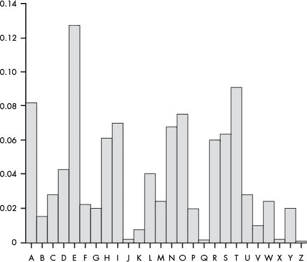
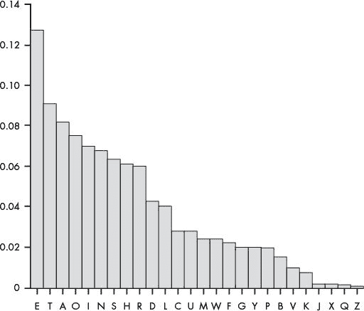
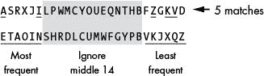
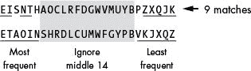
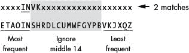
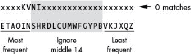
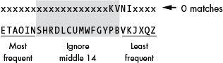

# 19 频率分析

> 原文：<https://inventwithpython.com/cracking/chapter19.html>

在混乱中寻找模式的不可言喻的天赋无法完成它的任务，除非他首先把自己沉浸在混乱中。如果它们确实包含模式，他现在没有以任何理性的方式看到它们。但是他头脑中的某些次理性部分可能会起作用。。."
—尼尔·斯蒂芬森， Cryptonomicon


在本章中，你将学习如何确定每个英文字母在特定文本中的出现频率。然后，您将这些频率与您的密文的字母频率进行比较，以获得有关原始明文的信息，这将有助于您破解加密。这个确定一个字母在明文和密文中出现频率的过程被称为*频率分析*。理解频率分析是破解维吉尼亚密码的重要一步。我们将使用字母频率分析来破解第 20 章中的维根奈尔密码。

**本章涵盖的主题**

*   字母频率和符号

*   `sort()`方法的`key`和`reverse`关键字参数

*   将函数作为值传递，而不是调用函数

*   使用`keys()`、`values()`和`items()`方法将字典转换成列表

### **分析文本中字母的频率**

当你掷硬币时，大约一半的时间是正面，一半的时间是反面。也就是头尾的*频率*应该差不多。我们可以用百分比来表示频率，方法是将一个事件发生的总次数(例如，我们抛了多少次头)除以一个事件的总尝试次数(即我们抛硬币的总次数)，然后将商乘以 100。我们可以通过硬币正面或反面的频率来了解它:硬币的重量是公平的还是不公平的，甚至是双面硬币。

我们还可以从密文的字母频率中了解更多信息。英语字母表中有些字母比其他字母用得更频繁。例如，字母 E、T、A 和 O 在英语单词中出现频率最高，而字母 J、X、Q 和 Z 在英语中出现频率较低。我们将利用英语中字母频率的差异来破解维根加密的信息。

图 19-1 显示了标准英语中的字母频率。这张图表是利用书籍、报纸和其他来源的文字编辑而成的。

当我们将这些字母频率按频率从高到低排序时，E 是最频繁的字母，其次是 T，然后是 A，依此类推，如图图 19-2 所示。

英语中最常见的六个字母是 ETAOIN。按频率排序的字母完整列表为 ETAOINSHRDLCUMWFGYPBVKJXQZ。

回想一下，换位密码通过以不同的顺序排列原始英文明文的字母来加密消息。这意味着密文中的字母频率与原始明文中的字母频率没有区别。例如，在转置密文中，E、T 和 A 应该比 Q 和 Z 出现得更频繁。

同样，在 Caesar 密文和简单替换密文中最常出现的字母更有可能是从最常见的英文字母(如 E、T 或 a)加密而来的。同样，在密文中最不常出现的字母更有可能是从明文中的 to X、Q 和 Z 加密而来的。



*图 19-1:典型英文文本中每个字母的频率分析*



*图 19-2:典型英文文本中出现频率最高和最低的字母*

在破解维吉尼亚密码时，频率分析非常有用，因为它可以让我们一次一个地暴力破解每个子密钥。例如，如果一条消息是用密钥 PIZZA 加密的，我们需要用 26 个 <sup class="calibre21">5 个</sup>或 11，881，376 个密钥来一次找到整个密钥。然而，为了只暴力破解五个子键中的一个，我们只需要尝试 26 种可能性。对五个子键中的每一个都这样做意味着我们只需要暴力破解 26 × 5 或 130 个子键。

使用密钥 PIZZA，消息中从第一个字母开始的每第五个字母用 P 加密，从第二个字母开始的每第五个字母用 I 加密，依此类推。我们可以通过用所有 26 个可能的子密钥解密密文中的每五个字母来暴力破解第一个子密钥。对于第一个子密钥，我们会发现 P 产生的解密字母比其他 25 个可能的子密钥更匹配英语的字母频率。这将是 P 是第一个子密钥的一个强有力的指示。然后，我们可以对其他子项重复此操作，直到获得整个项。

### 匹配字母频率

为了找到消息中的字母频率，我们将使用一种算法，简单地将字符串中的字母从最高频率到最低频率排序。然后算法使用这个有序的字符串来计算这本书所说的*频率匹配分数*，我们将使用它来确定一个字符串的字母频率与标准英语的字母频率有多相似。

为了计算密文的频率匹配分数，我们从 0 开始，然后每次在密文的六个最频繁的字母中出现一个最频繁的英文字母(E，T，A，O，I，N)时加一个点。在密文的六个最不常用的字母中，每次出现一个最不常用的字母(V、K、J、X、Q 或 Z ),我们都会给分数加一分。

字符串的频率匹配分数可以从 0(字符串的字母频率完全不同于英语字母频率)到 12(字符串的字母频率与常规英语的字母频率相同)。知道密文的频率匹配分数可以揭示关于原始明文的重要信息。

#### ***计算简单替换密码的频率匹配分数***

我们将使用以下密文来计算使用简单替换密码加密的消息的频率匹配分数:

```py
Sy l nlx sr pyyacao l ylwj eiswi upar lulsxrj isr sxrjsxwjr, ia esmm
rwctjsxsza sj wmpramh, lxo txmarr jia aqsoaxwa sr pqaceiamnsxu, ia esmm caytra
jp famsaqa sj. Sy, px jia pjiac ilxo, ia sr pyyacao rpnajisxu eiswi lyypcor
l calrpx ypc lwjsxu sx lwwpcolxwa jp isr sxrjsxwjr, ia esmm lwwabj sj aqax
px jia rmsuijarj aqsoaxwa. Jia pcsusx py nhjir sr agbmlsxao sx jisr elh.
-Facjclxo Ctrramm
```

当我们统计这段密文中每个字母出现的频率，从最高频率到最低频率排序，结果是 ASRXJILPWMCYOUEQNTHBFZGKVD。a 是出现频率最高的字母，S 是第二高的字母，以此类推，字母 D 出现频率最低。

在本例中出现频率最高的六个字母(A、S、R、X、J 和 I)中，有两个字母(A 和 I)也是英语中出现频率最高的六个字母之一，它们是 E、T、A、O、I 和 n。因此，我们在频率匹配分数上加 2 分。

密文中最不频繁出现的六个字母是 F、Z、G、K、V 和 d。其中三个字母(Z、K 和 V)出现在最不频繁出现的字母集中，它们是 V、K、J、X、Q 和 Z。因此我们在分数上再加三分。基于从该密文导出的频率排序 ASRXJILPWMCYOUEQNTHBFZGKVD，频率匹配分数为 5，如图图 19-3 所示。



*图 19-3:计算简单替换密码的频率匹配分数*

使用简单替换密码加密的密文不会有很高的频率匹配分数。简单替换密文的字母频率与常规英语的字母频率不匹配，因为明文字母被密码字母一一替换。例如，如果字母 T 被加密成字母 J，那么 J 更有可能在密文中频繁出现，尽管它是英语中出现频率最低的字母之一。

#### ***计算换位密码的频率匹配分数***

这次，让我们计算使用换位密码加密的密文的频率匹配分数:

```py
"I rc ascwuiluhnviwuetnh,osgaa ice tipeeeee slnatsfietgi tittynecenisl. e
fo f fnc isltn sn o a yrs sd onisli ,l erglei trhfmwfrogotn,l  stcofiit.
aea  wesn,lnc ee w,l eIh eeehoer ros  iol er snh nl oahsts  ilasvih  tvfeh
rtira id thatnie.im ei-dlmf i  thszonsisehroe, aiehcdsanahiec  gv gyedsB
affcahiecesd d lee   onsdihsoc nin cethiTitx  eRneahgin r e teom fbiotd  n
ntacscwevhtdhnhpiwru"
```

该密文中最频繁到最不频繁的字母是 EISNTHAOCLRFDGWVMUYBPZXQJK。e 是最常用的字母，I 是第二常用的字母，依此类推。

这份密文中出现频率最高的四个字母(E、I、N 和 T)恰好也是标准英语(ETAOIN)中出现频率最高的字母。同样，密文中出现频率最低的五个字母(Z、X、Q、J、K)也出现在 VKJXQZ 中，总频率匹配得分为 9，如图图 19-4 所示。



*图 19-4:计算换位密码的频率匹配分数*

使用换位密码加密的密文应该具有比简单替换密文高得多的频率匹配分数。原因是，与简单的替代密码不同，换位密码使用在原始明文中找到的相同字母，但排列顺序不同。因此，每个字母的频率保持不变。

#### ***对维根涅密码使用频率分析***

要破解维吉尼亚密码，我们需要单独解密子密钥。这意味着我们不能依靠使用英语单词检测，因为我们不能只用一个子密钥来解密足够多的信息。

相反，我们将解密用一个子密钥加密的字母，并执行频率分析，以确定哪个解密的密文产生最接近常规英语的字母频率。换句话说，我们需要找到哪个解密具有最高的频率匹配分数，这很好地表明我们已经找到了正确的子密钥。

我们对第二、第三、第四和第五个子键也重复这个过程。现在，我们只是猜测密钥长度是五个字母。(在第 20 章中，您将学习如何使用 Kasiski 检查来确定密钥长度。)因为在维吉尼亚密码中每个子密钥(字母表中字母的总数)有 26 个解密，所以计算机只需对一个五个字母的密钥执行 26 + 26 + 26 + 26 或 156 次解密。这比对每个可能的子密钥组合执行解密要容易得多，总共需要 11，881，376 次解密(26 × 26 × 26 × 26 × 26)！

破解维吉尼亚密码还有更多的步骤，当我们编写破解程序时，你会在第 20 章中了解到。现在，让我们编写一个使用以下有用函数执行频率分析的模块:

getLetterCount() 接受一个字符串参数，并返回一个字典，其中包含每个字母在字符串中出现的频率

getFrequencyOrder() 获取一个字符串参数，并返回一个由 26 个字母组成的字符串，在该字符串参数中从最频繁到最不频繁排序

englishFreqMatchScore() 接受一个字符串参数并返回一个从 0 到 12 的整数，表示一个字母的频率匹配分数

### 匹配字母频率的源代码

选择**文件****新文件**，打开新文件编辑器窗口。在文件编辑器中输入以下代码，保存为 `freqAnalysis.py` ，确保 `pyperclip.py` 在同一个目录下。按 F5 运行程序。

`freqAnalysis.py`

```py
# Frequency Finder
# https://www.nostarch.com/crackingcodes/ (BSD Licensed)

ETAOIN = 'ETAOINSHRDLCUMWFGYPBVKJXQZ'
LETTERS = 'ABCDEFGHIJKLMNOPQRSTUVWXYZ'

def getLetterCount(message):
  8.     # Returns a dictionary with keys of single letters and values of the
  9.     # count of how many times they appear in the message parameter:
 10.     letterCount = {'A': 0, 'B': 0, 'C': 0, 'D': 0, 'E': 0, 'F': 0,
           'G': 0, 'H': 0, 'I': 0, 'J': 0, 'K': 0, 'L': 0, 'M': 0, 'N': 0,
           'O': 0, 'P': 0, 'Q': 0, 'R': 0, 'S': 0, 'T': 0, 'U': 0, 'V': 0,
           'W': 0, 'X': 0, 'Y': 0, 'Z': 0}

 12.     for letter in message.upper():
 13.         if letter in LETTERS:
 14.             letterCount[letter] += 1

 16.     return letterCount


def getItemAtIndexZero(items):
 20.     return items[0]


def getFrequencyOrder(message):
 24.     # Returns a string of the alphabet letters arranged in order of most
 25.     # frequently occurring in the message parameter.

 27.     # First, get a dictionary of each letter and its frequency count:
 28.     letterToFreq = getLetterCount(message)

 30.     # Second, make a dictionary of each frequency count to the letter(s)
 31.     # with that frequency:
 32.     freqToLetter = {}
 33.     for letter in LETTERS:
 34.         if letterToFreq[letter] not in freqToLetter:
 35.             freqToLetter[letterToFreq[letter]] = [letter]
 36.         else:
 37.             freqToLetter[letterToFreq[letter]].append(letter)

 39.     # Third, put each list of letters in reverse "ETAOIN" order, and then
 40.     # convert it to a string:
 41.     for freq in freqToLetter:
 42.         freqToLetter[freq].sort(key=ETAOIN.find, reverse=True)
 43.         freqToLetter[freq] = ''.join(freqToLetter[freq])

 45.     # Fourth, convert the freqToLetter dictionary to a list of
 46.     # tuple pairs (key, value), and then sort them:
 47.     freqPairs = list(freqToLetter.items())
 48.     freqPairs.sort(key=getItemAtIndexZero, reverse=True)

 50.     # Fifth, now that the letters are ordered by frequency, extract all
 51.     # the letters for the final string:
 52.     freqOrder = []
 53.     for freqPair in freqPairs:
 54.         freqOrder.append(freqPair[1])

 56.     return ''.join(freqOrder)


def englishFreqMatchScore(message):
 60.     # Return the number of matches that the string in the message
 61.     # parameter has when its letter frequency is compared to English
 62.     # letter frequency. A "match" is how many of its six most frequent
 63.     # and six least frequent letters are among the six most frequent and
 64.     # six least frequent letters for English.
 65.     freqOrder = getFrequencyOrder(message)

 67.     matchScore = 0
 68.     # Find how many matches for the six most common letters there are:
 69.     for commonLetter in ETAOIN[:6]:
 70.         if commonLetter in freqOrder[:6]:
 71.             matchScore += 1
 72.     # Find how many matches for the six least common letters there are:
 73.     for uncommonLetter in ETAOIN[-6:]:
 74.         if uncommonLetter in freqOrder[-6:]:
 75.             matchScore += 1

 77.     return matchScore
```

### 按字母顺序存储字母

第 4 行创建了一个名为`ETAOIN`的变量，它存储字母表中从最频繁到最不频繁排列的 26 个字母:

```py
# Frequency Finder
# https://www.nostarch.com/crackingcodes/ (BSD Licensed)

ETAOIN = 'ETAOINSHRDLCUMWFGYPBVKJXQZ'
```

当然，并不是所有的英语文本都反映了这种精确的频率排序。你可以很容易地找到一本有一组字母频率的书，其中 Z 比 q 使用得更频繁。例如，欧内斯特·文森特·赖特的小说 `Gadsby` 从未使用字母 E，这给了它一组奇怪的字母频率。但是在大多数情况下，包括在我们的模块中，ETAOIN 顺序应该足够准确。

对于一些不同的函数，该模块还需要一个按字母顺序排列的所有大写字母的字符串，所以我们在第 5 行设置了`LETTERS`常量变量。

```py
LETTERS = 'ABCDEFGHIJKLMNOPQRSTUVWXYZ'
```

`LETTERS`的作用与前面程序中的`SYMBOLS`变量相同:提供字符串和整数索引之间的映射。

接下来，我们将看看`getLettersCount()`函数如何计算存储在`message`字符串中的每个字母的频率。

### 计算邮件中的字母数

`getLetterCount()`函数接受`message`字符串并返回一个字典值，其键是单个大写字母字符串，其值是存储该字母在`message`参数中出现的次数的整数。

第 10 行通过给变量分配一个字典来创建变量`letterCount`，该字典将所有键设置为初始值`0`:

```py
def getLetterCount(message):
  8.     # Returns a dictionary with keys of single letters and values of the
  9.     # count of how many times they appear in the message parameter:
 10.     letterCount = {'A': 0, 'B': 0, 'C': 0, 'D': 0, 'E': 0, 'F': 0,
           'G': 0, 'H': 0, 'I': 0, 'J': 0, 'K': 0, 'L': 0, 'M': 0, 'N': 0,
           'O': 0, 'P': 0, 'Q': 0, 'R': 0, 'S': 0, 'T': 0, 'U': 0, 'V': 0,
           'W': 0, 'X': 0, 'Y': 0, 'Z': 0}
```

我们通过在第 12 行使用一个`for`循环检查`message`中的每个字符，增加与键相关的值，直到它们代表每个字母的计数。

```py
 12.     for letter in message.upper():
 13.         if letter in LETTERS:
 14.             letterCount[letter] += 1
```

`for`循环遍历大写版本的`message`中的每个字符，并将该字符赋给`letter`变量。在第 13 行，我们检查字符是否存在于`LETTERS`字符串中，因为我们不想计算`message`中的非字母字符。当`letter`是`LETTERS`串的一部分时，第 14 行增加`letterCount[letter]`处的值。

在第 12 行的`for`循环结束后，第 16 行的`letterCount`字典应该有一个计数，显示每个字母在`message`中出现的频率。本词典从`getLetterCount()`返回:

```py
 16.     return letterCount
```

例如，在本章中我们将使用下面的字符串(来自`en.wikipedia.org/wiki/Alan_Turing`):

```py
"""Alan Mathison Turing was a British mathematician, logician, cryptanalyst, and computer
scientist. He was highly influential in the development of computer science, providing a
formalisation of the concepts of "algorithm" and "computation" with the Turing machine. Turing
is widely considered to be the father of computer science and artificial intelligence. During
World War II, Turing worked for the Government Code and Cypher School (GCCS) at Bletchley Park,
Britain's codebreaking centre. For a time he was head of Hut 8, the section responsible for
German naval cryptanalysis. He devised a number of techniques for breaking German ciphers,
including the method of the bombe, an electromechanical machine that could find settings
for the Enigma machine. After the war he worked at the National Physical Laboratory, where
he created one of the first designs for a stored-program computer, the ACE. In 1948 Turing
joined Max Newman's Computing Laboratory at Manchester University, where he assisted in the
development of the Manchester computers and became interested in mathematical biology. He wrote
a paper on the chemical basis of morphogenesis, and predicted oscillating chemical reactions
such as the Belousov-Zhabotinsky reaction, which were first observed in the 1960s. Turing's
homosexuality resulted in a criminal prosecution in 1952, when homosexual acts were still
illegal in the United Kingdom. He accepted treatment with female hormones (chemical castration)
as an alternative to prison. Turing died in 1954, just over two weeks before his 42nd birthday,
from cyanide poisoning. An inquest determined that his death was suicide; his mother and some
others believed his death was accidental. On 10 September 2009, following an Internet campaign,
British Prime Minister Gordon Brown made an official public apology on behalf of the British
government for "the appalling way he was treated." As of May 2012 a private member's bill was
before the House of Lords which would grant Turing a statutory pardon if enacted."""
```

对于这个字符串值，它有 135 个 A 实例，30 个 B 实例，依此类推，`getLetterCount()`将返回如下所示的字典:

```py
{'A': 135, 'B': 30, 'C': 74, 'D': 58, 'E': 196, 'F': 37, 'G': 39, 'H': 87,
'I': 139, 'J': 2, 'K': 8, 'L': 62, 'M': 58, 'N': 122, 'O': 113, 'P': 36,
'Q': 2, 'R': 106, 'S': 89, 'T': 140, 'U': 37, 'V': 14, 'W': 30, 'X': 3,
'Y': 21, 'Z': 1}
```

### 获取元组的第一个成员

第 19 行的`getItemAtIndexZero()`函数在向其传递一个元组时返回索引`0`处的项目:

```py
def getItemAtIndexZero(items):
 20.     return items[0]
```

在程序的后面，我们将把这个函数传递给`sort()`方法，将字母的频率按数字顺序排序。我们将在第 275 页的上的“将字典条目转换为可排序列表”中详细了解这一点。

### 按频率对邮件中的字母进行排序

`getFrequencyOrder()`函数将一个`message`字符串作为参数，并返回一个包含字母表中 26 个大写字母的字符串，按照它们在`message`参数中出现的频率排列。如果`message`是可读的英语而不是随机的胡言乱语，那么这个字符串很可能与`ETAOIN`常量中的字符串相似，如果不是完全相同的话。`getFrequencyOrder()`函数中的代码完成了计算字符串频率匹配分数的大部分工作，我们将在第 20 章的维吉尼亚hacking 程序中使用它。

例如，如果我们将`"""Alan Mathison Turing..."""`字符串传递给`getFrequencyOrder` `()`，该函数将返回字符串`'` `ETIANORSHCLMDGFUPBWYVKXQJZ'`，因为 E 是该字符串中最常见的字母，接下来是 T、I、A 等等。

`getFrequencyOrder()`功能由五个步骤组成:

1.  计算字符串中的字母

2.  创建频率计数和字母列表的字典

3.  按相反的顺序排列字母列表

4.  将该数据转换成元组列表

5.  将列表转换成函数`getFrequencyOrder()`返回的最终字符串

让我们依次看看每一步。

#### ***用 getLetterCount()* 计数字母 T3】**

`getFrequencyOrder()`的第一步用`message`参数调用第 28 行的`getLetterCount()`来获得一个名为`letterToFreq`的字典，包含`message`中每个字母的计数:

```py
def getFrequencyOrder(message):
 24.     # Returns a string of the alphabet letters arranged in order of most
 25.     # frequently occurring in the message parameter.

 27.     # First, get a dictionary of each letter and its frequency count:
 28.     letterToFreq = getLetterCount(message)
```

如果我们将`"""Alan Mathison Turing..."""`字符串作为`message`参数传递，第 28 行给`letterToFreq`分配如下字典值:

```py
{'A': 135, 'C': 74, 'B': 30, 'E': 196, 'D': 58, 'G': 39, 'F': 37, 'I': 139,
'H': 87, 'K': 8, 'J': 2, 'M': 58, 'L': 62, 'O': 113, 'N': 122, 'Q': 2,
'P': 36, 'S': 89, 'R': 106, 'U': 37, 'T': 140, 'W': 30, 'V': 14, 'Y': 21,
'X': 3, 'Z': 1}
```

#### ***创建频率计数和字母列表的字典***

`getFrequencyOrder()`的第二步是创建一个字典`freqToLetter`，它的键是频率计数，它的值是包含这些频率计数的字母列表。鉴于`letterToFreq`字典将字母键映射到频率值，而`freqToLetter`字典将频率键映射到字母值列表，因此我们需要翻转`letterToFreq`字典中的键和值。我们翻转键和值，因为多个字母可能具有相同的频率计数:`'B'`和`'W'`在我们的示例中都具有频率计数`30`，所以我们需要将它们放在类似于`{30: ['B', 'W']}`的字典中，因为字典键必须是惟一的。否则，类似于`{30: 'B', 30: 'W'}`的字典值将简单地用另一个键-值对覆盖其中一个。

为了创建`freqToLetter`字典，第 32 行首先创建一个空白字典:

```py
 30.     # Second, make a dictionary of each frequency count to the letter(s)
 31.     # with that frequency:
 32.     freqToLetter = {}
 33.     for letter in LETTERS:
 34.         if letterToFreq[letter] not in freqToLetter:
 35.             freqToLetter[letterToFreq[letter]] = [letter]
 36.         else:
 37.             freqToLetter[letterToFreq[letter]].append(letter)
```

第 33 行循环遍历`LETTERS`中的所有字母，第 34 行的`if`语句检查字母的频率或`letterToFreq[letter]`是否已经作为关键字存在于`freqToLetter`中。如果没有，那么第 35 行添加这个键，并以字母列表作为值。如果字母的频率已经作为关键字存在于`freqToLetter`中，第 37 行简单地将该字母附加到已经在`letterToFreq[letter]`中的列表的末尾。

使用使用`"""Alan Mathison Turing..."""`字符串创建的示例值`letterToFreq`,`freqToLetter`现在应该返回如下内容:

```py
{1: ['Z'], 2: ['J', 'Q'], 3: ['X'], 135: ['A'], 8: ['K'], 139: ['I'],
140: ['T'], 14: ['V'], 21: ['Y'], 30: ['B', 'W'], 36: ['P'], 37: ['F', 'U'],
39: ['G'], 58: ['D', 'M'], 62: ['L'], 196: ['E'], 74: ['C'], 87: ['H'],
89: ['S'], 106: ['R'], 113: ['O'], 122: ['N']}
```

请注意，字典的键现在包含频率计数，其值包含具有这些频率的字母列表。

 *`getFrequencyOrder()`的第三步涉及到对`freqToLetter`的每个列表中的字母串进行排序。回想一下，`freqToLetter[freq]`计算出字母的*列表*，其频率计数为`freq`。我们使用列表是因为两个或更多的字母可能具有相同的频率计数，在这种情况下，列表将具有由两个或更多字母组成的字符串。

当多个字母具有相同的频率计数时，我们希望按照与它们在`ETAOIN`字符串中出现的顺序相反的顺序对这些字母进行排序。这使得排序一致，并最小化偶然增加频率匹配分数的可能性。

例如，假设字母 V、I、N 和 K 的频率计数对于我们试图评分的字符串都是相同的。我们还假设字符串中的四个字母比 V、I、N 和 K 具有更高的频率计数，而十八个字母具有更低的频率计数。在这个例子中，我将使用 `x` 作为这些字母的占位符。图 19-5 显示了将这四个字母按顺序排列的样子。



*图 19-5:如果四个字母按 ETAOIN 顺序排列，频率匹配得分将获得两分。*

在这种情况下，I 和 N 给频率匹配分数增加了两分，因为 I 和 N 是前六个最频繁出现的字母，即使它们在这个示例字符串中出现的频率没有 V 和 K 高。因为频率匹配分数的范围只有 0 到 12，所以这两点可以产生很大的影响！但是通过将相同频率的字母以相反的顺序排列，我们可以将一个字母得分过高的可能性降到最低。图 19-6 以相反的顺序显示了这四个字母。



*图 19-6:如果四个字母顺序相反，频率匹配分数不会增加。*

通过以相反的顺序排列字母，我们避免了通过 I、N、V 和 k 的随机排序来人为增加频率匹配分数。如果有 18 个字母具有较高的频率计数，4 个字母具有较低的频率计数，也是如此，如图图 19-7 所示。



*图 19-7:对不太频繁的字母颠倒 ETAOIN 顺序也避免了增加匹配分数。*

反向排序顺序确保 K 和 V 不匹配英语中六个最不频繁的字母中的任何一个，并且再次避免将频率匹配分数增加两分。

为了对`freqToLetter`字典中的每个列表值进行逆序排序，我们需要向 Python 的`sort()`函数传递一个方法。让我们看看如何将一个函数或方法传递给另一个函数。

##### **传递函数作为值**

在第 42 行，我们没有调用`find()`方法，而是将`find`作为一个值传递给`sort()`方法调用:

```py
 42.         freqToLetter[freq].sort(key=ETAOIN.find, reverse=True)
```

我们可以这样做，因为在 Python 中，函数可以被视为值。事实上，定义一个名为`spam`的函数与将函数定义存储在名为`spam`的变量中是一样的。要查看示例，请在交互式 shell 中输入以下代码:

```py
>>> def spam():
...   print('Hello!')
...
>>> spam()
Hello!
>>> eggs = spam
>>> eggs()
Hello!
```

在这个示例代码中，我们定义了一个名为`spam()`的函数来打印字符串`'Hello!'`。这也意味着变量`spam`持有函数定义。然后我们将变量`spam`中的函数复制到变量`eggs`中。这样做了之后，我们就可以像调用`spam()`一样调用`eggs()`了！请注意，赋值语句在`spam`后不包含圆括号*而不是*。如果是的话，它将调用*调用`spam()`函数*并将变量`eggs`设置为从`spam()`函数得到的返回值。

因为函数是值，所以我们可以在函数调用中将它们作为参数传递。在交互式 shell 中输入以下内容以查看示例:

```py
   >>> def doMath(func):
   ...   return func(10, 5)
   ...
   >>> def adding(a, b):
   ...   return a + b
   ...
   >>> def subtracting(a, b):
   ...   return a - b
   ...
   >>> doMath(adding) # ➊
   15
   >>> doMath(subtracting)
   5
```

这里我们定义了三个函数:`doMath()`、`adding()`和`subtracting()`。当我们将`adding`中的函数传递给`doMath()`调用 ➊ 时，我们正在将`adding`赋给变量`func`，而`func(10, 5)`正在调用`adding()`并将`10`和`5`传递给它。因此调用`func(10, 5)`实际上与调用`adding`和`(10, 5)`相同。这就是`doMath(adding)`返回`15`的原因。同样，当我们将`subtracting`传递给`doMath()`调用时，`doMath(subtracting)`返回`5`，因为`func(10, 5)`与`subtracting(10, 5)`相同。

##### **向 sort()方法传递函数**

将函数或方法传递给`sort()`方法让我们实现不同的排序行为。通常，`sort()`按字母顺序对列表中的值进行排序:

```py
>>> spam = ['C', 'B', 'A'] 
>>> spam.sort()
>>> spam
['A', 'B', 'C']
```

但是，如果我们为关键字参数`key`传递一个函数(或方法),当列表中的每个值被传递给那个函数时，列表中的值就按照函数的返回值排序*。例如，我们也可以将`ETAOIN.find()`字符串方法作为`key`传递给`sort()`调用，如下所示:*

```py
>>> ETAOIN = 'ETAOINSHRDLCUMWFGYPBVKJXQZ'
>>> spam.sort(key=ETAOIN.find)
>>> spam
['A', 'C', 'B']
```

当我们将`ETAOIN.find`传递给`sort()`方法时，`sort()`方法首先对每个字符串调用`find()`方法，以便`ETAOIN.find('A')`、`ETAOIN.find('B')`和`ETAOIN.find('C')`分别返回索引`2`、`19`和`11`——每个字符串在`ETAOIN`字符串中的位置。然后`sort()`使用这些返回的索引，而不是原来的`'A'`、`'B'`和`'C'`字符串，对`spam`列表中的项目进行排序。这就是为什么`'A'`、`'B'`和`'C'`字符串被排序为`'A'`、`'C'`和`'B'`，反映它们在`ETAOIN`中出现的顺序。

##### **用 sort()方法反转字母列表**

为了以相反的顺序对字母进行排序，我们首先需要通过将`ETAOIN.find`分配给`key`来基于`ETAOIN`字符串对它们进行排序。在对所有字母调用该方法使它们都成为索引后，`sort()`方法根据字母的数字索引对它们进行排序。

通常，`sort()`函数按字母或数字顺序对它所调用的任何列表进行排序，这被称为*升序*。为了以*降序、*反向字母顺序或反向数字顺序对项目进行排序，我们将`True`传递给`sort()`方法的`reverse`关键字参数。

我们在第 42 行做了所有这些:

```py
 39.     # Third, put each list of letters in reverse "ETAOIN" order, and then
 40.     # convert it to a string:
 41.     for freq in freqToLetter:
 42.         freqToLetter[freq].sort(key=ETAOIN.find, reverse=True)
 43.         freqToLetter[freq] = ''.join(freqToLetter[freq])
```

回想一下，在这一点上，`freqToLetter`是一个字典，它将整数频率计数存储为它的键，将字母字符串列表存储为它的值。键`freq`处的字母串被排序，而不是`freqToLetter`字典本身。字典无法排序，因为它们没有顺序:不像列表项那样有“第一个”或“最后一个”键值对。

再次使用`freqToLetter`的`"""Alan Mathison Turing..."""`示例值，当循环结束时，这将是存储在`freqToLetter`中的值:

```py
{1: 'Z', 2: 'QJ', 3: 'X', 135: 'A', 8: 'K', 139: 'I', 140: 'T', 14: 'V',
21: 'Y', 30: 'BW', 36: 'P', 37: 'FU', 39: 'G', 58: 'MD', 62: 'L', 196: 'E',
74: 'C', 87: 'H', 89: 'S', 106: 'R', 113: 'O', 122: 'N'}
```

注意，`30`、`37`和`58`键的字符串都是以相反的顺序排序的。在循环执行之前，键值对如下所示:`{30: ['B', 'W'], 37: ['F', 'U'], 58: ['D', 'M'], ...}`。循环之后，它们应该是这样的:`{30: 'BW', 37: 'FU', 58: 'MD', ...}`。

第 43 行的`join()`方法调用将字符串列表变成一个单独的字符串。例如，`freqToLetter[30]`中的值是`['B', 'W']`，被联接为`'BW'`。

#### ***按频率排序字典列表***

`getFrequencyOrder()`的第四步是按照频率计数对`freqToLetter`字典中的字符串进行排序，并将字符串转换成一个列表。请记住，因为字典中的键-值对是无序的，所以字典中所有键或值的列表值将是一个随机顺序的项目列表。这意味着我们还需要对这个列表进行排序。

##### **使用 key()、values()和 items()字典方法**

`keys()`、`values()`和`items()`字典方法都将字典的一部分转换成非字典数据类型。将字典转换成另一种数据类型后，可以使用`list()`函数将其转换成列表。

在交互式 shell 中输入以下内容以查看示例:

```py
>>> spam = {'cats': 10, 'dogs': 3, 'mice': 3}
>>> spam.keys()
dict_keys(['mice', 'cats', 'dogs'])
>>> list(spam.keys())
['mice', 'cats', 'dogs']
>>> list(spam.values())
[3, 10, 3]
```

为了获得字典中所有键的列表值，我们可以使用`keys()`方法返回一个`dict_keys`对象，然后我们可以将该对象传递给`list()`函数。一个类似的名为`values()`的字典方法返回一个`dict_values`对象。这些例子分别给出了字典的键列表和值列表。

为了同时获得键和值，我们可以使用`items()` dictionary 方法返回一个`dict_items`对象，这使得键-值对成为元组。然后我们可以将元组传递给`list()`。在交互式 shell 中输入以下内容以查看实际效果:

```py
>>> spam = {'cats': 10, 'dogs': 3, 'mice': 3}
>>> list(spam.items())
[('mice', 3), ('cats', 10), ('dogs', 3)]
```

通过调用`items()`和`list()`，我们将`spam`字典的键值对转换成元组列表。这正是我们需要用`freqToLetter`字典做的事情，这样我们就可以按频率按数字顺序对字母串进行排序。

##### **将字典条目转换为可排序列表**

`freqToLetter`字典将整数频率计数作为键，将单字母字符串列表作为值。为了按频率顺序对字符串进行排序，我们调用`items()`方法和`list()`函数来创建字典的键-值对的元组列表。然后，我们将这个元组列表存储在第 47 行名为`freqPairs`的变量中:

```py
 45.     # Fourth, convert the freqToLetter dictionary to a list of
 46.     # tuple pairs (key, value), and then sort them:
 47.     freqPairs = list(freqToLetter.items())
```

在第 48 行，我们将之前在程序中定义的`getItemAtIndexZero`函数值传递给`sort()`方法调用:

```py
 48.     freqPairs.sort(key=getItemAtIndexZero, reverse=True)
```

`getItemAtIndexZero()`函数获取元组中的第一项，在本例中是频率计数整数。这意味着`freqPairs`中的项目按照频率计数整数的数字顺序排序。第 48 行还为`reverse`关键字参数传递了`True`，因此元组从最大频率计数到最小频率计数反向排序。

继续`"` `""Alan Mathison Turing..."""`的例子，在第 48 行执行之后，这将是`freqPairs`的值:

```py
[(196, 'E'), (140, 'T'), (139, 'I'), (135, 'A'), (122, 'N'), (113, 'O'),
(106, 'R'), (89, 'S'), (87, 'H'), (74, 'C'), (62, 'L'), (58, 'MD'), (39, 'G'),
(37, 'FU'), (36, 'P'), (30, 'BW'), (21, 'Y'), (14, 'V'), (8, 'K'), (3, 'X'),
(2, 'QJ'), (1, 'Z')]
```

`freqPairs`变量现在是从最频繁到最不频繁字母排序的元组列表:每个元组中的第一个值是表示频率计数的整数，第二个值是包含与频率计数相关的字母的字符串。

#### ***创建排序后的字母列表***

`getFrequencyOrder()`的第五步是从`freqPairs`中的排序列表中创建所有字符串的列表。我们希望得到一个字符串值，它的字母按照出现的频率排序，所以我们不需要`freqPairs`中的整数值。变量`freqOrder`从第 52 行的空白列表开始，第 53 行的`for`循环将`freqPairs`中每个元组的索引`1`处的字符串追加到`freqOrder`的末尾:

```py
 50.     # Fifth, now that the letters are ordered by frequency, extract all
 51.     # the letters for the final string:
 52.     freqOrder = []
 53.     for freqPair in freqPairs:
 54.         freqOrder.append(freqPair[1])
```

继续这个例子，在第 53 行的循环结束后，`freqOrder`应该包含`['E',``'T',``'``I',``'A',``'N',``'O',``'R',``'S',``'H',``'C',``'L',``'MD',``'``G',``'FU',``'P',``'BW',``'Y',``'V',``'K',``'X',``'QJ',``'Z']`作为它的值。

第 56 行通过使用`join()`方法将字符串连接起来，从`freqOrder`中的字符串列表创建一个字符串:

```py
 56.     return ''.join(freqOrder)
```

对于`"""Alan Mathison Turing..."""`示例，`getFrequencyOrder()`返回字符串`'ETIANORSHCLMDGFUPBWYVKXQJZ'`。根据这种排序，E 是示例字符串中最频繁出现的字母，T 是第二频繁出现的字母，I 是第三频繁出现的字母，依此类推。

既然我们已经将消息的字母频率作为一个字符串值，我们可以将它与英语的字母频率(`'ETAOINSHRDLCUMWFGYPBVKJXQZ'`)的字符串值进行比较，以查看它们的匹配程度。

### **计算消息的频率匹配分数**

`englishFreqMatchScore()`函数为`message`获取一个字符串，然后返回一个介于`0`和`12`之间的整数，表示该字符串的频率匹配分数。分数越高，`message`中的字母频率越接近正常英语文本的频率。

```py
def englishFreqMatchScore(message):
 60.     # Return the number of matches that the string in the message
 61.     # parameter has when its letter frequency is compared to English
 62.     # letter frequency. A "match" is how many of its six most frequent
 63.     # and six least frequent letters are among the six most frequent and
 64.     # six least frequent letters for English.
 65.     freqOrder = getFrequencyOrder(message)
```

计算频率匹配分数的第一步是通过调用`getFrequencyOrder()`函数得到`message`的字母频率排序，我们在第 65 行做了这个。我们将有序的字符串存储在变量`freqOrder`中。

`matchScore`变量从第 67 行的`0`开始，并由从第 69 行开始的`for`循环递增，该循环比较`ETAOIN`字符串的前六个字母和`freqOrder`的前六个字母，为它们共有的每个字母给出一个点:

```py
 67.     matchScore = 0
 68.     # Find how many matches for the six most common letters there are:
 69.     for commonLetter in ETAOIN[:6]:
 70.         if commonLetter in freqOrder[:6]:
 71.             matchScore += 1
```

回想一下，`[:6]`片段与`[0:6]`相同，所以第 69 行和第 70 行分别对`ETAOIN`和`freqOrder`字符串的前六个字母进行了切片。如果字母 E、T、A、O、I 或 N 中的任何一个也在`freqOrder`字符串的前六个字母中，则第 70 行的条件为`True`，第 71 行递增`matchScore`。

第 73 到 75 行类似于第 69 到 71 行，除了在这种情况下，它们检查`ETAOIN`字符串中的*最后的*六个字母(V、K、J、X、Q 和 Z)是否在`freqOrder`字符串中的*最后的*六个字母中。如果是，则`matchScore`递增。

```py
 72.     # Find how many matches for the six least common letters there are:
 73.     for uncommonLetter in ETAOIN[-6:]:
 74.         if uncommonLetter in freqOrder[-6:]:
 75.             matchScore += 1
```

第 77 行返回`matchScore`中的整数:

```py
 77.     return matchScore
```

在计算频率匹配分数时，我们忽略频率顺序中间的 14 个字母。这些中间字母的频率彼此过于相似，无法给出有意义的信息。

### **总结**

在本章中，您学习了如何使用`sort()`函数按字母或数字顺序对列表值进行排序，以及如何使用`reverse`和`key`关键字参数以不同方式对列表值进行排序。您学习了如何使用`keys()`、`values()`和`items()`字典方法将字典转换成列表。您还了解了可以在函数调用中将函数作为值传递。

在第 20 章中，我们将使用我们在本章中编写的频率分析模块来破解维吉尼亚密码！

**练习题**

练习题的答案可以在本书的网站[`www.nostarch.com/crackingcodes`](https://www.nostarch.com/crackingcodes/)找到。

1.  什么是频率分析？

2.  英语中最常用的六个字母是什么？

3.  运行以下代码后，`spam`变量包含什么？

    ```py
    spam = [4, 6, 2, 8]
    spam.sort(reverse=True)
    ```

4.  如果`spam`变量包含一个字典，如何获取字典中键的列表值？**