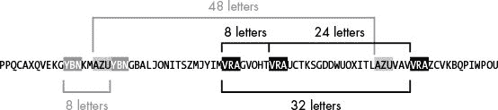
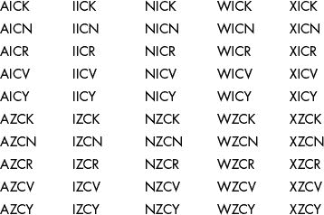
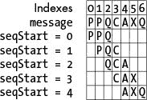

# 20 破解维吉尼亚密码

> 原文：<https://inventwithpython.com/cracking/chapter20.html>

隐私权是一项与生俱来的人权，是维护人类尊严和尊重的必要条件
—布鲁斯·施奈尔，密码学家，2006 年


有两种方法可以破解维吉尼亚密码。一种方法使用强力*字典攻击*来尝试将字典文件中的每个单词作为维吉尼亚键，只有当该键是英语单词时才有效，如 RAVEN 或 DESK。第二种更复杂的方法是 19 世纪数学家查尔斯·巴贝奇使用的，即使密钥是一组随机的字母，如 VUWFE 或 PNFJ，它也能工作。在本章中，我们将使用这两种方法编写程序来破解维吉尼亚密码。

**本章涵盖的主题**

*   字典攻击

*   卡西斯基检查

*   计算因素

*   `set`数据类型和`set()`功能

*   `extend()`列表法

*   `itertools.product()`功能

### 使用字典攻击暴力破解维吉尼亚密码

我们将首先使用字典攻击来破解维吉尼亚密码。字典文件`dictionary.txt` (可在本书网站`www.nostarch.com/crackingcodes`)约有 45000 个英语单词。我的电脑只需不到五分钟就能完成对一个长段落大小的信息的所有解密。这意味着，如果使用一个英语单词来加密一个维吉尼亚密文，该密文容易受到字典攻击。让我们来看一个使用字典攻击来破解维吉尼亚密码的程序的源代码。*

### 维吉尼亚字典破解程序的源代码

选择**文件 -> 新文件**，打开新文件编辑器窗口。在文件编辑器中输入以下代码，然后保存为`vigeneredictionaryhacker.py`。确保将`detectEnglish.py`、`vigenereCipher.py`和`pyperclip.py`文件与`vigeneredictionaryhacker.py`文件放在同一目录下。然后按`F5`运行程序。

*守护
字典
黑客. py*

```py
# Vigenere Cipher Dictionary Hacker
# https://www.nostarch.com/crackingcodes/ (BSD Licensed)

import detectEnglish, vigenereCipher, pyperclip

def main():
    ciphertext = """Tzx isnz eccjxkg nfq lol mys bbqq I lxcz."""
    hackedMessage = hackVigenereDictionary(ciphertext)

    if hackedMessage != None:
        print('Copying hacked message to clipboard:')
        print(hackedMessage)
        pyperclip.copy(hackedMessage)
    else:
        print('Failed to hack encryption.')


def hackVigenereDictionary(ciphertext):
    fo = open('dictionary.txt')
    words = fo.readlines()
    fo.close()

    for word in lines:
        word = word.strip() # Remove the newline at the end.
        decryptedText = vigenereCipher.decryptMessage(word, ciphertext)
        if detectEnglish.isEnglish(decryptedText, wordPercentage=40):
            # Check with user to see if the decrypted key has been found:
            print()
            print('Possible encryption break:')
            print('Key ' + str(word) + ': ' + decryptedText[:100])
            print()
            print('Enter D for done, or just press Enter to continue
                  breaking:')
            response = input('> ')

            if response.upper().startswith('D'):
                return decryptedText

if __name__ == '__main__':
    main()
```

### vigenère 字典破解程序的运行示例

当您运行`vigeneredictionaryhacker.py`程序时，输出应该是这样的:

```py
Possible encryption break:
Key ASTROLOGY: The recl yecrets crk not the qnks I tell.
Enter D for done, or just press Enter to continue breaking:
>
Possible encryption break:
Key ASTRONOMY: The real secrets are not the ones I tell.
Enter D for done, or just press Enter to continue breaking:
> d
Copying hacked message to clipboard:
The real secrets are not the ones I tell.
```

程序建议的第一个关键字(`ASTROLOGY`)不起作用，所以用户按`回车`让黑客程序继续，直到找到正确的解密密钥(`ASTRONOMY`)。

### 关于维吉尼亚字典破解计划

因为`vigeneredictionaryhacker.py`程序的源代码与本书中之前的黑客程序类似，所以我不会逐行解释。简单来说，`hackVigenereDictionary()`函数试图使用字典文件中的每个单词来解密密文，当解密后的文本看起来像英语时(根据`detectEnglish`模块)，它打印解密并提示用户退出或继续。

注意，这个程序对从`open()`返回的文件对象使用了`readlines()`方法:

```py
    words = fo.readlines()
```

与将文件的全部内容作为单个字符串返回的`read()`方法不同，`readlines()`方法返回一个字符串列表，其中每个字符串是文件中的一行。因为字典文件的每一行都有一个单词，所以`words`变量包含了从`Aarhus`到`Zurich`的每一个英语单词的列表。

程序的其余部分，从第 23 行到第 36 行，类似于第 12 章中的换位密码破解程序。一个`for`循环将迭代`words`列表中的每个单词，以单词为密钥解密消息，然后调用`detectEnglish.isEnglish()`查看结果是否是可理解的英文文本。

现在，我们已经编写了一个使用字典攻击来破解维吉尼亚密码的程序，让我们看看如何破解维吉尼亚密码，即使密钥是一组随机的字母而不是字典中的单词。

### 使用卡西斯基检查来查找密钥的长度

*卡西斯基检查*是一个我们可以用来确定用于加密密文的维吉尼亚密钥长度的过程。然后，我们可以使用频率分析来单独破解每个子密钥。查尔斯·巴贝奇是第一个用这种方法破解维吉尼亚尔密码的人，但他从未公布过他的结果。他的方法后来被 20 世纪早期的数学家弗雷德里希·卡西斯基发表，他成为了这种方法的同名者。我们来看看卡西斯基考试涉及的步骤。这些是我们的维吉尼亚黑客计划将采取的步骤。

#### 寻找重复序列

卡西斯基检查的第一步是找到密文中至少三个字母的每个重复集。这些重复的序列可以是使用维吉尼亚密钥的相同子密钥加密的相同明文字母。例如，如果你用密钥 SPILLTHEBEANS 加密明文，你会得到:

```py
THECATISOUTOFTHEBAG
SPILLTHEBEANSSPILLT
LWMNLMPWPYTBXLWMMLZ
```

注意，字母`LWM`重复了两次。原因是在密文中，`LWM`是使用与密钥相同的字母(SPI)加密的明文，因为密钥恰好在第二次加密时重复。从第一个`LWM`开始到第二个`LWM`开始的字母数，我们称之为*间距*，是 13。这表明用于该密文的密钥有 13 个字母长。只要看看重复的序列，你就能算出钥匙的长度。

然而，在大多数密文中，密钥不会方便地与重复的字母序列对齐，或者密钥可能在重复序列之间重复多次，这意味着重复字母之间的字母数量将等于密钥的倍数，而不是密钥本身。为了解决这些问题，让我们看一个更长的例子，在这个例子中，我们不知道键是什么。

当我们去掉密文中的非字母 PPQCA XQVEKG YBNKMAZU YBNGBAL JON I TSZM JYIM。VRAG VOHT 弗劳 C TKSG。DDWUO XITLAZU VAVV RAZ C VKB QP IWPOU，它看起来像图 20-1 所示的字符串。该图还显示了该字符串中的重复序列——VRA、AZU 和 YBN——以及每个序列对之间的字母数。



*图 20-1：示例字符串中的重复序列*

在这个例子中，有几个潜在的密钥长度。卡西斯基检查的下一步是计算这些计数的所有因素，以缩小潜在的密钥长度。

#### 获取间隔因子

在示例中，序列之间的间隔是 8、8、24、32 和 48。但是间距的因素比间距更重要。

要了解原因，请看表 20-1 中的消息“密码”并尝试用九个字母的密钥 ABCDEFGHI 和三个字母的密钥 XYZ 对其加密。每个键在消息长度内重复。

**表 20-1**： 用两个不同的密钥加密密码

|  | **用 ABCDEFGHI 加密** | **用 XYZ 加密** |
| --- | --- | --- |
| **明文消息** | `DOGANDCAT` | `DOGANDCAT` |
| **键(重复)** | `ABCDEFGHIABCDEF` | `XYZXYZ` |
| **密文** | `TIGGSLGULTIGFEY` |` QFDAMFXLCZYS` |

正如所料，这两个密钥产生了两种不同的密文。当然，黑客不会知道原始消息或密钥，但他们会在`TIGGSLGULTIGFEY`密文中看到序列`TIG`出现在索引 0 和索引 9 处。因为`9 – 0 = 9`，这些序列之间的间距是 9，这似乎表明原始键是一个九个字母的键；在这种情况下，指示是正确。

然而，`QFDAMFXLCQFDZYS`密文也会产生一个重复序列(`QFD`)，出现在索引 0 和索引 9 处。这些序列之间的间距也是 9，这表明该密文中使用的密钥也是 9 个字母长。但是我们知道密钥只有三个字母长:`XYZ`。

当消息中的相同字母(在我们的示例中为)用密钥中的相同字母(在我们的示例中为 ABC 和 XYZ)加密时，会出现重复序列，这发生在消息和密钥中的相似字母“排列”并加密到相同序列时。这种对齐可以发生在任意倍数的真实密钥长度上(比如 3、6、9、12 等等)，这就是为什么三个字母的密钥可以产生间隔为 9 的重复序列。

因此，可能的密钥长度不仅取决于间距，还取决于间距的任何因素。9 的因数是 9、3 和 1。因此，如果您发现间距为 9 的重复序列，您必须考虑密钥的长度可能是 9 或 3。我们可以忽略 1，因为只有一个字母密钥的维吉尼亚密码就是凯撒密码。

卡西斯基检验的第 2 步包括找出每个间距的因子(不包括 1)，如表 20-2 所示。

**表 20-2**： 各间距的因子

| **间距** | **因素** |
| --- | --- |
| 8 | 2, 4, 8 |
| 24 | 2, 4, 6, 8, 12, 24 |
| 32 | 2, 4, 8, 16 |
| 48 | 2, 4, 6, 8, 12, 24, 48 |

数字 8、8、24、32 和 48 合起来有以下因数:2、2、2、2、4、4、4、6、6、8、8、8、12、12、16、24、24 和 48。

关键很可能是最常出现的因素，你可以通过计数来确定。因为 2、4 和 8 是最常出现的间距因子，所以它们是最有可能的维吉尼亚调长度。

#### 从字符串中每隔 n 个字母获取一个

现在我们有了维吉尼亚密钥的可能长度，我们可以使用这个信息一次解密一个子密钥。对于这个例子，让我们假设密钥长度是 4。如果我们不能破解这个密文，我们可以假设密钥长度为 2 或 8 再试一次。

因为密钥是循环加密明文的，所以密钥长度为 4 意味着从第一个字母开始，密文中的每四个字母使用第一个子密钥加密，从明文的第二个字母开始的每四个字母使用第二个子密钥加密，依此类推。使用这些信息，我们将从由同一个子密钥加密的字母的密文中形成字符串。首先，让我们确定如果我们从不同的字母开始，字符串中的第四个字母会是什么。然后我们将这些字母组合成一个字符串。在这些例子中，我们将每第四个字母加粗。

识别从第一个字母开始的每第四个字母:

```py
PPQCAXQVEKGYBNKMAZUYBNGBALJONITSZMJYIMVRAGVOHTVRAUCTKSGDDWUOXITLAZUVAVVRAZCV
KBQPIWPOU
```

接下来，我们找到从第二个字母开始的第四个字母:

```py
PPQCAXQVEKGYBNKMAZUYBNGBALJONITSZMJYIMVRAGVOHTVRAUCTKSGDDWUOXITLAZUVAVVRAZCV
KBQPIWPOU
```

然后我们从第三个字母和第四个字母开始做同样的事情，直到我们达到我们正在测试的子密钥的长度。表 20-3 显示了每次迭代的粗体字母组合字符串。

**表 20-3**： 每隔四个字母的字符串

| **起始** | **字符串** |
| --- | --- |
| 第一个字母 | `PAEBABANZIAHAKDXAAAKIU` |
| 第二个字母 | `PXKNZNLIMMGTUSWIZVZBW` |
| 第三个字母 | `QQGKUGJTJVVVCGUTUVCQP` |
| 第四个字母 | `CVYMYBOSYRORTDOLVRVPO` |

#### 利用频率分析破解每个子密钥

如果我们猜测了正确的密钥长度，那么我们在上一节中创建的四个字符串中的每一个都将使用一个子密钥进行加密。这意味着当用正确的子密钥解密字符串并进行频率分析时，解密的字母很可能具有高的英语频率匹配分数。以第一个字符串`PAEBABANZIAHAKDXAAAKIU`为例，让我们看看这个过程是如何工作的。

首先，我们使用第 18 章、`vigenereCipher.decryptMessage()`中的维吉尼亚解密函数对字符串解密 26 次(26 个可能的子密钥中的每一个一次)。然后我们使用第 19 章、`freqAnalysis.`、`englishFreqMatchScore`、`()`中的英文频率分析函数测试每个解密的字符串。在交互式 shell 中运行以下代码:

```py
>>> import freqAnalysis, vigenereCipher
>>> for subkey in 'ABCDEFGHJIJKLMNOPQRSTUVWXYZ':
...   decryptedMessage = vigenereCipher.decryptMessage(subkey, 
        'PAEBABANZIAHAKDXAAAKIU')
...   print(subkey, decryptedMessage, 
        freqAnalysis.englishFreqMatchScore(decryptedMessage))
...
A PAEBABANZIAHAKDXAAAKIU 2
B OZDAZAZMYHZGZJCWZZZJHT 1
--snip--
```

表 20-4 显示了结果。

**表 20-4**： 每次解密的英文频率匹配得分

| **子密钥** | **解密** | **英语频率匹配分数** |
| `'A'` | `'PAEBABANZIAHAKDXAAAKIU'` | Two |
| `'B'` | `'OZDAZAZMYHZGZJCWZZZJHT'` | one |
| `'C'` | `'NYCZYZYLXGYFYIBVYYYIGS'` | one |
| `'D'` | `'MXBYXYXKWFXEXHAUXXXHFR'` | Zero |
| `'E'` | `'LWAXWXWJVEWDWGZTWWWGEQ'` | one |
| `'F'` | `'KVZWVWVIUDVCVFYSVVVFDP'` | Zero |
| `'G'` | `'JUYVUVUHTCUBUEXRUUUECO'` | one |
| `'H'` | `'ITXUTUTGSBTATDWQTTTDBN'` | one |
| `'I'` | `'HSWTSTSFRASZSCVPSSSCAM'` | Two |
| `'J'` | `'GRVSRSREQZRYRBUORRRBZL'` | Zero |
| `'K'` | `'FQURQRQDPYQXQATNQQQAYK'` | one |
| `'L'` | `'EPTQPQPCOXPWPZSMPPPZXJ'` | Zero |
| `'M'` | `'DOSPOPOBNWOVOYRLOOOYWI'` | one |
| `'N'` | `'CNRONONAMVNUNXQKNNNXVH'` | Two |
| `'O'` | `'BMQNMNMZLUMTMWPJMMMWUG'` | one |
| `'P'` | `'ALPMLMLYKTLSLVOILLLVTF'` | one |
| `'Q'` | `'ZKOLKLKXJSKRKUNHKKKUSE'` | Zero |
| `'R'` | `'YJNKJKJWIRJQJTMGJJJTRD'` | one |
| `'S'` | `'XIMJIJIVHQIPISLFIIISQC'` | one |
| `'T'` | `'WHLIHIHUGPHOHRKEHHHRPB'` | one |
| `'U'` | `'VGKHGHGTFOGNGQJDGGGQOA'` | one |
| `'V'` | `'UFJGFGFSENFMFPICFFFPNZ'` | one |
| `'W'` | `'TEIFEFERDMELEOHBEEEOMY'` | Two |
| `'X'` | `'SDHEDEDQCLDKDNGADDDNLX'` | Two |
| `'Y'` | `'RCGDCDCPBKCJCMFZCCCMKW'` | Zero |
| `'Z'` | `'QBFCBCBOAJBIBLEYBBBLJV'` | Zero |

产生与英语最接近的频率匹配的解密的子密钥最有可能是真正的子密钥。在表 20-4 中，子项`'A'`、`'I'`、`'N'`、`'W'`和`'X'`导致第一串的最高频率匹配分数。请注意，这些分数通常很低，因为没有足够的密文来给我们一个大的文本样本，但对于这个例子来说，它们已经足够好了。

下一步是对其他三个字符串重复这个过程，以找到它们最可能的子项。表 20-5 显示了最终结果。

**表 20-5**： 最可能的子密钥为示例字符串

| **密文串** | **最有可能的子项** |
| --- | --- |
| `PAEBABANZIAHAKDXAAAKIU` | 一，一，N，W，X |
| `PXKNZNLIMMGTUSWIZVZBW` | 我，Z |
| `QQGKUGJTJVVVCGUTUVCQP` | C |
| `CVYMYBOSYRORTDOLVRVPO` | k，N，R，V，Y |

因为第一个子密钥有五个可能的子密钥，第二个子密钥有两个，第三个子密钥有一个，第四个子密钥有五个，所以组合的总数是 50(我们将所有可能的子密钥相乘得到 5 × 2 × 1 × 5)。换句话说，我们需要暴力破解 50 个可能的密钥。但是这比强行通过 26 × 26 × 26 × 26(或 456，976)个可能的键要好得多，如果我们没有缩小可能的子项列表的话。如果维吉尼亚调更长，这种差异会变得更大！

#### 强行通过可能的密钥

为了暴力破解密钥，我们将尝试所有可能的子密钥组合。所有 50 种可能的子项组合如下所示:



我们的维吉尼亚黑客程序的最后一步将是在完整的密文上测试所有 50 个解密密钥，看哪一个产生可读的英语明文。这样做应该可以揭示“PPQCA XQVEKG…”密文的密钥是 WICK。

### vigenère 黑客程序的源代码

选择**文件 -> 新文件**，打开新文件编辑器窗口。确保`detectEnglish.py`、`freqAnalysis.py`、`vigenereCipher.py`和`pyperclip.py`文件与`vigenereHacker.py`文件在同一目录下。然后在文件编辑器中输入以下代码，保存为`vigenereHacker.py`。按`F5`运行程序。

这个程序中第 17 行的密文很难从书上复制。为了避免错别字，请从该书的网站`www.nostarch.com/crackingcodes`复制并粘贴。您可以使用本书网站上的在线比较工具来检查您的程序文本和本书中的程序文本之间的任何差异。

`vigenereHacker.py`

```py
# Vigenere Cipher Hacker
# https://www.nostarch.com/crackingcodes/ (BSD Licensed)

import itertools, re
import vigenereCipher, pyperclip, freqAnalysis, detectEnglish

LETTERS = 'ABCDEFGHIJKLMNOPQRSTUVWXYZ'
MAX_KEY_LENGTH = 16 # Will not attempt keys longer than this.
NUM_MOST_FREQ_LETTERS = 4 # Attempt this many letters per subkey.
SILENT_MODE = False # If set to True, program doesn't print anything.
NONLETTERS_PATTERN = re.compile('[^A-Z]')


def main():
    # Instead of typing this ciphertext out, you can copy & paste it
    # from https://www.nostarch.com/crackingcodes/:
    ciphertext = """Adiz Avtzqeci Tmzubb wsa m Pmilqev halpqavtakuoi,
           lgouqdaf, kdmktsvmztsl, izr xoexghzr kkusitaaf. Vz wsa twbhdg
           ubalmmzhdad qz
           --snip--
           azmtmd'g widt ion bwnafz tzm Tcpsw wr Zjrva ivdcz eaigd yzmbo
           Tmzubb a kbmhptgzk dvrvwz wa efiohzd."""
    hackedMessage = hackVigenere(ciphertext)

    if hackedMessage != None:
        print('Copying hacked message to clipboard:')
        print(hackedMessage)
        pyperclip.copy(hackedMessage)
    else:
        print('Failed to hack encryption.')


def findRepeatSequencesSpacings(message):
    # Goes through the message and finds any 3- to 5-letter sequences
    # that are repeated. Returns a dict with the keys of the sequence and
    # values of a list of spacings (num of letters between the repeats).

    # Use a regular expression to remove non-letters from the message:
    message = NONLETTERS_PATTERN.sub('', message.upper())

    # Compile a list of seqLen-letter sequences found in the message:
    seqSpacings = {} # Keys are sequences; values are lists of int spacings.
    for seqLen in range(3, 6):
        for seqStart in range(len(message) - seqLen):
            # Determine what the sequence is and store it in seq:
            seq = message[seqStart:seqStart + seqLen]

            # Look for this sequence in the rest of the message:
            for i in range(seqStart + seqLen, len(message) - seqLen):
                if message[i:i + seqLen] == seq:
                    # Found a repeated sequence:
                    if seq not in seqSpacings:
                        seqSpacings[seq] = [] # Initialize blank list.

                    # Append the spacing distance between the repeated
                    # sequence and the original sequence:
                    seqSpacings[seq].append(i - seqStart)
    return seqSpacings


def getUsefulFactors(num):
    # Returns a list of useful factors of num. By "useful" we mean factors
    # less than MAX_KEY_LENGTH + 1 and not 1\. For example,
    # getUsefulFactors(144) returns [2, 3, 4, 6, 8, 9, 12, 16].

    if num < 2:
        return [] # Numbers less than 2 have no useful factors.

    factors = [] # The list of factors found.

    # When finding factors, you only need to check the integers up to
    # MAX_KEY_LENGTH:
    for i in range(2, MAX_KEY_LENGTH + 1): # Don't test 1: it's not useful.
        if num % i == 0:
            factors.append(i)
            otherFactor = int(num / i)
            if otherFactor < MAX_KEY_LENGTH + 1 and otherFactor != 1:
                factors.append(otherFactor)
    return list(set(factors)) # Remove duplicate factors.


def getItemAtIndexOne(x):
    return x[1]


def getMostCommonFactors(seqFactors):
    # First, get a count of how many times a factor occurs in seqFactors:
    factorCounts = {} # Key is a factor; value is how often it occurs.

    # seqFactors keys are sequences; values are lists of factors of the
    # spacings. seqFactors has a value like {'GFD': [2, 3, 4, 6, 9, 12,
    # 18, 23, 36, 46, 69, 92, 138, 207], 'ALW': [2, 3, 4, 6, ...], ...}.
    for seq in seqFactors:
        factorList = seqFactors[seq]
        for factor in factorList:
            if factor not in factorCounts:
                factorCounts[factor] = 0
            factorCounts[factor] += 1

    # Second, put the factor and its count into a tuple and make a list
    # of these tuples so we can sort them:
    factorsByCount = []
    for factor in factorCounts:
        # Exclude factors larger than MAX_KEY_LENGTH:
        if factor <= MAX_KEY_LENGTH:
            # factorsByCount is a list of tuples: (factor, factorCount).
            # factorsByCount has a value like [(3, 497), (2, 487), ...].
            factorsByCount.append( (factor, factorCounts[factor]) )

    # Sort the list by the factor count:
    factorsByCount.sort(key=getItemAtIndexOne, reverse=True)

    return factorsByCount


def kasiskiExamination(ciphertext):
    # Find out the sequences of 3 to 5 letters that occur multiple times
    # in the ciphertext. repeatedSeqSpacings has a value like
    # {'EXG': [192], 'NAF': [339, 972, 633], ... }:
    repeatedSeqSpacings = findRepeatSequencesSpacings(ciphertext)

    # (See getMostCommonFactors() for a description of seqFactors.)
    seqFactors = {}
    for seq in repeatedSeqSpacings:
        seqFactors[seq] = []
        for spacing in repeatedSeqSpacings[seq]:
            seqFactors[seq].extend(getUsefulFactors(spacing))

    # (See getMostCommonFactors() for a description of factorsByCount.)
    factorsByCount = getMostCommonFactors(seqFactors)

    # Now we extract the factor counts from factorsByCount and
    # put them in allLikelyKeyLengths so that they are easier to
    # use later:
    allLikelyKeyLengths = []
    for twoIntTuple in factorsByCount:
        allLikelyKeyLengths.append(twoIntTuple[0])

    return allLikelyKeyLengths


def getNthSubkeysLetters(nth, keyLength, message):
    # Returns every nth letter for each keyLength set of letters in text.
    # E.g. getNthSubkeysLetters(1, 3, 'ABCABCABC') returns 'AAA'
    #      getNthSubkeysLetters(2, 3, 'ABCABCABC') returns 'BBB'
    #      getNthSubkeysLetters(3, 3, 'ABCABCABC') returns 'CCC'
    #      getNthSubkeysLetters(1, 5, 'ABCDEFGHI') returns 'AF'

    # Use a regular expression to remove non-letters from the message:
    message = NONLETTERS_PATTERN.sub('', message.upper())

    i = nth - 1
    letters = []
    while i < len(message):
        letters.append(message[i])
        i += keyLength
    return ''.join(letters)


def attemptHackWithKeyLength(ciphertext, mostLikelyKeyLength):
    # Determine the most likely letters for each letter in the key:
    ciphertextUp = ciphertext.upper()
    # allFreqScores is a list of mostLikelyKeyLength number of lists.
    # These inner lists are the freqScores lists:
    allFreqScores = []
    for nth in range(1, mostLikelyKeyLength + 1):
        nthLetters = getNthSubkeysLetters(nth, mostLikelyKeyLength,
               ciphertextUp)

        # freqScores is a list of tuples like
        # [(<letter>, <Eng. Freq. match score>), ... ]
        # List is sorted by match score. Higher score means better match.
        # See the englishFreqMatchScore() comments in freqAnalysis.py.
        freqScores = []
        for possibleKey in LETTERS:
            decryptedText = vigenereCipher.decryptMessage(possibleKey,
                   nthLetters)
            keyAndFreqMatchTuple = (possibleKey,
                   freqAnalysis.englishFreqMatchScore(decryptedText))
            freqScores.append(keyAndFreqMatchTuple)
        # Sort by match score:
        freqScores.sort(key=getItemAtIndexOne, reverse=True)

        allFreqScores.append(freqScores[:NUM_MOST_FREQ_LETTERS])

    if not SILENT_MODE:
        for i in range(len(allFreqScores)):
            # Use i + 1 so the first letter is not called the "0th" letter:
            print('Possible letters for letter %s of the key: ' % (i + 1),
                   end='')
            for freqScore in allFreqScores[i]:
                print('%s ' % freqScore[0], end='')
            print() # Print a newline.

    # Try every combination of the most likely letters for each position
    # in the key:
    for indexes in itertools.product(range(NUM_MOST_FREQ_LETTERS),
           repeat=mostLikelyKeyLength):
        # Create a possible key from the letters in allFreqScores:
        possibleKey = ''
        for i in range(mostLikelyKeyLength):
            possibleKey += allFreqScores[i][indexes[i]][0]

        if not SILENT_MODE:
            print('Attempting with key: %s' % (possibleKey))

        decryptedText = vigenereCipher.decryptMessage(possibleKey,
               ciphertextUp)

        if detectEnglish.isEnglish(decryptedText):
            # Set the hacked ciphertext to the original casing:
            origCase = []
            for i in range(len(ciphertext)):
                if ciphertext[i].isupper():
                    origCase.append(decryptedText[i].upper())
                else:
                    origCase.append(decryptedText[i].lower())
            decryptedText = ''.join(origCase)

            # Check with user to see if the key has been found:
            print('Possible encryption hack with key %s:' % (possibleKey))
            print(decryptedText[:200]) # Only show first 200 characters.
            print()
            print('Enter D if done, anything else to continue hacking:')
            response = input('> ')

            if response.strip().upper().startswith('D'):
                return decryptedText

    # No English-looking decryption found, so return None:
    return None


def hackVigenere(ciphertext):
    # First, we need to do Kasiski examination to figure out what the
    # length of the ciphertext's encryption key is:
    allLikelyKeyLengths = kasiskiExamination(ciphertext)
    if not SILENT_MODE:
        keyLengthStr = ''
        for keyLength in allLikelyKeyLengths:
            keyLengthStr += '%s ' % (keyLength)
        print('Kasiski examination results say the most likely key lengths
               are: ' + keyLengthStr + '\n')
    hackedMessage = None
    for keyLength in allLikelyKeyLengths:
        if not SILENT_MODE:
            print('Attempting hack with key length %s (%s possible keys)...'
                   % (keyLength, NUM_MOST_FREQ_LETTERS ** keyLength))
        hackedMessage = attemptHackWithKeyLength(ciphertext, keyLength)
        if hackedMessage != None:
            break

    # If none of the key lengths found using Kasiski examination
    # worked, start brute-forcing through key lengths:
    if hackedMessage == None:
        if not SILENT_MODE:
            print('Unable to hack message with likely key length(s). Brute-
                   forcing key length...')
        for keyLength in range(1, MAX_KEY_LENGTH + 1):
            # Don't recheck key lengths already tried from Kasiski:
            if keyLength not in allLikelyKeyLengths:
                if not SILENT_MODE:
                    print('Attempting hack with key length %s (%s possible
                           keys)...' % (keyLength, NUM_MOST_FREQ_LETTERS **
                           keyLength))
                hackedMessage = attemptHackWithKeyLength(ciphertext,
                       keyLength)
                if hackedMessage != None:
                    break
    return hackedMessage


# If vigenereHacker.py is run (instead of imported as a module), call
# the main() function:
if __name__ == '__main__':
    main()
```

### vigenère 黑客程序的运行示例

当您运行`vigenereHacker.py`程序时，输出应该如下所示:

```py
Kasiski examination results say the most likely key lengths are: 3 2 6 4 12
Attempting hack with key length 3 (27 possible keys)...
Possible letters for letter 1 of the key: A L M
Possible letters for letter 2 of the key: S N O
Possible letters for letter 3 of the key: V I Z
Attempting with key: ASV
Attempting with key: ASI
--snip--
Attempting with key: MOI
Attempting with key: MOZ
Attempting hack with key length 2 (9 possible keys)...
Possible letters for letter 1 of the key: O A E
Possible letters for letter 2 of the key: M S I
Attempting with key: OM
Attempting with key: OS
--snip--
Attempting with key: ES
Attempting with key: EI
Attempting hack with key length 6 (729 possible keys)...
Possible letters for letter 1 of the key: A E O
Possible letters for letter 2 of the key: S D G
Possible letters for letter 3 of the key: I V X
Possible letters for letter 4 of the key: M Z Q
Possible letters for letter 5 of the key: O B Z
Possible letters for letter 6 of the key: V I K
Attempting with key: ASIMOV
Possible encryption hack with key ASIMOV:
ALAN MATHISON TURING WAS A BRITISH MATHEMATICIAN, LOGICIAN, CRYPTANALYST, AND
COMPUTER SCIENTIST. HE WAS HIGHLY INFLUENTIAL IN THE DEVELOPMENT OF COMPUTER
SCIENCE, PROVIDING A FORMALISATION OF THE CON
Enter D for done, or just press Enter to continue hacking:
> d
Copying hacked message to clipboard:
Alan Mathison Turing was a British mathematician, logician, cryptanalyst, and
computer scientist. He was highly influential in the development of computer
--snip--
```

### 导入模块并设置 main()函数

让我们看看维吉尼亚黑客程序的源代码。黑客程序导入了许多不同的模块，包括一个名为`itertools`的新模块，您将很快了解到更多信息:

```py
# Vigenere Cipher Hacker
# https://www.nostarch.com/crackingcodes/ (BSD Licensed)

import itertools, re
import vigenereCipher, pyperclip, freqAnalysis, detectEnglish
```

此外，程序在第 7 行到第 11 行设置了几个常量，稍后当它们在程序中使用时我会解释。

黑客程序的`main()`功能类似于之前黑客功能中的`main()`功能:

```py
def main():
    # Instead of typing this ciphertext out, you can copy & paste it
    # from https://www.nostarch.com/crackingcodes/:
    ciphertext = """Adiz Avtzqeci Tmzubb wsa m Pmilqev halpqavtakuoi,
           lgouqdaf, kdmktsvmztsl, izr xoexghzr kkusitaaf. Vz wsa twbhdg
           ubalmmzhdad qz
           --snip--
           azmtmd'g widt ion bwnafz tzm Tcpsw wr Zjrva ivdcz eaigd yzmbo
           Tmzubb a kbmhptgzk dvrvwz wa efiohzd."""
    hackedMessage = hackVigenere(ciphertext)

    if hackedMessage != None:
        print('Copying hacked message to clipboard:')
        print(hackedMessage)
        pyperclip.copy(hackedMessage)
    else:
        print('Failed to hack encryption.')
```

密文被传递给`hackVigenere()`函数，如果破解成功，该函数返回解密后的字符串，如果破解失败，则返回`None`值。如果成功，该程序将被黑客攻击的消息打印到屏幕上，并复制到剪贴板上。

### 寻找重复序列

`findRepeatSequencesSpacings()`函数通过定位`message`字符串中所有重复的字母序列并计算序列之间的间距来完成卡西斯基检查的第一步:

```py
def findRepeatSequencesSpacings(message):
         --snip--
    # Use a regular expression to remove non-letters from the message:
    message = NONLETTERS_PATTERN.sub('', message.upper())

    # Compile a list of seqLen-letter sequences found in the message:
    seqSpacings = {} # Keys are sequences; values are lists of int spacings.
```

第 34 行将消息转换成大写，并使用`sub()`正则表达式方法从`message`中删除任何非字母字符。

第 37 行的`seqSpacings`字典保存重复的序列字符串作为它的键，并保存一个列表，其中的整数表示该序列的所有出现之间的字母数作为它的值。例如，如果我们将`'PPQCAXQV...'`示例字符串作为`message`传递，`findRepeatSequenceSpacings()`函数将返回`{'VRA': [8, 24, 32], 'AZU': [48], 'YBN': [8]}`。

第 38 行的`for`循环通过查找`message`中的序列并计算重复序列之间的间隔来检查每个序列是否重复:

```py
    for seqLen in range(3, 6):
        for seqStart in range(len(message) - seqLen):
            # Determine what the sequence is and store it in seq:
            seq = message[seqStart:seqStart + seqLen]
```



*图 20-2：来自消息的序列的值取决于`seqStart`中的值* 

在循环的第一次迭代中，代码找到正好三个字母长的序列。在下一次迭代中，它找到正好四个字母长的序列，然后是五个字母长的序列。您可以通过修改第 38 行的`range(3, 6)`调用来改变代码搜索的序列长度；然而，寻找长度为 3、4 和 5 的重复序列似乎对大多数密文都有效。原因是它们足够长，使得密文中的重复不太可能是巧合，但又足够短，使得重复很可能被发现。`for`循环当前检查的序列长度存储在`seqLen`中。

第 39 行的`for`循环将`message`分割成每个可能的长度为`seqLen`的子串。我们将使用这个`for`循环来确定切片的开始，并将`message`切片成一个长度为`seqLen`个字符的子串。例如，如果`seqLen`是`3`并且消息是`'PPQCAXQ'`，我们将希望从第一个索引开始，也就是`0`，并且切分三个字符以获得子串`'PPQ'`。然后，我们将转到下一个索引，即`1`，并切分三个字符以获得子串`'PQC'`。我们需要对每个索引都这样做，直到最后三个字符，这是相当于`len(message) – seqLen`的索引。这样做，你将得到如图 20-2 所示的序列。

第 39 行的`for`循环遍历到`len(message) – seqLen`的每个索引，并将当前索引分配给变量`seqStart`作为子串片的开始。有了起始索引后，第 41 行将`seq`变量设置为子字符串片。

我们将使用第 44 行的`for`循环在消息中搜索该片段的重复。

```py
            # Look for this sequence in the rest of the message:
            for i in range(seqStart + seqLen, len(message) - seqLen):
                if message[i:i + seqLen] == seq:
```

第 44 行的`for`循环位于第 39 行的`for`循环内，并将`i`设置为`message`中长度为`seqLen`的每个可能序列的索引。这些索引从`seqStart + seqLen`开始，或者在当前`seq`中的序列之后，一直到`len(message) - seqLen`，这是可以找到长度为`seqLen`的序列的最后一个索引。例如，如果`message`是`'PPQCAXQVEKG`YBN`KMAZU`YBN`'`，`seqStart`是`11`，`seqLen`是`3`，第 41 行将`seq`设置为`'YBN'`。`for`循环将从索引`14`开始查看`message`。

第 45 行的表达式`message[i:i + seqLen]`计算出`message`的子串，与`seq`进行比较，检查子串是否是`seq`的重复。如果是，第 46 到 52 行计算间距并将其添加到`seqSpacings`字典中。在第一次迭代中，第 45 行比较`'KMA'`和`seq`，然后在下一次迭代中比较`'MAZ'`和`seq`，然后在下一次迭代中比较`'AZU'`和`seq`，依此类推。当`i`为`19`时，第 45 行发现`'YBN'`等于`seq`，执行运行第 46 至 52 行:

```py
                    # Found a repeated sequence:
                    if seq not in seqSpacings:
                        seqSpacings[seq] = [] # Initialize blank list.

                    # Append the spacing distance between the repeated
                    # sequence and the original sequence:
                    seqSpacings[seq].append(i - seqStart)
```

第 47 和 48 行检查`seq`变量是否作为键存在于`seqSpacings`中。如果没有，`seqSpacings[seq]`被设置为一个键，其值为一个空白列表。

在`message[i:i + seqLen]`的序列和在`message[seqStart:seqStart+seqLen]`的原始序列之间的字母数就是`i - seqStart`。注意`i`和`seqStart`是冒号前的开始索引。因此，`i - seqStart`计算的整数是两个序列之间的字母数，我们将其添加到存储在`seqSpacings[seq]`的列表中。

当所有这些`for`循环完成后，`seqSpacings`字典应该包含长度为 3、4 和 5 的每个重复序列，以及重复序列之间的字母数。`seqSpacings`字典从第 53 行的`findRepeatSequencesSpacings()`返回:

```py
    return seqSpacings
```

现在，您已经看到了程序如何通过查找密文中的重复序列并计算它们之间的字母数量来执行卡西斯基检查的第一步，让我们看看程序如何进行卡西斯基检查的下一步。

### 计算间隔系数

回想一下，卡西斯基检查的下一步包括寻找间距的因素。我们正在寻找长度在`2`和`MAX_KEY_LENGTH`之间的因素。为此，我们将创建`getUsefulFactors()`函数，该函数采用一个`num`参数并返回一个只包含符合该标准的因子的列表。

```py
def getUsefulFactors(num):
         --snip--
    if num < 2:
        return [] # Numbers less than 2 have no useful factors.

    factors = [] # The list of factors found.
```

第 61 行检查`num`小于`2`的特殊情况。在这种情况下，第 62 行返回空列表，因为如果`num`小于`2`，它将没有任何有用的因子。

如果`num`大于`2`，我们需要计算`num`的所有因子，并将它们存储在一个列表中。在第 64 行，我们创建一个名为`factors`的空列表来存储因子。

第 68 行的`for`循环遍历从`2`到`MAX_KEY_LENGTH`的整数，包括`MAX_KEY_LENGTH`中的值。记住，因为`range()`导致`for`循环迭代到但不包括第二个参数，所以我们传递`MAX_KEY_LENGTH + 1`以便包含`MAX_KEY_LENGTH`。这个循环找到了`num`的所有因子。

```py
    for i in range(2, MAX_KEY_LENGTH + 1): # Don't test 1: it's not useful.
        if num % i == 0:
            factors.append(i)
            otherFactor = int(num / i)
```

第 69 行测试`num % i`是否等于`0`；如果是，我们知道`i`将`num`平均分，没有余数，也就是说`i`是`num`的一个因子。在这种情况下，第 70 行将`i`添加到`factors`变量的因子列表中。因为我们知道`num / i`也必须平分`num`，所以第 71 行将它的整数形式存储在`otherFactor`中。(记住`/`操作符总是计算浮点值，比如`21 / 7`计算浮点值`3.0`而不是 int `3`。)如果结果值是`1`，程序不将它包含在`factors`列表中，所以第 72 行检查这种情况:

```py
            if otherFactor < MAX_KEY_LENGTH + 1 and otherFactor != 1:
                factors.append(otherFactor)
```

如果它不是`1`，第 73 行追加该值。我们排除了`1`,因为如果维吉尼亚密钥的长度为 1，那么维吉尼亚密码将与凯撒密码没有什么不同！

#### 用 set()函数删除重复

回想一下，作为卡西斯基检查的一部分，我们需要知道最常见的因素，因为最常见的因素几乎肯定是维吉尼亚键的长度。然而，在我们分析每个因素的频率之前，我们需要使用`set()`函数从`factors`列表中删除任何重复的因素。例如，如果`getUsefulFactors()`被传递给`num`参数的`9`，那么`9 % 3 == 0`将是`True`，并且`i`和`otherFactor`都将被附加到`factors`。但是`i`和`int(num / i)`都等于`3`，所以`3`会被追加到列表中两次。为了防止重复的数字，我们可以将列表传递给`set()`，它返回一个列表作为设置的数据类型。*集合*数据类型类似于列表数据类型，除了集合值只能包含唯一值。

您可以将任何列表值传递给`set()`函数，以获得一个没有任何重复值的集合值。相反，如果您将一个集合值传递给`list()`，它将返回该集合的列表值版本。要查看这方面的示例，请在交互式 shell 中输入以下内容:

```py
>>> set([1, 2, 3, 3, 4])
set([1, 2, 3, 4])
>>> spam = list(set([2, 2, 2, 'cats', 2, 2]))
>>> spam
[2, 'cats']
```

当列表转换为集合时，任何重复的列表值都将被删除。即使将从列表转换的集合重新转换为列表，它也不会有任何重复的值。

#### 去除重复因素并排序列表

第 74 行将`factors`中的列表值传递给`set()`以删除任何重复的因子:

```py
    return list(set(factors)) # Remove duplicate factors.
```

第 77 行的函数`getItemAtIndexOne()`几乎与你在第 19 章中编写的`freqAnalysis.py`程序中的`getItemAtIndexZero`(参见第 268 页上的获取元组的第一个成员):

```py
def getItemAtIndexOne(x):
    return x[1]
```

该函数将在程序的后面被传递给`sort()`以基于被排序的项目的索引`1`处的项目进行排序。

#### 寻找最常见的因素

为了找到最常见的因素，也就是最可能的密钥长度，我们需要编写`getMostCommonFactors()`函数，从第 81 行开始。

 ```py
def getMostCommonFactors(seqFactors):
    # First, get a count of how many times a factor occurs in seqFactors:
    factorCounts = {} # Key is a factor; value is how often it occurs.
```

第 81 行的`seqFactors`参数接受一个使用`kasiskiExamination()`函数创建的字典值，我将很快对此进行解释。该字典将序列字符串作为键，将整数因子列表作为每个键的值。(这些是`findRepeatSequencesSpacings` `()`之前返回的间隔整数的因子。)例如，`seqFactors`可能包含如下所示的字典值:

```py
{'VRA': [8, 2, 4, 2, 3, 4, 6, 8, 12, 16, 8, 2, 4], 'AZU': [2, 3, 4, 6, 8, 12,
 16, 24], 'YBN': [8, 2, 4]}
```

`getMostCommonFactors()`函数对`seqFactors`中最常见的因子进行排序，从最频繁出现的到最不频繁出现的，并将它们作为双整数元组列表返回。元组中的第一个整数是因子，第二个整数是它在`seqFactors`中出现了多少次。

例如，`getMostCommonFactors()`可能返回一个列表值，如下所示:

```py
[(3, 556), (2, 541), (6, 529), (4, 331), (12, 325), (8, 171), (9, 156), (16,
105), (5, 98), (11, 86), (10, 84), (15, 84), (7, 83), (14, 68), (13, 52)]
```

这个列表显示，在传递给`getMostCommonFactors` `()`的`seqFactors`字典中，因子 3 出现了 556 次，因子 2 出现了 541 次，因子 6 出现了 529 次，以此类推。注意，3 出现在列表的第一位，因为它是最常见的因素；13 是最不常见的因素，因此在列表中排在最后。

对于`getMostCommonFactors()`的第一步，我们将在第 83 行设置`factorCounts`字典，我们将使用它来存储每个因子的计数。`factorCounts`的键将是因子，与键相关联的值将是那些因子的计数。

接下来，第 88 行的`for`循环遍历`seqFactors`中的每个序列，在每次迭代中将其存储在一个名为`seq`的变量中。用于`seq`的`seqFactors`中的因子列表存储在第 89 行名为`factorList`的变量中:

```py
    for seq in seqFactors:
        factorList = seqFactors[seq]
        for factor in factorList:
            if factor not in factorCounts:
                factorCounts[factor] = 0
            factorCounts[factor] += 1
```

该列表中的因素在第 90 行用`for`循环。如果一个因子在`factorCounts`中不作为关键字存在，它会在第 92 行添加一个值`0`。第 93 行增加了`factorCounts[factor]`，这是`factorCounts`中因子的值。

对于`getMostCommonFactors()`的第二步，我们需要按照计数对`factorCounts`字典中的值进行排序。但是因为字典值没有排序，我们必须首先将字典转换成两个整数元组的列表。(我们在`freqanalysis.py`模块的`getFrequencyOrder()`函数中的第 19 章做了类似的事情。)我们将这个列表值存储在一个名为`factorsByCount`的变量中，这个变量从第 97 行的空列表开始:

```py
    factorsByCount = []
    for factor in factorCounts:
        # Exclude factors larger than MAX_KEY_LENGTH:
        if factor <= MAX_KEY_LENGTH:
            # factorsByCount is a list of tuples: (factor, factorCount).
            # factorsByCount has a value like [(3, 497), (2, 487), ...].
            factorsByCount.append( (factor, factorCounts[factor]) )
```

然后，第 98 行的`for`循环遍历`factorCounts`中的每个因子，只有当因子小于或等于`MAX_KEY_LENGTH`时，才将这个`(factor, factorCounts[factor])`元组追加到`factorsByCount`列表中。

在`for`循环完成将所有元组添加到`factorsByCount`之后，第 106 行将`factorsByCount`排序为`getMostCommonFactors()`函数的最后一步。

```py
    factorsByCount.sort(key=getItemAtIndexOne, reverse=True)

    return factorsByCount
```

因为`getItemAtIndexOne`函数是为`key`关键字参数传递的，而`True`是为`reverse`关键字参数传递的，所以列表按因子计数降序排序。第 108 行返回`factorsByCount`中的排序列表，它应该指出哪些因子出现得最频繁，因此最有可能是维吉尼亚键长度。

### 寻找最可能的密钥长度

在我们弄清楚密文可能的子密钥是什么之前，我们需要知道有多少个子密钥。也就是我们需要知道密钥的长度。第 111 行的`kasiskiExamination()`函数返回给定`ciphertext`参数的最可能的密钥长度列表。

```py
def kasiskiExamination(ciphertext):
         --snip--
    repeatedSeqSpacings = findRepeatSequencesSpacings(ciphertext)
```

密钥长度是列表中的整数；列表中的第一个整数是最可能的密钥长度，第二个整数是第二可能的长度，依此类推。

寻找密钥长度的第一步是找到密文中重复序列之间的间隔。这是从函数`findRepeatSequencesSpacings()`返回的，作为一个字典，序列字符串作为它的键，一个列表，间隔作为整数作为它的值。第 294 页的寻找重复序列中已经描述了`findRepeatSequencesSpacings`功能。

在继续下一行代码之前，您需要了解一下`extend()`列表方法。

#### 列表方法

 *当你需要在列表末尾添加多个值时，有一种比在循环中调用`append()`更简单的方法。与`append()`列表方法类似，`extend()`列表方法可以将值添加到列表的末尾。当传递一个列表时，`append()`方法将整个列表作为一个条目添加到另一个列表的末尾，如下所示:

```py
>>> spam = ['cat', 'dog', 'mouse']
>>> eggs = [1, 2, 3]
>>> spam.append(eggs)
>>> spam
['cat', 'dog', 'mouse', [1, 2, 3]]
```

相反，`extend()`方法将列表参数中的每一项添加到列表的末尾。在交互式 shell 中输入以下内容以查看示例:

```py
>>> spam = ['cat', 'dog', 'mouse']
>>> eggs = [1, 2, 3]
>>> spam.extend(eggs)
>>> spam
['cat', 'dog', 'mouse', 1, 2, 3]
```

如您所见，`eggs` ( `1`、`2`和`3`)中的所有值都作为离散项追加到`spam`中。

#### 扩展重复序列空间字典

虽然`repeatedSeqSpacings`是一个将序列字符串映射到整数间隔列表的字典，但我们实际上需要一个将序列字符串映射到那些整数间隔的因子列表的字典。(原因请参见第 283 页的上的获取间距系数。)第 118 到 122 行是这样做的:

```py
    seqFactors = {}
    for seq in repeatedSeqSpacings:
        seqFactors[seq] = []
        for spacing in repeatedSeqSpacings[seq]:
            seqFactors[seq].extend(getUsefulFactors(spacing))
```

第 118 行从`seqFactors`中的一个空字典开始。第 119 行的`for`循环遍历字典`repeatedSeqSpacings`中的每个键，这是一个序列字符串。对于每个键，第 120 行将一个空白列表设置为`seqFactors`中的值。

第 121 行的`for`循环通过将每个间隔整数传递给一个`getUsefulFactors()`调用来迭代所有的间隔整数。使用`extend()`方法将从`getUsefulFactors()`返回的列表中的每个项目添加到`seqFactors[seq]`。当所有的`for`循环完成后，`seqFactors`应该是一个将序列字符串映射到整数间隔的因子列表的字典。这允许我们有间距的因素，而不仅仅是间距。

第 125 行将`seqFactors`字典传递给`getMostCommonFactors()`函数，并返回一个双整数元组列表，其第一个整数代表因子，第二个整数显示该因子在`seqFactors`中出现的频率。然后元组被存储在`factorsByCount`中。

```py
    factorsByCount = getMostCommonFactors(seqFactors)
```

但是我们希望`kasiskiExamination()`函数返回整数因子的列表，而不是包含因子和因子出现频率的元组列表。因为这些因子在`factorsByCount`中存储为双整数元组列表的第一项，所以我们需要从元组中提取这些因子，并将它们放在一个单独的列表中。

#### 从 factorsByCount 中获取因子

第 130 到 134 行在`allLikelyKeyLengths`中存储了单独的因素列表。

```py
    allLikelyKeyLengths = []
    for twoIntTuple in factorsByCount:
        allLikelyKeyLengths.append(twoIntTuple[0])

    return allLikelyKeyLengths
```

第 131 行的`for`循环遍历`factorsByCount`中的每个元组，并将元组的索引`0`项附加到`allLikelyKeyLengths`的末尾。在这个`for`循环完成后，`allLikelyKeyLengths`变量应该包含`factorsByCount`中的所有整数因子，这些因子作为一个列表从`kasiskiExamination()`返回。

尽管我们现在有能力找到消息加密时可能使用的密钥长度，但我们需要能够从消息中分离出使用相同子密钥加密的字母。回想一下，用密钥`'XYZ'`加密`'THEDOGANDTHECAT'`最终会使用密钥中的`'X'`来加密索引`0`、`3`、`6`、`9`和`12`处的消息字母。因为来自原始英文消息的这些字母是用相同的子密钥(`'X'`)加密的，所以解密的文本应该具有类似于英文的字母频率计数。我们可以使用这些信息来找出子密钥。

### 获取用相同子密钥加密的信件

为了从用相同的子密钥加密的密文中提取出字母，我们需要编写一个函数，使用消息的第一、第二或第`n`个字母创建一个字符串。在函数有了起始索引、密钥长度和传递给它的消息之后，第一步是使用第 145 行的正则表达式对象及其`sub()`方法从`message`中删除非字母字符。

> **注**
>
> 正则表达式在第 230 页的“使用正则表达式查找字符”中讨论。*

这个只有字母的字符串然后作为新值存储在`message`中:

```py
def getNthSubkeysLetters(nth, keyLength, message):
         --snip--
    message = NONLETTERS_PATTERN.sub('', message.upper())
```

接下来，我们通过将字母字符串附加到一个列表来构建一个字符串，然后使用`join()`将列表合并成一个字符串:

```py
    i = nth - 1
    letters = []
    while i < len(message):
        letters.append(message[i])
        i += keyLength
    return ''.join(letters)
```

`i`变量指向`message`中要添加到字符串构建列表中的字母的索引，该列表存储在名为`letters`的变量中。`i`变量从第 147 行的值`nth - 1`开始，`letters`变量从第 148 行的空白列表开始。

只要`i`小于`message`的长度，第 149 行的`while`循环就会继续运行。在每次迭代中，`message[i]`处的字母被添加到`letters`中的列表中。然后通过将第 151 行上的`keyLength`加到`i`来更新`i`以指向子密钥中的下一个字母。

这个循环结束后，第 152 行将`letters`列表中的单字母字符串值连接成一个字符串，这个字符串从`getNthSubkeysLetters()`返回。

现在我们可以取出用相同的子密钥加密的字母，我们可以使用`getNthSubkeysLetters()`尝试用一些潜在的密钥长度解密。

### 尝试用可能的密钥长度解密

回想一下,`kasiskiExamination()`函数并不保证返回维吉尼亚键的实际长度，而是返回几个可能长度的列表，按照最可能的键长度到最不可能的键长度排序。如果代码确定了错误的密钥长度，它将使用不同的密钥长度重试。当传递了密文和确定的密钥长度时,`attemptHackWithKeyLength()`函数会这样做。如果成功，该函数将返回被攻击消息的字符串。如果黑客攻击失败，函数返回`None`。

黑客代码只对大写字母起作用，但是我们想要返回任何解密的字符串和它原来的大小写，所以我们需要保留原来的字符串。为此，我们将大写形式的`ciphertext`字符串存储在第 157 行名为`ciphertextUp`的单独变量中。

```py
def attemptHackWithKeyLength(ciphertext, mostLikelyKeyLength):
    # Determine the most likely letters for each letter in the key:
    ciphertextUp = ciphertext.upper()
```

如果我们假设`mostLikelyKeyLength`中的值是正确的密钥长度，黑客算法为每个子密钥调用`getNthSubkeysLetters()`,然后在 26 个可能的字母中寻找产生解密文本的字母，其字母频率与该子密钥的英语字母频率最接近。

首先，在第 160 行的`allFreqScores`中存储一个空列表，它将存储由`freqAnalysis.englishFreqMatchScore()`返回的频率匹配分数:

```py
    allFreqScores = []
    for nth in range(1, mostLikelyKeyLength + 1):
        nthLetters = getNthSubkeysLetters(nth, mostLikelyKeyLength,
               ciphertextUp)
```

第 161 行的`for`循环将`nth`变量设置为从`1`到`mostLikelyKeyLength`值的每个整数。回想一下，当`range()`被传递了两个参数时，范围上升到第二个参数，但不包括第二个参数。将`+ 1`放入代码中，使`mostLikelyKeyLength`中的整数值包含在返回的 range 对象中。

第`n` th 子项的字母从第 162 行的`getNthSubkeysLetters()`返回。

接下来，我们需要用所有 26 个可能的子密钥来解密第`n` th 子密钥的字母，看看哪一个产生了类似英语的字母频率。英语频率匹配分数列表存储在名为`freqScores`的变量列表中。这个变量从第 168 行的空列表开始，然后第 169 行的`for`循环遍历`LETTERS`字符串中的 26 个大写字母:

```py
        freqScores = []
        for possibleKey in LETTERS:
            decryptedText = vigenereCipher.decryptMessage(possibleKey,
                   nthLetters)
```

`possibleKey`值通过调用第 170 行的`vigenereCipher.decryptMessage()`来解密密文。在`possibleKey`中的子密钥只有一个字母，但是在`nthLetters`中的字符串只由来自`message`的字母组成，如果代码已经正确地确定了密钥长度，那么这些字母已经用那个子密钥加密了。

然后，解密后的文本被传递给`freqAnalysis.englishFreqMatchScore()`，以查看`decryptedText`中的字母频率与常规英语的字母频率有多接近。正如你在第 19 章中了解到的，返回值是一个介于`0`和`12`之间的整数:回想一下，更大的数字意味着更接近的匹配。

第 171 行将这个频率匹配分数和用于解密的密钥放入一个元组，并将其存储在`keyAndFreqMatchTuple`变量中。这个元组被附加到第 172 行的`freqScores`的末尾:

```py
            keyAndFreqMatchTuple = (possibleKey,
                   freqAnalysis.englishFreqMatchScore(decryptedText))
            freqScores.append(keyAndFreqMatchTuple)
```

在第 169 行的`for`循环完成之后，`freqScores`列表应该包含 26 个关键字和频率匹配分数元组:26 个子关键字中的每一个都有一个元组。我们需要对这个列表进行排序，使具有最大英语频率匹配分数的元组排在最前面。这意味着我们希望按照索引`1`的值对`freqScores`中的元组进行反向(降序)排序。

我们在`freqScores`列表上调用`sort()`方法，为`key`关键字参数传递函数值`getItemAtIndexOne`。注意，我们*不是*在调用函数，这可以从缺少括号中看出。值`True`被传递给`reverse`关键字参数，以便按降序排序。

```py
        freqScores.sort(key=getItemAtIndexOne, reverse=True)
```

最初，`NUM_MOST_FREQ_LETTERS`常量被设置为第 9 行的整数值`4`。在以逆序对`freqScores`中的元组排序之后，第 176 行将仅包含前三个元组或者具有三个最高英语频率匹配分数的元组的列表附加到`allFreqScores`。因此，`allFreqScores[0]`包含第一个子密钥的频率分数，`allFreqScores[1]`包含第二子密钥的频率分数，依此类推。

```py
        allFreqScores.append(freqScores[:NUM_MOST_FREQ_LETTERS])
```

在第 161 行的`for`循环完成后，`allFreqScores`应该包含与`mostLikelyKeyLength`中的整数值相等的多个列表值。例如，如果`mostLikelyKeyLength`是`3`，`allFreqScores`将是三个列表的列表。第一个列表值保存完整维吉尼亚键的第一个子密钥的前三个最高匹配子密钥的元组。第二个列表值保存完整维吉尼亚键的第二个子密钥的前三个最高匹配子密钥的元组，依此类推。

最初，如果我们想要暴力破解整个维吉尼亚密钥，可能的密钥数量将是 26 的密钥长度次方。例如，如果密钥是长度为 7 的 ROSEBUD，则可能有 26 个 <sup class="calibre21">7 个</sup>，即 8，031，810，176 个密钥。

但是检查英语频率匹配有助于确定每个子项的四个最可能的字母。继续 ROSEBUD 的例子，这意味着我们只需要检查 4 个 <sup class="calibre21">7 个</sup>，或者 16，384 个可能的键，这比 80 亿个可能的键有了巨大的改进！

#### end 关键字自变量为 print()

接下来，我们希望向用户打印输出。为此，我们使用`print()`，但是将一个参数传递给一个我们以前没有使用过的可选参数。每当调用`print()`函数时，它都会将传递给它的字符串和换行符一起打印到屏幕上。要在字符串末尾打印其他内容而不是换行符，我们可以为`print()`函数的`end`关键字参数指定字符串。在交互式 shell 中输入以下内容，查看如何使用`print()`函数的`end`关键字参数:

```py
   >>> def printStuff():
           print('Hello', end='\n') # ➊
           print('Howdy', end='') # ➋
           print('Greetings', end='XYZ') # ➌
           print('Goodbye')
   >>> printStuff()
   Hello
   HowdyGreetingsXYZGoodbye
```

通过`end='\n'`正常打印字符串 ➊。但是，传递`end=''` ➋ 或`end='XYZ'` ➌ 会替换通常的换行符，因此后续的`print()`调用不会显示在新的一行上。

#### 以静默模式运行程序或向用户打印信息

此时，我们想知道哪个字母是每个子项的前三个候选字母。如果`SILENT_MODE`常量在程序的早期被设置为`False`，第 178 到 184 行的代码会将`allFreqScores`中的值打印到屏幕上:

```py
    if not SILENT_MODE:
        for i in range(len(allFreqScores)):
            # Use i + 1 so the first letter is not called the "0th" letter:
            print('Possible letters for letter %s of the key: ' % (i + 1),
                   end='')
            for freqScore in allFreqScores[i]:
                print('%s ' % freqScore[0], end='')
            print() # Print a newline.
```

如果`SILENT_MODE`被设置为`True`，那么`if`语句块中的代码将被跳过。

我们现在已经将子项的数量减少到一个足够小的数量，我们可以暴力破解所有子项。接下来，您将学习如何使用`itertools` `.product()`函数来生成所有可能的子机码组合以进行暴力破解。

#### 寻找子项的可能组合

现在我们有了可能的子项，我们需要将它们放在一起以找到整个项。问题是，即使我们已经为每个子项找到了字母，最有可能的字母实际上可能不是正确的字母。相反，第二个或第三个最有可能的字母可能是正确的子密钥字母。这意味着我们不能将每个子项最可能的字母组合成一个键:我们需要尝试不同的可能字母组合来找到正确的键。

`vigenereHacker.py`程序使用`itertools.product()`函数来测试所有可能的子密钥组合。

##### ITER tools . product()函数

`itertools.product()`函数产生列表或类似列表的值中所有可能的项目组合，比如字符串或元组。这样的项目组合被称为*笛卡尔积*，这也是该函数得名的原因。该函数返回一个 itertools 产品对象值，该值也可以通过传递给`list()`转换成一个列表。在交互式 shell 中输入以下内容以查看示例:

```py
   >>> import itertools
   >>> itertools.product('ABC', repeat=4)
   <itertools.product object at 0x02C40170> # ➊
   >>> list(itertools.product('ABC', repeat=4))
   [('A', 'A', 'A', 'A'), ('A', 'A', 'A', 'B'), ('A', 'A', 'A', 'C'), ('A', 'A',
   'B', 'A'), ('A', 'A', 'B', 'B'), ('A', 'A', 'B', 'C'), ('A', 'A', 'C', 'A'),
   ('A', 'A', 'C', 'B'), ('A', 'A', 'C', 'C'), ('A', 'B', 'A', 'A'), ('A', 'B',
   'A', 'B'), ('A', 'B', 'A', 'C'), ('A', 'B', 'B', 'A'), ('A', 'B', 'B', 'B'),
   --snip--
   ('C', 'B', 'C', 'B'), ('C', 'B', 'C', 'C'), ('C', 'C', 'A', 'A'), ('C', 'C',
   'A', 'B'), ('C', 'C', 'A', 'C'), ('C', 'C', 'B', 'A'), ('C', 'C', 'B', 'B'),
   ('C', 'C', 'B', 'C'), ('C', 'C', 'C', 'A'), ('C', 'C', 'C', 'B'), ('C', 'C',
   'C', 'C')]
```

将`'ABC'`和`repeat`关键字参数的整数`4`传递给`itertools` `.product()`会返回一个 itertools 产品对象 ➊，当转换为一个列表时，该对象包含四个值的元组，每个值都有`'A'`、`'B'`和`'C'`的可能组合。这产生了一个总共有 3 个 <sup class="calibre21">4 个</sup>或 81 个元组的列表。

还可以将列表值传递给`itertools.product()`以及一些类似于列表的值，比如从`range()`返回的 range 对象。在交互式 shell 中输入以下内容，看看当列表和类似列表的对象被传递给这个函数时会发生什么:

```py
>>> import itertools
>>> list(itertools.product(range(8), repeat=5))
[(0, 0, 0, 0, 0), (0, 0, 0, 0, 1), (0, 0, 0, 0, 2), (0, 0, 0, 0, 3), (0, 0, 0,
0, 4), (0, 0, 0, 0, 5), (0, 0, 0, 0, 6), (0, 0, 0, 0, 7), (0, 0, 0, 1, 0), (0,
0, 0, 1, 1), (0, 0, 0, 1, 2), (0, 0, 0, 1, 3), (0, 0, 0, 1, 4),
--snip--
(7, 7, 7, 6, 6), (7, 7, 7, 6, 7), (7, 7, 7, 7, 0), (7, 7, 7, 7, 1), (7, 7, 7,
7, 2), (7, 7, 7, 7, 3), (7, 7, 7, 7, 4), (7, 7, 7, 7, 5), (7, 7, 7, 7, 6), (7,
7, 7, 7, 7)]
```

当从`range(8)`返回的 range 对象和`repeat`关键字参数的`5`一起传递给`itertools.product()`时，它生成一个包含五个值的元组的列表，整数范围从`0`到`7`。

我们不能仅仅传递给`itertools.product()`一个潜在子密钥字母的列表，因为该函数创建相同值的组合，并且每个子密钥可能有不同的潜在字母。相反，因为我们的子密钥存储在`allFreqScores`的元组中，我们将通过索引值访问这些字母，索引值的范围从 0 到我们想要尝试的字母数减 1。我们知道每个元组中的字母数等于`NUM_MOST_FREQ_LETTERS`，因为我们只在前面的第 176 行存储了每个元组中的潜在字母数。因此，我们需要访问的索引范围是从`0`到`NUM_MOST_FREQ_LETTERS`，这是我们将传递给`itertools` `.product()`的内容。我们还将传递`itertools.product()`一个可能的键长度作为第二个参数，创建与潜在键长度一样长的元组。

例如，如果我们想只尝试每个子密钥的前三个最可能的字母(由`NUM_MOST_FREQ_LETTERS`决定)作为一个可能有五个字母长的键，`itertools.product()`产生的第一个值将是`(0, 0, 0, 0, 0)`。下一个值将是`(0, 0, 0, 0, 1)`，然后是`(0, 0, 0, 0, 2)`，并且将生成值，直到到达`(2, 2, 2, 2, 2)`。五值元组中的每个整数代表一个对`allFreqScores`的索引。

##### 访问 allFreqScores 中的子项

`allFreqScores`中的值是一个列表，它包含每个子项最可能的字母以及它们的频率匹配分数。为了查看这个列表是如何工作的，让我们在空闲时创建一个假设的`allFreqScores`值。例如，`allFreqScores`可能是这样一个六个字母的键，我们为每个子项找到了四个最可能的字母:

```py
>>> allFreqScores = [[('A', 9), ('E', 5), ('O', 4), ('P', 4)], [('S', 10),
('D', 4), ('G', 4), ('H', 4)], [('I', 11), ('V', 4), ('X', 4), ('B', 3)],
[('M', 10), ('Z', 5), ('Q', 4), ('A', 3)], [('O', 11), ('B', 4), ('Z', 4),
('A', 3)], [('V', 10), ('I', 5), ('K', 5), ('Z', 4)]]
```

这看起来可能很复杂，但是我们可以通过索引深入到列表和元组的特定值。当在索引处访问`allFreqScores`时，它评估单个子密钥的可能字母的元组列表以及它们的频率匹配分数。例如，`allFreqScores[0]`具有第一个子密钥的元组列表以及每个潜在子密钥的频率匹配分数，`allFreqScores[1]`具有第二个子密钥的元组列表和频率匹配分数，等等:

```py
>>> allFreqScores[0]
[('A', 9), ('E', 5), ('O', 4), ('P', 4)]
>>> allFreqScores[1]
[('S', 10), ('D', 4), ('G', 4), ('H', 4)]
```

您还可以通过添加额外的索引引用来访问每个子项的每个可能字母元组。例如，如果我们访问`allFreqScores[1][0]`、来自`allFreqScores` `[1][1]`的第二个最可能的字母，等等，我们将得到最可能是第二个子密钥的字母的元组及其频率匹配分数:

```py
>>> allFreqScores[1][0]
('S', 10)
>>> allFreqScores[1][1]
('D', 4)
```

因为这些值是元组，所以我们需要访问元组中的第一个值，以获得可能的字母，而不包括其频率匹配分值。每个字母都存储在元组的第一个索引中，因此我们将使用`allFreqScores[1][0][0]`来访问第一个子密钥最可能的字母，`allFreqScores` `[1][1][0]`来访问第二子密钥最可能的字母，依此类推:

```py
>>> allFreqScores[1][0][0]
'S'
>>> allFreqScores[1][1][0]
'D'
```

一旦您能够在`allFreqScores`中访问潜在的子项，您需要将它们组合起来以找到潜在的项。

##### 使用 itertools.product() 创建子项组合

由`itertools.product()`产生的元组每个代表一个键，其中元组中的位置对应于我们在`allFreqScores`中访问的第一个索引，元组中的整数代表我们在`allFreqScores`中访问的第二个索引。

因为我们之前将`NUM_MOST_FREQ_LETTERS`常量设置为`4`，所以第 188 行的`itertools.product(range(NUM_MOST_FREQ_LETTERS), repeat=mostLikelyKeyLength)`导致`for`循环有一个整数元组(从`0`到`3`，代表`indexes`变量的每个子项的四个最可能的字母:

```py
    for indexes in itertools.product(range(NUM_MOST_FREQ_LETTERS),
           repeat=mostLikelyKeyLength):
        # Create a possible key from the letters in allFreqScores:
        possibleKey = ''
        for i in range(mostLikelyKeyLength):
            possibleKey += allFreqScores[i][indexes[i]][0]
```

我们使用`indexes`构造完整的维吉尼亚键，它在每次迭代中接受由`itertools.product()`创建的一个元组的值。这个键从第 190 行的空字符串开始，第 191 行的`for`循环遍历从`0`到`mostLikelyKeyLength`的整数，为每个元组构造一个键。

随着`for`循环的每次迭代中`i`变量的变化，`indexes[i]`的值就是我们想要在`allFreqScores[i]`中使用的元组的索引。这就是为什么`allFreqScores[i][indexes[i]]`计算出我们想要的正确的元组。当我们拥有正确的元组时，我们需要访问该元组中的索引`0`来获取子密钥字母。

如果`SILENT_MODE`是`False`，第 195 行打印由第 191 行的`for`循环创建的密钥:

```py
        if not SILENT_MODE:
            print('Attempting with key: %s' % (possibleKey))
```

现在我们有了一个完整的维吉尼亚密钥，第 197 到 208 行解密密文并检查解密的文本是否是可读的英语。如果是，程序将它打印到屏幕上，让用户确认它确实是英语，以检查误报。

#### 用正确的大小写打印解密文本

因为`decryptedText`是大写的，所以第 201 到 207 行通过将`decryptedText`中字母的大写或小写形式追加到`origCase`列表来构建一个新字符串:

```py
        decryptedText = vigenereCipher.decryptMessage(possibleKey,
               ciphertextUp)

        if detectEnglish.isEnglish(decryptedText):
            # Set the hacked ciphertext to the original casing:
            origCase = []
            for i in range(len(ciphertext)):
                if ciphertext[i].isupper():
                    origCase.append(decryptedText[i].upper())
                else:
                    origCase.append(decryptedText[i].lower())
            decryptedText = ''.join(origCase)
```

第 202 行上的`for`循环遍历`ciphertext`管柱中的每个索引，与`ciphertextUp`不同，其具有`ciphertext`的原始套管。如果`ciphertext[i]`是大写的，则`decryptedText[i]`的大写形式被附加到`origCase`上。否则，会附加小写形式的`decryptedText[i]`。然后将`origCase`中的列表连接到第 207 行，成为`decryptedText`的新值。

下面几行代码将解密输出打印给用户，以检查是否找到了密钥:

```py
            print('Possible encryption hack with key %s:' % (possibleKey))
            print(decryptedText[:200]) # Only show first 200 characters.
            print()
            print('Enter D if done, anything else to continue hacking:')
            response = input('> ')

            if response.strip().upper().startswith('D'):
                return decryptedText
```

大小写正确的解密文本被打印到屏幕上，供用户确认是英语。如果用户输入`'D'`，函数返回`decryptedText`字符串。

否则，如果没有一个解密看起来像英语，则黑客攻击失败，并且返回`None`值:

```py
    return None
```

### 返回被黑消息

最后，我们定义的所有函数都将由`hackVigenere` `()`函数使用，该函数接受一个密文字符串作为参数，并返回被攻击的消息(如果攻击成功)或`None`(如果没有成功)。首先用`kasiskiExamination()`获得可能的密钥长度:

```py
def hackVigenere(ciphertext):
    # First, we need to do Kasiski examination to figure out what the
    # length of the ciphertext's encryption key is:
    allLikelyKeyLengths = kasiskiExamination(ciphertext)
```

`hackVignere()`函数的输出取决于程序是否在`SILENT_MODE`中:

```py
    if not SILENT_MODE:
        keyLengthStr = ''
        for keyLength in allLikelyKeyLengths:
            keyLengthStr += '%s ' % (keyLength)
        print('Kasiski examination results say the most likely key lengths
               are: ' + keyLengthStr + '\n')
```

如果`SILENT_MODE`为`False`，则可能的密钥长度被打印到屏幕上。

接下来，我们需要为每个密钥长度找到可能的子密钥字母。我们将使用另一个循环来实现这一点，该循环试图用我们找到的每个密钥长度来破解密码。

#### 找到潜在密钥时跳出循环

我们希望代码继续循环并检查密钥长度，直到找到可能正确的密钥长度。当它发现一个似乎正确的密钥长度时，我们将使用一个`break`语句来停止循环。

类似于在循环中使用`continue`语句返回到循环的开始，在循环中使用`break`语句立即退出循环。当程序执行中断循环时，它会在循环结束后立即移动到第一行代码。每当程序找到一个可能正确的键，并需要用户确认该键是否正确时，我们就会跳出这个循环。

```py
    hackedMessage = None
    for keyLength in allLikelyKeyLengths:
        if not SILENT_MODE:
            print('Attempting hack with key length %s (%s possible keys)...'
                   % (keyLength, NUM_MOST_FREQ_LETTERS ** keyLength))
        hackedMessage = attemptHackWithKeyLength(ciphertext, keyLength)
        if hackedMessage != None:
            break
```

对于每个可能的密钥长度，代码在第 236 行调用`attemptHackWithKeyLength()`。如果`attemptHackWithKeyLength()`没有返回`None`，黑客攻击就成功了，程序执行应该在第 238 行跳出`for`循环。

#### 蛮力破解其他所有密钥长度

如果黑客没有通过`kasiskiExamination()`返回的所有可能的密钥长度，当第 242 行的`if`语句执行时，`hackedMessage`被设置为`None`。在这种情况下，所有长度达到`MAX_KEY_LENGTH`的*其他*键都会被尝试。如果卡西斯基检查未能计算出正确的密钥长度，我们可以使用第 245 行的`for`循环强行通过密钥长度:

```py
    if hackedMessage == None:
        if not SILENT_MODE:
            print('Unable to hack message with likely key length(s). Brute-
                   forcing key length...')
        for keyLength in range(1, MAX_KEY_LENGTH + 1):
            # Don't recheck key lengths already tried from Kasiski:
            if keyLength not in allLikelyKeyLengths:
                if not SILENT_MODE:
                    print('Attempting hack with key length %s (%s possible
                           keys)...' % (keyLength, NUM_MOST_FREQ_LETTERS **
                             keyLength))
                hackedMessage = attemptHackWithKeyLength(ciphertext,
                       keyLength)
                if hackedMessage != None:
                    break
```

第 245 行开始一个`for`循环，只要不在`allLikelyKeyLengths`中，就为`keyLength`(范围从`1`到`MAX_KEY_LENGTH`)的每个值调用`attemptHackWithKeyLength()`。原因是`allLikelyKeyLengths`中的密钥长度已经在第 233 到 238 行的代码中试过了。

最后，`hackedMessage`中的值在第 253 行返回:

```py
    return hackedMessage
```

### 调用`main()`函数

如果这个程序是自己运行的，而不是由另一个程序导入的，那么第 258 和 259 行调用`main()`函数:

```py
# If vigenereHacker.py is run (instead of imported as a module), call
# the main() function:
if __name__ == '__main__':
    main()
```

这就是完整的维吉尼亚黑客程序。是否成功取决于密文的特征。原始明文的字母频率越接近常规英语的字母频率，明文越长，黑客程序就越有可能起作用。

### 修改黑客程序的常数

如果黑客程序不起作用，我们可以修改一些细节。我们在第 8 到 10 行设置的三个常量影响黑客程序的运行方式:

```py
MAX_KEY_LENGTH = 16 # Will not attempt keys longer than this.
NUM_MOST_FREQ_LETTERS = 4 # Attempt this many letters per subkey.
SILENT_MODE = False # If set to True, program doesn't print anything.
```

如果维吉尼亚密钥比第 8 行`MAX_KEY_LENGTH`中的整数长，黑客程序将无法找到正确的密钥。如果黑客程序未能破解密文，请尝试增加该值并再次运行该程序。

请记住，尝试破解一个不正确的短密钥长度需要很短的时间。但是，如果`MAX_KEY_LENGTH`设置得非常高，并且`kasiskiExamination()`函数错误地认为密钥长度可能是一个巨大的整数，程序可能会花费几个小时，甚至几个月的时间，试图使用错误的密钥长度破解密文。

为了防止这种情况，第 9 行的`NUM_MOST_FREQ_LETTERS`限制了每个子密钥尝试的可能字母的数量。通过增加这个值，黑客程序会尝试更多的密钥，如果`freqAnalysis.englishFreqMatchScore()`对于原始明文消息不准确，您可能需要这样做，但这也会导致程序变慢。并且将`NUM_MOST_FREQ_LETTERS`设置为`26`会导致程序完全跳过缩小每个子项的可能字母数！

对于`MAX_KEY_LENGTH`和`NUM_MOST_FREQ_LETTERS`来说，较小的值执行起来更快，但破解密码成功的可能性更小，而较大的值执行起来更慢，但成功的可能性更大。

最后，为了提高程序的速度，你可以在第 10 行设置`SILENT_MODE`到`True`，这样程序就不会浪费时间把信息打印到屏幕上。虽然您的计算机可以快速执行计算，但在屏幕上显示字符可能相对较慢。不打印信息的缺点是，在程序完全运行完之前，您不会知道程序运行得如何。

### 总结

破解维吉尼亚密码需要遵循几个详细的步骤。此外，黑客程序的许多部分可能会失败:例如，用于加密的维吉尼亚密钥可能比`MAX_KEY_LENGTH`长，或者英语频率匹配功能收到的结果不准确，因为明文不符合正常的字母频率，或者明文中有太多字典文件中没有的单词，而`isEnglish()`没有将其识别为英语。

当您发现黑客程序可能失败的不同方式时，您可以更改代码来处理这种情况。但是本书中的黑客程序做得很好，将数十亿或数万亿个可能的密钥减少到仅仅数千个。

然而，有一个技巧可以让维吉尼亚尔密码在数学上无法破解，不管你的计算机有多强大，你的黑客程序有多聪明。你将在第 21 章中了解到这个被称为一次性密码本的技巧。

**练习题**

练习题的答案可以在本书的网站[`www.nostarch.com/crackingcodes`](https://www.nostarch.com/crackingcodes/)找到。

1.  什么是字典攻击？

2.卡西斯基对密文的检查揭示了什么？

3.  使用`set()`函数将列表值转换为设定值时会发生哪两种变化？

4.  如果`spam`变量包含`['cat', 'dog', 'mouse', 'dog']`，则该列表中有四项。从`list(set(spam))`返回的清单有多少项？

5.  下面的代码打印了什么？

    ```py
    print('Hello', end='')
    print('World')
    ```