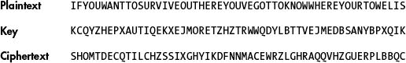
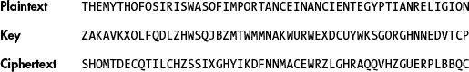
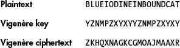
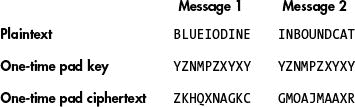

# 21 一次性密码本

> 原文：<https://inventwithpython.com/cracking/chapter21.html>

“我已经研究过一千次了，”沃特豪斯说，“我能想到的唯一解释是，他们正在将他们的信息转换成大的二进制数，然后将它们与其他大的二进制数组合在一起——很可能是一次性密码本。”“在这种情况下，你的项目是注定要失败的，”艾伦说，“因为你不能打破一次性垫。”
—尼尔·斯蒂芬森， Cryptonomicon


在这一章中，你将了解到一个不可能破解的密码，无论你的计算机有多强大，你花了多少时间试图破解它，或者你是一个多么聪明的黑客。它被称为*一次性密码本*，好消息是我们不必编写新的程序来使用它！你在第 18 章中编写的维吉尼亚密码程序无需任何修改就可以实现这种密码。但是一次性密码板很不方便经常使用，所以它经常被保留给最高机密的信息。

**本章涵盖的主题**

不可破解的一次性密码本

两次性密码本本是维吉尼亚密码

### 不可破解的一次性密码本

一次性密码本密码是一种维吉尼亚密码，当密钥满足以下条件时，它将变得无法破解:

1.  它正好与加密消息一样长。

2.  它是由真正随机的符号组成的。

3.  它只用于一次，不会再用于任何其他消息。

通过遵循这三条规则，你可以使你的加密信息免受任何密码分析者的攻击。即使有无限的计算能力，密码也无法破解。

一次性密码本的密钥被称为*密码本*,因为这些密钥曾经被印在纸上。在最上面的一张纸被使用后，它会被从便笺簿上撕下来，露出下一个要使用的钥匙。通常，会生成一个大型的一次性密码本密钥列表并亲自共享，这些密钥会标记特定的日期。例如，如果我们在 10 月 31 日收到来自合作者的消息，我们只需浏览一次性密码本列表，以找到当天的相应密钥。

#### 使密钥长度等于消息长度

为了理解为什么一次性密码是不可破解的，我们来考虑一下是什么使得常规的维吉尼亚密码容易受到攻击。回想一下，Vigenère 密码破解程序通过使用频率分析来工作。但是，如果密钥与消息的长度相同，则每个明文字母的子密钥是唯一的，这意味着每个明文字母可以以相等的概率被加密成任何密文字母。

例如，要加密信息，如果你想在这里生存，你必须知道你的毛巾在哪里，我们去掉空格和标点符号，得到一个有 55 个字母的信息。要使用一次性密码本加密此消息，我们需要一个 55 个字母长的密钥。使用示例密钥 kcqyzhepxautiqekxejmoretztzhtrwwqdylbttvejmedbsanybppxqik 对字符串进行加密，会得到密文 shomtdecqtilchzsixghyikdfnnmacewrzlghraqqvhzguerplbqc，如图 21-1 所示。



*图 21-1：使用一次性密码本加密一个示例消息*

现在想象一个密码分析者得到了密文（`SHOM TDEC...`）.他们怎么能攻击密码呢？强行通过按键是行不通的，因为即使对计算机来说，按键也太多了。密钥的数量将等于消息中字母总数的 26 次方。因此，如果在我们的示例中消息有 55 个字母，那么总共有`26 ** 55`，即 666091878431395624153823182526730590376250379528249805353030484209594192

即使密码分析员有一台足够强大的计算机来尝试所有的密钥，它仍然无法破解*一次性密码本*，因为对于任何密文，所有可能的明文消息都有相同的概率。

例如，密文 SHOMTDEC...可以很容易地从完全不同的明文中得到相同长度的字母数，例如奥西里斯的神话在古埃及宗教中很重要，使用密钥 zakavkxolfqdlzhwsqjbzmtwmmnakwuwerwexdcuywksgorghnnedvtcp 加密，如图 21-2 所示。



*图 21-2：使用不同的密钥对不同的示例消息进行加密，但产生与之前相同的密文*

我们能够破解任何加密的原因是，我们知道通常只有一个密钥可以将信息解密成合理的英语。但是我们在前面的例子中已经看到，相同的密文可能是由两个完全不同的明文消息组成的。当我们使用一次性密码本时，密码分析者没有办法判断哪个是原始消息。事实上，*任何长度正好为 55 个字母*的可读的英语明文消息都有可能是原始明文。某个密钥能把密文解密成可读的英文，不代表它就是原来的加密密钥。

因为任何英文明文都可以被用来以相同的可能性创建密文，所以不可能破解使用一次性密码本加密的消息。

#### 制作真正随机的钥匙

正如你在第九章中了解到的，Python 内置的`random`模块并不产生真正的随机数。它们是用一种算法计算出来的，这种算法产生的数字看起来只是随机的，这在大多数情况下已经足够好了。然而，为了使一次性密码本起作用，密码本必须从真正随机的来源产生；否则，它就失去了数学上完美的保密性。

Python 3.6 和更高版本有`secrets`模块，它使用操作系统的真正随机数源（通常从随机事件中收集，比如用户击键之间的时间）。函数`secrets.` `randbelow` `()`可以返回介于`0`和之间的真随机数，但不包括传递给它的参数，如下例所示:

```py
>>> import secrets
>>> secrets.randbelow(10)
2
>>> secrets.randbelow(10)
0
>>> secrets.randbelow(10)
6
```

`secrets`中的函数比`random`中的函数慢，所以在不需要真随机性时，优先选择`random`中的函数。您还可以使用`secrets.choice()`函数，该函数从传递给它的字符串或列表中随机选择一个值，如下例所示:

```py
>>> import secrets
>>> secrets.choice('ABCDEFGHIJKLMNOPQRSTUVWXYZ')
'R'
>>> secrets.choice(['cat', 'dog', 'mouse'])
'dog'
```

例如，要创建一个长度为 55 个字符的真正随机的一次性密码本，请使用以下代码:

```py
>>> import secrets
>>> otp = ''
>>> for i in range(55):
        otp += secrets.choice('ABCDEFGHIJKLMNOPQRSTUVWXYZ')

>>> otp
'MVOVAAYDPELIRNRUZNNQHDNSOUWWNWPJUPIUAIMKFKNHQANIIYCHHDC'
```

使用一次性密码本时，我们还必须记住一个细节。让我们检查一下为什么我们需要避免多次使用同一个一次性键盘键。

#### 避重就轻

*两次性密码本密码*是指使用同一个一次性密码本密钥对两个不同的消息进行加密。这造成了加密中的弱点。

如前所述，仅仅因为一个密钥将一次性密码本密文解密成可读的英文并不意味着它就是正确的密钥。然而，当你对两个不同的信息使用同一个密钥时，你就给了黑客重要的信息。如果您使用相同的密钥加密两条消息，而黑客找到了一个密钥，该密钥将第一条密文解密为可读的英语，但将第二条消息解密为随机垃圾文本，则黑客将知道他们找到的密钥一定不是原始密钥。事实上，很有可能只有一个密钥将两个消息都解密成英文，您将在下一节看到。

如果黑客只有两条消息中的一条，那条消息仍然是完全加密的。但是我们必须始终假设我们所有的加密信息都被黑客和政府截获了。否则，我们一开始就不会费心加密消息。记住香农的格言很重要:敌人了解系统！这包括你所有的密文。

#### 为什么两次性密码本是维吉尼亚密码

你已经学会了如何破解维吉尼亚密码。如果我们可以证明两次填充密码和维吉尼亚密码是一样的，我们就可以用破解维吉尼亚密码的相同技术来证明它是可破解的。

为了解释为什么两次性密码本就像维吉尼亚密码一样是可破解的，让我们回顾一下维吉尼亚密码在加密长度超过密钥的消息时是如何工作的。当我们用完了密钥中用于加密的字母时，我们返回到密钥的第一个字母并继续加密。例如，要用 10 个字母的密钥（如 YZNMPZXYXY）加密 20 个字母的消息（如蓝碘 INBOUND CAT）,前 10 个字母（蓝碘）用 YZNMPZXYXY 加密，然后接下来的 10 个字母（INBOUND CAT）也用 YZNMPZXYXY 加密。图 21-3 显示了这种环绕效果。



*图 21-3：维吉尼亚尔密码的环绕效应*

使用一次性密码本密码，假设 10 个字母的消息 BLUE 碘是使用一次性密码本密钥 YZNMPZXYXY 加密的。然后密码学家错误地用相同的一次性密钥 YZNMPZXYXY 加密了第二个 10 个字母的消息 INBOUND CAT，如图 21-4 所示。



*图 21-4：使用一次性密码本密钥加密明文产生的密文与维吉尼亚密码相同。*

当我们将图 21-3 (ZKHQXNAGKCGMOAJMAAXR）中所示的维吉尼亚密码的密文与图 21-4 (ZKHQXNAGKC GMOAJMAAXR）中所示的一次性密码的密文进行比较时，我们可以看到它们是完全相同的。这意味着，因为两次密码本密码与维吉尼亚密码具有相同的属性，所以我们可以使用相同的技术来破解它！

### 总结

简而言之，一次性密码本（one-time pad）是一种通过使用与消息长度相同、真正随机且仅使用一次的密钥来使维吉尼亚密码加密不受黑客攻击的方法。当这三个条件都满足时，一次性密码本就不可能破了。不过因为用起来太不方便了，所以没有用于日常加密。通常，一次性密码本会亲自分发，并包含一系列钥匙。但要确保这份名单不会落入坏人之手！

**练习题**

练习题的答案可以在本书的网站[`www.nostarch.com/crackingcodes`](https://www.nostarch.com/crackingcodes/)找到。

1.  为什么本章没有介绍一次性密码本计划？

2.  两次性密码本本相当于哪个密码？

3.  使用两倍于明文消息长度的密钥会使一次性密码本加倍安全吗？