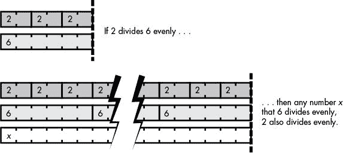
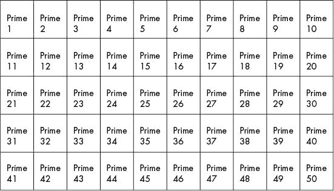
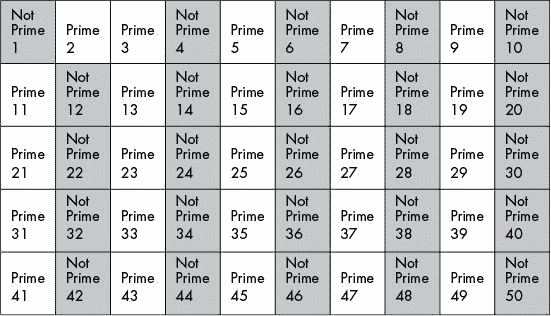
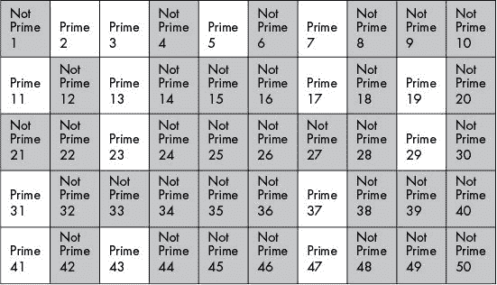

# 22 寻找和产生质数

> 原文：<https://inventwithpython.com/cracking/chapter22.html>

数学家们至今都试图在质数序列中发现某种顺序，但却徒劳无功。我们有理由相信，这是一个人类思维永远无法深入的谜
—莱昂哈德·欧拉，18 世纪数学家


到目前为止，这本书描述的所有密码都已经存在了数百年。当黑客不得不依赖纸笔时，这些密码工作得很好，但现在它们更容易受到攻击，因为计算机处理数据的速度比人快几万亿倍。这些经典密码的另一个问题是它们使用相同的密钥进行加密和解密。当您试图发送加密的消息时，使用一个密钥会导致问题:例如，如何安全地发送密钥来解密它？

在第 23 章中，你将了解公钥密码如何通过使用非常大的质数来创建两个密钥来改进旧密码:一个用于加密的公钥和一个用于解密的私钥。要为公钥密码的密钥生成质数，您需要了解使密码成为可能的质数的一些属性（以及分解大数的难度）。在这一章中，你将利用质数的这些特性来创建`primeNum.py`模块，它可以通过快速判断一个数是否是质数来生成密钥。

**本章涵盖的主题**

质数和合数

试验部门素性测试

厄拉多塞的筛子

拉宾-米勒素性检验

### 什么是质数？

一个*质数*是大于 1 的整数，只有两个因子:1 和它本身。回想一下，一个数的因数是那些可以乘以等于原始数的数。例如，数字 3 和 7 是 21 的因数。数字 12 有因数 2 和 6，也有因数 3 和 4。

每个数字都有 1 和它自身的因数，因为 1 乘以任何数字都等于那个数字。例如，1 和 21 是 21 的因数，数字 1 和 12 是 12 的因数。如果一个数没有其他因子，这个数就是质数。例如，2 是一个质数，因为它只有 1 和 2 两个因子。

这里有一个简短的质数列表（注意 1 不被认为是质数）:2，3，5，7，11，13，17，19，23，29，31，37，41，43，47，53，59，61，67，71，73，79，83，89，97，101，103，107，109，113，127，131，137，139

质数有无穷多个，也就是说不存在最大质数这种东西。它们继续变得越来越大，就像普通的数字一样。公钥密码使用大质数使密钥变得太大而无法暴力破解。

质数可能很难找到，而大质数，如用于公钥的质数，就更难找到了。为了生成大质数作为公钥，我们将找到一个随机的大数，然后通过使用*素性测试*来检查该数是否是质数。如果根据质数测试，这个数是质数，我们就用它；否则，我们将继续创造和测试大数，直到我们找到一个质数。

让我们看一些非常大的数字来说明公钥密码中使用的质数可以有多大。

A `googol`是 10 的 100 次方，写成 1 后面跟 100 个零:

100 亿亿亿亿亿亿亿亿亿亿亿亿亿亿亿亿亿亿亿亿亿亿亿亿亿亿亿亿亿

十亿十亿个古戈尔比一个古戈尔多 27 个零:

100 亿亿亿亿亿亿亿亿亿亿亿亿亿亿亿亿亿亿亿亿亿亿亿亿亿亿亿亿亿

但是与公钥密码使用的质数相比，这些都是很小的数字。例如，公钥程序中使用的典型质数有数百位，可能如下所示:

112，829，754，900，439，506，175，719，191，782，841，802，172，556，768

这个数字太大了，我打赌你甚至没有注意到里面的错别字。

了解质数的其他一些有趣的特征也是很有用的。因为所有的偶数都是 2 的倍数，所以 2 是唯一可能的偶数质数。同样，将两个质数相乘应该得到一个只有 1、它本身和被相乘的两个质数的因数的数。（例如，质数 3 和 7 相乘得到 21，其唯一的因子是 1、21、3 和 7。）

不是质数的整数被称为合数，因为它们至少由 1 和数字之外的两个因子组成。每个合数都有一个*质因数分解*，这是一个只由质数组成的因数分解。比如合数 1386 是由质数 2、3、7、11 组成的，因为 2 × 3 × 3 × 7 × 11 = 1386。每个合数的质因数分解对于该合数是唯一的。

我们将使用这些关于什么使一个数成为质数的信息来编写一个模块，这个模块可以确定一个小数是否是质数并生成质数。模块`primeNum.py`将定义以下功能:

isPrimeTrialDiv() 如果传递给它的数是质数，则使用试除法算法返回`True`，如果传递给它的数不是质数，则返回`False`。

primeSieve() 使用厄拉多塞算法的筛子来生成质数。

rabinMiller() 使用 Rabin-Miller 算法检查传递给它的数字是否是质数。与试除法算法不同，该算法可以快速处理非常大的数字。该函数不是直接调用，而是由`isPrime()`调用。

isPrime() 在用户必须判断一个大整数是否为质数时调用。

generateLargePrime() 返回一个数百位长的大质数。该函数将在第 23 章的`makePublicPrivateKeys.py`程序中使用。

### 质数模块的源代码

就像《T4》第 13 章中介绍的`cryptomath.py`一样，`primeNum.py`程序是作为一个模块被其他程序导入的，当它自己运行时不做任何事情。`primeNum.py`模块导入 Python 的`math`和`random`模块，以便在生成质数时使用。

选择**文件 -> 新文件**，打开新文件编辑器窗口。在文件编辑器中输入以下代码，然后保存为`primenu.py`。

`primeNum.py`

```py
# Prime Number Sieve
# https://www.nostarch.com/crackingcodes/ (BSD Licensed)

import math, random


def isPrimeTrialDiv(num):
    # Returns True if num is a prime number, otherwise False.

    # Uses the trial division algorithm for testing primality.

    # All numbers less than 2 are not prime:
    if num < 2:
        return False

    # See if num is divisible by any number up to the square root of num:
    for i in range(2, int(math.sqrt(num)) + 1):
        if num % i == 0:
            return False
    return True


def primeSieve(sieveSize):
    # Returns a list of prime numbers calculated using
    # the Sieve of Eratosthenes algorithm.

    sieve = [True] * sieveSize
    sieve[0] = False # Zero and one are not prime numbers.
    sieve[1] = False

    # Create the sieve:
    for i in range(2, int(math.sqrt(sieveSize)) + 1):
        pointer = i * 2
        while pointer < sieveSize:
            sieve[pointer] = False
            pointer += i

    # Compile the list of primes:
    primes = []
    for i in range(sieveSize):
        if sieve[i] == True:
            primes.append(i)

    return primes

def rabinMiller(num):
    # Returns True if num is a prime number.
    if num % 2 == 0 or num < 2:
        return False # Rabin-Miller doesn't work on even integers.
    if num == 3:
        return True
    s = num - 1
    t = 0
    while s % 2 == 0:
        # Keep halving s until it is odd (and use t
        # to count how many times we halve s):
        s = s // 2
        t += 1
    for trials in range(5): # Try to falsify num's primality 5 times.
        a = random.randrange(2, num - 1)
        v = pow(a, s, num)
        if v != 1: # This test does not apply if v is 1.
            i = 0
            while v != (num - 1):
                if i == t - 1:
                    return False
                else:
                    i = i + 1
                    v = (v ** 2) % num
    return True

# Most of the time we can quickly determine if num is not prime
# by dividing by the first few dozen prime numbers. This is quicker
# than rabinMiller() but does not detect all composites.
LOW_PRIMES = primeSieve(100)


def isPrime(num):
    # Return True if num is a prime number. This function does a quicker
    # prime number check before calling rabinMiller().
    if (num < 2):
        return False # 0, 1, and negative numbers are not prime.

    # See if any of the low prime numbers can divide num:

    for prime in LOW_PRIMES:

        if (num == prime):

            return True

        if (num % prime == 0):

            return False

    # If all else fails, call rabinMiller() to determine if num is prime:
    return rabinMiller(num)


def generateLargePrime(keysize=1024):
    # Return a random prime number that is keysize bits in size:
    while True:
        num = random.randrange(2**(keysize-1), 2**(keysize))
        if isPrime(num):
            return num
```

### 质数模块的样本运行

要查看`primeNum.py`模块的示例输出，请在交互式 shell 中输入以下内容:

```py
>>> import primeNum
>>> primeNum.generateLargePrime()
122881168342211041030523683515443239007484290600701555369488271748378054744009
463751312511471291011945732413378446666809140502037003673211052153493607681619
990563076859566835016382556518967124921538212397036345815983641146000671635019
637218348455544435908428400192565849620509600312468757953899553441648428119
>>> primeNum.isPrime(45943208739848451)
False
>>> primeNum.isPrime(13)
True
```

导入`primeNum.py`模块让我们可以使用`generateLargePrime()`函数生成一个非常大的质数。它还允许我们将任何数字，无论大小，传递给`isPrime()`函数来确定它是否是一个质数。

### 试除法算法如何工作

为了找出一个给定的数是否是质数，我们使用*试除法算法*。该算法继续将一个数除以整数（从 2、3 等开始），以查看是否有任何整数以 0 为余数将该数整除。例如，为了测试 49 是否是质数，我们可以尝试用 2 开始的整数来除它:

49 ÷ 2 = 24 余数 1

49 ÷ 3 = 16 余数 1

49 ÷ 4 = 12 余数 1

49 ÷ 5 = 9 余数 4

49 ÷ 6 = 8 余数 1

49 ÷ 7 = 7 余数 0

因为 7 除以 49 的余数为 0，所以我们知道 7 是 49 的因数。这意味着 49 不可能是质数，因为它至少有 1 和它本身之外的一个因子。

我们可以通过只除以质数而不是合数来加快这个过程。如前所述，合数无非是质数的*合成*。这意味着，如果 2 不能将 49 整除，那么一个合数，比如 6，它的因子包括 2，也不会能够将 49 整除。换句话说，*任何被 6 整除*的数也可以被 2 整除，因为 2 是 6 的因数。图 22-1 说明了这个概念。



*图 22-1：任何被 6 整除的数也被 2 整除。*

再举个例子，我们来测试一下 13 是不是质数:

13 ÷ 2 = 6 余数 1

13 ÷ 3 = 4 余数 1

我们只需要测试整数到（包括）我们测试的质数的平方根。一个数的*平方根*指的是与自身相乘得到那个原始数的数。比如 25 的平方根是 5，因为 5 × 5 = 25。因为一个数不能有两个大于其平方根的因子，所以我们可以将试除法算法测试限制在小于该数平方根的整数上。13 的平方根大约是 3.6，所以我们只需要除以 2 和 3 就可以确定 13 是质数。

作为另一个例子，数字 16 的平方根是 4。两个大于 4 的数相乘总会得到一个大于 16 的数，任何大于 4 的 16 的因子总会与小于 4 的因子配对，比如 8 × 2。因此，通过查找任何小于平方根的因子，您将找到所有大于平方根的因子。

要在 Python 中找到一个数的平方根，可以使用`math.sqrt()`函数。在交互式 shell 中输入以下内容，查看该函数如何工作的一些示例:

```py
>>> import math
>>> 5 * 5
25
>>> math.sqrt(25)
5.0
>>> math.sqrt(10)
3.1622776601683795
```

注意`math.sqrt()`总是返回一个浮点值。

### 实现试除法算法测试

`primeNum.py`中第 7 行的`isPrimeTrialDiv()`函数以一个数为参数`num`，用试除法算法测试，检查该数是否为质数。如果`num`是一个合数，函数返回`False`，如果`num`是一个质数，函数返回`True`。

```py
def isPrimeTrialDiv(num):
    # Returns True if num is a prime number, otherwise False.

    # Uses the trial division algorithm for testing primality.

    # All numbers less than 2 are not prime:
    if num < 2:
        return False
```

第 13 行检查`num`是否小于`2`，如果是，函数返回`False`，因为小于 2 的数不能是质数。

第 17 行开始了实现试除法算法的`for`循环。它还使用`math.sqrt()`得到`num`的平方根，并使用返回的浮点值来设置我们将测试的整数范围的上限。

```py
    # See if num is divisible by any number up to the square root of num:
    for i in range(2, int(math.sqrt(num)) + 1):
        if num % i == 0:
            return False
    return True
```

第 18 行使用 mod 操作符（`%`)检查余数是否为 0。如果余数为 0，`num`可被`i`整除，因此不是质数，循环返回`False`。如果第 17 行上的`for`循环没有返回`False`，则该函数返回第 20 行上的`True`以指示`num`可能是质数。

函数`isPrimeTrialDiv()`中的试除法算法很有用，但它不是测试素性的唯一方法。你也可以用厄拉多塞筛找到质数。

### 厄拉多塞的筛子

厄拉多塞的筛子（发音为“era-taws-thuh-knees”）是一种算法，可以找到一个数字范围内的所有质数。为了了解这个算法是如何工作的，想象一组盒子。每个盒子里装的是从 1 到 50 的整数，都标为质数，如图 22-2 所示。

为了实施厄拉多塞筛，我们从我们的范围中排除非质数，直到只剩下质数。因为 1 从来不是质数，所以让我们先把数字 1 标为“不是质数”那我们就把所有 2 的倍数（除了 2)都标为“不是质数。”这意味着我们将把整数 4 (2 × 2)、6 (2 × 3)、8 (2 × 4)、10、12 等等直到 50 标记为“非质数”，如图 22-3 所示。



*图 22-2：为数字 1 到 50 设置厄拉多塞筛*



*图 22-3：消除数字 1 和所有偶数*

然后，我们使用 3 的倍数重复这个过程:我们排除 3，并将 6、9、12、15、18、21 等标记为“非质数”我们对不包括 4 的 4 的倍数、不包括 5 的 5 的倍数等等重复这个过程，直到我们得到 8 的倍数。我们停在 8，因为它大于 7.071，7.071 是 50 的平方根。所有 9、10、11 等等的倍数都已经被标记出来了，因为任何一个比平方根大的因数都会和一个比平方根小的因数配对，我们已经标记过了。

完成的筛子应该看起来像图 22-4 ，质数显示在白色方框中。



*图 22-4：用厄拉多塞的筛子找到质数*

利用厄拉多塞的筛子，我们发现小于 50 的质数是 2，3，5，7，11，13，17，19，23，29，31，37，41，43，47。当您想要快速找到某个数字范围中的所有质数时，最好使用这种筛选算法。这比以前用试除法算法逐个检查每个数要快得多。

### 用厄拉多塞筛生成质数

`primeNum.py`模块第 23 行的`primeSieve()`函数使用厄拉多塞算法的筛子返回一个在`1`和`sieveSize`之间的所有质数的列表:

```py
def primeSieve(sieveSize):
    # Returns a list of prime numbers calculated using
    # the Sieve of Eratosthenes algorithm.

    sieve = [True] * sieveSize
    sieve[0] = False # Zero and one are not prime numbers.
    sieve[1] = False
```

第 27 行创建了表示`sieveSize`长度的布尔`True`值列表。因为`0`和`1`不是质数，所以`0`和`1`索引被标记为`False`。

第 32 行的`for`循环遍历从`2`到`sieveSize`的平方根的每个整数:

```py
    # Create the sieve:
    for i in range(2, int(math.sqrt(sieveSize)) + 1):
        pointer = i * 2
        while pointer < sieveSize:
            sieve[pointer] = False
            pointer += i
```

变量`pointer`从`i`后`i`的第一个倍数开始，也就是第 33 行的`i * 2`。然后`while`循环将`sieve`列表中的`pointer`索引设置为`False`，第 36 行将`pointer`改为指向`i`的下一个倍数。

在第 32 行的`for`循环结束后，`sieve`列表现在应该包含每个质数索引的`True`。我们创建一个新的列表，它在`primes`中以一个空列表开始，遍历整个`sieve`列表，当`sieve[i]`是`True`或`i`是质数时追加数字:

```py
    # Compile the list of primes:
    primes = []
    for i in range(sieveSize):
        if sieve[i] == True:
            primes.append(i)
```

第 44 行返回质数列表:

```py
    return primes
```

`primeSieve()`函数可以找到小范围内的所有质数，`isPrimeTrialDiv()`函数可以快速判断一个小数字是否是质数。但是一个几百位数的大整数呢？

如果我们将一个大整数传递给`isPrimeTrialDiv()`，需要几秒钟来判断它是否是质数。如果这个数有几百位数长，就像我们将在第 23 章中的公钥密码程序中使用的质数一样，要花一万多亿年才能算出这个数是否是质数。

在下一节中，您将学习如何使用 Rabin-Miller 素性测试来确定一个非常大的数是否是质数。

### 拉宾-米勒素性算法

Rabin-Miller 算法的主要优点是，它是一个相对简单的素性测试，在普通计算机上运行只需几秒钟。尽管该算法的 Python 代码只有几行，但对其工作原理的数学证明的解释对于本书来说太长了。Rabin-Miller 算法不是素性的可靠测试。相反，它找到很可能是质数但不保证是质数的数字。但是假阳性的几率很小，这种方法对于本书来说已经足够好了。要了解更多关于拉宾-米勒算法的工作原理，你可以在`en.wikipedia.org/wiki/Miller%E2%80%93Rabin_primality_test`阅读。

 *`rabinMiller()`函数实现这个算法来寻找质数:

```py
def rabinMiller(num):
    # Returns True if num is a prime number.
    if num % 2 == 0 or num < 2:
        return False # Rabin-Miller doesn't work on even integers.
    if num == 3:
        return True
    s = num - 1
    t = 0
    while s % 2 == 0:
        # Keep halving s until it is odd (and use t
        # to count how many times we halve s):
        s = s // 2
        t += 1
    for trials in range(5): # Try to falsify num's primality 5 times.
        a = random.randrange(2, num - 1)
        v = pow(a, s, num)
        if v != 1: # This test does not apply if v is 1.
            i = 0
            while v != (num - 1):
                if i == t - 1:
                    return False
                else:
                    i = i + 1
                    v = (v ** 2) % num
    return True
```

不要担心这段代码是如何工作的。要记住的重要概念是，如果`rabinMiller()`函数返回`True`，那么`num`参数很可能是质数。如果`rabinMiller()`返回`False`，`num`肯定是复合的。

### 寻找大质数

我们将创建另一个名为`isPrime()`的函数来调用`rabinMiller()`。拉宾-米勒算法并不总是检验一个数是否是质数的最有效的方法；因此，在`isPrime()`函数的开始，我们将做一些简单的检查，作为判断存储在参数`num`中的数字是否是质数的捷径。让我们在常量变量`LOW_PRIMES`中存储一个所有小于 100 的质数的列表。我们可以用`primeSieve` `()`函数来计算这个列表:

```py
    # Most of the time we can quickly determine if num is not prime
    # by dividing by the first few dozen prime numbers. This is quicker
    # than rabinMiller() but does not detect all composites.
    LOW_PRIMES = primeSieve(100)
```

我们将像在`isPrimeTrialDiv()`中一样使用这个列表，并忽略任何小于 2 的数字（第 81 行和第 82 行）:

```py
def isPrime(num):
    # Return True if num is a prime number. This function does a quicker
    # prime number check before calling rabinMiller().
    if (num < 2):
        return False # 0, 1, and negative numbers are not prime.
```

当`num`不小于`2`时，我们也可以使用`LOW_PRIMES`列表作为测试`num`的快捷方式。检查`num`是否能被所有小于 100 的质数整除不会明确地告诉我们这个数是否是质数，但它可能帮助我们找到合数。通过除以小于 100 的质数，大约 90%传递给`isPrime()`的大整数可以被检测为复合整数。原因是，如果一个数能被一个质数，比如 3，整除，就不用检查这个数是否能被合数 6，9，12，15，或者其他任何 3 的倍数整除。用较小的质数除这个数比对这个数执行较慢的 Rabin-Miller 算法要快得多，所以这个快捷方式有助于程序在调用`isPrime()`的 90%的时间里执行得更快。

第 85 行循环遍历`LOW_PRIMES`列表中的每个质数:

```py
    # See if any of the low prime numbers can divide num:
    for prime in LOW_PRIMES:
        if (num == prime):
            return True87.         if (num % prime == 0):
            return False
```

如果`num`中的整数与`prime`相同，那么显然`num`必须 是质数，第 86 行返回`True`。`num`中的整数由每个质数使用第 87 行上的 mod 操作符进行调制，如果结果评估为`0`，我们知道`prime`除以`num`所以`num`不是质数。在这种情况下，第 88 行返回`False`。

这是我们将执行的三个快速测试，以确定一个数是否是质数。如果执行继续超过第 87 行，`rabinMiller()`函数检查`num`的素性。

第 90 行调用`rabinMiller()`函数判断数字是否为质数；然后，`rabinMiller()`函数获取它的返回值，并从`isPrime()`函数返回:

```py
    # If all else fails, call rabinMiller() to determine if num is prime:
    return rabinMiller(num)
```

现在你知道如何确定一个数是否是质数，我们将使用这些质数测试来生成质数。这些将由第 23 章中的公钥程序使用。

### 生成大质数

使用无限循环，第 93 行的`generateLargePrime()`函数返回一个质数整数。它通过生成一个大随机数，将其存储在`num`中，然后将`num`传递给`isPrime()`来实现这一点。然后，`isPrime()`函数测试`num`是否是质数。

```py
def generateLargePrime(keysize=1024):
    # Return a random prime number that is keysize bits in size:
    while True:
        num = random.randrange(2**(keysize-1), 2**(keysize))
        if isPrime(num):
            return num
```

如果`num`是质数，第 98 行返回`num`。否则，无限循环返回到第 96 行以尝试新的随机数。这个循环继续下去，直到找到一个被`isPrime()`函数确定为质数的数字。

`generateLargePrime()`函数的`keysize`参数的默认值为`1024`。`keysize`越大，可能的密钥就越多，密码就越难被暴力破解。公钥的大小通常是以称为*位*的数字来计算的，你将在第 23 章和第 24 章中了解更多。就目前而言，只需要知道 1024 位的数字非常大:大约 300 位数！

### 摘要

质数在数学中有迷人的性质。正如你将在第 23 章中了解到的，它们也是专业加密软件中使用的密码的支柱。质数的定义很简单:它是一个只有 1 和它自己作为因子的数。但是确定哪些数字是质数需要一些聪明的代码。

在这一章中，我们编写了`isPrimeTrialDiv()`函数来判断一个数是否是质数，方法是用 2 和这个数的平方根之间的所有数来修改一个数。这是试除法算法。当一个质数由除了它的因子 1 和它本身之外的任何数构成时，它的余数不应该是 0。所以我们知道余数为 0 的数不是质数。

你知道了厄拉多塞的筛子可以快速找到一个数字范围内的所有质数，尽管它在寻找大质数时使用了太多的内存。

因为厄拉多塞的筛子和`primeNum.py`中的试除法算法不足以快速找到大质数，所以我们需要另一种公钥密码算法，它使用数百位长的超大质数。作为一种变通方法，您学会了使用 Rabin-Miller 算法，该算法使用复杂的数学推理来确定一个非常大的数是否是质数。

在第 23 章中，你将使用`primeNum.py`模块编写公钥密码程序。最后，您将创建一个比一次性密码更容易使用的密码，但不会被本书中介绍的简单黑客技术破解！

**练习题**

练习题的答案可以在本书的网站[`www.nostarch.com/crackingcodes`](https://www.nostarch.com/crackingcodes/)找到。

1.  有多少质数？

2.  什么叫非质数的整数？

3.  求质数的两种算法是什么？*