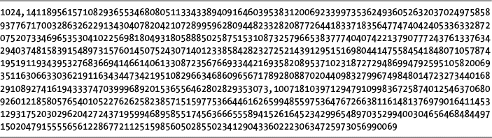

# 23 生成公钥密码的密钥

> 原文：<https://inventwithpython.com/cracking/chapter23.html>

使用故意妥协的加密技术，它有一个后门，只有“好人”才有钥匙，你实际上没有安全保障。你还不如用预先破解的、被破坏的加密方法来加密它。”
—科利·多克托罗，科幻小说作者，2015


到目前为止，你在本书中学到的所有密码都有一个共同的特点:加密密钥与解密密钥相同。这就引出了一个棘手的问题:如何与一个你从未交谈过的人分享加密信息？任何窃听者都可以截取你发送的加密密钥，就像他们截取加密信息一样容易。

在本章中，您将学习公钥加密，它允许陌生人使用公钥和私钥共享加密的消息。您将了解公钥密码，在本书中，它是基于 RSA 密码的。因为 RSA 密码很复杂，涉及多个步骤，所以您将编写两个程序。在本章中，您将编写公钥生成程序来生成您的公钥和私钥。然后，在第 24 章的 中，您将编写第二个程序，使用公钥密码并应用这里生成的密钥来加密和解密消息。在我们深入研究这个程序之前，让我们先来探索一下公钥加密是如何工作的。

**本章涵盖的主题**

公钥加密

认证

数字签名

MITM 袭击

生成公钥和私钥

混合密码系统

### 公钥加密

想象一下，在世界的另一端有人想和你交流。你们都知道间谍机构在监控所有的电子邮件、信件、短信和电话。要向此人发送加密邮件，双方必须就使用的密钥达成一致。但是，如果你们中的一个人用电子邮件把密钥发给另一个人，间谍机构就会截获这个密钥，然后解密任何用这个密钥加密的信息。私下见面交换密钥是不可能的。你可以试着加密密钥，但这需要将该消息的秘密密钥发送给其他人，这也会被拦截。

*公钥加密*通过使用两个密钥来解决这个加密问题，一个用于加密，一个用于解密，是*非对称密码*的一个例子。像本书之前的许多密码一样，使用相同密钥进行加密和解密的密码是*对称密码*。

重要的是要知道*使用加密密钥（公钥）加密的消息只能使用解密密钥（私钥）解密*。因此，即使有人获得了加密密钥，他们也无法读取原始消息，因为加密密钥无法解密消息。

加密密钥被称为*公钥*，因为它可以与全世界共享。相比之下，*私钥*，或解密密钥，必须保密。

例如，如果 Alice 想给 Bob 发送一条消息，Alice 找到 Bob 的公钥，或者 Bob 可以把它给她。然后，Alice 使用 Bob 的公钥加密她给 Bob 的消息。因为公钥不能解密消息，所以其他每个人都可以访问 Bob 的公钥并不重要。

当 Bob 收到 Alice 的加密消息时，他使用自己的私钥对其进行解密。只有 Bob 有私钥，可以解密用他的公钥加密的消息。如果 Bob 想要回复 Alice，他会找到她的公钥并用它来加密他的回复。因为只有爱丽丝知道她的私钥，所以爱丽丝是唯一能够解密来自鲍勃的加密响应的人。即使爱丽丝和鲍勃在世界的两端，他们也可以交换信息而不用担心被拦截。

我们将在本章中实现的特定公钥密码是基于 RSA 密码的，RSA 密码发明于 1977 年，并以其发明者的姓氏首字母命名:罗恩·里维斯特、阿迪·萨莫尔和伦纳德·阿德曼。

RSA 密码在其算法中使用数百位长的大质数。这就是我们在第 22 章中讨论质数数学的原因。公钥算法创建两个随机的质数，然后使用复杂的数学（包括寻找一个模逆，你在第 13 章中学会了如何做）来创建公钥和私钥。

**使用教科书 RSA 的危险**

尽管我们在本书中没有编写一个程序来破解公钥密码程序，但是请记住，你将在第 24 章中编写的`publicKeyCipher.py`程序*不是*安全的。获得正确的加密是非常困难的，并且需要大量的经验才能知道一个密码（以及实现它的程序）是否真正安全。

本章中基于 RSA 的程序被称为*教科书 RSA* ，因为即使它在技术上使用大质数正确地实现了 RSA 算法，它也容易受到黑客攻击。例如，使用伪随机而不是真正的随机数生成函数会使密码变得脆弱，正如你在第 22 章中了解到的，拉宾-米勒素性测试不能保证总是正确的。

因此，尽管你可能无法破解由`publicKeyCipher.py`创建的密文，但其他人可能可以。套用高度成功的密码学家 Bruce Schneier 的话，任何人都可以创建自己无法破解的密码算法。具有挑战性的是创建一个其他人无法破解的算法，即使经过多年的分析。本书中的程序只是一个有趣的例子，旨在教你 RSA 密码的基础知识。但是一定要使用专业的加密软件来保护你的文件。你可以在`www.nostarch.com/crackingcodes`找到一份（通常是免费的）加密软件清单。

### 认证的问题

尽管公钥密码听起来很巧妙，但还是有一个小问题。比如，想象你收到了这封邮件:“你好。我是爱麦虞埃尔·果尔德施坦因，反抗军的领袖。我想和你秘密地交流一些重要的事情。附上我的公钥。”

使用此公钥，您可以确保您发送的消息不会被除公钥发送者之外的任何人阅读。但是你怎么知道发信人实际上是爱麦虞埃尔·果尔德施坦因呢？你不知道你是在向爱麦虞埃尔·果尔德施坦因发送加密信息，还是在向一个伪装成爱麦虞埃尔·果尔德施坦因的间谍机构发送信息，来引诱你进入陷阱！

尽管公钥密码，事实上，本书中的所有密码都可以提供*保密性*（对消息保密），但它们并不总是提供*认证*（证明你与之通信的人就是他们所说的那个人）。

通常，这对于对称密码来说不是问题，因为当你和一个人交换密钥时，你可以看到那个人是谁。然而，当您使用公钥加密时，您不需要见到某人就可以获得他们的公钥并开始向他们发送加密的消息。当您使用公钥加密时，要记住身份验证是至关重要的。

一个名为*公钥基础设施（PKI)* 的完整字段管理认证，因此您可以将公钥与具有某种安全级别的人进行匹配；然而，这个话题超出了本书的范围。

#### 数字签名

*数字签名*允许您使用加密技术对文档进行电子签名。为了理解为什么数字签名是必要的，让我们看看下面的例子，Alice 给 Bob 的电子邮件:

亲爱的鲍勃:

我答应用一百万美元买下你的旧笔记本电脑。

真诚地

爱丽丝

这对鲍勃来说是个好消息，因为他想不惜任何代价处理掉他那毫无价值的笔记本电脑。但是，如果爱丽丝后来声称她没有做出这个承诺，鲍勃收到的电子邮件是假的，她没有发送。毕竟，Bob 可以轻松创建这封电子邮件。

如果他们见面，爱丽丝和鲍勃可以简单地签署一份同意出售的合同。手写签名不那么容易伪造，并且提供了一些证据证明爱丽丝确实做出了这个承诺。但是，即使爱丽丝签署了这样的合同，用她的数码相机拍了照片，并把图像文件发送给鲍勃，仍然可以想象图像可能被修改过。

RSA 密码（像其他公钥密码一样）不仅加密消息，还允许我们对文件或字符串进行数字签名。例如，Alice 可以使用她的私钥加密消息，生成只有 Alice 的公钥才能解密的密文。该密文成为文件的数字签名。它实际上并不是一个秘密，因为世界上的每个人都可以使用 Alice 的公钥来解密它。*但是通过用她的私钥加密信息，爱丽丝可以用一种无法伪造的方式对信息进行数字签名。* 因为只有爱丽丝能接触到她的私钥，只有爱丽丝才有可能产生这个密文，她不能说是鲍勃伪造或者篡改的！

保证已经创作了一条消息的人不能在以后否认该消息的创作被称为*不可否认性*。

人们在许多重要活动中使用数字签名，包括加密货币、公钥认证和匿名网上冲浪。要了解更多信息，请前往[`www.nostarch.com/crackingcodes`](https://www.nostarch.com/crackingcodes/)。请继续阅读，了解为什么身份验证与安全加密一样重要。

#### 当心 MITM 的攻击

比有人入侵我们的加密信息更阴险的是*中间人*或*中间人（MITM)攻击*。在这种类型的攻击中，有人截获了你的消息，并在你不知情的情况下传递出去。例如，假设爱麦虞埃尔·果尔德施坦因真的想和你通信，并用他的公钥给你发送了一条未加密的消息，但是间谍机构的路由器截获了这条消息。代理机构可以用自己的公钥替换电子邮件附带的公钥 Emmanuel，然后将消息发送给您。你不可能知道你收到的钥匙是艾曼纽的还是间谍机构的！

然后当你加密给 Emmanuel 的回复时，你实际上是用间谍机构的公钥加密，而不是 Emmanuel 的公钥。间谍机构将能够截获该消息，解密并阅读它，然后在把你的消息发送给 Emmanuel 之前，用 Emmanuel 的实际公钥重新加密它。该机构可以对 Emmanuel 发送给您的任何回复进行同样的处理。图 23-1 显示了 MITM 攻击是如何运作的。


*图 23-1：一次 MITM 攻击*

对你和艾曼纽来说，看起来你们在秘密地交流。但是间谍机构正在阅读你所有的信息，因为你和伊曼纽尔正在用间谍机构生成的公钥加密你的信息！同样，这个问题的存在是因为公钥密码只提供机密性，而不提供身份验证。对认证和公钥基础设施的深入讨论超出了本书的范围。但是现在您已经知道了公钥加密如何提供保密性，让我们来看看如何为公钥加密生成密钥。

### 生成公钥和私钥的步骤

公钥方案中的每个密钥都由两个数字组成。公钥将是两个数字`n`和`e`。私钥将是两个数字`n`和`d`。

创建这些号码的三个步骤如下:

1.  创建两个随机的、不同的、非常大的质数: `p`和`q`。将这两个数字相乘得到一个名为`n`的数字。

2.  创建一个随机数，叫做`e`，它与（`p`–1)×(`q`–1)互质。

3.  计算`e`的模逆，我们称之为`d`。

注意两个键中都使用了`n`。T2 号必须保密，因为它可以解密信息。现在您已经准备好编写一个生成这些密钥的程序了。

### 公钥生成程序的源代码

选择**文件 -> 新文件**，打开新文件编辑器窗口。确保`primeNum.py`和`cryptomath.py`模块与程序文件在同一个文件夹中。在文件编辑器中输入以下代码，保存为`makepublicprivatekeys.py`。

*makePublic
私钥. py*

```py
# Public Key Generator
# https://www.nostarch.com/crackingcodes/ (BSD Licensed)

import random, sys, os, primeNum, cryptomath


def main():
    # Create a public/private keypair with 1024-bit keys:
    print('Making key files...')
    makeKeyFiles('al_sweigart', 1024)
    print('Key files made.')

def generateKey(keySize):
    # Creates public/private keys keySize bits in size.
    p = 0
    q = 0
    # Step 1: Create two prime numbers, p and q. Calculate n = p * q:
    print('Generating p prime...')
    while p == q:
        p = primeNum.generateLargePrime(keySize)
        q = primeNum.generateLargePrime(keySize)
    n = p * q

    # Step 2: Create a number e that is relatively prime to (p-1)*(q-1):
    print('Generating e that is relatively prime to (p-1)*(q-1)...')
    while True:
        # Keep trying random numbers for e until one is valid:
        e = random.randrange(2 ** (keySize - 1), 2 ** (keySize))
        if cryptomath.gcd(e, (p - 1) * (q - 1)) == 1:
            break

    # Step 3: Calculate d, the mod inverse of e:
    print('Calculating d that is mod inverse of e...')
    d = cryptomath.findModInverse(e, (p - 1) * (q - 1))

    publicKey = (n, e)
    privateKey = (n, d)

    print('Public key:', publicKey)
    print('Private key:', privateKey)

    return (publicKey, privateKey)


def makeKeyFiles(name, keySize):
    # Creates two files 'x_pubkey.txt' and 'x_privkey.txt' (where x
    # is the value in name) with the n,e and d,e integers written in
    # them, delimited by a comma.

    # Our safety check will prevent us from overwriting our old key files:
    if os.path.exists('%s_pubkey.txt' % (name)) or
          os.path.exists('%s_privkey.txt' % (name)):
        sys.exit('WARNING: The file %s_pubkey.txt or %s_privkey.txt
              already exists! Use a different name or delete these files and
              rerun this program.' % (name, name))

    publicKey, privateKey = generateKey(keySize)

    print()
    print('The public key is a %s and a %s digit number.' %
          (len(str(publicKey[0])), len(str(publicKey[1]))))
    print('Writing public key to file %s_pubkey.txt...' % (name))
    fo = open('%s_pubkey.txt' % (name), 'w')
    fo.write('%s,%s,%s' % (keySize, publicKey[0], publicKey[1]))
    fo.close()

    print()
    print('The private key is a %s and a %s digit number.' %
          (len(str(publicKey[0])), len(str(publicKey[1]))))
    print('Writing private key to file %s_privkey.txt...' % (name))
    fo = open('%s_privkey.txt' % (name), 'w')
    fo.write('%s,%s,%s' % (keySize, privateKey[0], privateKey[1]))
    fo.close()


# If makePublicPrivateKeys.py is run (instead of imported as a module),
# call the main() function:
if __name__ == '__main__':
    main()
```

### 公钥生成程序的运行示例

当我们运行`makePublicPrivateKeys.py`程序时，输出应该类似如下（当然，您的密钥的数字看起来会不同，因为它们是随机生成的）:

```py
Making key files...
Generating p prime...
Generating q prime...
Generating e that is relatively prime to (p-1)*(q-1)...
Calculating d that is mod inverse of e...
Public key: (210902406316700502401968491406579417405090396754616926135810621
2161161913380865678407459875355468897928072386270510720443827324671435893274
8583937496850624116776147241821152026946322876869404394483922202407821672864
2424789208131826990008473526711744296548563866768454251404951960805224682425
498975230488955908086491852116348777849536270685085446970952915640050522212
204221803744494065881010331486468305317449607027884787770315729959789994713
265311327663776167710077018340036668306612665759417207845823479903440572724
068125211002329298338718615859542093721097258263595617482450199200740185492
04468791300114315056117093, 17460230769175161021731845459236833553832403910869
129054954200373678580935247606622265764388235752176654737805849023006544732896
308685513669509917451195822611398098951306676600958889189564599581456460070270
393693277683404354811575681605990659145317074127084557233537504102479937142530
0216777273298110097435989)
Private key: (21090240631670050240196849140657941740509039675461692613581062
1216116191338086567840745987535546889792807238627051072044382732467143589327
4858393749685062411677614724182115202694632287686940439448392220240782167286
4242478920813182699000847352671174429654856386676845425140495196080522468242
5498975230488955908086491852116348777849536270685085446970952915640050522212
204221803744494065881010331486468305317449607027884787770315729959789994713
265311327663776167710077018340036668306612665759417207845823479903440572724
068125211002329298338718615859542093721097258263595617482450199200740185492
04468791300114315056117093, 47676735798137710412166884916983765043173120289416
904341295971552286870991874666099933371008075948549008551224760695942666962465
968168995404993934508399014283053710676760835948902312888639938402686187075052
360773062364162664276144965652558545331166681735980981384493349313058750259417
68372702963348445191139635826000818122373486213256488077192893119257248107794
25681884603640028673273135292831170178614206817165802812291528319562200625082
55726168047084560706359601833919317974375031636011432177696164717000025430368
26990539739057474642785416933878499897014777481407371328053001838085314443545
845219087249544663398589)
The public key is a 617 and a 309 digit number.
Writing public key to file al_sweigart_pubkey.txt...
The private key is a 617 and a 309 digit number.
Writing private key to file al_sweigart_privkey.txt...
```

因为这两个密钥非常大，所以它们都被写入各自的文件中，`al_sweigart_pubkey.txt`和`al_sweigart_privkey.txt`。我们将在第 24 章的公钥密码程序中使用这两个文件来加密和解密消息。这些文件名来自字符串`'al_sweigart'`，它被传递给程序第 10 行的`makeKeyFiles()`函数。您可以通过传递不同的字符串来指定不同的文件名。

如果我们再次运行`makePublicPrivateKeys.py`并将相同的字符串传递给`makeKeyFiles()`，程序的输出应该是这样的:

```py
Making key files...
WARNING: The file al_sweigart_pubkey.txt or al_sweigart_privkey.txt already
exists! Use a different name or delete these files and rerun this program.
```

提供此警告是为了防止我们意外地覆盖我们的密钥文件，这将使任何用它们加密的文件无法恢复。一定要保管好这些关键文件！

### 创建 main()函数

当我们运行`makePublicPrivateKeys.py`时，`main()`函数被调用，它使用`makeKeyFiles()`函数创建公钥和私钥文件，我们将很快定义这个函数。

```py
def main():
    # Create a public/private keypair with 1024-bit keys:
    print('Making key files...')
    makeKeyFiles('al_sweigart', 1024)
    print('Key files made.')
```

因为计算机可能需要一段时间来生成密钥，所以我们在调用`makeKeyFiles()`之前在第 9 行打印一条消息，让用户知道程序正在做什么。

第 10 行的`makeKeyFiles()`调用传递字符串`'al_sweigart'`和整数`1024`，生成 1024 位的密钥并存储在文件`al_sweigart_pubkey.txt`和`al_sweigart_privkey.txt`中。密钥越大，可能的密钥就越多，密码的安全性就越强。但是，大密钥意味着加密或解密消息需要更长的时间。对于本书的例子，我选择 1024 位的大小作为速度和安全性之间的平衡；但实际上，2048 位甚至 3072 位的密钥大小对于安全公钥加密是必要的。

### 使用 generateKey()函数生成密钥

创建密钥的第一步是产生两个随机质数`p`和`q`。这些数字必须是两个大而不同的质数。

```py
def generateKey(keySize):
    # Creates public/private keys keySize bits in size.
    p = 0
    q = 0
    # Step 1: Create two prime numbers, p and q. Calculate n = p * q:
    print('Generating p prime...')
    while p == q:
        p = primeNum.generateLargePrime(keySize)
        q = primeNum.generateLargePrime(keySize)
    n = p * q
```

你在第 22 章的`primeNum.py`程序中写的`generateLargePrime()`函数在第 20 行和第 21 行返回两个质数作为整数值，我们将它们存储在变量`p`和`q`中。这是在一个`while`循环中完成的，只要`p`和`q`相同，该循环就会继续。如果`generateLargePrime` `()`为`p`和`q`返回相同的整数，程序将再次尝试为`p`和`q`寻找唯一的质数。`keySize`中的值决定了`p`和`q`的大小。在第 22 行，我们将`p`和`q`相乘，并将乘积存储在`n`中。

接下来，在步骤 2 中，我们计算公钥的另一部分: `e`。

#### 计算一个 e 值

通过找到一个与（`p`–1)×(`q`–1)互质的数来计算`e`的值。我们不会详细讨论为什么以这种方式计算`e`，但是我们希望`e`与（`p`–1)×(`q`–1)互质，因为这确保了`e`将总是产生唯一的密文。

使用一个无限的`while`循环，第 26 行计算一个数`e`，它与`p – 1`和`q – 1`的乘积互质。

```py
    # Step 2: Create a number e that is relatively prime to (p-1)*(q-1):
    print('Generating e that is relatively prime to (p-1)*(q-1)...')
    while True:
        # Keep trying random numbers for e until one is valid:
        e = random.randrange(2 ** (keySize - 1), 2 ** (keySize))
        if cryptomath.gcd(e, (p - 1) * (q - 1)) == 1:
            break
```

第 28 行上的`random.randrange()`调用返回一个随机整数，并将其存储在`e`变量中。然后第 29 行使用`cryptomath`模块的`gcd()`函数测试`e`是否与`(p - 1) * (q - 1)`互质。如果`e`是互质的，那么第 30 行的`break`语句就跳出了无限循环。否则，程序执行跳回到第 26 行，继续尝试不同的随机数，直到找到一个与`(p - 1) * (q - 1)`互质的随机数。

接下来，我们计算私钥。

#### 计算一个 d 值

第三步，找到用于解密的另一半私钥，也就是`d`。`d`只是`e`的模逆，我们已经在`cryptomath`模块中有了`findModInverse()`函数，我们在第 13 章中使用它来计算。

第 34 行调用`findModInverse()`并将结果存储在变量`d`中。

```py
    # Step 3: Calculate d, the mod inverse of e:
    print('Calculating d that is mod inverse of e...')
    d = cryptomath.findModInverse(e, (p - 1) * (q - 1))
```

我们现在已经定义了生成公钥和私钥所需的所有数字。

#### 归还钥匙

回想一下，在公钥密码中，公钥和私钥各由两个数字组成。存储在`n`和`e`中的整数代表公钥，存储在`n`和`d`中的整数代表私钥。第 36 行和第 37 行将这些整数对作为元组值存储在`publicKey`和`privateKey`中。

```py
    publicKey = (n, e)
    privateKey = (n, d)
```

在第 39 行和第 40 行使用`print()`调用，`generateKey()`函数中的其余行在屏幕上打印出按键。

```py
    print('Public key:', publicKey)
    print('Private key:', privateKey)

    return (publicKey, privateKey)
```

然后当调用`generateKey()`时，第 42 行返回一个包含`publicKey`和`privateKey`的元组。

在我们生成了公钥和私钥之后，我们还希望将它们存储在文件中，以便我们的公钥密码程序可以在以后使用它们来加密和解密。此外，将密钥存储在文件中非常有用，因为组成每个密钥的两个整数长达数百位，这使得它们难以记忆或方便地写下来。

### 使用 makeKeyFiles()函数创建密钥文件

`makeKeyFiles()`函数通过将文件名和密钥大小作为参数将密钥存储在文件中。

```py
def makeKeyFiles(name, keySize):
    # Creates two files 'x_pubkey.txt' and 'x_privkey.txt' (where x
    # is the value in name) with the n,e and d,e integers written in
    # them, delimited by a comma.
```

该函数创建格式为`<name>_pubkey.txt`和`<name>_privkey.txt`的两个文件，分别存储公钥和私钥。传递给函数的`name`参数决定了文件的`<name>`部分。

为了防止再次运行程序时意外删除密钥文件，第 51 行检查具有给定名称的公钥或私钥文件是否已经存在。如果是这样，程序会退出并显示一条警告消息。

```py
    # Our safety check will prevent us from overwriting our old key files:
    if os.path.exists('%s_pubkey.txt' % (name)) or
          os.path.exists('%s_privkey.txt' % (name)):
      sys.exit('WARNING: The file %s_pubkey.txt or %s_privkey.txt
            already exists! Use a different name or delete these files and
            rerun this program.' % (name, name))
```

在这个检查之后，第 54 行调用`generateKey()`并通过`keySize`来创建指定大小的公钥和私钥。

```py
    publicKey, privateKey = generateKey(keySize)
```

`generateKey()`函数返回一个由两个元组组成的元组，它使用多重赋值将其赋给`publicKey`和`privateKey`变量。第一个元组有两个整数用于公钥，第二个元组有两个整数用于私钥。

现在我们已经完成了创建密钥文件的设置，我们可以创建实际的密钥文件了。我们将把组成每个密钥的两个数字存储在文本文件中。

第 56 行打印一个空行，然后第 57 行为用户打印关于公钥的信息。

```py
    print()
    print('The public key is a %s and a %s digit number.' %
          (len(str(publicKey[0])), len(str(publicKey[1]))))
    print('Writing public key to file %s_pubkey.txt...' % (name))
```

第 57 行通过使用`str()`函数将这些值转换成字符串，然后使用`len()`函数找到字符串的长度，来指示在`publicKey[0]`和`publicKey[1]`的整数中有多少位数。然后，第 58 行报告公钥正被写入文件。

密钥文件的内容包括密钥大小、一个逗号、`n`整数、另一个逗号和`e`（或`d`)整数。例如，文件的内容应该是这样的:密钥大小整数`,` n 整数`,` e 或 d 整数，如下面的`al_sweigart_pubkey.txt`文件所示:



第 59 行到第 61 行以写模式打开`<name>_pubkey.txt`文件，将密钥写入文件，然后关闭它。

```py
    fo = open('%s_pubkey.txt' % (name), 'w')
    fo.write('%s,%s,%s' % (keySize, publicKey[0], publicKey[1]))
    fo.close()
```

第 63 到 68 行做的和第 56 到 61 行一样，除了它们把私钥写到`<name>_privatekey.txt`文件中。

```py
    print()
    print('The private key is a %s and a %s digit number.' %
          (len(str(publicKey[0])), len(str(publicKey[1]))))
    print('Writing private key to file %s_privkey.txt...' % (name))
    fo = open('%s_privkey.txt' % (name), 'w')
    fo.write('%s,%s,%s' % (keySize, privateKey[0], privateKey[1]))
    fo.close()
```

确保没有人侵入你的电脑并复制这些关键文件。如果他们获得了你的私人密钥文件，他们就能解密你所有的信息！

### 调用 main()函数

在程序结束时，如果`makePublicPrivateKeys.py`作为一个程序运行，而不是作为一个模块被另一个程序导入，第 73 和 74 行调用`main()`函数。

```py
# If makePublicPrivateKeys.py is run (instead of imported as a module),
# call the main() function:
if __name__ == '__main__':
    main()
```

现在你有了一个可以生成公钥和私钥的程序。虽然公钥密码在无法安全交换密钥的两个人之间开始通信时很有用，但由于公钥加密的缺点，它通常不用于所有加密通信。通常，公钥密码被用在混合密码系统中。

### 混合密码系统

RSA 和公钥加密需要大量的计算时间。对于每秒钟需要与其他计算机进行成千上万次加密连接的服务器来说尤其如此。作为一种变通方法，人们可以使用公钥加密来加密和分发密钥，以获得更快的对称密钥密码，这是解密和加密密钥相同的任何类型的密码。在使用公钥加密的消息将对称密码的密钥安全地发送给接收方之后，发送方可以将对称密码用于将来的消息。使用对称密钥密码和非对称密钥密码进行通信被称为*混合密码系统*。你可以在`en.wikipedia.org/wiki/Hybrid_cryptosystem`了解更多关于混合密码系统的信息。

### 总结

在本章中，您学习了公钥加密的工作原理，以及如何编写生成公钥和私钥的程序。在第 24 章中，你将使用这些密钥来执行使用公钥密码的加密和解密。

**练习题**

练习题的答案可以在本书的网站[`www.nostarch.com/crackingcodes`](https://www.nostarch.com/crackingcodes/)找到。

1.  对称密码和非对称密码有什么区别？

2.  Alice 生成一个公钥和一个私钥。不幸的是，她后来丢失了她的私钥。

    1.  其他人能给她发送加密信息吗？

    2.  她能够解密之前发给她的信息吗？

    3.  她能够对文档进行数字签名吗？

    4.  其他人能够验证她之前签署的文件吗？

3.  什么是认证和保密？它们有什么不同？

4.  什么是不可否认性？