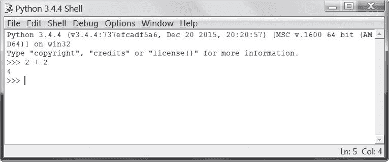
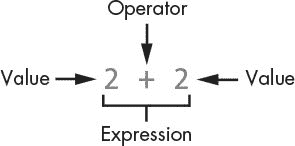
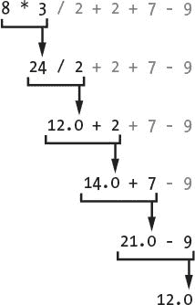
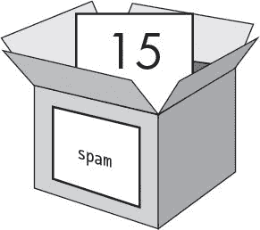
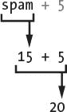
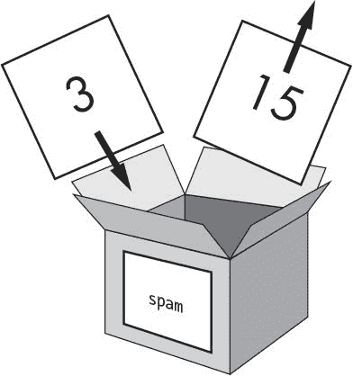
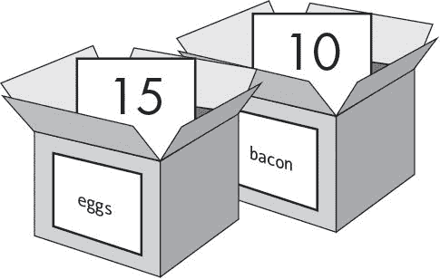

# 1 交互式外壳

> 原文：<https://inventwithpython.com/invent4thed/chapter1.html>


在你制作游戏之前，你需要学习一些基本的编程概念。在本章中，你将从学习如何使用 Python 的交互式 shell 和执行基本运算开始。

**本章涵盖的主题**

操作员

整数和浮点数

价值观

表情

语法错误

将值存储在变量中

### **一些简单的数学**

按照第二十六页[的](#calibre_link-64)[启动怠速](#calibre_link-63)中的步骤启动怠速。首先，您将使用 Python 来解决一些简单的数学问题。交互式外壳可以像计算器一样工作。在 > > > 提示符下，在交互 shell 中键入2+2，按<small class="calibre11">回车</small>。(在某些键盘上，该键是<small class="calibre11">返回</small>。)[图 1-1](#calibre_link-65) 显示了这个数学问题在交互式 shell 中的样子——请注意，它用数字 4 来响应。



*图 1-1:进入* `2 + 2` *进入交互外壳*

这道数学题是一道简单的编程指令。加号( + )告诉计算机将数字 2 和 2 相加。计算机这样做，并在下一行用数字 4 作出响应。[表 1-1](#calibre_link-66) 列出了 Python 中可用的其他数学符号。

**表 1-1:** 数学运算符

| **操作员** | **操作** |
| --- | --- |
| + | 添加 |
| - | 减法 |
| * | 增加 |
| / | 分开 |

减号( - )减去数字，星号( * )乘以数字，斜线( / )除以数字。如此使用时， + ， - ， * ， / 称为*运算符*。操作符告诉 Python 如何处理它们周围的数字。

#### ***整数和浮点数***

*整数*(或简称*整数*)为整数，如 4 、 99 、 0 。*浮点数*(或简称 *floats* )是带小数点的分数或数字，如 3.5 、 42.1 、 5.0 。在 Python 中， 5 是整数，但 5.0 是浮点数。这些数字被称为*值*。(稍后我们将了解除了数字以外的其他类型的值。)你在贝壳里输入的数学题中， 2 和 2 是整数值。

#### *T1】表情 T3】*

数学题 2 + 2 就是一个*表达式*的例子。正如[图 1-2](#calibre_link-67) 所示，表达式由运算符(数学符号)连接的值(数字)组成，运算符产生代码可以使用的新值。计算机可以在几秒钟内解决数百万个表达式。



*图 1-2:一个表达式由值和运算符组成。*

尝试在交互式 shell 中输入一些表达式，在每个表达式后按下 <small class="calibre11">ENTER</small> :

```py
>>> 2+2+2+2+2
10
>>> 8*6
48
>>> 10-5+6
11
>>> 2  +        2
4
```

这些表达式看起来都像常规的数学方程，但是请注意 2 + 2 例子中的所有空格。在 Python 中，可以在值和运算符之间添加任意数量的空格。但是，在交互式 shell 中输入指令时，必须始终在行首开始(没有空格)。

### **评估表达式**

当计算机求解表达式 10 + 5 并返回值 15 时，它已经对表达式*求值*。对表达式求值会将表达式简化为一个值，就像解决数学问题会将问题简化为一个数字:答案。例如，表达式 10 + 5 和 10 + 3 + 2 都计算为 15 。

当 Python 对一个表达式求值时，它遵循一个运算顺序，就像你做数学运算一样。只有几条规则:

首先计算括号内的部分表达式。

乘法和除法在加法和减法之前完成。

评估从左至右进行。

表达式 1 + 2 * 3 + 4 的计算结果是 11 ，而不是 13 ，因为 2 * 3 首先被计算。如果表达式是 (1 + 2) * (3 + 4) ，它将计算为 21 ，因为圆括号内的 (1 + 2) 和 (3 + 4) 在乘法之前被计算。

表达式可以是任意大小的，但是它们总是计算为单个值。即使是单值也是表达式。例如，表达式 15 的计算结果为值 15 。表达式 8 * 3 / 2 + 2 + 7 - 9 将通过以下步骤计算出值 12.0 :



即使计算机正在执行所有这些步骤，您也不会在交互式 shell 中看到它们。交互式 shell 只向您显示结果:

```py
>>> 8 * 3 / 2 + 2 + 7 - 9
12.0
```

请注意，带有 / 除法运算符的表达式始终计算为浮点型；例如， 24 / 2 计算为 12.0 。即使只有一个浮点值的数学运算也会计算浮点值，因此 12.0 + 2 计算结果为 14.0 。

### **语法错误**

如果您在交互式 shell 中输入 5 + ，您将得到以下错误消息:

```py
>>> 5 +
SyntaxError: invalid syntax
```

发生这个错误是因为 5 + 不是一个表达式。表达式有由运算符连接的值，并且 + 运算符期望在*之前和*之后有一个值。缺少预期值时，会出现一条错误消息。

SyntaxError 表示 Python 不理解指令，因为你输入错误。计算机编程不仅仅是给计算机下达指令，还要知道如何正确地给它下达指令。

不过，不要担心会犯错。错误不会损坏你的电脑。只需在下一个 > > > 提示符下，将指令正确地重新输入到交互外壳中。

### **在变量中存储值**

当一个表达式计算出一个值时，您可以稍后通过将该值存储在一个*变量*中来使用它。把变量想象成一个可以容纳值的盒子。

一个*赋值语句*将在一个变量中存储一个值。为变量键入一个名称，后面跟着等号( = )，称为*赋值运算符*，然后是要存储在变量中的值。例如，在交互式 shell 中输入以下内容:

```py
>>> spam = 15
>>>
```

spam 变量的盒子现在存储值 15 ，如图[图 1-3](#calibre_link-68) 所示。



*图 1-3:变量就像可以装值的盒子。*

当你按下<small class="calibre11">回车</small>时，你不会看到任何回应。在 Python 中，如果没有错误消息出现，您就知道指令成功了。将出现 > > > 提示，以便您输入下一条指令。

与表达式不同，*语句*是不计算任何值的指令。这就是为什么在 spam = 15 之后，交互式 shell 中的下一行没有显示任何值。如果你搞不清哪些指令是表达式，哪些是语句，请记住表达式的计算结果是单个值。任何其他类型的指令都是语句。

变量存储值，而不是表达式。例如，考虑语句 spam = 10 + 5 和 spam = 10 + 7 - 2 中的表达式。他们都评估为 15 。最终结果是相同的:两条赋值语句都将值 15 存储在变量 spam 中。

一个好的变量名描述了它包含的数据。想象一下，你搬到了一所新房子，并给你所有的搬家箱子贴上标签。你永远找不到任何东西！变量名 spam 、 eggs 和 bacon 是本书中变量的示例名。

第一次在赋值语句中使用变量时，Python 会创建这个变量。要检查变量中的值，请在交互式 shell 中输入变量名:

```py
>>> spam = 15
>>> spam
15
```

表达式 spam 计算出 spam 变量内的值: 15 。

您也可以在表达式中使用变量。尝试在交互式 shell 中输入以下内容:

```py
>>> spam = 15
>>> spam + 5
20
```

您将变量 spam 的值设置为 15 ，因此键入 spam + 5 就像键入表达式 15 + 5 。下面是 spam + 5 被评估的步骤:



在赋值语句创建变量之前，不能使用变量。如果你尝试这样做，Python 会给你一个 NameError ，因为还不存在这样的同名变量。变量名键入错误也会导致此错误:

```py
>>> spam = 15
>>> spma
Traceback (most recent call last):
  File "<pyshell#8>", line 1, in <module>
    spma
NameError: name 'spma' is not defined
```

出现错误是因为有一个 spam 变量，但没有 spma 变量。

您可以通过输入另一个赋值语句来更改存储在变量中的值。例如，在交互式 shell 中输入以下内容:

```py
>>> spam = 15
>>> spam + 5
20
>>> spam = 3
>>> spam + 5
8
```

当您第一次输入 spam + 5 时，表达式的计算结果为 20 ，因为您在 spam 中存储了 15 。但是，当您输入 spam = 3 时，变量框中的值 15 将被替换，或者用值 3 覆盖*，因为变量一次只能保存一个值。因为 spam 的值现在是 3 ，所以当你输入 spam + 5 时，表达式的计算结果为 8 。覆盖就像从变量的盒子里取出一个值来放入一个新值，如图[图 1-4](#calibre_link-69) 所示。*



*图 1-4:*`spam`*中的值* `15` *被值* `3`覆盖。

您甚至可以使用 spam 变量中的值为 spam 分配一个新值:

```py
>>> spam = 15
>>> spam = spam + 5
20
```

赋值语句 spam = spam + 5 表示，“ spam 变量的新值将是 spam 的当前值加 5。”要将 spam 中的值增加 5 多次，请在交互式 shell 中输入以下内容:

```py
>>> spam = 15
>>> spam = spam + 5
>>> spam = spam + 5
>>> spam = spam + 5
>>> spam
30
```

在本例中，您在第一条语句中给 spam 赋值 15 。在下一条语句中，将 5 加到 spam 的值上，并将新值 spam + 5 赋给 spam ，该值等于 20 。当您这样做三次时，垃圾邮件评估为 30 。

到目前为止，我们只看了一个变量，但是你可以在你的程序中创建任意多的变量。例如，让我们给两个名为鸡蛋和培根的变量赋予不同的值，就像这样:

```py
>>> bacon = 10
>>> eggs = 15
```

现在培根变量里面有 10 ，而鸡蛋变量里面有 15 。每个变量都是有自己值的盒子，如图[图 1-5](#calibre_link-70) 所示。



*图 1-5:*`bacon`*和* `eggs` *变量各自存储的值。*

在交互 shell 中输入 spam =培根+鸡蛋，然后查看 spam 的新值:

```py
>>> bacon = 10
>>> eggs = 15
>>> spam = bacon + eggs
>>> spam
25
```

垃圾信息中的值现在是 25 。当你加上培根和鸡蛋的时候，你是在加它们的值，分别是 10 和 15 。变量包含值，而不是表达式，所以给变量 spam 赋值 25 ，而不是表达式 bacon + eggs 。在 spam =培根+鸡蛋语句将值 25 赋给 spam 后，更改培根或鸡蛋不会影响 spam 。

### **总结**

在本章中，你学习了编写 Python 指令的基础。因为计算机没有常识，只理解特定的指令，Python 需要你告诉它到底要做什么。

表达式是由运算符(如 + 或 - )组合而成的值(如 2 或 5 )。Python 可以计算表达式，也就是说，将表达式简化为单个值。您可以将值存储在变量中，这样您的程序就可以记住这些值并在以后使用它们。

Python 中还有一些其他类型的运算符和值。在下一章，你将复习一些更基本的概念并编写你的第一个程序。您将了解如何在表达式中处理文本。Python 不仅仅局限于数字；它不仅仅是一个计算器！