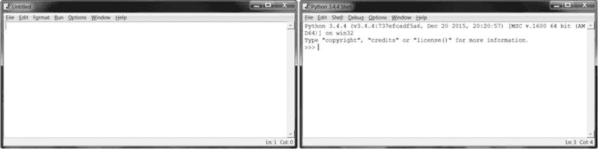
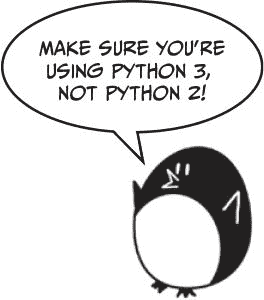
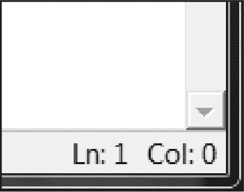
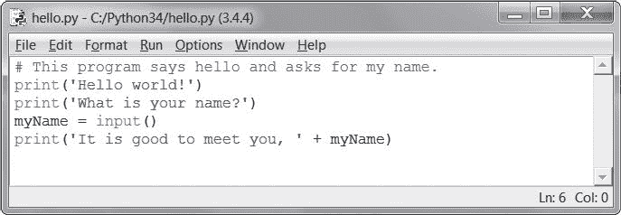
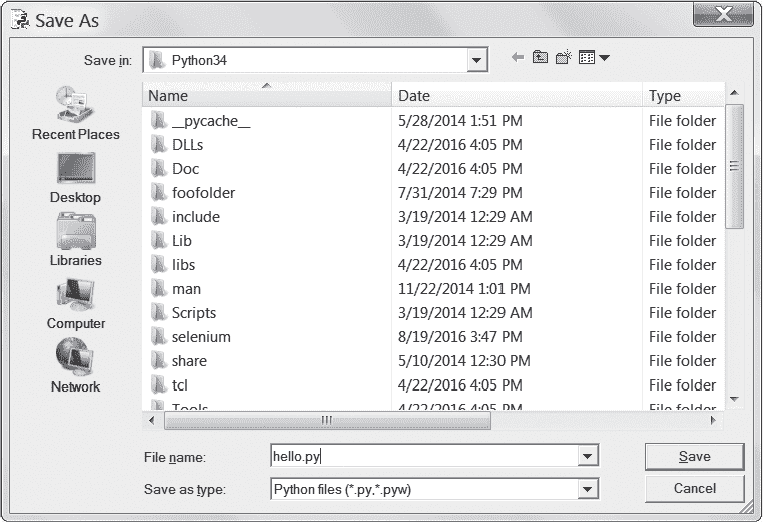
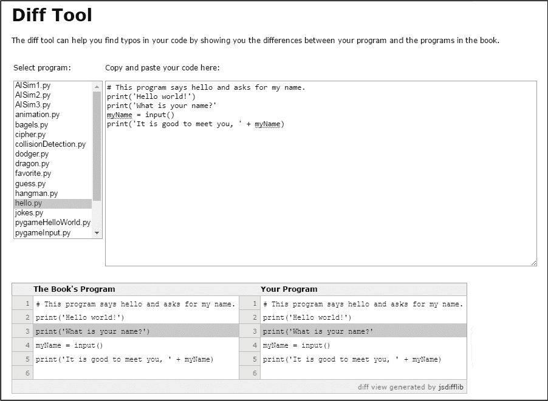
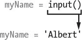
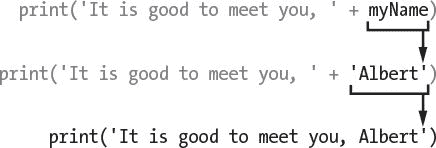

# 2 编写程序

> 原文：<https://inventwithpython.com/invent4thed/chapter2.html>


现在让我们看看 Python 可以对文本做什么。几乎所有的程序都向用户显示文本，用户通过键盘向程序输入文本。在这一章中，你将编写你的第一个程序，它完成这两件事。您将学习如何在变量中存储文本、组合文本以及在屏幕上显示文本。你将创建的程序显示问候 Hello world！并询问用户名。

**本章涵盖的主题**

琴弦

字符串连接

数据类型(如字符串或整数)

使用文件编辑器编写程序

空闲时保存和运行程序

执行流程

评论

print() 功能

输入()功能

区分大小写

### **字符串值**

在 Python 中，文本值被称为*字符串*。字符串值可以像整数值或浮点值一样使用。您可以将字符串存储在变量中。在代码中，字符串值以单引号开始和结束， ' 。在交互式 shell 中输入以下代码:

```py
>>> spam = 'hello'
```

单引号告诉 Python 字符串的开始和结束位置。它们不是字符串值文本的一部分。现在，如果您在交互式 shell 中输入 spam ，您将看到 spam 变量的内容。请记住，Python 将变量评估为存储在变量内部的值。在这种情况下，这是字符串‘你好’。

```py
>>> spam = 'hello'
>>> spam
'hello'
```

字符串中可以包含任何键盘字符，并且可以是您想要的长度。这些都是字符串的例子:

```py
'hello'
'Hi there!'
'KITTENS'
'7 apples, 14 oranges, 3 lemons'
'Anything not pertaining to elephants is irrelephant.'
'A long time ago, in a galaxy far, far away...'
'O*&#wY%*&OCfsdYO*&gfC%YO*&%3yc8r2'
```

### **字符串串联**

您可以将字符串值与运算符组合起来构成表达式，就像您对整型和浮点型值所做的那样。当你用 + 操作符组合两个字符串时，它被称为*字符串连接*。输入‘你好’+‘世界！’进入交互外壳:

```py
>>> 'Hello' + 'World!'
'HelloWorld!'
```

该表达式计算出单个字符串值， 'HelloWorld！'。单词之间没有空格，因为两个连接的字符串中都没有空格，不像下面的示例:

```py
>>> 'Hello ' + 'World!'
'Hello World!'
```

由于字符串和整数值是不同的*数据类型*，所以 + 操作符对它们的作用是不同的。所有值都有数据类型。值‘你好’的数据类型是字符串。值 5 的数据类型为整数。数据类型告诉 Python 在计算表达式时操作符应该做什么。 + 操作符连接字符串值，但是将整数和浮点值相加。

### **在 IDLE 的文件编辑器中编写程序**

到目前为止，你一直在 IDLE 的交互式 shell 中一次输入一条指令。然而，当你写程序时，你输入几个指令，让它们同时运行，这就是你接下来要做的。是时候写你的第一个程序了！

除了解释器，IDLE 还有另外一个部分叫做*文件编辑器*。要打开它，点击交互外壳顶部的**文件**菜单。然后选择**新建文件**。将出现一个空白窗口，供您键入程序代码，如图[图 2-1](#calibre_link-31) 所示。



*图 2-1:文件编辑器(左)和交互外壳(右)*

这两个窗口看起来很相似，但请记住这一点:交互 shell 会有 > > > 提示，而文件编辑器则没有。

#### ***创建 Hello World 程序***

程序员的传统是让他们的第一个程序显示 Hello world！在屏幕上。现在，您将创建自己的 Hello World 程序。



当你输入你的程序时，记住不要在每一行代码的开头输入数字。它们在那里，所以这本书可以通过行号来引用代码。文件编辑器的右下角会告诉你闪烁的光标在哪里，这样你就可以检查你在哪一行代码上。[图 2-2](#calibre_link-32) 显示光标在第 1 行(编辑器上下移动)和第 0 列(左右移动)。



*图 2-2:文件编辑器的右下角告诉你光标在哪一行。*

在新的文件编辑器窗口中输入以下文本。这是程序的*源代码*。它包含程序运行时 Python 将遵循的指令。

*hello.py*

```py
1\. # This program says hello and asks for my name.
2\. print('Hello world!')
3\. print('What is your name?')
4\. myName = input()
5\. print('It is good to meet you, ' + myName)
```

IDLE 会用不同的颜色写不同类型的指令。输入完代码后，窗口应该看起来像[图 2-3](#calibre_link-33) 。



*图 2-3:输入你的代码后，文件编辑器会是这个样子。*

检查以确保你的空闲窗口看起来是一样的。

#### ***保存你的程序***

一旦你输入了你的源代码，点击**文件**  **另存为**来保存它。或者按 <small class="calibre11">CTRL</small> -S 用键盘快捷键保存。[图 2-4](#calibre_link-34) 显示了将要打开的另存为窗口。在文件名文本字段中输入 *hello.py* ，然后点击**保存**。



*图 2-4:保存程序*

你应该在编写程序的时候经常保存它们。这样，如果电脑崩溃或者你意外退出空闲状态，你也不会丢失太多工作。

要加载您之前保存的程序，点击**文件**T3】打开。在出现的窗口中选择 *hello.py* 文件，点击**打开**按钮。您保存的 *hello.py* 程序将在文件编辑器中打开。

#### ***运行你的程序***

现在是运行程序的时候了。点击**运行** 运行**模块**。或者在文件编辑器中按 F5 键(OS X 上的 <small class="calibre11">FN</small> -5)。您的程序将在交互式 shell 中运行。

当程序要求时，请输入您的姓名。这将看起来像图 2-5 。


*图 2-5:运行* hello.py 后的交互 shell

当你输入你的名字并按下<small class="calibre11">回车</small>时，程序会用名字问候你。恭喜你！你已经编写了你的第一个程序，现在是一名计算机程序员。再次按 F5 再次运行该程序，并输入另一个名称。

如果你有错误，在用在线比较工具把你的代码和这本书的代码进行比较。将你的代码从文件编辑器中复制并粘贴到网页中，然后点击**比较**按钮。该工具将突出显示您的代码与本书中的代码之间的任何差异，如图 2-6 所示。

在编码的时候，如果你得到一个类似下面的 NameError ，这意味着你使用的是 Python 2 而不是 Python 3。

```py
Hello world!
What is your name?
Albert
Traceback (most recent call last):
  File "C:/Python26/test1.py", line 4, in <module>
    myName = input()
  File "<string>", line 1, in <module>
NameError: name 'Albert' is not defined
```

要解决该问题，请安装 Python 3.4 并重新运行该程序。(参见[第 xxv](#calibre_link-38) 页的[下载安装 Python](#calibre_link-37) )。)



*图 2-6:在 https://www.nostarch.com/inventwithpython#diff 的*使用比较工具

### **Hello World 项目如何运作**

每一行代码都是 Python 解释的指令。这些指令组成了程序。计算机程序的指令就像食谱中的步骤。Python 按顺序完成每条指令，从程序顶部开始，向下移动。

Python 当前在程序中工作的步骤被称为*执行*。当程序启动时，从第一条指令开始执行。执行完指令后，Python 向下移动到下一条指令。

让我们看看每一行代码，看看它在做什么。我们从第一行开始。

#### ***程序员注释***

Hello World 程序的第一行是一个*注释*:

```py
1\. # This program says hello and asks for my name.
```

散列符号( # )后的任何文本都是注释。注释是程序员关于代码做什么的笔记；它们不是为 Python 写的，而是为程序员写的。Python 在运行程序时会忽略注释。程序员通常在代码的顶部放一个注释来给他们的程序一个标题。Hello World 程序中的注释告诉你，程序向你问好，并询问你的名字。

#### ***功能:程序内的小程序***

一个*函数*有点像你程序中的一个迷你程序，它包含了几个 Python 要执行的指令。函数的伟大之处在于，你只需要知道它们做什么，而不是它们如何做。Python 已经提供了一些内置函数。我们在 Hello World 程序中使用 print() 和 input() 。

*函数调用*是一条指令，告诉 Python 在函数内部运行代码。例如，你的程序调用 print() 函数在屏幕上显示一个字符串。 print() 函数将您在括号中键入的字符串作为输入，并在屏幕上显示该文本。

##### **打印()功能**

Hello World 程序的第 2 行和第 3 行是对 print() 的调用:

```py
2\. print('Hello world!')
3\. print('What is your name?')
```

函数调用中括号之间的值是一个*参数*。第 2 行的 print() 函数调用的参数是‘Hello world！，第 3 行的 print() 函数调用的参数是‘你叫什么名字？’。这被称为将参数传递给函数的*。*

##### **输入()函数**

第 4 行是一个赋值语句，包含一个变量 myName ，以及一个函数调用 input() :

```py
4\. myName = input()
```

当调用 input() 时，程序等待用户输入文本。用户输入的文本字符串成为函数调用评估的值。函数调用可以用在表达式中任何可以使用值的地方。

函数调用评估的值称为*返回值*。(事实上，“函数调用返回的值”和“函数调用评估的值”是一个意思)在这种情况下， input() 函数的返回值是用户输入的字符串:他们的名字。如果用户输入 Albert ，那么 input() 函数调用的结果是字符串‘Albert’。评估是这样的:



这就是字符串值‘Albert’存储在我的名字变量中的方式。

##### **函数调用中的表达式**

Hello World 程序中的最后一行是另一个 print() 函数调用:

```py
5\. print('It is good to meet you, ' + myName)
```

表达式‘很高兴见到你，’+my name在 print() 的括号之间。因为参数总是单值的，Python 将首先计算这个表达式，然后将那个值作为参数传递。如果‘艾伯特’被存储在我的名字中，那么评估看起来是这样的:



这是程序通过名字问候用户的方式。

#### ***程序结束***

一旦程序执行完最后一行，它*终止*或者*退出*。这意味着程序停止运行。Python 忘记了存储在变量中的所有值，包括存储在 myName 中的字符串。如果您再次运行该程序并输入不同的名称，该程序将认为这是您的姓名:

```py
Hello world!
What is your name?
Carolyn
It is good to meet you, Carolyn
```

记住，计算机完全按照你的程序去做。计算机是愚蠢的，只是完全按照你给它们的指令去做。电脑不在乎你输入你的名字，别人的名字，或者一些愚蠢的东西。键入你想要的任何东西。电脑会以同样的方式处理它:

```py
Hello world!
What is your name?
poop
It is good to meet you, poop
```

### **命名变量**

给变量起一个描述性的名字可以更容易理解程序是做什么的。你可以将变量称为我的名字变量亚伯拉罕林肯或名字，Python 也会以同样的方式运行程序。但是这些名字并没有真正告诉你这个变量可能包含什么信息。正如第一章所讨论的，如果你要搬到一个新房子，并且你给每个搬家箱子*贴上标签*，那一点帮助都没有！本书的交互式 shell 示例使用类似于 spam 、 eggs 和 bacon 的变量名，因为这些示例中的变量名无关紧要。但是，这本书的程序都使用描述性名称，你的程序也应该如此。

变量名*区分大小写*，这意味着不同大小写的相同变量名被认为是不同的变量。所以垃圾信息、垃圾信息、垃圾信息和垃圾信息是 Python 中四个不同的变量。它们各自包含各自独立的值。在你的程序中使用不同大小写的变量不是一个好主意。请改用描述性的变量名称。

变量名通常是小写的。如果变量名中有多个单词，最好在第一个单词后将每个单词大写。例如，变量名whatihadforbreakfasthismearth比whatihadforbreakfasthismearth更容易阅读。以这种方式利用你的变量被称为*骆驼案*(因为它类似于骆驼背上的驼峰)，这使得你的代码更具可读性。程序员也更喜欢使用较短的变量名，使代码更容易理解: breakfast 或foodthismearth比whatihadforbreakfasthismearth可读性更好。这些是*约定*——Python 编程中可选但标准的做事方式。

### **总结**

一旦你理解了如何使用字符串和函数，你就可以开始制作与用户交互的程序了。这很重要，因为文本是用户和计算机相互交流的主要方式。用户用 input() 功能通过键盘输入文本，计算机用 print() 功能在屏幕上显示文本。

字符串只是一种新数据类型的值。所有的值都有一个数据类型，值的数据类型会影响到 + 运算符的作用。

函数用于在程序中执行复杂的指令。Python 有许多内置函数，您将在本书中了解到。函数调用可以在表达式中任何使用值的地方使用。

Python 当前正在运行的程序中的指令或步骤称为执行。在第 3 章中，你将会学到更多关于如何让程序执行，而不仅仅是直接执行。一旦你学会了这一点，你就可以开始创作游戏了！