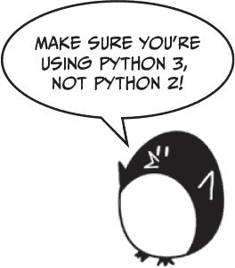
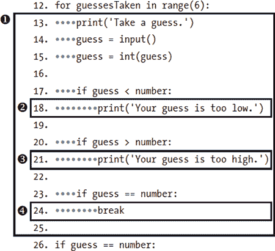
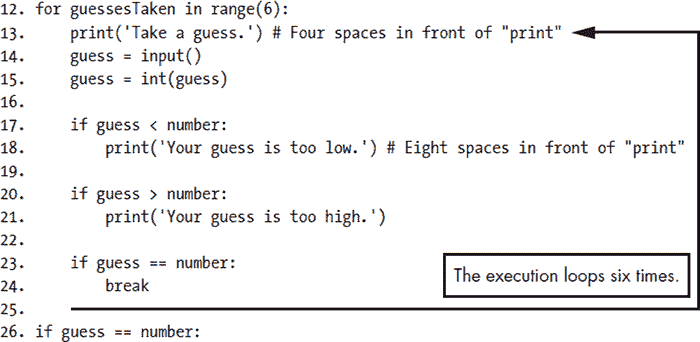
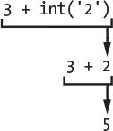
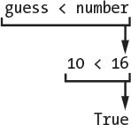

# 3 猜数字

> 原文：<https://inventwithpython.com/invent4thed/chapter3.html>


在这一章中，你将做一个猜数字的游戏。电脑会想出一个从 1 到 20 的秘密数字，让用户猜出来。每次猜中后，电脑会告诉用户这个数字是太高还是太低。如果用户能在六次尝试中猜出数字，他就赢了。

这是一个编写代码的好游戏，因为它在一个短程序中涵盖了许多编程概念。您将了解如何将值转换为不同的数据类型，以及何时需要这样做。由于这个程序是一个游戏，从现在开始我们将称用户为*玩家*。

**本章涵盖的主题**

导入报表

模块

randint() 函数

语句的

区块

str() 、 int() 和 float() 函数

布尔型

比较运算符

条件

= 和 == 的区别

if 语句

中断语句

### **样本运行猜测数字**

以下是玩家在运行“猜数字”程序时看到的效果。玩家的输入用粗体标记。

```py
Hello! What is your name?
Albert
Well, Albert, I am thinking of a number between 1 and 20.
Take a guess.
10
Your guess is too high.
Take a guess.
2
Your guess is too low.
Take a guess.
4
Good job, Albert! You guessed my number in 3 guesses!
```

### **猜测数字的源代码**

点击**文件**  **新建窗口**，打开一个新的文件编辑器窗口。在出现的空白窗口中，输入源代码，保存为 *guess.py* 。然后按 F5 运行程序。



当你在文件编辑器中输入这段代码时，一定要注意行前的间距。有些行需要缩进四到八个空格。

如果你输入这个代码后出现错误，在用在线比较工具将你输入的代码与书中的代码进行比较。

*guess.py*

```py
 1\. # This is a Guess the Number game.
 2\. import random
 3.
 4\. guessesTaken = 0
 5.
 6\. print('Hello! What is your name?')
 7\. myName = input()
 8.
 9\. number = random.randint(1, 20)
10\. print('Well, ' + myName + ', I am thinking of a number between 1 and 20.')
11.
12\. for guessesTaken in range(6):
13.     print('Take a guess.') # Four spaces in front of "print"
14.     guess = input()
15.     guess = int(guess)
16.
17.     if guess < number:
18.         print('Your guess is too low.') # Eight spaces in front of "print"
19.
20.     if guess > number:
21.         print('Your guess is too high.')
22.
23.     if guess == number:
24.         break
25.
26\. if guess == number:
27.     guessesTaken = str(guessesTaken + 1)
28.     print('Good job, ' + myName + '! You guessed my number in ' +
          guessesTaken + ' guesses!')
29.
30\. if guess != number:
31.     number = str(number)
32.     print('Nope. The number I was thinking of was ' + number + '.')
```

### **导入随机模块**

让我们来看看这个程序的前两行:

```py
1\. # This is a Guess the Number game.
2\. import random
```

第一行是注释，你在[第二章](#calibre_link-6)看到的。记住 Python 会忽略 # 字符之后的所有内容。这里的注释只是提醒我们这个程序是做什么的。

第二行是一个导入语句。请记住，语句是执行某些操作的指令，但不像表达式那样计算值。您已经看到了赋值语句，它在变量中存储一个值。

虽然 Python 包含许多内置函数，但有些函数是用称为*模块*的独立程序编写的。您可以通过使用 import 语句将这些函数的模块导入到您的程序中来使用这些函数。

第 2 行导入了 random 模块，这样程序就可以调用 randint() 函数。这个函数会给出一个随机数让玩家猜。

现在您已经导入了 random 模块，您需要设置一些变量来存储您的程序稍后将使用的值。

第 4 行创建了一个名为 guessesTaken 的新变量:

```py
4\. guessesTaken = 0
```

您将在这个变量中存储玩家的猜测次数。由于玩家在程序的这一点上还没有做出任何猜测，所以在这里存储整数 0 。

```py
6\. print('Hello! What is your name?')
7\. myName = input()
```

第 6 行和第 7 行与第 2 章中[Hello World 程序中的行相同。程序员经常重用其他程序的代码来节省自己的工作。](#calibre_link-6)

第 6 行是对 print() 的函数调用。记住函数就像你程序中的迷你程序。当你的程序调用一个函数时，它运行这个小程序。 print() 里面的代码在屏幕上显示你传递给它的字符串参数。

第 7 行让玩家输入他们的名字，并将其存储在变量 myName 中。请记住，字符串可能不是真正的球员的名字；它只是玩家输入的字符串。电脑是哑的，无论如何都会听从它们的指令。

### **用 random.randint()函数生成随机数**

现在你的其他变量已经设置好了，你可以使用 random 模块的函数来设置计算机的密码:

```py
9\. number = random.randint(1, 20)
```

第 9 行调用一个名为 randint() 的新函数，并将返回值存储在号中。记住，函数调用可以是表达式的一部分，因为它们的计算结果是一个值。

randint()函数是由 random 模块提供的，所以必须用 random.randint() 来调用(别忘了句号！)告诉 Python 函数 randint() 在 random 模块中。

randint() 将返回一个介于传递给它的两个整数参数之间的随机整数。第 9 行经过了函数名后面的括号中的 1 和 20 ，用逗号分隔。 randint() 返回的随机整数存储在一个名为 number 的变量中——这是玩家试图猜测的秘密数字。

只需片刻，回到交互外壳，输入 导入随机 即可导入随机模块。然后输入 random.randint(1，20) 看看函数调用的结果是什么。它将返回一个介于 1 和 20 之间的整数。再次重复代码，函数调用将返回另一个整数。 randint() 函数每次都会返回一个随机整数，就像每次掷骰子都会得到一个随机数一样。例如，在交互式 shell 中输入以下内容。调用 randint() 函数得到的结果可能会有所不同(毕竟是随机的！).

```py
>>> import random
>>> random.randint(1, 20)
12
>>> random.randint(1, 20)
18
>>> random.randint(1, 20)
3
>>> random.randint(1, 20)
18
>>> random.randint(1, 20)
7
```

您也可以通过更改参数来尝试不同的数字范围。比如输入 random.randint(1，4) 只得到 1 和 4 之间的整数(包括 1 和 4 )。或者尝试 random.randint(1000，2000) 得到 1000 和 2000 之间的整数。

在交互式 shell 中输入此代码，看看您会得到什么数字:

```py
>>> random.randint(1, 4)
3
>>> random.randint(1000, 2000)
1294
```

您可以稍微更改游戏的代码，使游戏的行为有所不同。在我们的原始代码中，我们使用了一个介于 1 和 20 之间的整数:

```py
 9\. number = random.randint(1, 20)
10\. print('Well, ' + myName + ', I am thinking of a number between 1 and 20.')
```

尝试将整数范围改为 (1，100) :

```py
 9\. number = random.randint(1, 100)
10\. print('Well, ' + myName + ', I am thinking of a number between 1 and 100.')
```

现在电脑会想到一个在 1 和 100 之间的整数，而不是 1 和 20 。改变第 9 行将改变随机数的范围，但是记住也要改变第 10 行，这样游戏告诉玩家新的范围而不是旧的。

只要你想给游戏增加随机性，你就可以使用 randint() 函数。你会在很多游戏中使用随机性。(想想有多少桌游是用骰子的。)

### **欢迎玩家**

在电脑给号分配一个随机整数后，它会问候玩家:

```py
10\. print('Well, ' + myName + ', I am thinking of a number between 1 and 20.')
```

在第 10 行， print() 用名字欢迎玩家，并告诉他们计算机正在考虑一个随机数。

乍一看，第 10 行似乎有不止一个字符串参数，但是请仔细检查这一行。三个字符串之间的 + 运算符将它们连接成一个字符串。这一串就是传递给 print() 的参数。如果你仔细观察，你会发现逗号在引号内，是字符串本身的一部分。

### **流量控制语句**

在前面的章节中，程序执行从程序中的顶层指令开始，然后直接向下移动，按顺序执行每条指令。但是有了 for 、 if 、 else 和 break 语句，就可以根据条件进行执行循环或跳过指令。这些类型的语句是*流控制语句*，因为它们改变了程序执行的流程。

#### ***利用循环来重复编码***

第 12 行是语句的，表示循环的的开始:

```py
12\. for guessesTaken in range(6):
```

*循环*让你一遍又一遍的执行代码。第 12 行将重复其代码六次。一个用于的语句以用于关键字的开始，后面是一个新的变量名、关键字中的、一个对 range() 函数的调用(指定它应该执行的循环次数)和一个冒号。让我们回顾一些额外的概念，这样你就可以使用循环了。

#### ***用积木分组***

几行代码可以组合在一个*块*中。代码块中的每一行都至少以块中第一行的空格数开始。通过查看这些行前面的空格数，可以知道一个块的开始和结束位置。这是线条的*缩进*。

Python 程序员通常使用四个*额外的*缩进空间来开始一个块。任何随后缩进相同量的行都是块的一部分。当有一行代码的缩进与块开始前的相同时，块结束。其他块中也可以有块。[图 3-1](#calibre_link-7) 显示了带有方框轮廓和编号的代码图。



*图 3-1:块及其缩进的例子。灰点代表空间。*

在[图 3-1](#calibre_link-7) 中，第 12 行没有缩进，也不在任何块内。第 13 行缩进了四个空格。因为这一行比前一行缩进得多，所以从这里开始一个新的块。这一行之后的每一行都有相同或更多的缩进量，被认为是块 ➊ 的一部分。如果 Python 遇到另一行比块的第一行缩进量小，那么块就结束了。空行被忽略。

第 18 行缩进八个空格，从块 ➋ 开始。该块是块 ➊ 内的*。但是下一行，第 20 行，只缩进了四个空格。因为缩进减少了，你知道第 18 行的块 ➋ 已经结束，因为第 20 行和第 13 行有相同的缩进，你知道它在块 ➊ 。*

第 21 行再次将缩进增加到 8 个空格，因此块中的另一个新块已经开始:块 ➌ 。在第 23 行，我们从➌ 的街区出来，在第 24 行，我们进入一个街区内的最后一个街区，➍ 的街区。➊ 区块和➍区块都在 24 行结束。

#### ***循环使用 for 语句***

语句的标志着循环的开始。循环重复执行相同的代码。当执行到达语句的时，进入语句的之后的块。运行完该块中的所有代码后，执行返回到块的顶部，重新运行代码。

在交互式 shell 中输入以下内容:

```py
>>> for i in range(3):
    print('Hello! i is set to', i)

Hello! i is set to 0
Hello! i is set to 1
Hello! i is set to 2
```

请注意，在您为范围(3)中的 I 键入:并按下 <small class="calibre11">ENTER</small> 之后，交互 shell 没有显示另一个 > > > 提示，因为它希望您键入一段代码。在最后一条指令之后，再次按下 <small class="calibre11">ENTER</small> ，告诉交互 shell 您已经完成了代码块的输入。(这仅适用于在交互式 shell 中工作时。写*的时候。py* 文件在文件编辑器中，你不需要插入空行。)

再来看 *guess.py* 第 12 行循环的:

```py
12\. for guessesTaken in range(6):
13.     print('Take a guess.') # Four spaces in front of "print"
14.     guess = input()
15.     guess = int(guess)
16.
17.     if guess < number:
18.         print('Your guess is too low.') # Eight spaces in front of "print"
19.
20.     if guess > number:
21.         print('Your guess is too high.')
22.
23.     if guess == number:
24.         break
25.
26\. if guess == number:
```

在猜数中，块的从第 12 行的语句的开始，块的之后的第一行是第 26 行。

用于语句的在条件后总是有一个冒号( : )。以冒号结尾的语句期望在下一行有一个新块。这在[图 3-2](#calibre_link-8) 中有所说明。



*图 3-2:*`for`*循环的执行流程*

图 3-2 显示了执行流程。执行将进入第 13 行程序块的并继续向下。一旦程序到达块的的末尾，而不是下到下一行，执行循环回到第 13 行块的的开始处。由于 for 语句中的 range(6) 函数调用，它会这样做六次。每次循环执行都被称为一次*迭代*。

将语句的理解为“执行下面块中的代码一定次数。”

### **获得玩家的猜测**

第 13 行和第 14 行要求玩家猜测密码，并让他们输入自己的猜测:

```py
13.     print('Take a guess.') # Four spaces in front of "print"
14.     guess = input()
```

玩家输入的数字存储在一个名为 guess 的变量中。

### **用 int()、float()和 str()函数转换值**

第 15 行调用了一个名为 int() 的新函数:

```py
15.     guess = int(guess)
```

int() 函数接受一个参数，并以整数形式返回该参数的值。

在交互式 shell 中输入以下内容，看看 int() 函数是如何工作的:

```py
>>> int('42')
42
```

调用 int('42') 将返回整数值 42 。

```py
>>> 3 + int('2')
5
```

3 + int('2') 行显示了一个使用 int() 的返回值作为表达式一部分的表达式。它评估为整数值 5 :



尽管您可以将一个字符串传递给 int() ，但您不能传递任何字符串。将‘四十二’传递给 int() 会导致错误:

```py
>>> int('forty-two')
Traceback (most recent call last):
  File "<pyshell#5>", line 1, in <module>
    int('forty-two')
ValueError: invalid literal for int() with base 10: 'forty-two'
```

传递给 int() 的字符串必须由数字组成。

在猜测号码中，我们使用 input() 函数获得玩家的号码。记住， input() 函数总是返回玩家输入的文本的*字符串*。如果玩家输入 5 ， input() 函数将返回字符串值‘5’，而不是整数值 5 。但是我们稍后需要将玩家的号码与整数进行比较，Python 不能使用 < 和 > 比较运算符来比较字符串和整数值:

```py
>>> 4 < '5'
Traceback (most recent call last):
  File "<pyshell#0>", line 1, in <module>
    4 < '5'
TypeError: unorderable types: int() < str()
```

因此，我们需要将字符串转换成整数:

```py
14.     guess = input()
15.     guess = int(guess)
```

在第 14 行，我们将 guess 变量赋给玩家输入的任意数字的字符串值。第 15 行用由 int() 返回的整数值覆盖猜测中的字符串值。代码 int(guess) 根据提供给它的字符串返回一个新的整数值，然后 guess = 将这个新值赋给 guess 。这让程序后面的代码比较猜测是大于、小于还是等于数字变量中的秘密数字。

类似地， float() 和 str() 函数将返回传递给它们的参数的浮点和字符串版本。在交互式 shell 中输入以下内容:

```py
>>> float('42')
42.0
>>> float(42)
42.0
```

当字符串‘42’或整数 42 传递给 float() 时，返回 float 42.0 。

现在尝试使用 str() 函数:

```py
>>> str(42)
'42'
>>> str(42.0)
'42.0'
```

当整数 42 传递给 str() 时，返回字符串‘42’。但是当 float 42.0 传递给 str() 时，字符串‘42.0’返回。

使用 int() 、 float() 和 str() 函数，您可以获取一种数据类型的值，并将其作为不同数据类型的值返回。

### **布尔数据类型**

Python 中的每个值都属于一种数据类型。到目前为止，已经介绍的数据类型有整数、浮点、字符串，现在还有布尔。*布尔*数据类型只有两个值:真或假。布尔值必须以大写字母 T 或 F 输入，其余值的名称以小写字母输入。

布尔值可以像其他数据类型一样存储在变量中:

```py
>>> spam = True
>>> eggs = False
```

在这个例子中，您将垃圾邮件设置为真，将彩蛋设置为假。记住第一个字母要大写。

您将使用带有比较运算符的布尔值(简称为 *bools* )来构成条件。我们将首先讨论比较运算符，然后讨论条件。

#### ***比较运算符***

*比较运算符*比较两个值，并评估为一个真或假布尔值。表 3-1 列出了所有的比较运算符。

**表 3-1:** 比较运算符

| **操作员** | **操作** |
| --- | --- |
| <T1】 | 不到 |
| >T1】 | 大于 |
| < = | 小于或等于 |
| > = | 大于或等于 |
| == | 等于 |
| ！= | 不等于 |

你已经了解了 + 、 - 、 * 和 / 数学运算符。像任何操作符一样，比较操作符与值结合形成表达式，如 guessesTaken < 6 。

猜测数字程序的第 17 行使用小于比较运算符:

```py
17.     if guess < number:
```

我们稍后将更详细地讨论 if 语句；现在，让我们只看一下跟在 if 关键字后面的表达式(猜测<数字部分)。该表达式包含两个值(变量 guess 和 number 中的值)，由运算符( < 或小于号)连接。

#### ***用条件检查真假***

*条件*是用比较运算符(如 < 或 > )组合两个值并计算为布尔值的表达式。条件只是计算结果为真或假的表达式的另一个名称。我们使用条件的一个地方是在 if 语句中。

比如第 17 行的条件猜<数问“存储在猜中的值是否小于存储在数中的值？”如果是，则条件评估为真。如果不是，条件评估为假。

说猜存储整数 10 和数存储整数 16 。因为 10 小于 16 ，所以该条件评估为布尔值真。评估将如下所示:



#### ***试验布尔、比较运算符和条件***

在交互式 shell 中输入以下表达式，查看它们的布尔结果:

```py
>>> 0 < 6
True
>>> 6 < 0
False
```

条件 0 < 6 返回布尔值真，因为数字 0 小于数字 6 。但是因为 6 不小于 0 ，条件 6 < 0 评估为假。

注意到 10 < 10 评估为假，因为数字 10 不小于数字 10 :

```py
>>> 10 < 10
False
```

值是相同的。如果爱丽丝和鲍勃一样高，你就不会说爱丽丝比鲍勃高或者爱丽丝比鲍勃矮。这两种说法都是错误的。

现在将这些表达式输入到交互式 shell 中:

```py
>>> 10 == 10
True
>>> 10 == 11
False
>>> 11 == 10
False
>>> 10 != 10
False
```

在这个例子中， 10 等于 10 ，所以 10 == 10 计算为真。但 10 不等于 11 ，所以 10 == 11 为假。即使顺序翻转， 11 仍然不等于 10 ，所以 11 == 10 为假。最后， 10 等于 10 ，所以 10！= 10 为假。

还可以用比较运算符计算字符串表达式:

```py
>>> 'Hello' == 'Hello'
True
>>> 'Goodbye' != 'Hello'
True
>>> 'Hello' == 'HELLO'
False
```

‘你好’等于‘你好’，所以‘你好’=‘你好’就是真。‘再见’不等于‘你好’，所以‘再见’！= 'Hello' 也是真。

注意，最后一行评估为假。Python 中的大小写字母不一样，所以‘Hello’不等于‘Hello’。

字符串和整数值永远不会彼此相等。例如，在交互式 shell 中输入以下内容:

```py
>>> 42 == 'Hello'
False
>>> 42 != '42'
True
```

在第一个示例中， 42 是一个整数，而‘Hello’是一个字符串，因此这两个值不相等，表达式的计算结果为 False 。在第二个示例中，字符串 '42' 仍然不是整数，因此表达式“整数 42 不等于字符串 '42' ”的计算结果为真。

#### ***=和= =**=*的区别

注意不要混淆赋值操作符 = 和等于比较操作符 == 。等号 = 在赋值语句中用于将值存储到变量中，而双等号=在表达式中用于查看两个值是否相等。当你想用另一个的时候，很容易不小心用了一个。

记住等于比较运算符=和不等于比较运算符可能会有所帮助！= ，有两个字符。

### **if 语句**

第 17 行是一个 if 语句:

```py
17.     if guess < number:
18.         print('Your guess is too low.') # Eight spaces in front of "print"
```

如果 if 语句的条件评估为真，则 if 语句之后的代码块将运行。如果条件为假，跳过 if 块中的代码。使用 if 语句，你可以让程序只在你希望的时候运行某些代码。

第 17 行检查玩家的猜测是否小于计算机的秘密数字。如果是，那么执行移到第 18 行的 if 块中，并打印一条消息告诉玩家他们的猜测太低。

第 20 行检查玩家的猜测是否大于秘密数字:

```py
20.     if guess > number:
21.         print('Your guess is too high.')
```

如果这个条件是真，那么 print() 函数调用告诉玩家他们的猜测太高了。

### **用 break 语句提前离开循环**

第 23 行的 if 语句检查玩家猜测的数字是否等于秘密数字。如果是，程序运行第 24 行的 break 语句:

```py
23.     if guess == number:
24.         break
```

一个 break 语句告诉执行立即从块的跳到块的结束后的第一行。 break 语句只能在循环内部找到，比如在块的中。

### **检查玩家是否赢了**

块的结束于没有缩进的下一行代码，即第 26 行:

```py
26\. if guess == number:
```

执行将留给块，要么是因为它已经循环了六次(当玩家猜中时)，要么是因为第 24 行的 break 语句已经执行(当玩家猜中数字时)。

第 26 行检查玩家是否猜对了。如果是，则执行在第 27 行进入 if 块:

```py
27.     guessesTaken = str(guessesTaken + 1)
28.     print('Good job, ' + myName + '! You guessed my number in ' +
          guessesTaken + ' guesses!')
```

只有当第 26 行的 if 语句中的条件为 True (也就是说，如果玩家正确猜中了计算机的号码)时，第 27 行和第 28 行才会执行。

第 27 行调用 str() 函数，该函数返回字符串形式的 guessesTaken + 1 (因为 range 函数从 0 到 5，而不是从 1 到 6)。第 28 行连接字符串，告诉玩家他们赢了，猜了多少次。只有字符串值可以连接到其他字符串。这就是为什么第 27 行必须将 guessesTaken + 1 改为字符串形式。否则，尝试将字符串与整数连接会导致 Python 显示错误。

### **检查玩家是否输了**

如果玩家猜不到，将执行以下代码行:

```py
30\. if guess != number:
```

第 30 行使用了不等于比较运算符！= 检查玩家的最后一次猜测是否不等于秘密数字。如果该条件评估为真，则执行移动到第 31 行的 if 块。

第 31 行和第 32 行在 if 块内，仅当第 30 行的条件为真时才执行:

```py
31.     number = str(number)
32.     print('Nope. The number I was thinking of was ' + number + '.')
```

在这个模块中，程序告诉玩家密码是什么。这需要连接字符串，但是 number 存储一个整数值。第 31 行用一个字符串覆盖了号，这样它就可以连接到no。我想的数字是‘T5’和‘T6’。”第 32 行上的字符串。

此时，执行已经到达代码的末尾，程序终止。恭喜你！你刚刚编写了你的第一个真正的游戏！

你可以通过改变玩家的猜测次数来调整游戏的难度。要让玩家只能猜四次，请更改第 12 行的代码:

```py
12\. for guessesTaken in range(4):
```

通过将 4 传递给 range() ，可以确保循环中的代码只运行四次，而不是六次。这使得游戏变得更加困难。为了让游戏更简单，给 range() 函数调用传递一个更大的整数。这将导致循环运行更多的次*，并接受玩家更多的*次*次猜测。*

### **总结**

编程只是为程序编写代码的行为，也就是说，创建可以由计算机执行的程序。

当你看到有人在使用电脑程序时(例如，玩猜数字游戏)，你看到的只是屏幕上出现的一些文字。程序根据其指令和玩家用键盘输入的文本(程序的*输入*)决定在屏幕上显示什么文本(程序的*输出*)。一个程序只是一组指令的集合，这些指令作用于用户的输入。

有几种说明:

**表达式**是由运算符连接的值。表达式都向下计算为一个值。例如， 2 + 2 求值为 4 或'你好'+ ' ' +'世界'求值为'你好世界'。当表达式在 if 和 for 关键字旁边时，也可以称之为*条件*。

**赋值语句**将值存储在变量中，这样你就可以在程序的后面记住这些值。

**if， for **，**break**语句**是流程控制语句，可以使执行跳过指令，循环结束指令，或者中断循环。函数调用还通过跳转到函数内部的指令来改变执行流程。**

 ****print()**和**input()**功能**在屏幕上显示文本并从键盘上获取文本。处理程序的*输入*和*输出*的指令称为 *I/O* (读作 *eye oh* )。**

 **就这些——就这四样东西。当然，关于这四种类型的指令，还有许多细节需要了解。在后面的章节中，你将读到更多的数据类型和操作符，更多的流控制语句，以及 Python 附带的许多其他函数。除了文本之外，还有不同类型的 I/O，例如来自鼠标的输入以及声音和图形输出。****