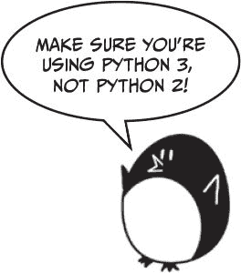

# 一个讲笑话的节目

> 原文：<https://inventwithpython.com/invent4thed/chapter4.html>


这一章的程序给用户讲了几个笑话，并演示了用 print() 函数使用字符串的更高级的方法。本书中的大多数游戏都有简单的输入和输出文本。用户在键盘上输入，输出是显示在屏幕上的文本。

**本章涵盖的主题**

转义字符

对字符串使用单引号和双引号

使用 print() 的 end 关键字参数跳过换行符

你已经学会了如何用 print() 函数显示简单的文本输出。现在让我们更深入地看看字符串和 print() 在 Python 中是如何工作的。

### **笑话示例**

以下是用户运行笑话程序时看到的内容:

```py
What do you get when you cross a snowman with a vampire?
Frostbite!

What do dentists call an astronaut's cavity?
A black hole!

Knock knock.
Who's there?
Interrupting cow.
Interrupting cow wh-MOO!
```

### **笑话源代码**

点击**文件**  **新建窗口**，打开一个新的文件编辑器窗口。在出现的空白窗口中，输入源代码，保存为*笑话. py* 。然后按 F5 运行程序。



如果你输入这个代码后出现错误，在用在线比较工具将你输入的代码与书中的代码进行比较。

*笑话. py*

```py
 1\. print('What do you get when you cross a snowman with a vampire?')
 2\. input()
 3\. print('Frostbite!')
 4\. print()
 5\. print('What do dentists call an astronaut\'s cavity?')
 6\. input()
 7\. print('A black hole!')
 8\. print()
 9\. print('Knock knock.')
10\. input()
11\. print("Who's there?")
12\. input()
13\. print('Interrupting cow.')
14\. input()
15\. print('Interrupting cow wh', end='')
16\. print('-MOO!')
```

### **代码如何工作**

让我们先来看看前四行代码:

```py
1\. print('What do you get when you cross a snowman with a vampire?')
2\. input()
3\. print('Frostbite!')
4\. print()
```

第 1 行和第 3 行使用 print() 函数调用提问，给出第一个笑话的答案。您不希望用户立即阅读笑话的笑点，所以在第一个 print() 实例之后有一个对 input() 函数的调用。用户将阅读笑话，按<small class="calibre11">进入</small>，然后阅读笑点。

用户仍然可以输入一个字符串并按下 <small class="calibre11">ENTER</small> ，但是这个返回的字符串没有存储在任何变量中。程序将会忘记它，转到下一行代码。

最后一个 print() 函数调用没有字符串参数。这告诉程序只打印一个空行。空行有助于避免文本看起来拥挤。

### **转义字符**

第 5 行到第 8 行打印下一个笑话的问题和答案:

```py
5\. print('What do dentists call an astronaut\'s cavity?')
6\. input()
7\. print('A black hole!')
8\. print()
```

在第 5 行，单引号前有一个反斜杠: \' 。(注意， \ 是反斜杠， / 是正斜杠。)这个反斜杠告诉你它后面的字母是转义字符。一个*转义字符*允许您打印难以或不可能输入到源代码中的特殊字符，例如以单引号开始和结束的字符串值中的单引号。

在这种情况下，如果我们不包括反斜杠，那么宇航员的中的单引号将被解释为字符串的结尾。但是这个引用需要成为字符串中的*部分。转义的单引号告诉 Python 应该在字符串中包含单引号。*

但是如果你真的想显示一个反斜杠呢？

从你的*笑话. py* 程序切换到交互 shell，输入这个 print() 语句:

```py
>>> print('They flew away in a green\teal helicopter.')
They flew away in a green    eal helicopter.
```

这条指令没有打印反斜杠，因为 teal 中的 t 被解释为转义字符，因为它跟在反斜杠后面。 \t 模拟按下键盘上的<small class="calibre11">键</small>。

这一行将给出正确的输出:

```py
>>> print('They flew away in a green\\teal helicopter.')
They flew away in a green\teal helicopter.
```

这样 \\ 就是一个反斜杠字符，没有 \t 解释为 <small class="calibre11">TAB</small> 。

[表 4-1](#calibre_link-817) 是 Python 中一些转义字符的列表，包括 \n ，也就是你之前用过的换行符。

**表 4-1:** 转义字符

| **转义字符** | **实际打印的是什么** |
| --- | --- |
| \\ | 反斜杠( \ ) |
| \' | 单引号( ' ) |
| \" | 双引号( " ) |
| \n | 新行 |
| \t | 标签 |

Python 中还有一些转义字符，但这些是你在创建游戏时最有可能需要的字符。

### **单引号和双引号**

当我们还在交互式 shell 中时，让我们仔细看看引号。在 Python 中，字符串不一定要放在单引号中。您也可以将它们放在双引号中。这两行打印了相同的内容:

```py
>>> print('Hello world')
Hello world
>>> print("Hello world")
Hello world
```

但是你不能混合引用。这一行会给您一个错误，因为它同时使用了两种报价类型:

```py
>>> print('Hello world")
SyntaxError: EOL while scanning single-quoted string
```

我喜欢使用单引号，这样我就不必按住 <small class="calibre11">SHIFT</small> 来键入它们。它们更容易键入，Python 不在乎这两种方式。

还要注意，正如您需要 \' 在单引号包围的字符串中有一个单引号一样，您需要 \" 在双引号包围的字符串中有一个双引号。看看这个例子:

```py
>>> print('I asked to borrow Abe\'s car for a week. He said, "Sure."')
I asked to borrow Abe's car for a week. He said, "Sure."
```

您使用单引号将字符串括起来，因此您需要在 Abe 的中的单引号前添加一个反斜杠。但是中的双引号“当然”不需要反斜杠。Python 解释器非常聪明，它知道如果一个字符串以一种类型的引号开始，另一种类型的引号并不意味着该字符串结束。

现在看看另一个例子:

```py
>>> print("She said, \"I can't believe you let them borrow your car.\"")
She said, "I can't believe you let them borrow your car."
```

字符串用双引号括起来，所以需要为字符串中的所有双引号加上反斜杠。不需要转义不能中的单引号。

总结一下，在单引号字符串中，不需要转义双引号但是需要转义单引号，在双引号字符串中，不需要转义单引号但是需要转义双引号。

### **print()函数的 end 关键字参数**

现在让我们回到*笑话. py* 来看看第 9 到 16 行:

```py
 9\. print('Knock knock.')
10\. input()
11\. print("Who's there?")
12\. input()
13\. print('Interrupting cow.')
14\. input()
15\. print('Interrupting cow wh', end='')
16\. print('-MOO!')
```

您注意到第 15 行的 print() 函数中的第二个参数了吗？通常， print() 会在它打印的字符串末尾添加一个换行符。这就是为什么空白的 print() 函数只会打印一个换行符。但是 print() 可以可选第二个参数: end 。

请记住，参数是函数调用中传递的值。传递给 print() 的空白字符串称为*关键字参数*。 end='' 中的 end 称为*关键字参数*。要将关键字参数传递给该关键字参数，必须在它前面键入 end= 。

当我们运行这段代码时，输出是

```py
Knock knock.
Who's there?
Interrupting cow.
Interrupting cow wh-MOO!
```

因为我们向 end 参数传递了一个空字符串，所以 print() 函数将添加一个空字符串，而不是添加一个换行符。这就是为什么’——哞！出现在前一行的旁边，而不是在自己的行上。在打印出‘Interrupting cow wh’字符串后没有换行符。

### **总结**

本章探讨了使用 print() 函数的不同方式。转义字符用于难以用键盘键入代码的字符。如果要在字符串中使用特殊字符，必须使用反斜杠转义字符 \ ，后跟另一个字母作为特殊字符。例如， \n 将是一个换行符。如果你的特殊字符是反斜杠本身，你使用 \\ 。

函数的作用是:自动在一个字符串的末尾添加一个换行符。大多数时候，这是一条有用的捷径。但是有时候你不想要换行符。要改变这一点，您可以传递一个空字符串作为 print() 的 end 关键字参数的关键字参数。例如，要在没有换行符的情况下将垃圾邮件打印到屏幕上，可以调用 print('spam '，end='') 。